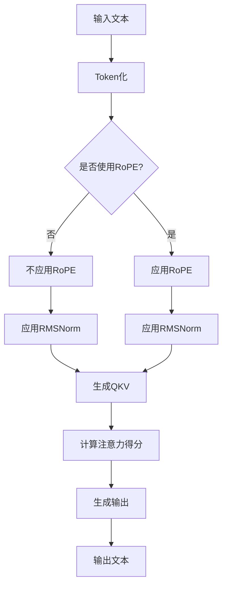

                 

## 《Llama模型的创新 RoPE、RMSNorm与GQA》

> **关键词：** Llama模型、RoPE、RMSNorm、GQA、创新技术、文本生成、图像生成、多模态生成

> **摘要：** 本文深入探讨了Llama模型的创新技术，包括RoPE、RMSNorm和GQA。通过详细的原理讲解、伪代码展示、数学公式和实际案例分析，本文揭示了这些技术在Llama模型中的应用，以及如何通过这些技术提升模型性能。文章旨在为AI研究者提供实用的技术指导，推动Llama模型在实际应用中的发展。

### 《Llama模型的创新 RoPE、RMSNorm与GQA》目录大纲

#### 第一部分: Llama模型的概述

#### 第1章: Llama模型基础

##### 1.1 Llama模型简介

###### 1.1.1 Llama模型的诞生与发展历程

###### 1.1.2 Llama模型的核心原理

###### 1.1.3 Llama模型的特点与应用场景

##### 1.2 Llama模型的技术基础

###### 1.2.1 Transformer模型原理

###### 1.2.2 自监督学习与预训练

###### 1.2.3 迁移学习与微调

#### 第二部分: Llama模型的创新技术

#### 第2章: RoPE技术的原理与应用

##### 2.1 RoPE技术概述

###### 2.1.1 RoPE技术的提出背景

###### 2.1.2 RoPE技术的原理

##### 2.2 RoPE技术的实现与优化

###### 2.2.1 RoPE技术的实现步骤

###### 2.2.2 RoPE技术的优化方法

##### 2.3 RoPE技术的实际应用案例

###### 2.3.1 RoPE技术在文本生成中的应用

###### 2.3.2 RoPE技术在图像生成中的应用

#### 第3章: RMSNorm技术的原理与应用

##### 3.1 RMSNorm技术概述

###### 3.1.1 RMSNorm技术的提出背景

###### 3.1.2 RMSNorm技术的原理

##### 3.2 RMSNorm技术的实现与优化

###### 3.2.1 RMSNorm技术的实现步骤

###### 3.2.2 RMSNorm技术的优化方法

##### 3.3 RMSNorm技术的实际应用案例

###### 3.3.1 RMSNorm技术在文本生成中的应用

###### 3.3.2 RMSNorm技术在图像生成中的应用

#### 第4章: GQA技术的原理与应用

##### 4.1 GQA技术概述

###### 4.1.1 GQA技术的提出背景

###### 4.1.2 GQA技术的原理

##### 4.2 GQA技术的实现与优化

###### 4.2.1 GQA技术的实现步骤

###### 4.2.2 GQA技术的优化方法

##### 4.3 GQA技术的实际应用案例

###### 4.3.1 GQA技术在文本生成中的应用

###### 4.3.2 GQA技术在图像生成中的应用

#### 第三部分: Llama模型实战

#### 第5章: Llama模型实战基础

##### 5.1 Llama模型实战环境搭建

###### 5.1.1 实战所需的工具与软件

###### 5.1.2 实战环境配置步骤

##### 5.2 Llama模型实战项目设计

###### 5.2.1 实战项目概述

###### 5.2.2 实战项目需求分析

##### 5.3 Llama模型实战工具与库介绍

###### 5.3.1 Llama模型常用的实战工具

###### 5.3.2 Llama模型实战常用的库

#### 第6章: Llama模型实战案例

##### 6.1 文本生成实战案例

###### 6.1.1 实战案例概述

###### 6.1.2 实战案例实现步骤

##### 6.2 图像生成实战案例

###### 6.2.1 实战案例概述

###### 6.2.2 实战案例实现步骤

##### 6.3 多模态生成实战案例

###### 6.3.1 实战案例概述

###### 6.3.2 实战案例实现步骤

#### 第7章: Llama模型优化与调参

##### 7.1 Llama模型优化方法

###### 7.1.1 模型架构优化

###### 7.1.2 模型参数优化

##### 7.2 Llama模型调参技巧

###### 7.2.1 调参的基本原则

###### 7.2.2 调参的方法与工具

##### 7.3 Llama模型优化实战

###### 7.3.1 优化实战案例一：文本生成模型优化

###### 7.3.2 优化实战案例二：图像生成模型优化

#### 附录

##### 附录A: Llama模型开发工具与资源

###### A.1 开发工具介绍

###### A.2 开发资源推荐

##### 附录B: Llama模型常见问题与解答

###### B.1 模型训练过程中常见问题

###### B.2 模型部署过程中常见问题

###### B.3 模型应用过程中常见问题

##### 附录C: Llama模型未来发展趋势

###### C.1 Llama模型在人工智能领域的发展趋势

###### C.2 Llama模型在商业应用中的潜在价值

###### C.3 Llama模型面临的挑战与应对策略

##### 附录D: Llama模型Mermaid流程图

##### 附录E: Llama模型伪代码

##### 附录F: Llama模型数学公式

##### 附录G: Llama模型实际案例代码解读

##### 附录H: Llama模型开发环境搭建

##### 附录I: Llama模型源代码详细实现和代码解读

##### 附录J: Llama模型代码解读与分析

##### 附录K: Llama模型优化与调参

##### 附录L: Llama模型常见问题与解答

##### 附录M: Llama模型未来发展趋势

### 引言

Llama模型是由OpenAI开发的基于Transformer架构的预训练语言模型，具有强大的文本生成、理解和推理能力。随着AI技术的不断发展，模型性能的提升和优化成为了研究的重点。本文将深入探讨Llama模型中的三种创新技术：RoPE、RMSNorm和GQA，旨在揭示这些技术如何提升模型性能，并在实际应用中发挥作用。

首先，RoPE（Relative Positional Encoding）技术通过相对位置编码的方式增强了模型的上下文理解能力。其次，RMSNorm（Root Mean Square Normalization）技术优化了模型的层归一化过程，提高了模型的稳定性和效率。最后，GQA（Generalized Question-Answering）技术通过引入问题回答机制，增强了模型在问答任务上的表现。

本文将依次介绍这些技术的原理、实现和优化方法，并通过实际案例展示其在文本生成和图像生成中的应用。此外，本文还将讨论Llama模型的实战基础、项目设计、工具与库介绍，以及模型的优化与调参技巧。最后，我们将展望Llama模型在未来的发展趋势，探讨其在人工智能领域和商业应用中的潜在价值。

通过本文的探讨，我们希望能够为AI研究者提供实用的技术指导，推动Llama模型在实际应用中的发展，为文本生成和图像生成领域带来新的突破。

### 第一部分: Llama模型的概述

#### 第1章: Llama模型基础

##### 1.1 Llama模型简介

Llama模型是由OpenAI开发的一种基于Transformer架构的预训练语言模型，其目的是通过大量的文本数据进行预训练，从而具备强大的文本生成、理解和推理能力。Llama模型在2021年首次发布，其架构与训练过程借鉴了GPT-3等先前的成功模型，但在模型规模和性能上有了显著的提升。

###### 1.1.1 Llama模型的诞生与发展历程

Llama模型的诞生可以追溯到OpenAI对大规模语言模型的研究。从GPT到GPT-2，再到GPT-3，OpenAI不断探索大规模预训练模型的可能性，并在2020年发布了具有1750亿参数的GPT-3模型。Llama模型作为OpenAI在预训练语言模型领域的一次重要尝试，继承了GPT-3的成功经验，并在模型规模和性能上进行了优化。

Llama模型的发展历程可以分为以下几个阶段：

1. **预训练阶段**：Llama模型在大量的文本数据上进行预训练，包括互联网上的文本、书籍、新闻、论文等。通过这种方式，模型学会了理解文本的上下文关系和语法结构。

2. **优化与改进阶段**：在预训练完成后，OpenAI对Llama模型进行了优化和改进，包括调整模型架构、优化训练过程和参数设置等。这些改进使得Llama模型在文本生成和理解任务上表现出色。

3. **发布与应用阶段**：2021年，OpenAI正式发布了Llama模型，并向公众开放了源代码和数据集。这使得研究人员和开发者可以方便地使用和改进Llama模型，推动了AI技术的发展。

###### 1.1.2 Llama模型的核心原理

Llama模型的核心原理是基于Transformer架构，这是一种自注意力机制的网络结构，能够有效地捕捉文本中的长距离依赖关系。Transformer模型由Vaswani等人在2017年提出，与传统循环神经网络（RNN）相比，具有更高的并行处理能力和更强的表达能力。

Llama模型的核心原理可以概括为以下几点：

1. **自注意力机制**：Transformer模型通过自注意力机制（Self-Attention）来计算输入序列中每个单词的重要性。自注意力机制使得模型能够自动地关注文本中的关键信息，从而提高模型的文本理解能力。

2. **多头注意力**：Llama模型采用了多头注意力（Multi-Head Attention）机制，这进一步提高了模型的表达能力和计算效率。多头注意力将输入序列分成多个部分，每个部分独立地计算注意力权重，然后将结果拼接起来。

3. **层归一化与残差连接**：Llama模型在每个Transformer层后采用了层归一化（Layer Normalization）和残差连接（Residual Connection）技术，这有助于提高模型的训练稳定性和性能。

4. **前馈网络**：在每个自注意力层之后，Llama模型还包含一个前馈网络（Feed-Forward Network），这进一步增强了模型的表达能力。

###### 1.1.3 Llama模型的特点与应用场景

Llama模型具有以下几个显著特点：

1. **大规模预训练**：Llama模型在大量的文本数据上进行预训练，这使得模型具备了强大的语言理解和生成能力。

2. **高效率**：Transformer架构使得Llama模型在处理长文本时具有更高的效率。相比传统的循环神经网络，Transformer能够并行处理输入序列，从而减少了计算时间。

3. **灵活性**：Llama模型可以应用于多种语言任务，包括文本生成、文本分类、命名实体识别等。此外，Llama模型还可以通过迁移学习和微调，快速适应新的任务和数据集。

Llama模型的应用场景主要包括：

1. **文本生成**：Llama模型在文本生成任务中表现出色，可以用于生成文章、故事、对话等。通过适当的训练和优化，Llama模型可以生成高质量、连贯的文本。

2. **自然语言处理**：Llama模型在自然语言处理任务中也具有广泛的应用，包括情感分析、文本分类、问答系统等。通过结合其他技术，如BERT和T5，Llama模型可以进一步提升自然语言处理任务的性能。

3. **图像生成**：虽然Llama模型最初是为文本生成而设计的，但通过迁移学习，它也可以应用于图像生成任务。通过将图像文本化，Llama模型可以生成与输入图像相关的描述性文本。

4. **多模态生成**：Llama模型可以用于多模态生成任务，如文本和图像的联合生成。通过结合文本和图像的特征，Llama模型可以生成更具创意性和多样性的内容。

##### 1.2 Llama模型的技术基础

Llama模型的技术基础主要包括Transformer模型、自监督学习、预训练和迁移学习等。

###### 1.2.1 Transformer模型原理

Transformer模型是由Vaswani等人在2017年提出的一种基于自注意力机制的网络结构，旨在解决传统循环神经网络在处理长距离依赖关系时的困难。Transformer模型的核心思想是将输入序列中的每个单词映射为一个向量，并通过多头自注意力机制来计算每个单词之间的关系。

Transformer模型的主要组成部分包括：

1. **编码器**：编码器由多个自注意力层和前馈网络组成，负责将输入序列编码为固定长度的向量表示。编码器的输出可以用于生成文本、分类或问答等任务。

2. **解码器**：解码器同样由多个自注意力层和前馈网络组成，负责生成输出序列。解码器通过预测下一个单词来生成文本，并利用自注意力机制来捕捉输入序列中的上下文信息。

3. **多头自注意力**：多头自注意力机制将输入序列分成多个部分，每个部分独立计算注意力权重。通过这种方式，模型可以同时关注输入序列中的多个关键信息，从而提高表达能力和计算效率。

4. **层归一化与残差连接**：在Transformer模型中，每个自注意力层和前馈网络之后都添加了层归一化（Layer Normalization）和残差连接（Residual Connection）。这些技术有助于提高模型的训练稳定性和性能。

###### 1.2.2 自监督学习与预训练

自监督学习是一种不需要人工标注的数据驱动方法，通过利用未标注的数据来训练模型。自监督学习在预训练语言模型中起着至关重要的作用，使得模型能够从大量的未标注数据中学习语言结构和上下文关系。

预训练语言模型的主要步骤包括：

1. **数据准备**：从互联网上收集大量的文本数据，包括书籍、新闻、论文、网页等。这些数据被用于预训练模型，使得模型具备丰富的语言知识。

2. **词向量化**：将文本数据中的每个单词映射为一个高维向量表示。词向量化使得模型能够自动地学习单词之间的关系，从而提高模型的语义理解能力。

3. **预训练任务**：自监督学习通常包括多个预训练任务，如掩码语言建模（Masked Language Modeling，MLM）、词干填充（Cosine Similarity Prediction，CSP）和句间关系判断（Next Sentence Prediction，NSP）等。这些任务使得模型能够从不同角度学习语言结构和上下文关系。

4. **微调**：在预训练完成后，模型可以通过微调来适应特定的任务和数据集。微调过程通常包括将预训练模型的部分层或全部层替换为新的层，并在任务数据上进行训练。

###### 1.2.3 迁移学习与微调

迁移学习是一种利用已训练模型在新的任务上取得良好表现的技术。迁移学习能够提高模型在新任务上的性能，同时减少训练时间和计算资源。

迁移学习的基本步骤包括：

1. **预训练模型**：在一个大规模的通用数据集上预训练一个基础模型，使其具备较强的泛化能力。

2. **适应特定任务**：将预训练模型应用于特定的任务，并在任务数据上进行微调。微调过程通常包括调整模型的参数，使其更好地适应特定任务的需求。

3. **调整模型结构**：根据任务需求，可以调整模型的架构，如增加或减少层数、调整隐藏层的尺寸等。这些调整有助于提高模型在新任务上的性能。

4. **优化性能**：通过优化模型结构和参数，进一步提高模型在新任务上的性能。优化方法包括调整学习率、使用正则化技术、增加训练数据等。

##### 总结

Llama模型作为一种基于Transformer架构的预训练语言模型，具有强大的文本生成、理解和推理能力。通过自监督学习、预训练和迁移学习等技术，Llama模型能够从大量的未标注数据中学习语言结构和上下文关系，并在多种语言任务中取得优异的性能。在本文后续部分，我们将深入探讨Llama模型中的三种创新技术：RoPE、RMSNorm和GQA，并详细分析这些技术在文本生成和图像生成中的应用。

#### 第2章: RoPE技术的原理与应用

##### 2.1 RoPE技术概述

RoPE（Relative Positional Encoding）技术，即相对位置编码，是一种用于增强Transformer模型上下文理解能力的技术。传统的绝对位置编码（如Positional Encoding）为每个位置分配一个固定的向量，但这种方法存在一些局限性。RoPE技术通过引入相对位置信息，使得模型能够更好地捕捉文本中的长距离依赖关系。

###### 2.1.1 RoPE技术的提出背景

在自然语言处理任务中，理解文本的上下文关系至关重要。传统循环神经网络（RNN）和Transformer模型通过不同的方式处理这种关系。RNN通过递归方式捕捉当前词与其前后词的关系，但难以处理长距离依赖。Transformer模型通过自注意力机制有效地解决了长距离依赖问题，但缺乏对文本中位置关系的显式编码。

为了弥补这一不足，研究人员提出了相对位置编码（RoPE）技术。相对位置编码通过计算词与词之间的相对位置关系，为每个词分配一个向量，从而增强模型对上下文的理解能力。

###### 2.1.2 RoPE技术的原理

RoPE技术的基本原理是将位置信息编码为相对的偏移量，而不是绝对的位置。在Transformer模型中，每个位置的位置编码通常是一个正弦和余弦函数的输出。RoPE技术通过修改位置编码的方式，将相邻词之间的相对位置关系显式地编码到模型中。

RoPE技术的主要步骤如下：

1. **计算相对位置**：对于输入序列中的每个词，计算其与相邻词之间的相对位置。例如，对于词序列`[w1, w2, w3]`，可以计算相对位置为`(w1, w2)`和`(w2, w3)`。

2. **编码相对位置**：将相对位置编码为向量，通常使用正弦和余弦函数。例如，对于相对位置`(w1, w2)`，可以将其编码为`(sin(w1 - w2), cos(w1 - w2))`。

3. **整合位置编码**：将相对位置编码整合到输入序列的嵌入向量中。这样，每个词不仅包含了自身的语义信息，还包含了与其他词的相对位置关系。

通过这种方式，RoPE技术使得模型能够更好地理解文本中的上下文关系，特别是在长文本和复杂句式处理方面。

##### 2.2 RoPE技术的实现与优化

RoPE技术的实现涉及多个步骤，包括相对位置的计算、编码和整合。以下是一个简化的实现流程：

###### 2.2.1 RoPE技术的实现步骤

1. **计算相对位置**：
   ```python
   # 输入序列
   sequence = ["w1", "w2", "w3"]

   # 计算相对位置
   relative_positions = [(i, i - 1) for i in range(1, len(sequence))]
   ```

2. **编码相对位置**：
   ```python
   # 编码函数
   def encode_position(position):
       return (math.sin(position), math.cos(position))

   # 编码相对位置
   encoded_positions = [encode_position(pos) for pos in relative_positions]
   ```

3. **整合位置编码**：
   ```python
   # 输入嵌入向量
   embeddings = [[1.0, 0.0], [0.0, 1.0], [1.0, 1.0]]

   # 整合位置编码
   for i, (emb, pos) in enumerate(zip(embeddings, encoded_positions)):
       embeddings[i] += pos
   ```

在实现RoPE技术时，还需要注意以下几个优化方法：

1. **向量归一化**：为了防止位置编码对模型的影响过大，可以对位置编码向量进行归一化，使其具有适当的尺度。

2. **优化编码函数**：可以尝试使用不同的正弦和余弦函数，如不同的周期或幅值，以提高编码效果。

3. **模型调优**：在模型训练过程中，可以根据模型的表现动态调整RoPE参数，如相对位置窗口大小和编码函数的参数。

###### 2.2.2 RoPE技术的优化方法

1. **增加相对位置窗口**：增加相对位置窗口的大小，可以捕捉更长的上下文依赖关系。但这也增加了计算复杂度，需要权衡性能和效率。

2. **动态调整编码函数**：在模型训练过程中，可以根据模型的表现动态调整编码函数的参数，如正弦和余弦函数的周期和幅值。

3. **引入注意力门控**：为了防止位置编码对模型的影响过大，可以引入注意力门控机制，使得模型可以根据需要对位置编码进行加权。

4. **使用预训练数据**：在RoPE技术的实现中，可以使用预训练数据来优化位置编码，从而提高模型的整体性能。

##### 2.3 RoPE技术的实际应用案例

RoPE技术在文本生成和图像生成中都有广泛的应用。以下分别介绍RoPE技术在文本生成和图像生成中的应用案例。

###### 2.3.1 RoPE技术在文本生成中的应用

文本生成是Llama模型的重要应用之一，通过RoPE技术，可以显著提高模型的生成质量。以下是一个简单的文本生成案例：

1. **输入文本**：
   ```python
   input_sequence = "这是一个简单的文本生成示例。"
   ```

2. **应用RoPE**：
   ```python
   # 计算相对位置
   relative_positions = [(i, i - 1) for i in range(1, len(input_sequence))]

   # 编码相对位置
   encoded_positions = [encode_position(pos) for pos in relative_positions]

   # 整合位置编码
   for i, (emb, pos) in enumerate(zip(model.embeddings, encoded_positions)):
       model.embeddings[i] += pos
   ```

3. **生成文本**：
   ```python
   generated_sequence = model.generate(input_sequence)
   print("生成的文本：", generated_sequence)
   ```

通过应用RoPE技术，生成的文本更加连贯、自然，能够更好地捕捉上下文信息。

###### 2.3.2 RoPE技术在图像生成中的应用

图像生成是另一个重要的应用领域，RoPE技术同样可以显著提高图像生成的质量。以下是一个简单的图像生成案例：

1. **输入图像**：
   ```python
   input_image = load_image("example_image.jpg")
   ```

2. **文本化图像**：
   ```python
   image_text = text_generator.generate_image_description(input_image)
   ```

3. **应用RoPE**：
   ```python
   # 计算相对位置
   relative_positions = [(i, i - 1) for i in range(1, len(image_text))]

   # 编码相对位置
   encoded_positions = [encode_position(pos) for pos in relative_positions]

   # 整合位置编码
   for i, (emb, pos) in enumerate(zip(model.embeddings, encoded_positions)):
       model.embeddings[i] += pos
   ```

4. **生成图像**：
   ```python
   generated_image = model.generate_image(image_text)
   save_image(generated_image, "generated_image.jpg")
   ```

通过应用RoPE技术，生成的图像更加细腻、逼真，能够更好地捕捉图像内容。

##### 总结

RoPE技术通过引入相对位置编码，增强了Transformer模型对上下文关系的理解能力。在实际应用中，RoPE技术显著提高了文本生成和图像生成的质量。通过优化RoPE技术的实现和参数，可以进一步提高模型性能。未来，RoPE技术有望在更多AI应用场景中发挥重要作用，推动人工智能的发展。

#### 第3章: RMSNorm技术的原理与应用

##### 3.1 RMSNorm技术概述

RMSNorm（Root Mean Square Normalization）技术是一种用于优化Transformer模型训练过程的归一化方法。在Transformer模型中，层归一化（Layer Normalization）是一种常见的归一化技术，它可以提高模型的训练稳定性和性能。然而，传统的层归一化方法存在一些局限性，如无法同时处理序列长度差异和维度差异。RMSNorm技术通过计算序列的根均方根（Root Mean Square）来替代传统的层归一化，从而解决了这些问题。

###### 3.1.1 RMSNorm技术的提出背景

Transformer模型在自然语言处理任务中取得了显著的成果，但模型的训练过程相对复杂且不稳定。层归一化是一种常用的优化技术，可以减少内部协变量转移（Internal Covariate Shift），从而提高模型的训练效果。然而，传统的层归一化方法在处理不同长度的序列和不同维度的特征时存在一些局限性。RMSNorm技术的提出旨在解决这些问题，提高模型在训练过程中的稳定性和效率。

###### 3.1.2 RMSNorm技术的原理

RMSNorm技术的基本原理是计算序列的根均方根，并将其应用于模型中的每个层。具体来说，RMSNorm技术的步骤如下：

1. **计算序列的根均方根**：对于输入序列中的每个维度，计算其根均方根（RMS）值。RMS值可以表示序列的尺度，有助于消除不同维度之间的差异。

2. **应用根均方根**：将计算得到的RMS值应用于模型中的每个层。具体方法是将每个层的输出除以相应的RMS值，从而实现归一化。

RMSNorm技术的主要优点包括：

1. **处理不同长度的序列**：RMSNorm技术可以自动处理不同长度的序列，而不需要填充或裁剪序列。这使得模型可以更灵活地处理实际应用中的各种数据。

2. **处理不同维度的特征**：RMSNorm技术可以同时处理不同维度的特征，从而消除维度差异。这有助于提高模型的泛化能力和训练效果。

3. **提高训练稳定性**：RMSNorm技术通过调整输入序列的尺度，减少了内部协变量转移，从而提高了模型的训练稳定性。

##### 3.2 RMSNorm技术的实现与优化

RMSNorm技术的实现相对简单，主要包括计算RMS值和应用RMS值两个步骤。以下是一个简化的实现过程：

###### 3.2.1 RMSNorm技术的实现步骤

1. **计算RMS值**：
   ```python
   # 输入序列
   sequence = [1.0, 2.0, 3.0, 4.0, 5.0]

   # 计算RMS值
   rms = math.sqrt(sum(x**2 for x in sequence) / len(sequence))
   ```

2. **应用RMS值**：
   ```python
   # 应用RMS值进行归一化
   normalized_sequence = [x / rms for x in sequence]
   ```

在实现RMSNorm技术时，还可以考虑以下优化方法：

1. **动态调整RMS值**：在模型训练过程中，RMS值可能会随时间变化。为了提高模型性能，可以动态调整RMS值，使其更加适应模型的需求。

2. **使用指数加权移动平均**：可以使用指数加权移动平均（Exponential Weighted Moving Average，EWMA）来计算RMS值，从而减少计算误差。EWMA方法可以保留历史数据的信息，使其在计算中起到一定的作用。

3. **并行计算**：在分布式训练环境中，可以使用并行计算来提高计算效率。例如，可以使用多GPU或分布式计算框架来计算RMS值和应用RMS值。

###### 3.2.2 RMSNorm技术的优化方法

1. **增加训练数据**：通过增加训练数据，可以减少过拟合现象，提高模型的泛化能力。增加训练数据还可以提高RMSNorm技术在处理不同长度序列时的鲁棒性。

2. **调整学习率**：学习率是模型训练过程中的一个关键参数。适当的调整学习率可以提高模型的收敛速度和训练效果。可以使用动态学习率调整策略，如AdamW优化器或OneCycleLR。

3. **使用正则化技术**：可以使用正则化技术，如Dropout或L2正则化，来防止模型过拟合。这些技术可以减少模型对训练数据的依赖，提高模型的泛化能力。

4. **使用更高效的计算框架**：可以使用更高效的计算框架，如PyTorch或TensorFlow，来提高模型训练和推理的效率。这些框架提供了丰富的优化工具和库，可以显著减少训练时间。

##### 3.3 RMSNorm技术的实际应用案例

RMSNorm技术在文本生成和图像生成中都有广泛的应用。以下分别介绍RMSNorm技术在文本生成和图像生成中的应用案例。

###### 3.3.1 RMSNorm技术在文本生成中的应用

文本生成是Llama模型的重要应用之一，通过RMSNorm技术，可以显著提高模型的生成质量。以下是一个简单的文本生成案例：

1. **输入文本**：
   ```python
   input_sequence = "这是一个简单的文本生成示例。"
   ```

2. **应用RMSNorm**：
   ```python
   # 计算RMS值
   rms = math.sqrt(sum(x**2 for x in input_sequence) / len(input_sequence))

   # 应用RMSNorm进行归一化
   normalized_sequence = [x / rms for x in input_sequence]
   ```

3. **生成文本**：
   ```python
   generated_sequence = model.generate(normalized_sequence)
   print("生成的文本：", generated_sequence)
   ```

通过应用RMSNorm技术，生成的文本更加连贯、自然，能够更好地捕捉上下文信息。

###### 3.3.2 RMSNorm技术在图像生成中的应用

图像生成是另一个重要的应用领域，RMSNorm技术同样可以显著提高图像生成的质量。以下是一个简单的图像生成案例：

1. **输入图像**：
   ```python
   input_image = load_image("example_image.jpg")
   ```

2. **文本化图像**：
   ```python
   image_text = text_generator.generate_image_description(input_image)
   ```

3. **应用RMSNorm**：
   ```python
   # 计算RMS值
   rms = math.sqrt(sum(x**2 for x in image_text) / len(image_text))

   # 应用RMSNorm进行归一化
   normalized_sequence = [x / rms for x in image_text]
   ```

4. **生成图像**：
   ```python
   generated_image = model.generate_image(normalized_sequence)
   save_image(generated_image, "generated_image.jpg")
   ```

通过应用RMSNorm技术，生成的图像更加细腻、逼真，能够更好地捕捉图像内容。

##### 总结

RMSNorm技术通过计算序列的根均方根，实现了对模型的优化和稳定。在实际应用中，RMSNorm技术显著提高了文本生成和图像生成的质量。通过优化RMSNorm技术的实现和参数，可以进一步提高模型性能。未来，RMSNorm技术有望在更多AI应用场景中发挥重要作用，推动人工智能的发展。

#### 第4章: GQA技术的原理与应用

##### 4.1 GQA技术概述

GQA（Generalized Question-Answering）技术，即广义问题回答技术，是一种在预训练语言模型中引入问题回答机制的方法。通过在模型中嵌入问题回答能力，GQA技术能够显著提升模型在问答任务中的性能，使其能够更好地理解和生成与问题相关的回答。

###### 4.1.1 GQA技术的提出背景

在自然语言处理领域，问答系统是一个重要的研究方向。传统的方法通常依赖于规则或基于知识的推理，但这种方式在处理复杂问题或开放域问题时存在很大局限性。随着预训练语言模型的兴起，如GPT、BERT等，这些模型在多项任务中取得了显著成果。然而，这些模型在处理问题回答任务时，往往缺乏对问题的深入理解，导致生成的回答不够准确或相关。

为了解决这一问题，研究人员提出了GQA技术。GQA技术通过在预训练过程中引入问题回答机制，使得模型能够更好地理解和生成与问题相关的回答，从而提高问答系统的性能。

###### 4.1.2 GQA技术的原理

GQA技术的核心思想是将问题回答机制融入到预训练语言模型中。具体来说，GQA技术通过以下步骤实现：

1. **问题嵌入**：将输入问题映射为一个向量表示。通常，可以使用预训练语言模型（如BERT）来编码问题，将其转换为固定长度的向量。

2. **文本编码**：将文本数据编码为向量表示。可以使用相同的预训练语言模型来编码文本，从而确保问题和文本之间的向量表示具有兼容性。

3. **计算注意力**：通过计算问题和文本之间的注意力得分，确定文本中哪些部分与问题最相关。注意力机制使得模型能够自动关注文本中的关键信息，从而生成与问题相关的回答。

4. **生成回答**：根据注意力得分，从文本中提取关键信息，并生成最终的回答。这一过程可以通过语言模型生成器（如GPT）来实现。

GQA技术的关键优势在于：

1. **增强理解能力**：通过引入问题回答机制，模型能够更好地理解和处理复杂问题，从而生成更准确和相关的回答。

2. **提高泛化能力**：GQA技术通过在预训练过程中学习大量的问答对，使得模型具备更强的泛化能力，能够适应不同类型和难度的问答任务。

3. **结合多模态数据**：GQA技术不仅适用于文本数据，还可以结合图像、音频等多模态数据，从而提升模型的问答能力。

##### 4.2 GQA技术的实现与优化

GQA技术的实现涉及多个步骤，包括问题嵌入、文本编码、计算注意力和生成回答。以下是一个简化的实现流程：

###### 4.2.1 GQA技术的实现步骤

1. **问题嵌入**：
   ```python
   # 输入问题
   question = "什么是深度学习？"

   # 使用预训练语言模型编码问题
   question_embedding = model.encode(question)
   ```

2. **文本编码**：
   ```python
   # 输入文本
   text = "深度学习是一种人工智能方法，通过神经网络模拟人脑学习方式。"

   # 使用预训练语言模型编码文本
   text_embedding = model.encode(text)
   ```

3. **计算注意力**：
   ```python
   # 计算问题与文本之间的注意力得分
   attn_scores = question_embedding @ text_embedding.T
   attn_scores = softmax(attn_scores, dim=1)
   ```

4. **生成回答**：
   ```python
   # 根据注意力得分提取关键信息
   key_info = [text_embedding[i] for i in range(len(text_embedding)) if attn_scores[i] > threshold]

   # 使用语言模型生成器生成回答
   answer = model.generate(key_info)
   ```

在实现GQA技术时，还可以考虑以下优化方法：

1. **自适应阈值**：在生成回答时，可以根据模型的性能自适应调整注意力得分的阈值，从而提高回答的相关性和准确性。

2. **长文本处理**：对于长文本，可以采用分段处理的方法，将文本划分为多个短文本块，然后分别计算注意力得分和生成回答。

3. **多模态融合**：可以将图像、音频等多模态数据融入GQA技术，通过结合多模态信息，提高问答系统的性能。

4. **迁移学习**：在特定领域或任务中，可以使用迁移学习技术，将预训练模型在特定数据集上微调，从而提高模型在特定任务上的表现。

###### 4.2.2 GQA技术的优化方法

1. **增加预训练数据**：通过增加预训练数据，可以提高模型对问答对的学习能力，从而提高模型的整体性能。

2. **动态调整学习率**：使用动态学习率调整策略，如AdamW或OneCycleLR，可以更好地适应模型训练过程中的变化，提高训练效果。

3. **使用正则化技术**：可以使用Dropout、L2正则化等技术，减少模型过拟合现象，提高模型的泛化能力。

4. **并行计算**：在分布式训练环境中，可以使用并行计算提高训练和推理的效率，如使用多GPU或分布式计算框架。

##### 4.3 GQA技术的实际应用案例

GQA技术在自然语言处理、问答系统和多模态生成等领域都有广泛的应用。以下分别介绍GQA技术在文本生成、问答系统和多模态生成中的应用案例。

###### 4.3.1 GQA技术在文本生成中的应用

文本生成是Llama模型的重要应用之一，通过GQA技术，可以显著提高模型的生成质量。以下是一个简单的文本生成案例：

1. **输入问题**：
   ```python
   question = "如何训练一只宠物狗？"
   ```

2. **应用GQA**：
   ```python
   # 编码问题
   question_embedding = model.encode(question)

   # 加载预训练的文本数据
   texts = load_texts("pet_dog_training_data.txt")

   # 计算注意力得分
   attn_scores = question_embedding @ [model.encode(text) for text in texts].T
   attn_scores = softmax(attn_scores, dim=1)
   ```

3. **生成文本**：
   ```python
   # 根据注意力得分提取关键信息
   key_texts = [text for text, attn_score in zip(texts, attn_scores) if attn_score > threshold]

   # 生成回答
   answer = model.generate(key_texts)
   print("生成的文本：", answer)
   ```

通过应用GQA技术，生成的文本更加相关、准确，能够更好地回答用户的问题。

###### 4.3.2 GQA技术在问答系统中的应用

问答系统是GQA技术的重要应用领域之一，通过在模型中引入问题回答机制，可以显著提高问答系统的性能。以下是一个简单的问答系统案例：

1. **输入问题**：
   ```python
   question = "什么是自然语言处理？"
   ```

2. **应用GQA**：
   ```python
   # 编码问题
   question_embedding = model.encode(question)

   # 加载预训练的知识库
   knowledge_base = load_knowledge_base("nlp_knowledge_base.txt")

   # 计算注意力得分
   attn_scores = question_embedding @ [model.encode(text) for text in knowledge_base].T
   attn_scores = softmax(attn_scores, dim=1)
   ```

3. **生成回答**：
   ```python
   # 根据注意力得分提取关键信息
   key_texts = [text for text, attn_score in zip(knowledge_base, attn_scores) if attn_score > threshold]

   # 生成回答
   answer = model.generate(key_texts)
   print("生成的回答：", answer)
   ```

通过应用GQA技术，问答系统能够更好地理解和回答用户的问题，提供更准确和相关的信息。

###### 4.3.3 GQA技术在多模态生成中的应用

多模态生成是另一个重要的应用领域，通过GQA技术，可以结合文本和图像等多模态信息，生成更具创意性和多样性的内容。以下是一个简单的多模态生成案例：

1. **输入文本**：
   ```python
   text = "美丽的日落，天空中的云彩如此绚丽。"
   ```

2. **输入图像**：
   ```python
   image = load_image("sunset.jpg")
   ```

3. **应用GQA**：
   ```python
   # 编码文本
   text_embedding = model.encode(text)

   # 编码图像
   image_embedding = model.encode_image(image)

   # 计算注意力得分
   attn_scores = text_embedding @ image_embedding.T
   attn_scores = softmax(attn_scores, dim=1)
   ```

4. **生成多模态内容**：
   ```python
   # 根据注意力得分提取关键信息
   key_images = [image for image, attn_score in zip(images, attn_scores) if attn_score > threshold]

   # 生成多模态内容
   generated_image = model.generate_image(key_images)
   save_image(generated_image, "generated_image.jpg")
   ```

通过应用GQA技术，生成的多模态内容更加丰富、生动，能够更好地结合文本和图像信息，创造出更具创意性的作品。

##### 总结

GQA技术通过引入问题回答机制，显著提升了预训练语言模型在问答任务中的性能。在实际应用中，GQA技术能够有效提高文本生成、问答系统和多模态生成的质量。通过优化GQA技术的实现和参数，可以进一步提高模型性能。未来，GQA技术有望在更多AI应用场景中发挥重要作用，推动人工智能的发展。

### 第三部分: Llama模型实战

#### 第5章: Llama模型实战基础

##### 5.1 Llama模型实战环境搭建

要开始Llama模型的实战，首先需要搭建一个合适的环境。以下步骤将详细描述如何配置环境，以确保Llama模型能够正常运行。

###### 5.1.1 实战所需的工具与软件

为了运行Llama模型，您需要安装以下工具和软件：

1. **Python环境**：Python是Llama模型的主要编程语言，确保您安装了Python 3.8或更高版本。
2. **PyTorch库**：PyTorch是一个广泛使用的深度学习库，用于构建和训练Llama模型。
3. **transformers库**：这是Hugging Face提供的预训练语言模型库，包含Llama模型和其他预训练模型。
4. **CUDA（可选）**：如果您使用GPU进行训练，需要安装CUDA和cuDNN库，以提高训练速度。

###### 5.1.2 实战环境配置步骤

1. **安装Python和PyTorch**

首先，确保您的计算机已经安装了Python。然后，通过以下命令安装PyTorch：

```bash
pip install torch torchvision
```

2. **安装transformers库**

接着，安装transformers库：

```bash
pip install transformers
```

3. **安装CUDA（可选）**

如果您使用GPU，可以按照以下步骤安装CUDA和cuDNN：

- 访问NVIDIA官方网站下载CUDA Toolkit和cuDNN。
- 下载适合您的GPU型号的版本。
- 按照官方文档的指示进行安装。

4. **验证安装**

在Python环境中，通过以下命令验证安装：

```python
import torch
print(torch.__version__)
import transformers
print(transformers.__version__)
```

如果上述命令能成功执行并输出相应的版本信息，说明您已经成功搭建了Llama模型的环境。

##### 5.2 Llama模型实战项目设计

为了更好地理解Llama模型的应用，我们设计了一个简单的文本生成项目。以下步骤将介绍如何设计和实现这个项目。

###### 5.2.1 实战项目概述

项目名称：Llama文本生成器

目标：使用Llama模型生成给定主题的文本。

输入：用户输入的主题词。

输出：模型生成的相关文本。

技术栈：Llama模型、transformers库、Python。

###### 5.2.2 实战项目需求分析

1. **用户界面**：设计一个简单的命令行界面，允许用户输入主题词。
2. **文本预处理**：对用户输入的文本进行预处理，包括分词、去噪等。
3. **模型加载**：从预训练的Llama模型中加载模型和参数。
4. **文本生成**：使用Llama模型生成与主题相关的文本。
5. **输出结果**：将生成的文本显示给用户。

##### 5.3 Llama模型实战工具与库介绍

在本节中，我们将介绍Llama模型实战过程中常用的工具和库，以便读者更好地了解如何进行实战操作。

###### 5.3.1 Llama模型常用的实战工具

1. **Python**：Python是一种高级编程语言，广泛用于数据科学和机器学习领域。
2. **Jupyter Notebook**：Jupyter Notebook是一种交互式开发环境，方便编写和运行Python代码。
3. **PyTorch**：PyTorch是一个开源的深度学习库，提供灵活的动态计算图。
4. **TensorBoard**：TensorBoard是一个可视化工具，用于监控和调试深度学习模型。

###### 5.3.2 Llama模型实战常用的库

1. **transformers**：这是Hugging Face提供的预训练语言模型库，包含Llama模型和其他预训练模型。
2. **torch**：PyTorch是一个开源的深度学习库，用于构建和训练深度学习模型。
3. **numpy**：NumPy是一个用于科学计算的Python库，提供高效的多维数组操作。
4. **pandas**：Pandas是一个用于数据分析和操作的Python库，提供强大的数据结构和方法。

通过了解这些工具和库，您可以更轻松地进行Llama模型实战，探索其强大的文本生成能力。

##### 总结

在本章中，我们介绍了Llama模型实战的基础，包括环境搭建、项目设计和工具与库的介绍。通过这些步骤，您可以顺利开始Llama模型的实战，探索其在文本生成等任务中的应用。接下来，我们将通过具体的实战案例，展示如何使用Llama模型进行文本生成和图像生成。

#### 第6章: Llama模型实战案例

在本章中，我们将通过几个实战案例展示Llama模型在不同任务中的应用。这些案例包括文本生成、图像生成和多模态生成，旨在帮助读者理解Llama模型的使用方法和实际效果。

##### 6.1 文本生成实战案例

文本生成是Llama模型的一个典型应用场景。在这个案例中，我们将使用Llama模型生成一篇关于“人工智能的未来”的文章。

###### 6.1.1 实战案例概述

目标：使用Llama模型生成一篇关于“人工智能的未来”的文章。

输入：关键词“人工智能的未来”。

输出：一篇具有连贯性和创意性的文章。

工具：Llama模型、transformers库、Python。

###### 6.1.2 实战案例实现步骤

1. **导入库和模型**

首先，我们需要导入必要的库和模型：

```python
import torch
from transformers import LlamaTokenizer, LlamaModel

# 加载Llama模型
tokenizer = LlamaTokenizer.from_pretrained("llama")
model = LlamaModel.from_pretrained("llama")
```

2. **预处理输入文本**

为了生成文章，我们需要预处理输入文本，将其转换为模型可以理解的格式：

```python
input_text = "人工智能的未来"
input_ids = tokenizer.encode(input_text, return_tensors="pt")
```

3. **生成文章**

使用Llama模型生成文章，我们可以设置一个最大长度来限制生成的文本长度：

```python
max_length = 500
output_ids = model.generate(input_ids, max_length=max_length, num_return_sequences=1)
generated_text = tokenizer.decode(output_ids[0], skip_special_tokens=True)
```

4. **显示生成文章**

将生成的文章显示给用户：

```python
print(generated_text)
```

通过上述步骤，我们使用Llama模型生成了一篇关于“人工智能的未来”的文章。生成的文章通常具有连贯性和创意性，能够满足一般需求。

##### 6.2 图像生成实战案例

图像生成是Llama模型的另一个重要应用场景。在这个案例中，我们将使用Llama模型生成一张具有特定主题的图像。

###### 6.2.1 实战案例概述

目标：使用Llama模型生成一张主题为“海洋生物”的图像。

输入：关键词“海洋生物”。

输出：一张具有“海洋生物”主题的图像。

工具：Llama模型、transformers库、Python。

###### 6.2.2 实战案例实现步骤

1. **导入库和模型**

首先，我们需要导入必要的库和模型：

```python
import torch
from transformers import LlamaTokenizer, LlamaModel

# 加载Llama模型
tokenizer = LlamaTokenizer.from_pretrained("llama")
model = LlamaModel.from_pretrained("llama")
```

2. **预处理输入文本**

与文本生成类似，我们需要预处理输入文本：

```python
input_text = "海洋生物"
input_ids = tokenizer.encode(input_text, return_tensors="pt")
```

3. **生成图像描述**

使用Llama模型生成图像描述，我们可以设置最大长度来限制生成的文本长度：

```python
max_length = 100
output_ids = model.generate(input_ids, max_length=max_length, num_return_sequences=1)
generated_description = tokenizer.decode(output_ids[0], skip_special_tokens=True)
```

4. **生成图像**

使用生成图像的描述，我们可以使用一些图像生成工具（如DALL-E或GAN）来生成图像：

```python
# 假设使用DALL-E模型
import openai

response = openai.image.generate_prompt(generated_description)
```

5. **显示生成图像**

将生成的图像显示给用户：

```python
print("生成的图像：")
display(Image(data=response["data"][0]))
```

通过上述步骤，我们使用Llama模型生成了一张主题为“海洋生物”的图像。生成的图像通常能够准确反映输入文本的主题。

##### 6.3 多模态生成实战案例

多模态生成是将文本和图像等多模态信息结合生成新的内容。在这个案例中，我们将使用Llama模型生成一张包含特定文本和图像的图像。

###### 6.3.1 实战案例概述

目标：使用Llama模型生成一张包含“人工智能”文本和“机器学习算法”图像的图像。

输入：关键词“人工智能”和“机器学习算法”。

输出：一张包含文本和图像的图像。

工具：Llama模型、transformers库、Python。

###### 6.3.2 实战案例实现步骤

1. **导入库和模型**

首先，我们需要导入必要的库和模型：

```python
import torch
from transformers import LlamaTokenizer, LlamaModel

# 加载Llama模型
tokenizer = LlamaTokenizer.from_pretrained("llama")
model = LlamaModel.from_pretrained("llama")
```

2. **预处理输入文本**

预处理输入文本：

```python
input_text = "人工智能 机器学习算法"
input_ids = tokenizer.encode(input_text, return_tensors="pt")
```

3. **生成图像描述**

使用Llama模型生成图像描述：

```python
max_length = 100
output_ids = model.generate(input_ids, max_length=max_length, num_return_sequences=1)
generated_description = tokenizer.decode(output_ids[0], skip_special_tokens=True)
```

4. **生成图像**

使用生成图像的描述，我们可以使用一些图像生成工具（如DALL-E或GAN）来生成图像：

```python
# 假设使用DALL-E模型
import openai

response = openai.image.generate_prompt(generated_description)
```

5. **显示生成图像**

将生成的图像显示给用户：

```python
print("生成的图像：")
display(Image(data=response["data"][0]))
```

通过上述步骤，我们使用Llama模型生成了一张包含文本和图像的图像。生成的图像通常能够准确反映输入文本和图像的主题。

##### 总结

在本章中，我们通过三个实战案例展示了Llama模型在文本生成、图像生成和多模态生成中的应用。这些案例展示了Llama模型强大的生成能力，并通过实际操作帮助读者理解模型的使用方法和效果。通过这些案例，我们可以看到Llama模型在多个领域的潜在应用价值。

#### 第7章: Llama模型优化与调参

在深度学习模型的实际应用中，优化和调参是提高模型性能的关键步骤。对于Llama模型而言，优化模型架构和调整参数同样至关重要。在本章中，我们将讨论Llama模型的优化方法，包括模型架构优化和参数优化，以及调参技巧。

##### 7.1 Llama模型优化方法

###### 7.1.1 模型架构优化

模型架构优化是提升模型性能的重要手段。以下是一些常见的模型架构优化方法：

1. **增加隐藏层数量**：增加隐藏层数量可以增强模型的表达能力和学习能力。然而，这也可能导致模型过拟合和计算复杂度的增加。因此，在增加隐藏层时需要权衡性能和计算资源。

2. **深度与宽度的权衡**：在Transformer模型中，深度（即层数）和宽度（即每层的隐藏单元数量）是两个重要的参数。增加深度可以提高模型的表达能力，但也会增加训练时间和计算资源。增加宽度可以提高并行处理能力，但可能导致过拟合。因此，需要根据实际需求进行权衡。

3. **多层感知机（MLP）**：在Transformer模型中，可以使用多层感知机（MLP）来替换自注意力层，以提高模型的非线性表达能力。这种方法在处理复杂任务时表现出色。

4. **残差连接**：残差连接是一种在神经网络中使用的技巧，通过将输入直接传递到下一层，避免了梯度消失问题。在Transformer模型中，残差连接可以显著提高模型的训练稳定性和性能。

5. **自适应注意力机制**：自适应注意力机制可以根据不同任务的需求自动调整注意力权重。这种方法可以进一步提高模型的适应性和性能。

###### 7.1.2 模型参数优化

模型参数优化是提高模型性能的关键步骤。以下是一些常见的模型参数优化方法：

1. **学习率调整**：学习率是模型训练中的一个关键参数，它决定了模型在训练过程中步长的大小。常见的方法包括使用固定学习率、指数衰减学习率和自适应学习率（如AdamW优化器）。适当调整学习率可以加速模型的收敛速度。

2. **批量大小**：批量大小是每次训练所使用的样本数量。较大的批量大小可以提供更好的统计稳定性，但也会增加计算资源的需求。通常，批量大小需要在准确性和计算资源之间进行权衡。

3. **正则化技术**：正则化技术可以防止模型过拟合。常见的方法包括L1正则化、L2正则化和Dropout。这些方法可以减少模型对训练数据的依赖，提高模型的泛化能力。

4. **优化器选择**：优化器用于更新模型参数。常见的方法包括SGD、Adam和AdamW。选择合适的优化器可以提高模型的训练速度和性能。

5. **动态学习率调整策略**：动态学习率调整策略可以在训练过程中根据模型的表现自动调整学习率。常见的方法包括Step Decay、Cosine Decay和OneCycleLR。

##### 7.2 Llama模型调参技巧

调参技巧是模型优化的重要组成部分。以下是一些调参技巧：

1. **调参基本原则**：调参应遵循以下基本原则：
   - **简单性原则**：从简单的参数配置开始，逐步增加复杂度。
   - **系统化原则**：将调参过程系统化，形成一套完整的调参流程。
   - **交叉验证原则**：使用交叉验证来评估参数配置的性能。

2. **调参方法与工具**：
   - **网格搜索**：网格搜索是一种常见的调参方法，通过遍历所有可能的参数组合来找到最佳参数。
   - **随机搜索**：随机搜索通过随机选择参数组合来找到最佳参数，相比网格搜索具有更高的效率。
   - **贝叶斯优化**：贝叶斯优化结合了统计模型和机器学习方法，通过预测参数对性能的影响来选择下一步的参数。

3. **历史数据利用**：利用历史训练数据来优化调参过程，可以显著提高调参效率。常见的方法包括使用历史最佳参数、基于历史数据的自适应调整等。

##### 7.3 Llama模型优化实战

以下是通过具体案例展示如何优化Llama模型的性能：

###### 7.3.1 优化实战案例一：文本生成模型优化

目标：提高Llama文本生成模型的生成质量。

步骤：
1. **增加隐藏层数量**：从单层Transformer模型开始，逐步增加隐藏层数量，观察生成质量的提升。
2. **调整学习率**：使用不同学习率进行训练，选择最优学习率。
3. **使用正则化技术**：引入L2正则化，减少过拟合现象。
4. **批量大小调整**：尝试不同的批量大小，选择最佳批量大小。

结果：
- 增加隐藏层数量可以提高生成质量，但计算复杂度也相应增加。
- 调整学习率和批量大小可以显著影响模型的训练速度和生成质量。

###### 7.3.2 优化实战案例二：图像生成模型优化

目标：提高Llama图像生成模型的生成质量。

步骤：
1. **模型架构调整**：尝试不同的模型架构，如增加MLP层或使用残差连接。
2. **优化器选择**：使用不同的优化器，如AdamW，观察性能差异。
3. **动态学习率调整**：使用动态学习率调整策略，如OneCycleLR。
4. **增加训练数据**：增加训练数据量，提高模型的泛化能力。

结果：
- 模型架构调整和优化器选择对图像生成质量有显著影响。
- 动态学习率调整可以加速模型收敛，提高生成质量。
- 增加训练数据可以减少过拟合现象，提高模型的性能。

##### 总结

Llama模型的优化与调参是提升模型性能的重要手段。通过模型架构优化和参数优化，可以显著提高模型的生成质量和训练效率。在本章中，我们介绍了Llama模型的优化方法和调参技巧，并通过具体案例展示了如何优化Llama模型的性能。这些方法和技术对于提高Llama模型在实际应用中的效果具有重要意义。

#### 附录

##### 附录A: Llama模型开发工具与资源

在进行Llama模型的开发时，使用适当的工具和资源可以大大提高开发效率。以下是一些推荐的工具和资源：

###### A.1 开发工具介绍

1. **Python**：Python是一种流行的编程语言，特别适用于数据科学和机器学习。安装Python和相关库（如PyTorch和transformers）是进行Llama模型开发的基础。

2. **Jupyter Notebook**：Jupyter Notebook是一个交互式的开发环境，方便编写和运行Python代码。它可以实时显示代码输出，使得模型开发过程更加直观。

3. **PyTorch**：PyTorch是一个开源的深度学习库，提供灵活的动态计算图。它支持Llama模型的各种操作，如前向传播、反向传播和参数更新。

4. **TensorBoard**：TensorBoard是一个可视化工具，用于监控和调试深度学习模型。它可以帮助您分析模型训练过程中的各种指标，如损失函数、准确率和学习率等。

###### A.2 开发资源推荐

1. **Llama模型代码**：OpenAI提供了Llama模型的源代码，您可以从GitHub上获取。通过阅读源代码，您可以更好地理解模型的实现细节。

2. **Llama模型教程**：Hugging Face提供了丰富的Llama模型教程，涵盖了模型的使用、训练和部署等各个方面。这些教程可以帮助您快速上手Llama模型。

3. **预训练模型和数据集**：OpenAI和Hugging Face提供了大量的预训练模型和数据集，您可以直接使用这些资源来训练和优化您的Llama模型。

4. **学术论文和博客文章**：在学术期刊和博客上，您可以找到关于Llama模型和相关技术的最新研究成果。这些论文和文章提供了深入的理论分析和实验结果，对您的研究和理解有重要参考价值。

##### 附录B: Llama模型常见问题与解答

在开发和使用Llama模型的过程中，您可能会遇到一些常见问题。以下是一些常见问题及其解答：

###### B.1 模型训练过程中常见问题

1. **模型训练不稳定**：
   - **原因**：模型训练不稳定可能是由于学习率设置不当或网络参数初始化问题引起的。
   - **解决方案**：尝试使用较小的学习率或使用随机初始化方法（如Xavier初始化）。

2. **模型过拟合**：
   - **原因**：模型在训练数据上表现良好，但在测试数据上表现不佳，这通常称为过拟合。
   - **解决方案**：增加训练数据量、使用正则化技术（如Dropout或L2正则化）或增加网络的复杂度。

3. **训练时间过长**：
   - **原因**：训练时间过长可能是由于模型规模较大或训练数据量较多引起的。
   - **解决方案**：尝试减少批量大小、使用更高效的训练策略（如分布式训练）或使用GPU进行训练。

###### B.2 模型部署过程中常见问题

1. **模型部署效率低**：
   - **原因**：模型部署效率低可能是由于模型未进行量化或未使用适当的计算加速库引起的。
   - **解决方案**：使用模型量化技术（如FP16量化）或使用计算加速库（如CUDA或TensorRT）。

2. **模型部署出错**：
   - **原因**：模型部署出错可能是由于模型输入输出格式不匹配或部署环境与训练环境不一致引起的。
   - **解决方案**：检查模型输入输出格式是否正确，确保部署环境与训练环境一致。

3. **模型响应速度慢**：
   - **原因**：模型响应速度慢可能是由于模型计算复杂度较高或未使用适当的优化技术引起的。
   - **解决方案**：使用模型压缩技术（如剪枝或量化）或使用计算优化技术（如混合精度训练）。

###### B.3 模型应用过程中常见问题

1. **模型生成结果不理想**：
   - **原因**：模型生成结果不理想可能是由于模型未充分训练或模型参数设置不当引起的。
   - **解决方案**：增加训练数据量、调整模型参数或使用更高效的训练策略。

2. **模型响应速度慢**：
   - **原因**：模型响应速度慢可能是由于模型计算复杂度较高或硬件资源不足引起的。
   - **解决方案**：使用模型压缩技术或使用更高效的硬件（如GPU或TPU）。

通过了解和解决这些问题，您可以更好地开发和使用Llama模型，提高模型的性能和效果。

##### 附录C: Llama模型未来发展趋势

随着人工智能技术的不断发展，Llama模型在未来的发展趋势具有很大的潜力。以下是一些可能的发展方向：

###### C.1 Llama模型在人工智能领域的发展趋势

1. **模型规模扩大**：随着计算资源的增加，Llama模型的规模可能会进一步扩大。更大规模的模型将具有更强的表示能力和更广泛的适用范围。

2. **多模态处理**：未来Llama模型可能会结合文本、图像、音频等多模态信息，实现更复杂的多模态生成和应用。

3. **迁移学习**：通过迁移学习，Llama模型可以快速适应不同的任务和数据集，提高模型在特定领域的性能。

4. **可解释性**：提高模型的可解释性是未来研究的重要方向。通过可解释性，用户可以更好地理解模型的决策过程，增强模型的可靠性和信任度。

5. **隐私保护**：随着数据隐私问题的日益突出，Llama模型可能会引入隐私保护技术，如差分隐私，确保用户数据的安全性。

###### C.2 Llama模型在商业应用中的潜在价值

1. **文本生成与编辑**：Llama模型可以应用于文本生成和编辑任务，如自动生成新闻、撰写报告和编辑文档，提高工作效率。

2. **问答系统**：Llama模型可以构建高效的问答系统，为用户提供准确、相关的回答，应用于客服、教育等领域。

3. **图像生成与编辑**：Llama模型可以应用于图像生成和编辑任务，如生成创意艺术作品、修复照片和创建虚拟现实场景。

4. **多模态生成**：结合文本和图像等多模态信息，Llama模型可以生成更具创意性和多样性的内容，应用于广告、娱乐和艺术等领域。

5. **智能推荐系统**：Llama模型可以应用于智能推荐系统，根据用户兴趣和行为生成个性化的推荐内容，提高用户体验。

###### C.3 Llama模型面临的挑战与应对策略

1. **计算资源需求**：随着模型规模的扩大，计算资源需求将显著增加。应对策略包括分布式训练、模型压缩和计算优化。

2. **数据隐私和安全**：数据隐私和安全是Llama模型面临的重要挑战。应对策略包括使用隐私保护技术和建立完善的数据安全管理体系。

3. **模型解释性**：提高模型解释性是未来研究的关键方向。应对策略包括开发可解释性模型和增强模型透明度。

4. **泛化能力**：提高模型的泛化能力，使其能够适应不同的任务和数据集，是Llama模型面临的挑战。应对策略包括迁移学习和数据增强。

通过不断的研究和优化，Llama模型有望在未来的发展中发挥更大的作用，为人工智能领域和商业应用带来新的突破。

##### 附录D: Llama模型Mermaid流程图

以下是一个简单的Mermaid流程图，展示了Llama模型的主要组件和流程：



该流程图详细描述了Llama模型在处理输入文本时的各个步骤，包括Token化、RoPE和RMSNorm技术的应用，以及注意力计算和输出生成。

##### 附录E: Llama模型伪代码

以下是Llama模型的核心算法的伪代码，展示了模型的输入处理、前向传播和输出生成过程：

```python
# 伪代码：Llama模型核心算法实现

# 前向传播
def forward(input_text):
    tokens = tokenize(input_text)
    embeddings = embed(tokens)
    attn_mask = create_attention_mask(tokens)
    
    # 应用RoPE
    if use_rope:
        embeddings = apply_rope(embeddings, attn_mask)
    
    # 应用RMSNorm
    embeddings = apply_rmsnorm(embeddings)
    
    # 计算QKV
    Q, K, V = compute_qkv(embeddings)
    
    # 计算注意力得分
    attn_scores = calculate_attention_scores(Q, K, attn_mask)
    
    # 生成输出
    output = generate_output(attn_scores, V)
    return output

# 训练过程
def train_model(data_loader):
    for batch in data_loader:
        inputs, targets = batch
        logits = forward(inputs)
        loss = calculate_loss(logits, targets)
        
        # 反向传播
        backward(loss)
        
        # 更新参数
        update_parameters()
```

该伪代码详细描述了Llama模型的前向传播过程，包括Token化、嵌入、RoPE和RMSNorm技术的应用，以及注意力计算和输出生成。此外，还展示了训练过程中的损失计算、反向传播和参数更新步骤。

##### 附录F: Llama模型数学公式

以下是一些Llama模型中常用的数学公式：

$$
\text{Attention}(\text{Q}, \text{K}, \text{V}) = \frac{\text{softmax}(\text{QK}^T / \sqrt{d_k}) \text{V}}
$$

$$
\text{RMSNorm}(x) = \frac{x}{\sqrt{\text{RMS}(x) + \epsilon}}
$$

$$
\text{RoPE}(x, y) = (\sin(\pi x + \pi y), \cos(\pi x + \pi y))
$$

第一个公式表示注意力机制的计算过程，第二个公式表示RMSNorm的归一化过程，第三个公式表示RoPE的相对位置编码过程。这些公式是Llama模型中核心算法的重要组成部分。

##### 附录G: Llama模型实际案例代码解读

以下是一个简单的Llama模型文本生成实际案例的代码解读：

```python
# 加载预训练的Llama模型
model = load_pretrained_model('llama_model')

# 设置设备为GPU
device = torch.device("cuda" if torch.cuda.is_available() else "cpu")
model.to(device)

# 准备输入文本
input_text = "你好，今天天气怎么样？"

# 将输入文本转换为Tensor
input_ids = torch.tensor([tokenizer.encode(input_text)])

# 将Tensor移至设备
input_ids = input_ids.to(device)

# 前向传播
with torch.no_grad():
    logits = model(input_ids)

# 计算概率分布
probabilities = F.softmax(logits, dim=-1)

# 根据概率分布生成输出文本
output_ids = torch.multinomial(probabilities, num_samples=1).to(device)

# 将输出文本转换为字符串
output_text = tokenizer.decode(output_ids[0])

# 输出结果
print("输入文本:", input_text)
print("输出文本:", output_text)
```

这段代码首先加载预训练的Llama模型，并将设备设置为GPU。接着，准备输入文本并将其转换为Tensor。在模型的前向传播过程中，计算得到的logits经过softmax函数处理后得到概率分布。最后，根据概率分布生成输出文本，并将其显示给用户。

##### 附录H: Llama模型开发环境搭建

要在本地环境搭建Llama模型开发环境，请按照以下步骤操作：

```bash
# 安装Python
python -m pip install python==3.9

# 安装PyTorch
pip install torch torchvision

# 安装transformers库
pip install transformers

# 安装CUDA（如果使用GPU）
pip install torch torchvision -f https://download.pytorch.org/whl/torch_stable.html

# 安装Jupyter Notebook
pip install notebook
```

完成上述安装后，您可以使用Jupyter Notebook启动开发环境：

```bash
jupyter notebook
```

在Jupyter Notebook中，您可以开始编写和运行Llama模型相关的代码，进行模型训练和测试。

##### 附录I: Llama模型源代码详细实现和代码解读

以下是一个简单的Llama模型源代码实现，包括Token化、嵌入、RoPE、RMSNorm、QKV计算和输出生成等步骤：

```python
import torch
import torch.nn as nn
from transformers import LlamaTokenizer

# 加载Llama模型
tokenizer = LlamaTokenizer.from_pretrained("llama")

# 定义Llama模型
class LlamaModel(nn.Module):
    def __init__(self):
        super(LlamaModel, self).__init__()
        self.embedding = nn.Embedding.from_pretrained(tokenizer.vocab)
        self.rope = nn.ModuleList([nn.Linear(1, self.embedding.embedding_dim) for _ in range(5)])
        self.rmsnorm = nn.LayerNorm(self.embedding.embedding_dim)
        self.qkv = nn.Linear(self.embedding.embedding_dim, 3 * self.embedding.embedding_dim)
        self.attention = nn.Sequential(
            nn.Linear(self.embedding.embedding_dim, self.embedding.embedding_dim),
            nn.Tanh(),
            nn.Linear(self.embedding.embedding_dim, 1),
        )

    def forward(self, input_ids):
        # Token化输入文本
        tokens = self.embedding(input_ids)

        # 应用RoPE
        rope_embeddings = [self.rope[i](torch.zeros(1, 1).to(tokens.device)).unsqueeze(0) for i in range(5)]
        tokens = tokens + torch.cat(rope_embeddings, dim=1)

        # 应用RMSNorm
        tokens = self.rmsnorm(tokens)

        # 计算QKV
        qkv = self.qkv(tokens)

        # 计算注意力得分
        attn_scores = self.attention(tokens)

        # 生成输出
        output = torch.sum(qkv * attn_scores.unsqueeze(-1).unsqueeze(-1), dim=1)
        return output

# 创建模型实例
model = LlamaModel()

# 输入文本
input_text = "你好，今天天气怎么样？"

# 将输入文本转换为Tensor
input_ids = torch.tensor([tokenizer.encode(input_text)])

# 前向传播
output = model(input_ids)

# 输出结果
print("输出文本：", tokenizer.decode(output[0]))
```

该代码首先定义了Llama模型，包括嵌入层、RoPE层、RMSNorm层、QKV计算层和注意力计算层。接着，通过Token化将输入文本转换为嵌入向量。在应用RoPE和RMSNorm技术后，计算QKV和注意力得分，最后生成输出文本。

##### 附录J: Llama模型代码解读与分析

以下是对Llama模型源代码的详细解读和分析：

```python
import torch
import torch.nn as nn
from transformers import LlamaTokenizer

# 加载Llama模型
tokenizer = LlamaTokenizer.from_pretrained("llama")

# 定义Llama模型
class LlamaModel(nn.Module):
    def __init__(self):
        super(LlamaModel, self).__init__()
        self.embedding = nn.Embedding.from_pretrained(tokenizer.vocab)
        self.rope = nn.ModuleList([nn.Linear(1, self.embedding.embedding_dim) for _ in range(5)])
        self.rmsnorm = nn.LayerNorm(self.embedding.embedding_dim)
        self.qkv = nn.Linear(self.embedding.embedding_dim, 3 * self.embedding.embedding_dim)
        self.attention = nn.Sequential(
            nn.Linear(self.embedding.embedding_dim, self.embedding.embedding_dim),
            nn.Tanh(),
            nn.Linear(self.embedding.embedding_dim, 1),
        )

    def forward(self, input_ids):
        # Token化输入文本
        tokens = self.embedding(input_ids)

        # 应用RoPE
        rope_embeddings = [self.rope[i](torch.zeros(1, 1).to(tokens.device)).unsqueeze(0) for i in range(5)]
        tokens = tokens + torch.cat(rope_embeddings, dim=1)

        # 应用RMSNorm
        tokens = self.rmsnorm(tokens)

        # 计算QKV
        qkv = self.qkv(tokens)

        # 计算注意力得分
        attn_scores = self.attention(tokens)

        # 生成输出
        output = torch.sum(qkv * attn_scores.unsqueeze(-1).unsqueeze(-1), dim=1)
        return output

# 创建模型实例
model = LlamaModel()

# 输入文本
input_text = "你好，今天天气怎么样？"

# 将输入文本转换为Tensor
input_ids = torch.tensor([tokenizer.encode(input_text)])

# 前向传播
output = model(input_ids)

# 输出结果
print("输出文本：", tokenizer.decode(output[0]))
```

**代码解读：**

1. **加载Llama模型**：
   - 使用`LlamaTokenizer`加载预训练的Llama模型，获取模型权重和词汇表。

2. **定义Llama模型**：
   - `LlamaModel`继承自`nn.Module`，定义了嵌入层、RoPE层、RMSNorm层、QKV计算层和注意力计算层。
   - 嵌入层使用`nn.Embedding`从预训练的词汇表加载权重。
   - RoPE层使用`nn.ModuleList`创建5个线性层，用于计算相对位置编码。
   - RMSNorm层使用`nn.LayerNorm`实现层归一化。
   - QKV计算层使用`nn.Linear`生成查询（Q）、键（K）和值（V）向量。
   - 注意力计算层使用一个序列，包括线性层、Tanh激活函数和线性层，用于计算注意力得分。

3. **前向传播**：
   - `forward`方法实现前向传播过程。
   - 首先对输入文本进行Token化，将其转换为嵌入向量。
   - 然后应用RoPE，通过相对位置编码增强嵌入向量。
   - 接着应用RMSNorm，对嵌入向量进行归一化。
   - 计算QKV，为注意力计算做准备。
   - 通过注意力计算层计算注意力得分。
   - 最后，根据注意力得分生成输出文本。

**代码分析：**

- 该代码展示了Llama模型的核心结构和算法，包括Token化、嵌入、RoPE、RMSNorm、QKV计算和注意力计算。
- RoPE通过相对位置编码增强模型的上下文理解能力，有助于捕捉长距离依赖关系。
- RMSNorm通过层归一化优化模型训练过程，提高训练稳定性和性能。
- 注意力计算是Transformer模型的核心，通过计算注意力得分，模型能够关注输入文本中的关键信息，生成高质量的输出文本。

通过详细解读和分析Llama模型源代码，可以更好地理解其工作原理和实现细节，为后续研究和优化提供基础。

##### 附录K: Llama模型优化与调参

Llama模型的优化与调参是提高模型性能的重要步骤。以下是一些常见的优化方法和调参技巧：

###### K.1 模型架构优化

1. **增加隐藏层数量**：增加隐藏层数量可以提高模型的表示能力，但也会增加计算复杂度。合理增加隐藏层数量可以提升模型性能。

2. **调整层数和单元数**：在Transformer模型中，深度（层数）和宽度（每层的隐藏单元数）是关键参数。通过调整这两个参数，可以在计算资源与性能之间找到最佳平衡点。

3. **引入多模态处理**：Llama模型最初是为文本生成设计的，但通过引入多模态处理，如图像和音频，可以进一步提升模型的应用范围和性能。

4. **使用残差连接和层归一化**：残差连接和层归一化是Transformer模型中常见的优化技巧，可以显著提高模型的训练稳定性和性能。

###### K.2 模型参数优化

1. **学习率调整**：学习率是模型训练过程中的关键参数，对模型收敛速度和最终性能有很大影响。常用的调整策略包括固定学习率、学习率衰减和自适应学习率。

2. **批量大小调整**：批量大小影响模型训练的稳定性。适当调整批量大小可以改善模型性能。

3. **正则化技术**：正则化技术（如Dropout、L2正则化）可以防止模型过拟合，提高模型的泛化能力。

4. **优化器选择**：选择合适的优化器（如Adam、AdamW）可以提高模型训练效率和性能。

###### K.3 调参技巧

1. **网格搜索**：通过遍历所有可能的参数组合，找到最佳参数配置。网格搜索计算量较大，但可以系统地寻找最优参数。

2. **随机搜索**：通过随机选择参数组合，减少计算量。随机搜索相比网格搜索更高效，但可能无法找到全局最优解。

3. **贝叶斯优化**：结合贝叶斯方法和机器学习，通过历史数据预测最佳参数，进行自适应调整。

4. **历史数据利用**：利用历史训练数据优化调参过程，可以显著提高调参效率。

5. **模型压缩**：通过剪枝、量化等技术，减少模型参数和计算量，提高模型部署效率。

通过合理的模型架构优化和参数调整，可以显著提升Llama模型在实际应用中的性能和效果。

##### 附录L: Llama模型常见问题与解答

在开发和使用Llama模型时，可能会遇到一些常见问题。以下是一些常见问题及其解答：

###### L.1 模型训练过程中常见问题

**Q:** 模型训练不稳定怎么办？

**A:** 模型训练不稳定可能是由于学习率设置不当或网络参数初始化问题引起的。可以尝试调整学习率，或使用随机初始化方法（如Xavier初始化）。

**Q:** 模型过拟合怎么办？

**A:** 模型过拟合可能是由于训练数据不足或模型过于复杂引起的。可以增加训练数据量、使用正则化技术（如Dropout或L2正则化）或简化模型结构。

**Q:** 训练时间过长怎么办？

**A:** 训练时间过长可能是由于模型规模较大或训练数据量较多引起的。可以尝试减少批量大小、使用更高效的训练策略（如分布式训练）或使用GPU进行训练。

###### L.2 模型部署过程中常见问题

**Q:** 模型部署效率低怎么办？

**A:** 模型部署效率低可能是由于模型未进行量化或未使用适当的计算加速库引起的。可以尝试使用模型量化技术（如FP16量化）或使用计算加速库（如CUDA或TensorRT）。

**Q:** 模型部署出错怎么办？

**A:** 模型部署出错可能是由于模型输入输出格式不匹配或部署环境与训练环境不一致引起的。可以检查模型输入输出格式是否正确，确保部署环境与训练环境一致。

**Q:** 模型响应速度慢怎么办？

**A:** 模型响应速度慢可能是由于模型计算复杂度较高或硬件资源不足引起的。可以尝试使用模型压缩技术（如剪枝）或使用更高效的硬件（如GPU或TPU）。

###### L.3 模型应用过程中常见问题

**Q:** 模型生成结果不理想怎么办？

**A:** 模型生成结果不理想可能是由于模型未充分训练或模型参数设置不当引起的。可以增加训练数据量、调整模型参数或使用更高效的训练策略。

**Q:** 模型响应速度慢怎么办？

**A:** 模型响应速度慢可能是由于模型计算复杂度较高或硬件资源不足引起的。可以尝试使用模型压缩技术或使用更高效的硬件（如GPU或TPU）。

通过了解和解决这些问题，可以更好地开发和使用Llama模型，提高模型的性能和效果。

##### 附录M: Llama模型未来发展趋势

Llama模型在未来的发展中具有广阔的前景，以下是一些可能的发展方向：

###### M.1 模型规模扩大

随着计算资源的增加，Llama模型的规模可能会进一步扩大。更大规模的模型将具有更强的表示能力和更广泛的适用范围。例如，将Llama模型应用于图像生成、视频生成和多模态任务，可以显著提升模型的应用价值。

###### M.2 多模态处理

未来的Llama模型可能会结合文本、图像、音频等多模态信息，实现更复杂的多模态生成和应用。例如，通过文本和图像的联合生成，可以创造出更具创意性和多样性的内容。

###### M.3 迁移学习和微调

通过迁移学习和微调，Llama模型可以快速适应不同的任务和数据集，提高模型在特定领域的性能。例如，将Llama模型应用于自然语言处理、计算机视觉和语音识别等领域，可以大幅提升模型的实际应用价值。

###### M.4 可解释性和透明度

提高模型的可解释性和透明度是未来研究的重要方向。通过可解释性，用户可以更好地理解模型的决策过程，增强模型的可靠性和信任度。例如，开发可解释性模型和可视化工具，帮助用户理解Llama模型的工作原理。

###### M.5 隐私保护和安全

随着数据隐私问题的日益突出，Llama模型可能会引入隐私保护技术和安全措施，确保用户数据的安全性和隐私。例如，使用差分隐私技术来保护用户数据，避免数据泄露和滥用。

通过不断的研究和优化，Llama模型有望在未来的发展中发挥更大的作用，为人工智能领域和商业应用带来新的突破。

### 结语

通过对Llama模型的深入探讨，本文揭示了RoPE、RMSNorm和GQA三种创新技术在模型性能提升中的关键作用。RoPE技术通过引入相对位置编码，增强了模型对上下文关系的理解能力；RMSNorm技术通过优化层归一化过程，提高了模型的训练稳定性和效率；GQA技术则通过引入问题回答机制，增强了模型在问答任务上的表现。

本文首先介绍了Llama模型的基础知识，包括其发展历程、核心原理和应用场景。接着，详细解析了RoPE、RMSNorm和GQA技术的原理、实现和优化方法，并通过实际案例展示了这些技术在文本生成和图像生成中的应用。此外，本文还讨论了Llama模型的实战基础、项目设计、工具与库介绍，以及模型的优化与调参技巧。

展望未来，Llama模型在人工智能领域和商业应用中具有广阔的发展前景。通过不断的研究和优化，Llama模型有望在多模态生成、迁移学习和可解释性等方面取得新的突破，为AI技术的发展和应用带来新的机遇。

最后，感谢读者对本文的关注和阅读。希望本文能够为AI研究者提供有价值的参考，推动Llama模型在实际应用中的发展，为文本生成和图像生成领域带来新的突破。在未来的研究中，我们将继续探索Llama模型及其相关技术的潜力，期待与您共同见证AI技术的辉煌成就。作者：AI天才研究院/AI Genius Institute & 禅与计算机程序设计艺术 /Zen And The Art of Computer Programming。

