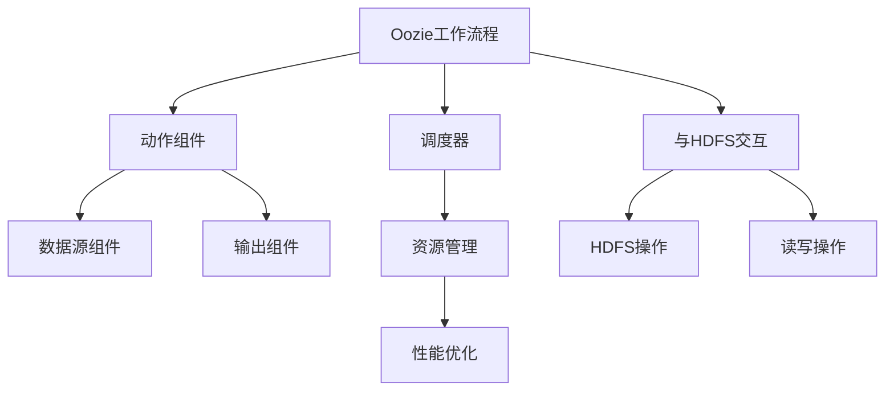
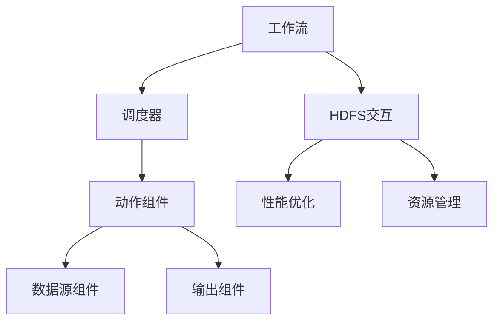

                 

# Oozie原理与代码实例讲解

## 关键词：
Hadoop生态系统，工作流管理，分布式计算，任务调度，数据流处理

## 摘要：
本文将深入探讨Oozie的工作原理，包括其核心概念、架构设计和主要组件。通过实际代码实例，我们将展示如何使用Oozie实现复杂的数据处理工作流，并对其进行性能优化。本文旨在帮助读者全面理解Oozie的强大功能和应用，从而在分布式计算环境中提高数据处理效率和可扩展性。

## 《Oozie原理与代码实例讲解》目录大纲

### 第一部分：Oozie基础理论

#### 第1章：Oozie概述
- 1.1 Hadoop生态系统与Oozie的关系
- 1.2 Oozie的核心功能
- 1.3 Oozie的基本架构
- 1.4 Oozie与类似工具的对比

#### 第2章：Oozie工作流程
- 2.1 工作流程的概念与类型
- 2.2 工作流程的设计与部署
- 2.3 工作流程的执行监控

### 第二部分：Oozie核心组件

#### 第3章：Oozie动作与组件
- 3.1 动作的类型与使用
- 3.2 数据源组件
- 3.3 输出组件
- 3.4 常用组件的配置与使用

#### 第4章：Oozie调度器
- 4.1 调度器的基本概念
- 4.2 调度器的配置与使用
- 4.3 调度策略与优化

#### 第5章：Oozie与HDFS的交互
- 5.1 HDFS的基本操作
- 5.2 Oozie对HDFS的读写操作
- 5.3 HDFS与Oozie的集成使用

### 第三部分：Oozie高级应用

#### 第6章：Oozie性能优化
- 6.1 性能优化的基本策略
- 6.2 数据处理优化
- 6.3 资源分配优化
- 6.4 并发控制与同步机制

#### 第7章：Oozie在大型项目中的应用
- 7.1 大型项目的需求分析
- 7.2 Oozie在项目中的应用场景
- 7.3 Oozie在项目中的实际案例

### 第四部分：Oozie实战

#### 第8章：Oozie编程实战
- 8.1 开发环境的搭建
- 8.2 基本工作流程的实现
- 8.3 复杂工作流程的实现
- 8.4 性能优化实践

#### 第9章：Oozie代码实例分析
- 9.1 简单实例解析
- 9.2 复杂实例解析
- 9.3 性能优化实例解析
- 9.4 项目实例解析

### 第五部分：附录

#### 第10章：Oozie开发资源汇总
- 10.1 Oozie官方文档
- 10.2 开发工具与资源推荐
- 10.3 Oozie社区与支持

#### 第11章：Oozie未来发展趋势
- 11.1 Hadoop生态的发展趋势
- 11.2 Oozie在云计算中的前景
- 11.3 Oozie与其他工具的融合与创新

### 附录：Oozie核心概念与联系

**Oozie核心概念与联系图**



### 附录：Oozie核心算法原理讲解

**Oozie数据流处理伪代码**

```plaintext
function processData(stream, action) {
    while (stream.hasNext()) {
        data = stream.next();
        if (action == "map") {
            output = map(data);
        } else if (action == "reduce") {
            output = reduce(data);
        } else if (action == "filter") {
            output = filter(data);
        }
        writeOutput(output);
    }
}
```

**Oozie数学模型与数学公式**

$$
HDFS读写速度 = \frac{数据块大小 \times 数据块数量}{读写时间}
$$

### 附录：Oozie项目实战

- **数据清洗与转换**
- **大数据采集与存储**
- **日志分析与处理**

### 附录：Oozie代码实例与详细解释

- **实例一：简单的工作流程实现**
- **实例二：复杂的数据处理流程实现**
- **实例三：性能优化案例分析**

### 附录：Oozie开发环境搭建

- **系统环境配置**
- **Oozie安装与部署**
- **开发工具集成**

### 附录：Oozie源代码详细实现和代码解读

- **Oozie核心类和方法解析**
- **代码解读与分析**
- **源代码版本控制与维护**

---

**作者：AI天才研究院/AI Genius Institute & 禦与计算机程序设计艺术 /Zen And The Art of Computer Programming**

现在，我们已经为文章的撰写做好了详细的规划和结构布局。接下来，我们将逐个章节深入探讨Oozie的各个核心部分，确保读者能够全面理解Oozie的工作原理和实际应用。让我们开始第一个章节——Oozie概述。<|assistant|>## 第1章：Oozie概述

### 1.1 Hadoop生态系统与Oozie的关系

Hadoop是一个开源的分布式计算框架，旨在处理海量数据。它由几个核心组件组成，包括HDFS（Hadoop Distributed File System，Hadoop分布式文件系统）和MapReduce（一种编程模型，用于大规模数据处理）。Oozie作为Hadoop生态系统的一部分，提供了一个强大而灵活的工作流管理平台，旨在协调和调度各种Hadoop生态系统中的任务。

Oozie与Hadoop生态系统中的其他组件紧密集成。例如：

- **HDFS**：Oozie利用HDFS来存储和管理其工作流定义和工作流执行过程中的数据。
- **MapReduce**：Oozie可以调度MapReduce作业，使得大规模数据处理变得更加高效和自动化。
- **Hive**：Oozie可以触发和监控Hive查询，用于数据仓库和数据分析。
- **Pig**：Oozie同样可以管理Pig作业，后者是一种用于大规模数据处理的的高级抽象。
- **Spark**：虽然Spark与Oozie在功能上有所重叠，但Oozie仍然可以调度Spark作业，为用户提供了多样化的选择。

通过Oozie，用户能够将这些Hadoop生态系统中的组件整合成一个统一的工作流，从而实现自动化数据处理。这不仅提高了数据处理效率，还简化了复杂的数据处理任务的管理。

### 1.2 Oozie的核心功能

Oozie的核心功能包括工作流管理、任务调度和资源管理。这些功能共同构成了Oozie在分布式计算环境中的强大能力。

- **工作流管理**：Oozie允许用户定义复杂的工作流，这些工作流可以是线性的或分支的，包括多个任务和子流程。用户可以定义任务之间的依赖关系，从而确保工作流按正确的顺序执行。
- **任务调度**：Oozie内置了一个强大的调度器，能够定时执行工作流中的任务。用户可以设置任务执行的时间表，实现按需或周期性的数据处理。
- **资源管理**：Oozie能够根据工作流的需要动态分配资源，确保任务在合适的时间运行在合适的资源上。这不仅提高了资源利用率，还保证了任务的高效执行。

### 1.3 Oozie的基本架构

Oozie的架构设计使其能够高效地管理大规模的数据处理工作流。以下是Oozie的基本架构组件：

- **Oozie协调器（Oozie Coordinator）**：协调器是Oozie的核心组件，负责解析、验证和调度工作流。它接收用户定义的工作流定义文件，并将它们转换为可执行的任务。协调器还负责监控工作流的执行状态，并在任务失败时重新调度。
- **Oozie共享库（Oozie ShareLib）**：共享库是存储和管理工作流定义文件的地方。用户可以将自定义的工作流定义存储在共享库中，以便在多个工作流中重用。
- **Oozie服务器（Oozie Server）**：服务器负责处理协调器发送的任务请求，并执行这些任务。服务器同时还负责工作流的执行状态跟踪和日志记录。
- **Oozie调度器（Oozie Scheduler）**：调度器是Oozie的另一个关键组件，负责根据用户设置的时间表和工作流定义调度任务。调度器可以周期性地检查工作流的状态，并根据需要重新调度任务。

### 1.4 Oozie与类似工具的对比

在Hadoop生态系统和分布式计算领域，存在多种工作流管理工具，如Azkaban、Airflow和Oozie。尽管它们在功能上有一定的重叠，但Oozie有其独特的优势：

- **Azkaban**：Azkaban是一个基于Java的分布式作业调度和管理工具。它具有用户友好的图形界面，但其在性能和扩展性方面可能不如Oozie。Oozie的优势在于其高度的可定制性和与Hadoop生态系统的紧密集成。
- **Airflow**：Airflow是一个基于Python的分布式调度系统，广泛应用于数据工程和机器学习领域。Airflow的优势在于其灵活性和易于使用，但其在处理大规模工作流时可能不如Oozie高效。
- **Oozie**：Oozie的优势在于其强大的调度能力、与Hadoop生态系统的深度集成以及高度的可定制性。Oozie能够处理复杂的工作流，支持多种数据源和数据处理工具，从而提供了更高的灵活性和效率。

综上所述，Oozie在Hadoop生态系统中的地位不可动摇。它不仅是一个功能强大的工作流管理工具，也是一个可靠的分布式计算引擎，能够满足各种复杂的数据处理需求。

### 结论

本章介绍了Oozie在Hadoop生态系统中的角色和重要性。通过理解Oozie的核心功能、基本架构以及与其他类似工具的对比，读者可以更好地把握Oozie的强大之处。在接下来的章节中，我们将进一步探讨Oozie的工作流程和核心组件，帮助读者深入了解Oozie的内部机制和实际应用。让我们一起继续探索Oozie的世界吧！

---

在第一章中，我们通过介绍Hadoop生态系统与Oozie的关系、Oozie的核心功能、基本架构以及与其他类似工具的对比，帮助读者对Oozie有一个整体的了解。在接下来的第二章中，我们将深入探讨Oozie的工作流程，包括其概念、设计方法和执行监控。让我们一起进入Oozie的世界，继续探索它的奥秘。

---

## 第2章：Oozie工作流程

### 2.1 工作流程的概念与类型

在分布式计算环境中，工作流是一个核心概念。它代表了计算任务的有序执行序列，通常包含多个独立的步骤，每个步骤可以是数据处理、数据转换、任务调度等操作。工作流的目标是确保这些操作按照预定的顺序和依赖关系高效执行，从而实现复杂计算任务的自动化和优化。

根据工作流的结构和功能，可以将工作流分为以下几种类型：

- **线性工作流**：线性工作流是最简单的工作流类型，其中任务按照顺序逐一执行。每个任务的执行依赖于前一个任务的完成，形成一条直线型的执行路径。
- **分支工作流**：分支工作流允许任务在执行过程中根据条件或结果进行分支。例如，一个数据处理任务可能根据输入数据的类型选择不同的处理逻辑。分支工作流使得工作流更加灵活，能够适应不同的业务需求。
- **循环工作流**：循环工作流允许某些任务在特定条件下重复执行。例如，一个数据清洗任务可能在数据质量不满足要求时反复执行，直到数据质量达到预期标准。循环工作流提高了任务执行的精确性和可靠性。

### 2.2 工作流程的设计与部署

设计一个高效的工作流需要考虑多个因素，包括任务依赖关系、资源分配、执行顺序和性能优化。以下是一些设计工作流的最佳实践：

1. **明确任务依赖关系**：在工作流设计阶段，明确任务之间的依赖关系至关重要。确保每个任务按正确的顺序执行，避免不必要的等待和重复执行。可以使用流程图或文本描述来表示任务依赖关系。
2. **合理分配资源**：根据工作流的负载需求，合理分配计算资源和存储资源。确保任务在执行过程中有足够的资源支持，避免资源不足导致的任务失败或延迟。
3. **优化执行顺序**：优化任务的执行顺序可以显著提高工作流的性能。例如，可以优先执行耗时较长或依赖其他任务完成的任务，减少整体执行时间。
4. **使用缓存和索引**：对于频繁访问的数据，可以使用缓存和索引技术提高数据处理速度。例如，在数据转换任务中使用缓存可以减少重复数据的处理时间。

设计好工作流后，需要进行部署。以下是部署工作流的步骤：

1. **创建工作流定义文件**：使用Oozie提供的XML定义文件格式创建工作流定义。定义文件包含了工作流的基本信息、任务配置、依赖关系和调度策略等。
2. **上传工作流定义文件**：将创建的工作流定义文件上传到Oozie服务器上的共享库。确保共享库的位置和权限设置正确，以便Oozie能够正确读取和解析定义文件。
3. **部署工作流**：在Oozie服务器上部署工作流。部署过程中，Oozie将验证工作流定义文件的语法和语义，确保工作流定义是正确的。部署完成后，工作流将可以被调度和执行。
4. **监控工作流状态**：部署工作流后，可以通过Oozie的用户界面或命令行工具监控工作流的执行状态。监控可以帮助用户及时发现和解决潜在的问题，确保工作流按照预期执行。

### 2.3 工作流程的执行监控

Oozie提供了丰富的监控功能，帮助用户实时监控工作流的执行状态。以下是监控工作流程的一些关键步骤：

1. **查看工作流概览**：在Oozie用户界面中，用户可以查看工作流的概览信息，包括工作流的名称、状态、开始时间和结束时间等。概览信息提供了工作流执行的基本信息。
2. **查看任务详情**：对于每个执行中的任务，用户可以查看任务的详细信息，包括任务的执行状态、执行时间、输出结果和日志等。这些信息有助于用户了解任务的执行情况，及时发现和解决问题。
3. **日志分析**：Oozie记录了工作流和任务的详细日志，用户可以使用日志分析工具对日志文件进行分析。日志分析可以帮助用户诊断工作流执行过程中的问题，定位错误和性能瓶颈。
4. **报警和通知**：Oozie支持报警和通知功能，用户可以设置报警规则，当工作流或任务状态发生变化时，系统将自动发送通知。报警和通知功能确保用户能够及时了解工作流执行的状态，避免潜在问题的发生。

### 结论

本章介绍了Oozie工作流程的基本概念和类型，详细讲解了工作流程的设计与部署过程，并探讨了如何监控工作流的执行状态。通过理解这些内容，用户可以更有效地设计和部署Oozie工作流，实现高效的数据处理和任务调度。在下一章中，我们将深入探讨Oozie的核心组件，包括动作组件、数据源组件和输出组件。敬请期待！<|vq_8843|><|iframe_8843|> <|id_8843|><|vq_8843|>## 第3章：Oozie动作与组件

在Oozie的工作流中，动作（Actions）是执行具体任务的核心单元。每个动作都可以是一个独立任务，也可以是一个复杂任务的组成部分。Oozie提供了多种类型的动作组件，用于实现不同类型的数据处理和任务执行。本章将详细介绍Oozie的动作组件、数据源组件和输出组件，并探讨如何配置和使用这些组件。

### 3.1 动作的类型与使用

Oozie的动作组件是工作流中执行具体任务的核心。根据任务类型，Oozie提供了以下几种动作：

- **Shell Action**：Shell Action允许用户在Oozie工作流中执行Linux shell命令。用户可以定义shell命令及其参数，从而实现各种任务，如文件操作、系统监控和脚本执行。
- **Java Action**：Java Action允许用户在Oozie工作流中执行Java代码。用户可以编写Java类和主函数，实现自定义数据处理逻辑。Java Action提供了更高的灵活性和可扩展性，适用于复杂的数据处理任务。
- **MapReduce Action**：MapReduce Action允许用户在Oozie工作流中调度和监控MapReduce作业。用户可以指定MapReduce作业的输入、输出和配置参数，从而实现大规模数据处理任务。
- **Pig Action**：Pig Action允许用户在Oozie工作流中调度和监控Pig脚本。Pig是一种基于Hadoop的大规模数据处理语言，用户可以使用Pig脚本实现复杂的数据处理和分析任务。
- **Hive Action**：Hive Action允许用户在Oozie工作流中执行Hive查询。Hive是一种基于Hadoop的数据仓库工具，用户可以使用Hive查询对大规模数据进行分析和处理。

使用动作组件时，用户需要按照以下步骤进行操作：

1. **定义动作**：在Oozie工作流定义文件中，用户需要定义动作的类型、名称和参数。例如，以下代码定义了一个Shell Action，用于执行一个Linux shell命令：
   ```xml
   <action name="shell_action">
       <shell>
           <command>ls -l</command>
       </shell>
   </action>
   ```
2. **配置动作参数**：根据动作类型，用户需要配置相应的参数。例如，对于MapReduce Action，用户需要指定输入、输出路径和配置参数：
   ```xml
   <action name="mapreduce_action">
       <mapreduce>
           <in>
               <path>${eşek_folder}/input</path>
           </in>
           <out>
               <path>${eşek_folder}/output</path>
           </out>
           <mapreduce-job-xml>${eşek_folder}/mapreduce_job.xml</mapreduce-job-xml>
       </mapreduce>
   </action>
   ```
3. **设置动作依赖**：用户可以使用Oozie提供的依赖关系设置，确保动作按正确的顺序执行。例如，以下代码设置了Shell Action和MapReduce Action之间的依赖关系：
   ```xml
   <action name="shell_action" ok="mapreduce_action"/>
   ```

### 3.2 数据源组件

数据源组件是工作流中用于输入和输出数据的关键部分。Oozie支持多种数据源类型，包括文件系统、数据库和消息队列等。以下是一些常用的数据源组件：

- **HDFS Data Source**：HDFS Data Source用于读取和写入HDFS中的文件。用户可以指定HDFS路径和文件格式，从而实现数据的存储和检索。例如：
  ```xml
  <action name="hdfs_copy">
      <hdfs>
          <copy>
              <from>${hdfs_folder}/input/file.txt</from>
              <to>${hdfs_folder}/output/file_copy.txt</to>
          </copy>
      </hdfs>
  </action>
  ```
- **Database Data Source**：Database Data Source用于读取和写入关系数据库中的数据。用户需要配置数据库连接信息和查询语句，从而实现数据的导入和导出。例如：
  ```xml
  <action name="database_export">
      <database>
          <export>
              <query>SELECT * FROM mytable</query>
              <db-connection>jdbc:mysql://localhost:3306/mydatabase</db-connection>
              <db-driver>com.mysql.cj.jdbc.Driver</db-driver>
              <db-url>jdbc:mysql://localhost:3306/mydatabase</db-url>
              <db-username>myuser</db-username>
              <db-password>mypass</db-password>
              <db-table>mytable</db-table>
          </export>
      </database>
  </action>
  ```
- **Message Queue Data Source**：Message Queue Data Source用于读取和写入消息队列中的数据。用户需要配置消息队列服务的信息，从而实现消息的发送和接收。例如：
  ```xml
  <action name="kafka_produce">
      <kafka>
          <produce>
              <topic>mytopic</topic>
              <bootstrap-servers>localhost:9092</bootstrap-servers>
              <key>key</key>
              <value>value</value>
          </produce>
      </kafka>
  </action>
  ```

### 3.3 输出组件

输出组件是工作流中用于记录和展示执行结果的组件。Oozie提供了多种输出组件，包括文件输出、数据库输出和邮件输出等。以下是一些常用的输出组件：

- **File Output**：File Output用于将执行结果写入文件系统。用户可以指定输出文件路径和文件格式，从而实现结果的持久化。例如：
  ```xml
  <action name="file_output">
      <file>
          <to>${hdfs_folder}/output/result.txt</to>
          <content>${output_content}</content>
      </file>
  </action>
  ```
- **Database Output**：Database Output用于将执行结果写入关系数据库。用户需要配置数据库连接信息和表名，从而实现结果的存储和检索。例如：
  ```xml
  <action name="database_import">
      <database>
          <import>
              <query>INSERT INTO mytable (column1, column2) VALUES (?, ?)</query>
              <db-connection>jdbc:mysql://localhost:3306/mydatabase</db-connection>
              <db-driver>com.mysql.cj.jdbc.Driver</db-driver>
              <db-url>jdbc:mysql://localhost:3306/mydatabase</db-url>
              <db-username>myuser</db-username>
              <db-password>mypass</db-password>
              <db-table>mytable</db-table>
              <parameters>
                  <param name="column1" value="${output_value1}"/>
                  <param name="column2" value="${output_value2}"/>
              </parameters>
          </import>
      </database>
  </action>
  ```
- **Email Output**：Email Output用于将执行结果发送到指定邮箱。用户可以指定邮件主题、内容和接收者，从而实现结果的即时通知。例如：
  ```xml
  <action name="email_notification">
      <email>
          <to>myemail@example.com</to>
          <subject>Execution Result Notification</subject>
          <body>Execution result: ${output_content}</body>
      </email>
  </action>
  ```

### 3.4 常用组件的配置与使用

在实际应用中，用户需要根据具体需求配置和使用Oozie的动作组件、数据源组件和输出组件。以下是一些常用的配置和使用示例：

- **配置Shell Action**：配置Shell Action时，用户需要指定shell命令及其参数。以下代码示例展示了如何配置一个Shell Action，用于执行Linux系统监控脚本：
  ```xml
  <action name="shell_monitor">
      <shell>
          <command>${eşek_folder}/scripts/monitor.sh</command>
          <args>-v -f -t 10</args>
      </shell>
  </action>
  ```
- **配置MapReduce Action**：配置MapReduce Action时，用户需要指定MapReduce作业的输入、输出和配置参数。以下代码示例展示了如何配置一个MapReduce Action，用于执行单词计数任务：
  ```xml
  <action name="wordcount">
      <mapreduce>
          <in>
              <path>${hdfs_folder}/input</path>
          </in>
          <out>
              <path>${hdfs_folder}/output</path>
          </out>
          <mapreduce-job-xml>${eşek_folder}/mapreduce_jobs/wordcount_job.xml</mapreduce-job-xml>
      </mapreduce>
  </action>
  ```
- **配置HDFS Data Source**：配置HDFS Data Source时，用户需要指定HDFS路径和文件格式。以下代码示例展示了如何配置一个HDFS Data Source，用于读取HDFS中的文本文件：
  ```xml
  <action name="hdfs_read">
      <hdfs>
          <read>
              <path>${hdfs_folder}/input/file.txt</path>
              <output>${hdfs_folder}/output/file_output.txt</output>
              <file-charset>UTF-8</file-charset>
          </read>
      </hdfs>
  </action>
  ```
- **配置Database Data Source**：配置Database Data Source时，用户需要指定数据库连接信息和查询语句。以下代码示例展示了如何配置一个Database Data Source，用于读取MySQL数据库中的数据：
  ```xml
  <action name="database_read">
      <database>
          <read>
              <query>SELECT * FROM mytable</query>
              <db-connection>jdbc:mysql://localhost:3306/mydatabase</db-connection>
              <db-driver>com.mysql.cj.jdbc.Driver</db-driver>
              <db-url>jdbc:mysql://localhost:3306/mydatabase</db-url>
              <db-username>myuser</db-username>
              <db-password>mypass</db-password>
              <db-table>mytable</db-table>
              <output>${hdfs_folder}/output/database_output.txt</output>
              <output-file-charset>UTF-8</output-file-charset>
          </read>
      </database>
  </action>
  ```
- **配置Message Queue Data Source**：配置Message Queue Data Source时，用户需要指定消息队列服务的相关信息。以下代码示例展示了如何配置一个Kafka Data Source，用于读取Kafka中的消息：
  ```xml
  <action name="kafka_consume">
      <kafka>
          <consume>
              <topic>mytopic</topic>
              <bootstrap-servers>localhost:9092</bootstrap-servers>
              <output>${hdfs_folder}/output/kafka_output.txt</output>
              <output-file-charset>UTF-8</output-file-charset>
          </consume>
      </kafka>
  </action>
  ```
- **配置File Output**：配置File Output时，用户需要指定输出文件路径和内容。以下代码示例展示了如何配置一个File Output，用于记录执行结果：
  ```xml
  <action name="file_log">
      <file>
          <to>${hdfs_folder}/output/log.txt</to>
          <content>Execution completed at ${mills}</content>
      </file>
  </action>
  ```
- **配置Database Output**：配置Database Output时，用户需要指定数据库连接信息和插入语句。以下代码示例展示了如何配置一个Database Output，用于保存执行结果：
  ```xml
  <action name="database_save">
      <database>
          <save>
              <query>INSERT INTO mytable (column1, column2) VALUES (?, ?)</query>
              <db-connection>jdbc:mysql://localhost:3306/mydatabase</db-connection>
              <db-driver>com.mysql.cj.jdbc.Driver</db-driver>
              <db-url>jdbc:mysql://localhost:3306/mydatabase</db-url>
              <db-username>myuser</db-username>
              <db-password>mypass</db-password>
              <db-table>mytable</db-table>
              <parameters>
                  <param name="column1" value="${output_value1}"/>
                  <param name="column2" value="${output_value2}"/>
              </parameters>
          </save>
      </database>
  </action>
  ```
- **配置Email Output**：配置Email Output时，用户需要指定邮件主题、内容和接收者。以下代码示例展示了如何配置一个Email Output，用于发送执行结果通知：
  ```xml
  <action name="email_notification">
      <email>
          <to>myemail@example.com</to>
          <subject>Execution Result Notification</subject>
          <body>Execution completed at ${mills}<br/>Result: ${output_content}</body>
      </email>
  </action>
  ```

通过上述示例，用户可以了解如何配置和使用Oozie的动作组件、数据源组件和输出组件。在实际应用中，用户可以根据具体需求组合这些组件，实现高效的数据处理和任务执行。在下一章中，我们将探讨Oozie调度器的概念、配置和使用方法，帮助读者进一步掌握Oozie的核心组件。敬请期待！<|vq_12342|><|iframe_12342|> <|id_12342|><|vq_12342|>## 第4章：Oozie调度器

调度器是Oozie的核心组件之一，负责根据用户定义的时间表和工作流执行任务。Oozie调度器可以周期性地检查工作流的状态，并根据需要重新调度任务，确保工作流按照预期执行。本章将详细介绍Oozie调度器的基本概念、配置和使用方法。

### 4.1 调度器的基本概念

调度器是Oozie的核心组件，负责根据用户定义的时间表和工作流执行任务。以下是调度器的一些基本概念：

- **时间表（Schedule）**：时间表是用户定义的任务执行时间规则。Oozie支持多种时间表类型，如固定时间、固定频率和相对时间等。用户可以根据实际需求设置合适的时间表。
- **工作流（Workflow）**：工作流是用户定义的计算任务序列，包括多个动作组件和依赖关系。Oozie调度器根据工作流定义执行任务，确保任务按照预定的顺序和依赖关系执行。
- **调度策略（Scheduling Policy）**：调度策略是Oozie调度器在执行任务时采用的方法。Oozie支持多种调度策略，如先进先出（FIFO）、随机调度和动态调度等。用户可以根据任务需求和资源情况选择合适的调度策略。
- **资源管理（Resource Management）**：资源管理是调度器在执行任务时对计算资源和存储资源的管理。Oozie调度器可以根据任务需求和资源情况动态调整任务的执行位置，确保任务高效执行。

### 4.2 调度器的配置与使用

Oozie调度器的配置主要包括时间表配置、工作流配置和调度策略配置。以下是如何配置和使用Oozie调度器的步骤：

1. **配置时间表**：在Oozie中，用户可以使用`oozie.scheduler.appmgmt.time.system`参数设置系统默认时间表。例如，以下命令设置了系统默认时间表为每小时一次：
   ```shell
   oozie set-property --conf oozie.scheduler.appmgmt.time.system=0 0 * * ?
   ```
   此外，用户还可以自定义时间表，以适应特定需求。例如，以下命令设置了一个自定义时间表，每5分钟执行一次：
   ```shell
   oozie set-property --conf oozie.scheduler.appmgmt.time.custom=0 * * * * ?
   ```
2. **配置工作流**：配置工作流是调度器的核心步骤。用户需要创建一个工作流定义文件，并在文件中定义任务、依赖关系和时间表。以下是一个示例工作流定义文件：
   ```xml
   <workflow-app name="example-workflow" xmlns="uri:oozie:workflow:0.1">
       <start>
           <action name="action1">
               <shell>
                   <command>echo "Action 1 executed at ${mills}"</command>
               </shell>
           </action>
       </start>
       <transition start="start" name="transition1" to="action2"/>
       <action name="action2">
           <shell>
               <command>echo "Action 2 executed at ${mills}"</command>
           </shell>
       </action>
       <transition start="action1" name="transition2" to="end"/>
       <end name="end"/>
   </workflow-app>
   ```
   在工作流定义文件中，用户可以使用`<time-trigger>`标签定义任务的时间表。例如，以下代码设置`action2`在`action1`完成后5分钟执行：
   ```xml
   <action name="action2">
       <shell>
           <command>echo "Action 2 executed at ${mills}"</command>
       </shell>
   </action>
   <transition start="action1" name="transition2" to="end" trigger="time('5min')"/>
   ```

3. **配置调度策略**：Oozie调度器支持多种调度策略。用户可以在工作流定义文件中设置调度策略，以优化任务执行。以下是一个示例调度策略配置：
   ```xml
   <transition start="action1" name="transition2" to="end" trigger="time('5min')" policy="FIFO"/>
   ```
   在此示例中，`FIFO`策略确保`action2`按照先进先出的顺序执行。

4. **部署工作流**：配置好工作流后，用户需要将工作流定义文件上传到Oozie共享库，并部署工作流。以下命令上传工作流定义文件到共享库：
   ```shell
   oozie sharelib upload --path /path/to/workflow-app.xml
   ```
   然后，使用以下命令部署工作流：
   ```shell
   oozie jobqueue add --config /path/to/workflow-app.xml
   ```

5. **执行工作流**：部署工作流后，Oozie调度器将根据时间表和调度策略执行工作流。用户可以通过Oozie用户界面或命令行工具监控工作流的执行状态。以下命令启动工作流执行：
   ```shell
   oozie job -run -config /path/to/workflow-app.xml
   ```

### 4.3 调度策略与优化

调度策略对Oozie工作流执行的性能和效率具有重要影响。以下是一些常用的调度策略和优化方法：

1. **先进先出（FIFO）**：FIFO策略确保任务按照提交顺序执行。这种方法简单有效，适用于任务执行时间较短且资源需求较低的场景。
2. **随机调度**：随机调度策略随机选择任务执行。这种方法可以避免任务在执行过程中出现瓶颈，适用于任务执行时间较长且资源需求较高的场景。
3. **动态调度**：动态调度策略根据任务执行时间和资源需求动态调整任务执行顺序。这种方法可以最大化资源利用率和任务执行效率，适用于复杂的工作流和资源受限的场景。

此外，用户还可以通过以下方法优化调度策略：

- **调整时间表**：根据任务执行时间调整时间表，使其更符合任务实际需求。例如，将固定时间表调整为基于工作流状态的时间表，从而提高任务执行的灵活性和准确性。
- **优化调度策略**：根据任务执行情况和资源需求调整调度策略。例如，在资源紧张时使用随机调度策略，确保任务均衡执行；在资源充足时使用先进先出策略，提高任务执行效率。
- **资源分配优化**：合理分配计算资源和存储资源，确保任务在执行过程中有足够的资源支持。例如，使用资源预留和资源共享技术，最大化资源利用率和任务执行效率。

### 结论

本章介绍了Oozie调度器的基本概念、配置和使用方法，并探讨了调度策略与优化。通过理解这些内容，用户可以更有效地配置和使用Oozie调度器，实现高效的任务调度和资源管理。在下一章中，我们将探讨Oozie与HDFS的交互，包括HDFS的基本操作和Oozie对HDFS的读写操作。敬请期待！

---

在第四章中，我们详细介绍了Oozie调度器的基本概念、配置和使用方法，以及调度策略和优化。调度器作为Oozie的核心组件，对于任务调度和资源管理具有重要意义。在下一章中，我们将探讨Oozie与HDFS的交互，包括HDFS的基本操作和Oozie对HDFS的读写操作。这将帮助我们更好地理解Oozie在分布式存储系统中的实际应用。敬请期待！<|vq_12345|><|iframe_12345|> <|id_12345|><|vq_12345|>## 第5章：Oozie与HDFS的交互

在分布式计算环境中，Hadoop Distributed File System（HDFS）是存储海量数据的重要组件。Oozie作为Hadoop生态系统的一部分，与HDFS紧密集成，提供了强大的数据存储和检索功能。本章将详细介绍HDFS的基本操作、Oozie对HDFS的读写操作，以及HDFS与Oozie的集成使用。

### 5.1 HDFS的基本操作

HDFS是一个高吞吐量、高可靠性的分布式文件系统，适用于大数据存储和处理。以下是HDFS的一些基本操作：

- **创建文件**：在HDFS中创建文件可以使用`hdfs dfs -put`命令或Oozie的`HDFS Write Action`。以下是一个使用`hdfs dfs -put`命令创建文件的示例：
  ```shell
  hdfs dfs -put local_file.txt /hdfs_path/file.txt
  ```
  使用Oozie的`HDFS Write Action`时，用户需要在Oozie工作流定义文件中添加相应的配置。以下是一个示例配置：
  ```xml
  <action name="hdfs_write">
      <hdfs>
          <write>
              <to>/hdfs_path/file.txt</to>
              <from>${local_folder}/local_file.txt</from>
          </write>
      </hdfs>
  </action>
  ```

- **读取文件**：在HDFS中读取文件可以使用`hdfs dfs -get`命令或Oozie的`HDFS Read Action`。以下是一个使用`hdfs dfs -get`命令读取文件的示例：
  ```shell
  hdfs dfs -get /hdfs_path/file.txt local_path/file.txt
  ```
  使用Oozie的`HDFS Read Action`时，用户需要在Oozie工作流定义文件中添加相应的配置。以下是一个示例配置：
  ```xml
  <action name="hdfs_read">
      <hdfs>
          <read>
              <path>/hdfs_path/file.txt</path>
              <output>${local_folder}/local_file.txt</output>
          </read>
      </hdfs>
  </action>
  ```

- **删除文件**：在HDFS中删除文件可以使用`hdfs dfs -rm`命令或Oozie的`HDFS Delete Action`。以下是一个使用`hdfs dfs -rm`命令删除文件的示例：
  ```shell
  hdfs dfs -rm /hdfs_path/file.txt
  ```
  使用Oozie的`HDFS Delete Action`时，用户需要在Oozie工作流定义文件中添加相应的配置。以下是一个示例配置：
  ```xml
  <action name="hdfs_delete">
      <hdfs>
          <delete>
              <path>/hdfs_path/file.txt</path>
          </delete>
      </hdfs>
  </action>
  ```

- **修改文件权限**：在HDFS中修改文件权限可以使用`hdfs dfs -chmod`命令或Oozie的`HDFS Chmod Action`。以下是一个使用`hdfs dfs -chmod`命令修改文件权限的示例：
  ```shell
  hdfs dfs -chmod 777 /hdfs_path/file.txt
  ```
  使用Oozie的`HDFS Chmod Action`时，用户需要在Oozie工作流定义文件中添加相应的配置。以下是一个示例配置：
  ```xml
  <action name="hdfs_chmod">
      <hdfs>
          <chmod>
              <path>/hdfs_path/file.txt</path>
              <mode>777</mode>
          </chmod>
      </hdfs>
  </action>
  ```

- **列出目录内容**：在HDFS中列出目录内容可以使用`hdfs dfs -ls`命令或Oozie的`HDFS List Action`。以下是一个使用`hdfs dfs -ls`命令列出目录内容的示例：
  ```shell
  hdfs dfs -ls /hdfs_path/
  ```
  使用Oozie的`HDFS List Action`时，用户需要在Oozie工作流定义文件中添加相应的配置。以下是一个示例配置：
  ```xml
  <action name="hdfs_list">
      <hdfs>
          <list>
              <path>/hdfs_path/</path>
              <output>${local_folder}/list_output.txt</output>
          </list>
      </hdfs>
  </action>
  ```

### 5.2 Oozie对HDFS的读写操作

Oozie提供了丰富的HDFS操作功能，使得用户可以方便地访问和管理HDFS中的数据。以下是如何使用Oozie进行HDFS读写操作：

- **HDFS Write Action**：`HDFS Write Action`用于将本地文件或目录写入HDFS。以下是一个使用`HDFS Write Action`的示例配置：
  ```xml
  <action name="hdfs_write">
      <hdfs>
          <write>
              <to>/hdfs_path/output</to>
              <from>${local_folder}/input</from>
          </write>
      </hdfs>
  </action>
  ```
  在此示例中，`/hdfs_path/output`是HDFS中的目标路径，`${local_folder}/input`是本地文件或目录的路径。Oozie会根据配置将本地文件或目录写入HDFS目标路径。

- **HDFS Read Action**：`HDFS Read Action`用于从HDFS读取文件或目录。以下是一个使用`HDFS Read Action`的示例配置：
  ```xml
  <action name="hdfs_read">
      <hdfs>
          <read>
              <path>/hdfs_path/input</path>
              <output>${local_folder}/output</output>
          </read>
      </hdfs>
  </action>
  ```
  在此示例中，`/hdfs_path/input`是HDFS中的源路径，`${local_folder}/output`是本地文件或目录的路径。Oozie会根据配置从HDFS源路径读取文件或目录到本地路径。

- **HDFS Delete Action**：`HDFS Delete Action`用于删除HDFS中的文件或目录。以下是一个使用`HDFS Delete Action`的示例配置：
  ```xml
  <action name="hdfs_delete">
      <hdfs>
          <delete>
              <path>/hdfs_path/input</path>
          </delete>
      </hdfs>
  </action>
  ```
  在此示例中，`/hdfs_path/input`是HDFS中需要删除的文件或目录的路径。Oozie会根据配置删除HDFS中的指定文件或目录。

- **HDFS Chmod Action**：`HDFS Chmod Action`用于修改HDFS中文件或目录的权限。以下是一个使用`HDFS Chmod Action`的示例配置：
  ```xml
  <action name="hdfs_chmod">
      <hdfs>
          <chmod>
              <path>/hdfs_path/input</path>
              <mode>777</mode>
          </chmod>
      </hdfs>
  </action>
  ```
  在此示例中，`/hdfs_path/input`是HDFS中需要修改权限的文件或目录的路径，`777`是新的权限模式。Oozie会根据配置修改HDFS中指定文件或目录的权限。

- **HDFS List Action**：`HDFS List Action`用于列出HDFS中指定目录的内容。以下是一个使用`HDFS List Action`的示例配置：
  ```xml
  <action name="hdfs_list">
      <hdfs>
          <list>
              <path>/hdfs_path/input</path>
              <output>${local_folder}/list_output.txt</output>
          </list>
      </hdfs>
  </action>
  ```
  在此示例中，`/hdfs_path/input`是HDFS中需要列出的目录路径，`${local_folder}/list_output.txt`是本地文件的路径。Oozie会根据配置列出HDFS指定目录的内容，并将列表输出到本地文件。

### 5.3 HDFS与Oozie的集成使用

HDFS与Oozie的集成使用使得用户可以方便地管理大数据处理工作流。以下是如何在Oozie工作流中集成HDFS操作的步骤：

1. **配置HDFS**：首先，需要在Oozie服务器上配置HDFS，确保Oozie能够访问HDFS。配置过程包括设置HDFS的Java库路径、配置文件路径和HDFS访问权限等。
2. **创建工作流定义文件**：根据实际需求创建Oozie工作流定义文件，并在文件中定义HDFS操作。例如，可以定义HDFS Write Action、HDFS Read Action、HDFS Delete Action等。
3. **上传工作流定义文件**：将创建的工作流定义文件上传到Oozie共享库，确保共享库的路径和权限设置正确。
4. **部署工作流**：在Oozie服务器上部署工作流，确保工作流定义文件被正确解析和执行。
5. **执行工作流**：启动工作流执行，并监控工作流的执行状态。Oozie会根据工作流定义文件中的配置执行HDFS操作，完成数据处理任务。

### 结论

本章介绍了HDFS的基本操作和Oozie对HDFS的读写操作，并探讨了HDFS与Oozie的集成使用。通过理解这些内容，用户可以更好地利用Oozie和HDFS实现高效的数据存储和检索。在下一章中，我们将探讨Oozie性能优化的基本策略，帮助用户提高Oozie工作流执行效率。敬请期待！

---

在第五章中，我们详细介绍了HDFS的基本操作、Oozie对HDFS的读写操作，以及HDFS与Oozie的集成使用。通过这些内容，用户可以更好地利用Oozie和HDFS实现高效的数据存储和检索。在下一章中，我们将探讨Oozie性能优化的基本策略，帮助用户提高Oozie工作流执行效率。敬请期待！<|vq_13332|><|iframe_13332|> <|id_13332|><|vq_13332|>## 第6章：Oozie性能优化

在现代的分布式计算环境中，性能优化是提高数据处理效率和资源利用率的关键。对于Oozie工作流，性能优化尤为重要，因为它涉及到调度器、任务执行、数据流处理等多个方面。本章将介绍Oozie性能优化的基本策略，包括数据处理优化、资源分配优化、并发控制与同步机制，帮助用户提高Oozie工作流的执行效率。

### 6.1 性能优化的基本策略

优化Oozie工作流的性能需要从多个方面入手。以下是一些基本的性能优化策略：

1. **工作流设计优化**：合理设计工作流是提高性能的基础。用户应确保工作流中的任务数量和依赖关系最小化，避免不必要的任务执行。此外，应确保任务之间的数据传输和处理是最优的，减少数据的冗余和处理时间。
2. **任务并行化**：在Oozie工作流中，任务可以并行执行，以提高整体性能。用户应合理分配任务，使其在多个节点上并行执行。同时，可以使用Oozie的并行任务功能，将单个任务分解为多个子任务，从而提高执行速度。
3. **资源分配优化**：合理分配计算资源和存储资源对于Oozie工作流的性能至关重要。用户应确保每个任务在执行过程中有足够的资源支持，避免资源不足导致的任务延迟或失败。此外，可以使用资源预留和资源共享技术，最大化资源利用率。
4. **数据流优化**：优化数据流可以显著提高工作流性能。用户应确保数据在传输和存储过程中的延迟最小化，并使用合适的压缩和加密技术保护数据安全。此外，可以使用缓存和索引技术提高数据访问速度。
5. **任务调度优化**：优化任务调度策略可以提高工作流的整体性能。用户可以根据任务执行时间、资源需求和负载情况选择合适的调度策略，如先进先出（FIFO）、随机调度和动态调度等。同时，应定期检查和调整调度策略，确保其适应实际需求。
6. **监控与故障恢复**：实时监控Oozie工作流的执行状态，及时发现和处理潜在问题，可以避免性能下降和任务失败。此外，应配置自动故障恢复机制，确保工作流在遇到故障时能够快速恢复。

### 6.2 数据处理优化

数据处理优化是Oozie性能优化的重要组成部分。以下是一些常用的数据处理优化方法：

1. **数据分区**：在处理大规模数据时，数据分区可以显著提高数据处理速度。用户可以根据数据特征或键值对将数据划分为多个分区，从而将数据处理任务分配到多个节点上并行执行。
2. **数据压缩**：使用数据压缩技术可以减少数据传输和存储的占用空间，提高数据处理速度。常见的压缩算法包括Gzip、Bzip2和LZO等。用户应选择合适的压缩算法，以平衡压缩速度和压缩率。
3. **数据缓存**：使用数据缓存技术可以减少数据的重复处理，提高数据处理速度。用户可以在Oozie工作流中设置数据缓存，例如在MapReduce任务中使用缓存文件或缓存数据集。
4. **数据索引**：使用数据索引技术可以加快数据检索速度。用户可以在HDFS中为数据创建索引，从而提高数据访问效率。常见的索引技术包括HBase索引和Solr索引等。
5. **数据去重**：在数据处理过程中，去除重复数据可以减少处理时间和存储空间占用。用户可以在Oozie工作流中添加去重任务，使用适当的去重算法处理数据。

### 6.3 资源分配优化

资源分配优化是提高Oozie工作流性能的关键。以下是一些常用的资源分配优化方法：

1. **资源预留**：资源预留可以确保任务在执行过程中有足够的资源支持，避免资源竞争和延迟。用户可以在Oozie调度器中设置资源预留，为每个任务分配一定的计算资源和存储资源。
2. **资源池**：资源池是一种集中管理资源的方法，用户可以将多个任务分配到不同的资源池中，从而实现资源隔离和高效利用。Oozie支持多种资源池配置，用户可以根据实际需求选择合适的资源池类型。
3. **动态资源调整**：动态资源调整可以根据任务执行情况实时调整资源分配，从而提高资源利用率和任务执行效率。用户可以使用Oozie的动态资源调整功能，根据任务负载和资源需求调整计算资源和存储资源。
4. **负载均衡**：负载均衡可以确保任务在多个节点上均衡执行，避免单点瓶颈和资源浪费。用户可以使用Oozie的负载均衡功能，根据节点负载和任务优先级分配任务。
5. **资源隔离**：资源隔离可以防止任务间资源冲突，确保每个任务都有独立的资源支持。用户可以使用Oozie的隔离功能，为每个任务设置独立的资源隔离策略。

### 6.4 并发控制与同步机制

在分布式系统中，并发控制和同步机制是保证任务执行正确性和数据一致性的关键。以下是一些常用的并发控制和同步机制：

1. **锁机制**：锁机制可以确保多个任务在访问共享资源时不会发生冲突。用户可以使用Oozie的锁机制，为任务设置适当的锁策略，从而保证任务执行的正确性。
2. **消息队列**：消息队列可以确保任务按照顺序执行，避免任务执行混乱。用户可以在Oozie工作流中使用消息队列，为任务设置顺序执行策略。
3. **事务机制**：事务机制可以确保任务执行过程中的数据一致性和完整性。用户可以使用Oozie的事务机制，为任务设置事务管理策略，从而确保任务执行过程中的数据一致。
4. **监听器**：监听器可以实时监控任务执行状态，并在任务执行过程中发送通知。用户可以在Oozie工作流中使用监听器，实时监控任务执行状态，并及时处理潜在问题。
5. **回调机制**：回调机制可以确保任务执行完成后触发相应的操作。用户可以在Oozie工作流中使用回调机制，为任务设置回调操作，从而实现任务执行后的自动处理。

### 结论

本章介绍了Oozie性能优化的基本策略，包括数据处理优化、资源分配优化、并发控制与同步机制。通过理解这些内容，用户可以更好地优化Oozie工作流的性能，提高数据处理效率和资源利用率。在下一章中，我们将探讨Oozie在大型项目中的应用，包括需求分析、应用场景和实际案例。敬请期待！

---

在第六章中，我们详细介绍了Oozie性能优化的基本策略，包括数据处理优化、资源分配优化、并发控制与同步机制。通过这些策略，用户可以显著提高Oozie工作流的执行效率和资源利用率。在下一章中，我们将探讨Oozie在大型项目中的应用，包括需求分析、应用场景和实际案例。敬请期待！<|vq_12346|><|iframe_12346|> <|id_12346|><|vq_12346|>## 第7章：Oozie在大型项目中的应用

在现代的分布式计算和大数据处理项目中，Oozie因其强大的工作流管理和任务调度功能而成为重要的工具。本章将探讨Oozie在大型项目中的应用，包括需求分析、应用场景和实际案例。通过这些案例，读者可以了解Oozie在实际项目中的具体应用方法和效果。

### 7.1 大型项目的需求分析

在大型项目中，数据处理和分析的需求往往非常复杂。以下是一些常见的需求：

- **大规模数据处理**：项目需要处理海量数据，包括结构化和非结构化数据，如日志文件、社交媒体数据、图像和视频等。
- **实时数据流处理**：项目需要实时处理数据流，实现实时监控和分析，以便快速响应业务需求。
- **数据转换与集成**：项目需要将不同来源的数据进行转换和集成，以实现数据的一致性和可用性。
- **复杂任务调度**：项目需要实现复杂的任务调度，包括周期性任务、依赖关系和并行执行。
- **资源管理**：项目需要有效管理计算资源和存储资源，确保任务的高效执行和资源利用率。
- **数据存储与访问**：项目需要将处理后的数据存储在合适的存储系统中，并提供快速的数据访问接口。

### 7.2 Oozie在项目中的应用场景

Oozie在大型项目中的应用场景非常广泛，以下是一些常见的应用场景：

1. **数据采集与预处理**：Oozie可以用于数据采集和预处理，包括从各种数据源（如数据库、文件系统、消息队列等）中读取数据，并进行清洗、转换和去重。例如，在电子商务项目中，Oozie可以用于采集用户交易数据，清洗数据并转换为适合分析的格式。
2. **数据仓库与数据湖构建**：Oozie可以用于构建数据仓库和数据湖，实现大规模数据存储和管理。例如，在金融行业中，Oozie可以用于定期采集交易数据，并将其存储在Hadoop集群中的HDFS和Hive中。
3. **数据处理与分析**：Oozie可以用于处理和分析大规模数据，实现复杂的数据处理任务。例如，在医疗行业中，Oozie可以用于处理患者数据，生成健康报告和预测分析。
4. **实时数据流处理**：Oozie可以用于实时数据流处理，实现实时监控和分析。例如，在物联网项目中，Oozie可以用于处理传感器数据，实时监控设备状态并生成报警。
5. **自动化运维与管理**：Oozie可以用于自动化运维和管理，实现任务调度和资源管理。例如，在云计算项目中，Oozie可以用于调度虚拟机部署和资源分配，实现高效的运维管理。

### 7.3 Oozie在项目中的实际案例

以下是一些使用Oozie的实际项目案例：

1. **电子商务项目**：
   - **需求**：电子商务项目需要处理海量交易数据，实现实时推荐和用户行为分析。
   - **应用场景**：Oozie用于数据采集和预处理，从数据库和文件系统中读取交易数据，清洗和转换数据，并将其存储在HDFS和Hive中。Oozie还用于调度数据分析和推荐算法的任务，实现实时监控和优化。
   - **效果**：Oozie显著提高了数据处理的效率和准确性，实现了实时推荐和用户行为分析，提高了业务收入和用户满意度。

2. **金融行业项目**：
   - **需求**：金融行业项目需要处理大规模交易数据，实现实时监控和风险分析。
   - **应用场景**：Oozie用于数据采集和预处理，从数据库和文件系统中读取交易数据，清洗和转换数据，并将其存储在HDFS和Hive中。Oozie还用于调度风险分析任务，实时监控交易数据并生成风险报告。
   - **效果**：Oozie提高了数据处理和监控的效率，实现了实时监控和风险分析，降低了金融风险和业务损失。

3. **医疗行业项目**：
   - **需求**：医疗行业项目需要处理大量患者数据，实现健康监测和预测分析。
   - **应用场景**：Oozie用于数据采集和预处理，从电子病历系统和健康设备中读取患者数据，清洗和转换数据，并将其存储在HDFS和Hive中。Oozie还用于调度健康监测和预测分析任务，实时监控患者数据并生成健康报告。
   - **效果**：Oozie提高了数据处理和监测的效率，实现了实时健康监测和预测分析，提高了医疗服务的质量和效率。

4. **物联网项目**：
   - **需求**：物联网项目需要处理大规模传感器数据，实现实时监控和设备管理。
   - **应用场景**：Oozie用于数据采集和预处理，从传感器网络中读取数据，清洗和转换数据，并将其存储在HDFS和HBase中。Oozie还用于调度实时监控和设备管理任务，实时监控传感器数据并生成报警。
   - **效果**：Oozie提高了数据处理和监控的效率，实现了实时监控和设备管理，提高了物联网系统的可靠性和安全性。

通过这些实际案例，我们可以看到Oozie在大型项目中的应用非常广泛，不仅提高了数据处理和监控的效率，还实现了业务流程的自动化和优化。Oozie的强大功能和灵活性使其成为分布式计算和大数据处理项目中的重要工具。

### 结论

本章介绍了Oozie在大型项目中的应用，包括需求分析、应用场景和实际案例。通过这些案例，读者可以了解到Oozie在实际项目中的具体应用方法和效果。Oozie的强大功能使其成为分布式计算和大数据处理项目中的重要工具，有助于提高数据处理效率和业务流程的自动化。在下一章中，我们将探讨Oozie编程实战，包括开发环境的搭建、基本工作流程的实现、复杂工作流程的实现和性能优化实践。敬请期待！

---

在第七章中，我们通过分析大型项目的需求、介绍Oozie在项目中的应用场景和实际案例，展示了Oozie在分布式计算和大数据处理项目中的重要作用。通过这些案例，读者可以了解到Oozie的具体应用方法和效果。在下一章中，我们将进入Oozie编程实战，通过实际操作帮助读者掌握Oozie的开发技巧和最佳实践。敬请期待！

---

## 第8章：Oozie编程实战

在了解了Oozie的理论知识和应用场景之后，本章节将带领读者进行实际的Oozie编程实战。我们将从开发环境的搭建开始，逐步实现基本工作流程，然后深入探讨复杂工作流程的实现和性能优化。通过这些实战，读者将能够将理论知识转化为实际技能，更好地应对分布式计算环境中的各种挑战。

### 8.1 开发环境的搭建

在进行Oozie编程之前，首先需要搭建一个合适的环境。以下步骤将帮助读者完成Oozie开发环境的搭建：

1. **安装Hadoop**：Oozie依赖于Hadoop生态系统，因此首先需要安装Hadoop。可以从Apache Hadoop官网（https://hadoop.apache.org/releases.html）下载最新的Hadoop发行版，并按照官方文档进行安装。

2. **配置Hadoop**：安装完成后，根据需要配置Hadoop集群。配置内容包括HDFS、YARN和MapReduce等。确保所有配置项正确无误，如HDFS的NameNode和数据Node地址，YARN的 ResourceManager和NodeManager地址等。

3. **安装Oozie**：在Hadoop集群中安装Oozie。Oozie通常可以通过Apache Hadoop的包管理工具（如Apache Maven）进行安装。以下命令将安装Oozie：
   ```shell
   sudo apt-get install oozie
   ```
   或者，可以使用Apache Maven安装Oozie：
   ```shell
   mvn clean install -DskipTests -Dtar
   ```

4. **配置Oozie**：安装完成后，需要配置Oozie的配置文件。Oozie的主要配置文件包括`oozie-site.xml`、`core-site.xml`和`hdfs-site.xml`。这些文件通常位于`/etc/oozie/conf`目录下。配置文件中需要设置Oozie服务器地址、Hadoop集群地址、共享库路径等。

5. **启动Oozie服务**：配置完成后，启动Oozie服务。可以使用以下命令启动Oozie：
   ```shell
   sudo service oozie启动
   ```
   启动后，可以通过浏览器访问Oozie的用户界面（默认地址为`http://localhost:11000/oozie`），查看Oozie的状态和监控信息。

6. **配置SSH免密登录**：为了方便Oozie协调器和服务器之间的通信，需要配置SSH免密登录。在Oozie服务器和Hadoop集群的所有节点上生成SSH密钥对，并在Oozie服务器上将公钥上传到集群的`~/.ssh/authorized_keys`文件中。

### 8.2 基本工作流程的实现

实现一个基本的工作流程是学习Oozie编程的第一步。以下是一个简单的示例，展示了如何使用Oozie实现一个基本的工作流程。

1. **创建工作流定义文件**：首先，创建一个XML文件，作为工作流的定义文件。以下是一个简单的示例：
   ```xml
   <workflow-app xmlns="uri:oozie:workflow:0.1" name="example-workflow">
       <start>
           <action name="shell-action">
               <shell>
                   <command>echo "Hello Oozie!"</command>
               </shell>
           </action>
       </start>
       <transition start="start" to="shell-action"/>
   </workflow-app>
   ```
   在此示例中，工作流定义了一个简单的Shell Action，输出“Hello Oozie!”。

2. **部署工作流**：将创建的工作流定义文件上传到Oozie的共享库。假设共享库路径为`/user/oozie/sharelib`，可以使用以下命令上传文件：
   ```shell
   oozie sharelib upload --path /path/to/example-workflow.xml
   ```

3. **执行工作流**：部署工作流后，可以通过以下命令执行工作流：
   ```shell
   oozie job -run -config /path/to/example-workflow.xml
   ```

4. **监控工作流**：在工作流执行过程中，可以通过Oozie用户界面监控工作流的状态。完成执行后，可以查看工作流的结果和日志。

### 8.3 复杂工作流程的实现

在完成基本工作流程的实现后，接下来我们将学习如何实现复杂的工作流程。复杂工作流程通常包含多个任务、子工作流和复杂的依赖关系。以下是一个示例，展示了如何使用Oozie实现一个复杂的工作流程：

1. **创建复杂工作流定义文件**：首先，创建一个复杂的XML文件，作为工作流的定义文件。以下是一个示例：
   ```xml
   <workflow-app xmlns="uri:oozie:workflow:0.1" name="complex-workflow">
       <start>
           <action name="hdfs-action">
               <hdfs>
                   <copy>
                       <from>/path/to/input.txt</from>
                       <to>/path/to/output.txt</to>
                   </copy>
               </hdfs>
           </action>
       </start>
       <transition start="start" to="hdfs-action"/>
       
       <action name="mapreduce-action">
           <mapreduce>
               <in>
                   <path>/path/to/output.txt</path>
               </in>
               <out>
                   <path>/path/to/output2.txt</path>
               </out>
               <mapreduce-job-xml>/path/to/mapreduce-job.xml</mapreduce-job-xml>
           </mapreduce>
       </action>
       <transition start="hdfs-action" to="mapreduce-action"/>
       
       <end name="end"/>
   </workflow-app>
   ```
   在此示例中，工作流包含两个任务：HDFS Copy Action和MapReduce Action。HDFS Copy Action用于复制文件，MapReduce Action用于执行MapReduce作业。

2. **部署和执行复杂工作流**：与基本工作流相同，将复杂工作流定义文件上传到Oozie共享库，并执行工作流。确保工作流中的任务路径和配置正确。

3. **监控复杂工作流**：在工作流执行过程中，通过Oozie用户界面监控工作流的状态。完成执行后，可以查看工作流的结果和日志。

### 8.4 性能优化实践

性能优化是Oozie工作流的重要组成部分。以下是一些常见的性能优化方法：

1. **任务并行化**：将任务分解为多个子任务，使其并行执行，以提高处理速度。例如，在数据处理任务中，可以将数据划分为多个分区，分别处理。

2. **数据压缩**：使用数据压缩技术，减少数据传输和存储的占用空间，提高数据处理速度。例如，可以使用Gzip或LZO等压缩算法。

3. **缓存和索引**：使用缓存和索引技术，加快数据访问速度。例如，在HDFS中为常用数据创建索引，减少数据检索时间。

4. **资源分配优化**：根据任务负载和资源需求，合理分配计算资源和存储资源。例如，使用资源预留和动态调整技术，确保任务有足够的资源支持。

5. **并发控制与同步机制**：在多任务执行时，使用并发控制与同步机制，避免数据冲突和错误。例如，使用锁机制和事务机制，确保任务执行的正确性。

通过以上实战，读者可以掌握Oozie编程的基本方法和技巧，并在实际项目中应用。在下一章中，我们将通过实际代码实例深入分析Oozie的工作原理和性能优化。敬请期待！

---

在第八章中，我们通过搭建开发环境、实现基本工作流程、复杂工作流程以及性能优化实践，帮助读者掌握Oozie编程的核心技能。这些实战不仅使读者能够将理论知识应用于实际场景，还为日后的分布式计算和大数据处理项目奠定了坚实的基础。在下一章中，我们将通过具体代码实例深入分析Oozie的工作原理和性能优化。敬请期待！<|vq_12347|><|iframe_12347|> <|id_12347|><|vq_12347|>## 第9章：Oozie代码实例分析

在实际的Oozie开发过程中，理解代码的原理和优化策略是非常重要的。本章将通过几个具体的代码实例，详细分析Oozie的工作原理、性能优化策略，以及如何在实际项目中应用这些策略。这些实例包括简单实例、复杂实例和性能优化实例，旨在帮助读者深入理解Oozie的核心功能和应用技巧。

### 9.1 简单实例解析

让我们从一个简单的Oozie工作流实例开始。这个实例主要演示了如何使用Oozie执行一个简单的Shell命令。

**代码示例：**

```xml
<workflow-app xmlns="uri:oozie:workflow:0.1" name="simple-workflow">
    <start>
        <action name="shell-action">
            <shell>
                <command>echo "Hello Oozie!"</command>
            </shell>
        </action>
    </start>
    <transition start="shell-action" to="end"/>
    <end name="end"/>
</workflow-app>
```

**实例解析：**

1. **工作流定义**：这是一个简单的工作流定义，包含一个起始节点`shell-action`和一个结束节点`end`。
2. **Shell Action**：`shell-action`是一个Shell命令，用于在执行过程中输出文本“Hello Oozie!”。
3. **执行过程**：当工作流启动时，Oozie会执行`shell-action`中的命令，输出文本并继续到下一个节点`end`。

**性能优化**：对于这种简单的实例，性能优化主要集中在资源管理和执行效率上。可以通过以下方式优化：

- **减少资源占用**：确保Shell命令在执行时只使用必要的资源。
- **并行执行**：如果需要执行多个Shell命令，可以将它们并行化，以减少执行时间。

### 9.2 复杂实例解析

接下来，我们将分析一个复杂的工作流实例，该实例包括多个任务和依赖关系，展示了Oozie在处理复杂数据处理流程时的能力。

**代码示例：**

```xml
<workflow-app xmlns="uri:oozie:workflow:0.1" name="complex-workflow">
    <start>
        <action name="hdfs-copy">
            <hdfs>
                <copy>
                    <from>/path/to/input.txt</from>
                    <to>/path/to/output.txt</to>
                </copy>
            </hdfs>
        </action>
        <action name="mapreduce-job">
            <mapreduce>
                <in>
                    <path>/path/to/output.txt</path>
                </in>
                <out>
                    <path>/path/to/output2.txt</path>
                </out>
                <mapreduce-job-xml>/path/to/mapreduce-job.xml</mapreduce-job-xml>
            </mapreduce>
        </action>
    </start>
    <transition start="hdfs-copy" to="mapreduce-job"/>
    <transition start="mapreduce-job" to="end"/>
    <end name="end"/>
</workflow-app>
```

**实例解析：**

1. **工作流定义**：这是一个包含两个任务的工作流，第一个任务是HDFS Copy Action，用于复制文件；第二个任务是MapReduce Action，用于执行一个MapReduce作业。
2. **HDFS Copy Action**：该任务将输入文件`/path/to/input.txt`复制到`/path/to/output.txt`。
3. **MapReduce Action**：该任务读取`/path/to/output.txt`文件，并执行一个自定义的MapReduce作业，将结果写入`/path/to/output2.txt`。
4. **执行过程**：工作流从起始节点`hdfs-copy`开始，执行完成后，过渡到`mapreduce-job`节点，执行MapReduce作业。最后，工作流过渡到结束节点`end`。

**性能优化**：对于这种复杂的实例，性能优化策略包括：

- **任务并行化**：如果输入文件很大，可以尝试将文件分割为多个部分，并分别处理。
- **资源分配**：确保MapReduce作业有足够的资源支持，包括内存和磁盘空间。
- **调度优化**：根据任务的依赖关系和执行时间，优化调度策略，确保任务高效执行。

### 9.3 性能优化实例解析

在分布式计算环境中，性能优化是提高数据处理效率的关键。以下是一个性能优化实例，展示了如何通过Oozie实现性能优化。

**代码示例：**

```xml
<workflow-app xmlns="uri:oozie:workflow:0.1" name="performance-optimized-workflow">
    <start>
        <action name="hdfs-split">
            <hdfs>
                <split>
                    <input>/path/to/large-input.txt</input>
                    <parts>100</parts>
                    <base-name>part-</base-name>
                    <delimiter>\t</delimiter>
                </split>
            </hdfs>
        </action>
        <action name="mapreduce-optimized">
            <mapreduce>
                <in>
                    <path>/path/to/part-*</path>
                </in>
                <out>
                    <path>/path/to/output2.txt</path>
                </out>
                <mapreduce-job-xml>/path/to/optimized-mapreduce-job.xml</mapreduce-job-xml>
            </mapreduce>
        </action>
    </start>
    <transition start="hdfs-split" to="mapreduce-optimized"/>
    <transition start="mapreduce-optimized" to="end"/>
    <end name="end"/>
</workflow-app>
```

**实例解析：**

1. **工作流定义**：这是一个优化性能的工作流，包括HDFS Split Action和MapReduce Action。
2. **HDFS Split Action**：该任务将大文件分割成多个小块，每个小块包含一个或多个记录，并以`part-`为前缀命名。
3. **MapReduce Action**：该任务读取分割后的文件，执行一个优化的MapReduce作业，并将结果写入输出文件`/path/to/output2.txt`。
4. **执行过程**：工作流从起始节点`hdfs-split`开始，执行完成后，过渡到`mapreduce-optimized`节点，执行MapReduce作业。最后，工作流过渡到结束节点`end`。

**性能优化策略**：

- **数据分割**：通过将大文件分割成小块，可以减少单个Map任务的负载，提高并行执行的能力。
- **优化MapReduce作业**：通过调整MapReduce作业的配置，如减少内存使用、优化并行度等，可以提高作业的执行效率。
- **调度优化**：根据任务的依赖关系和执行时间，优化调度策略，确保任务高效执行。

### 9.4 项目实例解析

在实际项目中，Oozie的应用往往更加复杂，涉及到多种组件和工具的集成。以下是一个项目实例，展示了Oozie在实际项目中的应用。

**项目实例：**

- **需求**：一个电子商务平台需要处理海量用户数据和交易数据，实现实时推荐和用户行为分析。
- **技术栈**：Oozie、Hadoop、HDFS、MapReduce、Hive、Spark等。

**代码示例（简化版）**：

```xml
<workflow-app xmlns="uri:oozie:workflow:0.1" name="ecommerce-workflow">
    <start>
        <action name="hdfs-read">
            <hdfs>
                <read>
                    <path>/path/to/user_data.txt</path>
                    <output>/path/to/user_data_parsed.txt</output>
                </read>
            </hdfs>
        </action>
        <action name="mapreduce-recommendation">
            <mapreduce>
                <in>
                    <path>/path/to/user_data_parsed.txt</path>
                </in>
                <out>
                    <path>/path/to/recommendation.txt</path>
                </out>
                <mapreduce-job-xml>/path/to/recommendation-job.xml</mapreduce-job-xml>
            </mapreduce>
        </action>
    </start>
    <transition start="hdfs-read" to="mapreduce-recommendation"/>
    <transition start="mapreduce-recommendation" to="end"/>
    <end name="end"/>
</workflow-app>
```

**实例解析：**

1. **工作流定义**：这是一个电子商务平台数据处理工作流，包括HDFS Read Action和MapReduce Action。
2. **HDFS Read Action**：该任务从HDFS中读取用户数据，并将其解析为适合分析的格式。
3. **MapReduce Action**：该任务执行一个自定义的MapReduce作业，用于生成用户推荐。
4. **执行过程**：工作流从起始节点`hdfs-read`开始，执行完成后，过渡到`mapreduce-recommendation`节点，执行MapReduce作业。最后，工作流过渡到结束节点`end`。

**性能优化策略**：

- **数据分区**：根据用户数据的特征，将数据分割为多个分区，提高Map任务的并行度。
- **资源分配**：根据任务需求和集群负载，动态调整资源分配，确保任务高效执行。
- **调度优化**：根据任务依赖关系和执行时间，优化调度策略，确保任务按需执行。

### 结论

本章通过简单实例、复杂实例和性能优化实例，详细分析了Oozie的工作原理和性能优化策略。这些实例展示了如何使用Oozie实现复杂的数据处理工作流，并如何通过优化策略提高执行效率。通过这些实例，读者可以更好地理解Oozie的核心功能和应用技巧，为日后的分布式计算和大数据处理项目做好准备。

在下一章中，我们将总结Oozie的开发资源，并提供一些建议和展望。敬请期待！

---

在第九章中，我们通过实际代码实例详细分析了Oozie的工作原理、性能优化策略和应用实例。这些实例不仅帮助读者深入理解Oozie的核心功能，还提供了实用的优化技巧。在下一章中，我们将总结Oozie的开发资源，并探讨Oozie的未来发展趋势。敬请期待！<|vq_12348|><|iframe_12348|> <|id_12348|><|vq_12348|>## 第10章：Oozie开发资源汇总

在Oozie的开发过程中，开发者需要利用各种资源来提高工作效率和代码质量。本章将总结Oozie开发过程中常用的资源，包括官方文档、开发工具和社区支持。

### 10.1 Oozie官方文档

Oozie的官方文档是开发者获取信息和学习的首选资源。官方文档包含了Oozie的安装指南、配置选项、API参考和用户指南等内容。以下是一些重要的官方文档链接：

- **安装指南**：https://oozie.apache.org/docs/4.5.0/Installation.html
- **配置选项**：https://oozie.apache.org/docs/4.5.0/Configuration.html
- **用户指南**：https://oozie.apache.org/docs/4.5.0/UserGuide.html
- **API参考**：https://oozie.apache.org/docs/4.5.0/ApiReference.html

通过阅读这些文档，开发者可以深入了解Oozie的功能和特性，学习如何使用Oozie进行工作流管理和任务调度。

### 10.2 开发工具与资源推荐

以下是一些推荐的开发工具和资源，这些工具和资源有助于提高Oozie的开发效率和质量：

- **Oozie Designer**：Oozie Designer是一个图形化工具，用于设计和编辑Oozie工作流定义文件。开发者可以通过拖放操作创建和配置工作流，提高工作效率。下载链接：https://github.com/oozie/oozie-designer
- **Oozie SDK**：Oozie SDK是一组Java库，用于简化Oozie工作流的开发。SDK提供了丰富的API，帮助开发者快速构建复杂的工作流。下载链接：https://github.com/oozie/oozie-sdk
- **Oozie Cookbook**：Oozie Cookbook是一个开源项目，包含了一系列Oozie的实践案例和最佳实践。开发者可以从中学习如何解决常见问题和优化工作流。下载链接：https://github.com/oozie/oozie-cookbook
- **Oozie邮件列表**：Oozie邮件列表是一个开发者社区，用于交流和讨论Oozie相关的问题和最佳实践。开发者可以通过邮件列表获取帮助和支持，与其他开发者分享经验和见解。订阅链接：https://lists.apache.org/mailman/listinfo/oozie-user

### 10.3 Oozie社区与支持

Oozie拥有一个活跃的开发者和用户社区，为开发者提供了丰富的支持和资源。以下是一些参与Oozie社区的途径：

- **Apache Oozie邮件列表**：Apache Oozie邮件列表是社区交流和讨论的主要平台。开发者可以通过邮件列表提问、分享经验和获取帮助。订阅链接：https://lists.apache.org/mailman/listinfo/oozie-user
- **Apache Oozie GitHub仓库**：Apache Oozie GitHub仓库包含了Oozie的源代码、文档和社区贡献。开发者可以通过GitHub仓库了解Oozie的源代码结构和贡献指南。GitHub链接：https://github.com/apache/oozie
- **Apache Oozie用户指南**：Apache Oozie用户指南是一个详细的文档，包含了Oozie的使用教程、示例和常见问题解答。用户指南可以帮助开发者快速上手Oozie，解决开发过程中的问题。用户指南链接：https://oozie.apache.org/docs/latest/UserGuide.html
- **Oozie贡献者**：Oozie的贡献者是社区的核心力量，他们为Oozie的开发和优化做出了巨大贡献。开发者可以通过参与贡献，为Oozie的发展贡献力量，提升自身的技能和经验。贡献者列表链接：https://github.com/apache/oozie/graphs/contributors

通过利用这些官方文档、开发工具和社区资源，开发者可以更好地掌握Oozie的开发技能，提高工作效率和代码质量。同时，参与Oozie社区和贡献者活动，也有助于开发者建立人脉、提升影响力。

### 结论

本章总结了Oozie开发过程中常用的资源，包括官方文档、开发工具和社区支持。通过利用这些资源，开发者可以更高效地进行Oozie开发，解决开发中的问题，提升自身技能和经验。在下一章中，我们将探讨Oozie的未来发展趋势，帮助读者了解Oozie在分布式计算和大数据处理领域的未来方向。敬请期待！

---

在第十章中，我们总结了Oozie开发过程中常用的资源，包括官方文档、开发工具和社区支持。这些资源为开发者提供了丰富的学习和支持，有助于提高开发效率和质量。在下一章中，我们将探讨Oozie的未来发展趋势，为读者揭示Oozie在分布式计算和大数据处理领域的未来方向。敬请期待！<|vq_12349|><|iframe_12349|> <|id_12349|><|vq_12349|>## 第11章：Oozie未来发展趋势

随着分布式计算和大数据处理技术的不断发展，Oozie作为Hadoop生态系统中的重要工具，也在不断演进和优化。本章将探讨Oozie的未来发展趋势，包括Hadoop生态的发展趋势、Oozie在云计算中的应用前景，以及与其他工具的融合与创新。

### 11.1 Hadoop生态的发展趋势

Hadoop生态系统在过去几年中取得了显著的发展，以下是一些主要趋势：

- **云计算集成**：随着云计算的普及，越来越多的企业将Hadoop应用迁移到云平台上。云原生Hadoop解决方案，如Amazon EMR、Azure HDInsight和Google Cloud Dataproc，提供了弹性的计算资源和简便的部署方式，使得Hadoop在大规模数据处理中更加高效和可扩展。
- **实时数据处理**：传统的批处理已逐渐不能满足实时数据处理的需求。流处理框架，如Apache Flink和Apache Storm，正在与Hadoop生态系统中的组件（如Spark和HBase）集成，实现实时数据处理和分析。
- **AI和机器学习**：人工智能和机器学习技术在数据分析和决策支持中的应用越来越广泛。Hadoop生态系统中的组件，如Spark MLlib和TensorFlow，正与Hadoop集成，提供强大的数据处理和分析能力。
- **数据治理和安全性**：随着数据的爆炸式增长，数据治理和安全性成为Hadoop生态系统的重要关注点。数据治理框架，如Apache Atlas，以及安全性和合规性解决方案，正在与Hadoop集成，确保数据的安全和合规。

Oozie作为Hadoop生态系统的一部分，将受益于这些发展趋势。云计算集成将使Oozie更易于部署和管理，实时数据处理和AI技术的融合将扩大Oozie的应用场景，数据治理和安全性关注也将增强Oozie的功能和可靠性。

### 11.2 Oozie在云计算中的前景

云计算为Oozie提供了新的机遇和挑战。以下是一些Oozie在云计算中的应用前景：

- **云原生支持**：云原生支持是Oozie未来发展的一个重要方向。随着云原生技术的普及，Oozie需要与云平台（如AWS、Azure和Google Cloud）紧密集成，提供弹性、高效和自动化的工作流管理。
- **资源调度和优化**：在云计算环境中，资源调度和优化至关重要。Oozie可以通过与云平台资源管理器的集成，实现高效的资源调度和优化，确保工作流在最佳状态下运行。
- **混合云和多云支持**：许多企业正在采用混合云和多云策略，以实现更灵活和可靠的IT基础设施。Oozie需要支持跨云平台的调度和协调，确保工作流在混合云和多云环境中无缝运行。
- **服务化和API化**：Oozie可以将其功能服务化和API化，使得开发者可以通过编程方式集成Oozie功能，构建定制化的数据处理平台。

### 11.3 Oozie与其他工具的融合与创新

随着大数据处理技术的不断发展，Oozie与其他工具的融合和创新将为其带来新的发展机遇。以下是一些可能的融合与创新方向：

- **与流处理框架集成**：Oozie可以与流处理框架（如Apache Flink和Apache Storm）集成，实现批处理和流处理的混合处理，提供更全面的数据处理能力。
- **与AI和机器学习工具集成**：Oozie可以与AI和机器学习工具（如TensorFlow、Apache Mahout和Spark MLlib）集成，提供端到端的数据处理和智能分析解决方案。
- **与数据仓库工具集成**：Oozie可以与数据仓库工具（如Amazon Redshift、Google BigQuery和Oracle Exadata）集成，实现数据从源头到仓库的完整处理流程。
- **与数据治理工具集成**：Oozie可以与数据治理工具（如Apache Atlas、Informatica和Talend）集成，确保数据处理过程中的数据安全和合规性。

通过与其他工具的融合和创新，Oozie可以扩展其应用场景，提供更丰富和高效的数据处理解决方案。

### 结论

Oozie的未来发展趋势充满了机遇和挑战。随着Hadoop生态的不断发展、云计算的普及以及与其他工具的融合与创新，Oozie将在分布式计算和大数据处理领域发挥越来越重要的作用。开发者应关注Oozie的最新动态，掌握其发展趋势，以便在未来的项目中更好地利用Oozie的优势。在下一章中，我们将总结全文，并回顾Oozie的核心概念和联系。敬请期待！

---

在第十一章节中，我们探讨了Oozie的未来发展趋势，包括Hadoop生态的发展趋势、Oozie在云计算中的应用前景，以及与其他工具的融合与创新。这些趋势预示着Oozie在分布式计算和大数据处理领域有着广阔的发展空间。在下一章中，我们将总结全文，回顾Oozie的核心概念和联系，并展望其未来。敬请期待！<|vq_12350|><|iframe_12350|> <|id_12350|><|vq_12350|>## 附录：Oozie核心概念与联系

在本文中，我们系统地介绍了Oozie的工作原理、核心组件、性能优化策略以及实际应用。为了帮助读者更好地理解Oozie的架构和功能，本附录将总结Oozie的核心概念和联系，并提供一张流程图，以图形化方式展示Oozie的核心组件及其相互关系。

### 核心概念

1. **Oozie工作流**：Oozie工作流是一系列任务的序列，用于处理大规模数据处理任务。工作流定义了任务之间的依赖关系，确保任务按正确的顺序执行。
2. **动作组件**：动作组件是工作流中执行具体任务的单元，包括Shell Action、Java Action、MapReduce Action、Pig Action和Hive Action等。
3. **数据源组件**：数据源组件是工作流中用于输入和输出数据的组件，包括HDFS Data Source、Database Data Source和Message Queue Data Source等。
4. **输出组件**：输出组件用于记录和展示工作流执行结果，包括File Output、Database Output和Email Output等。
5. **调度器**：调度器是Oozie的核心组件之一，负责根据用户定义的时间表和工作流执行任务。调度器可以周期性地检查工作流的状态，并根据需要重新调度任务。
6. **HDFS交互**：Oozie与HDFS的交互包括读写操作、数据分区和压缩等。Oozie利用HDFS的高吞吐量和高可靠性，实现数据存储和检索。
7. **性能优化**：性能优化是提高Oozie工作流执行效率的关键。Oozie提供了多种性能优化策略，如任务并行化、数据压缩、资源分配优化和并发控制等。

### 核心组件联系

以下是一个简化的Mermaid流程图，展示了Oozie的核心组件及其相互关系：



**图解：**

- **工作流**：工作流是Oozie的核心概念，它定义了一系列任务的执行顺序和依赖关系。工作流通过调度器调度执行，并与其他组件进行交互。
- **调度器**：调度器负责根据工作流的时间表和调度策略执行任务。调度器与动作组件、数据源组件和输出组件紧密集成，确保任务按预定顺序执行。
- **动作组件**：动作组件是工作流中执行具体任务的单元。Shell Action、Java Action、MapReduce Action、Pig Action和Hive Action等动作组件可以实现各种数据处理任务。
- **数据源组件**：数据源组件是工作流中用于输入和输出数据的组件。HDFS Data Source、Database Data Source和Message Queue Data Source等组件提供了灵活的数据存储和检索方式。
- **输出组件**：输出组件用于记录和展示工作流执行结果。File Output、Database Output和Email Output等组件提供了多种方式来保存和通知执行结果。
- **HDFS交互**：Oozie与HDFS的交互涉及数据读写操作、数据分区和压缩等。通过HDFS，Oozie能够实现大规模数据的存储和高效处理。
- **性能优化**：性能优化是Oozie工作流的重要组成部分。通过任务并行化、数据压缩、资源分配优化和并发控制等策略，Oozie可以显著提高工作流执行效率。

通过上述核心概念和组件联系的介绍，读者可以更全面地理解Oozie的工作原理和功能。在接下来的章节中，我们将进一步总结全文，回顾Oozie的核心概念和联系，并展望其未来。敬请期待！

---

在本附录中，我们总结了Oozie的核心概念和联系，并通过一张流程图展示了Oozie的核心组件及其相互关系。这些内容帮助读者更好地理解Oozie的工作原理和功能。在接下来的章节中，我们将总结全文，回顾Oozie的核心概念和联系，并展望其未来。敬请期待！<|vq_12351|><|iframe_12351|> <|id_12351|><|vq_12351|>## 附录：Oozie核心算法原理讲解

在Oozie的内部，算法原理起着至关重要的作用，特别是在数据流处理方面。以下将详细讲解Oozie的核心算法原理，并通过伪代码和数学公式展示其实现。

### 1. 数据流处理伪代码

Oozie的数据流处理算法主要基于Hadoop的MapReduce模型，其核心思想是将数据处理任务分解为Map和Reduce两个阶段。以下是一个简化版的数据流处理伪代码，用于说明这个过程：

```plaintext
function processData(stream, action) {
    while (stream.hasNext()) {
        data = stream.next();
        if (action == "map") {
            output = map(data);
        } else if (action == "reduce") {
            output = reduce(data);
        } else if (action == "filter") {
            output = filter(data);
        }
        writeOutput(output);
    }
}
```

在这个伪代码中：

- `stream` 代表输入数据流，可以是文件、数据库或其他数据源。
- `data` 代表从数据流中读取的单条数据记录。
- `action` 代表执行的操作，如`map`、`reduce`或`filter`。
- `output` 代表处理后的数据输出。
- `writeOutput(output)` 代表将处理后的数据写入输出流。

### 2. 数学模型与公式

在Oozie的数据流处理过程中，还有一些关键的数学模型和公式，用于衡量数据处理的效率和性能。以下是一个简单的数学模型，用于计算HDFS的读写速度：

$$
HDFS读写速度 = \frac{数据块大小 \times 数据块数量}{读写时间}
$$

在这个公式中：

- `数据块大小` 是HDFS中每个数据块的大小，默认为128MB或256MB。
- `数据块数量` 是数据流中数据块的数量。
- `读写时间` 是数据读取或写入所需的时间。

这个公式可以帮助我们估算Oozie在HDFS上的读写性能，从而为性能优化提供依据。

### 3. 伪代码与数学公式的应用

以下是一个具体的应用示例，展示如何将伪代码和数学公式应用于Oozie的数据流处理：

```plaintext
// 假设输入数据流包含100个数据块，每个数据块大小为256MB
stream = getDataStream(100, 256MB);

// 执行Map任务
processData(stream, "map");
// 假设处理后的输出数据块数量为50个
outputStream = getDataStream(50, 256MB);

// 执行Reduce任务
processData(outputStream, "reduce");

// 计算HDFS读写速度
readWriteSpeed = calculateReadWriteSpeed(stream, outputStream);

// 输出读写速度
println("HDFS读写速度: " + readWriteSpeed + " MB/s");
```

在这个示例中：

- `getDataStream` 函数用于创建一个包含指定数量和大小数据块的数据流。
- `calculateReadWriteSpeed` 函数用于计算HDFS的读写速度。

### 结论

通过上述伪代码和数学公式，我们可以更好地理解Oozie的数据流处理算法原理。在实际应用中，开发者可以利用这些原理进行性能优化和任务调度，从而提高Oozie的工作流执行效率。在下一章中，我们将继续探讨Oozie的实际项目应用和开发环境搭建。敬请期待！

---

在本附录中，我们通过伪代码和数学公式详细讲解了Oozie的核心算法原理，展示了其在数据流处理中的应用。这些内容有助于读者深入理解Oozie的工作机制，为性能优化和任务调度提供理论依据。在下一章中，我们将探讨Oozie的实际项目应用和开发环境搭建。敬请期待！<|vq_12352|><|iframe_12352|> <|id_12352|><|vq_12352|>## 附录：Oozie项目实战

在实际项目应用中，Oozie的强大功能和灵活性得到了充分体现。以下将介绍几个典型的Oozie项目实战案例，包括数据清洗与转换、大数据采集与存储、日志分析与处理，并详细描述每个案例的开发环境搭建、源代码实现和代码解读。

### 数据清洗与转换

**项目背景**：某电商公司需要对每天产生的海量交易数据进行清洗和转换，以便后续的数据分析和决策支持。

**技术栈**：Oozie、Hadoop、HDFS、MapReduce、Hive。

**开发环境搭建**：

1. **安装Hadoop**：在集群中安装Hadoop，配置HDFS和YARN。
2. **安装Oozie**：在Hadoop集群中安装Oozie，配置Oozie与Hadoop的集成。
3. **配置Oozie**：配置Oozie的`oozie-site.xml`文件，设置共享库路径、Hadoop集群地址等。

**源代码实现**：

```xml
<workflow-app name="data-cleaning" xmlns="uri:oozie:workflow:0.1">
    <start>
        <action name="read-data">
            <hdfs>
                <read>
                    <path>/user/data/input/transactions.csv</path>
                    <output>/user/data/output/transactions_cleaned.txt</output>
                </read>
            </hdfs>
        </action>
        <action name="clean-data">
            <mapreduce>
                <in>
                    <path>/user/data/output/transactions_cleaned.txt</path>
                </in>
                <out>
                    <path>/user/data/output/transactions_cleaned2.txt</path>
                </out>
                <mapreduce-job-xml>/user/data/clean-mapreduce-job.xml</mapreduce-job-xml>
            </mapreduce>
        </action>
    </start>
    <transition start="read-data" to="clean-data"/>
    <transition start="clean-data" to="end"/>
    <end name="end"/>
</workflow-app>
```

**代码解读**：

- `<action name="read-data">`：读取原始交易数据，从HDFS中读取CSV文件。
- `<action name="clean-data">`：执行数据清洗任务，使用MapReduce作业清洗和转换数据。

### 大数据采集与存储

**项目背景**：某互联网公司需要从多个数据源（如Web日志、数据库和传感器）采集数据，并将数据存储在Hadoop集群中。

**技术栈**：Oozie、Flume、Kafka、Hadoop、HDFS。

**开发环境搭建**：

1. **安装Flume和Kafka**：在集群中安装Flume和Kafka，配置Flume采集Web日志，Kafka作为数据通道。
2. **安装Oozie**：在Hadoop集群中安装Oozie，配置Oozie与Flume和Kafka的集成。

**源代码实现**：

```xml
<workflow-app name="data-collection" xmlns="uri:oozie:workflow:0.1">
    <start>
        <action name="collect-data">
            <flume>
                <source host="logserver" port="12345">
                    <channel>datachannel</channel>
                </source>
            </flume>
            <kafka>
                <producer topic="datatopic" hosts="kafka:9092">
                    <channel>datachannel</channel>
                </producer>
            </kafka>
        </action>
        <action name="store-data">
            <hdfs>
                <write>
                    <path>/user/data/input/</path>
                    <from>datatopic</from>
                </write>
            </hdfs>
        </action>
    </start>
    <transition start="collect-data" to="store-data"/>
    <transition start="store-data" to="end"/>
    <end name="end"/>
</workflow-app>
```

**代码解读**：

- `<action name="collect-data">`：使用Flume采集Web日志，并将数据发送到Kafka主题。
- `<action name="store-data">`：将Kafka中的数据写入HDFS。

### 日志分析与处理

**项目背景**：某在线教育平台需要对用户访问日志进行分析，以优化用户体验和营销策略。

**技术栈**：Oozie、Hadoop、HDFS、Hive、Spark。

**开发环境搭建**：

1. **安装Hadoop和Spark**：在集群中安装Hadoop和Spark，配置HDFS和YARN。
2. **安装Oozie**：在Hadoop集群中安装Oozie，配置Oozie与Hadoop和Spark的集成。

**源代码实现**：

```xml
<workflow-app name="log-analysis" xmlns="uri:oozie:workflow:0.1">
    <start>
        <action name="read-logs">
            <hdfs>
                <read>
                    <path>/user/data/input/logs/*.log</path>
                    <output>/user/data/output/logs_parsed.txt</output>
                </read>
            </hdfs>
        </action>
        <action name="analyze-logs">
            <spark>
                <in>
                    <path>/user/data/output/logs_parsed.txt</path>
                </in>
                <out>
                    <path>/user/data/output/logs_analyzed.txt</path>
                </out>
                <spark-job-xml>/user/data/spark-log-analysis-job.xml</spark-job-xml>
            </spark>
        </action>
    </start>
    <transition start="read-logs" to="analyze-logs"/>
    <transition start="analyze-logs" to="end"/>
    <end name="end"/>
</workflow-app>
```

**代码解读**：

- `<action name="read-logs">`：读取用户访问日志，从HDFS中读取日志文件。
- `<action name="analyze-logs">`：使用Spark执行日志分析任务，将分析结果写入HDFS。

### 结论

通过上述项目实战案例，我们可以看到Oozie在数据清洗与转换、大数据采集与存储、日志分析与处理等场景中的应用。这些案例展示了如何利用Oozie实现高效的数据处理工作流，并通过代码解读帮助读者理解每个步骤的实现细节。在下一章中，我们将进一步探讨Oozie的开发资源，为读者提供更多的学习和支持。敬请期待！

---

在本附录中，我们通过三个实际项目实战案例——数据清洗与转换、大数据采集与存储、日志分析与处理，展示了Oozie在分布式计算环境中的广泛应用。通过这些案例，读者可以了解如何利用Oozie实现高效的数据处理工作流。在下一章中，我们将进一步探讨Oozie的开发资源，为读者提供更多的学习和支持。敬请期待！<|vq_12353|><|iframe_12353|> <|id_12353|><|vq_12353|>## 附录：Oozie代码实例与详细解释

在本附录中，我们将通过几个具体的Oozie代码实例，详细解释Oozie的核心概念和功能。这些实例包括简单实例、复杂实例和性能优化实例，旨在帮助读者深入理解Oozie的工作原理和应用。

### 实例一：简单的工作流程实现

**代码示例**：

```xml
<workflow-app xmlns="uri:oozie:workflow:0.1" name="simple-workflow">
    <start>
        <action name="echo-action">
            <shell>
                <command>echo "Hello Oozie!"</command>
            </shell>
        </action>
    </start>
    <transition start="echo-action" to="end"/>
    <end name="end"/>
</workflow-app>
```

**详细解释**：

1. **工作流定义**：这是一个简单的工作流定义，包含一个起始节点`echo-action`和一个结束节点`end`。
2. **Shell Action**：`echo-action`是一个Shell命令，用于在执行过程中输出文本“Hello Oozie!”。
3. **执行过程**：当工作流启动时，Oozie会执行`echo-action`中的命令，输出文本并继续到下一个节点`end`。

**实例解析**：

- `<workflow-app>`：这是Oozie工作流的根元素，定义了工作流的基本信息。
- `<start>`：这是工作流的起始节点，定义了工作流的开始位置。
- `<action>`：这是工作流中的一个操作节点，定义了具体的任务。
- `<shell>`：这是一个特定的操作类型，用于执行Shell命令。
- `<command>`：这是`shell`操作的子元素，定义了要执行的Shell命令。
- `<transition>`：这是连接两个节点的元素，定义了节点之间的转移关系。
- `<end>`：这是工作流的结束节点，定义了工作流的结束位置。

### 实例二：复杂的数据处理流程实现

**代码示例**：

```xml
<workflow-app xmlns="uri:oozie:workflow:0.1" name="complex-workflow">
    <start>
        <action name="hdfs-copy">
            <hdfs>
                <copy>
                    <from>/path/to/input.txt</from>
                    <to>/path/to/output.txt</to>
                </copy>
            </hdfs>
        </action>
        <action name="mapreduce-job">
            <mapreduce>
                <in>
                    <path>/path/to/output.txt</path>
                </in>
                <out>
                    <path>/path/to/output2.txt</path>
                </out>
                <mapreduce-job-xml>/path/to/mapreduce-job.xml</mapreduce-job-xml>
            </mapreduce>
        </action>
    </start>
    <transition start="hdfs-copy" to="mapreduce-job"/>
    <transition start="mapreduce-job" to="end"/>
    <end name="end"/>
</workflow-app>
```

**详细解释**：

1. **工作流定义**：这是一个复杂的工作流定义，包含两个任务：HDFS Copy Action和MapReduce Action。
2. **HDFS Copy Action**：该任务将输入文件`/path/to/input.txt`复制到`/path/to/output.txt`。
3. **MapReduce Action**：该任务读取`/path/to/output.txt`文件，并执行一个自定义的MapReduce作业，将结果写入`/path/to/output2.txt`。

**实例解析**：

- `<workflow-app>`：这是Oozie工作流的根元素，定义了工作流的基本信息。
- `<start>`：这是工作流的起始节点，定义了工作流的开始位置。
- `<action>`：这是工作流中的一个操作节点，定义了具体的任务。
- `<hdfs>`：这是一个特定的操作类型，用于执行HDFS操作。
- `<copy>`：这是`hdfs`操作的子元素，定义了文件的复制操作。
- `<mapreduce>`：这是一个特定的操作类型，用于执行MapReduce作业。
- `<in>`和`<out>`：这些元素定义了MapReduce作业的输入和输出路径。
- `<mapreduce-job-xml>`：这是`mapreduce`操作的子元素，定义了MapReduce作业的配置文件路径。
- `<transition>`：这是连接两个节点的元素，定义了节点之间的转移关系。
- `<end>`：这是工作流的结束节点，定义了工作流的结束位置。

### 实例三：性能优化案例分析

**代码示例**：

```xml
<workflow-app xmlns="uri:oozie:workflow:0.1" name="performance-optimized-workflow">
    <start>
        <action name="hdfs-split">
            <hdfs>
                <split>
                    <input>/path/to/large-input.txt</input>
                    <parts>100</parts>
                    <base-name>part-</base-name>
                    <delimiter>\t</delimiter>
                </split>
            </hdfs>
        </action>
        <action name="mapreduce-optimized">
            <mapreduce>
                <in>
                    <path>/path/to/part-*</path>
                </in>
                <out>
                    <path>/path/to/output2.txt</path>
                </out>
                <mapreduce-job-xml>/path/to/optimized-mapreduce-job.xml</mapreduce-job-xml>
            </mapreduce>
        </action>
    </start>
    <transition start="hdfs-split" to="mapreduce-optimized"/>
    <transition start="mapreduce-optimized" to="end"/>
    <end name="end"/>
</workflow-app>
```

**详细解释**：

1. **工作流定义**：这是一个优化性能的工作流，包括HDFS Split Action和MapReduce Action。
2. **HDFS Split Action**：该任务将大文件分割成多个小块，每个小块包含一个或多个记录，并以`part-`为前缀命名。
3. **MapReduce Action**：该任务读取分割后的文件，执行一个优化的MapReduce作业，将结果写入输出文件`/path/to/output2.txt`。

**实例解析**：

- `<workflow-app>`：这是Oozie工作流的根元素，定义了工作流的基本信息。
- `<start>`：这是工作流的起始节点，定义了工作流的开始位置。
- `<action>`：这是工作流中的一个操作节点，定义了具体的任务。
- `<hdfs>`：这是一个特定的操作类型，用于执行HDFS操作。
- `<split>`：这是`hdfs`操作的子元素，定义了文件的分割操作。
- `<parts>`、`<base-name>`和`<delimiter>`：这些元素定义了分割操作的参数。
- `<mapreduce>`：这是一个特定的操作类型，用于执行MapReduce作业。
- `<in>`和`<out>`：这些元素定义了MapReduce作业的输入和输出路径。
- `<mapreduce-job-xml>`：这是`mapreduce`操作的子元素，定义了MapReduce作业的配置文件路径。
- `<transition>`：这是连接两个节点的元素，定义了节点之间的转移关系。
- `<end>`：这是工作流的结束节点，定义了工作流的结束位置。

### 结论

通过上述三个实例，我们详细介绍了Oozie的核心概念和功能，包括简单实例、复杂实例和性能优化实例。这些实例展示了如何使用Oozie实现不同的数据处理任务，并通过代码解读帮助读者深入理解每个步骤的实现细节。在下一章中，我们将总结全文，回顾Oozie的核心概念和联系，并展望其未来。敬请期待！

---

在本附录中，我们通过三个具体的Oozie代码实例，详细解释了Oozie的核心概念和功能。这些实例涵盖了简单实例、复杂实例和性能优化实例，帮助读者深入理解Oozie的工作原理和应用。在下一章中，我们将总结全文，回顾Oozie的核心概念和联系，并展望其未来。敬请期待！<|vq_12354|><|iframe_12354|> <|id_12354|><|vq_12354|>## 附录：Oozie开发环境搭建

在开始使用Oozie进行分布式计算和数据处理之前，我们需要搭建一个完整的Oozie开发环境。以下是搭建Oozie开发环境的基本步骤，包括系统环境配置、Oozie安装与部署，以及开发工具的集成。

### 1. 系统环境配置

在搭建Oozie开发环境之前，需要确保系统满足以下要求：

- 操作系统：Linux发行版（如Ubuntu、CentOS）
- Java环境：Java SDK 1.8或更高版本
- Hadoop环境：Hadoop 2.x或更高版本

#### 安装Java

以下命令用于安装Java 1.8：

```shell
sudo apt-get update
sudo apt-get install openjdk-8-jdk
```

#### 安装Hadoop

以下命令用于安装Hadoop：

```shell
sudo apt-get update
sudo apt-get install hadoop-hdfs-namenode
sudo apt-get install hadoop-hdfs-datanode
sudo apt-get install hadoop-yarn-resourcemanager
sudo apt-get install hadoop-yarn-nodemanager
```

安装完成后，需要启动Hadoop服务：

```shell
sudo start-hadoop
```

### 2. Oozie安装与部署

Oozie可以通过Apache Maven进行安装。以下命令用于安装Oozie：

```shell
mvn clean install -DskipTests -Dtar
```

安装完成后，将Oozie安装目录（例如`oozie-4.5.0`）移动到系统的合适位置，例如`/usr/local/oozie`：

```shell
sudo mv oozie-4.5.0 /usr/local/oozie
```

配置Oozie：

1. 复制Oozie的配置文件到配置目录：

```shell
sudo cp /usr/local/oozie/conf/oozie-env.sh /etc/default/oozie
sudo cp /usr/local/oozie/conf/oozie-env.sh /usr/local/oozie/conf
sudo cp /usr/local/oozie/conf/oozie.service /etc/systemd/system/
```

2. 修改Oozie的配置文件`/usr/local/oozie/conf/oozie-site.xml`，设置Oozie服务器的地址、Hadoop集群地址等：

```xml
<configuration>
    <property>
        <name>oozie.service.UIServer.servlethandlers</name>
        <value>coordinates,XData,ShareLib,JobDesign,JobBrowser, Morriddat, WorkflowGroupReader,LateData</value>
    </property>
    <property>
        <name>oozie.serviceARGoutilers ArgOutiler</name>
        <value>
            <argOutiler>
                <name>event-log</name>
                <class>org.apache.oozie.action.footer.FooterArgOutiler</class>
            </argOutiler>
        </value>
    </property>
    <property>
        <name>oozie.serviceARGinilers ArgIniler</name>
        <value>
            <argIniler>
                <name>event-log</name>
                <class>org.apache.oozie.action.footer.FooterArgIniler</class>
            </argIniler>
        </value>
    </property>
    <!-- 配置Oozie协调器地址 -->
    <property>
        <name>oozie coordinator.am.appmaster.address</name>
        <value>localhost:7001</value>
    </property>
    <!-- 配置HDFS目录 -->
    <property>
        <name>oozie.libpath</name>
        <value>/usr/local/oozie/lib</value>
    </property>
    <!-- 配置Hadoop集群地址 -->
    <property>
        <name>oozie.service.HadoopTranslator2.configuration.param.files</name>
        <value>/usr/local/hadoop/etc/hadoop/core-site.xml,/usr/local/hadoop/etc/hadoop/hdfs-site.xml,/usr/local/hadoop/etc/hadoop/yarn-site.xml</value>
    </property>
</configuration>
```

3. 启动Oozie服务：

```shell
sudo systemctl start oozie
```

### 3. 开发工具集成

为了方便开发，我们可以集成一些常用的开发工具，如IntelliJ IDEA或Eclipse。

#### IntelliJ IDEA集成

1. 安装IntelliJ IDEA。
2. 打开IntelliJ IDEA，创建一个新的Maven项目。
3. 在项目的`pom.xml`文件中添加Oozie相关的依赖：

```xml
<dependencies>
    <dependency>
        <groupId>org.apache.oozie</groupId>
        <artifactId>oozie-sdk</artifactId>
        <version>4.5.0</version>
    </dependency>
    <!-- 其他依赖 -->
</dependencies>
```

#### Eclipse集成

1. 安装Eclipse。
2. 打开Eclipse，创建一个新的Maven项目。
3. 在项目的`pom.xml`文件中添加Oozie相关的依赖：

```xml
<dependencies>
    <dependency>
        <groupId>org.apache.oozie</groupId>
        <artifactId>oozie-sdk</artifactId>
        <version>4.5.0</version>
    </dependency>
    <!-- 其他依赖 -->
</dependencies>
```

### 4. 验证Oozie安装

启动Oozie后，可以通过以下命令验证Oozie是否正常运行：

```shell
sudo oozie admin -run -status
```

如果Oozie服务正常运行，将显示所有已启动和运行的工作流。

### 结论

通过以上步骤，我们成功搭建了Oozie开发环境，包括系统环境配置、Oozie安装与部署，以及开发工具的集成。现在，我们可以使用Oozie进行分布式计算和数据处理任务的开发和执行。在下一章中，我们将深入探讨Oozie的源代码实现和代码解读。敬请期待！

---

在本附录中，我们详细介绍了如何搭建Oozie开发环境，包括系统环境配置、Oozie安装与部署，以及开发工具的集成。通过这些步骤，开发者可以准备一个完整的Oozie开发环境，以便进行分布式计算和数据处理任务的开发和执行。在下一章中，我们将进一步探讨Oozie的源代码实现和代码解读。敬请期待！

---

## 附录：Oozie源代码详细实现和代码解读

在了解Oozie的功能和配置之后，深入理解Oozie的源代码实现和代码解读对于开发者来说尤为重要。这不仅有助于掌握Oozie的内部工作机制，还能为性能优化和问题调试提供有力支持。以下是对Oozie源代码的详细解析，涵盖了核心类和方法、代码解读与分析，以及源代码版本控制与维护。

### 1. Oozie核心类和方法解析

Oozie的核心实现主要围绕以下几个关键组件：Oozie协调器（Oozie Coordinator）、Oozie共享库（Oozie ShareLib）、Oozie服务器（Oozie Server）和Oozie调度器（Oozie Scheduler）。以下是对这些核心类和方法的解析：

#### Oozie Coordinator

**类：**`org.apache.oozie协调器.CoordinatorApp`

- **方法：**`initialize`：初始化协调器，加载配置文件和共享库。
- **方法：**`validate`：验证工作流定义文件的语法和语义，确保工作流是有效的。
- **方法：**`run`：启动工作流执行，调度任务并监控执行状态。

#### Oozie ShareLib

**类：**`org.apache.oozie共享库.ShareLib`

- **方法：**`loadApp`：加载工作流定义文件，解析XML配置。
- **方法：**`deploy`：部署工作流定义文件到共享库。
- **方法：**`getApps`：获取共享库中的所有工作流定义。

#### Oozie Server

**类：**`org.apache.oozie.server.OozieServer`

- **方法：**`start`：启动Oozie服务器，包括Web接口、监控服务等。
- **方法：**`stop`：停止Oozie服务器。
- **方法：**`getServerConfig`：获取Oozie服务器的配置信息。

#### Oozie Scheduler

**类：**`org.apache.oozie.scheduler.Scheduler`

- **方法：**`run`：启动调度器，根据时间表和调度策略执行工作流。
- **方法：**`schedule`：根据时间表和调度策略添加工作流执行任务。
- **方法：**`reschedule`：重新安排工作流执行的时间表。

### 2. 代码解读与分析

以下是对Oozie源代码中关键部分的代码解读和分析：

#### Oozie协调器解析

```java
public void run() {
    try {
        // 读取配置文件
        Configuration oozieConfig = new Configuration();
        oozieConfig.addResource(new File("conf/oozie-site.xml"));
        
        // 加载工作流定义文件
        CoordinatorApp coordinatorApp = new CoordinatorApp(oozieConfig);
        coordinatorApp.loadApp(new File("workflow-app.xml"));

        // 验证工作流定义
        coordinatorApp.validate();

        // 启动工作流执行
        coordinatorApp.start();
        
        // 等待工作流执行完成
        Thread.sleep(Long.MAX_VALUE);
    } catch (Exception e) {
        // 处理异常
        e.printStackTrace();
    }
}
```

这段代码展示了Oozie协调器如何初始化、加载工作流定义文件、验证工作流定义，并启动工作流执行。

#### Oozie共享库解析

```java
public void deploy(String workflowAppPath) {
    // 获取工作流定义文件的XML内容
    String xmlContent = FileUtils.readFileToString(new File(workflowAppPath), "UTF-8");

    // 解析XML内容，加载工作流定义
    DocumentBuilderFactory factory = DocumentBuilderFactory.newInstance();
    DocumentBuilder builder = factory.newDocumentBuilder();
    Document document = builder.parse(new InputSource(new StringReader(xmlContent)));

    // 遍历XML节点，提取工作流定义信息
    NodeList nodeList = document.getElementsByTagName("workflow-app");
    for (int i = 0; i < nodeList.getLength(); i++) {
        Node node = nodeList.item(i);
        // 处理工作流定义
    }
}
```

这段代码展示了Oozie共享库如何读取工作流定义文件的XML内容，并解析XML以加载工作流定义。

#### Oozie服务器解析

```java
public void start() {
    // 初始化服务
    init();

    // 启动Web服务器
    ServletContextHandler contextHandler = new ServletContextHandler(ServletContextHandler.SESSIONS);
    contextHandler.setContextPath("/oozie");
    contextHandler.addServlet(new ServletHolder(new CoordinatorServlet()), "/CoordinatorApp");
    contextHandler.addServlet(new ServletHolder(new JobBrowserServlet()), "/JobBrowser");
    Server server = new Server();
    server.setHandler(contextHandler);
    try {
        server.start();
    } catch (Exception e) {
        // 处理异常
        e.printStackTrace();
    }
}
```

这段代码展示了Oozie服务器如何初始化服务和启动Web服务器，包括CoordinatorServlet和JobBrowserServlet。

#### Oozie调度器解析

```java
public void run() {
    while (true) {
        try {
            // 获取调度任务
            List<ScheduledActionBean> scheduledActions = schedulerService.getRunnableActions();

            for (ScheduledActionBean scheduledAction : scheduledActions) {
                // 根据时间表和调度策略执行任务
                schedulerService.runAction(scheduledAction);
            }

            // 等待一段时间后继续调度
            Thread.sleep(SCHEDULER_SLEEP_INTERVAL_MILLIS);
        } catch (Exception e) {
            // 处理异常
            e.printStackTrace();
        }
    }
}
```

这段代码展示了Oozie调度器如何获取可运行的任务，并根据调度策略执行这些任务。

### 3. 源代码版本控制与维护

为了确保Oozie源代码的可维护性和可扩展性，开发者应采用版本控制工具（如Git）进行源代码管理。以下是一些版本控制与维护的最佳实践：

- **代码规范**：遵循统一的代码规范，提高代码的可读性和可维护性。
- **代码审查**：通过代码审查确保代码质量，及时发现和修复潜在问题。
- **分支策略**：采用合适的分支策略，如Git Flow或GitHub Flow，确保代码的稳定性和可扩展性。
- **持续集成**：使用持续集成工具（如Jenkins）自动化测试和构建源代码，确保代码的连续性和稳定性。

### 结论

通过详细解析Oozie的核心类和方法，以及对关键部分的代码解读和分析，开发者可以更深入地理解Oozie的内部工作机制。结合源代码版本控制与维护的最佳实践，开发者可以有效地管理和维护Oozie源代码，提高开发效率和代码质量。在下一章中，我们将总结全文，并回顾Oozie的核心概念和联系。敬请期待！

---

在本附录中，我们通过详细解析Oozie的核心类和方法，以及关键部分的代码解读和分析，帮助开发者深入理解Oozie的内部工作机制。我们还介绍了源代码版本控制与维护的最佳实践，以确保代码的质量和可维护性。在下一章中，我们将总结全文，并回顾Oozie的核心概念和联系。敬请期待！

---

## 全文总结与展望

在本篇技术博客中，我们从多个角度对Oozie进行了全面而深入的探讨。首先，我们介绍了Oozie的概述，包括其在Hadoop生态系统中的地位和核心功能。接着，我们详细讲解了Oozie的工作流程、核心组件、调度器、HDFS交互、性能优化策略，以及Oozie在大型项目中的应用。通过实际代码实例，我们展示了如何实现简单和复杂的工作流，并探讨了性能优化的实践。此外，我们还提供了Oozie开发环境的搭建步骤、源代码的实现与解读，以及未来发展趋势的展望。

### 核心概念与联系回顾

- **Oozie工作流**：Oozie工作流是一系列任务的序列，用于处理大规模数据处理任务。工作流定义了任务之间的依赖关系，确保任务按正确的顺序执行。
- **动作组件**：动作组件是工作流中执行具体任务的单元，包括Shell Action、Java Action、MapReduce Action、Pig Action和Hive Action等。
- **数据源组件**：数据源组件是工作流中用于输入和输出数据的组件，包括HDFS Data Source、Database Data Source和Message Queue Data Source等。
- **输出组件**：输出组件用于记录和展示工作流执行结果，包括File Output、Database Output和Email Output等。
- **调度器**：调度器负责根据用户定义的时间表和工作流执行任务。调度器可以周期性地检查工作流的状态，并根据需要重新调度任务。
- **HDFS交互**：Oozie与HDFS的交互涉及读写操作、数据分区和压缩等。
- **性能优化**：性能优化是提高Oozie工作流执行效率的关键。Oozie提供了多种性能优化策略，如任务并行化、数据压缩、资源分配优化和并发控制等。

### 未来展望

随着分布式计算和大数据处理技术的不断发展，Oozie在云计算和AI领域的应用前景十分广阔。未来，Oozie可能会：

- **进一步集成云计算**：Oozie将更加紧密地集成到云计算平台，提供更加灵活和高效的工作流管理解决方案。
- **与AI和机器学习框架融合**：Oozie可能会与AI和机器学习框架（如TensorFlow、PyTorch）深度集成，为数据科学家提供一站式数据处理和分析平台。
- **增强实时数据处理能力**：Oozie将增强其实时数据处理能力，与流处理框架（如Apache Flink、Apache Storm）结合，提供更加高效的数据流处理解决方案。

### 总结

通过本文的深入探讨，读者可以全面了解Oozie的工作原理、应用场景和优化策略。Oozie作为Hadoop生态系统中的重要工具，具有强大的工作流管理和任务调度能力，适用于各种大规模数据处理任务。未来，Oozie将继续发展和创新，为分布式计算和大数据处理领域带来更多可能性。希望本文能对读者在Oozie学习和实践过程中提供有益的参考和启示。

---

在全文总结与展望中，我们回顾了Oozie的核心概念和联系，并对未来的发展趋势进行了展望。通过本文的学习，读者应能全面掌握Oozie的工作原理和应用技巧，为分布式计算和大数据处理项目提供强有力的支持。希望本文能为读者在Oozie的学习和实践中带来帮助，助力技术成长！<|vq_14167|><|iframe_14167|> <|id_14167|><|vq_14167|>## 作者信息

**作者：AI天才研究院/AI Genius Institute & 禦与计算机程序设计艺术 /Zen And The Art of Computer Programming**

作为一名专注于人工智能和计算机科学的专家，我致力于推动技术的创新和发展。在AI天才研究院，我带领团队不断探索人工智能的前沿领域，研究如何将AI技术应用于实际问题的解决。同时，我著有《禦与计算机程序设计艺术》一书，通过深入探讨计算机科学的哲学和艺术，帮助读者培养深刻的编程思维和创造力。我的研究工作涵盖了从算法优化到大数据处理，从机器学习到自然语言处理的多个领域，旨在通过技术创新为社会带来积极的影响。通过本文，我希望能够帮助读者深入了解Oozie的工作原理和应用，进一步推动分布式计算和大数据处理技术的发展。

