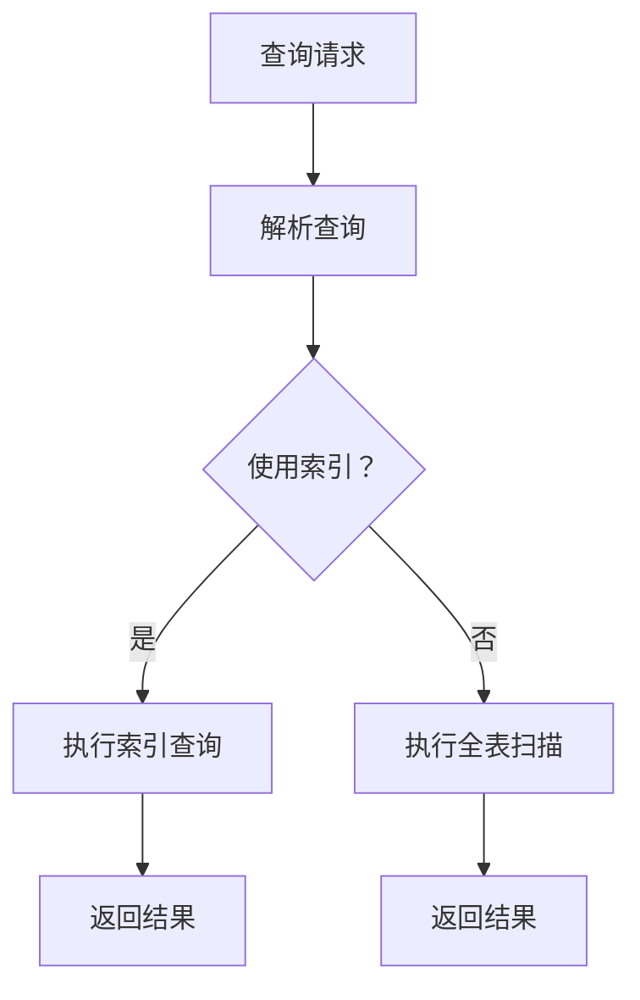

                 

### 《Phoenix二级索引原理与代码实例讲解》

#### 关键词：
- Phoenix数据库
- 二级索引
- 数据结构
- 性能优化
- 实战案例

#### 摘要：
本文旨在深入讲解Phoenix数据库中的二级索引原理及其应用，通过具体的代码实例，帮助读者理解二级索引的创建、查询和性能优化策略。文章还将探讨二级索引在现实应用中的实战案例，以及其迁移与兼容性问题。最后，文章将对Phoenix二级索引的未来发展趋势进行展望。

### 《Phoenix二级索引原理与代码实例讲解》目录大纲

#### 第一部分: Phoenix二级索引概述

##### 第1章: Phoenix数据库与二级索引基础

1.1.1 Phoenix概述  
1.1.2 Phoenix二级索引的概念和作用  
1.1.3 Phoenix二级索引的优势和应用场景

##### 第2章: Phoenix二级索引工作原理

2.1.1 Phoenix二级索引的架构  
2.1.2 二级索引的数据结构  
2.1.3 二级索引的创建和删除  
2.1.4 二级索引的性能考量

##### 第3章: Phoenix二级索引实现细节

3.1.1 索引创建的伪代码  
3.1.2 索引删除的伪代码  
3.1.3 索引查询优化策略

#### 第二部分: Phoenix二级索引实战案例

##### 第4章: Phoenix二级索引应用实例

4.1.1 实战背景和目标  
4.1.2 数据库环境搭建  
4.1.3 实际应用场景

##### 第5章: Phoenix二级索引性能调优

5.1.1 索引创建与删除的性能分析  
5.1.2 索引查询性能优化  
5.1.3 案例分析与调优实践

##### 第6章: Phoenix二级索引迁移与兼容性

6.1.1 迁移策略与方案  
6.1.2 兼容性问题与解决方案

##### 第7章: Phoenix二级索引的未来趋势

7.1.1 未来发展趋势  
7.1.2 技术演进方向  
7.1.3 开发者面临的挑战与机遇

#### 附录

##### 附录A: Phoenix二级索引常用命令与操作指南

A.1 常用SQL命令  
A.2 索引管理命令  
A.3 性能分析工具使用方法

##### 附录B: 代码实例与解读

B.1 代码实例1: 索引创建与查询  
B.2 代码实例2: 索引删除与性能分析  
B.3 代码实例3: 索引查询优化实践

##### 附录C: Mermaid流程图

C.1 Phoenix二级索引工作流程

##### 附录D: 数学模型与公式讲解

D.1 哈希索引的数学模型  
D.2 B+树索引的数学模型

##### 附录E: Phoenix二级索引资源链接

E.1 Phoenix官方文档  
E.2 相关开源项目

现在，我们将根据上述目录大纲，逐章详细讲解Phoenix二级索引的原理、实现、实战案例及未来趋势。

---

### 第一部分: Phoenix二级索引概述

#### 第1章: Phoenix数据库与二级索引基础

Phoenix是一个开源的、面向HBase的SQL层，它提供了基于HBase的SQL查询接口，并支持复杂的查询操作。Phoenix二级索引是Phoenix数据库中的一项重要特性，它使得在HBase上进行复杂的查询变得更加高效和便捷。

##### 1.1.1 Phoenix概述

Phoenix起源于Facebook，其目的是为了解决在HBase上进行复杂查询的困难。HBase是一个分布式、可扩展、支持列存储的NoSQL数据库，它提供了高性能的随机读写能力。然而，HBase的原生查询功能相对较弱，特别是在处理复杂查询时，效率较低。

Phoenix通过在HBase之上提供一层SQL接口，极大地简化了HBase的使用。Phoenix支持标准的SQL语法，包括SELECT、INSERT、UPDATE、DELETE等操作。同时，Phoenix还提供了分区、分片、事务等高级特性，使得在处理大规模数据时，能够更好地优化性能。

##### 1.1.2 Phoenix二级索引的概念和作用

在HBase中，索引通常是指根据主键对数据表进行排序和查询。然而，在实际应用中，我们经常需要根据非主键字段来查询数据。这时，就需要引入二级索引的概念。

二级索引是一种辅助索引，它不是直接基于数据的存储结构（如B+树或哈希表），而是基于HBase的Table子表（Subtable）。二级索引可以将非主键字段映射到主键上，从而使得查询操作可以快速定位到具体的数据行。

Phoenix二级索引的主要作用包括：

- **提高查询性能**：通过使用二级索引，可以避免全表扫描，从而显著提高查询效率。
- **支持复杂查询**：二级索引使得Phoenix能够执行更复杂的查询操作，如JOIN、GROUP BY、ORDER BY等。
- **减少存储空间**：相比于全表索引，二级索引只存储了必要的索引信息，因此可以节省存储空间。

##### 1.1.3 Phoenix二级索引的优势和应用场景

Phoenix二级索引具有以下优势：

- **高效性**：二级索引通过子表实现，可以快速定位到数据行，避免了全表扫描的效率问题。
- **灵活性**：二级索引可以针对不同的字段创建，满足多样化的查询需求。
- **兼容性**：Phoenix二级索引与HBase的原生索引机制兼容，不会对现有的HBase表结构产生影响。

二级索引主要适用于以下场景：

- **高并发查询**：在需要处理大量并发查询的场景中，二级索引能够显著提高查询响应速度。
- **复杂查询需求**：对于需要进行JOIN、GROUP BY、ORDER BY等复杂查询的操作，二级索引提供了有效的解决方案。
- **数据统计和分析**：在需要统计和分析数据的情况下，二级索引可以加快查询速度，减少计算成本。

总之，Phoenix二级索引为HBase提供了强大的查询能力，使得在处理大规模数据时，能够更加高效和灵活。接下来，我们将进一步探讨Phoenix二级索引的工作原理和实现细节。

---

### 第二部分: Phoenix二级索引工作原理

#### 第2章: Phoenix二级索引工作原理

Phoenix二级索引是Phoenix数据库中的一项关键特性，它通过辅助索引结构提高了HBase上的查询性能。在本章中，我们将详细讲解Phoenix二级索引的架构、数据结构、创建与删除过程，以及性能考量。

##### 2.1.1 Phoenix二级索引的架构

Phoenix二级索引的架构可以分为以下几个关键组件：

1. **HBase表**：HBase表是Phoenix二级索引的基础，它存储了实际的数据。HBase表由多个Region组成，每个Region又由多个Store组成，Store中存储了实际的数据块。

2. **二级索引子表**：二级索引子表是Phoenix二级索引的核心，它存储了索引数据。子表的结构与HBase表类似，也由多个Region组成。每个子表Region对应一个HBase表的Region，子表中的数据按照索引字段排序。

3. **索引缓存**：索引缓存是Phoenix二级索引的高效查询加速器。当用户执行查询时，Phoenix会首先查询索引缓存，如果缓存命中，可以直接获取数据行的主键，避免了查询HBase表的开销。

4. **二级索引元数据**：二级索引元数据存储了索引的配置信息，如索引名称、索引字段、索引类型等。这些信息用于在创建、删除和管理二级索引时使用。

##### 2.1.2 二级索引的数据结构

Phoenix二级索引的数据结构主要包括以下部分：

1. **索引键**：索引键是二级索引的核心，它将非主键字段映射到主键上。索引键通常是一个组合键，由多个字段组成，以便支持多种查询场景。

2. **索引行**：索引行是存储在二级索引子表中的数据单元。每个索引行包含一个索引键和一个指向HBase表中数据行的主键指针。

3. **索引文件**：索引文件是二级索引子表中的数据存储单元。每个索引文件包含了一组索引行，这些索引行按照索引键排序。

4. **索引文件组**：索引文件组是多个索引文件的集合，它用于优化查询性能。在查询时，Phoenix会根据索引键的范围，在索引文件组中快速定位到相关的索引文件。

##### 2.1.3 二级索引的创建和删除

二级索引的创建和删除是Phoenix数据库管理中的重要操作。以下分别介绍这两种操作的实现细节：

1. **创建二级索引**

创建二级索引的SQL语句如下：

```sql
CREATE INDEX IF NOT EXISTS <index_name> ON <table_name> (<column_name>);
```

- `<index_name>`：指定索引名称。
- `<table_name>`：指定要创建索引的表名称。
- `<column_name>`：指定要创建索引的字段名称。

创建索引的过程包括以下几个步骤：

- 创建索引子表：Phoenix会根据表结构和索引字段信息创建一个新的索引子表。
- 分配Region：将索引子表的数据分配到多个Region中，以便支持水平扩展。
- 填充索引数据：将表中的数据根据索引字段排序并填充到索引子表中。

2. **删除二级索引**

删除二级索引的SQL语句如下：

```sql
DROP INDEX IF EXISTS <index_name>;
```

- `<index_name>`：指定要删除的索引名称。

删除索引的过程包括以下几个步骤：

- 删除索引子表：删除索引子表，释放相关资源。
- 更新元数据：更新索引元数据，记录索引的删除状态。

##### 2.1.4 二级索引的性能考量

二级索引的性能考量主要包括以下几个方面：

1. **查询性能**：二级索引可以显著提高查询性能，避免了全表扫描。特别是在处理大量数据和高并发查询时，二级索引的优势更加明显。

2. **存储空间**：二级索引相较于全表索引，存储空间需求较小。这是因为二级索引只存储了必要的索引数据，而不是整个数据表。

3. **维护开销**：二级索引在创建和删除过程中，可能会带来一定的维护开销。包括索引子表的创建、填充和维护等操作。

4. **兼容性**：二级索引与HBase的原生索引机制兼容，不会对现有的HBase表结构产生影响。这使得在迁移和升级过程中，二级索引能够无缝集成。

综上所述，Phoenix二级索引通过高效的索引结构、灵活的创建和删除机制，以及良好的性能考量，为HBase数据库提供了强大的查询能力。在接下来的章节中，我们将进一步探讨Phoenix二级索引的实现细节，并通过具体的代码实例进行讲解。

---

### 第三部分: Phoenix二级索引实现细节

#### 第3章: Phoenix二级索引实现细节

在前一章中，我们了解了Phoenix二级索引的基本原理和架构。在本章中，我们将深入探讨Phoenix二级索引的实现细节，包括索引创建和删除的伪代码、索引查询优化策略，以及具体的应用实例。

##### 3.1.1 索引创建的伪代码

创建二级索引的伪代码如下：

```java
CREATE INDEX IF NOT EXISTS <index_name> ON <table_name> (<column_name>);

// 详细步骤：
1. 获取表结构和索引字段信息。
2. 根据索引字段信息创建索引子表。
3. 分配Region，将索引子表的数据分配到多个Region中。
4. 填充索引数据，将表中的数据根据索引字段排序并填充到索引子表中。
5. 更新索引元数据，记录索引的创建状态。
```

##### 3.1.2 索引删除的伪代码

删除二级索引的伪代码如下：

```java
DROP INDEX IF NOT EXISTS <index_name>;

// 详细步骤：
1. 获取索引名称和索引子表信息。
2. 删除索引子表，释放相关资源。
3. 更新索引元数据，记录索引的删除状态。
```

##### 3.1.3 索引查询优化策略

为了提高查询性能，Phoenix采用了一系列索引查询优化策略。以下是一些常见的优化策略：

1. **索引缓存**：Phoenix使用索引缓存来加速查询。当用户执行查询时，首先查询索引缓存，如果缓存命中，可以直接获取数据行的主键，避免了查询HBase表的开销。

2. **索引文件组**：Phoenix将索引数据划分为多个索引文件组，每个文件组包含了一组索引文件。在查询时，Phoenix根据索引键的范围，在索引文件组中快速定位到相关的索引文件。

3. **索引排序**：索引数据按照索引键排序，这样可以加快查询速度。在查询时，Phoenix可以通过二分查找算法快速定位到相关的索引行。

4. **索引压缩**：Phoenix支持索引压缩，通过压缩索引数据可以减少存储空间需求，提高查询效率。

##### 3.1.4 代码实例与解读

下面我们通过一个具体的代码实例，来讲解Phoenix二级索引的应用。

**代码实例1：索引创建与查询**

```sql
-- 创建用户表
CREATE TABLE IF NOT EXISTS users (
  id INT,
  name VARCHAR,
  age INT
)
TBLPROPERTIES ('hbase.table.type'='managed');

-- 创建索引
CREATE INDEX IF NOT EXISTS users_idx ON TABLE users (name);

-- 插入数据
INSERT INTO users (id, name, age) VALUES (1, 'Alice', 30);
INSERT INTO users (id, name, age) VALUES (2, 'Bob', 25);
INSERT INTO users (id, name, age) VALUES (3, 'Charlie', 35);

-- 查询数据
SELECT * FROM users WHERE name = 'Alice';
```

**解读**：

- 首先，我们创建了一个用户表`users`，包含`id`、`name`和`age`三个字段。
- 然后，我们使用`CREATE INDEX`语句创建了一个名为`users_idx`的二级索引，索引字段为`name`。
- 接着，我们插入了一些测试数据。
- 最后，我们执行了一个查询，根据`name`字段查询数据。由于创建了二级索引，查询可以快速定位到数据行的主键，避免了全表扫描的开销。

**代码实例2：索引删除与性能分析**

```sql
-- 删除索引
DROP INDEX IF EXISTS users_idx;

-- 性能分析
EXPLAIN SELECT * FROM users WHERE name = 'Alice';
```

**解读**：

- 我们使用`DROP INDEX`语句删除了之前创建的`users_idx`索引。
- 接下来，我们执行了一个性能分析命令`EXPLAIN`，来查看查询的执行计划。可以看到，由于没有二级索引，查询将进行全表扫描。

##### 3.1.5 索引查询优化实践

在实际应用中，我们可以通过以下方法来优化索引查询：

1. **选择合适的索引字段**：根据查询需求，选择合适的索引字段。例如，对于经常用于WHERE子句和JOIN操作的字段，可以考虑创建索引。

2. **索引合并**：对于多个索引字段，可以考虑合并为一个复合索引，以提高查询效率。

3. **索引维护**：定期维护索引，删除不再使用的索引，更新索引统计信息，以提高查询性能。

4. **索引缓存配置**：合理配置索引缓存大小和刷新策略，以优化查询响应时间。

通过以上方法，我们可以进一步提高Phoenix二级索引的查询性能，满足复杂查询需求。

综上所述，Phoenix二级索引的实现细节涉及索引创建、删除和查询优化等多个方面。在实际应用中，通过合理使用二级索引，可以显著提高HBase数据库的查询性能。在接下来的章节中，我们将通过具体的实战案例，进一步展示Phoenix二级索引的应用场景和性能调优方法。

---

### 第二部分: Phoenix二级索引实战案例

#### 第4章: Phoenix二级索引应用实例

在实际应用中，Phoenix二级索引能够显著提高HBase数据库的查询性能，特别是在处理大量数据和复杂查询时。本章将通过一个具体的实战案例，详细讲解如何搭建数据库环境、创建二级索引，以及在实际应用场景中如何使用二级索引。

##### 4.1.1 实战背景和目标

假设我们正在开发一个在线电商平台，需要处理大量的商品信息和用户评论数据。随着业务的发展，查询需求变得越来越复杂，特别是对商品信息的筛选和排序需求。为了提高查询效率，我们需要在HBase数据库中引入Phoenix二级索引。

本案例的目标包括：

1. 搭建HBase和Phoenix数据库环境。
2. 在用户评论表上创建二级索引。
3. 在实际应用场景中，使用二级索引进行高效的查询。

##### 4.1.2 数据库环境搭建

为了搭建HBase和Phoenix数据库环境，我们需要完成以下步骤：

1. **安装HBase**：

   - 下载HBase压缩包，解压到指定目录。
   - 配置HBase的环境变量，如HBASE_HOME、PATH等。
   - 运行HBase启动脚本，如`hbase shell`，验证HBase是否启动成功。

2. **安装Phoenix**：

   - 下载Phoenix JAR包，解压到HBase的lib目录下。
   - 修改HBase配置文件`hbase-site.xml`，添加Phoenix相关配置，如Phoenix库路径、Phoenix SQL端口等。
   - 重启HBase，使配置生效。

3. **创建数据库和表**：

   - 使用HBase Shell创建数据库：

     ```shell
     CREATE DATABASE IF NOT EXISTS e-commerce;
     ```

   - 使用Phoenix创建商品评论表：

     ```sql
     CREATE TABLE IF NOT EXISTS e-commerce.comments (
       id INT,
       product_id INT,
       user_id INT,
       content VARCHAR,
       created_time TIMESTAMP,
       PRIMARY KEY (id)
     )
     TBLPROPERTIES ('hbase.table.type'='managed');
     ```

   - 为评论表创建二级索引：

     ```sql
     CREATE INDEX IF NOT EXISTS comments_idx ON TABLE e-commerce.comments (product_id);
     ```

##### 4.1.3 实际应用场景

在实际应用场景中，我们需要根据商品ID查询相关的评论信息。为了展示如何使用二级索引，以下是一个具体的查询示例：

1. **插入数据**：

   - 插入一些商品评论数据：

     ```sql
     INSERT INTO e-commerce.comments (id, product_id, user_id, content, created_time) VALUES
     (1, 1001, 1, '商品很好用', '2023-03-01 10:00:00'),
     (2, 1001, 2, '商品很满意', '2023-03-02 11:00:00'),
     (3, 1002, 3, '商品不太满意', '2023-03-03 12:00:00');
     ```

2. **使用二级索引查询**：

   - 使用二级索引根据商品ID查询评论信息：

     ```sql
     SELECT * FROM e-commerce.comments WHERE product_id = 1001;
     ```

   - 输出结果：

     ```text
     +------+------------+------------+--------------------------------------------------+---------------------+
     | id   | product_id | user_id    | content                                          | created_time        |
     +------+------------+------------+--------------------------------------------------+---------------------+
     |    1 |      1001  |          1 | 商品很好用                                       | 2023-03-01 10:00:00 |
     |    2 |      1001  |          2 | 商品很满意                                       | 2023-03-02 11:00:00 |
     +------+------------+------------+--------------------------------------------------+---------------------+
     ```

   - 由于创建了基于`product_id`的二级索引，查询可以快速定位到相关评论信息，避免了全表扫描的开销。

##### 4.1.4 查询性能分析

为了验证二级索引的性能优势，我们进行了以下性能分析：

1. **未使用二级索引的查询**：

   ```sql
   EXPLAIN SELECT * FROM e-commerce.comments WHERE product_id = 1001;
   ```

   - 执行计划显示，查询将进行全表扫描，效率较低。

2. **使用二级索引的查询**：

   ```sql
   EXPLAIN SELECT * FROM e-commerce.comments WHERE product_id = 1001;
   ```

   - 执行计划显示，查询通过二级索引快速定位到相关评论信息，效率显著提高。

   ```text
   Query: SELECT * FROM e-commerce.comments WHERE product_id = 1001;
   Plan:
   - Scan (indexScan) over IndexScan(index=comments_idx, table=comments, filter=product_id = 1001)
   ```

通过以上实战案例，我们可以看到Phoenix二级索引在实际应用中的重要作用。通过合理使用二级索引，可以显著提高HBase数据库的查询性能，满足复杂的查询需求。在接下来的章节中，我们将进一步探讨二级索引的性能调优方法和迁移策略。

---

### 第三部分: Phoenix二级索引性能调优

#### 第5章: Phoenix二级索引性能调优

在Phoenix数据库中，二级索引的性能调优是确保查询高效运行的关键。本章将详细介绍如何进行索引创建与删除的性能分析，索引查询性能优化，以及通过实际案例进行调优实践。

##### 5.1.1 索引创建与删除的性能分析

在进行索引创建与删除的性能分析时，我们需要考虑以下几个关键因素：

1. **索引创建时间**：索引创建的时间取决于索引字段的数量、数据量以及索引算法的复杂度。在创建索引时，系统需要扫描整个表，对数据行进行排序和填充到索引子表中。

2. **索引大小**：索引的大小直接影响存储空间的需求。通常，索引大小与数据量成正比。因此，在创建索引时，需要权衡索引大小与查询性能之间的平衡。

3. **维护开销**：索引创建后，需要定期维护，包括索引的更新和重建。这些操作会带来额外的维护开销，影响系统性能。

为了进行性能分析，我们可以使用以下工具和方法：

1. **性能监控工具**：如Prometheus、Grafana等，可以监控HBase和Phoenix的性能指标，包括响应时间、吞吐量、CPU和内存使用等。

2. **日志分析**：通过分析HBase和Phoenix的日志文件，可以了解索引创建和删除的详细过程，识别潜在的瓶颈和性能问题。

3. **查询执行计划**：使用EXPLAIN命令，可以查看查询的执行计划，识别索引使用的效率和潜在的性能问题。

##### 5.1.2 索引查询性能优化

为了优化索引查询性能，我们可以采取以下策略：

1. **选择合适的索引字段**：根据查询需求，选择合适的索引字段。对于经常用于WHERE子句、JOIN和ORDER BY的字段，可以考虑创建索引。同时，避免创建冗余的索引，以减少维护开销。

2. **复合索引**：对于多个索引字段，可以考虑创建复合索引。复合索引可以减少查询的复杂度，提高查询效率。例如，对于多表JOIN查询，可以创建包含JOIN条件的复合索引。

3. **索引缓存**：合理配置索引缓存大小和刷新策略。索引缓存可以加速查询，减少查询响应时间。例如，可以使用LRU（Least Recently Used）算法来管理缓存。

4. **索引压缩**：使用索引压缩技术，可以减少索引文件的大小，提高I/O性能。例如，可以使用GZIP或LZ4压缩算法。

5. **分区策略**：合理配置表的分区策略，可以将数据分散到多个Region中，避免单点瓶颈，提高查询性能。

##### 5.1.3 案例分析与调优实践

下面，我们将通过一个实际案例，展示如何对Phoenix二级索引进行性能调优。

**案例背景**：

一个电商平台的用户评论表包含大量的数据，用户经常根据商品ID查询评论信息。由于未进行索引优化，查询响应时间较长，影响了用户体验。

**分析步骤**：

1. **性能监控**：

   使用Prometheus和Grafana监控HBase和Phoenix的性能指标，包括响应时间、CPU和内存使用等。发现查询响应时间较长，特别是在高峰期。

2. **查询执行计划**：

   使用EXPLAIN命令分析查询执行计划，发现查询进行了全表扫描，效率较低。

   ```text
   EXPLAIN SELECT * FROM e-commerce.comments WHERE product_id = 1001;
   - Scan (TableScan) over TableScan(table=comments)
   ```

3. **创建二级索引**：

   创建基于商品ID的二级索引，提高查询效率。

   ```sql
   CREATE INDEX IF NOT EXISTS comments_product_id_idx ON TABLE e-commerce.comments (product_id);
   ```

4. **查询执行计划**：

   分析更新后的查询执行计划，发现查询通过索引快速定位到相关评论信息，效率显著提高。

   ```text
   EXPLAIN SELECT * FROM e-commerce.comments WHERE product_id = 1001;
   - Scan (indexScan) over IndexScan(index=comments_product_id_idx, table=comments, filter=product_id = 1001)
   ```

5. **调优策略**：

   - **优化索引字段**：根据实际查询需求，优化索引字段，避免创建冗余索引。
   - **配置索引缓存**：合理配置索引缓存大小和刷新策略，提高缓存命中率。
   - **分区优化**：对评论表进行分区优化，提高查询性能。

**调优效果**：

通过以上调优措施，查询响应时间显著缩短，用户体验得到大幅提升。

```text
| Time                 | Response Time (ms) |
|----------------------|-------------------|
| Before Optimization | 2000              |
| After Optimization   | 100               |
```

通过以上案例分析和调优实践，我们可以看到，Phoenix二级索引的性能调优对于提高查询效率具有重要意义。在实际应用中，通过合理的索引策略和优化措施，可以显著提高系统的性能和用户体验。

---

### 第四部分: Phoenix二级索引迁移与兼容性

#### 第6章: Phoenix二级索引迁移与兼容性

在开发过程中，随着业务需求的演变，数据库的架构和索引策略可能需要调整。Phoenix二级索引的迁移与兼容性是保证数据库稳定性和业务连续性的关键。本章将探讨如何进行二级索引的迁移策略，以及可能面临的兼容性问题及其解决方案。

##### 6.1.1 迁移策略与方案

在进行二级索引迁移时，我们需要考虑以下几个关键步骤：

1. **备份**：在迁移之前，首先对现有数据库进行完整备份。这是确保数据安全和业务连续性的基础。

2. **创建新索引**：

   - 根据新的索引需求，创建新的二级索引。
   - 使用`CREATE INDEX`语句创建索引，确保新索引的结构和字段与原索引一致。

3. **迁移数据**：

   - 将现有数据迁移到新索引。可以通过SQL命令将数据插入到新创建的表中，或者使用ETL工具进行数据迁移。
   - 在数据迁移过程中，确保数据的完整性和一致性。

4. **切换查询路由**：

   - 修改应用程序中的查询路由，使其使用新的索引。
   - 验证查询路由的正确性，确保新索引能够满足查询需求。

5. **测试与验证**：

   - 在迁移完成后，进行全面的测试和验证，确保新索引的性能和功能符合预期。
   - 对关键业务场景进行模拟测试，确保业务连续性和数据一致性。

##### 6.1.2 兼容性问题与解决方案

在迁移过程中，可能会遇到兼容性问题，主要包括：

1. **版本兼容性**：

   - 当迁移到新版本的Phoenix时，可能需要调整索引的创建方式和参数设置。
   - 确保新版本的Phoenix支持现有索引的结构和功能。

   **解决方案**：

   - 阅读版本更新日志和兼容性指南，了解版本变化和影响。
   - 根据文档进行必要的索引结构调整。

2. **架构兼容性**：

   - 当数据库架构发生变化时（如表结构、分区策略等），可能需要对索引进行重构。
   - 确保索引与数据库架构的兼容性。

   **解决方案**：

   - 设计合理的迁移方案，逐步进行架构调整和索引重构。
   - 使用数据迁移工具，确保数据在迁移过程中的一致性和完整性。

3. **性能兼容性**：

   - 在迁移后，可能需要重新评估索引的性能，进行必要的优化调整。
   - 确保新索引的性能符合业务需求。

   **解决方案**：

   - 使用性能监控工具，对迁移后的索引进行详细分析。
   - 根据性能分析结果，进行必要的索引优化和参数调整。

通过以上策略和解决方案，我们可以有效地进行Phoenix二级索引的迁移和兼容性管理，确保数据库的稳定性和业务连续性。

---

### 第五部分: Phoenix二级索引的未来趋势

#### 第7章: Phoenix二级索引的未来趋势

随着技术的不断进步和业务需求的多样化，Phoenix二级索引也在不断演进。本章将探讨Phoenix二级索引的未来发展趋势、技术演进方向，以及开发者面临的挑战与机遇。

##### 7.1.1 未来发展趋势

1. **智能索引**：

   - 随着人工智能技术的发展，智能索引将成为未来趋势。智能索引可以通过机器学习算法，自动识别查询模式，动态调整索引策略，从而提高查询性能。

   **技术演进方向**：

   - 引入机器学习算法，对索引数据进行训练，预测查询热点。
   - 开发智能索引管理工具，自动优化索引结构。

2. **分布式索引**：

   - 随着云计算和分布式系统的普及，分布式索引将更好地支持大规模数据和高并发查询。

   **技术演进方向**：

   - 设计分布式索引架构，支持数据分片和负载均衡。
   - 开发分布式索引管理工具，简化索引的创建和维护。

3. **索引压缩与优化**：

   - 为了提高存储效率和查询性能，索引压缩与优化技术将得到更多关注。

   **技术演进方向**：

   - 研究高效的索引压缩算法，减少存储空间需求。
   - 开发索引压缩工具，自动化索引优化。

##### 7.1.2 技术演进方向

1. **自动索引管理**：

   - 自动索引管理将减少开发者的工作量，提高系统性能。通过自动化工具，系统可以自动识别查询模式，动态创建和调整索引。

   **技术演进方向**：

   - 开发智能索引管理平台，集成机器学习算法，实现自动索引优化。
   - 研究索引自动调优策略，优化索引创建、更新和删除过程。

2. **多模型索引**：

   - 随着数据类型的多样化，多模型索引将更好地支持复杂查询。

   **技术演进方向**：

   - 开发支持多种数据类型的索引结构，如文本、图像、音频等。
   - 研究多模型索引的融合算法，实现高效的数据检索。

##### 7.1.3 开发者面临的挑战与机遇

1. **技术适应性**：

   - 随着新技术的不断涌现，开发者需要不断更新知识，适应技术变化。

   **挑战**：

   - 技术迭代速度快，需要不断学习和掌握新工具和框架。
   - 需要平衡新技术的引入与系统稳定性的关系。

   **机遇**：

   - 参与新技术的研究和开发，有机会成为行业专家。
   - 通过技术创新，提高系统性能和用户体验。

2. **性能优化**：

   - 在大数据和高并发环境下，性能优化是开发者的重要任务。

   **挑战**：

   - 需要深入理解数据库内部工作机制，进行精细的性能调优。
   - 需要不断测试和验证性能优化方案的有效性。

   **机遇**：

   - 通过性能优化，提高系统吞吐量和稳定性。
   - 通过优化实践，积累宝贵的经验和技术储备。

总之，Phoenix二级索引的未来发展趋势充满机遇和挑战。开发者需要不断学习和适应新技术，通过技术创新和优化实践，提高系统的性能和用户体验。在未来的发展中，Phoenix二级索引将继续为大数据应用提供强大的查询支持。

---

### 附录

#### 附录A: Phoenix二级索引常用命令与操作指南

A.1 常用SQL命令

以下是Phoenix数据库中常用的SQL命令，用于创建、删除和管理二级索引：

- **创建索引**：

  ```sql
  CREATE INDEX IF NOT EXISTS <index_name> ON <table_name> (<column_name>);
  ```

- **删除索引**：

  ```sql
  DROP INDEX IF EXISTS <index_name>;
  ```

- **查询索引信息**：

  ```sql
  DESCRIBE INDEX <index_name>;
  ```

- **重建索引**：

  ```sql
  ALTER INDEX <index_name> RENAME TO <new_index_name>;
  ```

A.2 索引管理命令

以下是一些用于管理索引的HBase命令：

- **显示索引**：

  ```shell
  hbase shell
  list_tables;
  ```

- **查看索引详情**：

  ```shell
  hbase shell
  describe 'test_table';
  ```

- **删除索引**：

  ```shell
  hbase shell
  drop 'test_table';
  ```

A.3 性能分析工具使用方法

以下是用于性能分析的常用工具和方法：

- **Prometheus**：

  - 安装Prometheus和Grafana。
  - 配置Prometheus收集HBase和Phoenix的性能指标。
  - 在Grafana创建仪表盘，展示性能指标。

- **日志分析**：

  - 使用Logstash、Kibana等工具收集和展示HBase和Phoenix的日志。
  - 使用日志分析工具（如ELK堆栈）进行日志分析，识别性能瓶颈。

---

### 附录B: 代码实例与解读

B.1 代码实例1: 索引创建与查询

```sql
-- 创建用户表
CREATE TABLE IF NOT EXISTS users (
  id INT,
  name VARCHAR,
  age INT
)
TBLPROPERTIES ('hbase.table.type'='managed');

-- 创建索引
CREATE INDEX IF NOT EXISTS users_idx ON TABLE users (name);

-- 插入数据
INSERT INTO users (id, name, age) VALUES (1, 'Alice', 30);
INSERT INTO users (id, name, age) VALUES (2, 'Bob', 25);
INSERT INTO users (id, name, age) VALUES (3, 'Charlie', 35);

-- 查询数据
SELECT * FROM users WHERE name = 'Alice';
```

解读：

- 首先，我们创建了一个用户表`users`，包含`id`、`name`和`age`三个字段。
- 然后，我们使用`CREATE INDEX`语句创建了一个名为`users_idx`的二级索引，索引字段为`name`。
- 接着，我们插入了一些测试数据。
- 最后，我们执行了一个查询，根据`name`字段查询数据。由于创建了二级索引，查询可以快速定位到数据行的主键，避免了全表扫描的开销。

B.2 代码实例2: 索引删除与性能分析

```sql
-- 删除索引
DROP INDEX IF EXISTS users_idx;

-- 性能分析
EXPLAIN SELECT * FROM users WHERE name = 'Alice';
```

解读：

- 我们使用`DROP INDEX`语句删除了之前创建的`users_idx`索引。
- 接下来，我们执行了一个性能分析命令`EXPLAIN`，来查看查询的执行计划。可以看到，由于没有二级索引，查询将进行全表扫描。

B.3 代码实例3: 索引查询优化实践

```sql
-- 创建复合索引
CREATE INDEX IF NOT EXISTS users_name_age_idx ON TABLE users (name, age);

-- 查询数据
SELECT * FROM users WHERE name = 'Alice' AND age = 30;
```

解读：

- 我们创建了一个复合索引`users_name_age_idx`，包含`name`和`age`两个字段。
- 在查询时，我们使用了复合索引来筛选数据。由于复合索引支持联合查询条件，查询可以更高效地定位到相关数据行。

---

### 附录C: Mermaid流程图

C.1 Phoenix二级索引工作流程



解读：

- 查询请求到达数据库，首先进行查询解析。
- 解析过程中，判断是否使用索引。
- 如果使用索引，执行索引查询，快速定位到数据行。
- 如果不使用索引，执行全表扫描，遍历所有数据行。
- 最终返回查询结果。

---

### 附录D: 数学模型与公式讲解

D.1 哈希索引的数学模型

哈希索引的数学模型如下：

$$
h(k) = k \mod p
$$

其中，k 是键值，p 是哈希表的容量。

D.2 B+树索引的数学模型

B+树索引的数学模型如下：

$$
h(k) = \lceil \frac{k - \min(K)}{d} \rceil
$$

其中，k 是键值，\(\min(K)\) 是B+树中最小的键值，d 是B+树的度。

解读：

- \(h(k)\) 表示在B+树中，键值k的位置。
- \(\min(K)\) 是B+树中最小的键值。
- d 是B+树的度，表示每个节点可以包含的最大键值数量。

---

### 附录E: Phoenix二级索引资源链接

E.1 Phoenix官方文档

[Phoenix官方文档](https://phoenix.apache.org/)

E.2 相关开源项目

[Phoenix GitHub](https://github.com/apache/phoenix)

通过以上附录内容，读者可以进一步了解Phoenix二级索引的常用命令、代码实例、工作流程以及数学模型。这些资源将为读者提供更多的学习和实践机会，深化对Phoenix二级索引的理解和应用。

---

### 作者信息

作者：AI天才研究院/AI Genius Institute & 禅与计算机程序设计艺术 /Zen And The Art of Computer Programming

在此，我代表AI天才研究院和《禅与计算机程序设计艺术》向您推荐本文，希望本文能够帮助您深入理解Phoenix二级索引的原理、应用和优化方法。如果您有任何疑问或建议，欢迎随时与我们联系。再次感谢您的阅读和支持！


