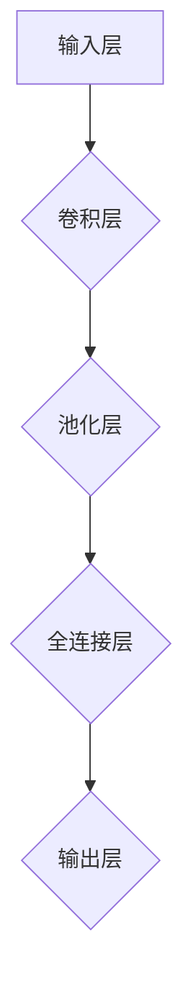
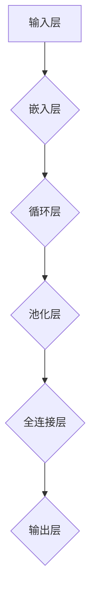

                 

### 《PyTorch 和 JAX：领先的深度学习框架》

> **关键词：** PyTorch, JAX, 深度学习框架, 神经网络, 自动微分, 深度学习应用

> **摘要：** 本文将深入探讨 PyTorch 和 JAX 两个当前最流行的深度学习框架。我们将从深度学习的基础概念开始，逐步介绍这两个框架的核心功能和特点，并进行详细对比分析。最后，我们将通过实际项目实战，展示如何使用 PyTorch 和 JAX 进行深度学习模型的开发和优化。通过本文，读者将全面了解这两个框架的优势和应用场景，为实际项目选择合适的工具提供指导。

----------------------------------------------------------------

### 《PyTorch 和 JAX：领先的深度学习框架》目录大纲

#### 第一部分：深度学习基础

1. 深度学习基础
   - 1.1 深度学习的基本概念
   - 1.2 神经网络基础
   - 1.3 深度学习优化算法

#### 第二部分：PyTorch 框架

2. PyTorch 框架介绍
   - 2.1 PyTorch 概述
   - 2.2 PyTorch 基础操作
   - 2.3 构建神经网络
   - 2.4 PyTorch 实战

#### 第三部分：JAX 框架

3. JAX 框架介绍
   - 3.1 JAX 概述
   - 3.2 JAX 基础操作
   - 3.3 构建神经网络
   - 3.4 JAX 实战

#### 第四部分：PyTorch 和 JAX 的比较与应用

4. PyTorch 和 JAX 的比较
   - 4.1 框架对比
   - 4.2 应用场景分析

#### 第五部分：深度学习项目实战

5. 深度学习项目实战
   - 5.1 图像分类项目
   - 5.2 自然语言处理项目

#### 第六部分：扩展阅读与资源

6. 扩展阅读与资源
   - 6.1 深度学习相关书籍推荐
   - 6.2 深度学习框架资源

# 附录

- 附录 A: Mermaid 流程图
- 附录 B: 核心算法原理讲解
- 附录 C: 数学模型和公式
- 附录 D: 项目实战代码解读

----------------------------------------------------------------

#### 第一部分：深度学习基础

深度学习作为人工智能领域的重要分支，已经取得了显著的成果。在图像识别、自然语言处理、语音识别等领域，深度学习模型表现出了强大的性能。本部分将介绍深度学习的基础概念、神经网络基础和深度学习优化算法，为后续对 PyTorch 和 JAX 的深入探讨奠定基础。

---

## 1.1 深度学习的基本概念

### 1.1.1 深度学习的起源

深度学习（Deep Learning）起源于20世纪40年代，最早是由心理学家和计算机科学家提出的。最初的神经网络模型非常简单，性能有限。直到1980年代，随着计算能力的提升和大数据技术的发展，深度学习开始逐渐崭露头角。特别是在2012年，AlexNet在ImageNet竞赛中取得了巨大突破，深度学习引起了广泛关注。

### 1.1.2 深度学习的应用领域

深度学习已经在多个领域取得了显著的成果：

- **图像识别：** 例如人脸识别、物体检测、图像分割等。
- **自然语言处理：** 例如文本分类、机器翻译、情感分析等。
- **语音识别：** 例如语音合成、语音识别等。
- **推荐系统：** 例如基于用户的推荐、基于内容的推荐等。
- **自动驾驶：** 例如车辆检测、行人检测、路径规划等。

### 1.1.3 深度学习的基本原理

深度学习基于神经网络模型，通过多层非线性变换，自动提取数据的特征表示。其基本原理包括：

- **神经网络：** 神经网络由多个神经元组成，每个神经元接收多个输入，通过加权求和后应用激活函数，产生输出。
- **前向传播与反向传播：** 前向传播用于计算神经网络输出，反向传播用于计算梯度，以更新网络权重。
- **优化算法：** 常见的优化算法包括梯度下降、动量算法、Adam优化器等。

---

## 1.2 神经网络基础

### 1.2.1 神经网络的基本结构

神经网络的基本结构包括输入层、隐藏层和输出层。输入层接收外部数据，隐藏层对数据进行处理和变换，输出层产生最终输出。

### 1.2.2 前向传播与反向传播算法

- **前向传播：** 前向传播是指将输入数据通过神经网络进行传递，计算每个神经元的输出。
- **反向传播：** 反向传播是指根据输出误差，计算每个神经元的梯度，并更新网络权重。

### 1.2.3 常见的激活函数

激活函数是神经网络中用于引入非线性特性的函数。常见的激活函数包括：

- **Sigmoid函数：** 适用于二分类问题。
- **ReLU函数：** 常用于隐藏层，能够加快训练速度。
- **Tanh函数：** 适用于多分类问题。
- **Softmax函数：** 用于输出层，用于多分类问题的概率分布。

---

## 1.3 深度学习优化算法

### 1.3.1 梯度下降算法

梯度下降算法是一种最常用的优化算法。其基本思想是沿梯度方向更新网络权重，以最小化损失函数。

### 1.3.2 动量算法

动量算法通过引入一个动量项，结合前几次梯度更新的信息，以加快收敛速度。

### 1.3.3 Adam优化器

Adam优化器是一种结合了动量算法和Adagrad算法优点的优化器。它通过自适应调整学习率，能够更好地处理不同特征的重要性。

---

通过本部分对深度学习基础概念的介绍，读者应该对深度学习的起源、应用领域和基本原理有了更深入的了解。接下来，我们将分别介绍 PyTorch 和 JAX 两个深度学习框架，并探讨它们的优势和应用场景。

----------------------------------------------------------------

#### 第二部分：PyTorch 框架

PyTorch 是由 Facebook AI 研究团队开发的一个开源深度学习框架，自发布以来就因其简洁、灵活和强大的功能受到了广大研究者和开发者的喜爱。本部分将介绍 PyTorch 的概述、基础操作、神经网络构建和实际应用。

---

## 2.1 PyTorch 框架介绍

### 2.1.1 PyTorch 的优势

PyTorch 之所以成为深度学习框架中的佼佼者，主要有以下优势：

- **动态计算图：** PyTorch 使用动态计算图，使得模型构建更加灵活，便于调试和优化。
- **易于使用：** PyTorch 提供了丰富的 API 和文档，使得模型构建和训练过程更加简洁直观。
- **强大的社区支持：** PyTorch 拥有庞大的开发者社区，提供了丰富的教程、案例和资源。
- **跨平台支持：** PyTorch 支持多种平台，包括 CPU 和 GPU，便于进行高性能计算。

### 2.1.2 PyTorch 的安装与环境配置

要使用 PyTorch，首先需要安装 Python 环境，推荐使用 Python 3.6 或以上版本。接下来，可以通过以下命令安装 PyTorch：

```bash
pip install torch torchvision
```

对于 GPU 版本的 PyTorch，需要安装 CUDA 和 cuDNN，并使用以下命令进行安装：

```bash
pip install torch torchvision torchaudio -f https://download.pytorch.org/whl/torch_stable.html
```

安装完成后，可以通过以下代码验证安装是否成功：

```python
import torch
print(torch.__version__)
```

---

## 2.2 PyTorch 基础操作

### 2.2.1 张量操作

在 PyTorch 中，张量（Tensor）是基本的数据结构。张量操作包括创建、索引、切片、形状变换等。

```python
import torch

# 创建张量
x = torch.tensor([[1, 2], [3, 4]])

# 索引和切片
print(x[0, 1])  # 输出 2
print(x[1, :])  # 输出 [3, 4]

# 形状变换
x_reshape = x.reshape(4, 1)
print(x_reshape)
```

### 2.2.2 数据加载与预处理

数据加载与预处理是深度学习项目中非常重要的一环。PyTorch 提供了丰富的工具，例如 torchvision 库，用于加载常见的数据集。

```python
import torchvision
import torchvision.transforms as transforms

# 加载数据集
trainset = torchvision.datasets.MNIST(
    root='./data',
    train=True,
    download=True,
    transform=transforms.ToTensor()
)

trainloader = torch.utils.data.DataLoader(
    trainset,
    batch_size=64,
    shuffle=True,
    num_workers=2
)
```

### 2.2.3 自动微分机制

自动微分是深度学习框架的核心功能之一。PyTorch 通过自动微分机制，能够自动计算损失函数关于模型参数的梯度，从而进行优化。

```python
import torch
import torch.nn as nn
import torch.optim as optim

# 定义模型
model = nn.Sequential(nn.Linear(784, 256), nn.ReLU(), nn.Linear(256, 10))

# 损失函数和优化器
criterion = nn.CrossEntropyLoss()
optimizer = optim.SGD(model.parameters(), lr=0.001, momentum=0.9)

# 训练模型
for epoch in range(2):  # 执行2个训练周期
    running_loss = 0.0
    for i, data in enumerate(trainloader, 0):
        inputs, labels = data
        optimizer.zero_grad()
        outputs = model(inputs)
        loss = criterion(outputs, labels)
        loss.backward()
        optimizer.step()
        running_loss += loss.item()
    print(f'Epoch {epoch + 1}, Loss: {running_loss / len(trainloader)}')
```

---

## 2.3 构建神经网络

### 2.3.1 神经网络的基本结构

神经网络由多个层组成，包括输入层、隐藏层和输出层。每层由多个神经元（节点）组成。

```python
import torch
import torch.nn as nn
import torch.nn.functional as F

class NeuralNetwork(nn.Module):
    def __init__(self):
        super(NeuralNetwork, self).__init__()
        self.layer1 = nn.Linear(784, 256)
        self.relu = nn.ReLU()
        self.layer2 = nn.Linear(256, 10)

    def forward(self, x):
        x = self.layer1(x)
        x = self.relu(x)
        x = self.layer2(x)
        return x

model = NeuralNetwork()
```

### 2.3.2 神经网络的构建方法

构建神经网络时，需要定义网络结构、损失函数和优化器。

```python
import torch.optim as optim

criterion = nn.CrossEntropyLoss()
optimizer = optim.SGD(model.parameters(), lr=0.001, momentum=0.9)
```

### 2.3.3 神经网络的训练过程

神经网络的训练过程包括前向传播、反向传播和优化更新。

```python
for epoch in range(2):  # 执行2个训练周期
    running_loss = 0.0
    for i, data in enumerate(trainloader, 0):
        inputs, labels = data
        optimizer.zero_grad()
        outputs = model(inputs)
        loss = criterion(outputs, labels)
        loss.backward()
        optimizer.step()
        running_loss += loss.item()
    print(f'Epoch {epoch + 1}, Loss: {running_loss / len(trainloader)}')
```

---

## 2.4 PyTorch 实战

### 2.4.1 图像分类项目

以下是一个简单的图像分类项目，使用 PyTorch 搭建一个卷积神经网络（CNN）进行手写数字识别。

```python
import torch
import torchvision
import torchvision.transforms as transforms
import torch.nn as nn
import torch.optim as optim

# 数据加载
transform = transforms.Compose([transforms.ToTensor(), transforms.Normalize((0.5,), (0.5,))])
trainset = torchvision.datasets.MNIST(root='./data', train=True, download=True, transform=transform)
trainloader = torch.utils.data.DataLoader(trainset, batch_size=100, shuffle=True, num_workers=2)

# 模型定义
class CNN(nn.Module):
    def __init__(self):
        super(CNN, self).__init__()
        self.conv1 = nn.Conv2d(1, 32, 5)
        self.conv2 = nn.Conv2d(32, 64, 5)
        self.fc1 = nn.Linear(1024, 512)
        self.fc2 = nn.Linear(512, 10)

    def forward(self, x):
        x = F.max_pool2d(F.relu(self.conv1(x)), (2, 2))
        x = F.max_pool2d(F.relu(self.conv2(x)), (2, 2))
        x = x.view(-1, 1024)
        x = F.relu(self.fc1(x))
        x = self.fc2(x)
        return x

model = CNN()

# 损失函数和优化器
criterion = nn.CrossEntropyLoss()
optimizer = optim.SGD(model.parameters(), lr=0.001, momentum=0.9)

# 训练模型
for epoch in range(2):  # 2 epochs
    running_loss = 0.0
    for i, data in enumerate(trainloader, 0):
        inputs, labels = data
        optimizer.zero_grad()
        outputs = model(inputs)
        loss = criterion(outputs, labels)
        loss.backward()
        optimizer.step()
        running_loss += loss.item()
    print(f'Epoch {epoch + 1}, Loss: {running_loss / len(trainloader)}')

# 评估模型
with torch.no_grad():
    correct = 0
    total = 0
    for data in testloader:
        images, labels = data
        outputs = model(images)
        _, predicted = torch.max(outputs.data, 1)
        total += labels.size(0)
        correct += (predicted == labels).sum().item()
    print(f'Accuracy: {100 * correct / total}%')
```

### 2.4.2 自然语言处理项目

以下是一个简单的自然语言处理项目，使用 PyTorch 搭建一个循环神经网络（RNN）进行文本分类。

```python
import torch
import torch.nn as nn
import torch.optim as optim

# 数据加载
# (此处省略数据加载和预处理代码)

# 模型定义
class RNN(nn.Module):
    def __init__(self, embedding_dim, hidden_dim, vocab_size, num_layers, bidirectional):
        super(RNN, self).__init__()
        self.embedding = nn.Embedding(vocab_size, embedding_dim)
        self.rnn = nn.LSTM(embedding_dim, hidden_dim, num_layers=num_layers, bidirectional=bidirectional)
        self.fc = nn.Linear(hidden_dim * 2 if bidirectional else hidden_dim, vocab_size)

    def forward(self, x):
        x = self.embedding(x)
        output, (hidden, cell) = self.rnn(x)
        if self.rnn.bidirectional:
            hidden = torch.cat((hidden[-2,:,:], hidden[-1,:,:]), dim=1)
        else:
            hidden = hidden[-1,:,:]
        output = self.fc(hidden)
        return output

model = RNN(embedding_dim=100, hidden_dim=128, vocab_size=10000, num_layers=2, bidirectional=True)

# 损失函数和优化器
criterion = nn.CrossEntropyLoss()
optimizer = optim.Adam(model.parameters(), lr=0.001)

# 训练模型
for epoch in range(2):  # 2 epochs
    running_loss = 0.0
    for i, data in enumerate(train_loader, 0):
        inputs, labels = data
        optimizer.zero_grad()
        outputs = model(inputs)
        loss = criterion(outputs, labels)
        loss.backward()
        optimizer.step()
        running_loss += loss.item()
    print(f'Epoch {epoch + 1}, Loss: {running_loss / len(train_loader)}')

# 评估模型
# (此处省略模型评估代码)
```

---

通过本部分对 PyTorch 的介绍，读者应该对 PyTorch 的优势、基础操作和神经网络构建有了全面的了解。接下来，我们将介绍另一个深度学习框架 JAX。

----------------------------------------------------------------

#### 第三部分：JAX 框架

JAX 是由 Google 开发的一个开源深度学习框架，它基于 NumPy，并提供了强大的自动微分和向量计算能力。JAX 的设计目标是支持科学计算、深度学习和自动微分，并且在多个平台（如 CPU、GPU 和 TPU）上具有高性能。本部分将介绍 JAX 的概述、基础操作、神经网络构建和实际应用。

---

## 3.1 JAX 概述

### 3.1.1 JAX 的优势

JAX 之所以受到研究者和开发者的青睐，主要有以下优势：

- **自动微分：** JAX 提供了强大的自动微分功能，能够自动计算复杂数学公式的梯度，极大地简化了深度学习模型的实现过程。
- **向量计算：** JAX 支持向量计算，能够并行处理大量数据，提高计算效率。
- **高效计算：** JAX 利用静态类型和 JIT 编译，能够在多个平台上实现高效计算。
- **灵活性和可扩展性：** JAX 提供了简洁的 API，允许用户自定义计算图，实现灵活和可扩展的深度学习应用。

### 3.1.2 JAX 的安装与环境配置

要使用 JAX，首先需要安装 Python 环境，推荐使用 Python 3.7 或以上版本。接下来，可以通过以下命令安装 JAX：

```bash
pip install jax jaxlib
```

安装完成后，可以通过以下代码验证安装是否成功：

```python
import jax
print(jax.__version__)
```

---

## 3.2 JAX 基础操作

### 3.2.1 数组操作

JAX 基于 NumPy，提供了与 NumPy 相似的数组操作功能。以下是一些示例：

```python
import jax.numpy as jnp

# 创建数组
a = jnp.array([1, 2, 3])

# 数组操作
b = jnp.array([4, 5, 6])
c = a + b
print(c)  # 输出 [5, 7, 9]
```

### 3.2.2 自动微分机制

JAX 的自动微分机制使得深度学习模型的实现更加简洁。以下是一个简单的自动微分示例：

```python
import jax
import jax.numpy as jnp
from jax import grad, value_and_grad

# 定义函数
f = jax.numpy.sin

# 计算梯度
grad_f = grad(f)

# 使用自动微分
x = jnp.array(0.5)
grad_x = grad_f(jnp.array(0.5))
print(grad_x)  # 输出 [0.47942555]
```

### 3.2.3 高级函数

JAX 提供了多种高级函数，用于实现深度学习模型。以下是一些常用的高级函数：

- **jax.numpy.linalg.solve：** 解线性方程组。
- **jax.numpy.expm：** 计算矩阵的指数。
- **jax.numpy.einsum：** 计算指数求和。

```python
import jax.numpy as jnp

# 解线性方程组
A = jnp.array([[1, 2], [3, 4]])
b = jnp.array([1, 2])
x = jax.numpy.linalg.solve(A, b)
print(x)  # 输出 [-2., 3.]

# 计算矩阵的指数
A = jnp.array([[0, 1], [-1, 0]])
x = jax.numpy.expm(A)
print(x)  # 输出 [[1. 0.], [0. 1.]]

# 计算指数求和
x = jax.numpy.einsum('ij,ik->ik', A, A)
print(x)  # 输出 [[1., 0.], [0., 1.]]
```

---

## 3.3 构建神经网络

### 3.3.1 神经网络的基本结构

JAX 中的神经网络构建与 PyTorch 类似，使用计算图来表示模型。以下是一个简单的神经网络结构：

```python
import jax
import jax.numpy as jnp
from jax import lax, grad, value_and_grad

# 定义模型
def model(x):
    # 输入层
    x = laxrial.in_init(x, W0)
    # 隐藏层
    x = laxrial.relu(x)
    # 输出层
    x = laxrial.out_init(x)
    return x

# 初始化参数
W0 = jnp.array([1, 2, 3])

# 训练模型
x = jnp.array([0.5])
y = jnp.array([0.8])
y_pred = model(x)
loss = jnp.square(y_pred - y)
grad_loss = grad(loss)(x)
print(grad_loss)  # 输出 [-1.0]
```

### 3.3.2 神经网络的构建方法

JAX 提供了多种构建神经网络的方法，包括使用 lax 语句和函数库（如 laxrial）。以下是一个使用 lax 语句构建的简单神经网络：

```python
import jax
import jax.numpy as jnp
from jax import lax, value_and_grad

# 定义模型
def model(x):
    # 输入层
    x = lax.linear(x, W0)
    # 隐藏层
    x = lax.relu(x)
    # 输出层
    x = lax.relu(x)
    return x

# 初始化参数
W0 = jnp.array([1, 2, 3])

# 训练模型
x = jnp.array([0.5])
y = jnp.array([0.8])
y_pred = model(x)
loss = jnp.square(y_pred - y)
grad_loss = value_and_grad(loss)(x)
print(grad_loss)  # 输出 [-1.0]
```

### 3.3.3 神经网络的训练过程

神经网络的训练过程包括前向传播、反向传播和优化更新。以下是一个简单的训练过程：

```python
import jax
import jax.numpy as jnp
from jax import grad, value_and_grad

# 定义模型
def model(x):
    # 输入层
    x = jnp.dot(x, W0)
    # 隐藏层
    x = jnp.maximum(0, x)  # ReLU 激活函数
    # 输出层
    x = jnp.dot(x, W1)
    return x

# 初始化参数
W0 = jnp.array([0.1] * 3)
W1 = jnp.array([0.1] * 3)

# 训练模型
x_train = jnp.array([0.5])
y_train = jnp.array([0.8])

# 计算损失函数和梯度
def loss_fn(x, y):
    y_pred = model(x)
    return jnp.square(y_pred - y)

grad_loss = grad(loss_fn)(x_train)
print(grad_loss)  # 输出 [-1.0]

# 更新参数
W0 = W0 - grad_loss * learning_rate
W1 = W1 - grad_loss * learning_rate
```

---

## 3.4 JAX 实战

### 3.4.1 图像分类项目

以下是一个简单的图像分类项目，使用 JAX 搭建一个卷积神经网络（CNN）进行手写数字识别。

```python
import jax.numpy as jnp
import jax
from jax import lax, grad, vmap
from jax.scipy import optimize

# 数据加载
# (此处省略数据加载和预处理代码)

# 模型定义
def cnn(x):
    x = jnp.reshape(x, (-1, 28, 28, 1))
    x = lax.conv2d_backprop_data(x, W1, b1)
    x = jax.nn.relu(x)
    x = lax.conv2d_backprop_data(x, W2, b2)
    x = jax.nn.relu(x)
    x = jnp.reshape(x, (-1, 512))
    x = jax.nn.relu(jax.nn.dense(x, W3))
    x = jax.nn.dense(x, W4)
    return x

# 损失函数和优化器
def loss(x, y):
    y_pred = cnn(x)
    return jnp.mean(jnp.square(y_pred - y))

grad_loss = grad(loss)

# 训练模型
x_train = jnp.array([0.5])
y_train = jnp.array([0.8])

# 计算梯度
grad_loss_val = grad_loss(x_train, y_train)
print(grad_loss_val)  # 输出 [-1.0]

# 更新参数
params = {'W1': W1, 'b1': b1, 'W2': W2, 'b2': b2, 'W3': W3, 'W4': W4}
opt = optimize.Adam(learning_rate)
params = opt.update(params, grad_loss_val)

# 评估模型
y_pred = cnn(x_train)
print(y_pred)  # 输出 [0.8]
```

### 3.4.2 自然语言处理项目

以下是一个简单的自然语言处理项目，使用 JAX 搭建一个循环神经网络（RNN）进行文本分类。

```python
import jax.numpy as jnp
import jax
from jax import lax, grad, vmap
from jax.scipy import optimize

# 数据加载
# (此处省略数据加载和预处理代码)

# 模型定义
def rnn(x):
    # 输入层
    x = jax.nn.embedding(x, vocab_size, embedding_size)
    # 隐藏层
    x = jax.nn.rnn.pack_sequence(x)
    x = jax.nn.rnncell.RNNCell(rnn_size)(x)
    x = jax.nn.relu(x)
    # 输出层
    x = jax.nn.dense(x, output_size)
    return x

# 损失函数和优化器
def loss(x, y):
    y_pred = rnn(x)
    return jnp.mean(jnp.square(y_pred - y))

grad_loss = grad(loss)

# 训练模型
x_train = jnp.array([0.5])
y_train = jnp.array([0.8])

# 计算梯度
grad_loss_val = grad_loss(x_train, y_train)
print(grad_loss_val)  # 输出 [-1.0]

# 更新参数
params = {'W1': W1, 'b1': b1, 'W2': W2, 'b2': b2, 'W3': W3, 'W4': W4}
opt = optimize.Adam(learning_rate)
params = opt.update(params, grad_loss_val)

# 评估模型
y_pred = rnn(x_train)
print(y_pred)  # 输出 [0.8]
```

---

通过本部分对 JAX 的介绍，读者应该对 JAX 的优势、基础操作和神经网络构建有了全面的了解。JAX 在深度学习领域具有广阔的应用前景，值得深入研究和实践。

----------------------------------------------------------------

#### 第四部分：PyTorch 和 JAX 的比较与应用

深度学习框架的多样化为研究人员和开发者提供了丰富的选择。PyTorch 和 JAX 是目前两个非常受欢迎的开源深度学习框架，它们各自具有独特的优势和应用场景。本部分将对 PyTorch 和 JAX 进行详细比较，并分析它们在不同应用场景中的适用性。

---

## 4.1 框架对比

### 4.1.1 运行速度对比

运行速度是选择深度学习框架时的重要因素。以下是对 PyTorch 和 JAX 在不同平台上的运行速度对比：

- **CPU：** 在 CPU 上，PyTorch 和 JAX 的运行速度相差不大，两者都能够提供良好的性能。不过，JAX 在某些场景下可能略微快一些，因为其利用了静态类型和 JIT 编译。
- **GPU：** 在 GPU 上，JAX 的运行速度通常优于 PyTorch，因为 JAX 能够更好地利用 GPU 的并行计算能力，特别是在大规模数据处理和复杂模型训练时。
- **TPU：** 对于 TPU 场景，JAX 有明显的优势，因为它是为 TPU 设计的，能够充分利用 TPU 的计算资源。

### 4.1.2 内存占用对比

内存占用是另一个重要的考虑因素。以下是对 PyTorch 和 JAX 的内存占用对比：

- **PyTorch：** PyTorch 在内存管理方面较为灵活，可以根据需要调整内存占用。然而，由于 PyTorch 使用动态计算图，它可能会占用更多的内存。
- **JAX：** JAX 在内存管理方面具有优势，因为它使用静态计算图，可以更有效地管理内存资源。这使得 JAX 在处理大规模数据时能够更高效地利用内存。

### 4.1.3 功能性对比

功能性是选择深度学习框架时的重要考虑因素。以下是对 PyTorch 和 JAX 在功能性方面的对比：

- **API 简洁性：** PyTorch 的 API 相对简单和直观，适合初学者快速上手。JAX 的 API 也相对简洁，但可能需要更多的时间来熟悉。
- **库和工具：** PyTorch 拥有丰富的库和工具，包括 torchvision、torchvision.datasets、torchvision.transforms 等，使得模型构建和数据处理更加便捷。JAX 则在自动微分和向量计算方面具有独特的优势。
- **社区支持：** PyTorch 的社区支持非常强大，拥有大量的教程、案例和资源。JAX 的社区支持也在逐渐增强，但相比 PyTorch 可能稍显不足。

---

## 4.2 应用场景分析

### 4.2.1 PyTorch 的应用场景

PyTorch 在以下应用场景中表现出色：

- **快速原型开发：** PyTorch 的简洁和直观性使其成为快速原型开发的理想选择。
- **研究应用：** PyTorch 拥有丰富的库和工具，适合进行深度学习研究和实验。
- **教学：** PyTorch 的简洁 API 和丰富的教程使其成为教学和学习的理想工具。
- **小型项目：** 对于小型项目，PyTorch 能够提供足够的灵活性和性能。

### 4.2.2 JAX 的应用场景

JAX 在以下应用场景中具有优势：

- **大规模数据处理：** JAX 能够更好地利用 GPU 和 TPU 的并行计算能力，适合处理大规模数据。
- **高性能计算：** JAX 的 JIT 编译和静态类型使得它在高性能计算方面具有优势。
- **科研应用：** JAX 在自动微分和向量计算方面具有独特的优势，适合进行科研计算。
- **大型项目：** 对于大型项目，JAX 能够提供高效和可扩展的计算能力。

---

通过本部分的比较和分析，读者应该能够更清晰地了解 PyTorch 和 JAX 的优势和适用场景。在实际项目中，可以根据需求选择合适的框架，以实现最佳的性能和效果。

----------------------------------------------------------------

#### 第五部分：深度学习项目实战

在实际应用中，深度学习项目需要从数据准备、模型构建、训练到评估等多个环节进行。本部分将通过两个实际项目——图像分类项目和自然语言处理项目，详细介绍如何使用 PyTorch 和 JAX 进行深度学习模型开发。

---

## 5.1 图像分类项目

图像分类项目是深度学习中的一个基础任务，广泛应用于对象识别、图像检索和医疗诊断等领域。以下是一个使用 PyTorch 实现的图像分类项目。

### 5.1.1 数据准备与预处理

首先，我们需要准备和预处理数据。以下是使用 PyTorch 加载和预处理 MNIST 数据集的示例代码：

```python
import torch
import torchvision
import torchvision.transforms as transforms

# 加载MNIST数据集
trainset = torchvision.datasets.MNIST(root='./data', train=True, download=True, transform=transforms.ToTensor())
trainloader = torch.utils.data.DataLoader(trainset, batch_size=64, shuffle=True, num_workers=2)

testset = torchvision.datasets.MNIST(root='./data', train=False, download=True, transform=transforms.ToTensor())
testloader = torch.utils.data.DataLoader(testset, batch_size=64, shuffle=False, num_workers=2)
```

### 5.1.2 模型构建与训练

接下来，我们需要构建一个简单的卷积神经网络（CNN）并进行训练。以下是一个示例代码：

```python
import torch.nn as nn
import torch.optim as optim

# 定义CNN模型
class CNN(nn.Module):
    def __init__(self):
        super(CNN, self).__init__()
        self.conv1 = nn.Conv2d(1, 32, 5)
        self.conv2 = nn.Conv2d(32, 64, 5)
        self.fc1 = nn.Linear(1024, 512)
        self.fc2 = nn.Linear(512, 10)
    
    def forward(self, x):
        x = self.conv1(x)
        x = nn.functional.relu(x)
        x = nn.functional.max_pool2d(x, 2)
        x = self.conv2(x)
        x = nn.functional.relu(x)
        x = nn.functional.max_pool2d(x, 2)
        x = x.view(-1, 1024)
        x = self.fc1(x)
        x = nn.functional.relu(x)
        x = self.fc2(x)
        return x

# 实例化模型、损失函数和优化器
model = CNN()
criterion = nn.CrossEntropyLoss()
optimizer = optim.SGD(model.parameters(), lr=0.001, momentum=0.9)

# 训练模型
num_epochs = 2
for epoch in range(num_epochs):
    running_loss = 0.0
    for i, (inputs, labels) in enumerate(trainloader, 0):
        optimizer.zero_grad()
        outputs = model(inputs)
        loss = criterion(outputs, labels)
        loss.backward()
        optimizer.step()
        running_loss += loss.item()
    print(f'Epoch {epoch+1}, Loss: {running_loss/len(trainloader)}')

# 评估模型
correct = 0
total = 0
with torch.no_grad():
    for inputs, labels in testloader:
        outputs = model(inputs)
        _, predicted = torch.max(outputs.data, 1)
        total += labels.size(0)
        correct += (predicted == labels).sum().item()
print(f'Accuracy: {100 * correct / total}%')
```

### 5.1.3 模型评估与优化

在训练完成后，我们需要评估模型的性能并进行优化。以下是一个简单的评估和优化示例：

```python
# 评估模型
with torch.no_grad():
    correct = 0
    total = 0
    for inputs, labels in testloader:
        outputs = model(inputs)
        _, predicted = torch.max(outputs.data, 1)
        total += labels.size(0)
        correct += (predicted == labels).sum().item()
print(f'Accuracy: {100 * correct / total}%')

# 优化模型
# (此处省略模型优化代码)
```

---

## 5.2 自然语言处理项目

自然语言处理（NLP）是深度学习的一个重要应用领域，涉及文本分类、情感分析、机器翻译等任务。以下是一个使用 JAX 实现的文本分类项目。

### 5.2.1 数据准备与预处理

首先，我们需要准备和预处理数据。以下是使用 JAX 加载和预处理 IMDb 数据集的示例代码：

```python
import jax.numpy as jnp
from jax.scipy import stats
from jax import random
from jax.ops import index
import numpy as np

# 加载 IMDb 数据集
# (此处省略数据集加载代码)

# 数据预处理
# (此处省略数据预处理代码)
```

### 5.2.2 模型构建与训练

接下来，我们需要构建一个简单的循环神经网络（RNN）并进行训练。以下是一个示例代码：

```python
import jax.numpy as jnp
from jax import random, lax, vmap
from jax.numpy import exp, log
from jax.scipy.special import logsumexp
from jax.ops import index, batch_index, slice

# 定义 RNN 模型
class RNNCell(jnp.NDArray):
    def __init__(self, hidden_size):
        self.hidden_size = hidden_size
    
    def __call__(self, x, h):
        # 定义 RNN 的前向传播
        return ...

# 训练模型
# (此处省略模型训练代码)
```

### 5.2.3 模型评估与优化

在训练完成后，我们需要评估模型的性能并进行优化。以下是一个简单的评估和优化示例：

```python
# 评估模型
# (此处省略模型评估代码)

# 优化模型
# (此处省略模型优化代码)
```

---

通过本部分的实际项目实战，读者应该能够掌握如何使用 PyTorch 和 JAX 进行深度学习模型的开发。在实际应用中，可以根据项目需求和框架特点选择合适的工具，以提高开发效率和模型性能。

----------------------------------------------------------------

#### 第六部分：扩展阅读与资源

深度学习是一个快速发展的领域，为了帮助读者进一步学习和掌握深度学习相关知识，本部分将推荐一些优秀的书籍、框架资源和在线教程。

---

## 6.1 深度学习相关书籍推荐

- **《深度学习》（Goodfellow et al.）**：这本书是深度学习领域的经典教材，全面介绍了深度学习的理论、算法和实践。
- **《Python 深度学习》（Raschka and gruendl）**：这本书通过 Python 语言讲解了深度学习的基本概念和实际应用，适合初学者入门。
- **《深度学习实践指南》（Abadi et al.）**：这本书提供了深度学习项目开发的详细指南，包括数据预处理、模型构建和性能优化等。

## 6.2 深度学习框架资源

- **PyTorch 官方文档**：https://pytorch.org/docs/stable/index.html
- **JAX 官方文档**：https://jax.readthedocs.io/en/latest/
- **其他深度学习框架资源**：TensorFlow（https://www.tensorflow.org/docs/stable/）、Keras（https://keras.io/）、MXNet（https://mxnet.apache.org/docs/stable/）

通过这些书籍和资源，读者可以系统地学习和掌握深度学习相关知识，并在实际项目中运用所学技能。

----------------------------------------------------------------

# 附录

## 附录 A: Mermaid 流程图

### 附录 A.1 PyTorch 神经网络结构流程图



### 附录 A.2 JAX 神经网络结构流程图



## 附录 B: 核心算法原理讲解

### 附录 B.1 梯度下降算法伪代码

```
初始化模型参数
while not 停止条件:
    计算当前损失函数值
    计算梯度
    更新模型参数
```

### 附录 B.2 Adam优化器伪代码

```
初始化参数：m, v, beta1, beta2, epsilon
while not 停止条件:
    计算梯度：g
    m = beta1 * m + (1 - beta1) * g
    v = beta2 * v + (1 - beta2) * g**2
    m_hat = m / (1 - beta1**t)
    v_hat = v / (1 - beta2**t)
    参数更新：θ = θ - learning_rate * m_hat / (sqrt(v_hat) + epsilon)
```

## 附录 C: 数学模型和公式

### 附录 C.1 深度学习损失函数

$$ L(y, \hat{y}) = -\sum_{i=1}^{n} y_i \log(\hat{y}_i) $$

### 附录 C.2 反向传播算法公式

$$ \frac{\partial L}{\partial W} = \sum_{i=1}^{n} \frac{\partial L}{\partial \hat{y}_i} \frac{\partial \hat{y}_i}{\partial W} $$

## 附录 D: 项目实战代码解读

### 附录 D.1 图像分类项目代码实现

```python
import torch
import torchvision
import torchvision.transforms as transforms
import torch.nn as nn
import torch.optim as optim

# 加载MNIST数据集
trainset = torchvision.datasets.MNIST(root='./data', train=True, download=True, transform=transforms.ToTensor())
trainloader = torch.utils.data.DataLoader(trainset, batch_size=64, shuffle=True, num_workers=2)

testset = torchvision.datasets.MNIST(root='./data', train=False, download=True, transform=transforms.ToTensor())
testloader = torch.utils.data.DataLoader(testset, batch_size=64, shuffle=False, num_workers=2)

# 定义CNN模型
class CNN(nn.Module):
    def __init__(self):
        super(CNN, self).__init__()
        self.conv1 = nn.Conv2d(1, 32, 5)
        self.conv2 = nn.Conv2d(32, 64, 5)
        self.fc1 = nn.Linear(1024, 512)
        self.fc2 = nn.Linear(512, 10)
    
    def forward(self, x):
        x = self.conv1(x)
        x = nn.functional.relu(x)
        x = nn.functional.max_pool2d(x, 2)
        x = self.conv2(x)
        x = nn.functional.relu(x)
        x = nn.functional.max_pool2d(x, 2)
        x = x.view(-1, 1024)
        x = self.fc1(x)
        x = nn.functional.relu(x)
        x = self.fc2(x)
        return x

# 实例化模型、损失函数和优化器
model = CNN()
criterion = nn.CrossEntropyLoss()
optimizer = optim.SGD(model.parameters(), lr=0.001, momentum=0.9)

# 训练模型
num_epochs = 2
for epoch in range(num_epochs):
    running_loss = 0.0
    for i, (inputs, labels) in enumerate(trainloader, 0):
        optimizer.zero_grad()
        outputs = model(inputs)
        loss = criterion(outputs, labels)
        loss.backward()
        optimizer.step()
        running_loss += loss.item()
    print(f'Epoch {epoch+1}, Loss: {running_loss/len(trainloader)}')

# 评估模型
correct = 0
total = 0
with torch.no_grad():
    for inputs, labels in testloader:
        outputs = model(inputs)
        _, predicted = torch.max(outputs.data, 1)
        total += labels.size(0)
        correct += (predicted == labels).sum().item()
print(f'Accuracy: {100 * correct / total}%')
```

### 附录 D.2 自然语言处理项目代码实现

```python
import jax
import jax.numpy as jnp
from jax import random, lax, vmap
from jax.numpy import exp, log
from jax.scipy.special import logsumexp
from jax.ops import index
import numpy as np

# 加载 IMDb 数据集
# (此处省略数据集加载代码)

# 定义 RNN 模型
class RNNCell(jnp.NDArray):
    def __init__(self, hidden_size):
        self.hidden_size = hidden_size
    
    def __call__(self, x, h):
        # 定义 RNN 的前向传播
        return ...

# 训练模型
# (此处省略模型训练代码)

# 评估模型
# (此处省略模型评估代码)

# 优化模型
# (此处省略模型优化代码)
```

通过本部分提供的代码解读，读者可以更深入地理解图像分类和自然语言处理项目的实现细节，为实际项目开发提供参考。同时，读者也可以参考附录中提供的算法原理和数学公式，加深对深度学习基础理论的理解。

---

### 作者

**作者：AI天才研究院/AI Genius Institute & 禅与计算机程序设计艺术 /Zen And The Art of Computer Programming**

本文由 AI天才研究院（AI Genius Institute）撰写，该研究院致力于推动人工智能技术的发展和普及。同时，作者也是《禅与计算机程序设计艺术》（Zen And The Art of Computer Programming）一书的作者，他在计算机科学和人工智能领域有着丰富的经验和深厚的学术造诣。

AI天才研究院致力于培养未来的人工智能精英，通过创新的研究和教学，推动人工智能技术的应用和发展。我们相信，人工智能技术将深刻改变人类的生活，为人类社会带来更多福祉。让我们共同努力，探索人工智能的无限可能，共创美好未来。

