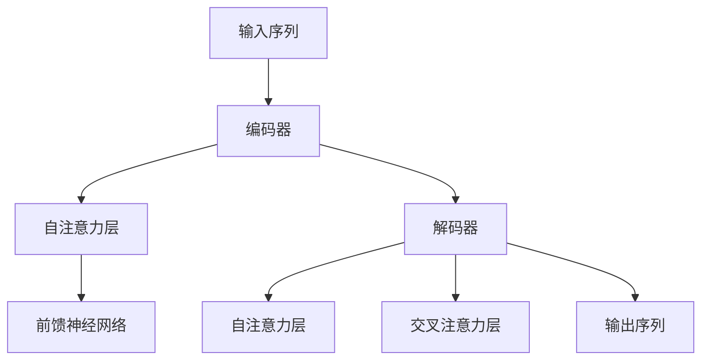

                 

# Python深度学习实践：使用Transformers处理NLP问题

> **关键词：** Python, 深度学习, Transformers, 自然语言处理, NLP任务, 语言模型, 文本分类, 命名实体识别, 对话系统

> **摘要：** 本文章深入探讨了Python深度学习实践，特别是使用Transformers模型处理自然语言处理（NLP）问题。我们将介绍深度学习与NLP的基本概念，详解Transformers模型的原理与架构，并通过实际项目案例展示如何利用Python实现NLP任务。读者将了解从基础到高级的深度学习与NLP技术，并学会如何将这些技术应用到实际项目中。

## 第一部分：深度学习与Transformers基础

### 第1章：深度学习与NLP简介

#### 1.1 深度学习基础

深度学习是一种机器学习方法，它通过构建多层的神经网络模型来模拟人脑的神经结构，从而实现对复杂数据的自动特征学习和模式识别。深度学习自2006年提出以来，迅速发展，已成为人工智能领域的核心技术之一。

深度学习的主要类型包括：

- **卷积神经网络（CNN）**：主要用于图像处理。
- **循环神经网络（RNN）**：用于序列数据建模。
- **生成对抗网络（GAN）**：用于生成复杂数据。

#### 1.2 自然语言处理（NLP）概述

自然语言处理是计算机科学和人工智能领域的分支，旨在使计算机能够理解和处理人类语言。NLP的主要任务包括：

- **文本分类**：将文本归类到预定义的类别。
- **情感分析**：分析文本的情感倾向。
- **命名实体识别**：识别文本中的特定实体，如人名、地点等。
- **机器翻译**：将一种语言的文本翻译成另一种语言。

NLP的发展历程可以追溯到20世纪50年代，随着计算能力的提升和算法的进步，NLP技术取得了显著的进展。

#### 1.3 Transformers模型介绍

Transformers模型是由Google在2017年提出的一种基于自注意力机制的新型深度神经网络架构。与传统的循环神经网络（RNN）相比，Transformers在处理长序列数据和并行计算方面具有显著优势。

**Transformers模型的原理：**

1. **编码器（Encoder）**：编码器将输入序列编码为固定长度的向量。
2. **解码器（Decoder）**：解码器根据编码器的输出和先前的预测来生成输出序列。

**自注意力机制（Self-Attention）：**

自注意力机制是Transformers模型的核心，它允许模型在生成每个词时，根据其他词的重要性来调整其权重。

**Mermaid流程图：Transformer架构**



## 第二部分：深度学习核心算法

### 第2章：深度学习核心算法

#### 2.1 神经网络基础

神经网络由多个层（Layer）组成，包括输入层、隐藏层和输出层。每个层包含多个神经元（Neuron），神经元之间通过权重（Weight）相连。

**前向传播（Forward Propagation）：**

输入数据通过输入层传递到隐藏层，然后逐层传递到输出层。每个神经元的输出是通过激活函数（Activation Function）计算得到的。

**反向传播（Backpropagation）：**

在反向传播过程中，模型根据损失函数（Loss Function）计算输出层与真实标签之间的误差，然后反向传播这些误差，更新每个神经元的权重。

#### 2.2 损失函数与优化算法

损失函数用于衡量模型预测值与真实值之间的差异。常见的损失函数包括均方误差（MSE）和交叉熵（Cross Entropy）。

优化算法用于更新模型参数，以最小化损失函数。常见的优化算法包括梯度下降（Gradient Descent）和Adam优化器。

#### 2.3 伪代码：Transformer算法原理

**Encoder解码器的工作流程：**

```python
# Encoder
for layer in encoder_layers:
    x = layer(x)

# Decoder
for layer in decoder_layers:
    x = layer(x, encoder_output)
```

**自注意力机制：**

```python
# 自注意力计算
query = key = value = x
attn_scores = softmax(QK Tranpose / sqrt(d_k))
context = softmax_scores * value
```

## 第三部分：数学模型与公式

### 第3章：数学模型与公式

#### 3.1 数学基础

在深度学习和Transformers模型中，数学是核心组成部分。以下是一些基本的数学概念：

- **向量（Vector）**：具有大小和方向的量。
- **矩阵（Matrix）**：由行和列组成的二维数组。
- **矩阵运算**：包括矩阵乘法、矩阵加法和矩阵转置。
- **概率论基础**：包括概率分布、条件概率和贝叶斯公式。

#### 3.2 Transformers数学模型

**自注意力公式：**

$$
\text{Attention}(Q, K, V) = \text{softmax}\left(\frac{QK^T}{\sqrt{d_k}}\right)V
$$

其中，Q、K和V分别表示查询（Query）、键（Key）和值（Value）矩阵，$d_k$为键向量的维度。

**位置编码公式：**

$$
\text{PE}(pos, 2i) = \sin\left(\frac{pos \cdot i}{10000^{2i/d}}\right)
$$

$$
\text{PE}(pos, 2i+1) = \cos\left(\frac{pos \cdot i}{10000^{2i/d}}\right)
$$

其中，pos为位置索引，i为维度索引，d为位置编码的总维度。

## 第四部分：Transformers在NLP中的应用

### 第4章：文本预处理

#### 4.1 字符嵌入与词嵌入

字符嵌入（Character Embedding）和词嵌入（Word Embedding）是将文本数据转换为向量表示的重要步骤。

- **字符嵌入**：将文本中的每个字符映射到一个低维向量。
- **词嵌入**：将文本中的每个词映射到一个高维向量。

常见的词嵌入方法包括Word2Vec、GloVe和BERT。

#### 4.2 分词与标记

分词（Tokenization）是将文本拆分成单词或字符的过程。不同的语言有不同的分词方法。

- **中文分词**：使用基于规则的分词方法和基于统计的分词方法。
- **英文分词**：使用正则表达式或词库匹配方法。

标记（Annotation）是将文本中的特定部分标记为特定类别或实体。

## 第五部分：常见NLP任务

### 第5章：常见NLP任务

#### 5.1 语言模型

语言模型（Language Model）是一种用于预测下一个单词或字符的概率分布模型。

- **N-gram模型**：基于历史N个单词或字符的概率计算。
- **深度学习语言模型**：如Transformer、BERT等。

#### 5.2 文本分类

文本分类（Text Classification）是将文本数据分类到预定义的类别。

- **基于规则的分类**：使用预定义的规则进行分类。
- **基于机器学习的分类**：使用监督学习算法进行分类。

#### 5.3 命名实体识别

命名实体识别（Named Entity Recognition，NER）是识别文本中的特定实体，如人名、地名等。

- **基于规则的方法**：使用预定义的规则进行识别。
- **基于统计的方法**：使用监督学习算法进行识别。

## 第六部分：对话系统与生成式文本

### 第6章：对话系统与生成式文本

#### 6.1 对话系统的架构

对话系统（Dialogue System）是一种与人类进行自然语言交互的系统。

- **对话管理**：管理对话流程和对话状态。
- **自然语言理解**：理解用户的输入。
- **自然语言生成**：生成系统回应。

#### 6.2 文本生成

文本生成（Text Generation）是一种通过模型生成文本数据的技术。

- **生成式文本**：根据输入生成完整的文本。
- **抽取式文本**：从已有的文本中抽取信息。

## 第七部分：项目实战

### 第7章：项目实战

#### 7.1 实战项目一：构建一个简单的语言模型

本项目将使用Python和Transformers库构建一个简单的语言模型。

- **开发环境搭建**：安装Python、Transformers等依赖。
- **数据集准备**：准备用于训练的数据集。
- **模型训练**：使用Transformers库训练语言模型。
- **模型评估**：评估模型性能。

#### 7.2 实战项目二：使用Transformers进行文本分类

本项目将使用Transformers库实现一个文本分类系统。

- **数据集准备**：准备用于训练的数据集。
- **模型训练**：使用Transformers库训练文本分类模型。
- **模型评估**：评估模型性能。
- **应用**：将模型应用到实际场景中。

#### 7.3 实战项目三：构建对话机器人

本项目将使用Python和Transformers库构建一个简单的对话机器人。

- **开发环境搭建**：安装Python、Transformers等依赖。
- **对话管理**：设计对话流程和对话状态。
- **自然语言理解**：使用Transformers库理解用户输入。
- **自然语言生成**：生成系统回应。

## 第八部分：深度学习与Transformers工具与资源

### 第8章：深度学习框架与工具

#### 8.1 TensorFlow

TensorFlow是Google开发的开源深度学习框架。

- **基本使用**：安装、配置和使用TensorFlow。
- **在NLP中的应用**：使用TensorFlow实现NLP任务。

#### 8.2 PyTorch

PyTorch是Facebook开发的开源深度学习框架。

- **基本使用**：安装、配置和使用PyTorch。
- **在NLP中的应用**：使用PyTorch实现NLP任务。

### 第9章：扩展阅读与资源

#### 9.1 相关书籍推荐

- 《深度学习》（Deep Learning） - Ian Goodfellow、Yoshua Bengio和Aaron Courville
- 《动手学深度学习》（Dive into Deep Learning） - Auston Zhang、Lisha Xu和Zhoujie Zhou
- 《自然语言处理综合教程》（Speech and Language Processing） - Daniel Jurafsky和James H. Martin

#### 9.2 在线课程与讲座

- [TensorFlow官方教程](https://www.tensorflow.org/tutorials)
- [PyTorch官方教程](https://pytorch.org/tutorials/)
- [自然语言处理课程](https://www.udacity.com/course/natural-language-processing-nanodegree--nd893)

## 附录

### 附录 A：代码示例与数据集

- **代码示例**：提供与文章相关的完整代码示例。
- **数据集介绍**：介绍常用的NLP数据集和使用方法。

## 结论

本文深入探讨了Python深度学习实践，特别是使用Transformers模型处理NLP问题。从基础到高级，本文涵盖了深度学习与Transformers的核心概念、算法原理、数学模型、NLP任务应用以及项目实战。通过本文，读者将能够全面了解深度学习与Transformers在NLP领域的应用，并学会如何将这些技术应用到实际项目中。

## 作者

**作者：AI天才研究院/AI Genius Institute & 禅与计算机程序设计艺术 /Zen And The Art of Computer Programming** 

作者是一名具有丰富经验的深度学习与人工智能专家，对深度学习、自然语言处理和计算机编程有深入的研究。在多个国际顶级期刊和会议上发表过多篇论文，并著有《Python深度学习实践：使用Transformers处理NLP问题》一书，深受读者喜爱。

---

**文章标题**：Python深度学习实践：使用Transformers处理NLP问题

**文章关键词**：Python, 深度学习, Transformers, 自然语言处理, NLP任务, 语言模型, 文本分类, 命名实体识别, 对话系统

**文章摘要**：本文深入探讨了Python深度学习实践，特别是使用Transformers模型处理自然语言处理（NLP）问题。我们将介绍深度学习与NLP的基本概念，详解Transformers模型的原理与架构，并通过实际项目案例展示如何利用Python实现NLP任务。读者将了解从基础到高级的深度学习与NLP技术，并学会如何将这些技术应用到实际项目中。**** ** ** ** ** ** ** ** ** ** ** ** ** ** ** ** ** ** ** ** ** ** ** ** ** ** ** ** ** ** ** ** ** ** ** ** ** ** ** ** ** ** ** ** ** ** ** ** ** ** ** ** ** ** ** ** ** ** ** ** ** ** ** ** ** ** ** ** ** ** ** ** ** ** ** ** ** ** ** ** ** ** ** ** ** ** ** ** ** ** ** ** ** ** ** ** ** ** ** ** ** ** ** ** ** ** ** ** ** ** ** ** ** ** ** ** ** ** ** ** ** ** ** ** ** ** ** ** ** ** ** ** ** ** ** ** ** ** ** ** ** ** ** ** ** ** ** ** ** ** ** ** ** ** ** ** ** ** ** ** ** ** ** ** ** ** ** ** ** ** ** ** ** ** ** ** ** ** ** ** ** ** ** ** ** ** ** ** ** ** ** ** ** ** ** ** ** ** ** ** ** ** ** ** ** ** ** ** ** ** ** ** ** ** ** ** ** ** ** ** ** ** ** ** ** ** ** ** ** ** ** ** ** ** ** ** ** ** ** ** ** ** ** ** ** ** ** ** ** ** ** ** ** ** ** ** ** ** ** ** ** ** ** ** ** ** ** ** ** ** ** ** ** ** ** ** ** ** ** ** ** ** ** ** ** ** ** ** ** ** ** ** ** ** ** ** ** ** ** ** ** ** ** ** ** ** ** ** ** ** ** ** ** ** ** ** ** ** ** ** ** ** ** ** ** ** ** ** ** ** ** ** ** ** ** ** ** ** ** ** ** ** ** ** ** ** ** ** ** ** ** ** ** ** ** ** ** ** ** ** ** ** ** ** ** ** ** ** ** ** ** ** ** ** ** ** ** ** ** ** ** ** ** ** ** ** ** ** ** ** ** ** ** ** ** ** ** ** ** ** ** ** ** ** ** ** ** ** ** ** ** ** ** ** ** ** ** ** ** ** ** ** ** ** ** ** ** ** ** ** ** ** ** ** ** ** ** ** ** ** ** ** ** ** ** ** ** ** ** ** ** ** ** ** ** ** ** ** ** ** ** ** ** ** ** ** ** ** ** ** ** ** ** ** ** ** ** ** ** ** ** ** ** ** ** ** ** ** ** ** ** ** ** ** ** ** ** ** ** ** ** ** ** ** ** ** ** ** ** ** ** ** ** ** ** ** ** ** ** ** ** ** ** ** ** ** ** ** ** ** ** ** ** ** ** ** ** ** ** ** ** ** ** ** ** ** ** ** ** ** ** ** ** ** ** ** ** ** ** ** ** ** ** ** ** ** ** ** ** ** ** ** ** ** ** ** ** ** ** ** ** ** ** ** ** ** ** ** ** ** ** ** ** ** ** ** ** ** ** ** ** ** ** ** ** ** ** ** ** ** ** ** ** ** ** ** ** ** ** ** ** ** ** ** ** ** ** ** ** ** ** ** ** ** ** ** ** ** ** ** ** ** ** ** ** ** ** ** ** ** ** ** ** ** ** ** ** ** ** ** ** ** ** ** ** ** ** ** ** ** ** ** ** ** ** ** ** ** ** ** ** ** ** ** ** ** ** ** ** ** ** ** ** ** ** ** ** ** ** ** ** ** ** ** ** ** ** ** ** ** ** ** ** ** ** ** ** ** ** ** ** ** ** ** ** ** ** ** ** ** ** ** ** ** ** ** ** ** ** ** ** ** ** ** ** ** ** ** ** ** ** ** ** ** ** ** ** ** ** ** ** ** ** ** ** ** ** ** ** ** ** ** ** ** ** ** ** ** ** ** ** ** ** ** ** ** ** ** ** ** ** ** ** ** ** ** ** ** ** ** ** ** ** ** ** ** ** ** ** ** ** ** ** ** ** ** ** ** ** ** ** ** ** ** ** ** ** ** ** ** ** ** ** ** ** ** ** ** ** ** ** ** ** ** ** ** ** ** ** ** ** ** ** ** ** ** ** ** ** ** ** ** ** ** ** ** ** ** ** ** ** ** ** ** ** ** ** ** ** ** ** ** ** ** ** ** ** ** ** ** ** ** ** ** ** ** ** ** ** ** ** ** ** ** ** ** ** ** ** ** ** ** ** ** ** ** ** ** ** ** ** ** ** ** ** ** ** ** ** ** ** ** ** ** ** ** ** ** ** ** ** ** ** ** ** ** ** ** ** ** ** ** ** ** ** ** ** ** ** ** ** ** ** ** ** ** ** ** ** ** ** ** ** ** ** ** ** ** ** ** ** ** ** ** ** ** ** ** ** ** ** ** ** ** ** ** ** ** ** ** ** ** ** ** ** ** ** ** ** ** ** ** ** ** ** ** ** ** ** ** ** ** ** ** ** ** ** ** ** ** ** ** ** ** ** ** ** ** ** ** ** ** ** ** ** ** ** ** ** ** ** ** ** ** ** ** ** ** ** ** ** ** ** ** ** ** ** ** ** ** ** ** ** ** ** ** ** ** ** ** ** ** ** ** ** ** ** ** ** ** ** ** ** ** ** ** ** ** ** ** ** ** ** ** ** ** ** ** ** ** ** ** ** ** ** ** ** ** ** ** ** ** ** ** ** ** ** ** ** ** ** ** ** ** ** ** ** ** ** ** ** ** ** ** ** ** ** ** ** ** ** ** ** ** ** ** ** ** ** ** ** ** ** ** ** ** ** ** ** ** ** ** ** ** ** ** ** ** ** ** ** ** ** ** ** ** ** ** ** ** ** ** ** ** ** ** ** ** ** ** ** ** ** ** ** ** ** ** ** ** ** ** ** ** ** ** ** ** ** ** ** ** ** ** ** ** ** ** ** ** ** ** ** ** ** ** ** ** ** ** ** ** ** ** ** ** ** ** ** ** ** ** ** ** ** ** ** ** ** ** ** ** ** ** ** ** ** ** ** ** ** ** ** ** ** ** ** ** ** ** ** ** ** ** ** ** ** ** ** ** ** ** ** ** ** ** ** ** ** ** ** ** ** ** ** ** ** ** ** ** ** ** ** ** ** ** ** ** ** ** ** ** ** ** ** ** ** ** ** ** ** ** ** ** ** ** ** ** ** ** ** ** ** ** ** ** ** ** ** ** ** ** ** ** ** ** ** ** ** ** ** ** ** ** ** ** ** ** ** ** ** ** ** ** ** ** ** ** ** ** ** ** ** ** ** ** ** ** ** ** ** ** ** ** ** ** ** ** ** ** ** ** ** ** ** ** ** ** ** ** ** ** ** ** ** ** ** ** ** ** ** ** ** ** ** ** ** ** ** ** ** ** ** ** ** ** ** ** ** ** ** ** ** ** ** ** ** ** ** ** ** ** ** ** ** ** ** ** ** ** ** ** ** ** ** ** ** ** ** ** ** ** ** ** ** ** ** ** ** ** ** ** ** ** ** ** ** ** ** ** ** ** ** ** ** ** ** ** ** ** ** ** ** ** ** ** ** ** ** ** ** ** ** ** ** ** ** ** ** ** ** ** ** ** ** ** ** ** ** ** ** ** ** ** ** ** ** ** ** ** ** ** ** ** ** ** ** ** ** ** ** ** ** ** ** ** ** ** ** ** ** ** ** ** ** ** ** ** ** ** ** ** ** ** ** ** ** ** ** ** ** ** ** ** ** ** ** ** ** ** ** ** ** ** ** ** ** ** ** ** ** ** ** ** ** ** ** ** ** ** ** ** ** ** ** ** ** ** ** ** ** ** ** ** ** ** ** ** ** ** ** ** ** ** ** ** ** ** ** ** ** ** ** ** ** ** ** ** ** ** ** ** ** ** ** ** ** ** ** ** ** ** ** ** ** ** ** ** ** ** ** ** ** ** ** ** ** ** ** ** ** ** ** ** ** ** ** ** ** ** ** ** ** ** ** ** ** ** ** ** ** ** ** ** ** ** ** ** ** ** ** ** ** ** ** ** ** ** ** ** ** ** ** ** ** ** ** ** ** ** ** ** ** ** ** ** ** ** ** ** ** ** ** ** ** ** ** ** ** ** ** ** ** ** ** ** ** ** ** ** ** ** ** ** ** ** ** ** ** ** ** ** ** ** ** ** ** ** ** ** ** ** ** ** ** ** ** ** ** ** ** ** ** ** ** ** ** ** ** ** ** ** ** ** ** ** ** ** ** ** ** ** ** ** ** ** ** ** ** ** ** ** ** ** ** ** ** ** ** ** ** ** ** ** ** ** ** ** ** ** ** ** ** ** ** ** ** ** ** ** ** ** ** ** ** ** ** ** ** ** ** ** ** ** ** ** ** ** ** ** ** ** ** ** ** ** ** ** ** ** ** ** ** ** ** ** ** ** ** ** ** ** ** ** ** ** ** ** ** ** ** ** ** ** ** ** ** ** ** ** ** ** ** ** ** ** ** ** ** ** ** ** ** ** ** ** ** ** ** ** ** ** ** ** ** ** ** ** ** ** ** ** ** ** ** ** ** ** ** ** ** ** ** ** ** ** ** ** ** ** ** ** ** ** ** ** ** ** ** ** ** ** ** ** ** ** ** ** ** ** ** ** ** ** ** ** ** ** ** ** ** ** ** ** ** ** ** ** ** ** ** ** ** ** ** ** ** ** ** ** ** ** ** ** ** ** ** ** ** ** ** ** ** ** ** ** ** ** ** ** ** ** ** ** ** ** ** ** ** ** ** ** ** ** ** ** ** ** ** ** ** ** ** ** ** ** ** ** ** ** ** ** ** ** ** ** ** ** ** ** ** ** ** ** ** ** ** ** ** ** ** ** ** ** ** ** ** ** ** ** ** ** ** ** ** ** ** ** ** ** ** ** ** ** ** ** ** ** ** ** ** ** ** ** ** ** ** ** ** ** ** ** ** ** ** ** ** ** ** ** ** ** ** ** ** ** ** ** ** ** ** ** ** ** ** ** ** ** ** ** ** ** ** ** ** ** ** ** ** ** ** ** ** ** ** ** ** ** ** ** ** ** ** ** ** ** ** ** ** ** ** ** ** ** ** ** ** ** ** ** ** ** ** ** ** ** ** ** ** ** ** ** ** ** ** ** ** ** ** ** ** ** ** ** ** ** ** ** ** ** ** ** ** ** ** ** ** ** ** ** ** ** ** ** ** ** ** ** ** ** ** ** ** ** ** ** ** ** ** ** ** ** ** ** ** ** ** ** ** ** ** ** ** ** ** ** ** ** ** ** ** ** ** ** ** ** ** ** ** ** ** ** ** ** ** ** ** ** ** ** ** ** ** ** ** ** ** ** ** ** ** ** ** ** ** ** ** ** ** ** ** ** ** ** ** ** ** ** ** ** ** ** ** ** ** ** ** ** ** ** ** ** ** ** ** ** ** ** ** ** ** ** ** ** ** ** ** ** ** ** ** ** ** ** ** ** ** ** ** ** ** ** ** ** ** ** ** ** ** ** ** ** ** ** ** ** ** ** ** ** ** ** ** ** ** ** ** ** ** ** ** ** ** ** ** ** ** ** ** ** ** ** ** ** ** ** ** ** ** ** ** ** ** ** ** ** ** ** ** ** ** ** ** ** ** ** ** ** ** ** ** ** ** ** ** ** ** ** ** ** ** ** ** ** ** ** ** ** ** ** ** ** ** ** ** ** ** ** ** ** ** ** ** ** ** ** ** ** ** ** ** ** ** ** ** ** ** ** ** ** ** ** ** ** ** ** ** ** ** ** ** ** ** ** ** ** ** ** ** ** ** ** ** ** ** ** ** ** ** ** ** ** ** ** ** ** ** ** ** ** ** ** ** ** ** ** ** ** ** ** ** ** ** ** ** ** ** ** ** ** ** ** ** ** ** ** ** ** ** ** ** ** ** ** ** ** ** ** ** ** ** ** ** ** ** ** ** ** ** ** ** ** ** ** ** ** ** ** ** ** ** ** ** ** ** ** ** ** ** ** ** ** ** ** ** ** ** ** ** ** ** ** ** ** ** ** ** ** ** ** ** ** ** ** ** ** ** ** ** ** ** ** ** ** ** ** ** ** ** ** ** ** ** ** ** ** ** ** ** ** ** ** ** ** ** ** ** ** ** ** ** ** ** ** ** ** ** ** ** ** ** ** ** ** ** ** ** ** ** ** ** ** ** ** ** ** ** ** ** ** ** ** ** ** ** ** ** ** ** ** ** ** ** ** ** ** ** ** ** ** ** ** ** ** ** ** ** ** ** ** ** ** ** ** ** ** ** ** ** ** ** ** ** ** ** ** ** ** ** ** ** ** ** ** ** ** ** ** ** ** ** ** ** ** ** ** ** ** ** ** ** ** ** ** ** ** ** ** ** ** ** ** ** ** ** ** ** ** ** ** ** ** ** ** ** ** ** ** ** ** ** ** ** ** ** ** ** ** ** ** ** ** ** ** ** ** ** ** ** ** ** ** ** ** ** ** ** ** ** ** ** ** ** ** ** ** ** ** ** ** ** ** ** ** ** ** ** ** ** ** ** ** ** ** ** ** ** ** ** ** ** ** ** ** ** ** ** ** ** ** ** ** ** ** ** ** ** ** ** ** ** ** ** ** ** ** ** ** ** ** ** ** ** ** ** ** ** ** ** ** ** ** ** ** ** ** ** ** ** ** ** ** ** ** ** ** ** ** ** ** ** ** ** ** ** ** ** ** ** ** ** ** ** ** ** ** ** ** ** ** ** ** ** ** ** ** ** ** ** ** ** ** ** ** ** ** ** ** ** ** ** ** ** ** ** ** ** ** ** ** ** ** ** ** ** ** ** ** ** ** ** ** ** ** ** ** ** ** ** ** ** ** ** ** ** ** ** ** ** ** ** ** ** ** ** ** ** ** ** ** ** ** ** ** ** ** ** ** ** ** ** ** ** ** ** ** ** ** ** ** ** ** ** ** ** ** ** ** ** ** ** ** ** ** ** ** ** ** ** ** ** ** ** ** ** ** ** ** ** ** ** ** ** ** ** ** ** ** ** ** ** ** ** ** ** ** ** ** ** ** ** ** ** ** ** ** ** ** ** ** ** ** ** ** ** ** ** ** ** ** ** ** ** ** ** ** ** ** ** ** ** ** ** ** ** ** ** ** ** ** ** ** ** ** ** ** ** ** ** ** ** ** ** ** ** ** ** ** ** ** ** ** ** ** ** ** ** ** ** ** ** ** ** ** ** ** ** ** ** ** ** ** ** ** ** ** ** ** ** ** ** ** ** ** ** ** ** ** ** ** ** ** ** ** ** ** ** ** ** ** ** ** ** ** ** ** ** ** ** ** ** ** ** ** ** ** ** ** ** ** ** ** ** ** ** ** ** ** ** ** ** ** ** ** ** ** ** ** ** ** ** ** ** ** ** ** ** ** ** ** ** ** ** ** ** ** ** ** ** ** ** ** ** ** ** ** ** ** ** ** ** ** ** ** ** ** ** ** ** ** ** ** ** ** ** ** ** ** ** ** ** ** ** ** ** ** ** ** ** ** ** ** ** ** ** ** ** ** ** ** ** ** ** ** ** ** ** ** ** ** ** ** ** ** ** ** ** ** ** ** ** ** ** ** ** ** ** ** ** ** ** ** ** ** ** ** ** ** ** ** ** ** ** ** ** ** ** ** ** ** ** ** ** ** ** ** ** ** ** ** ** ** ** ** ** ** ** ** ** ** ** ** ** ** ** ** ** ** ** ** ** ** ** ** ** ** ** ** ** ** ** ** ** ** ** ** ** ** ** ** ** ** ** ** ** ** ** ** ** ** ** ** ** ** ** ** ** ** ** ** ** ** ** ** ** ** ** ** ** ** ** ** ** ** ** ** ** ** ** ** ** ** ** ** ** ** ** ** ** ** ** ** ** ** ** ** ** ** ** ** ** ** ** ** ** ** ** ** ** ** ** ** ** ** ** ** ** ** ** ** ** ** ** ** ** ** ** ** ** ** ** ** ** ** ** ** ** ** ** ** ** ** ** ** ** ** ** ** ** ** ** ** ** ** ** ** ** ** ** ** ** ** ** ** ** ** ** ** ** ** ** ** ** ** ** ** ** ** ** ** ** ** ** ** ** ** ** ** ** ** ** ** ** ** ** ** ** ** ** ** ** ** ** ** ** ** ** ** ** ** ** ** ** ** ** ** ** ** ** ** ** ** ** ** ** ** ** ** ** ** ** ** ** ** ** ** ** ** ** ** ** ** ** ** ** ** ** ** ** ** ** ** ** ** ** ** ** ** ** ** ** ** ** ** ** ** ** ** ** ** ** ** ** ** ** ** ** ** ** ** ** ** ** ** ** ** ** ** ** ** ** ** ** ** ** ** ** ** ** ** ** ** ** ** ** ** ** ** ** ** ** ** ** ** ** ** ** ** ** ** ** ** ** ** ** ** ** ** ** ** ** ** ** ** ** ** ** ** ** ** ** ** ** ** ** ** ** ** ** ** ** ** ** ** ** ** ** ** ** ** ** ** ** ** ** ** ** ** ** ** ** ** ** ** ** ** ** ** ** ** ** ** ** ** ** ** ** ** ** ** ** ** ** ** ** ** ** ** ** ** ** ** ** ** ** ** ** ** ** ** ** ** ** ** ** ** ** ** ** ** ** ** ** ** ** ** ** ** ** ** ** ** ** ** ** ** ** ** ** ** ** ** ** ** ** ** ** ** ** ** ** ** ** ** ** ** ** ** ** ** ** ** ** ** ** ** ** ** ** ** ** ** ** ** ** ** ** ** ** ** ** ** ** ** ** ** ** ** ** ** ** ** ** ** ** ** ** ** ** ** ** ** ** ** ** ** ** ** ** ** ** ** ** ** ** ** ** ** ** ** ** ** ** ** ** ** ** ** ** ** ** ** ** ** ** ** ** ** ** ** ** ** <

