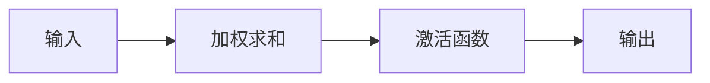

                 

### 《Python深度学习实践：理解反向传播算法的细节》

> **关键词**：深度学习、反向传播、Python、神经网络、TensorFlow、PyTorch

> **摘要**：
本文旨在通过详细的实例和实践，帮助读者深入理解深度学习中的核心算法——反向传播算法。文章从深度学习的入门知识出发，逐步讲解神经网络的基本结构和反向传播算法的原理。随后，通过Python代码示例，详细阐述了反向传播算法的步骤和实现细节。最后，文章将通过实际项目案例，展示如何将深度学习和反向传播算法应用于解决实际问题。

---

### 第一部分：深度学习基础

#### 第1章：深度学习入门

##### 1.1 深度学习的起源与发展

深度学习作为机器学习的一个重要分支，起源于1980年代。最初，由于计算能力的限制，深度学习并未受到广泛关注。然而，随着计算能力的提升和大数据时代的到来，深度学习得到了快速发展，并在图像识别、自然语言处理等领域取得了显著成果。

深度学习的主要贡献在于通过多层神经网络模拟人脑的神经元连接方式，从而实现复杂的模式识别和预测任务。与传统机器学习方法相比，深度学习能够自动提取特征，减少了人工设计的复杂性。

##### 1.1.1 什么是深度学习

深度学习（Deep Learning）是机器学习研究中的一个子领域，其核心思想是通过构建多层神经网络（Neural Networks），模拟人脑的神经元连接方式，对数据进行自动特征提取和分类。

##### 1.1.2 深度学习的主要贡献

深度学习的主要贡献体现在以下几个方面：

1. **自动特征提取**：深度学习能够自动从原始数据中提取高层次的抽象特征，减轻了人工特征设计的负担。
2. **高效的处理能力**：深度学习模型在大规模数据集上表现出色，能够快速处理海量数据。
3. **广泛的应用领域**：深度学习在图像识别、语音识别、自然语言处理等领域取得了重大突破。

##### 1.1.3 深度学习与机器学习的区别

深度学习是机器学习的一个子领域，其主要区别在于：

1. **层次结构**：深度学习通过多层神经网络模拟人脑的神经元连接方式，而传统机器学习方法通常采用单一模型。
2. **特征提取**：深度学习能够自动提取高层次的抽象特征，而传统机器学习方法需要人工设计特征。
3. **计算需求**：深度学习模型通常需要大量的计算资源和数据，而传统机器学习方法对计算资源和数据的需求相对较低。

---

##### 1.2 深度学习的数学基础

深度学习的基础数学知识主要包括微积分、线性代数和概率论。

###### 1.2.1 微积分基础

微积分是研究函数变化率和累积过程的数学分支，是深度学习的基础。微积分主要包括两个基本概念：导数和积分。

- **导数**：导数表示函数在某一点的瞬时变化率。在深度学习中，导数用于计算反向传播过程中的误差。
- **积分**：积分表示函数在某一区间内的累积量。在深度学习中，积分用于计算损失函数。

###### 1.2.2 线性代数基础

线性代数是研究向量、矩阵和线性变换的数学分支，是深度学习的基础。线性代数主要包括以下几个基本概念：

- **向量**：向量表示具有大小和方向的量，在深度学习中用于表示数据和参数。
- **矩阵**：矩阵是二维数组，用于表示复杂数据的关系。
- **矩阵运算**：矩阵运算包括矩阵的加法、减法、乘法和逆运算，在深度学习中用于计算模型的参数更新。

###### 1.2.3 概率论基础

概率论是研究随机事件和随机变量的数学分支，是深度学习中的概率模型和统计学习的基础。概率论主要包括以下几个基本概念：

- **概率分布**：概率分布描述了随机变量的取值概率。
- **期望和方差**：期望和方差描述了随机变量的中心位置和离散程度。
- **条件概率**：条件概率描述了在某个条件下某个事件发生的概率。

---

##### 1.3 Python环境与深度学习框架

在深度学习实践中，Python是主要的编程语言，其丰富的库和框架为深度学习提供了强大的支持。

###### 1.3.1 Python安装与配置

Python的安装相对简单，可以直接从Python官网（https://www.python.org/）下载安装包进行安装。

安装完成后，可以通过以下命令检查Python的安装情况：

```python
python --version
```

此外，还需要安装一些常用的Python库，如NumPy、Pandas和Matplotlib等。

```bash
pip install numpy pandas matplotlib
```

###### 1.3.2 TensorFlow安装与基础操作

TensorFlow是谷歌开源的深度学习框架，其安装可以通过以下命令完成：

```bash
pip install tensorflow
```

安装完成后，可以通过以下代码测试TensorFlow的安装情况：

```python
import tensorflow as tf
print(tf.__version__)
```

TensorFlow的基本操作包括创建计算图、定义变量、执行计算等。以下是一个简单的示例：

```python
# 创建计算图
a = tf.constant(5)
b = tf.constant(6)
c = a + b

# 定义变量
w = tf.Variable(0.0, name="weight")
b = tf.Variable(1.0, name="bias")

# 执行计算
with tf.Session() as sess:
    sess.run(w.initializer)
    sess.run(b.initializer)
    print(sess.run(c))
```

###### 1.3.3 PyTorch安装与基础操作

PyTorch是Facebook开源的深度学习框架，其安装可以通过以下命令完成：

```bash
pip install torch torchvision
```

安装完成后，可以通过以下代码测试PyTorch的安装情况：

```python
import torch
print(torch.__version__)
```

PyTorch的基本操作包括创建Tensor、定义神经网络、执行前向传播等。以下是一个简单的示例：

```python
# 创建Tensor
x = torch.tensor([[1, 2], [3, 4]], dtype=torch.float32)

# 定义神经网络
import torch.nn as nn
model = nn.Linear(2, 1)

# 执行前向传播
y = model(x)
print(y)
```

---

### 第2章：神经网络基础

#### 2.1 神经网络的基本结构

神经网络（Neural Networks）是深度学习的核心组成部分，其基本结构包括神经元（Neurons）、层（Layers）和连接（Connections）。

###### 2.1.1 神经元与层

神经元是神经网络的基本单位，类似于生物神经元，它通过接受输入、激活和输出完成信息传递。一个简单的神经元可以表示为：



神经网络由多个层组成，常见的层包括输入层、隐藏层和输出层。输入层接收外部输入数据，隐藏层对数据进行特征提取和变换，输出层生成最终预测结果。

###### 2.1.2 神经网络的激活函数

激活函数（Activation Function）是神经网络的核心组成部分，用于引入非线性因素。常见的激活函数包括：

1. **sigmoid函数**：
   $$
   f(x) = \frac{1}{1 + e^{-x}}
   $$
   sigmoid函数在神经网络中常用于输出层，用于生成概率分布。

2. **ReLU函数**（Rectified Linear Unit）：
   $$
   f(x) =
   \begin{cases}
   x & \text{if } x > 0 \\
   0 & \text{if } x \leq 0
   \end{cases}
   $$
   ReLU函数在隐藏层中应用广泛，能够加快神经网络的训练速度。

3. **Tanh函数**（Hyperbolic Tangent）：
   $$
   f(x) = \frac{e^x - e^{-x}}{e^x + e^{-x}}
   $$
   Tanh函数与sigmoid函数类似，但具有更好的对称性。

###### 2.1.3 神经网络的前向传播

前向传播（Forward Propagation）是神经网络的核心过程，用于计算输出层的预测结果。前向传播的过程可以表示为：

1. **输入层到隐藏层**：

   $$
   z^{(l)} = \sum_{j} w^{(l)}_{ji} x^i + b^{(l)}
   $$
   $$
   a^{(l)} = f^{(l)}(z^{(l)})
   $$

   其中，$z^{(l)}$为加权求和结果，$a^{(l)}$为激活值。

2. **隐藏层到输出层**：

   $$
   z^{(L)} = \sum_{j} w^{(L)}_{ji} a^{(L-1)}_j + b^{(L)}
   $$
   $$
   y = f^{(L)}(z^{(L)})
   $$

   其中，$y$为输出层的预测结果。

---

#### 2.2 反向传播算法

反向传播算法（Backpropagation Algorithm）是神经网络训练的核心算法，用于通过反向传播误差信号，更新网络中的权重和偏置。

###### 2.2.1 什么是反向传播

反向传播算法通过以下步骤实现：

1. **前向传播**：计算输出层的预测结果。
2. **计算误差**：计算输出层预测结果与真实值之间的误差。
3. **反向传播**：从输出层开始，反向计算每一层的误差。
4. **更新参数**：使用梯度下降算法更新权重和偏置。

###### 2.2.2 反向传播的计算过程

反向传播的计算过程可以分为以下几个步骤：

1. **计算输出层的误差**：

   $$
   \delta^{(L)} = (y - \hat{y}) \odot f^{(L)}'(z^{(L)})
   $$
   
   其中，$y$为真实值，$\hat{y}$为输出层的预测结果，$\odot$表示Hadamard乘积。

2. **计算隐藏层的误差**：

   $$
   \delta^{(l)} = \sum_{j} w^{(l+1)}_{ji} \delta^{(l+1)}_j \odot f^{(l)}'(z^{(l)})
   $$
   
   其中，$w^{(l+1)}_{ji}$为$l+1$层的权重，$\delta^{(l+1)}_j$为$l+1$层的误差。

3. **计算梯度**：

   $$
   \nabla_w^{(l)} = \sum_{i} a^{(l)}_i \delta^{(l+1)}_i
   $$
   $$
   \nabla_b^{(l)} = \sum_{i} \delta^{(l+1)}_i
   $$

4. **更新参数**：

   $$
   w^{(l)} = w^{(l)} - \alpha \nabla_w^{(l)}
   $$
   $$
   b^{(l)} = b^{(l)} - \alpha \nabla_b^{(l)}
   $$

   其中，$\alpha$为学习率。

###### 2.2.3 反向传播算法的Python实现

以下是反向传播算法的Python伪代码实现：

```python
# 初始化模型参数
W1, b1 = 初始化权重和偏置
W2, b2 = 初始化权重和偏置

# 定义损失函数
loss = 损失函数(y, y')

# 前向传播
z2 = X * W1 + b1
a2 = 激活函数(z2)
z3 = a2 * W2 + b2
a3 = 激活函数(z3)

# 反向传播
delta3 = (a3 - y) * 激活函数导数(a3)
delta2 = (z3 * delta3) * 激活函数导数(a2)

# 更新权重和偏置
W2 = W2 - 学习率 * (delta3 * a2.T)
b2 = b2 - 学习率 * delta3
W1 = W1 - 学习率 * (delta2 * X.T)
b1 = b1 - 学习率 * delta2
```

---

#### 2.3 损失函数与优化算法

在神经网络训练过程中，损失函数和优化算法是两个关键组成部分。损失函数用于衡量模型预测结果与真实值之间的差距，优化算法用于更新模型的参数以最小化损失函数。

###### 2.3.1 损失函数的选择

常见的损失函数包括：

1. **均方误差损失函数**（MSE）：

   $$
   \text{MSE} = \frac{1}{n}\sum_{i=1}^{n}(y_i - \hat{y}_i)^2
   $$
   
   均方误差损失函数常用于回归任务，其优点是计算简单，易于优化。

2. **交叉熵损失函数**（Cross-Entropy Loss）：

   $$
   \text{CE} = -\frac{1}{n}\sum_{i=1}^{n}y_i \log(\hat{y}_i)
   $$
   
   交叉熵损失函数常用于分类任务，其优点是能够处理概率输出，便于计算梯度。

3. **对数似然损失函数**（Log-Likelihood Loss）：

   $$
   \text{LL} = -\frac{1}{n}\sum_{i=1}^{n}y_i \log(p(x_i | \theta))
   $$
   
   对数似然损失函数是一种概率损失函数，常用于概率模型。

###### 2.3.2 常见的优化算法

常见的优化算法包括：

1. **梯度下降算法**（Gradient Descent）：

   $$
   \theta = \theta - \alpha \nabla_{\theta}J(\theta)
   $$
   
   梯度下降算法是最简单的优化算法，其优点是实现简单，易于理解。

2. **随机梯度下降算法**（Stochastic Gradient Descent，SGD）：

   $$
   \theta = \theta - \alpha \nabla_{\theta}J(\theta)
   $$
   
   随机梯度下降算法是对梯度下降算法的改进，通过随机选择样本计算梯度，减少了计算量。

3. **批量梯度下降算法**（Batch Gradient Descent，BGD）：

   $$
   \theta = \theta - \alpha \nabla_{\theta}J(\theta)
   $$
   
   批量梯度下降算法是对随机梯度下降算法的改进，通过计算整个数据集的梯度进行更新，提高了模型的泛化能力。

4. **动量算法**（Momentum）：

   $$
   v = \beta v + (1 - \beta) \nabla_{\theta}J(\theta)
   $$
   $$
   \theta = \theta - \alpha v
   $$
   
   动量算法通过引入动量项，减少了梯度下降过程中的振荡，提高了收敛速度。

5. **Adam优化器**（Adaptive Moment Estimation）：

   $$
   m = \beta_1 \hat{m} + (1 - \beta_1) \nabla_{\theta}J(\theta)
   $$
   $$
   v = \beta_2 \hat{v} + (1 - \beta_2) (\nabla_{\theta}J(\theta))^2
   $$
   $$
   \theta = \theta - \alpha \frac{m}{\sqrt{v} + \epsilon}
   $$
   
   Adam优化器是常用的优化算法之一，通过自适应调整学习率和动量项，提高了收敛速度和模型性能。

###### 2.3.3 优化算法的Python实现

以下是优化算法的Python伪代码实现：

```python
# 初始化模型参数
W1, b1 = 初始化权重和偏置
W2, b2 = 初始化权重和偏置

# 定义损失函数
loss = 损失函数(y, y')

# 定义优化器
optimizer = 优化器(学习率)

# 前向传播
z2 = X * W1 + b1
a2 = 激活函数(z2)
z3 = a2 * W2 + b2
a3 = 激活函数(z3)

# 反向传播
delta3 = (a3 - y) * 激活函数导数(a3)
delta2 = (z3 * delta3) * 激活函数导数(a2)

# 计算梯度
grad_W1 = ...
grad_b1 = ...
grad_W2 = ...
grad_b2 = ...

# 更新参数
optimizer.update(W1, grad_W1)
optimizer.update(b1, grad_b1)
optimizer.update(W2, grad_W2)
optimizer.update(b2, grad_b2)
```

---

### 第3章：深度学习模型实战

#### 3.1 手写数字识别

手写数字识别（Handwritten Digit Recognition）是深度学习中的经典问题，常用于测试深度学习模型的效果。

###### 3.1.1 数据预处理

手写数字识别的数据集通常是MNIST数据集，包含60000个训练样本和10000个测试样本。数据预处理步骤如下：

1. **数据读取**：使用深度学习框架读取MNIST数据集。
2. **数据转换**：将图像数据转换为Tensor格式，并归一化处理。

```python
import tensorflow as tf

# 读取MNIST数据集
(x_train, y_train), (x_test, y_test) = tf.keras.datasets.mnist.load_data()

# 数据转换
x_train = tf.convert_to_tensor(x_train, dtype=tf.float32) / 255.0
x_test = tf.convert_to_tensor(x_test, dtype=tf.float32) / 255.0

# 归一化处理
x_train = x_train.reshape(-1, 28 * 28)
x_test = x_test.reshape(-1, 28 * 28)

# 标签转换为one-hot编码
y_train = tf.keras.utils.to_categorical(y_train, num_classes=10)
y_test = tf.keras.utils.to_categorical(y_test, num_classes=10)
```

###### 3.1.2 神经网络搭建

手写数字识别的神经网络模型可以采用简单的卷积神经网络（Convolutional Neural Network，CNN）结构，包括卷积层、池化层和全连接层。以下是一个简单的CNN模型示例：

```python
import tensorflow as tf
from tensorflow.keras import layers

model = tf.keras.Sequential([
    layers.Conv2D(32, (3, 3), activation='relu', input_shape=(28, 28, 1)),
    layers.MaxPooling2D((2, 2)),
    layers.Conv2D(64, (3, 3), activation='relu'),
    layers.MaxPooling2D((2, 2)),
    layers.Conv2D(64, (3, 3), activation='relu'),
    layers.Flatten(),
    layers.Dense(64, activation='relu'),
    layers.Dense(10, activation='softmax')
])
```

###### 3.1.3 模型训练与优化

模型训练与优化包括以下步骤：

1. **编译模型**：设置模型的优化器、损失函数和评估指标。
2. **训练模型**：使用训练数据训练模型。
3. **评估模型**：使用测试数据评估模型性能。

```python
model.compile(optimizer='adam', loss='categorical_crossentropy', metrics=['accuracy'])

# 训练模型
history = model.fit(x_train, y_train, epochs=10, batch_size=128, validation_split=0.1)

# 评估模型
test_loss, test_acc = model.evaluate(x_test, y_test)
print(f"Test accuracy: {test_acc:.4f}")
```

###### 3.1.4 模型评估与测试

模型评估与测试包括以下步骤：

1. **计算准确率**：计算模型在测试数据上的准确率。
2. **可视化结果**：可视化模型预测结果与真实值的对比。

```python
import numpy as np
import matplotlib.pyplot as plt

# 预测测试数据
y_pred = model.predict(x_test)

# 计算准确率
y_pred = np.argmax(y_pred, axis=1)
test_acc = (y_pred == np.argmax(y_test, axis=1)).mean()

# 可视化结果
plt.figure(figsize=(10, 5))
for i in range(10):
    plt.subplot(2, 5, i + 1)
    plt.imshow(x_test[i].reshape(28, 28), cmap='gray')
    plt.title(f"Pred: {y_pred[i]}, True: {np.argmax(y_test[i])}")
    plt.xticks([])
    plt.yticks([])
plt.show()
```

---

#### 3.2 图像分类

图像分类（Image Classification）是深度学习中的经典问题，常用于识别图像中的物体类别。

###### 3.2.1 数据集介绍

常见的图像分类数据集包括：

1. **ImageNet**：包含1000个类别，每个类别有1000张图像。
2. **CIFAR-10**：包含10个类别，每个类别有6000张图像。
3. **MNIST**：包含10个类别，每个类别有7000张图像。

###### 3.2.2 神经网络搭建

图像分类的神经网络模型可以采用简单的卷积神经网络（Convolutional Neural Network，CNN）结构，包括卷积层、池化层和全连接层。以下是一个简单的CNN模型示例：

```python
import tensorflow as tf
from tensorflow.keras import layers

model = tf.keras.Sequential([
    layers.Conv2D(32, (3, 3), activation='relu', input_shape=(32, 32, 3)),
    layers.MaxPooling2D((2, 2)),
    layers.Conv2D(64, (3, 3), activation='relu'),
    layers.MaxPooling2D((2, 2)),
    layers.Conv2D(128, (3, 3), activation='relu'),
    layers.Flatten(),
    layers.Dense(128, activation='relu'),
    layers.Dense(10, activation='softmax')
])
```

###### 3.2.3 模型训练与优化

模型训练与优化包括以下步骤：

1. **编译模型**：设置模型的优化器、损失函数和评估指标。
2. **训练模型**：使用训练数据训练模型。
3. **评估模型**：使用测试数据评估模型性能。

```python
model.compile(optimizer='adam', loss='categorical_crossentropy', metrics=['accuracy'])

# 训练模型
history = model.fit(x_train, y_train, epochs=10, batch_size=128, validation_split=0.1)

# 评估模型
test_loss, test_acc = model.evaluate(x_test, y_test)
print(f"Test accuracy: {test_acc:.4f}")
```

###### 3.2.4 模型评估与测试

模型评估与测试包括以下步骤：

1. **计算准确率**：计算模型在测试数据上的准确率。
2. **可视化结果**：可视化模型预测结果与真实值的对比。

```python
import numpy as np
import matplotlib.pyplot as plt

# 预测测试数据
y_pred = model.predict(x_test)

# 计算准确率
y_pred = np.argmax(y_pred, axis=1)
test_acc = (y_pred == np.argmax(y_test, axis=1)).mean()

# 可视化结果
plt.figure(figsize=(10, 5))
for i in range(10):
    plt.subplot(2, 5, i + 1)
    plt.imshow(x_test[i].reshape(32, 32), cmap='gray')
    plt.title(f"Pred: {y_pred[i]}, True: {np.argmax(y_test[i])}")
    plt.xticks([])
    plt.yticks([])
plt.show()
```

---

### 第二部分：深度学习应用

#### 第4章：自然语言处理

自然语言处理（Natural Language Processing，NLP）是深度学习的重要应用领域，涉及文本数据理解和生成。

##### 4.1 词嵌入技术

词嵌入（Word Embedding）是将文本数据转换为向量表示的方法，用于捕捉词语之间的语义关系。

###### 4.1.1 什么是词嵌入

词嵌入是一种将词语映射为固定长度的向量表示的方法。通过词嵌入，词语之间的相似性和关系可以通过向量空间中的距离和方向进行量化。

常见的词嵌入方法包括：

1. **Word2Vec**：Word2Vec是一种基于上下文的词嵌入方法，通过训练词向量的分布式表示来捕捉词语的语义关系。
2. **GloVe**（Global Vectors for Word Representation）：GloVe是一种基于全局上下文的词嵌入方法，通过训练词语的共现矩阵来学习词向量。

###### 4.1.2 词嵌入的方法

常见的词嵌入方法包括以下几种：

1. **Word2Vec**：

   Word2Vec包括两个变体：连续词袋（CBOW）和跳字模型（Skip-Gram）。

   - **CBOW**：CBOW模型通过上下文词的均值表示当前词，其目标是最小化当前词和上下文词的词向量均值之间的损失。
   - **Skip-Gram**：Skip-Gram模型通过当前词预测上下文词，其目标是最小化当前词和上下文词的词向量点积之间的损失。

2. **GloVe**：

   GloVe模型通过训练词语的共现矩阵来学习词向量，其目标是最小化词向量和共现矩阵之间的损失。

   $$
   \log(P_{ij}) = \mathrm{aggr}(W_i + W_j)
   $$

   其中，$P_{ij}$表示词语$i$和词语$j$的共现概率，$\mathrm{aggr}$表示聚合函数。

###### 4.1.3 词嵌入的应用

词嵌入在自然语言处理中具有广泛的应用，包括：

1. **语义相似性**：词嵌入可以用于计算词语之间的相似性，例如计算“国王”和“女王”的相似性。
2. **文本分类**：词嵌入可以用于文本分类任务，通过将文本转换为向量表示，然后使用机器学习算法进行分类。
3. **机器翻译**：词嵌入可以用于机器翻译任务，通过将源语言和目标语言的词语转换为向量表示，然后使用神经网络进行翻译。

---

##### 4.2 序列模型

序列模型（Sequence Model）是处理序列数据（如文本、音频、时间序列）的深度学习模型，包括循环神经网络（Recurrent Neural Network，RNN）和长短期记忆网络（Long Short-Term Memory，LSTM）。

###### 4.2.1 什么是序列模型

序列模型是一种用于处理序列数据的神经网络模型，其输入和输出都是序列。序列模型通过在时间步上递归地处理数据，可以捕捉数据之间的时序关系。

常见的序列模型包括：

1. **循环神经网络（RNN）**：RNN是一种基于递归结构的神经网络，可以处理任意长度的序列数据。RNN通过在时间步上递归地更新状态，捕捉序列中的信息。
2. **长短期记忆网络（LSTM）**：LSTM是RNN的一种变体，通过引入门控机制，解决了传统RNN在长序列数据中的梯度消失问题。LSTM可以处理长序列数据，并捕捉序列中的长期依赖关系。
3. **门控循环单元（GRU）**：GRU是LSTM的另一种变体，通过简化门控机制，提高了训练速度。GRU在处理长序列数据时表现出良好的性能。

###### 4.2.2 序列模型的应用

序列模型在自然语言处理中具有广泛的应用，包括：

1. **语言模型**：序列模型可以用于构建语言模型，用于预测下一个词语。语言模型是自然语言处理中的基础，用于生成文本、自动摘要和机器翻译等任务。
2. **语音识别**：序列模型可以用于语音识别任务，通过将语音信号转换为文本。语音识别是智能语音助手和语音控制系统的重要技术。
3. **时间序列预测**：序列模型可以用于时间序列预测，例如股票价格预测、气象预测等。序列模型通过捕捉时间序列中的模式，可以预测未来的趋势。

---

##### 4.3 注意力机制

注意力机制（Attention Mechanism）是深度学习中的一个重要概念，用于在处理序列数据时，强调关键信息并忽略无关信息。

###### 4.3.1 什么是注意力机制

注意力机制是一种动态分配注意力资源的机制，用于在处理序列数据时，对不同部分赋予不同的权重。注意力机制可以捕捉序列中的依赖关系，提高模型在序列数据处理中的性能。

注意力机制的基本原理是将输入序列映射为权重序列，然后对输入序列进行加权求和。通过这种方式，模型可以专注于关键信息，并忽略无关信息。

注意力机制可以分为以下几种：

1. **软注意力**：软注意力通过计算输入序列和查询向量的相似性，得到权重序列。软注意力机制适用于处理长序列数据，可以捕捉序列中的依赖关系。
2. **硬注意力**：硬注意力通过计算输入序列和查询向量的相似性，得到权重序列，并将权重转换为二值向量。硬注意力机制适用于处理短序列数据，可以减少计算量。
3. **局部注意力**：局部注意力通过在输入序列的局部区域分配注意力，减少对全局信息的依赖。局部注意力机制适用于处理稀疏序列数据，可以减少计算量。

---

##### 4.3.2 注意力机制的应用

注意力机制在自然语言处理中具有广泛的应用，包括：

1. **机器翻译**：注意力机制可以用于机器翻译任务，通过在源语言和目标语言之间建立依赖关系，提高翻译质量。
2. **文本摘要**：注意力机制可以用于文本摘要任务，通过关注关键信息，生成摘要文本。
3. **语音识别**：注意力机制可以用于语音识别任务，通过关注语音信号的关键部分，提高识别准确率。

---

##### 4.3.3 注意力机制的Python实现

以下是注意力机制的Python实现示例：

```python
import tensorflow as tf
from tensorflow.keras.layers import Layer

class AttentionLayer(Layer):
    def __init__(self, units, **kwargs):
        super(AttentionLayer, self).__init__(**kwargs)
        self.units = units

    def build(self, input_shape):
        self.W = self.add_weight(name='W',
                                 shape=(input_shape[-1], self.units),
                                 initializer='random_normal',
                                 trainable=True)
        self.b = self.add_weight(name='b',
                                 shape=(self.units,),
                                 initializer='zeros',
                                 trainable=True)
        super(AttentionLayer, self).build(input_shape)

    def call(self, x):
        q = tf.reduce_mean(x, axis=1)
        v = tf.matmul(q, self.W) + self.b
        attention_weights = tf.nn.softmax(v)
        context = tf.reduce_sum(attention_weights * x, axis=1)
        return context

# 使用注意力层
model = tf.keras.Sequential([
    layers.Dense(64, activation='relu', input_shape=(None, 64)),
    AttentionLayer(units=32),
    layers.Dense(10, activation='softmax')
])
```

---

### 第5章：强化学习

强化学习（Reinforcement Learning，RL）是一种通过交互式学习环境，不断优化策略的机器学习方法。强化学习在游戏、自动驾驶、机器人控制等领域具有广泛的应用。

##### 5.1 强化学习基础

强化学习的基本概念包括：

1. **状态**（State）：环境的状态表示系统当前所处的状态。
2. **动作**（Action）：动作表示智能体（Agent）可以执行的行为。
3. **奖励**（Reward）：奖励表示智能体执行动作后，环境对智能体的评价。
4. **策略**（Policy）：策略表示智能体在给定状态下，选择动作的概率分布。
5. **价值函数**（Value Function）：价值函数表示智能体在给定状态下，执行最佳动作的期望奖励。

强化学习的问题建模可以表示为马尔可夫决策过程（MDP）：

$$
\begin{aligned}
    S_0 &\sim P_{\mu}(s) \\
    S_t | S_{t-1}, A_{t-1} &\sim P(s_t | s_{t-1}, a_{t-1}) \\
    R_t | S_t, A_t &\sim P(r_t | s_t, a_t) \\
    A_t | S_t, \pi &\sim \pi(a_t | s_t)
\end{aligned}
$$

其中，$S_t$表示状态，$A_t$表示动作，$R_t$表示奖励，$\mu$表示初始状态分布，$P(s_t | s_{t-1}, a_{t-1})$表示状态转移概率，$P(r_t | s_t, a_t)$表示奖励概率，$\pi(a_t | s_t)$表示策略。

##### 5.2 Q-learning算法

Q-learning算法是一种基于值函数的强化学习算法，通过迭代更新价值函数，找到最佳策略。Q-learning算法的基本步骤如下：

1. **初始化**：初始化价值函数$Q(s, a)$为0。
2. **选择动作**：在给定状态下，根据当前策略选择动作。
3. **更新价值函数**：根据当前状态、动作和奖励，更新价值函数。
4. **更新策略**：根据更新后的价值函数，更新策略。

Q-learning算法的更新公式如下：

$$
Q(s_t, a_t) = Q(s_t, a_t) + \alpha [r_t + \gamma \max_{a'} Q(s_{t+1}, a') - Q(s_t, a_t)]
$$

其中，$\alpha$为学习率，$\gamma$为折扣因子。

##### 5.2.1 Q-learning算法原理

Q-learning算法的核心思想是通过迭代更新价值函数，找到最佳动作。算法通过在当前状态下，选择当前价值函数最大的动作，然后在下一个状态更新价值函数。通过不断迭代，价值函数逐渐收敛到最佳值，智能体学会选择最佳动作。

##### 5.2.2 Q-learning算法的Python实现

以下是Q-learning算法的Python实现示例：

```python
import numpy as np

# 初始化参数
learning_rate = 0.1
discount_factor = 0.99
epsilon = 0.1

# 初始化Q表格
q_table = np.zeros((n_states, n_actions))

# 定义环境
def environment(state, action):
    # 根据状态和动作，返回下一个状态和奖励
    pass

# 定义Q-learning算法
def q_learning(state, action, reward, next_state, done):
    if done:
        q_table[state, action] = reward
    else:
        q_table[state, action] += learning_rate * (reward + discount_factor * np.max(q_table[next_state, :]) - q_table[state, action])

# 运行Q-learning算法
num_episodes = 1000
for episode in range(num_episodes):
    state = environment.initialize()
    done = False
    while not done:
        if np.random.rand() < epsilon:
            action = np.random.randint(n_actions)
        else:
            action = np.argmax(q_table[state, :])
        next_state, reward, done = environment(state, action)
        q_learning(state, action, reward, next_state, done)
        state = next_state
```

##### 5.2.3 Q-learning算法的应用

Q-learning算法可以应用于各种强化学习问题，包括：

1. **强化学习游戏**：例如Atari游戏、围棋等。
2. **强化学习控制**：例如自动驾驶、机器人控制等。
3. **强化学习推荐系统**：例如基于强化学习的推荐算法。

---

##### 5.3 SARSA算法

SARSA（State-Action-Reward-State-Action，SARSA）算法是一种基于策略的强化学习算法，通过迭代更新策略，找到最佳策略。SARSA算法的基本步骤如下：

1. **初始化**：初始化策略$\pi(s, a)$为随机策略。
2. **选择动作**：在给定状态下，根据当前策略选择动作。
3. **更新策略**：根据当前状态、动作和奖励，更新策略。

SARSA算法的更新公式如下：

$$
\pi(s, a) = \frac{\pi(s, a) + \alpha \frac{R + \gamma \max_{a'} Q(s', a') - Q(s, a)}{\|S'\|}}
$$

其中，$\alpha$为学习率，$R$为奖励，$\gamma$为折扣因子，$s'$为下一个状态，$a'$为下一个动作。

##### 5.3.1 SARSA算法原理

SARSA算法的核心思想是通过迭代更新策略，找到最佳策略。算法通过在当前状态下，选择当前策略最大的动作，然后在下一个状态更新策略。通过不断迭代，策略逐渐收敛到最佳值。

##### 5.3.2 SARSA算法的Python实现

以下是SARSA算法的Python实现示例：

```python
import numpy as np

# 初始化参数
learning_rate = 0.1
discount_factor = 0.99
epsilon = 0.1

# 初始化策略
policy = np.random.rand(n_states, n_actions)

# 定义环境
def environment(state, action):
    # 根据状态和动作，返回下一个状态和奖励
    pass

# 定义SARSA算法
def sarsa(state, action, reward, next_state, done):
    if done:
        policy[state, action] = reward
    else:
        policy[state, action] += learning_rate * (reward + discount_factor * np.max(policy[next_state, :]) - policy[state, action])

# 运行SARSA算法
num_episodes = 1000
for episode in range(num_episodes):
    state = environment.initialize()
    done = False
    while not done:
        if np.random.rand() < epsilon:
            action = np.random.randint(n_actions)
        else:
            action = np.argmax(policy[state, :])
        next_state, reward, done = environment(state, action)
        sarsa(state, action, reward, next_state, done)
        state = next_state
```

##### 5.3.3 SARSA算法的应用

SARSA算法可以应用于各种强化学习问题，包括：

1. **强化学习游戏**：例如Atari游戏、围棋等。
2. **强化学习控制**：例如自动驾驶、机器人控制等。
3. **强化学习推荐系统**：例如基于强化学习的推荐算法。

---

### 第6章：生成对抗网络

生成对抗网络（Generative Adversarial Network，GAN）是深度学习中的一个重要模型，由生成器和判别器组成，通过对抗训练生成逼真的数据。

##### 6.1 生成对抗网络基础

生成对抗网络的基本概念包括：

1. **生成器**（Generator）：生成器是一个神经网络模型，用于生成伪造的数据。
2. **判别器**（Discriminator）：判别器是一个神经网络模型，用于区分真实数据和伪造数据。
3. **对抗训练**（Adversarial Training）：生成器和判别器通过对抗训练相互竞争，生成器和判别器的损失函数分别是最小化判别器的损失和最大化判别器的损失。

生成对抗网络的训练过程可以分为以下几个步骤：

1. **初始化生成器和判别器**：初始化生成器和判别器的参数。
2. **生成伪造数据**：生成器生成伪造数据。
3. **训练判别器**：判别器通过真实数据和伪造数据进行训练。
4. **更新生成器**：生成器通过判别器的损失更新参数。

GAN的训练过程可以表示为以下对抗游戏：

$$
\begin{aligned}
    \max_{G} \min_{D} V(D, G) &= \mathbb{E}_{x \sim p_{data}(x)} [\log D(x)] + \mathbb{E}_{z \sim p_{z}(z)} [\log (1 - D(G(z))]
\end{aligned}
$$

其中，$G(z)$表示生成器的输出，$D(x)$表示判别器对真实数据的输出，$D(G(z))$表示判别器对伪造数据的输出，$x$表示真实数据，$z$表示噪声。

##### 6.1.1 什么是生成对抗网络

生成对抗网络是一种通过对抗训练生成逼真数据的神经网络模型。生成对抗网络由生成器和判别器组成，生成器生成伪造数据，判别器区分真实数据和伪造数据。生成器和判别器通过对抗训练相互竞争，生成器不断优化伪造数据，判别器不断提高区分真实数据和伪造数据的准确率。

生成对抗网络在图像生成、图像修复、图像超分辨率等领域具有广泛的应用。

##### 6.1.2 GAN的基本结构

生成对抗网络的基本结构包括生成器和判别器。生成器和判别器通常都是深度神经网络，其中生成器通常由多层全连接层和卷积层组成，判别器通常由多层卷积层组成。

1. **生成器**：生成器的输入为随机噪声向量，输出为伪造数据。
2. **判别器**：判别器的输入为真实数据和伪造数据，输出为概率值，表示输入数据的真实概率。

##### 6.1.3 GAN的工作原理

GAN的工作原理是通过生成器和判别器的对抗训练生成逼真的数据。生成器和判别器通过对抗训练相互竞争，生成器的目标是生成逼真的数据以欺骗判别器，判别器的目标是正确区分真实数据和伪造数据。

在GAN的训练过程中，生成器和判别器交替更新参数。生成器通过最小化判别器的损失函数，即最大化判别器对伪造数据的输出，从而提高生成伪造数据的能力。判别器通过最大化判别器的损失函数，即最大化判别器对真实数据和伪造数据的输出，从而提高区分真实数据和伪造数据的能力。

通过不断的迭代训练，生成器逐渐生成更加逼真的数据，判别器逐渐提高区分真实数据和伪造数据的能力。最终，生成器生成的伪造数据与真实数据几乎无法区分，判别器无法准确区分真实数据和伪造数据。

---

##### 6.2 GAN的应用

生成对抗网络在图像生成、图像修复、图像超分辨率等领域具有广泛的应用。

###### 6.2.1 GAN在图像生成中的应用

GAN在图像生成中的应用主要包括：

1. **图像生成**：GAN可以生成高质量的图像，包括人脸生成、动物图像生成等。
2. **风格迁移**：GAN可以将一种图像的风格应用到另一种图像上，实现风格迁移。
3. **图像超分辨率**：GAN可以用于提高图像的分辨率，生成更加清晰的图像。

以下是一个简单的图像生成示例：

```python
import tensorflow as tf
from tensorflow.keras import layers

# 定义生成器
generator = tf.keras.Sequential([
    layers.Dense(256, input_shape=(100,)),
    layers.LeakyReLU(),
    layers.Dense(512),
    layers.LeakyReLU(),
    layers.Dense(1024),
    layers.LeakyReLU(),
    layers.Dense(784, activation='tanh')
])

# 定义判别器
discriminator = tf.keras.Sequential([
    layers.Dense(1024, input_shape=(784,)),
    layers.LeakyReLU(),
    layers.Dense(1, activation='sigmoid')
])

# 定义GAN模型
gan = tf.keras.Sequential([
    generator,
    discriminator
])

# 编译模型
gan.compile(optimizer=tf.keras.optimizers.Adam(0.0001), loss='binary_crossentropy')

# 训练模型
num_epochs = 100
for epoch in range(num_epochs):
    for batch in data_loader:
        noise = tf.random.normal([batch_size, 100])
        generated_images = generator(noise)
        real_images = batch
        combined_images = tf.concat([real_images, generated_images], axis=0)
        labels = tf.concat([tf.ones([batch_size, 1]), tf.zeros([batch_size, 1])], axis=0)
        gan.train_on_batch(combined_images, labels)
```

###### 6.2.2 GAN在图像修复中的应用

GAN在图像修复中的应用主要包括：

1. **去噪**：GAN可以用于去除图像中的噪声，提高图像质量。
2. **人脸修复**：GAN可以用于修复图像中的人脸缺陷，生成完整的人脸图像。
3. **图像修复**：GAN可以用于修复图像中的破损部分，生成完整的图像。

以下是一个简单的图像修复示例：

```python
import tensorflow as tf
from tensorflow.keras import layers

# 定义生成器
generator = tf.keras.Sequential([
    layers.Conv2D(64, (3, 3), padding='same', activation='relu', input_shape=(128, 128, 3)),
    layers.Conv2D(128, (3, 3), padding='same', activation='relu'),
    layers.Conv2D(256, (3, 3), padding='same', activation='relu'),
    layers.Conv2D(128, (3, 3), padding='same', activation='relu'),
    layers.Conv2D(64, (3, 3), padding='same', activation='relu'),
    layers.Conv2D(3, (3, 3), padding='same', activation='tanh')
])

# 定义判别器
discriminator = tf.keras.Sequential([
    layers.Conv2D(64, (3, 3), padding='same', activation='relu', input_shape=(128, 128, 3)),
    layers.Conv2D(128, (3, 3), padding='same', activation='relu'),
    layers.Conv2D(256, (3, 3), padding='same', activation='relu'),
    layers.Conv2D(512, (3, 3), padding='same', activation='relu'),
    layers.Conv2D(1, (1, 1), activation='sigmoid')
])

# 定义GAN模型
gan = tf.keras.Sequential([
    generator,
    discriminator
])

# 编译模型
gan.compile(optimizer=tf.keras.optimizers.Adam(0.0002, 0.5), loss='binary_crossentropy')

# 训练模型
num_epochs = 100
for epoch in range(num_epochs):
    for batch in data_loader:
        real_images = batch
        noise = tf.random.normal([batch_size, 100])
        generated_images = generator(noise)
        combined_images = tf.concat([real_images, generated_images], axis=0)
        labels = tf.concat([tf.ones([batch_size, 1]), tf.zeros([batch_size, 1])], axis=0)
        gan.train_on_batch(combined_images, labels)
```

###### 6.2.3 GAN在图像超分辨率中的应用

GAN在图像超分辨率中的应用主要包括：

1. **图像放大**：GAN可以用于放大图像的分辨率，生成更高分辨率的图像。
2. **图像增强**：GAN可以用于增强图像的细节和纹理，提高图像质量。

以下是一个简单的图像超分辨率示例：

```python
import tensorflow as tf
from tensorflow.keras import layers

# 定义生成器
generator = tf.keras.Sequential([
    layers.Conv2D(64, (3, 3), padding='same', activation='relu', input_shape=(128, 128, 3)),
    layers.Conv2D(128, (3, 3), padding='same', activation='relu'),
    layers.Conv2D(256, (3, 3), padding='same', activation='relu'),
    layers.Conv2D(128, (3, 3), padding='same', activation='relu'),
    layers.Conv2D(64, (3, 3), padding='same', activation='relu'),
    layers.Conv2D(3, (3, 3), padding='same', activation='tanh')
])

# 定义判别器
discriminator = tf.keras.Sequential([
    layers.Conv2D(64, (3, 3), padding='same', activation='relu', input_shape=(128, 128, 3)),
    layers.Conv2D(128, (3, 3), padding='same', activation='relu'),
    layers.Conv2D(256, (3, 3), padding='same', activation='relu'),
    layers.Conv2D(512, (3, 3), padding='same', activation='relu'),
    layers.Conv2D(1, (1, 1), activation='sigmoid')
])

# 定义GAN模型
gan = tf.keras.Sequential([
    generator,
    discriminator
])

# 编译模型
gan.compile(optimizer=tf.keras.optimizers.Adam(0.0002, 0.5), loss='binary_crossentropy')

# 训练模型
num_epochs = 100
for epoch in range(num_epochs):
    for batch in data_loader:
        low_res_images = batch
        high_res_images = tf.image.resize(batch, (256, 256))
        noise = tf.random.normal([batch_size, 100])
        generated_images = generator(noise)
        combined_images = tf.concat([low_res_images, generated_images], axis=0)
        labels = tf.concat([tf.ones([batch_size, 1]), tf.zeros([batch_size, 1])], axis=0)
        gan.train_on_batch(combined_images, labels)
```

---

### 第7章：深度学习工程实践

深度学习工程实践是深度学习研究的重要环节，通过实际项目的开发和优化，将理论知识应用于解决实际问题。

##### 7.1 项目背景与需求分析

项目背景与需求分析是深度学习项目的第一步，明确项目的目标和需求，为后续的开发工作奠定基础。

1. **项目背景**：介绍项目所处的行业背景、技术背景和应用场景。
2. **需求分析**：分析项目需要解决的具体问题、目标用户和关键指标。

##### 7.1.1 项目背景

以一个自动驾驶项目为例，该项目旨在开发一款能够实现自主驾驶的汽车系统，通过深度学习技术实现环境感知、路径规划和控制等功能。

##### 7.1.2 项目需求

1. **环境感知**：通过摄像头和激光雷达等传感器，实时感知周围环境，包括车辆、行人、道路标志等。
2. **路径规划**：根据感知到的环境信息，规划车辆行驶的路径，避免碰撞和拥堵。
3. **控制**：根据路径规划的结果，控制车辆的速度和转向，实现自主驾驶。

##### 7.1.3 项目目标

1. **提高安全性**：通过实时感知环境和路径规划，降低交通事故的发生。
2. **提高舒适性**：通过优化路径规划和控制算法，提高车辆的行驶舒适度。
3. **降低成本**：通过减少人力和交通拥堵造成的损失，降低运营成本。

---

##### 7.2 数据预处理

数据预处理是深度学习项目的重要环节，通过对原始数据进行清洗、转换和归一化等处理，提高模型训练的效果。

##### 7.2.1 数据获取

数据获取包括以下几个方面：

1. **传感器数据**：包括摄像头、激光雷达、GPS等传感器的数据。
2. **历史数据**：包括自动驾驶车辆的历史行驶数据，如轨迹、速度、转向等。
3. **公开数据集**：包括公开的自动驾驶数据集，如KITTI数据集。

##### 7.2.2 数据清洗

数据清洗包括以下几个方面：

1. **去除异常值**：去除数据中的异常值和噪声，保证数据的准确性。
2. **填补缺失值**：对于缺失的数据，通过插值、填补等方法进行填补。
3. **数据规范化**：将不同类型的数据进行统一处理，如将角度、速度等数据转换为标准范围。

##### 7.2.3 数据预处理

数据预处理包括以下几个方面：

1. **数据增强**：通过旋转、翻转、缩放等操作，增加数据多样性，提高模型泛化能力。
2. **特征提取**：通过特征提取算法，提取关键特征，如边缘、纹理等。
3. **数据集划分**：将数据集划分为训练集、验证集和测试集，用于模型训练和评估。

---

##### 7.3 模型设计与优化

模型设计与优化是深度学习项目的重要环节，通过设计合适的神经网络结构和优化算法，提高模型性能。

##### 7.3.1 模型设计

模型设计包括以下几个方面：

1. **网络结构**：根据任务需求，设计合适的神经网络结构，包括输入层、隐藏层和输出层。
2. **激活函数**：选择合适的激活函数，如ReLU、Sigmoid等，提高模型性能。
3. **损失函数**：选择合适的损失函数，如MSE、交叉熵等，用于衡量模型预测结果与真实值之间的差距。

##### 7.3.2 模型优化

模型优化包括以下几个方面：

1. **优化算法**：选择合适的优化算法，如梯度下降、Adam等，提高模型收敛速度。
2. **学习率调整**：根据模型收敛情况，调整学习率，避免过拟合。
3. **超参数调整**：根据实验结果，调整网络结构、激活函数和损失函数等超参数，提高模型性能。

---

##### 7.4 模型部署与测试

模型部署与测试是深度学习项目的最后一步，通过将训练好的模型部署到实际应用中，进行测试和评估。

##### 7.4.1 模型部署

模型部署包括以下几个方面：

1. **环境配置**：配置合适的运行环境，包括操作系统、Python环境、深度学习框架等。
2. **代码部署**：将训练好的模型代码部署到服务器或嵌入式设备中。
3. **性能优化**：通过优化代码和算法，提高模型运行速度和性能。

##### 7.4.2 模型测试

模型测试包括以下几个方面：

1. **功能测试**：测试模型在各个功能模块上的表现，如环境感知、路径规划、控制等。
2. **性能评估**：通过测试集数据，评估模型在各个指标上的表现，如准确率、召回率、F1值等。
3. **用户反馈**：收集用户反馈，优化模型和应用，提高用户体验。

---

##### 7.5 项目总结与展望

项目总结与展望是深度学习项目的重要环节，通过对项目的总结和反思，为未来项目提供经验和指导。

##### 7.5.1 项目成果

1. **技术成果**：介绍项目的技术成果，如创新点、关键技术等。
2. **应用成果**：介绍项目的应用成果，如解决的问题、取得的效益等。

##### 7.5.2 项目经验

1. **技术经验**：总结项目中的技术经验，如网络结构设计、优化算法选择等。
2. **项目管理**：总结项目管理的经验，如团队协作、进度控制等。

##### 7.5.3 未来展望

1. **技术展望**：展望项目的技术发展方向，如新算法、新技术等。
2. **应用拓展**：展望项目的应用拓展方向，如新的应用场景、新的商业模式等。

---

### 附录

#### 附录A：深度学习常用工具与资源

深度学习常用的工具和资源包括以下几个方面：

##### 8.1 深度学习框架对比

常用的深度学习框架包括TensorFlow、PyTorch、Keras等。以下是对这些框架的简要对比：

1. **TensorFlow**：
   - 开发者：谷歌
   - 特点：强大的计算图引擎，支持动态计算图和静态计算图，丰富的预训练模型。
   - 应用场景：大规模工业应用、学术研究。

2. **PyTorch**：
   - 开发者：Facebook
   - 特点：动态计算图，支持自动微分，易于调试和可视化。
   - 应用场景：快速原型开发、研究实验。

3. **Keras**：
   - 开发者：Google AI
   - 特点：易于使用的API，支持TensorFlow和Theano后端，丰富的预训练模型。
   - 应用场景：快速开发、教育普及。

##### 8.2 常用数据集介绍

常用的深度学习数据集包括：

1. **MNIST**：手写数字识别数据集，包含70000个训练样本和10000个测试样本。
2. **CIFAR-10**：包含10个类别的60,000个32x32彩色图像。
3. **ImageNet**：包含1000个类别的120万张图像，用于图像分类任务。

##### 8.3 深度学习社区与资源

深度学习社区和资源包括：

1. **ArXiv**：论文预发布平台，提供最新的深度学习论文。
2. **GitHub**：开源代码平台，包含大量的深度学习项目。
3. **博客**：如Medium、知乎等，提供丰富的深度学习教程和讨论。
4. **论坛**：如Reddit、Stack Overflow等，为开发者提供问题解答和交流平台。

---

### 附录B：深度学习数学公式

深度学习中的数学公式包括以下几个方面：

#### 1. 激活函数

- **Sigmoid函数**：

  $$
  f(x) = \frac{1}{1 + e^{-x}}
  $$

- **ReLU函数**：

  $$
  f(x) =
  \begin{cases}
  x & \text{if } x > 0 \\
  0 & \text{if } x \leq 0
  \end{cases}
  $$

- **Tanh函数**：

  $$
  f(x) = \frac{e^x - e^{-x}}{e^x + e^{-x}}
  $$

#### 2. 损失函数

- **均方误差损失函数**：

  $$
  \text{MSE} = \frac{1}{n}\sum_{i=1}^{n}(y_i - \hat{y}_i)^2
  $$

- **交叉熵损失函数**：

  $$
  \text{CE} = -\frac{1}{n}\sum_{i=1}^{n}y_i \log(\hat{y}_i)
  $$

#### 3. 反向传播算法

- **前向传播**：

  $$
  z^{(l)} = \sum_{j} w^{(l)}_{ji} x^i + b^{(l)}
  $$

  $$
  a^{(l)} = f^{(l)}(z^{(l)})
  $$

- **反向传播**：

  $$
  \delta^{(L)} = (y - \hat{y}) \odot f^{(L)}'(z^{(L)})
  $$

  $$
  \delta^{(l)} = \sum_{j} w^{(l+1)}_{ji} \delta^{(l+1)}_j \odot f^{(l)}'(z^{(l)})
  $$

#### 4. 优化算法

- **梯度下降算法**：

  $$
  \theta = \theta - \alpha \nabla_{\theta}J(\theta)
  $$

- **随机梯度下降算法**：

  $$
  \theta = \theta - \alpha \nabla_{\theta}J(\theta)
  $$

- **批量梯度下降算法**：

  $$
  \theta = \theta - \alpha \nabla_{\theta}J(\theta)
  $$

- **动量算法**：

  $$
  v = \beta v + (1 - \beta) \nabla_{\theta}J(\theta)
  $$

  $$
  \theta = \theta - \alpha v
  $$

- **Adam优化器**：

  $$
  m = \beta_1 \hat{m} + (1 - \beta_1) \nabla_{\theta}J(\theta)
  $$

  $$
  v = \beta_2 \hat{v} + (1 - \beta_2) (\nabla_{\theta}J(\theta))^2
  $$

  $$
  \theta = \theta - \alpha \frac{m}{\sqrt{v} + \epsilon}
  $$

---

### 附录C：反向传播算法伪代码

以下是反向传播算法的伪代码：

```python
# 初始化模型参数
W1, b1 = 初始化权重和偏置
W2, b2 = 初始化权重和偏置

# 定义损失函数
loss = 损失函数(y, y')

# 前向传播
z2 = X * W1 + b1
a2 = 激活函数(z2)
z3 = a2 * W2 + b2
a3 = 激活函数(z3)

# 反向传播
delta3 = (a3 - y) * 激活函数导数(a3)
delta2 = (z3 * delta3) * 激活函数导数(a2)

# 更新权重和偏置
W2 = W2 - 学习率 * (delta3 * a2.T)
b2 = b2 - 学习率 * delta3
W1 = W1 - 学习率 * (delta2 * X.T)
b1 = b1 - 学习率 * delta2
```

---

### 作者

**作者：** AI天才研究院/AI Genius Institute & 禅与计算机程序设计艺术/Zen And The Art of Computer Programming

---

通过本文，我们系统地介绍了深度学习的核心算法——反向传播算法，从基础理论到实际应用，从Python实现到工程实践，深入剖析了深度学习的各个方面。希望本文能够帮助读者更好地理解深度学习和反向传播算法，为深入研究和应用深度学习奠定坚实的基础。在未来的研究和实践中，我们期待能够不断探索新的技术和方法，推动深度学习的发展。

