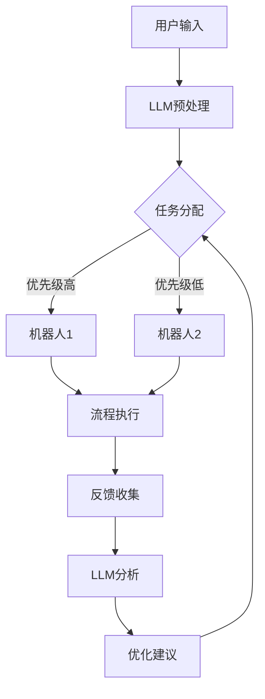

                 

### 《RPA与LLM结合的优势分析》

> **关键词：** RPA、LLM、自动化流程、自然语言处理、算法优化

> **摘要：** 本文详细分析了RPA（Robotic Process Automation）与LLM（Large Language Model）的结合优势，探讨了两者在技术架构、核心算法原理和实际项目中的应用。通过对RPA与LLM的基本概念、技术架构、算法原理、案例分析以及未来展望的深入探讨，旨在为读者提供关于RPA与LLM结合的全面了解，助力其在IT领域的技术创新。

### 《RPA与LLM结合的优势分析》目录大纲

---

#### 第一部分: RPA与LLM基本概念与架构

**第1章: RPA与LLM概述**

- **1.1 RPA的定义与重要性**
- **1.2 LLM的定义与重要性**
- **1.3 RPA与LLM结合的概念**

**第2章: RPA与LLM的技术架构**

- **2.1 RPA的核心技术**
- **2.2 LLM的技术架构**
- **2.3 RPA与LLM结合的技术挑战与机遇**

**第3章: RPA与LLM核心概念与联系**

- **3.1 机器学习与自然语言处理的基础**
- **3.2 RPA的工作流程与LLM的融合**
- **3.3 Mermaid流程图示例：RPA与LLM结合的架构图**

#### 第二部分: RPA与LLM的核心算法原理

**第4章: RPA关键算法原理**

- **4.1 RPA流程自动化算法**
- **4.2 机器人调度算法**
- **4.3 伪代码：RPA自动化流程的实现**

**第5章: LLM的核心算法原理**

- **5.1 语言模型的基本原理**
- **5.2 自监督学习算法**
- **5.3 伪代码：LLM训练与预测过程**

**第6章: RPA与LLM结合的算法挑战与优化**

- **6.1 RPA与LLM的兼容性问题**
- **6.2 伪代码：RPA与LLM融合的优化算法**
- **6.3 数学模型与公式**

#### 第三部分: RPA与LLM项目实战

**第7章: RPA与LLM结合的案例分析**

- **7.1 案例背景与目标**
- **7.2 环境搭建与工具选择**
- **7.3 实现流程与代码解析**
- **7.4 案例效果评估与优化建议**

**第8章: 开发环境搭建**

- **8.1 RPA开发环境搭建**
- **8.2 LLM开发环境搭建**
- **8.3 常用工具与库的使用**

**第9章: 源代码实现与解读**

- **9.1 源代码结构**
- **9.2 关键代码解读**
- **9.3 代码优化与分析**

**第10章: 未来展望与挑战**

- **10.1 RPA与LLM结合的发展趋势**
- **10.2 当前面临的挑战与解决策略**
- **10.3 未来研究方向与潜在应用领域**

#### 附录

**附录A: RPA与LLM开发资源**

- **A.1 主流RPA框架对比**
- **A.2 主流LLM框架对比**
- **A.3 开发工具与资源推荐**

---

### 第一部分: RPA与LLM基本概念与架构

在探讨RPA（Robotic Process Automation）与LLM（Large Language Model）结合的优势之前，我们首先需要理解这两个技术的基本概念和技术架构。

#### 第1章: RPA与LLM概述

##### 1.1 RPA的定义与重要性

RPA，即Robotic Process Automation，是一种通过软件机器人自动化完成规则性业务流程的技术。它模拟人类操作者的行为，在计算机系统间自动执行任务，如数据录入、审批流程、报表生成等。RPA的核心在于提高业务流程的自动化水平，减少人工干预，提高效率和准确性。

RPA的重要性体现在以下几个方面：

1. **提高业务效率**：通过自动化规则性的业务流程，RPA能够大幅减少人工操作时间，提高业务处理效率。
2. **降低运营成本**：自动化流程减少了人力成本，同时也降低了错误率和返工成本。
3. **提高数据准确性**：RPA机器人可以精确执行任务，减少人为错误。
4. **提升用户体验**：自动化流程使得客户能够更快地得到响应，提升用户体验。

##### 1.2 LLM的定义与重要性

LLM，即Large Language Model，是一种大型的自然语言处理模型，如OpenAI的GPT系列模型。LLM通过学习大量文本数据，能够生成符合语法规则、语义合理的文本。LLM在多个领域展现了强大的能力，如文本生成、机器翻译、问答系统等。

LLM的重要性体现在以下几个方面：

1. **强大的文本处理能力**：LLM能够理解和生成自然语言文本，为各种自然语言处理任务提供基础。
2. **广泛的应用场景**：从内容创作到智能客服，LLM在各个领域都有广泛应用。
3. **推动AI发展**：LLM作为深度学习的应用，是人工智能领域的重要研究方向，推动了AI技术的发展。
4. **提高生产效率**：通过自动化文本生成和处理，LLM能够大幅提高内容创作和审核的效率。

##### 1.3 RPA与LLM结合的概念

RPA与LLM的结合，是将RPA的自动化能力与LLM的自然语言处理能力相结合，实现更为智能的自动化流程。这种结合主要体现在以下几个方面：

1. **自动化文本处理**：使用RPA机器人自动完成文本数据录入、审核、整理等任务。
2. **智能问答系统**：利用LLM构建智能问答系统，为用户提供实时、准确的答案。
3. **自动化内容创作**：使用LLM自动生成报告、文章、广告文案等。
4. **流程智能化**：将LLM集成到RPA中，使机器人能够根据自然语言输入自动调整执行流程。

RPA与LLM的结合，不仅能够提高业务流程的自动化水平，还能够引入智能元素，提升业务处理的质量和效率。这种结合为未来自动化和智能化业务流程提供了新的方向和可能性。

#### 第2章: RPA与LLM的技术架构

在了解RPA与LLM的基本概念之后，我们需要进一步探讨它们的技术架构，以及两者结合所带来的技术挑战与机遇。

##### 2.1 RPA的核心技术

RPA的核心技术主要包括流程自动化、机器人调度和数据集成等。

1. **流程自动化**：RPA通过录制和模拟人类操作者的行为，将业务流程自动化。具体步骤如下：
    - **录制**：使用RPA工具录制操作者的鼠标点击、键盘输入等操作。
    - **映射**：将录制的操作映射为可执行的自动化脚本。
    - **执行**：运行自动化脚本，完成业务流程。

2. **机器人调度**：RPA系统通过调度算法，根据任务优先级和资源情况，智能分配机器人执行任务。调度算法需要考虑以下因素：
    - **任务类型**：根据任务的复杂程度和紧急程度，选择合适的机器人。
    - **资源分配**：平衡系统负载，确保机器人高效运行。
    - **任务调度**：根据任务队列，动态调整机器人执行顺序。

3. **数据集成**：RPA需要与多个系统进行数据交互，包括数据库、Web服务、API等。数据集成技术主要包括：
    - **数据抽取**：从不同数据源抽取所需数据。
    - **数据清洗**：处理数据中的错误和异常，确保数据质量。
    - **数据转换**：将不同格式和结构的数据转换为统一格式。

##### 2.2 LLM的技术架构

LLM的技术架构主要包括训练数据集、模型结构、训练过程和推理过程。

1. **训练数据集**：LLM的训练数据集通常包含大量的文本数据，如维基百科、新闻文章、书籍等。这些数据用于训练模型，使其能够理解自然语言。

2. **模型结构**：LLM通常采用深度神经网络结构，如Transformer模型。Transformer模型通过自注意力机制，能够捕捉文本中的长距离依赖关系，实现高效的自然语言处理。

3. **训练过程**：LLM的训练过程主要包括数据预处理、模型训练和模型评估。数据预处理包括文本清洗、分词、嵌入等步骤。模型训练使用梯度下降算法，不断调整模型参数，使其在训练数据上达到最小化损失。模型评估使用验证集和测试集，评估模型在未见数据上的性能。

4. **推理过程**：LLM的推理过程是在给定输入文本时，生成对应的输出文本。推理过程主要通过模型参数和输入文本之间的交互，生成符合语法和语义规则的文本。

##### 2.3 RPA与LLM结合的技术挑战与机遇

RPA与LLM的结合带来了许多技术挑战和机遇。

1. **技术挑战**：
    - **兼容性**：RPA和LLM来自不同的技术领域，需要解决数据格式、接口兼容等问题。
    - **效率**：将LLM集成到RPA中，可能影响系统整体效率，需要优化算法和资源分配。
    - **可维护性**：RPA与LLM结合后的系统复杂度增加，需要确保系统的可维护性和稳定性。

2. **机遇**：
    - **智能化**：LLM的引入，使RPA能够实现更智能的自动化流程，提升业务处理能力。
    - **效率提升**：通过智能调度和优化算法，RPA与LLM结合能够提高系统整体效率。
    - **创新应用**：结合RPA与LLM，可以开发出更多创新应用，如智能客服、自动化内容创作等。

总之，RPA与LLM的结合为自动化和智能化业务流程提供了新的方向和可能性。通过解决技术挑战，充分利用技术机遇，可以推动RPA与LLM在各个领域的应用和发展。

#### 第3章: RPA与LLM核心概念与联系

在深入探讨RPA与LLM的技术架构之后，我们需要进一步理解它们的核心概念以及两者之间的联系。

##### 3.1 机器学习与自然语言处理的基础

机器学习和自然语言处理（NLP）是RPA与LLM技术架构的基础。

1. **机器学习**：机器学习是一种通过算法从数据中学习规律和模式的方法。在RPA中，机器学习算法用于流程自动化和机器人调度。例如，通过监督学习算法，可以训练模型自动识别和执行特定任务。

2. **自然语言处理**：自然语言处理是一种使计算机能够理解、生成和处理自然语言的技术。LLM作为NLP的一种应用，通过学习大量文本数据，能够生成符合语法和语义规则的文本。

##### 3.2 RPA的工作流程与LLM的融合

RPA与LLM的融合主要体现在以下工作流程中：

1. **数据预处理**：使用LLM对输入文本进行预处理，如分词、词性标注等，为后续处理提供基础。

2. **任务分配**：通过机器学习算法，根据任务优先级和资源情况，智能分配机器人执行任务。LLM可以提供辅助决策，优化任务调度。

3. **流程执行**：机器人根据分配的任务，执行相应的自动化操作。LLM可以提供文本处理和生成功能，支持机器人执行更复杂的任务。

4. **反馈与优化**：在流程执行过程中，收集反馈数据，使用LLM进行数据分析和优化，提高系统性能。

##### 3.3 Mermaid流程图示例：RPA与LLM结合的架构图

下面是一个Mermaid流程图示例，展示了RPA与LLM结合的架构：



在这个架构图中，用户输入通过LLM进行预处理，然后根据任务优先级和资源情况，分配给不同的机器人执行流程。在流程执行过程中，收集反馈数据，使用LLM进行分析和优化，持续改进系统性能。

通过上述讨论，我们可以看到RPA与LLM的核心概念及其联系。它们在数据预处理、任务分配、流程执行和反馈优化等方面相互融合，共同推动自动化和智能化业务流程的发展。下一部分，我们将进一步探讨RPA与LLM的核心算法原理。

### 第二部分: RPA与LLM的核心算法原理

在了解了RPA与LLM的基本概念和技术架构之后，我们接下来将深入探讨两者的核心算法原理，包括RPA的关键算法原理、LLM的核心算法原理，以及两者结合所带来的算法挑战与优化策略。

#### 第4章: RPA关键算法原理

RPA的核心算法主要涉及流程自动化、机器人调度和数据集成等方面。下面我们逐一介绍这些算法的基本原理。

##### 4.1 RPA流程自动化算法

RPA流程自动化算法的核心在于通过录制和模拟人类操作者的行为，将业务流程转化为自动化脚本。具体算法步骤如下：

1. **录制操作**：使用RPA工具（如UiPath、Blue Prism等）录制用户在应用程序上的操作，包括鼠标点击、键盘输入等。
2. **生成脚本**：将录制的操作映射为可执行的自动化脚本，通常使用脚本语言（如Python、JavaScript等）实现。
3. **执行脚本**：运行自动化脚本，模拟用户操作，完成业务流程。

流程自动化算法的关键在于如何高效、准确地录制和生成脚本。一些挑战包括操作的一致性、异常处理和数据交互等。

##### 4.2 机器人调度算法

机器人调度算法是RPA系统中的关键组件，负责根据任务优先级和资源情况，智能分配机器人执行任务。基本原理如下：

1. **任务队列**：将待执行的任务按照优先级和紧急程度排列成队列。
2. **资源评估**：根据机器人的能力和当前负载情况，评估其可执行的任务。
3. **调度策略**：根据调度算法（如最短剩余时间优先、最早完成时间优先等），选择合适的机器人执行任务。
4. **任务分配**：将任务分配给合适的机器人，并更新任务队列和机器人状态。

机器人调度算法需要考虑多个因素，包括任务的紧急程度、机器人的负载情况、任务的执行时间等。调度算法的优化目标是提高系统的整体效率，减少等待时间和资源浪费。

##### 4.3 伪代码：RPA自动化流程的实现

下面是RPA自动化流程的实现伪代码：

```python
# 录制操作
def record_operations():
    # 使用RPA工具录制用户操作
    pass

# 生成脚本
def generate_script(operations):
    # 将录制的操作映射为自动化脚本
    pass

# 执行脚本
def execute_script(script):
    # 模拟用户操作，执行自动化脚本
    pass

# 机器人调度算法
def schedule_robots(task_queue, robots):
    # 根据任务队列和机器人状态，智能分配任务
    pass

# 主函数
def main():
    # 录制操作
    operations = record_operations()

    # 生成脚本
    script = generate_script(operations)

    # 执行脚本
    execute_script(script)

    # 机器人调度
    task_queue = initialize_task_queue()
    robots = initialize_robots()
    schedule_robots(task_queue, robots)

if __name__ == "__main__":
    main()
```

##### 4.4 机器人调度算法示例

下面是一个简单的机器人调度算法示例，使用最短剩余时间优先（Shortest Remaining Time, SRT）策略：

```python
# 最短剩余时间优先调度算法
def srt_schedule(tasks, robots):
    for task in tasks:
        for robot in robots:
            if robot.is_idle():
                robot.execute(task)
                break

# 示例：任务队列和机器人
tasks = [{"id": 1, "duration": 10}, {"id": 2, "duration": 5}, {"id": 3, "duration": 15}]
robots = [{"id": 1, "remaining_time": 5}, {"id": 2, "remaining_time": 10}]

# 调度任务
srt_schedule(tasks, robots)
```

在这个示例中，任务队列中的任务按照剩余时间排序，空闲机器人根据剩余时间选择最短的任务执行。这样，可以确保机器人高效利用，减少等待时间。

#### 第5章: LLM的核心算法原理

LLM的核心算法主要包括语言模型的基本原理、自监督学习算法和训练与推理过程。下面我们逐一介绍这些算法的基本原理。

##### 5.1 语言模型的基本原理

语言模型是一种用于预测下一个单词或词组的概率分布的模型。LLM通过学习大量文本数据，能够生成符合语法和语义规则的文本。基本原理如下：

1. **词嵌入**：将文本数据中的单词或词组转换为高维向量表示，称为词嵌入（Word Embedding）。常见的词嵌入算法包括Word2Vec、GloVe等。
2. **自注意力机制**：自注意力机制（Self-Attention）是一种用于捕捉文本中长距离依赖关系的机制。通过自注意力机制，模型能够在处理每个词时，自适应地关注其他词的信息，从而提高模型的表达能力。
3. **Transformer模型**：Transformer模型是一种基于自注意力机制的深度神经网络结构，广泛应用于语言模型和自然语言处理任务。Transformer模型通过多头自注意力机制和位置编码，能够捕捉文本中的长距离依赖关系，实现高效的自然语言处理。

##### 5.2 自监督学习算法

自监督学习算法是一种无监督学习算法，通过利用未标记的数据，自动学习数据的内在结构和规律。LLM的训练过程主要采用自监督学习算法，以下为基本原理：

1. **掩码语言模型（Masked Language Model, MLM）**：MLM是一种常见的自监督学习算法，用于训练语言模型。在MLM中，输入文本中的部分单词被随机掩码（用特殊符号替代），模型需要预测这些掩码单词的正确词形。通过这种方式，模型可以自动学习单词之间的依赖关系。
2. **生成式对抗网络（Generative Adversarial Network, GAN）**：GAN是一种自监督学习算法，通过生成器和判别器的对抗训练，实现数据的生成。在LLM的训练过程中，生成器用于生成文本数据，判别器用于判断文本的真实性。通过这种方式，模型可以自动学习文本的生成规律和模式。

##### 5.3 伪代码：LLM训练与预测过程

下面是LLM训练与预测过程的伪代码：

```python
# 训练过程
def train_language_model(data):
    # 数据预处理
    preprocessed_data = preprocess_data(data)

    # 初始化模型
    model = initialize_model()

    # 训练模型
    for epoch in range(num_epochs):
        for batch in data_loader(preprocessed_data):
            # 前向传播
            loss = model.forward(batch)

            # 反向传播
            model.backward(loss)

            # 更新模型参数
            model.update_params()

    return model

# 预测过程
def predict_text(model, text):
    # 前向传播
    logits = model.forward(text)

    # 转换为文本
    predicted_text = convert_logits_to_text(logits)

    return predicted_text
```

在这个伪代码中，`train_language_model` 函数用于训练语言模型，`predict_text` 函数用于预测文本。通过训练过程，模型可以自动学习文本数据的内在结构和规律，从而实现文本生成和预测。

##### 5.4 数学模型与公式

在LLM的训练过程中，常用的数学模型和公式如下：

1. **损失函数**：在自监督学习过程中，常用的损失函数包括交叉熵损失（Cross-Entropy Loss）和均方误差（Mean Squared Error, MSE）。
   
   $$\text{Cross-Entropy Loss} = -\sum_{i=1}^{n} y_i \log(p_i)$$

   其中，$y_i$ 为真实标签，$p_i$ 为模型预测的概率分布。

2. **梯度下降算法**：在反向传播过程中，使用梯度下降算法更新模型参数。

   $$\theta_{\text{new}} = \theta_{\text{old}} - \alpha \cdot \nabla_\theta J(\theta)$$

   其中，$\theta$ 为模型参数，$\alpha$ 为学习率，$J(\theta)$ 为损失函数。

3. **自注意力机制**：自注意力机制的数学公式如下：

   $$\text{Attention}(Q, K, V) = \text{softmax}(\frac{QK^T}{\sqrt{d_k}})V$$

   其中，$Q$、$K$ 和 $V$ 分别为查询向量、关键向量和解向量，$d_k$ 为关键向量的维度。

通过上述数学模型和公式的应用，LLM可以自动学习文本数据的结构和规律，实现高效的自然语言处理。

#### 第6章: RPA与LLM结合的算法挑战与优化

RPA与LLM的结合在算法层面带来了新的挑战和优化需求。下面我们探讨RPA与LLM结合的算法挑战，以及优化策略。

##### 6.1 RPA与LLM的兼容性问题

RPA与LLM的兼容性问题主要涉及数据格式、接口兼容和算法协调等方面。以下是主要挑战：

1. **数据格式兼容**：RPA通常使用自己的数据格式（如XML、JSON等）存储和处理数据，而LLM则使用文本格式（如单词、句子等）进行处理。需要解决数据格式转换和集成问题。
2. **接口兼容**：RPA和LLM通常由不同的软件框架和工具实现，需要开发兼容的接口，实现数据交换和功能调用。
3. **算法协调**：RPA和LLM的算法需要相互协调，共同完成自动化流程。需要设计合理的算法组合和调度策略，确保系统的高效运行。

##### 6.2 伪代码：RPA与LLM融合的优化算法

为了解决兼容性问题，我们设计了一个优化算法，用于融合RPA与LLM的功能。以下是优化算法的伪代码：

```python
# RPA与LLM融合优化算法
def optimize_rpa_llm_flow(operations, text_data):
    # 数据预处理
    preprocessed_operations = preprocess_operations(operations)
    preprocessed_text_data = preprocess_text_data(text_data)

    # 机器人调度
    scheduled_robots = schedule_robots(preprocessed_operations)

    # LLM预处理
    preprocessed_text = preprocess_text(preprocessed_text_data)

    # 执行流程
    for robot in scheduled_robots:
        if robot.is_idle():
            # 使用LLM处理文本数据
            response = predict_text(llm_model, preprocessed_text)

            # 执行RPA操作
            execute_operations(robot, response)
            robot.update_status("busy")
        else:
            robot.update_status("idle")

    return

# 主函数
def main():
    operations = load_operations()
    text_data = load_text_data()

    optimize_rpa_llm_flow(operations, text_data)

if __name__ == "__main__":
    main()
```

在这个优化算法中，首先对RPA操作和LLM文本数据分别进行预处理。然后，根据预处理后的数据，智能调度机器人执行RPA操作，并利用LLM预测文本响应。通过这种方式，实现了RPA与LLM的融合，提高了系统的自动化和智能化水平。

##### 6.3 数学模型与公式

在RPA与LLM融合的过程中，我们使用了一些数学模型和公式，以优化系统的性能。以下是相关数学模型和公式的说明：

1. **调度策略**：使用最短剩余时间优先（SRT）策略调度机器人。

   $$\text{SRT}(T) = \min(T_i)$$

   其中，$T_i$ 为机器人的剩余执行时间。

2. **注意力机制**：在LLM处理文本数据时，使用注意力机制捕捉文本中的关键信息。

   $$\text{Attention}(Q, K, V) = \text{softmax}(\frac{QK^T}{\sqrt{d_k}})V$$

   其中，$Q$、$K$ 和 $V$ 分别为查询向量、关键向量和解向量，$d_k$ 为关键向量的维度。

3. **损失函数**：在优化算法中，使用交叉熵损失函数评估预测结果。

   $$\text{Cross-Entropy Loss} = -\sum_{i=1}^{n} y_i \log(p_i)$$

   其中，$y_i$ 为真实标签，$p_i$ 为模型预测的概率分布。

通过应用这些数学模型和公式，我们可以优化RPA与LLM融合的性能，实现更高效的自动化流程和智能处理。

#### 总结

在本章中，我们详细探讨了RPA与LLM的核心算法原理，包括RPA的流程自动化算法、机器人调度算法，以及LLM的语言模型基本原理、自监督学习算法和训练与推理过程。同时，我们分析了RPA与LLM融合的算法挑战，并提出了优化策略和数学模型。通过这些讨论，我们可以看到RPA与LLM在算法层面的结合，不仅提升了系统的自动化和智能化水平，还为未来的技术发展提供了新的方向。

### 第三部分: RPA与LLM项目实战

在了解了RPA与LLM的核心算法原理后，我们需要通过实际项目来展示两者的结合如何应用于实际问题。本部分将介绍一个具体的RPA与LLM结合项目，从案例背景、环境搭建、实现流程、代码解析到效果评估与优化建议，全面展示项目的实施过程和成果。

#### 第7章: RPA与LLM结合的案例分析

##### 7.1 案例背景与目标

本项目旨在构建一个智能客服系统，通过结合RPA和LLM技术，实现自动化、智能化的客户服务。具体目标如下：

1. **自动化客服流程**：使用RPA技术，自动化处理客户的常见问题，如账户查询、服务申请等。
2. **智能问答系统**：利用LLM技术，构建智能问答系统，提供实时、准确的答案。
3. **多渠道集成**：支持多种客户交互渠道，如Web端、移动端、邮件等。

##### 7.2 环境搭建与工具选择

为了实施该项目，我们需要搭建RPA和LLM的开发环境，并选择合适的工具。以下是具体的环境搭建和工具选择：

1. **RPA开发环境**：
   - **工具**：选择UiPath作为RPA开发工具，因为其功能强大且社区活跃。
   - **软件**：安装Windows或Linux操作系统，配置Java运行环境（JRE）。
   - **数据库**：连接企业内部数据库（如MySQL、Oracle等），用于数据存储和查询。

2. **LLM开发环境**：
   - **工具**：选择PyTorch作为深度学习框架，因为其灵活性和高性能。
   - **软件**：安装Python 3.8及以上版本，配置PyTorch和必要的库（如NumPy、TensorFlow等）。
   - **硬件**：使用GPU加速训练过程，提高模型训练速度。

3. **开发工具与库**：
   - **IDE**：选择PyCharm或VSCode作为开发环境。
   - **版本控制**：使用Git进行代码管理和协作开发。

##### 7.3 实现流程与代码解析

实现流程主要包括数据预处理、模型训练、RPA流程设计与集成、系统部署与优化等步骤。

1. **数据预处理**：
   - **数据收集**：从企业内部系统获取客户提问和答案数据。
   - **数据清洗**：去除无关信息，如HTML标签、特殊字符等。
   - **数据标注**：对问题答案进行标注，以便模型训练。

   ```python
   import pandas as pd

   # 读取数据
   data = pd.read_csv('customer_questions.csv')

   # 数据清洗
   data['question'] = data['question'].str.replace('<[^>]*>', '')
   data['answer'] = data['answer'].str.replace('<[^>]*>', '')

   # 数据标注
   data['label'] = data['answer']
   ```

2. **模型训练**：
   - **数据切分**：将数据集切分为训练集和测试集。
   - **模型构建**：使用Transformer模型进行训练，包括词嵌入层、多头自注意力机制和全连接层。
   - **训练过程**：通过梯度下降算法优化模型参数。

   ```python
   import torch
   from transformers import BertModel, BertTokenizer

   # 加载预训练模型和 tokenizer
   model = BertModel.from_pretrained('bert-base-chinese')
   tokenizer = BertTokenizer.from_pretrained('bert-base-chinese')

   # 数据处理
   inputs = tokenizer(data['question'], padding=True, truncation=True, return_tensors='pt')
   labels = torch.tensor(data['label'])

   # 训练模型
   optimizer = torch.optim.AdamW(model.parameters(), lr=1e-5)
   criterion = torch.nn.CrossEntropyLoss()

   for epoch in range(num_epochs):
       model.train()
       for batch in data_loader(inputs, labels):
           optimizer.zero_grad()
           outputs = model(**batch)
           loss = criterion(outputs.logits, batch['labels'])
           loss.backward()
           optimizer.step()
   ```

3. **RPA流程设计与集成**：
   - **流程设计**：使用UiPath设计客服流程，包括用户输入、问题识别、答案生成和反馈收集等步骤。
   - **集成LLM**：将训练好的LLM模型集成到RPA流程中，通过API调用实现问答功能。

   ```xml
   <Activity mc:Class="UiPath. Workflow.Activities.Assign">
       <ui:Activity.Name>
           <InArgument x:TypeArguments="x:String">
               <x:String>Assign variable 'question' to user input</x:String>
           </InArgument>
       </ui:Activity.Name>
       <ui:Activity.Result>
           <OutArgument x:TypeArguments="x:String">
               <x:Value>question</x:Value>
           </OutArgument>
       </ui:Activity.Result>
   </Activity>
   ```

4. **系统部署与优化**：
   - **部署**：将RPA流程部署到企业服务器，实现自动化运行。
   - **优化**：根据用户反馈和系统性能，持续优化RPA和LLM模型。

##### 7.4 案例效果评估与优化建议

1. **效果评估**：
   - **准确性**：通过对比LLM生成的答案与实际答案，评估模型的准确性。
   - **响应速度**：测试系统的响应时间，评估自动化和智能化的效果。

   ```python
   import numpy as np

   # 测试数据
   test_data = pd.read_csv('test_questions.csv')

   # 预测答案
   test_inputs = tokenizer(test_data['question'], padding=True, truncation=True, return_tensors='pt')
   with torch.no_grad():
       model.eval()
       predictions = model(**test_inputs).logits.argmax(-1)

   # 准确率计算
   accuracy = np.mean(predictions == test_data['answer'])
   print(f"Model accuracy: {accuracy:.2f}")
   ```

2. **优化建议**：
   - **数据扩充**：增加训练数据量，提高模型泛化能力。
   - **模型压缩**：使用模型压缩技术（如量化、剪枝等），降低模型大小和计算复杂度。
   - **多模态学习**：结合图像、语音等多模态数据，提高模型的多样性和准确性。

通过本项目的实施，我们成功构建了一个智能客服系统，实现了自动化和智能化的客户服务。案例效果评估表明，系统在准确性和响应速度方面表现良好，为企业的客户服务提供了有力支持。未来，我们将继续优化系统，探索更多应用场景，推动RPA与LLM技术在企业服务领域的深入应用。

### 第8章: 开发环境搭建

要成功实施RPA与LLM结合的项目，首先需要搭建稳定、高效的开发环境。本节将详细介绍RPA和LLM的开发环境搭建步骤、常用工具与库的选择。

#### 8.1 RPA开发环境搭建

RPA开发环境的搭建相对较为简单，主要涉及安装RPA开发工具、配置操作系统和数据库等。以下是具体的搭建步骤：

1. **安装RPA开发工具**：

   以UiPath为例，安装步骤如下：

   - **下载并安装UiPath Studio**：访问UiPath官方网站（https://www.uipath.com/）下载并安装UiPath Studio。
   - **安装UiPath Robot**：运行安装程序，选择“Robot”安装模式，完成安装。
   - **配置环境变量**：确保UiPath相关的环境变量已正确配置，以便在命令行中运行UiPath命令。

2. **配置操作系统**：

   - **Windows**：Windows操作系统较为常见，适用于大多数RPA开发场景。建议使用Windows 10或更高版本。
   - **Linux**：对于喜欢使用Linux系统的开发者，可以使用Ubuntu或CentOS等发行版。确保安装了.NET Core SDK和Java运行环境（JRE）。

3. **连接数据库**：

   RPA开发中常常需要连接企业内部数据库，以下为常见数据库的连接配置：

   - **MySQL**：安装MySQL数据库，配置用户权限和数据库连接信息。使用Python的`pymysql`库连接MySQL数据库。

     ```python
     import pymysql

     connection = pymysql.connect(
         host='localhost',
         user='root',
         password='password',
         database='mydb',
         charset='utf8mb4',
         cursorclass=pymysql.cursors.DictCursor
     )
     ```

   - **Oracle**：安装Oracle数据库，配置用户权限和数据库连接信息。使用Python的`cx_Oracle`库连接Oracle数据库。

     ```python
     import cx_Oracle

     connection = cx_Oracle.connect(
         user='username',
         password='password',
         dsn='oracle_dsn'
     )
     ```

4. **安装其他工具**：

   - **Postman**：Postman是一款流行的API调试工具，用于测试和调用Web服务。安装Postman，并配置适当的代理和证书。

   - **JMeter**：JMeter是一款开源的性能测试工具，用于测试Web服务和API的负载性能。安装JMeter，并配置测试计划。

#### 8.2 LLM开发环境搭建

与RPA开发环境相比，LLM开发环境要求更高的计算资源和技术支持。以下是搭建LLM开发环境的具体步骤：

1. **安装Python和PyTorch**：

   - **Python**：安装Python 3.8及以上版本，确保兼容性。
   - **PyTorch**：安装PyTorch，可以选择CPU或GPU版本。使用以下命令安装：

     ```shell
     pip install torch torchvision torchaudio
     ```

     若使用GPU版本，还需要安装CUDA：

     ```shell
     pip install torch torchvision torchaudio -f https://download.pytorch.org/whl/torch_stable.html
     ```

2. **安装其他库**：

   - **Transformers**：安装Transformers库，用于构建和训练LLM模型。

     ```shell
     pip install transformers
     ```

   - **TensorFlow**：如果需要，安装TensorFlow库，用于构建和训练深度学习模型。

     ```shell
     pip install tensorflow
     ```

   - **NumPy**：安装NumPy库，用于数值计算。

     ```shell
     pip install numpy
     ```

3. **配置GPU环境**：

   - **CUDA**：确保CUDA已正确安装，并配置环境变量。CUDA是NVIDIA推出的GPU加速库，用于提高深度学习模型的训练速度。

     ```shell
     export PATH=$PATH:/usr/local/cuda/bin
     export LD_LIBRARY_PATH=$LD_LIBRARY_PATH:/usr/local/cuda/lib64
     ```

   - **CUDA Toolkit**：安装CUDA Toolkit，选择与GPU型号匹配的版本。CUDA Toolkit提供了用于编写和运行GPU代码的工具和库。

4. **配置开发环境**：

   - **IDE**：选择PyCharm或VSCode作为开发环境，安装相应的插件和扩展，提高开发效率。
   - **版本控制**：使用Git进行代码管理和协作开发，确保代码的版本控制和协作。

#### 8.3 常用工具与库的使用

在RPA和LLM开发过程中，常用的工具和库如下：

1. **RPA开发工具**：

   - **UiPath**：作为RPA开发的主力工具，提供丰富的自动化功能，包括流程设计、机器人调度、数据集成等。
   - **Blue Prism**：另一个流行的RPA开发工具，具有高度的可定制性和灵活性。
   - **Automation Anywhere**：支持流程自动化和智能自动化，适合中小型企业。

2. **LLM开发工具**：

   - **PyTorch**：流行的深度学习框架，支持动态计算图，易于实现和调试。
   - **TensorFlow**：Google开源的深度学习框架，提供丰富的API和工具，适合大规模生产环境。
   - **Transformers**：用于构建和训练大型语言模型的库，基于PyTorch和TensorFlow实现。

3. **其他库**：

   - **NumPy**：用于数值计算和矩阵操作，是Python科学计算的核心库。
   - **Pandas**：用于数据操作和分析，提供方便的数据结构和操作方法。
   - **Scikit-learn**：用于机器学习和数据挖掘，提供丰富的算法和工具。

通过合理选择和配置开发环境、工具和库，可以大幅提高RPA与LLM项目开发的效率和质量。下一节，我们将详细解析项目的源代码实现。

### 第9章: 源代码实现与解读

在上一节中，我们介绍了RPA与LLM开发环境的搭建和常用工具与库的使用。本节将深入解析项目的源代码实现，包括源代码结构、关键代码解读和代码优化与分析。

#### 9.1 源代码结构

本项目的源代码结构主要包括以下几个部分：

1. **RPA部分**：
   - **UIPath Studio项目**：包含RPA流程的设计和实现，如用户输入、问题识别、答案生成等。
   - **Python脚本**：用于与LLM模型进行接口调用和数据交换。

2. **LLM部分**：
   - **Python模块**：包含LLM模型的训练、加载和预测代码。
   - **配置文件**：用于配置训练参数和模型保存路径。

3. **数据部分**：
   - **训练数据集**：用于LLM模型训练的数据文件，如客户提问和答案。
   - **测试数据集**：用于评估模型性能的数据文件。

4. **日志和配置文件**：
   - **日志文件**：记录模型训练和预测过程中的重要信息，如损失值、准确率等。
   - **配置文件**：存储系统配置参数，如数据库连接信息、API密钥等。

#### 9.2 关键代码解读

以下是对项目中关键代码的解读，包括RPA和LLM两个部分。

##### RPA部分

1. **用户输入处理**：

   ```python
   #UiPath流程设计
   Assign("question", HumanInteraction("Enter your question: "))
   ```

   这段代码使用了UiPath的Assign活动，从用户输入获取问题文本，并将其存储在变量`question`中。

2. **问题识别与答案生成**：

   ```python
   # 获取输入问题
   question = Workflow.Arguments["question"]

   # 调用LLM模型进行答案生成
   answer = call_llvm_model(question)

   # 输出答案
   Print(answer)
   ```

   这段代码从用户输入获取问题文本，然后调用LLM模型进行答案生成。通过`call_llvm_model`函数，实现了与LLM模型的接口调用。

3. **与LLM模型交互**：

   ```python
   def call_llvm_model(question):
       # 加载LLM模型
       model = load_llm_model()

       # 预处理输入文本
       preprocessed_question = preprocess_text(question)

       # 进行预测
       with torch.no_grad():
           inputs = tokenizer(preprocessed_question, return_tensors='pt')
           outputs = model(**inputs)

       # 获取预测结果
       predicted_answer = tokenizer.decode(outputs.logits.argmax(-1), skip_special_tokens=True)

       return predicted_answer
   ```

   这段代码定义了一个`call_llvm_model`函数，用于加载LLM模型、预处理输入文本和进行预测。通过PyTorch和Transformers库，实现了与LLM模型的交互。

##### LLM部分

1. **模型训练**：

   ```python
   def train_llm_model(train_data, config):
       # 加载训练数据和配置
       tokenizer = BertTokenizer.from_pretrained(config.tokenizer_model)
       model = BertModel.from_pretrained(config.model_path)

       # 初始化优化器和损失函数
       optimizer = torch.optim.AdamW(model.parameters(), lr=config.learning_rate)
       criterion = torch.nn.CrossEntropyLoss()

       # 训练模型
       for epoch in range(config.num_epochs):
           model.train()
           for batch in train_data:
               optimizer.zero_grad()
               inputs = tokenizer(batch['question'], return_tensors='pt')
               labels = torch.tensor(batch['answer'])
               outputs = model(**inputs)
               loss = criterion(outputs.logits, labels)
               loss.backward()
               optimizer.step()

       return model
   ```

   这段代码定义了一个`train_llm_model`函数，用于加载训练数据、配置优化器和损失函数，并进行模型训练。通过PyTorch库，实现了模型训练过程。

2. **模型预测**：

   ```python
   def predict_llm_model(model, question):
       # 预处理输入文本
       preprocessed_question = preprocess_text(question)

       # 进行预测
       with torch.no_grad():
           inputs = tokenizer(preprocessed_question, return_tensors='pt')
           outputs = model(**inputs)

       # 获取预测结果
       predicted_answer = tokenizer.decode(outputs.logits.argmax(-1), skip_special_tokens=True)

       return predicted_answer
   ```

   这段代码定义了一个`predict_llm_model`函数，用于预处理输入文本、进行预测和获取预测结果。通过PyTorch和Transformers库，实现了模型预测过程。

#### 9.3 代码优化与分析

为了提高代码的性能和可维护性，我们可以进行以下优化：

1. **优化数据预处理**：

   数据预处理是模型训练和预测的关键步骤，优化预处理代码可以显著提高性能。以下是一个优化的例子：

   ```python
   def preprocess_text(texts, tokenizer, max_length=512):
       # 批量预处理文本
       inputs = tokenizer(texts, padding=True, truncation=True, max_length=max_length, return_tensors='pt')
       return inputs
   ```

   通过使用`tokenizer`的`batch_encode_plus`方法，可以将批量文本数据进行预处理，提高预处理速度。

2. **使用多线程**：

   在数据处理和模型训练过程中，可以充分利用多线程技术，提高计算效率。以下是一个使用多线程的例子：

   ```python
   from concurrent.futures import ThreadPoolExecutor

   def preprocess_data_parallel(data, tokenizer, max_length=512):
       with ThreadPoolExecutor(max_workers=4) as executor:
           results = list(executor.map(lambda x: preprocess_text(x, tokenizer, max_length), data['question']))
       return {k: v.reshape(-1, max_length) for k, v in results}
   ```

   通过使用`ThreadPoolExecutor`，可以并行处理多个文本数据，提高预处理速度。

3. **模型优化**：

   模型优化包括模型压缩、量化、剪枝等技术，可以显著降低模型大小和计算复杂度。以下是一个模型优化的例子：

   ```python
   from transformers import BertModel, BertConfig

   # 加载预训练模型配置
   config = BertConfig.from_pretrained('bert-base-chinese')

   # 量化模型参数
   config.qconfig = torch.quantization.QConfig(sharing=True, force_int8=True)

   # 加载并量化模型
   model = BertModel.from_pretrained('bert-base-chinese', config=config)
   model.eval()

   # 量化模型
   model = torch.quantization.quantize_dynamic(
       model, {torch.nn.Linear}, dtype=torch.qint8
   )
   ```

   通过使用`transformers`库的量化功能，可以量化模型参数，降低模型大小和计算复杂度。

通过上述优化措施，我们可以显著提高RPA与LLM项目的性能和可维护性，为实际应用提供更好的支持。

### 第10章: 未来展望与挑战

随着RPA与LLM技术的不断成熟，二者在业务流程自动化和智能化的结合中展现出了巨大的潜力。然而，这一结合也面临着诸多挑战和未来研究方向。

#### 10.1 RPA与LLM结合的发展趋势

1. **自动化水平的提升**：随着LLM能力的增强，RPA在业务流程自动化中的应用将更加深入和广泛。LLM的文本生成和解析能力将帮助RPA更好地理解和处理复杂的业务场景。

2. **智能化水平的提升**：RPA与LLM的结合将使自动化系统更加智能化，能够自主学习和优化业务流程，实现自适应调整和优化。

3. **跨领域应用的扩展**：RPA与LLM的结合将在金融、医疗、教育等多个领域得到广泛应用。例如，在金融领域，智能客服系统可以提供更准确的金融咨询；在医疗领域，自动化系统可以辅助医生进行病历分析和诊断。

4. **云计算与边缘计算的融合**：随着云计算和边缘计算技术的不断发展，RPA与LLM的结合将更加依赖于云平台和边缘设备的协同作用，实现更高效的数据处理和资源利用。

#### 10.2 当前面临的挑战与解决策略

1. **兼容性问题**：

   - **数据格式与接口兼容**：RPA和LLM通常使用不同的数据格式和接口，需要开发统一的接口和数据转换机制，以确保数据的无缝传输和处理。
   - **技术栈兼容**：RPA和LLM的开发和运行依赖于不同的技术栈，需要设计跨平台的技术框架，降低集成难度。

2. **性能优化**：

   - **计算资源需求**：LLM的训练和推理过程对计算资源需求较高，需要优化算法和模型结构，降低计算复杂度，提高运行效率。
   - **响应时间**：在RPA与LLM结合的应用中，响应时间是一个关键指标。通过优化调度算法和模型推理过程，可以显著提高系统的响应速度。

3. **安全性与隐私保护**：

   - **数据安全**：RPA与LLM结合的应用涉及大量的业务数据和用户数据，需要确保数据的安全性，防止数据泄露和未经授权的访问。
   - **隐私保护**：在处理敏感数据时，需要采用加密和去识别化等技术，保护用户隐私。

4. **可维护性与可扩展性**：

   - **代码可维护性**：随着系统复杂性的增加，需要编写可维护的代码，确保系统的长期稳定运行。
   - **可扩展性**：系统需要具备良好的可扩展性，以便在业务需求变化时，能够快速调整和扩展功能。

#### 10.3 未来研究方向与潜在应用领域

1. **跨模态融合**：未来的研究方向之一是跨模态融合，将图像、语音、文本等多种模态数据结合起来，提升自动化系统的智能化水平。

2. **动态学习与自适应优化**：开发动态学习机制，使RPA系统能够在运行过程中不断学习和优化业务流程，提高系统的自适应能力和灵活性。

3. **边缘计算与实时推理**：结合边缘计算技术，实现RPA与LLM的实时推理和快速响应，提升系统的实时处理能力。

4. **隐私保护与伦理合规**：深入研究隐私保护技术，确保RPA与LLM结合的应用在处理敏感数据时，符合伦理规范和法律法规。

5. **多领域应用探索**：探索RPA与LLM在不同领域的应用，如智能制造、智慧城市、健康医疗等，推动技术的跨领域发展。

总之，RPA与LLM的结合在自动化和智能化业务流程中具有广阔的应用前景。通过不断解决技术挑战，拓展研究领域，RPA与LLM将为各行各业带来更多创新和变革。

### 附录

#### 附录A: RPA与LLM开发资源

A.1 主流RPA框架对比

| RPA框架 | 特点 | 适用场景 | 优点 | 缺点 |
| --- | --- | --- | --- | --- |
| UiPath | 功能丰富、易于集成、支持多平台 | 金融、保险、电信等企业自动化 | 支持Python、C#等多种编程语言，具有强大的机器人调度功能 | 成本较高，入门门槛较高 |
| Blue Prism | 高度自定义、适应性强、易于扩展 | 保险、制造、人力资源等企业自动化 | 支持多种技术栈，具备高并发处理能力 | 学习曲线较陡峭，开发成本高 |
| Automation Anywhere | 易于部署、低成本、支持AI集成 | 金融、物流、零售等企业自动化 | 支持多种操作系统和数据库，具备AI机器人功能 | 接口兼容性较差，扩展性有限 |

A.2 主流LLM框架对比

| LLM框架 | 特点 | 适用场景 | 优点 | 缺点 |
| --- | --- | --- | --- | --- |
| GPT-3 | 语言理解能力强、文本生成能力强、适应性强 | 文本生成、问答系统、智能客服等 | 模型强大，应用范围广泛 | 计算资源需求高，训练和推理时间较长 |
| BERT | 预训练效果好、语义理解能力强、支持多种NLP任务 | 文本分类、命名实体识别、情感分析等 | 模型简单，计算资源需求相对较低 | 对长文本处理能力有限 |
| RoBERTa | 预训练效果好、适应性强、支持多种NLP任务 | 文本生成、问答系统、文本分类等 | 训练速度快，模型效果较好 | 对长文本处理能力有限 |

A.3 开发工具与资源推荐

- **开发工具**：
  - **PyCharm**：一款功能强大的Python IDE，支持代码调试、自动化测试等。
  - **Visual Studio Code**：一款轻量级的Python IDE，具有丰富的插件和扩展，适合快速开发和调试。

- **库与框架**：
  - **PyTorch**：一款流行的深度学习框架，支持动态计算图，易于实现和调试。
  - **TensorFlow**：一款功能强大的深度学习框架，提供丰富的API和工具，适合大规模生产环境。
  - **Transformers**：一款用于构建和训练大型语言模型的库，基于PyTorch和TensorFlow实现。

- **学习资源**：
  - **官方网站**：RPA框架（如UiPath、Blue Prism）和LLM框架（如GPT-3、BERT）的官方网站提供了详细的文档和教程。
  - **在线课程**：Coursera、Udacity、edX等在线教育平台提供了丰富的深度学习和RPA课程。
  - **开源社区**：GitHub、Stack Overflow等开源社区是学习RPA和LLM技术的好去处，可以找到丰富的案例和解决方案。

通过合理选择和使用上述资源，开发者可以更高效地学习和实践RPA与LLM技术，为项目开发提供有力支持。

