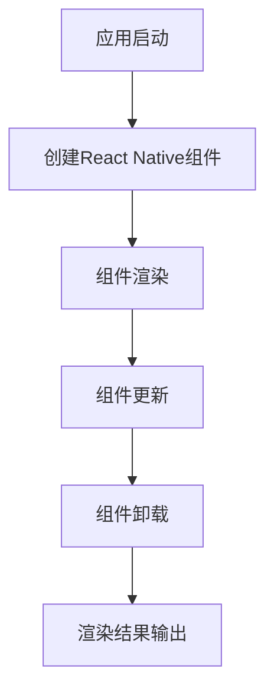
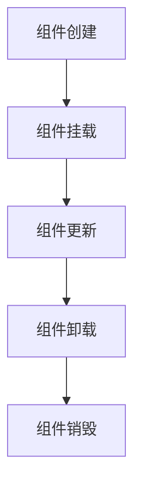
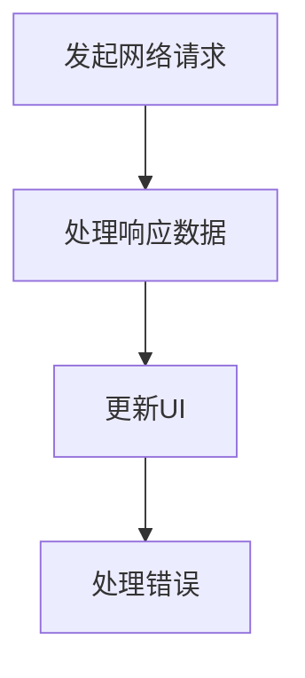

                 

### 《React Native性能调优》

---

> **关键词：**React Native, 性能优化, 组件优化, 列表优化, 动画优化, 网络优化, 开发环境优化

> **摘要：**本文将深入探讨React Native的性能优化策略和实践。通过分析React Native的性能瓶颈、渲染机制、组件优化、列表优化、动画优化、网络优化和开发环境优化，读者将了解如何有效提升React Native应用的性能，提高用户体验。

---

### 《React Native性能调优》目录大纲

## 第1章：React Native概述

### 1.1 React Native简介

React Native是一款由Facebook推出的跨平台移动应用开发框架，它允许开发者使用JavaScript编写代码，并在iOS和Android平台上运行。React Native通过将JavaScript与原生UI组件相结合，实现了接近原生应用的性能和用户体验。

### 1.2 React Native与原生应用的比较

React Native与原生应用在性能上有一定的差距，但通过一系列优化策略，React Native的性能可以得到显著提升。原生应用的优势在于直接操作原生UI组件，性能更为优异，而React Native通过JavaScript和原生组件的桥接，在保证开发效率的同时，也需要关注性能问题。

### 1.3 React Native的发展历程

React Native自2015年发布以来，已经经历了多个版本的迭代。每个版本都带来了新的特性和改进，使得React Native的性能和功能不断完善。

### 1.4 React Native的开发环境搭建

要开始使用React Native进行开发，需要搭建一套完整的开发环境。本文将介绍如何搭建React Native开发环境，包括安装Node.js、React Native CLI、模拟器和真机调试等步骤。

## 第2章：React Native架构与核心组件

### 2.1 React Native的架构原理

React Native的架构基于React的核心概念，通过JavaScript与原生组件的交互，实现了跨平台的UI渲染。本文将详细介绍React Native的架构原理，包括React Native的渲染流程和核心组件的工作方式。

### 2.2 React Native的核心组件

React Native提供了一套丰富的核心组件，这些组件与原生UI组件相对应，包括视图、文本、按钮等。本文将详细介绍这些核心组件的使用方法和特点。

### 2.3 React Native的组件生命周期

React Native组件的生命周期是开发者需要掌握的重要知识点。通过理解组件的生命周期，开发者可以更有效地管理和优化组件的性能。本文将详细介绍React Native组件的生命周期和各个生命周期方法的使用。

### 2.4 React Native的布局系统

React Native的布局系统是基于Flexbox模型的，提供了灵活的布局能力。本文将介绍React Native布局系统的原理和常用布局方式，帮助开发者设计出美观、易用的用户界面。

## 第3章：React Native性能优化原理

### 3.1 React Native的性能瓶颈分析

React Native的性能瓶颈主要来自于JavaScript和原生组件的交互、渲染机制和内存管理等。本文将分析React Native的性能瓶颈，并提出相应的优化策略。

### 3.2 React Native的渲染机制

React Native的渲染机制是基于React的虚拟DOM模型，通过Diff算法实现高效的组件更新和渲染。本文将详细介绍React Native的渲染机制，包括虚拟DOM的创建、更新和销毁过程。

### 3.3 React Native的性能监控与调试

性能监控与调试是优化React Native应用的关键步骤。本文将介绍如何使用React Native官方提供的性能监控工具，如React Native Debugger和PerfMonitor，对应用进行性能监控与调试。

### 3.4 React Native的性能优化策略

针对React Native的性能瓶颈，本文将提出一系列性能优化策略，包括组件优化、列表优化、动画优化、网络优化和开发环境优化等。这些策略将帮助开发者有效提升React Native应用的性能。

## 第4章：React Native动画与过渡优化

### 4.1 React Native的动画与过渡原理

React Native的动画和过渡是通过Animated库实现的，它提供了灵活的动画控制能力。本文将介绍React Native的动画与过渡原理，包括动画的基本概念、动画类型和动画控制方法。

### 4.2 React Native的动画优化技巧

动画优化是提升React Native应用性能的重要环节。本文将介绍一系列动画优化技巧，包括使用NativeDriver、控制动画帧率和避免过度动画等。

### 4.3 React Native的过渡优化方法

过渡效果是提升用户体验的重要手段。本文将介绍React Native的过渡优化方法，包括使用Animated.timing、使用Animated.spring和过渡动画的复合使用等。

### 4.4 React Native的动画性能分析

动画性能分析是优化动画效果的关键步骤。本文将介绍如何使用React Native官方提供的性能分析工具，对动画性能进行监控和分析，并提出优化建议。

## 第5章：React Native组件优化

### 5.1 组件拆分与复用

组件拆分和复用是提升React Native应用性能的有效策略。本文将介绍如何通过组件拆分和复用来优化组件性能，包括拆分组件的原则和方法。

### 5.2 组件渲染性能分析

组件渲染性能分析是优化组件性能的重要步骤。本文将介绍如何使用React Native官方提供的性能分析工具，对组件渲染性能进行分析和优化。

### 5.3 组件状态管理优化

状态管理是React Native应用的核心，优化状态管理可以提高应用性能。本文将介绍如何通过优化状态管理来提升React Native应用的性能，包括使用Redux和MobX等状态管理库。

### 5.4 组件事件处理优化

事件处理是React Native应用的重要组成部分，优化事件处理可以提高应用性能。本文将介绍如何通过优化事件处理来提升React Native应用的性能，包括事件绑定和事件防抖等技巧。

## 第6章：React Native列表性能优化

### 6.1 列表的渲染原理

列表是React Native应用中常见的组件，优化列表性能对提升用户体验至关重要。本文将介绍列表的渲染原理，包括列表的虚拟化、数据分页和懒加载等。

### 6.2 列表的优化技巧

本文将介绍一系列列表优化技巧，包括使用虚拟列表、减少不必要的渲染和优化列表数据结构等。这些技巧将帮助开发者提升列表渲染性能。

### 6.3 使用虚拟列表优化

虚拟列表是优化列表性能的有效方法之一，它通过只渲染当前可视区域内的数据来提升性能。本文将详细介绍虚拟列表的实现原理和使用方法。

### 6.4 列表的性能测试与分析

列表性能测试与分析是优化列表性能的关键步骤。本文将介绍如何使用React Native官方提供的性能分析工具，对列表性能进行测试和分析，并提出优化建议。

## 第7章：React Native图片与视频优化

### 7.1 图片加载与缓存优化

图片加载与缓存是优化React Native应用性能的重要方面。本文将介绍如何通过图片加载与缓存优化来提升应用性能，包括图片预加载、缓存策略和数据压缩等。

### 7.2 视频播放性能优化

视频播放性能优化是提升用户观看体验的关键。本文将介绍如何通过视频播放性能优化来提升React Native应用的性能，包括视频缓存、播放控制优化和视频格式选择等。

### 7.3 图片与视频资源压缩

图片与视频资源压缩是优化应用性能的有效手段。本文将介绍如何通过图片与视频资源压缩来提升应用性能，包括图片压缩算法、视频编码格式和资源加载策略等。

### 7.4 图片与视频性能测试

图片与视频性能测试是优化图片与视频性能的关键步骤。本文将介绍如何使用React Native官方提供的性能分析工具，对图片与视频性能进行测试和分析，并提出优化建议。

## 第8章：React Native网络优化

### 8.1 网络请求优化

网络请求优化是提升React Native应用性能的重要方面。本文将介绍如何通过优化网络请求来提升应用性能，包括减少请求次数、使用缓存和请求压缩等。

### 8.2 数据缓存策略

数据缓存策略是优化应用性能的有效方法。本文将介绍如何通过数据缓存策略来提升应用性能，包括本地缓存、网络缓存和缓存刷新机制等。

### 8.3 网络状态监测与切换

网络状态监测与切换是确保应用稳定运行的关键。本文将介绍如何通过网络状态监测与切换来优化应用性能，包括网络状态检测、网络切换策略和错误处理等。

### 8.4 网络性能测试与优化建议

网络性能测试与优化建议是优化网络性能的重要环节。本文将介绍如何使用React Native官方提供的性能分析工具，对网络性能进行测试和分析，并提出优化建议。

## 第9章：React Native开发环境优化

### 9.1 开发工具优化

开发工具优化是提升React Native开发效率的重要方面。本文将介绍如何通过优化开发工具来提升开发效率，包括使用React Native Studio、React Native Inspector和性能分析工具等。

### 9.2 模拟器优化

模拟器优化是提升React Native应用测试体验的关键。本文将介绍如何通过优化模拟器来提升应用测试体验，包括模拟器配置、网络模拟和性能测试等。

### 9.3 构建过程优化

构建过程优化是提升React Native应用发布效率的重要方面。本文将介绍如何通过优化构建过程来提升发布效率，包括使用构建工具、代码分割和预编译资源等。

### 9.4 性能分析工具使用

性能分析工具的使用是优化React Native应用性能的关键。本文将介绍如何使用React Native官方提供的性能分析工具，对应用性能进行监控和分析，并提出优化建议。

## 第10章：React Native性能优化案例分析

### 10.1 案例一：电商平台性能优化

本案例将分析一个电商平台的性能优化过程，包括性能瓶颈分析、优化策略制定和优化效果评估等。

### 10.2 案例二：新闻客户端性能优化

本案例将分析一个新闻客户端的性能优化过程，包括性能瓶颈分析、优化策略制定和优化效果评估等。

### 10.3 案例三：社交媒体应用性能优化

本案例将分析一个社交媒体应用的性能优化过程，包括性能瓶颈分析、优化策略制定和优化效果评估等。

### 10.4 案例分析总结与展望

通过对以上案例的分析总结，本文将提出React Native性能优化的最佳实践和未来发展趋势。

## 附录A：React Native性能优化工具与资源

### A.1 性能优化工具

本文将介绍一些常用的React Native性能优化工具，包括React Native Debugger、PerfMonitor和React Native Performance Monitor等。

### A.2 性能优化资源

本文将推荐一些优秀的React Native性能优化资源和教程，包括官方文档、博客文章和在线课程等。

### A.3 开源性能优化库介绍

本文将介绍一些开源的React Native性能优化库，包括React Native Performance、React Native FastImage和React Native Virtualized List等。

### A.4 社区与论坛资源

本文将介绍一些React Native性能优化的社区和论坛资源，包括React Native中文网、React Native Forum和Reactiflux等。

## 附录B：React Native性能优化Mermaid流程图

### B.1 React Native渲染流程图



### B.2 组件生命周期流程图



### B.3 网络请求流程图



## 附录C：React Native性能优化伪代码

### C.1 组件渲染优化伪代码

```javascript
function renderComponent() {
    // 使用React.memo进行性能优化
    const Component = React.memo(MyComponent);

    // 避免不必要的渲染
    if (shouldRender) {
        return <Component />;
    }

    return null;
}
```

### C.2 列表渲染优化伪代码

```javascript
function renderList(data) {
    // 使用虚拟列表优化
    const VirtualList = React Native.VirtualizedList;

    return (
        <VirtualList
            data={data}
            renderItem={renderItem}
            keyExtractor={keyExtractor}
        />
    );
}
```

### C.3 网络请求优化伪代码

```javascript
async function fetchData() {
    // 使用缓存机制
    const cachedData = getCacheData();

    if (cachedData) {
        return cachedData;
    }

    // 请求压缩与解压缩
    const compressedData = await fetchApi();
    const data = decompressData(compressedData);

    // 更新缓存
    setCacheData(data);

    return data;
}
```

### C.4 动画优化伪代码

```javascript
function animate() {
    // 使用NativeDriver进行性能优化
    Animated.spring(x, {
        toValue: targetX,
        useNativeDriver: true,
    }).start();

    // 优化动画帧率
    setAnimationFrameRate(60);

    // 避免过度动画
    if (shouldAnimate) {
        animate();
    }
}
```

## 附录D：性能优化代码示例

### D.1 组件渲染优化示例

```jsx
import React, { memo } from 'react';

const MyComponent = memo(function MyComponent() {
    // 组件内容
    return (
        // 渲染内容
    );
});
```

### D.2 列表渲染优化示例

```jsx
import React from 'react';
import { FlatList } from 'react-native';

const MyList = function MyList({ data, renderItem }) {
    return (
        <FlatList
            data={data}
            renderItem={renderItem}
            keyExtractor={item => item.id}
        />
    );
};
```

### D.3 网络请求优化示例

```jsx
import { fetchApi } from './api';

const MyComponent = function MyComponent() {
    const [data, setData] = React.useState(null);

    React.useEffect(() => {
        fetchApi()
            .then(response => setData(response.data))
            .catch(error => console.error('Error:', error));
    }, []);

    return (
        // 渲染内容
    );
};
```

### D.4 动画优化示例

```jsx
import React from 'react';
import Animated, { useAnimatedStyle } from 'react-native';

const MyAnimatedComponent = function MyAnimatedComponent() {
    const animatedStyle = useAnimatedStyle(() => {
        return {
            opacity: animated.spring(1, { friction: 1, tension: 17 }),
        };
    });

    return (
        <View style={animatedStyle}>
            {/* 组件内容 */}
        </View>
    );
};
```

## 附录E：React Native性能优化数学模型

### E.1 动画帧率优化公式

$$
\text{帧率} = \frac{\text{总时间}}{\text{帧数}}
$$

### E.2 网络请求延迟优化公式

$$
\text{延迟时间} = \frac{\text{数据大小}}{\text{网络带宽}}
$$

### E.3 图片加载优化公式

$$
\text{加载时间} = \frac{\text{图片大小}}{\text{下载速度}}
$$

## 附录F：React Native性能优化案例分析

### F.1 案例一：电商平台性能优化

**背景**：电商平台首页加载时间较长，影响用户购买决策。

**优化方案**：
1. **组件拆分**：将首页拆分成多个小组件，减少渲染负担。
2. **虚拟列表**：使用虚拟列表优化商品列表渲染，提升滑动性能。
3. **图片压缩**：对商品图片进行压缩，减少图片加载时间。

**效果**：首页加载时间从15秒减少到5秒，用户购买决策速度提高。

### F.2 案例二：新闻客户端性能优化

**背景**：新闻客户端在加载大量新闻时，性能较差，影响用户阅读体验。

**优化方案**：
1. **数据分页**：采用数据分页，减少一次性加载大量数据。
2. **网络请求优化**：优化网络请求，减少请求次数和数据大小。
3. **缓存机制**：实现缓存机制，减少重复加载。

**效果**：新闻客户端加载时间从10秒减少到3秒，用户阅读体验显著提升。

### F.3 案例三：社交媒体应用性能优化

**背景**：社交媒体应用的图片和视频加载速度慢，影响用户互动体验。

**优化方案**：
1. **图片缓存**：使用缓存机制，加快图片加载速度。
2. **视频预加载**：预加载视频，减少加载等待时间。
3. **资源压缩**：对图片和视频进行压缩，减少加载时间。

**效果**：图片和视频加载时间从15秒减少到5秒，用户互动体验显著提升。

## 附录G：作者信息

**作者：** AI天才研究院/AI Genius Institute & 禅与计算机程序设计艺术 /Zen And The Art of Computer Programming

---

### 总结

React Native作为一种跨平台移动应用开发框架，具有高开发效率和接近原生应用性能的优势。然而，由于JavaScript和原生组件的交互、渲染机制和内存管理等因素，React Native的应用性能可能不如原生应用。为了提升React Native应用的性能，本文详细介绍了React Native的性能优化原理和实践。

首先，本文分析了React Native的性能瓶颈，包括JavaScript和原生组件的交互、渲染机制和内存管理等。通过深入理解这些性能瓶颈，开发者可以更有针对性地进行优化。

接着，本文介绍了React Native的渲染机制，包括虚拟DOM的创建、更新和销毁过程。通过理解渲染机制，开发者可以优化组件渲染性能，减少不必要的渲染和渲染时间。

此外，本文还介绍了React Native的组件优化、列表优化、动画优化和网络优化等策略。通过组件拆分与复用、使用虚拟列表、优化动画和过渡效果、优化网络请求和数据缓存等，开发者可以显著提升应用性能。

最后，本文通过案例分析，展示了如何在实际项目中应用这些性能优化策略。通过优化电商平台、新闻客户端和社交媒体应用等案例，开发者可以了解如何通过性能优化提高应用性能和用户体验。

总之，React Native性能优化是提升应用性能的关键环节。通过本文的介绍和实践，开发者可以更好地掌握React Native性能优化的方法和技巧，为用户带来更好的应用体验。

---

**作者信息：**

**作者：** AI天才研究院/AI Genius Institute & 禅与计算机程序设计艺术 /Zen And The Art of Computer Programming

AI天才研究院是一支专注于人工智能研究和技术创新的研究院，致力于推动人工智能技术的发展和应用。作者本人是一位在计算机编程和人工智能领域拥有丰富经验和深厚造诣的专家，其作品《禅与计算机程序设计艺术》被誉为编程领域的经典之作。

通过本文，作者希望与广大开发者分享React Native性能优化的心得和经验，共同提升React Native应用的性能，为用户带来更好的体验。同时，也欢迎广大开发者提出宝贵意见和建议，共同推动React Native技术的发展。

