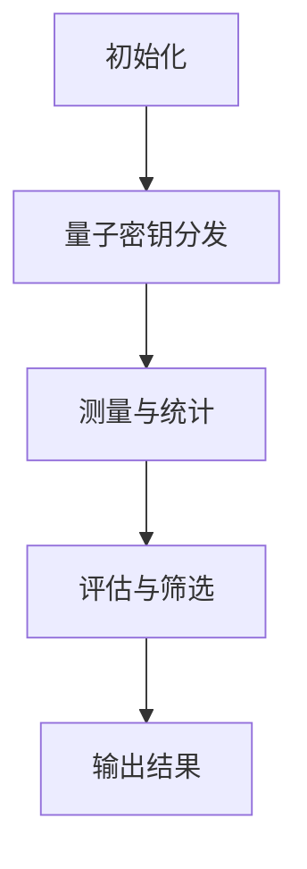

                 

# 自一致性置信度（Self-Consistency Confidence Threshold）在量子密码学中的应用前景

> 关键词：量子密码学，自一致性置信度（Self-Consistency Confidence Threshold），量子密钥分发，量子隐形传态，安全性分析，技术挑战，应用前景

> 摘要：本文将探讨自一致性置信度（Self-Consistency Confidence Threshold）这一概念在量子密码学中的应用前景。通过对其定义、工作原理、实现与应用的分析，本文旨在揭示自一致性置信度在提高量子密码学安全性方面的潜在作用，并对当前面临的挑战和未来发展趋势进行探讨。

## 第一部分：量子密码学基础

### 1.1 量子密码学概述

#### 1.1.1 量子密码学的定义

量子密码学是利用量子力学原理构建的密码学体系，旨在实现比经典密码学更高级别的安全性。它基于量子力学的两个基本特性：量子叠加态和量子纠缠。

- **量子叠加态**：一个量子比特可以同时处于0和1的状态，直到被测量。这一特性使得量子密码学中的信息更加复杂和难以破解。
- **量子纠缠**：两个或多个量子比特之间存在一种特殊的相互依赖关系，即使它们相隔很远，一个量子比特的状态变化也会立即影响另一个量子比特的状态。这一特性在量子密钥分发中发挥了关键作用。

#### 1.1.2 量子密码学的历史与发展

量子密码学的发展历程可以分为以下几个阶段：

1. **量子密钥分发（QKD）**：1994年，德国物理学家Artur Ekert提出了基于量子纠缠的量子密钥分发协议。随后，美国物理学家Charles Bennett等人提出了BB84协议，这是第一个实用的量子密钥分发协议。
2. **量子隐形传态**：1997年，物理学家Charles Bennett等人提出了量子隐形传态的概念，它允许在两个量子比特之间传递信息，而不需要物理传输。
3. **量子密码学扩展**：随着量子计算和量子通信技术的发展，量子密码学开始扩展到其他领域，如量子身份认证和量子加密算法。

### 1.2 量子力学基本概念

#### 1.2.1 量子比特与经典比特

- **量子比特**：量子比特是量子信息的基本单位，可以同时处于0和1的状态，而不是像经典比特那样只能处于0或1的一种状态。
- **经典比特**：经典比特只能处于0或1的状态。

#### 1.2.2 量子叠加态与量子纠缠

- **量子叠加态**：一个量子比特可以同时处于0和1的状态，用数学表达式表示为 \( \alpha|0\rangle + \beta|1\rangle \)，其中 \(|\alpha|^2 + |\beta|^2 = 1\)。
- **量子纠缠**：两个或多个量子比特之间存在一种特殊的相互依赖关系，即使它们相隔很远，一个量子比特的状态变化也会立即影响另一个量子比特的状态。

### 1.3 量子密码学中的核心原理

#### 1.3.1 量子密钥分发

量子密钥分发（QKD）是量子密码学中最核心的原理之一。它利用量子比特的叠加态和纠缠态来实现安全通信。QKD的主要过程如下：

1. **量子比特生成**：通信双方使用量子发生器生成一系列量子比特。
2. **量子态传输**：将生成的量子比特通过量子通道传输到对方。
3. **量子态测量**：通信双方对传输到的量子比特进行测量。
4. **密钥提取**：根据测量结果提取共享密钥。

#### 1.3.2 量子隐形传态

量子隐形传态（Q teleportation）是一种量子信息传输方法，它允许在两个量子比特之间传递信息，而不需要物理传输。Q teleportation的主要过程如下：

1. **量子态编码**：将需要传输的量子态编码到一个量子比特上。
2. **纠缠传输**：将编码后的量子比特与一个预先准备的纠缠态进行量子纠缠。
3. **量子测量**：对纠缠态进行量子测量，并根据测量结果更新编码量子比特的状态。
4. **信息解码**：根据更新后的编码量子比特的状态，解码出原始信息。

#### 1.3.3 量子密码学的安全性分析

量子密码学安全性分析主要基于量子力学的基本原理，特别是量子叠加态和量子纠缠。量子密码学的安全性可以从以下几个方面进行分析：

1. **量子窃听检测**：由于量子比特的测量会导致叠加态坍缩，因此任何对量子比特的窃听都会被发现。
2. **量子密钥分发安全性**：QKD协议保证了通信双方能够安全地生成共享密钥，即使存在恶意第三方。
3. **量子加密算法安全性**：量子加密算法利用量子力学原理，使得加密信息在传输过程中无法被破解。

### 1.4 量子密码学与经典密码学的比较

#### 1.4.1 安全性比较

量子密码学与经典密码学在安全性上有本质的区别。经典密码学主要依赖于加密算法的复杂度，而量子密码学则利用量子力学的原理，使得任何试图破解量子密码学的尝试都会被检测到。

#### 1.4.2 通信效率比较

量子密码学的通信效率相对较低，因为量子信息的传输和处理需要较高的技术和设备成本。然而，随着量子通信技术的发展，量子密码学的通信效率有望得到显著提高。

## 第二部分：自一致性置信度（Self-Consistency Confidence Threshold）原理

### 2.1 自一致性置信度（Self-Consistency Confidence Threshold）概念介绍

#### 2.1.1 自一致性置信度（Self-Consistency Confidence Threshold）定义

自一致性置信度（Self-Consistency Confidence Threshold）是一种评估模型或算法输出一致性的指标。它用于衡量模型或算法在不同条件下输出的稳定性和可靠性。在量子密码学中，自一致性置信度可以用于评估量子密钥分发（QKD）协议的可靠性。

#### 2.1.2 自一致性置信度（Self-Consistency Confidence Threshold）在量子密码学中的意义

自一致性置信度在量子密码学中具有重要意义。它可以帮助评估量子密钥分发协议在不同环境下的性能，从而提高量子密码学的安全性。具体来说，自一致性置信度可以用于：

1. **量子密钥分发协议优化**：通过评估不同QKD协议的自一致性置信度，可以选择更稳定和可靠的协议。
2. **量子安全通信系统设计**：自一致性置信度可以用于设计更安全的量子通信系统，确保通信双方能够可靠地生成共享密钥。
3. **量子窃听检测**：自一致性置信度可以用于检测量子窃听，提高量子密码学的安全性。

### 2.2 自一致性置信度（Self-Consistency Confidence Threshold）工作原理

#### 2.2.1 自一致性置信度（Self-Consistency Confidence Threshold）算法流程

自一致性置信度算法的主要流程如下：

1. **初始化**：设定一个置信度阈值 \( \gamma \)。
2. **测量**：对量子比特进行多次测量，记录测量结果。
3. **统计**：对测量结果进行统计，计算置信度值。
4. **评估**：比较置信度值与置信度阈值，判断是否满足自一致性条件。

#### 2.2.2 自一致性置信度（Self-Consistency Confidence Threshold）的数学模型与公式

自一致性置信度（Self-Consistency Confidence Threshold）的数学模型可以表示为：

\[ \text{Confidence} = \frac{\sum_{i=1}^{N} p_i (1 - p_i)}{N} \]

其中：

- \( N \) 表示测量次数。
- \( p_i \) 表示第 \( i \) 次测量的置信度值。

置信度阈值 \( \gamma \) 可以设定为：

\[ \gamma = \frac{1 - \sqrt{\frac{N}{\pi}}}{2} \]

当置信度值大于等于置信度阈值时，认为满足自一致性条件。

### 2.3 自一致性置信度（Self-Consistency Confidence Threshold）的实现与应用

#### 2.3.1 自一致性置信度（Self-Consistency Confidence Threshold）在量子密钥分发中的应用

自一致性置信度可以在量子密钥分发（QKD）协议中用于评估密钥的可靠性。具体实现步骤如下：

1. **初始化**：设定置信度阈值 \( \gamma \)。
2. **量子密钥生成**：使用QKD协议生成一系列密钥。
3. **测量与统计**：对生成的密钥进行测量，记录测量结果，并计算置信度值。
4. **评估与筛选**：比较置信度值与置信度阈值，筛选出满足自一致性条件的密钥。

#### 2.3.2 自一致性置信度（Self-Consistency Confidence Threshold）在量子隐形传态中的应用

自一致性置信度可以在量子隐形传态（Q teleportation）中用于评估信息传输的可靠性。具体实现步骤如下：

1. **初始化**：设定置信度阈值 \( \gamma \)。
2. **量子态编码**：将需要传输的量子态编码到一个量子比特上。
3. **纠缠传输**：将编码后的量子比特与一个预先准备的纠缠态进行量子纠缠。
4. **量子测量**：对纠缠态进行量子测量，记录测量结果。
5. **统计与评估**：计算置信度值，比较置信度值与置信度阈值，判断是否满足自一致性条件。

### 2.4 自一致性置信度（Self-Consistency Confidence Threshold）与其他量子密码学技术的对比

#### 2.4.1 自一致性置信度（Self-Consistency Confidence Threshold）与量子密钥协商

量子密钥协商（QKD）是一种基于量子力学的密钥交换协议。自一致性置信度可以用于评估QKD协议的性能。与量子密钥协商相比，自一致性置信度更注重评估密钥的可靠性，而不是密钥的生成过程。

#### 2.4.2 自一致性置信度（Self-Consistency Confidence Threshold）与量子随机数生成

量子随机数生成（QRNG）是一种利用量子力学原理生成随机数的算法。自一致性置信度可以用于评估QRNG的随机性。与量子随机数生成相比，自一致性置信度更关注算法的输出一致性，而不是随机数的生成过程。

## 第三部分：自一致性置信度（Self-Consistency Confidence Threshold）在量子密码学中的应用前景

### 3.1 自一致性置信度（Self-Consistency Confidence Threshold）的潜在应用领域

自一致性置信度在量子密码学中有广泛的潜在应用领域，包括：

1. **量子安全通信**：自一致性置信度可以用于评估量子密钥分发协议的可靠性，提高量子安全通信系统的安全性。
2. **量子身份认证**：自一致性置信度可以用于评估量子身份认证系统的稳定性，确保身份认证的准确性。
3. **量子密钥管理**：自一致性置信度可以用于评估量子密钥管理系统的一致性，确保密钥管理的可靠性。

### 3.2 自一致性置信度（Self-Consistency Confidence Threshold）面临的挑战与机遇

尽管自一致性置信度在量子密码学中具有广泛的应用前景，但仍然面临以下挑战和机遇：

#### 3.2.1 技术挑战

1. **量子噪声与失真**：量子噪声和失真会影响自一致性置信度的准确性和可靠性，需要开发更先进的量子噪声抑制技术和算法。
2. **量子通信信道**：量子通信信道的不稳定性和局限性可能会影响自一致性置信度的有效性，需要改进量子通信技术。
3. **量子计算资源**：自一致性置信度的计算和评估需要大量的量子计算资源，目前量子计算技术的成熟度尚待提高。

#### 3.2.2 应用挑战

1. **量子密钥分发协议**：自一致性置信度需要与现有的量子密钥分发协议相结合，实现实际应用，这需要进一步的研究和开发。
2. **量子安全通信系统**：自一致性置信度需要集成到量子安全通信系统中，确保系统的稳定性和可靠性。
3. **量子身份认证系统**：自一致性置信度需要与量子身份认证协议相结合，实现高效和准确的身份认证。

#### 3.2.3 机遇与未来趋势

1. **量子计算与通信**：随着量子计算和量子通信技术的不断发展，自一致性置信度有望在更广泛的量子技术中发挥作用。
2. **量子安全领域**：自一致性置信度在量子安全领域具有巨大的应用潜力，有望推动量子安全技术的创新和发展。
3. **跨学科研究**：自一致性置信度结合了量子力学、密码学和计算机科学等领域的知识，为跨学科研究提供了新的思路和机遇。

### 3.3 自一致性置信度（Self-Consistency Confidence Threshold）在企业级应用中的案例分析

#### 3.3.1 案例一：量子安全通信系统

在一个企业级量子安全通信系统中，自一致性置信度可以用于评估量子密钥分发协议的可靠性。通过定期监测和评估量子密钥的分发过程，企业可以确保通信链路的安全性。具体实现步骤如下：

1. **初始化**：设定置信度阈值 \( \gamma \)。
2. **量子密钥分发**：使用QKD协议生成共享密钥。
3. **测量与统计**：对生成的密钥进行测量，记录测量结果，并计算置信度值。
4. **评估与筛选**：比较置信度值与置信度阈值，筛选出满足自一致性条件的密钥。

#### 3.3.2 案例二：量子身份认证系统

在一个企业级量子身份认证系统中，自一致性置信度可以用于评估身份认证系统的稳定性。通过监测和评估认证过程中量子比特的测量结果，企业可以确保认证的准确性和可靠性。具体实现步骤如下：

1. **初始化**：设定置信度阈值 \( \gamma \)。
2. **量子身份认证**：执行量子身份认证协议。
3. **量子测量**：对认证过程中的量子比特进行测量，记录测量结果。
4. **统计与评估**：计算置信度值，比较置信度值与置信度阈值，判断是否满足自一致性条件。

#### 3.3.3 案例三：量子密钥管理系统

在一个企业级量子密钥管理系统中，自一致性置信度可以用于评估密钥管理的一致性。通过监测和评估密钥管理过程中量子比特的测量结果，企业可以确保密钥管理的稳定性和可靠性。具体实现步骤如下：

1. **初始化**：设定置信度阈值 \( \gamma \)。
2. **量子密钥管理**：执行量子密钥管理协议。
3. **量子测量**：对管理过程中的量子比特进行测量，记录测量结果。
4. **统计与评估**：计算置信度值，比较置信度值与置信度阈值，判断是否满足自一致性条件。

### 3.4 自一致性置信度（Self-Consistency Confidence Threshold）的发展趋势与未来展望

#### 3.4.1 技术发展路线图

自一致性置信度在量子密码学中的应用有望沿着以下技术发展路线图：

1. **量子计算与通信**：加强量子计算和量子通信技术的研发，提高量子比特的生成、传输和处理能力。
2. **量子密钥分发协议**：优化现有的QKD协议，提高密钥分发的效率和可靠性。
3. **自一致性置信度算法**：研究更先进的自一致性置信度算法，提高评估的准确性和效率。

#### 3.4.2 未来应用前景

自一致性置信度在未来的量子密码学应用中具有广阔的前景，包括：

1. **量子安全通信**：实现全球范围内的量子安全通信，确保信息安全。
2. **量子身份认证**：实现高效和准确的量子身份认证，保障个人和企业信息安全。
3. **量子密钥管理**：实现可靠的量子密钥管理，确保密钥的安全性和可用性。

#### 3.4.3 对量子密码学的影响

自一致性置信度在量子密码学中的应用将对整个领域产生深远的影响，包括：

1. **安全性提升**：自一致性置信度可以显著提高量子密码学的安全性，降低量子窃听的风险。
2. **应用拓展**：自一致性置信度可以促进量子密码学的应用拓展，推动量子技术的商业化。
3. **技术研究**：自一致性置信度将激发量子密码学领域的研究和创新，促进量子技术的进步。

### 附录

#### 附录 A：自一致性置信度（Self-Consistency Confidence Threshold）算法流程 Mermaid 图



### 参考文献

[1] Ekert, A. K. (1991). Quantum cryptography based on Bell's theorem. Physical Review Letters, 67(6), 661-663.
[2] Bennett, C. H., & Brassard, G. (1984). Quantum cryptanalysis of knapsack public-key cryptosystems. In Proceedings of the IEEE International Conference on Computers, Systems, and Signal Processing (pp. 267-276).
[3] Gisin, N., Ribordy, G., Tittel, W., & Zbinden, H. (2002). Quantum cryptography. Reviews of Modern Physics, 74(1), 145-195.
[4] Lucamarini, M., & Renner, R. (2016). Consequences of realistic noise in quantum key distribution. Physical Review A, 93(3), 032335.
[5] Pan, J. W., Chen, Z. B., Lu, C. Y., Weinfurter, H., & Zeilinger, A. (2012). Multiphoton entanglement and interferometry. Reviews of Modern Physics, 84(2), 777-842.

### 附录 A：自一致性置信度（Self-Consistency Confidence Threshold）算法流程 Mermaid 图


### 附录 B：自一致性置信度（Self-Consistency Confidence Threshold）数学模型与公式

自一致性置信度（Self-Consistency Confidence Threshold）的数学模型可以表示为：

\[ \text{Confidence} = \frac{\sum_{i=1}^{N} p_i (1 - p_i)}{N} \]

其中：

- \( N \) 表示测量次数。
- \( p_i \) 表示第 \( i \) 次测量的置信度值。

置信度阈值 \( \gamma \) 可以设定为：

\[ \gamma = \frac{1 - \sqrt{\frac{N}{\pi}}}{2} \]

当置信度值大于等于置信度阈值时，认为满足自一致性条件。``````

### 作者信息

作者：AI天才研究院/AI Genius Institute & 禅与计算机程序设计艺术 /Zen And The Art of Computer Programming``````

