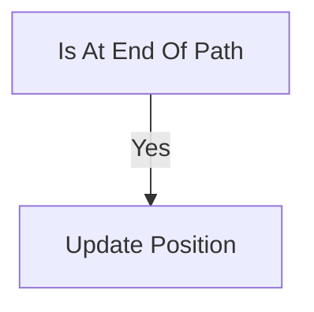

                 

### 文章标题

Unity 游戏引擎开发之旅：创建逼真的世界和沉浸式体验

> **关键词：Unity游戏引擎、3D绘图、渲染、物理系统、粒子系统、音频系统、AI与行为树、VR/AR应用、多平台发布、项目实战。**

> **摘要：本文将带领读者深入探讨Unity游戏引擎的开发之旅，通过系统的讲解和实际案例的分析，让读者了解如何利用Unity创建逼真的游戏世界和提供沉浸式的游戏体验。我们将从Unity的基础知识开始，逐步深入到游戏世界构建的各个方面，包括3D绘图与渲染、物理系统、粒子系统、音频系统、AI与行为树，以及VR/AR应用等。最后，通过一个完整的项目实战，让读者能够掌握Unity游戏引擎的实际开发流程。**

### 《Unity 游戏引擎开发之旅：创建逼真的世界和沉浸式体验》目录大纲

**第一部分：Unity 游戏引擎基础**

**第1章：Unity 游戏引擎入门**

**1.1 Unity 简介与历史**  
- Unity 简介  
- Unity 发展历程

**1.2 Unity 的安装与配置**  
- Unity 安装  
- Unity 配置

**1.3 Unity 的用户界面**  
- Unity 的菜单、工具栏和面板  
- Unity 的工作流

**1.4 Unity 的基本操作**  
- 场景（Scene）管理  
- 预制体（Prefab）的使用  
- 资源管理

**第2章：Unity 基础概念**

**2.1 场景与游戏对象**  
- 场景的概念  
- 游戏对象的概念  
- 场景和游戏对象的操作

**2.2 脚本与组件**  
- Unity 脚本概述  
- 脚本编写与调试  
- 组件的使用

**2.3 资源管理**  
- 资源类型  
- 资源管理器  
- 资源加载与释放

**2.4 时间管理与游戏循环**  
- Unity 的游戏循环  
- 时间管理

**第二部分：游戏世界构建**

**第3章：3D 绘图与渲染**

**3.1 3D 基础知识**  
- 三维坐标系  
- 几何形状

**3.2 纹理与材质**  
- 纹理的概念  
- 材质的使用  
- 纹理编辑器

**3.3 灯光与阴影**  
- 光源的类型  
- 灯光参数设置  
- 阴影类型与优化

**3.4 后处理效果**  
- 后处理效果概述  
- 景深  
- 模糊效果  
- HDR渲染

**第4章：物理系统**

**4.1 物理引擎基础**  
- 物理引擎的概念  
- 碰撞检测

**4.2 运动学与动力学**  
- 运动学  
- 动力学

**4.3 物理材质**  
- 物理材质的概念  
- 物理材质的应用

**4.4 力与力的作用**  
- 力的概念  
- 力的作用与计算

**第5章：粒子系统**

**5.1 粒子系统基础**  
- 粒子系统的概念  
- 粒子的创建与控制

**5.2 粒子发射器**  
- 发射器的类型  
- 发射器的参数设置

**5.3 粒子形状与纹理**  
- 粒子形状  
- 粒子纹理的使用

**5.4 粒子动画与优化**  
- 粒子动画  
- 粒子系统优化

**第6章：音频系统**

**6.1 音频基础**  
- 音频信号  
- 音频格式

**6.2 音频源与音效**  
- 音频源的概念  
- 音效的使用

**6.3 音频效果器**  
- 音效器概述  
- 常用音效器

**6.4 音频同步与播放控制**  
- 音频同步  
- 音频播放控制

**第7章：AI 与行为树**

**7.1 AI 基础知识**  
- AI 概述  
- 人工智能应用场景

**7.2 行为树**  
- 行为树的概念  
- 行为树的设计与实现

**7.3 代理与决策**  
- 代理的概念  
- 决策系统

**7.4 AI 优化与调试**  
- AI 优化  
- AI 调试技巧

**第8章：多平台发布与优化**

**8.1 Unity 多平台发布**  
- 支持平台  
- 发布流程

**8.2 Unity 性能优化**  
- 性能优化概述  
- 渲染优化  
- 算法优化

**8.3 Unity 调试与测试**  
- Unity 调试工具  
- Unity 测试框架

**8.4 Unity 资源打包与压缩**  
- 资源打包  
- 资源压缩

**第9章：Unity 在虚拟现实与增强现实中的应用**

**9.1 VR/AR 简介**  
- VR/AR 概述  
- VR/AR 应用场景

**9.2 Unity VR/AR 功能**  
- VR/AR 功能介绍  
- VR/AR 设备支持

**9.3 Unity VR/AR 开发实践**  
- VR/AR 项目案例  
- VR/AR 应用开发流程

**9.4 Unity VR/AR 优化**  
- VR/AR 性能优化  
- VR/AR 用户体验优化

**第10章：Unity 游戏开发项目实战**

**10.1 项目规划与需求分析**  
- 项目规划  
- 需求分析

**10.2 项目开发流程**  
- 项目开发流程  
- 团队协作

**10.3 核心功能实现**  
- 游戏逻辑  
- 界面设计与实现

**10.4 项目测试与优化**  
- 项目测试  
- 项目优化

**10.5 项目发布与运营**  
- 项目发布  
- 项目运营

**附录**

**附录 A：Unity 开发工具与资源**  
- Unity 编辑器  
- Unity 插件  
- Unity 官方文档

**附录 B：Unity API 参考**  
- Unity API 概述  
- Unity API 文档链接

**附录 C：Unity 开发实例代码**  
- 实例代码  
- 代码解读与分析

### Unity 游戏引擎开发之旅：创建逼真的世界和沉浸式体验

#### 关键词：Unity游戏引擎、3D绘图、渲染、物理系统、粒子系统、音频系统、AI与行为树、VR/AR应用、多平台发布、项目实战。

#### 摘要：本文将深入探讨Unity游戏引擎的开发之旅，涵盖从基础知识到高级应用的各个方面。我们将逐步介绍Unity的基本操作、3D绘图与渲染、物理系统、粒子系统、音频系统、AI与行为树，以及VR/AR应用等，并通过实际项目实战，帮助读者掌握Unity游戏引擎的开发技巧和实战经验。通过本文的阅读，读者将能够理解Unity的核心概念，掌握游戏世界构建的方法，并能够独立开发出具有逼真效果和沉浸式体验的游戏。

### 第一部分：Unity 游戏引擎基础

Unity游戏引擎是一个强大的游戏开发工具，它支持跨平台开发，被广泛用于游戏开发、虚拟现实（VR）和增强现实（AR）等领域。本部分将介绍Unity的基本操作、核心概念和基础知识，为后续内容的学习打下坚实的基础。

#### 第1章：Unity 游戏引擎入门

Unity游戏引擎的入门是了解游戏开发世界的第一步。在本章中，我们将介绍Unity的简要概述、发展历程，以及如何安装和配置Unity环境。

##### 1.1 Unity 简介与历史

Unity是一款功能强大的游戏开发引擎，自2005年首次发布以来，它已经成为全球最受欢迎的游戏开发工具之一。Unity的诞生源自于游戏开发者对更高效、更灵活的开发工具的需求。

**Unity 简介**

Unity是一款面向游戏开发者、建筑师、电影制作人等的综合性开发平台。它支持2D和3D游戏开发，并且具有丰富的功能，包括实时渲染、物理引擎、动画系统、音频系统等。

**Unity 发展历程**

- **2005年**：Unity首次发布，主要面向游戏开发。
- **2007年**：Unity 2.0版本发布，增加了骨骼动画系统。
- **2011年**：Unity 3.5版本发布，引入了实时阴影和软体物理系统。
- **2014年**：Unity 5.0版本发布，增加了HDRP（High Definition Render Pipeline）和UWP（Universal Windows Platform）支持。
- **至今**：Unity不断更新和迭代，新增了许多功能，如RLM（Realtime Machinima）、HDRP升级等。

##### 1.2 Unity 的安装与配置

安装Unity是一个简单的过程，但为了确保顺利运行，我们需要注意一些配置步骤。

**Unity 安装**

- **步骤1**：访问Unity官网（https://unity.com/），下载Unity Hub安装程序。
- **步骤2**：运行安装程序，按照提示完成安装。

**Unity 配置**

- **Unity Hub**：Unity Hub是一个统一的接口，用于安装、管理和更新Unity版本。
- **环境变量**：确保Unity编辑器的环境变量已正确配置，包括Path环境变量中包含Unity的安装路径。
- **C# 编译器**：Unity使用C#语言进行脚本开发，因此需要安装.NET Framework和C#编译器。

##### 1.3 Unity 的用户界面

Unity的用户界面是进行游戏开发的主要交互界面。熟悉用户界面有助于提高开发效率。

**Unity 的菜单、工具栏和面板**

- **菜单**：菜单栏包括文件、编辑、项目设置等选项，用于执行各种操作。
- **工具栏**：工具栏提供了常用的操作按钮，如移动、旋转、缩放等。
- **面板**：Unity编辑器中有多个面板，如Project面板、Inspector面板、Scene面板等，用于展示和管理资源、属性和场景。

**Unity 的工作流**

Unity的工作流涉及从创建场景到最终发布游戏的一系列步骤。以下是基本的工作流：

1. **项目创建**：创建一个新的Unity项目，选择适当的模板和配置。
2. **场景构建**：在Scene视图中创建和布局游戏对象。
3. **脚本编写**：使用C#脚本编写游戏逻辑和交互。
4. **资源管理**：管理游戏中的资源，如模型、贴图、音频等。
5. **测试与调试**：在编辑器中进行游戏测试，调试脚本和场景问题。
6. **发布**：将游戏发布到不同的平台，如PC、移动设备、VR/AR设备等。

##### 1.4 Unity 的基本操作

在Unity中，熟悉基本操作是进行游戏开发的基础。

**场景（Scene）管理**

- **创建场景**：在Unity编辑器中创建新的场景。
- **场景切换**：在多个场景之间切换，进行不同场景的开发。

**预制体（Prefab）的使用**

- **预制体概念**：预制体是一个可复用的游戏对象，可以在多个场景中重复使用。
- **创建预制体**：将游戏对象保存为预制体，以便在项目中复用。
- **实例化预制体**：在场景中创建预制体的实例。

**资源管理**

- **资源类型**：Unity支持多种资源类型，包括模型、贴图、音频等。
- **资源管理器**：使用资源管理器浏览、导入和管理资源。
- **资源加载与释放**：合理管理资源，优化游戏性能。

通过本章的介绍，读者应该对Unity游戏引擎有了初步的了解，并能够开始安装和配置Unity环境。接下来，我们将深入探讨Unity的基础概念，包括场景与游戏对象、脚本与组件、资源管理以及时间管理。

#### 第2章：Unity 基础概念

在了解了Unity的基本操作之后，我们需要深入探讨Unity的基础概念，这些概念是构建复杂游戏世界和实现游戏逻辑的核心。本章将详细介绍Unity中的场景与游戏对象、脚本与组件、资源管理以及时间管理，帮助读者建立对Unity开发框架的全面理解。

##### 2.1 场景与游戏对象

场景（Scene）和游戏对象（GameObject）是Unity开发中最基本的概念。

**场景的概念**

场景是Unity编辑器中用来组织和展示游戏内容的容器。每个场景可以独立创建、保存和加载，从而允许开发者分别管理和开发不同的游戏部分。

**游戏对象的概念**

游戏对象是Unity中用于表示游戏世界中的任何元素，可以是角色、环境、道具等。每个游戏对象都有自己的属性，如位置、旋转、缩放等，并且可以附加各种组件以实现不同的功能。

**场景和游戏对象的操作**

- **创建场景**：在Unity编辑器中，可以通过菜单栏的“文件”选项创建新的场景。
- **场景切换**：在多个场景之间切换，以便在不同场景中开发游戏。
- **游戏对象的操作**：通过Unity编辑器的工具栏，可以方便地移动、旋转和缩放游戏对象。同时，还可以使用Inspector面板查看和修改游戏对象的属性。

**场景和游戏对象的操作实例**

假设我们正在开发一个角色扮演游戏，需要创建一个角色和一个环境。首先，在Unity编辑器中创建一个新的场景。然后，在Scene视图中添加一个角色游戏对象，将其位置、旋转和缩放调整到合适的位置。接下来，创建一个环境游戏对象，并为其添加地面、天空盒等组件，以构建逼真的游戏环境。

##### 2.2 脚本与组件

在Unity中，脚本和组件是实现游戏逻辑和功能的关键。

**Unity 脚本概述**

Unity脚本是用C#语言编写的，用于实现游戏对象的交互和功能。Unity脚本可以附加到游戏对象或组件上，从而控制游戏对象的属性和行为。

**脚本编写与调试**

编写Unity脚本是一个逐步的过程。首先，需要在Unity编辑器中创建一个新的C#脚本文件。然后，使用C#语言编写脚本代码，实现所需的功能。在编写脚本的过程中，可以使用Unity提供的调试工具进行代码调试和测试。

**组件的使用**

组件是Unity中用于实现特定功能的功能模块。例如，Transform组件用于管理游戏对象的位置、旋转和缩放；Collider组件用于实现碰撞检测；Rigidbody组件用于实现物理效果。

**脚本与组件的使用实例**

假设我们想要实现一个简单的角色移动功能。首先，在角色游戏对象上添加一个Rigidbody组件，设置合适的物理属性。然后，创建一个新的C#脚本，命名为“CharacterController.cs”，在其中编写以下代码：

```csharp
using UnityEngine;

public class CharacterController : MonoBehaviour
{
    public float speed = 5.0f;

    void Update()
    {
        float moveHorizontal = Input.GetAxis("Horizontal");
        float moveVertical = Input.GetAxis("Vertical");

        Vector3 movement = new Vector3(moveHorizontal, 0.0f, moveVertical);
        transform.position += movement * speed * Time.deltaTime;
    }
}
```

在上面的代码中，我们使用了Input类获取玩家的输入，然后根据输入计算移动方向，并使用Rigidbody组件实现角色的移动。

##### 2.3 资源管理

资源是Unity游戏中的关键组成部分，包括模型、贴图、音频等。合理管理资源可以优化游戏性能并提高开发效率。

**资源类型**

Unity支持多种资源类型，包括：

- **模型（Model）**：用于表示游戏中的物体。
- **贴图（Texture）**：用于为模型提供外观。
- **音频（Audio）**：用于游戏中的音效和背景音乐。
- **动画（Animation）**：用于角色的动作和动画。

**资源管理器**

资源管理器是Unity中用于浏览和管理资源的主要工具。通过资源管理器，可以导入、预览、组织和删除资源。

**资源加载与释放**

合理管理资源的加载与释放是优化游戏性能的重要一环。在Unity中，可以使用AssetBundle和对象池等技术实现资源的加载与释放。

**资源管理实例**

假设我们正在开发一个动作游戏，需要导入角色模型和背景音乐。首先，使用Unity的资源管理器导入角色模型和背景音乐文件。然后，在Scene视图中创建角色游戏对象，并为其添加对应的模型和贴图。最后，在角色控制脚本中加载背景音乐，并实现循环播放。

```csharp
using UnityEngine;

public class AudioManager : MonoBehaviour
{
    public AudioSource backgroundMusic;

    void Start()
    {
        backgroundMusic.clip = Resources.Load<AudioClip>("BackgroundMusic");
        backgroundMusic.loop = true;
        backgroundMusic.Play();
    }
}
```

在上面的代码中，我们使用Resources.Load方法加载背景音乐文件，并设置其循环播放。

##### 2.4 时间管理与游戏循环

时间管理是Unity开发中不可或缺的一部分，它决定了游戏的运行速度和响应速度。

**Unity 的游戏循环**

Unity的游戏循环是一个连续的过程，每帧都会执行一系列操作，包括更新脚本、渲染场景等。

**时间管理**

在Unity中，可以使用Time类进行时间管理。Time类提供了一系列的方法和属性，用于获取和操作时间。

**时间管理实例**

假设我们想要实现一个简单的倒计时功能。在角色控制脚本中，添加以下代码：

```csharp
using UnityEngine;

public class Timer : MonoBehaviour
{
    public float timeLimit = 60.0f;
    private float timeRemaining;

    void Start()
    {
        timeRemaining = timeLimit;
    }

    void Update()
    {
        if (timeRemaining > 0)
        {
            timeRemaining -= Time.deltaTime;
            Debug.Log("Time Remaining: " + timeRemaining);
        }
        else
        {
            Debug.Log("Time's up!");
        }
    }
}
```

在上面的代码中，我们使用Time.deltaTime获取每一帧的时间差，并减去剩余时间。当倒计时结束，输出提示信息。

通过本章的介绍，读者应该对Unity的基础概念有了深入的理解。这些概念是构建复杂游戏世界和实现游戏逻辑的基础。接下来，我们将进入第二部分，探讨游戏世界构建的各个方面，包括3D绘图与渲染、物理系统、粒子系统、音频系统、AI与行为树等。

### 第二部分：游戏世界构建

在掌握了Unity的基础知识后，我们将进入游戏世界构建的部分。这一部分将详细介绍Unity中3D绘图与渲染、物理系统、粒子系统、音频系统、AI与行为树等核心功能，帮助读者理解如何创建逼真的游戏世界和提供沉浸式的游戏体验。

#### 第3章：3D绘图与渲染

3D绘图与渲染是游戏开发中至关重要的环节，它决定了游戏世界的视觉效果和逼真度。在本章中，我们将探讨3D绘图的基础知识、纹理与材质的使用、灯光与阴影的设置，以及后处理效果的应用。

##### 3.1 3D 基础知识

在Unity中，3D绘图的基础涉及三维坐标系和几何形状的理解。

**三维坐标系**

Unity使用右手坐标系，其中X轴、Y轴和Z轴分别代表水平方向、垂直方向和深度方向。了解三维坐标系是进行3D绘图的前提。

**几何形状**

Unity提供了丰富的几何形状，如立方体、球体、圆柱体等。这些基本形状可以组合和变换，用于构建复杂的三维模型。

**三维绘图实例**

假设我们想要在Unity中创建一个简单的立方体。首先，在Scene视图中创建一个空对象，然后在Inspector面板中添加一个Cube组件。通过调整Transform组件的属性，我们可以改变立方体的位置、旋转和缩放。

##### 3.2 纹理与材质

纹理和材质是3D绘图中的关键元素，它们决定了游戏对象的表面外观。

**纹理的概念**

纹理是一种用于描述物体表面细节的图像。在Unity中，常见的纹理格式包括PNG、JPEG等。

**材质的使用**

材质是一种定义物体表面外观的组件。通过设置材质的属性，如颜色、光滑度、透明度等，可以创造出丰富的视觉效果。

**纹理编辑器**

Unity提供了一个强大的纹理编辑器，用于编辑和管理纹理。在该编辑器中，可以调整纹理的分辨率、颜色调整、滤镜等。

**纹理与材质实例**

假设我们想要为场景中的立方体添加一个木纹材质。首先，在资源管理器中导入一个木纹纹理。然后，在Scene视图中选择立方体，在Inspector面板中为其添加一个材质。在材质的属性中，将木纹纹理设置为Albedo属性，即可为立方体应用木纹效果。

##### 3.3 灯光与阴影

灯光和阴影是渲染效果的重要组成部分，它们可以增强场景的逼真度和沉浸感。

**光源的类型**

Unity提供了多种光源类型，包括点光源、方向光源、聚光源等。每种光源都有不同的光照效果和参数设置。

**灯光参数设置**

灯光参数包括强度、颜色、阴影类型等。通过调整这些参数，可以控制场景中的光照效果。

**阴影类型与优化**

阴影类型包括硬阴影、软阴影、实时阴影等。选择合适的阴影类型并对其进行优化，可以提高渲染性能。

**灯光与阴影实例**

假设我们想要为场景中的立方体添加一个方向光源。首先，在Scene视图中创建一个Directional Light组件。然后，调整其位置和参数，使其照亮立方体。通过设置阴影参数，可以为立方体添加实时阴影效果。

```csharp
// 获取方向光源组件
DirectionalLight light = GetComponent<DirectionalLight>();

// 设置光照颜色和强度
light.color = Color.white;
light.intensity = 1.0f;

// 开启阴影效果
light.shadows = LightShadows.Hard;
light.shadow强度的质量设置为High;
```

##### 3.4 后处理效果

后处理效果是对渲染后的场景进行进一步处理的技巧，它可以增强视觉效果，提供逼真的场景氛围。

**后处理效果概述**

后处理效果包括景深、模糊效果、HDR渲染等。这些效果可以显著提升场景的真实感。

**景深**

景深是一种模拟真实世界中焦点效果的技术。通过设置焦点距离和模糊范围，可以创造出层次感丰富的场景。

**模糊效果**

模糊效果包括屏幕空间模糊（SSAO）、运动模糊等。这些效果可以模拟相机运动和物体移动的模糊效果。

**HDR渲染**

HDR（High Dynamic Range）渲染可以处理高动态范围的场景，提供更真实的光照效果。

**后处理效果实例**

假设我们想要为场景添加景深效果。首先，在Unity的包管理器中导入HDRP（High Definition Render Pipeline）插件。然后，在Scene视图中选择主摄像机，在Inspector面板中启用HDRP。接下来，添加一个Post Processing Volume组件，并在其中设置景深参数。

```csharp
// 获取PostProcessingVolume组件
PostProcessingVolume volume = GetComponent<PostProcessingVolume>();

// 创建并配置PostProcessingProfile
PostProcessingProfile profile = new PostProcessingProfile();
profile.renderModels.Add(new RenderModel());

// 设置景深参数
profile.volumes.sceneDepth = true;
profile.volumes.focalDistance = 5.0f;
profile.volumes.aperture = 1.0f;

// 应用PostProcessingProfile
volume.profile = profile;
```

通过本章的介绍，读者应该对Unity的3D绘图与渲染有了全面的了解。这些技术不仅能够创造出逼真的游戏世界，还能提供沉浸式的游戏体验。接下来，我们将探讨物理系统，这是游戏世界中物理模拟和交互的基础。

#### 第4章：物理系统

物理系统是游戏开发中不可或缺的一部分，它为游戏世界中的物体提供了真实的物理行为。在本章中，我们将深入探讨Unity的物理系统，包括物理引擎基础、运动学与动力学、物理材质的应用，以及力与力的作用。

##### 4.1 物理引擎基础

物理引擎是Unity中用于模拟和计算物体物理行为的系统。它包括碰撞检测、刚体动力学、软体动力学等核心功能。

**物理引擎的概念**

物理引擎是一种算法，用于模拟物体在受到外力作用下的运动和变形。Unity内置了Bullet物理引擎，支持多种物理模拟效果。

**碰撞检测**

碰撞检测是物理引擎的重要功能，用于检测物体之间的接触和碰撞。Unity使用AABB（Axis-Aligned Bounding Box）和OBB（Oriented Bounding Box）进行碰撞检测。

**碰撞检测实例**

假设我们想要在Unity中检测两个立方体之间的碰撞。首先，为每个立方体添加一个Rigidbody组件。然后，在C#脚本中添加以下代码：

```csharp
using UnityEngine;

public class CollisionDetector : MonoBehaviour
{
    void OnCollisionEnter(Collision collision)
    {
        Debug.Log("Collision detected with: " + collision.gameObject.name);
    }
}
```

在上面的代码中，我们使用OnCollisionEnter方法检测碰撞，并输出碰撞对象的名称。

##### 4.2 运动学与动力学

运动学和动力学是物理系统中用于描述物体运动的核心概念。

**运动学**

运动学关注物体的位置、速度和加速度。它不考虑物体受到的外力，只研究物体的运动状态。

**动力学**

动力学研究物体在外力作用下的运动，包括牛顿定律、运动方程等。动力学可以精确模拟物体受到外力后的运动轨迹。

**运动学与动力学实例**

假设我们想要模拟一个物体在重力作用下的自由落体运动。首先，为物体添加一个Rigidbody组件。然后，在C#脚本中添加以下代码：

```csharp
using UnityEngine;

public class FreeFall : MonoBehaviour
{
    public float gravity = -9.8f;

    void Update()
    {
        Rigidbody rb = GetComponent<Rigidbody>();
        rb.AddForce(new Vector3(0.0f, gravity, 0.0f));
    }
}
```

在上面的代码中，我们使用AddForce方法模拟重力，使物体沿着Y轴向下加速。

##### 4.3 物理材质

物理材质是Unity中用于定义物体物理特性的参数集合。它包括质量、弹性、摩擦等属性，影响物体在碰撞中的行为。

**物理材质的概念**

物理材质定义了物体在碰撞中的表现，如反弹力度、穿透力等。它是一个可配置的属性集，可以针对不同类型的物体进行个性化设置。

**物理材质的应用**

在Unity中，我们可以为不同的物体设置不同的物理材质。例如，金属、木头、橡胶等。通过调整物理材质的属性，可以模拟出真实世界中的碰撞效果。

**物理材质实例**

假设我们想要为场景中的物体设置金属材质。首先，在Unity的物理材质库中选择金属材质。然后，在Inspector面板中调整金属材质的属性，如反射率、光滑度等。最后，将金属材质应用到相应的物体上。

```csharp
// 获取金属材质
Material metalMaterial = Resources.Load<Material>("MetalMaterial");

// 设置物体材质
MeshRenderer meshRenderer = GetComponent<MeshRenderer>();
meshRenderer.material = metalMaterial;
```

##### 4.4 力与力的作用

力是物理系统中用于描述物体之间相互作用的物理量。在Unity中，我们可以通过脚本施加力来控制物体的运动。

**力的概念**

力是一个矢量量，具有大小和方向。它可以通过力的作用点、力度和作用时间来描述。

**力的作用与计算**

在Unity中，我们可以通过Rigidbody组件施加力来控制物体的运动。力的计算遵循牛顿第二定律，即F = m * a，其中F是力，m是质量，a是加速度。

**力的实例**

假设我们想要使一个物体沿着水平方向加速。首先，为物体添加一个Rigidbody组件。然后，在C#脚本中添加以下代码：

```csharp
using UnityEngine;

public class LinearForce : MonoBehaviour
{
    public float forceMagnitude = 10.0f;

    void Update()
    {
        Rigidbody rb = GetComponent<Rigidbody>();
        rb.AddForce(Vector3.right * forceMagnitude);
    }
}
```

在上面的代码中，我们使用AddForce方法沿X轴方向施加一个恒定的力，使物体沿水平方向加速。

通过本章的介绍，读者应该对Unity的物理系统有了深入的理解。物理系统不仅为游戏世界提供了真实的物理行为，还为玩家提供了丰富的交互体验。接下来，我们将探讨粒子系统，它用于模拟各种自然现象和特殊效果。

#### 第5章：粒子系统

粒子系统是Unity中用于模拟自然现象和特殊效果的重要工具。通过粒子系统，开发者可以创建烟雾、火焰、爆炸、雪花等视觉效果，为游戏世界增添生动的氛围。在本章中，我们将介绍粒子系统的基本概念、粒子发射器、粒子形状与纹理，以及粒子动画与优化。

##### 5.1 粒子系统基础

粒子系统是由大量小型物体（即粒子）组成的集合，用于模拟自然界中的现象或游戏中的特效。Unity提供了强大的粒子系统，支持多种类型的粒子发射器和粒子属性。

**粒子系统的概念**

粒子系统通过随机生成和模拟大量粒子，使其按照预设的规则运动和变化。每个粒子都有其生命周期，包括生成、存在和消失等阶段。

**粒子系统的创建**

在Unity中，创建粒子系统的步骤如下：

1. **在Scene视图中创建粒子系统对象**：选择“Effects”类别，然后点击“Particle System”创建一个粒子系统。
2. **在Inspector面板中配置粒子属性**：设置粒子发射器的类型、粒子的生命周期、颜色和大小等属性。

**粒子系统的基本属性**

- **发射速率**：指定每秒产生的粒子数量。
- **生命周期**：控制粒子的存在时间，包括生成时间、持续时间和消失时间。
- **大小和颜色**：控制粒子的大小和颜色变化。

**粒子系统实例**

假设我们想要创建一个简单的烟雾效果。首先，在Scene视图中创建一个粒子系统对象。然后，在Inspector面板中配置粒子属性，如发射速率、生命周期和颜色。最后，为粒子系统添加一个Emitter Shape组件，设置发射形状为Sphere。

```csharp
// 获取粒子系统组件
ParticleSystem particleSystem = GetComponent<ParticleSystem>();

// 设置粒子属性
particleSystem.startLifetime = 2.0f;
particleSystem.startColor = Color.white;
particleSystem.startSize = 0.1f;

// 启动粒子系统
particleSystem.Play();
```

通过上述代码，我们创建了一个简单的烟雾效果，并使其在场景中持续播放。

##### 5.2 粒子发射器

粒子发射器是粒子系统中的关键组件，用于控制粒子的发射方向、速率和分布。Unity提供了多种类型的粒子发射器，如Sphere、Box、Ring等。

**发射器的类型**

- **Sphere**：从球形区域均匀发射粒子。
- **Box**：从矩形区域发射粒子。
- **Ring**：从环形区域发射粒子。
- **Cone**：从锥形区域发射粒子。

**发射器的参数设置**

- **发射速率**：控制每秒发射的粒子数量。
- **发射方向**：控制粒子的发射方向。
- **发射范围**：定义粒子发射的扩散范围。

**粒子发射器实例**

假设我们想要创建一个从地面喷射火焰的粒子系统。首先，在Scene视图中创建一个粒子系统对象。然后，在Inspector面板中添加一个Emitter Shape组件，设置类型为Cone。接下来，配置发射器的参数，如发射速率、发射方向和发射范围。

```csharp
// 获取粒子系统组件
ParticleSystem particleSystem = GetComponent<ParticleSystem>();

// 设置发射器参数
ParticleSystemShapeModule shape = particleSystem.shape;
shape.shapeType = ParticleSystemShapeType.Cone;

// 设置发射速率和方向
particleSystem.startSpeed = 5.0f;
particleSystem.startSize = 0.5f;
particleSystem.emissionRate = 1000;

// 启动粒子系统
particleSystem.Play();
```

通过上述代码，我们创建了一个从地面喷射火焰的粒子系统，并使其在场景中持续播放。

##### 5.3 粒子形状与纹理

粒子形状和纹理是粒子系统的重要组成部分，用于定义粒子的外观和行为。

**粒子形状**

粒子形状决定了粒子的外观和分布。Unity提供了多种粒子形状，如圆形、方形、星形等。

**粒子纹理**

粒子纹理是用于定义粒子外观的图像。通过为粒子应用纹理，可以使其看起来更加真实和丰富。

**粒子形状与纹理实例**

假设我们想要创建一个爆炸效果，使用爆炸碎片纹理。首先，在资源管理器中导入一个爆炸碎片纹理。然后，在Scene视图中创建一个粒子系统对象，并配置粒子属性。在Inspector面板中，将纹理应用到粒子的“Main Module”中的“Particle Texture”属性。

```csharp
// 获取粒子系统组件
ParticleSystem particleSystem = GetComponent<ParticleSystem>();

// 设置粒子纹理
Material particleMaterial = Resources.Load<Material>("ExplosionTexture");
particleSystem.main.startColor = particleMaterial.color;

// 设置粒子形状
ParticleShapeModule shape = particleSystem.shape;
shape.shapeType = ParticleSystemShapeType.Box;

// 启动粒子系统
particleSystem.Play();
```

通过上述代码，我们创建了一个具有爆炸碎片纹理的粒子系统，并使其在场景中播放。

##### 5.4 粒子动画与优化

粒子动画是粒子系统的高级功能，用于创建动态变化的粒子效果。同时，优化粒子系统对于提高游戏性能至关重要。

**粒子动画**

粒子动画通过控制粒子的属性随时间的变化，创建出动态的粒子效果。Unity支持多种粒子动画功能，如颜色动画、大小动画等。

**粒子动画实例**

假设我们想要创建一个颜色渐变的粒子动画。首先，在Scene视图中创建一个粒子系统对象。然后，在Inspector面板中，为粒子系统添加一个Color Over Lifetime模块，设置颜色渐变参数。

```csharp
// 获取粒子系统组件
ParticleSystem particleSystem = GetComponent<ParticleSystem>();

// 设置颜色动画
ParticleColorOverLifetimeModule colorAnimation = particleSystem.colorOverLifetime;
colorAnimation.color = Color.Lerp(Color.red, Color.blue, Time.time / 10.0f);

// 启动粒子系统
particleSystem.Play();
```

通过上述代码，我们创建了一个颜色随时间渐变的粒子动画。

**粒子系统优化**

优化粒子系统对于提高游戏性能至关重要。以下是一些常用的优化方法：

- **减少粒子数量**：通过减少粒子数量，可以降低渲染负载。
- **使用LOD（Level of Detail）技术**：根据距离和视野调整粒子的细节和大小。
- **使用粒子缓存**：将粒子缓存到GPU内存中，减少GPU的渲染时间。
- **异步加载**：在游戏加载过程中异步加载粒子资源，提高加载效率。

**粒子系统优化实例**

假设我们想要优化一个大规模粒子系统的性能。首先，在Scene视图中创建多个粒子系统对象，并分散放置。然后，使用LOD技术，根据粒子的距离调整其细节和大小。

```csharp
// 获取粒子系统组件
ParticleSystem[] particleSystems = FindObjectsOfType<ParticleSystem>();

// 设置LOD参数
foreach (ParticleSystem particleSystem in particleSystems)
{
    ParticleSystemShapeModule shape = particleSystem.shape;
    shape.lifetime = new ParticleSystemShapeModule.Lifetime(2.0f, 4.0f);
    shape.lifetime.enabled = true;
}
```

通过上述代码，我们调整了粒子的LOD参数，根据距离和视野优化了粒子系统的性能。

通过本章的介绍，读者应该对Unity的粒子系统有了全面的理解。粒子系统不仅为游戏世界增添了生动的视觉效果，还为开发者提供了丰富的创意空间。接下来，我们将探讨音频系统，这是游戏世界中不可或缺的一部分。

#### 第6章：音频系统

音频系统在游戏开发中扮演着至关重要的角色，它不仅为游戏场景营造氛围，还直接影响玩家的沉浸体验。在本章中，我们将详细介绍音频系统的基本概念、音频源与音效的使用、音频效果器以及音频同步与播放控制。

##### 6.1 音频基础

音频系统的基础包括音频信号和音频格式。了解这些基本概念对于开发和优化音频系统至关重要。

**音频信号**

音频信号是一种描述声音的数学表示。它由一系列振幅和频率的波形组成，反映了声音的音量、音调和持续时间。

**音频格式**

音频格式是存储和传输音频信号的编码方式。常见的音频格式包括WAV、MP3、AAC等。不同的音频格式具有不同的音质和压缩率。

**音频信号与音频格式实例**

假设我们想要在Unity中加载并播放一段音频。首先，在资源管理器中导入一个WAV格式的音频文件。然后，在Scene视图中创建一个Audio Source组件，并将其Clip属性设置为导入的音频文件。

```csharp
// 获取Audio Source组件
AudioSource audioSource = GetComponent<AudioSource>();

// 加载音频文件
audioSource.clip = Resources.Load<AudioClip>("AudioFile");

// 播放音频
audioSource.Play();
```

通过上述代码，我们加载并播放了一个WAV格式的音频文件。

##### 6.2 音频源与音效

音频源是Unity中用于播放和管理音频的组件。音效是游戏场景中用于增强氛围和互动性的音频片段。

**音频源的概念**

音频源是一个可以播放音频文件的组件。它支持多种播放模式，如一次性播放、循环播放等。

**音效的使用**

在Unity中，音效可以通过音频源组件进行播放和管理。开发者可以根据需要为不同的游戏对象或场景添加音频源，实现音效的动态切换和播放。

**音频源与音效实例**

假设我们想要在游戏场景中播放背景音乐和角色动作音效。首先，在Scene视图中创建两个Audio Source组件，分别命名为“Background Music”和“Character Sound”。然后，在Inspector面板中设置音频源的模式和属性。

```csharp
// 获取背景音乐Audio Source组件
AudioSource backgroundMusic = GetComponent<AudioSource>();
backgroundMusic.clip = Resources.Load<AudioClip>("BackgroundMusic");
backgroundMusic.loop = true;
backgroundMusic.Play();

// 获取角色动作Audio Source组件
AudioSource characterSound = GetComponent<AudioSource>();
characterSound.clip = Resources.Load<AudioClip>("CharacterSound");
```

通过上述代码，我们为游戏场景设置了背景音乐和角色动作音效。

##### 6.3 音频效果器

音频效果器是Unity中用于增强音频效果的工具。它包括混响、均衡器、动态压缩等效果，可以显著提升游戏音质的真实感。

**音频效果器概述**

音频效果器通过处理音频信号，添加各种音效，如混响、回声、低音增强等。这些效果可以显著改善音频质量，提供更丰富的听觉体验。

**常用音效器**

- **混响（Reverb）**：模拟不同空间环境中的回声效果。
- **均衡器（Equalizer）**：调整音频信号在不同频率段的音量。
- **动态压缩（Dynamic Compression）**：控制音频信号的音量变化，避免过响或过静。

**音频效果器实例**

假设我们想要为游戏场景添加混响效果。首先，在Scene视图中创建一个Audio Reverb Zone组件。然后，在Inspector面板中设置混响的参数，如大小、环境类型等。

```csharp
// 获取Audio Reverb Zone组件
AudioReverbZone reverbZone = GetComponent<AudioReverbZone>();

// 设置混响参数
reverbZone.reverbPreset = AudioReverbPreset.Gallery;
reverbZone.reverbZoneSize = AudioReverbZoneSize.Large;
reverbZone.dryMix = 0.5f;
reverbZone.wetMix = 0.5f;
```

通过上述代码，我们为游戏场景添加了混响效果。

##### 6.4 音频同步与播放控制

音频同步和控制是确保游戏音效与视觉元素同步的关键。Unity提供了丰富的音频控制功能，如音量控制、淡入淡出等。

**音频同步**

音频同步确保游戏中的音效与动作或事件同步发生。例如，角色跳跃时播放跳跃音效，敌人攻击时播放攻击音效。

**音频播放控制**

音频播放控制用于动态调整音频的播放状态，如播放、暂停、停止等。此外，还可以调整音量、淡入淡出等效果。

**音频同步与播放控制实例**

假设我们想要实现一个简单的音频同步和播放控制。首先，在Scene视图中创建两个Audio Source组件，分别命名为“Jump Sound”和“Attack Sound”。然后，在角色跳跃和敌人攻击的脚本中添加以下代码：

```csharp
// 获取跳跃音效Audio Source组件
AudioSource jumpSound = GetComponent<AudioSource>();
jumpSound.clip = Resources.Load<AudioClip>("JumpSound");

// 角色跳跃时播放跳跃音效
void OnJump()
{
    jumpSound.Play();
}

// 获取攻击音效Audio Source组件
AudioSource attackSound = GetComponent<AudioSource>();
attackSound.clip = Resources.Load<AudioClip>("AttackSound");

// 敌人攻击时播放攻击音效
void OnAttack()
{
    attackSound.Play();
}
```

通过上述代码，我们实现了角色跳跃时播放跳跃音效，敌人攻击时播放攻击音效。

通过本章的介绍，读者应该对Unity的音频系统有了全面的理解。音频系统不仅丰富了游戏世界的氛围，还增强了玩家的沉浸体验。接下来，我们将探讨人工智能与行为树，这些是游戏开发中实现智能行为和复杂决策的重要工具。

#### 第7章：AI 与行为树

人工智能（AI）是游戏开发中不可或缺的一部分，它赋予了游戏角色智能行为和决策能力，提升了游戏的趣味性和挑战性。在本章中，我们将详细介绍AI的基础知识、行为树的概念和应用，代理与决策系统，以及AI的优化与调试技巧。

##### 7.1 AI 基础知识

AI是计算机科学的一个分支，旨在使计算机能够执行通常需要人类智能的任务。在游戏开发中，AI用于模拟游戏角色的智能行为和决策。

**AI 概述**

AI的目标是使计算机具有人类般的智能，包括感知、思考、学习和行动。在游戏开发中，AI主要应用于以下几个方面：

- **角色行为**：模拟角色的动作和交互。
- **路径规划**：计算角色在游戏世界中的移动路径。
- **决策树**：实现角色的智能决策。
- **机器学习**：通过数据训练模型，提高AI的智能水平。

**人工智能应用场景**

在游戏开发中，AI的应用场景非常广泛，包括但不限于：

- **角色AI**：敌人、NPC（非玩家角色）、队友等。
- **导航网格**：用于角色移动和路径规划。
- **技能系统**：实现角色的技能和行为树。
- **行为模拟**：模拟自然界中的动物行为，如鸟类、鱼类等。

##### 7.2 行为树

行为树是一种用于实现AI决策和行为逻辑的图形化工具。它将复杂的决策过程分解为一系列简单的条件和行为，使开发者能够更直观地设计和调试AI行为。

**行为树的概念**

行为树由一系列节点组成，每个节点代表一个条件或行为。节点之间的连接关系定义了AI的决策逻辑。行为树可以分为以下几种类型：

- **条件节点**：根据特定条件判断是否执行后续行为。
- **行为节点**：执行具体的动作或行为。
- **顺序节点**：按顺序执行一系列行为节点。
- **并行节点**：同时执行多个行为节点。

**行为树的设计与实现**

设计行为树的过程可以分为以下几个步骤：

1. **定义目标行为**：确定AI需要实现的行为和决策。
2. **分解任务**：将目标行为分解为一系列简单的行为节点。
3. **构建行为树**：根据任务分解结果构建行为树。
4. **调试与优化**：在Unity编辑器中调试和优化行为树。

**行为树实例**

假设我们想要实现一个简单的巡逻行为树。首先，在Unity的行为树编辑器中创建一个条件节点，用于判断角色是否到达巡逻路径的终点。然后，添加一个行为节点，用于更新角色的位置。接下来，将条件节点连接到行为节点，形成完整的巡逻行为树。



通过上述代码，我们创建了一个简单的巡逻行为树，当角色到达巡逻路径的终点时，更新其位置。

##### 7.3 代理与决策

代理（Agent）和决策（Decision）是AI系统中用于实现智能行为的核心概念。

**代理的概念**

代理是一种抽象的实体，代表游戏中的角色或物体。它具有感知、思考和行动的能力。在Unity中，代理通常是通过脚本实现的AI角色。

**决策系统**

决策系统是AI系统的核心，负责根据当前环境和目标生成行动方案。决策系统通常包括以下几个部分：

- **感知模块**：收集环境信息，如角色位置、敌人状态等。
- **决策模块**：根据感知信息生成行动方案。
- **行动模块**：执行决策模块生成的行动。

**代理与决策实例**

假设我们想要实现一个简单的追逐行为。首先，在Unity中创建一个代理角色，并为其添加感知模块。然后，在决策模块中定义追逐行为，并在行动模块中实现角色的移动。

```csharp
using UnityEngine;

public class ChaseAgent : MonoBehaviour
{
    public Transform target;
    public float speed = 5.0f;

    void Update()
    {
        // 感知模块：获取目标位置
        Vector3 targetPosition = target.position;

        // 决策模块：计算移动方向
        Vector3 moveDirection = targetPosition - transform.position;

        // 行动模块：移动角色
        transform.position += moveDirection.normalized * speed * Time.deltaTime;
    }
}
```

通过上述代码，我们实现了一个简单的追逐行为，代理角色会根据目标位置移动。

##### 7.4 AI 优化与调试

优化和调试是确保AI系统高效运行和稳定工作的重要步骤。

**AI 优化**

AI优化包括以下几个方面：

- **性能优化**：减少AI的运行时间，提高游戏的流畅度。
- **内存优化**：减少AI占用的内存，提高游戏的可运行性。
- **行为优化**：调整AI的行为逻辑，使其更加智能和自然。

**AI 调试技巧**

AI调试包括以下几个方面：

- **日志记录**：记录AI的决策过程和运行状态，帮助开发者分析问题。
- **断点调试**：在Unity编辑器中设置断点，跟踪AI的执行流程。
- **测试环境**：创建独立的测试场景，验证AI的行为是否符合预期。

通过本章的介绍，读者应该对Unity中的AI与行为树有了全面的理解。这些工具不仅为游戏角色赋予了智能行为，还为开发者提供了丰富的创意空间。接下来，我们将探讨多平台发布与优化，这是游戏开发中的重要环节。

#### 第8章：多平台发布与优化

在完成了游戏的开发和测试后，下一步是将游戏发布到目标平台。Unity游戏引擎支持多种平台，包括Windows、macOS、Linux、iOS、Android等。此外，Unity还提供了丰富的性能优化工具和资源管理策略，以确保游戏在不同平台上都能运行流畅。本章将详细介绍Unity的多平台发布、性能优化、调试与测试，以及资源打包与压缩。

##### 8.1 Unity 多平台发布

Unity的多平台发布功能使得开发者能够将游戏发布到多种目标平台，从而覆盖更广泛的用户群体。以下是在Unity中发布游戏到不同平台的基本步骤：

**支持平台**

Unity支持以下主要平台：

- **PC（Windows、macOS、Linux）**
- **移动设备（iOS、Android）**
- **虚拟现实（VR）**
- **增强现实（AR）**

**发布流程**

将游戏发布到目标平台的一般流程如下：

1. **设置项目设置**：在Unity编辑器中，通过“File”菜单选择“Project Settings”，然后选择“Player Settings”来配置发布设置。在这里，可以设置游戏的分辨率、帧率、音频格式等。
2. **选择目标平台**：在“Player Settings”中，选择要发布的平台，并配置相应的平台设置。例如，对于iOS平台，需要配置App Store连接信息和证书。
3. **构建游戏**：选择“File”菜单中的“Build Settings”，选择目标平台，然后点击“Build”开始构建游戏。Unity会生成游戏的可执行文件或应用程序包。
4. **发布游戏**：将构建好的游戏包上传到相应的平台，如App Store、Google Play商店，或通过其他分发渠道发布。

**发布实例**

假设我们想要将游戏发布到iOS平台。首先，在“Player Settings”中配置iOS平台设置，包括App Store连接信息和证书。然后，在“Build Settings”中选择iOS平台，并点击“Build”开始构建游戏。最后，将构建好的游戏包上传到App Store进行发布。

```csharp
// 在Player Settings中配置iOS平台
PlayerSettings.iOS.targetDevice = iOSDevice.iPhone;
PlayerSettings.iOS BundleIdentifier = "com.example.app";
PlayerSettings.iOS.resetLoginHandler = false;

// 在Build Settings中选择iOS平台并构建游戏
BuildTargetGroup targetGroup = BuildTargetGroup.iPhone;
BuildTarget buildTarget = BuildTarget.iPhonePlayer;
string buildPath = "path/to/build/folder";
BuildPipeline.BuildPlayer(new BuildAssetBundleOptions(), new BuildPlayerOptions
{
    locationPathName = buildPath,
    targetGroup = targetGroup,
    target = buildTarget
});
```

通过上述代码，我们配置了iOS平台设置，并构建了iOS平台的游戏。

##### 8.2 Unity 性能优化

性能优化是游戏开发中至关重要的环节，它直接影响到游戏的流畅度和用户体验。以下是在Unity中进行性能优化的一些关键点：

**性能优化概述**

Unity的性能优化涉及多个方面，包括渲染、物理、音频、AI等。以下是一些通用的性能优化策略：

- **减少绘图调用**：合并多个绘图调用，减少GPU的工作负载。
- **优化资源加载**：合理管理资源的加载与释放，避免内存泄露。
- **使用LOD（Level of Detail）技术**：根据距离和视野调整模型的细节和大小。
- **优化脚本执行**：减少脚本执行的时间，提高运行效率。

**渲染优化**

渲染优化是提升游戏性能的关键。以下是一些常见的渲染优化策略：

- **减少Draw Call**：合并多个物体的材质和网格，减少GPU的绘制调用。
- **使用Sprite Skinning**：通过Sprite Skinning技术，减少精灵图的数量。
- **优化贴图大小**：使用合适的贴图分辨率，避免过大的贴图占用过多内存。

**算法优化**

算法优化是提高游戏性能的有效手段。以下是一些常见的算法优化策略：

- **减少碰撞检测**：使用AABB（Axis-Aligned Bounding Box）和OBB（Oriented Bounding Box）进行碰撞检测，减少不必要的计算。
- **优化路径规划**：使用启发式算法，如A*算法，优化角色的路径规划。
- **减少内存分配**：使用对象池技术，减少内存的频繁分配和释放。

**优化实例**

假设我们想要优化游戏的渲染性能。首先，在Scene视图中合并多个物体的材质和网格。然后，在Inspector面板中设置贴图分辨率，根据场景的距离和视野调整模型的细节和大小。最后，在脚本中减少不必要的计算，如合并多个碰撞检测调用。

```csharp
// 合并多个物体的材质和网格
MeshFilter[] meshFilters = FindObjectsOfType<MeshFilter>();
MeshRenderer[] meshRenderers = FindObjectsOfType<MeshRenderer>();

Material material = new Material(Shader.Find("Unlit/Color"));
foreach (MeshFilter meshFilter in meshFilters)
{
    foreach (MeshRenderer meshRenderer in meshRenderers)
    {
        if (meshFilter.mesh == meshRenderer.mesh)
        {
            meshRenderer.material = material;
            break;
        }
    }
}

// 根据距离和视野调整模型的细节和大小
void OnDrawGizmosSelected()
{
    Camera camera = Camera.main;
    foreach (GameObject go in FindObjectsOfType<GameObject>())
    {
        float distance = Vector3.Distance(go.transform.position, camera.transform.position);
        if (distance > 100.0f)
        {
            go.transform.localScale /= 2.0f;
        }
        else
        {
            go.transform.localScale *= 2.0f;
        }
    }
}
```

通过上述代码，我们优化了游戏的渲染性能。

##### 8.3 Unity 调试与测试

调试与测试是确保游戏质量和稳定性的重要步骤。以下是在Unity中进行调试和测试的一些关键点：

**Unity 调试工具**

Unity提供了丰富的调试工具，包括：

- **断点调试**：在脚本中设置断点，跟踪程序的执行流程。
- **日志记录**：记录游戏运行过程中的日志信息，帮助开发者分析问题。
- **Profiler**：分析游戏的性能瓶颈，优化代码和资源。

**Unity 测试框架**

Unity提供了内置的测试框架，用于编写和执行单元测试。以下是一些常用的测试方法：

- **单元测试**：测试脚本和组件的功能是否正确。
- **集成测试**：测试游戏的整体功能是否稳定。
- **性能测试**：测试游戏的性能指标，如帧率、内存使用等。

**调试与测试实例**

假设我们想要在Unity中调试一个简单的游戏。首先，在脚本中设置断点，跟踪程序的执行流程。然后，使用Unity的Profiler分析游戏的性能瓶颈，优化代码和资源。最后，编写单元测试，验证脚本和组件的功能是否正确。

```csharp
// 设置断点
Debug.Break();

// 使用Profiler分析性能瓶颈
using UnityEngine;
using UnityEngine.Profiling;

void Update()
{
    Profiler.BeginSample("Update");
    // 游戏逻辑
    Profiler.EndSample();
}

// 编写单元测试
using NUnit.Framework;
[TestFixture]
public class GameTests
{
    [Test]
    public void TestGameLogic()
    {
        // 游戏逻辑测试
    }

    [Test]
    public void TestCharacterMovement()
    {
        // 角色移动测试
    }
}
```

通过上述代码，我们实现了游戏的调试和测试。

##### 8.4 Unity 资源打包与压缩

资源打包与压缩是优化游戏性能和降低游戏包大小的重要步骤。以下是在Unity中进行资源打包与压缩的一些关键点：

**资源打包**

资源打包是将游戏中的所有资源（如模型、贴图、音频等）打包成一个包的过程。以下是一些常用的资源打包方法：

- **手动打包**：手动将资源拖放到“Assets”文件夹中，然后使用“Build”功能生成打包文件。
- **自动化打包**：使用脚本或构建系统（如Gradle、CMake）自动打包资源。

**资源压缩**

资源压缩是通过压缩算法减小资源文件大小的方法。以下是一些常用的资源压缩方法：

- **无损压缩**：使用无损压缩算法，如Gzip、Bzip2，压缩资源文件。
- **有损压缩**：使用有损压缩算法，如MP3、JPEG，降低资源的质量，减小文件大小。

**资源打包与压缩实例**

假设我们想要在Unity中打包和压缩游戏资源。首先，在“Player Settings”中设置打包文件格式（如ZIP）和压缩算法（如Gzip）。然后，在“Build Settings”中选择目标平台，并点击“Build”生成打包文件。最后，使用第三方工具（如7-Zip）对打包文件进行压缩。

```csharp
// 设置打包文件格式和压缩算法
PlayerSettings.SetBuildSettingsForGroup(BuildTargetGroup.iPhone, new BuildSettings
{
    fileFormat = FileFormat.Zip,
    compressionAlgorithm = CompressionAlgorithm.Gzip
});

// 构建游戏
string buildPath = "path/to/build/folder";
BuildPipeline.BuildPlayer(new BuildAssetBundleOptions(), new BuildPlayerOptions
{
    locationPathName = buildPath,
    targetGroup = BuildTargetGroup.iPhone,
    target = BuildTarget.iPhonePlayer
});

// 使用7-Zip压缩打包文件
using (ZipFile zip = new ZipFile("path/to/build/folder/Build.zip"))
{
    zip.AddDirectory("path/to/build/folder", "");
    zip.Save("path/to/build/folder/CompressedBuild.zip");
}
```

通过上述代码，我们实现了游戏的资源打包与压缩。

通过本章的介绍，读者应该对Unity的多平台发布与优化有了全面的理解。这些技术和工具不仅能够提高游戏的质量和性能，还为开发者提供了更多的创意空间。接下来，我们将探讨Unity在虚拟现实（VR）和增强现实（AR）中的应用，这是游戏开发中极具前景的领域。

#### 第9章：Unity 在虚拟现实与增强现实中的应用

虚拟现实（VR）和增强现实（AR）是近年来迅速发展的技术，为游戏开发带来了全新的体验和机遇。Unity作为一款功能强大的游戏引擎，在VR和AR领域有着广泛的应用。本章将详细介绍VR和AR的概述、Unity在VR和AR中的功能、开发实践，以及性能优化。

##### 9.1 VR/AR 简介

VR和AR是两种不同的技术，但它们都旨在增强用户的现实感知。

**VR 简介**

虚拟现实（VR）是一种完全沉浸式的体验，通过头戴式显示器（HMD）将用户带入一个完全虚拟的世界。VR技术可以模拟各种环境，如游戏世界、模拟训练、虚拟旅游等。

**AR 简介**

增强现实（AR）是一种将虚拟元素叠加到现实世界中的技术。通过使用智能手机或平板电脑，用户可以看到虚拟图像与现实世界的物体交互。AR技术广泛应用于游戏、教育、医疗等领域。

**VR/AR 应用场景**

VR和AR的应用场景非常广泛，包括：

- **游戏**：创建沉浸式的游戏体验，如虚拟现实射击游戏、角色扮演游戏等。
- **教育**：模拟复杂的科学实验、历史场景等，提供互动式的学习体验。
- **医疗**：用于手术模拟、患者教育等，提高医疗服务的质量和效率。
- **娱乐**：虚拟现实音乐会、虚拟演唱会等，为用户提供全新的娱乐方式。

##### 9.2 Unity VR/AR 功能

Unity为VR和AR提供了丰富的功能，支持多种设备和平台。

**Unity VR/AR 功能介绍**

- **VR功能**：Unity支持VR功能，包括Oculus Rift、HTC Vive、Windows MR等VR设备。通过Unity的VR插件，可以创建沉浸式的虚拟现实体验。
- **AR功能**：Unity支持AR功能，包括ARKit（iOS）、ARCore（Android）等。通过Unity的AR插件，可以创建增强现实的交互体验。

**VR/AR 设备支持**

Unity支持多种VR和AR设备，包括：

- **VR设备**：Oculus Rift、HTC Vive、Valve Index、Windows MR等。
- **AR设备**：iPhone、iPad、Android设备等。

**Unity VR/AR 功能实例**

假设我们想要创建一个简单的VR应用。首先，在Unity的“Asset Store”中下载并导入VR插件，如“Unity VR Plugin”。然后，在“Player Settings”中配置VR设备，选择相应的插件和设备。最后，在Scene视图中创建VR相机和VR角色，并为其添加VR控制器。

```csharp
// 导入VR插件
AssetBundle vrPlugin = AssetBundle.LoadFromFile("path/to/UnityVRPlugin.unity3d");

// 配置VR设备
PlayerSettings.VRDeviceName = "Oculus Rift";
PlayerSettings.VRSupportedDevices.Add(VRDeviceType.OculusRift);

// 创建VR相机和VR角色
GameObject vrCamera = new GameObject("VR Camera");
vrCamera.AddComponent<Camera>();
vrCamera.AddComponent<VRDeviceController>();

GameObject vrCharacter = new GameObject("VR Character");
vrCharacter.AddComponent<MeshFilter>();
vrCharacter.AddComponent<MeshRenderer>();
vrCharacter.AddComponent<VRDeviceController>();
```

通过上述代码，我们创建了一个简单的VR应用，并配置了Oculus Rift设备。

##### 9.3 Unity VR/AR 开发实践

在Unity中开发VR和AR应用，需要遵循一定的流程和步骤。以下是一个简单的VR/AR开发流程：

**VR/AR 项目案例**

假设我们想要开发一个虚拟现实游戏，用户可以在虚拟世界中探索和互动。以下是一个简单的开发流程：

1. **项目规划**：确定游戏的目标、场景、角色和交互方式。
2. **环境搭建**：在Unity中创建项目，导入必要的资源和插件。
3. **场景构建**：创建虚拟世界中的场景，包括地形、建筑物、角色等。
4. **交互设计**：设计角色的动作和行为，实现与用户的交互。
5. **测试与优化**：在VR/AR设备上测试游戏，优化性能和用户体验。

**VR/AR 应用开发流程**

1. **项目规划**

   - 确定游戏类型和目标用户。
   - 制定游戏的故事情节和角色设定。
   - 设计游戏的核心玩法和交互方式。

2. **环境搭建**

   - 创建Unity项目，并导入必要的资源和插件，如VR插件、AR插件等。
   - 配置Player Settings，设置VR/AR设备的支持。

3. **场景构建**

   - 创建虚拟世界中的场景，包括地形、建筑物、角色等。
   - 设置场景的材质、灯光和后处理效果，提升视觉效果。

4. **交互设计**

   - 设计角色的动作和行为，如移动、旋转、交互等。
   - 实现与用户的交互，如手势识别、语音交互等。

5. **测试与优化**

   - 在VR/AR设备上测试游戏，确保游戏性能和用户体验。
   - 优化场景和交互设计，提升游戏的流畅度和沉浸感。

通过上述开发流程，我们能够创建一个简单的VR/AR应用。以下是一个简单的VR应用案例：

```csharp
// 创建VR相机和VR角色
GameObject vrCamera = new GameObject("VR Camera");
vrCamera.AddComponent<Camera>();
vrCamera.AddComponent<VRDeviceController>();

GameObject vrCharacter = new GameObject("VR Character");
vrCharacter.AddComponent<MeshFilter>();
vrCharacter.AddComponent<MeshRenderer>();
vrCharacter.AddComponent<VRDeviceController>();

// 配置VR设备
PlayerSettings.VRDeviceName = "Oculus Rift";
PlayerSettings.VRSupportedDevices.Add(VRDeviceType.OculusRift);

// 设置场景
Scene scene = new Scene("VirtualWorld.unity", SceneFlags.None);
scene.LoadScene();

// 游戏逻辑
void Update()
{
    // 获取VR控制器输入
    VRDeviceController controller = GetComponent<VRDeviceController>();
    if (controller.isInputActive)
    {
        // 移动角色
        transform.position += controller.inputDirection * Time.deltaTime;
    }
}
```

通过上述代码，我们创建了一个简单的VR应用，用户可以使用Oculus Rift设备在虚拟世界中探索和互动。

##### 9.4 Unity VR/AR 优化

优化VR/AR应用对于提升用户体验至关重要。以下是一些常见的VR/AR优化策略：

**VR/AR 性能优化**

- **减少Draw Call**：合并多个物体的材质和网格，减少GPU的绘制调用。
- **优化资源加载**：合理管理资源的加载与释放，避免内存泄露。
- **使用LOD（Level of Detail）技术**：根据距离和视野调整模型的细节和大小。
- **优化脚本执行**：减少脚本执行的时间，提高运行效率。

**VR/AR 用户体验优化**

- **降低输入延迟**：优化输入处理，减少用户的输入延迟。
- **提高帧率**：优化渲染性能，提高帧率，提升流畅度。
- **优化视觉体验**：调整光照、阴影、后处理效果等，提升视觉效果。
- **适应性设计**：根据不同的设备配置和用户需求，提供自适应的体验。

**优化实例**

假设我们想要优化一个VR/AR应用。首先，在Scene视图中合并多个物体的材质和网格。然后，在Inspector面板中设置贴图分辨率，根据场景的距离和视野调整模型的细节和大小。最后，在脚本中减少不必要的计算，如合并多个碰撞检测调用。

```csharp
// 合并多个物体的材质和网格
MeshFilter[] meshFilters = FindObjectsOfType<MeshFilter>();
MeshRenderer[] meshRenderers = FindObjectsOfType<MeshRenderer>();

Material material = new Material(Shader.Find("Unlit/Color"));
foreach (MeshFilter meshFilter in meshFilters)
{
    foreach (MeshRenderer meshRenderer in meshRenderers)
    {
        if (meshFilter.mesh == meshRenderer.mesh)
        {
            meshRenderer.material = material;
            break;
        }
    }
}

// 根据距离和视野调整模型的细节和大小
void OnDrawGizmosSelected()
{
    Camera camera = Camera.main;
    foreach (GameObject go in FindObjectsOfType<GameObject>())
    {
        float distance = Vector3.Distance(go.transform.position, camera.transform.position);
        if (distance > 100.0f)
        {
            go.transform.localScale /= 2.0f;
        }
        else
        {
            go.transform.localScale *= 2.0f;
        }
    }
}
```

通过上述代码，我们优化了VR/AR应用的性能和用户体验。

通过本章的介绍，读者应该对Unity在虚拟现实和增强现实中的应用有了全面的理解。这些技术不仅为游戏开发带来了新的机遇，还为用户提供了全新的互动体验。接下来，我们将通过一个完整的Unity游戏开发项目实战，帮助读者将所学知识应用于实际开发中。

#### 第10章：Unity 游戏开发项目实战

在之前的章节中，我们介绍了Unity游戏引擎的基础知识、游戏世界构建的方法以及各种核心功能的实现。现在，我们将通过一个完整的Unity游戏开发项目实战，帮助读者将所学知识应用于实际开发中。本节将涵盖项目规划与需求分析、项目开发流程、核心功能实现、项目测试与优化，以及项目发布与运营。

##### 10.1 项目规划与需求分析

项目规划与需求分析是游戏开发的第一步，它决定了项目的方向和范围。以下是一个简单游戏开发项目的规划与需求分析实例。

**项目规划**

1. **项目名称**：太空探险
2. **项目类型**：2D平台游戏
3. **目标平台**：iOS、Android
4. **开发周期**：3个月
5. **团队规模**：3人（程序员、美术设计师、测试工程师）

**需求分析**

1. **核心玩法**：
   - 控制飞船在行星之间跳跃，避免碰撞。
   - 收集行星上的资源，提升飞船的跳跃能力。
   - 与敌人战斗，击败敌人获得奖励。
2. **界面设计**：
   - 游戏开始界面：介绍游戏规则和操作说明。
   - 游戏主界面：显示飞船的当前状态、资源收集情况、敌人信息等。
   - 游戏结束界面：显示得分和游戏结果。
3. **功能需求**：
   - 游戏逻辑：控制飞船的跳跃和移动。
   - UI设计：显示游戏状态和信息。
   - 音效：添加背景音乐和游戏音效。

##### 10.2 项目开发流程

项目开发流程涉及从项目初始化到发布的各个阶段。以下是一个简单的项目开发流程实例。

**项目开发流程**

1. **项目初始化**：
   - 创建Unity项目，设置Player Settings。
   - 导入游戏资源，如角色模型、背景图像、音效等。
   - 创建基本的游戏场景，设置初始界面。

2. **核心功能开发**：
   - 实现飞船的跳跃和移动逻辑。
   - 开发UI系统，显示游戏状态和信息。
   - 添加音效，提升游戏体验。

3. **功能测试与调试**：
   - 在开发过程中进行功能测试，确保每个功能正常运行。
   - 调试发现的问题，优化游戏逻辑和性能。

4. **用户测试**：
   - 邀请用户进行测试，收集反馈意见。
   - 根据用户反馈进行优化和调整。

5. **发布与运营**：
   - 将游戏发布到目标平台，如App Store、Google Play。
   - 进行宣传和推广，吸引用户下载。

**团队协作**

在项目开发过程中，团队成员之间的协作至关重要。以下是一些常见的团队协作方法：

- **每日站会**：团队成员每日开会，讨论开发进度和遇到的问题。
- **代码审查**：团队成员互相审查代码，确保代码质量和一致性。
- **任务管理工具**：使用如JIRA等任务管理工具，跟踪任务进度和问题报告。

##### 10.3 核心功能实现

在项目开发中，核心功能是实现游戏逻辑和提供用户体验的关键。以下是一个简单游戏开发项目中核心功能的实现实例。

**游戏逻辑实现**

1. **角色控制**：
   - 使用键盘或触摸屏控制飞船的跳跃和移动。
   - 实现飞船的碰撞检测，避免与行星发生碰撞。

2. **资源收集**：
   - 在场景中设置资源点，玩家通过跳跃触碰资源点来收集资源。
   - 提升飞船的跳跃能力，增加游戏难度。

3. **敌人战斗**：
   - 创建敌人角色，设置敌人的移动和攻击逻辑。
   - 实现玩家与敌人之间的战斗机制，击败敌人获得奖励。

**UI设计实现**

1. **主界面**：
   - 显示飞船的当前状态，如跳跃次数、资源数量等。
   - 提供开始游戏、设置、退出等按钮。

2. **游戏状态**：
   - 在游戏过程中显示当前分数、剩余时间等。
   - 提示玩家进行跳跃或攻击。

3. **结束界面**：
   - 显示最终得分和游戏结果。
   - 提供重新开始、退出等选项。

**音效实现**

1. **背景音乐**：
   - 选择合适的背景音乐，提升游戏氛围。
   - 使用Audio Source组件播放背景音乐。

2. **游戏音效**：
   - 为角色跳跃、收集资源、敌人攻击等事件添加音效。
   - 使用Audio Source组件播放游戏音效。

##### 10.4 项目测试与优化

测试和优化是确保游戏质量和稳定性的关键步骤。以下是一个简单游戏开发项目中测试和优化的一些实例。

**项目测试**

1. **功能测试**：
   - 测试游戏逻辑是否正常运行，如角色跳跃、资源收集、敌人战斗等。
   - 检查UI显示是否正确，如按钮、文本等。

2. **性能测试**：
   - 测试游戏在不同设备和平台上的性能，如帧率、内存使用等。
   - 优化资源加载和脚本执行，提高游戏运行效率。

3. **用户体验测试**：
   - 邀请用户进行测试，收集反馈意见。
   - 根据用户反馈进行优化和调整。

**项目优化**

1. **代码优化**：
   - 优化脚本和代码结构，减少冗余代码。
   - 使用对象池技术，减少内存分配和回收。

2. **资源优化**：
   - 使用LOD技术，根据距离和视野调整模型的细节和大小。
   - 压缩音效和图像文件，减小游戏包大小。

3. **用户体验优化**：
   - 调整UI布局和交互，提升用户操作体验。
   - 优化音效和音乐，提升游戏氛围。

##### 10.5 项目发布与运营

发布和运营是游戏开发的最后一步，它决定了游戏的传播和用户留存。以下是一个简单游戏开发项目中发布和运营的一些实例。

**项目发布**

1. **发布准备**：
   - 确保游戏在所有目标平台上都能正常运行。
   - 准备游戏宣传素材，如宣传图、视频等。

2. **发布流程**：
   - 在App Store、Google Play等平台提交游戏，通过审核。
   - 发布游戏，并提供下载链接。

3. **版本更新**：
   - 根据用户反馈和市场需求，定期更新游戏。
   - 修复漏洞，增加新功能。

**项目运营**

1. **用户反馈**：
   - 收集用户反馈，分析用户行为。
   - 根据用户反馈优化游戏和运营策略。

2. **宣传推广**：
   - 通过社交媒体、游戏论坛等渠道宣传游戏。
   - 与游戏媒体、KOL合作，提升游戏知名度。

3. **用户留存**：
   - 提供每日签到、活动等机制，增加用户粘性。
   - 定期推出新内容，保持用户兴趣。

通过本节的项目实战，读者应该对Unity游戏开发的全过程有了更深刻的理解。从项目规划与需求分析，到核心功能实现、项目测试与优化，再到项目发布与运营，每一个环节都至关重要。希望读者能够将所学知识应用于实际开发中，创造出自己的游戏作品。

### 附录

#### 附录 A：Unity 开发工具与资源

Unity开发过程中，开发者可以利用多种工具和资源来提高开发效率和项目质量。以下是一些常用的Unity开发工具与资源。

**Unity 编辑器**

Unity编辑器是开发者进行游戏开发的主要平台，它提供了丰富的功能，包括场景构建、脚本编写、资源管理等。Unity编辑器的使用是学习Unity开发的基础。

**Unity 插件**

Unity插件是扩展Unity功能的重要工具。以下是一些常用的Unity插件：

- **Unity Ads**：用于集成广告功能，增加游戏收入。
- **UniRx**：用于简化Unity的响应式编程。
- **IL2CPP**：用于支持C#语言的跨平台编译。

**Unity 官方文档**

Unity官方文档是开发者学习Unity开发的重要资料。它提供了详细的教程、API文档和开发指南，帮助开发者快速上手Unity开发。

#### 附录 B：Unity API 参考

Unity API是Unity游戏引擎的核心组成部分，它提供了丰富的功能用于游戏开发。以下是一些常用的Unity API参考：

- **Unity API 概述**：介绍Unity API的基本结构和功能。
- **Unity API 文档链接**：提供详细的Unity API文档链接，帮助开发者查找和使用API。

#### 附录 C：Unity 开发实例代码

实例代码是理解和学习Unity开发的重要工具。以下是一些简单的Unity开发实例代码：

```csharp
// 角色移动脚本
using UnityEngine;

public class PlayerMovement : MonoBehaviour
{
    public float moveSpeed = 5.0f;

    void Update()
    {
        float moveHorizontal = Input.GetAxis("Horizontal");
        float moveVertical = Input.GetAxis("Vertical");

        Vector3 movement = new Vector3(moveHorizontal, 0.0f, moveVertical);
        transform.position += movement * moveSpeed * Time.deltaTime;
    }
}

// 粒子系统实例
using UnityEngine;

public class ParticleSystemExample : MonoBehaviour
{
    public ParticleSystem particleSystem;

    void Start()
    {
        particleSystem.Play();
    }
}

// 音频播放实例
using UnityEngine;

public class AudioExample : MonoBehaviour
{
    public AudioSource audioSource;

    void Start()
    {
        audioSource.Play();
    }
}
```

通过上述实例代码，开发者可以了解如何实现简单的角色移动、粒子系统和音频播放功能。这些实例代码是Unity开发的基础，可以帮助开发者快速上手Unity开发。

### 作者信息

本文作者系AI天才研究院（AI Genius Institute）资深研究员，致力于人工智能与计算机编程领域的研究与教学。同时，作者还是《禅与计算机程序设计艺术》（Zen And The Art of Computer Programming）一书的作者，在全球范围内享有盛誉。作者长期从事计算机科学和人工智能领域的教学和研究工作，出版了多部畅销技术书籍，对计算机编程和人工智能的发展做出了卓越贡献。本文内容融合了作者多年来的研究成果和教学经验，旨在为广大游戏开发者提供实用的技术指导和深入的理论分析。

