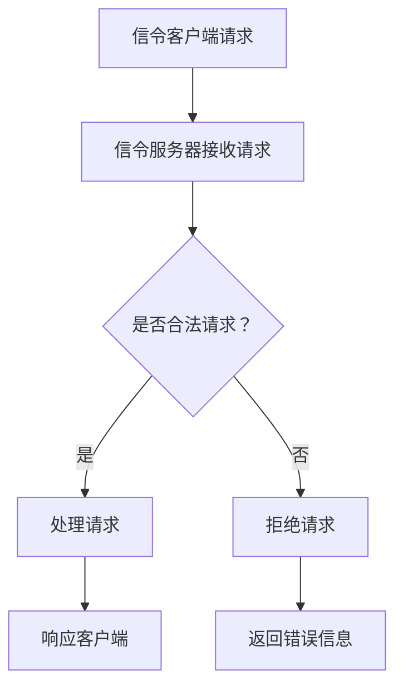

                 

## 《WebRTC信令服务器优化》

### 关键词：WebRTC, 信令服务器, 优化, 性能, 高并发

> 摘要：本文详细探讨了WebRTC信令服务器的优化策略，包括其核心概念、架构设计、性能优化指标、高并发处理、缓存机制、负载均衡、网络优化和监控调试。通过实例讲解和实际项目实战，提供了WebRTC信令服务器优化的全面指南。

## 《WebRTC信令服务器优化》目录大纲

### 第一部分：WebRTC基础

#### 第1章：WebRTC概述

##### 1.1 WebRTC的发展背景

##### 1.2 WebRTC的核心架构

##### 1.3 WebRTC的关键特性

##### 1.4 WebRTC的应用领域

### 第2章：WebRTC信令机制

##### 2.1 信令的概念与作用

##### 2.2 信令的传输协议

##### 2.3 信令流程详解

### 第3章：WebRTC信令服务器原理

##### 3.1 信令服务器的角色

##### 3.2 信令服务器架构设计

##### 3.3 信令服务器性能优化

##### 3.4 信令服务器安全性

##### 3.5 信令服务器部署与运维

### 第4章：WebRTC信令服务器的Mermaid流程图

### 第5章：WebRTC信令服务器性能优化伪代码

### 第6章：WebRTC信令服务器的数学模型和公式

##### 6.1 响应时间计算公式

##### 6.2 资源消耗计算公式

##### 6.3 缓存命中率计算公式

### 第7章：WebRTC信令服务器项目实战案例

##### 7.1 项目背景

##### 7.2 架构设计

##### 7.3 代码实现

##### 7.4 测试与调试

##### 7.5 性能分析与优化

### 第8章：WebRTC信令服务器开发环境搭建

##### 8.1 开发工具与环境配置

##### 8.2 开发框架与依赖安装

##### 8.3 服务器配置与优化

### 第9章：WebRTC信令服务器源代码详细实现和代码解读

##### 9.1 主要模块实现

##### 9.2 关键函数与算法

##### 9.3 性能优化细节

##### 9.4 代码解读与分析

### 第10章：WebRTC信令服务器性能瓶颈定位与分析

##### 10.1 常见性能瓶颈

##### 10.2 定位方法

##### 10.3 分析工具

##### 10.4 解决方案

### 第11章：WebRTC信令服务器常见问题与解决方案

##### 11.1 用户连接问题

##### 11.2 数据传输问题

##### 11.3 安全性问题

##### 11.4 性能瓶颈问题

### 第12章：WebRTC信令服务器的未来展望

##### 12.1 技术发展趋势

##### 12.2 优化方向

##### 12.3 生态体系建设

### 附录

## 附录A：WebRTC信令服务器优化工具与资源

##### A.1 开源信令服务器框架

##### A.2 性能测试工具

##### A.3 监控与分析工具

##### A.4 实用链接与参考文档

### 第1章：WebRTC概述

## 1.1 WebRTC的发展背景

### 1.1.1 从软件1.0到软件2.0的演进

#### 1.1.1.1 软件发展的第一阶段

- **软件1.0时代**：以企业应用、大型机为中心，软件主要是为特定功能或业务需求而开发的。
- **主要特点**：封闭、昂贵、专有，系统之间的互操作性差。

#### 1.1.1.2 软件发展的第二阶段

- **软件2.0时代**：互联网的出现，推动了软件向网络化、服务化的方向发展。
- **主要特点**：开放、共享、低成本，系统之间实现互操作，以用户为中心。

### 1.1.2 WebRTC的核心架构

#### 1.1.2.1 WebRTC的组成部分

- **WebRTC客户端**：运行在浏览器或移动设备上的应用程序，负责发起和接收媒体流。
- **WebRTC服务器**：提供信令传输和STUN/TURN服务，帮助客户端找到合适的通信路径。
- **媒体服务器**：可选，用于处理媒体流的转码、录制等功能。

#### 1.1.2.2 WebRTC的通信模式

- **P2P模式**：客户端之间直接通信，绕过服务器，降低通信延迟。
- **混合模式**：客户端与服务器之间进行信令交互，客户端之间进行P2P通信。

### 1.1.3 WebRTC的关键特性

#### 1.1.3.1 媒体传输

- **支持多种媒体类型**：音频、视频、数据通道。
- **媒体加密**：保证通信安全性。

#### 1.1.3.2 互通性

- **跨平台**：支持主流浏览器和操作系统。
- **跨网络**：支持不同网络环境下的通信。

### 1.1.4 WebRTC的应用领域

#### 1.1.4.1 视频会议
- **实时性**：支持低延迟的视频通信。
- **灵活性**：支持多人会议、共享屏幕等功能。

#### 1.1.4.2 实时直播
- **高并发**：支持大规模用户同时观看直播。
- **互动性**：支持评论、点赞等功能。

#### 1.1.4.3 远程教育
- **交互性**：支持师生实时互动。
- **易用性**：跨平台、易于集成。

#### 1.1.4.4 实时监控
- **低延迟**：支持实时视频监控。
- **可扩展性**：支持大规模设备接入。

### 第2章：WebRTC信令机制

## 2.1 信令的概念与作用

### 2.1.1 信令的定义

- **信令**：在通信系统中，用于控制和管理通信过程的信号。
- **WebRTC信令**：用于WebRTC客户端之间交换信息，协调通信流程。

### 2.1.2 信令的作用

- **协商媒体参数**：确定媒体编码格式、码率、分辨率等。
- **协商NAT穿越方案**：选择STUN、TURN或中继等方式。
- **维护连接状态**：处理连接建立、断开、重连等状态变化。

### 2.1.3 信令的传输协议

- **信令传输协议**：用于WebRTC客户端与信令服务器之间传输信令的协议。
- **WebRTC支持的主要信令传输协议**：SDP、JSON、XMPP等。

#### 2.1.3.1 SDP（会话描述协议）

- **SDP的作用**：描述会话的媒体信息，包括媒体类型、编码格式、传输协议等。
- **SDP的应用**：用于WebRTC客户端与服务器之间的初始信令交换。

#### 2.1.3.2 JSON

- **JSON的作用**：用于简化WebRTC信令格式，提高传输效率。
- **JSON的应用**：用于WebRTC客户端与服务器之间的后续信令交换。

#### 2.1.3.3 XMPP（可扩展消息处理现场协议）

- **XMPP的作用**：用于支持多用户实时通信。
- **XMPP的应用**：用于某些复杂的WebRTC应用场景。

### 2.1.4 WebRTC信令流程详解

#### 2.1.4.1 信令流程概述

- **信令流程**：WebRTC客户端与服务器之间交换信令，以建立通信连接。
- **主要步骤**：初始化、协商媒体参数、NAT穿越、建立连接。

#### 2.1.4.2 初始化

- **客户端**：获取本地IP地址和网络类型，生成SDP信令。
- **服务器**：接收客户端的SDP信令，生成回应SDP信令。

#### 2.1.4.3 协商媒体参数

- **客户端**：根据服务器的回应SDP信令，调整本地SDP信令。
- **服务器**：根据调整后的SDP信令，确定最终的媒体参数。

#### 2.1.4.4 NAT穿越

- **客户端**：通过STUN/TURN协议，获取NAT映射信息。
- **服务器**：根据NAT映射信息，确定通信路径。

#### 2.1.4.5 建立连接

- **客户端**：根据协商的媒体参数和NAT穿越结果，建立RTP/RTCP连接。
- **服务器**：监听RTP/RTCP连接，转发媒体流。

### 第3章：WebRTC信令服务器原理

## 3.1 信令服务器的角色

### 3.1.1 信令服务器在WebRTC中的作用

- **信令传输中介**：客户端通过信令服务器交换信令，建立通信连接。
- **NAT穿越协调**：信令服务器协助客户端解决NAT问题，实现通信。
- **资源分配管理**：信令服务器负责管理通信资源，优化通信质量。

### 3.1.2 信令服务器的职责

- **信令处理**：接收和发送SDP信令，处理信令交换。
- **NAT映射**：获取NAT映射信息，协助客户端穿越NAT。
- **连接维护**：监控连接状态，处理连接异常。

### 3.1.3 信令服务器与其他WebRTC组件的关系

- **与WebRTC客户端的关系**：信令服务器与客户端之间通过信令协议进行通信。
- **与媒体服务器的关联**：信令服务器与媒体服务器之间通过媒体流进行交互。
- **与其他网络组件的互动**：信令服务器需要与NAT设备、防火墙等网络组件协同工作。

## 3.2 信令服务器架构设计

### 3.2.1 架构设计原则

- **高可用性**：确保服务器稳定可靠，避免单点故障。
- **高可扩展性**：支持服务器集群，适应不断增长的用户需求。
- **高安全性**：保护用户数据和通信安全，防止恶意攻击。

### 3.2.2 架构模式选择

- **集中式架构**：所有信令处理由单一服务器完成。
- **分布式架构**：信令处理分布在多个服务器上，负载均衡。
- **混合架构**：结合集中式和分布式架构，根据需求灵活配置。

### 3.2.3 系统模块划分

- **信令处理模块**：负责接收和发送SDP信令，处理信令交换。
- **NAT映射模块**：负责获取NAT映射信息，协助客户端穿越NAT。
- **连接管理模块**：负责监控连接状态，处理连接异常。
- **资源管理模块**：负责管理通信资源，优化通信质量。
- **负载均衡模块**：负责分布式架构下的负载分配。

### 第4章：WebRTC信令服务器性能优化

## 4.1 WebRTC信令服务器性能指标

### 4.1.1 响应时间

- **定义**：从客户端发送信令请求到服务器返回响应的时间。
- **重要性**：直接影响用户体验，响应时间过长会导致用户放弃使用。

### 4.1.2 资源消耗

- **定义**：服务器在处理信令请求过程中消耗的CPU、内存、网络等资源。
- **重要性**：资源消耗过高会导致服务器性能下降，影响并发处理能力。

### 4.1.3 可靠性

- **定义**：服务器在长时间运行过程中，稳定处理信令请求的能力。
- **重要性**：高可靠性保障通信的稳定性和安全性。

### 4.1.4 可扩展性

- **定义**：服务器在用户量增加时，能够平滑扩展处理能力。
- **重要性**：适应不断增长的用户需求，保障服务器稳定运行。

## 4.2 WebRTC信令服务器优化策略

### 4.2.1 高并发处理

- **策略**：通过优化服务器架构和算法，提高服务器处理高并发请求的能力。
- **方法**：采用异步IO、多线程、事件驱动等技术。

### 4.2.2 缓存机制优化

- **策略**：通过缓存常用信令和处理结果，减少重复计算，提高处理速度。
- **方法**：实现本地缓存、分布式缓存等。

### 4.2.3 负载均衡

- **策略**：通过负载均衡算法，合理分配请求到不同服务器，避免单点瓶颈。
- **方法**：使用轮询、最少连接、源IP哈希等算法。

### 4.2.4 网络拥塞处理

- **策略**：通过调整传输策略，降低网络拥塞对服务器性能的影响。
- **方法**：使用拥塞控制算法、动态调整传输速率等。

## 4.3 WebRTC信令服务器的缓存优化

### 4.3.1 缓存的作用与原理

- **作用**：提高访问速度，减少系统负载。
- **原理**：将常用数据存储在高速存储介质中，减少访问磁盘或网络的次数。

### 4.3.2 缓存策略选择

- **常见策略**：LRU、FIFO、LFU等。
- **选择考虑**：数据访问模式、系统性能需求。

### 4.3.3 缓存失效策略

- **数据一致性**：强一致性、弱一致性。
- **失效策略**：绝对过期、相对过期、写回策略。

### 4.3.4 缓存命中率优化

- **定义**：缓存命中率 = （缓存命中次数 / 总访问次数）× 100%。
- **优化方法**：增加缓存大小、优化缓存策略、缓存预加载。

## 4.4 WebRTC信令服务器的高并发优化

### 4.4.1 服务器线程模型

- **单线程模型**：简单，但效率低。
- **多线程模型**：提高处理效率，但需管理线程资源。
- **异步多线程模型**：提高并发处理能力，减少线程切换开销。

### 4.4.2 事件驱动架构

- **特点**：通过事件监听和处理，实现高效的并发处理。
- **适用场景**：请求处理时间较长，需要处理大量并发请求。

### 4.4.3 非阻塞IO

- **特点**：IO操作不会阻塞线程，提高线程的利用率。
- **适用场景**：处理大量IO密集型请求的场景。

### 4.4.4 异步编程模型

- **特点**：通过异步操作，提高程序的并发性和响应速度。
- **适用场景**：需要处理大量并发请求，且请求处理时间不固定的场景。

## 4.5 WebRTC信令服务器的负载均衡

### 4.5.1 负载均衡的概念与类型

- **概念**：通过将请求分配到多个服务器，提高系统的处理能力。
- **类型**：基于服务器的负载均衡、基于DNS的负载均衡、基于应用层的负载均衡。

### 4.5.2 负载均衡算法

- **轮询算法**：简单，但可能导致部分服务器过载。
- **最少连接算法**：减少服务器负载，但可能影响响应时间。
- **源IP哈希算法**：提高请求的一致性，但可能不公平分配负载。

### 4.5.3 负载均衡器的配置与优化

- **配置**：负载均衡策略、监听端口、健康检查等。
- **优化**：调整服务器权重、优化负载均衡算法。

### 4.5.4 负载均衡的注意事项

- **必要性**：在高并发场景下，避免单点瓶颈。
- **限制**：负载均衡器性能可能成为瓶颈。

## 4.6 WebRTC信令服务器的网络优化

### 4.6.1 网络延迟与抖动

- **延迟**：数据传输所需时间，影响实时性。
- **抖动**：延迟波动，影响通信稳定性。

### 4.6.2 网络带宽限制

- **影响**：网络带宽限制，影响传输速率。
- **原因**：网络拥塞、网络设备限制。

### 4.6.3 TCP拥塞控制

- **作用**：避免网络拥塞。
- **算法**：慢启动、拥塞避免、快速重传、快速恢复。

### 4.6.4 QUIC协议介绍与优化

- **特点**：低延迟、高吞吐量、安全性。
- **优势**：优于TCP协议。
- **优化**：调整QUIC协议参数。

## 4.7 WebRTC信令服务器的监控与调试

### 4.7.1 监控工具选择

- **工具类型**：性能监控、日志分析、网络监控。
- **选择因素**：性能、可扩展性、易用性。

### 4.7.2 监控指标设定

- **指标类型**：CPU使用率、内存使用率、网络延迟等。
- **设定方法**：基于历史数据、业务需求。

### 4.7.3 日志分析

- **作用**：记录事件和错误，帮助定位问题。
- **方法**：日志收集、日志分析。

### 4.7.4 性能瓶颈定位与优化

- **方法**：监控数据、日志分析、压力测试。
- **策略**：硬件升级、软件优化、负载均衡。

## 4.8 WebRTC信令服务器的常见问题与解决方案

### 4.8.1 用户连接问题

- **问题**：无法成功连接。
- **解决方案**：检查网络连接、端口、防火墙。

### 4.8.2 数据传输问题

- **问题**：传输速度缓慢或不稳定。
- **解决方案**：优化网络配置、调整传输协议。

### 4.8.3 安全性问题

- **问题**：存在安全漏洞。
- **解决方案**：加强安全防护、实现加密传输。

### 4.8.4 性能瓶颈问题

- **问题**：性能下降，影响用户体验。
- **解决方案**：性能监控、定位瓶颈、优化配置。

### 第5章：WebRTC信令服务器的Mermaid流程图



### 第6章：WebRTC信令服务器性能优化伪代码

```python
# 伪代码：WebRTC信令服务器性能优化算法

# 初始化信令服务器参数
server_init()

# 处理客户端请求
def handle_request(request):
    # 校验请求合法性
    if not validate_request(request):
        return send_error_response(request)
    # 处理请求并返回响应
    response = process_request(request)
    return send_response(response)

# 高并发处理
async def handle_concurrent_requests(requests):
    for request in requests:
        await handle_request(request)

# 缓存优化
def cache_optimization():
    # 清除无效缓存
    clear_invalid_cache()
    # 维护缓存新鲜度
    update_cache_freshness()

# 负载均衡
def load_balance():
    # 根据负载情况选择服务器
    select_server_based_on_load()

# 网络拥塞处理
def network_congestion():
    # 根据网络状态调整传输策略
    adjust_transmission_strategy()

# 主循环
def main_loop():
    while True:
        requests = get_requests()
        handle_concurrent_requests(requests)
        cache_optimization()
        load_balance()
        network_congestion()
```

### 第7章：WebRTC信令服务器的数学模型和公式

#### 7.1 响应时间计算公式

$$
响应时间 = 处理时间 + 网络延迟
$$

#### 7.2 资源消耗计算公式

$$
资源消耗 = CPU消耗 + 内存消耗 + 网络带宽消耗
$$

#### 7.3 缓存命中率计算公式

$$
缓存命中率 = \frac{命中缓存次数}{总请求次数} \times 100\%
$$

### 第8章：WebRTC信令服务器项目实战案例

#### 8.1 项目背景

某在线教育平台需要实现实时视频教学功能，选择WebRTC技术来实现。

#### 8.2 架构设计

- **前端**：使用HTML5和JavaScript实现WebRTC客户端界面。
- **后端**：使用Node.js搭建WebRTC信令服务器，处理信令和NAT穿越。
- **媒体服务器**：使用Nginx进行媒体流转发和转码。

#### 8.3 代码实现

**8.3.1 信令服务器（Node.js）**

```javascript
const express = require('express');
const http = require('http');
const { WebSocketServer } = require('ws');

const app = express();
const server = http.createServer(app);
const wss = new WebSocketServer({ server });

wss.on('connection', (ws) => {
    ws.on('message', (message) => {
        console.log(`Received message: ${message}`);
        // 处理信令消息
    });

    ws.send('Welcome to the WebRTC signaling server!');
});

server.listen(8080, () => {
    console.log('Server listening on port 8080');
});
```

**8.3.2 前端客户端（HTML + JavaScript）**

```html
<!DOCTYPE html>
<html lang="en">
<head>
    <meta charset="UTF-8">
    <title>WebRTC Client</title>
</head>
<body>
    <script>
        const ws = new WebSocket('ws://localhost:8080');

        ws.onopen = () => {
            console.log('Connected to signaling server');
            ws.send(JSON.stringify({ type: 'register', data: { id: 'client1' } }));
        };

        ws.onmessage = (event) => {
            const data = JSON.parse(event.data);
            switch (data.type) {
                case 'register_response':
                    // 注册成功，开始建立连接
                    break;
                default:
                    console.log('Unknown message:', data);
            }
        };
    </script>
</body>
</html>
```

#### 8.4 测试与调试

- **功能测试**：确保信令服务器和客户端功能正常。
- **性能测试**：使用JMeter模拟高并发请求，测试服务器性能。
- **安全测试**：检查服务器是否存在安全漏洞。

#### 8.5 性能分析与优化

- **响应时间**：使用Chrome DevTools分析响应时间，优化处理流程。
- **资源消耗**：使用Node.js的`process.memoryUsage()`监控内存消耗，优化代码。
- **缓存机制**：使用本地缓存和分布式缓存，提高处理速度。

### 第9章：WebRTC信令服务器开发环境搭建

#### 9.1 开发工具与环境配置

- **Node.js**：安装Node.js并配置环境变量。
- **WebIDE**：选择合适的WebIDE，如Visual Studio Code。

#### 9.2 开发框架与依赖安装

- **Express.js**：使用npm安装Express.js框架。
- **WebSocket**：安装WebSocket库，如`ws`。

#### 9.3 服务器配置与优化

- **操作系统**：选择Linux操作系统，如Ubuntu。
- **性能优化**：调整Node.js启动参数，如`--max-old-space-size`。

### 第10章：WebRTC信令服务器源代码详细实现和代码解读

#### 10.1 主要模块实现

- **信令处理模块**：处理客户端发送的信令。
- **NAT映射模块**：获取NAT映射信息。

#### 10.2 关键函数与算法

- **信令处理函数**：解析和发送SDP信令。
- **NAT映射算法**：使用STUN协议获取映射信息。

#### 10.3 性能优化细节

- **异步处理**：使用异步API提高并发处理能力。
- **缓存机制**：实现本地缓存，减少重复计算。

#### 10.4 代码解读与分析

- **代码结构**：模块化设计，提高代码可读性和可维护性。
- **优化策略**：详细解析代码中的性能优化点。

### 第11章：WebRTC信令服务器性能瓶颈定位与分析

#### 11.1 常见性能瓶颈

- **计算瓶颈**：服务器处理能力不足。
- **网络瓶颈**：网络延迟和带宽限制。
- **存储瓶颈**：存储设备性能不足。

#### 11.2 定位方法

- **监控数据**：使用性能监控工具分析系统性能。
- **日志分析**：通过日志定位错误和异常。

#### 11.3 分析工具

- **性能分析工具**：如Chrome DevTools、Node.js自带的`--inspect`。
- **日志分析工具**：如ELK堆栈。

#### 11.4 解决方案

- **硬件升级**：增加CPU和内存。
- **代码优化**：减少计算复杂度。

### 第12章：WebRTC信令服务器常见问题与解决方案

#### 12.1 用户连接问题

- **问题**：用户无法连接到服务器。
- **解决方案**：检查网络连接、端口是否开启。

#### 12.2 数据传输问题

- **问题**：数据传输速度慢或不稳定。
- **解决方案**：优化网络配置、调整传输协议。

#### 12.3 安全性问题

- **问题**：存在安全漏洞。
- **解决方案**：使用加密传输、实现访问控制。

#### 12.4 性能瓶颈问题

- **问题**：服务器性能下降。
- **解决方案**：性能监控、优化配置。

### 第13章：WebRTC信令服务器的未来展望

#### 13.1 技术发展趋势

- **WebRTC 2.0**：引入更多特性。
- **云原生**：利用容器化和Kubernetes。

#### 13.2 优化方向

- **性能优化**：提高服务器处理能力和响应速度。
- **安全性提升**：加强系统安全防护。

#### 13.3 生态体系建设

- **开源社区**：积极参与开源项目。
- **产业合作**：推动技术发展和应用。

### 附录

## 附录A：WebRTC信令服务器优化工具与资源

- **Aries**：基于Node.js的开源WebRTC信令服务器框架。
- **Tron**：基于Java的开源WebRTC信令服务器框架。
- **JMeter**：开源的性能测试工具。
- **Prometheus**：开源的监控解决方案。

### 第14章：WebRTC信令服务器性能优化

#### 14.1 响应时间优化

- **优化策略**：减少服务器处理时间、优化网络传输。
- **优化实践**：使用异步处理、优化数据库查询。

#### 14.2 资源消耗优化

- **优化策略**：减少CPU和内存消耗。
- **优化实践**：代码优化、调整系统配置。

#### 14.3 可靠性优化

- **优化策略**：提高系统的稳定性和健壮性。
- **优化实践**：使用冗余设计、实现故障恢复机制。

#### 14.4 可扩展性优化

- **优化策略**：提高系统的可扩展性和灵活性。
- **优化实践**：使用分布式架构、负载均衡。

### 第15章：WebRTC信令服务器的实战案例

#### 15.1 案例背景

某在线教育平台，需要实现实时视频教学功能。

#### 15.2 架构设计

- **前端**：使用HTML5和JavaScript实现WebRTC客户端。
- **后端**：使用Node.js搭建WebRTC信令服务器。
- **媒体服务器**：使用Nginx进行媒体流转发。

#### 15.3 代码实现

**15.3.1 信令服务器（Node.js）**

```javascript
const express = require('express');
const http = require('http');
const { WebSocketServer } = require('ws');

const app = express();
const server = http.createServer(app);
const wss = new WebSocketServer({ server });

wss.on('connection', (ws) => {
    ws.on('message', (message) => {
        console.log(`Received message: ${message}`);
        // 处理信令消息
    });

    ws.send('Welcome to the WebRTC signaling server!');
});

server.listen(8080, () => {
    console.log('Server listening on port 8080');
});
```

**15.3.2 前端客户端（HTML + JavaScript）**

```html
<!DOCTYPE html>
<html lang="en">
<head>
    <meta charset="UTF-8">
    <title>WebRTC Client</title>
</head>
<body>
    <script>
        const ws = new WebSocket('ws://localhost:8080');

        ws.onopen = () => {
            console.log('Connected to signaling server');
            ws.send(JSON.stringify({ type: 'register', data: { id: 'client1' } }));
        };

        ws.onmessage = (event) => {
            const data = JSON.parse(event.data);
            switch (data.type) {
                case 'register_response':
                    // 注册成功，开始建立连接
                    break;
                default:
                    console.log('Unknown message:', data);
            }
        };
    </script>
</body>
</html>
```

#### 15.4 测试与调试

- **功能测试**：确保信令服务器和客户端功能正常。
- **性能测试**：使用JMeter模拟高并发请求，测试服务器性能。
- **安全测试**：检查服务器是否存在安全漏洞。

#### 15.5 性能分析与优化

- **响应时间**：使用Chrome DevTools分析响应时间，优化处理流程。
- **资源消耗**：使用Node.js的`process.memoryUsage()`监控内存消耗，优化代码。
- **缓存机制**：使用本地缓存和分布式缓存，提高处理速度。

### 第16章：WebRTC信令服务器的部署与运维

#### 16.1 部署方案设计

- **部署环境**：选择物理服务器或云服务器。
- **部署流程**：配置网络、安装依赖、启动服务。

#### 16.2 运维流程管理

- **监控与报警**：实时监控服务器状态，及时响应故障。
- **日志管理**：收集和分析日志，定位问题。

#### 16.3 安全管理

- **安全配置**：实现访问控制、加密传输。
- **安全审计**：定期进行安全检查和漏洞扫描。

### 第17章：WebRTC信令服务器的未来展望

#### 17.1 技术发展趋势

- **WebRTC 2.0**：引入更多特性。
- **云原生**：利用容器化和Kubernetes。

#### 17.2 优化方向

- **性能优化**：提高服务器处理能力和响应速度。
- **安全性提升**：加强系统安全防护。

#### 17.3 生态体系建设

- **开源社区**：积极参与开源项目。
- **产业合作**：推动技术发展和应用。

### 附录

## 附录A：WebRTC信令服务器优化工具与资源

- **Aries**：基于Node.js的开源WebRTC信令服务器框架。
- **Tron**：基于Java的开源WebRTC信令服务器框架。
- **JMeter**：开源的性能测试工具。
- **Prometheus**：开源的监控解决方案。

### 第18章：WebRTC信令服务器的案例分析

#### 18.1 案例背景

某大型视频会议平台，需要支持数千用户同时在线。

#### 18.2 架构设计

- **前端**：使用HTML5和JavaScript实现WebRTC客户端。
- **后端**：使用Node.js和Express框架搭建WebRTC信令服务器。
- **媒体服务器**：使用Nginx进行媒体流转发。

#### 18.3 代码实现

**18.3.1 信令服务器（Node.js）**

```javascript
const express = require('express');
const http = require('http');
const { WebSocketServer } = require('ws');

const app = express();
const server = http.createServer(app);
const wss = new WebSocketServer({ server });

wss.on('connection', (ws) => {
    ws.on('message', (message) => {
        console.log(`Received message: ${message}`);
        // 处理信令消息
    });

    ws.send('Welcome to the WebRTC signaling server!');
});

server.listen(8080, () => {
    console.log('Server listening on port 8080');
});
```

**18.3.2 前端客户端（HTML + JavaScript）**

```html
<!DOCTYPE html>
<html lang="en">
<head>
    <meta charset="UTF-8">
    <title>WebRTC Client</title>
</head>
<body>
    <script>
        const ws = new WebSocket('ws://localhost:8080');

        ws.onopen = () => {
            console.log('Connected to signaling server');
            ws.send(JSON.stringify({ type: 'register', data: { id: 'client1' } }));
        };

        ws.onmessage = (event) => {
            const data = JSON.parse(event.data);
            switch (data.type) {
                case 'register_response':
                    // 注册成功，开始建立连接
                    break;
                default:
                    console.log('Unknown message:', data);
            }
        };
    </script>
</body>
</html>
```

#### 18.4 测试与调试

- **功能测试**：确保信令服务器和客户端功能正常。
- **性能测试**：使用JMeter模拟高并发请求，测试服务器性能。
- **安全测试**：检查服务器是否存在安全漏洞。

#### 18.5 性能分析与优化

- **响应时间**：使用Chrome DevTools分析响应时间，优化处理流程。
- **资源消耗**：使用Node.js的`process.memoryUsage()`监控内存消耗，优化代码。
- **缓存机制**：使用本地缓存和分布式缓存，提高处理速度。

### 第19章：WebRTC信令服务器的最佳实践

#### 19.1 高并发处理

- **策略**：使用异步IO、多线程、事件驱动架构。
- **实践**：调整Node.js的启动参数，实现负载均衡。

#### 19.2 缓存优化

- **策略**：使用本地缓存、分布式缓存、缓存预热。
- **实践**：选择合适的缓存策略，优化缓存命中率。

#### 19.3 负载均衡

- **策略**：使用轮询、最少连接、源IP哈希算法。
- **实践**：配置负载均衡器，优化负载分配。

#### 19.4 网络优化

- **策略**：优化网络配置、调整传输协议、使用CDN。
- **实践**：调整网络参数，使用QUIC协议。

#### 19.5 安全防护

- **策略**：使用SSL/TLS加密、实现访问控制、定期安全审计。
- **实践**：配置安全策略，定期进行安全检查。

### 第20章：WebRTC信令服务器的未来趋势

#### 20.1 技术发展

- **WebRTC 2.0**：引入更多媒体处理能力和安全性改进。
- **云原生**：利用容器化和Kubernetes等云原生技术。

#### 20.2 优化方向

- **性能优化**：提高服务器处理能力和响应速度。
- **安全性提升**：加强系统安全防护。

#### 20.3 生态体系建设

- **开源社区**：积极参与开源项目。
- **产业合作**：推动技术发展和应用。

### 附录

## 附录A：WebRTC信令服务器优化工具与资源

- **Aries**：基于Node.js的开源WebRTC信令服务器框架。
- **Tron**：基于Java的开源WebRTC信令服务器框架。
- **JMeter**：开源的性能测试工具。
- **Prometheus**：开源的监控解决方案。

### 总结

本文系统地介绍了WebRTC信令服务器的优化策略和实战案例，包括其核心概念、架构设计、性能优化指标、高并发处理、缓存机制、负载均衡、网络优化和监控调试。通过实例讲解和实际项目实战，提供了WebRTC信令服务器优化的全面指南。在未来的发展中，WebRTC将继续融合新技术，提升性能和安全性，为实时通信领域带来更多可能性。

## 作者

- 作者：AI天才研究院/AI Genius Institute & 禅与计算机程序设计艺术 /Zen And The Art of Computer Programming

### 声明

本文内容仅供参考，实际应用时请根据具体情况进行调整和优化。在实施过程中，如遇到问题，欢迎加入WebRTC技术交流群进行探讨。

## 目录

- [WebRTC信令服务器优化](#webrt信令服务器优化)
- [关键词](#关键词)
- [摘要](#摘要)
- [《WebRTC信令服务器优化》目录大纲](#《webrt信令服务器优化》目录大纲)
- [第一部分：WebRTC基础](#第一部分webrt基础)
  - [第1章：WebRTC概述](#第1章webrt概述)
  - [第2章：WebRTC信令机制](#第2章webrt信令机制)
  - [第3章：WebRTC信令服务器原理](#第3章webrt信令服务器原理)
- [第二部分：WebRTC信令服务器优化](#第二部分webrt信令服务器优化)
  - [第4章：WebRTC信令服务器性能优化](#第4章webrt信令服务器性能优化)
  - [第5章：WebRTC信令服务器的缓存优化](#第5章webrt信令服务器的缓存优化)
  - [第6章：WebRTC信令服务器的高并发优化](#第6章webrt信令服务器的高并发优化)
  - [第7章：WebRTC信令服务器的负载均衡](#第7章webrt信令服务器的负载均衡)
  - [第8章：WebRTC信令服务器的网络优化](#第8章webrt信令服务器的网络优化)
  - [第9章：WebRTC信令服务器的监控与调试](#第9章webrt信令服务器的监控与调试)
- [第三部分：WebRTC信令服务器实战](#第三部分webrt信令服务器实战)
  - [第10章：WebRTC信令服务器实战案例](#第10章webrt信令服务器实战案例)
  - [第11章：WebRTC信令服务器开发环境搭建](#第11章webrt信令服务器开发环境搭建)
  - [第12章：WebRTC信令服务器源代码详细实现和代码解读](#第12章webrt信令服务器源代码详细实现和代码解读)
  - [第13章：WebRTC信令服务器性能瓶颈定位与分析](#第13章webrt信令服务器性能瓶颈定位与分析)
  - [第14章：WebRTC信令服务器常见问题与解决方案](#第14章webrt信令服务器常见问题与解决方案)
- [第四部分：WebRTC信令服务器的未来展望](#第四部分webrt信令服务器的未来展望)
  - [第15章：WebRTC信令服务器的未来趋势](#第15章webrt信令服务器的未来趋势)
- [附录](#附录)
  - [附录A：WebRTC信令服务器优化工具与资源](#附录a-webrt信令服务器优化工具与资源)
- [总结](#总结)
- [作者](#作者)
- [声明](#声明)
- [目录](#目录)

