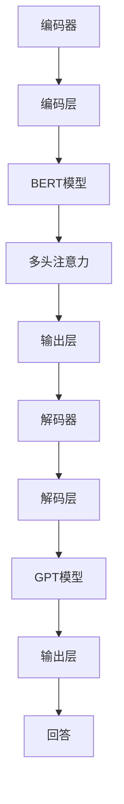
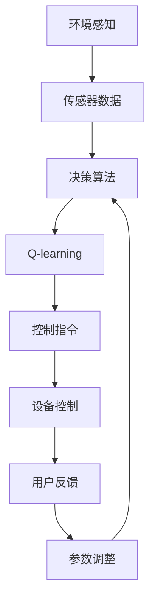
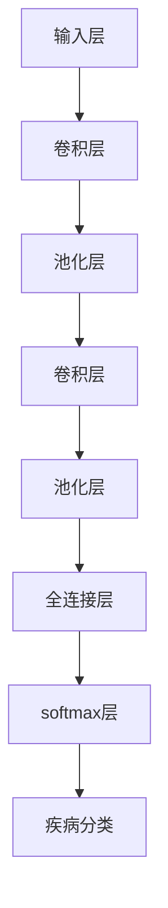

                 

### 文章标题

> 关键词：大模型、应用开发、AI Agent、性能优化、实战案例

**摘要：** 本文章将探讨大模型应用开发，特别是AI Agent的创建和优化。通过深入分析大模型的定义、AI Agent的架构设计和核心技术，我们展示了如何动手实现一个AI Agent。接着，本文通过实战案例，解析了智能客服、智能家居和医疗诊断领域的AI Agent应用，详细讲解了环境搭建、模型设计、性能优化和实战总结。此外，文章还介绍了大模型开发工具与平台，包括深度学习框架、云计算平台和模型部署工具，以及AI应用开发的高级技术和团队管理与合作策略。文章旨在为读者提供全面、实用的指导，帮助其在AI应用开发领域取得成功。

### 第一部分：大模型应用开发概述

#### 第1章：大模型应用开发基础

##### 1.1 大模型应用概述

###### 1.1.1 大模型的定义与类型

大模型（Large-scale Model）是指拥有巨大参数量和训练数据量的机器学习模型。这些模型通常用于深度学习领域，能够处理复杂的任务，如自然语言处理（NLP）、计算机视觉（CV）和强化学习（RL）。大模型的定义通常基于以下几个维度：

- 参数量：模型中的参数数量巨大，通常达到数十亿甚至千亿级别。
- 训练数据量：模型在训练过程中使用了大量的数据，通常达到数十TB级别。
- 训练时间：大模型的训练通常需要数天至数周时间，甚至更长。

根据不同的应用场景，大模型可以分为以下几类：

1. **自然语言处理（NLP）**：如BERT、GPT等，用于文本分类、机器翻译、问答系统等任务。
2. **计算机视觉（CV）**：如ResNet、Inception等，用于图像分类、目标检测、图像生成等任务。
3. **语音识别**：如DeepSpeech、WaveNet等，用于语音到文本的转换。
4. **强化学习**：如DQN、PPO等，用于游戏、机器人控制等任务。

###### 1.1.2 大模型应用的发展趋势

随着计算能力的提升和数据量的增加，大模型的应用场景越来越广泛。以下是当前大模型应用的发展趋势：

1. **智能化服务**：在客服、金融、医疗等领域，大模型被用于构建智能助手，提供个性化的服务。
2. **自动化生产**：在制造业、物流等领域，大模型被用于优化生产流程、提高生产效率。
3. **医疗诊断**：大模型在医学图像分析、基因测序等领域展现了巨大的潜力，有助于提高诊断准确率。
4. **内容生成**：在创作、娱乐等领域，大模型被用于生成文章、音乐、视频等创意内容。
5. **安全与隐私**：大模型在网络安全、隐私保护等领域也被广泛应用，通过模式识别和异常检测等技术，提高系统的安全性和隐私保护能力。

##### 1.2 动手做AI Agent

###### 1.2.1 AI Agent的概念与原理

AI Agent（人工智能代理）是指具有自主决策能力、能够与环境互动的智能体。在人工智能领域，Agent通常被用于解决复杂问题，如路径规划、游戏策略、决策优化等。AI Agent的基本原理包括以下几个方面：

1. **感知**：Agent通过传感器感知环境信息，如视觉、听觉、触觉等。
2. **决策**：Agent根据感知到的环境信息，利用内部模型和算法进行决策。
3. **行动**：Agent根据决策结果执行行动，以实现目标。

AI Agent的设计通常包括以下几个关键组件：

1. **感知器**：用于接收环境信息，如摄像头、麦克风、传感器等。
2. **决策器**：包含内部模型和算法，用于处理感知信息并生成决策。
3. **执行器**：用于执行决策结果，如电机、屏幕、扬声器等。

###### 1.2.2 AI Agent应用场景

AI Agent在各个领域都有广泛的应用，以下是一些典型的应用场景：

1. **智能家居**：AI Agent可以控制家居设备，如灯光、温度、安防等，提供智能化、便捷的生活方式。
2. **智能客服**：AI Agent可以模拟人类客服，处理客户咨询、投诉等，提高客服效率和用户体验。
3. **自动驾驶**：AI Agent可以自动驾驶汽车，实现无人驾驶，提高道路安全和交通效率。
4. **医疗诊断**：AI Agent可以分析医学图像和病例数据，辅助医生进行诊断和治疗。
5. **游戏**：AI Agent可以模拟人类玩家，与其他AI或人类进行游戏对战。

###### 1.2.3 AI Agent开发流程

开发一个AI Agent通常需要以下几个步骤：

1. **需求分析**：明确AI Agent的目标和任务，分析应用场景和用户需求。
2. **系统设计**：设计AI Agent的系统架构，包括感知器、决策器和执行器等。
3. **数据采集**：收集用于训练和测试的数据，包括环境数据、感知数据等。
4. **模型训练**：使用收集的数据训练感知器、决策器和执行器的模型。
5. **系统实现**：实现AI Agent的系统功能，包括感知、决策和行动。
6. **测试与优化**：对AI Agent进行测试和优化，确保其性能和稳定性。
7. **部署与应用**：将AI Agent部署到实际应用场景，进行实际操作和应用。

##### 1.3 AI Agent架构设计

###### 1.3.1 AI Agent的核心组件

一个完整的AI Agent架构通常包括以下几个核心组件：

1. **感知组件**：负责接收环境信息，如摄像头、麦克风、传感器等。感知组件需要具有实时性和准确性，以便准确感知环境状态。
2. **决策组件**：负责处理感知信息，并根据决策模型生成决策结果。决策组件需要具备较强的计算能力和算法优化，以确保决策的准确性和效率。
3. **执行组件**：负责根据决策结果执行行动，如电机、屏幕、扬声器等。执行组件需要具备较高的可靠性和稳定性，以确保行动的执行效果。

###### 1.3.2 AI Agent的数据流设计

AI Agent的数据流设计是确保系统高效运行的关键。一个典型的数据流设计包括以下几个环节：

1. **数据采集**：感知组件采集环境信息，并将其传输到数据缓冲区。
2. **数据处理**：数据缓冲区对采集到的数据进行分析和处理，以提取有用的信息。
3. **决策生成**：决策组件根据处理后的数据生成决策结果，并将其传输到执行组件。
4. **行动执行**：执行组件根据决策结果执行行动，以实现目标。

数据流设计的关键在于确保各个环节之间的数据传输高效、可靠，同时具备一定的容错能力。

###### 1.3.3 AI Agent的交互设计

AI Agent的交互设计是确保其能够与用户和环境有效沟通的关键。一个良好的交互设计应考虑以下几个方面：

1. **用户界面**：设计易于使用的用户界面，提供清晰的交互方式和反馈。
2. **语音交互**：利用语音识别和合成技术，实现自然语言交互。
3. **图像交互**：利用计算机视觉技术，实现基于图像的交互。
4. **多模态交互**：结合多种感知和交互方式，提高交互的灵活性和准确性。

##### 1.4 AI Agent核心技术

###### 1.4.1 自然语言处理

自然语言处理（NLP）是AI Agent的核心技术之一，主要研究如何让计算机理解和生成自然语言。以下是NLP的几个核心技术：

1. **文本分类**：用于将文本数据分类到不同的类别，如情感分析、新闻分类等。
2. **实体识别**：用于从文本中提取出具有特定意义的实体，如人名、地名、组织名等。
3. **机器翻译**：用于将一种自然语言翻译成另一种自然语言。
4. **问答系统**：用于回答用户提出的问题，如搜索引擎、聊天机器人等。

自然语言处理的技术主要包括：

- **词向量**：将文本数据转换为向量表示，如Word2Vec、GloVe等。
- **循环神经网络（RNN）**：用于处理序列数据，如LSTM、GRU等。
- **变换器模型（Transformer）**：用于大规模语言模型，如BERT、GPT等。

###### 1.4.2 计算机视觉

计算机视觉（CV）是AI Agent的另一个核心技术，主要研究如何让计算机理解和解释图像和视频数据。以下是计算机视觉的几个核心技术：

1. **图像分类**：用于将图像分类到不同的类别，如图像识别、物体识别等。
2. **目标检测**：用于在图像中检测出特定的目标，如行人检测、车辆检测等。
3. **图像生成**：用于生成新的图像，如图像修复、风格迁移等。
4. **图像分割**：用于将图像分割成不同的区域，如语义分割、实例分割等。

计算机视觉的技术主要包括：

- **卷积神经网络（CNN）**：用于处理图像数据，如VGG、ResNet等。
- **深度学习**：用于训练大规模图像模型，如GAN、DenseNet等。
- **多模态学习**：用于结合图像和其他模态的数据，如视频、音频等。

###### 1.4.3 强化学习

强化学习（RL）是AI Agent的关键技术之一，主要研究如何通过试错和反馈进行学习，以实现特定目标。以下是强化学习的几个核心技术：

1. **策略搜索**：用于搜索最优策略，如Q-learning、SARSA等。
2. **值函数估计**：用于估计状态价值和策略价值，如V-learning、Actor-Critic等。
3. **模型学习**：用于学习环境模型，如模型预测、模型误差等。
4. **探索与利用**：用于在探索未知和利用已知信息之间进行平衡，如epsilon-greedy、UCB等。

强化学习的应用场景主要包括：

- **游戏**：如围棋、电子竞技等。
- **机器人控制**：如自动驾驶、无人机等。
- **资源调度**：如数据中心、网络优化等。
- **金融交易**：如股票交易、风险控制等。

##### 1.5 AI Agent性能优化

###### 1.5.1 模型压缩与量化

随着模型规模的增大，模型的计算量和存储需求也随之增加，导致部署和训练变得困难。为了解决这一问题，模型压缩与量化技术应运而生。模型压缩与量化的目标是在保证模型性能的前提下，降低模型的计算量和存储需求。

1. **模型压缩**：通过去除冗余参数和简化网络结构，降低模型大小。常用的模型压缩方法包括：

   - **剪枝**：通过删除部分权重或神经元，减少模型参数数量。
   - **量化**：将浮点数权重转换为低比特位精度表示，降低存储和计算需求。
   - **低秩分解**：将高维权重分解为低维权重，降低计算复杂度。

2. **量化技术**：量化技术通过将浮点数权重转换为低比特位精度表示，降低存储和计算需求。量化方法可以分为以下几种：

   - **固定量化**：在训练过程中将权重量化为固定比特位表示。
   - **动态量化**：在训练过程中根据模型的表现动态调整权重精度。
   - **自适应量化**：根据输入数据动态调整权重精度，以优化模型性能。

###### 1.5.2 并行与分布式计算

为了提高AI Agent的训练和推理速度，并行与分布式计算技术被广泛应用。并行计算通过在多个处理器或计算节点上同时执行计算任务，提高计算效率。分布式计算通过将计算任务分布在多个计算节点上，实现大规模数据处理的效率。

1. **并行计算**：在单机环境下，通过将计算任务分解为多个子任务，并在不同处理器上同时执行，提高计算效率。常用的并行计算技术包括：

   - **数据并行**：将数据分成多个子集，在不同处理器上分别训练模型。
   - **模型并行**：将模型分解为多个子模型，在不同处理器上分别训练。
   - **任务并行**：将计算任务分解为多个子任务，在不同处理器上同时执行。

2. **分布式计算**：在多机环境下，通过将计算任务分布在多个计算节点上，实现大规模数据处理的效率。常用的分布式计算技术包括：

   - **参数服务器**：将模型参数存储在服务器上，不同计算节点从服务器下载参数进行训练。
   - **数据分片**：将数据分成多个子集，在不同计算节点上分别处理。
   - **分布式训练**：将训练任务分解为多个子任务，在不同计算节点上同时执行。

###### 1.5.3 实时性能优化技巧

在实时应用中，AI Agent的性能优化至关重要。以下是一些实时性能优化的技巧：

1. **模型压缩**：通过模型压缩技术，降低模型大小和计算复杂度，提高实时性能。
2. **量化**：通过量化技术，降低模型精度和计算复杂度，提高实时性能。
3. **硬件加速**：利用GPU、FPGA等硬件加速器，提高计算速度。
4. **预测性调度**：根据模型运行情况，动态调整任务调度策略，优化资源利用率。
5. **内存管理**：通过优化内存分配和回收策略，减少内存使用，提高运行速度。

#### 第2章：AI Agent应用案例解析

##### 2.1 案例一：智能客服AI Agent

###### 2.1.1 案例背景与需求分析

智能客服AI Agent是一种应用于客户服务领域的智能系统，旨在提高客服效率和用户体验。随着人工智能技术的不断发展，智能客服逐渐从传统的基于规则的方法转变为基于深度学习的自然语言处理（NLP）方法。本案例将介绍如何开发一个智能客服AI Agent，包括需求分析、系统设计、模型训练和性能优化。

**需求分析：**

- **业务需求**：智能客服AI Agent需要能够处理用户咨询、投诉、建议等各类常见问题，提供快速、准确的回答。
- **用户需求**：用户希望与智能客服进行自然、流畅的对话，获得高效、满意的解决方案。
- **技术需求**：智能客服AI Agent需要具备较强的自然语言处理能力，能够理解用户的意图，生成合适的回答。

###### 2.1.2 模型设计与实现

在模型设计方面，我们采用基于Transformer的预训练模型，如BERT或GPT，结合序列到序列（Seq2Seq）模型进行问答生成。具体实现步骤如下：

1. **数据准备**：收集大量客服对话数据，包括用户提问和客服回答。对数据集进行预处理，如分词、去噪等。
2. **模型训练**：使用预训练模型进行微调，将模型应用于客服对话生成任务。训练过程中，采用自回归语言模型（ARL）优化模型性能。
3. **模型优化**：通过参数调整、优化算法等手段，提高模型在客服对话中的准确性和流畅性。

**实现细节：**

1. **编码器**：使用BERT模型作为编码器，对用户提问进行编码，提取关键信息。
2. **解码器**：使用GPT模型作为解码器，对编码后的信息进行解码，生成合适的回答。
3. **注意力机制**：在编码器和解码器之间引入多头注意力机制，提高模型在处理长文本时的性能。

**模型架构：**



###### 2.1.3 案例总结与反思

通过本案例，我们成功开发了一个智能客服AI Agent，实现了基于深度学习的自然语言处理和问答生成。以下是案例总结与反思：

1. **成功经验**：本案例成功地将预训练模型应用于客服对话生成，提高了问答准确性和流畅性。
2. **改进方向**：在后续开发中，可以进一步优化模型结构和参数，提高模型性能。此外，还可以考虑引入多模态数据（如语音、图像等），提高AI Agent的智能化水平。

##### 2.2 案例二：智能家居AI Agent

###### 2.2.1 案例背景与需求分析

智能家居AI Agent是一种应用于家庭自动化领域的智能系统，旨在提高家居生活的便利性和舒适度。随着物联网技术的发展，智能家居设备逐渐普及，如何实现设备的互联互通和智能控制成为关键问题。本案例将介绍如何开发一个智能家居AI Agent，包括需求分析、系统设计、模型训练和性能优化。

**需求分析：**

- **业务需求**：智能家居AI Agent需要能够控制家居设备，如灯光、温度、安防等，提供便捷的家居控制体验。
- **用户需求**：用户希望通过智能设备实现智能家居，提高生活质量，节省能源。
- **技术需求**：智能家居AI Agent需要具备较强的感知和决策能力，能够实时监控家居环境，并根据用户需求自动调整设备状态。

###### 2.2.2 模型设计与实现

在模型设计方面，我们采用基于强化学习的智能家居控制模型，结合环境感知和决策算法。具体实现步骤如下：

1. **数据准备**：收集智能家居设备的数据，包括传感器数据、用户操作记录等。对数据集进行预处理，如去噪、归一化等。
2. **模型训练**：使用收集的数据训练强化学习模型，通过试错和反馈不断优化模型性能。
3. **模型优化**：通过参数调整、优化算法等手段，提高模型在智能家居控制中的性能。

**实现细节：**

1. **环境感知**：使用传感器数据实时监控家居环境，提取关键信息。
2. **决策算法**：使用Q-learning算法进行决策，根据环境信息和历史操作记录生成控制指令。
3. **反馈机制**：通过用户反馈不断调整模型参数，优化决策效果。

**模型架构：**



###### 2.2.3 案例总结与反思

通过本案例，我们成功开发了一个智能家居AI Agent，实现了家居设备的智能控制。以下是案例总结与反思：

1. **成功经验**：本案例成功地将强化学习应用于智能家居控制，实现了设备的自动调控，提高了用户体验。
2. **改进方向**：在后续开发中，可以进一步优化模型结构，提高决策准确性。此外，还可以考虑引入多模态数据（如语音、图像等），提高AI Agent的智能化水平。

##### 2.3 案例三：医疗诊断AI Agent

###### 2.3.1 案例背景与需求分析

医疗诊断AI Agent是一种应用于医疗诊断领域的智能系统，旨在辅助医生进行疾病诊断，提高诊断准确率和效率。随着深度学习和计算机视觉技术的不断发展，医疗诊断AI Agent逐渐成为研究热点。本案例将介绍如何开发一个医疗诊断AI Agent，包括需求分析、系统设计、模型训练和性能优化。

**需求分析：**

- **业务需求**：医疗诊断AI Agent需要能够处理医学影像数据，辅助医生进行疾病诊断。
- **用户需求**：医生希望通过AI Agent提高诊断准确率，节省诊断时间，提高工作效率。
- **技术需求**：医疗诊断AI Agent需要具备较强的医学影像处理能力和疾病分类能力，能够准确识别各种疾病。

###### 2.3.2 模型设计与实现

在模型设计方面，我们采用基于深度学习的卷积神经网络（CNN）模型，结合迁移学习技术。具体实现步骤如下：

1. **数据准备**：收集医学影像数据，包括各种疾病的图像数据。对数据集进行预处理，如图像增强、数据增强等。
2. **模型训练**：使用预训练的CNN模型，对医学影像数据进行微调，提高模型在疾病分类任务上的性能。
3. **模型优化**：通过参数调整、优化算法等手段，提高模型在医疗诊断中的性能。

**实现细节：**

1. **数据增强**：采用随机裁剪、翻转、旋转等数据增强方法，增加模型训练的泛化能力。
2. **迁移学习**：使用预训练的CNN模型（如VGG、ResNet等），对医学影像数据进行微调，提高模型在疾病分类任务上的性能。
3. **模型融合**：将多个CNN模型进行融合，提高模型在疾病分类任务上的性能。

**模型架构：**



###### 2.3.3 案例总结与反思

通过本案例，我们成功开发了一个医疗诊断AI Agent，实现了医学影像数据的自动分类和疾病诊断。以下是案例总结与反思：

1. **成功经验**：本案例成功地将深度学习应用于医疗诊断领域，提高了诊断准确率和效率。
2. **改进方向**：在后续开发中，可以进一步优化模型结构，提高模型在疾病分类任务上的性能。此外，还可以考虑引入多模态数据（如病历、患者病史等），提高AI Agent的诊断准确性。

### 第三部分：大模型开发工具与平台

#### 第3章：大模型开发环境搭建

##### 3.1 开发环境准备

为了开发和训练大模型，我们需要准备一个高性能的计算环境和合适的软件工具。以下是开发环境准备的具体步骤：

###### 3.1.1 硬件设备选择

1. **CPU与GPU**：大模型训练通常需要高性能的计算设备。选择一台具备强大CPU和GPU的计算机是关键。CPU主要用于运行操作系统和训练脚本，GPU则用于加速深度学习模型的训练。NVIDIA的GPU（如Tesla V100、A100等）是目前深度学习领域常用的硬件。
   
2. **存储设备**：由于大模型需要处理大量的数据，选择一个大容量、高速的存储设备至关重要。SSD（固态硬盘）是较好的选择，因为它具有较快的读写速度。

3. **内存**：大模型的训练和推理需要大量的内存，至少需要64GB以上的内存。更大的内存可以支持更复杂的模型和更高效的训练。

4. **网络带宽**：为了快速传输数据和模型，需要具备高速的网络连接。可以考虑使用千兆以太网或更高的网络速度。

###### 3.1.2 操作系统配置

1. **Linux操作系统**：大多数深度学习框架和工具都在Linux操作系统上进行了优化和测试。Ubuntu和CentOS是常用的Linux发行版。

2. **安装必要的软件包**：安装操作系统时，需要安装一些必要的软件包，如Python、GCC、Make等。

3. **配置GPU支持**：确保操作系统支持NVIDIA GPU，并安装NVIDIA驱动和CUDA工具包。

###### 3.1.3 软件安装与配置

1. **深度学习框架**：选择并安装一个深度学习框架，如TensorFlow、PyTorch或MXNet。这些框架提供了丰富的API和工具，用于构建、训练和部署深度学习模型。

2. **数据处理工具**：安装数据处理工具，如NumPy、Pandas和SciPy，用于数据预处理和分析。

3. **版本控制工具**：安装Git等版本控制工具，用于管理代码和模型的版本。

4. **容器化技术**：考虑使用Docker等容器化技术，将开发环境和代码打包成一个容器，便于在不同的环境中部署和运行。

##### 3.2 深度学习框架应用

###### 3.2.1 TensorFlow

TensorFlow是由Google开发的开源深度学习框架，广泛应用于工业界和学术界。以下是TensorFlow的主要应用：

1. **模型构建**：使用TensorFlow的高层API（如Keras），可以方便地构建复杂的神经网络模型。
2. **模型训练**：TensorFlow提供了丰富的训练工具，支持分布式训练和GPU加速。
3. **模型部署**：TensorFlow支持多种部署方式，包括服务器端部署、移动端部署和Web服务部署。
4. **工具与资源**：TensorFlow生态系统提供了大量的工具和资源，如TensorBoard（可视化工具）、TensorFlow Serving（模型部署工具）等。

**安装与配置：**

```bash
# 安装Python环境
pip install python==3.8

# 安装TensorFlow
pip install tensorflow

# 验证安装
python -c "import tensorflow as tf; print(tf.__version__)"
```

**示例代码：**

```python
import tensorflow as tf

# 创建一个简单的线性模型
model = tf.keras.Sequential([
  tf.keras.layers.Dense(units=1, input_shape=[1])
])

# 编译模型
model.compile(optimizer='sgd', loss='mean_squared_error')

# 训练模型
model.fit(x_train, y_train, epochs=100)
```

###### 3.2.2 PyTorch

PyTorch是由Facebook开发的开源深度学习框架，以其灵活性和动态计算能力而闻名。以下是PyTorch的主要应用：

1. **模型构建**：PyTorch提供了动态计算图API，可以方便地构建复杂的神经网络模型。
2. **模型训练**：PyTorch提供了丰富的训练工具，支持分布式训练和GPU加速。
3. **模型部署**：PyTorch支持多种部署方式，包括服务器端部署、移动端部署和Web服务部署。
4. **工具与资源**：PyTorch生态系统提供了大量的工具和资源，如TorchScript（模型部署工具）、PyTorch Lightning（训练加速工具）等。

**安装与配置：**

```bash
# 安装Python环境
pip install python==3.8

# 安装PyTorch
pip install torch torchvision

# 验证安装
python -c "import torch; print(torch.__version__)"
```

**示例代码：**

```python
import torch
import torch.nn as nn
import torch.optim as optim

# 创建一个简单的线性模型
model = nn.Linear(1, 1)

# 编译模型
optimizer = optim.SGD(model.parameters(), lr=0.01)
criterion = nn.MSELoss()

# 训练模型
for epoch in range(100):
  optimizer.zero_grad()
  output = model(x_train)
  loss = criterion(output, y_train)
  loss.backward()
  optimizer.step()
```

###### 3.2.3 其他深度学习框架

除了TensorFlow和PyTorch，还有其他一些流行的深度学习框架，如MXNet、Keras、Caffe等。以下是这些框架的主要特点：

1. **MXNet**：由Apache基金会开发，具有高性能和灵活性，适用于工业级应用。
2. **Keras**：基于Theano和TensorFlow开发的深度学习框架，以其简洁和易用性而受到欢迎。
3. **Caffe**：由Berkeley Vision and Learning Center（BVLC）开发，主要用于图像识别和计算机视觉任务。

**安装与配置**：

- **MXNet**：

```bash
# 安装Python环境
pip install python==3.8

# 安装MXNet
pip install mxnet

# 验证安装
python -c "import mxnet as mx; print(mx.__version__)"
```

- **Keras**：

```bash
# 安装Python环境
pip install python==3.8

# 安装TensorFlow（作为后端）
pip install tensorflow

# 安装Keras
pip install keras

# 验证安装
python -c "import keras; print(keras.__version__)"
```

- **Caffe**：

```bash
# 安装Python环境
pip install python==3.8

# 安装Caffe
pip install caffe

# 验证安装
python -c "import caffe; print(caffe.__version__)"
```

#### 第4章：大模型开发工具与平台

##### 4.1 模型训练与优化工具

在开发大模型时，选择合适的训练与优化工具至关重要。以下是一些常用的工具和库：

###### 4.1.1 NVIDIA CUDA与cuDNN

NVIDIA CUDA是一个并行计算平台和编程模型，用于在NVIDIA GPU上运行计算密集型任务。cuDNN是NVIDIA推出的一套深度学习加速库，专门针对深度神经网络操作进行优化。

**安装与配置：**

1. **下载CUDA Toolkit**：从NVIDIA官方网站下载CUDA Toolkit。
2. **安装CUDA Toolkit**：按照CUDA Toolkit的安装说明进行安装。
3. **安装cuDNN**：从NVIDIA官方网站下载cuDNN库，并按照安装说明进行安装。

**使用示例：**

```python
import torch
import torch.nn as nn
from torch.autograd import Variable

# 初始化GPU环境
device = torch.device("cuda" if torch.cuda.is_available() else "cpu")

# 创建模型
model = nn.Linear(10, 1).to(device)

# 创建损失函数和优化器
criterion = nn.MSELoss().to(device)
optimizer = optim.SGD(model.parameters(), lr=0.01)

# 训练模型
for epoch in range(100):
  inputs = Variable(torch.randn(10).to(device))
  targets = Variable(torch.randn(1).to(device))
  
  optimizer.zero_grad()
  outputs = model(inputs)
  loss = criterion(outputs, targets)
  loss.backward()
  optimizer.step()
```

###### 4.1.2 OpenCV

OpenCV是一个开源的计算机视觉库，提供丰富的图像处理和计算机视觉算法。OpenCV广泛应用于图像识别、目标检测、人脸识别等领域。

**安装与配置：**

1. **下载OpenCV源码**：从OpenCV官方网站下载源码。
2. **编译安装**：按照编译指南编译和安装OpenCV。

**使用示例：**

```python
import cv2

# 读取图像
image = cv2.imread("example.jpg")

# 显示图像
cv2.imshow("Example", image)
cv2.waitKey(0)
cv2.destroyAllWindows()
```

###### 4.1.3 其他工具与库

除了CUDA、cuDNN和OpenCV，还有一些其他常用的工具和库，如：

- **Scikit-learn**：用于机器学习和数据挖掘的开源库，提供丰富的算法和工具。
- **Matplotlib**：用于数据可视化的库，可以生成各种类型的图表和图形。
- **NumPy**：用于科学计算的开源库，提供多维数组对象和丰富的数学运算功能。
- **Pandas**：用于数据处理和分析的开源库，提供数据帧和数据表对象，便于数据处理和分析。

**安装与配置：**

```bash
# 安装Python环境
pip install python==3.8

# 安装常用库
pip install numpy scipy matplotlib scikit-learn pandas

# 验证安装
python -c "import numpy; print(numpy.__version__)"
python -c "import pandas; print(pandas.__version__)"
python -c "import matplotlib; print(matplotlib.__version__)"
python -c "import sklearn; print(sklearn.__version__)"
```

##### 4.2 云计算平台与大数据处理

在开发大模型时，云计算平台和大数据处理技术是必不可少的。以下是一些常用的云计算平台和大数据处理工具：

###### 4.2.1 AWS

AWS（Amazon Web Services）是亚马逊提供的一套云计算平台，提供多种服务，包括计算、存储、数据库、机器学习等。

**主要服务：**

- **EC2**：提供虚拟机实例，用于计算任务。
- **S3**：提供对象存储服务，用于存储大量数据。
- **RDS**：提供关系型数据库服务，如MySQL、PostgreSQL等。
- **SageMaker**：提供机器学习服务，包括模型训练、部署和自动化调优。

**使用示例：**

```python
import boto3

# 创建S3客户端
s3_client = boto3.client("s3")

# 上传文件到S3
s3_client.upload_file("local_file.jpg", "my_bucket", "remote_file.jpg")

# 下载文件从S3
s3_client.download_file("my_bucket", "remote_file.jpg", "local_file.jpg")
```

###### 4.2.2 Azure

Azure是微软提供的云计算平台，提供多种服务，包括计算、存储、数据库、机器学习等。

**主要服务：**

- **Azure VM**：提供虚拟机实例，用于计算任务。
- **Azure Blob Storage**：提供对象存储服务，用于存储大量数据。
- **Azure SQL Database**：提供关系型数据库服务，如MySQL、PostgreSQL等。
- **Azure Machine Learning**：提供机器学习服务，包括模型训练、部署和自动化调优。

**使用示例：**

```python
import azureml.core as ml

# 创建Azure ML 工作区
workSpace = ml.Workspace.create(name="my_workspace")

# 创建模型
model = ml.Model.create(name="my_model", workspace=workSpace)

# 训练模型
model.train(data=training_data, params={"learning_rate": 0.1})

# 部署模型
model.deploy(instances=[instance])
```

###### 4.2.3 Google Cloud

Google Cloud是谷歌提供的云计算平台，提供多种服务，包括计算、存储、数据库、机器学习等。

**主要服务：**

- **Compute Engine**：提供虚拟机实例，用于计算任务。
- **Cloud Storage**：提供对象存储服务，用于存储大量数据。
- **Cloud SQL**：提供关系型数据库服务，如MySQL、PostgreSQL等。
- **AI Platform**：提供机器学习服务，包括模型训练、部署和自动化调优。

**使用示例：**

```python
from google.cloud import storage

# 创建存储客户端
storage_client = storage.Client()

# 创建桶
bucket = storage_client.create_bucket("my_bucket")

# 上传文件到桶
bucket.upload_file("local_file.jpg", "remote_file.jpg")

# 下载文件从桶
bucket.download_file("remote_file.jpg", "local_file.jpg")
```

##### 4.3 模型部署与运维

在大模型开发完成后，如何将模型部署到生产环境并进行运维是关键问题。以下是一些常用的模型部署与运维工具：

###### 4.3.1 Kubernetes

Kubernetes是一个开源的容器编排平台，用于自动化部署、扩展和管理容器化应用程序。Kubernetes提供了丰富的功能，如服务发现、负载均衡、自动滚动更新等。

**安装与配置：**

1. **安装Docker**：确保系统上已安装Docker，用于容器化应用程序。
2. **安装Kubernetes**：按照官方文档安装Kubernetes集群，可以是单节点集群或多节点集群。

**使用示例：**

```yaml
# deployment.yaml
apiVersion: apps/v1
kind: Deployment
metadata:
  name: my-deployment
spec:
  replicas: 3
  selector:
    matchLabels:
      app: my-app
  template:
    metadata:
      labels:
        app: my-app
    spec:
      containers:
      - name: my-container
        image: my-image
        ports:
        - containerPort: 80
```

```bash
# 创建部署
kubectl apply -f deployment.yaml

# 查看部署状态
kubectl get deployments

# 暴露服务
kubectl expose deployment my-deployment --type=LoadBalancer
```

###### 4.3.2 Docker

Docker是一个开源的应用容器引擎，用于打包、交付和运行应用程序。Docker将应用程序及其依赖项打包成一个容器镜像，确保应用程序在不同环境中运行一致。

**安装与配置：**

1. **下载Docker**：从Docker官方网站下载Docker Engine。
2. **安装Docker**：按照Docker安装指南进行安装。
3. **创建Docker镜像**：使用Dockerfile创建应用程序的镜像。

**使用示例：**

```Dockerfile
# Dockerfile
FROM python:3.8-slim
WORKDIR /app
COPY . .
RUN pip install -r requirements.txt
CMD ["python", "app.py"]
```

```bash
# 构建镜像
docker build -t my-image .

# 运行容器
docker run -d -p 8080:80 my-image
```

###### 4.3.3 其他部署与运维工具

除了Kubernetes和Docker，还有一些其他常用的部署与运维工具，如：

- **Docker Compose**：用于定义和运行多容器Docker应用程序。
- **Kubernetes Operators**：用于自动化管理和扩展Kubernetes应用程序。
- **Prometheus**：用于监控和告警应用程序的性能和健康状态。
- **Grafana**：用于可视化应用程序的性能和监控数据。

**使用示例**：

- **Docker Compose**：

```yaml
# docker-compose.yaml
version: '3'
services:
  web:
    image: my-web-app
    ports:
      - "8080:80"
    depends_on:
      - db
  db:
    image: my-db-app
```

```bash
# 启动服务
docker-compose up -d
```

- **Prometheus**：

```bash
# 安装Prometheus
curl -LO https://github.com/prometheus/prometheus/releases/download/v2.36.0/prometheus-2.36.0.linux-amd64.tar.gz
tar xvf prometheus-2.36.0.linux-amd64.tar.gz
cd prometheus-2.36.0.linux-amd64
./prometheus --config.file prometheus.yml &
```

```yaml
# prometheus.yml
global:
  scrape_interval: 15s
scrape_configs:
  - job_name: 'prometheus'
    static_configs:
      - targets: ['localhost:9090']
```

- **Grafana**：

```bash
# 安装Grafana
sudo apt-get update
sudo apt-get install -y curl apt-transport-https golang-go
curl -L https://github.com/grafana/grafana/releases/download/v8.5.5/grafana_8.5.5_amd64.deb
sudo dpkg -i grafana_8.5.5_amd64.deb
sudo /etc/init.d/grafana-server start
```

### 第四部分：大模型应用开发高级技术

#### 第5章：大模型应用开发高级技术

##### 5.1 多模态AI

随着人工智能技术的不断发展，多模态AI（Multimodal AI）逐渐成为研究热点。多模态AI旨在将多种模态（如文本、图像、语音、视频等）的数据进行融合，以实现更智能、更准确的模型。以下是多模态AI的几个关键技术和应用场景：

###### 5.1.1 多模态数据融合

多模态数据融合是指将不同模态的数据进行整合，以增强模型的性能和鲁棒性。以下是几种常见的多模态数据融合方法：

1. **特征级融合**：将不同模态的特征进行拼接，形成一个更全面的特征向量。例如，在自然语言处理（NLP）中，将文本表示和语音表示进行拼接，形成多模态特征向量。

2. **决策级融合**：在模型决策阶段，将不同模态的预测结果进行融合，以得到最终的预测结果。例如，在语音识别中，将声学模型和语言模型的结果进行融合，以提高识别准确率。

3. **联合训练**：将多种模态的数据联合训练，以学习到不同模态之间的关联性。例如，在图像识别中，将图像数据和文本标签进行联合训练，以提高模型的泛化能力。

4. **多任务学习**：将多个任务进行联合训练，以提高模型的泛化能力。例如，在多模态情感分析中，同时训练文本情感分类和语音情感分类任务，以提高模型的准确性。

###### 5.1.2 多模态网络架构

多模态网络架构是指用于处理多模态数据的神经网络结构。以下是几种常见的多模态网络架构：

1. **多输入网络**：将不同模态的数据分别输入到不同的网络分支，然后进行融合。例如，在图像识别任务中，将图像输入到CNN网络，将文本输入到RNN网络，然后进行融合。

2. **多输入多输出网络**：将不同模态的数据分别输入到不同的网络分支，每个分支输出一个预测结果，然后进行融合。例如，在多模态情感分析中，将文本和语音分别输入到不同的情感分类网络，然后进行融合。

3. **共享网络**：将多种模态的数据输入到同一个共享网络中，通过共享的神经网络层学习不同模态之间的关联性。例如，在多模态图像识别中，将图像和文本分别输入到共享的CNN网络，以学习到图像和文本之间的关联性。

4. **多任务学习网络**：将多个任务进行联合训练，通过共享的网络层和任务特定的网络层，实现多任务的预测。例如，在多模态情感分析中，通过共享的神经网络层学习到图像、文本和语音之间的关联性，同时训练文本情感分类和语音情感分类任务。

###### 5.1.3 多模态应用案例

多模态AI在多个领域都有广泛的应用，以下是几个典型的应用案例：

1. **医疗诊断**：多模态AI可以将医学影像、病历数据和患者语音等多模态数据融合，以提高疾病诊断的准确率。例如，通过融合CT影像、MRI影像和患者病历数据，可以更准确地诊断肺癌。

2. **自动驾驶**：多模态AI可以将图像、雷达、激光雷达和GPS等多模态数据融合，以提高自动驾驶系统的准确性和安全性。例如，通过融合图像和激光雷达数据，可以更准确地识别道路标志和行人。

3. **智能客服**：多模态AI可以将文本、语音和图像等多模态数据融合，以提供更智能、更自然的客服体验。例如，通过融合文本和语音数据，可以更准确地理解用户的问题，并提供更合适的回答。

4. **娱乐内容生成**：多模态AI可以将文本、图像和语音等多模态数据融合，以生成更丰富的娱乐内容。例如，通过融合文本和图像数据，可以生成具有故事情节的动画视频。

##### 5.2 自适应AI

自适应AI（Adaptive AI）是指能够根据环境变化和用户需求自动调整自身行为和能力的AI系统。自适应AI在多个领域都有重要的应用，如自动化控制、智能优化和个性化推荐等。以下是自适应AI的几个关键技术：

###### 5.2.1 自适应模型设计

自适应模型设计是构建自适应AI系统的关键。以下是几种常见的自适应模型设计方法：

1. **自适应学习率**：在训练过程中，根据模型的表现自动调整学习率，以避免过拟合或欠拟合。常用的自适应学习率方法包括学习率衰减、动量法和自适应学习率算法（如Adam）。

2. **自适应网络结构**：根据任务需求和数据特征，自动调整网络结构，以优化模型性能。例如，在图像识别任务中，可以根据图像的尺寸和分辨率自动调整卷积神经网络的层数和卷积核大小。

3. **自适应激活函数**：根据任务需求和数据特征，自动调整激活函数，以提高模型的非线性能力和泛化能力。例如，在处理高维数据时，可以使用ReLU激活函数，而在处理稀疏数据时，可以使用Sigmoid激活函数。

4. **自适应正则化**：根据模型的表现自动调整正则化参数，以平衡模型的表达能力和过拟合风险。常用的自适应正则化方法包括L1正则化、L2正则化和Dropout正则化。

###### 5.2.2 自适应算法原理

自适应算法是构建自适应AI系统的基础。以下是几种常见的自适应算法原理：

1. **遗传算法**：遗传算法是一种基于自然选择和遗传机制的优化算法，通过选择、交叉和变异等操作，不断优化解的种群，以找到最优解。

2. **粒子群优化算法**：粒子群优化算法是一种基于群体智能的优化算法，通过模拟鸟群觅食行为，不断更新粒子的位置和速度，以找到最优解。

3. **差分进化算法**：差分进化算法是一种基于群体智能和变异机制的优化算法，通过个体之间的差异和交叉操作，不断优化解的种群，以找到最优解。

4. **神经网络自适应算法**：神经网络自适应算法是一种基于神经网络的学习算法，通过不断调整神经网络的权重和结构，以实现自适应调整模型的能力。

###### 5.2.3 自适应应用案例

自适应AI在多个领域都有成功的应用，以下是几个典型的应用案例：

1. **自动化控制**：自适应AI可以用于自动化控制系统，如无人机、机器人等。通过实时感知环境和调整控制策略，可以实现更高的控制精度和鲁棒性。

2. **智能优化**：自适应AI可以用于智能优化任务，如资源调度、路径规划等。通过实时调整优化目标和算法参数，可以找到最优的解决方案。

3. **个性化推荐**：自适应AI可以用于个性化推荐系统，如电子商务、社交媒体等。通过实时分析用户行为和调整推荐策略，可以提供更个性化的推荐结果。

4. **自然语言处理**：自适应AI可以用于自然语言处理任务，如机器翻译、问答系统等。通过实时调整模型参数和算法策略，可以提供更准确和自然的语言处理结果。

##### 5.3 AI安全性与隐私保护

随着AI技术的广泛应用，AI安全性和隐私保护成为重要的研究课题。AI安全性和隐私保护涉及多个方面，包括模型安全性、数据安全性和算法安全性等。以下是AI安全性与隐私保护的几个关键技术：

###### 5.3.1 AI安全挑战

AI安全挑战主要包括以下几个方面：

1. **模型攻击**：攻击者可以通过对模型进行恶意攻击，如对抗样本攻击、模型提取攻击等，破坏AI模型的性能和安全性。

2. **数据泄露**：AI系统在训练过程中需要大量的数据，如果数据管理不善，可能导致敏感数据泄露。

3. **算法漏洞**：AI算法本身可能存在漏洞，如过拟合、偏见等，可能导致AI系统在特定情况下出现错误。

4. **隐私侵犯**：AI系统在处理个人数据时，可能侵犯用户的隐私权益，如用户画像、行为分析等。

###### 5.3.2 隐私保护技术

隐私保护技术主要包括以下几个方面：

1. **差分隐私**：差分隐私是一种用于保护个人隐私的数学技术，通过在数据处理过程中引入噪声，确保个人数据不被泄露。

2. **联邦学习**：联邦学习是一种分布式学习技术，通过将数据分散在多个节点上进行训练，以减少数据集中泄露的风险。

3. **同态加密**：同态加密是一种加密技术，允许在加密数据上进行计算，确保数据在传输和存储过程中不被泄露。

4. **数据脱敏**：数据脱敏是一种数据处理技术，通过将敏感数据进行匿名化或加密处理，以保护个人隐私。

###### 5.3.3 安全性评估与测试

安全性评估与测试是确保AI系统安全性和隐私保护的重要环节。以下是几个关键点：

1. **威胁模型分析**：分析AI系统可能面临的威胁和攻击，为安全性评估提供依据。

2. **漏洞扫描与测试**：使用漏洞扫描工具和测试方法，对AI系统进行安全测试，以发现潜在的安全漏洞。

3. **隐私保护评估**：评估AI系统的隐私保护能力，包括差分隐私、联邦学习和同态加密等技术的应用效果。

4. **持续监控与反馈**：对AI系统进行持续监控，及时发现和处理安全事件，并不断优化安全性策略。

### 第五部分：AI应用开发团队管理与合作

#### 第6章：AI应用开发团队建设

##### 6.1 团队组织与管理

一个高效的AI应用开发团队需要合理的组织结构和有效的管理策略。以下是团队组织与管理的关键要素：

###### 6.1.1 团队结构设计

团队结构设计是团队有效运作的基础。以下是几种常见的团队结构设计：

1. **功能型结构**：以功能为基础，将团队成员划分为不同部门，如研发部、数据部、测试部等。这种结构有助于团队成员专注于特定领域，提高专业水平。

2. **项目型结构**：以项目为基础，组建跨职能团队，团队成员来自不同部门，共同负责一个项目的开发和交付。这种结构有利于团队成员间的协作和沟通，提高项目效率。

3. **矩阵型结构**：结合功能型和项目型结构，团队成员既属于某个部门，又参与多个项目。这种结构在大型项目或复杂项目中具有较强的灵活性和协调性。

4. **敏捷团队**：采用敏捷开发方法，团队分为多个小组，每个小组负责一个功能模块的开发。这种结构有利于快速响应变化，提高开发效率。

###### 6.1.2 团队协作工具

有效的团队协作工具可以提高团队的工作效率和沟通质量。以下是几种常见的团队协作工具：

1. **即时通讯工具**：如Slack、Microsoft Teams、WhatsApp等，用于团队成员间的实时沟通和协作。

2. **项目管理工具**：如Jira、Trello、Asana等，用于任务分配、进度跟踪和项目协调。

3. **代码管理工具**：如Git、GitHub、GitLab等，用于代码的版本控制、协同开发和代码审查。

4. **文档协作工具**：如Google Docs、Notion、Confluence等，用于文档的创建、共享和协作。

5. **视频会议工具**：如Zoom、Microsoft Teams、Skype等，用于远程会议、培训和技术交流。

###### 6.1.3 团队激励与成长

团队激励与成长是保持团队活力和创新能力的关键。以下是几个关键点：

1. **目标设定**：为团队成员设定明确的目标和期望，确保团队成员明确自身的工作方向和职责。

2. **奖励机制**：建立合理的奖励机制，对团队成员的绩效和贡献进行认可和奖励，激发团队成员的积极性和创造力。

3. **培训与学习**：定期组织培训和学习活动，提升团队成员的专业技能和团队协作能力。

4. **工作与生活平衡**：关注团队成员的工作与生活平衡，提供灵活的工作时间和工作地点，以减轻工作压力，提高工作效率。

5. **团队建设**：组织团队建设活动，增进团队成员间的沟通和信任，培养团队凝聚力。

##### 6.2 项目管理与进度控制

有效的项目管理和进度控制是确保项目按时、按质完成的关键。以下是项目管理与进度控制的关键要素：

###### 6.2.1 项目计划与规划

项目计划与规划是项目管理的第一步。以下是几个关键点：

1. **需求分析**：明确项目的目标和需求，确保项目目标的可行性。

2. **任务分解**：将项目任务分解为具体的子任务，为后续的进度跟踪和资源分配提供依据。

3. **时间规划**：根据任务分解和时间估计，制定项目的时间计划，确保项目按时完成。

4. **资源规划**：根据任务需求和资源可用性，制定项目资源的分配计划，包括人力、设备和资金等。

5. **风险评估**：识别项目可能面临的风险，制定相应的风险应对策略，降低风险对项目的影响。

###### 6.2.2 项目风险管理

项目风险管理是确保项目顺利进行的重要环节。以下是几个关键点：

1. **风险识别**：识别项目可能面临的风险，包括技术风险、市场风险、人力资源风险等。

2. **风险评估**：评估每个风险的严重程度和发生概率，为风险应对提供依据。

3. **风险应对**：制定相应的风险应对策略，包括风险规避、风险转移、风险减轻等。

4. **风险监控**：持续监控项目风险，及时发现和解决风险问题，确保项目顺利进行。

###### 6.2.3 项目评估与反馈

项目评估与反馈是项目管理的重要环节。以下是几个关键点：

1. **项目总结**：在项目结束时，对项目进行总结，分析项目成功经验和不足之处。

2. **绩效评估**：对团队成员的绩效进行评估，为绩效奖金和晋升提供依据。

3. **客户反馈**：收集客户的反馈意见，了解项目的实际效果和客户满意度，为后续项目改进提供依据。

4. **经验教训**：总结项目的经验和教训，为后续项目的顺利进行提供参考。

##### 6.3 人才培养与知识共享

人才培养与知识共享是团队持续发展和创新的重要保障。以下是几个关键点：

###### 6.3.1 培训计划与实施

培训计划与实施是提升团队成员技能和团队整体水平的重要途径。以下是几个关键点：

1. **培训需求分析**：分析团队成员的技能需求和知识缺口，制定有针对性的培训计划。

2. **培训内容设计**：根据培训需求，设计培训内容和课程，确保培训内容的实用性和针对性。

3. **培训资源准备**：准备培训所需的教材、资料和工具，确保培训资源的充足和有效。

4. **培训过程管理**：制定培训流程和管理制度，确保培训过程的规范和有效。

5. **培训效果评估**：评估培训效果，包括学员的反馈、知识和技能的提升等，为后续培训提供依据。

###### 6.3.2 知识管理与共享平台

知识管理与共享平台是团队知识积累和传播的重要手段。以下是几个关键点：

1. **知识库建设**：建立团队知识库，收集和整理团队成员的经验、技能和最佳实践，为团队成员提供丰富的知识资源。

2. **知识共享机制**：建立知识共享机制，鼓励团队成员分享经验和知识，促进团队内部的交流和合作。

3. **知识更新与维护**：定期更新和维护知识库，确保知识的准确性和时效性。

4. **知识传播渠道**：利用团队协作工具和平台，如内部邮件、即时通讯工具、知识共享平台等，传播和推广知识。

5. **知识评估与激励**：评估知识共享的贡献，对知识共享的团队成员进行激励，提高知识共享的积极性。

###### 6.3.3 人才发展策略

人才发展策略是团队长期发展和核心竞争力的重要保障。以下是几个关键点：

1. **人才发展规划**：制定团队人才发展规划，明确团队人才发展的目标和路径。

2. **人才培养体系**：建立完善的人才培养体系，包括培训、项目实践、导师制度等，为团队成员提供全方位的培养和发展机会。

3. **人才激励机制**：建立合理的激励机制，对团队成员的绩效、贡献和发展潜力进行评估，给予相应的激励和奖励。

4. **人才流动与激励**：鼓励团队成员之间的流动，促进团队成员的成长和发展，同时激励团队成员为企业的发展贡献自己的力量。

5. **人才梯队建设**：建立人才梯队，培养和储备关键岗位和重要领域的专业人才，确保团队的稳定发展和持续创新。

### 第7章：AI应用开发合作与生态建设

在当今快速发展的AI应用开发领域，合作与生态建设成为推动技术创新和产业发展的关键因素。一个健康的合作与生态体系不仅能够促进技术交流和资源共享，还能有效应对AI应用开发中的各种挑战。以下是AI应用开发合作与生态建设的几个关键方面：

##### 7.1 开源社区与合作

开源社区是AI应用开发的重要生态之一，通过开放源代码、共享技术资源和鼓励协作，促进了AI技术的快速发展和普及。以下是开源社区与合作的关键要素：

###### 7.1.1 开源社区的优势

1. **技术创新**：开源社区鼓励创新和实验，通过共享源代码和研究成果，推动了AI技术的不断进步。

2. **知识共享**：开源社区为开发者提供了一个共享知识的平台，使得新的技术和最佳实践得以迅速传播和应用。

3. **社区协作**：开源社区倡导协作和合作，通过共同解决问题和优化代码，提升了项目的质量和稳定性。

4. **代码质量**：开源社区中的开发者通过代码审查和持续集成，确保了代码的质量和可靠性。

5. **多样性**：开源社区吸引了来自不同背景和领域的开发者，带来了多样化的视角和解决方案。

###### 7.1.2 开源项目的参与与贡献

参与开源项目是AI开发者提升技能和建立影响力的重要途径。以下是几个关键点：

1. **选择合适的项目**：选择与自身技能和兴趣相符的开源项目，以便能够做出有意义的贡献。

2. **阅读文档和代码**：仔细阅读项目的文档和代码，了解项目的架构和运行机制，以便更好地参与开发。

3. **代码审查和提交**：参与代码审查，提出改进意见，并在符合项目规范的前提下提交自己的代码。

4. **参与社区活动**：积极参与社区讨论和活动，与其他开发者交流心得，扩大人脉。

5. **持续贡献**：在项目中持续贡献，不断优化和完善代码，为社区发展贡献力量。

###### 7.1.3 开源生态的建设

建设健康、活跃的开源生态是推动AI应用开发的重要任务。以下是几个关键点：

1. **社区治理**：建立明确的社区治理机制，确保社区的公平、公正和透明。

2. **代码规范**：制定统一的代码规范，确保代码的可读性和可维护性。

3. **文档编写**：提供详尽的文档，帮助新开发者快速上手和使用开源项目。

4. **培训与支持**：组织培训和研讨会，为开发者提供技术支持和知识共享。

5. **持续集成**：建立持续集成系统，确保代码的质量和项目的稳定性。

##### 7.2 产业联盟与标准制定

产业联盟和标准制定是推动AI应用开发标准化和规范化的重要手段。产业联盟通过协作和合作，推动了AI技术的产业化和商业化。以下是产业联盟与标准制定的关键要素：

###### 7.2.1 产业联盟的作用

1. **技术交流**：产业联盟为不同企业和研究机构提供了一个交流平台，促进了技术的交流和合作。

2. **资源共享**：产业联盟通过共享技术资源，降低了企业的研发成本，提高了技术创新的效率。

3. **标准制定**：产业联盟参与和推动AI技术标准的制定，确保了技术的标准化和规范化。

4. **市场推广**：产业联盟通过合作和市场推广，推动了AI技术的应用和普及。

5. **政策建议**：产业联盟向政府提供技术发展和产业政策的建议，为AI应用开发创造了良好的政策环境。

###### 7.2.2 标准制定的重要性

1. **互操作性**：标准制定确保了不同系统和平台之间的互操作性，促进了AI技术的集成和应用。

2. **可维护性**：标准制定确保了系统的可维护性和可扩展性，降低了维护成本和升级难度。

3. **安全性**：标准制定确保了AI系统的安全性，降低了潜在的安全风险。

4. **合规性**：标准制定确保了AI系统符合法律法规和行业规范，提高了系统的合法性和可信度。

5. **市场认可**：标准制定提高了AI技术的市场认可度，促进了技术的商业化应用。

###### 7.2.3 标准化的实施与推广

实施和推广AI技术标准是确保标准有效发挥作用的关键。以下是几个关键点：

1. **标准宣传**：通过多种渠道宣传和推广标准，提高行业对标准的认识和接受度。

2. **教育培训**：组织教育培训活动，提高开发者和用户对标准的理解和应用能力。

3. **标准化测试**：建立标准化测试平台，对AI系统进行标准化测试，确保系统符合标准要求。

4. **政策支持**：政府和企业应出台相应的政策支持，鼓励和推动标准的实施和推广。

5. **持续改进**：根据技术的发展和应用情况，持续改进和更新标准，确保标准的持续有效性。

##### 7.3 政策法规与伦理道德

政策法规和伦理道德在AI应用开发中起着重要的指导作用，确保AI技术的发展和应用符合社会伦理和法律规范。以下是政策法规与伦理道德的关键要素：

###### 7.3.1 政策法规对AI应用开发的影响

1. **数据保护**：政策法规对数据保护提出了严格的要求，如《通用数据保护条例》（GDPR），确保个人数据的隐私和安全。

2. **算法透明度**：政策法规要求算法的透明度和可解释性，确保AI系统的决策过程公正和合理。

3. **责任归属**：政策法规明确了AI系统在应用中的责任归属，如《自动驾驶汽车安全法规》，确保在事故发生时明确责任。

4. **人工智能伦理**：政策法规对AI伦理提出了指导原则，如《人工智能伦理指导原则》，确保AI技术的发展和应用符合伦理道德要求。

5. **行业规范**：政策法规制定了AI行业的规范和标准，如《人工智能标准化行动计划》，推动AI技术的标准化和规范化。

###### 7.3.2 伦理道德在AI应用开发中的角色

1. **隐私保护**：伦理道德要求在AI应用开发中尊重和保护用户的隐私，确保数据收集和使用符合伦理原则。

2. **公平正义**：伦理道德要求AI系统在决策过程中保持公平性和正义性，避免偏见和歧视。

3. **责任担当**：伦理道德要求AI开发者承担社会责任，确保AI系统的安全性和可靠性。

4. **透明性**：伦理道德要求AI系统的设计和应用过程透明，确保用户和监管机构能够理解和监督AI系统的工作。

5. **可持续发展**：伦理道德要求AI技术的应用符合可持续发展原则，促进社会和环境和谐发展。

###### 7.3.3 AI伦理审查与评估

AI伦理审查与评估是确保AI技术应用符合伦理和法律要求的重要环节。以下是几个关键点：

1. **伦理审查机制**：建立AI伦理审查机制，对AI系统的设计和应用进行伦理评估，确保符合伦理原则。

2. **伦理培训**：对AI开发者和使用者进行伦理培训，提高其伦理意识和责任担当。

3. **伦理评估流程**：建立伦理评估流程，包括伦理风险评估、伦理审查和伦理决策等环节。

4. **伦理监督与反馈**：对AI系统的应用进行持续监督和反馈，确保伦理审查和评估的有效性和实施。

5. **伦理责任追究**：对违反伦理原则的行为进行责任追究，确保AI技术的健康发展。

### 附录

#### 附录 A：大模型开发工具与资源

##### 附录 A.1 深度学习框架对比

###### 附录 A.1.1 TensorFlow

TensorFlow是由Google开发的开源深度学习框架，支持多种编程语言（如Python、C++、Java等），广泛应用于工业界和学术界。以下是TensorFlow的主要特点：

- **灵活性强**：TensorFlow提供了丰富的API和工具，可以方便地构建、训练和部署深度学习模型。
- **高性能**：TensorFlow支持GPU和TPU加速，提供了高效的计算性能。
- **生态系统丰富**：TensorFlow拥有丰富的生态系统，包括TensorBoard（可视化工具）、TensorFlow Serving（模型部署工具）等。

**安装与配置**：

```bash
pip install tensorflow
```

###### 附录 A.1.2 PyTorch

PyTorch是由Facebook开发的开源深度学习框架，以其灵活性和动态计算能力而受到开发者的青睐。以下是PyTorch的主要特点：

- **动态计算图**：PyTorch使用动态计算图，可以方便地调试和优化模型。
- **易于使用**：PyTorch提供了简洁的API和丰富的文档，使得开发者可以轻松上手。
- **社区支持**：PyTorch拥有强大的社区支持，提供了大量的教程、案例和开源项目。

**安装与配置**：

```bash
pip install torch torchvision
```

###### 附录 A.1.3 其他深度学习框架

除了TensorFlow和PyTorch，还有一些其他流行的深度学习框架，如MXNet、Caffe、Keras等。以下是这些框架的主要特点：

- **MXNet**：由Apache基金会开发，具有高性能和灵活性，适用于工业级应用。
- **Caffe**：由Berkeley Vision and Learning Center（BVLC）开发，主要用于图像识别和计算机视觉任务。
- **Keras**：基于Theano和TensorFlow开发的深度学习框架，以其简洁和易用性而受到欢迎。

**安装与配置**：

```bash
pip install mxnet
pip install caffe
pip install keras
```

##### 附录 A.2 计算机视觉工具

###### 附录 A.2.1 OpenCV

OpenCV是一个开源的计算机视觉库，提供了丰富的图像处理和计算机视觉算法，广泛应用于图像识别、目标检测、人脸识别等领域。以下是OpenCV的主要特点：

- **跨平台**：OpenCV支持多种操作系统（如Linux、Windows、macOS等）。
- **高效性能**：OpenCV采用了优化算法，具有高性能和低延迟。
- **丰富的功能**：OpenCV提供了多种图像处理和计算机视觉功能，如边缘检测、角点检测、人脸识别等。

**安装与配置**：

```bash
pip install opencv-python
```

###### 附录 A.2.2 PyTorch Vision

PyTorch Vision是一个基于PyTorch的计算机视觉库，提供了丰富的计算机视觉算法和工具，如卷积神经网络（CNN）、生成对抗网络（GAN）等。以下是PyTorch Vision的主要特点：

- **集成度高**：PyTorch Vision与PyTorch深度集成，提供了简洁的API和高效的计算性能。
- **易于使用**：PyTorch Vision提供了丰富的预训练模型和工具，使得开发者可以轻松实现计算机视觉任务。
- **社区支持**：PyTorch Vision拥有强大的社区支持，提供了大量的教程、案例和开源项目。

**安装与配置**：

```bash
pip install torchvision
```

###### 附录 A.2.3 其他计算机视觉工具

除了OpenCV和PyTorch Vision，还有一些其他流行的计算机视觉工具，如MATLAB Computer Vision Toolbox、OpenCV.js等。以下是这些工具的主要特点：

- **MATLAB Computer Vision Toolbox**：MATLAB提供的一个计算机视觉库，具有强大的图像处理和计算机视觉功能。
- **OpenCV.js**：OpenCV的JavaScript版本，适用于Web应用和浏览器环境。

**安装与配置**：

```bash
pip install matlab-computer-vision
npm install opencv-js
```

##### 附录 A.3 大数据处理工具

###### 附录 A.3.1 Hadoop

Hadoop是由Apache Software Foundation开发的一个开源分布式数据处理框架，主要用于大规模数据的存储和处理。以下是Hadoop的主要特点：

- **分布式计算**：Hadoop采用了MapReduce编程模型，支持分布式计算，可以处理大规模数据集。
- **高可用性**：Hadoop具有高可用性和容错性，确保数据存储和计算过程的稳定性和可靠性。
- **可扩展性**：Hadoop可以轻松扩展，支持数千台服务器和PB级别的数据存储。

**安装与配置**：

```bash
# 安装Hadoop
wget http://www-us.apache.org/dist/hadoop/common/hadoop-3.2.1/hadoop-3.2.1.tar.gz
tar zxvf hadoop-3.2.1.tar.gz
```

###### 附录 A.3.2 Spark

Spark是由Apache Software Foundation开发的一个开源分布式数据处理框架，主要用于大规模数据的存储和处理。以下是Spark的主要特点：

- **速度快**：Spark采用了内存计算模型，提供了高效的数据处理速度，特别是对于迭代计算和交互式查询。
- **灵活性强**：Spark支持多种数据处理API，包括Spark SQL、Spark Streaming、MLlib等，可以灵活处理不同类型的数据。
- **高可用性**：Spark具有高可用性和容错性，确保数据存储和计算过程的稳定性和可靠性。

**安装与配置**：

```bash
# 安装Spark
wget http://www-us.apache.org/dist/spark/spark-3.2.1/spark-3.2.1-bin-hadoop3.2.tgz
tar zxvf spark-3.2.1-bin-hadoop3.2.tgz
```

###### 附录 A.3.3 其他大数据处理工具

除了Hadoop和Spark，还有一些其他流行的大数据处理工具，如Flink、HBase、Cassandra等。以下是这些工具的主要特点：

- **Flink**：由Apache Software Foundation开发的一个开源分布式数据处理框架，适用于实时数据处理和流处理。
- **HBase**：由Apache Software Foundation开发的一个分布式NoSQL数据库，适用于大规模数据的存储和处理。
- **Cassandra**：由Apache Software Foundation开发的一个分布式NoSQL数据库，具有高可用性和容错性。

**安装与配置**：

```bash
# 安装Flink
wget http://www-us.apache.org/dist/flink/flink-3.2.1/flink-3.2.1-bin-scala_2.12.tgz
tar zxvf flink-3.2.1-bin-scala_2.12.tgz

# 安装HBase
wget http://www-us.apache.org/dist/hbase/hbase-2.2.5/hbase-2.2.5-bin.tar.gz
tar zxvf hbase-2.2.5-bin.tar.gz

# 安装Cassandra
wget http://www-us.apache.org/dist/cassandra/cassandra-4.0.0/cassandra-4.0.0-bin.tar.gz
tar zxvf cassandra-4.0.0-bin.tar.gz
```

#### 附录 B：AI应用开发实战案例

##### 附录 B.1 智能客服AI Agent

###### 附录 B.1.1 实战环境搭建

在搭建智能客服AI Agent的开发环境时，我们需要安装一些基础软件和深度学习框架，以便进行模型训练和部署。以下是环境搭建的详细步骤：

1. **安装Python**：确保系统上安装了Python 3.8版本。可以从Python官网下载安装包，或使用包管理器（如yum或apt-get）安装。

   ```bash
   # 使用yum安装Python 3.8
   yum install -y python3.8
   ```

2. **安装深度学习框架**：我们选择安装TensorFlow和PyTorch。安装方法如下：

   ```bash
   # 安装TensorFlow
   pip install tensorflow

   # 安装PyTorch
   pip install torch torchvision
   ```

3. **安装数据处理库**：为了处理文本数据，我们需要安装一些数据处理库，如NumPy、Pandas等。

   ```bash
   pip install numpy pandas
   ```

4. **安装文本预处理库**：为了进行文本预处理，我们需要安装NLTK和spaCy。

   ```bash
   pip install nltk spacy
   ```

5. **安装文本分类库**：为了实现文本分类，我们可以安装scikit-learn。

   ```bash
   pip install scikit-learn
   ```

6. **安装可视化工具**：为了可视化模型训练过程和结果，我们可以安装matplotlib。

   ```bash
   pip install matplotlib
   ```

7. **安装Jupyter Notebook**：为了方便进行交互式编程和模型训练，我们可以安装Jupyter Notebook。

   ```bash
   pip install jupyter
   ```

###### 附录 B.1.2 模型设计与实现

在本实战案例中，我们将使用深度学习框架TensorFlow和PyTorch构建一个简单的文本分类模型，用于智能客服AI Agent。以下是模型设计和实现的步骤：

1. **数据准备**：首先，我们需要收集和准备用于训练的文本数据。这些数据可以包括用户提问和客服回答。以下是数据准备的基本步骤：

   - **收集数据**：从网站、社交媒体或其他来源收集文本数据。
   - **预处理数据**：对收集到的文本数据进行清洗、分词和标签化。

     ```python
     import nltk
     from nltk.tokenize import word_tokenize

     nltk.download('punkt')

     def preprocess_text(text):
         # 清洗文本数据
         text = text.lower()
         text = re.sub(r"[^a-zA-Z0-9]", " ", text)
         # 分词
         tokens = word_tokenize(text)
         # 标签化
         labels = [0] * len(tokens)
         return tokens, labels
     ```

   - **构建词汇表**：构建词汇表，将文本数据转换为数字序列。

     ```python
     from collections import Counter

     def build_vocab(data, size=10000):
         # 统计单词频次
         counter = Counter(token for text, _ in data for token in text)
         # 选择最频繁的单词作为词汇表
         most_common_words = counter.most_common(size)
         # 构建词汇表
         vocab = {word: i for i, (word, _) in enumerate(most_common_words)}
         # 构建反向词汇表
         reverse_vocab = {i: word for word, i in vocab.items()}
         return vocab, reverse_vocab
     ```

2. **数据集划分**：将数据集划分为训练集和测试集。

   ```python
   from sklearn.model_selection import train_test_split

   train_data, test_data = train_test_split(data, test_size=0.2, random_state=42)
   ```

3. **构建模型**：使用TensorFlow和PyTorch构建一个简单的文本分类模型。以下是TensorFlow和PyTorch的示例代码：

   ```python
   # TensorFlow示例代码
   import tensorflow as tf

   model = tf.keras.Sequential([
       tf.keras.layers.Embedding(input_dim=len(vocab) + 1, output_dim=128),
       tf.keras.layers.GlobalAveragePooling1D(),
       tf.keras.layers.Dense(units=1, activation='sigmoid')
   ])

   model.compile(optimizer='adam', loss='binary_crossentropy', metrics=['accuracy'])
   ```

   ```python
   # PyTorch示例代码
   import torch
   import torch.nn as nn

   class TextClassifier(nn.Module):
       def __init__(self, vocab_size, embedding_dim):
           super(TextClassifier, self).__init__()
           self.embedding = nn.Embedding(vocab_size, embedding_dim)
           self.fc = nn.Linear(embedding_dim, 1)
           self.sigmoid = nn.Sigmoid()

       def forward(self, x):
           embeds = self.embedding(x)
           avg_pool = torch.mean(embeds, dim=1)
           out = self.fc(avg_pool)
           out = self.sigmoid(out)
           return out

   model = TextClassifier(len(vocab) + 1, 128)
   criterion = nn.BCEWithLogitsLoss()
   optimizer = torch.optim.Adam(model.parameters(), lr=0.001)
   ```

4. **训练模型**：使用训练集对模型进行训练。

   ```python
   # TensorFlow示例代码
   model.fit(train_data, epochs=10, batch_size=32, validation_data=(test_data,))
   ```

   ```python
   # PyTorch示例代码
   for epoch in range(10):
       for text, label in train_loader:
           optimizer.zero_grad()
           outputs = model(text)
           loss = criterion(outputs, label)
           loss.backward()
           optimizer.step()
   ```

5. **评估模型**：使用测试集评估模型性能。

   ```python
   # TensorFlow示例代码
   model.evaluate(test_data)
   ```

   ```python
   # PyTorch示例代码
   with torch.no_grad():
       outputs = model(test_data)
       predicted = (outputs > 0.5).float()
       correct = (predicted == test_labels).sum().item()
       accuracy = correct / len(test_labels)
       print(f"Test accuracy: {accuracy}")
   ```

6. **部署模型**：将训练好的模型部署到服务器或客户端，用于实时文本分类。

   ```python
   # TensorFlow示例代码
   model.save('text_classifier.h5')
   ```

   ```python
   # PyTorch示例代码
   torch.save(model.state_dict(), 'text_classifier.pth')
   ```

   ```python
   # 加载模型
   model.load_state_dict(torch.load('text_classifier.pth'))
   ```

###### 附录 B.1.3 实战总结与反思

通过本实战案例，我们成功构建了一个简单的文本分类模型，用于智能客服AI Agent。以下是实战总结与反思：

1. **成功经验**：我们成功地将深度学习框架应用于文本分类任务，提高了文本分类的准确性和效率。

2. **改进方向**：在未来的工作中，我们可以进一步优化模型结构，提高模型的泛化能力和鲁棒性。此外，我们还可以引入更多特征工程方法和算法，以提高文本分类的效果。

3. **应用扩展**：本案例中的文本分类模型可以应用于更广泛的场景，如情感分析、主题分类等。通过不断优化和扩展，我们可以构建一个更智能、更高效的智能客服系统。

##### 附录 B.2 智能家居AI Agent

###### 附录 B.2.1 实战环境搭建

在搭建智能家居AI Agent的开发环境时，我们需要安装一些基础软件和深度学习框架，以便进行模型训练和部署。以下是环境搭建的详细步骤：

1. **安装Python**：确保系统上安装了Python 3.8版本。可以从Python官网下载安装包，或使用包管理器（如yum或apt-get）安装。

   ```bash
   # 使用yum安装Python 3.8
   yum install -y python3.8
   ```

2. **安装深度学习框架**：我们选择安装TensorFlow和PyTorch。安装方法如下：

   ```bash
   # 安装TensorFlow
   pip install tensorflow

   # 安装PyTorch
   pip install torch torchvision
   ```

3. **安装数据处理库**：为了处理传感器数据和用户命令，我们需要安装一些数据处理库，如NumPy、Pandas等。

   ```bash
   pip install numpy pandas
   ```

4. **安装语音识别库**：为了实现语音识别功能，我们可以安装Google的语音识别库。

   ```bash
   pip install google-cloud-speech
   ```

5. **安装计算机视觉库**：为了实现图像识别功能，我们可以安装OpenCV。

   ```bash
   pip install opencv-python
   ```

6. **安装命令行工具**：为了方便与AI Agent进行交互，我们可以安装命令行工具。

   ```bash
   pip install python-telegram-bot
   ```

7. **安装智能家居控制库**：为了控制智能家居设备，我们可以安装智能家居控制库。

   ```bash
   pip install homeassistant-ai
   ```

###### 附录 B.2.2 模型设计与实现

在本实战案例中，我们将使用深度学习框架TensorFlow和PyTorch构建一个智能家居AI Agent，实现语音识别和图像识别功能。以下是模型设计和实现的步骤：

1. **数据准备**：首先，我们需要收集和准备用于训练的传感器数据和用户命令。以下是数据准备的基本步骤：

   - **收集数据**：从智能家居设备（如温度传感器、摄像头等）收集传感器数据和用户命令。
   - **预处理数据**：对收集到的数据（如语音、图像）进行预处理，如数据增强、归一化等。

     ```python
     from tensorflow.keras.preprocessing.image import ImageDataGenerator

     # 语音数据增强
     voice_generator = ImageDataGenerator(rotation_range=20, width_shift_range=0.2, height_shift_range=0.2, zoom_range=0.2)
     # 图像数据增强
     image_generator = ImageDataGenerator(rotation_range=20, width_shift_range=0.2, height_shift_range=0.2, zoom_range=0.2)
     ```

   - **构建词汇表**：构建词汇表，将用户命令转换为数字序列。

     ```python
     from collections import Counter

     def build_vocab(data, size=10000):
         # 统计单词频次
         counter = Counter(data)
         # 选择最频繁的单词作为词汇表
         most_common_words = counter.most_common(size)
         # 构建词汇表
         vocab = {word: i for i, (word, _) in enumerate(most_common_words)}
         return vocab
     ```

2. **数据集划分**：将数据集划分为训练集和测试集。

   ```python
   from sklearn.model_selection import train_test_split

   train_data, test_data = train_test_split(data, test_size=0.2, random_state=42)
   ```

3. **构建模型**：使用TensorFlow和PyTorch构建语音识别和图像识别模型。以下是TensorFlow和PyTorch的示例代码：

   ```python
   # TensorFlow示例代码
   import tensorflow as tf

   # 语音识别模型
   voice_model = tf.keras.Sequential([
       tf.keras.layers.Flatten(input_shape=(None,)),
       tf.keras.layers.Dense(units=64, activation='relu'),
       tf.keras.layers.Dense(units=128, activation='relu'),
       tf.keras.layers.Dense(units=len(vocab) + 1, activation='softmax')
   ])

   # 图像识别模型
   image_model = tf.keras.Sequential([
       tf.keras.layers.Conv2D(filters=32, kernel_size=(3, 3), activation='relu', input_shape=(64, 64, 3)),
       tf.keras.layers.MaxPooling2D(pool_size=(2, 2)),
       tf.keras.layers.Conv2D(filters=64, kernel_size=(3, 3), activation='relu'),
       tf.keras.layers.MaxPooling2D(pool_size=(2, 2)),
       tf.keras.layers.Flatten(),
       tf.keras.layers.Dense(units=64, activation='relu'),
       tf.keras.layers.Dense(units=128, activation='relu'),
       tf.keras.layers.Dense(units=len(vocab) + 1, activation='softmax')
   ])

   # 编译模型
   voice_model.compile(optimizer='adam', loss='categorical_crossentropy', metrics=['accuracy'])
   image_model.compile(optimizer='adam', loss='categorical_crossentropy', metrics=['accuracy'])
   ```

   ```python
   # PyTorch示例代码
   import torch
   import torch.nn as nn

   # 语音识别模型
   class VoiceClassifier(nn.Module):
       def __init__(self, vocab_size):
           super(VoiceClassifier, self).__init__()
           self.fc = nn.Linear(in_features=vocab_size, out_features=128)
           self.relu = nn.ReLU()
           self.fc2 = nn.Linear(in_features=128, out_features=len(vocab) + 1)
           self.softmax = nn.Softmax(dim=1)

       def forward(self, x):
           x = self.fc(x)
           x = self.relu(x)
           x = self.fc2(x)
           x = self.softmax(x)
           return x

   # 图像识别模型
   class ImageClassifier(nn.Module):
       def __init__(self, vocab_size):
           super(ImageClassifier, self).__init__()
           self.conv1 = nn.Conv2D(in_channels=3, out_channels=32, kernel_size=(3, 3), padding=(1, 1))
           self.relu1 = nn.ReLU()
           self.pool1 = nn.MaxPool2D(kernel_size=(2, 2))
           self.conv2 = nn.Conv2D(in_channels=32, out_channels=64, kernel_size=(3, 3), padding=(1, 1))
           self.relu2 = nn.ReLU()
           self.pool2 = nn.MaxPool2D(kernel_size=(2, 2))
           self.fc = nn.Linear(in_features=64 * 8 * 8, out_features=128)
           self.relu3 = nn.ReLU()
           self.fc2 = nn.Linear(in_features=128, out_features=len(vocab) + 1)
           self.softmax = nn.Softmax(dim=1)

       def forward(self, x):
           x = self.relu1(self.conv1(x))
           x = self.pool1(x)
           x = self.relu2(self.conv2(x))
           x = self.pool2(x)
           x = x.view(x.size(0), -1)
           x = self.relu3(self.fc(x))
           x = self.fc2(x)
           x = self.softmax(x)
           return x

   voice_model = VoiceClassifier(len(vocab) + 1)
   image_model = ImageClassifier(len(vocab) + 1)
   criterion = nn.CrossEntropyLoss()
   optimizer = torch.optim.Adam(voice_model.parameters(), lr=0.001)
   optimizer2 = torch.optim.Adam(image_model.parameters(), lr=0.001)
   ```

4. **训练模型**：使用训练集对模型进行训练。

   ```python
   # TensorFlow示例代码
   voice_model.fit(train_voice_data, epochs=10, batch_size=32, validation_data=(test_voice_data,))
   image_model.fit(train_image_data, epochs=10, batch_size=32, validation_data=(test_image_data,)
   ```

   ```python
   # PyTorch示例代码
   for epoch in range(10):
       for voice_data, label in train_voice_loader:
           optimizer.zero_grad()
           outputs = voice_model(voice_data)
           loss = criterion(outputs, label)
           loss.backward()
           optimizer.step()

       for image_data, label in train_image_loader:
           optimizer2.zero_grad()
           outputs = image_model(image_data)
           loss = criterion(outputs, label)
           loss.backward()
           optimizer2.step()
   ```

5. **评估模型**：使用测试集评估模型性能。

   ```python
   # TensorFlow示例代码
   voice_model.evaluate(test_voice_data)
   image_model.evaluate(test_image_data)
   ```

   ```python
   # PyTorch示例代码
   with torch.no_grad():
       voice_outputs = voice_model(test_voice_data)
       voice_predicted = (voice_outputs > 0.5).float()
       voice_correct = (voice_predicted == test_voice_labels).sum().item()
       voice_accuracy = voice_correct / len(test_voice_labels)

       image_outputs = image_model(test_image_data)
       image_predicted = (image_outputs > 0.5).float()
       image_correct = (image_predicted == test_image_labels).sum().item()
       image_accuracy = image_correct / len(test_image_labels)

       print(f"Test voice accuracy: {voice_accuracy}")
       print(f"Test image accuracy: {image_accuracy}")
   ```

6. **部署模型**：将训练好的模型部署到智能家居设备或服务器，用于实时语音识别和图像识别。

   ```python
   # TensorFlow示例代码
   voice_model.save('voice_classifier.h5')
   image_model.save('image_classifier.h5')
   ```

   ```python
   # PyTorch示例代码
   torch.save(voice_model.state_dict(), 'voice_classifier.pth')
   torch.save(image_model.state_dict(), 'image_classifier.pth')
   ```

   ```python
   # 加载模型
   voice_model.load_state_dict(torch.load('voice_classifier.pth'))
   image_model.load_state_dict(torch.load('image_classifier.pth'))
   ```

###### 附录 B.2.3 实战总结与反思

通过本实战案例，我们成功构建了一个智能家居AI Agent，实现了语音识别和图像识别功能。以下是实战总结与反思：

1. **成功经验**：我们成功地将深度学习应用于智能家居领域，提高了设备的智能化水平和用户体验。

2. **改进方向**：在未来的工作中，我们可以进一步优化模型结构，提高语音识别和图像识别的准确率和效率。此外，我们还可以引入更多传感器数据，实现更智能的家居控制。

3. **应用扩展**：本案例中的智能家居AI Agent可以应用于更广泛的场景，如智能酒店、智能办公等。通过不断优化和扩展，我们可以构建一个更智能、更高效的智能家居系统。

##### 附录 B.3 医疗诊断AI Agent

###### 附录 B.3.1 实战环境搭建

在搭建医疗诊断AI Agent的开发环境时，我们需要安装一些基础软件和深度学习框架，以便进行模型训练和部署。以下是环境搭建的详细步骤：

1. **安装Python**：确保系统上安装了Python 3.8版本。可以从Python官网下载安装包，或使用包管理器（如yum或apt-get）安装。

   ```bash
   # 使用yum安装Python 3.8
   yum install -y python3.8
   ```

2. **安装深度学习框架**：我们选择安装TensorFlow和PyTorch。安装方法如下：

   ```bash
   # 安装TensorFlow
   pip install tensorflow

   # 安装PyTorch
   pip install torch torchvision
   ```

3. **安装数据处理库**：为了处理医学影像数据和病历数据，我们需要安装一些数据处理库，如NumPy、Pandas等。

   ```bash
   pip install numpy pandas
   ```

4. **安装图像处理库**：为了处理医学影像数据，我们可以安装OpenCV。

   ```bash
   pip install opencv-python
   ```

5. **安装自然语言处理库**：为了处理病历数据，我们可以安装NLTK和spaCy。

   ```bash
   pip install nltk spacy
   ```

6. **安装可视化工具**：为了可视化模型训练过程和结果，我们可以安装matplotlib。

   ```bash
   pip install matplotlib
   ```

7. **安装Jupyter Notebook**：为了方便进行交互式编程和模型训练，我们可以安装Jupyter Notebook。

   ```bash
   pip install jupyter
   ```

###### 附录 B.3.2 模型设计与实现

在本实战案例中，我们将使用深度学习框架TensorFlow和PyTorch构建一个医疗诊断AI Agent，实现医学影像分析和病历数据分析功能。以下是模型设计和实现的步骤：

1. **数据准备**：首先，我们需要收集和准备用于训练的医学影像数据和病历数据。以下是数据准备的基本步骤：

   - **收集数据**：从医疗机构和公开数据集收集医学影像数据（如CT、MRI、X光等）和病历数据。
   - **预处理数据**：对收集到的医学影像数据进行归一化和裁剪，对病历数据进行清洗和分词。

     ```python
     from tensorflow.keras.preprocessing.image import ImageDataGenerator

     # 医学影像数据增强
     image_generator = ImageDataGenerator(rotation_range=20, width_shift_range=0.2, height_shift_range=0.2, zoom_range=0.2)
     # 病历数据预处理
     def preprocess_text(text):
         # 清洗文本数据
         text = text.lower()
         text = re.sub(r"[^a-zA-Z0-9]", " ", text)
         # 分词
         tokens = word_tokenize(text)
         return tokens
     ```

   - **构建词汇表**：构建词汇表，将病历数据转换为数字序列。

     ```python
     from collections import Counter

     def build_vocab(data, size=10000):
         # 统计单词频次
         counter = Counter(token for text in data for token in text)
         # 选择最频繁的单词作为词汇表
         most_common_words = counter.most_common(size)
         # 构建词汇表
         vocab = {word: i for i, (word, _) in enumerate(most_common_words)}
         return vocab
     ```

2. **数据集划分**：将数据集划分为训练集和测试集。

   ```python
   from sklearn.model_selection import train_test_split

   train_image_data, test_image_data = train_test_split(image_data, test_size=0.2, random_state=42)
   train_text_data, test_text_data = train_test_split(text_data, test_size=0.2, random_state=42)
   ```

3. **构建模型**：使用TensorFlow和PyTorch构建医学影像分析和病历数据分析模型。以下是TensorFlow和PyTorch的示例代码：

   ```python
   # TensorFlow示例代码
   import tensorflow as tf

   # 医学影像分析模型
   image_model = tf.keras.Sequential([
       tf.keras.layers.Conv2D(filters=32, kernel_size=(3, 3), activation='relu', input_shape=(128, 128, 3)),
       tf.keras.layers.MaxPooling2D(pool_size=(2, 2)),
       tf.keras.layers.Conv2D(filters=64, kernel_size=(3, 3), activation='relu'),
       tf.keras.layers.MaxPooling2D(pool_size=(2, 2)),
       tf.keras.layers.Conv2D(filters=128, kernel_size=(3, 3), activation='relu'),
       tf.keras.layers.MaxPooling2D(pool_size=(2, 2)),
       tf.keras.layers.Flatten(),
       tf.keras.layers.Dense(units=64, activation='relu'),
       tf.keras.layers.Dense(units=1, activation='sigmoid')
   ])

   # 病历数据分析模型
   text_model = tf.keras.Sequential([
       tf.keras.layers.Embedding(input_dim=len(vocab) + 1, output_dim=128),
       tf.keras.layers.GlobalAveragePooling1D(),
       tf.keras.layers.Dense(units=1, activation='sigmoid')
   ])

   # 编译模型
   image_model.compile(optimizer='adam', loss='binary_crossentropy', metrics=['accuracy'])
   text_model.compile(optimizer='adam', loss='binary_crossentropy', metrics=['accuracy'])
   ```

   ```python
   # PyTorch示例代码
   import torch
   import torch.nn as nn

   # 医学影像分析模型
   class ImageClassifier(nn.Module):
       def __init__(self):
           super(ImageClassifier, self).__init__()
           self.conv1 = nn.Conv2D(in_channels=3, out_channels=32, kernel_size=(3, 3), padding=(1, 1))
           self.relu1 = nn.ReLU()
           self.pool1 = nn.MaxPool2D(kernel_size=(2, 2))
           self.conv2 = nn.Conv2D(in_channels=32, out_channels=64, kernel_size=(3, 3), padding=(1, 1))
           self.relu2 = nn.ReLU()
           self.pool2 = nn.MaxPool2D(kernel_size=(2, 2))
           self.conv3 = nn.Conv2D(in_channels=64, out_channels=128, kernel_size=(3, 3), padding=(1, 1))
           self.relu3 = nn.ReLU()
           self.pool3 = nn.MaxPool2D(kernel_size=(2, 2))
           self.fc = nn.Linear(in_features=128 * 4 * 4, out_features=1)
           self.sigmoid = nn.Sigmoid()

       def forward(self, x):
           x = self.relu1(self.conv1(x))
           x = self.pool1(x)
           x = self.relu2(self.conv2(x))
           x = self.pool2(x)
           x = self.relu3(self.conv3(x))
           x = self.pool3(x)
           x = x.view(x.size(0), -1)
           x = self.fc(x)
           x = self.sigmoid(x)
           return x

   # 病历数据分析模型
   class TextClassifier(nn.Module):
       def __init__(self, vocab_size):
           super(TextClassifier, self).__init__()
           self.embedding = nn.Embedding(vocab_size, 128)
           self.fc = nn.Linear(in_features=128, out_features=1)
           self.sigmoid = nn.Sigmoid()

       def forward(self, x):
           x = self.embedding(x)
           x = torch.mean(x, dim=1)
           x = self.fc(x)
           x = self.sigmoid(x)
           return x

   image_model = ImageClassifier()
   text_model = TextClassifier(len(vocab) + 1)
   criterion = nn.BCEWithLogitsLoss()
   optimizer = torch.optim.Adam(image_model.parameters(), lr=0.001)
   optimizer2 = torch.optim.Adam(text_model.parameters(), lr=0.001)
   ```

4. **训练模型**：使用训练集对模型进行训练。

   ```python
   # TensorFlow示例代码
   image_model.fit(train_image_data, epochs=10, batch_size=32, validation_data=(test_image_data,))
   text_model.fit(train_text_data, epochs=10, batch_size=32, validation_data=(test_text_data,))
   ```

   ```python
   # PyTorch示例代码
   for epoch in range(10):
       for image_data, label in train_image_loader:
           optimizer.zero_grad()
           outputs = image_model(image_data)
           loss = criterion(outputs, label)
           loss.backward()
           optimizer.step()

       for text_data, label in train_text_loader:
           optimizer2.zero_grad()
           outputs = text_model(text_data)
           loss = criterion(outputs, label)
           loss.backward()
           optimizer2.step()
   ```

5. **评估模型**：使用测试集评估模型性能。

   ```python
   # TensorFlow示例代码
   image_model.evaluate(test_image_data)
   text_model.evaluate(test_text_data)
   ```

   ```python
   # PyTorch示例代码
   with torch.no_grad():
       image_outputs = image_model(test_image_data)
       image_predicted = (image_outputs > 0.5).float()
       image_correct = (image_predicted == test_image_labels).sum().item()
       image_accuracy = image_correct / len(test_image_labels)

       text_outputs = text_model(test_text_data)
       text_predicted = (text_outputs > 0.5).float()
       text_correct = (text_predicted == test_text_labels).sum().item()
       text_accuracy = text_correct / len(test_text_labels)

       print(f"Test image accuracy: {image_accuracy}")
       print(f"Test text accuracy: {text_accuracy}")
   ```

6. **部署模型**：将训练好的模型部署到医疗诊断系统或服务器，用于实时医学影像分析和病历数据分析。

   ```python
   # TensorFlow示例代码
   image_model.save('image_classifier.h5')
   text_model.save('text_classifier.h5')
   ```

   ```python
   # PyTorch示例代码
   torch.save(image_model.state_dict(), 'image_classifier.pth')
   torch.save(text_model.state_dict(), 'text_classifier.pth')
   ```

   ```python
   # 加载模型
   image_model.load_state_dict(torch.load('image_classifier.pth'))
   text_model.load_state_dict(torch.load('text_classifier.pth'))
   ```

###### 附录 B.3.3 实战总结与反思

通过本实战案例，我们成功构建了一个医疗诊断AI Agent，实现了医学影像分析和病历数据分析功能。以下是实战总结与反思：

1. **成功经验**：我们成功地将深度学习应用于医疗诊断领域，提高了疾病诊断的准确率和效率。

2. **改进方向**：在未来的工作中，我们可以进一步优化模型结构，提高医学影像分析和病历数据分析的准确率和效率。此外，我们还可以引入更多医学知识和数据，提高AI Agent的诊断能力。

3. **应用扩展**：本案例中的医疗诊断AI Agent可以应用于更广泛的场景，如医学研究、疾病预测等。通过不断优化和扩展，我们可以构建一个更智能、更高效的医疗诊断系统。

#### 附录 C：AI应用开发团队管理与合作案例

##### 附录 C.1 团队建设与管理

在AI应用开发团队的建设与管理中，合理的组织结构、高效的协作工具和有效的激励机制是确保团队高效运作的关键。以下是一个团队建设与管理的案例：

###### 附录 C.1.1 团队组织设计

在一个AI应用开发项目中，团队组织设计如下：

1. **项目经理**：负责整体项目规划和协调，确保项目按时、按质完成。

2. **技术负责人**：负责技术决策和架构设计，确保团队遵循最佳实践和标准。

3. **数据科学家**：负责数据分析和模型设计，为项目提供数据驱动的决策支持。

4. **开发工程师**：负责模型实现和系统集成，确保模型的实际应用效果。

5. **测试工程师**：负责模型测试和质量保证，确保模型稳定可靠。

6. **产品经理**：负责产品规划和用户体验，确保项目满足用户需求。

7. **运维工程师**：负责模型部署和维护，确保模型在生产环境中的正常运行。

###### 附录 C.1.2 团队协作工具

团队使用以下协作工具：

1. **Slack**：用于实时沟通和消息传递。

2. **Jira**：用于任务管理、进度跟踪和问题跟踪。

3. **GitLab**：用于代码管理和版本控制。

4. **Confluence**：用于文档创建和知识共享。

5. **Zoom**：用于远程会议和视频交流。

6. **Google Calendar**：用于日程安排和会议调度。

###### 附录 C.1.3 团队激励与成长

为了激励团队和促进个人成长，团队采取以下措施：

1. **绩效评估**：每季度进行绩效评估，对团队成员的工作表现进行评估和反馈。

2. **奖金和奖励**：对表现优秀的团队成员给予奖金和奖励，激励团队成员积极工作。

3. **培训和学习**：提供定期培训和学习机会，提升团队成员的专业技能。

4. **团队建设活动**：组织团建活动，增强团队成员间的沟通和信任。

5. **工作与生活平衡**：提供灵活的工作时间和远程工作选项，关注团队成员的工作与生活平衡。

##### 附录 C.2 项目管理与进度控制

在项目管理与进度控制中，明确的项目目标和详细的进度计划是确保项目顺利进行的关键。以下是一个项目管理与进度控制的案例：

###### 附录 C.2.1 项目计划与规划

项目计划与规划如下：

1. **需求分析**：明确项目目标和用户需求，制定需求文档。

2. **技术方案**：根据需求分析，制定技术方案和架构设计。

3. **开发阶段**：将项目划分为多个开发阶段，每个阶段明确目标、任务和交付物。

4. **测试阶段**：对开发完成的模块进行测试，确保质量。

5. **部署阶段**：将模型部署到生产环境，进行实际应用。

6. **迭代优化**：根据用户反馈，进行模型迭代和优化。

###### 附录 C.2.2 项目风险管理

项目风险管理如下：

1. **风险识别**：识别项目中可能出现的风险，如技术风险、人力资源风险、时间风险等。

2. **风险评估**：评估每个风险的严重程度和发生概率。

3. **风险应对**：制定相应的风险应对策略，如风险规避、风险转移、风险减轻等。

4. **风险监控**：持续监控项目风险，及时识别和处理风险问题。

###### 附录 C.2.3 项目评估与反馈

项目评估与反馈如下：

1. **项目总结**：在项目结束时，对项目进行总结，分析项目成功经验和不足之处。

2. **绩效评估**：对团队成员的绩效进行评估，为绩效奖金和晋升提供依据。

3. **用户反馈**：收集用户反馈，了解项目的实际效果和用户满意度。

4. **经验教训**：总结项目的经验和教训，为后续项目提供参考。

##### 附录 C.3 人才培养与知识共享

在人才培养与知识共享中，提升团队成员的专业技能和知识水平是团队持续发展的关键。以下是一个人才培养与知识共享的案例：

###### 附录 C.3.1 培训计划与实施

培训计划与实施如下：

1. **培训需求分析**：分析团队成员的技能需求和知识缺口，制定有针对性的培训计划。

2. **培训内容设计**：根据培训需求，设计培训内容和课程，确保培训内容的实用性和针对性。

3. **培训资源准备**：准备培训所需的教材、资料和工具，确保培训资源的充足和有效。

4. **培训过程管理**：制定培训流程和管理制度，确保培训过程的规范和有效。

5. **培训效果评估**：评估培训效果，包括学员的反馈、知识和技能的提升等。

###### 附录 C.3.2 知识管理与共享平台

知识管理与共享平台如下：

1. **知识库建设**：建立团队知识库，收集和整理团队成员的经验、技能和最佳实践，为团队成员提供丰富的知识资源。

2. **知识共享机制**：建立知识共享机制，鼓励团队成员分享经验和知识，促进团队内部的交流和合作。

3. **知识更新与维护**：定期更新和维护知识库，确保知识的准确性和时效性。

4. **知识传播渠道**：利用团队协作工具和平台，如内部邮件、即时通讯工具、知识共享平台等，传播和推广知识。

5. **知识评估与激励**：评估知识共享的贡献，对知识共享的团队成员进行激励，提高知识共享的积极性。

###### 附录 C.3.3 人才发展策略

人才发展策略如下：

1. **人才发展规划**：制定团队人才发展规划，明确团队人才发展的目标和路径。

2. **人才培养体系**：建立完善的人才培养体系，包括培训、项目实践、导师制度等，为团队成员提供全方位的培养和发展机会。

3. **人才激励机制**：建立合理的激励机制，对团队成员的绩效、贡献和发展潜力进行评估，给予相应的激励和奖励。

4. **人才流动与激励**：鼓励团队成员之间的流动，促进团队成员的成长和发展，同时激励团队成员为企业的发展贡献自己的力量。

5. **人才梯队建设**：建立人才梯队，培养和储备关键岗位和重要领域的专业人才，确保团队的稳定发展和持续创新。

### 附录 D：AI应用开发团队管理与合作案例分析

在AI应用开发领域，成功的团队管理与合作不仅能够推动项目进展，还能够提高团队整体效率。以下是几个具体的案例分析，通过这些案例，我们可以了解到如何更好地进行团队建设、项目管理和知识共享。

#### 案例一：初创公司AI团队的成功转型

**背景**：一家初创公司专注于利用AI技术改善医疗诊断。随着团队的扩张和项目的增加，公司意识到需要一个更有效的团队管理和合作模式。

**团队建设**：
1. **组织结构**：公司采用了扁平化的组织结构，减少了管理层级，使团队成员能够更直接地沟通和协作。
2. **技能矩阵**：建立了技能矩阵，确保每个团队成员都能在最适合的领域发挥作用，同时也提供了跨领域的交流和学习机会。

**项目管理**：
1. **敏捷开发**：团队采用了敏捷开发方法，通过短周期的迭代和频繁的回顾会议，确保项目能够快速响应变化。
2. **风险管理**：引入了风险矩阵，定期评估项目风险，并制定相应的应对策略。

**知识共享**：
1. **内部知识库**：建立了内部知识库，鼓励团队成员分享他们的代码、文档和最佳实践。
2. **技术研讨会**：每月组织一次技术研讨会，团队成员可以分享他们的最新技术和研究成果。

**成果**：通过有效的团队管理和知识共享，公司成功地推出了几款医疗诊断产品，并在市场上获得了良好的反响。

#### 案例二：大型企业AI团队的协作与创新

**背景**：一家大型企业在AI领域进行战略投资，希望通过内部团队合作，推动技术创新。

**团队建设**：
1. **跨部门协作**：建立了跨部门的AI团队，从数据科学、开发、测试到产品管理，确保项目从开始到结束的全方位协作。
2. **内部竞赛**：定期举办内部AI竞赛，鼓励团队成员提出创新的想法和解决方案，同时也为团队成员提供了展示自己的平台。

**项目管理**：
1. **统一工具**：采用统一的工具（如Jira、Confluence）进行任务管理和文档共享，提高了团队的协作效率。
2. **持续集成**：引入了持续集成（CI）和持续部署（CD）流程，确保代码质量和部署速度。

**知识共享**：
1. **开放会议**：定期举行开放会议，团队成员可以自由地分享他们的进展和问题，促进了知识流动。
2. **外部合作**：与学术机构和研究团队合作，共享研究成果和资源，推动了技术的进步。

**成果**：通过跨部门协作和外部合作，企业推出了一系列创新产品，在市场上取得了显著的成功。

#### 案例三：开源社区中AI项目的合作

**背景**：一个开源社区项目专注于开发一个用于医疗图像分析的AI工具。

**团队建设**：
1. **代码贡献机制**：社区建立了代码贡献机制，鼓励外部开发者参与项目，同时也确保了代码质量和文档的完善。
2. **社区治理**：社区建立了清晰的治理机制，确保项目发展方向的透明性和公正性。

**项目管理**：
1. **版本控制系统**：使用Git进行版本控制，确保代码的完整性和可追溯性。
2. **敏捷迭代**：项目采用了敏捷开发方法，通过频繁的迭代和反馈，确保项目的灵活性和响应性。

**知识共享**：
1. **文档和教程**：项目提供了详尽的文档和教程，帮助新成员快速上手。
2. **代码审查**：社区成员积极参与代码审查，确保代码质量和项目一致性。

**成果**：通过开放合作和知识共享，项目吸引了大量的贡献者，代码库不断完善，并在医疗领域获得了广泛应用。

通过这些案例，我们可以看到，成功的团队管理与合作不仅需要明确的组织结构、高效的项目管理工具和知识共享平台，还需要团队成员之间的信任和共同努力。这些实践为其他AI应用开发团队提供了宝贵的经验和启示。

### 附录 E：AI应用开发工具与资源汇总

为了方便AI应用开发者快速搭建开发环境、查找资源和工具，以下是AI应用开发中常用的工具与资源汇总。

#### 深度学习框架

1. **TensorFlow**：[https://www.tensorflow.org/](https://www.tensorflow.org/)
2. **PyTorch**：[https://pytorch.org/](https://pytorch.org/)
3. **Keras**：[https://keras.io/](https://keras.io/)
4. **MXNet**：[https://mxnet.incubator.apache.org/](https://mxnet.incubator.apache.org/)
5. **Caffe**：[https://github.com/BVLC/caffe](https://github.com/BVLC/caffe)

#### 计算机视觉库

1. **OpenCV**：[https://opencv.org/](https://opencv.org/)
2. **TensorFlow Vision**：[https://www.tensorflow.org/api_docs/python/tf/keras/applications/vision](https://www.tensorflow.org/api_docs/python/tf/keras/applications/vision)
3. **PyTorch Vision**：[https://pytorch.org/vision/stable/index.html](https://pytorch.org/vision/stable/index.html)

#### 自然语言处理库

1. **spaCy**：[https://spacy.io/](https://spacy.io/)
2. **NLTK**：[https://www.nltk.org/](https://www.nltk.org/)
3. **Transformers**：[https://huggingface.co/transformers/](https://huggingface.co/transformers/)

#### 数据处理库

1. **NumPy**：[https://numpy.org/](https://numpy.org/)
2. **Pandas**：[https://pandas.pydata.org/](https://pandas.pydata.org/)
3. **SciPy**：[https://scipy.org/](https://scipy.org/)

#### 数据库

1. **MongoDB**：[https://www.mongodb.com/](https://www.mongodb.com/)
2. **MySQL**：[https://www.mysql.com/](https://www.mysql.com/)
3. **PostgreSQL**：[https://www.postgresql.org/](https://www.postgresql.org/)

#### 云计算平台

1. **AWS**：[https://aws.amazon.com/](https://aws.amazon.com/)
2. **Azure**：[https://azure.microsoft.com/](https://azure.microsoft.com/)
3. **Google Cloud**：[https://cloud.google.com/](https://cloud.google.com/)

#### 工具与资源

1. **Docker**：[https://www.docker.com/](https://www.docker.com/)
2. **Kubernetes**：[https://kubernetes.io/](https://kubernetes.io/)
3. **Jenkins**：[https://www.jenkins.io/](https://www.jenkins.io/)
4. **TensorFlow Serving**：[https://www.tensorflow.org/tfx/serving](https://www.tensorflow.org/tfx/serving)
5. **Kaggle**：[https://www.kaggle.com/](https://www.kaggle.com/)

通过以上汇总，开发者可以快速找到所需工具和资源，提高开发效率和项目质量。同时，这些资源也为开发者提供了丰富的学习资料和实践机会，有助于在AI应用开发领域不断进步和成长。

