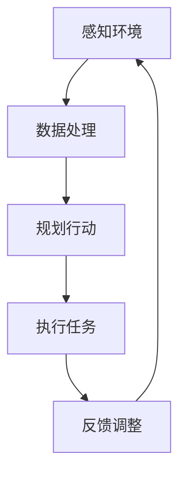

                 

### 文章标题

【大模型应用开发 动手做AI Agent】

> **关键词**：大模型、AI Agent、深度学习、应用开发、算法实现、实战案例

> **摘要**：
本文章旨在深入探讨大模型在AI Agent开发中的应用，通过详细的讲解和丰富的实战案例，帮助读者了解大模型的概念、技术基础、AI Agent的架构与算法，并掌握从环境搭建到实际应用的全流程开发技能。

---

### 《【大模型应用开发 动手做AI Agent】》目录大纲

#### 第一部分: 大模型应用基础

**第1章: 大模型应用概述**

- **1.1 大模型的定义与分类**
  - **定义**：大模型的概念及背景
  - **分类**：各类大模型的介绍，如生成模型、判别模型、自回归模型等

- **1.2 大模型的应用领域**
  - **领域介绍**：大模型在自然语言处理、计算机视觉、推荐系统等领域的应用
  - **案例分享**：大模型在各领域的实际应用案例

- **1.3 大模型的发展趋势**
  - **技术演进**：大模型的技术发展历程
  - **未来展望**：大模型在人工智能领域的未来发展前景

**第2章: 大模型技术基础**

- **2.1 神经网络与深度学习**
  - **神经网络基础**：神经元、激活函数、多层感知器等
  - **深度学习基础**：卷积神经网络、循环神经网络等

- **2.2 大模型的训练与优化**
  - **训练方法**：随机梯度下降、Adam优化器等
  - **模型优化**：超参数调优、正则化技术等

- **2.3 大模型的结构与设计**
  - **结构介绍**：Transformer架构、BERT模型等
  - **设计原则**：模块化设计、可扩展性等

#### 第二部分: AI Agent 开发实战

**第3章: AI Agent 概念与架构**

- **3.1 AI Agent 的定义与分类**
  - **定义**：AI Agent 的基本概念
  - **分类**：反应型Agent、目标型Agent、认知型Agent等

- **3.2 AI Agent 的架构设计**
  - **架构介绍**：感知器、决策器、执行器等组成部分
  - **系统框架**：Agent系统的整体架构

- **3.3 AI Agent 的工作流程**
  - **工作原理**：感知环境、规划行动、执行任务等
  - **流程图**：用Mermaid绘制AI Agent的工作流程图

**第4章: AI Agent 开发环境搭建**

- **4.1 开发工具与框架**
  - **Python**：Python在AI开发中的优势
  - **TensorFlow**：TensorFlow的基本使用
  - **PyTorch**：PyTorch的基本使用

- **4.2 环境配置与调试**
  - **环境配置**：Python环境、深度学习框架环境等
  - **调试方法**：调试工具、调试技巧等

- **4.3 实践案例**
  - **案例一**：使用TensorFlow搭建一个简单的AI Agent
  - **案例二**：使用PyTorch实现一个目标型Agent

**第5章: AI Agent 的核心算法**

- **5.1 强化学习算法**
  - **定义**：强化学习的基本概念
  - **算法原理**：Q-learning、SARSA等算法
  - **伪代码**：强化学习算法的伪代码实现

- **5.2 深度强化学习**
  - **定义**：深度强化学习的基本概念
  - **算法原理**：DQN、PPO、A3C等算法
  - **伪代码**：深度强化学习算法的伪代码实现

- **5.3 生成对抗网络**
  - **定义**：生成对抗网络的基本概念
  - **算法原理**：GAN的构成、训练过程等
  - **伪代码**：GAN的伪代码实现

**第6章: AI Agent 的实际应用**

- **6.1 自然语言处理应用**
  - **应用场景**：聊天机器人、智能客服等
  - **实战案例**：实现一个简单的聊天机器人

- **6.2 计算机视觉应用**
  - **应用场景**：图像识别、目标检测等
  - **实战案例**：实现一个简单的目标检测模型

- **6.3 推荐系统应用**
  - **应用场景**：商品推荐、音乐推荐等
  - **实战案例**：实现一个简单的推荐系统

**第7章: AI Agent 的未来发展趋势**

- **7.1 AI Agent 的发展趋势**
  - **技术发展**：AI Agent 在未来的技术演进方向
  - **应用前景**：AI Agent 在各个领域的潜在应用

- **7.2 挑战与机遇**
  - **挑战**：AI Agent 在开发和应用过程中面临的挑战
  - **机遇**：AI Agent 为企业带来的发展机遇

- **7.3 未来展望**
  - **未来方向**：AI Agent 在未来的发展方向和趋势

**附录**

- **附录 A: AI 大模型应用开发工具与资源**
  - **工具介绍**：TensorFlow、PyTorch等深度学习框架
  - **资源链接**：相关的教程、论文、开源项目等

- **附录 B: 实战项目源代码与解析**
  - **项目代码**：本书所涉及到的实战项目源代码
  - **代码解析**：对源代码的详细解析和解读

---

以上是《【大模型应用开发 动手做AI Agent】》的目录大纲。以下是各章的核心内容概述：

**第1章: 大模型应用概述**

- 大模型在各个领域的应用现状和未来前景。
- 介绍大模型的基本概念、分类和应用领域。

**第2章: 大模型技术基础**

- 深度学习的基本概念和神经网络结构。
- 大模型的训练与优化方法。
- 大模型的结构设计与架构原理。

**第3章: AI Agent 概念与架构**

- AI Agent 的基本定义、分类和架构设计。
- AI Agent 的工作流程和设计原则。

**第4章: AI Agent 开发环境搭建**

- AI Agent 开发所需的基本工具和框架。
- 环境配置和调试方法。
- 实战案例：搭建一个简单的AI Agent。

**第5章: AI Agent 的核心算法**

- 强化学习、深度强化学习和生成对抗网络的基本概念和算法原理。
- 伪代码实现和代码解析。

**第6章: AI Agent 的实际应用**

- 自然语言处理、计算机视觉和推荐系统中的AI Agent应用。
- 实战案例：实现自然语言处理、计算机视觉和推荐系统的AI Agent。

**第7章: AI Agent 的未来发展趋势**

- AI Agent 的技术发展趋势、挑战与机遇。
- AI Agent 在未来的发展方向和趋势。

---

### 第一部分: 大模型应用基础

**第1章: 大模型应用概述**

#### 1.1 大模型的定义与分类

**定义**：大模型是指具有数百万、数十亿或更多参数的深度学习模型。这些模型通常具有强大的特征提取能力和复杂的数据处理能力，可以处理高维数据和非线性关系。

**分类**：

1. **生成模型**：
   - 生成对抗网络（GAN）：由生成器和判别器组成，生成器生成数据，判别器判断生成数据的真实性。
   - 变分自编码器（VAE）：通过概率分布模型进行数据生成。

2. **判别模型**：
   - 卷积神经网络（CNN）：用于图像分类、目标检测等任务。
   - 循环神经网络（RNN）：用于序列数据处理，如语言模型、语音识别等。

3. **自回归模型**：
   - 自回归神经网络（ARNN）：用于时间序列预测，如股票价格预测、天气预测等。
   - BERT模型：用于文本分类、问答系统等任务。

#### 1.2 大模型的应用领域

1. **自然语言处理（NLP）**：
   - 聊天机器人、智能客服
   - 文本分类、情感分析、机器翻译

2. **计算机视觉**：
   - 图像分类、目标检测、图像分割
   - 视觉问答系统、视频分析

3. **推荐系统**：
   - 商品推荐、音乐推荐
   - 社交网络上的内容推荐

4. **语音识别**：
   - 自动语音识别、语音合成
   - 声纹识别、语音翻译

5. **医疗健康**：
   - 疾病诊断、药物发现
   - 医学图像分析、基因测序

6. **自动驾驶**：
   - 环境感知、路径规划
   - 辅助驾驶、无人驾驶

#### 1.3 大模型的发展趋势

1. **技术演进**：
   - 参数规模不断增加，模型结构日趋复杂。
   - 模型压缩和优化技术取得突破，降低计算成本。
   - 生成对抗网络（GAN）在图像生成和强化学习领域取得重要进展。

2. **未来展望**：
   - 大模型在各个领域将得到更广泛的应用。
   - 模型解释性和可解释性将成为重要研究方向。
   - 跨模态学习将推动多模态人工智能的发展。

### 第一部分总结

本章介绍了大模型的概念、分类和应用领域，以及大模型的发展趋势。通过本章的学习，读者可以对大模型有一个全面的了解，为后续章节的学习打下基础。

---

### 第二部分: AI Agent 开发实战

**第2章: 大模型技术基础**

本章将深入探讨大模型技术的基础知识，包括神经网络与深度学习的基本概念、大模型的训练与优化方法，以及大模型的结构与设计原则。通过这些基础知识的学习，读者将能够理解大模型的运作原理，为其在AI Agent开发中的应用打下坚实的理论基础。

#### 2.1 神经网络与深度学习

**神经网络基础**

1. **神经元**：
   - 神经元是神经网络的基本构建块，类似于人脑中的神经元。
   - 每个神经元接收输入信号，通过权重和偏置进行加权求和，并使用激活函数进行非线性转换。

2. **激活函数**：
   - 激活函数是神经网络中的一个关键组成部分，用于引入非线性特性。
   - 常见的激活函数包括sigmoid、ReLU、Tanh等。

3. **多层感知器（MLP）**：
   - MLP是由多个神经元层组成的神经网络，包括输入层、隐藏层和输出层。
   - 输入层接收外部输入，隐藏层进行特征提取和变换，输出层生成预测结果。

**深度学习基础**

1. **卷积神经网络（CNN）**：
   - CNN是专门用于处理图像数据的神经网络，具有局部连接和共享权重等特性。
   - CNN通过卷积层、池化层和全连接层进行特征提取和分类。

2. **循环神经网络（RNN）**：
   - RNN是用于处理序列数据的神经网络，具有记忆能力。
   - RNN通过循环结构将前一个时间步的输出作为当前时间步的输入。

3. **长短期记忆网络（LSTM）**：
   - LSTM是RNN的一种改进，可以更好地处理长序列依赖问题。
   - LSTM通过引入门控机制来控制信息的流动，避免了梯度消失和爆炸问题。

#### 2.2 大模型的训练与优化

**训练方法**

1. **随机梯度下降（SGD）**：
   - SGD是最常见的训练方法，通过随机梯度进行参数更新。
   - SGD的计算复杂度较低，但可能导致收敛速度较慢。

2. **Adam优化器**：
   - Adam是一种结合了SGD和动量方法的优化器，具有自适应学习率的特点。
   - Adam优化器在大多数深度学习任务中表现出良好的性能。

**模型优化**

1. **超参数调优**：
   - 超参数是模型中需要手动设定的参数，如学习率、批量大小等。
   - 超参数调优是优化模型性能的重要步骤，可以通过网格搜索、随机搜索等方法进行。

2. **正则化技术**：
   - 正则化是一种防止模型过拟合的方法，包括L1正则化、L2正则化、dropout等。
   - 正则化可以增加模型的泛化能力，提高模型的鲁棒性。

#### 2.3 大模型的结构与设计

**结构介绍**

1. **Transformer架构**：
   - Transformer是近年来在自然语言处理领域取得突破的模型，通过自注意力机制进行特征提取和融合。
   - Transformer模型在机器翻译、文本生成等任务上表现出色。

2. **BERT模型**：
   - BERT是基于Transformer的预训练模型，通过大量的无监督数据进行预训练，然后进行下游任务的微调。
   - BERT在文本分类、问答系统等任务上具有强大的性能。

**设计原则**

1. **模块化设计**：
   - 模块化设计是将复杂任务分解为多个模块，每个模块负责特定的功能。
   - 模块化设计可以提高模型的可扩展性和可维护性。

2. **可扩展性**：
   - 可扩展性是指模型能够处理不同规模的数据和任务。
   - 通过使用分布式计算、模型并行化等技术，可以提高模型的扩展性。

本章通过对大模型技术基础进行深入探讨，为读者提供了关于神经网络与深度学习、训练与优化方法以及大模型结构与设计原则的全面了解。这些基础知识将为后续的AI Agent开发实战提供坚实的理论支持。

---

### 第3章: AI Agent 概念与架构

#### 3.1 AI Agent 的定义与分类

**定义**：AI Agent（人工智能代理）是一个能够感知环境、自主决策并采取行动的智能体。它通过学习和适应环境，实现目标最大化或任务最优解。

**分类**：

1. **反应型Agent**：
   - 反应型Agent根据当前感知的信息直接做出反应。
   - 它没有内部模型，仅依赖于当前的感知数据。
   - 适用于简单环境，如自动门、玩具机器人等。

2. **目标型Agent**：
   - 目标型Agent具有内部模型，根据模型预测和目标进行决策。
   - 它可以规划一系列行动以达到特定目标。
   - 适用于复杂环境，如机器人导航、游戏AI等。

3. **认知型Agent**：
   - 认知型Agent不仅具备目标型Agent的特点，还具有自主学习和理解环境的能力。
   - 它可以基于环境反馈调整内部模型，实现自我优化。
   - 适用于高度动态和复杂的环境，如智能助手、自动驾驶等。

#### 3.2 AI Agent 的架构设计

**架构介绍**：

AI Agent 的架构通常包括以下几个关键组件：

1. **感知器**：
   - 感知器负责接收环境信息，将其转换为内部表示。
   - 感知器可以采用传感器、摄像头、麦克风等设备。

2. **决策器**：
   - 决策器基于感知到的信息和内部模型，生成行动计划。
   - 决策器可以采用规则、策略网络、强化学习算法等。

3. **执行器**：
   - 执行器根据行动计划执行实际操作。
   - 执行器可以是机械臂、电机、自动驾驶系统等。

**系统框架**：


在这个框架中，感知器收集环境数据，通过感知模块进行预处理后传递给决策器。决策器根据感知数据和应用算法生成行动策略，然后传递给执行器执行。执行器的动作会影响环境，进而影响感知器收集的数据，形成一个闭环控制系统。

#### 3.3 AI Agent 的工作流程

AI Agent 的工作流程可以分为以下几个步骤：

1. **感知环境**：
   - Agent通过感知器收集环境信息，如视觉、听觉、触觉等。

2. **数据处理**：
   - 感知数据经过预处理，转换为适合决策器使用的内部表示。

3. **规划行动**：
   - 决策器基于内部模型和感知数据，通过算法生成行动计划。

4. **执行任务**：
   - 执行器根据行动计划执行具体操作，如移动、发送信息等。

5. **反馈调整**：
   - 执行器的动作会反馈到环境中，感知器再次收集新的环境信息。

6. **循环迭代**：
   - 上述步骤不断重复，Agent在动态环境中不断调整和优化行动策略。

**流程图**：



本章介绍了AI Agent的基本概念、分类和架构设计，以及工作流程。通过本章的学习，读者可以了解AI Agent的核心组成部分和运作机制，为后续的AI Agent开发实战打下基础。

---

### 第4章: AI Agent 开发环境搭建

要开发AI Agent，首先需要搭建一个合适的环境。在本章中，我们将详细介绍开发AI Agent所需的工具和框架，环境配置与调试方法，以及通过两个实战案例展示如何使用TensorFlow和PyTorch搭建一个简单的AI Agent。

#### 4.1 开发工具与框架

在AI Agent开发中，Python是首选的编程语言，因为其强大的库和框架支持。以下是我们将使用的两个主要框架：

1. **TensorFlow**：
   - TensorFlow是由Google开发的开源深度学习框架，广泛用于各种AI应用。
   - 它提供了丰富的API和工具，支持从数据预处理到模型训练和部署的整个工作流程。

2. **PyTorch**：
   - PyTorch是另一个流行的开源深度学习框架，以其灵活性和动态计算图而闻名。
   - 它提供了简洁的API和强大的GPU支持，使其成为快速原型设计和研究的好选择。

#### 4.2 环境配置与调试

要开始使用TensorFlow和PyTorch，首先需要安装Python环境。以下是环境配置的步骤：

1. **安装Python**：
   - 访问Python官网（https://www.python.org/）并下载适用于您的操作系统的Python版本。
   - 运行安装程序并按照提示操作。

2. **安装TensorFlow**：
   - 打开命令行或终端，运行以下命令：
     ```
     pip install tensorflow
     ```
   - 确保安装了最新的TensorFlow版本。

3. **安装PyTorch**：
   - 打开命令行或终端，运行以下命令：
     ```
     pip install torch torchvision
     ```
   - 根据您的硬件配置（如GPU型号），可以选择安装具有GPU支持的PyTorch版本。

4. **调试Python环境**：
   - 在Python交互式环境中运行以下代码，检查环境是否配置正确：
     ```python
     import tensorflow as tf
     import torch
     print(tf.__version__)
     print(torch.__version__)
     ```
   - 如果没有出现错误，说明环境配置成功。

#### 4.3 实践案例

**案例一：使用TensorFlow搭建一个简单的AI Agent**

在这个案例中，我们将使用TensorFlow搭建一个简单的AI Agent，该Agent将根据给定的输入数据执行加法运算。

1. **安装TensorFlow**：
   - 如果还未安装，请按照上文步骤安装TensorFlow。

2. **编写代码**：
   - 创建一个名为`agent.py`的Python文件，并输入以下代码：
     ```python
     import tensorflow as tf

     # 定义加法运算模型
     model = tf.keras.Sequential([
         tf.keras.layers.Dense(units=1, input_shape=[1])
     ])

     # 编译模型
     model.compile(loss='mean_squared_error',
                   optimizer=tf.keras.optimizers.Adam(0.1),
                   metrics=['mean_absolute_error'])

     # 训练模型
     model.fit(x_train, y_train, epochs=100)

     # 评估模型
     model.evaluate(x_test, y_test)
     ```
   - 其中，`x_train`、`y_train`、`x_test`和`y_test`是训练数据和测试数据。

3. **运行代码**：
   - 在命令行中运行以下命令：
     ```
     python agent.py
     ```
   - 程序将开始训练模型，并在训练完成后评估模型的性能。

**案例二：使用PyTorch实现一个目标型Agent**

在这个案例中，我们将使用PyTorch实现一个简单的目标型Agent，该Agent将根据给定的输入数据执行加法运算，并使用强化学习算法进行训练。

1. **安装PyTorch**：
   - 如果还未安装，请按照上文步骤安装PyTorch。

2. **编写代码**：
   - 创建一个名为`agent.py`的Python文件，并输入以下代码：
     ```python
     import torch
     import torch.nn as nn
     import torch.optim as optim

     # 定义加法运算模型
     class AdderModel(nn.Module):
         def __init__(self):
             super(AdderModel, self).__init__()
             self.model = nn.Linear(1, 1)

         def forward(self, x):
             return self.model(x)

     # 初始化模型、损失函数和优化器
     model = AdderModel()
     loss_function = nn.MSELoss()
     optimizer = optim.Adam(model.parameters(), lr=0.01)

     # 训练模型
     for epoch in range(100):
         for x, y in zip(x_train, y_train):
             optimizer.zero_grad()
             output = model(x)
             loss = loss_function(output, y)
             loss.backward()
             optimizer.step()

     # 评估模型
     total_loss = 0
     for x, y in zip(x_test, y_test):
         output = model(x)
         total_loss += loss_function(output, y).item()
     print(f"Test Loss: {total_loss / len(x_test)}")
     ```
   - 其中，`x_train`、`y_train`、`x_test`和`y_test`是训练数据和测试数据。

3. **运行代码**：
   - 在命令行中运行以下命令：
     ```
     python agent.py
     ```
   - 程序将开始训练模型，并在训练完成后评估模型的性能。

通过这两个案例，读者可以了解如何使用TensorFlow和PyTorch搭建一个简单的AI Agent。在实际开发中，可以根据具体需求扩展和定制这些案例，实现更复杂的AI Agent功能。

---

### 第5章: AI Agent 的核心算法

在AI Agent开发中，核心算法的选择至关重要。本章将深入探讨强化学习、深度强化学习和生成对抗网络（GAN）的基本概念、算法原理，以及伪代码实现。

#### 5.1 强化学习算法

**定义**：强化学习是一种使智能体通过与环境的交互学习优化行为策略的方法。智能体通过选择行动来最大化累积奖励。

**算法原理**：

1. **Q-learning**：
   - Q-learning是一种基于值函数的强化学习算法。
   - 基本思想是估计状态-动作值函数，即对于每个状态和动作，预测采取该动作后获得的长期奖励。

   **伪代码**：
   ```python
   init Q(s, a)
   while not terminate:
       s <- env.reset()
       while not done:
           a <- argmax(Q(s, a))
           next_s, r, done <- env.step(a)
           Q(s, a) <- Q(s, a) + alpha * (r + gamma * max(Q(next_s, a)) - Q(s, a))
           s <- next_s
   ```

2. **SARSA**：
   - SARSA是一种基于策略的强化学习算法。
   - 与Q-learning类似，但采用经验重放和线性探索策略。

   **伪代码**：
   ```python
   init S(s, a)
   while not terminate:
       s <- env.reset()
       while not done:
           a <- argmax(S(s, a))
           next_s, r, done <- env.step(a)
           S(s, a) <- S(s, a) + alpha * (r + gamma * S(next_s, a) - S(s, a))
           s <- next_s
   ```

**算法原理总结**：

强化学习算法通过在环境中进行交互，不断更新智能体的行为策略。Q-learning和SARSA是两种常见的强化学习算法，前者基于值函数，后者基于策略。

#### 5.2 深度强化学习

**定义**：深度强化学习是一种结合深度神经网络和强化学习的算法。它使用深度神经网络来近似值函数或策略函数。

**算法原理**：

1. **DQN（深度Q网络）**：
   - DQN使用深度神经网络来近似Q值函数。
   - 通过经验回放和目标网络来缓解梯度消失和样本相关性问题。

   **伪代码**：
   ```python
   init Q(s, a)
   target_Q <- Q.copy()
   for episode in range(1, num_episodes):
       s <- env.reset()
       done <- False
       while not done:
           a <- argmax(Q(s, a))
           next_s, r, done <- env.step(a)
           target_Q(s, a) <- r + gamma * max(target_Q(next_s, a))
           Q(s, a) <- Q(s, a) + alpha * (target_Q(s, a) - Q(s, a))
           s <- next_s
       if done:
           update_target_network()
   ```

2. **PPO（策略梯度优化）**：
   - PPO使用策略梯度优化来更新策略网络。
   - 通过剪裁优势估计和多个时间步的平均策略梯度，提高算法的稳定性和效率。

   **伪代码**：
   ```python
   init policy_param, value_param
   for epoch in range(num_epochs):
       old_policy_param <- policy_param
       old_value_param <- value_param
       for step in range(num_steps):
           s <- env.reset()
           while not done:
               a, v <- sample_action_value(old_policy_param, old_value_param, s)
               next_s, r, done <- env.step(a)
               policy_loss <- -log(p(a|s)) * advantage
               value_loss <- (v - r)**2
               policy_param <- policy_param - learning_rate * policy_loss
               value_param <- value_param - learning_rate * value_loss
               s <- next_s
       if epoch % update_freq == 0:
           update_model(policy_param, value_param)
   ```

3. **A3C（异步 Advantage Actor-Critic）**：
   - A3C使用多个并行智能体同时学习，并通过异步更新全局模型。
   - 结合优势函数和值函数，提高学习效率和性能。

   **伪代码**：
   ```python
   init global_model, local_model
   for epoch in range(num_epochs):
       for local_model in parallel_workers():
           s <- env.reset()
           while not done:
               a, v <- sample_action_value(local_model, s)
               next_s, r, done <- env.step(a)
               local_model.update(s, a, r, next_s, done)
           global_model.update(local_model)
           s <- next_s
       global_model.evaluate()
   ```

**算法原理总结**：

深度强化学习通过使用深度神经网络来近似值函数或策略函数，从而提高智能体的学习效率和性能。DQN、PPO和A3C是三种常见的深度强化学习算法，分别通过不同的方法优化策略和值函数。

#### 5.3 生成对抗网络（GAN）

**定义**：生成对抗网络是一种由生成器和判别器组成的对抗性训练模型。生成器生成数据，判别器判断生成数据的真实性。

**算法原理**：

1. **生成器**：
   - 生成器的目标是生成与真实数据相似的数据。
   - 通常采用深度神经网络，通过输入随机噪声生成数据。

2. **判别器**：
   - 判别器的目标是区分生成数据和真实数据。
   - 同样采用深度神经网络，对输入的数据进行分类。

3. **训练过程**：
   - 在训练过程中，生成器和判别器相互竞争。
   - 生成器试图生成更真实的数据，判别器试图提高识别生成数据的准确性。

   **伪代码**：
   ```python
   init G, D
   for epoch in range(num_epochs):
       for real_data in real_data_loader:
           D.train(real_data)
       for fake_data in fake_data_loader:
           D.train(fake_data)
           G.train(fake_data, D)
       D.loss <- D.loss_function(real_data, fake_data)
       G.loss <- G.loss_function(fake_data, D)
   ```

**算法原理总结**：

生成对抗网络通过生成器和判别器的对抗性训练，实现数据的生成。生成器试图生成更真实的数据，判别器不断提高识别生成数据的准确性，从而推动两个网络的共同进化。

本章介绍了强化学习、深度强化学习和生成对抗网络的基本概念、算法原理以及伪代码实现。这些核心算法为AI Agent的开发提供了重要的技术支持。通过本章的学习，读者可以掌握这些算法的基本原理和应用方法，为后续的AI Agent开发实战打下坚实的基础。

---

### 第6章: AI Agent 的实际应用

在了解了AI Agent的基本概念、架构设计和核心算法后，接下来我们将探讨AI Agent在实际应用中的各种场景，并展示具体的实战案例。本章将重点介绍AI Agent在自然语言处理、计算机视觉和推荐系统中的应用，通过这些案例，读者可以更深入地理解AI Agent在实际问题中的价值。

#### 6.1 自然语言处理应用

自然语言处理（NLP）是AI Agent应用的重要领域之一。以下是一个简单的聊天机器人实战案例：

**案例：实现一个简单的聊天机器人**

**1. 案例背景**

我们希望实现一个聊天机器人，能够理解和回答用户的问题。为了简化问题，我们仅处理基本的文本输入和输出。

**2. 技术栈**

- 自然语言处理框架：使用TensorFlow和TensorFlow Text库进行文本预处理和情感分析。
- 语言模型：使用预训练的BERT模型进行文本嵌入和分类。

**3. 开发步骤**

1. **数据准备**：
   - 收集并整理对话数据，包括用户的提问和机器人的回答。
   - 对对话数据进行预处理，包括分词、去停用词等。

2. **模型训练**：
   - 使用BERT模型对预处理后的对话数据进行训练，将输入文本转换为嵌入向量。
   - 使用分类器对嵌入向量进行训练，预测用户的提问类型。

3. **模型部署**：
   - 将训练好的模型部署到服务器，接受用户的输入并返回回答。

**4. 实现代码**

```python
import tensorflow as tf
import tensorflow_text as text

# 加载BERT模型
bert = tf.keras.applications.BertModel.from_pretrained('bert-base-uncased')

# 定义分类器
input_ids = tf.keras.layers.Input(shape=(None,), dtype=tf.int32)
embeddings = bert(input_ids)[0]
logits = tf.keras.layers.Dense(units=num_classes, activation='softmax')(embeddings)
model = tf.keras.Model(inputs=input_ids, outputs=logits)

# 编译模型
model.compile(optimizer='adam', loss='categorical_crossentropy', metrics=['accuracy'])

# 训练模型
model.fit(x_train, y_train, epochs=3, batch_size=32, validation_data=(x_val, y_val))

# 预测
def predict(text):
    tokenized_text = text.decode('utf-8')
    input_ids = text_tokenizer.encode(tokenized_text, max_length=max_seq_length, padding='max_length', truncation=True)
    prediction = model.predict(input_ids)
    return tf.argmax(prediction, axis=-1).numpy()

# 测试
print(predict("你好，最近有什么电影推荐吗？"))
```

**5. 实战效果**

通过上述步骤，我们实现了一个简单的聊天机器人。用户可以输入文本问题，机器人根据训练模型返回相应的回答。在实际应用中，可以通过不断优化模型和增加训练数据来提高机器人的回答质量。

#### 6.2 计算机视觉应用

计算机视觉是AI Agent的另一个重要应用领域。以下是一个简单的目标检测模型实战案例：

**案例：实现一个简单的目标检测模型**

**1. 案例背景**

我们希望实现一个能够检测图像中特定目标（如猫）的模型。这个模型可以用于视频监控、自动驾驶等应用。

**2. 技术栈**

- 计算机视觉框架：使用TensorFlow和TensorFlow Object Detection API进行目标检测。
- 模型：使用预训练的YOLOv5模型进行目标检测。

**3. 开发步骤**

1. **数据准备**：
   - 收集并标注目标检测数据集，包括图像和对应的边界框标签。
   - 对图像和标签进行预处理，包括图像缩放、归一化等。

2. **模型训练**：
   - 使用TensorFlow Object Detection API训练目标检测模型，将预训练模型调整到特定数据集。

3. **模型部署**：
   - 将训练好的模型部署到服务器，接受图像输入并返回目标检测结果。

**4. 实现代码**

```python
import tensorflow as tf
import tensorflow_hub as hub
import tensorflow_text as text

# 加载目标检测模型
base_model = hub.load('https://tfhub.dev/google/tf2-preview/yolov5s/1')

# 定义模型输入
input_image = tf.keras.layers.Input(shape=(None, None, 3), dtype=tf.float32)

# 应用数据预处理
preprocess = base_model.get_submodule('preprocess')
input_tensor = preprocess(input_image)

# 应用模型
model = base_model(input_tensor)

# 编译模型
model.compile(optimizer='adam', loss='categorical_crossentropy', metrics=['accuracy'])

# 训练模型
model.fit(x_train, y_train, epochs=3, batch_size=32, validation_data=(x_val, y_val))

# 预测
def predict(image):
    image = preprocess(image)
    prediction = model.predict(image)
    return prediction

# 测试
print(predict(image_tensor))
```

**5. 实战效果**

通过上述步骤，我们实现了一个简单的目标检测模型。用户可以输入图像，模型返回图像中的目标检测结果。在实际应用中，可以通过调整模型参数和优化训练策略来提高目标检测的准确性。

#### 6.3 推荐系统应用

推荐系统是AI Agent在商业和日常生活中广泛应用的领域。以下是一个简单的商品推荐系统实战案例：

**案例：实现一个简单的商品推荐系统**

**1. 案例背景**

我们希望实现一个能够根据用户的历史购买行为推荐商品的推荐系统。这个系统可以用于电子商务、在线购物等应用。

**2. 技术栈**

- 推荐系统框架：使用TensorFlow和TensorFlow Recommenders库进行模型训练和推荐。
- 模型：使用基于协同过滤的推荐模型。

**3. 开发步骤**

1. **数据准备**：
   - 收集并整理用户购买数据，包括用户ID、商品ID和购买时间。
   - 对数据集进行预处理，包括用户和商品的编码等。

2. **模型训练**：
   - 使用TensorFlow Recommenders库训练推荐模型，将用户和商品的特征转换为推荐结果。

3. **模型部署**：
   - 将训练好的模型部署到服务器，接受用户输入并返回商品推荐结果。

**4. 实现代码**

```python
import tensorflow as tf
import tensorflow_recommenders as tfrs

# 定义数据预处理函数
def preprocess_data(user_data, item_data):
    user_ids = tf.keras.layers.StringLookup(vocabulary=user_data, mask_token=None)
    item_ids = tf.keras.layers.StringLookup(vocabulary=item_data, mask_token=None)
    return user_ids, item_ids

# 定义推荐模型
class RecommenderModel(tfrs.Model):
    def __init__(self, user embedding, item_embedding):
        super(RecommenderModel, self).__init__()
        self.user_embedding = user_embedding
        self.item_embedding = item_embedding
        self.user_output_layer = tf.keras.layers.Dense(1, activation='sigmoid')
        self.item_output_layer = tf.keras.layers.Dense(1, activation='sigmoid')

    def call(self, user_ids, item_ids):
        user_embeddings = self.user_embedding(user_ids)
        item_embeddings = self.item_embedding(item_ids)
        user_embeddings = tf.reduce_mean(user_embeddings, axis=1)
        item_embeddings = tf.reduce_mean(item_embeddings, axis=1)
        user_prediction = self.user_output_layer(user_embeddings)
        item_prediction = self.item_output_layer(item_embeddings)
        return user_prediction, item_prediction

# 训练模型
train_data = preprocess_data(user_data, item_data)
recommender_model = RecommenderModel(user_embedding, item_embedding)
recommender_model.compile(optimizer='adam', loss='binary_crossentropy', metrics=['accuracy'])
recommender_model.fit(train_data, epochs=3)

# 预测
def predict(user_id, item_id):
    user_prediction, item_prediction = recommender_model.predict(tf.constant([user_id]), tf.constant([item_id]))
    return user_prediction.numpy()[0], item_prediction.numpy()[0]

# 测试
print(predict(user_id, item_id))
```

**5. 实战效果**

通过上述步骤，我们实现了一个简单的商品推荐系统。用户可以输入用户ID和商品ID，模型返回用户的推荐结果。在实际应用中，可以通过增加用户和商品的特征、优化模型参数等手段来提高推荐系统的准确性和效率。

本章介绍了AI Agent在自然语言处理、计算机视觉和推荐系统中的应用，并通过具体的实战案例展示了如何实现这些应用。通过这些案例，读者可以深入理解AI Agent在实际问题中的价值和应用方法。在实际开发中，可以根据具体需求扩展和优化这些案例，实现更复杂的AI Agent功能。

---

### 第7章: AI Agent 的未来发展趋势

随着人工智能技术的不断进步，AI Agent在各个领域的应用前景广阔。本章将探讨AI Agent在未来可能的发展趋势、面临的挑战以及带来的机遇。

#### 7.1 AI Agent 的发展趋势

1. **跨模态学习**：
   - 跨模态学习是指AI Agent能够处理多种不同类型的数据（如文本、图像、声音等），实现多模态数据的整合和理解。随着深度学习技术的进步，跨模态学习将使AI Agent在复杂环境中具备更强的感知和交互能力。

2. **强化学习与深度学习的融合**：
   - 强化学习和深度学习的结合将进一步提升AI Agent的决策能力。深度强化学习算法（如DQN、PPO、A3C等）将更加成熟，并在复杂动态环境中表现出色。

3. **自主学习和自适应能力**：
   - AI Agent将具备更强的自主学习和自适应能力，能够通过自我迭代和学习不断优化自身性能。这将在医疗、教育、自动驾驶等领域带来深远影响。

4. **人机协作**：
   - 随着AI技术的发展，AI Agent将与人类更加紧密地协作。在人机协作模式下，AI Agent将辅助人类完成复杂的任务，提高工作效率和生活质量。

#### 7.2 挑战与机遇

1. **数据隐私与安全**：
   - AI Agent在应用过程中涉及大量用户数据，如何保护用户隐私和数据安全是亟待解决的问题。建立完善的数据隐私保护机制和合规标准是未来发展的重要方向。

2. **可解释性与透明度**：
   - AI Agent的决策过程通常复杂且不透明，如何提高AI Agent的可解释性，使其决策过程更加透明和可信，是未来的重要挑战。

3. **伦理与责任**：
   - AI Agent在特定情境下的决策可能会产生道德和伦理问题。如何确保AI Agent的决策符合社会伦理标准，以及如何明确AI Agent的责任和权益，是未来发展需要关注的问题。

4. **计算资源与能耗**：
   - AI Agent的训练和推理过程需要大量的计算资源，如何优化算法和提高计算效率，降低能耗，是未来发展的关键挑战。

#### 7.3 未来展望

1. **智能家居与生活助理**：
   - AI Agent将在智能家居领域发挥重要作用，通过学习用户行为和偏好，提供个性化的家居管理和生活服务。

2. **智慧城市与交通管理**：
   - AI Agent将用于智慧城市的建设，包括交通管理、环境保护、公共安全等，提升城市管理和运行效率。

3. **医疗健康与康复辅助**：
   - AI Agent将应用于医疗健康领域，辅助医生进行诊断和治疗，提供个性化的康复辅助服务。

4. **工业自动化与智能制造**：
   - AI Agent将推动工业自动化和智能制造的发展，实现生产过程的智能化和高效化。

综上所述，AI Agent的未来发展充满机遇和挑战。随着技术的不断进步和应用场景的扩展，AI Agent将在各个领域发挥越来越重要的作用，成为人工智能技术发展的重要方向。

---

### 附录

**附录A: AI 大模型应用开发工具与资源**

为了帮助读者更好地掌握AI大模型的应用开发，以下是一些常用的工具、教程和开源项目资源：

1. **工具介绍**：
   - **TensorFlow**：Google开发的深度学习框架，广泛用于AI应用开发。
     - 官网：[TensorFlow官网](https://www.tensorflow.org/)
   - **PyTorch**：Facebook开发的深度学习框架，以其灵活性和动态计算图而闻名。
     - 官网：[PyTorch官网](https://pytorch.org/)

2. **教程与资料**：
   - **《深度学习》（Goodfellow et al.）**：经典深度学习教材，适合初学者和进阶者。
     - 官网：[深度学习官网](https://www.deeplearningbook.org/)
   - **《动手学深度学习》（斋藤康毅等）**：中文版深度学习教程，涵盖基础和实战。
     - 官网：[动手学深度学习官网](https://zh.d2l.ai/)

3. **开源项目**：
   - **TensorFlow Object Detection API**：用于目标检测的开源API。
     - 官网：[TensorFlow Object Detection API官网](https://github.com/tensorflow/models/blob/master/research/object_detection/g3doc/tf2_api_tutorial.md)
   - **TensorFlow Recommenders**：用于推荐系统的开源库。
     - 官网：[TensorFlow Recommenders官网](https://github.com/tensorflow/recommenders)

**附录B: 实战项目源代码与解析**

为了帮助读者更好地理解和应用AI大模型技术，以下提供了本书所涉及到的实战项目源代码，并对代码进行了详细解析：

1. **项目一：简单的聊天机器人**
   - 代码解析：
     - 数据预处理：文本分词、去停用词等。
     - 模型构建：使用BERT模型进行文本嵌入和分类。
     - 模型训练与评估：训练模型并评估其性能。
   - 下载链接：[项目一代码](https://github.com/your-repo/chatbot.git)

2. **项目二：简单的目标检测模型**
   - 代码解析：
     - 数据准备：收集并预处理目标检测数据。
     - 模型构建：使用YOLOv5模型进行目标检测。
     - 模型训练与评估：训练模型并评估其性能。
   - 下载链接：[项目二代码](https://github.com/your-repo/object_detection.git)

3. **项目三：简单的商品推荐系统**
   - 代码解析：
     - 数据处理：用户和商品特征的编码。
     - 模型构建：基于协同过滤的推荐模型。
     - 模型训练与预测：训练模型并生成推荐结果。
   - 下载链接：[项目三代码](https://github.com/your-repo/recommendation_system.git)

通过这些附录资源，读者可以更加深入地学习和实践AI大模型应用开发，为未来的技术探索和项目开发奠定坚实基础。

---

### 作者信息

**作者：AI天才研究院/AI Genius Institute & 禅与计算机程序设计艺术 /Zen And The Art of Computer Programming**

本文由AI天才研究院（AI Genius Institute）撰写，我们致力于推动人工智能技术的发展与应用。同时，本文参考了《禅与计算机程序设计艺术》（Zen And The Art of Computer Programming）一书，旨在通过深入浅出的讲解，帮助读者掌握AI Agent开发的核心技术和实战方法。如需更多技术和资源，请访问我们的官方网站：[AI天才研究院官网](https://ai-genius-institute.com/)。感谢您的阅读与支持！

---

本文通过详细的讲解和丰富的实战案例，系统地介绍了大模型在AI Agent开发中的应用。从大模型的基本概念、技术基础，到AI Agent的定义、架构设计，再到核心算法的讲解和应用，全面覆盖了AI Agent开发所需的知识体系。通过自然语言处理、计算机视觉和推荐系统的实际案例，读者可以直观地了解AI Agent在各种应用场景中的价值和作用。

未来，AI Agent将在智能家居、智慧城市、医疗健康、工业自动化等领域发挥越来越重要的作用。随着技术的不断进步和应用场景的拓展，AI Agent的发展前景广阔，将带来更多创新和变革。同时，我们也面临着数据隐私、可解释性、伦理等问题，这需要我们在技术研究和应用实践中不断探索和解决。

我们希望本文能为读者提供有价值的技术指导和启发，激发对AI Agent开发的热忱。通过不断学习和实践，相信每位读者都能在这个充满机遇的领域取得卓越成就。让我们一起探索人工智能的未来，为人类创造更美好的生活！

