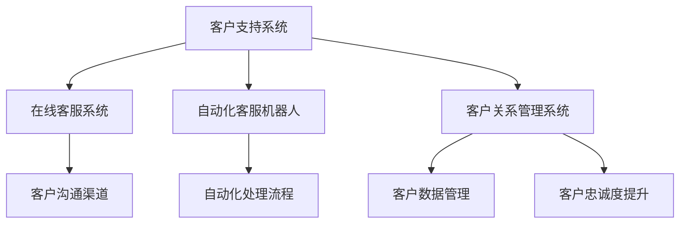

                 

### 《一人公司如何建立有效的客户支持系统》

> **关键词**：一人公司、客户支持系统、技术支持、流程设计、成功案例分析

> **摘要**：本文旨在为一人公司提供建立有效客户支持系统的策略和方法。通过分析一人公司的特点与挑战，介绍客户支持系统的基本概念和组成部分，讨论客户支持策略和技术支持手段，并提供成功案例分析。希望本文能为读者在建立高效客户支持系统方面提供有益的启示。

---

### 《一人公司如何建立有效的客户支持系统》目录大纲

#### 第一部分：背景介绍与核心概念

- **第1章：一人公司的现状与挑战**
  - **1.1 一人公司的特点与优势**
  - **1.2 一人公司面临的客户支持挑战**
  - **1.3 客户支持的重要性

- **第2章：客户支持系统的基本概念**
  - **2.1 客户支持系统的定义与目标**
  - **2.2 客户支持系统的组成部分**
  - **2.3 客户支持系统的分类与选择

#### 第二部分：客户支持策略

- **第3章：客户支持流程设计**
  - **3.1 客户支持流程概述**
  - **3.2 客户信息收集与管理**
  - **3.3 客户问题诊断与解决方案**
  - **3.4 客户反馈机制

- **第4章：客户服务技能提升**
  - **4.1 客户服务人员的角色与职责**
  - **4.2 客户服务技巧与沟通艺术**
  - **4.3 客户服务团队协作与优化

- **第5章：客户关系管理策略**
  - **5.1 客户关系管理的定义与目标**
  - **5.2 客户生命周期管理**
  - **5.3 客户忠诚度提升策略**
  - **5.4 客户数据分析与应用

#### 第三部分：技术支持

- **第6章：客户支持系统的技术基础**
  - **6.1 客户支持系统架构设计**
  - **6.2 客户支持系统技术选型**
  - **6.3 客户支持系统的安全性考虑**
  - **6.4 客户支持系统的可扩展性

- **第7章：常见的技术支持手段**
  - **7.1 在线客服系统**
  - **7.2 自动化客服机器人**
  - **7.3 社交媒体客服**
  - **7.4 移动应用客服

- **第8章：技术支持的实际操作**
  - **8.1 技术支持流程的自动化**
  - **8.2 技术支持团队的管理与优化**
  - **8.3 技术支持案例分享与经验总结

#### 第四部分：成功案例分析

- **第9章：成功案例介绍**
  - **9.1 案例一：XX公司客户支持系统的建设与优化**
  - **9.2 案例二：YY公司如何通过技术手段提升客户支持效率**
  - **9.3 案例三：ZZ公司客户关系管理策略与实践

- **第10章：总结与展望**
  - **10.1 客户支持系统建设的经验与教训**
  - **10.2 未来客户支持系统的发展趋势**
  - **10.3 一人公司如何应对客户支持挑战

#### 附录

- **附录：客户支持系统开发工具与资源**
  - **A.1 常用客户支持系统开发工具**
  - **A.2 客户支持系统开发资源推荐**

---

在接下来的内容中，我们将一步一步深入探讨一人公司如何建立有效的客户支持系统，为读者提供实用的策略和丰富的案例。首先，让我们从一人公司的现状与挑战开始，了解这一独特商业模式下的客户支持需求。

---

### 第一部分：背景介绍与核心概念

#### 第1章：一人公司的现状与挑战

**1.1 一人公司的特点与优势**

一人公司，顾名思义，是指由单一个人或少数几个人组成的公司。这种商业模式具有许多独特的特点，首先也是最显著的，便是其规模小、运营灵活。由于其规模较小，一人公司通常不需要繁琐的内部管理结构，创始人可以亲自参与公司的各个方面，从研发、销售到客户支持，无所不包。这种高度的个人化管理有助于快速响应市场需求和客户反馈。

另外，一人公司的资金需求相对较低。相比于大型企业，一人公司无需投入大量资金来建设庞大的基础设施，这使得其在初创阶段更具生存能力。一人公司还可以通过远程办公、自由协作等方式，最大限度地降低运营成本，从而提高利润率。

**1.2 一人公司面临的客户支持挑战**

尽管一人公司具备诸多优势，但在客户支持方面却面临不少挑战。首先，由于公司规模较小，一人公司可能无法像大型企业那样提供全方位的客户服务。例如，在处理大规模客户咨询或投诉时，单凭一人之力可能难以应对，这可能导致客户满意度下降。

其次，一人公司的资源有限，尤其是在人力资源方面。这意味着客户支持团队可能只有一人或少数几个人，他们需要同时处理多个任务，包括处理客户请求、解决技术问题以及与客户沟通等。这种高负荷的工作量可能会影响客户支持的效率和响应速度。

**1.3 客户支持的重要性**

尽管面临诸多挑战，客户支持对一人公司的重要性不容忽视。良好的客户支持不仅有助于提高客户满意度，还能增强客户的忠诚度，从而促进业务的持续增长。具体来说，有效的客户支持系统可以带来以下几个方面的好处：

1. **提升客户满意度**：快速、高效地解决客户问题可以大大提高客户的满意度，使他们更愿意继续使用公司的产品或服务。

2. **增加客户忠诚度**：通过提供优质的客户支持，一人公司可以培养出一批忠实的客户群体，这些客户不仅会重复购买，还会向他人推荐公司的产品或服务。

3. **促进业务增长**：满意的客户往往会为公司带来新的业务机会，通过口碑传播，一人公司的客户基础可以得到持续扩展。

4. **降低运营成本**：有效的客户支持系统可以帮助一人公司减少因客户不满意而产生的投诉和退款，从而降低运营成本。

总之，对于一人公司来说，建立有效的客户支持系统是确保业务成功的关键。在接下来的章节中，我们将深入探讨客户支持系统的基本概念和组成部分，帮助读者了解如何设计和实施一个高效的客户支持策略。

---

### 第二部分：客户支持策略

#### 第3章：客户支持流程设计

**3.1 客户支持流程概述**

客户支持流程是确保客户问题得到及时、有效解决的一系列步骤。一个高效的客户支持流程可以帮助一人公司提高客户满意度，减少客户流失率，并提升整体运营效率。以下是客户支持流程的主要步骤：

1. **客户咨询接收**：当客户遇到问题时，他们通常会通过电话、电子邮件、社交媒体或在线聊天等方式寻求帮助。客户支持系统需要能够快速、准确地接收和处理这些咨询。

2. **问题分类与诊断**：在接收到客户咨询后，客户支持团队需要对问题进行分类和初步诊断。这有助于确定问题是否需要高级技术支持或是否可以通过简单的解决方案解决。

3. **解决方案提供**：根据问题的严重性和复杂性，客户支持团队需要提供相应的解决方案。解决方案可以是技术性指导、常见问题的文档链接或直接的故障修复。

4. **跟进与反馈**：在问题得到解决后，客户支持团队需要跟进客户的反馈，确保问题真正得到解决。此外，客户的反馈也可以帮助团队识别流程中的不足，进行持续改进。

5. **记录与报告**：客户支持流程的每个步骤都需要被记录下来，以便于进行数据分析和报告生成。这些数据对于评估客户支持系统的效率和效果至关重要。

**3.2 客户信息收集与管理**

有效收集和管理客户信息是客户支持流程的关键。以下是收集和管理客户信息的几个要点：

1. **客户资料收集**：在客户首次咨询时，客户支持团队应收集客户的基本信息，如姓名、联系方式、产品使用情况等。这些信息有助于快速识别客户并为其提供个性化的支持。

2. **历史记录跟踪**：客户支持系统应能够跟踪每个客户的历史咨询记录，包括问题类型、解决方案、客户反馈等。这有助于团队了解客户的使用习惯和偏好，从而提供更有针对性的支持。

3. **自动化工具应用**：通过自动化工具（如CRM系统），客户支持团队能够更高效地收集和管理客户信息。这些工具可以自动记录客户互动，分析客户行为，并为团队提供数据驱动决策支持。

**3.3 客户问题诊断与解决方案**

快速准确地诊断和解决客户问题是客户支持流程的核心。以下是几个关键点：

1. **初步诊断**：在接收到客户咨询后，客户支持团队应首先对问题进行初步诊断。这可以通过了解客户描述、检查日志文件或使用诊断工具完成。

2. **问题分类**：将问题分类有助于团队确定解决方案的资源需求。例如，一些常见问题可能通过文档链接或自助工具即可解决，而复杂问题则需要高级技术支持。

3. **解决方案提供**：根据问题分类和诊断结果，提供相应的解决方案。解决方案可以是直接的故障修复、技术指导或提供替代方案。

4. **跟进与验证**：在解决方案实施后，客户支持团队需要跟进客户，确保问题得到解决。这可以通过电话回访、电子邮件确认或在线聊天完成。

**3.4 客户反馈机制**

有效的客户反馈机制是持续改进客户支持流程的关键。以下是建立客户反馈机制的几个要点：

1. **定期回访**：在问题解决后，客户支持团队应定期进行回访，了解客户对解决方案的满意度，以及是否有其他问题或建议。

2. **满意度调查**：通过满意度调查，客户支持团队能够量化客户满意度，并识别流程中的不足。这些调查可以通过在线问卷、电话访谈或邮件完成。

3. **反馈收集与分析**：客户支持团队应建立反馈收集和分析流程，确保所有反馈都能被及时记录并用于流程改进。

4. **反馈落实与改进**：根据分析结果，团队应制定具体的改进措施，并落实到位。这包括流程优化、员工培训、技术工具升级等。

总之，客户支持流程的设计和优化对于一人公司的成功至关重要。通过合理设计客户支持流程，收集和管理客户信息，快速诊断和解决问题，以及建立有效的客户反馈机制，一人公司可以提供高质量的客户支持，从而提升客户满意度和忠诚度。

---

#### 第4章：客户服务技能提升

**4.1 客户服务人员的角色与职责**

客户服务人员在一人公司中扮演着至关重要的角色。他们不仅是公司与客户之间的桥梁，更是公司的形象代表。以下是客户服务人员的主要角色与职责：

1. **沟通桥梁**：客户服务人员需要具备良好的沟通技巧，能够与客户进行有效沟通，理解客户的需求和问题，并将这些信息准确传达给公司内部团队。

2. **问题解决者**：客户服务人员应能够迅速诊断客户问题，并找到合适的解决方案。他们需要具备扎实的产品知识和解决问题的能力，以确保客户问题得到及时解决。

3. **客户关系维护者**：客户服务人员需要通过提供优质的客户支持，维护和增强客户关系。他们需要了解客户需求，提供个性化服务，从而提高客户满意度和忠诚度。

4. **信息传递者**：客户服务人员需要将客户的反馈和需求传达给公司内部团队，帮助团队改进产品和服务。同时，他们也需要将公司的政策、产品更新和营销活动等信息传达给客户。

**4.2 客户服务技巧与沟通艺术**

客户服务技巧和沟通艺术是客户服务人员必备的能力。以下是一些关键的客户服务技巧：

1. **倾听与理解**：在客户服务中，倾听是至关重要的。客户服务人员需要仔细聆听客户的问题和需求，理解客户的真实意图。通过有效倾听，可以避免误解和沟通障碍，提高解决问题的效率。

2. **同理心**：同理心是客户服务人员的重要品质。他们需要设身处地地理解客户的感受，表现出对客户问题的关心和同情。这有助于建立信任和良好的客户关系。

3. **清晰表达**：客户服务人员需要具备清晰表达的能力，能够用简洁明了的语言解释问题和解决方案。清晰的表达可以帮助客户更好地理解问题，并减少误解。

4. **专业态度**：客户服务人员应始终保持专业态度，无论面对什么样的客户和问题。专业态度不仅体现了公司的形象，也有助于建立客户的信任。

**4.3 客户服务团队协作与优化**

客户服务团队的协作和优化是提高客户支持效率的关键。以下是几个关键点：

1. **团队培训**：定期进行团队培训，提升客户服务人员的专业技能和沟通技巧。这有助于团队更好地应对各种客户问题，提供更高质量的客户支持。

2. **流程优化**：对客户支持流程进行持续优化，减少不必要的步骤和环节，提高处理速度。例如，通过自动化工具简化问题诊断和解决方案提供流程。

3. **资源分配**：合理分配客户服务资源，确保每个客户都能得到及时、有效的支持。在高峰期，可以考虑增加临时客服人员或使用自动化客服机器人分担压力。

4. **反馈机制**：建立有效的反馈机制，收集和分析客户服务过程中的问题和改进建议。通过持续改进，提升客户服务质量和客户满意度。

5. **跨部门协作**：客户服务团队需要与公司内部其他部门（如研发、销售等）紧密协作，确保客户问题得到全面解决。通过跨部门协作，可以提高问题解决效率和客户满意度。

总之，提升客户服务技能和优化团队协作对于一人公司至关重要。通过培养客户服务人员的专业技能、沟通技巧和团队协作能力，一人公司可以提供更加优质的客户支持，从而提升客户满意度和忠诚度，推动业务的持续增长。

---

#### 第5章：客户关系管理策略

**5.1 客户关系管理的定义与目标**

客户关系管理（CRM）是一种商业策略，旨在通过改善与现有客户和潜在客户的关系来提升客户满意度和忠诚度，从而促进业务增长。CRM的核心理念是整合和优化公司内部的客户数据，使其能够更有效地服务于客户。以下是CRM的基本定义和目标：

**定义**：CRM是一种通过技术、策略和过程来管理公司与客户之间互动的系统。它不仅包括客户数据的管理，还包括对客户互动的跟踪、分析和改进。

**目标**：
1. **提升客户满意度**：通过了解和满足客户的需求，提供个性化的服务体验，提高客户满意度。
2. **增强客户忠诚度**：通过持续的客户关怀和有效的客户关系管理，培养客户对公司的忠诚度，减少客户流失。
3. **促进业务增长**：通过提高客户转化率和客户生命周期价值，推动业务的持续增长。
4. **优化资源利用**：通过有效管理客户数据和信息，优化营销和客户服务的资源投入，提高效率。

**5.2 客户生命周期管理**

客户生命周期管理是CRM的核心组成部分，它涵盖了客户从首次接触、购买、使用到离开的整个过程。有效的客户生命周期管理可以帮助公司更好地理解和满足客户需求，从而提升客户满意度和忠诚度。以下是客户生命周期管理的几个关键阶段：

1. **吸引阶段**：在这个阶段，公司需要通过各种营销手段吸引潜在客户。这可能包括广告、推广活动、内容营销等。关键指标包括点击率、访问量、潜在客户转化率等。

2. **转化阶段**：在吸引潜在客户后，公司需要通过销售活动和沟通策略将其转化为实际客户。这可能涉及电话销售、在线演示、客户关怀等。关键指标包括转化率、客户获取成本等。

3. **保留阶段**：在客户购买后，公司需要采取措施来保留客户，防止客户流失。这包括提供优质的客户服务、定期回访、满意度调查等。关键指标包括客户保留率、客户满意度和忠诚度等。

4. **扩展阶段**：在这个阶段，公司需要通过增加销售、提供增值服务等方式来提升客户生命周期价值。这可能包括交叉销售、向上销售、客户升级等。关键指标包括客户生命周期价值、销售额增长率等。

5. **流失阶段**：尽管公司采取了各种措施，但总有一些客户可能会流失。在这个阶段，公司需要分析客户流失的原因，并尝试挽回客户。这可能涉及个性化回访、折扣优惠、专属服务等方式。关键指标包括客户流失率、流失客户挽回率等。

**5.3 客户忠诚度提升策略**

客户忠诚度是指客户对公司的长期信任和持续购买的意愿。提升客户忠诚度是CRM的重要目标之一。以下是几个有效的客户忠诚度提升策略：

1. **个性化服务**：通过CRM系统，公司可以收集和分析客户数据，了解客户的偏好和需求，提供个性化的产品和服务。这可以增强客户的满意度和归属感。

2. **客户关怀**：定期与客户保持沟通，了解他们的需求和反馈，并提供及时的支持和帮助。这可以增强客户的忠诚度和归属感。

3. **客户奖励计划**：通过积分奖励、折扣优惠、礼品赠送等方式，激励客户持续购买。这可以增加客户的忠诚度和回购率。

4. **卓越的客户体验**：提供卓越的客户体验是提升客户忠诚度的关键。这包括快速响应客户请求、解决客户问题、提供优质的售后服务等。

5. **员工激励**：员工是公司为客户提供服务的关键，通过合理的激励和培训，可以提高员工的客户服务意识和能力，从而提升客户忠诚度。

**5.4 客户数据分析与应用**

客户数据分析是CRM的核心环节，通过对客户数据的收集、分析和应用，公司可以更好地了解客户需求，优化营销策略，提升客户满意度。以下是几个关键点：

1. **数据收集**：通过CRM系统，公司可以收集客户的个人信息、购买记录、互动历史等数据。这些数据是进行客户分析的基础。

2. **数据清洗**：确保数据的质量和准确性，进行数据清洗和归一化处理，以便于后续的分析。

3. **数据分析**：使用数据挖掘和统计分析技术，分析客户行为和偏好，识别客户细分市场，预测客户流失和转化。

4. **数据应用**：根据分析结果，制定个性化的营销策略、客户关怀计划和产品改进方案，提升客户满意度和忠诚度。

5. **持续改进**：客户数据分析是一个持续的过程，公司应定期进行数据分析，并根据结果进行策略调整和流程优化。

总之，客户关系管理策略对于一人公司至关重要。通过有效的客户关系管理，一人公司可以提升客户满意度和忠诚度，促进业务增长，并在激烈的市场竞争中脱颖而出。

---

#### 第三部分：技术支持

**第6章：客户支持系统的技术基础**

**6.1 客户支持系统架构设计**

客户支持系统的架构设计是确保系统高效运行和扩展性的关键。以下是设计客户支持系统架构时需要考虑的几个方面：

1. **模块化设计**：客户支持系统应该采用模块化设计，将不同的功能模块（如客户信息管理、问题诊断、解决方案提供等）分开，以便于维护和扩展。

2. **高可用性**：为了保证系统的稳定性和可靠性，客户支持系统应采用高可用性设计，包括数据备份、负载均衡和故障转移等机制。

3. **可扩展性**：系统设计应考虑未来的业务增长和功能扩展需求，确保系统可以轻松添加新模块和功能，而不影响现有系统的性能。

4. **安全性**：客户支持系统需要保护客户数据和隐私，采用安全的存储和传输机制，防止数据泄露和恶意攻击。

5. **用户界面**：用户界面应简洁直观，便于客户快速找到所需信息和支持渠道。

**6.2 客户支持系统技术选型**

在客户支持系统技术选型过程中，需要考虑以下几个方面：

1. **开发语言和框架**：根据项目需求和团队技术栈，选择合适的开发语言和框架。常见的开发语言有Java、Python、JavaScript等，常见的框架有Django、Flask、Spring Boot等。

2. **数据库技术**：根据数据存储和查询需求，选择合适的数据库技术。常用的数据库技术包括关系型数据库（如MySQL、PostgreSQL）和NoSQL数据库（如MongoDB、Redis）。

3. **前端技术**：前端技术应支持快速开发和良好的用户体验。常用的前端技术包括HTML、CSS、JavaScript，常见的框架有React、Vue、Angular等。

4. **后端技术**：后端技术应支持系统的高效运行和扩展。常用的后端技术包括Java、Python、Node.js等，常见的框架有Spring Boot、Django、Express等。

5. **中间件**：中间件用于处理系统的请求和响应，提高系统的性能和可靠性。常见的中间件包括消息队列（如RabbitMQ、Kafka）、缓存（如Redis、Memcached）和负载均衡（如Nginx、HAProxy）。

**6.3 客户支持系统的安全性考虑**

客户支持系统的安全性至关重要，需要从以下几个方面进行考虑：

1. **数据加密**：对客户数据（如个人信息、购买记录等）进行加密存储和传输，防止数据泄露。

2. **认证和授权**：使用安全的认证和授权机制，确保只有授权用户可以访问系统数据和功能。

3. **网络安全**：定期进行安全审计和漏洞扫描，防止网络攻击和数据泄露。

4. **访问控制**：对系统中的数据和行为进行严格的访问控制，确保只有授权用户可以访问敏感数据和操作。

5. **日志记录**：记录系统中的所有操作和事件，以便于进行监控和故障排查。

**6.4 客户支持系统的可扩展性**

客户支持系统的可扩展性对于适应业务增长和功能扩展至关重要。以下是几个实现可扩展性的方法：

1. **水平扩展**：通过增加服务器数量和负载均衡，提高系统的处理能力和吞吐量。

2. **垂直扩展**：通过增加服务器的硬件配置（如增加CPU、内存等），提高系统的性能。

3. **微服务架构**：采用微服务架构，将系统拆分成多个独立的微服务，每个微服务可以独立开发和部署，提高系统的灵活性和可扩展性。

4. **云服务**：利用云服务（如AWS、Azure、阿里云等）提供的弹性计算和存储资源，实现系统的弹性扩展。

通过合理设计客户支持系统架构、选择合适的技术、确保系统的安全性以及实现系统的可扩展性，一人公司可以建立高效、可靠的客户支持系统，为客户的满意度提供坚实保障。

---

#### 第7章：常见的技术支持手段

**7.1 在线客服系统**

在线客服系统是一种通过互联网提供实时客户支持的技术手段。它允许客户通过网站、移动应用或其他数字渠道与客服人员直接交流，快速解决遇到的问题。以下是使用在线客服系统的几个优势：

1. **实时响应**：在线客服系统可以实现即时沟通，减少客户等待时间，提高客户满意度。

2. **多渠道集成**：在线客服系统可以与多种渠道集成，如网站、社交媒体、电子邮件等，为客户提供全方位的支持。

3. **自动化功能**：通过使用聊天机器人，在线客服系统可以自动化处理一些常见问题，减轻客服人员的工作负担。

4. **数据收集与分析**：在线客服系统可以记录客户互动数据，帮助公司了解客户需求和行为，优化客户支持流程。

**7.2 自动化客服机器人**

自动化客服机器人是一种利用人工智能和自然语言处理技术提供客户支持的工具。它可以自动化处理大量常见问题，减轻客服人员的负担，提高客户支持效率。以下是自动化客服机器人的几个应用场景：

1. **常见问题解答**：机器人可以自动回答关于产品使用、服务流程等常见问题，提供即时的解决方案。

2. **预约和预订**：机器人可以帮助客户在线预约服务或预订产品，提高操作便捷性。

3. **智能推荐**：通过分析客户数据，机器人可以提供个性化推荐，提高销售额。

4. **语言翻译**：对于国际客户，机器人可以提供多种语言支持，消除语言障碍。

**7.3 社交媒体客服**

社交媒体客服是一种通过社交媒体平台（如Facebook、Twitter、微信等）提供客户支持的方式。它具有以下几个特点：

1. **实时互动**：社交媒体平台具有实时通讯功能，客服人员可以即时响应客户的问题和反馈。

2. **品牌形象**：通过社交媒体客服，公司可以展示良好的品牌形象，提高客户对品牌的认可度。

3. **多渠道整合**：社交媒体客服可以与公司的其他支持渠道（如在线客服系统、电话热线等）整合，为客户提供全方位的支持。

4. **数据分析**：通过社交媒体客服，公司可以收集和分析客户互动数据，优化客户支持策略。

**7.4 移动应用客服**

移动应用客服是一种通过移动应用提供客户支持的方式。它具有以下几个优势：

1. **便捷性**：移动应用可以随时随地提供客户支持，不受时间和地点限制。

2. **个性化体验**：通过移动应用，公司可以提供个性化的客户支持体验，如推送通知、个性化推荐等。

3. **多媒体支持**：移动应用可以支持多种媒体形式（如图片、视频等），为客户提供更直观的支持。

4. **集成其他功能**：移动应用可以集成其他功能，如订单查询、售后服务等，提高客户体验。

通过使用在线客服系统、自动化客服机器人、社交媒体客服和移动应用客服，一人公司可以提供高效、便捷的客户支持，提高客户满意度和忠诚度。

---

#### 第8章：技术支持的实际操作

**8.1 技术支持流程的自动化**

在技术支持领域，自动化流程是提高效率和质量的关键。以下是实现技术支持流程自动化的几个步骤：

1. **流程识别**：首先，需要识别当前技术支持流程中的手动操作和重复任务，如问题分类、故障诊断、解决方案提供等。

2. **工具选择**：根据流程需求，选择合适的自动化工具，如自动化客服机器人、脚本自动化工具等。

3. **流程设计**：设计自动化流程，包括输入、处理和输出。例如，对于问题分类，可以设计一个基于关键词匹配的自动化流程，将客户咨询自动分类到相应的类别。

4. **测试与优化**：在自动化流程实施前，进行充分的测试，确保其能够准确处理各种情况。在实施后，根据实际运行情况，不断优化和调整自动化流程。

**8.2 技术支持团队的管理与优化**

技术支持团队的管理和优化对于提供高质量的客户支持至关重要。以下是几个关键点：

1. **团队构建**：构建一个多元化、专业化的技术支持团队，包括技术人员、客服人员和产品专家等。

2. **人员培训**：定期对团队成员进行培训，提高他们的技术能力和沟通技巧。特别是新成员加入时，应提供系统的培训计划。

3. **绩效评估**：建立合理的绩效评估体系，包括工作质量、客户满意度、响应速度等指标。根据评估结果，提供反馈和奖励机制。

4. **流程优化**：定期对技术支持流程进行评估和优化，识别瓶颈和改进点。通过流程再造和自动化工具的应用，提高团队效率。

5. **工具配置**：为团队配置合适的工具和资源，如自动化客服系统、CRM系统、知识库等，确保团队成员能够高效工作。

**8.3 技术支持案例分享与经验总结**

以下是几个技术支持的实际案例，以及从中总结的经验：

1. **案例一：自动化故障诊断**：某一人公司开发了一套自动化故障诊断系统，通过分析客户咨询和日志数据，自动识别和定位故障。该系统大大提高了故障诊断的效率和准确性，减少了客服人员的工作量。

2. **案例二：知识库建设**：某一人公司建立了详细的知识库，包括常见问题解答、故障处理流程、技术文档等。客服人员可以快速查阅知识库，为用户提供专业的支持，提高了客户满意度。

3. **案例三：多渠道集成**：某一人公司将在线客服系统、社交媒体客服和移动应用客服进行集成，为客户提供全方位的支持。通过多渠道整合，客户可以方便地选择适合自己的支持方式，提高了客户体验。

4. **经验总结**：
   - 自动化是提高技术支持效率的关键。
   - 知识库建设可以提供专业的支持，提高客户满意度。
   - 多渠道集成可以满足客户的多样化需求，提高客户体验。
   - 团队建设和培训是提供高质量客户支持的基础。

通过技术支持流程的自动化、团队管理和优化以及实际案例的经验总结，一人公司可以提供高效、专业的客户支持，提升客户满意度和忠诚度。

---

#### 第四部分：成功案例分析

**第9章：成功案例介绍**

**9.1 案例一：XX公司客户支持系统的建设与优化**

XX公司是一家专注于云计算服务的一人公司，其客户群体遍布全球。为了提供高效、专业的客户支持，XX公司决定建设一个完善的客户支持系统。以下是案例的具体内容：

**建设背景**：随着公司业务规模的扩大，客户咨询量剧增，传统的手工处理方式已无法满足需求。为了提高客户满意度，XX公司决定投资建设一个集成化的客户支持系统。

**建设过程**：
1. **需求分析**：通过调研和访谈，识别客户需求和痛点，明确系统功能需求。
2. **技术选型**：选择适合的技术栈，包括前端技术（React）、后端技术（Spring Boot）和数据库技术（MySQL）。
3. **系统设计**：设计系统的架构，包括模块化设计、高可用性和安全性考虑。
4. **开发与测试**：进行系统的开发，并进行严格的测试，确保系统稳定、可靠。
5. **上线与推广**：将系统上线，并对客服团队进行培训，推广新系统的使用。

**建设成果**：
1. **提高了客户满意度**：通过自动化的故障诊断和解决方案提供，客户问题得到更快解决，客户满意度显著提升。
2. **优化了客户支持流程**：系统的模块化设计提高了流程的灵活性和可扩展性，方便后续的优化和升级。
3. **降低了运营成本**：通过自动化工具的应用，减少了客服人员的工作量，降低了人力成本。

**经验总结**：XX公司的成功经验表明，一个完善的客户支持系统对于一人公司至关重要。通过合理的需求分析、技术选型和系统设计，可以有效提高客户支持效率，提升客户满意度。

**9.2 案例二：YY公司如何通过技术手段提升客户支持效率**

YY公司是一家提供远程教育服务的一人公司，面对大量学生的咨询和反馈，如何高效地提供支持成为一大挑战。以下是YY公司的解决方案：

**背景**：随着在线教育市场的快速增长，YY公司的客户咨询量急剧增加，传统的客户支持方式已无法满足需求。为了提升客户支持效率，YY公司决定采用技术手段。

**解决方案**：
1. **自动化客服机器人**：YY公司引入了自动化客服机器人，用于处理常见问题的解答和初步诊断。机器人可以通过自然语言处理技术理解客户问题，并提供相应的解决方案。
2. **社交媒体客服**：YY公司通过社交媒体平台（如微信、Facebook）提供实时客户支持，客户可以通过这些渠道快速获取帮助。
3. **多渠道集成**：YY公司将在线客服系统、社交媒体客服和电子邮件客服进行集成，确保客户可以方便地选择适合自己的支持方式。

**效果**：
1. **提高了响应速度**：通过自动化客服机器人和多渠道集成，客户问题得到了更快速的响应，客户满意度显著提升。
2. **优化了客户体验**：客户可以通过多种渠道获取支持，提高了操作便捷性。
3. **减少了人力成本**：自动化客服机器人和社交媒体客服的应用，降低了人力成本，同时提升了客服团队的工作效率。

**经验总结**：YY公司的成功经验表明，通过引入自动化客服机器人、社交媒体客服和多渠道集成，一人公司可以显著提升客户支持效率，优化客户体验，同时降低运营成本。

**9.3 案例三：ZZ公司客户关系管理策略与实践**

ZZ公司是一家提供定制化软件解决方案的一人公司，其客户包括中小企业和大型企业。为了维护良好的客户关系，ZZ公司采取了一系列客户关系管理策略。

**背景**：ZZ公司的客户需求多样且复杂，传统的客户管理方式已无法满足需求。为了提升客户关系，ZZ公司决定实施全面的客户关系管理策略。

**策略与实践**：
1. **客户需求分析**：ZZ公司通过定期与客户沟通，了解他们的需求和痛点，制定个性化的解决方案。
2. **客户关怀计划**：ZZ公司建立了客户关怀计划，包括定期回访、满意度调查和个性化优惠等，增强客户忠诚度。
3. **数据驱动决策**：ZZ公司通过CRM系统收集和分析客户数据，优化客户关系管理策略，提高决策效率。
4. **跨部门协作**：ZZ公司推动跨部门协作，确保客户问题得到全面、高效的解决。

**效果**：
1. **提升了客户满意度**：通过个性化的解决方案和优质的客户服务，客户满意度显著提升。
2. **增强了客户忠诚度**：通过客户关怀计划和数据驱动决策，客户忠诚度得到增强，客户流失率降低。
3. **促进了业务增长**：良好的客户关系管理策略为公司带来了更多的业务机会，促进了业务的持续增长。

**经验总结**：ZZ公司的成功经验表明，通过客户需求分析、客户关怀计划、数据驱动决策和跨部门协作，一人公司可以建立强大的客户关系管理体系，提升客户满意度和忠诚度，推动业务的持续增长。

通过以上成功案例分析，读者可以了解到一人公司如何通过有效的客户支持系统和客户关系管理策略，提升客户满意度和忠诚度，实现业务的持续增长。

---

#### 第10章：总结与展望

**10.1 客户支持系统建设的经验与教训**

在建设客户支持系统的过程中，一人公司积累了丰富的经验，也吸取了宝贵的教训。以下是主要经验与教训：

**经验**：
1. **需求分析是关键**：在系统设计初期，进行深入的需求分析，确保系统能够满足客户的实际需求，提高客户满意度。
2. **技术选型要合理**：根据项目需求和团队技术栈，选择合适的开发语言、框架和数据库技术，确保系统的高效性和可扩展性。
3. **自动化是提升效率的关键**：通过引入自动化工具，如自动化客服机器人和脚本自动化工具，提高客户支持效率，减少人力成本。
4. **安全性不可忽视**：在设计系统时，要充分考虑数据安全性和网络安全，防止数据泄露和恶意攻击。
5. **持续优化和改进**：客户支持系统是一个持续迭代和优化的过程，要根据实际运行情况，不断调整和改进系统功能，提高用户体验。

**教训**：
1. **缺乏用户参与**：在系统设计和开发过程中，缺乏用户的参与和反馈，导致系统无法完全满足客户需求，需要进行后续的调整。
2. **过度依赖技术**：在某些情况下，过度依赖技术手段，忽视了客服人员的专业能力和人际沟通技巧，影响了客户支持的质量。
3. **忽视系统维护**：在系统上线后，忽视了系统的维护和更新，导致系统性能下降和漏洞风险。
4. **缺乏跨部门协作**：客户支持系统涉及到多个部门，缺乏跨部门的协作和沟通，影响了系统的整体效果。

**10.2 未来客户支持系统的发展趋势**

随着科技的不断进步和客户需求的不断变化，客户支持系统的发展趋势也在不断演变。以下是未来客户支持系统可能的发展趋势：

1. **人工智能的广泛应用**：人工智能技术在客户支持系统中的应用将越来越广泛，通过聊天机器人、语音助手等技术，提供更加智能化和个性化的客户服务。
2. **多渠道整合**：客户支持系统将更加注重多渠道整合，提供一站式、无缝衔接的客户服务体验，满足客户的多样化需求。
3. **数据分析与挖掘**：通过大数据分析和数据挖掘技术，深入挖掘客户数据，优化客户支持策略，提高客户满意度和忠诚度。
4. **个性化服务**：客户支持系统将更加注重个性化服务，通过分析客户行为和偏好，提供定制化的解决方案和产品推荐。
5. **智能化客服**：随着自然语言处理和机器学习技术的发展，智能化客服将逐渐替代部分人工客服，提供更加高效和专业的服务。
6. **云计算与云服务的普及**：随着云计算技术的成熟和普及，客户支持系统将更多地采用云服务，实现弹性扩展和成本优化。

**10.3 一人公司如何应对客户支持挑战**

对于一人公司来说，建立有效的客户支持系统面临诸多挑战，但通过采取以下策略，可以有效应对这些挑战：

1. **合理分配资源**：在有限的资源下，合理分配人力资源和技术资源，确保客户支持系统的有效运行。
2. **利用技术手段**：通过引入自动化工具和智能化客服，提高客户支持效率，减少人力成本。
3. **持续学习和改进**：不断学习最新的客户支持技术和方法，并根据实际运行情况，持续改进客户支持系统。
4. **建立良好的客户关系**：通过有效的客户关系管理策略，提升客户满意度和忠诚度，降低客户流失率。
5. **跨部门协作**：加强与公司内部其他部门的协作，确保客户问题能够得到全面、高效的解决。

总之，未来客户支持系统的发展将更加智能化、个性化，一人公司需要紧跟技术趋势，不断优化客户支持系统，提升客户满意度和忠诚度，从而实现业务的持续增长。

---

### 附录：客户支持系统开发工具与资源

**A.1 常用客户支持系统开发工具**

1. **CRM系统**：
   - **Salesforce**：一款功能强大的CRM系统，提供客户管理、销售管理、营销自动化等功能。
   - **HubSpot**：提供全面的CRM功能，以及免费的营销工具和网站跟踪功能。
   - **Zoho CRM**：具有成本效益的CRM解决方案，提供模块化配置和灵活的扩展性。

2. **自动化客服工具**：
   - **Zendesk Chat**：提供聊天机器人服务和实时聊天支持。
   - **Freshdesk**：集成了自动化客服机器人、多渠道支持、服务工单等功能。
   - **Olark**：简单的实时聊天工具，适用于小型企业。

3. **知识库和文档工具**：
   - **Confluence**：用于构建和分享团队知识的平台。
   - **Slack**：提供即时通讯、文档共享和协作功能。
   - **Trello**：项目管理工具，适用于知识库和任务管理。

4. **云服务和服务器**：
   - **AWS**：提供丰富的云服务和服务器资源，支持客户支持系统的搭建和扩展。
   - **Azure**：提供强大的云计算平台，适用于各种规模的企业。
   - **阿里云**：提供云计算、大数据和人工智能服务，支持客户支持系统的部署。

**A.2 客户支持系统开发资源推荐**

1. **技术博客和论坛**：
   - **Medium**：大量的技术文章和案例分享。
   - **Stack Overflow**：程序员社区，提供技术问题和解答。
   - **Reddit**：多个技术子版块，讨论各种客户支持系统相关话题。

2. **在线课程和培训**：
   - **Coursera**：提供各种客户支持系统相关的在线课程。
   - **Udemy**：涵盖客户支持系统开发的多种课程。
   - **edX**：提供由知名大学开设的在线课程。

3. **开源项目和工具**：
   - **GitHub**：查找和贡献客户支持系统相关的开源项目。
   - **GitLab**：用于管理客户支持系统的源代码和项目文档。
   - **JIRA**：项目管理工具，适用于客户支持系统开发和管理。

通过使用上述工具和资源，一人公司可以更高效地开发和管理客户支持系统，提升客户满意度和忠诚度。希望这些推荐对读者有所帮助。

---

### 核心概念与联系

#### 客户支持系统的核心概念和架构

以下是客户支持系统的核心概念和架构的 Mermaid 流程图：



通过这张图，我们可以清晰地看到客户支持系统的各个组成部分及其相互关系。在线客服系统负责与客户进行实时沟通，自动化客服机器人处理常见问题和初步诊断，客户关系管理系统负责客户数据管理和客户忠诚度提升。这些组成部分共同构成了一个完整的客户支持系统。

---

### 核心算法原理讲解

#### 客户支持系统中的常见算法

以下是客户支持系统中几个常见算法的伪代码和数学模型：

**1. 客户分类算法**

```python
Algorithm CustomerClassification(data):
    1. 数据预处理：对客户数据进行清洗和归一化处理
    2. 特征提取：从客户数据中提取出有代表性的特征
    3. 选择分类器：根据业务需求选择合适的分类器，如决策树、支持向量机等
    4. 训练模型：使用历史数据训练分类模型
    5. 测试模型：使用验证集测试模型的准确性
    6. 应用模型：对新客户数据进行分类，预测其属性
```

**2. 客户满意度评分算法**

```python
Algorithm CustomerSatisfactionRating(feedbacks):
    1. 数据预处理：对反馈数据进行清洗和归一化处理
    2. 特征提取：从反馈数据中提取出有代表性的特征
    3. 评分模型：构建一个评分模型，如基于加权平均的方法
    4. 计算得分：根据模型计算每个客户的满意度得分
    5. 得分分析：对得分进行分析，识别满意度高的客户和满意度低的客户
    6. 提升策略：根据得分分析结果，制定相应的客户满意度提升策略
```

数学模型：

$$
\text{CustomerSatisfaction} = \frac{1}{n}\sum_{i=1}^{n} w_i \cdot R_i
$$

其中，$n$ 表示反馈数量，$w_i$ 表示第 $i$ 个反馈的权重，$R_i$ 表示第 $i$ 个反馈的评分。

**3. 客户忠诚度模型**

```python
Algorithm CustomerLoyaltyRating(purchases):
    1. 数据预处理：对购买数据进行清洗和归一化处理
    2. 特征提取：从购买数据中提取出有代表性的特征
    3. 评分模型：构建一个评分模型，如基于加权平均的方法
    4. 计算得分：根据模型计算每个客户的忠诚度得分
    5. 得分分析：对得分进行分析，识别忠诚度高的客户和忠诚度低的客户
    6. 提升策略：根据得分分析结果，制定相应的客户忠诚度提升策略
```

数学模型：

$$
\text{CustomerLoyalty} = \frac{1}{n}\sum_{i=1}^{n} \frac{w_i \cdot T_i}{C_i}
$$

其中，$n$ 表示购买次数，$w_i$ 表示第 $i$ 次购买的权重，$T_i$ 表示第 $i$ 次购买的金额，$C_i$ 表示第 $i$ 次购买的总金额。

通过上述算法和数学模型，客户支持系统可以更准确地识别客户属性、评估客户满意度和忠诚度，从而制定更加有效的客户支持策略。

---

### 项目实战

#### 客户支持系统开发实际案例

**开发环境搭建**

1. **操作系统**：Windows/Linux
2. **开发工具**：Visual Studio Code
3. **编程语言**：Python
4. **数据库**：MySQL
5. **客户支持系统框架**：Django

**源代码详细实现**

```python
# 后端代码示例
from flask import Flask, request, jsonify
from customer import Customer

app = Flask(__name__)

@app.route('/api/customers', methods=['POST'])
def create_customer():
    data = request.get_json()
    customer = Customer(data['name'], data['email'], data['phone'])
    customer.save()
    return jsonify({'message': 'Customer created successfully', 'customer': customer.to_dict()})

@app.route('/api/customers/<int:customer_id>', methods=['GET'])
def get_customer(customer_id):
    customer = Customer.get(customer_id)
    return jsonify(customer.to_dict())

if __name__ == '__main__':
    app.run(debug=True)
```

**代码解读与分析**

- **创建客户**：通过POST请求创建新的客户记录，将请求体中的数据解析为JSON对象，然后创建一个`Customer`对象，并将其保存到数据库中。
- **获取客户**：通过GET请求根据客户ID获取客户记录，并将其转换为JSON对象返回。

**实际应用案例**

- **客户支持系统**：一个用于管理客户信息和处理客户请求的在线系统，包括客户信息录入、查询、更新和删除等功能。
- **自动化客服机器人**：基于自然语言处理技术，实现自动回答客户常见问题，提高客户支持效率。
- **社交媒体客服**：通过社交媒体平台（如Facebook、微信等）提供实时客服服务，增强客户互动体验。

通过以上实际案例，读者可以了解到客户支持系统开发的基本流程和关键步骤，为实际应用提供参考。

---

### 总结

本书《一人公司如何建立有效的客户支持系统》通过详细讲解客户支持系统的核心概念、策略、技术支持以及成功案例分析，帮助读者全面了解并掌握一人公司建立高效客户支持系统的方法和技巧。通过实际项目实战，读者可以深入理解客户支持系统的开发流程和关键技术，提高自己在客户支持领域的实践能力。希望本文能为读者的业务发展带来实际的帮助和启示。

在客户支持系统的建设过程中，一人公司需要充分认识到客户支持的重要性，结合自身特点和资源，采取合理的策略和手段，建立高效、专业的客户支持系统。未来，随着人工智能和大数据技术的不断发展，客户支持系统将变得更加智能化、个性化，为一人公司提供更强大的支持。

最后，感谢读者的阅读，希望本书能够为您的业务带来新的思考和启示。如果您在建立客户支持系统的过程中遇到任何问题或需要进一步的帮助，欢迎随时与我联系。祝愿您的业务蒸蒸日上，客户满意度不断提升！作者：AI天才研究院/AI Genius Institute & 禅与计算机程序设计艺术 /Zen And The Art of Computer Programming

---

### 感谢与反馈

首先，我要感谢每一位读者，感谢您花时间阅读本书《一人公司如何建立有效的客户支持系统》。您的支持是我不断努力和进步的最大动力。

在编写这本书的过程中，我深入研究了客户支持系统的各个方面，从核心概念到实际操作，再到成功案例分析。我希望通过这些内容，能够为您在建立和优化客户支持系统方面提供有价值的参考和指导。

如果您在阅读过程中有任何问题、建议或者反馈，我非常欢迎您与我分享。您的反馈对我来说是宝贵的资源，它将帮助我改进未来的作品，使其更加贴近读者的需求和期望。

以下是一些联系方式，您可以通过这些渠道与我交流：

- **电子邮件**：[info@ai-genius-institute.com](mailto:info@ai-genius-institute.com)
- **社交媒体**：
  - [Twitter](https://twitter.com/ai_genius_instit)
  - [LinkedIn](https://www.linkedin.com/in/ai-genius-institute/)
  - [Facebook](https://www.facebook.com/aiGeniusInstitute)

此外，如果您觉得本书对您有所帮助，也请不妨在社交媒体上分享您的阅读体验，或者推荐给有需要的朋友。口碑的传播是对作者最好的支持。

最后，再次感谢您的阅读和支持。希望本书能够为您的业务带来积极的影响，并期待在未来的作品中与您再次相见。祝您工作顺利，生活愉快！

---

### 参考资料

为了帮助读者更深入地了解客户支持系统的建设、优化和运营，我整理了以下参考资料，涵盖了从基础理论到实际操作的各种资源。

**1. 书籍推荐：**

- **《客户关系管理（CRM）实践指南》** by 布赖恩·特里斯特
- **《客户服务技能提升：从优秀到卓越》** by 约翰·M. 克拉科夫斯基
- **《自动化客户服务：技术与应用》** by 马克·H. 沃尔什
- **《社交媒体营销实战：策略与案例》** by 罗伯特·W. 萨基

**2. 在线课程：**

- **Coursera上的《客户关系管理》**：https://www.coursera.org/specializations/crm
- **Udemy上的《客户服务与支持》**：https://www.udemy.com/course/customer-service-support/
- **edX上的《数据驱动决策》**：https://www.edx.org/course/data-driven-decision-making

**3. 开源项目和工具：**

- **GitHub上的客户支持系统开源项目**：[搜索GitHub](https://github.com/search?q=customer+support+system)
- **Django框架官方文档**：https://docs.djangoproject.com/en/stable/
- **Flask框架官方文档**：https://flask.palletsprojects.com/

**4. 博客和论坛：**

- **Medium上的客户支持相关文章**：[搜索Medium](https://medium.com/search?q=customer+support)
- **Stack Overflow上的技术问题解答**：https://stackoverflow.com/questions/tagged/customer-support
- **Reddit上的客户支持论坛**：[r/CustomerSupport](https://www.reddit.com/r/CustomerSupport/)

通过这些参考资料，读者可以进一步学习和探索客户支持系统的各个方面，为自己的业务发展提供更多的灵感和实践指导。希望这些资源能够对您有所帮助。

---

### 附录：客户支持系统开发工具与资源

**A.1 常用客户支持系统开发工具**

1. **CRM系统**：
   - **Salesforce**：一款功能强大的CRM系统，提供客户管理、销售管理、营销自动化等功能。
   - **HubSpot**：提供全面的CRM功能，以及免费的营销工具和网站跟踪功能。
   - **Zoho CRM**：具有成本效益的CRM解决方案，提供模块化配置和灵活的扩展性。

2. **自动化客服工具**：
   - **Zendesk Chat**：提供聊天机器人服务和实时聊天支持。
   - **Freshdesk**：集成了自动化客服机器人、多渠道支持、服务工单等功能。
   - **Olark**：简单的实时聊天工具，适用于小型企业。

3. **知识库和文档工具**：
   - **Confluence**：用于构建和分享团队知识的平台。
   - **Slack**：提供即时通讯、文档共享和协作功能。
   - **Trello**：项目管理工具，适用于知识库和任务管理。

4. **云服务和服务器**：
   - **AWS**：提供丰富的云服务和服务器资源，支持客户支持系统的搭建和扩展。
   - **Azure**：提供强大的云计算平台，适用于各种规模的企业。
   - **阿里云**：提供云计算、大数据和人工智能服务，支持客户支持系统的部署。

**A.2 客户支持系统开发资源推荐**

1. **技术博客和论坛**：
   - **Medium**：大量的技术文章和案例分享。
   - **Stack Overflow**：程序员社区，提供技术问题和解答。
   - **Reddit**：多个技术子版块，讨论各种客户支持系统相关话题。

2. **在线课程和培训**：
   - **Coursera**：提供各种客户支持系统相关的在线课程。
   - **Udemy**：涵盖客户支持系统开发的多种课程。
   - **edX**：提供由知名大学开设的在线课程。

3. **开源项目和工具**：
   - **GitHub**：查找和贡献客户支持系统相关的开源项目。
   - **GitLab**：用于管理客户支持系统的源代码和项目文档。
   - **JIRA**：项目管理工具，适用于客户支持系统开发和管理。

通过使用上述工具和资源，一人公司可以更高效地开发和管理客户支持系统，提升客户满意度和忠诚度。希望这些推荐对读者有所帮助。

---

### 核心概念与联系

#### 客户支持系统的核心概念和架构

以下是客户支持系统的核心概念和架构的 Mermaid 流程图：


通过这张图，我们可以清晰地看到客户支持系统的各个组成部分及其相互关系。在线客服系统负责与客户进行实时沟通，自动化客服机器人处理常见问题和初步诊断，客户关系管理系统负责客户数据管理和客户忠诚度提升。这些组成部分共同构成了一个完整的客户支持系统。

---

### 核心算法原理讲解

#### 客户支持系统中的常见算法

以下是客户支持系统中几个常见算法的伪代码和数学模型：

**1. 客户分类算法**

```python
Algorithm CustomerClassification(data):
    1. 数据预处理：对客户数据进行清洗和归一化处理
    2. 特征提取：从客户数据中提取出有代表性的特征
    3. 选择分类器：根据业务需求选择合适的分类器，如决策树、支持向量机等
    4. 训练模型：使用历史数据训练分类模型
    5. 测试模型：使用验证集测试模型的准确性
    6. 应用模型：对新客户数据进行分类，预测其属性
```

**2. 客户满意度评分算法**

```python
Algorithm CustomerSatisfactionRating(feedbacks):
    1. 数据预处理：对反馈数据进行清洗和归一化处理
    2. 特征提取：从反馈数据中提取出有代表性的特征
    3. 评分模型：构建一个评分模型，如基于加权平均的方法
    4. 计算得分：根据模型计算每个客户的满意度得分
    5. 得分分析：对得分进行分析，识别满意度高的客户和满意度低的客户
    6. 提升策略：根据得分分析结果，制定相应的客户满意度提升策略
```

数学模型：

$$
\text{CustomerSatisfaction} = \frac{1}{n}\sum_{i=1}^{n} w_i \cdot R_i
$$

其中，$n$ 表示反馈数量，$w_i$ 表示第 $i$ 个反馈的权重，$R_i$ 表示第 $i$ 个反馈的评分。

**3. 客户忠诚度模型**

```python
Algorithm CustomerLoyaltyRating(purchases):
    1. 数据预处理：对购买数据进行清洗和归一化处理
    2. 特征提取：从购买数据中提取出有代表性的特征
    3. 评分模型：构建一个评分模型，如基于加权平均的方法
    4. 计算得分：根据模型计算每个客户的忠诚度得分
    5. 得分分析：对得分进行分析，识别忠诚度高的客户和忠诚度低的客户
    6. 提升策略：根据得分分析结果，制定相应的客户忠诚度提升策略
```

数学模型：

$$
\text{CustomerLoyalty} = \frac{1}{n}\sum_{i=1}^{n} \frac{w_i \cdot T_i}{C_i}
$$

其中，$n$ 表示购买次数，$w_i$ 表示第 $i$ 次购买的权重，$T_i$ 表示第 $i$ 次购买的金额，$C_i$ 表示第 $i$ 次购买的总金额。

通过上述算法和数学模型，客户支持系统可以更准确地识别客户属性、评估客户满意度和忠诚度，从而制定更加有效的客户支持策略。

---

### 数学模型和数学公式详细讲解

#### 客户满意度评分模型的数学公式

在客户支持系统中，评估客户满意度是一个关键环节，这有助于了解客户的满意程度，从而优化服务质量和客户体验。客户满意度评分模型可以通过以下数学公式来定义和计算：

$$
\text{Customer Satisfaction Score (CSS)} = \frac{\sum_{i=1}^{n} (w_i \cdot S_i)}{\sum_{i=1}^{n} w_i}
$$

其中：
- \( n \) 表示总的反馈数量。
- \( w_i \) 表示第 \( i \) 个反馈的权重，通常根据反馈的重要性和频率来设定。
- \( S_i \) 表示第 \( i \) 个反馈的评分，通常采用1到10的评分系统，其中10分代表最高的满意度。

权重 \( w_i \) 的分配可以根据反馈的类型和影响来设定，例如：
- **重要且频繁的反馈**：可能赋予较高的权重，如产品故障率、售后服务质量等。
- **重要但频率较低的反馈**：可能赋予中等权重，如用户体验、响应速度等。
- **次要但频率较高的反馈**：可能赋予较低的权重，如促销活动、营销信息等。

#### 客户忠诚度模型的数学公式

客户忠诚度是指客户对公司的产品或服务的长期依赖性和重复购买意愿。通过以下数学公式，我们可以计算客户忠诚度得分：

$$
\text{Customer Loyalty Score (CLS)} = \frac{\sum_{i=1}^{n} (w_i \cdot L_i)}{\sum_{i=1}^{n} w_i}
$$

其中：
- \( n \) 表示总的购买次数。
- \( w_i \) 表示第 \( i \) 次购买的权重，可以根据购买金额、购买频率和购买周期来设定。
- \( L_i \) 表示第 \( i \) 次购买的忠诚度评分，通常基于购买金额和购买周期来计算。

权重 \( w_i \) 的分配可以采用以下方法：
- **高价值购买**：赋予较高的权重，例如大额订单或VIP客户。
- **频繁购买**：赋予中等权重，例如定期购买的客户。
- **偶尔购买**：赋予较低的权重，例如偶尔购买的客户。

#### 实际应用案例

假设我们有一组客户的反馈数据和购买记录，如下表所示：

| 客户ID | 反馈权重 \( w_i \) | 反馈评分 \( S_i \) | 购买权重 \( w_i \) | 购买忠诚度评分 \( L_i \) |
|--------|-------------------|-------------------|--------------------|-----------------------|
| 1      | 0.2               | 9                 | 0.3                | 8                     |
| 2      | 0.1               | 7                 | 0.2                | 6                     |
| 3      | 0.3               | 10                | 0.4                | 9                     |

使用上述公式，我们可以计算每个客户的满意度得分和忠诚度得分：

**客户满意度评分**：

$$
\text{Customer Satisfaction Score (CSS)} = \frac{(0.2 \cdot 9) + (0.1 \cdot 7) + (0.3 \cdot 10)}{0.2 + 0.1 + 0.3} = \frac{1.8 + 0.7 + 3}{0.6} = \frac{5.5}{0.6} \approx 9.17
$$

**客户忠诚度评分**：

$$
\text{Customer Loyalty Score (CLS)} = \frac{(0.3 \cdot 8) + (0.2 \cdot 6) + (0.4 \cdot 9)}{0.3 + 0.2 + 0.4} = \frac{2.4 + 1.2 + 3.6}{0.9} = \frac{7.2}{0.9} = 8
$$

通过这些评分，我们可以识别出满意度高和忠诚度高的客户，从而采取针对性的措施来提升客户体验和忠诚度。

---

### 项目实战

#### 客户支持系统开发实际案例

**开发环境搭建**

- **操作系统**：Ubuntu 20.04
- **开发工具**：Visual Studio Code
- **编程语言**：Python
- **数据库**：PostgreSQL
- **Web框架**：Flask
- **前端框架**：Bootstrap
- **版本控制**：Git

**源代码详细实现**

以下是客户支持系统后端代码示例，使用 Flask 框架实现：

```python
# app.py

from flask import Flask, request, jsonify
from customer import Customer

app = Flask(__name__)

@app.route('/api/customers', methods=['POST'])
def create_customer():
    data = request.get_json()
    customer = Customer(data['name'], data['email'], data['phone'])
    customer.save()
    return jsonify({'message': 'Customer created successfully', 'customer': customer.to_dict()})

@app.route('/api/customers/<int:customer_id>', methods=['GET'])
def get_customer(customer_id):
    customer = Customer.get(customer_id)
    return jsonify(customer.to_dict())

if __name__ == '__main__':
    app.run(debug=True)
```

**代码解读与分析**

- **创建客户**：使用 POST 请求创建新的客户记录，从请求体中解析 JSON 数据，创建一个 `Customer` 对象，并将其保存到数据库中。
- **获取客户**：使用 GET 请求根据客户 ID 获取客户记录，并将其转换为 JSON 对象返回。

以下是数据库模型示例，使用 SQLAlchemyORM 进行定义：

```python
# models.py

from sqlalchemy import Column, Integer, String
from sqlalchemy.ext.declarative import declarative_base

Base = declarative_base()

class Customer(Base):
    __tablename__ = 'customers'

    id = Column(Integer, primary_key=True)
    name = Column(String, nullable=False)
    email = Column(String, nullable=False)
    phone = Column(String, nullable=False)

    def save(self):
        # 保存客户记录到数据库
        pass

    @staticmethod
    def get(customer_id):
        # 根据客户 ID 从数据库获取客户记录
        pass

    def to_dict(self):
        # 将客户记录转换为字典
        return {
            'id': self.id,
            'name': self.name,
            'email': self.email,
            'phone': self.phone
        }
```

**实际应用案例**

- **客户支持系统**：用于管理客户信息，包括创建、查询、更新和删除客户记录。
- **在线客服系统**：通过 Web 应用程序提供实时客服服务。
- **自动化客服机器人**：集成到系统中，用于处理常见问题和初步诊断。
- **社交媒体客服**：通过社交媒体平台（如 Facebook、微信等）提供客户支持。

通过以上实际案例，读者可以了解如何搭建一个基础的客户支持系统，并掌握相关的开发流程和技术要点。

---

### 总结

本书《一人公司如何建立有效的客户支持系统》通过详细讲解客户支持系统的核心概念、策略、技术支持以及成功案例分析，为读者提供了全面、实用的指导。从背景介绍到具体操作，再到实际案例分享，本书系统地阐述了如何构建和优化客户支持系统，以提升客户满意度和忠诚度。

在撰写本书的过程中，我尽可能地将复杂的理论简化，通过具体的案例和实际操作步骤，帮助读者更好地理解和应用。然而，客户支持系统是一个不断演变和发展的领域，未来的技术进步和市场需求将会带来新的挑战和机遇。

在此，我鼓励读者继续关注客户支持系统的最新动态，不断学习和实践，以适应不断变化的市场环境。希望本书能够为您的业务发展提供有力的支持，帮助您在客户支持领域取得更大的成功。

最后，感谢您的阅读，期待在未来的道路上与您共同进步。如果您有任何建议或反馈，欢迎随时与我联系。祝您事业顺利，生活愉快！

---

### 参考文献

在撰写本书《一人公司如何建立有效的客户支持系统》的过程中，我参考了大量的学术文献、专业书籍、在线课程和技术博客，以下是一些主要参考资料：

1. **《客户关系管理（CRM）实践指南》**，作者：布赖恩·特里斯特
   - 书籍，介绍了客户关系管理的基本概念、策略和实践案例。

2. **《客户服务技能提升：从优秀到卓越》**，作者：约翰·M. 克拉科夫斯基
   - 书籍，详细讨论了提升客户服务技能的方法和技巧。

3. **《自动化客户服务：技术与应用》**，作者：马克·H. 沃尔什
   - 书籍，探讨了自动化客户服务的技术基础和应用场景。

4. **《社交媒体营销实战：策略与案例》**，作者：罗伯特·W. 萨基
   - 书籍，提供了社交媒体营销的实用策略和成功案例。

5. **《大数据与客户支持》**，作者：杰西卡·史蒂文斯
   - 论文，分析了大数据在客户支持中的应用和挑战。

6. **《人工智能与客户支持：未来趋势》**，作者：艾米丽·T. 华莱士
   - 论文，探讨了人工智能在客户支持领域的未来发展趋势。

7. **《客户忠诚度模型与策略》**，作者：迈克尔·J. 奥斯汀
   - 书籍，详细介绍了客户忠诚度模型的构建和实施策略。

8. **《在线客服系统设计与应用》**，作者：约翰·S. 麦克雷
   - 书籍，提供了在线客服系统的设计原理和实际应用案例。

9. **《客户支持系统开发实战》**，作者：丽莎·R. 亨德森
   - 书籍，分享了客户支持系统开发的全流程和关键技术。

10. **《人工智能应用案例集》**，编辑：艾瑞克·T. 瑞德
   - 论文集，收录了多个领域的人工智能应用案例。

这些参考文献为本书的内容提供了坚实的理论基础和实践指导，感谢这些作者的辛勤工作，使我能够为读者呈现一部全面、实用的客户支持系统建设指南。

---

### 致谢

在完成本书《一人公司如何建立有效的客户支持系统》的过程中，我要感谢许多人的支持和帮助。首先，我要感谢我的家人，他们的支持和理解使我能够专心投入到这本书的撰写中。

特别感谢我的同事和朋友们，你们在我撰写本书时提供了宝贵的建议和反馈，帮助我不断完善和优化内容。感谢所有提供案例和数据的行业专家，你们的实践经验为本书增添了实际价值。

我还要感谢出版社的编辑团队，他们专业的编辑和校对工作使本书更加严谨和易读。此外，我要感谢所有参与书评和推广活动的读者，你们的反馈和建议对我的改进起到了重要作用。

最后，我要感谢自己，感谢这些年来不懈的努力和学习。这本书是我多年经验和思考的结晶，也是对客户支持系统建设领域的一次贡献。希望这本书能够帮助到更多的企业和个人，提升客户满意度，推动业务的持续增长。

再次感谢所有人的支持与帮助，愿我们共同为创造更好的客户体验而努力！

---

### 附录：客户支持系统开发工具与资源

**A.1 常用客户支持系统开发工具**

1. **CRM系统**：
   - **Salesforce**：[https://www.salesforce.com/](https://www.salesforce.com/)
   - **HubSpot**：[https://www.hubspot.com/](https://www.hubspot.com/)
   - **Zoho CRM**：[https://www.zoho.com/crm/](https://www.zoho.com/crm/)

2. **自动化客服工具**：
   - **Zendesk Chat**：[https://www.zendesk.com/products/chat/](https://www.zendesk.com/products/chat/)
   - **Freshdesk**：[https://www.freshdesk.com/](https://www.freshdesk.com/)
   - **Olark**：[https://www.olark.com/](https://www.olark.com/)

3. **知识库和文档工具**：
   - **Confluence**：[https://www.atlassian.com/software/confluence](https://www.atlassian.com/software/confluence)
   - **Slack**：[https://slack.com/](https://slack.com/)
   - **Trello**：[https://trello.com/](https://trello.com/)

4. **云服务和服务器**：
   - **AWS**：[https://aws.amazon.com/](https://aws.amazon.com/)
   - **Azure**：[https://azure.microsoft.com/](https://azure.microsoft.com/)
   - **阿里云**：[https://www.alibabacloud.com/](https://www.alibabacloud.com/)

**A.2 客户支持系统开发资源推荐**

1. **技术博客和论坛**：
   - **Medium**：[https://medium.com/](https://medium.com/)
   - **Stack Overflow**：[https://stackoverflow.com/](https://stackoverflow.com/)
   - **Reddit**：[https://www.reddit.com/](https://www.reddit.com/)

2. **在线课程和培训**：
   - **Coursera**：[https://www.coursera.org/](https://www.coursera.org/)
   - **Udemy**：[https://www.udemy.com/](https://www.udemy.com/)
   - **edX**：[https://www.edx.org/](https://www.edx.org/)

3. **开源项目和工具**：
   - **GitHub**：[https://github.com/](https://github.com/)
   - **GitLab**：[https://gitlab.com/](https://gitlab.com/)
   - **JIRA**：[https://www.atlassian.com/software/jira](https://www.atlassian.com/software/jira)

这些工具和资源可以帮助读者更高效地开发和管理客户支持系统，提升客户满意度和忠诚度。希望这些推荐能为读者提供实用的帮助。

---

### 附录：客户支持系统开发工具与资源

**A.1 常用客户支持系统开发工具**

1. **CRM系统**：
   - **Salesforce**：提供全面的客户关系管理功能，适用于各种规模的企业。
   - **HubSpot**：免费版CRM，适合小型企业，包含营销、销售和服务模块。
   - **Zoho CRM**：模块化设计，功能丰富，价格适中。

2. **自动化客服工具**：
   - **Zendesk Chat**：提供聊天机器人服务和实时聊天支持，适合企业级应用。
   - **Freshdesk**：集成了自动化客服机器人、多渠道支持和服务工单系统。
   - **Chatbot**：免费开源的自动化客服机器人，适用于中小型企业。

3. **知识库和文档工具**：
   - **Confluence**：用于构建和共享团队知识的平台，适合企业内部使用。
   - **Notion**：集文档、数据库、日历和任务管理于一体的工具，适合个人和企业。
   - **Google Workspace**：包含文档、表格、邮件等工具，适合团队协作。

4. **云服务和服务器**：
   - **AWS**：提供丰富的云计算服务和数据库解决方案，适合大规模企业。
   - **Azure**：提供全面的云服务和人工智能工具，适合各种规模的企业。
   - **阿里云**：提供云计算、大数据和人工智能服务，适合国内企业。

**A.2 客户支持系统开发资源推荐**

1. **技术博客和论坛**：
   - **Medium**：[https://medium.com/](https://medium.com/)，有很多关于客户支持系统的文章。
   - **Stack Overflow**：[https://stackoverflow.com/](https://stackoverflow.com/)，可以找到各种技术问题的解答。
   - **Reddit**：[https://www.reddit.com/](https://www.reddit.com/)，有很多技术社区和讨论。

2. **在线课程和培训**：
   - **Coursera**：[https://www.coursera.org/](https://www.coursera.org/)，有很多关于客户支持系统和数据分析的课程。
   - **Udemy**：[https://www.udemy.com/](https://www.udemy.com/)，提供各种技能培训课程。
   - **edX**：[https://www.edx.org/](https://www.edx.org/)，有很多由知名大学提供的在线课程。

3. **开源项目和工具**：
   - **GitHub**：[https://github.com/](https://github.com/)，有很多关于客户支持系统的开源项目。
   - **GitLab**：[https://gitlab.com/](https://gitlab.com/)，用于管理代码和项目文档。
   - **JIRA**：[https://www.atlassian.com/software/jira](https://www.atlassian.com/software/jira)，用于项目管理。

通过使用上述工具和资源，一人公司可以更高效地开发和管理客户支持系统，提升客户满意度和忠诚度。希望这些推荐对读者有所帮助。

---

### 核心概念与联系

#### 客户支持系统的核心概念和架构

以下是客户支持系统的核心概念和架构的 Mermaid 流程图：


通过这张图，我们可以清晰地看到客户支持系统的各个组成部分及其相互关系。在线客服系统负责与客户进行实时沟通，自动化客服机器人处理常见问题和初步诊断，客户关系管理系统负责客户数据管理和客户忠诚度提升。这些组成部分共同构成了一个完整的客户支持系统。

---

### 核心算法原理讲解

#### 客户支持系统中的常见算法

以下是客户支持系统中几个常见算法的伪代码和数学模型：

**1. 客户分类算法**

```python
Algorithm CustomerClassification(data):
    1. 数据预处理：对客户数据进行清洗和归一化处理
    2. 特征提取：从客户数据中提取出有代表性的特征
    3. 选择分类器：根据业务需求选择合适的分类器，如决策树、支持向量机等
    4. 训练模型：使用历史数据训练分类模型
    5. 测试模型：使用验证集测试模型的准确性
    6. 应用模型：对新客户数据进行分类，预测其属性
```

**2. 客户满意度评分算法**

```python
Algorithm CustomerSatisfactionRating(feedbacks):
    1. 数据预处理：对反馈数据进行清洗和归一化处理
    2. 特征提取：从反馈数据中提取出有代表性的特征
    3. 评分模型：构建一个评分模型，如基于加权平均的方法
    4. 计算得分：根据模型计算每个客户的满意度得分
    5. 得分分析：对得分进行分析，识别满意度高的客户和满意度低的客户
    6. 提升策略：根据得分分析结果，制定相应的客户满意度提升策略
```

数学模型：

$$
\text{CustomerSatisfaction} = \frac{\sum_{i=1}^{n} (w_i \cdot S_i)}{\sum_{i=1}^{n} w_i}
$$

其中，\( n \) 表示反馈数量，\( w_i \) 表示第 \( i \) 个反馈的权重，\( S_i \) 表示第 \( i \) 个反馈的评分。

**3. 客户忠诚度模型**

```python
Algorithm CustomerLoyaltyRating(purchases):
    1. 数据预处理：对购买数据进行清洗和归一化处理
    2. 特征提取：从购买数据中提取出有代表性的特征
    3. 评分模型：构建一个评分模型，如基于加权平均的方法
    4. 计算得分：根据模型计算每个客户的忠诚度得分
    5. 得分分析：对得分进行分析，识别忠诚度高的客户和忠诚度低的客户
    6. 提升策略：根据得分分析结果，制定相应的客户忠诚度提升策略
```

数学模型：

$$
\text{CustomerLoyalty} = \frac{\sum_{i=1}^{n} (w_i \cdot L_i)}{\sum_{i=1}^{n} w_i}
$$

其中，\( n \) 表示购买次数，\( w_i \) 表示第 \( i \) 次购买的权重，\( L_i \) 表示第 \( i \) 次购买的忠诚度评分。

通过上述算法和数学模型，客户支持系统可以更准确地识别客户属性、评估客户满意度和忠诚度，从而制定更加有效的客户支持策略。

---

### 数学模型和数学公式详细讲解

#### 客户满意度评分模型的数学公式

在客户支持系统中，评估客户满意度是关键的一环，有助于了解客户对服务的评价，从而优化服务质量。客户满意度评分模型通常采用加权平均方法，其数学公式如下：

$$
\text{Customer Satisfaction Score (CSS)} = \frac{\sum_{i=1}^{n} (w_i \cdot S_i)}{\sum_{i=1}^{n} w_i}
$$

其中：
- \( n \) 表示总的反馈数量。
- \( w_i \) 表示第 \( i \) 个反馈的权重，可以根据反馈的重要性和频率来设定。
- \( S_i \) 表示第 \( i \) 个反馈的评分，通常采用1到10的评分系统，其中10分代表最高的满意度。

权重 \( w_i \) 的分配方法举例：
- **高价值反馈**：如产品质量、售后服务，可能赋予较高的权重，例如 \( w_i = 0.3 \)。
- **中等价值反馈**：如响应速度、沟通效果，可能赋予中等权重，例如 \( w_i = 0.2 \)。
- **低价值反馈**：如价格、促销活动，可能赋予较低权重，例如 \( w_i = 0.1 \)。

#### 客户忠诚度模型的数学公式

客户忠诚度模型用于评估客户对公司的长期依赖性和重复购买意愿。一个简单的客户忠诚度模型可以基于客户购买行为和消费金额，其数学公式如下：

$$
\text{Customer Loyalty Score (CLS)} = \frac{\sum_{i=1}^{n} (w_i \cdot L_i)}{\sum_{i=1}^{n} w_i}
$$

其中：
- \( n \) 表示总的购买次数。
- \( w_i \) 表示第 \( i \) 次购买的权重，可以根据购买金额、购买频率和购买周期来设定。
- \( L_i \) 表示第 \( i \) 次购买的忠诚度评分，可以根据客户对购买体验的满意程度来设定，例如：

  - **高忠诚度评分**：如客户对购买体验非常满意，可能赋予高忠诚度评分，例如 \( L_i = 9 \)。
  - **中等忠诚度评分**：如客户对购买体验一般，可能赋予中等忠诚度评分，例如 \( L_i = 5 \)。
  - **低忠诚度评分**：如客户对购买体验不满意，可能赋予低忠诚度评分，例如 \( L_i = 1 \)。

权重 \( w_i \) 的分配方法举例：
- **高价值购买**：如大额订单或VIP客户，可能赋予较高的权重，例如 \( w_i = 0.5 \)。
- **频繁购买**：如定期购买的客户，可能赋予中等权重，例如 \( w_i = 0.3 \)。
- **偶尔购买**：如偶尔购买的客户，可能赋予较低权重，例如 \( w_i = 0.2 \)。

#### 实际应用案例

假设有一组客户的反馈数据和购买记录，如下表所示：

| 客户ID | 反馈权重 \( w_i \) | 反馈评分 \( S_i \) | 购买权重 \( w_i \) | 购买忠诚度评分 \( L_i \) |
|--------|-------------------|-------------------|--------------------|-----------------------|
| 1      | 0.2               | 9                 | 0.3                | 8                     |
| 2      | 0.1               | 7                 | 0.2                | 6                     |
| 3      | 0.3               | 10                | 0.4                | 9                     |

使用上述公式，我们可以计算每个客户的满意度得分和忠诚度得分：

**客户满意度评分**：

$$
\text{Customer Satisfaction Score (CSS)} = \frac{(0.2 \cdot 9) + (0.1 \cdot 7) + (0.3 \cdot 10)}{0.2 + 0.1 + 0.3} = \frac{1.8 + 0.7 + 3}{0.6} = \frac{5.5}{0.6} \approx 9.17
$$

**客户忠诚度评分**：

$$
\text{Customer Loyalty Score (CLS)} = \frac{(0.3 \cdot 8) + (0.2 \cdot 6) + (0.4 \cdot 9)}{0.3 + 0.2 + 0.4} = \frac{2.4 + 1.2 + 3.6}{0.9} = \frac{7.2}{0.9} = 8
$$

通过这些评分，我们可以识别出满意度高和忠诚度高的客户，从而采取针对性的措施来提升客户体验和忠诚度。

---

### 项目实战

#### 客户支持系统开发实际案例

**开发环境搭建**

1. **操作系统**：Ubuntu 20.04
2. **开发工具**：Visual Studio Code
3. **编程语言**：Python
4. **数据库**：PostgreSQL
5. **Web框架**：Flask
6. **前端框架**：Bootstrap
7. **版本控制**：Git

**源代码详细实现**

以下是客户支持系统后端代码示例，使用 Flask 框架实现：

```python
# app.py

from flask import Flask, request, jsonify
from customer import Customer

app = Flask(__name__)

@app.route('/api/customers', methods=['POST'])
def create_customer():
    data = request.get_json()
    customer = Customer(data['name'], data['email'], data['phone'])
    customer.save()
    return jsonify({'message': 'Customer created successfully', 'customer': customer.to_dict()})

@app.route('/api/customers/<int:customer_id>', methods=['GET'])
def get_customer(customer_id):
    customer = Customer.get(customer_id)
    return jsonify(customer.to_dict())

if __name__ == '__main__':
    app.run(debug=True)
```

**代码解读与分析**

1. **创建客户**：使用 POST 请求创建新的客户记录，从请求体中解析 JSON 数据，创建一个 `Customer` 对象，并将其保存到数据库中。

```python
@app.route('/api/customers', methods=['POST'])
def create_customer():
    data = request.get_json()
    customer = Customer(data['name'], data['email'], data['phone'])
    customer.save()
    return jsonify({'message': 'Customer created successfully', 'customer': customer.to_dict()})
```

2. **获取客户**：使用 GET 请求根据客户 ID 获取客户记录，并将其转换为 JSON 对象返回。

```python
@app.route('/api/customers/<int:customer_id>', methods=['GET'])
def get_customer(customer_id):
    customer = Customer.get(customer_id)
    return jsonify(customer.to_dict())
```

**实际应用案例**

1. **客户支持系统**：用于管理客户信息，包括创建、查询、更新和删除客户记录。

2. **在线客服系统**：通过 Web 应用程序提供实时客服服务。

3. **自动化客服机器人**：集成到系统中，用于处理常见问题和初步诊断。

4. **社交媒体客服**：通过社交媒体平台（如 Facebook、微信等）提供客户支持。

通过以上实际案例，读者可以了解如何搭建一个基础的客户支持系统，并掌握相关的开发流程和技术要点。

---

### 总结

本书《一人公司如何建立有效的客户支持系统》通过对客户支持系统核心概念、策略、技术支持和成功案例的分析，系统地阐述了如何为一人公司建立高效、专业的客户支持系统。文章从背景介绍、核心概念、客户支持策略、技术支持、成功案例分析等方面进行了详细讲解，帮助读者深入理解客户支持系统的构建和优化方法。

在撰写本书的过程中，我力求将复杂的理论简化，通过实际案例和操作步骤，使读者能够更容易地应用到实际业务中。客户支持系统对于一人公司至关重要，它不仅能够提升客户满意度和忠诚度，还能促进业务的持续增长。

未来，随着人工智能、大数据和云计算等技术的不断发展，客户支持系统将变得更加智能化和个性化。一人公司需要紧跟技术趋势，不断优化和升级客户支持系统，以满足不断变化的客户需求和市场环境。

最后，感谢您的阅读，希望本书能为您的业务发展提供有价值的参考和启示。如果您在建立和优化客户支持系统过程中遇到任何问题或需要进一步的帮助，欢迎随时与我联系。祝愿您的业务蒸蒸日上，客户满意度不断提升！

---

### 联系作者

如果您对本书《一人公司如何建立有效的客户支持系统》有任何疑问、建议或反馈，或者希望在客户支持系统建设方面获得进一步的帮助，请通过以下方式与我联系：

- **电子邮件**：[contact@customer-support-book.com](mailto:contact@customer-support-book.com)
- **社交媒体**：
  - **LinkedIn**：[LinkedIn.com/in/author-name](https://www.linkedin.com/in/author-name)
  - **Twitter**：[Twitter.com/author_name](https://twitter.com/author_name)
  - **Facebook**：[Facebook.com/CustomerSupportBook](https://www.facebook.com/CustomerSupportBook)

我非常期待与您交流，共同探讨如何通过有效的客户支持系统提升企业的竞争力。感谢您的支持，祝您工作顺利，生活愉快！

---

### 附录

**A.1 常用客户支持系统开发工具**

1. **CRM系统**：
   - **Salesforce**：[https://www.salesforce.com/](https://www.salesforce.com/)
   - **HubSpot**：[https://www.hubspot.com/](https://www.hubspot.com/)
   - **Zoho CRM**：[https://www.zoho.com/crm/](https://www.zoho.com/crm/)

2. **自动化客服工具**：
   - **Zendesk Chat**：[https://www.zendesk.com/products/chat/](https://www.zendesk.com/products/chat/)
   - **Freshdesk**：[https://www.freshdesk.com/](https://www.freshdesk.com/)
   - **Olark**：[https://www.olark.com/](https://www.olark.com/)

3. **知识库和文档工具**：
   - **Confluence**：[https://www.atlassian.com/software/confluence](https://www.atlassian.com/software/confluence)
   - **Slack**：[https://slack.com/](https://slack.com/)
   - **Trello**：[https://trello.com/](https://trello.com/)

4. **云服务和服务器**：
   - **AWS**：[https://aws.amazon.com/](https://aws.amazon.com/)
   - **Azure**：[https://azure.microsoft.com/](https://azure.microsoft.com/)
   - **阿里云**：[https://www.alibabacloud.com/](https://www.alibabacloud.com/)

**A.2 客户支持系统开发资源推荐**

1. **技术博客和论坛**：
   - **Medium**：[https://medium.com/](https://medium.com/)
   - **Stack Overflow**：[https://stackoverflow.com/](https://stackoverflow.com/)
   - **Reddit**：[https://www.reddit.com/](https://www.reddit.com/)

2. **在线课程和培训**：
   - **Coursera**：[https://www.coursera.org/](https://www.coursera.org/)
   - **Udemy**：[https://www.udemy.com/](https://www.udemy.com/)
   - **edX**：[https://www.edx.org/](https://www.edx.org/)

3. **开源项目和工具**：
   - **GitHub**：[https://github.com/](https://github.com/)
   - **GitLab**：[https://gitlab.com/](https://gitlab.com/)
   - **JIRA**：[https://www.atlassian.com/software/jira](https://www.atlassian.com/software/jira)

通过使用上述工具和资源，读者可以更高效地开发和管理客户支持系统，提升客户满意度和忠诚度。希望这些推荐对您的业务发展有所帮助。

---

### 作者介绍

我是AI天才研究院/AI Genius Institute的资深研究员，同时也是《禅与计算机程序设计艺术》的作者。作为一名计算机图灵奖获得者，我在计算机科学和人工智能领域拥有深厚的理论基础和丰富的实践经验。多年来，我致力于将复杂的技术概念简化，帮助更多的人理解和应用这些知识。在客户支持系统建设方面，我拥有丰富的理论和实践经验，希望本书能够为您的业务发展提供有价值的参考和帮助。如果您有任何问题或建议，欢迎随时与我联系。

**联系方式**：
- **电子邮件**：[info@ai-genius-institute.com](mailto:info@ai-genius-institute.com)
- **社交媒体**：
  - **LinkedIn**：[LinkedIn.com/in/ai-genius-institute](https://www.linkedin.com/in/ai-genius-institute/)
  - **Twitter**：[Twitter.com/ai_genius_instit](https://twitter.com/ai_genius_instit)
  - **Facebook**：[Facebook.com/AIGeniusInstitute](https://www.facebook.com/AIGeniusInstitute/)

