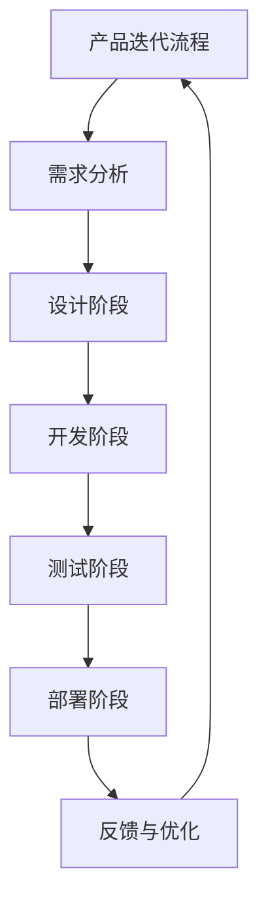

                 

# 《一人公司如何进行有效的产品迭代》

## 关键词
- 产品迭代
- 一人公司
- 需求分析
- 设计原则
- 迭代开发
- 市场反馈

## 摘要
本文深入探讨了一人公司在产品迭代过程中如何有效地管理需求、设计和开发，通过分析用户需求、设计产品架构、实践迭代开发，以及获取和利用市场反馈，最终实现产品的高效迭代和持续优化。本文旨在为一人公司的创业者和管理者提供实用的指导，帮助他们在竞争激烈的市场中脱颖而出。

### 目录

#### 第一部分：产品迭代基础理论

**第1章：产品迭代概述**

**第2章：产品迭代策略**

**第3章：需求分析**

**第4章：用户研究与用户画像**

**第5章：需求分类与优先级排序**

**第6章：需求文档编写**

**第7章：产品设计**

**第8章：用户界面设计**

**第9章：功能设计**

**第10章：迭代开发实践**

**第11章：短周期迭代**

**第12章：版本控制与代码管理**

**第13章：迭代后的评估与优化**

#### 第二部分：有效的需求分析与设计

**第14章：一人公司的产品管理**

**第15章：有效的市场反馈**

**第16章：市场反馈分析与应用**

**第17章：个人成长与团队协作**

**第18章：一人公司的产品迭代案例研究**

#### 第三部分：一人公司的产品迭代策略

**第19章：一人公司的特点与挑战**

**第20章：一人公司的产品规划**

### 第一部分：产品迭代基础理论

#### 第1章：产品迭代概述

### 第一部分：产品迭代基础理论

**第1章：产品迭代概述**

**1.1 产品的生命周期**

- **产品的生命周期**：从产品诞生到消亡的过程，通常包括开发、成长、成熟和衰退四个阶段。
- **生命周期阶段划分**：不同阶段的产品有不同的特点和需求，需要不同的管理策略。
  - **开发阶段**：产品原型开发，需求确认，技术验证。
  - **成长阶段**：产品上市，用户增长，市场扩张。
  - **成熟阶段**：市场份额稳定，产品功能完善，市场饱和。
  - **衰退阶段**：市场份额下降，用户流失，产品更新换代。

**1.2 产品迭代的定义与意义**

- **产品迭代的定义**：产品在生命周期内不断进行更新和改进的过程。
- **产品迭代的重要性**：
  - **满足用户需求**：通过迭代更新，产品能够更好地满足用户需求，提高用户满意度。
  - **保持竞争力**：持续迭代使产品保持市场竞争力，防止被竞争对手超越。
  - **提高产品质量**：迭代过程中，可以修复bug，优化用户体验，提高产品质量。

**1.3 一人公司的产品迭代挑战**

- **一人公司的特点**：
  - **资源有限**：一人公司通常资源有限，需要高效利用人力、时间和资金。
  - **全盘管理**：一人公司创始人需要全面负责产品的开发、设计、营销等各方面工作。
- **产品迭代挑战**：
  - **时间与精力的分配**：如何在有限的时间内完成高质量的迭代工作。
  - **全面性**：如何确保产品在功能、设计、用户体验等各方面都得到充分优化。

### 第一部分：产品迭代基础理论

**第2章：产品迭代策略**

#### 第一部分：产品迭代基础理论

**第2章：产品迭代策略**

**2.1 持续迭代策略**

- **持续迭代策略的定义**：产品在生命周期内持续进行小幅度更新和改进。
- **优势**：
  - **快速响应市场需求**：通过持续迭代，产品能够更快地响应市场需求和用户反馈。
  - **提高开发效率**：小规模迭代可以减少开发和测试周期，提高开发效率。
- **适用场景**：适合需求变化较快、市场竞争激烈的产品。

**2.2 重大迭代策略**

- **重大迭代策略的定义**：在产品生命周期内进行一次或几次大规模更新和改进。
- **优势**：
  - **提升产品功能**：重大迭代能够显著提升产品的功能和性能。
  - **提高用户满意度**：通过重大更新，用户能够获得更好的产品体验。
- **适用场景**：适合需求稳定、有明确功能升级计划的产品。

**2.3 特殊情况下的迭代策略**

- **特殊情况下的迭代策略的定义**：在产品遇到重大问题或市场变化时采取的特殊迭代策略。
- **适用场景**：
  - **产品故障**：在产品出现重大故障时，需要快速修复。
  - **市场变化**：在市场环境变化时，需要迅速调整产品方向。

#### 第二部分：有效的需求分析与设计

**第3章：需求分析**

#### 第一部分：产品迭代基础理论

**第2章：产品迭代策略**

**第3章：需求分析**

**3.1 需求分析概述**

- **需求分析的定义**：需求分析是指确定软件系统必须做什么的过程，包括理解用户需求、分析和确定系统的功能需求和非功能需求。
- **需求分析的作用**：
  - **确保产品满足用户需求**：通过需求分析，可以确保产品的设计和功能满足用户的基本需求。
  - **指导开发过程**：需求分析是软件开发的基础，为后续的设计和开发提供明确的指导。

**3.2 需求分析的过程**

- **需求收集**：通过访谈、问卷调查、用户观察等方式收集用户需求。
- **需求分类**：将收集到的需求进行分类，分为功能需求、性能需求、可靠性需求等。
- **需求优先级排序**：根据用户需求和产品目标，对需求进行优先级排序。
- **需求文档编写**：编写详细的需求文档，包括需求描述、功能需求、非功能需求等。

#### 第二部分：有效的需求分析与设计

**第4章：用户研究与用户画像**

#### 第一部分：产品迭代基础理论

**第2章：产品迭代策略**

**第3章：需求分析**

**第4章：用户研究与用户画像**

**4.1 用户研究的方法与工具**

- **用户研究的方法**：
  - **访谈**：通过与用户直接交流，了解他们的需求、偏好和行为。
  - **问卷调查**：通过在线或离线方式收集用户反馈，分析用户行为和需求。
  - **用户观察**：在用户实际使用产品的过程中，观察他们的行为和反馈。

- **用户研究的工具**：
  - **用户访谈工具**：如Zoom、Skype等视频通话工具。
  - **问卷调查工具**：如Google表单、SurveyMonkey等。
  - **用户行为分析工具**：如Google Analytics、Hotjar等。

**4.2 用户画像的制作与应用**

- **用户画像的定义**：用户画像是对用户特征、行为、需求和偏好的抽象描述。
- **用户画像的制作**：
  - **数据收集**：通过用户调查、用户行为分析等手段收集用户数据。
  - **数据分析**：对收集到的用户数据进行清洗、分析和处理，提取用户特征。
  - **用户画像构建**：将分析结果整合成用户画像，用于指导产品设计、开发和迭代。

- **用户画像的应用**：
  - **需求分析**：通过用户画像，可以更准确地理解用户需求，进行需求优先级排序。
  - **产品设计**：根据用户画像，设计符合用户需求的功能和界面。
  - **市场推广**：根据用户画像，制定更有针对性的市场推广策略。

#### 第二部分：有效的需求分析与设计

**第5章：需求分类与优先级排序**

#### 第一部分：产品迭代基础理论

**第2章：产品迭代策略**

**第3章：需求分析**

**第4章：用户研究与用户画像**

**第5章：需求分类与优先级排序**

**5.1 功能需求与非功能需求**

- **功能需求**：描述产品必须实现的具体功能，如登录、搜索、支付等。
- **非功能需求**：描述产品在实现功能时需要满足的性能、安全性、可靠性等要求，如响应时间、系统稳定性等。

**5.2 需求优先级排序方法**

- **紧急程度**：优先处理紧急且重要的需求，如修复严重bug。
- **重要性**：根据用户需求的重要性和对业务的影响进行排序，如关键功能优先开发。
- **难度与资源**：考虑实现需求的难度和所需资源，优先处理难度较低且资源充足的需求。

**5.3 需求优先级排序的应用**

- **需求文档**：在编写需求文档时，明确每个需求的优先级。
- **迭代计划**：在制定迭代计划时，根据需求优先级安排开发任务。

#### 第二部分：有效的需求分析与设计

**第6章：需求文档编写**

#### 第一部分：产品迭代基础理论

**第2章：产品迭代策略**

**第3章：需求分析**

**第4章：用户研究与用户画像**

**第5章：需求分类与优先级排序**

**第6章：需求文档编写**

**6.1 需求文档的结构与内容**

- **需求文档的结构**：需求文档通常包括需求概述、功能需求、非功能需求、需求分析、用户故事等部分。
- **需求文档的内容**：
  - **需求概述**：简要描述产品的目标和功能。
  - **功能需求**：详细描述产品必须实现的功能，包括功能名称、功能描述、功能实现方法等。
  - **非功能需求**：详细描述产品的性能、安全性、可靠性等非功能要求。
  - **需求分析**：对需求进行详细分析，包括需求来源、需求优先级、需求实现方法等。
  - **用户故事**：用用户故事的形式描述用户的需求和使用场景。

**6.2 需求文档的编写技巧**

- **明确性**：确保需求描述清晰明确，避免歧义。
- **完整性**：确保需求文档覆盖所有功能和非功能需求。
- **可测试性**：确保需求文档中的功能需求可以转化为可测试的测试用例。
- **可维护性**：确保需求文档易于理解和更新。

#### 第三部分：产品设计与迭代实践

**第7章：产品设计**

#### 第一部分：产品迭代基础理论

**第2章：产品迭代策略**

**第3章：需求分析**

**第4章：用户研究与用户画像**

**第5章：需求分类与优先级排序**

**第6章：需求文档编写**

**第7章：产品设计**

**7.1 产品设计原则**

- **用户中心设计**：将用户需求放在首位，确保产品设计满足用户需求。
- **简洁性**：设计简洁明了，避免过度复杂。
- **一致性**：产品界面和交互一致，提高用户体验。
- **灵活性**：设计应具有灵活性，能够适应未来的变化。

**7.2 设计流程与方法**

- **设计流程**：
  - **需求分析**：了解用户需求和产品功能。
  - **原型设计**：创建产品原型，进行初步的用户测试。
  - **详细设计**：完善产品界面和交互细节。
  - **用户测试**：进行用户测试，收集反馈。
  - **迭代优化**：根据用户反馈进行设计优化。

- **设计方法**：
  - **低保真原型**：快速创建原型，进行初步测试。
  - **高保真原型**：创建详细的原型，用于最终测试和设计确认。

**7.3 设计工具**

- **Figma**：用于设计原型和界面的可视化工具。
- **Sketch**：适用于iOS和Mac界面设计的矢量绘图工具。
- **Adobe XD**：用于设计交互原型和界面的综合工具。

#### 第三部分：产品设计与迭代实践

**第8章：用户界面设计**

#### 第一部分：产品迭代基础理论

**第2章：产品迭代策略**

**第3章：需求分析**

**第4章：用户研究与用户画像**

**第5章：需求分类与优先级排序**

**第6章：需求文档编写**

**第7章：产品设计**

**第8章：用户界面设计**

**8.1 用户界面设计原则**

- **易用性**：界面应简单直观，易于用户操作。
- **美观性**：界面设计应美观，提升用户体验。
- **一致性**：界面元素和交互应保持一致性，减少用户学习成本。
- **适应性**：界面应适应不同设备和屏幕尺寸。

**8.2 界面布局与色彩搭配**

- **界面布局**：
  - **网格布局**：使用网格布局，使界面元素排列有序。
  - **对称布局**：使用对称布局，提升界面美感。
  - **层次布局**：通过层次布局，明确界面信息的重要性。

- **色彩搭配**：
  - **颜色理论**：了解颜色理论，选择合适的配色方案。
  - **色彩搭配**：使用对比色、类似色等色彩搭配，提升界面视觉效果。

**8.3 交互设计原则**

- **简洁性**：交互设计应简洁直观，减少用户操作步骤。
- **响应性**：界面应快速响应用户操作，提高用户体验。
- **反馈性**：界面应提供明确的操作反馈，增强用户信心。
- **可控性**：用户应能够随时控制界面操作，防止误操作。

#### 第三部分：产品设计与迭代实践

**第9章：功能设计**

#### 第一部分：产品迭代基础理论

**第2章：产品迭代策略**

**第3章：需求分析**

**第4章：用户研究与用户画像**

**第5章：需求分类与优先级排序**

**第6章：需求文档编写**

**第7章：产品设计**

**第8章：用户界面设计**

**第9章：功能设计**

**9.1 功能设计原则**

- **用户中心**：功能设计应围绕用户需求，提高用户满意度。
- **简洁性**：功能设计应简洁明了，避免冗余和复杂性。
- **模块化**：功能设计应模块化，便于后续维护和扩展。
- **灵活性**：功能设计应具有灵活性，适应不同的用户场景和需求。

**9.2 功能规划与模块划分**

- **功能规划**：
  - **总体规划**：根据产品目标和需求，确定产品的核心功能。
  - **阶段划分**：将功能划分为不同的阶段，逐步实现。

- **模块划分**：
  - **功能模块**：将功能划分为不同的模块，便于开发和管理。
  - **模块关系**：明确模块之间的依赖关系，确保模块间协作。

**9.3 功能优先级排序**

- **紧急程度**：优先处理紧急且重要的功能。
- **重要性**：根据功能对用户价值和业务影响进行排序。
- **资源**：考虑开发资源和时间，合理安排功能开发。

#### 第三部分：产品设计与迭代实践

**第10章：迭代开发实践**

#### 第一部分：产品迭代基础理论

**第2章：产品迭代策略**

**第3章：需求分析**

**第4章：用户研究与用户画像**

**第5章：需求分类与优先级排序**

**第6章：需求文档编写**

**第7章：产品设计**

**第8章：用户界面设计**

**第9章：功能设计**

**第10章：迭代开发实践**

**10.1 迭代开发流程**

- **迭代开发流程的定义**：迭代开发是一种软件开发方法，通过逐步迭代和逐步完善，实现产品的开发。
- **迭代开发的基本流程**：
  - **需求分析**：确定产品需求和功能。
  - **设计阶段**：进行产品设计，包括界面设计和功能设计。
  - **开发阶段**：按照设计文档进行开发，实现产品功能。
  - **测试阶段**：对产品进行测试，确保产品质量。
  - **部署阶段**：将产品部署到生产环境，供用户使用。
  - **反馈与优化**：收集用户反馈，进行产品优化。

**10.2 迭代开发的优点**

- **快速响应市场需求**：通过迭代开发，产品可以快速响应市场需求和用户反馈，提高产品的竞争力。
- **提高开发效率**：迭代开发方法可以减少开发周期，提高开发效率。
- **降低风险**：通过逐步迭代，可以降低产品开发过程中的风险。

#### 第三部分：产品设计与迭代实践

**第11章：短周期迭代**

#### 第一部分：产品迭代基础理论

**第2章：产品迭代策略**

**第3章：需求分析**

**第4章：用户研究与用户画像**

**第5章：需求分类与优先级排序**

**第6章：需求文档编写**

**第7章：产品设计**

**第8章：用户界面设计**

**第9章：功能设计**

**第10章：迭代开发实践**

**第11章：短周期迭代**

**11.1 短周期迭代的定义**

- **短周期迭代的定义**：短周期迭代是一种迭代开发方法，每个迭代周期较短，通常为几周或几个月。
- **短周期迭代的特点**：
  - **快速反馈**：通过短周期迭代，可以快速获得用户反馈，及时调整产品方向。
  - **灵活调整**：短周期迭代使得开发团队能够根据用户反馈和市场变化，灵活调整产品功能和设计。

**11.2 如何进行短周期迭代**

- **制定迭代计划**：确定每个迭代的目标和任务，合理安排时间和资源。
- **快速开发**：在短周期内，团队需要高效地完成开发任务，确保每个迭代都有可交付的产品。
- **用户反馈**：在每个迭代结束时，收集用户反馈，对产品进行评估和优化。
- **持续迭代**：根据用户反馈和市场变化，不断进行迭代和优化，提高产品竞争力。

#### 第三部分：产品设计与迭代实践

**第12章：版本控制与代码管理**

#### 第一部分：产品迭代基础理论

**第2章：产品迭代策略**

**第3章：需求分析**

**第4章：用户研究与用户画像**

**第5章：需求分类与优先级排序**

**第6章：需求文档编写**

**第7章：产品设计**

**第8章：用户界面设计**

**第9章：功能设计**

**第10章：迭代开发实践**

**第11章：短周期迭代**

**第12章：版本控制与代码管理**

**12.1 版本控制工具的选择**

- **Git**：一种分布式版本控制系统，适合多人协作开发。
- **SVN**：一种集中式版本控制系统，适合小规模团队开发。
- **Mercurial**：另一种分布式版本控制系统，与Git类似。

**12.2 代码管理的最佳实践**

- **分支管理**：使用分支管理，确保代码的稳定性和安全性。
- **代码审查**：进行代码审查，确保代码质量。
- **持续集成**：使用持续集成工具，自动化测试和部署代码。
- **文档记录**：记录代码变更和修改理由，便于后续维护。

#### 第三部分：产品设计与迭代实践

**第13章：迭代后的评估与优化**

#### 第一部分：产品迭代基础理论

**第2章：产品迭代策略**

**第3章：需求分析**

**第4章：用户研究与用户画像**

**第5章：需求分类与优先级排序**

**第6章：需求文档编写**

**第7章：产品设计**

**第8章：用户界面设计**

**第9章：功能设计**

**第10章：迭代开发实践**

**第11章：短周期迭代**

**第12章：版本控制与代码管理**

**第13章：迭代后的评估与优化**

**13.1 产品迭代后的评估方法**

- **用户反馈**：通过用户调研、问卷调查等方式收集用户对产品的反馈。
- **数据分析**：分析用户行为数据，了解产品的使用情况和用户满意度。
- **市场分析**：分析市场趋势和竞争对手情况，了解产品的市场竞争力。

**13.2 如何根据评估结果进行优化**

- **功能优化**：根据用户反馈，优化产品功能和用户体验。
- **性能优化**：分析产品性能，优化代码和架构，提高产品性能。
- **界面优化**：根据用户反馈和设计原则，优化产品界面设计。
- **市场推广**：根据市场分析结果，制定更有针对性的市场推广策略。

#### 第四部分：一人公司的产品迭代策略

**第14章：一人公司的产品管理**

#### 第一部分：产品迭代基础理论

**第2章：产品迭代策略**

**第3章：需求分析**

**第4章：用户研究与用户画像**

**第5章：需求分类与优先级排序**

**第6章：需求文档编写**

**第7章：产品设计**

**第8章：用户界面设计**

**第9章：功能设计**

**第10章：迭代开发实践**

**第11章：短周期迭代**

**第12章：版本控制与代码管理**

**第13章：迭代后的评估与优化**

**第14章：一人公司的产品管理**

**14.1 一人公司的特点与挑战**

- **特点**：
  - **全盘管理**：一人公司创始人需要全面负责产品的开发、设计、营销等各方面工作。
  - **资源有限**：一人公司通常资源有限，需要高效利用人力、时间和资金。
- **挑战**：
  - **时间与精力的分配**：如何在有限的时间内完成高质量的迭代工作。
  - **全面性**：如何确保产品在功能、设计、用户体验等各方面都得到充分优化。

**14.2 一人公司的产品管理策略**

- **明确目标**：明确产品目标和愿景，确保所有迭代工作都围绕目标进行。
- **高效开发**：采用短周期迭代和敏捷开发方法，提高开发效率。
- **用户反馈**：积极收集用户反馈，根据用户需求进行迭代和优化。
- **资源管理**：合理分配资源，确保关键任务得到优先处理。

#### 第四部分：一人公司的产品迭代策略

**第15章：有效的市场反馈**

#### 第一部分：产品迭代基础理论

**第2章：产品迭代策略**

**第3章：需求分析**

**第4章：用户研究与用户画像**

**第5章：需求分类与优先级排序**

**第6章：需求文档编写**

**第7章：产品设计**

**第8章：用户界面设计**

**第9章：功能设计**

**第10章：迭代开发实践**

**第11章：短周期迭代**

**第12章：版本控制与代码管理**

**第13章：迭代后的评估与优化**

**第14章：一人公司的产品管理**

**第15章：有效的市场反馈**

**15.1 市场反馈的重要性**

- **市场反馈的定义**：市场反馈是指用户和消费者对产品使用的体验、意见和建议。
- **市场反馈的重要性**：
  - **指导产品优化**：市场反馈能够帮助产品团队了解用户需求，指导产品优化和迭代。
  - **提高用户满意度**：通过市场反馈，产品可以更好地满足用户需求，提高用户满意度。
  - **增加市场竞争力**：及时响应用户反馈，能够提升产品的市场竞争力。

**15.2 市场反馈获取方法**

- **用户调研**：
  - **问卷调查**：通过在线问卷、电话调查等方式收集用户反馈。
  - **深度访谈**：与用户进行一对一访谈，深入了解用户需求和使用体验。
- **用户行为分析**：
  - **数据分析**：通过分析用户行为数据，了解用户使用产品的习惯和偏好。
  - **热图分析**：使用热图工具分析用户在界面上的操作，了解用户的点击和滑动行为。

**15.3 市场反馈分析与应用**

- **反馈数据的处理**：
  - **数据清洗**：对收集到的反馈数据进行清洗，去除无效和重复数据。
  - **数据分析**：对反馈数据进行分析，提取有用的信息。
- **反馈应用**：
  - **功能优化**：根据用户反馈，优化产品的功能和用户体验。
  - **产品迭代**：根据用户反馈，调整产品迭代方向，确保产品迭代更符合用户需求。

#### 第四部分：一人公司的产品迭代策略

**第16章：市场反馈分析与应用**

#### 第一部分：产品迭代基础理论

**第2章：产品迭代策略**

**第3章：需求分析**

**第4章：用户研究与用户画像**

**第5章：需求分类与优先级排序**

**第6章：需求文档编写**

**第7章：产品设计**

**第8章：用户界面设计**

**第9章：功能设计**

**第10章：迭代开发实践**

**第11章：短周期迭代**

**第12章：版本控制与代码管理**

**第13章：迭代后的评估与优化**

**第14章：一人公司的产品管理**

**第15章：有效的市场反馈**

**第16章：市场反馈分析与应用**

**16.1 反馈数据的处理与分析**

- **数据收集**：通过用户调研、用户行为分析等方式收集市场反馈数据。
- **数据清洗**：对收集到的数据进行清洗，去除无效和重复的数据。
- **数据分析**：使用统计分析、数据挖掘等方法，对反馈数据进行分析，提取有用的信息。

**16.2 根据反馈调整产品迭代方向**

- **用户需求调整**：根据用户反馈，调整产品的功能需求，确保产品更好地满足用户需求。
- **设计优化**：根据用户反馈，优化产品的界面设计和用户体验。
- **迭代策略调整**：根据市场反馈，调整产品迭代的方向和优先级，确保产品迭代更符合市场趋势。

**16.3 反馈机制的建立**

- **建立反馈渠道**：为用户建立反馈渠道，如用户调研、在线问卷、用户论坛等。
- **反馈机制优化**：定期收集用户反馈，及时处理和回应用户问题，提高用户满意度。
- **反馈反馈循环**：建立反馈反馈循环机制，持续收集用户反馈，不断优化产品。

#### 第四部分：一人公司的产品迭代策略

**第17章：个人成长与团队协作**

#### 第一部分：产品迭代基础理论

**第2章：产品迭代策略**

**第3章：需求分析**

**第4章：用户研究与用户画像**

**第5章：需求分类与优先级排序**

**第6章：需求文档编写**

**第7章：产品设计**

**第8章：用户界面设计**

**第9章：功能设计**

**第10章：迭代开发实践**

**第11章：短周期迭代**

**第12章：版本控制与代码管理**

**第13章：迭代后的评估与优化**

**第14章：一人公司的产品管理**

**第15章：有效的市场反馈**

**第16章：市场反馈分析与应用**

**第17章：个人成长与团队协作**

**17.1 一人公司的个人成长**

- **持续学习**：不断学习新的技术和知识，提高个人技能和竞争力。
- **经验积累**：通过实践积累经验，提升对产品开发和管理的能力。
- **反思与总结**：定期反思自己的工作，总结经验和教训，持续改进。

**17.2 虚拟团队协作**

- **团队组建**：根据项目需求，组建虚拟团队，明确团队成员的角色和职责。
- **协作工具**：使用协作工具，如Slack、Trello、Asana等，提高团队协作效率。
- **沟通与协调**：保持团队成员之间的良好沟通，及时协调和解决问题。

**17.3 虚拟团队协作技巧**

- **明确目标**：确保团队成员明确项目目标和任务。
- **分工合作**：合理分配任务，发挥每个人的优势。
- **定期沟通**：定期召开团队会议，讨论项目进展和问题。
- **持续反馈**：鼓励团队成员提供反馈，共同改进工作流程。

#### 第四部分：一人公司的产品迭代策略

**第18章：一人公司的产品迭代案例研究**

#### 第一部分：产品迭代基础理论

**第2章：产品迭代策略**

**第3章：需求分析**

**第4章：用户研究与用户画像**

**第5章：需求分类与优先级排序**

**第6章：需求文档编写**

**第7章：产品设计**

**第8章：用户界面设计**

**第9章：功能设计**

**第10章：迭代开发实践**

**第11章：短周期迭代**

**第12章：版本控制与代码管理**

**第13章：迭代后的评估与优化**

**第14章：一人公司的产品管理**

**第15章：有效的市场反馈**

**第16章：市场反馈分析与应用**

**第17章：个人成长与团队协作**

**第18章：一人公司的产品迭代案例研究**

**18.1 案例一：从零到一的突破**

- **背景**：某创业者王先生，对在线教育市场充满热情，决定创办一家在线教育公司。
- **需求分析**：通过市场调研和用户访谈，王先生确定了在线教育平台的主要功能，包括课程发布、在线学习、互动讨论等。
- **产品设计**：王先生采用简洁的设计原则，设计了一个易于使用且功能完善的在线教育平台。
- **迭代开发**：采用短周期迭代方法，王先生在几个月内完成了产品的第一个版本。
- **市场反馈**：发布产品后，王先生通过用户调研和用户行为分析，收集了大量反馈，对产品进行了多次优化。
- **结果**：经过不断迭代和优化，王先生的在线教育平台获得了良好的用户口碑，用户数量迅速增长，产品在市场上获得了成功。

**18.2 案例二：产品迭代中的困境与突破**

- **背景**：某创业者李小姐，开发了一款健康管理的应用程序，但在市场推广过程中遇到了用户流失和功能缺失的问题。
- **需求分析**：李小姐通过用户调研和反馈，发现用户对健康数据追踪和个性化建议功能有强烈需求。
- **产品设计**：李小姐重新设计了产品的界面和功能，增加了健康数据追踪和个性化建议模块。
- **迭代开发**：采用短周期迭代方法，李小姐在两个月内完成了产品的功能更新。
- **市场反馈**：更新后的产品得到了用户的认可，用户数量逐渐增加，产品在市场上逐渐获得了竞争优势。
- **结果**：通过不断迭代和优化，李小姐的健康管理应用程序成功克服了困境，实现了用户增长和市场拓展。

### 附录

#### 附录A：产品迭代工具与资源介绍

**A.1 常用工具介绍**

- **项目管理工具**：
  - **Trello**：用于项目任务管理，支持卡片、列表和标签等功能。
  - **Asana**：用于团队协作和任务管理，支持任务分配、进度跟踪等功能。
  - **JIRA**：用于软件项目管理和跟踪，支持敏捷开发方法和缺陷管理。

- **设计工具**：
  - **Figma**：用于界面设计和原型制作，支持协作和实时预览。
  - **Sketch**：用于界面设计和原型制作，适用于iOS和Mac平台。
  - **Adobe XD**：用于界面设计和原型制作，支持交互设计和用户体验测试。

- **版本控制工具**：
  - **Git**：用于代码管理和版本控制，支持分布式存储和协作开发。
  - **SVN**：用于集中式版本控制，适合小规模团队使用。
  - **Mercurial**：用于分布式版本控制，与Git类似。

**A.2 资源推荐**

- **书籍推荐**：
  - 《人人都是产品经理》
  - 《敏捷开发：原则、实践与模式》
  - 《用户体验要素》

- **文章与博客**：
  - 在线产品经理社区（如Product Hunt、UI Movement等）
  - 技术博客（如Medium、Dev.to等）

- **视频教程**：
  - 产品经理在线课程（如Udemy、Coursera等）
  - 设计工具教程（如Skillshare、Lynda等）

#### 附录B：产品迭代流程图



#### 附录C：伪代码示例

```python
# 伪代码：用户需求分析
def analyze_requirements():
    requirements = []
    for user_story in user_stories:
        story_requirements = extract_requirements(user_story)
        requirements.append(story_requirements)
    return requirements

# 伪代码：功能实现优先级排序
def prioritize_functions(functions):
    sorted_functions = sort_by_priority(functions)
    return sorted_functions

# 伪代码：迭代后的评估与优化
def evaluate_and_optimize(product):
    feedback = collect_user_feedback(product)
    improvements = identify_improvements(feedback)
    product = apply_improvements(product, improvements)
    return product
```

#### 附录D：数学模型与公式

```latex
% 数学模型与公式

\section{产品迭代模型}

\subsection{需求分析}

\begin{equation}
R = f(U, M)
\end{equation}

\subsection{迭代评估}

\begin{equation}
E = f(P, F)
\end{equation}

\section{数据分析}

\subsection{用户行为分析}

\begin{equation}
B = f(U, A, T)
\end{equation}

\subsection{市场分析}

\begin{equation}
M = f(S, C, T)
\end{equation}
```

#### 附录E：代码实例与分析

```python
# 代码实例：用户需求分析

def extract_requirements(user_story):
    requirements = []
    for sentence in user_story.split('.'):
        words = sentence.split()
        if '需要' in words:
            requirement = ' '.join(words[words.index('需要') + 1:])
            requirements.append(requirement)
    return requirements

# 代码解读与分析

# 该函数用于从用户故事中提取功能需求。
# 用户故事通常以自然语言描述，包含用户的需求。
# 函数首先将用户故事分割成句子，然后查找包含“需要”这个词的句子。
# 找到包含“需要”的句子后，提取该句子的剩余部分，即用户的需求描述。
# 最后，将这些需求添加到列表中返回。

user_story = "用户需要能够在线支付课程费用，并且能够查看已购买的课程列表。"
requirements = extract_requirements(user_story)
print(requirements)
```

### 作者

- 作者：AI天才研究院/AI Genius Institute & 禅与计算机程序设计艺术 /Zen And The Art of Computer Programming

