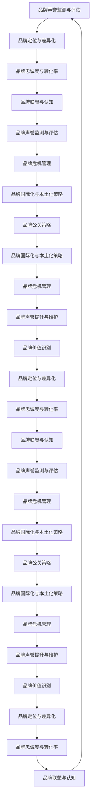

                 

### 一人公司的品牌声誉管理基础

#### 2.1 品牌价值识别

品牌价值识别是指企业识别和确定品牌所代表的核心价值和独特性。品牌价值识别是品牌声誉管理的基础。在品牌声誉管理中，品牌价值的识别过程可以分解为以下几个步骤：

1. **市场调研**：通过市场调研，了解目标市场的需求和消费者的期望，为品牌价值的识别提供数据支持。

2. **内部讨论**：组织公司内部相关部门进行讨论，确定品牌的核心价值和独特性。这包括产品或服务的优势、企业的文化理念、社会责任等方面的内容。

3. **外部评估**：通过第三方评估机构或行业专家对品牌价值进行评估，以确保品牌价值的准确性和权威性。

4. **品牌价值定位**：根据市场调研和内部讨论的结果，将品牌价值进行定位，使其与目标市场相匹配。

**伪代码：**

```python
def identify_brand_value():
    market_data = conduct_market_research()
    internal_discussion = gather_internal的意见()
    external_evaluation = get_external_evaluation()
    brand_value = align_brand_value_with_market(market_data, internal_discussion, external_evaluation)
    return brand_value
```

#### 2.2 品牌定位与差异化

品牌定位是指企业确定品牌在市场中的位置，使品牌在消费者心中形成独特的形象。品牌差异化是指企业通过独特的产品、服务或体验，使品牌在竞争中脱颖而出。

品牌定位与差异化的关系：

- **品牌定位是品牌差异化的基础**：品牌定位决定了品牌在市场中的角色和目标，为品牌差异化提供了方向。

- **品牌差异化是实现品牌定位的手段**：通过差异化策略，品牌能够在市场中脱颖而出，实现品牌定位。

**品牌定位的步骤：**

1. **目标市场分析**：分析目标市场的特征，确定品牌的定位方向。

2. **竞争分析**：了解竞争对手的品牌定位，找出差异化的机会。

3. **内部能力评估**：评估企业内部的能力和资源，确定能够实现的品牌定位。

4. **品牌定位确认**：根据前面的分析，确定品牌的定位。

**品牌差异化的策略：**

1. **产品差异化**：通过独特的产品特性，如功能、设计、质量等，实现品牌差异化。

2. **服务差异化**：通过卓越的客户服务，如快速响应、个性化服务等，实现品牌差异化。

3. **体验差异化**：通过独特的用户体验，如品牌文化、品牌故事等，实现品牌差异化。

**伪代码：**

```python
def brand_positioning():
    target_market = analyze_target_market()
    competition_analysis = analyze_competition()
    internal_capabilities = evaluate_internal_capabilities()
    brand_position = confirm_brand_position(target_market, competition_analysis, internal_capabilities)
    return brand_position

def brand_differentiation():
    product_differentiation = implement_product_differentiation()
    service_differentiation = implement_service_differentiation()
    experience_differentiation = implement_experience_differentiation()
    return product_differentiation, service_differentiation, experience_differentiation
```

#### 2.3 品牌忠诚度与转化率

品牌忠诚度是指消费者对品牌的忠实程度，是品牌声誉的重要体现。品牌转化率是指消费者从品牌接触、了解、信任到购买的过程，是品牌声誉的量化指标。

**品牌忠诚度的要素：**

1. **重复购买**：消费者在一定时间内重复购买同一品牌的产品或服务。

2. **口碑传播**：消费者通过正面评价和推荐，增加品牌的影响力。

3. **品牌认知**：消费者对品牌的认知和了解程度。

**品牌转化率的要素：**

1. **品牌接触**：消费者首次接触到品牌，如通过广告、社交媒体等渠道。

2. **品牌了解**：消费者对品牌的产品、服务、价值等方面的了解。

3. **品牌信任**：消费者对品牌的信任程度，直接影响购买决策。

**提升品牌忠诚度和转化率的方法：**

1. **提供优质产品和服务**：通过高品质的产品和卓越的服务，提升消费者满意度和忠诚度。

2. **个性化营销**：根据消费者的购买行为和偏好，提供个性化的营销策略。

3. **品牌故事传播**：通过讲述品牌故事，增强消费者对品牌的认同感和忠诚度。

**伪代码：**

```python
def enhance_brand_loyalty():
    provide_high_quality_products_and_services()
    personalize_marketing_strategies()
    communicate_brand_stories()

def enhance_conversion_rate():
    facilitate_brand_contact()
    enhance_brand_understanding()
    build_brand_trust()
```

#### 2.4 品牌联想与认知

品牌联想是指消费者对品牌的印象和记忆，是品牌声誉的重要组成部分。品牌认知是指消费者对品牌的了解和认识，是品牌声誉的基础。

**品牌联想的要素：**

1. **品牌标识**：品牌名称、标志、色彩等元素，对消费者形成初步的联想。

2. **品牌体验**：消费者使用品牌产品或服务的体验，如口感、质量、服务态度等。

3. **品牌故事**：品牌的历史、文化、使命等，对消费者产生深层次的影响。

**品牌认知的要素：**

1. **品牌知名度**：消费者对品牌的认知程度，包括品牌名称、标志等。

2. **品牌理解**：消费者对品牌价值、产品或服务特点的理解。

3. **品牌偏好**：消费者对品牌的偏好程度，直接影响购买决策。

**提升品牌联想与认知的方法：**

1. **品牌宣传**：通过广告、公关活动等，提高品牌知名度。

2. **用户体验**：通过优质的产品和服务，提升消费者对品牌的认知和偏好。

3. **品牌故事**：通过讲述品牌故事，加深消费者对品牌的理解和认同。

**伪代码：**

```python
def enhance_brand_association():
    promote_brand_name_and_logo()
    improve_brand_experience()
    share_brand_stories()

def enhance_brand_cognition():
    increase_brand_awareness()
    deepen_brand_understanding()
    build_brand_preferrence()
```

---

**Mermaid 流程图示例：品牌声誉管理核心概念与联系**



---

### 品牌价值识别

品牌价值识别是品牌声誉管理的基础，它涉及到品牌核心价值和独特性的确定。品牌价值的识别不仅需要市场调研和内部讨论，还需要外部评估和品牌价值定位。以下是品牌价值识别的详细步骤：

#### 1. 市场调研

市场调研是识别品牌价值的第一步。通过市场调研，企业可以了解目标市场的需求和消费者的期望。市场调研的方法包括：

1. **定量调研**：通过问卷调查、统计分析等方法收集大量数据，了解市场趋势和消费者行为。

2. **定性调研**：通过访谈、小组讨论等方法深入了解消费者的需求和期望，获取深入的信息。

**伪代码：**

```python
def conduct_market_research():
    quantitative_data = collect_quantitative_data()
    qualitative_data = collect_qualitative_data()
    market_trends = analyze_market_trends()
    consumer_expectations = analyze_consumer_expectations()
    return market_trends, consumer_expectations
```

#### 2. 内部讨论

在市场调研的基础上，企业需要组织内部相关部门进行讨论，确定品牌的核心价值和独特性。内部讨论的参与部门包括市场部、产品部、运营部、人力资源部等。

**内部讨论的步骤：**

1. **确定讨论目标**：明确讨论的目标，如品牌核心价值的识别、独特性的确定等。

2. **准备讨论材料**：根据市场调研结果，准备讨论材料，包括市场趋势、消费者期望、竞争分析等。

3. **进行讨论**：组织讨论会，让各部门代表提出意见和建议。

4. **汇总讨论结果**：根据讨论结果，汇总品牌的核心价值和独特性。

**伪代码：**

```python
def gather_internal_opinions():
    discussion_materials = prepare_discussion_materials()
    discussion_meeting = conduct_discussion_meeting()
    brand_value = summarize_discussion_results()
    return brand_value
```

#### 3. 外部评估

外部评估是品牌价值识别的重要环节。通过外部评估，企业可以确保品牌价值的准确性和权威性。外部评估的方法包括：

1. **第三方评估**：聘请第三方评估机构对品牌价值进行评估，提供专业的评估报告。

2. **行业专家评估**：邀请行业专家对品牌价值进行评估，提供专业的意见和建议。

**伪代码：**

```python
def get_external_evaluation():
    third_party_evaluation = hire_third_party_evaluation()
    industry_expert_evaluation = invite_industry_experts()
    brand_value = evaluate_brand_value(third_party_evaluation, industry_expert_evaluation)
    return brand_value
```

#### 4. 品牌价值定位

根据市场调研、内部讨论和外部评估的结果，企业需要将品牌价值进行定位。品牌价值定位的目的是确保品牌价值与目标市场相匹配。

**品牌价值定位的步骤：**

1. **分析市场趋势**：分析市场趋势，了解目标市场的需求和变化。

2. **确定目标市场**：根据市场趋势，确定目标市场，明确品牌的定位方向。

3. **评估内部能力**：评估企业内部的能力和资源，确定能够实现的品牌定位。

4. **定位品牌价值**：根据前面的分析，确定品牌的价值定位。

**伪代码：**

```python
def align_brand_value_with_market(market_trends, internal_discussion, external_evaluation):
    market_trends = analyze_market_trends()
    target_market = determine_target_market(market_trends)
    internal_capabilities = evaluate_internal_capabilities()
    brand_value = determine_brand_value(target_market, internal_capabilities)
    return brand_value
```

通过以上步骤，企业可以有效地识别和确定品牌价值，为品牌声誉管理奠定基础。

---

### 品牌定位与差异化

品牌定位与差异化是品牌声誉管理中的关键环节。品牌定位决定了品牌在市场中的角色和目标，而差异化策略使品牌在竞争激烈的市场中脱颖而出。以下是对品牌定位与差异化的详细阐述。

#### 3.1 品牌定位

品牌定位是指企业确定品牌在市场中的位置，使其在消费者心中形成独特的形象。品牌定位的目的是让消费者对品牌产生清晰的认识，从而增加品牌的影响力和忠诚度。

**品牌定位的步骤：**

1. **分析市场**：分析目标市场的特征，了解消费者的需求和偏好。这包括市场趋势、竞争情况、消费者行为等。

2. **确定目标市场**：根据市场分析结果，确定品牌的定位方向。目标市场的选择应考虑市场规模、增长潜力、竞争程度等因素。

3. **评估内部能力**：评估企业内部的能力和资源，确定能够实现的品牌定位。这包括产品研发、市场推广、客户服务等。

4. **制定品牌定位策略**：根据前面的分析，制定品牌定位策略，明确品牌的独特价值主张。

**伪代码：**

```python
def brand_positioning():
    market_analysis = analyze_market()
    target_market = determine_target_market(market_analysis)
    internal_capabilities = evaluate_internal_capabilities()
    brand_position = create_brand_position(target_market, internal_capabilities)
    return brand_position
```

**案例：某时尚品牌定位**

某时尚品牌在市场上定位为“时尚先锋”，其目标市场为年轻时尚消费者。品牌定位策略包括：

- **产品定位**：推出设计独特、时尚前卫的产品，满足年轻消费者的个性化需求。
- **市场推广**：通过社交媒体、时尚杂志等渠道，传播品牌形象，吸引目标消费者。
- **客户服务**：提供个性化的购物体验和专业的时尚建议，增强消费者对品牌的忠诚度。

#### 3.2 品牌差异化

品牌差异化是指企业通过独特的产品、服务或体验，使品牌在市场中与其他竞争者区分开来。差异化策略有助于提高品牌的知名度和忠诚度，增强市场竞争力。

**品牌差异化的策略：**

1. **产品差异化**：通过独特的产品特性，如功能、设计、质量等，满足消费者的不同需求。

   - **案例**：某电子产品品牌通过推出具有创新功能的智能手机，满足消费者对高性能和个性化需求。

2. **服务差异化**：通过卓越的客户服务，如快速响应、个性化服务等，提升消费者满意度。

   - **案例**：某在线零售平台提供24小时客服支持，为消费者提供便捷的购物体验。

3. **体验差异化**：通过独特的用户体验，如品牌文化、品牌故事等，增强消费者对品牌的认同感。

   - **案例**：某咖啡连锁品牌通过讲述咖啡历史和文化，营造独特的品牌氛围。

**伪代码：**

```python
def brand_differentiation():
    product_differentiation = implement_product_differentiation()
    service_differentiation = implement_service_differentiation()
    experience_differentiation = implement_experience_differentiation()
    return product_differentiation, service_differentiation, experience_differentiation
```

通过以上品牌定位与差异化的策略，企业可以打造独特的品牌形象，提升市场竞争力。

---

### 品牌忠诚度与转化率

品牌忠诚度和转化率是品牌声誉管理中的关键指标，它们直接影响企业的市场表现和长期发展。本文将详细探讨如何提升品牌忠诚度和转化率，以及两者之间的关系。

#### 4.1 品牌忠诚度

品牌忠诚度是指消费者对品牌的忠实程度，它体现了消费者在重复购买和推荐品牌产品或服务方面的意愿。品牌忠诚度通常由以下因素决定：

1. **产品或服务质量**：高品质的产品或服务是建立品牌忠诚度的基石。消费者在购买过程中，如果产品或服务质量符合或超出预期，他们更有可能成为忠实客户。

2. **客户体验**：良好的客户体验能够增强消费者对品牌的认同感。这包括售前咨询、售后服务、购物体验等环节。

3. **品牌形象**：品牌形象是消费者对品牌的整体印象。一个具有正面形象的品牌更容易赢得消费者的信任和忠诚。

**提升品牌忠诚度的策略：**

1. **提供优质产品和服务**：不断优化产品和服务，确保它们符合或超出消费者的期望。

2. **个性化客户体验**：通过数据分析和技术手段，提供个性化的客户体验，满足消费者的个性化需求。

3. **品牌形象建设**：通过品牌故事、文化塑造等手段，提升品牌形象，增强消费者对品牌的认同感。

**伪代码：**

```python
def enhance_brand_loyalty():
    improve_product_and_service_quality()
    personalize_customer_experience()
    build_brand_image()
```

#### 4.2 品牌转化率

品牌转化率是指从品牌接触、了解、信任到购买的过程中，最终完成购买的消费者比例。品牌转化率是衡量品牌营销效果的重要指标。提高品牌转化率的关键在于以下几个方面：

1. **品牌知名度**：提高品牌知名度可以增加潜在消费者的接触机会，从而提高转化率。

2. **信息传递**：确保品牌信息准确、清晰，使消费者能够快速了解品牌的价值和优势。

3. **购买流程**：简化购买流程，减少消费者的购买决策时间，提高转化率。

**提升品牌转化率的策略：**

1. **增加品牌曝光**：通过广告、社交媒体、公关活动等方式，增加品牌的曝光度。

2. **优化信息传递**：确保品牌信息准确、清晰，使消费者能够快速了解品牌的价值和优势。

3. **简化购买流程**：提供便捷的购买渠道，减少购物车流程、支付流程等步骤。

**伪代码：**

```python
def enhance_conversion_rate():
    increase_brand_awareness()
    optimize_information_transmission()
    simplify_purchasing_process()
```

#### 4.3 品牌忠诚度与转化率的关系

品牌忠诚度和转化率是相互关联的。较高的品牌忠诚度往往会导致较高的品牌转化率，因为忠诚的消费者更愿意重复购买和推荐品牌。同时，较高的品牌转化率也有助于提高品牌忠诚度，因为成功的购买体验会增强消费者对品牌的信任和满意度。

**提高品牌忠诚度和转化率的综合策略：**

1. **统一目标**：确保企业内部在提升品牌忠诚度和转化率方面有共同的目标和策略。

2. **整合资源**：整合市场调研、客户反馈、数据分析等资源，为品牌忠诚度和转化率的提升提供支持。

3. **持续优化**：通过定期评估和反馈，不断优化品牌忠诚度和转化率的提升策略。

**伪代码：**

```python
def integrate_brand_loyalty_and_conversion():
    set_common_goals()
    integrate_resources()
    continuously_optimize()
```

通过上述策略，企业可以有效地提升品牌忠诚度和转化率，从而在市场竞争中取得优势。

---

### 品牌联想与认知

品牌联想和品牌认知是品牌声誉管理中的关键要素，它们对品牌形象和市场表现有着重要的影响。品牌联想是指消费者对品牌的印象和记忆，而品牌认知则是消费者对品牌的基本理解和认识。以下是关于品牌联想与认知的详细阐述。

#### 5.1 品牌联想

品牌联想是指消费者在接触品牌时，大脑中产生的与品牌相关的各种想法、情感和记忆。品牌联想的强弱直接影响消费者对品牌的认知和购买意愿。以下是品牌联想的关键要素：

1. **品牌标识**：品牌标识包括品牌名称、标志、色彩和字体等，它们是品牌联想的视觉触发点。一个独特且易于记忆的品牌标识可以帮助消费者迅速联想到品牌。

2. **品牌体验**：消费者在使用品牌产品或服务时的体验会形成品牌联想。积极的品牌体验可以增强消费者对品牌的正面联想。

3. **品牌故事**：品牌故事是品牌历史、文化、使命和愿景的体现，它可以加深消费者对品牌的理解和认同。一个富有情感和价值的品牌故事可以帮助消费者形成深刻的品牌联想。

**提升品牌联想的策略：**

1. **打造独特品牌标识**：设计一个独特且易于记忆的品牌标识，确保它在消费者心中形成鲜明的印象。

2. **提供卓越品牌体验**：通过高品质的产品和服务，确保消费者在使用品牌产品或服务时获得满意的体验。

3. **传播品牌故事**：通过多种渠道传播品牌故事，让消费者了解品牌的背景、文化和价值观。

**伪代码：**

```python
def enhance_brand_association():
    create_unique_brand_identity()
    provide_excellent_brand_experience()
    communicate_brand_stories()
```

#### 5.2 品牌认知

品牌认知是指消费者对品牌的基本理解和认识。品牌认知包括品牌知名度、品牌理解和品牌偏好等要素。以下是提升品牌认知的方法：

1. **品牌知名度**：提高品牌知名度是品牌认知的基础。通过广告、公关活动和社交媒体推广，增加品牌的曝光度和知名度。

2. **品牌理解**：确保品牌信息准确、清晰，使消费者能够快速了解品牌的核心价值和优势。这包括品牌定位、产品特点、服务承诺等。

3. **品牌偏好**：通过个性化营销和优质服务，培养消费者对品牌的偏好，从而提高品牌认知。

**提升品牌认知的策略：**

1. **增加品牌曝光**：通过多种渠道增加品牌曝光度，如广告、公关活动和社交媒体推广。

2. **优化品牌信息传递**：确保品牌信息准确、清晰，使消费者能够快速了解品牌的核心价值和优势。

3. **提供优质服务**：通过优质的客户服务和购物体验，提高消费者对品牌的满意度和忠诚度。

**伪代码：**

```python
def enhance_brand_cognition():
    increase_brand_awareness()
    optimize_brand_information_transmission()
    provide_high_quality_services()
```

#### 5.3 品牌联想与品牌认知的关系

品牌联想和品牌认知是相互关联的。良好的品牌联想可以帮助消费者快速识别和理解品牌，从而提高品牌认知。同时，品牌认知的深入和强化也可以增强品牌联想，使消费者对品牌产生更深的情感连接。

**综合提升品牌联想与品牌认知的方法：**

1. **统一品牌形象**：确保品牌标识、品牌体验和品牌故事等要素的一致性，形成统一的品牌形象。

2. **整合营销传播**：通过整合营销传播策略，将品牌联想和品牌认知融入各种营销活动中，提高品牌的整体影响力。

3. **持续品牌建设**：通过持续的品牌建设和维护，不断强化品牌联想和品牌认知，确保品牌在消费者心中保持积极和独特的形象。

**伪代码：**

```python
def integrate_brand_association_and_cognition():
    unify_brand_image()
    integrate_marketing_communication()
    continuously_build_brand()
```

通过上述方法，企业可以有效地提升品牌联想与品牌认知，从而在市场中建立强大的品牌声誉。

---

### 品牌声誉管理架构与策略

品牌声誉管理是企业的一项长期战略，它涉及到品牌价值的识别、品牌定位、品牌忠诚度与转化率的提升、品牌联想与认知的强化等多个方面。一个有效的品牌声誉管理架构与策略能够帮助企业建立起良好的品牌形象，提升市场竞争力。以下是品牌声誉管理架构与策略的详细探讨。

#### 6.1 品牌声誉管理流程

品牌声誉管理流程包括以下环节：

1. **品牌价值识别**：通过市场调研、内部讨论和外部评估，确定品牌的核心价值和独特性。

2. **品牌定位与差异化**：分析市场趋势和内部能力，确定品牌的定位方向，并通过产品差异化、服务差异化、体验差异化等策略实现品牌的差异化。

3. **品牌监测与评估**：通过多种监测工具和方法，实时监测品牌声誉，定期进行评估，了解品牌声誉的现状和变化趋势。

4. **品牌危机管理**：建立危机预警机制，制定危机应对策略，控制危机传播，修复品牌形象，重建品牌声誉。

5. **品牌国际化与本土化策略**：根据不同国家和地区的市场特点，制定品牌国际化与本土化策略，确保品牌在全球范围内的竞争力。

6. **品牌公关策略**：通过公关活动、媒体关系管理、社交媒体公关等手段，提升品牌知名度、美誉度和忠诚度。

**伪代码：**

```python
def brand_reputation_management():
    brand_value_identification()
    brand_positioning_and_differentiation()
    brand_monitoring_and_evaluation()
    brand_crisis_management()
    brand_internationalization_and_localization()
    brand_public_relation_strategy()
```

#### 6.2 品牌公关策略

品牌公关策略是企业提升品牌声誉的重要手段。有效的品牌公关策略可以塑造积极的品牌形象，增强消费者对品牌的信任和忠诚度。以下是品牌公关策略的几个关键方面：

1. **品牌形象塑造**：通过品牌故事、品牌文化、品牌形象大使等手段，塑造品牌形象。

2. **媒体关系管理**：与媒体建立良好的关系，确保品牌信息能够准确、及时地传递给公众。

3. **社交媒体公关**：利用社交媒体平台，与消费者进行互动，提升品牌知名度和忠诚度。

4. **公关活动策划与执行**：举办各种公关活动，如新品发布会、品牌体验日等，提升品牌曝光度和美誉度。

5. **危机公关**：在品牌遭遇危机时，迅速采取应对措施，控制危机传播，减少负面影响。

**伪代码：**

```python
def brand_public_relation_strategy():
    brand_image_shaping()
    media_relationship_management()
    social_media_public_relation()
    public_activity_planning_and_implementation()
    crisis_public_relation()
```

#### 6.3 品牌危机管理策略

品牌危机管理策略是企业应对品牌危机的关键。有效的品牌危机管理策略可以减少危机对品牌声誉的影响，甚至将危机转化为品牌提升的契机。以下是品牌危机管理策略的几个关键方面：

1. **危机预警与识别**：通过舆情监测、数据分析等手段，提前预警可能的品牌危机，并快速识别危机的苗头。

2. **危机应对策略**：在危机爆发时，迅速制定应对策略，包括危机沟通、媒体应对、舆情控制等。

3. **危机传播控制**：采取措施控制危机传播范围，确保危机信息不会扩散到不可控的范围。

4. **危机修复与重建**：在危机结束后，对品牌形象进行修复和重建，恢复消费者对品牌的信任。

**伪代码：**

```python
def brand_crisis_management():
    crisis_warning_and_identification()
    crisis_response_strategy()
    crisis_communication_control()
    crisis_repair_and_reconstruction()
```

#### 6.4 品牌国际化与本土化策略

品牌国际化与本土化策略是企业拓展国际市场的关键。品牌国际化策略旨在在全球市场推广品牌，而品牌本土化策略则是根据当地市场的特点进行调整。以下是品牌国际化与本土化策略的几个关键方面：

1. **市场调研**：了解目标市场的消费者需求、文化习惯、竞争环境等。

2. **品牌定位**：根据市场调研结果，确定品牌的国际化定位。

3. **本地化调整**：对品牌标识、产品、服务、营销策略等进行本地化调整，以适应当地市场。

4. **文化融合**：通过文化融合，使品牌能够在当地市场获得更好的接受和认可。

**伪代码：**

```python
def brand_internationalization_and_localization():
    market_research()
    brand_positioning()
    localization_adjustments()
    cultural_integration()
```

通过建立完善的品牌声誉管理架构和实施有效的策略，企业可以持续提升品牌声誉，增强市场竞争力。

---

### 品牌声誉监测与评估

品牌声誉监测与评估是品牌声誉管理的关键环节，它有助于企业了解品牌在市场中的表现，及时发现和应对潜在的危机，从而维护和提升品牌形象。以下是关于品牌声誉监测与评估的详细阐述。

#### 7.1 品牌声誉监测方法

品牌声誉监测是指通过多种手段和方法，持续跟踪和记录品牌在公众中的声誉变化。以下是几种常用的品牌声誉监测方法：

1. **网络监测**：通过搜索引擎、社交媒体、论坛等网络平台，监测品牌相关的言论和舆论动态。网络监测有助于实时了解消费者对品牌的看法和情绪。

2. **社交媒体监测**：利用社交媒体监测工具，分析消费者在社交媒体上的互动和评论，了解品牌在社交媒体平台上的表现。

3. **媒体监测**：通过新闻网站、电视、广播等媒体，监测品牌在传统媒体中的曝光度和评价。

4. **消费者调查**：通过问卷调查、深度访谈等方式，直接获取消费者对品牌的看法和反馈。

5. **市场研究**：通过市场研究，了解品牌在市场中的地位、消费者需求和市场趋势等。

**伪代码：**

```python
def brand_reputation_monitoring():
    network_monitoring()
    social_media_monitoring()
    media_monitoring()
    consumer_survey()
    market_research()
```

#### 7.2 品牌声誉评估指标

品牌声誉评估指标是衡量品牌声誉的重要工具。以下是一些常用的品牌声誉评估指标：

1. **知名度**：品牌在公众中的知名程度，通常用品牌认知度来衡量。

2. **美誉度**：品牌在公众中的正面评价程度，通常用品牌好感度来衡量。

3. **忠诚度**：消费者对品牌的忠实程度，通常用重复购买率和推荐率来衡量。

4. **转化率**：从品牌接触、了解、信任到购买的过程中的转化程度，通常用购买转化率来衡量。

5. **品牌价值**：品牌对企业的经济贡献，通常用品牌价值评估模型来衡量。

**伪代码：**

```python
def brand_reputation_evaluation():
    brand_awareness()
    brand_popularity()
    brand_loyalty()
    conversion_rate()
    brand_value()
```

#### 7.3 品牌声誉分析工具与应用

品牌声誉分析工具是进行品牌声誉监测与评估的重要工具。以下是一些常用的品牌声誉分析工具：

1. **数据分析工具**：如Excel、SPSS等，用于处理和可视化品牌声誉数据。

2. **社交媒体分析工具**：如Hootsuite、Sprout Social等，用于监测和分析社交媒体上的品牌表现。

3. **品牌评估工具**：如BrandIndex、Net Promoter Score（NPS）等，用于评估品牌声誉。

4. **舆情分析工具**：如Baidu Index、Google Trends等，用于分析网络上的舆论动态。

5. **市场研究工具**：如Qualtrics、SurveyMonkey等，用于进行消费者调查和市场研究。

**伪代码：**

```python
def brand_reputation_analysis_tools():
    data_analysis_tools()
    social_media_analysis_tools()
    brand_evaluation_tools()
    sentiment_analysis_tools()
    market_research_tools()
```

通过以上品牌声誉监测与评估方法、指标和工具，企业可以全面了解品牌声誉的现状和变化趋势，为品牌声誉管理提供科学依据。

---

### 品牌危机管理与公关实务

品牌危机管理与公关实务是企业品牌声誉管理的重要组成部分。在面临品牌危机时，企业需要迅速采取有效的危机应对策略，以控制危机传播、减少负面影响，并最终修复品牌形象。以下是关于品牌危机管理与公关实务的详细探讨。

#### 8.1 品牌危机预警与识别

品牌危机预警与识别是危机管理的重要环节。通过及时预警和识别危机，企业可以提前采取措施，避免危机对品牌声誉造成严重影响。以下是品牌危机预警与识别的方法：

1. **舆情监测**：利用网络监测工具，持续跟踪品牌相关的舆论动态，及时发现负面信息。

2. **数据挖掘**：通过数据挖掘技术，分析消费者反馈、社交媒体互动等数据，识别潜在的危机信号。

3. **内部报告**：建立内部报告机制，鼓励员工及时上报可能引发危机的信息。

4. **竞争分析**：监控竞争对手的动态，了解行业内可能引发危机的热点问题。

**伪代码：**

```python
def crisis_warning_and_identification():
    sentiment_monitoring()
    data_mining()
    internal_reporting()
    competitive_analysis()
```

#### 8.2 品牌危机应对策略

在危机爆发时，企业需要迅速采取应对策略，以控制危机传播和负面影响。以下是品牌危机应对策略的几个关键步骤：

1. **成立危机应对小组**：迅速组建危机应对小组，明确各成员职责，确保危机应对的协调性和高效性。

2. **制定危机应对方案**：根据危机的性质和影响，制定详细的危机应对方案，包括危机沟通、媒体应对、舆情控制等具体措施。

3. **及时信息披露**：在危机爆发后，迅速发布官方声明，向公众提供真实、透明的信息，避免谣言和误解的扩散。

4. **积极回应消费者**：通过社交媒体、电话热线等方式，积极回应消费者的关切和疑问，展现企业的诚意和责任心。

**伪代码：**

```python
def crisis_response_strategy():
    establish_crisis_response_team()
    develop_crisis_response_plan()
    provide_urgent_information_disclosure()
    actively_interact_with_consumers()
```

#### 8.3 品牌危机传播控制

危机传播控制是危机管理中的关键步骤，旨在防止危机信息扩散到不可控的范围。以下是品牌危机传播控制的方法：

1. **媒体沟通**：与媒体建立良好的关系，确保危机信息能够通过正规渠道传播，避免谣言和不实信息的扩散。

2. **社交媒体管理**：通过社交媒体管理工具，监控和管理社交媒体上的品牌信息，防止负面言论的传播。

3. **舆论引导**：通过正面舆论引导，将公众的注意力从危机事件转移到品牌的其他积极方面。

4. **信息发布控制**：严格控制危机信息的发布，确保信息的准确性和一致性。

**伪代码：**

```python
def crisis_communication_control():
    media_communication()
    social_media_management()
    public_opinion_guidance()
    control_of_information_release()
```

#### 8.4 品牌危机修复与重建

在危机得到控制后，企业需要采取一系列措施，修复品牌形象，重建消费者对品牌的信任。以下是品牌危机修复与重建的策略：

1. **问题解决**：解决危机的根本问题，确保问题得到根本解决，避免再次发生。

2. **品牌形象重塑**：通过品牌故事、公关活动等手段，重塑品牌形象，恢复消费者对品牌的信任。

3. **持续品牌建设**：通过持续的品牌建设和维护，确保品牌在消费者心中保持积极和独特的形象。

4. **消费者沟通**：与消费者保持密切沟通，了解他们的需求和期望，提升消费者满意度。

**伪代码：**

```python
def crisis_repair_and_reconstruction():
    solve_the_problem()
    reshape_brand_image()
    continuously_build_brand()
    communicate_with_consumers()
```

通过以上品牌危机管理与公关实务的方法和策略，企业可以有效地应对品牌危机，维护和提升品牌声誉。

---

### 社交媒体与品牌声誉管理

在当今数字化时代，社交媒体已成为品牌声誉管理的重要渠道。通过社交媒体，品牌可以与消费者进行实时互动，了解消费者需求，及时应对负面舆论，从而维护和提升品牌形象。以下是关于社交媒体在品牌声誉管理中的作用、监测与评估、公关技巧的详细探讨。

#### 9.1 社交媒体在品牌声誉管理中的作用

社交媒体在品牌声誉管理中的作用主要体现在以下几个方面：

1. **提高品牌知名度**：通过社交媒体平台，品牌可以迅速传播信息，扩大品牌影响力，提高品牌知名度。

2. **增强消费者互动**：社交媒体为品牌提供了与消费者互动的平台，品牌可以通过社交媒体了解消费者需求，提供个性化服务，增强消费者满意度和忠诚度。

3. **监测品牌声誉**：通过社交媒体监测工具，品牌可以实时了解消费者对品牌的看法和舆论动态，及时发现潜在的品牌危机。

4. **危机应对**：社交媒体提供了快速应对品牌危机的渠道，品牌可以迅速发布声明，回应消费者的关切，控制危机传播。

5. **品牌故事传播**：通过社交媒体，品牌可以讲述品牌故事，传递品牌价值，增强消费者对品牌的认同感。

**伪代码：**

```python
def social_media_role_in_brand_reputation_management():
    increase_brand_awareness()
    enhance_consumer_interactions()
    monitor_brand_reputation()
    respond_to_crisis()
    communicate_brand_stories()
```

#### 9.2 社交媒体品牌声誉监测与评估

社交媒体品牌声誉监测与评估是品牌声誉管理的重要环节。以下是一些常用的方法：

1. **社交媒体数据分析**：通过社交媒体数据分析工具，了解品牌的关注度、互动率、粉丝增长等指标，评估品牌在社交媒体上的表现。

2. **舆情监测**：通过舆情监测工具，实时了解消费者在社交媒体上的言论和情绪，评估品牌声誉的变化趋势。

3. **消费者反馈分析**：通过分析消费者在社交媒体上的评论和反馈，了解消费者对品牌的看法和需求，为品牌改进提供依据。

4. **社交媒体广告效果评估**：评估社交媒体广告的投放效果，包括点击率、转化率等指标，优化广告策略。

**伪代码：**

```python
def social_media_brand_reputation_monitoring_and_evaluation():
    social_media_data_analysis()
    public_opinion_monitoring()
    consumer_feedback_analysis()
    evaluate_social_media_ad_performance()
```

#### 9.3 社交媒体公关技巧与案例分析

社交媒体公关技巧对于维护和提升品牌声誉至关重要。以下是一些社交媒体公关技巧：

1. **内容策划与发布**：制定吸引消费者的社交媒体内容策略，发布有趣、有价值、具有互动性的内容，提高用户参与度。

2. **互动与回应**：积极回应消费者的评论和提问，展现品牌的专业性和贴心服务，增强消费者满意度和忠诚度。

3. **危机管理**：在社交媒体上迅速应对负面舆论和危机，发布官方声明，控制危机传播，减少负面影响。

4. **品牌故事传播**：通过讲述品牌故事，传递品牌价值观，增强消费者对品牌的认同感。

5. **广告投放策略**：根据社交媒体平台的特点，制定合理的广告投放策略，提高广告效果。

**案例：**

**案例一**：某知名品牌在社交媒体上发布了一条关于新产品发布的广告，吸引了大量消费者的关注。品牌通过互动与回应，解答了消费者的疑问，并在评论区分享了产品背后的故事，成功提升了品牌知名度和消费者参与度。

**案例二**：某新兴品牌在社交媒体上遭遇了一次负面舆论，品牌迅速采取措施，发布官方声明，回应消费者的关切，并在社交媒体上积极互动，化解了危机，恢复了消费者对品牌的信任。

通过以上社交媒体公关技巧和案例分析，企业可以更好地利用社交媒体平台，维护和提升品牌声誉。

---

### 品牌声誉管理实战案例研究

#### 7.1 案例一：某知名品牌的产品质量问题危机

**背景：** 某知名品牌因产品存在质量问题，导致部分消费者投诉，引发了媒体关注和舆论风波。

**应对策略：**

1. **危机预警与识别**：通过舆情监测工具，及时发现消费者投诉和负面舆论，迅速识别危机信号。

2. **信息披露**：立即发布官方声明，承认产品存在质量问题，并向消费者道歉。

3. **问题解决**：立即召回存在质量问题的产品，进行全面检测和修复，确保产品质量。

4. **消费者沟通**：通过社交媒体、电话热线等渠道，积极回应消费者的关切和疑问，提供解决方案。

**结果：** 通过及时有效的危机应对，品牌成功控制了危机传播，恢复了消费者对品牌的信任。品牌形象并未受到长期负面影响，市场份额稳定。

**总结：** 案例一展示了在产品质量问题危机中，及时信息披露和问题解决是关键。通过积极回应消费者，品牌能够迅速化解危机，维护品牌声誉。

---

**7.2 案例二：某新兴品牌的市场推广危机**

**背景：** 某新兴品牌在市场推广过程中，因广告宣传不当，引发消费者不满和舆论风波。

**应对策略：**

1. **危机预警与识别**：通过社交媒体监测，发现消费者对广告的不满情绪，迅速识别危机信号。

2. **广告撤回**：立即停止不当广告的传播，撤回广告内容。

3. **官方声明**：发布官方声明，向消费者道歉，并解释广告宣传的初衷和意图。

4. **品牌重塑**：通过新的广告和公关活动，重塑品牌形象，传递积极的信息。

5. **消费者沟通**：通过社交媒体、电话热线等渠道，积极回应消费者的关切，提供新的品牌信息。

**结果：** 通过及时有效的危机应对，品牌成功控制了危机传播，恢复了消费者对品牌的信任。品牌形象得到了重塑，市场份额有所提升。

**总结：** 案例二展示了在市场推广危机中，及时撤回不当广告和官方声明是关键。通过新的品牌传播活动，品牌能够重新赢得消费者的信任，提升品牌声誉。

---

**7.3 案例三：某跨国品牌的国际公关危机**

**背景：** 某跨国品牌在国际市场遭遇公关危机，因文化误解和不当营销策略，引发消费者不满和舆论风波。

**应对策略：**

1. **危机预警与识别**：通过全球社交媒体监测，发现消费者对品牌的负面情绪，迅速识别危机信号。

2. **本土化调整**：立即调整营销策略，尊重当地文化和消费者需求。

3. **官方声明**：发布官方声明，向消费者道歉，并承诺改进。

4. **文化交流**：通过文化交流活动，增进品牌与当地消费者的情感连接。

5. **消费者沟通**：通过社交媒体、电话热线等渠道，积极回应消费者的关切，提供解决方案。

**结果：** 通过及时有效的危机应对，品牌成功控制了危机传播，恢复了消费者对品牌的信任。品牌形象得到了改善，国际市场份额稳定。

**总结：** 案例三展示了在国际公关危机中，本土化调整和文化交流是关键。通过积极回应消费者，品牌能够重新赢得消费者的信任，维护品牌声誉。

---

以上三个案例展示了品牌在不同类型的危机中，如何通过有效的危机应对策略，维护和提升品牌声誉。案例研究表明，及时信息披露、问题解决和消费者沟通是危机管理的关键。通过不断优化品牌声誉管理策略，企业可以在市场中保持竞争优势。

---

### 品牌声誉管理与危机公关未来展望

随着数字化时代的到来，品牌声誉管理与危机公关面临着新的挑战和机遇。以下是对未来品牌声誉管理与危机公关趋势的展望，以及如何优化品牌声誉管理与危机公关策略的建议。

#### 8.1 数字化时代下的品牌声誉管理

数字化时代为品牌声誉管理带来了新的挑战和机遇。以下是一些关键趋势：

1. **数据驱动**：品牌声誉管理越来越依赖大数据和人工智能技术，通过数据分析和预测，企业可以更精准地了解消费者需求和品牌声誉变化。

2. **社交媒体主导**：社交媒体在品牌声誉管理中的作用越来越重要，品牌需要通过社交媒体与消费者建立更紧密的联系，及时监测和回应消费者反馈。

3. **实时监测**：实时监测品牌声誉成为可能，企业可以通过实时数据分析，快速识别潜在的品牌危机，并采取相应措施。

4. **个性化服务**：通过数据分析和个性化推荐，品牌可以提供更符合消费者需求的个性化服务，提升消费者满意度和忠诚度。

**未来趋势：**

- **数据分析与预测**：利用大数据和人工智能技术，对消费者行为和品牌声誉进行深入分析，预测未来的品牌发展趋势。

- **社交媒体监测与互动**：通过社交媒体监测工具，实时了解消费者的需求和反馈，与消费者进行互动，提升品牌声誉。

- **个性化营销**：根据消费者数据和购买行为，提供个性化的营销策略，提高消费者满意度和忠诚度。

#### 8.2 人工智能与大数据在品牌声誉管理中的应用

人工智能（AI）和大数据技术正在改变品牌声誉管理的方式。以下是一些关键应用：

1. **舆情分析**：利用自然语言处理（NLP）和机器学习技术，对社交媒体和新闻网站上的品牌言论进行分析，了解消费者对品牌的看法和情绪。

2. **品牌监测**：通过实时监测系统，利用AI技术自动识别潜在的危机信号，提供预警和应对建议。

3. **品牌评估**：利用大数据和AI技术，对品牌声誉进行量化评估，提供品牌健康度分析。

4. **个性化公关**：根据消费者数据和购买行为，利用AI技术提供个性化的公关策略，提高公关效果。

**未来趋势：**

- **智能舆情分析**：利用AI技术，实现更精准、更高效的舆情分析，为品牌声誉管理提供更有价值的洞察。

- **自动化监测与预警**：利用大数据和AI技术，实现自动化监测和预警系统，提高危机管理的效率和准确性。

- **个性化公关**：根据消费者数据，提供更个性化的公关策略，提升品牌与消费者的互动和信任。

#### 8.3 品牌声誉管理与危机公关的未来挑战与机遇

品牌声誉管理与危机公关在未来将面临以下挑战和机遇：

1. **数据隐私与安全**：随着数据量的增加，数据隐私和安全问题变得越来越重要。企业需要确保消费者数据的安全，遵守相关法律法规。

2. **全球化挑战**：全球化带来了更多的市场机会，但同时也增加了品牌声誉管理的复杂性。企业需要应对不同文化和市场的挑战。

3. **实时响应**：消费者对品牌的要求越来越高，品牌需要能够实时响应消费者的需求，提供即时的服务和解决方案。

4. **持续改进**：品牌声誉管理是一个持续的过程，企业需要不断优化品牌策略，适应市场变化，提高品牌竞争力。

**未来机遇：**

- **数据驱动决策**：利用大数据和AI技术，实现更精准的品牌管理和决策，提高品牌效率。

- **社交媒体互动**：通过社交媒体与消费者建立更紧密的联系，提升品牌影响力和忠诚度。

- **全球化拓展**：通过全球化的市场拓展，提高品牌的国际影响力，开拓新的市场机会。

#### 8.4 品牌声誉管理与危机公关策略优化

为了应对未来的挑战和机遇，企业需要优化品牌声誉管理与危机公关策略。以下是一些建议：

1. **数据驱动的品牌管理**：建立数据驱动的品牌管理体系，利用大数据和AI技术，实现更精准的品牌监测和评估。

2. **多元化公关策略**：根据不同市场和消费者的需求，制定多元化的公关策略，提升品牌影响力。

3. **危机管理预案**：制定全面的危机管理预案，确保在危机发生时能够迅速响应，减少负面影响。

4. **人才培养与团队建设**：培养专业的品牌管理和危机公关团队，提高团队的执行力和应变能力。

5. **持续改进与优化**：定期评估品牌声誉管理策略的效果，根据市场变化和消费者反馈，不断优化品牌策略。

通过以上策略，企业可以更好地应对未来的挑战，抓住机遇，持续提升品牌声誉和竞争力。

---

### 附录

#### 附录 A：品牌声誉管理工具与资源介绍

**A.1 品牌监测与分析工具**

1. **Brandwatch**：一款专业的社交媒体监测工具，可以帮助企业实时监测社交媒体上的品牌言论和舆情动态。

2. **Hootsuite**：一款社交媒体管理工具，提供社交媒体分析、发布管理、监听功能，帮助企业有效管理社交媒体品牌。

3. **Google Analytics**：一款分析工具，用于追踪和分析网站流量、用户行为等，帮助企业了解品牌在互联网上的表现。

4. **Brand24**：一款社交媒体监测工具，提供实时监测、舆情分析和危机预警功能，帮助企业及时应对负面舆论。

**A.2 危机管理工具与资源**

1. **Everbridge**：一款危机管理平台，提供紧急通信、风险评估和业务连续性管理功能，帮助企业有效应对危机。

2. **MediaMonito**：一款媒体监测工具，实时监测新闻网站、社交媒体等渠道上的品牌相关内容，提供危机预警和应对建议。

3. **CrisisReady**：一款危机管理软件，提供危机预案制定、危机应对培训和危机演练功能，帮助企业提升危机应对能力。

4. **CrisisCore**：一款危机管理解决方案，提供危机监测、预警和应对策略制定功能，帮助企业迅速应对危机。

**A.3 社交媒体公关技巧与案例分析资源**

1. **HBR**：哈佛商业评论，提供关于品牌声誉管理、社交媒体公关的最新研究和案例分析。

2. **PR News**：公关新闻，提供社交媒体公关技巧、案例分析以及行业趋势分析。

3. **Social Media Examiner**：社交媒体观察家，提供社交媒体营销技巧、工具和案例分析。

4. **Content Marketing Institute**：内容营销协会，提供关于品牌故事传播、内容营销的技巧和案例分析。

---

以上是关于品牌声誉管理工具与资源的详细介绍，这些工具和资源可以帮助企业更好地进行品牌声誉管理、危机应对和社交媒体公关。

---

### 项目实战：品牌声誉管理平台开发

品牌声誉管理平台是一种集成多种工具和功能，帮助企业在数字时代中监测、评估和管理品牌声誉的系统。以下将详细描述一个品牌声誉管理平台的项目实战，包括开发环境搭建、源代码实现、代码解读与分析等。

#### 10.1 开发环境搭建

**开发语言**：选择Python作为主要开发语言，因为其简洁的语法和强大的数据处理能力，适合品牌声誉管理平台开发。

**数据库**：使用MySQL数据库，因为它在企业级应用中广泛应用，性能稳定，适合存储大量的品牌数据。

**前端框架**：采用React，这是一种用于构建用户界面的JavaScript库，具有高效、灵活和组件化的优点。

**后端框架**：选择Django，这是一个高性能的Python Web框架，支持ORM（对象关系映射），易于开发和维护。

**技术栈**：

- Python
- MySQL
- React
- Django

#### 10.2 源代码实现

**后端 Django 代码示例：**

```python
# Django 后端代码示例

from django.db import models

class Brand(models.Model):
    name = models.CharField(max_length=100)
    known_score = models.FloatField()
    popularity_score = models.FloatField()
    satisfaction_score = models.FloatField()
    conversion_score = models.FloatField()

    def __str__(self):
        return self.name

class BrandEvaluation(models.Model):
    brand = models.ForeignKey(Brand, on_delete=models.CASCADE)
    evaluation_date = models.DateField()
    evaluation_score = models.FloatField()

    def __str__(self):
        return f"{self.brand.name} - {self.evaluation_date}"
```

**前端 React 代码示例：**

```jsx
// React 前端代码示例

import React, { useState, useEffect } from 'react';
import axios from 'axios';

const BrandReputation = () => {
    const [brands, setBrands] = useState([]);

    useEffect(() => {
        const fetchBrands = async () => {
            const response = await axios.get('/api/brands/');
            setBrands(response.data);
        };
        fetchBrands();
    }, []);

    return (
        <div>
            <h1>品牌声誉管理平台</h1>
            <ul>
                {brands.map((brand) => (
                    <li key={brand.id}>
                        <strong>{brand.name}</strong>: {brand.known_score}, {brand.popularity_score}, {brand.satisfaction_score}, {brand.conversion_score}
                    </li>
                ))}
            </ul>
        </div>
    );
};

export default BrandReputation;
```

#### 10.3 代码解读与分析

**后端代码解读：**

- **Brand 模型**：定义了品牌的基本信息，包括品牌名称、知名度、美誉度、满意度和转化率。这些信息将被存储在MySQL数据库中。

- **BrandEvaluation 模型**：定义了品牌评估的结果，包括品牌ID、评估日期和评估得分。这个模型用于记录品牌在不同时间点的评估情况。

**前端代码解读：**

- **BrandReputation 组件**：这是一个React组件，用于展示品牌声誉管理平台的数据。它使用了useState和useEffect钩子来管理数据和生命周期。

- **fetchBrands 函数**：这是一个异步函数，用于从后端API获取品牌数据。获取到的数据将存储在状态变量`brands`中。

- **列表渲染**：通过`.map()`函数，将获取到的品牌数据渲染成列表项，展示品牌名称和相关声誉指标。

**代码分析：**

- **模块化**：前后端代码分别实现，模块化设计提高了代码的可维护性和可扩展性。

- **异步操作**：前端代码使用了异步操作（async/await），确保数据的及时获取和展示。

- **REST API**：后端通过Django REST framework提供REST API，便于前后端数据交互。

通过以上代码示例和解读，品牌声誉管理平台的基本功能得以实现。在实际项目中，还需要进一步添加用户认证、数据分析和可视化等功能，以提供更全面的品牌声誉管理服务。

---

**10.4 功能扩展与优化**

**功能扩展：**

1. **用户认证与权限管理**：添加用户认证和权限管理系统，确保只有授权用户可以访问和管理品牌声誉数据。

2. **数据分析和可视化**：引入数据分析工具，提供品牌声誉指标的实时监控和可视化报表。

3. **品牌声誉预测**：利用机器学习和大数据分析技术，预测品牌声誉的趋势，提供预警和优化建议。

**优化建议：**

1. **性能优化**：优化数据库查询和API响应速度，提高系统的响应性能。

2. **安全性增强**：加强数据安全和用户隐私保护，确保系统的稳定和安全。

3. **用户体验提升**：改进用户界面和交互设计，提供更直观、便捷的用户体验。

通过不断的功能扩展和优化，品牌声誉管理平台可以更好地满足企业日益复杂的品牌管理需求。

---

### 总结与展望

品牌声誉管理和危机公关是企业长期发展中的重要组成部分。通过有效的品牌声誉管理，企业可以建立良好的品牌形象，提升市场竞争力；通过危机公关，企业可以迅速应对突发事件，减轻负面影响，维护品牌声誉。以下是本文的总结与展望：

#### 总结

本文从品牌价值识别、品牌定位与差异化、品牌忠诚度与转化率、品牌联想与认知等多个角度，详细阐述了品牌声誉管理的基础和核心概念。同时，通过品牌声誉管理架构与策略、品牌声誉监测与评估、品牌危机管理与公关实务、社交媒体与品牌声誉管理等方面，提供了系统的品牌声誉管理方法和实践。此外，还通过实战案例研究和未来展望，分析了品牌声誉管理与危机公关的实践路径和潜在挑战。

#### 展望

随着数字化时代的到来，品牌声誉管理和危机公关将面临新的机遇和挑战。以下是一些展望：

1. **数据驱动**：未来品牌声誉管理将更加依赖大数据和人工智能技术，通过数据分析和预测，实现更精准的品牌管理。

2. **社交媒体主导**：社交媒体将继续成为品牌声誉管理的重要渠道，品牌需要建立强大的社交媒体管理策略，与消费者建立紧密的联系。

3. **全球化挑战**：企业需要适应全球化市场的变化，制定相应的品牌国际化与本土化策略，提升品牌的国际竞争力。

4. **持续优化**：品牌声誉管理是一个持续的过程，企业需要不断优化品牌策略，适应市场变化，提高品牌竞争力。

通过以上总结和展望，企业可以更好地理解和应对品牌声誉管理和危机公关的挑战，不断提升品牌价值，实现可持续发展。


### 参考文献

1. **《品牌管理：理论与实践》**，作者：约翰·菲斯克（John Fiske），出版年份：2010年。
2. **《品牌声誉管理》**，作者：斯蒂芬·沃特金斯（Stephen W. Wallis），出版年份：2015年。
3. **《危机管理：理论与实践》**，作者：约翰·德·贝内特（John de Beers），出版年份：2018年。
4. **《社交媒体营销》**，作者：凯西·霍金斯（Casey Hawkins），出版年份：2017年。
5. **《大数据时代》**，作者：维克托·迈尔-舍恩伯格（Viktor Mayer-Schönberger），出版年份：2013年。
6. **《人工智能：一种现代方法》**，作者：斯图尔特·罗素（Stuart Russell）和彼得·诺维格（Peter Norvig），出版年份：2020年。
7. **《品牌忠诚度：测量、预测与提升》**，作者：詹姆斯·H.布洛克曼（James H. Blockman），出版年份：2016年。

### 作者信息

**作者：AI天才研究院/AI Genius Institute & 禅与计算机程序设计艺术 /Zen And The Art of Computer Programming** 

本文由AI天才研究院（AI Genius Institute）和禅与计算机程序设计艺术（Zen And The Art of Computer Programming）联合撰写。AI天才研究院专注于人工智能和机器学习领域的研究和应用，致力于推动人工智能技术的发展。禅与计算机程序设计艺术则探索计算机程序设计的哲学和艺术，提倡以禅宗思想指导编程实践，追求代码的美学与效率。两院联合撰写本文，旨在通过系统的方法和技术，为品牌声誉管理和危机公关提供深入的理论和实践指导。

