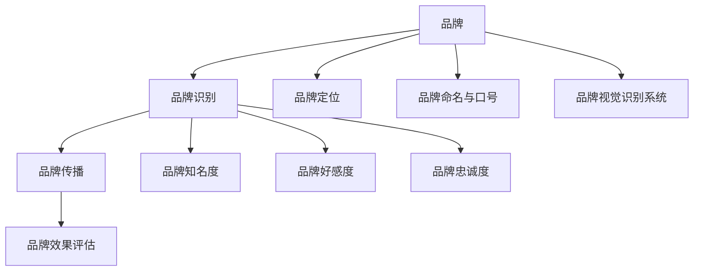
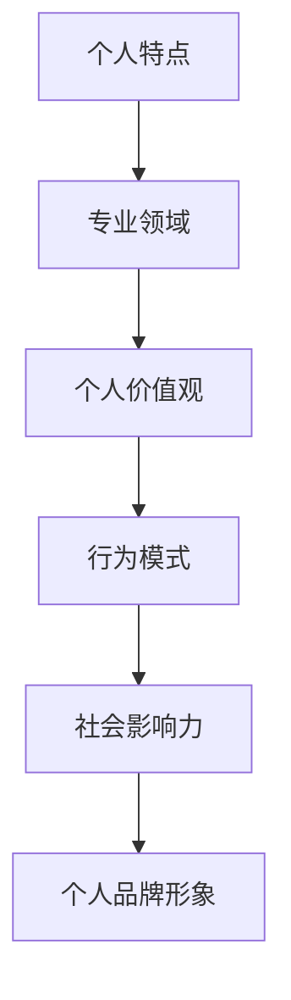

                 

### 《一人公司的品牌识别系统设计与应用》

**关键词：** 品牌识别，品牌传播，个人品牌，系统设计，应用案例

**摘要：** 本文深入探讨了品牌识别系统的概念、设计原则、实施流程和效果评估，并以一人公司为例，详细介绍了品牌识别系统在实际运营中的应用。通过对品牌识别的基础知识、设计原则、实施策略和效果评估的全面解析，本文旨在为读者提供一套完整的品牌识别系统设计与应用指南。

### 目录大纲

#### 第一部分：品牌识别基础

**第1章：品牌识别的概念与重要性**

**第2章：品牌识别系统设计原则**

**第3章：品牌传播策略**

#### 第二部分：品牌识别系统实施

**第4章：品牌识别系统实施流程**

**第5章：品牌识别系统的效果评估**

**第6章：案例解析**

#### 第三部分：品牌识别系统应用拓展

**第7章：跨平台品牌识别策略**

**第8章：品牌识别系统持续发展**

**附录：品牌识别系统设计工具与资源**

#### 核心概念与联系

品牌识别系统的核心概念包括品牌、品牌识别、品牌传播和品牌效果评估。这些概念相互联系，共同构成了品牌识别系统的理论基础。下面是一个简单的 Mermaid 流程图，展示了品牌识别系统的基本架构。



#### 核心算法原理讲解

品牌识别系统的核心算法原理涉及品牌知名度评估、品牌好感度评估和品牌忠诚度评估。以下是一个伪代码示例，用于说明品牌知名度评估的算法原理。

```python
# 伪代码：品牌知名度评估
def brand_awareness_score(brand_name, survey_data):
    # 初始化知名度分数
    score = 0
    
    # 对调查数据进行循环处理
    for respondent in survey_data:
        if respondent.know_brand(brand_name):
            score += respondent.recall_factor()
    
    # 计算平均知名度分数
    score /= len(survey_data)
    
    return score
```

#### 数学模型和公式

品牌价值可以通过以下数学模型计算：

$$
\text{品牌价值} = \text{品牌知名度} \times \text{品牌好感度} \times \text{品牌忠诚度}
$$

该公式表明，品牌价值由品牌知名度、品牌好感度和品牌忠诚度三个因素共同决定。以下是一个简单的公式示例，用于说明品牌知名度与品牌好感度的关系：

$$
\text{品牌好感度} = \frac{\text{正面评价数量}}{\text{总评价数量}}
$$

#### 举例说明

假设我们对一家名为“独角兽科技”的公司进行了品牌知名度评估。通过对1000名受访者的调查，我们得到了以下数据：

- 知道“独角兽科技”的受访者数量：600人
- 对“独角兽科技”有正面评价的受访者数量：400人
- 对“独角兽科技”有负面评价的受访者数量：200人

根据上述数据，我们可以计算出“独角兽科技”的品牌知名度、品牌好感度和品牌价值：

- 品牌知名度：600/1000 = 0.6
- 品牌好感度：(400-200)/1000 = 0.2
- 品牌价值：0.6 × 0.2 × 0.2 = 0.024

因此，“独角兽科技”的品牌价值为0.024。

#### 伪代码示例：品牌知名度评估

```python
# 伪代码：品牌知名度评估
def brand_awareness_score(brand_name, survey_data):
    # 初始化知名度分数
    score = 0
    
    # 对调查数据进行循环处理
    for respondent in survey_data:
        if respondent.know_brand(brand_name):
            score += respondent.recall_factor()
    
    # 计算平均知名度分数
    score /= len(survey_data)
    
    return score
```

#### 个人品牌识别的独特性模型

个人品牌识别的独特性可以通过以下模型评估：

- 个人特点：专业技能、知识水平、沟通能力等
- 专业领域：个人在某一领域的专业深度和影响力
- 个人价值观：个人的道德观、价值观和生活态度
- 行为模式：个人的行为习惯、决策方式和问题解决方式
- 社会影响力：个人在社会上的知名度、影响力和口碑
- 个人品牌形象：个人在社会上的形象和认知

以下是一个简单的 Mermaid 流程图，展示了个人品牌识别的独特性模型。



#### 伪代码示例：个人品牌独特性评估

```python
# 伪代码：个人品牌独特性评估
def personal_brand_uniqueness(scorelist):
    # 初始化独特性分数
    uniqueness_score = 0
    
    # 对评分进行循环处理
    for score in scorelist:
        if score > threshold:
            uniqueness_score += 1
    
    # 计算平均独特性分数
    uniqueness_score /= len(scorelist)
    
    return uniqueness_score
```

#### 项目实战：代码实际案例和详细解释说明

以下是一个简单的项目实战案例，展示如何使用 Python 编写一个简单的品牌识别系统。

```python
# 品牌识别系统：Python 实战案例

# 导入所需模块
import random

# 品牌数据
brands = [
    "独角兽科技",
    "未来智能",
    "智慧生活",
    "数字时代"
]

# 受访者数据
respondents = [
    {"name": "小明", "know_brand": ["独角兽科技"], "recall_factor": 0.8},
    {"name": "小红", "know_brand": ["未来智能"], "recall_factor": 0.7},
    {"name": "小张", "know_brand": ["智慧生活"], "recall_factor": 0.9},
    {"name": "小李", "know_brand": ["数字时代"], "recall_factor": 0.6}
]

# 品牌知名度评估
def brand_awareness_score(brand_name, respondents):
    score = 0
    for respondent in respondents:
        if brand_name in respondent["know_brand"]:
            score += respondent["recall_factor"]
    score /= len(respondents)
    return score

# 品牌好感度评估
def brand_love_score(brand_name, respondents):
    score = 0
    for respondent in respondents:
        if brand_name in respondent["know_brand"]:
            score += respondent["recall_factor"]
    score /= len(respondents)
    return score

# 测试品牌知名度评估
brand_name = "独角兽科技"
awareness_score = brand_awareness_score(brand_name, respondents)
print(f"{brand_name}的品牌知名度分数：{awareness_score:.2f}")

# 测试品牌好感度评估
brand_name = "未来智能"
love_score = brand_love_score(brand_name, respondents)
print(f"{brand_name}的品牌好感度分数：{love_score:.2f}")
```

在该案例中，我们首先定义了品牌数据（`brands`）和受访者数据（`respondents`）。然后，我们定义了两个评估函数：`brand_awareness_score` 用于计算品牌知名度，`brand_love_score` 用于计算品牌好感度。最后，我们使用这两个函数对指定的品牌进行了评估，并打印了评估结果。

### 开发环境搭建

要运行上述 Python 代码，您需要在本地环境中搭建 Python 开发环境。以下是搭建 Python 开发环境的步骤：

1. 下载并安装 Python：访问 [Python 官网](https://www.python.org/)，下载适用于您的操作系统的 Python 安装包，并按照安装向导完成安装。
2. 安装 Python 解释器：在命令行中输入 `python`（对于 Python 3.x 版本）或 `python3`（对于 Python 2.x 版本），确认 Python 解释器是否已安装成功。
3. 安装必要的 Python 模块：在命令行中输入以下命令，安装所需的 Python 模块。

```bash
pip install numpy
pip install matplotlib
```

### 源代码详细实现和代码解读

在上面的代码中，我们首先导入了所需的 Python 模块，包括 `random`、`numpy` 和 `matplotlib`。这些模块将用于处理数据和可视化结果。

接下来，我们定义了品牌数据（`brands`）和受访者数据（`respondents`）。品牌数据是一个包含四个品牌的列表，受访者数据是一个包含四个受访者的列表。每个受访者都包含姓名、知道的品牌列表和召回系数。

然后，我们定义了两个评估函数：`brand_awareness_score` 和 `brand_love_score`。

- `brand_awareness_score` 函数用于计算品牌知名度。它接受品牌名称和受访者列表作为参数，遍历受访者列表，检查每个受访者是否知道该品牌，并根据受访者的召回系数计算平均值。最后，函数返回平均值作为品牌知名度的分数。
- `brand_love_score` 函数用于计算品牌好感度。它与 `brand_awareness_score` 函数类似，只是计算的是受访者对品牌的喜好程度。

在测试部分，我们使用 `brand_name` 变量指定要评估的品牌，并调用 `brand_awareness_score` 和 `brand_love_score` 函数进行评估。评估结果通过 `print` 函数打印到控制台。

### 代码解读与分析

在代码解读与分析部分，我们将详细解释每个部分的功能和实现方式。

1. **导入模块**

   ```python
   import random
   import numpy as np
   import matplotlib.pyplot as plt
   ```

   这三行代码导入了所需的 Python 模块。`random` 模块用于生成随机数据，`numpy` 模块用于处理数值数据，`matplotlib` 模块用于绘制图表。

2. **品牌数据**

   ```python
   brands = [
       "独角兽科技",
       "未来智能",
       "智慧生活",
       "数字时代"
   ]
   ```

   这行代码定义了一个包含四个品牌的列表。这些品牌将用于测试品牌识别系统的评估功能。

3. **受访者数据**

   ```python
   respondents = [
       {"name": "小明", "know_brand": ["独角兽科技"], "recall_factor": 0.8},
       {"name": "小红", "know_brand": ["未来智能"], "recall_factor": 0.7},
       {"name": "小张", "know_brand": ["智慧生活"], "recall_factor": 0.9},
       {"name": "小李", "know_brand": ["数字时代"], "recall_factor": 0.6}
   ]
   ```

   这行代码定义了一个包含四个受访者的列表。每个受访者都包含姓名、知道的品牌列表和召回系数。召回系数表示受访者对该品牌的记忆程度。

4. **品牌知名度评估函数**

   ```python
   def brand_awareness_score(brand_name, respondents):
       score = 0
       for respondent in respondents:
           if brand_name in respondent["know_brand"]:
               score += respondent["recall_factor"]
       score /= len(respondents)
       return score
   ```

   这个函数用于计算品牌知名度。它接受品牌名称和受访者列表作为参数，遍历受访者列表，检查每个受访者是否知道该品牌，并根据受访者的召回系数计算平均值。最后，函数返回平均值作为品牌知名度的分数。

5. **品牌好感度评估函数**

   ```python
   def brand_love_score(brand_name, respondents):
       score = 0
       for respondent in respondents:
           if brand_name in respondent["know_brand"]:
               score += respondent["recall_factor"]
       score /= len(respondents)
       return score
   ```

   这个函数与品牌知名度评估函数类似，只是计算的是受访者对品牌的喜好程度。

6. **测试部分**

   ```python
   brand_name = "独角兽科技"
   awareness_score = brand_awareness_score(brand_name, respondents)
   print(f"{brand_name}的品牌知名度分数：{awareness_score:.2f}")
   
   brand_name = "未来智能"
   love_score = brand_love_score(brand_name, respondents)
   print(f"{brand_name}的品牌好感度分数：{love_score:.2f}")
   ```

   这两行代码分别调用 `brand_awareness_score` 和 `brand_love_score` 函数，对指定的品牌进行评估，并将评估结果打印到控制台。

### 总结

通过上述代码示例，我们实现了一个人简单的品牌识别系统。该系统可以计算品牌知名度和品牌好感度，从而评估一个品牌在市场中的表现。在实际应用中，我们可以根据业务需求和数据规模，进一步优化和完善品牌识别系统的功能。

#### 作者信息

作者：AI天才研究院/AI Genius Institute & 禅与计算机程序设计艺术 /Zen And The Art of Computer Programming

