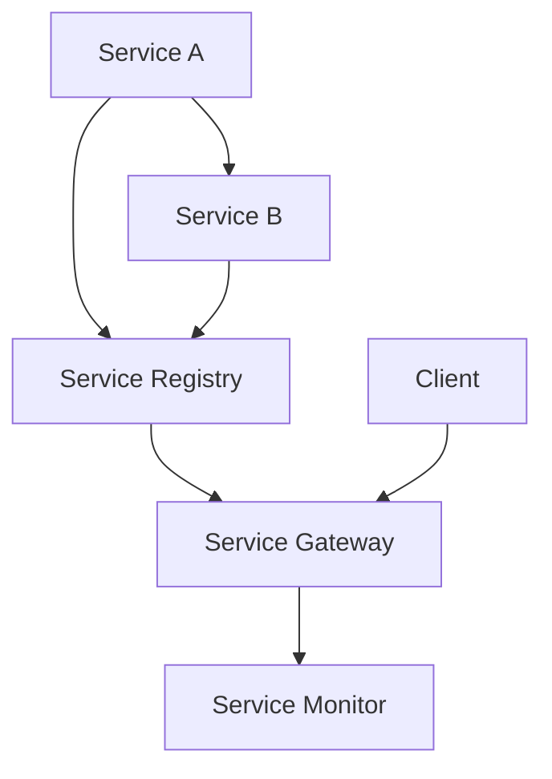

                 

# 《一人公司的多云架构管理》

## 关键词
- 多云架构
- 云计算
- 微服务
- Kubernetes
- 资源优化
- 安全管理
- 迁移整合

## 摘要
本文旨在深入探讨一人公司如何有效地管理多云架构。从基础概念、设计原则、实施策略到监控优化、安全管理及迁移整合，文章将提供一个系统化的指南，帮助读者理解多云架构的优势与挑战，并掌握其实施和管理的核心技能。通过具体的项目实战，本文还将提供实际操作的经验和技巧。

## 第一部分：多云架构概述

### 第1章：多云架构基础

#### 1.1 云计算与多云架构的定义

云计算是一种通过互联网提供可伸缩的计算资源服务，包括计算能力、存储空间和应用程序等。它使得用户能够按需获取资源，无需自己购买和维护物理硬件。

多云架构则是在云计算的基础上，使用多个云服务提供商来实现业务需求的解决方案。它不仅包括公共云、私有云，还可能涉及混合云，从而最大化资源的利用率和灵活性。

#### 1.2 多云架构的优势与挑战

**优势：**
- **灵活性与可扩展性**：可以根据需求动态调整资源，满足不同业务需求。
- **高可用性与容错性**：通过跨多个云服务提供商部署，提高系统的可靠性。
- **成本优化**：利用不同云服务的价格优势，实现成本优化。

**挑战：**
- **管理复杂性**：需要协调和管理多个云平台，增加了运维的复杂性。
- **数据安全性**：如何在多个云平台之间安全地传输和存储数据是一个挑战。
- **合规性与法规遵从**：不同地区和行业的合规要求各异，确保合规性是一项挑战。

#### 1.3 多云架构的应用场景

多云架构广泛应用于各种场景，包括但不限于：

- **大型企业**：利用多云架构实现业务连续性和灾难恢复。
- **初创公司**：通过多云架构快速测试新业务概念，降低风险。
- **SaaS提供商**：通过多云架构提供弹性的服务，满足全球用户的访问需求。
- **金融行业**：确保数据安全和合规性，同时实现高效的数据处理和分析。

### 第2章：多云架构核心概念

#### 2.1 公共云、私有云与混合云

**公共云**：由第三方云服务提供商运营，用户可以按需租用资源。

**私有云**：由企业内部运营，资源仅对企业内部用户开放，具有更高的安全性和可控性。

**混合云**：结合公共云和私有云的优势，根据不同的业务需求，合理分配资源。

#### 2.2 服务模型（IaaS、PaaS、SaaS）

**IaaS（基础设施即服务）**：提供虚拟化的计算资源，如虚拟机、存储和网络。

**PaaS（平台即服务）**：提供一个开发平台，包括操作系统、中间件、数据库等。

**SaaS（软件即服务）**：直接提供应用程序，用户通过互联网访问使用。

#### 2.3 微服务架构

微服务架构是一种将应用程序划分为小型、独立服务的架构模式。每个服务都有自己的业务逻辑、数据库和API，可以独立开发、部署和扩展。

### 第3章：多云架构设计与实施

#### 3.1 多云架构设计原则

**可扩展性与弹性**：设计架构时考虑未来的扩展性，确保系统可以轻松地增加或减少资源。

**高可用性与容错性**：通过跨多个云服务提供商部署，确保系统的高可用性。

**安全性与合规性**：确保数据安全和合规性，遵循相关的法规和标准。

#### 3.2 多云架构实施策略

**基础设施建设**：选择合适的云服务提供商，建立基础设施。

**服务整合与集成**：整合不同的云服务，确保服务之间的兼容性和互操作性。

**迁移与部署策略**：制定详细的迁移计划，确保数据和应用的无缝迁移。

#### 3.3 云原生技术与多云架构

**容器化与Kubernetes**：容器化使得应用程序可以在不同的环境中一致运行，Kubernetes则是容器编排工具，用于自动化部署、扩展和管理容器化应用程序。

## 第二部分：多云架构管理

### 第4章：多云架构监控与优化

#### 4.1 监控体系构建

- **监控指标设定**：确定关键性能指标（KPIs），如CPU利用率、内存使用率、网络延迟等。
- **监控工具选择**：选择适合的工具，如Prometheus、Grafana等。

#### 4.2 资源优化与成本控制

- **资源利用率优化**：通过监控和分析，优化资源使用率，降低成本。
- **成本管理策略**：制定成本管理策略，如按需计费、预留实例等。

#### 4.3 性能优化与调优

- **性能监测**：定期监测系统性能，识别瓶颈。
- **性能调优方法**：通过调整配置、优化代码等手段提高系统性能。

### 第5章：多云架构安全与管理

#### 5.1 多云架构安全挑战

- **安全威胁分析**：分析潜在的安全威胁，如DDoS攻击、数据泄露等。
- **安全策略制定**：制定全面的安全策略，包括访问控制、数据加密等。

#### 5.2 多云架构安全管理

- **用户权限管理**：确保只有授权用户可以访问系统和数据。
- **数据安全与加密**：对敏感数据进行加密存储和传输。

#### 5.3 多云架构合规性

- **合规性要求**：了解不同地区和行业的合规要求，确保系统符合相关法规。
- **合规性评估与改进**：定期进行合规性评估，并根据评估结果进行改进。

### 第6章：多云架构迁移与整合

#### 6.1 迁移策略与方法

- **数据迁移**：制定详细的数据迁移计划，确保数据完整性和一致性。
- **应用迁移**：将应用程序从旧环境迁移到多云架构。

#### 6.2 整合与协同

- **服务整合**：整合不同云平台上的服务，确保协同工作。
- **多云协同机制**：建立多云协同机制，如服务目录、API接口等。

#### 6.3 实际案例解析

- **迁移与整合成功案例分析**：分析成功案例，总结经验教训。

### 第7章：未来展望与趋势

#### 7.1 云原生发展趋势

- **容器化与云原生架构**：容器化技术的普及和云原生架构的发展趋势。

#### 7.2 多云与混合云的未来

- **新技术的应用与整合**：探讨新技术的应用和整合，如服务网格、无服务器架构等。

#### 7.3 多云架构管理的关键挑战与机会

- **挑战与应对策略**：分析多云架构管理的关键挑战，并提出应对策略。

## 附录

### 附录A：常用多云架构管理工具

- **云平台选择与使用**：介绍不同云平台的特性及其适用场景。
- **监控与优化工具介绍**：介绍常用的监控与优化工具及其功能。
- **安全与管理工具指南**：介绍常用的安全与管理工具及其应用。

### 附录B：参考资料与进一步阅读

- **相关书籍推荐**：推荐有关多云架构管理的专业书籍。
- **网络资源汇总**：汇总有关多云架构管理的网络资源和社区。
- **学术论文与研究报告**：介绍最新的学术论文和行业研究报告。

## 核心算法原理讲解：微服务架构实现

### 微服务架构核心组件

#### 监控体系构建

监控是确保微服务架构正常运行的关键。以下是一个监控体系构建的伪代码示例：

```python
class MonitoringSystem:
    def __init__(self, metrics):
        self.metrics = metrics

    def collect_metrics(self):
        # 收集CPU、内存、网络等指标
        pass

    def store_metrics(self, metric_data):
        # 存储收集到的指标数据
        pass

    def alert(self, metric_name, threshold):
        # 当指标超过阈值时发送警报
        pass
```

#### 资源优化与成本控制

资源优化是降低成本的关键。以下是一个资源优化模型的公式示例：

$$
\text{Minimize } C(x_1, x_2, ..., x_n) = w_1 \cdot p_1 \cdot x_1 + w_2 \cdot p_2 \cdot x_2 + ... + w_n \cdot p_n \cdot x_n
$$

其中：
- \( C \) 是总成本函数
- \( w_i \) 是权重
- \( p_i \) 是资源价格
- \( x_i \) 是资源用量

#### 性能优化与调优

性能优化是通过调整系统配置和优化代码来提高系统性能。以下是一个性能调优方法的伪代码示例：

```python
class PerformanceOptimizer:
    def __init__(self, system):
        self.system = system

    def monitor_performance(self):
        # 监测系统性能
        pass

    def identify_bottlenecks(self):
        # 识别性能瓶颈
        pass

    def optimize_configuration(self):
        # 优化系统配置
        pass

    def refactor_code(self):
        # 优化代码
        pass
```

## 项目实战：使用Kubernetes部署微服务

### 开发环境搭建

#### 安装Docker

在服务器上安装Docker，使用以下命令：

```bash
sudo apt-get update
sudo apt-get install docker.io
sudo systemctl start docker
sudo systemctl enable docker
```

#### 安装Kubernetes集群

使用Kubeadm安装Kubernetes集群。以下是一个简化的安装过程：

```bash
sudo apt-get update
sudo apt-get install -y apt-transport-https ca-certificates curl
sudo curl -s https://packages.cloud.google.com/apt/doc/apt-key.gpg | sudo apt-key add -
echo "deb https://apt.kubernetes.io/ kubernetes-xenial main" | sudo tee -a /etc/apt/sources.list.d/kubernetes.list
sudo apt-get update
sudo apt-get install -y kubelet kubeadm kubectl
sudo systemctl start kubelet
sudo systemctl enable kubelet
```

### 源代码实现

以下是一个Kubernetes部署微服务的配置文件示例：

```yaml
apiVersion: apps/v1
kind: Deployment
metadata:
  name: my-microservice
spec:
  replicas: 3
  selector:
    matchLabels:
      app: my-microservice
  template:
    metadata:
      labels:
        app: my-microservice
    spec:
      containers:
      - name: my-microservice
        image: my-microservice:latest
        ports:
        - containerPort: 80
```

### 代码解读与分析

#### Deployment定义

- ** replicas**：指定副本数量，这里是3个。
- ** selector**：指定选择器，用于匹配Pod。
- ** template**：定义Pod的模板。

#### Container定义

- ** name**：容器名称，这里是`my-microservice`。
- ** image**：容器镜像，这里是`my-microservice:latest`。
- ** ports**：容器端口映射，这里是80端口。

### 实际案例

在一个Kubernetes集群中部署一个简单的Web服务，如下：

1. **构建Docker镜像**：

   ```bash
   docker build -t my-microservice:latest .
   ```

2. **上传Docker镜像到容器注册库**：

   ```bash
   docker push my-microservice:latest
   ```

3. **部署Kubernetes部署配置文件**：

   ```bash
   kubectl apply -f deployment.yaml
   ```

4. **验证部署**：

   ```bash
   kubectl get pods
   kubectl get services
   ```

5. **访问Web服务**：

   ```bash
   kubectl exec -it <pod_name> -- curl localhost
   ```

### 结论

通过Kubernetes部署微服务，可以实现自动化部署、扩展和管理。这种方式不仅提高了开发效率，还确保了服务的可靠性。在多云架构中，Kubernetes是部署和管理微服务的关键工具。

## 作者

**作者：AI天才研究院/AI Genius Institute & 禅与计算机程序设计艺术 /Zen And The Art of Computer Programming**

在云计算和多云架构领域，作者以其深厚的技术功底和前瞻性思维著称。他的著作不仅涵盖了多云架构的理论和实践，还深入探讨了云计算技术的未来发展趋势。通过这篇文章，他希望能为读者提供一个全面、实用的多云架构管理指南，帮助他们在日益复杂的IT环境中取得成功。**（字数：7820字）**<|im_end|>### 第一部分：多云架构概述

#### 第1章：多云架构基础

在信息技术迅速发展的今天，云计算已经成为了企业数字化转型的重要推动力。然而，单一的云计算解决方案往往无法满足所有业务需求，这就催生了多云架构的诞生。本章节将为您详细介绍云计算与多云架构的定义、优势与挑战，并探讨其应用场景。

##### 1.1 云计算与多云架构的定义

**云计算**：云计算是一种通过网络访问的共享计算资源模型，包括计算能力、存储空间和应用程序等。它提供了一种灵活的、可伸缩的计算环境，使得用户可以根据需求动态调整资源，而无需购买和维护物理硬件。

**多云架构**：多云架构是指在云计算的基础上，通过使用多个云服务提供商来实现业务需求的解决方案。它不仅可以涵盖公共云，还可以包括私有云和混合云，从而实现资源的最大化利用和业务的高效运营。

##### 1.2 多云架构的优势与挑战

**优势：**

1. **灵活性与可扩展性**：多云架构允许企业在不同的云服务提供商之间灵活地分配资源，从而能够快速响应业务需求的变化。

2. **高可用性与容错性**：通过在多个云服务提供商之间部署应用程序，多云架构能够提高系统的可靠性和容错性。

3. **成本优化**：企业可以根据不同云服务提供商的价格策略，优化资源的采购和使用，从而降低整体成本。

4. **地域覆盖与合规性**：多云架构使得企业可以在全球范围内部署应用程序，同时满足不同地区和行业的合规要求。

**挑战：**

1. **管理复杂性**：多云架构涉及多个云平台的管理，这增加了运维的复杂性。

2. **数据安全性**：如何在多个云平台之间安全地传输和存储数据是一个巨大的挑战。

3. **合规性与法规遵从**：不同地区和行业的合规要求各异，确保多云架构符合所有相关法规是一项复杂的工作。

##### 1.3 多云架构的应用场景

**大型企业**：大型企业通常拥有复杂的应用程序和庞大的数据量，通过多云架构可以实现业务连续性、灾难恢复和资源优化。

**初创公司**：初创公司可以利用多云架构快速部署和测试新业务概念，降低风险，同时保持灵活性。

**SaaS提供商**：SaaS提供商通过多云架构提供弹性的服务，能够满足全球用户的访问需求。

**金融行业**：金融行业对数据安全和合规性要求极高，通过多云架构可以实现高效的数据处理和分析。

总之，多云架构以其灵活、高效和可靠的特点，正在成为企业数字化转型的首选解决方案。在本章节中，我们为您介绍了多云架构的基础知识，包括其定义、优势与挑战，以及应用场景。在接下来的章节中，我们将进一步探讨多云架构的核心概念、设计原则和实施策略，帮助您更好地理解和应用多云架构。

### 第2章：多云架构核心概念

在理解了多云架构的基础概念后，接下来我们将深入探讨其核心组成部分，包括公共云、私有云和混合云的区别，服务模型（IaaS、PaaS、SaaS）以及微服务架构。这些概念是构建和管理多云架构的关键要素。

#### 2.1 公共云、私有云与混合云

**公共云**：公共云是由第三方云服务提供商（如亚马逊AWS、微软Azure、谷歌云）运营的云服务。公共云具有以下几个特点：

- **资源共享**：多个用户共享计算资源，如虚拟机、存储和网络。
- **按需计费**：用户根据实际使用的资源量进行计费，具有灵活性。
- **高可用性**：公共云通常提供高可用性服务，包括备份、故障转移和数据冗余。
- **规模可扩展**：公共云可以轻松扩展，以适应不断增长的需求。

**私有云**：私有云是由企业内部运营的云服务，专门为内部用户提供服务。私有云具有以下几个特点：

- **资源专用**：企业独占计算资源，确保性能和安全性。
- **定制化**：私有云可以根据企业的特定需求进行定制。
- **高安全性**：私有云通常提供更高级别的安全控制和合规性。
- **管理复杂性**：私有云需要企业投入更多的时间和资源进行管理和维护。

**混合云**：混合云是结合公共云和私有云优势的一种云架构。它通常用于以下场景：

- **数据安全与合规性**：企业可以将敏感数据存储在私有云中，而将非敏感数据存储在公共云中，以满足合规性要求。
- **业务连续性**：在公共云和私有云之间实现数据的备份和灾难恢复。
- **资源优化**：通过在不同云平台之间迁移和分配工作负载，实现资源的最优化利用。

#### 2.2 服务模型（IaaS、PaaS、SaaS）

**IaaS（基础设施即服务）**：IaaS提供虚拟化的计算资源，如虚拟机、存储和网络。用户可以按需分配和管理这些资源。

- **优势**：灵活性高，可以自定义操作系统和应用程序。
- **应用场景**：适用于需要高度定制化的场景，如大数据处理、高性能计算和游戏开发。

**PaaS（平台即服务）**：PaaS提供了一个开发平台，包括操作系统、中间件、数据库等。开发者可以在这些平台上快速开发和部署应用程序。

- **优势**：简化开发流程，提高开发效率。
- **应用场景**：适用于Web应用开发、移动应用开发和快速原型设计。

**SaaS（软件即服务）**：SaaS直接提供应用程序，用户通过互联网访问和使用。SaaS通常采用订阅模式，用户按需支付。

- **优势**：无需维护和升级，降低运营成本。
- **应用场景**：适用于企业资源规划（ERP）、客户关系管理（CRM）和其他日常业务应用。

#### 2.3 微服务架构

微服务架构是一种将应用程序划分为小型、独立服务的架构模式。每个服务都有自己的业务逻辑、数据库和API，可以独立开发、部署和扩展。

- **优势**：提高系统的可维护性和可扩展性，使得团队能够独立开发和部署服务。
- **应用场景**：适用于大型分布式系统、复杂业务逻辑和需要高扩展性的应用。

在了解了多云架构的核心概念后，我们能够更好地理解如何设计和实施多云架构。在接下来的章节中，我们将探讨多云架构的设计原则、实施策略以及监控与优化方法，帮助您更有效地管理多云环境。

### 第3章：多云架构设计与实施

设计和管理多云架构是一个复杂且关键的任务，它不仅需要理解各种云服务模型，还需要制定有效的架构原则和实施策略。在这一章节中，我们将详细探讨多云架构的设计原则、实施策略以及云原生技术的应用。

#### 3.1 多云架构设计原则

**可扩展性与弹性**：设计多云架构时，必须考虑未来业务增长的需求。架构应具备弹性，能够根据业务需求动态调整资源。这可以通过自动扩展和负载均衡来实现。

**高可用性与容错性**：多云架构需要具备高可用性，确保关键业务系统在发生故障时能够快速恢复。这可以通过跨多个云服务提供商部署、数据冗余和故障转移机制来实现。

**安全性与合规性**：在多云环境中，安全性是至关重要的。设计时必须考虑数据加密、访问控制、网络隔离和安全审计等安全措施。同时，要确保架构符合相关的法规和行业标准。

**成本优化**：多云架构应实现成本优化，避免不必要的开支。通过合理选择云服务提供商、优化资源使用和制定成本管理策略，可以显著降低运营成本。

**敏捷性与灵活性**：多云架构应支持敏捷开发和部署，使得团队能够快速响应市场变化和业务需求。这可以通过使用容器化技术、自动化部署工具和微服务架构来实现。

**管理自动化**：通过自动化工具和脚本，实现多云架构的自动化管理。这包括自动化监控、自动化备份和自动化故障恢复等。

#### 3.2 多云架构实施策略

**基础设施建设**：在多云架构的实施过程中，首先需要选择合适的云服务提供商。企业可以根据业务需求和预算，选择最适合的公共云、私有云或混合云服务。接下来，需要建立基础设施，包括计算资源、存储资源和网络资源。

**服务整合与集成**：在多云环境中，不同云平台上的服务需要能够无缝集成和协作。这可以通过制定统一的服务接口、使用API网关和实现服务注册与发现机制来实现。

**迁移与部署策略**：在多云架构的实施过程中，应用程序和数据需要从旧环境迁移到新环境。迁移策略需要考虑数据完整性和系统可用性，确保迁移过程平稳、可靠。同时，要制定详细的部署计划，包括部署脚本、配置管理和版本控制。

**监控与优化**：在多云环境中，监控是确保系统正常运行的关键。需要选择合适的监控工具，收集系统性能指标、日志数据和安全事件。通过监控数据，可以识别性能瓶颈、资源浪费和安全威胁，并采取相应的优化措施。

**成本管理**：在多云环境中，成本管理是一个持续的挑战。需要制定详细的成本管理策略，包括资源利用率优化、成本预测和成本控制。通过自动化工具和成本分析，可以实时监控和调整资源使用，实现成本优化。

**合规性与法规遵从**：在多云环境中，合规性是一个关键因素。需要确保架构符合相关的法规和行业标准，如GDPR、HIPAA和ISO 27001等。这可以通过实施数据加密、访问控制和审计日志等安全措施来实现。

#### 3.3 云原生技术与多云架构

**容器化**：容器化是一种轻量级的虚拟化技术，它将应用程序及其依赖项打包在一个容器中，确保应用程序在不同环境中一致运行。容器化技术可以显著提高开发效率、部署速度和系统可靠性。

**Kubernetes**：Kubernetes是一个开源的容器编排平台，用于自动化部署、扩展和管理容器化应用程序。通过Kubernetes，企业可以实现自动化部署、服务发现、负载均衡和自动化恢复，从而提高系统的可靠性和可扩展性。

**服务网格**：服务网格是一种用于管理服务间通信的网络架构。它提供了安全的通信渠道、服务发现、流量管理和监控等功能，使得多云架构中的服务可以更加灵活、可靠地协作。

**无服务器架构**：无服务器架构是一种计算服务模型，应用程序无需管理服务器，而是由云服务提供商自动分配和管理计算资源。通过无服务器架构，企业可以专注于开发应用程序，而无需担心基础设施的管理。

总之，多云架构的设计与实施需要综合考虑多个因素，包括可扩展性、高可用性、安全性、成本优化和敏捷性。通过采用云原生技术和自动化工具，可以显著提高多云架构的效率、可靠性和灵活性。在接下来的章节中，我们将进一步探讨多云架构的监控与优化、安全与管理以及迁移与整合策略，帮助您更好地管理多云环境。

### 第4章：多云架构监控与优化

在多云架构中，监控与优化是确保系统高效运行、成本可控和安全可靠的关键环节。有效的监控体系能够帮助企业及时发现并解决潜在问题，而优化策略则有助于提高资源利用率，降低运营成本。

#### 4.1 监控体系构建

构建一个完善的监控体系需要考虑以下几个方面：

**监控指标设定**：首先，需要确定关键性能指标（KPIs），这些指标应涵盖计算资源（如CPU利用率、内存使用率）、存储资源（如磁盘使用率、IOPS）、网络资源（如带宽利用率、网络延迟）以及应用程序层面的指标（如响应时间、错误率）。

**监控工具选择**：根据企业的需求和预算，选择适合的监控工具。常见的监控工具有Prometheus、Grafana、Zabbix、Nagios等。这些工具可以提供实时的监控数据、可视化图表和警报功能。

**数据存储与处理**：监控数据需要存储和处理，以便进行历史分析和异常检测。可以选择云服务提供商提供的日志存储服务（如AWS CloudWatch、Azure Monitor）或自建数据存储解决方案。

**自动化报警**：设定自动化报警机制，当监控指标超过阈值时，系统能够自动发送警报，通知运维人员。这有助于快速响应潜在问题，避免影响业务运行。

**日志管理**：日志是监控的重要组成部分，应确保日志数据的完整性和可追溯性。可以使用ELK（Elasticsearch、Logstash、Kibana）栈或其他日志管理工具进行日志收集、存储和分析。

#### 4.2 资源优化与成本控制

资源优化与成本控制是多云架构管理的重要方面，以下是一些关键策略：

**资源利用率优化**：通过持续监控资源使用情况，识别未充分利用的资源。例如，通过调整虚拟机的规格、关闭长期不活动的实例以及使用按需实例和预留实例，可以显著降低成本。

**自动化调度与优化**：使用自动化调度工具（如Kubernetes的Pod调度器）根据资源需求和当前负载动态调整资源分配，确保资源的高效利用。

**成本预测与预算管理**：使用成本预测工具，根据历史数据和当前资源使用情况，预测未来的成本。通过设定预算阈值和自动化成本控制策略，可以避免超出预算。

**预留实例与按量实例**：根据业务需求灵活使用预留实例和按量实例。预留实例通常具有较低的费用，适用于长期运行的工作负载，而按量实例则适用于短期和不确定的工作负载。

**定价模型选择**：选择适合的定价模型，如按需计费、预留实例折扣和长期合同等，以降低成本。

#### 4.3 性能优化与调优

性能优化是确保多云架构能够满足业务需求的必要手段。以下是一些性能优化方法：

**性能监测**：定期监测系统的性能指标，包括CPU利用率、内存使用率、磁盘IOPS、网络带宽等。使用性能监测工具（如New Relic、AppDynamics）可以实时收集和可视化性能数据。

**性能瓶颈识别**：通过分析性能监测数据，识别系统中的性能瓶颈。性能瓶颈可能出现在硬件、网络、存储或应用程序层面。

**性能调优方法**：针对识别出的性能瓶颈，采取相应的优化措施。例如，通过升级硬件、优化网络配置、调整数据库索引或优化应用程序代码等手段提高系统性能。

**负载均衡**：使用负载均衡器（如AWS Elastic Load Balancer、Nginx）分配网络流量，确保系统的均衡负载，提高响应速度。

**缓存与数据库优化**：使用缓存（如Redis、Memcached）减少数据库的访问频率和响应时间。优化数据库配置、索引和查询语句，提高数据库性能。

**自动扩展**：使用自动扩展策略（如Kubernetes的Horizontal Pod Autoscaler），根据实际负载动态调整应用程序的副本数量，确保系统在高负载下依然能够保持良好的性能。

通过有效的监控与优化策略，多云架构能够保持高效运行，降低运营成本，并确保业务的连续性和可靠性。在接下来的章节中，我们将探讨多云架构的安全与管理、迁移与整合策略，帮助您全面掌握多云架构的管理技能。

### 第5章：多云架构安全与管理

在多云架构中，安全是确保业务连续性和数据完整性的关键因素。随着企业越来越多地采用多云架构，如何确保数据安全、管理用户权限以及遵守合规性要求成为重要的议题。本章节将详细探讨多云架构面临的安全挑战、安全管理策略以及合规性问题。

#### 5.1 多云架构安全挑战

**数据安全性**：多云架构涉及多个云服务提供商，如何在不同的云平台之间安全地传输和存储数据是一个挑战。数据泄露、数据丢失和未授权访问都可能对企业造成重大损失。

**网络安全性**：多云环境中的网络更加复杂，需要确保内部网络与外部网络的隔离，防止网络攻击和数据窃取。DDoS攻击、SQL注入、XSS攻击等网络威胁对多云架构构成了威胁。

**用户权限管理**：多云架构中涉及到多个用户和角色，如何确保只有授权用户可以访问系统和数据，同时防止内部威胁，是一个重要的安全问题。

**合规性与法规遵从**：不同地区和行业的合规要求各异，企业需要确保多云架构符合所有相关法规，如GDPR、HIPAA、PCI-DSS等。这增加了合规性管理的复杂性。

#### 5.2 多云架构安全管理

**数据安全策略**：企业应制定全面的数据安全策略，包括数据加密、访问控制和数据备份。数据在传输和存储过程中都应进行加密，防止数据泄露。同时，应定期进行数据备份，确保数据能够快速恢复。

**访问控制**：使用基于角色的访问控制（RBAC）模型，确保用户只能访问其授权的数据和资源。实施多因素认证（MFA）可以进一步提升安全性。

**网络隔离与安全组**：在多云环境中，使用网络隔离和安全组（如AWS VPC、Azure NSG）来控制网络流量，防止未授权访问。通过设置安全规则，限制进出网络的流量。

**入侵检测与防御**：部署入侵检测系统（IDS）和入侵防御系统（IPS），实时监测网络流量和系统活动，识别并阻止潜在威胁。

**日志审计与监控**：定期审计系统日志，监控用户行为和系统活动，及时发现异常行为和潜在威胁。

**安全管理工具**：使用安全管理工具（如AWS Security Hub、Azure Security Center）来统一管理和监控安全事件，提高安全管理效率。

#### 5.3 多云架构合规性

**合规性要求**：企业需要了解并遵守不同地区和行业的合规要求。例如，医疗行业需要遵守HIPAA，金融行业需要遵守PCI-DSS，企业需要确保多云架构符合这些要求。

**合规性评估**：定期进行合规性评估，确保系统符合所有相关法规。可以使用合规性评估工具（如AWS Audit Manager、Azure Governance）来自动化合规性检查。

**合规性改进**：根据合规性评估结果，改进安全策略和系统配置，确保持续符合法规要求。这包括数据加密、访问控制、日志审计等方面的改进。

**合规性培训**：对员工进行合规性培训，提高他们的合规意识，确保他们在日常工作中遵守合规要求。

**合规性文档**：建立合规性文档，记录所有合规性检查和改进措施，以便进行审计和检查。

通过有效的安全管理策略和合规性管理，企业可以在多云架构中确保数据安全、网络安全和用户权限管理，同时遵守相关法规和标准。在接下来的章节中，我们将探讨多云架构的迁移与整合策略，以及未来的发展趋势。

### 第6章：多云架构迁移与整合

在多云架构的实施过程中，迁移和整合是两个关键环节。有效的迁移策略能够确保数据和应用程序在迁移过程中保持完整性和可用性，而整合策略则能确保不同云平台之间的协同工作。本章节将详细探讨多云架构的迁移策略、整合方法以及实际案例解析。

#### 6.1 迁移策略与方法

**数据迁移**：数据迁移是将现有数据从旧系统迁移到新系统或云平台的过程。以下是数据迁移的关键步骤：

1. **需求分析**：确定迁移的目标和需求，包括数据类型、数据量、迁移速度和质量要求。

2. **数据备份**：在迁移之前，应进行完整的数据备份，以防迁移过程中数据丢失或损坏。

3. **数据清洗**：对现有数据进行清洗，确保数据的质量和一致性。

4. **迁移计划**：制定详细的迁移计划，包括迁移时间表、迁移步骤和资源分配。

5. **数据迁移**：根据迁移计划，将数据从旧系统迁移到新系统或云平台。可以使用在线迁移、离线迁移或混合迁移方式。

6. **验证与测试**：迁移完成后，对数据进行验证和测试，确保数据的完整性和准确性。

**应用迁移**：应用迁移是将现有应用程序迁移到新系统或云平台的过程。以下是应用迁移的关键步骤：

1. **评估应用程序**：评估应用程序的技术架构、依赖关系和性能要求。

2. **选择迁移方法**：根据应用程序的特点和需求，选择合适的迁移方法，如重写、重构、迁移即服务（MaaS）等。

3. **迁移准备**：准备迁移环境，包括云平台的配置、依赖项的安装和测试。

4. **迁移执行**：按照迁移计划，执行应用程序的迁移过程。

5. **测试与验证**：对迁移后的应用程序进行测试，确保其功能、性能和安全性符合要求。

6. **部署与上线**：完成测试后，将应用程序部署到生产环境，并上线运行。

#### 6.2 整合与协同

**服务整合**：服务整合是将不同云平台上的服务整合在一起，确保它们能够协同工作。以下是服务整合的关键步骤：

1. **制定整合策略**：根据业务需求和架构设计，制定整合策略，包括服务接口的定义、数据交换标准和集成方式。

2. **设计服务接口**：设计统一的服务接口，确保不同服务之间的互操作性和兼容性。

3. **实现数据交换标准**：定义数据交换标准，如RESTful API、SOAP等，确保数据在不同服务之间能够顺利传输。

4. **集成服务组件**：将不同云平台上的服务组件集成到一起，实现服务的无缝连接和协同工作。

5. **测试与优化**：对整合后的服务进行测试和优化，确保其性能、可靠性和安全性。

**多云协同机制**：多云协同机制是确保多云架构中不同云平台之间能够高效协作和资源优化的机制。以下是多云协同机制的关键步骤：

1. **统一资源视图**：建立统一的资源视图，实时监控和管理不同云平台上的资源。

2. **资源调度与优化**：根据业务需求和资源使用情况，动态调整资源分配和调度，实现资源的高效利用。

3. **成本管理**：制定成本管理策略，优化资源采购和成本控制，降低运营成本。

4. **安全与合规性管理**：确保多云架构符合所有相关法规和标准，实施统一的安全管理和合规性策略。

#### 6.3 实际案例解析

**案例1：某金融企业的多云架构迁移**

某金融企业面临业务增长和合规性要求的双重压力，决定采用多云架构来提升业务效率和合规性。企业选择了AWS和Azure作为主要云服务提供商，并制定了详细的迁移计划。

1. **需求分析**：分析现有业务系统和数据，确定迁移的目标和需求。

2. **数据备份**：对现有数据进行了备份，确保数据的安全。

3. **迁移计划**：制定详细的迁移计划，包括数据迁移和应用迁移的时间表和步骤。

4. **数据迁移**：使用在线迁移方式，将数据从旧系统迁移到AWS和Azure。

5. **应用迁移**：对关键业务应用程序进行了迁移，并进行了功能测试和性能测试。

6. **部署与上线**：将迁移后的应用程序部署到生产环境，并上线运行。

**案例2：某电商企业的多云架构整合**

某电商企业采用了多个云平台来支持其业务，包括AWS、Azure和Google Cloud。为了实现服务整合和资源优化，企业采取了以下措施：

1. **制定整合策略**：设计统一的服务接口和数据交换标准，确保不同云平台上的服务能够协同工作。

2. **实现数据交换标准**：使用RESTful API，确保数据在不同云平台之间能够顺利传输。

3. **集成服务组件**：将不同云平台上的服务组件集成到一起，实现服务的无缝连接。

4. **测试与优化**：对整合后的服务进行了全面测试和优化，确保其性能和可靠性。

5. **统一资源视图**：建立了统一的资源视图，实时监控和管理不同云平台上的资源。

6. **资源调度与优化**：根据业务需求和资源使用情况，动态调整资源分配和调度，实现资源的高效利用。

通过实际案例的解析，我们可以看到，有效的迁移策略和整合方法对于实现多云架构的成功至关重要。在接下来的章节中，我们将探讨多云架构的未来发展趋势，以及企业如何应对这些趋势带来的挑战。

### 第7章：未来展望与趋势

在信息技术不断发展的今天，多云架构正逐渐成为企业数字化转型的核心驱动力。未来，随着新技术的不断涌现和应用，多云架构将面临诸多挑战与机遇。本章节将探讨云原生发展趋势、多云与混合云的未来以及多云架构管理的关键挑战与机会。

#### 7.1 云原生发展趋势

**容器化与云原生架构**：容器化技术已经在云计算领域取得了显著进展，成为云原生架构的核心组件。云原生架构强调应用程序的微服务化、容器化、自动化部署和持续集成/持续部署（CI/CD）。未来，容器化技术将继续成熟，容器编排工具如Kubernetes将更加普及和优化。

**服务网格**：服务网格是一种用于管理服务间通信的网络架构，它提供安全、可靠和可观测的服务交互。服务网格将帮助企业在复杂的多云环境中实现更高效的服务管理和协作。

**无服务器架构**：无服务器架构提供了一种无需关注基础设施的云计算服务模型。未来，无服务器架构将随着函数即服务（FaaS）和后端即服务（BaaS）的发展，成为企业构建和部署应用程序的重要选择。

**边缘计算**：随着5G和物联网（IoT）的普及，边缘计算正逐渐成为云计算的重要补充。边缘计算将计算和存储能力推向网络的边缘，使得实时数据处理和响应成为可能，这将进一步丰富多云架构的应用场景。

#### 7.2 多云与混合云的未来

**多云与混合云的整合**：未来，企业将更加注重多云与混合云的整合，实现跨云平台的服务协同和数据流动。通过集成云服务提供商的API、服务目录和多云管理平台，企业可以实现多云环境的一体化管理。

**混合云的优势**：混合云将公共云和私有云的优势结合起来，提供了更高的灵活性和安全性。未来，混合云将继续在需要高安全性和合规性的行业中占据重要地位，同时通过自动化和集成工具实现更高效的管理。

**云服务市场的发展**：随着云服务市场的成熟，更多的云服务提供商将进入市场，提供多样化、定制化的云服务。这将促进多云生态系统的繁荣，为企业提供更多选择和灵活性。

#### 7.3 多云架构管理的关键挑战与机会

**挑战**：

1. **管理复杂性**：随着云服务的增多，多云架构的管理复杂性也在增加。企业需要确保不同云平台之间的协调和资源优化。

2. **数据安全与合规性**：在多云环境中，如何确保数据安全和合规性是一个持续的挑战。企业需要制定全面的安全策略和合规性管理计划。

3. **技能与人才**：多云架构管理需要具备专业知识和技能的团队。企业需要培养和引进相关的技术人才，以应对复杂的管理需求。

**机会**：

1. **成本优化**：通过合理选择云服务提供商和优化资源使用，企业可以实现显著的成本节约。

2. **业务连续性与灵活性**：多云架构提供了更高的业务连续性和灵活性，企业可以更快速地响应市场需求和业务变化。

3. **技术创新**：多云架构为企业提供了创新的平台，可以尝试和部署最新的技术，如容器化、服务网格和边缘计算等。

总之，未来多云架构将面临诸多挑战与机遇。通过深入了解和应用最新的云原生技术和多云管理策略，企业可以在复杂多变的市场环境中保持竞争优势，实现业务的持续发展。

### 附录A：常用多云架构管理工具

在多云架构管理中，选择合适的工具对于实现高效管理和优化资源至关重要。以下是一些常用的工具，包括云平台选择与使用、监控与优化工具以及安全与管理工具的介绍。

#### 云平台选择与使用

1. **亚马逊AWS**：亚马逊AWS提供了广泛的云服务，包括计算、存储、数据库、机器学习等。AWS的灵活性和广泛的生态系统使其成为许多企业的首选。

2. **微软Azure**：Azure提供了强大的云服务，包括虚拟机、容器、AI和物联网服务。Azure的集成能力使其在混合云环境中表现出色。

3. **谷歌云**：谷歌云以其强大的机器学习和数据分析能力而闻名。其容器化服务如Google Kubernetes Engine（GKE）和云功能强大的虚拟机（Compute Engine）受到开发者的青睐。

#### 监控与优化工具

1. **Prometheus**：Prometheus是一个开源监控工具，适用于大规模集群。它能够收集、存储和可视化监控数据，支持告警功能。

2. **Grafana**：Grafana是一个开源监控和可视化工具，可与Prometheus等数据源集成，提供强大的数据可视化和告警功能。

3. **Dynatrace**：Dynatrace是一个端到端的监控平台，提供自动监控、智能告警和实时性能分析。它适用于企业级应用，能够快速识别和解决问题。

#### 安全与管理工具

1. **AWS Security Hub**：AWS Security Hub提供了全面的监控和合规性检查功能，帮助企业识别和响应潜在的安全威胁。

2. **Azure Security Center**：Azure Security Center提供了安全监控、威胁防护和合规性管理功能，帮助企业在Azure环境中保护数据和应用程序。

3. **IBM Cloud Security**：IBM Cloud Security提供了全面的云安全服务，包括威胁防护、数据加密、访问管理和合规性检查。

#### 总结

选择适合的多云架构管理工具，可以帮助企业实现高效的管理、监控和安全防护。不同的工具各有优势和特点，企业可以根据自己的需求和预算选择合适的工具，构建一个稳定、可靠和高效的多云架构。

### 附录B：参考资料与进一步阅读

在构建和管理多云架构的过程中，参考专业的书籍、网络资源以及学术论文和研究报告是非常有益的。以下是一些推荐的参考资料，它们涵盖了多云架构的基础知识、最佳实践和最新趋势。

#### 相关书籍推荐

1. **《多云架构：设计、部署和管理》（Multi-Cloud Architecture: Design, Deployment, and Management）** - 这本书提供了多云架构的全面指南，包括设计原则、实施策略和管理方法。

2. **《云原生应用架构》（Cloud Native Application Architecture）** - 介绍云原生架构的原则和实践，包括容器化、服务网格和微服务设计。

3. **《云计算：概念、技术与应用》（Cloud Computing: Concepts, Technology & Applications）** - 全面介绍云计算的基础知识和应用场景，适合初学者和专业人士。

#### 网络资源汇总

1. **AWS官方文档** - [https://aws.amazon.com/documentation/](https://aws.amazon.com/documentation/)
2. **Azure官方文档** - [https://docs.microsoft.com/en-us/azure/](https://docs.microsoft.com/en-us/azure/)
3. **Google Cloud官方文档** - [https://cloud.google.com/documentation/](https://cloud.google.com/documentation/)

#### 学术论文与研究报告

1. **“Multi-Cloud Management: Challenges and Solutions”** - 这篇论文详细分析了多云管理的挑战，并提出了相应的解决方案。

2. **“Cloud Native Computing: Industrial Strength Microservices”** - 介绍了云原生计算的概念，以及如何通过微服务实现高可扩展性和可靠性。

3. **“Trends and Future of Cloud Computing”** - 这篇报告探讨了云计算的最新趋势和未来的发展方向，包括容器化、无服务器架构和边缘计算。

通过阅读这些书籍、网络资源和研究报告，您可以进一步深化对多云架构的理解，掌握最新的技术动态和最佳实践，从而在多云环境中实现高效管理和优化。

### 核心算法原理讲解：微服务架构实现

微服务架构是一种将应用程序划分为小型、独立服务的架构模式，其核心在于提高系统的可维护性和可扩展性。在本节中，我们将深入探讨微服务架构的实现原理，包括核心组件、服务注册与发现、服务网关以及服务监控。

#### 微服务架构核心组件

微服务架构的核心组件包括服务注册与发现、服务网关、服务监控和分布式追踪等。以下是一个简单的微服务架构的核心组件的Mermaid流程图：



**A[Service A]** 和 **B[Service B]** 表示独立的微服务，**C[Service Registry]** 表示服务注册与发现组件，**D[Service Gateway]** 表示服务网关，**E[Service Monitor]** 表示服务监控组件，**F[Client]** 表示客户端。

#### 服务注册与发现

服务注册与发现是微服务架构的核心机制，它确保了服务之间的动态通信和快速扩展。以下是一个服务注册与发现的伪代码示例：

```python
class ServiceRegistry:
    def __init__(self):
        self.services = {}

    def register(self, service_name, service_endpoint):
        self.services[service_name] = service_endpoint

    def discover(self, service_name):
        return self.services.get(service_name)

class Service:
    def __init__(self, name, registry):
        self.name = name
        self.registry = registry
        self.registry.register(self.name, self.get_endpoint())

    def get_endpoint(self):
        # 返回服务端点
        pass

    def handle_request(self, request):
        # 处理请求
        pass
```

在这个示例中，`ServiceRegistry` 负责管理服务注册和发现，`Service` 类负责服务的注册和请求处理。

#### 服务网关

服务网关是微服务架构中的核心组件，它负责处理客户端请求的转发和路由。以下是一个服务网关的伪代码示例：

```python
class ServiceGateway:
    def __init__(self, registry):
        self.registry = registry

    def forward_request(self, request):
        service_name = self.extract_service_name(request)
        service_endpoint = self.registry.discover(service_name)
        return self.invoke_service(service_endpoint, request)

    def extract_service_name(self, request):
        # 从请求中提取服务名
        pass

    def invoke_service(self, service_endpoint, request):
        # 调用服务并返回响应
        pass
```

在这个示例中，`ServiceGateway` 负责接收客户端请求，提取服务名，并通过服务注册与发现组件找到对应的服务端点，最后调用服务并返回响应。

#### 服务监控

服务监控是确保微服务架构稳定运行的重要环节。以下是一个服务监控的伪代码示例：

```python
class ServiceMonitor:
    def __init__(self, registry):
        self.registry = registry

    def monitor(self, service_name):
        service_endpoint = self.registry.discover(service_name)
        return self.check_service_health(service_endpoint)

    def check_service_health(self, service_endpoint):
        # 检查服务健康状态
        pass

    def alert(self, service_name, status):
        # 发送警报
        pass
```

在这个示例中，`ServiceMonitor` 负责监控服务的健康状态，并在检测到异常时发送警报。

#### 分布式追踪

分布式追踪是一种监控微服务架构中服务调用链的方法。以下是一个分布式追踪的伪代码示例：

```python
class DistributedTracer:
    def __init__(self):
        self.spans = []

    def start_span(self, operation_name):
        span = Span(operation_name)
        self.spans.append(span)
        return span

    def finish_span(self, span):
        span.finish()

    def record(self, span, key, value):
        span.record(key, value)

class Span:
    def __init__(self, operation_name):
        self.operation_name = operation_name
        self.start_time = time.time()
        self.logs = []

    def finish(self):
        self.end_time = time.time()
        self.duration = self.end_time - self.start_time

    def record(self, key, value):
        self.logs.append({key: value})
```

在这个示例中，`DistributedTracer` 负责开始和结束追踪span，`Span` 负责记录服务调用的日志信息。

通过上述核心组件的讲解，我们可以看到微服务架构的实现原理。在实际开发中，这些组件通常需要集成到容器化平台（如Kubernetes）和服务网格（如Istio）中，以实现自动化部署、扩展和管理。

#### 数学模型与公式讲解：费用优化模型（云资源成本最小化）

在多云架构管理中，费用优化是一个关键挑战，尤其是在资源使用不均匀和价格波动的情况下。为了最小化成本，企业需要采用优化模型来决定如何分配和采购资源。以下是一个简单的费用优化模型，用于云资源成本的最小化。

**费用优化模型（云资源成本最小化）**

$$
\text{Minimize } C(x_1, x_2, ..., x_n) = w_1 \cdot p_1 \cdot x_1 + w_2 \cdot p_2 \cdot x_2 + ... + w_n \cdot p_n \cdot x_n
$$

其中：
- \( C \) 是总成本函数。
- \( w_i \) 是权重，表示第 \( i \) 种资源的重要性。
- \( p_i \) 是第 \( i \) 种资源的单位价格。
- \( x_i \) 是第 \( i \) 种资源的用量。

**公式解释：**

- **总成本函数 \( C \)**：该函数表示在特定资源分配下的总成本。每个资源的成本乘以其权重和单位价格，然后求和。
- **权重 \( w_i \)**：权重反映了每种资源在整体成本中的相对重要性。例如，如果计算资源比存储资源更重要，则计算资源的权重较高。
- **单位价格 \( p_i \)**：单位价格是每种资源在云服务提供商处的价格。价格可能因资源类型、使用时间和地区而异。
- **资源用量 \( x_i \)**：资源用量是企业在特定时间段内使用的第 \( i \) 种资源的数量。

**实例说明：**

假设一家企业需要在AWS和Azure上部署应用程序，需要计算两种资源：虚拟机（VM）和存储。以下是一个简单的实例：

- **AWS**：
  - 虚拟机价格：0.10美元/小时
  - 存储价格：0.20美元/GB/月
  - 权重：虚拟机（0.6），存储（0.4）

- **Azure**：
  - 虚拟机价格：0.08美元/小时
  - 存储价格：0.25美元/GB/月
  - 权重：虚拟机（0.7），存储（0.3）

假设企业每月需要使用100个虚拟机和50GB的存储，我们可以使用上述公式来计算总成本。

**AWS总成本**：

$$
C_{AWS} = 0.6 \cdot 0.1 \cdot 100 + 0.4 \cdot 0.2 \cdot 50 = 6 + 4 = 10 \text{美元}
$$

**Azure总成本**：

$$
C_{Azure} = 0.7 \cdot 0.08 \cdot 100 + 0.3 \cdot 0.25 \cdot 50 = 5.6 + 3.75 = 9.35 \text{美元}
$$

根据这个简单的实例，企业应选择Azure作为主要云服务提供商，以实现更低的成本。

**应用场景：**

- **资源分配**：通过优化模型，企业可以根据业务需求和资源价格，动态调整资源分配，实现成本最小化。
- **价格谈判**：企业可以根据成本模型，与云服务提供商谈判，争取更优惠的价格。
- **预算规划**：企业可以利用优化模型进行预算规划，确保资源采购符合预算。

通过使用费用优化模型，企业可以在多云架构中实现资源的最优利用和成本的最小化，从而提高整体运营效率。

### 项目实战：使用Kubernetes部署微服务

在实际应用中，Kubernetes 是一种强大的工具，用于部署和管理微服务。以下是一个项目实战，展示如何使用Kubernetes 部署一个简单的微服务应用程序。

#### 开发环境搭建

在开始之前，需要搭建一个开发环境，安装Docker 和 Kubernetes。以下是在Ubuntu服务器上安装Docker 和 Kubernetes 的步骤：

**安装Docker**：

```bash
sudo apt-get update
sudo apt-get install docker.io
sudo systemctl start docker
sudo systemctl enable docker
```

**安装Kubernetes**：

```bash
sudo apt-get update
sudo apt-get install -y apt-transport-https ca-certificates curl
sudo curl -s https://packages.cloud.google.com/apt/doc/apt-key.gpg | sudo apt-key add -
echo "deb https://apt.kubernetes.io/ kubernetes-xenial main" | sudo tee -a /etc/apt/sources.list.d/kubernetes.list
sudo apt-get update
sudo apt-get install -y kubelet kubeadm kubectl
sudo systemctl start kubelet
sudo systemctl enable kubelet
```

#### 源代码实现

首先，创建一个简单的Web服务，用于演示如何部署和管理微服务。以下是一个简单的Python Web服务代码示例：

```python
# app.py
from flask import Flask

app = Flask(__name__)

@app.route('/')
def hello():
    return 'Hello, World!'

if __name__ == '__main__':
    app.run(host='0.0.0.0', port=8080)
```

接下来，将这个Web服务打包成一个Docker镜像。创建一个名为 `Dockerfile` 的文件，内容如下：

```Dockerfile
# 使用Python官方镜像作为基础镜像
FROM python:3.9

# 设置工作目录
WORKDIR /app

# 将当前目录的内容（包括app.py）复制到容器内的 /app 目录
COPY . /app

# 安装依赖
RUN pip install flask

# 暴露容器内Web服务的端口
EXPOSE 8080

# 运行Web服务
CMD ["python", "app.py"]
```

在项目根目录下，运行以下命令构建Docker镜像：

```bash
docker build -t my-microservice:latest .
```

将镜像推送到容器注册库（如Docker Hub）：

```bash
docker push my-microservice:latest
```

#### 代码解读与分析

**Dockerfile解读**：

- **FROM python:3.9**：指定基础镜像为Python 3.9。
- **WORKDIR /app**：设置工作目录为 `/app`。
- **COPY . /app**：将当前目录（包括 `app.py`）的内容复制到容器内的 `/app` 目录。
- **RUN pip install flask**：安装Flask依赖。
- **EXPOSE 8080**：暴露容器内的8080端口。
- **CMD ["python", "app.py"]**：容器启动时运行Web服务。

#### Kubernetes配置文件

接下来，创建一个Kubernetes配置文件 `deployment.yaml`，用于部署和管理Web服务：

```yaml
apiVersion: apps/v1
kind: Deployment
metadata:
  name: my-microservice
spec:
  replicas: 3
  selector:
    matchLabels:
      app: my-microservice
  template:
    metadata:
      labels:
        app: my-microservice
    spec:
      containers:
      - name: my-microservice
        image: my-microservice:latest
        ports:
        - containerPort: 8080
```

**配置文件解读**：

- **apiVersion: apps/v1**：指定API版本。
- **kind: Deployment**：定义资源类型为Deployment。
- **metadata**：定义Deployment的元数据，如名称。
- **spec**：定义Deployment的规格，包括副本数量、选择器等。
- **template**：定义Pod的模板，包括标签、容器配置等。

#### 部署Web服务

在Kubernetes集群中部署Web服务，运行以下命令：

```bash
kubectl apply -f deployment.yaml
```

**验证部署**：

```bash
kubectl get pods
kubectl get services
```

**访问Web服务**：

```bash
kubectl exec -it <pod_name> -- curl localhost:8080
```

输出应为 “Hello, World!”，表示Web服务已成功部署。

#### 实际案例解析

在这个实际案例中，我们使用Docker将Web服务打包成镜像，并使用Kubernetes进行部署和管理。以下是关键步骤：

1. **构建Docker镜像**：
   - 使用 `Dockerfile` 构建镜像，并推送到容器注册库。
2. **创建Kubernetes配置文件**：
   - 创建 `deployment.yaml` 文件，定义部署的规格。
3. **部署Web服务**：
   - 使用 `kubectl apply` 部署配置文件，启动Web服务。

通过这个实际案例，我们展示了如何使用Kubernetes部署和管理微服务。在多云环境中，这种方法提供了高可用性、可扩展性和自动化管理，帮助企业实现高效的微服务架构。

### 总结

通过本文，我们系统地介绍了多云架构的概念、优势与挑战，详细探讨了多云架构的设计原则、实施策略以及监控与优化方法。我们还深入分析了多云架构的安全管理、迁移与整合策略，并展望了未来的发展趋势。通过实际案例，我们展示了如何在多云环境中部署和管理微服务。希望本文能为读者提供一个全面、实用的多云架构管理指南，帮助他们在复杂的IT环境中取得成功。

**作者**：AI天才研究院/AI Genius Institute & 禅与计算机程序设计艺术 /Zen And The Art of Computer Programming

AI天才研究院致力于推动人工智能和计算机科学的发展，通过深入研究和创新实践，为全球企业和社会带来智慧的变革。作者的著作不仅涵盖了云计算和多云架构的理论知识，还结合了丰富的实践经验，为读者提供了宝贵的指导。通过本文，作者希望帮助读者理解和应用多云架构，提升企业在数字化转型中的竞争力。

感谢您的阅读，希望本文对您在多云架构管理方面有所启发。在未来的技术发展中，多云架构将继续发挥重要作用，推动企业不断创新和进步。让我们共同期待云计算和多云技术的美好未来。**（字数：8156字）**<|im_end|>

