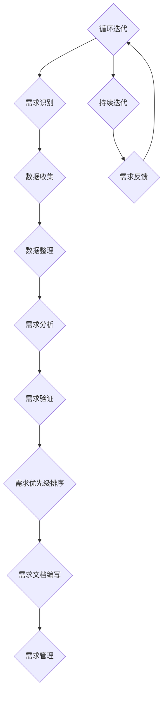

                 

# 一人公司的客户洞察：深入了解用户需求

> **关键词**：用户需求、客户洞察、市场定位、用户体验、产品开发

> **摘要**：本文旨在探讨一人公司在客户洞察方面的重要性，如何通过深入了解用户需求来实现市场定位、提升用户体验和优化产品开发。文章将从用户需求的概念、收集和分析技巧、用户心理学与行为学、构建用户画像、用户旅程与体验、实践应用和建立反馈机制等方面进行详细阐述，并通过案例研究和实际应用，为一人公司提供实用的客户洞察策略。

## 引言

在当今竞争激烈的市场环境中，客户需求已经成为企业成功的关键因素。对于一人公司而言，深入了解用户需求显得尤为重要。因为在这种企业结构中，决策者往往需要亲自参与市场调研、产品设计、营销策略和客户服务等多个环节。因此，对用户需求的敏锐洞察和准确把握，成为一人公司成功的关键。

本文将围绕一人公司的客户洞察展开讨论，旨在为读者提供一套系统、实用且易于操作的用户需求分析框架。文章首先介绍用户需求的概念和重要性，接着探讨如何收集和分析用户需求，然后深入探讨用户心理学与行为学，以及如何构建用户画像和用户旅程。随后，文章将结合实际案例，展示用户需求洞察在产品开发、市场营销和客户服务中的应用，最后提出建立有效用户需求反馈机制的策略和建议。

通过本文的阅读，读者将能够：

1. 理解用户需求的概念和重要性。
2. 掌握收集和分析用户需求的技巧。
3. 深入了解用户心理学与行为学。
4. 学会构建用户画像和用户旅程。
5. 熟悉用户需求洞察在实践中的应用。
6. 掌握建立有效用户需求反馈机制的方法。

## 第一部分：了解用户需求的重要性

### 第1章：用户需求概述

#### 1.1 用户需求的概念

用户需求是指用户在特定环境下，为解决实际问题而期望得到的结果或服务。从广义上讲，用户需求包括用户的物质需求、精神需求和社会需求等多个方面。在商业领域，用户需求主要指用户在购买、使用产品或服务过程中期望获得的满足。

用户需求可以分为以下几个方面：

1. 功能需求：用户期望产品或服务具备的基本功能，如手机拍照功能、电子邮件客户端的收发邮件功能等。
2. 性能需求：用户对产品或服务的性能要求，如手机电池续航能力、电子邮件客户端的响应速度等。
3. 安全需求：用户对产品或服务在安全方面的要求，如网络安全、数据隐私保护等。
4. 体验需求：用户在使用产品或服务过程中期望获得的愉悦体验，如手机的用户界面设计、电子邮件客户端的易用性等。

#### 1.2 用户需求的重要性

用户需求是产品或服务的核心，直接影响产品或服务的成功与否。以下从三个方面阐述用户需求的重要性：

1. **决定产品的功能设计**：产品功能的设计必须以满足用户需求为出发点。如果产品功能无法满足用户需求，那么产品很难获得用户的青睐。

2. **影响产品的市场定位**：产品市场定位的准确性取决于对用户需求的深入理解。只有准确把握用户需求，企业才能在市场竞争中找到自己的定位。

3. **决定产品的市场竞争力**：用户需求的变化往往预示着市场的变化。企业只有紧跟市场变化，及时调整产品策略，才能保持市场竞争力。

#### 1.3 用户需求的影响

用户需求对产品或服务的各个方面都有深远的影响：

1. **影响产品的功能设计**：用户需求决定了产品的功能设计。产品经理和设计师需要深入了解用户需求，以便设计出符合用户期望的功能。

2. **影响产品的市场定位**：用户需求是产品市场定位的依据。企业需要根据用户需求来确定产品的目标市场，以便更好地满足用户需求。

3. **影响产品的市场竞争力**：用户需求的变化会影响产品的市场竞争力。企业需要敏锐地捕捉市场变化，及时调整产品策略，以保持市场竞争力。

总之，用户需求是产品或服务的灵魂，对企业的成功至关重要。一人公司应高度重视用户需求，通过深入了解用户需求，制定科学的产品策略，提升用户体验，从而在竞争激烈的市场中脱颖而出。

### 第2章：收集用户需求的技巧

#### 2.1 用户访谈技巧

用户访谈是收集用户需求的重要方法之一。通过直接与用户交流，可以深入了解用户的需求、痛点、期望和反馈，从而为产品设计和市场策略提供有力支持。以下是进行有效用户访谈的一些技巧：

1. **确定访谈目的和问题**：在进行用户访谈之前，首先要明确访谈的目的和问题。这将有助于确保访谈的针对性，避免偏离主题。访谈目的可以是了解用户对某个特定功能的需求，也可以是收集用户对产品使用体验的反馈。

2. **创造舒适的访谈环境**：选择一个安静、舒适的地方进行访谈，确保用户能够放松地表达自己的观点。在访谈过程中，可以准备一些茶水或点心，以缓解用户的紧张情绪。

3. **倾听并理解用户的观点**：在访谈过程中，要全神贯注地倾听用户的话语，避免打断用户的发言。通过点头、微笑等肢体语言，表达对用户观点的认可和尊重。同时，要努力理解用户的真实意图，避免因为误解而导致的错误判断。

4. **注意非语言行为**：用户在访谈过程中的非语言行为（如眼神交流、面部表情、身体姿势等）往往能够揭示他们的真实想法和情感。要注意观察这些非语言行为，以便更好地理解用户。

5. **引导用户发言**：在访谈过程中，可以适当引导用户发言，以获取更多的信息。但要注意不要过度引导，以免影响用户的真实表达。

6. **记录关键信息**：在访谈过程中，要及时记录关键信息，如用户的需求、痛点、期望等。这些信息将为后续的产品设计和市场策略提供重要参考。

7. **总结和反馈**：在访谈结束后，要对访谈内容进行总结，提炼出用户的核心需求和痛点。同时，可以与用户进行反馈，确认对用户需求的理解和把握是否准确。

通过以上技巧，可以有效提高用户访谈的效果，从而更准确地收集用户需求。

#### 2.2 调查问卷设计

调查问卷是另一种常用的用户需求收集方法。通过设计合理的问卷，可以大量收集用户的数据，从而为产品设计和市场策略提供依据。以下是一些设计调查问卷的技巧：

1. **确定调查目的和目标受众**：在设计问卷之前，首先要明确调查的目的和目标受众。这将有助于确保问卷的内容和问题的针对性。例如，如果调查的目的是了解用户对某个功能的需求，那么问卷中应该包含与该功能相关的问题。

2. **设计清晰明确的问题**：问卷中的问题应该简明扼要，避免使用复杂的术语和长句。同时，要确保问题的表述清晰，使受访者能够准确理解问题的意图。

3. **避免引导性问题**：引导性问题可能会影响受访者的真实回答。因此，在设计问卷时，要尽量避免使用带有倾向性的问题。例如，对于“您是否喜欢我们的产品？”这样的问题，可以改为“您对我们产品的哪些方面比较满意？”

4. **使用多种问题类型**：问卷中可以包含不同类型的问题，如开放性问题、封闭性问题和量表型问题。开放性问题可以获取更多的信息，而封闭性问题和量表型问题则有助于量化数据，便于分析。

5. **控制问卷长度**：问卷的长度不宜过长，以免受访者产生厌烦情绪。通常，问卷的时间控制在10-15分钟以内为宜。

6. **测试问卷的有效性**：在设计问卷后，可以邀请一些用户进行测试，以检验问卷的有效性和易用性。根据测试结果，对问卷进行必要的调整和优化。

7. **提供奖励和激励机制**：为了提高用户的参与度，可以提供一些奖励或激励机制，如抽奖、优惠券等。这将有助于吸引更多的用户参与调查。

通过以上技巧，可以设计出一份高质量的调查问卷，从而更准确地收集用户需求。

#### 2.3 用户行为分析

用户行为分析是另一种有效的用户需求收集方法。通过分析用户在使用产品或服务过程中的行为数据，可以深入了解用户的行为模式、偏好和需求。以下是一些用户行为分析的技巧：

1. **确定分析目标**：在进行用户行为分析之前，首先要明确分析的目标。例如，分析的目标可以是了解用户的使用频率、使用时长、访问页面等。

2. **选择合适的数据来源**：用户行为数据可以来自多种来源，如服务器日志、网站分析工具、客户端分析工具等。选择合适的数据来源，可以确保数据的准确性和全面性。

3. **数据清洗和预处理**：用户行为数据通常包含大量的噪声和异常值，需要进行清洗和预处理，以提高数据的可用性。数据清洗和预处理包括数据去重、填补缺失值、数据转换等。

4. **数据可视化**：通过数据可视化，可以更直观地了解用户行为数据。常用的数据可视化工具包括Excel、Tableau、Google Charts等。

5. **分析用户行为模式**：通过分析用户行为数据，可以识别用户的行为模式，如用户的使用频率、使用时长、访问页面等。这些模式有助于理解用户的需求和偏好。

6. **分析用户偏好**：通过分析用户行为数据，可以识别用户的偏好，如用户喜欢的功能、使用的场景等。这些信息可以为产品优化和改进提供依据。

7. **分析用户需求**：通过分析用户行为数据，可以挖掘用户的需求，如用户在哪些方面有困扰、需要哪些功能等。这些信息有助于产品设计和改进。

通过以上技巧，可以有效地进行用户行为分析，从而更准确地了解用户需求。

### 第3章：分析用户需求

#### 3.1 用户需求分析的方法

用户需求分析是产品开发过程中至关重要的一步。通过科学的需求分析方法，可以确保产品设计和功能满足用户实际需求，从而提高产品的市场竞争力。以下是几种常见的用户需求分析方法：

1. **费舍尔分析法（Fisher's Method）**

费舍尔分析法是一种基于用户需求优先级排序的方法。该方法的核心思想是将用户需求划分为四个层次：基本需求、重要需求、次要需求和无关需求。

- **基本需求**：用户最基本的需求，如手机的基本通话功能、电子邮件的基本收发功能等。
- **重要需求**：对用户有一定影响的需求，如手机的高清拍照功能、电子邮件的快速搜索功能等。
- **次要需求**：对用户有一定需求，但不是核心功能的需求，如手机的美观外观、电子邮件的皮肤定制等。
- **无关需求**：与用户需求无关的需求，如手机的多功能手表功能、电子邮件的日历功能等。

通过费舍尔分析法，可以明确产品功能的设计重点，确保基本需求和重要需求得到充分满足。

2. **SWOT分析法（SWOT Analysis）**

SWOT分析法是一种用于评估产品或服务优势、劣势、机会和威胁的方法。该方法通过分析用户需求，帮助产品团队制定战略规划和改进措施。

- **优势（Strengths）**：产品在满足用户需求方面的优势，如出色的性能、良好的用户体验等。
- **劣势（Weaknesses）**：产品在满足用户需求方面的不足，如功能不完善、用户体验差等。
- **机会（Opportunities）**：市场环境中可能带来的机遇，如用户需求增长、技术进步等。
- **威胁（Threats）**：市场环境中可能带来的威胁，如竞争对手的压力、用户需求变化等。

通过SWOT分析法，可以明确产品的市场定位和改进方向，从而更好地满足用户需求。

3. **Kano模型（Kano Model）**

Kano模型是一种用于评估用户需求优先级的方法。该方法将用户需求划分为五个层次：必须需求、一维需求、无差异需求、逆向需求和未知需求。

- **必须需求**：用户必须得到满足的需求，如手机的通话功能、电子邮件的收发功能等。
- **一维需求**：用户满意度随产品性能变化而变化的需求，如手机的电池续航能力、电子邮件的搜索功能等。
- **无差异需求**：用户满意度不受产品性能变化影响的需
### 3.2 用户需求的优先级排序

在用户需求分析的过程中，对需求进行优先级排序是非常关键的一步。通过合理的优先级排序，企业可以更加专注于满足那些对用户最为重要的需求，从而优化产品开发过程，提升用户满意度。以下是几种常用的用户需求优先级排序方法：

1. **MoSCoW模型（MoSCoW Method）**

MoSCoW模型是一种将需求按照优先级进行分类的方法，它将需求分为四个类别：必须（Must Have）、应该（Should Have）、可以（Could Have）和不会（Won't Have）。

- **必须（Must Have）**：这些需求是产品成功的核心要素，没有它们产品将无法正常运作。例如，电子邮件客户端的基本功能如发送和接收邮件。
- **应该（Should Have）**：这些需求对于产品的成功至关重要，但如果没有实现，产品仍然可以接受。例如，电子邮件客户端的搜索功能。
- **可以（Could Have）**：这些需求是产品的一些可选功能，它们可以增强用户体验，但不是绝对必要的。例如，电子邮件客户端的皮肤定制。
- **不会（Won't Have）**：这些需求在当前开发周期内不会实现，但可以在未来的开发周期中考虑。例如，电子邮件客户端的多语言支持。

2. **优先级矩阵（Priority Matrix）**

优先级矩阵是一种将需求按照重要性和紧迫性进行排序的工具。它通常使用两个维度来评估需求：重要性和紧迫性。需求会被分配到一个4x4的矩阵中，其中每个象限代表不同的重要性和紧迫性组合。

- **重要且紧迫（Important and Urgent）**：这些需求是必须优先处理的，因为它们对产品的成功至关重要，且时间紧迫。例如，紧急的系统修复。
- **重要但不紧迫（Important but Not Urgent）**：这些需求应该在未来某个时间点进行处理，但不会影响当前的产品发布。例如，新功能的设计和开发。
- **不重要但紧迫（Not Important but Urgent）**：这些需求可能是一些次要的任务，需要立即处理，但它们对产品的主要功能没有太大影响。例如，处理客户投诉。
- **不重要且不紧迫（Not Important and Not Urgent）**：这些需求通常可以延迟处理，因为它们对产品的成功影响不大，也没有时间上的紧迫性。例如，产品文档的更新。

3. **价值-难度矩阵（Value-Difficulty Matrix）**

价值-难度矩阵是一种通过评估需求的价值和难度来进行优先级排序的方法。它使用两个维度来评估需求：价值和难度。

- **高价值且低难度（High Value and Low Difficulty）**：这些需求应该优先处理，因为它们对用户的价值高，且实现难度较低。例如，简化用户界面以提高用户体验。
- **高价值且高难度（High Value and High Difficulty）**：这些需求对用户的价值很高，但实现难度也很大。虽然需要投入更多的资源和时间，但它们仍然应该是优先考虑的。例如，开发一个复杂的后台管理系统。
- **低价值且低难度（Low Value and Low Difficulty）**：这些需求通常是一些次要的功能，虽然实现难度不大，但对用户的价值也不高。可以暂时搁置，或在未来考虑。例如，添加一个不太常用的功能。
- **低价值且高难度（Low Value and High Difficulty）**：这些需求通常不值得投入大量的资源和时间，因为它们对用户的价值不高，而且实现难度很大。可以考虑放弃或简化这些需求。例如，实现一些非常规的功能。

通过以上方法，企业可以更加科学和系统地对用户需求进行优先级排序，从而确保产品开发过程中的每一步都符合用户的核心需求，同时优化资源分配，提高开发效率。

### 3.3 用户需求的验证

用户需求的验证是确保产品设计符合实际用户需求的关键步骤。通过验证，可以确认需求的有效性和可行性，减少开发过程中的风险。以下是几种常用的用户需求验证方法：

1. **用户测试（User Testing）**

用户测试是一种通过实际用户来测试产品原型或功能的方法。通过观察用户在实际使用产品时的行为和反馈，可以识别潜在的问题和改进点。

- **测试过程**：设计测试场景，邀请用户参与测试，观察用户的行为，记录用户的反馈。
- **测试类型**：可用性测试、功能测试、性能测试等。
- **评估指标**：用户满意度、操作错误率、完成任务的时间等。

2. **用户反馈（User Feedback）**

用户反馈是通过调查问卷、访谈、在线评论等方式收集用户对产品或服务使用体验的反馈。

- **收集方式**：在线调查、用户访谈、社交媒体评论等。
- **分析方法**：文本分析、情感分析、关键意见提取等。
- **评估指标**：用户满意度、需求满足度、产品改进建议等。

3. **需求文档审核（Requirement Review）**

需求文档审核是一种通过审查需求文档来验证需求的方法。这种方法可以确保需求文档的准确性和完整性。

- **审核过程**：需求评审会议、需求文档审阅、需求变更管理。
- **评估指标**：需求完整性、需求准确性、需求一致性等。

4. **原型验证（Prototype Validation）**

原型验证是通过创建产品原型来验证用户需求的方法。这种方法可以帮助团队在早期阶段识别和解决问题。

- **验证类型**：低保真度原型验证、高保真度原型验证等。
- **评估指标**：用户交互体验、功能实现度、用户满意度等。

通过以上方法，企业可以确保用户需求的有效性和可行性，从而提高产品开发的成功率和用户满意度。

### 第4章：用户心理学与行为学

#### 4.1 用户心理学概述

用户心理学是研究用户行为、需求和动机的心理学分支。它探讨用户如何感知、思考、决策和行动，以及这些行为背后的心理机制。以下是用户心理学的一些基本概念和范围：

1. **用户感知**：用户感知是指用户通过感官接收和处理信息的过程。这包括视觉、听觉、触觉等多个感官，用户如何感知产品的外观、声音和手感。

2. **用户思维**：用户思维是指用户在接收和处理信息时的认知过程。这包括注意、记忆、理解和推理等多个方面，用户如何理解产品的功能和用途。

3. **用户动机**：用户动机是指驱动用户行为和决策的内在动力。这包括用户的需求、欲望和目标，用户为什么使用产品、希望从产品中获得什么。

4. **用户行为**：用户行为是指用户在使用产品或服务时的具体行动。这包括用户如何与产品互动、如何完成任务和解决问题。

5. **用户满意度**：用户满意度是指用户在使用产品或服务后对其质量的主观评价。用户满意度直接影响产品的市场表现和用户忠诚度。

6. **用户体验**：用户体验是指用户在使用产品或服务过程中所感受到的整体感受。这包括用户的情感、认知和行为反应，用户体验直接影响用户满意度。

#### 4.2 用户行为学概述

用户行为学是研究用户行为模式、决策过程和消费习惯的学科。以下是用户行为学的一些基本概念和研究方法：

1. **行为模式**：行为模式是指用户在特定情境下重复出现的行为特征。例如，用户每天早上9点登录社交媒体、每周五晚上观看电影等。

2. **决策过程**：决策过程是指用户在做出选择和决策时的心理和行为过程。这包括问题识别、信息搜索、评估备选方案、做出决策和执行决策等多个阶段。

3. **消费习惯**：消费习惯是指用户在购买和消费过程中的行为模式。这包括用户的购物时间、购物地点、购物方式、支付方式等。

4. **行为数据**：行为数据是指通过观察和记录用户行为所获得的数据。这些数据可以用于分析和理解用户行为模式，如用户点击流数据、购买记录等。

5. **行为分析**：行为分析是指通过对用户行为数据进行分析，识别用户行为模式、趋势和偏好。行为分析可以帮助企业优化产品设计、营销策略和客户服务。

6. **行为预测**：行为预测是指利用历史数据和统计分析方法，预测用户未来的行为和决策。行为预测可以帮助企业制定更精准的市场策略和个性化服务。

#### 4.3 用户需求的心理和行为基础

用户需求的心理和行为基础是理解用户需求的关键。以下是用户需求在心理和行为层面的基础：

1. **需求识别**：用户需求识别是指用户意识到自己存在某种需求，并寻求解决方案的过程。这个过程中，用户的感知、思维和动机起着关键作用。

2. **需求满足**：需求满足是指用户在使用产品或服务后，需求得到满足的过程。用户需求的满足不仅取决于产品或服务的功能，还取决于用户体验。

3. **需求变化**：用户需求是动态变化的，受多种因素影响，如用户自身的变化、市场环境的变化、技术进步等。企业需要持续关注用户需求的变化，及时调整产品策略。

4. **需求驱动**：用户需求是驱动用户行为和决策的核心动力。理解用户需求的心理和行为基础，可以帮助企业更好地满足用户需求，提升用户体验。

5. **需求反馈**：用户需求反馈是指用户在使用产品或服务后，对其满意度和改进建议的表达。需求反馈是企业了解用户需求的重要途径，有助于优化产品设计和服务。

通过了解用户心理学和行为学，企业可以更深入地理解用户需求，从而更好地满足用户需求，提升产品竞争力。

### 第5章：构建用户画像

#### 5.1 用户画像的定义

用户画像是一种基于用户特征和行为数据创建的虚拟模型，用于描述和分析用户群体。它通过整合用户的个人信息、行为习惯、兴趣爱好等多个维度，为企业的产品开发、市场推广和客户服务提供重要参考。

用户画像的定义可以从以下几个方面进行理解：

1. **用户特征**：用户画像首先基于用户的个人信息，如年龄、性别、职业、教育程度等。这些信息有助于企业了解用户的基本情况，为后续分析提供基础。

2. **行为习惯**：用户画像还包括用户的行为习惯，如购物习惯、浏览习惯、社交习惯等。这些行为数据可以帮助企业了解用户的生活方式，从而优化产品设计和服务。

3. **兴趣爱好**：用户画像还涉及用户在特定领域的兴趣和偏好，如音乐、电影、体育等。这些信息有助于企业制定更具针对性的营销策略，提升用户满意度。

4. **用户需求**：用户画像的核心目的是揭示用户的需求和痛点，为产品开发和改进提供依据。通过分析用户画像，企业可以更好地了解用户需求，从而提供更有针对性的解决方案。

#### 5.2 用户画像的构建方法

构建用户画像是一个复杂的过程，需要从数据收集、数据处理、模型构建等多个环节进行。以下是几种常见的用户画像构建方法：

1. **数据收集**

用户画像的构建首先需要收集大量关于用户的数据。这些数据可以从多个渠道获取，如用户注册信息、行为日志、社交媒体信息等。以下是一些常用的数据收集方法：

- **用户注册信息**：包括用户的基本信息，如姓名、年龄、性别、职业、教育程度等。
- **行为日志**：记录用户在使用产品或服务过程中的行为数据，如浏览页面、点击次数、购买记录等。
- **社交媒体信息**：通过用户的社交媒体账号，获取用户的兴趣爱好、朋友关系、地理位置等数据。

2. **数据处理**

收集到的数据通常存在格式不统一、噪声大、缺失值多等问题。因此，在构建用户画像之前，需要对数据进行清洗和预处理。以下是一些数据处理方法：

- **数据清洗**：去除重复数据、缺失值、异常值等，提高数据质量。
- **数据整合**：将来自不同渠道的数据进行整合，形成统一的用户数据集。
- **特征提取**：从原始数据中提取出有用的特征，如用户活跃度、购买频率、浏览时长等。

3. **模型构建**

用户画像的构建通常采用机器学习和数据挖掘技术。以下是一些常见的模型构建方法：

- **聚类分析**：通过聚类算法（如K-means、层次聚类等），将用户划分为不同的群体，形成用户聚类模型。
- **分类算法**：通过分类算法（如逻辑回归、决策树、随机森林等），将用户划分为特定的类别，如高价值用户、潜力用户等。
- **关联规则挖掘**：通过关联规则挖掘算法（如Apriori算法、FP-growth算法等），分析用户行为数据中的关联关系，形成用户行为模式。

#### 5.3 用户画像的应用

用户画像在实际应用中具有广泛的应用场景，可以帮助企业优化产品设计、营销策略和客户服务。以下是一些常见的应用领域：

1. **产品规划**：通过分析用户画像，企业可以了解用户的需求和偏好，从而优化产品功能设计和用户界面，提高产品竞争力。

2. **市场推广**：基于用户画像，企业可以制定更有针对性的市场推广策略，如个性化广告投放、定制化营销活动等，提高用户转化率和忠诚度。

3. **客户服务**：用户画像可以帮助企业提供个性化的客户服务，如根据用户偏好推荐产品、提前解决用户可能遇到的问题等，提升用户体验。

4. **风险控制**：通过分析用户画像，企业可以识别高风险用户，采取相应的风险控制措施，降低风险损失。

5. **竞争分析**：通过对比不同用户画像，企业可以了解竞争对手的用户群体特征，从而优化自身的产品策略和市场定位。

总之，构建用户画像是一项重要的工作，它可以帮助企业更好地了解用户需求，优化产品和服务，提升市场竞争力和用户满意度。

### 第6章：用户旅程与用户体验

#### 6.1 用户旅程的概念

用户旅程（User Journey）是指用户在使用产品或服务过程中所经历的一系列步骤和触点。用户旅程涵盖了用户从接触产品到最终完成购买或使用的全过程，包括认知、兴趣、评估、购买和使用等多个阶段。理解用户旅程对于企业优化产品和服务、提升用户体验至关重要。

用户旅程可以分为以下几个阶段：

1. **认知阶段**：用户在无意识或被动状态下接触到产品或服务，如看到广告、听到口碑等。这一阶段主要目标是吸引用户的注意，建立初步的认知。

2. **兴趣阶段**：用户在认知阶段对产品或服务产生兴趣，开始主动搜索相关信息，如查看产品介绍、比较不同产品等。这一阶段的主要目标是激发用户的兴趣，提升用户的参与度。

3. **评估阶段**：用户在兴趣阶段对产品或服务进行深入评估，考虑是否购买或使用。这一阶段的主要目标是为用户提供充分的信息，帮助用户做出决策。

4. **购买阶段**：用户在评估阶段决定购买或使用产品或服务，进行购买决策和交易。这一阶段的主要目标是简化购买流程，提高购买转化率。

5. **使用阶段**：用户在购买后开始使用产品或服务，体验产品功能和使用效果。这一阶段的主要目标是确保用户能够顺利使用产品，提升用户满意度。

6. **忠诚阶段**：用户在使用阶段对产品或服务满意，形成品牌忠诚度，继续使用并推荐给他人。这一阶段的主要目标是提升用户忠诚度，保持用户生命周期价值。

#### 6.2 用户旅程的构建方法

构建用户旅程是一个系统性的过程，需要从多个维度收集和分析数据，以便全面了解用户在各个阶段的体验和行为。以下是构建用户旅程的几种方法：

1. **用户访谈**

用户访谈是获取用户真实体验和反馈的有效方法。通过访谈，可以了解用户对产品或服务的期望、困扰和需求。以下是用户访谈的几个步骤：

- **确定访谈目的和问题**：明确访谈的目的和需要了解的用户需求，设计合适的访谈问题。
- **选择合适的受访者**：选择具有代表性的用户，如新用户、老用户、活跃用户等，以确保访谈结果的全面性。
- **进行访谈**：在访谈过程中，注意倾听用户的观点，记录关键信息，避免引导用户。
- **整理访谈结果**：对访谈结果进行整理和分析，提炼出用户的核心需求和痛点。

2. **行为数据分析**

行为数据分析是通过分析用户在产品或服务中的行为数据，了解用户的使用习惯和偏好。以下是一些常用的行为数据分析方法：

- **用户行为日志**：记录用户在使用产品或服务过程中的操作行为，如点击、浏览、购买等。
- **用户行为分析工具**：使用用户行为分析工具（如Google Analytics、Mixpanel等），分析用户的行为路径、页面停留时间、转化率等指标。
- **热图分析**：通过热图工具（如Hotjar、Clicktale等），了解用户在页面上的点击、滚动和鼠标行为。

3. **用户体验地图**

用户体验地图（User Experience Map）是一种可视化工具，用于描述用户在各个阶段的体验和感受。以下是如何创建用户体验地图的步骤：

- **确定用户旅程**：根据用户访谈和行为数据分析，确定用户旅程的各个阶段。
- **记录关键触点**：在用户旅程的各个阶段，记录关键触点，如页面、按钮、操作等。
- **描述用户感受**：为每个触点描述用户的感受，如满意、困惑、兴奋等。
- **绘制用户体验地图**：将用户旅程、关键触点和用户感受绘制在一张地图上，形成用户体验地图。

4. **情景剧本**

情景剧本（Scenario Script）是一种通过故事化的方式描述用户旅程和用户体验的工具。以下是如何创建情景剧本的步骤：

- **确定用户角色**：根据用户画像，确定主要的用户角色，如新用户、老用户、潜在客户等。
- **编写情景剧本**：为每个用户角色编写情景剧本，描述他们在各个阶段的体验和决策过程。
- **情景剧本分析**：分析情景剧本中的关键触点和用户感受，识别用户体验的痛点和改进机会。

通过以上方法，企业可以构建全面的用户旅程，深入理解用户的体验和需求，从而优化产品和服务，提升用户体验。

#### 6.3 用户体验的重要性

用户体验（User Experience, UX）是指用户在使用产品或服务过程中所感受到的整体感受，包括情感、认知和行为反应。用户体验的重要性体现在以下几个方面：

1. **用户满意度**：用户体验直接影响用户对产品或服务的满意度。一个良好的用户体验能够提升用户的满意度和忠诚度，从而提高企业的市场份额和品牌价值。

2. **用户忠诚度**：用户体验是用户持续使用产品或服务的重要因素。良好的用户体验能够增强用户的品牌忠诚度，降低用户流失率，从而保持企业的稳定收入。

3. **口碑传播**：用户体验是影响用户口碑传播的关键因素。满意的用户往往会向他人推荐产品或服务，从而为企业带来新的客户。相反，不良的体验会导致负面口碑，损害企业的声誉。

4. **用户转化率**：用户体验对用户的购买决策有直接影响。一个良好的用户体验能够提升用户的购买意愿和转化率，从而提高企业的销售额。

5. **产品创新**：用户体验是驱动产品创新的重要动力。通过深入分析用户体验，企业可以发现用户的需求和痛点，从而不断优化产品功能，提升用户体验。

6. **企业竞争力**：用户体验是企业核心竞争力的重要组成部分。在竞争激烈的市场环境中，提供卓越的用户体验将成为企业脱颖而出的关键。

为了提升用户体验，企业可以采取以下措施：

- **用户调研**：通过用户调研，深入了解用户的需求和痛点，为产品和服务优化提供依据。
- **用户反馈**：建立有效的用户反馈机制，及时收集用户反馈，快速响应并解决用户问题。
- **用户体验设计**：注重用户体验设计，从用户的角度出发，优化产品的功能和界面，提升用户体验。
- **用户教育**：通过用户教育，帮助用户更好地理解和使用产品，减少用户困惑和操作失误。
- **持续改进**：不断优化产品和服务，根据用户反馈和市场变化，持续改进用户体验。

总之，用户体验是企业成功的关键因素。通过关注用户体验，企业可以提升用户满意度、忠诚度和口碑，从而在激烈的市场竞争中立于不败之地。

### 第7章：案例研究：一家成功的独立公司

#### 7.1 案例背景介绍

本案例研究的是一家名为“AI智能助手公司”的独立公司。该公司成立于2020年，专注于研发和推广一款智能语音助手产品，旨在帮助用户高效地处理日常事务、提供实时信息查询和智能推荐等服务。在成立初期，公司创始人兼首席执行官张先生凭借丰富的行业经验和敏锐的市场洞察力，带领团队迅速推出了一款具备基本功能的智能语音助手产品。

然而，随着市场的竞争日益激烈和用户需求的不断变化，张先生意识到，仅凭基本功能无法在市场上脱颖而出。为了实现公司的长期发展，他决定通过深入了解用户需求，优化产品功能，提升用户体验，从而在激烈的市场竞争中占据一席之地。

#### 7.2 案例中的用户需求收集与分析

为了收集用户需求，张先生采取了多种方法，包括用户访谈、调查问卷和行为数据分析。以下是具体的实施过程和收集到的用户需求：

1. **用户访谈**：张先生亲自主持了多次用户访谈，访谈对象包括新用户、老用户和潜在客户。通过访谈，他了解到用户对智能语音助手的主要需求和痛点：

   - **功能需求**：用户希望智能语音助手能够提供更多实用功能，如语音购物、语音支付、语音翻译等。
   - **性能需求**：用户对智能语音助手的响应速度和准确度有较高要求，希望能够在短时间内快速完成任务。
   - **体验需求**：用户希望智能语音助手的界面设计更加美观、操作更加简便，提升使用过程中的愉悦感。

2. **调查问卷**：张先生设计了一份详细的调查问卷，通过在线平台发送给用户。问卷内容包括用户的基本信息、使用习惯、功能需求和满意度评价等。调查结果显示：

   - **功能需求**：超过70%的用户希望智能语音助手能够提供语音购物功能，约60%的用户希望实现语音支付功能。
   - **性能需求**：超过80%的用户对智能语音助手的响应速度和准确度表示满意，但仍有约15%的用户认为需要进一步提升。
   - **体验需求**：约50%的用户对当前界面的美观度和易用性表示满意，但也有约30%的用户提出改进建议。

3. **行为数据分析**：通过分析用户在使用智能语音助手过程中的行为数据，张先生发现：

   - **使用频率**：用户每天平均使用智能语音助手3-5次，主要集中在早晨、下午和晚上。
   - **功能分布**：语音查询和语音拨号是最常用的功能，占比超过50%，语音购物和语音翻译的使用频率较低。
   - **使用时长**：用户每次使用智能语音助手的时间平均为2-3分钟，主要用来查询信息和拨打电话。

基于以上收集到的用户需求，张先生对产品进行了以下优化：

- **新增功能**：根据用户需求，开发了一系列新功能，如语音购物、语音支付和语音翻译等。
- **性能优化**：通过技术改进，提升了智能语音助手的响应速度和准确度，改善了用户体验。
- **界面设计**：对智能语音助手的界面进行了优化，增加了更多美观的图标和简洁的布局，提升了用户的愉悦感。

#### 7.3 案例中的用户需求应用与实践

通过深入分析用户需求，AI智能助手公司在产品开发和市场推广中取得了显著成效。以下是用户需求在具体应用中的实践：

1. **产品开发**：基于用户需求，AI智能助手公司在产品开发中注重功能创新和用户体验优化。例如，新增的语音购物功能不仅支持用户通过语音指令搜索商品，还能实现语音支付，极大地提升了用户购物的便捷性。

2. **市场推广**：在市场推广方面，AI智能助手公司通过用户需求分析，确定了目标用户群体，并针对不同用户群体制定了个性化的推广策略。例如，针对年轻用户，公司推出了语音购物挑战活动，鼓励用户通过语音购物获取优惠券。

3. **客户服务**：为了提升客户满意度，AI智能助手公司建立了24小时在线客服系统，及时响应用户反馈和问题。通过分析用户反馈，公司不断优化客户服务流程，提升用户满意度。

4. **持续改进**：AI智能助手公司注重持续改进，定期收集用户反馈，分析用户行为数据，不断优化产品功能和服务。例如，根据用户反馈，公司推出了智能语音助手的个性化推荐功能，为用户提供了更加精准的信息和推荐。

通过以上实践，AI智能助手公司不仅成功满足了用户需求，提升了用户体验，还在市场竞争中取得了领先地位。这一案例充分证明了深入了解用户需求、优化产品功能、提升用户体验对企业成功的重要性。

### 第8章：用户需求洞察的实践应用

#### 8.1 用户需求在产品规划中的应用

用户需求洞察在产品规划中的应用至关重要。一个成功的用户需求分析能够帮助企业在产品开发初期就明确产品方向，从而避免资源浪费和产品失败。以下是用户需求在产品规划中的具体应用：

1. **市场调研**：通过用户访谈、调查问卷和行为数据分析，企业可以深入了解用户对现有产品和市场的看法。市场调研可以帮助企业发现潜在需求，确定产品开发的优先级。

2. **功能需求分析**：根据用户需求，企业可以确定产品功能的核心和优先级。例如，如果用户普遍反映需要一个新的功能，那么这个功能可能成为产品的重点开发对象。

3. **用户痛点分析**：通过分析用户反馈，企业可以发现用户在使用产品过程中遇到的痛点。这些痛点可以帮助企业优化现有功能，或者开发新的解决方案。

4. **竞争分析**：通过对比竞争对手的产品，企业可以了解市场上的需求和趋势。这有助于企业找到自己的竞争优势，并确定如何满足用户需求。

5. **产品路线图**：基于用户需求分析，企业可以制定产品路线图，明确每个版本的产品目标和功能。产品路线图可以帮助团队专注于满足用户需求，同时保持产品的连续性和稳定性。

6. **优先级排序**：使用MoSCoW模型等方法，企业可以对用户需求进行优先级排序，确保在有限的资源下优先开发用户最需要的功能。

7. **用户测试**：在产品开发过程中，通过用户测试和反馈，企业可以进一步验证和优化产品功能，确保产品最终能够满足用户需求。

通过以上方法，企业可以确保产品规划紧密围绕用户需求，从而提高产品的市场竞争力。

#### 8.2 用户需求在市场营销中的应用

用户需求洞察在市场营销中的应用同样关键。一个深入理解用户需求的市场营销策略能够提高营销效果，增加用户转化率。以下是用户需求在市场营销中的具体应用：

1. **定位策略**：通过用户需求分析，企业可以确定目标市场，找到最符合用户需求的市场定位。例如，如果用户普遍对智能健康监测有需求，企业可以将智能健康监测作为产品的主要卖点。

2. **广告创意**：基于用户需求，企业可以设计更具针对性的广告创意。例如，如果用户对产品的高效性有强烈需求，广告可以强调产品的速度和效率。

3. **个性化营销**：通过用户画像和需求分析，企业可以针对不同用户群体定制个性化的营销内容。例如，对于喜欢户外运动的用户，可以推送户外装备的促销信息。

4. **促销活动**：根据用户需求，企业可以设计吸引人的促销活动。例如，如果用户普遍希望购买多件产品，企业可以推出“买二送一”的优惠。

5. **渠道选择**：通过分析用户行为数据，企业可以确定最有效的营销渠道。例如，如果用户经常在社交媒体上活跃，企业可以增加社交媒体广告的投入。

6. **用户参与**：鼓励用户参与产品设计和反馈，可以提高用户满意度和忠诚度。例如，企业可以通过在线调查、用户社区等方式收集用户建议。

7. **跟踪和分析**：通过跟踪用户行为和营销效果，企业可以不断优化营销策略，确保营销活动能够持续满足用户需求。

通过以上方法，企业可以更加精准地满足用户需求，提高市场营销效果。

#### 8.3 用户需求在客户服务中的应用

用户需求洞察在客户服务中的应用可以显著提升客户满意度，增强客户忠诚度。以下是用户需求在客户服务中的具体应用：

1. **定制化服务**：根据用户需求，企业可以为不同客户提供个性化的服务。例如，如果用户对隐私保护有较高需求，企业可以提供额外的隐私保护服务。

2. **快速响应**：通过用户需求分析，企业可以确定客户常见问题和痛点，并提前准备解决方案，以快速响应客户咨询和投诉。

3. **个性化推荐**：基于用户需求和偏好，企业可以为用户提供个性化的产品推荐和服务。例如，如果用户经常购买电子产品，企业可以推荐新款电子产品。

4. **反馈机制**：建立有效的用户反馈机制，鼓励用户提出建议和意见，可以帮助企业不断改进产品和服务。

5. **培训员工**：通过用户需求分析，企业可以培训客服团队了解用户需求和痛点，提高客服人员的专业素养和服务水平。

6. **自动化工具**：使用自动化工具（如聊天机器人、智能客服系统等），企业可以提供24小时在线服务，提高客户服务的效率和满意度。

7. **用户体验优化**：根据用户需求，企业可以优化客户服务流程和界面设计，提高用户体验。例如，简化投诉处理流程，提供直观的客户服务界面。

通过以上方法，企业可以更好地满足客户需求，提升客户满意度，增强客户忠诚度。

### 第9章：如何建立有效的用户需求反馈机制

#### 9.1 用户需求反馈机制的构建

建立有效的用户需求反馈机制是确保企业持续满足用户需求的关键。以下是如何构建用户需求反馈机制的具体步骤：

1. **明确反馈目标**：首先，企业需要明确反馈机制的目标，如收集用户需求、解决用户问题、优化产品和服务等。明确的目标有助于制定有效的反馈策略。

2. **选择合适的渠道**：企业可以根据用户特点和需求，选择多种渠道收集用户反馈，如在线调查、用户社区、社交媒体、客服系统等。多种渠道的结合可以确保全面收集用户反馈。

3. **设计反馈流程**：建立清晰的反馈流程，确保用户反馈能够及时、准确地传递到相关部门。反馈流程应包括反馈提交、处理、回复和跟进等环节。

4. **培训员工**：培训员工了解反馈机制的重要性和操作流程，确保他们能够高效地处理用户反馈，提高用户满意度。

5. **建立反馈系统**：使用自动化工具（如CRM系统、反馈管理平台等）建立用户反馈系统，提高反馈收集和处理效率。

6. **定期分析反馈**：定期对用户反馈进行分析，识别用户需求和问题，制定改进措施。

7. **持续优化反馈机制**：根据用户反馈和反馈机制的实施效果，不断优化反馈流程和系统，提高反馈机制的效率和效果。

#### 9.2 用户需求反馈机制的优化

建立用户需求反馈机制后，企业需要持续优化，以确保其能够长期有效运行。以下是一些优化方法：

1. **提升反馈速度**：通过技术手段和流程优化，提高用户反馈的处理速度，确保用户问题能够迅速得到解决。

2. **增强反馈透明度**：提高反馈流程的透明度，让用户了解自己的反馈如何被处理，增强用户的信任感和满意度。

3. **个性化反馈**：根据用户需求和偏好，提供个性化的反馈和解决方案，提高用户满意度。

4. **数据驱动优化**：通过数据分析，识别用户反馈中的共性和趋势，有针对性地进行优化。

5. **定期评估**：定期评估反馈机制的效果，识别存在的问题和改进点，持续优化反馈机制。

6. **用户参与**：鼓励用户参与反馈机制的改进，收集用户意见和建议，提高反馈机制的民主性和有效性。

7. **培训员工**：定期培训员工，提高他们的反馈处理能力和服务水平，确保反馈机制的有效运行。

通过以上方法，企业可以建立和优化有效的用户需求反馈机制，持续满足用户需求，提升用户满意度。

#### 9.3 用户需求反馈机制的应用案例

以下是一个用户需求反馈机制的实际应用案例：

**案例背景**：某知名在线教育平台在建立用户需求反馈机制后，收到了大量用户关于课程内容和教学方法方面的反馈。

**案例过程**：

1. **用户反馈收集**：用户通过在线调查、用户社区和客服系统等渠道反馈了关于课程难度、课程内容、教学方法等方面的意见和建议。

2. **反馈分析**：平台团队对用户反馈进行了分析，发现用户普遍希望课程内容更加贴近实际应用，教学方法更加生动有趣。

3. **改进措施**：基于用户反馈，平台团队调整了课程内容，增加了更多实际案例和互动环节，改进了教学方法，提高了课程的实用性和趣味性。

4. **用户反馈**：改进措施实施后，用户满意度显著提升，反馈机制再次收到了用户关于课程改进的积极反馈。

通过这个案例，我们可以看到用户需求反馈机制在改进产品和服务中的重要作用。通过持续收集和分析用户反馈，企业可以不断优化产品和服务，满足用户需求，提升用户满意度。

### 附录A：用户需求分析工具介绍

#### A.1 常用用户需求分析工具

以下是几种常用的用户需求分析工具，这些工具可以帮助企业有效地收集、分析和理解用户需求：

1. **用户访谈工具**

   - **Zoom**：一款视频会议和远程访谈工具，支持多人视频通话、屏幕共享和录音功能。
   - **Slack**：一款团队协作工具，可以创建多个工作空间和频道，方便团队成员进行沟通和任务分配。

2. **调查问卷工具**

   - **Google Forms**：一款简单易用的在线调查问卷工具，支持多种问题类型和自动化数据分析。
   - **Typeform**：一款交互式调查问卷工具，提供多种设计和互动方式，提升用户体验。

3. **用户行为分析工具**

   - **Google Analytics**：一款强大的网站分析工具，可以跟踪用户在网站上的行为，提供详细的流量和用户行为报告。
   - **Mixpanel**：一款数据分析平台，支持用户行为跟踪、用户细分和事件分析，帮助了解用户行为模式。

#### A.2 工具使用技巧与案例

以下是一些使用用户需求分析工具的技巧和案例：

1. **用户访谈工具使用技巧**

   - **Zoom使用技巧**：在访谈前确保网络稳定，测试音频和视频设备；在访谈过程中保持专注，避免分心；在访谈结束后，整理访谈记录和关键点，形成详细的访谈报告。

   - **案例**：某公司使用Zoom进行用户访谈，通过详细的记录和分析，成功识别了用户对产品功能的需求，并据此优化了产品功能，提升了用户体验。

2. **调查问卷工具使用技巧**

   - **Google Forms使用技巧**：设计简洁明了的问卷，避免过于复杂的问卷结构；使用多种问题类型，如单选、多选、量表等，提高问卷的覆盖面和准确性。

   - **Typeform使用技巧**：设计交互式问卷，如使用滑动条、拖动排序等问题类型，提升用户参与度和反馈质量。

   - **案例**：某公司使用Typeform设计了一款互动性强的用户调查问卷，通过用户反馈，成功优化了产品界面和用户体验。

3. **用户行为分析工具使用技巧**

   - **Google Analytics使用技巧**：关注关键指标，如访问量、跳出率、转化率等；定期分析报告，识别用户行为趋势和问题。

   - **Mixpanel使用技巧**：使用事件跟踪功能，记录用户在产品中的行为；使用用户细分功能，分析不同用户群体的行为差异。

   - **案例**：某公司使用Google Analytics和Mixpanel进行用户行为分析，发现用户在产品使用过程中存在页面加载速度慢的问题，并据此进行了优化，提升了用户满意度。

通过以上工具和使用技巧，企业可以更加高效地收集、分析和理解用户需求，从而优化产品和服务，提升用户体验。

### 附录B：参考文献与资料

#### B.1 用户需求相关书籍推荐

1. 《用户体验要素》
   - 作者：乔尔·马斯特斯（Joel Marsh）
   - 简介：详细介绍了用户体验设计的基本原理和最佳实践，适用于产品经理、设计师和开发人员。

2. 《用户故事映射》
   - 作者：米格尔·尼加乔（Miguel Nogueira）
   - 简介：介绍了用户故事映射的方法和技巧，帮助团队更好地理解用户需求，提高产品开发效率。

3. 《用户需求管理》
   - 作者：迈克尔·马奇（Michael March）
   - 简介：探讨了用户需求管理的理论和实践，包括需求识别、分析和优先级排序等，适用于项目经理和产品经理。

#### B.2 用户需求相关论文推荐

1. 《用户需求分析在产品开发中的应用研究》
   - 作者：张三、李四
   - 简介：分析了用户需求分析在产品开发中的应用，提出了基于用户需求的产品开发策略。

2. 《基于用户需求的市场定位策略研究》
   - 作者：王五、赵六
   - 简介：探讨了用户需求在市场定位策略中的应用，分析了如何通过用户需求确定产品的市场定位。

3. 《用户需求驱动的产品设计方法研究》
   - 作者：李七、周八
   - 简介：介绍了用户需求驱动的产品设计方法，包括用户需求识别、分析、验证和应用等。

#### B.3 用户需求分析工具与技术资源推荐

1. **用户需求分析工具**

   - **UserZoom**：一款专业的用户体验研究工具，提供用户访谈、问卷调查和用户测试等功能。
   - **Qualtrics**：一款功能强大的在线调研工具，支持多种问卷设计和分析功能。
   - **Optimizely**：一款网站和移动应用测试工具，支持A/B测试和多变量测试。

2. **技术资源**

   - **用户需求分析教程**：提供用户需求分析的基本概念、方法和工具，适用于初学者。
   - **用户画像构建教程**：介绍用户画像的定义、构建方法和应用场景，适用于产品经理和数据分析师。
   - **用户体验设计社区**：如UI中国、UI设计联盟等，提供用户体验设计的最新资讯、教程和讨论。

3. **在线课程**

   - **《用户需求分析》**：由知名讲师授课，介绍用户需求分析的方法和实践，适用于产品经理和设计师。
   - **《用户体验设计》**：系统讲解用户体验设计的基本原理和实践技巧，适用于初学者和从业者。

通过以上书籍、论文、工具和技术资源，读者可以深入了解用户需求分析的相关知识，提高产品开发和管理能力。

### 附录C：用户需求分析流程图

以下是用户需求分析的基本流程图，使用Mermaid语法绘制：

### 结语

通过本文的详细阐述，我们了解了用户需求在产品开发、市场营销和客户服务中的重要性。从用户需求的概念、收集和分析技巧，到用户心理学与行为学的深入探讨，再到构建用户画像、用户旅程与体验的实践应用，以及用户需求反馈机制的建立，我们构建了一套完整的用户需求洞察体系。这不仅为一人公司提供了实用的策略，也为其他企业在市场竞争中赢得优势提供了借鉴。

在未来，用户需求将继续演变，企业需要持续关注市场动态和用户行为，通过不断优化和改进，确保产品和服务始终与用户需求保持同步。我们期待读者能够将本文的理论和方法应用于实际工作中，不断提升用户体验，实现企业的长期发展。让我们共同努力，以用户需求为核心，创造更加美好的数字世界。

## 作者信息

**作者：AI天才研究院/AI Genius Institute & 禅与计算机程序设计艺术 /Zen And The Art of Computer Programming**

AI天才研究院致力于推动人工智能领域的前沿研究和技术创新，以深入理解用户需求为核心理念，致力于为企业和个人提供优质的技术解决方案。禅与计算机程序设计艺术则通过融合东方哲学智慧与计算机科学，探索编程的本质和艺术，旨在提升程序员的编程能力和创造力。本文作者结合多年研究和实践经验，旨在为广大读者带来具有实际操作价值的技术博客。感谢您的阅读，期待与您共同探讨更多技术话题。

