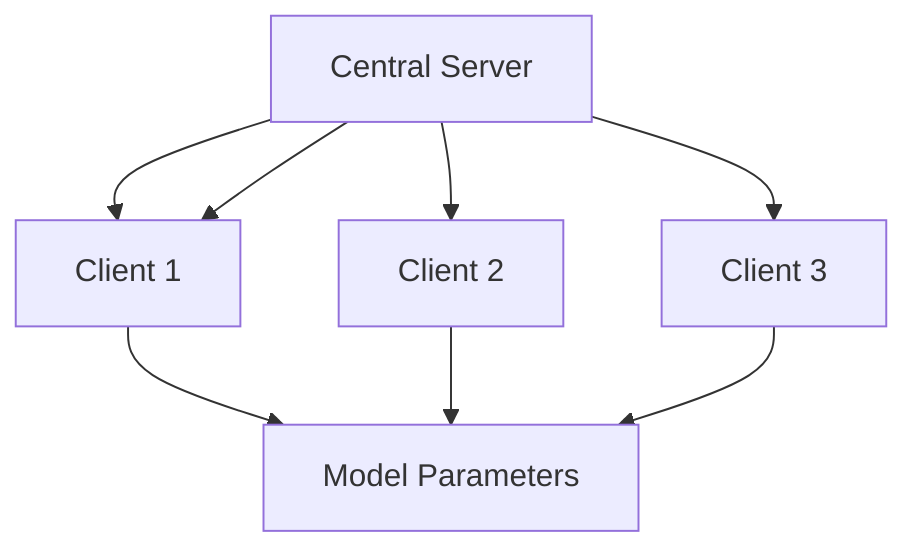
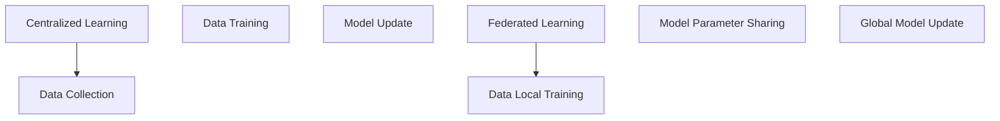
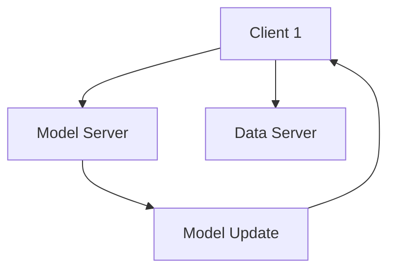

                 

# 一切皆是映射：联邦学习与神经网络模型的分布式训练

> 关键词：联邦学习，分布式训练，神经网络，分布式算法，隐私保护，数据分区，异步同步

> 摘要：本文从联邦学习的理论基础出发，深入探讨了联邦学习与分布式训练的关系，详细介绍了分布式训练的基本原理和算法，以及联邦学习在各个领域的应用。通过对联邦学习和分布式训练的结合进行深入分析，本文揭示了二者在未来技术发展中的重要趋势和潜在挑战，为读者提供了全面而深入的见解。

## 目录大纲

1. **联邦学习的理论基础**
    1.1 联邦学习概述
        - 联邦学习的概念与背景
        - 联邦学习的重要性与挑战
        - 联邦学习的基本架构
    1.2 联邦学习与传统集中式学习的对比
        - 集中式学习的局限性
        - 联邦学习的优势
        - 联邦学习与边缘计算的关系
    1.3 联邦学习的主要应用领域
        - 隐私保护的应用
        - 资源受限环境下的应用
        - 分布式数据处理的应用
2. **联邦学习的核心算法**
    2.1 联邦学习算法的基本原理
        - 同步与异步联邦学习
        - 参数服务器架构
        - 梯度聚合方法
    2.2 联邦优化算法
        - FedAvg算法
        - FedProx算法
        - FedGD算法
    2.3 联邦学习的安全性和隐私性
        - 隐私保护机制
        - 零知识证明在联邦学习中的应用
        - 联邦学习中的差分隐私
    2.4 联邦学习中的分布式数据处理
        - 数据分区策略
        - 数据同步与一致性
        - 分布式数据存储解决方案
3. **联邦学习的实践应用**
    3.1 联邦学习在医疗领域的应用
        - 医疗数据隐私保护的重要性
        - 联邦学习在医疗图像识别中的应用
        - 联邦学习在电子健康记录分析中的应用
    3.2 联邦学习在金融领域的应用
        - 金融数据安全与合规性
        - 联邦学习在反欺诈系统中的应用
        - 联邦学习在风险评估中的应用
    3.3 联邦学习在物联网领域的应用
        - 物联网设备的数据处理需求
        - 联邦学习在智能硬件优化中的应用
        - 联邦学习在智能城市管理中的应用
4. **分布式训练与神经网络模型**
    4.1 分布式训练概述
        - 分布式训练的概念与必要性
        - 数据并行训练
        - 模型并行训练
        - 训练过程的同步与异步
    4.2 分布式训练的算法与实现
        - 分布式SGD算法
        - 梯度压缩算法
        - 模型压缩与量化
    4.3 分布式训练在深度学习中的应用
        - 分布式训练在图像识别中的应用
        - 分布式训练在自然语言处理中的应用
        - 分布式训练在推荐系统中的应用
5. **联邦学习与分布式训练的结合**
    5.1 联邦学习与分布式训练的融合
        - 联邦学习与分布式训练的协同机制
        - 联邦分布式训练的挑战与解决方案
    5.2 联邦分布式训练的应用案例分析
        - 联邦分布式训练在工业自动化中的应用
        - 联邦分布式训练在智能交通系统中的应用
        - 联邦分布式训练在智能医疗诊断中的应用
6. **未来展望与趋势**
    6.1 联邦学习与分布式训练的发展趋势
        - 技术突破的方向
        - 新兴应用领域的探索
        - 跨学科的融合与交叉
    6.2 联邦学习与分布式训练的未来挑战
        - 数据隐私与安全保护
        - 大规模分布式系统的优化
        - 跨组织合作的协同机制
    6.3 联邦学习与分布式训练的产业化应用前景
        - 政策法规的影响
        - 市场需求的驱动
        - 技术创新与商业模式的融合

### 联邦学习的理论基础

#### 1.1 联邦学习概述

##### 1.1.1 联邦学习的概念与背景

联邦学习（Federated Learning）是一种分布式机器学习方法，其主要目的是在不直接共享数据的情况下，通过协调各个数据拥有者的模型参数，共同训练出一个全局模型。这种方法的核心理念是将模型训练的过程分布到多个客户端，以实现对数据的隐私保护。

联邦学习的概念起源于分布式系统的研究，但其应用场景主要集中在隐私敏感的场景中。随着大数据和人工智能技术的快速发展，越来越多的数据集中在少数几个大型科技公司手中，这引发了数据隐私和安全的问题。为了解决这个问题，研究人员开始探索如何在保证数据隐私的同时，仍然能够进行有效的机器学习。

##### 1.1.2 联邦学习的重要性与挑战

联邦学习的重要性主要体现在以下几个方面：

1. **隐私保护**：联邦学习通过在客户端本地训练模型，然后仅共享模型参数，从而避免了原始数据的直接传输和共享，有效保护了用户的隐私。
2. **数据多样性**：联邦学习能够充分利用不同数据源的信息，从而提高模型的泛化能力。
3. **资源受限环境**：在许多场景中，如移动设备、物联网设备等，计算资源和存储资源都非常有限。联邦学习能够通过在本地进行训练，减少了对计算资源和存储资源的需求。

然而，联邦学习也面临着一系列挑战：

1. **通信成本**：由于需要不断传输模型参数，联邦学习可能会带来较高的通信成本。
2. **模型一致性**：如何保证不同客户端训练出的模型具有一致性，是一个重要的挑战。
3. **安全性**：在联邦学习过程中，如何保证模型参数的安全传输和存储，避免被恶意攻击者窃取，也是一个重要的挑战。

##### 1.1.3 联邦学习的基本架构

联邦学习的基本架构通常包括以下几个关键组件：

1. **中央服务器（Server）**：中央服务器负责协调各个客户端的训练过程，并最终合成全局模型。
2. **客户端（Clients）**：客户端负责在本地进行数据预处理和模型训练，然后向中央服务器发送模型参数。
3. **模型参数**：模型参数是联邦学习中的核心数据，代表了全局模型的当前状态。
4. **加密机制**：为了保护模型参数的安全，联邦学习通常会使用加密机制，如差分隐私、同态加密等。

下图展示了联邦学习的基本架构：



在联邦学习的过程中，客户端首先在本地使用自己的数据进行模型训练，然后通过加密的方式向中央服务器发送模型参数。中央服务器接收到所有客户端的模型参数后，进行聚合和更新，生成新的全局模型参数，并将其发送回各个客户端。这个过程不断重复，直到达到预定的训练目标或达到一定的迭代次数。

##### 1.2 联邦学习与传统集中式学习的对比

传统集中式学习（Centralized Learning）是将所有数据集中到一个中心位置，然后在中心位置进行模型训练。与之相比，联邦学习具有以下几个明显的优势：

1. **隐私保护**：传统集中式学习需要将所有数据上传到服务器，这可能导致数据泄露的风险。而联邦学习通过在客户端本地进行训练，避免了数据直接传输到服务器，从而有效保护了用户的隐私。
2. **数据多样性**：传统集中式学习只能利用到一个数据源的信息，而联邦学习能够利用多个数据源的信息，从而提高模型的泛化能力。
3. **资源受限环境**：在许多场景中，如移动设备、物联网设备等，计算资源和存储资源都非常有限。联邦学习通过在本地进行训练，减少了对计算资源和存储资源的需求，更适合资源受限的环境。

然而，联邦学习也存在一些局限性：

1. **通信成本**：联邦学习需要不断传输模型参数，这可能导致较高的通信成本。相比之下，传统集中式学习只需要一次性的数据上传和下载。
2. **模型一致性**：由于客户端的训练环境和数据可能存在差异，可能导致训练出的模型之间存在不一致性，这需要额外的技术手段进行优化。
3. **安全性**：在联邦学习过程中，如何保证模型参数的安全传输和存储，避免被恶意攻击者窃取，是一个重要的挑战。

下图展示了联邦学习与传统集中式学习的对比：



##### 1.3 联邦学习的主要应用领域

联邦学习在多个领域具有广泛的应用前景，以下是一些典型的应用领域：

1. **医疗领域**：联邦学习能够有效保护患者的隐私，同时充分利用各个医疗机构的数据资源，从而提高疾病的诊断和预测能力。
2. **金融领域**：金融行业对数据安全有着极高的要求，联邦学习能够保护用户的交易数据，同时提高反欺诈和风险评估的准确性。
3. **物联网领域**：物联网设备通常具有计算和存储资源受限的特点，联邦学习能够充分利用这些设备上的数据，实现智能化的设备管理和优化。
4. **工业领域**：联邦学习能够提高工业生产过程中的自动化和智能化水平，同时保护生产数据的安全性。

### 联邦学习的核心算法

#### 2.1 联邦学习算法的基本原理

联邦学习算法的核心思想是通过分布式的方式协同训练一个全局模型，同时保持各个数据拥有者的隐私。以下是联邦学习算法的基本原理：

1. **同步联邦学习**：同步联邦学习是指在每次迭代过程中，所有客户端都使用相同的全局模型参数进行训练，然后将更新后的模型参数发送给中央服务器。这种方法的优点是简单易实现，但缺点是通信成本较高，特别是在大规模分布式系统中。

2. **异步联邦学习**：异步联邦学习允许客户端在不同的时间点使用不同的全局模型参数进行训练，然后将更新后的模型参数发送给中央服务器。这种方法的优点是减少了通信成本，但缺点是可能导致模型不一致性。

3. **参数服务器架构**：参数服务器架构是一种常见的分布式系统架构，用于管理全局模型参数。在这种架构中，中央服务器负责维护全局模型参数，而客户端负责在本地进行训练并更新模型参数。

4. **梯度聚合方法**：梯度聚合是联邦学习算法中的一个关键步骤，用于将各个客户端的模型更新合并为一个全局更新。常见的梯度聚合方法包括平均梯度聚合（如FedAvg算法）和加权梯度聚合（如FedProx算法）。

#### 2.2 联邦优化算法

联邦优化算法是联邦学习算法的核心，用于优化全局模型参数。以下是一些常见的联邦优化算法：

1. **FedAvg算法**：FedAvg算法是最简单的联邦优化算法，其核心思想是将各个客户端的模型更新加权平均，得到全局模型更新。算法的基本步骤如下：
   - 初始化全局模型参数。
   - 各个客户端使用本地数据对全局模型进行训练，得到模型更新。
   - 中央服务器将所有客户端的模型更新聚合为一个全局更新。
   - 更新全局模型参数。
   - 重复以上步骤，直到达到预定的训练目标。

   ```python
   # FedAvg算法伪代码
   for epoch in range(num_epochs):
       global_model = initialize_model()
       for client in clients:
           client_model = copy(global_model)
           client_model.train(client_data)
           client_update = client_model.get_update()
           global_update = aggregate_updates(client_update)
       global_model.apply_update(global_update)
   ```

2. **FedProx算法**：FedProx算法是一种针对分布式优化问题的改进算法，其核心思想是在每个迭代过程中，对客户端的模型更新进行正则化，以减少模型不一致性。算法的基本步骤如下：
   - 初始化全局模型参数。
   - 各个客户端使用本地数据对全局模型进行训练，得到模型更新。
   - 中央服务器将所有客户端的模型更新聚合为一个全局更新，并加上正则化项。
   - 更新全局模型参数。
   - 重复以上步骤，直到达到预定的训练目标。

   ```python
   # FedProx算法伪代码
   for epoch in range(num_epochs):
       global_model = initialize_model()
       for client in clients:
           client_model = copy(global_model)
           client_model.train(client_data)
           client_update = client_model.get_update()
           global_update = aggregate_updates(client_update) + regularization_term
       global_model.apply_update(global_update)
   ```

3. **FedGD算法**：FedGD算法是一种基于梯度下降的联邦优化算法，其核心思想是使用梯度下降的方法优化全局模型参数。算法的基本步骤如下：
   - 初始化全局模型参数。
   - 各个客户端使用本地数据对全局模型进行训练，得到模型更新。
   - 中央服务器将所有客户端的模型更新聚合为一个全局更新。
   - 使用全局更新更新全局模型参数。
   - 重复以上步骤，直到达到预定的训练目标。

   ```python
   # FedGD算法伪代码
   for epoch in range(num_epochs):
       global_model = initialize_model()
       for client in clients:
           client_model = copy(global_model)
           client_model.train(client_data)
           client_update = client_model.get_update()
           global_update = aggregate_updates(client_update)
       global_model.apply_update(global_update)
   ```

#### 2.3 联邦学习的安全性和隐私性

联邦学习在保证模型性能的同时，还必须考虑到数据的安全性和隐私性。以下是一些常见的隐私保护机制：

1. **差分隐私**：差分隐私是一种常见的隐私保护技术，通过在模型训练过程中添加噪声，使得攻击者无法从模型参数中推断出原始数据的具体内容。常用的差分隐私机制包括拉普拉斯机制和指数机制。

2. **同态加密**：同态加密是一种允许在密文上进行计算的技术，通过将模型训练过程转化为同态计算，可以在保证数据隐私的同时进行模型训练。同态加密在联邦学习中的应用，可以有效地保护用户数据的安全。

3. **零知识证明**：零知识证明是一种密码学技术，允许证明者证明某个陈述为真，而不泄露任何关于陈述的信息。在联邦学习场景中，零知识证明可以用于验证客户端提交的模型更新是否合法，从而提高系统的安全性。

#### 2.4 联邦学习中的分布式数据处理

在联邦学习过程中，分布式数据处理是一个重要的挑战。以下是一些常见的分布式数据处理策略：

1. **数据分区策略**：数据分区策略是将数据划分为多个子集，每个子集由一个或多个客户端负责处理。常见的分区策略包括基于哈希的分区和基于范围的分区。

2. **数据同步与一致性**：在分布式系统中，数据同步与一致性是一个重要的问题。为了确保模型的训练效果，需要确保各个客户端的数据是一致的。常见的数据同步策略包括基于时间戳的同步和基于一致性哈希的同步。

3. **分布式数据存储解决方案**：分布式数据存储解决方案用于管理分布式系统中的数据。常见的分布式数据存储解决方案包括分布式数据库和分布式文件系统。

### 联邦学习的实践应用

#### 3.1 联邦学习在医疗领域的应用

医疗领域是联邦学习的一个重要应用领域，联邦学习能够有效保护患者隐私，同时充分利用各个医疗机构的数据资源。以下是一些具体的实践应用：

1. **医疗数据隐私保护的重要性**：在医疗领域，患者的健康数据通常是高度敏感的，泄露这些数据可能导致严重的隐私侵犯和伦理问题。联邦学习通过在客户端本地训练模型，避免了数据直接传输到服务器，从而有效保护了患者的隐私。

2. **联邦学习在医疗图像识别中的应用**：医疗图像识别是医疗领域的一个重要任务，包括影像诊断、病理分析等。联邦学习能够利用各个医疗机构的海量医疗图像数据，提高图像识别的准确性和鲁棒性。例如，在乳腺癌筛查中，联邦学习可以同时利用多个医疗机构的数据，共同训练出一个全局的图像识别模型，从而提高诊断的准确性。

3. **联邦学习在电子健康记录分析中的应用**：电子健康记录（EHR）是医疗领域的重要数据来源，包括患者的病史、治疗方案、检查结果等。联邦学习可以用于分析EHR数据，识别疾病的潜在风险因素，优化治疗方案。例如，联邦学习可以同时利用多个医疗机构的EHR数据，共同训练出一个全局的风险评估模型，从而提高疾病预测的准确性。

#### 3.2 联邦学习在金融领域的应用

金融领域是另一个联邦学习的关键应用领域，联邦学习能够有效保护金融数据的安全性和隐私性。以下是一些具体的实践应用：

1. **金融数据安全与合规性**：在金融领域，交易数据、客户信息等通常是高度敏感的，泄露这些数据可能导致严重的财务损失和法律责任。联邦学习通过在客户端本地训练模型，避免了数据直接传输到服务器，从而有效保护了金融数据的安全性和合规性。

2. **联邦学习在反欺诈系统中的应用**：反欺诈是金融领域的一个重要任务，联邦学习可以用于构建全局的反欺诈模型，从而提高欺诈检测的准确性。例如，银行可以使用联邦学习技术，同时利用多个银行的交易数据，共同训练出一个全局的反欺诈模型，从而提高欺诈检测的效率和准确性。

3. **联邦学习在风险评估中的应用**：风险评估是金融领域的一个重要任务，联邦学习可以用于分析大量的金融数据，识别潜在的风险因素，优化风险评估模型。例如，金融机构可以使用联邦学习技术，同时利用多个金融机构的贷款数据，共同训练出一个全局的风险评估模型，从而提高贷款审批的准确性和效率。

#### 3.3 联邦学习在物联网领域的应用

物联网（IoT）领域是另一个联邦学习的关键应用领域，联邦学习能够有效处理物联网设备的数据，实现智能化的设备管理和优化。以下是一些具体的实践应用：

1. **物联网设备的数据处理需求**：物联网设备通常具有计算和存储资源受限的特点，同时需要处理大量的实时数据。联邦学习可以用于在物联网设备本地进行数据处理，从而减少对中心服务器的依赖，提高系统的响应速度和可靠性。

2. **联邦学习在智能硬件优化中的应用**：智能硬件优化是物联网领域的一个重要任务，联邦学习可以用于分析物联网设备的数据，优化硬件性能和功耗。例如，智能家电可以使用联邦学习技术，同时利用多个用户的设备数据，共同训练出一个全局的优化模型，从而提高智能家电的性能和用户体验。

3. **联邦学习在智能城市管理中的应用**：智能城市是物联网领域的典型应用，联邦学习可以用于处理大量的城市数据，实现智能化的城市管理。例如，智能交通系统可以使用联邦学习技术，同时利用多个交通监控设备的数据，共同训练出一个全局的交通流量预测模型，从而优化交通信号控制，提高交通效率。

### 分布式训练与神经网络模型

#### 4.1 分布式训练概述

分布式训练是一种在多个计算节点上协同训练机器学习模型的方法，其目的是提高训练速度和模型性能。随着数据量和模型复杂度的增加，单机训练变得越来越困难，分布式训练成为了一种必要的解决方案。以下是分布式训练的基本概念和必要性：

##### 4.1.1 单机训练的限制

单机训练存在以下限制：

1. **计算资源限制**：单机训练需要占用大量的CPU或GPU资源，这可能导致训练过程缓慢，特别是在大规模数据集上。
2. **内存限制**：单机训练需要将整个数据集加载到内存中，这可能导致内存溢出，尤其是在处理大规模数据时。
3. **可扩展性差**：单机训练的可扩展性较差，无法轻松扩展到更多的计算节点。
4. **依赖中心服务器**：单机训练通常依赖于中心服务器进行数据存储和模型更新，这可能导致单点故障和系统可靠性问题。

##### 4.1.2 分布式训练的优势

分布式训练具有以下优势：

1. **并行计算**：分布式训练可以在多个计算节点上同时进行，从而提高训练速度。
2. **扩展性强**：分布式训练可以轻松扩展到更多的计算节点，以适应大规模数据集和复杂模型。
3. **资源共享**：分布式训练可以充分利用计算节点的资源，提高资源利用率。
4. **容错性强**：分布式训练可以在多个计算节点上并行进行，从而提高系统的容错性，减少单点故障的风险。

##### 4.1.3 分布式训练的基本原理

分布式训练的基本原理是将整个训练过程分为以下几个步骤：

1. **数据划分**：将整个数据集划分为多个子集，每个子集由一个或多个计算节点处理。
2. **模型划分**：将模型参数划分为多个部分，每个部分由一个或多个计算节点更新。
3. **模型同步**：计算节点在本地训练模型参数后，需要将更新后的参数同步到其他计算节点。
4. **模型聚合**：中央服务器或计算节点将各个计算节点的模型参数进行聚合，得到全局模型参数。

分布式训练的基本架构通常包括以下几个关键组件：

1. **计算节点**：计算节点负责在本地进行数据预处理和模型训练。
2. **中央服务器**：中央服务器负责管理计算节点，协调模型同步和聚合过程。
3. **数据存储**：数据存储负责存储训练数据和模型参数。

下图展示了分布式训练的基本架构：



在分布式训练过程中，各个计算节点首先从数据存储中获取本地数据，然后使用本地数据进行模型训练。训练完成后，计算节点将更新后的模型参数发送给中央服务器。中央服务器将接收到的模型参数进行聚合，生成全局模型参数，并将其发送回各个计算节点。这个过程不断重复，直到达到预定的训练目标。

#### 4.2 数据并行训练

数据并行训练是一种常见的分布式训练方法，其核心思想是将训练数据集划分为多个子集，每个子集由一个或多个计算节点处理。以下是数据并行训练的基本原理和实现方法：

##### 4.2.1 数据并行的原理与实现

数据并行的原理是将整个数据集划分为多个子集，每个子集由一个或多个计算节点处理。具体实现方法如下：

1. **数据划分**：将数据集划分为多个子集，每个子集包含相同数量的样本。常用的数据划分方法包括基于哈希的划分和基于范围的划分。
2. **模型划分**：由于每个计算节点处理的子集大小可能不同，因此需要将模型参数划分为多个部分，每个部分由一个或多个计算节点更新。
3. **模型同步**：计算节点在本地训练模型参数后，需要将更新后的参数同步到其他计算节点。常用的模型同步方法包括参数服务器方法和参数共享方法。
4. **模型聚合**：中央服务器将各个计算节点的模型参数进行聚合，生成全局模型参数。

数据并行训练的实现流程如下：

1. 初始化全局模型参数。
2. 各个计算节点从数据存储中获取本地数据子集。
3. 各个计算节点使用本地数据进行模型训练。
4. 各个计算节点将更新后的模型参数发送给中央服务器。
5. 中央服务器将接收到的模型参数进行聚合，生成全局模型参数。
6. 更新全局模型参数，并重复以上步骤，直到达到预定的训练目标。

##### 4.2.2 数据并行的挑战与优化

数据并行训练在提高训练速度和模型性能方面具有显著优势，但同时也面临一些挑战：

1. **通信成本**：数据并行训练需要频繁进行模型参数的同步和聚合，这可能导致较高的通信成本。
2. **同步延迟**：在多个计算节点上同步模型参数可能导致同步延迟，从而降低训练速度。
3. **数据倾斜**：由于数据集可能存在数据倾斜，导致部分计算节点的计算负载较大，其他计算节点的计算负载较小，这可能导致计算资源浪费。

为了优化数据并行训练，可以采取以下策略：

1. **数据重采样**：通过重采样数据集，减少数据倾斜现象，提高计算节点的负载均衡。
2. **异步同步**：采用异步同步方法，减少同步延迟，提高训练速度。
3. **参数服务器方法**：采用参数服务器方法，将模型参数存储在共享内存中，减少通信成本。
4. **分布式存储**：采用分布式存储方法，减少数据传输时间，提高数据访问速度。

#### 4.3 模型并行训练

模型并行训练是一种将模型划分为多个部分，每个部分由一个或多个计算节点训练的分布式训练方法。模型并行训练与数据并行训练不同，数据并行训练关注数据划分和并行计算，而模型并行训练关注模型划分和并行计算。以下是模型并行训练的基本原理和实现方法：

##### 4.3.1 模型并行的原理与实现

模型并行的原理是将模型划分为多个部分，每个部分由一个或多个计算节点训练。具体实现方法如下：

1. **模型划分**：将模型划分为多个子模型，每个子模型由一个或多个计算节点训练。常用的模型划分方法包括基于层级的划分和基于任务的划分。
2. **数据划分**：由于每个子模型的计算节点可能不同，因此需要将数据集划分为多个子集，每个子集由对应的计算节点处理。
3. **模型同步**：计算节点在本地训练子模型后，需要将更新后的子模型参数同步到其他计算节点。常用的模型同步方法包括参数共享方法和模型聚合方法。
4. **模型聚合**：中央服务器将各个计算节点的子模型参数进行聚合，生成全局模型参数。

模型并行训练的实现流程如下：

1. 初始化全局模型参数。
2. 各个计算节点从数据存储中获取本地数据子集。
3. 各个计算节点使用本地数据进行子模型训练。
4. 各个计算节点将更新后的子模型参数发送给中央服务器。
5. 中央服务器将接收到的子模型参数进行聚合，生成全局模型参数。
6. 更新全局模型参数，并重复以上步骤，直到达到预定的训练目标。

##### 4.3.2 模型并行的挑战与优化

模型并行训练在提高训练速度和模型性能方面具有显著优势，但同时也面临一些挑战：

1. **通信成本**：模型并行训练需要频繁进行子模型参数的同步和聚合，这可能导致较高的通信成本。
2. **同步延迟**：在多个计算节点上同步子模型参数可能导致同步延迟，从而降低训练速度。
3. **计算资源消耗**：模型并行训练需要额外的计算资源来处理子模型参数的同步和聚合，这可能导致计算资源消耗增加。

为了优化模型并行训练，可以采取以下策略：

1. **异步同步**：采用异步同步方法，减少同步延迟，提高训练速度。
2. **参数服务器方法**：采用参数服务器方法，将子模型参数存储在共享内存中，减少通信成本。
3. **任务调度优化**：通过优化任务调度，提高计算资源的利用率，减少计算资源消耗。

#### 4.4 训练过程的同步与异步

在分布式训练过程中，模型参数的同步与异步是一个重要的考虑因素。同步训练和异步训练是两种常见的训练过程，它们在训练速度和性能方面存在差异。以下是同步训练和异步训练的比较、同步中的锁机制和异步训练中的通信优化：

##### 4.4.1 同步训练与异步训练的比较

同步训练和异步训练在以下几个方面存在差异：

1. **同步训练**：
   - 同步训练要求所有计算节点在训练过程中保持相同的步长，即每个计算节点在每个迭代步上的训练进度相同。
   - 同步训练的优点是简单易实现，且能够保证模型参数的一致性。
   - 同步训练的缺点是通信成本较高，特别是在大规模分布式系统中，可能导致训练速度较慢。

2. **异步训练**：
   - 异步训练允许计算节点在不同的时间点上进行训练，即每个计算节点可以根据自己的进度进行训练。
   - 异步训练的优点是通信成本较低，能够提高训练速度。
   - 异步训练的缺点是可能导致模型参数不一致性，需要额外的技术手段进行优化。

##### 4.4.2 同步训练中的锁机制

在同步训练中，为了确保模型参数的一致性，通常需要使用锁机制。锁机制用于控制多个计算节点对共享资源的访问，以避免并发冲突。以下是同步训练中的锁机制：

1. **全局锁**：全局锁是一种常见的锁机制，用于控制对全局模型参数的访问。在同步训练过程中，所有计算节点在每次更新模型参数前都需要获取全局锁，确保其他计算节点不会同时更新模型参数。

2. **局部锁**：局部锁是一种用于控制对局部模型参数的访问的锁机制。在同步训练过程中，每个计算节点在每次更新局部模型参数前都需要获取局部锁，确保其他计算节点不会同时更新局部模型参数。

##### 4.4.3 异步训练中的通信优化

在异步训练中，为了提高训练速度，需要对通信过程进行优化。以下是异步训练中的通信优化策略：

1. **异步通信**：异步通信允许计算节点在非阻塞模式下进行通信，即计算节点可以在通信过程中继续执行其他任务，从而提高训练速度。

2. **消息队列**：消息队列是一种用于管理异步通信的机制，用于记录和调度通信任务。在异步训练过程中，计算节点可以将通信任务放入消息队列中，然后依次执行这些任务，从而提高通信效率。

3. **并行通信**：并行通信是一种在多个计算节点上同时进行通信的方法，用于减少通信时间。在异步训练过程中，计算节点可以在不同的时间点上同时发送和接收通信消息，从而提高训练速度。

#### 4.5 分布式训练的算法与实现

分布式训练的算法是实现高效训练的关键。以下介绍几种常见的分布式训练算法，包括分布式SGD算法、梯度压缩算法和模型压缩与量化。

##### 4.5.1 分布式SGD算法

分布式SGD（Stochastic Gradient Descent）算法是一种在分布式系统中实现SGD算法的方法。其基本思想是将训练数据集划分为多个子集，每个子集由一个计算节点处理。以下是分布式SGD算法的基本原理和实现方法：

1. **基本原理**：
   - 初始化全局模型参数。
   - 各个计算节点从全局模型参数中复制一份模型参数。
   - 各个计算节点使用本地数据子集对模型参数进行随机梯度下降更新。
   - 各个计算节点将更新后的模型参数发送给全局模型参数。

2. **实现方法**：
   - 数据划分：将训练数据集划分为多个子集，每个子集由一个计算节点处理。
   - 模型初始化：初始化全局模型参数，并复制到各个计算节点。
   - 模型更新：各个计算节点使用本地数据子集对模型参数进行随机梯度下降更新。
   - 模型同步：各个计算节点将更新后的模型参数发送给全局模型参数。

分布式SGD算法的实现流程如下：

1. 初始化全局模型参数。
2. 各个计算节点从全局模型参数中复制一份模型参数。
3. 各个计算节点使用本地数据子集对模型参数进行随机梯度下降更新。
4. 各个计算节点将更新后的模型参数发送给全局模型参数。
5. 更新全局模型参数，并重复以上步骤，直到达到预定的训练目标。

##### 4.5.2 梯度压缩算法

梯度压缩算法是一种用于提高分布式训练效率的算法。其核心思想是在每个迭代步骤中，对各个计算节点的梯度进行压缩，从而减少通信成本。以下是梯度压缩算法的基本原理和实现方法：

1. **基本原理**：
   - 各个计算节点使用本地数据子集计算梯度。
   - 各个计算节点将梯度压缩后发送给全局模型参数。
   - 全局模型参数根据压缩后的梯度进行更新。

2. **实现方法**：
   - 梯度计算：各个计算节点使用本地数据子集计算梯度。
   - 梯度压缩：对梯度进行压缩，常用的压缩方法包括梯度归一化和梯度缩放。
   - 梯度发送：各个计算节点将压缩后的梯度发送给全局模型参数。
   - 模型更新：全局模型参数根据压缩后的梯度进行更新。

梯度压缩算法的实现流程如下：

1. 初始化全局模型参数。
2. 各个计算节点从全局模型参数中复制一份模型参数。
3. 各个计算节点使用本地数据子集计算梯度。
4. 各个计算节点对梯度进行压缩后发送给全局模型参数。
5. 全局模型参数根据压缩后的梯度进行更新。
6. 更新全局模型参数，并重复以上步骤，直到达到预定的训练目标。

##### 4.5.3 模型压缩与量化

模型压缩与量化是一种用于减少模型大小和提高模型效率的技术。模型压缩通过减少模型参数的数量和精度，从而减少模型的存储和计算需求。量化通过将模型参数的精度从浮点数降低为整数，从而提高计算速度。以下是模型压缩与量化的基本原理和实现方法：

1. **基本原理**：
   - 模型压缩：通过减少模型参数的数量和精度，降低模型的大小和计算需求。
   - 量化：将模型参数的精度从浮点数降低为整数，提高计算速度和内存占用。

2. **实现方法**：
   - 模型压缩：通过剪枝、稀疏化等方法减少模型参数的数量和精度。
   - 量化：使用量化器将模型参数的精度从浮点数降低为整数。

模型压缩与量化的实现流程如下：

1. 初始化全局模型参数。
2. 各个计算节点从全局模型参数中复制一份模型参数。
3. 各个计算节点使用本地数据子集对模型参数进行随机梯度下降更新。
4. 各个计算节点将更新后的模型参数发送给全局模型参数。
5. 对全局模型参数进行压缩和量化。
6. 更新全局模型参数，并重复以上步骤，直到达到预定的训练目标。

#### 4.6 分布式训练在深度学习中的应用

分布式训练在深度学习中具有广泛的应用，能够提高深度学习模型的训练速度和性能。以下介绍分布式训练在图像识别、自然语言处理和推荐系统中的应用。

##### 4.6.1 分布式训练在图像识别中的应用

图像识别是深度学习中的一个重要任务，分布式训练能够提高图像识别模型的训练速度和性能。以下是分布式训练在图像识别中的应用：

1. **数据并行训练**：数据并行训练可以将图像数据集划分为多个子集，每个子集由一个计算节点处理。通过数据并行训练，可以显著提高图像识别模型的训练速度。

2. **模型并行训练**：模型并行训练可以将图像识别模型划分为多个部分，每个部分由一个计算节点训练。通过模型并行训练，可以进一步优化图像识别模型的性能。

3. **异步训练**：异步训练可以减少通信成本，提高训练速度。在图像识别任务中，异步训练可以有效地提高模型的训练效率。

##### 4.6.2 分布式训练在自然语言处理中的应用

自然语言处理（NLP）是深度学习中的一个重要领域，分布式训练能够提高NLP模型的训练速度和性能。以下是分布式训练在NLP中的应用：

1. **数据并行训练**：数据并行训练可以将语料库划分为多个子集，每个子集由一个计算节点处理。通过数据并行训练，可以显著提高NLP模型的训练速度。

2. **模型并行训练**：模型并行训练可以将NLP模型划分为多个部分，每个部分由一个计算节点训练。通过模型并行训练，可以进一步优化NLP模型的性能。

3. **异步训练**：异步训练可以减少通信成本，提高训练速度。在NLP任务中，异步训练可以有效地提高模型的训练效率。

##### 4.6.3 分布式训练在推荐系统中的应用

推荐系统是深度学习中的另一个重要应用领域，分布式训练能够提高推荐系统的训练速度和性能。以下是分布式训练在推荐系统中的应用：

1. **数据并行训练**：数据并行训练可以将用户行为数据集划分为多个子集，每个子集由一个计算节点处理。通过数据并行训练，可以显著提高推荐系统的训练速度。

2. **模型并行训练**：模型并行训练可以将推荐模型划分为多个部分，每个部分由一个计算节点训练。通过模型并行训练，可以进一步优化推荐系统的性能。

3. **异步训练**：异步训练可以减少通信成本，提高训练速度。在推荐系统任务中，异步训练可以有效地提高模型的训练效率。

#### 4.7 联邦学习与分布式训练的结合

联邦学习与分布式训练的结合是一种新兴的技术，能够充分利用分布式训练的优势，同时保持联邦学习的隐私保护特性。以下介绍联邦学习与分布式训练的结合方法、联邦分布式训练的挑战与解决方案以及联邦分布式训练的应用案例分析。

##### 4.7.1 联邦学习与分布式训练的融合

联邦学习与分布式训练的结合方法可以分为以下几种：

1. **分布式联邦学习**：分布式联邦学习是指在多个数据中心或云平台上部署联邦学习系统，通过分布式的方式协同训练全局模型。分布式联邦学习可以充分利用分布式训练的优势，同时保持联邦学习的隐私保护特性。

2. **联邦分布式训练**：联邦分布式训练是指在联邦学习的基础上，进一步引入分布式训练方法，通过分布式的方式协同训练模型。联邦分布式训练可以同时利用联邦学习和分布式训练的优势，提高模型的训练速度和性能。

3. **混合联邦学习与分布式训练**：混合联邦学习与分布式训练是指将联邦学习和分布式训练的方法结合使用，根据不同的应用场景和需求，灵活地选择合适的方法。例如，在数据隐私保护要求较高的场景中，可以优先采用联邦学习；在计算资源受限的场景中，可以优先采用分布式训练。

##### 4.7.2 联邦分布式训练的挑战与解决方案

联邦分布式训练面临一系列挑战，包括通信优化、模型一致性、安全隐私保护等。以下是联邦分布式训练的挑战与解决方案：

1. **通信优化**：
   - 挑战：联邦分布式训练需要频繁传输模型参数，导致较高的通信成本。
   - 解决方案：采用异步训练、梯度压缩和参数服务器等方法，减少通信成本，提高训练速度。

2. **模型一致性**：
   - 挑战：联邦分布式训练中，不同计算节点可能使用不同的数据集和模型初始化，导致模型不一致性。
   - 解决方案：采用一致性算法和同步策略，确保计算节点之间的模型一致性。

3. **安全隐私保护**：
   - 挑战：联邦分布式训练中，模型参数的传输和存储可能面临安全隐私威胁。
   - 解决方案：采用差分隐私、同态加密和零知识证明等方法，保护模型参数的安全和隐私。

##### 4.7.3 联邦分布式训练的应用案例分析

联邦分布式训练在多个领域具有广泛的应用前景，以下介绍一些典型的应用案例分析：

1. **工业自动化**：
   - 应用场景：在工业自动化领域，联邦分布式训练可以用于设备故障预测和优化生产流程。
   - 案例分析：某工业制造企业使用联邦分布式训练技术，对生产线设备进行故障预测和优化。通过在各个生产线上部署联邦学习算法，企业能够充分利用生产线数据，实现设备故障预测和优化，提高生产效率。

2. **智能交通系统**：
   - 应用场景：在智能交通系统领域，联邦分布式训练可以用于交通流量预测和信号控制优化。
   - 案例分析：某城市交通管理部门使用联邦分布式训练技术，对城市交通流量进行预测和优化。通过在各个交通监测点部署联邦学习算法，管理部门能够充分利用交通数据，实现交通流量预测和信号控制优化，提高交通效率。

3. **智能医疗诊断**：
   - 应用场景：在智能医疗诊断领域，联邦分布式训练可以用于疾病预测和诊断。
   - 案例分析：某医疗机构使用联邦分布式训练技术，对医疗数据进行疾病预测和诊断。通过在各个医疗机构部署联邦学习算法，医疗机构能够充分利用医疗数据，实现疾病预测和诊断，提高医疗服务质量。

### 未来展望与趋势

#### 8.1 联邦学习与分布式训练的发展趋势

随着人工智能技术的快速发展，联邦学习与分布式训练在未来的技术发展中将扮演越来越重要的角色。以下是联邦学习与分布式训练的发展趋势：

1. **技术突破的方向**：
   - **通信优化**：通过优化通信协议和算法，降低联邦分布式训练的通信成本，提高训练速度。
   - **模型一致性**：通过改进同步策略和一致性算法，提高联邦分布式训练中的模型一致性。
   - **安全隐私保护**：通过引入新的加密技术和隐私保护机制，提高联邦学习的安全性和隐私性。

2. **新兴应用领域的探索**：
   - **智能医疗**：联邦学习与分布式训练在医疗领域具有广泛的应用前景，如疾病预测、诊断和治疗优化。
   - **智能制造**：联邦学习与分布式训练可以用于工业自动化和智能制造，实现设备故障预测、优化生产流程和提升产品质量。
   - **智能交通**：联邦学习与分布式训练可以用于智能交通系统，实现交通流量预测、信号控制和优化，提高交通效率。

3. **跨学科的融合与交叉**：
   - **跨学科合作**：联邦学习与分布式训练需要涉及计算机科学、数学、通信等多个学科，跨学科合作将成为未来发展的关键。
   - **新型应用场景**：随着跨学科研究的深入，新的应用场景将不断涌现，如智慧城市、智能农业、智能金融等。

#### 8.2 联邦学习与分布式训练的未来挑战

尽管联邦学习与分布式训练具有广泛的应用前景，但未来仍面临一系列挑战：

1. **数据隐私与安全保护**：
   - **隐私泄露风险**：在联邦学习过程中，如何确保数据隐私不被泄露是一个关键挑战。需要进一步研究加密技术和隐私保护机制，提高系统的安全性和隐私性。
   - **安全隐私保护**：如何在保证数据隐私的同时，确保模型性能和训练效率，是一个重要的挑战。需要探索新的加密算法和隐私保护机制，提高系统的安全性和隐私性。

2. **大规模分布式系统的优化**：
   - **通信优化**：如何在分布式系统中优化通信成本，提高训练速度，是一个关键挑战。需要研究新的通信协议和算法，降低通信延迟和带宽消耗。
   - **资源调度**：如何高效地调度计算资源，实现负载均衡，是一个重要的挑战。需要探索新的资源调度算法和策略，提高系统的资源利用率和性能。

3. **跨组织合作的协同机制**：
   - **数据共享与协调**：如何在多个组织之间实现高效的数据共享和协调，是一个关键挑战。需要建立规范的数据共享机制和协同框架，确保数据的安全性和隐私性。
   - **利益分配**：如何在多个组织之间合理分配利益，激励各方积极参与，是一个重要的挑战。需要建立公平的利益分配机制和激励机制，促进跨组织合作的可持续发展。

#### 8.3 联邦学习与分布式训练的产业化应用前景

联邦学习与分布式训练在未来的产业化应用前景广阔，以下从政策法规、市场需求和技术创新三个方面进行探讨：

1. **政策法规的影响**：
   - **数据隐私与安全**：随着数据隐私和安全法规的不断完善，联邦学习与分布式训练将受到政策法规的引导和支持，进一步推动其在各行业的应用。
   - **合规性要求**：在金融、医疗等敏感行业，合规性要求将推动联邦学习与分布式训练技术的发展，以满足法规要求。

2. **市场需求的驱动**：
   - **数据隐私需求**：随着用户对数据隐私的关注度不断提高，联邦学习与分布式训练将在数据敏感领域得到广泛应用。
   - **计算资源需求**：随着数据量和模型复杂度的增加，分布式计算需求将不断增长，联邦学习与分布式训练将满足这一需求。

3. **技术创新与商业模式的融合**：
   - **技术创新**：联邦学习与分布式训练技术的不断创新，将推动其在各行业的应用，提高系统的性能和效率。
   - **商业模式**：随着技术的成熟，联邦学习与分布式训练将逐步从实验室走向实际应用，形成新的商业模式，推动产业的创新和发展。

### 总结

本文从联邦学习的理论基础出发，深入探讨了联邦学习与分布式训练的关系，详细介绍了分布式训练的基本原理和算法，以及联邦学习在各个领域的应用。通过对联邦学习和分布式训练的结合进行深入分析，本文揭示了二者在未来技术发展中的重要趋势和潜在挑战。

联邦学习与分布式训练的结合，不仅能够提高模型的训练速度和性能，还能够保护数据隐私，满足各个领域的需求。随着技术的不断进步和市场的需求驱动，联邦学习与分布式训练将在未来的发展中发挥越来越重要的作用。

未来，我们期待看到更多的创新和突破，使得联邦学习与分布式训练能够更好地服务于各行各业，推动人工智能技术的持续发展。同时，我们也需要关注其中的挑战和问题，不断优化和改进技术，确保联邦学习与分布式训练的安全性和隐私性。

让我们期待联邦学习与分布式训练的未来，它将为人类带来更多的智慧和便利。

