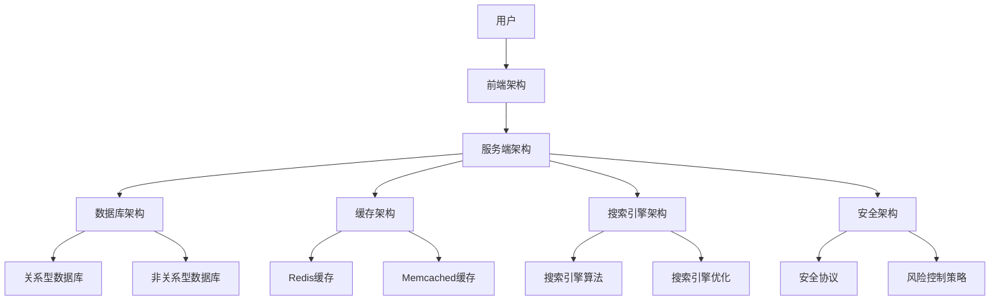

                 

### 《京东2025社招电商平台架构师面试问答精选》

#### 关键词：
- 电商平台
- 架构师面试
- 技术问题
- 业务分析
- 数据库优化
- 缓存策略
- 搜索引擎
- 安全防护

#### 摘要：
本文旨在为准备应聘京东2025社招电商平台架构师职位的候选人提供一份全面的面试问答精选。文章围绕电商平台的架构设计、核心技术、面试技巧等方面进行深入探讨，旨在帮助读者理解电商平台的架构原理，掌握核心技术，并提升面试成功率。

---

### 《京东2025社招电商平台架构师面试问答精选》目录大纲

#### 第一部分：电商行业概述与架构基础

##### 第1章：电商行业背景与市场分析
- **1.1** 电商行业的发展历程
- **1.2** 当前电商市场的格局与趋势
- **1.3** 电商平台的核心要素

##### 第2章：电商平台架构概述
- **2.1** 电商平台的架构层次
- **2.2** 电商交易流程解析
- **2.3** 电商平台的技术选型

#### 第二部分：电商平台核心技术

##### 第3章：电商数据库设计与优化
- **3.1** 数据库设计原则
- **3.2** 数据库优化策略
- **3.3** 分布式数据库架构

##### 第4章：电商平台缓存策略
- **4.1** 缓存机制原理
- **4.2** 缓存策略与实现
- **4.3** 缓存一致性解决方案

##### 第5章：电商平台搜索引擎
- **5.1** 搜索引擎基本原理
- **5.2** 搜索引擎优化策略
- **5.3** 搜索引擎在电商中的应用

##### 第6章：电商安全与风控
- **6.1** 电商安全威胁分析
- **6.2** 风险控制机制
- **6.3** 安全防护技术

#### 第三部分：电商架构师面试技巧

##### 第7章：面试前的准备
- **7.1** 面试常见问题类型
- **7.2** 面试技巧与注意事项
- **7.3** 案例分析与问题应对

##### 第8章：技术面试实战
- **8.1** 数据结构与算法问题解析
- **8.2** 电商业务相关问题解析
- **8.3** 编程实战与代码审查

##### 第9章：综合面试与心理准备
- **9.1** 综合面试的要素
- **9.2** 心理素质的提升
- **9.3** 成功案例分享

#### 第四部分：附录

##### 附录A：电商平台架构师面试常见问题汇总
- **A.1** 技术问题汇总
- **A.2** 业务问题汇总
- **A.3** 行业问题汇总

##### 附录B：面试资料推荐
- **B.1** 电商平台架构相关书籍
- **B.2** 面试经验分享网站
- **B.3** 技术社区与论坛推荐

---

### 核心概念与联系

首先，让我们通过一个Mermaid流程图来展示电商平台的整体架构：



在这个架构图中，用户通过前端架构（B）与电商平台进行交互，前端负责渲染页面、处理用户输入等。服务端架构（C）则负责处理业务逻辑、数据存储和读取等。数据库架构（D）主要包括关系型数据库（H）和非关系型数据库（I），用于存储用户数据、商品信息等。缓存架构（E）通过Redis和Memcached提高系统性能。搜索引擎架构（F）则负责商品搜索和推荐。安全架构（G）确保平台的安全性和数据的完整性。

---

### 核心算法原理讲解示例

#### 数据库优化策略

**1. 查询优化**

查询优化是数据库性能优化的重要手段。以下是一个常见的查询优化策略：

**索引优化**：使用合适的索引可以显著提高查询速度。

- **B树索引**：适用于等值和范围查询。
- **哈希索引**：适用于等值查询，但查询效率相对较高。

**查询重写**：通过重写查询语句，使其更加高效。

- **使用连接操作代替子查询**。
- **避免使用SELECT *，只选择需要的列**。

以下是一个查询优化的伪代码示例：

```python
# 伪代码：查询优化
def optimized_query(table, columns, where_clause):
    # 创建索引
    create_index(table, columns)
    
    # 重写查询语句
    query = f"SELECT {columns} FROM {table} WHERE {where_clause}"
    
    # 执行查询
    result = execute_query(query)
    
    return result
```

**2. 数据库表结构优化**

数据库表结构优化主要包括范式化和分区。

**范式化**：将数据按照范式进行拆分，减少冗余和更新异常。

- **第一范式**：确保每个字段都是不可分割的原子值。
- **第二范式**：在第一范式的基础上，确保每个非主属性完全依赖于主键。
- **第三范式**：在第二范式的基础上，确保非主属性不传递依赖于主键。

**分区**：将大数据表按一定规则拆分为多个小表，提高查询效率。

以下是一个分区表的伪代码示例：

```sql
# 伪代码：创建分区表
CREATE TABLE sales (
    order_id INT,
    product_id INT,
    quantity INT,
    order_date DATE,
    PRIMARY KEY (order_id, product_id)
) PARTITION BY RANGE (order_date);
```

**3. 性能监控与调优**

**监控数据库性能**：定期监控数据库性能，包括CPU、内存、I/O等资源使用情况。

- **监控工具**：使用监控工具如MySQL Enterprise Monitor、Nagios等。

**SQL优化**：对执行效率低的SQL进行优化。

- **使用explain分析SQL执行计划**。
- **避免使用SELECT *，只选择需要的列**。
- **避免使用LIKE '%字符串%'进行模糊查询，使用通配符索引**。

---

### 数学模型与公式讲解示例

#### 搜索引擎优化（SEO）

**1. 关键词密度**

关键词密度（Keyword Density，KD）是指文章中关键词出现的频率。计算公式为：

$$
KD = \frac{\text{关键词出现次数}}{\text{文章总字数}}
$$

优化建议：关键词密度保持在2%到8%之间，过高或过低都会影响SEO效果。

**2. 关键词密度比**

关键词密度比（Keyword Density Ratio，KDR）是关键词密度与文章中其他词的平均密度之比。计算公式为：

$$
KDR = \frac{KD}{\frac{\text{文章总词数} - \text{关键词出现次数}}{\text{文章总字数}}}
$$

优化建议：KDR保持在1到2之间，过高可能被视为过度优化。

**3. 关键词位置**

关键词位置对SEO影响较大，主要包括：

- **标题**：标题中出现关键词，有利于提高搜索排名。
- **段落开头**：段落开头出现关键词，有助于提高文章的可读性和相关性。
- **标签**：在HTML标签中使用关键词，如`<title>`、`<meta name="description">`等。

---

### 项目实战示例

#### 电商平台用户行为分析系统

##### 项目背景

随着电商平台业务的快速发展，用户行为数据量呈指数级增长。为了更好地了解用户行为，提升用户体验和营销效果，我们需要构建一个用户行为分析系统。

##### 项目目标

- 实时分析用户行为，提取有价值的信息。
- 构建用户画像，实现个性化推荐。
- 提高营销活动的转化率。

##### 技术选型

- **数据采集**：使用日志采集工具，如ELK（Elasticsearch, Logstash, Kibana）。
- **数据处理**：采用Apache Spark进行大数据处理。
- **数据分析**：使用Python进行数据挖掘和分析。
- **推荐系统**：基于协同过滤算法，实现个性化推荐。

##### 实现步骤

**1. 数据采集**

- 收集用户访问日志，包括用户ID、访问时间、访问页面等。
- 通过Logstash将日志数据导入到Elasticsearch中。

**2. 数据处理**

- 使用Spark对数据进行清洗、转换和聚合。
- 提取用户行为特征，如访问时长、访问深度、页面停留时间等。

**3. 用户画像构建**

- 基于用户行为数据，构建用户画像，包括用户兴趣、购买偏好等。
- 存储用户画像数据到Hadoop HDFS。

**4. 个性化推荐**

- 基于用户画像，使用协同过滤算法进行推荐。
- 构建推荐模型，实现商品推荐、广告投放等功能。

##### 源代码实现

**Python代码示例：用户行为数据清洗与聚合**

```python
from pyspark.sql import SparkSession
from pyspark.sql.functions import col, countDistinct

spark = SparkSession.builder.appName("UserBehaviorAnalysis").getOrCreate()

# 读取日志数据
log_data = spark.read.csv("path/to/log_data.csv", header=True)

# 数据清洗
clean_data = log_data.select(
    col("user_id").alias("user_id"),
    col("visit_time").alias("visit_time"),
    col("page_id").alias("page_id")
)

# 数据聚合，提取用户行为特征
user_behavior = clean_data.groupBy("user_id").agg(
    countDistinct("visit_time").alias("visit_count"),
    countDistinct("page_id").alias("page_count")
)

# 存储用户行为数据
user_behavior.write.mode("overwrite").parquet("path/to/user_behavior_data")
```

##### 代码解读与分析

- 代码首先创建一个SparkSession，并读取用户行为日志数据。
- 进行数据清洗，去除无效数据，只保留用户ID、访问时间和页面ID。
- 对用户行为数据进行分组聚合，计算每个用户的访问次数和访问页面数量。
- 将处理后的用户行为数据存储为Parquet格式，便于后续分析和查询。

---

### 附录

##### 附录A：电商平台架构师面试常见问题汇总

- **A.1** 技术问题汇总
  - 如何进行数据库优化？
  - 电商平台的缓存策略有哪些？
  - 搜索引擎的基本原理是什么？
  - 电商平台的安全威胁有哪些？
- **A.2** 业务问题汇总
  - 如何提升电商平台的用户体验？
  - 如何进行用户行为分析？
  - 电商平台的数据一致性如何保证？
  - 电商平台的流量分配策略是什么？
- **A.3** 行业问题汇总
  - 当前电商市场的发展趋势是什么？
  - 电商平台的竞争格局如何？
  - 新零售对电商平台的影响有哪些？
  - 电商平台的国际化战略有哪些挑战？

##### 附录B：面试资料推荐

- **B.1** 电商平台架构相关书籍
  - 《深入理解计算机系统》
  - 《大数据技术原理与架构》
  - 《数据库系统概念》
- **B.2** 面试经验分享网站
  - CSDN
  - 知乎
  - 掘金
- **B.3** 技术社区与论坛推荐
  - Stack Overflow
  - GitHub
  - Redis社区

---

### 作者信息

**作者：AI天才研究院/AI Genius Institute & 禅与计算机程序设计艺术 /Zen And The Art of Computer Programming**

