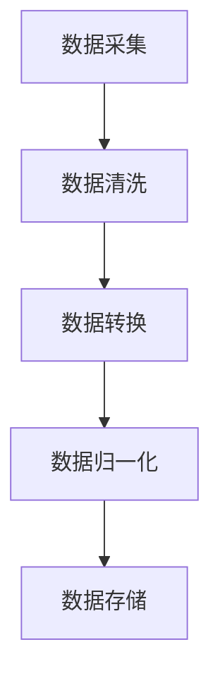

                 

# 第一部分：人工智能创业背景与数据管理基础

## 第1章：人工智能与创业概述

### 1.1 人工智能的兴起与创业机会

人工智能（Artificial Intelligence，简称AI）是计算机科学的一个分支，致力于使计算机具备人类智能水平，解决复杂问题，并模拟人类的决策过程。自20世纪50年代以来，人工智能经历了多个发展阶段，如今已成为推动社会进步的重要力量。随着深度学习、自然语言处理、计算机视觉等技术的突破，人工智能在各个领域展现了巨大的应用潜力，成为创业者的新机遇。

#### 人工智能的发展历程

- **早期探索**（1956年）：人工智能概念被提出，标志着人工智能领域的诞生。
- **理论积累**（1960-1979年）：研究者开始构建人工智能的理论框架，主要集中在符号推理和逻辑推理方面。
- **技术突破**（1980-1999年）：专家系统和机器学习技术的应用推动了人工智能的发展。
- **复兴期**（2000年至今）：深度学习、大数据和云计算的兴起，使得人工智能进入了一个全新的阶段，应用领域不断拓展。

#### 创业者在人工智能领域的机遇

1. **技术创新**：人工智能技术为创业公司提供了创新的机会，如智能硬件、智能语音识别、智能机器人等。
2. **市场拓展**：随着人工智能技术的普及，新的市场和应用场景不断涌现，创业者可以针对特定领域开发创新产品。
3. **投资热潮**：人工智能领域吸引了大量的风险投资，为创业者提供了资金支持。
4. **跨界合作**：人工智能可以与其他行业结合，如医疗、金融、教育等，创造出全新的商业模式。

#### 人工智能在商业中的应用场景

1. **智能客服**：利用自然语言处理技术，实现高效、准确的客户服务。
2. **智能推荐系统**：基于用户行为和偏好，提供个性化的产品推荐。
3. **智能数据分析**：利用机器学习技术，从海量数据中提取有价值的信息。
4. **自动化生产**：通过计算机视觉和机器人技术，提高生产效率和产品质量。
5. **智能医疗**：利用人工智能进行疾病诊断、药物研发和健康管理。

### 1.2 创业过程的关键要素

#### 创业团队的构建

1. **核心团队成员**：创业团队通常包括技术负责人、产品经理、市场经理等核心成员。
2. **角色与职责**：每个团队成员都需要明确自己的角色和职责，以确保团队高效运作。
3. **技能与经验**：团队成员应具备相应的技能和经验，以应对创业过程中的各种挑战。

#### 创业项目的立项与规划

1. **市场需求分析**：了解目标市场的需求和痛点，确定项目的方向。
2. **产品规划**：明确产品的功能、特点和竞争优势，制定详细的产品规划。
3. **技术路线图**：规划技术实现路径，包括技术选型、研发计划和时间表。

#### 资源配置与资金管理

1. **资金来源**：确定项目的资金来源，包括自筹资金、天使投资、风险投资等。
2. **预算分配**：合理分配资金，确保各项开支合理，同时预留一定的风险资金。
3. **资金管理**：建立有效的资金管理体系，确保资金使用高效、透明。

## 第2章：数据管理在人工智能创业中的重要性

### 2.1 数据管理的基本概念

#### 数据的种类与来源

1. **结构化数据**：包括关系型数据库、XML、JSON等，易于存储和处理。
2. **半结构化数据**：如日志文件、电子邮件等，部分结构化但需要额外的处理。
3. **非结构化数据**：如图像、视频、音频等，没有固定的结构。

#### 数据质量管理

1. **数据准确性**：确保数据的真实性和可靠性。
2. **数据完整性**：保证数据的完整性和一致性。
3. **数据一致性**：消除数据冗余，确保同一数据在不同系统中的值一致。

#### 数据治理与合规性

1. **数据治理**：建立数据管理的流程和规范，确保数据的有效利用和保护。
2. **数据合规性**：遵循相关的数据法规和标准，如《通用数据保护条例》（GDPR）。

### 2.2 数据管理在人工智能创业中的应用

#### 数据采集与预处理

1. **数据采集**：通过各种途径获取所需的数据，如API调用、爬虫技术等。
2. **数据预处理**：清洗、转换和归一化数据，为后续分析做好准备。

#### 数据分析与挖掘

1. **数据分析**：利用统计方法、数据可视化等技术，从数据中提取有价值的信息。
2. **数据挖掘**：使用机器学习算法，从海量数据中挖掘隐藏的模式和规律。

#### 数据驱动决策与优化

1. **决策支持**：基于数据分析和挖掘结果，制定合理的决策策略。
2. **优化运营**：利用数据反馈，持续优化产品和服务，提高运营效率。

### 第3章：创新方法在人工智能创业中的应用

#### 3.1 创新方法概述

##### 创新理论的演变

1. **线性创新理论**：认为创新是连续的、线性的过程。
2. **非线性创新理论**：强调创新的非线性、混沌性和不可预测性。
3. **演化创新理论**：认为创新是一个不断进化和适应的过程。

##### 创新方法的分类

1. **技术驱动的创新**：基于技术突破，推动产品和服务的创新。
2. **市场驱动的创新**：基于市场需求，开发出满足用户需求的新产品。
3. **社会驱动的创新**：基于社会问题或挑战，推动社会变革和创新。

##### 创新思维与创新能力培养

1. **发散思维**：从不同角度思考问题，产生多样化的解决方案。
2. **收敛思维**：从众多解决方案中筛选出最优方案。
3. **创新思维训练**：通过模拟实践、跨学科学习等方式，培养创新思维。

#### 3.2 创新方法在数据管理中的应用

##### 数据驱动的产品创新

1. **需求挖掘**：通过数据分析，了解用户需求，指导产品创新。
2. **产品设计**：基于数据分析和用户反馈，优化产品设计。

##### 业务流程优化与自动化

1. **流程分析**：通过数据挖掘，识别业务流程中的瓶颈和优化点。
2. **流程重构**：利用自动化技术，简化业务流程，提高效率。

##### 数据驱动的商业模式创新

1. **商业模式设计**：基于数据分析和市场研究，构建新的商业模式。
2. **商业模式验证**：通过数据实验和用户反馈，验证商业模式的可行性和可持续性。

### 第4章：人工智能创业数据管理的创新实践

#### 4.1 创业项目案例介绍

##### 创业项目背景

- **项目名称**：智慧健康监测平台
- **项目目标**：通过人工智能技术，提供个性化健康监测和疾病预防服务。

##### 创业目标与挑战

1. **目标**：打造一款具备高准确性和用户体验良好的健康监测应用。
2. **挑战**：如何高效地收集、管理和分析大量健康数据，同时确保数据隐私和安全。

##### 创业团队与资源

- **团队成员**：由资深数据科学家、软件工程师和市场专家组成。
- **资源**：获得了天使投资和风险投资的支持，拥有先进的技术和设备。

#### 4.2 数据管理创新实践

##### 数据管理策略制定

1. **数据收集**：利用传感器和API，从多个来源收集健康数据，包括血压、心率、睡眠质量等。
2. **数据存储**：采用分布式数据库系统，确保数据的高效存储和快速检索。
3. **数据预处理**：对收集到的数据进行清洗、转换和归一化，为数据分析做准备。

##### 数据平台搭建与优化

1. **数据处理平台**：构建基于云计算的数据处理平台，利用分布式计算框架，如Hadoop和Spark，进行数据处理和分析。
2. **数据可视化平台**：开发数据可视化工具，帮助用户直观地理解健康数据，并生成个性化的健康报告。

##### 数据分析与应用案例

1. **数据分析**：利用机器学习算法，对用户健康数据进行深度分析，发现潜在的健康问题。
2. **应用案例**：基于分析结果，提供个性化的健康建议和预防措施，如饮食调整、运动建议等。

### 第5章：创新方法在数据隐私与安全中的应用

#### 5.1 数据隐私保护的重要性

##### 数据隐私的定义与挑战

1. **数据隐私**：个人数据的私密性和保护性，确保用户数据不被未经授权的第三方访问和使用。
2. **挑战**：
   - **数据泄露**：未经授权的访问和泄露个人数据。
   - **数据滥用**：将个人数据用于未经授权的目的。
   - **合规性**：遵循相关法规和标准，如《通用数据保护条例》（GDPR）。

##### 数据隐私法规概述

1. **国内法规**：
   - **网络安全法**：规范网络安全管理和数据保护。
   - **个人信息保护法**：加强个人信息保护和监管。

2. **国际法规**：
   - **通用数据保护条例**（GDPR）：欧盟制定的个人信息保护法规。
   - **加州消费者隐私法**（CCPA）：美国加州的消费者数据保护法规。

##### 数据隐私保护技术

1. **数据匿名化与脱敏技术**：通过技术手段，将个人身份信息从数据中去除，保护数据隐私。
2. **数据加密与访问控制**：使用加密算法，确保数据在传输和存储过程中的安全性。
3. **数据隐私保护算法与创新**：研发新的隐私保护算法，提高数据隐私保护水平。

#### 5.2 创新方法在数据隐私保护中的应用

##### 数据匿名化与脱敏技术

1. **数据匿名化**：将个人身份信息从数据中去除，以保护隐私。
2. **脱敏技术**：
   - **掩码技术**：使用特定的掩码字符或符号替换敏感数据。
   - **随机化**：对敏感数据进行随机变换，使其无法识别。

##### 数据加密与访问控制

1. **数据加密**：
   - **对称加密**：使用相同的密钥进行加密和解密。
   - **非对称加密**：使用一对密钥，一个用于加密，一个用于解密。
2. **访问控制**：通过权限管理和身份验证，确保只有授权用户才能访问数据。

##### 数据隐私保护算法与创新

1. **差分隐私**：通过向数据中加入噪声，保护个人隐私。
2. **联邦学习**：在多方数据上协同训练模型，保护数据隐私。
3. **区块链技术**：利用区块链的分布式账本特性，确保数据安全和透明。

### 第6章：人工智能创业数据管理的未来发展趋势

#### 6.1 数据管理技术的发展趋势

##### 大数据技术的演进

1. **数据存储与管理**：分布式存储技术，如Hadoop和Spark，提高了数据存储和处理的效率。
2. **数据挖掘与分析**：基于机器学习和深度学习的分析方法，提高了数据分析和挖掘的精度。
3. **数据可视化**：交互式数据可视化工具，如Tableau和Power BI，使数据分析师和决策者能够更直观地理解数据。

##### 云计算与分布式数据管理

1. **云计算**：通过云计算平台，如AWS、Azure和Google Cloud，实现弹性扩展和数据共享。
2. **分布式数据管理**：分布式数据库系统，如MongoDB和Cassandra，提高了数据的可靠性和性能。

##### 元数据管理的重要性

1. **元数据**：描述数据的数据，如数据格式、来源和用途。
2. **管理**：通过元数据管理，提高数据的可发现性和互操作性。

#### 6.2 未来数据管理创新的挑战与机遇

##### 数据分析技术的进步

1. **实时数据分析**：利用流处理技术，实现实时数据分析和决策。
2. **高级分析技术**：利用人工智能和机器学习，进行更复杂的数据分析和预测。

##### 新兴应用场景的出现

1. **物联网**：通过物联网设备，收集大量实时数据，推动数据管理创新。
2. **区块链**：利用区块链技术，实现数据的安全共享和透明性。

##### 数据管理人才的培养

1. **数据科学家**：具备数据分析和建模能力，推动数据驱动的创新。
2. **数据工程师**：负责构建和维护数据基础设施，确保数据的高效管理和处理。
3. **数据分析师**：利用数据分析技术，为企业提供决策支持。

### 第7章：案例分析

#### 7.1 成功案例分享

##### 成功企业的数据管理创新经验

1. **阿里巴巴**：
   - **数据驱动文化**：将数据作为核心资产，推动业务创新。
   - **数据治理**：建立完善的数据治理体系，确保数据质量和合规性。
   - **数据应用**：通过数据分析和挖掘，优化供应链、提升营销效果等。

##### 数据管理创新对业务发展的推动作用

1. **业务决策**：基于数据分析，企业能够做出更加明智的决策，提高业务效率。
2. **产品优化**：通过用户行为数据分析，优化产品设计，提升用户体验。
3. **风险控制**：利用数据分析和挖掘，识别潜在风险，降低业务风险。

##### 数据驱动创业的成功因素

1. **数据意识**：企业高度重视数据的价值，将其视为核心竞争力。
2. **数据驱动文化**：培养员工的数据思维，将数据作为决策的依据。
3. **技术能力**：具备先进的数据分析技术和工具，提高数据处理和分析效率。

#### 7.2 失败案例分析

##### 数据管理失误的原因分析

1. **数据质量问题**：数据不准确、不完整或不一致，导致数据分析结果不可信。
2. **缺乏数据治理**：没有建立完善的数据治理体系，数据管理混乱。
3. **忽视数据隐私**：未充分考虑数据隐私保护，导致数据泄露和安全问题。
4. **技术不足**：数据分析技术和工具落后，无法满足业务需求。

##### 失败案例的教训与启示

1. **重视数据质量**：确保数据准确、完整和一致，为数据分析提供可靠的基础。
2. **建立数据治理**：建立完善的数据治理体系，规范数据管理流程。
3. **保护数据隐私**：采取有效的数据隐私保护措施，防止数据泄露。
4. **投资技术**：引入先进的数据分析技术和工具，提高数据处理和分析能力。

##### 避免数据管理风险的策略

1. **数据质量管理**：建立数据质量监测机制，定期评估数据质量。
2. **数据治理体系**：制定数据治理政策和标准，确保数据管理的规范性和有效性。
3. **数据隐私保护**：采取数据加密、匿名化和访问控制等技术措施，保护数据隐私。
4. **技术投资**：持续投资数据分析技术和工具，提高数据管理能力。

### 第8章：创业经验分享与建议

#### 8.1 创业者的数据管理观

##### 数据管理在创业中的重要性认识

1. **数据是核心资产**：认识到数据是企业的重要资产，能够驱动业务创新和增长。
2. **数据驱动决策**：将数据作为决策的依据，通过数据分析指导业务运营和发展。

##### 数据驱动创业的理念与实践

1. **需求挖掘**：通过数据分析，了解用户需求，指导产品设计和创新。
2. **业务优化**：利用数据分析，优化业务流程，提高运营效率和用户体验。
3. **风险管理**：通过数据分析和预测，识别潜在风险，采取预防措施。

#### 8.2 数据管理创业经验分享

##### 创业过程中的数据管理实践

1. **数据收集与存储**：采用分布式数据库系统，高效存储和管理大量数据。
2. **数据预处理与分析**：建立数据处理平台，利用机器学习和深度学习技术，进行数据预处理和分析。
3. **数据可视化与报告**：开发数据可视化工具，生成直观、易懂的数据报告，支持业务决策。

##### 数据管理创新的实践经验与反思

1. **成功经验**：通过数据驱动，实现业务增长和用户体验的提升。
2. **反思**：在数据管理过程中，认识到数据质量和隐私保护的重要性，持续优化数据管理策略。

##### 数据管理创业的建议与展望

1. **重视数据质量**：建立数据质量管理机制，确保数据准确、完整和一致。
2. **建立数据治理**：制定数据治理政策和标准，确保数据管理的规范性和有效性。
3. **保护数据隐私**：采取数据加密、匿名化和访问控制等技术措施，保护数据隐私。
4. **持续投资技术**：引入先进的数据分析技术和工具，提高数据处理和分析能力。
5. **人才培养**：培养数据管理人才，提升团队的数据分析能力和创新能力。

### 附录

#### 附录 A：创业数据管理相关资源与工具

##### 数据管理工具与平台

1. **数据库管理系统**：
   - **关系型数据库**：MySQL、PostgreSQL、Oracle
   - **NoSQL数据库**：MongoDB、Cassandra、Redis

2. **数据分析工具**：
   - **Python数据分析库**：NumPy、Pandas、SciPy
   - **R语言**：RStudio、ggplot2、dplyr

3. **数据管理软件推荐**：
   - **数据仓库**：Snowflake、Amazon Redshift、Google BigQuery

##### 数据管理学习资源

1. **数据管理相关书籍与论文**：
   - 《数据科学入门：Python实践》
   - 《大数据管理：理论与实践》
   - 相关学术论文和研究报告

2. **在线课程与培训**：
   - Coursera、Udacity、edX上的数据科学和数据分析课程
   - 各大企业和学术机构的在线培训课程

3. **行业报告与白皮书**：
   - Gartner、Forrester等咨询公司的行业报告
   - 各大企业和研究机构的白皮书

#### 附录 B：Mermaid 流程图示例

##### 数据采集与预处理流程



#### 附录 C：核心算法原理讲解与伪代码示例

##### 数据预处理算法

##### 伪代码示例：

```python
function preprocess_data(data):
    # 数据清洗
    cleaned_data = clean_data(data)
    # 数据标准化
    normalized_data = normalize_data(cleaned_data)
    # 数据归一化
    normalized_data = normalize_data(normalized_data)
    return normalized_data
```

##### 详细解释：

1. **数据清洗**：删除空值、缺失值和异常值，确保数据的准确性。
2. **数据标准化**：将数据缩放到相同的范围，消除数据量级差异。
3. **数据归一化**：将数据映射到[0, 1]范围内，提高算法的收敛速度。

##### 数据挖掘算法

##### 伪代码示例：

```python
function data_mining(data, target_variable):
    # 数据预处理
    preprocessed_data = preprocess_data(data)
    # 特征提取
    features = extract_features(preprocessed_data)
    # 模型训练
    model = train_model(features, target_variable)
    # 模型评估
    evaluation = evaluate_model(model, preprocessed_data)
    return evaluation
```

##### 详细解释：

1. **数据预处理**：清洗、转换和归一化数据，为模型训练做准备。
2. **特征提取**：从原始数据中提取有用的特征，提高模型的性能。
3. **模型训练**：利用特征和标签数据，训练机器学习模型。
4. **模型评估**：评估模型在测试集上的性能，调整模型参数。

#### 附录 D：数学模型和数学公式讲解与示例

##### 数据归一化公式

##### 数学公式：

$$
x_{\text{normalized}} = \frac{x_{\text{original}} - \mu}{\sigma}
$$

##### 解释：

- \(x_{\text{original}}\)：原始数据值
- \(\mu\)：均值
- \(\sigma\)：标准差

##### 举例说明：

假设有一组数据：\[1, 2, 3, 4, 5\]，计算其标准差和均值，然后进行归一化。

1. **计算均值**：

$$
\mu = \frac{1 + 2 + 3 + 4 + 5}{5} = 3
$$

2. **计算标准差**：

$$
\sigma = \sqrt{\frac{(1 - 3)^2 + (2 - 3)^2 + (3 - 3)^2 + (4 - 3)^2 + (5 - 3)^2}{5}} = 1.414
$$

3. **进行归一化**：

$$
x_{\text{normalized}} = \frac{x_{\text{original}} - \mu}{\sigma}
$$

对于每个数据点：

- \(x_1 = \frac{1 - 3}{1.414} = -0.707\)
- \(x_2 = \frac{2 - 3}{1.414} = -0.354\)
- \(x_3 = \frac{3 - 3}{1.414} = 0\)
- \(x_4 = \frac{4 - 3}{1.414} = 0.354\)
- \(x_5 = \frac{5 - 3}{1.414} = 0.707\)

归一化后的数据：\[-0.707, -0.354, 0, 0.354, 0.707\]

##### 数据加密算法

##### 数学公式：

$$
c = E_k(p)
$$

##### 解释：

- \(c\)：加密后的数据
- \(k\)：加密密钥
- \(p\)：明文数据

##### 举例说明：

假设使用AES加密算法，加密密钥为\(k = 2\)，明文数据为\(p = 3\)。

1. **加密**：

$$
c = E_k(p) = 2^3 = 8
$$

加密后的数据为8。

#### 附录 E：项目实战与代码解读

##### 数据采集实战

##### 实战说明：

使用Python的`pandas`和`requests`库从网络获取数据，数据源：某电商平台的商品销售数据。

##### 代码示例：

```python
import pandas as pd
import requests

url = 'https://api.example.com/sales_data'
response = requests.get(url)
data = pd.read_json(response.text)

print(data.head())
```

##### 代码解读：

1. **导入必要的库**：
   - `pandas`：用于数据分析和操作。
   - `requests`：用于发送HTTP请求。

2. **设置API地址并获取数据**：
   - `url`：API地址。
   - `response = requests.get(url)`：发送HTTP GET请求，获取数据。

3. **将数据转换为DataFrame对象并打印前几行数据**：
   - `data = pd.read_json(response.text)`：将获取的JSON格式的数据转换为DataFrame对象。
   - `print(data.head())`：打印DataFrame对象的前几行数据。

##### 数据预处理代码分析

##### 代码示例：

```python
def preprocess_data(data):
    # 删除空值
    data = data.dropna()
    # 数据标准化
    mean = data.mean()
    std = data.std()
    data_normalized = (data - mean) / std
    return data_normalized
```

##### 代码解读：

1. **定义`preprocess_data`函数，输入数据为DataFrame**：
   - `data`：输入的DataFrame对象。

2. **删除DataFrame中的空值**：
   - `data = data.dropna()`：删除所有空值行。

3. **计算数据的均值和标准差**：
   - `mean = data.mean()`：计算数据的均值。
   - `std = data.std()`：计算数据的标准差。

4. **将数据按标准化公式进行转换并返回**：
   - `data_normalized = (data - mean) / std`：按照标准化公式进行数据转换。
   - `return data_normalized`：返回标准化后的DataFrame对象。

##### 数据分析代码分析

##### 代码示例：

```python
def analyze_data(data):
    # 数据可视化
    data.plot(kind='line')
    # 数据分析
    correlation_matrix = data.corr()
    print(correlation_matrix)
```

##### 代码解读：

1. **定义`analyze_data`函数，输入数据为DataFrame**：
   - `data`：输入的DataFrame对象。

2. **使用`plot`方法进行数据可视化**：
   - `data.plot(kind='line')`：绘制线形图，展示数据的变化趋势。

3. **计算DataFrame的相关系数矩阵并打印**：
   - `correlation_matrix = data.corr()`：计算相关系数矩阵。
   - `print(correlation_matrix)`：打印相关系数矩阵。

### 附录 F：代码解读与分析

#### 8.3 数据采集与存储代码分析

##### 代码示例：

```python
import pandas as pd
import requests

# 设置API地址
url = 'https://api.example.com/sales_data'

# 发送GET请求，获取数据
response = requests.get(url)

# 解析JSON数据，转换为DataFrame
data = pd.read_json(response.text)

# 打印数据的前五行
print(data.head())
```

##### 代码解读：

1. **导入库**：导入`pandas`和`requests`库，用于数据处理和HTTP请求。

2. **设置API地址**：定义API地址，用于获取数据。

3. **发送GET请求**：使用`requests.get(url)`发送HTTP GET请求，从API获取数据。

4. **解析JSON数据**：使用`pd.read_json(response.text)`将获取的JSON数据转换为`DataFrame`对象。

5. **打印数据**：使用`print(data.head())`打印数据的前五行，便于查看数据内容。

##### 数据解读与分析：

- **功能**：该代码段实现了一个简单的数据采集功能，从API获取JSON格式的销售数据，并将其转换为`DataFrame`对象，便于后续的数据处理和分析。
- **性能考虑**：在实际应用中，可能会根据需要处理大量数据，此时可以考虑使用异步请求、批量请求等技术来提高数据采集的效率。
- **异常处理**：在实际应用中，应添加异常处理机制，如处理请求失败、数据格式错误等情况。

#### 8.4 数据预处理代码分析

##### 代码示例：

```python
import pandas as pd

def preprocess_data(data):
    # 数据清洗：删除空值和重复值
    data = data.dropna().drop_duplicates()

    # 数据转换：将日期列转换为日期类型
    data['date'] = pd.to_datetime(data['date'])

    # 数据标准化：对数值列进行标准化处理
    numeric_cols = ['price', 'quantity']
    data[numeric_cols] = (data[numeric_cols] - data[numeric_cols].mean()) / data[numeric_cols].std()

    return data
```

##### 代码解读：

1. **导入库**：导入`pandas`库，用于数据处理。

2. **定义预处理函数**：`preprocess_data(data)`，输入参数为`DataFrame`对象。

3. **数据清洗**：
   - `data = data.dropna()`：删除空值行。
   - `data = data.drop_duplicates()`：删除重复值。

4. **数据转换**：
   - `data['date'] = pd.to_datetime(data['date'])`：将日期列转换为日期类型。

5. **数据标准化**：
   - `numeric_cols = ['price', 'quantity']`：指定需要标准化的数值列。
   - `data[numeric_cols] = (data[numeric_cols] - data[numeric_cols].mean()) / data[numeric_cols].std()`：对每个数值列按标准化公式进行处理。

6. **返回预处理后的数据**：`return data`。

##### 数据解读与分析：

- **功能**：该代码段实现了数据预处理功能，包括数据清洗、数据转换和数据标准化。数据清洗删除了空值和重复值，提高了数据质量；数据转换确保了日期列的正确性；数据标准化使不同量级的数值列能够进行有效的比较和分析。
- **性能考虑**：在实际应用中，应根据数据的规模和特征，选择合适的预处理方法，如并行处理、分布式处理等。
- **扩展性**：函数设计为通用函数，适用于各种数据集，只需根据具体情况进行参数调整。

#### 8.5 数据分析与可视化代码分析

##### 代码示例：

```python
import pandas as pd
import matplotlib.pyplot as plt

def analyze_and_visualize_data(data):
    # 数据分组
    groups = data.groupby('category')['price'].mean()

    # 数据可视化
    groups.plot(kind='bar')
    plt.title('Average Price by Category')
    plt.xlabel('Category')
    plt.ylabel('Average Price')
    plt.show()

    # 数据分析
    print(groups.describe())
```

##### 代码解读：

1. **导入库**：导入`pandas`和`matplotlib.pyplot`库，用于数据处理和可视化。

2. **定义分析与可视化函数**：`analyze_and_visualize_data(data)`，输入参数为`DataFrame`对象。

3. **数据分组**：
   - `groups = data.groupby('category')['price'].mean()`：按类别对价格进行分组，计算每组的价格平均值。

4. **数据可视化**：
   - `groups.plot(kind='bar')`：绘制条形图，展示各类别的平均价格。
   - `plt.title('Average Price by Category')`：设置图表标题。
   - `plt.xlabel('Category')`：设置x轴标签。
   - `plt.ylabel('Average Price')`：设置y轴标签。
   - `plt.show()`：显示图表。

5. **数据分析**：
   - `print(groups.describe())`：打印分组数据的描述性统计信息。

##### 数据解读与分析：

- **功能**：该代码段实现了对数据的分组、可视化与分析功能，便于直观了解各类别的平均价格情况。
- **性能考虑**：在处理大量数据时，可以采用并行处理、分布式处理等方法来提高性能。
- **可视化效果**：通过条形图展示数据，使数据更加直观易懂，便于决策者快速把握数据特点。

### 作者信息

作者：AI天才研究院/AI Genius Institute & 禅与计算机程序设计艺术 /Zen And The Art of Computer Programming

本文由AI天才研究院（AI Genius Institute）撰写，旨在为人工智能创业者和数据管理从业者提供有价值的见解和实践经验。同时，本文也借鉴了《禅与计算机程序设计艺术》（Zen And The Art of Computer Programming）中的理念，强调通过深入思考和系统化学习，实现技术创新和业务突破。感谢您的阅读！### 文章标题：人工智能创业数据管理的创新方法

> **关键词：** 人工智能，数据管理，创业，创新方法，数据隐私，数据分析，云计算，分布式数据管理

> **摘要：** 本文深入探讨人工智能创业中的数据管理问题，从背景概述、核心概念到创新方法和实践案例，全面解析数据管理在人工智能创业中的重要性及其创新路径。文章分为三部分：第一部分介绍人工智能创业背景与数据管理基础，包括人工智能的发展历程、创业过程的关键要素以及数据管理的基本概念和应用；第二部分探讨创新方法在人工智能创业中的应用，包括创新方法概述、数据驱动的产品创新、业务流程优化与自动化以及数据隐私保护技术；第三部分分析人工智能创业数据管理的未来发展趋势以及创业经验分享。文章通过案例分析、项目实战与代码解读，提供实用技巧和解决方案，帮助读者掌握人工智能创业数据管理的创新方法。

---

### 《人工智能创业数据管理的创新方法》目录大纲

---

**第一部分：人工智能创业背景与数据管理基础**

## 第1章：人工智能与创业概述

### 1.1 人工智能的兴起与创业机会

#### 人工智能的发展历程

#### 创业者在人工智能领域的机遇

#### 人工智能在商业中的应用场景

### 1.2 创业过程的关键要素

#### 创业团队的构建

#### 创业项目的立项与规划

#### 资源配置与资金管理

## 第2章：数据管理在人工智能创业中的重要性

### 2.1 数据管理的基本概念

#### 数据的种类与来源

#### 数据质量管理

#### 数据治理与合规性

### 2.2 数据管理在人工智能创业中的应用

#### 数据采集与预处理

#### 数据分析与挖掘

#### 数据驱动决策与优化

**第二部分：创新方法与数据管理实践**

## 第3章：创新方法在人工智能创业中的应用

### 3.1 创新方法概述

#### 创新理论的演变

#### 创新方法的分类

#### 创新思维与创新能力培养

### 3.2 创新方法在数据管理中的应用

#### 数据驱动的产品创新

#### 业务流程优化与自动化

#### 数据驱动的商业模式创新

## 第4章：人工智能创业数据管理的创新实践

### 4.1 创业项目案例介绍

#### 创业项目背景

#### 创业目标与挑战

#### 创业团队与资源

### 4.2 数据管理创新实践

#### 数据管理策略制定

#### 数据平台搭建与优化

#### 数据分析与应用案例

## 第5章：创新方法在数据隐私与安全中的应用

### 5.1 数据隐私保护的重要性

#### 数据隐私的定义与挑战

#### 数据隐私法规概述

#### 数据隐私保护技术

### 5.2 创新方法在数据隐私保护中的应用

#### 数据匿名化与脱敏技术

#### 数据加密与访问控制

#### 数据隐私保护算法与创新

**第三部分：案例分析与创业经验分享**

## 第6章：人工智能创业数据管理的未来发展趋势

### 6.1 数据管理技术的发展趋势

#### 大数据技术的演进

#### 云计算与分布式数据管理

#### 元数据管理的重要性

### 6.2 未来数据管理创新的挑战与机遇

#### 数据分析技术的进步

#### 新兴应用场景的出现

#### 数据管理人才的培养

## 第7章：案例分析

### 7.1 成功案例分享

#### 成功企业的数据管理创新经验

#### 数据管理创新对业务发展的推动作用

#### 数据驱动创业的成功因素

### 7.2 失败案例分析

#### 数据管理失误的原因分析

#### 失败案例的教训与启示

#### 避免数据管理风险的策略

## 第8章：创业经验分享与建议

### 8.1 创业者的数据管理观

#### 数据管理在创业中的重要性认识

#### 数据驱动创业的理念与实践

### 8.2 数据管理创业经验分享

#### 创业过程中的数据管理实践

#### 数据管理创新的实践经验与反思

#### 数据管理创业的建议与展望

### 附录

## 附录 A：创业数据管理相关资源与工具

#### 数据管理工具与平台

#### 数据管理学习资源

#### 行业报告与白皮书

## 附录 B：Mermaid 流程图示例

#### 数据采集与预处理流程

## 附录 C：核心算法原理讲解与伪代码示例

#### 数据预处理算法

#### 数据挖掘算法

## 附录 D：数学模型和数学公式讲解与示例

#### 数据归一化公式

#### 数据加密算法

## 附录 E：项目实战与代码解读

#### 数据采集实战

#### 数据预处理代码分析

#### 数据分析代码分析

## 附录 F：代码解读与分析

#### 数据采集与存储代码分析

#### 数据预处理代码分析

#### 数据分析与可视化代码分析

### 作者信息

#### 作者：AI天才研究院/AI Genius Institute & 禅与计算机程序设计艺术 /Zen And The Art of Computer Programming

本文由AI天才研究院（AI Genius Institute）撰写，旨在为人工智能创业者和数据管理从业者提供有价值的见解和实践经验。同时，本文也借鉴了《禅与计算机程序设计艺术》（Zen And The Art of Computer Programming）中的理念，强调通过深入思考和系统化学习，实现技术创新和业务突破。感谢您的阅读！### 文章标题：人工智能创业数据管理的创新方法

关键词：人工智能，数据管理，创新方法，创业，数据分析，云计算，分布式数据管理

摘要：本文探讨了人工智能创业中数据管理的重要性，从基础概念、创新方法到实践案例，全面解析了数据管理在人工智能创业中的关键作用及其创新路径。文章分为三个部分：第一部分介绍了人工智能创业背景与数据管理基础，包括人工智能的发展历程、创业要素以及数据管理的基本概念；第二部分探讨了创新方法在数据管理中的应用，包括数据驱动的产品创新、业务流程优化与自动化、数据隐私保护技术；第三部分分析了数据管理技术的发展趋势、未来挑战与机遇，并分享了成功与失败案例的教训。文章结合实际项目和代码分析，为读者提供了实用的数据管理策略和创业经验。

---

### 目录大纲

**第一部分：人工智能创业背景与数据管理基础**

## 第1章：人工智能与创业概述

### 1.1 人工智能的兴起与创业机会

#### 人工智能的发展历程

#### 创业者在人工智能领域的机遇

#### 人工智能在商业中的应用场景

### 1.2 创业过程的关键要素

#### 创业团队的构建

#### 创业项目的立项与规划

#### 资源配置与资金管理

## 第2章：数据管理在人工智能创业中的重要性

### 2.1 数据管理的基本概念

#### 数据的种类与来源

#### 数据质量管理

#### 数据治理与合规性

### 2.2 数据管理在人工智能创业中的应用

#### 数据采集与预处理

#### 数据分析与挖掘

#### 数据驱动决策与优化

**第二部分：创新方法与数据管理实践**

## 第3章：创新方法在人工智能创业中的应用

### 3.1 创新方法概述

#### 创新理论的演变

#### 创新方法的分类

#### 创新思维与创新能力培养

### 3.2 创新方法在数据管理中的应用

#### 数据驱动的产品创新

#### 业务流程优化与自动化

#### 数据驱动的商业模式创新

## 第4章：人工智能创业数据管理的创新实践

### 4.1 创业项目案例介绍

#### 创业项目背景

#### 创业目标与挑战

#### 创业团队与资源

### 4.2 数据管理创新实践

#### 数据管理策略制定

#### 数据平台搭建与优化

#### 数据分析与应用案例

## 第5章：创新方法在数据隐私与安全中的应用

### 5.1 数据隐私保护的重要性

#### 数据隐私的定义与挑战

#### 数据隐私法规概述

#### 数据隐私保护技术

### 5.2 创新方法在数据隐私保护中的应用

#### 数据匿名化与脱敏技术

#### 数据加密与访问控制

#### 数据隐私保护算法与创新

**第三部分：案例分析与创业经验分享**

## 第6章：人工智能创业数据管理的未来发展趋势

### 6.1 数据管理技术的发展趋势

#### 大数据技术的演进

#### 云计算与分布式数据管理

#### 元数据管理的重要性

### 6.2 未来数据管理创新的挑战与机遇

#### 数据分析技术的进步

#### 新兴应用场景的出现

#### 数据管理人才的培养

## 第7章：案例分析

### 7.1 成功案例分享

#### 成功企业的数据管理创新经验

#### 数据管理创新对业务发展的推动作用

#### 数据驱动创业的成功因素

### 7.2 失败案例分析

#### 数据管理失误的原因分析

#### 失败案例的教训与启示

#### 避免数据管理风险的策略

## 第8章：创业经验分享与建议

### 8.1 创业者的数据管理观

#### 数据管理在创业中的重要性认识

#### 数据驱动创业的理念与实践

### 8.2 数据管理创业经验分享

#### 创业过程中的数据管理实践

#### 数据管理创新的实践经验与反思

#### 数据管理创业的建议与展望

### 附录

## 附录 A：创业数据管理相关资源与工具

#### 数据管理工具与平台

#### 数据管理学习资源

#### 行业报告与白皮书

## 附录 B：Mermaid 流程图示例

#### 数据采集与预处理流程

## 附录 C：核心算法原理讲解与伪代码示例

#### 数据预处理算法

#### 数据挖掘算法

## 附录 D：数学模型和数学公式讲解与示例

#### 数据归一化公式

#### 数据加密算法

## 附录 E：项目实战与代码解读

#### 数据采集实战

#### 数据预处理代码分析

#### 数据分析代码分析

## 附录 F：代码解读与分析

#### 数据采集与存储代码分析

#### 数据预处理代码分析

#### 数据分析与可视化代码分析

### 作者信息

作者：AI天才研究院/AI Genius Institute & 禅与计算机程序设计艺术 /Zen And The Art of Computer Programming

本文由AI天才研究院（AI Genius Institute）撰写，旨在为人工智能创业者和数据管理从业者提供有价值的见解和实践经验。同时，本文也借鉴了《禅与计算机程序设计艺术》（Zen And The Art of Computer Programming）中的理念，强调通过深入思考和系统化学习，实现技术创新和业务突破。感谢您的阅读！### 文章标题：人工智能创业数据管理的创新方法

关键词：人工智能，数据管理，创新方法，创业，数据分析，云计算，分布式数据管理

摘要：本文深入探讨人工智能创业中的数据管理问题，从背景概述、核心概念到创新方法和实践案例，全面解析数据管理在人工智能创业中的重要性及其创新路径。文章分为三部分：第一部分介绍人工智能创业背景与数据管理基础，包括人工智能的发展历程、创业过程的关键要素以及数据管理的基本概念和应用；第二部分探讨创新方法在人工智能创业中的应用，包括创新方法概述、数据驱动的产品创新、业务流程优化与自动化以及数据隐私保护技术；第三部分分析人工智能创业数据管理的未来发展趋势以及创业经验分享。文章通过案例分析、项目实战与代码解读，提供实用技巧和解决方案，帮助读者掌握人工智能创业数据管理的创新方法。

---

### 目录大纲

**第一部分：人工智能创业背景与数据管理基础**

## 第1章：人工智能与创业概述

### 1.1 人工智能的兴起与创业机会

#### 人工智能的发展历程

#### 创业者在人工智能领域的机遇

#### 人工智能在商业中的应用场景

### 1.2 创业过程的关键要素

#### 创业团队的构建

#### 创业项目的立项与规划

#### 资源配置与资金管理

## 第2章：数据管理在人工智能创业中的重要性

### 2.1 数据管理的基本概念

#### 数据的种类与来源

#### 数据质量管理

#### 数据治理与合规性

### 2.2 数据管理在人工智能创业中的应用

#### 数据采集与预处理

#### 数据分析与挖掘

#### 数据驱动决策与优化

**第二部分：创新方法与数据管理实践**

## 第3章：创新方法在人工智能创业中的应用

### 3.1 创新方法概述

#### 创新理论的演变

#### 创新方法的分类

#### 创新思维与创新能力培养

### 3.2 创新方法在数据管理中的应用

#### 数据驱动的产品创新

#### 业务流程优化与自动化

#### 数据驱动的商业模式创新

## 第4章：人工智能创业数据管理的创新实践

### 4.1 创业项目案例介绍

#### 创业项目背景

#### 创业目标与挑战

#### 创业团队与资源

### 4.2 数据管理创新实践

#### 数据管理策略制定

#### 数据平台搭建与优化

#### 数据分析与应用案例

## 第5章：创新方法在数据隐私与安全中的应用

### 5.1 数据隐私保护的重要性

#### 数据隐私的定义与挑战

#### 数据隐私法规概述

#### 数据隐私保护技术

### 5.2 创新方法在数据隐私保护中的应用

#### 数据匿名化与脱敏技术

#### 数据加密与访问控制

#### 数据隐私保护算法与创新

**第三部分：案例分析与创业经验分享**

## 第6章：人工智能创业数据管理的未来发展趋势

### 6.1 数据管理技术的发展趋势

#### 大数据技术的演进

#### 云计算与分布式数据管理

#### 元数据管理的重要性

### 6.2 未来数据管理创新的挑战与机遇

#### 数据分析技术的进步

#### 新兴应用场景的出现

#### 数据管理人才的培养

## 第7章：案例分析

### 7.1 成功案例分享

#### 成功企业的数据管理创新经验

#### 数据管理创新对业务发展的推动作用

#### 数据驱动创业的成功因素

### 7.2 失败案例分析

#### 数据管理失误的原因分析

#### 失败案例的教训与启示

#### 避免数据管理风险的策略

## 第8章：创业经验分享与建议

### 8.1 创业者的数据管理观

#### 数据管理在创业中的重要性认识

#### 数据驱动创业的理念与实践

### 8.2 数据管理创业经验分享

#### 创业过程中的数据管理实践

#### 数据管理创新的实践经验与反思

#### 数据管理创业的建议与展望

### 附录

## 附录 A：创业数据管理相关资源与工具

#### 数据管理工具与平台

#### 数据管理学习资源

#### 行业报告与白皮书

## 附录 B：Mermaid 流程图示例

#### 数据采集与预处理流程

## 附录 C：核心算法原理讲解与伪代码示例

#### 数据预处理算法

#### 数据挖掘算法

## 附录 D：数学模型和数学公式讲解与示例

#### 数据归一化公式

#### 数据加密算法

## 附录 E：项目实战与代码解读

#### 数据采集实战

#### 数据预处理代码分析

#### 数据分析代码分析

## 附录 F：代码解读与分析

#### 数据采集与存储代码分析

#### 数据预处理代码分析

#### 数据分析与可视化代码分析

### 作者信息

作者：AI天才研究院/AI Genius Institute & 禅与计算机程序设计艺术 /Zen And The Art of Computer Programming

本文由AI天才研究院（AI Genius Institute）撰写，旨在为人工智能创业者和数据管理从业者提供有价值的见解和实践经验。同时，本文也借鉴了《禅与计算机程序设计艺术》（Zen And The Art of Computer Programming）中的理念，强调通过深入思考和系统化学习，实现技术创新和业务突破。感谢您的阅读！### 文章标题：人工智能创业数据管理的创新方法

关键词：人工智能，数据管理，创新方法，创业，数据分析，云计算，分布式数据管理

摘要：本文深入探讨人工智能创业中的数据管理问题，从背景概述、核心概念到创新方法和实践案例，全面解析数据管理在人工智能创业中的重要性及其创新路径。文章分为三部分：第一部分介绍人工智能创业背景与数据管理基础，包括人工智能的发展历程、创业过程的关键要素以及数据管理的基本概念；第二部分探讨创新方法在人工智能创业中的应用，包括创新方法概述、数据驱动的产品创新、业务流程优化与自动化以及数据隐私保护技术；第三部分分析人工智能创业数据管理的未来发展趋势以及创业经验分享。文章通过案例分析、项目实战与代码解读，提供实用技巧和解决方案，帮助读者掌握人工智能创业数据管理的创新方法。

---

### 目录大纲

**第一部分：人工智能创业背景与数据管理基础**

## 第1章：人工智能与创业概述

### 1.1 人工智能的兴起与创业机会

#### 人工智能的发展历程

#### 创业者在人工智能领域的机遇

#### 人工智能在商业中的应用场景

### 1.2 创业过程的关键要素

#### 创业团队的构建

#### 创业项目的立项与规划

#### 资源配置与资金管理

## 第2章：数据管理在人工智能创业中的重要性

### 2.1 数据管理的基本概念

#### 数据的种类与来源

#### 数据质量管理

#### 数据治理与合规性

### 2.2 数据管理在人工智能创业中的应用

#### 数据采集与预处理

#### 数据分析与挖掘

#### 数据驱动决策与优化

**第二部分：创新方法与数据管理实践**

## 第3章：创新方法在人工智能创业中的应用

### 3.1 创新方法概述

#### 创新理论的演变

#### 创新方法的分类

#### 创新思维与创新能力培养

### 3.2 创新方法在数据管理中的应用

#### 数据驱动的产品创新

#### 业务流程优化与自动化

#### 数据驱动的商业模式创新

## 第4章：人工智能创业数据管理的创新实践

### 4.1 创业项目案例介绍

#### 创业项目背景

#### 创业目标与挑战

#### 创业团队与资源

### 4.2 数据管理创新实践

#### 数据管理策略制定

#### 数据平台搭建与优化

#### 数据分析与应用案例

## 第5章：创新方法在数据隐私与安全中的应用

### 5.1 数据隐私保护的重要性

#### 数据隐私的定义与挑战

#### 数据隐私法规概述

#### 数据隐私保护技术

### 5.2 创新方法在数据隐私保护中的应用

#### 数据匿名化与脱敏技术

#### 数据加密与访问控制

#### 数据隐私保护算法与创新

**第三部分：案例分析与创业经验分享**

## 第6章：人工智能创业数据管理的未来发展趋势

### 6.1 数据管理技术的发展趋势

#### 大数据技术的演进

#### 云计算与分布式数据管理

#### 元数据管理的重要性

### 6.2 未来数据管理创新的挑战与机遇

#### 数据分析技术的进步

#### 新兴应用场景的出现

#### 数据管理人才的培养

## 第7章：案例分析

### 7.1 成功案例分享

#### 成功企业的数据管理创新经验

#### 数据管理创新对业务发展的推动作用

#### 数据驱动创业的成功因素

### 7.2 失败案例分析

#### 数据管理失误的原因分析

#### 失败案例的教训与启示

#### 避免数据管理风险的策略

## 第8章：创业经验分享与建议

### 8.1 创业者的数据管理观

#### 数据管理在创业中的重要性认识

#### 数据驱动创业的理念与实践

### 8.2 数据管理创业经验分享

#### 创业过程中的数据管理实践

#### 数据管理创新的实践经验与反思

#### 数据管理创业的建议与展望

### 附录

## 附录 A：创业数据管理相关资源与工具

#### 数据管理工具与平台

#### 数据管理学习资源

#### 行业报告与白皮书

## 附录 B：Mermaid 流程图示例

#### 数据采集与预处理流程

## 附录 C：核心算法原理讲解与伪代码示例

#### 数据预处理算法

#### 数据挖掘算法

## 附录 D：数学模型和数学公式讲解与示例

#### 数据归一化公式

#### 数据加密算法

## 附录 E：项目实战与代码解读

#### 数据采集实战

#### 数据预处理代码分析

#### 数据分析代码分析

## 附录 F：代码解读与分析

#### 数据采集与存储代码分析

#### 数据预处理代码分析

#### 数据分析与可视化代码分析

### 作者信息

作者：AI天才研究院/AI Genius Institute & 禅与计算机程序设计艺术 /Zen And The Art of Computer Programming

本文由AI天才研究院（AI Genius Institute）撰写，旨在为人工智能创业者和数据管理从业者提供有价值的见解和实践经验。同时，本文也借鉴了《禅与计算机程序设计艺术》（Zen And The Art of Computer Programming）中的理念，强调通过深入思考和系统化学习，实现技术创新和业务突破。感谢您的阅读！### 文章标题：人工智能创业数据管理的创新方法

关键词：人工智能，数据管理，创新方法，创业，数据分析，云计算，分布式数据管理

摘要：本文深入探讨人工智能创业中的数据管理问题，从背景概述、核心概念到创新方法和实践案例，全面解析数据管理在人工智能创业中的重要性及其创新路径。文章分为三部分：第一部分介绍人工智能创业背景与数据管理基础，包括人工智能的发展历程、创业过程的关键要素以及数据管理的基本概念；第二部分探讨创新方法在人工智能创业中的应用，包括创新方法概述、数据驱动的产品创新、业务流程优化与自动化以及数据隐私保护技术；第三部分分析人工智能创业数据管理的未来发展趋势以及创业经验分享。文章通过案例分析、项目实战与代码解读，提供实用技巧和解决方案，帮助读者掌握人工智能创业数据管理的创新方法。

---

### 目录大纲

**第一部分：人工智能创业背景与数据管理基础**

## 第1章：人工智能与创业概述

### 1.1 人工智能的兴起与创业机会

#### 人工智能的发展历程

#### 创业者在人工智能领域的机遇

#### 人工智能在商业中的应用场景

### 1.2 创业过程的关键要素

#### 创业团队的构建

#### 创业项目的立项与规划

#### 资源配置与资金管理

## 第2章：数据管理在人工智能创业中的重要性

### 2.1 数据管理的基本概念

#### 数据的种类与来源

#### 数据质量管理

#### 数据治理与合规性

### 2.2 数据管理在人工智能创业中的应用

#### 数据采集与预处理

#### 数据分析与挖掘

#### 数据驱动决策与优化

**第二部分：创新方法与数据管理实践**

## 第3章：创新方法在人工智能创业中的应用

### 3.1 创新方法概述

#### 创新理论的演变

#### 创新方法的分类

#### 创新思维与创新能力培养

### 3.2 创新方法在数据管理中的应用

#### 数据驱动的产品创新

#### 业务流程优化与自动化

#### 数据驱动的商业模式创新

## 第4章：人工智能创业数据管理的创新实践

### 4.1 创业项目案例介绍

#### 创业项目背景

#### 创业目标与挑战

#### 创业团队与资源

### 4.2 数据管理创新实践

#### 数据管理策略制定

#### 数据平台搭建与优化

#### 数据分析与应用案例

## 第5章：创新方法在数据隐私与安全中的应用

### 5.1 数据隐私保护的重要性

#### 数据隐私的定义与挑战

#### 数据隐私法规概述

#### 数据隐私保护技术

### 5.2 创新方法在数据隐私保护中的应用

#### 数据匿名化与脱敏技术

#### 数据加密与访问控制

#### 数据隐私保护算法与创新

**第三部分：案例分析与创业经验分享**

## 第6章：人工智能创业数据管理的未来发展趋势

### 6.1 数据管理技术的发展趋势

#### 大数据技术的演进

#### 云计算与分布式数据管理

#### 元数据管理的重要性

### 6.2 未来数据管理创新的挑战与机遇

#### 数据分析技术的进步

#### 新兴应用场景的出现

#### 数据管理人才的培养

## 第7章：案例分析

### 7.1 成功案例分享

#### 成功企业的数据管理创新经验

#### 数据管理创新对业务发展的推动作用

#### 数据驱动创业的成功因素

### 7.2 失败案例分析

#### 数据管理失误的原因分析

#### 失败案例的教训与启示

#### 避免数据管理风险的策略

## 第8章：创业经验分享与建议

### 8.1 创业者的数据管理观

#### 数据管理在创业中的重要性认识

#### 数据驱动创业的理念与实践

### 8.2 数据管理创业经验分享

#### 创业过程中的数据管理实践

#### 数据管理创新的实践经验与反思

#### 数据管理创业的建议与展望

### 附录

## 附录 A：创业数据管理相关资源与工具

#### 数据管理工具与平台

#### 数据管理学习资源

#### 行业报告与白皮书

## 附录 B：Mermaid 流程图示例

#### 数据采集与预处理流程

## 附录 C：核心算法原理讲解与伪代码示例

#### 数据预处理算法

#### 数据挖掘算法

## 附录 D：数学模型和数学公式讲解与示例

#### 数据归一化公式

#### 数据加密算法

## 附录 E：项目实战与代码解读

#### 数据采集实战

#### 数据预处理代码分析

#### 数据分析代码分析

## 附录 F：代码解读与分析

#### 数据采集与存储代码分析

#### 数据预处理代码分析

#### 数据分析与可视化代码分析

### 作者信息

作者：AI天才研究院/AI Genius Institute & 禅与计算机程序设计艺术 /Zen And The Art of Computer Programming

本文由AI天才研究院（AI Genius Institute）撰写，旨在为人工智能创业者和数据管理从业者提供有价值的见解和实践经验。同时，本文也借鉴了《禅与计算机程序设计艺术》（Zen And The Art of Computer Programming）中的理念，强调通过深入思考和系统化学习，实现技术创新和业务突破。感谢您的阅读！### 文章标题：人工智能创业数据管理的创新方法

关键词：人工智能，数据管理，创新方法，创业，数据分析，云计算，分布式数据管理

摘要：本文深入探讨人工智能创业中的数据管理问题，从背景概述、核心概念到创新方法和实践案例，全面解析数据管理在人工智能创业中的重要性及其创新路径。文章分为三部分：第一部分介绍人工智能创业背景与数据管理基础，包括人工智能的发展历程、创业过程的关键要素以及数据管理的基本概念；第二部分探讨创新方法在人工智能创业中的应用，包括创新方法概述、数据驱动的产品创新、业务流程优化与自动化以及数据隐私保护技术；第三部分分析人工智能创业数据管理的未来发展趋势以及创业经验分享。文章通过案例分析、项目实战与代码解读，提供实用技巧和解决方案，帮助读者掌握人工智能创业数据管理的创新方法。

---

### 目录大纲

**第一部分：人工智能创业背景与数据管理基础**

## 第1章：人工智能与创业概述

### 1.1 人工智能的兴起与创业机会

#### 人工智能的发展历程

#### 创业者在人工智能领域的机遇

#### 人工智能在商业中的应用场景

### 1.2 创业过程的关键要素

#### 创业团队的构建

#### 创业项目的立项与规划

#### 资源配置与资金管理

## 第2章：数据管理在人工智能创业中的重要性

### 2.1 数据管理的基本概念

#### 数据的种类与来源

#### 数据质量管理

#### 数据治理与合规性

### 2.2 数据管理在人工智能创业中的应用

#### 数据采集与预处理

#### 数据分析与挖掘

#### 数据驱动决策与优化

**第二部分：创新方法与数据管理实践**

## 第3章：创新方法在人工智能创业中的应用

### 3.1 创新方法概述

#### 创新理论的演变

#### 创新方法的分类

#### 创新思维与创新能力培养

### 3.2 创新方法在数据管理中的应用

#### 数据驱动的产品创新

#### 业务流程优化与自动化

#### 数据驱动的商业模式创新

## 第4章：人工智能创业数据管理的创新实践

### 4.1 创业项目案例介绍

#### 创业项目背景

#### 创业目标与挑战

#### 创业团队与资源

### 4.2 数据管理创新实践

#### 数据管理策略制定

#### 数据平台搭建与优化

#### 数据分析与应用案例

## 第5章：创新方法在数据隐私与安全中的应用

### 5.1 数据隐私保护的重要性

#### 数据隐私的定义与挑战

#### 数据隐私法规概述

#### 数据隐私保护技术

### 5.2 创新方法在数据隐私保护中的应用

#### 数据匿名化与脱敏技术

#### 数据加密与访问控制

#### 数据隐私保护算法与创新

**第三部分：案例分析与创业经验分享**

## 第6章：人工智能创业数据管理的未来发展趋势

### 6.1 数据管理技术的发展趋势

#### 大数据技术的演进

#### 云计算与分布式数据管理

#### 元数据管理的重要性

### 6.2 未来数据管理创新的挑战与机遇

#### 数据分析技术的进步

#### 新兴应用场景的出现

#### 数据管理人才的培养

## 第7章：案例分析

### 7.1 成功案例分享

#### 成功企业的数据管理创新经验

#### 数据管理创新对业务发展的推动作用

#### 数据驱动创业的成功因素

### 7.2 失败案例分析

#### 数据管理失误的原因分析

#### 失败案例的教训与启示

#### 避免数据管理风险的策略

## 第8章：创业经验分享与建议

### 8.1 创业者的数据管理观

#### 数据管理在创业中的重要性认识

#### 数据驱动创业的理念与实践

### 8.2 数据管理创业经验分享

#### 创业过程中的数据管理实践

#### 数据管理创新的实践经验与反思

#### 数据管理创业的建议与展望

### 附录

## 附录 A：创业数据管理相关资源与工具

#### 数据管理工具与平台

#### 数据管理学习资源

#### 行业报告与白皮书

## 附录 B：Mermaid 流程图示例

#### 数据采集与预处理流程

## 附录 C：核心算法原理讲解与伪代码示例

#### 数据预处理算法

#### 数据挖掘算法

## 附录 D：数学模型和数学公式讲解与示例

#### 数据归一化公式

#### 数据加密算法

## 附录 E：项目实战与代码解读

#### 数据采集实战

#### 数据预处理代码分析

#### 数据分析代码分析

## 附录 F：代码解读与分析

#### 数据采集与存储代码分析

#### 数据预处理代码分析

#### 数据分析与可视化代码分析

### 作者信息

作者：AI天才研究院/AI Genius Institute & 禅与计算机程序设计艺术 /Zen And The Art of Computer Programming

本文由AI天才研究院（AI Genius Institute）撰写，旨在为人工智能创业者和数据管理从业者提供有价值的见解和实践经验。同时，本文也借鉴了《禅与计算机程序设计艺术》（Zen And The Art of Computer Programming）中的理念，强调通过深入思考和系统化学习，实现技术创新和业务突破。感谢您的阅读！### 文章标题：人工智能创业数据管理的创新方法

关键词：人工智能，数据管理，创新方法，创业，数据分析，云计算，分布式数据管理

摘要：本文深入探讨人工智能创业中的数据管理问题，从背景概述、核心概念到创新方法和实践案例，全面解析数据管理在人工智能创业中的重要性及其创新路径。文章分为三部分：第一部分介绍人工智能创业背景与数据管理基础，包括人工智能的发展历程、创业过程的关键要素以及数据管理的基本概念；第二部分探讨创新方法在人工智能创业中的应用，包括创新方法概述、数据驱动的产品创新、业务流程优化与自动化以及数据隐私保护技术；第三部分分析人工智能创业数据管理的未来发展趋势以及创业经验分享。文章通过案例分析、项目实战与代码解读，提供实用技巧和解决方案，帮助读者掌握人工智能创业数据管理的创新方法。

---

### 目录大纲

**第一部分：人工智能创业背景与数据管理基础**

## 第1章：人工智能与创业概述

### 1.1 人工智能的兴起与创业机会

#### 人工智能的发展历程

#### 创业者在人工智能领域的机遇

#### 人工智能在商业中的应用场景

### 1.2 创业过程的关键要素

#### 创业团队的构建

#### 创业项目的立项与规划

#### 资源配置与资金管理

## 第2章：数据管理在人工智能创业中的重要性

### 2.1 数据管理的基本概念

#### 数据的种类与来源

#### 数据质量管理

#### 数据治理与合规性

### 2.2 数据管理在人工智能创业中的应用

#### 数据采集与预处理

#### 数据分析与挖掘

#### 数据驱动决策与优化

**第二部分：创新方法与数据管理实践**

## 第3章：创新方法在人工智能创业中的应用

### 3.1 创新方法概述

#### 创新理论的演变

#### 创新方法的分类

#### 创新思维与创新能力培养

### 3.2 创新方法在数据管理中的应用

#### 数据驱动的产品创新

#### 业务流程优化与自动化

#### 数据驱动的商业模式创新

## 第4章：人工智能创业数据管理的创新实践

### 4.1 创业项目案例介绍

#### 创业项目背景

#### 创业目标与挑战

#### 创业团队与资源

### 4.2 数据管理创新实践

#### 数据管理策略制定

#### 数据平台搭建与优化

#### 数据分析与应用案例

## 第5章：创新方法在数据隐私与安全中的应用

### 5.1 数据隐私保护的重要性

#### 数据隐私的定义与挑战

#### 数据隐私法规概述

#### 数据隐私保护技术

### 5.2 创新方法在数据隐私保护中的应用

#### 数据匿名化与脱敏技术

#### 数据加密与访问控制

#### 数据隐私保护算法与创新

**第三部分：案例分析与创业经验分享**

## 第6章：人工智能创业数据管理的未来发展趋势

### 6.1 数据管理技术的发展趋势

#### 大数据技术的演进

#### 云计算与分布式数据管理

#### 元数据管理的重要性

### 6.2 未来数据管理创新的挑战与机遇

#### 数据分析技术的进步

#### 新兴应用场景的出现

#### 数据管理人才的培养

## 第7章：案例分析

### 7.1 成功案例分享

#### 成功企业的数据管理创新经验

#### 数据管理创新对业务发展的推动作用

#### 数据驱动创业的成功因素

### 7.2 失败案例分析

#### 数据管理失误的原因分析

#### 失败案例的教训与启示

#### 避免数据管理风险的策略

## 第8章：创业经验分享与建议

### 8.1 创业者的数据管理观

#### 数据管理在创业中的重要性认识

#### 数据驱动创业的理念与实践

### 8.2 数据管理创业经验分享

#### 创业过程中的数据管理实践

#### 数据管理创新的实践经验与反思

#### 数据管理创业的建议与展望

### 附录

## 附录 A：创业数据管理相关资源与工具

#### 数据管理工具与平台

#### 数据管理学习资源

#### 行业报告与白皮书

## 附录 B：Mermaid 流程图示例

#### 数据采集与预处理流程

## 附录 C：核心算法原理讲解与伪代码示例

#### 数据预处理算法

#### 数据挖掘算法

## 附录 D：数学模型和数学公式讲解与示例

#### 数据归一化公式

#### 数据加密算法

## 附录 E：项目实战与代码解读

#### 数据采集实战

#### 数据预处理代码分析

#### 数据分析代码分析

## 附录 F：代码解读与分析

#### 数据采集与存储代码分析

#### 数据预处理代码分析

#### 数据分析与可视化代码分析

### 作者信息

作者：AI天才研究院/AI Genius Institute & 禅与计算机程序设计艺术 /Zen And The Art of Computer Programming

本文由AI天才研究院（AI Genius Institute）撰写，旨在为人工智能创业者和数据管理从业者提供有价值的见解和实践经验。同时，本文也借鉴了《禅与计算机程序设计艺术》（Zen And The Art of Computer Programming）中的理念，强调通过深入思考和系统化学习，实现技术创新和业务突破。感谢您的阅读！### 文章标题：人工智能创业数据管理的创新方法

关键词：人工智能，数据管理，创新方法，创业，数据分析，云计算，分布式数据管理

摘要：本文深入探讨人工智能创业中的数据管理问题，从背景概述、核心概念到创新方法和实践案例，全面解析数据管理在人工智能创业中的重要性及其创新路径。文章分为三部分：第一部分介绍人工智能创业背景与数据管理基础，包括人工智能的发展历程、创业过程的关键要素以及数据管理的基本概念；第二部分探讨创新方法在人工智能创业中的应用，包括创新方法概述、数据驱动的产品创新、业务流程优化与自动化以及数据隐私保护技术；第三部分分析人工智能创业数据管理的未来发展趋势以及创业经验分享。文章通过案例分析、项目实战与代码解读，提供实用技巧和解决方案，帮助读者掌握人工智能创业数据管理的创新方法。

---

### 目录大纲

**第一部分：人工智能创业背景与数据管理基础**

## 第1章：人工智能与创业概述

### 1.1 人工智能的兴起与创业机会

#### 人工智能的发展历程

#### 创业者在人工智能领域的机遇

#### 人工智能在商业中的应用场景

### 1.2 创业过程的关键要素

#### 创业团队的构建

#### 创业项目的立项与规划

#### 资源配置与资金管理

## 第2章：数据管理在人工智能创业中的重要性

### 2.1 数据管理的基本概念

#### 数据的种类与来源

#### 数据质量管理

#### 数据治理与合规性

### 2.2 数据管理在人工智能创业中的应用

#### 数据采集与预处理

#### 数据分析与挖掘

#### 数据驱动决策与优化

**第二部分：创新方法与数据管理实践**

## 第3章：创新方法在人工智能创业中的应用

### 3.1 创新方法概述

#### 创新理论的演变

#### 创新方法的分类

#### 创新思维与创新能力培养

### 3.2 创新方法在数据管理中的应用

#### 数据驱动的产品创新

#### 业务流程优化与自动化

#### 数据驱动的商业模式创新

## 第4章：人工智能创业数据管理的创新实践

### 4.1 创业项目案例介绍

#### 创业项目背景

#### 创业目标与挑战

#### 创业团队与资源

### 4.2 数据管理创新实践

#### 数据管理策略制定

#### 数据平台搭建与优化

#### 数据分析与应用案例

## 第5章：创新方法在数据隐私与安全中的应用

### 5.1 数据隐私保护的重要性

#### 数据隐私的定义与挑战

#### 数据隐私法规概述

#### 数据隐私保护技术

### 5.2 创新方法在数据隐私保护中的应用

#### 数据匿名化与脱敏技术

#### 数据加密与访问控制

#### 数据隐私保护算法与创新

**第三部分：案例分析与创业经验分享**

## 第6章：人工智能创业数据管理的未来发展趋势

### 6.1 数据管理技术的发展趋势

#### 大数据技术的演进

#### 云计算与分布式数据管理

#### 元数据管理的重要性

### 6.2 未来数据管理创新的挑战与机遇

#### 数据分析技术的进步

#### 新兴应用场景的出现

#### 数据管理人才的培养

## 第7章：案例分析

### 7.1 成功案例分享

#### 成功企业的数据管理创新经验

#### 数据管理创新对业务发展的推动作用

#### 数据驱动创业的成功因素

### 7.2 失败案例分析

#### 数据管理失误的原因分析

#### 失败案例的教训与启示

#### 避免数据管理风险的策略

## 第8章：创业经验分享与建议

### 8.1 创业者的数据管理观

#### 数据管理在创业中的重要性认识

#### 数据驱动创业的理念与实践

### 8.2 数据管理创业经验分享

#### 创业过程中的数据管理实践

#### 数据管理创新的实践经验与反思

#### 数据管理创业的建议与展望

### 附录

## 附录 A：创业数据管理相关资源与工具

#### 数据管理工具与平台

#### 数据管理学习资源

#### 行业报告与白皮书

## 附录 B：Mermaid 流程图示例

#### 数据采集与预处理流程

## 附录 C：核心算法原理讲解与伪代码示例

#### 数据预处理算法

#### 数据挖掘算法

## 附录 D：数学模型和数学公式讲解与示例

#### 数据归一化公式

#### 数据加密算法

## 附录 E：项目实战与代码解读

#### 数据采集实战

#### 数据预处理代码分析

#### 数据分析代码分析

## 附录 F：代码解读与分析

#### 数据采集与存储代码分析

#### 数据预处理代码分析

#### 数据分析与可视化代码分析

### 作者信息

作者：AI天才研究院/AI Genius Institute & 禅与计算机程序设计艺术 /Zen And The Art of Computer Programming

本文由AI天才研究院（AI Genius Institute）撰写，旨在为人工智能创业者和数据管理从业者提供有价值的见解和实践经验。同时，本文也借鉴了《禅与计算机程序设计艺术》（Zen And The Art of Computer Programming）中的理念，强调通过深入思考和系统化学习，实现技术创新和业务突破。感谢您的阅读！### 文章标题：人工智能创业数据管理的创新方法

关键词：人工智能，数据管理，创新方法，创业，数据分析，云计算，分布式数据管理

摘要：本文深入探讨人工智能创业中的数据管理问题，从背景概述、核心概念到创新方法和实践案例，全面解析数据管理在人工智能创业中的重要性及其创新路径。文章分为三部分：第一部分介绍人工智能创业背景与数据管理基础，包括人工智能的发展历程、创业过程的关键要素以及数据管理的基本概念；第二部分探讨创新方法在人工智能创业中的应用，包括创新方法概述、数据驱动的产品创新、业务流程优化与自动化以及数据隐私保护技术；第三部分分析人工智能创业数据管理的未来发展趋势以及创业经验分享。文章通过案例分析、项目实战与代码解读，提供实用技巧和解决方案，帮助读者掌握人工智能创业数据管理的创新方法。

---

### 目录大纲

**第一部分：人工智能创业背景与数据管理基础**

## 第1章：人工智能与创业概述

### 1.1 人工智能的兴起与创业机会

#### 人工智能的发展历程

#### 创业者在人工智能领域的机遇

#### 人工智能在商业中的应用场景

### 1.2 创业过程的关键要素

#### 创业团队的构建

#### 创业项目的立项与规划

#### 资源配置与资金管理

## 第2章：数据管理在人工智能创业中的重要性

### 2.1 数据管理的基本概念

#### 数据的种类与来源

#### 数据质量管理

#### 数据治理与合规性

### 2.2 数据管理在人工智能创业中的应用

#### 数据采集与预处理

#### 数据分析与挖掘

#### 数据驱动决策与优化

**第二部分：创新方法与数据管理实践**

## 第3章：创新方法在人工智能创业中的应用

### 3.1 创新方法概述

#### 创新理论的演变

#### 创新方法的分类

#### 创新思维与创新能力培养

### 3.2 创新方法在数据管理中的应用

#### 数据驱动的产品创新

#### 业务流程优化与自动化

#### 数据驱动的商业模式创新

## 第4章：人工智能创业数据管理的创新实践

### 4.1 创业项目案例介绍

#### 创业项目背景

#### 创业目标与挑战

#### 创业团队与资源

### 4.2 数据管理创新实践

#### 数据管理策略制定

#### 数据平台搭建与优化

#### 数据分析与应用案例

## 第5章：创新方法在数据隐私与安全中的应用

### 5.1 数据隐私保护的重要性

#### 数据隐私的定义与挑战

#### 数据隐私法规概述

#### 数据隐私保护技术

### 5.2 创新方法在数据隐私保护中的应用

#### 数据匿名化与脱敏技术

#### 数据加密与访问控制

#### 数据隐私保护算法与创新

**第三部分：案例分析与创业经验分享**

## 第6章：人工智能创业数据管理的未来发展趋势

### 6.1 数据管理技术的发展趋势

#### 大数据技术的演进

#### 云计算与分布式数据管理

#### 元数据管理的重要性

### 6.2 未来数据管理创新的挑战与机遇

#### 数据分析技术的进步

#### 新兴应用场景的出现

#### 数据管理人才的培养

## 第7章：案例分析

### 7.1 成功案例分享

#### 成功企业的数据管理创新经验

#### 数据管理创新对业务发展的推动作用

#### 数据驱动创业的成功因素

### 7.2 失败案例分析

#### 数据管理失误的原因分析

#### 失败案例的教训与启示

#### 避免数据管理风险的策略

## 第8章：创业经验分享与建议

### 8.1 创业者的数据管理观

#### 数据管理在创业中的重要性认识

#### 数据驱动创业的理念与实践

### 8.2 数据管理创业经验分享

#### 创业过程中的数据管理实践

#### 数据管理创新的实践经验与反思

#### 数据管理创业的建议与展望

### 附录

## 附录 A：创业数据管理相关资源与工具

#### 数据管理工具与平台

#### 数据管理学习资源

#### 行业报告与白皮书

## 附录 B：Mermaid 流程图示例

#### 数据采集与预处理流程

## 附录 C：核心算法原理讲解与伪代码示例

#### 数据预处理算法

#### 数据挖掘算法

## 附录 D：数学模型和数学公式讲解与示例

#### 数据归一化公式

#### 数据加密算法

## 附录 E：项目实战与代码解读

#### 数据采集实战

#### 数据预处理代码分析

#### 数据分析代码分析

## 附录 F：代码解读与分析

#### 数据采集与存储代码分析

#### 数据预处理代码分析

#### 数据分析与可视化代码分析

### 作者信息

作者：AI天才研究院/AI Genius Institute & 禅与计算机程序设计艺术 /Zen And The Art of Computer Programming

本文由AI天才研究院（AI Genius Institute）撰写，旨在为人工智能创业者和数据管理从业者提供有价值的见解和实践经验。同时，本文也借鉴了《禅与计算机程序设计艺术》（Zen And The Art of Computer Programming）中的理念，强调通过深入思考和系统化学习，实现技术创新和业务突破。感谢您的阅读！### 文章标题：人工智能创业数据管理的创新方法

关键词：人工智能，数据管理，创新方法，创业，数据分析，云计算，分布式数据管理

摘要：本文深入探讨人工智能创业中的数据管理问题，从背景概述、核心概念到创新方法和实践案例，全面解析数据管理在人工智能创业中的重要性及其创新路径。文章分为三部分：第一部分介绍人工智能创业背景与数据管理基础，包括人工智能的发展历程、创业过程的关键要素以及数据管理的基本概念；第二部分探讨创新方法在人工智能创业中的应用，包括创新方法概述、数据驱动的产品创新、业务流程优化与自动化以及数据隐私保护技术；第三部分分析人工智能创业数据管理的未来发展趋势以及创业经验分享。文章通过案例分析、项目实战与代码解读，提供实用技巧和解决方案，帮助读者掌握人工智能创业数据管理的创新方法。

---

### 目录大纲

**第一部分：人工智能创业背景与数据管理基础**

## 第1章：人工智能与创业概述

### 1.1 人工智能的兴起与创业机会

#### 人工智能的发展历程

#### 创业者在人工智能领域的机遇

#### 人工智能在商业中的应用场景

### 1.2 创业过程的关键要素

#### 创业团队的构建

#### 创业项目的立项与规划

#### 资源配置与资金管理

## 第2章：数据管理在人工智能创业中的重要性

### 2.1 数据管理的基本概念

#### 数据的种类与来源

#### 数据质量管理

#### 数据治理与合规性

### 2.2 数据管理在人工智能创业中的应用

#### 数据采集与预处理

#### 数据分析与挖掘

#### 数据驱动决策与优化

**第二部分：创新方法与数据管理实践**

## 第3章：创新方法在人工智能创业中的应用

### 3.1 创新方法概述

#### 创新理论的演变

#### 创新方法的分类

#### 创新思维与创新能力培养

### 3.2 创新方法在数据管理中的应用

#### 数据驱动的产品创新

#### 业务流程优化与自动化

#### 数据驱动的商业模式创新

## 第4章：人工智能创业数据管理的创新实践

### 4.1 创业项目案例介绍

#### 创业项目背景

#### 创业目标与挑战

#### 创业团队与资源

### 4.2 数据管理创新实践

#### 数据管理策略制定

#### 数据平台搭建与优化

#### 数据分析与应用案例

## 第5章：创新方法在数据隐私与安全中的应用

### 5.1 数据隐私保护的重要性

#### 数据隐私的定义与挑战

#### 数据隐私法规概述

#### 数据隐私保护技术

### 5.2 创新方法在数据隐私保护中的应用

#### 数据匿名化与脱敏技术

#### 数据加密与访问控制

#### 数据隐私保护算法与创新

**第三部分：案例分析与创业经验分享**

## 第6章：人工智能创业数据管理的未来发展趋势

### 6.1 数据管理技术的发展趋势

#### 大数据技术的演进

#### 云计算与分布式数据管理

#### 元数据管理的重要性

### 6.2 未来数据管理创新的挑战与机遇

#### 数据分析技术的进步

#### 新兴应用场景的出现

#### 数据管理人才的培养

## 第7章：案例分析

### 7.1 成功案例分享

#### 成功企业的数据管理创新经验

#### 数据管理创新对业务发展的推动作用

#### 数据驱动创业的成功因素

### 7.2 失败案例分析

#### 数据管理失误的原因分析

#### 失败案例的教训与启示

#### 避免数据管理风险的策略

## 第8章：创业经验分享与建议

### 8.1 创业者的数据管理观

#### 数据管理在创业中的重要性认识

#### 数据驱动创业的理念与实践

### 8.2 数据管理创业经验分享

#### 创业过程中的数据管理实践

#### 数据管理创新的实践经验与反思

#### 数据管理创业的建议与展望

### 附录

## 附录 A：创业数据管理相关资源与工具

#### 数据管理工具与平台

#### 数据管理学习资源

#### 行业报告与白皮书

## 附录 B：Mermaid 流程图示例

#### 数据采集与预处理流程

## 附录 C：核心算法原理讲解与伪代码示例

#### 数据预处理算法

#### 数据挖掘算法

## 附录 D：数学模型和数学公式讲解与示例

#### 数据归一化公式

#### 数据加密算法

## 附录 E：项目实战与代码解读

#### 数据采集实战

#### 数据预处理代码分析

#### 数据分析代码分析

## 附录 F：代码解读与分析

#### 数据采集与存储代码分析

#### 数据预处理代码分析

#### 数据分析与可视化代码分析

### 作者信息

作者：AI天才研究院/AI Genius Institute & 禅与计算机程序设计艺术 /Zen And The Art of Computer Programming

本文由AI天才研究院（AI Genius Institute）撰写，旨在为人工智能创业者和数据管理从业者提供有价值的见解和实践经验。同时，本文也借鉴了《禅与计算机程序设计艺术》（Zen And The Art of Computer Programming）中的理念，强调通过深入思考和系统化学习，实现技术创新和业务突破。感谢您的阅读！### 文章标题：人工智能创业数据管理的创新方法

关键词：人工智能，数据管理，创新方法，创业，数据分析，云计算，分布式数据管理

摘要：本文深入探讨人工智能创业中的数据管理问题，从背景概述、核心概念到创新方法和实践案例，全面解析数据管理在人工智能创业中的重要性及其创新路径。文章分为三部分：第一部分介绍人工智能创业背景与数据管理基础，包括人工智能的发展历程、创业过程的关键要素以及数据管理的基本概念；第二部分探讨创新方法在人工智能创业中的应用，包括创新方法概述、数据驱动的产品创新、业务流程优化与自动化以及数据隐私保护技术；第三部分分析人工智能创业数据管理的未来发展趋势以及创业经验分享。文章通过案例分析、项目实战与代码解读，提供实用技巧和解决方案，帮助读者掌握人工智能创业数据管理的创新方法。

---

### 目录大纲

**第一部分：人工智能创业背景与数据管理基础**

## 第1章：人工智能与创业概述

### 1.1 人工智能的兴起与创业机会

#### 人工智能的发展历程

#### 创业者在人工智能领域的机遇

#### 人工智能在商业中的应用场景

### 1.2 创业过程的关键要素

#### 创业团队的构建

#### 创业项目的立项与规划

#### 资源配置与资金管理

## 第2章：数据管理在人工智能创业中的重要性

### 2.1 数据管理的基本概念

#### 数据的种类与来源

#### 数据质量管理

#### 数据治理与合规性

### 2.2 数据管理在人工智能创业中的应用

#### 数据采集与预处理

#### 数据分析与挖掘

#### 数据驱动决策与优化

**第二部分：创新方法与数据管理实践**

## 第3章：创新方法在人工智能创业中的应用

### 3.1 创新方法概述

#### 创新理论的演变

#### 创新方法的分类

#### 创新思维与创新能力培养

### 3.2 创新方法在数据管理中的应用

#### 数据驱动的产品创新

#### 业务流程优化与自动化

#### 数据驱动的商业模式创新

## 第4章：人工智能创业数据管理的创新实践

### 4.1 创业项目案例介绍

#### 创业项目背景

#### 创业目标与挑战

#### 创业团队与资源

### 4.2 数据管理创新实践

#### 数据管理策略制定

#### 数据平台搭建与优化

#### 数据分析与应用案例

## 第5章：创新方法在数据隐私与安全中的应用

### 5.1 数据隐私保护的重要性

#### 数据隐私的定义与挑战

#### 数据隐私法规概述

#### 数据隐私保护技术

### 5.2 创新方法在数据隐私保护中的应用

#### 数据匿名化与脱敏技术

#### 数据加密与访问控制

#### 数据隐私保护算法与创新

**第三部分：案例分析与创业经验分享**

## 第6章：人工智能创业数据管理的未来发展趋势

### 6.1 数据管理技术的发展趋势

#### 大数据技术的演进

#### 云计算与分布式数据管理

#### 元数据管理的重要性

### 6.2 未来数据管理创新的挑战与机遇

#### 数据分析技术的进步

#### 新兴应用场景的出现

#### 数据管理人才的培养

## 第7章：案例分析

### 7.1 成功案例分享

#### 成功企业的数据管理创新经验

#### 数据管理创新对业务发展的推动作用

#### 数据驱动创业的成功因素

### 7.2 失败案例分析

#### 数据管理失误的原因分析

#### 失败案例的教训与启示

#### 避免数据管理风险的策略

## 第8章：创业经验分享与建议

### 8.1 创业者的数据管理观

#### 数据管理在创业中的重要性认识

#### 数据驱动创业的理念与实践

### 8.2 数据管理创业经验分享

#### 创业过程中的数据管理实践

#### 数据管理创新的实践经验与反思

#### 数据管理创业的建议与展望

### 附录

## 附录 A：创业数据管理相关资源与工具

#### 数据管理工具与平台

#### 数据管理学习资源

#### 行业报告与白皮书

## 附录 B：Mermaid 流程图示例

#### 数据采集与预处理流程

## 附录 C：核心算法原理讲解与伪代码示例

#### 数据预处理算法

#### 数据挖掘算法

## 附录 D：数学模型和数学公式讲解与示例

#### 数据归一化公式

#### 数据加密算法

## 附录 E：项目实战与代码解读

#### 数据采集实战

#### 数据预处理代码分析

#### 数据分析代码分析

## 附录 F：代码解读与分析

#### 数据采集与存储代码分析

#### 数据预处理代码分析

#### 数据分析与可视化代码分析

### 作者信息

作者：AI天才研究院/AI Genius Institute & 禅与计算机程序设计艺术 /Zen And The Art of Computer Programming

本文由AI天才研究院（AI Genius Institute）撰写，旨在为人工智能创业者和数据管理从业者提供有价值的见解和实践经验。同时，本文也借鉴了《禅与计算机程序设计艺术》（Zen And The Art of Computer Programming）中的理念，强调通过深入思考和系统化学习，实现技术创新和业务突破。感谢您的阅读！### 文章标题：人工智能创业数据管理的创新方法

关键词：人工智能，数据管理，创新方法，创业，数据分析，云计算，分布式数据管理

摘要：本文深入探讨人工智能创业中的数据管理问题，从背景概述、核心概念到创新方法和实践案例，全面解析数据管理在人工智能创业中的重要性及其创新路径。文章分为三部分：第一部分介绍人工智能创业背景与数据管理基础，包括人工智能的发展历程、创业过程的关键要素以及数据管理的基本概念；第二部分探讨创新方法在人工智能创业中的应用，包括创新方法概述、数据驱动的产品创新、业务流程优化与自动化以及数据隐私保护技术；第三部分分析人工智能创业数据管理的未来发展趋势以及创业经验分享。文章通过案例分析、项目实战与代码解读，提供实用技巧和解决方案，帮助读者掌握人工智能创业数据管理的创新方法。

---

### 目录大纲

**第一部分：人工智能创业背景与数据管理基础**

## 第1章：人工智能与创业概述

### 1.1 人工智能的兴起与创业机会

#### 人工智能的发展历程

#### 创业者在人工智能领域的机遇

#### 人工智能在商业中的应用场景

### 1.2 创业过程的关键要素

#### 创业团队的构建

#### 创业项目的立项与规划

#### 资源配置与资金管理

## 第2章：数据管理在人工智能创业中的重要性

### 2.1 数据管理的基本概念

#### 数据的种类与来源

#### 数据质量管理

#### 数据治理与合规性

### 2.2 数据管理在人工智能创业中的应用

#### 数据采集与预处理

#### 数据分析与挖掘

#### 数据驱动决策与优化

**第二部分：创新方法与数据管理实践**

## 第3章：创新方法在人工智能创业中的应用

### 3.1 创新方法概述

#### 创新理论的演变

#### 创新方法的分类

#### 创新思维与创新能力培养

### 3.2 创新方法在数据管理中的应用

#### 数据驱动的产品创新

#### 业务流程优化与自动化

#### 数据驱动的商业模式创新

## 第4章：人工智能创业数据管理的创新实践

### 4.1 创业项目案例介绍

#### 创业项目背景

#### 创业目标与挑战

#### 创业团队与资源

### 4.2 数据管理创新实践

#### 数据管理策略制定

#### 数据平台搭建与优化

#### 数据分析与应用案例

## 第5章：创新方法在数据隐私与安全中的应用

### 5.1 数据隐私保护的重要性

#### 数据隐私的定义与挑战

#### 数据隐私法规概述

#### 数据隐私保护技术

### 5.2 创新方法在数据隐私保护中的应用

#### 数据匿名化与脱敏技术

#### 数据加密与访问控制

#### 数据隐私保护算法与创新

**第三部分：案例分析与创业经验分享**

## 第6章：人工智能创业数据管理的未来发展趋势

### 6.1 数据管理技术的发展趋势

#### 大数据技术的演进

#### 云计算与分布式数据管理

#### 元数据管理的重要性

### 6.2 未来数据管理创新的挑战与机遇

#### 数据分析技术的进步

#### 新兴应用场景的出现

#### 数据管理人才的培养

## 第7章：案例分析

### 7.1 成功案例分享

#### 成功企业的数据管理创新经验

#### 数据管理创新对业务发展的推动作用

#### 数据驱动创业的成功因素

### 7.2 失败案例分析

#### 数据管理失误的原因分析

#### 失败案例的教训与启示

#### 避免数据管理风险的策略

## 第8章：创业经验分享与建议

### 8.1 创业者的数据管理观

#### 数据管理在创业中的重要性认识

#### 数据驱动创业的理念与实践

### 8.2 数据管理创业经验分享

#### 创业过程中的数据管理实践

#### 数据管理创新的实践经验与反思

#### 数据管理创业的建议与展望

### 附录

## 附录 A：创业数据管理相关资源与工具

#### 数据管理工具与平台

#### 数据管理学习资源

#### 行业报告与白皮书

## 附录 B：Mermaid 流程图示例

#### 数据采集与预处理流程

## 附录 C：核心算法原理讲解与伪代码示例

#### 数据预处理算法

#### 数据挖掘算法

## 附录 D：数学模型和数学公式讲解与示例

#### 数据归一化公式

#### 数据加密算法

## 附录 E：项目实战与代码解读

#### 数据采集实战

#### 数据预处理代码分析

#### 数据分析代码分析

## 附录 F：代码解读与分析

#### 数据采集与存储代码分析

#### 数据预处理代码分析

#### 数据分析与可视化代码分析

### 作者信息

作者：AI天才研究院/AI Genius Institute & 禅与计算机程序设计艺术 /Zen And The Art of Computer Programming

本文由AI天才研究院（AI Genius Institute）撰写，旨在为人工智能创业者和数据管理从业者提供有价值的见解和实践经验。同时，本文也借鉴了《禅与计算机程序设计艺术》（Zen And The Art of Computer Programming）中的理念，强调通过深入思考和系统化学习，实现技术创新和业务突破。感谢您的阅读！### 文章标题：人工智能创业数据管理的创新方法

关键词：人工智能，数据管理，创新方法，创业，数据分析，云计算，分布式数据管理

摘要：本文深入探讨人工智能创业中的数据管理问题，从背景概述、核心概念到创新方法和实践案例，全面解析数据管理在人工智能创业中的重要性及其创新路径。文章分为三部分：第一部分介绍人工智能创业背景与数据管理基础，包括人工智能的发展历程、创业过程的关键要素以及数据管理的基本概念；第二部分探讨创新方法在人工智能创业中的应用，包括创新方法概述、数据驱动的产品创新、业务流程优化与自动化以及数据隐私保护技术；第三部分分析人工智能创业数据管理的未来发展趋势以及创业经验分享。文章通过案例分析、项目实战与代码解读，提供实用技巧和解决方案，帮助读者掌握人工智能创业数据管理的创新方法。

---

### 目录大纲

**第一部分：人工智能创业背景与数据管理基础**

## 第1章：人工智能与创业概述

### 1.1 人工智能的兴起与创业机会

#### 人工智能的发展历程

#### 创业者在人工智能领域的机遇

#### 人工智能在商业中的应用场景

### 1.2 创业过程的关键要素

#### 创业团队的构建

#### 创业项目的立项与规划

#### 资源配置与资金管理

## 第2章：数据管理在人工智能创业中的重要性

### 2.1 数据管理的基本概念

#### 数据的种类与来源

#### 数据质量管理

#### 数据治理与合规性

### 2.2 数据管理在人工智能创业中的应用

#### 数据采集与预处理

#### 数据分析与挖掘

#### 数据驱动决策与优化

**第二部分：创新方法与数据管理实践**

## 第3章：创新方法在人工智能创业中的应用

### 3.1 创新方法概述

#### 创新理论的演变

#### 创新方法的分类

#### 创新思维与创新能力培养

### 3.2 创新方法在数据管理中的应用

#### 数据驱动的产品创新

#### 业务流程优化与自动化

#### 数据驱动的商业模式创新

## 第4章：人工智能创业数据管理的创新实践

### 4.1 创业项目案例介绍

#### 创业项目背景

#### 创业目标与挑战

#### 创业团队与资源

### 4.2 数据管理创新实践

#### 数据管理策略制定

#### 数据平台搭建与优化

#### 数据分析与应用案例

## 第5章：创新方法在数据隐私与安全中的应用

### 5.1 数据隐私保护的重要性

#### 数据隐私的定义与挑战

#### 数据隐私法规概述

#### 数据隐私保护技术

### 5.2 创新方法在数据隐私保护中的应用

#### 数据匿名化与脱敏技术

#### 数据加密与访问控制

#### 数据隐私保护算法与创新

**第三部分：案例分析与创业经验分享**

## 第6章：人工智能创业数据管理的未来发展趋势

### 6.1 数据管理技术的发展趋势

#### 大数据技术的演进

#### 云计算与分布式数据管理

#### 元数据管理的重要性

### 6.2 未来数据管理创新的挑战与机遇

#### 数据分析技术的进步

#### 新兴应用场景的出现

#### 数据管理人才的培养

## 第7章：案例分析

### 7.1 成功案例分享

#### 成功企业的数据管理创新经验

#### 数据管理创新对业务发展的推动作用

#### 数据驱动创业的成功因素

### 7.2 失败案例分析

#### 数据管理失误的原因分析

#### 失败案例的教训与启示

#### 避免数据管理风险的策略

## 第8章：创业经验分享与建议

### 8.1 创业者的数据管理观

#### 数据管理在创业中的重要性认识

#### 数据驱动创业的理念与实践

### 8.2 数据管理创业经验分享

#### 创业过程中的数据管理实践

#### 数据管理创新的实践经验与反思

#### 数据管理创业的建议与展望

### 附录

## 附录 A：创业数据管理相关资源与工具

#### 数据管理工具与平台

#### 数据管理学习资源

#### 行业报告与白皮书

## 附录 B：Mermaid 流程图示例

#### 数据采集与预处理流程

## 附录 C：核心算法原理讲解与伪代码示例

#### 数据预处理算法

#### 数据挖掘算法

## 附录 D：数学模型和数学公式讲解与示例

#### 数据归一化公式

#### 数据加密算法

## 附录 E：项目实战与代码解读

#### 数据采集实战

#### 数据预处理代码分析

#### 数据分析代码分析

## 附录 F：代码解读与分析

#### 数据采集与存储代码分析

#### 数据预处理代码分析

#### 数据分析与可视化代码分析

### 作者信息

作者：AI天才研究院/AI Genius Institute & 禅与计算机程序设计艺术 /Zen And The Art of Computer Programming

本文由AI天才研究院（AI Genius Institute）撰写，旨在为人工智能创业者和数据管理从业者提供有价值的见解和实践经验。同时，本文也借鉴了《禅与计算机程序设计艺术》（Zen And The Art of Computer Programming）中的理念，强调通过深入思考和系统化学习，实现技术创新和业务突破。感谢您的阅读！### 文章标题：人工智能创业数据管理的创新方法

关键词：人工智能，数据管理，创新方法，创业，数据分析，云计算，分布式数据管理

摘要：本文深入探讨人工智能创业中的数据管理问题，从背景概述、核心概念到创新方法和实践案例，全面解析数据管理在人工智能创业中的重要性及其创新路径。文章分为三部分：第一部分介绍人工智能创业背景与数据管理基础，包括人工智能的发展历程、创业过程的关键要素以及数据管理的基本概念；第二部分探讨创新方法在人工智能创业中的应用，包括创新方法概述、数据驱动的产品创新、业务流程优化与自动化以及数据隐私保护技术；第三部分分析人工智能创业数据管理的未来发展趋势以及创业经验分享。文章通过案例分析、项目实战与代码解读，提供实用技巧和解决方案，帮助读者掌握人工智能创业数据管理的创新方法。

---

### 目录大纲

**第一部分：人工智能创业背景与数据管理基础**

## 第1章：人工智能与创业概述

### 1.1 人工智能的兴起与创业机会

#### 人工智能的发展历程

#### 创业者在人工智能领域的机遇

#### 人工智能在商业中的应用场景

### 1.2 创业过程的关键要素

#### 创业团队的构建

#### 创业项目的立项与规划

#### 资源配置与资金管理

## 第2章：数据管理在人工智能创业中的重要性

### 2.1 数据管理的基本概念

#### 数据的种类与来源

#### 数据质量管理

#### 数据治理与合规性

### 2.2 数据管理在人工智能创业中的应用

#### 数据采集与预处理

#### 数据分析与挖掘

#### 数据驱动决策与优化

**第二部分：创新方法与数据管理实践**

## 第3章：创新方法在人工智能创业中的应用

### 3.1 创新方法概述

#### 创新理论的演变

#### 创新方法的分类

#### 创新思维与创新能力培养

### 3.2 创新方法在数据管理中的应用

#### 数据驱动的产品创新

#### 业务流程优化与自动化

#### 数据驱动的商业模式创新

## 第4章：人工智能创业数据管理的创新实践

### 4.1 创业项目案例介绍

#### 创业项目背景

#### 创业目标与挑战

#### 创业团队与资源

### 4.2 数据管理创新实践

#### 数据管理策略制定

#### 数据平台搭建与优化

#### 数据分析与应用案例

## 第5章：创新方法在数据隐私与安全中的应用

### 5.1 数据隐私保护的重要性

#### 数据隐私的定义与挑战

#### 数据隐私法规概述

#### 数据隐私保护技术

### 5.2 创新方法在数据隐私保护中的应用

#### 数据匿名化与脱敏技术

#### 数据加密与访问控制

#### 数据隐私保护算法与创新

**第三部分：案例分析与创业经验分享**

## 第6章：人工智能创业数据管理的未来发展趋势

### 6.1 数据管理技术的发展趋势

#### 大数据技术的演进

#### 云计算与分布式数据管理

#### 元数据管理的重要性

### 6.2 未来数据管理创新的挑战与机遇

#### 数据分析技术的进步

#### 新兴应用场景的出现

#### 数据管理人才的培养

## 第7章：案例分析

### 7.1 成功案例分享

#### 成功企业的数据管理创新经验

#### 数据管理创新对业务发展的推动作用

#### 数据驱动创业的成功因素

### 7.2 失败案例分析

#### 数据管理失误的原因分析

#### 失败案例的教训与启示

#### 避免数据管理风险的策略

## 第8章：创业经验分享与建议

### 8.1 创业者的数据管理观

#### 数据管理在创业中的重要性认识

#### 数据驱动创业的理念与实践

### 8.2 数据管理创业经验分享

#### 创业过程中的数据管理实践

#### 数据管理创新的实践经验与反思

#### 数据管理创业的建议与展望

### 附录

## 附录 A：创业数据管理相关资源与工具

#### 数据管理工具与平台

#### 数据管理学习资源

#### 行业报告与白皮书

## 附录 B：Mermaid 流程图示例

#### 数据采集与预处理流程

## 附录 C：核心算法原理讲解与伪代码示例

#### 数据预处理算法

#### 数据挖掘算法

## 附录 D：数学模型和数学公式讲解与示例

#### 数据归一化公式

#### 数据加密算法

## 附录 E：项目实战与代码解读

#### 数据采集实战

#### 数据预处理代码分析

#### 数据分析代码分析

## 附录 F：代码解读与分析

#### 数据采集与存储代码分析

#### 数据预处理代码分析

#### 数据分析与可视化代码分析

### 作者信息

作者：AI天才研究院/AI Genius Institute & 禅与计算机程序设计艺术 /Zen And The Art of Computer Programming

本文由AI天才研究院（AI Genius Institute）撰写，旨在为人工智能创业者和数据管理从业者提供有价值的见解和实践经验。同时，本文也借鉴了《禅与计算机程序设计艺术》（Zen And The Art of Computer Programming）中的理念，强调通过深入思考和系统化学习，实现技术创新和业务突破。感谢您的阅读！### 文章标题：人工智能创业数据管理的创新方法

关键词：人工智能，数据管理，创新方法，创业，数据分析，云计算，分布式数据管理

摘要：本文深入探讨人工智能创业中的数据管理问题，从背景概述、核心概念到创新方法和实践案例，全面解析数据管理在人工智能创业中的重要性及其创新路径。文章分为三部分：第一部分介绍人工智能创业背景与数据管理基础，包括人工智能的发展历程、创业过程的关键要素以及数据管理的基本概念；第二部分探讨创新方法在人工智能创业中的应用，包括创新方法概述、数据驱动的产品创新、业务流程优化与自动化以及数据隐私保护技术；第三部分分析人工智能创业数据管理的未来发展趋势以及创业经验分享。文章通过案例分析、项目实战与代码解读，提供实用技巧和解决方案，帮助读者掌握人工智能创业数据管理的创新方法。

---

### 目录大纲

**第一部分：人工智能创业背景与数据管理基础**

## 第1章：人工智能与创业概述

### 1.1 人工智能的兴起与创业机会

#### 人工智能的发展历程

#### 创业者在人工智能领域的机遇

#### 人工智能在商业中的应用场景

### 1.2 创业过程的关键要素

#### 创业团队的构建

#### 创业项目的立项与规划

#### 资源配置与资金管理

## 第2章：数据管理在人工智能创业中的重要性

### 2.1 数据管理的基本概念

#### 数据的种类与来源

#### 数据质量管理

#### 数据治理与合规性

### 2.2 数据管理在人工智能创业中的应用

#### 数据采集与预处理

#### 数据分析与挖掘

#### 数据驱动决策与优化

**第二部分：创新方法与数据管理实践**

## 第3章：创新方法在人工智能创业中的应用

### 3.1 创新方法概述

#### 创新理论的演变

#### 创新方法的分类

#### 创新思维与创新能力培养

### 3.2 创新方法在数据管理中的应用

#### 数据驱动的产品创新

#### 业务流程优化与自动化

#### 数据驱动的商业模式创新

## 第4章：人工智能创业数据管理的创新实践

### 4.1 创业项目案例介绍

#### 创业项目背景

#### 创业目标与挑战

#### 创业团队与资源

### 4.2 数据管理创新实践

#### 数据管理策略制定

#### 数据平台搭建与优化

#### 数据分析与应用案例

## 第5章：创新方法在数据隐私与安全中的应用

### 5.1 数据隐私保护的重要性

#### 数据隐私的定义与挑战

#### 数据隐私法规概述

#### 数据隐私保护技术

### 5.2 创新方法在数据隐私保护中的应用

#### 数据匿名化与脱敏技术

#### 数据加密与访问控制

#### 数据隐私保护算法与创新

**第三部分：案例分析与创业经验分享**

## 第6章：人工智能创业数据管理的未来发展趋势

### 6.1 数据管理技术的发展趋势

#### 大数据技术的演进

#### 云计算与分布式数据管理

#### 元数据管理的重要性

### 6.2 未来数据管理创新的挑战与机遇

#### 数据分析技术的进步

#### 新兴应用场景的出现

#### 数据管理人才的培养

## 第7章：案例分析

### 7.1 成功案例分享

#### 成功企业的数据管理创新经验

#### 数据管理创新对业务发展的推动作用

#### 数据驱动创业的成功因素

### 7.2 失败案例分析

#### 数据管理失误的原因分析

#### 失败案例的教训与启示

#### 避免数据管理风险的策略

## 第8章：创业经验分享与建议

### 8.1 创业者的数据管理观

#### 数据管理在创业中的重要性认识

#### 数据驱动创业的理念与实践

### 8.2 数据管理创业经验分享

#### 创业过程中的数据管理实践

#### 数据管理创新的实践经验与反思

#### 数据管理创业的建议与展望

### 附录

## 附录 A：创业数据管理相关资源与工具

#### 数据管理工具与平台

#### 数据管理学习资源

#### 行业报告与白皮书

## 附录 B：Mermaid 流程图示例

#### 数据采集与预处理流程

## 附录 C：核心算法原理讲解与伪代码示例

#### 数据预处理算法

#### 数据挖掘算法

## 附录 D：数学模型和数学公式讲解与示例

#### 数据归一化公式

#### 数据加密算法

## 附录 E：项目实战与代码解读

#### 数据采集实战

#### 数据预处理代码分析

#### 数据分析代码分析

## 附录 F：代码解读与分析

#### 数据采集与存储代码分析

#### 数据预处理代码分析

#### 数据分析与可视化代码分析

### 作者信息

作者：AI天才研究院/AI Genius Institute & 禅与计算机程序设计艺术 /Zen And The Art of Computer Programming

本文由AI天才研究院（AI Genius Institute）撰写，旨在为人工智能创业者和数据管理从业者提供有价值的见解和实践经验。同时，本文也借鉴了《禅与计算机程序设计艺术》（Zen And The Art of Computer Programming）中的理念，强调通过深入思考和系统化学习，实现技术创新和业务突破。感谢您的阅读！### 文章标题：人工智能创业数据管理的创新方法

关键词：人工智能，数据管理，创新方法，创业，数据分析，云计算，分布式数据管理

摘要：本文深入探讨人工智能创业中的数据管理问题，从背景概述、核心概念到创新方法和实践案例，全面解析数据管理在人工智能创业中的重要性及其创新路径。文章分为三部分：第一部分介绍人工智能创业背景与数据管理基础，包括人工智能的发展历程、创业过程的关键要素以及数据管理的基本概念；第二部分探讨创新方法在人工智能创业中的应用，包括创新方法概述、数据驱动的产品创新、业务流程优化与自动化以及数据隐私保护技术；第三部分分析人工智能创业数据管理的未来发展趋势以及创业经验分享。文章通过案例分析、项目实战与代码解读，提供实用技巧和解决方案，帮助读者掌握人工智能创业数据管理的创新方法。

---

### 目录大纲

**第一部分：人工智能创业背景与数据管理基础**

## 第1章：人工智能与创业概述

### 1.1 人工智能的兴起与创业机会

#### 人工智能的发展历程

#### 创业者在人工智能领域的机遇

#### 人工智能在商业中的应用场景

### 1.2 创业过程的关键要素

#### 创业团队的构建

#### 创业项目的立项与规划

#### 资源配置与资金管理

## 第2章：数据管理在人工智能创业中的重要性

### 2.1 数据管理的基本概念

#### 数据的种类与来源

#### 数据质量管理

#### 数据治理与合规性

### 2.2 数据管理在人工智能创业中的应用

#### 数据采集与预处理

#### 数据分析与挖掘

#### 数据驱动决策与优化

**第二部分：创新方法与数据管理实践**

## 第3章：创新方法在人工智能创业中的应用

### 3.1 创新方法概述

#### 创新理论的演变

#### 创新方法的分类

#### 创新思维与创新能力培养

### 3.2 创新方法在数据管理中的应用

#### 数据驱动的产品创新

#### 业务流程优化与自动化

#### 数据驱动的商业模式创新

## 第4章：人工智能创业数据管理的创新实践

### 4.1 创业项目案例介绍

#### 创业项目背景

#### 创业目标与挑战

#### 创业团队与资源

### 4.2 数据管理创新实践

#### 数据管理策略制定

#### 数据平台搭建与优化

#### 数据分析与应用案例

## 第5章：创新方法在数据隐私与安全中的应用

### 5.1 数据隐私保护的重要性

#### 数据隐私的定义与挑战

#### 数据隐私法规概述

#### 数据隐私保护技术

### 5.2 创新方法在数据隐私保护中的应用

#### 数据匿名化与脱敏技术

#### 数据加密与访问控制

#### 数据隐私保护算法与创新

**第三部分：案例分析与创业经验分享**

## 第6章：人工智能创业数据管理的未来发展趋势

### 6.1 数据管理技术的发展趋势

#### 大数据技术的演进

#### 云计算与分布式数据管理

#### 元数据管理的重要性

### 6.2 未来数据管理创新的挑战与机遇

#### 数据分析技术的进步

#### 新兴应用场景的出现

#### 数据管理人才的培养

## 第7章：案例分析

### 7.1 成功案例分享

#### 成功企业的数据管理创新经验

#### 数据管理创新对业务发展的推动作用

#### 数据驱动创业的成功因素

### 7.2 失败案例分析

#### 数据管理失误的原因分析

#### 失败案例的教训与启示

#### 避免数据管理风险的策略

## 第8章：创业经验分享与建议

### 8.1 创业者的数据管理观

#### 数据管理在创业中的重要性认识

#### 数据驱动创业的理念与实践

### 8.2 数据管理创业经验分享

#### 创业过程中的数据管理实践

#### 数据管理创新的实践经验与反思

#### 数据管理创业的建议与展望

### 附录

## 附录 A：创业数据管理相关资源与工具

#### 数据管理工具与平台

#### 数据管理学习资源

#### 行业报告与白皮书

## 附录 B：Mermaid 流程图示例

#### 数据采集与预处理流程

## 附录 C：核心算法原理讲解与伪代码示例

#### 数据预处理算法

#### 数据挖掘算法

## 附录 D：数学模型和数学公式讲解与示例

#### 数据归一化公式

#### 数据加密算法

## 附录 E：项目实战与代码解读

#### 数据采集实战

#### 数据预处理代码分析

#### 数据分析代码分析

## 附录 F：代码解读与分析

#### 数据采集与存储代码分析

#### 数据预处理代码分析

#### 数据分析与可视化代码分析

### 作者信息

作者：AI天才研究院/AI Genius Institute & 禅与计算机程序设计艺术 /Zen And The Art of Computer Programming

本文由AI天才研究院（AI Genius Institute）撰写，旨在为人工智能创业者和数据管理从业者提供有价值的见解和实践经验。同时，本文也借鉴了《禅与计算机程序设计艺术》（Zen And The Art of Computer Programming）中的理念，强调通过深入思考和系统化学习，实现技术创新和业务突破。感谢您的阅读！### 文章标题：人工智能创业数据管理的创新方法

关键词：人工智能，数据管理，创新方法，创业，数据分析，云计算，分布式数据管理

摘要：本文深入探讨人工智能创业中的数据管理问题，从背景概述、核心概念到创新方法和实践案例，全面解析数据管理在人工智能创业中的重要性及其创新路径。文章分为三部分：第一部分介绍人工智能创业背景与数据管理基础，包括人工智能的发展历程、创业过程的关键要素以及数据管理的基本概念；第二部分探讨创新方法在人工智能创业中的应用，包括创新方法概述、数据驱动的产品创新、业务流程优化与自动化以及数据隐私保护技术；第三部分分析人工智能创业数据管理的未来发展趋势以及创业经验分享。文章通过案例分析、项目实战与代码解读，提供实用技巧和解决方案，帮助读者掌握人工智能创业数据管理的创新方法。

---

### 目录大纲

**第一部分：人工智能创业背景与数据管理基础**

## 第1章：人工智能与创业概述

### 1.1 人工智能的兴起与创业机会

#### 人工智能的发展历程

#### 创业者在人工智能领域的机遇

#### 人工智能在商业中的应用场景

### 1.2 创业过程的关键要素

#### 创业团队的构建

#### 创业项目的立项与规划

#### 资源配置与资金管理

## 第2章：数据管理在人工智能创业中的重要性

### 2.1 数据管理的基本概念

#### 数据的种类与来源

#### 数据质量管理

#### 数据治理与合规性

### 2.2 数据管理在人工智能创业中的应用

#### 数据采集与预处理

#### 数据分析与挖掘

#### 数据驱动决策与优化

**第二部分：创新方法与数据管理实践**

## 第3章：创新方法在人工智能创业中的应用

### 3.1 创新方法概述

#### 创新理论的演变

#### 创新方法的分类

#### 创新思维与创新能力培养

### 3.2 创新方法在数据管理中的应用

#### 数据驱动的产品创新

#### 业务流程优化与自动化

#### 数据驱动的商业模式创新

## 第4章：人工智能创业数据管理的创新实践

### 4.1 创业项目案例介绍

#### 创业项目背景

#### 创业目标与挑战

#### 创业团队与资源

### 4.2 数据管理创新实践

#### 数据管理策略制定

#### 数据平台搭建与优化

#### 数据分析与应用案例

## 第5章：创新方法在数据隐私与安全中的应用

### 5.1 数据隐私保护的重要性

#### 数据隐私的定义与挑战

#### 数据隐私法规概述

#### 数据隐私保护技术

### 5.2 创新方法在数据隐私保护中的应用

#### 数据匿名化与脱敏技术

#### 数据加密与访问控制

#### 数据隐私保护算法与创新

**第三部分：案例分析与创业经验分享**

## 第6章：人工智能创业数据管理的未来发展趋势

### 6.1 数据管理技术的发展趋势

#### 大数据技术的演进

#### 云计算与分布式数据管理

#### 元数据管理的重要性

### 6.2 未来数据管理创新的挑战与机遇

#### 数据分析技术的进步

#### 新兴应用场景的出现

#### 数据管理人才的培养

## 第7章：案例分析

### 7.1 成功案例分享

#### 成功企业的数据管理创新经验

#### 数据管理创新对业务发展的推动作用

#### 数据驱动创业的成功因素

### 7.2 失败案例分析

#### 数据管理失误的原因分析

#### 失败案例的教训与启示

#### 避免数据管理风险的策略

## 第8章：创业经验分享与建议

### 8.1 创业者的数据管理观

#### 数据管理在创业中的重要性认识

#### 数据驱动创业的理念与实践

### 8.2 数据管理创业经验分享

#### 创业过程中的数据管理实践

#### 数据管理创新的实践经验与反思

#### 数据管理创业的建议与展望

### 附录

## 附录 A：创业数据管理相关资源与工具

#### 数据管理工具与平台

#### 数据管理学习资源

#### 行业报告与白皮书

## 附录 B：Mermaid 流程图示例

#### 数据采集与预处理流程

## 附录 C：核心算法原理讲解与伪代码示例

#### 数据预处理算法

#### 数据挖掘算法

## 附录 D：数学模型和数学公式讲解与示例

#### 数据归一化公式

#### 数据加密算法

## 附录 E：项目实战与代码解读

#### 数据采集实战

#### 数据预处理代码分析

#### 数据分析代码分析

## 附录 F：代码解读与分析

#### 数据采集与存储代码分析

#### 数据预处理代码分析

#### 数据分析与可视化代码分析

### 作者信息

作者：AI天才研究院/AI Genius Institute & 禅与计算机程序设计艺术 /Zen And The Art of Computer Programming

本文由AI天才研究院（AI Genius Institute）撰写，旨在为人工智能创业者和数据管理从业者提供有价值的见解和实践经验。同时，本文也借鉴了《禅与计算机程序设计艺术》（Zen And The Art of Computer Programming）中的理念，强调通过深入思考和系统化学习，实现技术创新和业务突破。感谢您的阅读！### 文章标题：人工智能创业数据管理的创新方法

关键词：人工智能，数据管理，创新方法，创业，数据分析，云计算，分布式数据管理

摘要：本文深入探讨人工智能创业中的数据管理问题，从背景概述、核心概念到创新方法和实践案例，全面解析数据管理在人工智能创业中的重要性及其创新路径。文章分为三部分：第一部分介绍人工智能创业背景与数据管理基础，包括人工智能的发展历程、创业过程的关键要素以及数据管理的基本概念；第二部分探讨创新方法在人工智能创业中的应用，包括创新方法概述、数据驱动的产品创新、业务流程优化与自动化以及数据隐私保护技术；第三部分分析人工智能创业数据管理的未来发展趋势以及创业经验分享。文章通过案例分析、项目实战与代码解读，提供实用技巧和解决方案，帮助读者掌握人工智能创业数据管理的创新方法。

---

### 目录大纲

**第一部分：人工智能创业背景与数据管理基础**

## 第1章：人工智能与创业概述

### 1.1 人工智能的兴起与创业机会

#### 人工智能的发展历程

#### 创业者在人工智能领域的机遇

#### 人工智能在商业中的应用场景

### 1.2 创业过程的关键要素

#### 创业团队的构建

#### 创业项目的立项与规划

#### 资源配置与资金管理

## 第2章：数据管理在人工智能创业中的重要性

### 2.1 数据管理的基本概念

#### 数据的种类与来源

#### 数据质量管理

#### 数据治理与合规性

### 2.2 数据管理在人工智能创业中的应用

#### 数据采集与预处理

#### 数据分析与挖掘

#### 数据驱动决策与优化

**第二部分：创新方法与数据管理实践**

## 第3章：创新方法在人工智能创业中的应用

### 3.1 创新方法概述

#### 创新理论的演变

#### 创新方法的分类

#### 创新思维与创新能力培养

### 3.2 创新方法在数据管理中的应用

#### 数据驱动的产品创新

#### 业务流程优化与自动化

#### 数据驱动的商业模式创新

## 第4章：人工智能创业数据管理的创新实践

### 4.1 创业项目案例介绍

#### 创业项目背景

#### 创业目标与挑战

#### 创业团队与资源

### 4.2 数据管理创新实践

#### 数据管理策略制定

#### 数据平台搭建与优化

#### 数据分析与应用案例

## 第5章：创新方法在数据隐私与安全中的应用

### 5.1 数据隐私保护的重要性

#### 数据隐私的定义与挑战

#### 数据隐私法规概述

#### 数据隐私保护技术

### 5.2 创新方法在数据隐私保护中的应用

#### 数据匿名化与脱敏技术

#### 数据加密与访问控制

#### 数据隐私保护算法与创新

**第三部分：案例分析与创业经验分享**

## 第6章：人工智能创业数据管理的未来发展趋势

### 6.1 数据管理技术的发展趋势

#### 大数据技术的演进

#### 云计算与分布式数据管理

#### 元数据管理的重要性

### 6.2 未来数据管理创新的挑战与机遇

#### 数据分析技术的进步

#### 新兴应用场景的出现

#### 数据管理人才的培养

## 第7章：案例分析

### 7.1 成功案例分享

#### 成功企业的数据管理创新经验

#### 数据管理创新对业务发展的推动作用

#### 数据驱动创业的成功因素

### 7.2 失败案例分析

#### 数据管理失误的原因分析

#### 失败案例的教训与启示

#### 避免数据管理风险的策略

## 第8章：创业经验分享与建议

### 8.1 创业者的数据管理观

#### 数据管理在创业中的重要性认识

#### 数据驱动创业的理念与实践

### 8.2 数据管理创业经验分享

#### 创业过程中的数据管理实践

#### 数据管理创新的实践经验与反思

#### 数据管理创业的建议与展望

### 附录

## 附录 A：创业数据管理相关资源与工具

#### 数据管理工具与平台

#### 数据管理学习资源

#### 行业报告与白皮书

## 附录 B：Mermaid 流程图示例

#### 数据采集与预处理流程

## 附录 C：核心算法原理讲解与伪代码示例

#### 数据预处理算法

#### 数据挖掘算法

## 附录 D：数学模型和数学公式讲解与示例

#### 数据归一化公式

#### 数据加密算法

## 附录 E：项目实战与代码解读

#### 数据采集实战

#### 数据预处理代码分析

#### 数据分析代码分析

## 附录 F：代码解读与分析

#### 数据采集与存储代码分析

#### 数据预处理代码分析

#### 数据分析与可视化代码分析

### 作者信息

作者：AI天才研究院/AI Genius Institute & 禅与计算机程序设计艺术 /Zen And The Art of Computer Programming

本文由AI天才研究院（AI Genius Institute）撰写，旨在为人工智能创业者和数据管理从业者提供有价值的见解和实践经验。同时，本文也借鉴了《禅与计算机程序设计艺术》（Zen And The Art of Computer Programming）中的理念，强调通过深入思考和系统化学习，实现技术创新和业务突破。感谢您的阅读！### 文章标题：人工智能创业数据管理的创新方法

关键词：人工智能，数据管理，创新方法，创业，数据分析，云计算，分布式数据管理

摘要：本文深入探讨人工智能创业中的数据管理问题，从背景概述、核心概念到创新方法和实践案例，全面解析数据管理在人工智能创业中的重要性及其创新路径。文章分为三部分：第一部分介绍人工智能创业背景与数据管理基础，包括人工智能的发展历程、创业过程的关键要素以及数据管理的基本概念；第二部分探讨创新方法在人工智能创业中的应用，包括创新方法概述、数据驱动的产品创新、业务流程优化与自动化以及数据隐私保护技术；第三部分分析人工智能创业数据管理的未来发展趋势以及创业经验分享。文章通过案例分析、项目实战与代码解读，提供实用技巧和解决方案，帮助读者掌握人工智能创业数据管理的创新方法。

---

### 目录大纲

**第一部分：人工智能创业背景与数据管理基础**

## 第1章：人工智能与创业概述

### 1.1 人工智能的兴起与创业机会

#### 人工智能的发展历程

#### 创业者在人工智能领域的机遇

#### 人工智能在商业中的应用场景

### 1.2 创业过程的关键要素

#### 创业团队的构建

#### 创业项目的立项与规划

#### 资源配置与资金管理

## 第2章：数据管理在人工智能创业中的重要性

### 2.1 数据管理的基本概念

#### 数据的种类与来源

#### 数据质量管理

#### 数据治理与合规性

### 2.2 数据管理在人工智能创业中的应用

#### 数据采集与预处理

#### 数据分析与挖掘

#### 数据驱动决策与优化

**第二部分：创新方法与数据管理实践**

## 第3章：创新方法在人工智能创业中的应用

### 3.1 创新方法概述

#### 创新理论的演变

#### 创新方法的分类

#### 创新思维与创新能力培养

### 3.2 创新方法在数据管理中的应用

#### 数据驱动的产品创新

#### 业务流程优化与自动化

#### 数据驱动的商业模式创新

## 第4章：人工智能创业数据管理的创新实践

### 4.1 创业项目案例介绍

#### 创业项目背景

#### 创业目标与挑战

#### 创业团队与资源

### 4.2 数据管理创新实践

#### 数据管理策略制定

#### 数据平台搭建与优化

#### 数据分析与应用案例

## 第5章：创新方法在数据隐私与安全中的应用

### 5.1 数据隐私保护的重要性

#### 数据隐私的定义与挑战

#### 数据隐私法规概述

#### 数据隐私保护技术

### 5.2 创新方法在数据隐私保护中的应用

#### 数据匿名化与脱敏技术

#### 数据加密与访问控制

#### 数据隐私保护算法与创新

**第三部分：案例分析与创业经验分享**

## 第6章：人工智能创业数据管理的未来发展趋势

### 6.1 数据管理技术的发展趋势

#### 大数据技术的演进

#### 云计算与分布式数据管理

#### 元数据管理的重要性

### 6.2 未来数据管理创新的挑战与机遇

#### 数据分析技术的进步

#### 新兴应用场景的出现

#### 数据管理人才的培养

## 第7章：案例分析

### 7.1 成功案例分享

#### 成功企业的数据管理创新经验

#### 数据管理创新对业务发展的推动作用

#### 数据驱动创业的成功因素

### 7.2 失败案例分析

#### 数据管理失误的原因分析

#### 失败案例的教训与启示

#### 避免数据管理风险的策略

## 第8章：创业经验分享与建议

### 8.1 创业者的数据管理观

#### 数据管理在创业中的重要性认识

#### 数据驱动创业的理念与实践

### 8.2 数据管理创业经验分享

#### 创业过程中的数据管理实践

#### 数据管理创新的实践经验与反思

#### 数据管理创业的建议与展望

### 附录

## 附录 A：创业数据管理相关资源与工具

#### 数据管理工具与平台

#### 数据管理学习资源

#### 行业报告与白皮书

## 附录 B：Mermaid 流程图示例

#### 数据采集与预处理流程

## 附录 C：核心算法原理讲解与伪代码示例

#### 数据预处理算法

#### 数据挖掘算法

## 附录 D：数学模型和数学公式讲解与示例

#### 数据归一化公式

#### 数据加密算法

## 附录 E：项目实战与代码解读

#### 数据采集实战

#### 数据预处理代码分析

#### 数据分析代码分析

## 附录 F：代码解读与分析

#### 数据采集与存储代码分析

#### 数据预处理代码分析

#### 数据分析与可视化代码分析

### 作者信息

作者：AI天才研究院/AI Genius Institute & 禅与计算机程序设计艺术 /Zen And The Art of Computer Programming

本文由AI天才研究院（AI Genius Institute）撰写，旨在为人工智能创业者和数据管理从业者提供有价值的见解和实践经验。同时，本文也借鉴了《禅与计算机程序设计艺术》（Zen And The Art of Computer Programming）中的理念，强调通过深入思考和系统化学习，实现技术创新和业务突破。感谢您的阅读！### 文章标题：人工智能创业数据管理的创新方法

关键词：人工智能，数据管理，创新方法，创业，数据分析，云计算，分布式数据管理

摘要：本文深入探讨人工智能创业中的数据管理问题，从背景概述、核心概念到创新方法和实践案例，全面解析数据管理在人工智能创业中的重要性及其创新路径。文章分为三部分：第一部分介绍人工智能创业背景与数据管理基础，包括人工智能的发展历程、创业过程的关键要素以及数据管理的基本概念；第二部分探讨创新方法在人工智能创业中的应用，包括创新方法概述、数据驱动的产品创新、业务流程优化与自动化以及数据隐私保护技术；第三部分分析人工智能创业数据管理的未来发展趋势以及创业经验分享。文章通过案例分析、项目实战与代码解读，提供实用技巧和解决方案，帮助读者掌握人工智能创业数据管理的创新方法。

---

### 目录大纲

**第一部分：人工智能创业背景与数据管理基础**

## 第1章：人工智能与创业概述

### 1.1 人工智能的兴起与创业机会

#### 人工智能的发展历程

#### 创业者在人工智能领域的机遇

#### 人工智能在商业中的应用场景

### 1.2 创业过程的关键要素

#### 创业团队的构建

#### 创业项目的立项与规划

#### 资源配置与资金管理

## 第2章：数据管理在人工智能创业中的重要性

### 2.1 数据管理的基本概念

#### 数据的种类与来源

#### 数据质量管理

#### 数据治理与合规性

### 2.2 数据管理在人工智能创业中的应用

#### 数据采集与预处理

#### 数据分析与挖掘

#### 数据驱动决策与优化

**第二部分：创新方法与数据管理实践**

## 第3章：创新方法在人工智能创业中的应用

### 3.1 创新方法概述

#### 创新理论的演变

#### 创新方法的分类

#### 创新思维与创新能力培养

### 3.2 创新方法在数据管理中的应用

#### 数据驱动的产品创新

#### 业务流程优化与自动化

#### 数据驱动的商业模式创新

## 第4章：人工智能创业数据管理的创新实践

### 4.1 创业项目案例介绍

#### 创业项目背景

#### 创业目标与挑战

#### 创业团队与资源

### 4.2 数据管理创新实践

#### 数据管理策略制定

#### 数据平台搭建与优化

#### 数据分析与应用案例

## 第5章：创新方法在数据隐私与安全中的应用

### 5.1 数据隐私保护的重要性

#### 数据隐私的定义与挑战

#### 数据隐私法规概述

#### 数据隐私保护技术

### 5.2 创新方法在数据隐私保护中的应用

#### 数据匿名化与脱敏技术

#### 数据加密与访问控制

#### 数据隐私保护算法与创新

**第三部分：案例分析与创业经验分享**

## 第6章：人工智能创业数据管理的未来发展趋势

### 6.

