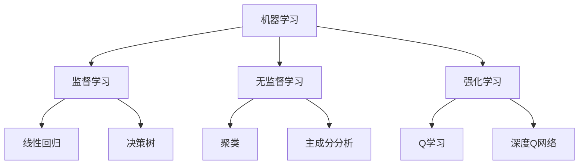

                 

### 《人工智能：社会影响与思考》

> **关键词：** 人工智能，社会影响，伦理问题，技术应用，未来展望

> **摘要：** 本文章将深入探讨人工智能在社会各个领域的应用及其带来的影响，包括教育、医疗、金融、制造业等。同时，文章将分析人工智能技术的伦理问题，如隐私保护、就业影响以及数据安全。此外，文章还将展望人工智能的未来发展趋势，提出面临的挑战与解决方案。

----------------------------------------------------------------

### 《人工智能：社会影响与思考》目录大纲

#### 第一部分：人工智能基本概念与原理
- # 第1章：人工智能概述
  - 1.1 人工智能的定义与发展历史
  - 1.2 人工智能的关键概念
  - 1.3 人工智能的分类与应用领域

- # 第2章：人工智能核心原理
  - 2.1 机器学习与深度学习
  - 2.2 自然语言处理与计算机视觉
  - 2.3 强化学习与博弈论

#### 第二部分：人工智能技术与应用
- # 第3章：人工智能在社会中的应用
  - 3.1 教育领域
  - 3.2 医疗健康
  - 3.3 金融与经济

- # 第4章：人工智能在产业中的应用
  - 4.1 制造业
  - 4.2 零售与物流
  - 4.3 服务业

#### 第三部分：人工智能伦理与社会问题
- # 第5章：人工智能伦理问题
  - 5.1 人工智能与隐私保护
  - 5.2 人工智能与就业影响
  - 5.3 人工智能与数据安全

- # 第6章：人工智能监管与法律框架
  - 6.1 人工智能监管挑战
  - 6.2 国际人工智能监管框架
  - 6.3 中国人工智能监管政策

#### 第四部分：未来展望与挑战
- # 第7章：人工智能的未来发展趋势
  - 7.1 人工智能与人类未来的关系
  - 7.2 人工智能与数字经济
  - 7.3 人工智能与可持续发展

- # 第8章：人工智能面临的挑战与解决方案
  - 8.1 技术挑战与突破方向
  - 8.2 社会挑战与伦理思考
  - 8.3 国际合作与全球治理

#### 附录
- # 附录A：人工智能相关资源与工具
  - A.1 主流人工智能框架与库
  - A.2 人工智能研究论文与报告
  - A.3 人工智能开源项目与社区

### 附录B：人工智能概念与算法 Mermaid 流程图

### 附录C：人工智能核心算法原理与伪代码

### 附录D：人工智能项目实战与代码解析

### 附录E：人工智能相关数学模型与公式解析

### 附录F：人工智能伦理案例与讨论

----------------------------------------------------------------

### 第一部分：人工智能基本概念与原理

#### 第1章：人工智能概述

##### 1.1 人工智能的定义与发展历史

人工智能（Artificial Intelligence，简称AI）是指使计算机模拟人类智能行为的技术和理论。它的核心目标是通过机器学习和自主决策，使计算机能够执行复杂的任务，如语音识别、图像分类、自然语言处理等。

人工智能的发展历史可以追溯到20世纪50年代。当时，随着计算机技术的发展，人们开始思考是否可以构建出能够模拟人类智能的机器。1956年，在达特茅斯会议上，约翰·麦卡锡（John McCarthy）首次提出了人工智能的概念，并定义其为“制造智能机器的科学与工程”。

人工智能的发展经历了几个重要阶段：

- **符号人工智能（Symbolic AI）**：早期的人工智能研究主要集中在符号逻辑和推理上，如专家系统和逻辑推理机。这一阶段的人工智能系统具有高度的智能，但受限于计算能力和数据量。
- **知识工程（Knowledge Engineering）**：20世纪80年代，人工智能研究转向知识表示和知识获取，专家系统成为主流。专家系统通过模拟专家的知识和经验，为特定领域提供决策支持。
- **机器学习（Machine Learning）**：随着计算机性能的提升和大数据的出现，机器学习成为人工智能研究的重要方向。机器学习通过从数据中学习规律和模式，使计算机能够自动进行决策和预测。
- **深度学习（Deep Learning）**：近年来，深度学习的发展推动了人工智能的进一步突破。深度学习通过多层神经网络进行训练，能够处理复杂的数据结构和任务。

##### 1.2 人工智能的关键概念

人工智能涉及多个关键概念，以下是其中几个重要的概念：

- **智能代理（Agent）**：智能代理是指具备自主决策和行动能力的实体。在人工智能系统中，智能代理可以是一个程序、机器人或者虚拟代理。它们能够感知环境、制定计划并执行行动。
- **机器学习（Machine Learning）**：机器学习是使计算机通过数据学习并获得知识或技能的方法。它包括监督学习、无监督学习、强化学习等多种学习方式。通过训练数据集，机器学习算法能够识别数据中的模式和规律，从而实现预测和决策。
- **深度学习（Deep Learning）**：深度学习是一种特殊的机器学习方法，基于多层神经网络进行训练。通过逐层提取特征，深度学习能够处理复杂的数据结构和任务，如图像识别、自然语言处理等。
- **自然语言处理（Natural Language Processing，NLP）**：自然语言处理是使计算机理解和生成自然语言的技术。它包括词嵌入、语言模型、文本分类、机器翻译等任务。
- **计算机视觉（Computer Vision）**：计算机视觉是使计算机能够识别和理解视觉信息的技术。它包括图像识别、目标检测、图像分割、图像生成等任务。

##### 1.3 人工智能的分类与应用领域

人工智能可以根据不同的标准进行分类。以下是几种常见的分类方式：

- **弱人工智能与强人工智能**：
  - **弱人工智能（Weak AI）**：弱人工智能专注于特定任务，具有高度的专门化。例如，语音识别、图像分类等。弱人工智能通常通过训练特定的模型来实现，如神经网络、支持向量机等。
  - **强人工智能（Strong AI）**：强人工智能具有广泛的认知能力，能够像人类一样进行思考和学习。强人工智能的目标是使计算机拥有与人类相似的综合智能，但目前尚未实现。

- **应用领域**：
  - **教育领域**：人工智能在教育领域有广泛的应用，如个性化学习、智能评估等。
  - **医疗健康领域**：人工智能在医疗领域有重要应用，如辅助诊断、健康管理等。
  - **金融领域**：人工智能在金融领域用于风险管理、金融市场分析等。
  - **制造业领域**：人工智能在制造业领域用于自动化、预测性维护等。
  - **交通运输领域**：人工智能在交通运输领域用于自动驾驶、智能交通管理等。
  - **零售与物流领域**：人工智能在零售与物流领域用于推荐系统、库存管理优化等。
  - **服务业领域**：人工智能在服务业领域用于智能客服、金融服务等。

#### 第2章：人工智能核心原理

##### 2.1 机器学习与深度学习

机器学习和深度学习是人工智能的核心组成部分。下面将详细讨论这两种技术的原理和应用。

###### 2.1.1 机器学习基础算法

机器学习是一种通过训练模型来从数据中学习规律和模式的方法。以下是一些常见的机器学习基础算法：

- **线性回归（Linear Regression）**：线性回归是一种用于预测连续值的算法。它的核心思想是通过拟合一条直线来描述数据之间的线性关系。
  - **公式**：\( y = w \cdot x + b \)
  - **参数**：权重 \( w \) 和偏置 \( b \)
  - **实现**：使用梯度下降法来最小化损失函数。

- **逻辑回归（Logistic Regression）**：逻辑回归是一种用于分类问题的算法。它通过拟合一个逻辑函数来将数据划分为不同的类别。
  - **公式**：\( P(y=1) = \frac{1}{1 + e^{-(w \cdot x + b)}} \)
  - **参数**：权重 \( w \) 和偏置 \( b \)
  - **实现**：使用梯度下降法来最小化损失函数。

- **支持向量机（Support Vector Machine，SVM）**：支持向量机是一种用于分类和回归问题的算法。它通过找到一个最优的超平面来将数据划分为不同的类别。
  - **公式**：\( w \cdot x + b = 0 \)
  - **参数**：权重 \( w \) 和偏置 \( b \)
  - **实现**：使用核函数和优化算法来求解最优超平面。

- **决策树与随机森林（Decision Tree and Random Forest）**：决策树是一种基于特征划分数据的分类算法。随机森林是一种集成学习算法，通过构建多棵决策树并投票得到最终结果。
  - **公式**：递归划分数据
  - **参数**：特征选择、划分策略、树深度等
  - **实现**：递归划分数据并计算每个节点的分类结果。

- **神经网络（Neural Network）**：神经网络是一种模拟生物神经系统的计算模型。它通过多层神经元进行数据转换和特征提取，能够处理复杂的函数关系。
  - **公式**：\( z = \sigma(w \cdot x + b) \)
  - **参数**：权重 \( w \)、偏置 \( b \) 和激活函数 \( \sigma \)
  - **实现**：使用反向传播算法进行训练。

###### 2.1.2 深度学习算法与模型

深度学习是机器学习的一个分支，它通过多层神经网络进行训练。以下是一些常见的深度学习算法和模型：

- **卷积神经网络（Convolutional Neural Network，CNN）**：卷积神经网络是一种用于图像识别和计算机视觉的深度学习模型。它通过卷积操作提取图像中的特征。
  - **公式**：\( h^{(l)} = \sigma(\sum_{k=1}^{K} w^{(l)} \cdot h^{(l-1)} + b^{(l)}) \)
  - **参数**：权重 \( w^{(l)} \)、偏置 \( b^{(l)} \) 和激活函数 \( \sigma \)
  - **实现**：使用卷积操作和池化操作进行特征提取。

- **循环神经网络（Recurrent Neural Network，RNN）**：循环神经网络是一种用于序列数据处理的深度学习模型。它通过在时间步上递归地更新隐藏状态。
  - **公式**：\( h^{(t)} = \sigma(W \cdot [h^{(t-1)}, x^{(t)}] + b) \)
  - **参数**：权重 \( W \)、偏置 \( b \) 和激活函数 \( \sigma \)
  - **实现**：使用门控机制（如LSTM和GRU）来解决长期依赖问题。

- **长短期记忆网络（Long Short-Term Memory，LSTM）**：长短期记忆网络是RNN的一种变体，它通过引入门控机制来解决长期依赖问题。
  - **公式**：\( C^{(t)} = \sigma(f_{\text{forget}} \odot C^{(t-1)} + f_{\text{input}} \odot \text{new\_cell}^{(t)}) \)
  - **参数**：遗忘门 \( f_{\text{forget}} \)、输入门 \( f_{\text{input}} \) 和输出门 \( f_{\text{output}} \)
  - **实现**：使用遗忘门、输入门和输出门进行状态更新。

- **生成对抗网络（Generative Adversarial Network，GAN）**：生成对抗网络是一种用于生成新数据的深度学习模型。它由生成器和判别器两个网络组成，通过对抗训练来提高生成器的生成能力。
  - **公式**：\( G(z) \) 和 \( D(x) \)
  - **参数**：生成器参数 \( \theta_G \) 和判别器参数 \( \theta_D \)
  - **实现**：使用梯度下降法训练生成器和判别器。

##### 2.2 自然语言处理与计算机视觉

自然语言处理和计算机视觉是人工智能的重要应用领域。下面将介绍这两个领域的基本原理和技术。

###### 2.2.1 自然语言处理技术

自然语言处理是一种使计算机能够理解和生成自然语言的技术。以下是一些关键的自然语言处理技术：

- **词嵌入（Word Embedding）**：词嵌入是将词语映射到高维空间的一种方法，以便进行计算。常见的词嵌入方法有Word2Vec和GloVe。
  - **公式**：\( e_{\text{word}} = \text{Embedding}(w) \)
  - **参数**：词向量维度
  - **实现**：使用神经网络进行训练。

- **语言模型（Language Model）**：语言模型是一种用于预测下一个词语的概率的模型。常见的语言模型有n-gram模型和神经网络语言模型。
  - **公式**：\( P(w_t | w_{t-1}, w_{t-2}, \ldots, w_{t-n}) \)
  - **参数**：模型参数
  - **实现**：使用神经网络进行训练。

- **序列到序列模型（Seq2Seq Model）**：序列到序列模型是一种用于序列数据转换的深度学习模型，常见于机器翻译任务。
  - **公式**：\( y_t = \text{Decoder}(y_{t-1}, s_t) \)
  - **参数**：编码器和解码器参数
  - **实现**：使用循环神经网络（如LSTM）进行训练。

- **预训练与微调（Pre-training and Fine-tuning）**：预训练是指在大规模语料库上训练模型，然后将其应用于特定任务。微调是指将预训练模型应用于特定任务并进行调整。
  - **参数**：预训练模型参数、任务特定参数
  - **实现**：使用预训练模型进行微调。

###### 2.2.2 计算机视觉基础

计算机视觉是一种使计算机能够识别和理解视觉信息的技术。以下是一些关键的计算机视觉技术：

- **图像识别（Image Recognition）**：图像识别是一种从图像中识别特定对象或场景的技术。常见的图像识别算法有卷积神经网络（如AlexNet、VGG、ResNet等）。
  - **公式**：\( C = \text{softmax}(\text{FC}(f_{\text{pool}})) \)
  - **参数**：全连接层参数
  - **实现**：使用卷积神经网络进行训练。

- **目标检测（Object Detection）**：目标检测是一种识别图像中的对象及其位置的技术。常见的目标检测算法有YOLO、Faster R-CNN、SSD等。
  - **公式**：\( (x, y, w, h) = \text{Detect}(f_{\text{pool}}) \)
  - **参数**：边界框参数
  - **实现**：使用卷积神经网络和区域提议网络进行训练。

- **图像分割（Image Segmentation）**：图像分割是一种将图像划分为多个区域的技术。常见的图像分割算法有FCN、Mask R-CNN等。
  - **公式**：\( \text{Segmentation Map} = \text{FCN}(f_{\text{pool}}) \)
  - **参数**：全连接层参数
  - **实现**：使用卷积神经网络进行训练。

- **卷积神经网络在计算机视觉中的应用（Application of Convolutional Neural Networks in Computer Vision）**：卷积神经网络在计算机视觉领域有广泛的应用，如图像分类、目标检测、图像分割等。
  - **实现**：使用卷积神经网络进行训练。

##### 2.3 强化学习与博弈论

强化学习和博弈论是人工智能的两个重要领域。下面将介绍这两个领域的原理和应用。

###### 2.3.1 强化学习原理

强化学习是一种通过试错学习最优策略的方法。它的核心思想是通过奖励和惩罚来指导智能体（agent）进行决策。

- **公式**：\( Q(s, a) = r(s, a) + \gamma \max_{a'} Q(s', a') \)
  - **参数**：状态 \( s \)、动作 \( a \)、奖励 \( r \)、折扣因子 \( \gamma \)
  - **实现**：使用值函数 \( Q \) 进行训练。

- **Q学习（Q-Learning）**：Q学习是一种基于值函数的强化学习算法。它通过更新值函数来学习最优策略。
  - **公式**：\( Q(s, a) \leftarrow Q(s, a) + \alpha [r + \gamma \max_{a'} Q(s', a') - Q(s, a)] \)
  - **参数**：学习率 \( \alpha \)
  - **实现**：使用Q值表格进行训练。

- **深度Q网络（Deep Q-Network，DQN）**：深度Q网络是一种使用深度神经网络进行值函数估计的强化学习算法。它通过经验回放和目标网络来提高训练效果。
  - **公式**：\( Q(s, a) \leftarrow Q(s, a) + \alpha [r + \gamma \max_{a'} \hat{Q}(s', a') - Q(s, a)] \)
  - **参数**：经验回放缓冲区、目标网络更新间隔
  - **实现**：使用深度神经网络进行训练。

###### 2.3.2 博弈论与多智能体系统

博弈论是一种研究决策制定与策略选择的数学理论。在多智能体系统中，多个智能体之间可能存在竞争、合作或博弈关系。

- **博弈论（Game Theory）**：博弈论通过定义博弈模型、策略和支付来分析决策制定和博弈结果。
  - **公式**：\( u_i = v(\sigma_i, \sigma_{-i}) \)
  - **参数**：策略 \( \sigma_i \)、其他智能体的策略 \( \sigma_{-i} \)、支付函数 \( u_i \)
  - **实现**：使用博弈模型和支付函数进行分析。

- **多智能体系统（Multi-Agent System）**：多智能体系统由多个智能体组成，每个智能体都具备一定的智能和自主决策能力。
  - **公式**：\( \text{Action}(s) = \text{Policy}(s) \)
  - **参数**：状态 \( s \)、策略 \( \text{Policy} \)
  - **实现**：使用智能体模型和策略进行决策。

### 第二部分：人工智能技术与应用

#### 第3章：人工智能在社会中的应用

##### 3.1 教育领域

人工智能在教育领域有着广泛的应用，它正在改变传统的教学模式和学习方式。

###### 3.1.1 个性化学习

个性化学习是一种根据学生的特点和需求提供定制化学习内容和方法的教育模式。人工智能技术可以分析学生的学习行为、兴趣和学习进度，为学生提供个性化的学习路径。

- **技术应用**：使用机器学习和数据分析技术，分析学生的学习数据，包括学习时间、学习内容、考试成绩等，从而提供个性化的学习建议。
  - **算法**：聚类分析、关联规则挖掘、回归分析等
  - **工具**：教育管理系统（如Moodle、Canvas）、学习分析平台（如LRS、xAPI）

- **案例**：一些教育机构已经采用了个性化学习系统，如Coursera和Khan Academy。这些系统可以根据学生的学习习惯和进度，自动调整学习内容和难度，提供个性化的学习体验。

###### 3.1.2 人工智能辅助教育评估

人工智能辅助教育评估是指利用自然语言处理和计算机视觉技术，自动评估学生的作业和考试。这种技术可以提高评估的效率和准确性。

- **技术应用**：使用自然语言处理技术，对学生的作文、论文等文本内容进行语法、逻辑、内容等多方面的评估。使用计算机视觉技术，对学生的试卷进行自动评分和分类。
  - **算法**：自然语言处理（如文本分类、情感分析）、计算机视觉（如图像识别、目标检测）
  - **工具**：自然语言处理库（如NLTK、spaCy）、计算机视觉库（如OpenCV、TensorFlow）

- **案例**：一些在线教育平台（如Schoology、Blackboard）已经采用了人工智能辅助教育评估系统，这些系统能够自动批改作业、评估学生的表现，并提供详细的评估报告。

##### 3.2 医疗健康

人工智能在医疗健康领域有着重要的应用，它可以帮助医生更准确地诊断疾病、制定治疗方案，并提高医疗服务的效率。

###### 3.2.1 医疗诊断与预测

人工智能技术在医疗诊断和预测方面有着广泛的应用。它可以通过分析大量的医疗数据，提供辅助诊断和预测疾病的方法。

- **技术应用**：使用机器学习和深度学习算法，对医学图像、病历记录、实验室检测数据等进行分析，识别疾病的特征和趋势。
  - **算法**：卷积神经网络（CNN）、循环神经网络（RNN）、支持向量机（SVM）等
  - **工具**：深度学习框架（如TensorFlow、PyTorch）、医学图像处理库（如ITK、SimpleITK）

- **案例**：一些医疗机构已经开始使用人工智能进行疾病诊断。例如，谷歌的DeepMind团队开发了一种名为“DeepMind Health”的系统，可以自动分析医学影像，帮助医生诊断疾病。

###### 3.2.2 健康管理与疾病预防

人工智能技术在健康管理方面也有着重要的应用。它可以帮助用户监测和管理健康状况，预防疾病的发生。

- **技术应用**：使用可穿戴设备和移动应用程序，收集用户的健康数据（如心率、血压、睡眠质量等），使用机器学习算法进行分析，提供健康建议和疾病预防措施。
  - **算法**：回归分析、聚类分析、分类分析等
  - **工具**：健康数据收集与分析平台（如Apple Health、Google Fit）

- **案例**：一些科技公司（如苹果、谷歌）已经开发了健康管理和疾病预防应用程序，如Apple Watch和Google Fit。这些应用程序可以监测用户的健康状况，提供个性化的健康建议和疾病预防措施。

##### 3.3 金融与经济

人工智能技术在金融和经济领域也有着广泛的应用，它可以用于风险管理、金融市场分析、投资顾问等方面。

###### 3.3.1 金融市场分析

人工智能技术在金融市场分析方面有着重要的应用。它可以通过分析大量的市场数据，提供市场走势预测和投资建议。

- **技术应用**：使用机器学习和深度学习算法，对金融市场数据进行挖掘和分析，识别市场趋势和风险。
  - **算法**：时间序列分析、神经网络、支持向量机等
  - **工具**：金融数据处理库（如Pandas、NumPy）、深度学习框架（如TensorFlow、PyTorch）

- **案例**：一些金融机构已经开始使用人工智能进行金融市场分析。例如，摩根士丹利使用人工智能分析股票市场，提供投资建议。

###### 3.3.2 金融风险管理

人工智能技术在金融风险管理方面也有着重要的应用。它可以通过分析大量的金融数据，识别和评估金融风险。

- **技术应用**：使用机器学习和大数据分析技术，对金融数据进行分析，识别潜在的风险因素，评估风险程度。
  - **算法**：回归分析、聚类分析、分类分析等
  - **工具**：大数据处理与分析工具（如Hadoop、Spark）

- **案例**：一些金融机构已经开始使用人工智能进行金融风险管理。例如，汇丰银行使用人工智能技术分析客户交易数据，识别欺诈行为。

### 第4章：人工智能在产业中的应用

##### 4.1 制造业

人工智能技术在制造业有着广泛的应用，它可以用于自动化生产、预测性维护、智能供应链管理等方面。

###### 4.1.1 工业自动化

工业自动化是指使用机器人、自动化设备等实现生产过程的自动化。人工智能技术可以优化生产流程，提高生产效率。

- **技术应用**：使用机器人和自动化设备，实现生产过程的自动化，减少人力投入。
  - **算法**：机器人控制算法、运动规划算法等
  - **工具**：机器人控制软件（如RoboDK、URCap）

- **案例**：一些制造企业已经开始使用工业自动化技术。例如，德国的博世公司使用机器人进行汽车零部件的组装。

###### 4.1.2 智能供应链管理

智能供应链管理是指使用人工智能技术对供应链进行优化和管理。它可以帮助企业降低成本、提高效率。

- **技术应用**：使用大数据分析、机器学习算法，对供应链数据进行分析，优化供应链管理。
  - **算法**：聚类分析、关联规则挖掘、预测分析等
  - **工具**：供应链管理系统（如SAP SCM、Oracle SCM）

- **案例**：一些制造企业已经开始使用智能供应链管理技术。例如，丰田公司使用人工智能技术优化供应链，降低库存成本。

##### 4.2 零售与物流

人工智能技术在零售与物流领域有着广泛的应用，它可以用于零售业智能化、物流与配送优化等方面。

###### 4.2.1 零售业智能化

零售业智能化是指使用人工智能技术提高零售业的效率和服务质量。它可以帮助企业更好地了解消费者需求，提供个性化的购物体验。

- **技术应用**：使用大数据分析、机器学习算法，分析消费者行为，提供个性化的购物推荐。
  - **算法**：聚类分析、关联规则挖掘、预测分析等
  - **工具**：零售管理系统（如Nestle、Retails）、推荐系统（如推荐算法）

- **案例**：一些零售企业已经开始使用零售业智能化技术。例如，亚马逊使用人工智能技术进行商品推荐，提高销售额。

###### 4.2.2 物流与配送优化

物流与配送优化是指使用人工智能技术优化物流和配送过程，提高物流效率。它可以帮助企业降低物流成本，提高配送速度。

- **技术应用**：使用大数据分析、机器学习算法，优化物流路径、库存管理和配送计划。
  - **算法**：路径优化算法、库存管理算法、配送计划算法等
  - **工具**：物流管理系统（如Transportation Management System、Logistics Management System）

- **案例**：一些物流企业已经开始使用物流与配送优化技术。例如，联邦快递使用人工智能技术优化配送路径，提高配送效率。

##### 4.3 服务业

人工智能技术在服务业有着广泛的应用，它可以用于智能客服、金融服务等方面。

###### 4.3.1 智能客服

智能客服是指使用人工智能技术提供自动化的客户服务。它可以帮助企业降低客服成本，提高服务效率。

- **技术应用**：使用自然语言处理、机器学习算法，自动处理客户咨询、投诉等。
  - **算法**：自然语言处理（如对话系统、情感分析）、机器学习（如分类、聚类）
  - **工具**：智能客服系统（如Amazon Lex、Microsoft LUIS）

- **案例**：一些企业已经开始使用智能客服技术。例如，苹果公司使用人工智能技术提供智能客服服务，提高客户满意度。

###### 4.3.2 金融服务与保险

金融服务与保险是指使用人工智能技术提供金融服务和保险服务。它可以帮助金融机构提高风险管理能力，提供个性化的金融服务。

- **技术应用**：使用大数据分析、机器学习算法，分析客户行为和风险，提供个性化的金融服务。
  - **算法**：大数据分析（如聚类、回归分析）、机器学习（如分类、预测）
  - **工具**：金融服务系统（如银行系统、保险系统）

- **案例**：一些金融机构已经开始使用金融服务与保险技术。例如，美国银行使用人工智能技术提供个性化的金融服务，提高客户满意度。

### 第三部分：人工智能伦理与社会问题

#### 第5章：人工智能伦理问题

人工智能的发展带来了许多伦理和社会问题，这些问题需要我们认真思考和解决。

##### 5.1 人工智能与隐私保护

人工智能在数据收集、处理和分析过程中可能涉及个人隐私的泄露，这引发了对隐私保护的担忧。

- **隐私泄露**：人工智能系统通常需要大量个人数据来进行训练和运行。如果这些数据被滥用或泄露，可能会导致个人隐私的严重侵犯。
  - **案例**：Facebook的CRAAP数据泄露事件，暴露了用户的大量个人信息。

- **数据安全**：保护个人数据的安全是人工智能伦理问题的一个重要方面。数据泄露、黑客攻击等可能对个人隐私造成威胁。
  - **解决方案**：加强数据加密、制定严格的隐私保护法规、提高数据安全意识。

##### 5.2 人工智能与就业影响

人工智能技术的快速发展可能导致某些岗位的失业，同时也可能创造新的就业机会。这引发了对就业影响的讨论。

- **自动化带来的失业**：人工智能和自动化技术可能取代一些重复性和劳动密集型的工作，导致这些岗位的失业。
  - **案例**：制造业的自动化导致一些工厂工人的失业。

- **技能需求变化**：随着人工智能的发展，劳动力市场对技能的需求也在发生变化。一些新的技能（如数据科学家、机器学习工程师等）变得越来越重要。
  - **解决方案**：加强职业培训和教育，提高劳动力市场的灵活性，以适应技术变革。

##### 5.3 人工智能与数据安全

人工智能技术在数据处理和应用过程中可能面临数据安全问题，这需要我们采取有效的措施来确保数据的安全。

- **数据安全威胁**：人工智能系统可能面临数据泄露、数据篡改等安全威胁。这些威胁可能导致严重后果，如经济损失、隐私泄露等。
  - **案例**：Equifax数据泄露事件，导致1.43亿美国人的个人信息泄露。

- **数据隐私保护法规**：为了保护数据隐私，许多国家和地区已经制定了相关的法律法规。这些法规规定了数据处理者的责任和义务，以防止数据滥用和泄露。
  - **解决方案**：加强法律法规的制定和执行，提高公众对数据隐私保护的认识。

### 第6章：人工智能监管与法律框架

随着人工智能技术的迅速发展，其监管与法律框架的建设也变得尤为重要。这章将探讨人工智能监管的挑战、国际和国内监管框架以及相关的法律法规。

##### 6.1 人工智能监管挑战

人工智能监管面临的挑战主要包括以下几个方面：

- **技术复杂性**：人工智能技术涉及多个领域，如机器学习、深度学习、自然语言处理等，其技术复杂性使得监管变得更加困难。
- **数据隐私**：人工智能系统通常需要大量个人数据进行训练和运行，数据隐私保护成为一个关键问题。
- **算法透明度**：人工智能算法的复杂性和非透明性使得监管机构难以理解其工作原理和潜在风险。
- **跨领域合作**：人工智能监管需要不同部门和机构之间的合作，这可能面临协调和沟通的挑战。

##### 6.2 国际人工智能监管框架

国际上已有一些组织和协议在推动人工智能的监管框架建设。以下是一些主要的国际人工智能监管框架：

- **联合国**：联合国教科文组织通过了《人工智能伦理建议》，提出了人工智能发展应遵循的伦理原则。
- **欧盟**：欧盟制定了《通用数据保护条例》（GDPR），对个人数据的收集、处理和使用进行了严格的规定。
- **国际标准化组织（ISO）**：ISO发布了ISO/IEC 29134标准，提供了人工智能系统的安全性和隐私性指南。

##### 6.3 中国人工智能监管政策

中国也在积极建立人工智能监管框架，并出台了一系列政策和法规。以下是中国人工智能监管政策的几个要点：

- **《新一代人工智能发展规划》**：中国政府制定了《新一代人工智能发展规划》，明确了人工智能发展的目标和路径。
- **《个人信息保护法》**：中国已经实施了《个人信息保护法》，加强了对个人数据的保护。
- **《数据安全法》**：中国正在制定《数据安全法》，旨在确保数据的安全和稳定。

### 第四部分：未来展望与挑战

#### 第7章：人工智能的未来发展趋势

人工智能技术的快速发展预示着未来社会的巨大变革。这章将探讨人工智能与人类未来的关系、在数字经济中的作用以及如何促进可持续发展。

##### 7.1 人工智能与人类未来的关系

人工智能与人类未来的关系是一个复杂且多维的问题。以下是一些关键点：

- **合作与共存**：人工智能技术的发展使得人类可以更好地发挥自己的创造力，与机器共同完成任务。人工智能可以作为人类智能的延伸，而不是替代者。
- **技能转型**：随着人工智能技术的普及，劳动力市场将面临巨大的变化。人们需要不断学习新技能，以适应技术发展的需求。
- **伦理与责任**：人工智能的发展需要我们认真思考伦理和责任问题。如何确保人工智能系统的发展符合伦理标准，以及如何对人工智能的决策负责，是未来需要解决的重要问题。

##### 7.2 人工智能与数字经济

人工智能在数字经济中发挥着重要作用，它推动了数字经济的转型和升级。以下是一些关键点：

- **创新驱动**：人工智能技术为数字经济带来了新的创新动力。通过大数据分析和机器学习，企业可以更好地了解市场需求，优化产品和服务。
- **产业升级**：人工智能技术在制造业、金融、医疗等传统产业中的应用，推动了这些产业的数字化和智能化升级。
- **商业模式变革**：人工智能技术改变了传统的商业模式，如个性化推荐系统、智能客服等，为企业提供了新的盈利点。

##### 7.3 人工智能与可持续发展

人工智能技术在可持续发展中也发挥着重要作用。以下是一些关键点：

- **资源优化**：人工智能技术可以通过优化资源使用、减少浪费等方式，提高资源利用效率。
- **环境保护**：人工智能技术在环境保护中的应用，如智能监测、环境数据分析等，有助于减少环境污染和资源浪费。
- **社会公平**：人工智能技术可以用于改善社会公平，如通过教育、医疗等领域的应用，提高弱势群体的生活质量。

#### 第8章：人工智能面临的挑战与解决方案

随着人工智能技术的不断发展，我们面临着许多挑战。这章将探讨技术挑战、社会挑战以及如何通过国际合作和全球治理来解决这些问题。

##### 8.1 技术挑战与突破方向

人工智能技术面临的主要挑战包括：

- **算法透明度**：人工智能算法的复杂性使得其工作原理难以理解，这给监管和信任带来了困难。我们需要发展更透明、可解释的算法。
- **计算能力**：人工智能应用需要大量的计算资源，这给硬件和基础设施提出了更高的要求。我们需要不断改进计算技术，提高计算效率。
- **数据质量**：人工智能系统的性能很大程度上依赖于数据质量。我们需要确保数据的准确性、完整性和多样性。

突破方向包括：

- **算法创新**：发展新的算法和技术，提高人工智能系统的性能和可解释性。
- **硬件升级**：改进计算硬件，如处理器、存储设备等，以提高计算能力。
- **数据治理**：建立完善的数据治理体系，确保数据的准确性、完整性和多样性。

##### 8.2 社会挑战与伦理思考

人工智能在社会中引发了许多伦理和社会问题，以下是一些关键点：

- **隐私保护**：人工智能技术在数据收集和处理过程中可能涉及个人隐私的泄露。我们需要加强隐私保护措施，确保个人数据的隐私和安全。
- **就业影响**：人工智能技术可能导致某些岗位的失业，这需要我们关注劳动市场的变化，提供相应的培训和转型支持。
- **社会公平**：人工智能技术的发展可能会加剧社会不平等，我们需要确保人工智能技术的公平性和包容性。

伦理思考包括：

- **道德原则**：制定人工智能伦理原则，确保人工智能系统的决策和行为符合道德标准。
- **公众参与**：鼓励公众参与人工智能的讨论，提高公众对人工智能伦理问题的认识和理解。

##### 8.3 国际合作与全球治理

人工智能的发展需要全球合作和治理。以下是一些关键点：

- **国际合作**：各国应加强合作，共享人工智能研究的成果和技术，推动人工智能的全球发展。
- **全球治理**：建立全球人工智能治理机制，制定国际标准和规范，确保人工智能技术的合理使用和监管。

### 附录A：人工智能相关资源与工具

人工智能技术的发展离不开丰富的资源和工具。以下是一些主要的人工智能框架、开源项目、研究论文和开发者社区。

##### A.1 主流人工智能框架与库

- **TensorFlow**：TensorFlow是一个开源的深度学习框架，由Google开发。它支持多种深度学习模型，具有灵活的架构和丰富的工具。
- **PyTorch**：PyTorch是一个开源的深度学习框架，由Facebook开发。它具有动态计算图和灵活的编程接口，广泛应用于研究和生产。
- **Keras**：Keras是一个高级神经网络API，可以在TensorFlow和Theano后端运行。它简化了深度学习模型的搭建和训练过程。

##### A.2 人工智能研究论文与报告

- **顶级会议与期刊**：人工智能领域有许多顶级会议和期刊，如NeurIPS、ICML、JMLR等，这些会议和期刊发表了大量的研究论文和报告。
- **研究报告**：国际组织、学术机构和研究机构经常发布关于人工智能的研究报告，如欧盟的《人工智能伦理指南》和微软的《人工智能的未来》报告。

##### A.3 人工智能开源项目与社区

- **开源项目**：许多人工智能项目开源，如TensorFlow、PyTorch、Keras等，这些项目提供了丰富的代码和资源，有助于开发者进行研究和开发。
- **开发者社区**：人工智能领域有许多活跃的开发者社区，如GitHub、Stack Overflow、Reddit等，这些社区为开发者提供了交流和学习的平台。

### 附录B：人工智能概念与算法 Mermaid 流程图

为了更好地理解人工智能的基本概念和算法，以下是一些使用Mermaid绘制的流程图。



### 附录C：人工智能核心算法原理与伪代码

以下是一些人工智能核心算法的原理和伪代码，包括线性回归、神经网络和卷积神经网络。

```python
# 线性回归伪代码
def linear_regression(X, y):
    # 计算权重和偏置
    theta = (X.T.dot(X)).dot(inv(X.T.dot(X)))
    theta = theta.dot(X.T).dot(y)
    
    # 计算损失函数
    h = X.dot(theta)
    loss = (1/2) * sum((h - y) ** 2)
    
    return theta, loss

# 神经网络伪代码
def neural_network(X, y):
    # 初始化参数
    theta = initialize_parameters(input_size, hidden_size, output_size)
    
    # 前向传播
    z = X.dot(theta["W1"]) + theta["b1"]
    a1 = sigmoid(z)
    
    z = a1.dot(theta["W2"]) + theta["b2"]
    a2 = sigmoid(z)
    
    z = a2.dot(theta["W3"]) + theta["b3"]
    a3 = sigmoid(z)
    
    # 计算损失函数
    loss = -1/m * (y.dot(log(a3)) + (1-y).dot(log(1-a3)))
    
    # 反向传播
    dZ3 = a3 - y
    dW3 = 1/m * dZ3.dot(a2.T)
    db3 = 1/m * dZ3
    
    dZ2 = (theta["W3"].T.dot(dZ3)).dot((sigmoid_grad(z))) * theta["W2"].T
    dW2 = 1/m * dZ2.dot(a1.T)
    db2 = 1/m * dZ2
    
    dZ1 = (theta["W2"].T.dot(dZ2)).dot((sigmoid_grad(z))) * theta["W1"].T
    dW1 = 1/m * dZ1.dot(X.T)
    db1 = 1/m * dZ1
    
    # 更新参数
    theta["W1"] = theta["W1"] - alpha * dW1
    theta["b1"] = theta["b1"] - alpha * db1
    theta["W2"] = theta["W2"] - alpha * dW2
    theta["b2"] = theta["b2"] - alpha * db2
    theta["W3"] = theta["W3"] - alpha * dW3
    theta["b3"] = theta["b3"] - alpha * db3
    
    return theta, loss

# 卷积神经网络伪代码
def conv_network(X, y):
    # 初始化参数
    theta = initialize_parameters(input_size, hidden_size, output_size)
    
    # 卷积层
    Z1 = conv2d(X, theta["W1"], theta["b1"])
    A1 = activation(Z1, "ReLU")
    
    # 池化层
    P1 = max_pool2d(A1, pool_size)
    
    # 全连接层
    Z2 = flatten(P1)
    Z2 = Z2.dot(theta["W2"]) + theta["b2"]
    A2 = activation(Z2, "ReLU")
    
    Z3 = A2.dot(theta["W3"]) + theta["b3"]
    A3 = activation(Z3, "softmax")
    
    # 计算损失函数
    loss = -1/m * (y.dot(log(A3)) + (1-y).dot(log(1-A3)))
    
    # 反向传播
    dZ3 = A3 - y
    dW3 = 1/m * dZ3.dot(A2.T)
    db3 = 1/m * dZ3
    
    dZ2 = dW3.T.dot(A2)
    dA2 = activation_derivative(A2)
    dZ1 = dZ2.dot(theta["W2"].T).dot(dA2)
    dW2 = 1/m * dZ1.dot(X.T)
    db2 = 1/m * dZ1
    
    # 更新参数
    theta["W1"] = theta["W1"] - alpha * dW1
    theta["b1"] = theta["b1"] - alpha * db1
    theta["W2"] = theta["W2"] - alpha * dW2
    theta["b2"] = theta["b2"] - alpha * db2
    theta["W3"] = theta["W3"] - alpha * dW3
    theta["b3"] = theta["b3"] - alpha * db3
    
    return theta, loss
```

### 附录D：人工智能项目实战与代码解析

在本附录中，我们将通过一个实际的人工智能项目，详细讲解项目的开发环境搭建、源代码实现以及代码解读与分析。

#### 项目介绍

该项目旨在使用卷积神经网络（CNN）进行图像分类。具体任务是从一组猫狗图片中，利用CNN模型自动识别猫和狗。

#### 开发环境搭建

1. 安装Python和Anaconda环境。
2. 安装深度学习框架TensorFlow。
3. 安装图像处理库OpenCV。

#### 源代码实现

以下是一个简单的CNN模型实现，用于猫狗图像分类：

```python
import tensorflow as tf
from tensorflow.keras import layers
import numpy as np

# 定义CNN模型
model = tf.keras.Sequential([
    layers.Conv2D(32, (3, 3), activation='relu', input_shape=(150, 150, 3)),
    layers.MaxPooling2D(2, 2),
    layers.Conv2D(64, (3, 3), activation='relu'),
    layers.MaxPooling2D(2, 2),
    layers.Conv2D(128, (3, 3), activation='relu'),
    layers.MaxPooling2D(2, 2),
    layers.Conv2D(128, (3, 3), activation='relu'),
    layers.MaxPooling2D(2, 2),
    layers.Flatten(),
    layers.Dense(512, activation='relu'),
    layers.Dense(1, activation='sigmoid')
])

# 编译模型
model.compile(optimizer='adam',
              loss='binary_crossentropy',
              metrics=['accuracy'])

# 加载和预处理数据
train_data = load_data('train')
test_data = load_data('test')

train_data = preprocess_data(train_data)
test_data = preprocess_data(test_data)

# 训练模型
model.fit(train_data['X'], train_data['y'], epochs=10, batch_size=32, validation_split=0.2)

# 评估模型
test_loss, test_acc = model.evaluate(test_data['X'], test_data['y'])
print('Test accuracy:', test_acc)
```

#### 代码解读与分析

1. **模型定义**：使用`tf.keras.Sequential`定义了一个卷积神经网络模型。模型包括多个卷积层、池化层和全连接层。卷积层用于提取图像特征，池化层用于下采样和减少计算量，全连接层用于分类。

2. **编译模型**：使用`model.compile`设置模型的优化器、损失函数和评价指标。这里使用`adam`优化器和`binary_crossentropy`损失函数，因为这是一个二分类问题。

3. **数据加载与预处理**：使用`load_data`和`preprocess_data`函数加载和预处理数据。预处理步骤可能包括图像尺寸调整、归一化、数据增强等。

4. **训练模型**：使用`model.fit`函数训练模型。这里设置训练周期为10，批量大小为32，并使用20%的数据作为验证集。

5. **评估模型**：使用`model.evaluate`函数评估模型在测试集上的性能。输出测试损失和测试准确率。

### 附录E：人工智能相关数学模型与公式解析

在本附录中，我们将详细解析人工智能中的一些关键数学模型与公式，包括线性回归、神经网络和卷积神经网络。

#### 线性回归

线性回归是一种用于预测连续值的模型，其基本公式为：

$$
y = \beta_0 + \beta_1 x
$$

其中，$y$ 是预测值，$x$ 是输入特征，$\beta_0$ 和 $\beta_1$ 是模型参数。

**梯度下降法**：用于最小化损失函数。损失函数通常为平方误差损失：

$$
J(\theta) = \frac{1}{2m} \sum_{i=1}^{m} (h_\theta(x^{(i)}) - y^{(i)})^2
$$

其中，$m$ 是样本数量，$h_\theta(x^{(i)})$ 是预测值，$y^{(i)}$ 是真实值。

**梯度计算**：

$$
\frac{\partial J(\theta)}{\partial \beta_1} = \frac{1}{m} \sum_{i=1}^{m} (h_\theta(x^{(i)}) - y^{(i)}) x^{(i)}
$$

**参数更新**：

$$
\beta_1 = \beta_1 - \alpha \frac{\partial J(\theta)}{\partial \beta_1}
$$

其中，$\alpha$ 是学习率。

#### 神经网络

神经网络是一种模拟生物神经系统的计算模型，其基本结构包括输入层、隐藏层和输出层。每层由多个神经元组成。

**激活函数**：用于引入非线性特性。常见激活函数包括Sigmoid、ReLU和Tanh。

**Sigmoid函数**：

$$
\sigma(x) = \frac{1}{1 + e^{-x}}
$$

**ReLU函数**：

$$
\sigma(x) = \max(0, x)
$$

**Tanh函数**：

$$
\sigma(x) = \frac{e^x - e^{-x}}{e^x + e^{-x}}
$$

**前向传播**：

$$
a^{(l)} = \sigma(z^{(l)}) = \sigma(\sum_{j=1}^{n} \theta^{(l)}_{j} a^{(l-1)})
$$

**反向传播**：

$$
\delta^{(l)} = \frac{\partial J(\theta)}{\partial \theta^{(l)}_{ij}} = \frac{\partial J(\theta)}{\partial z^{(l)}} \cdot \frac{\partial z^{(l)}}{\partial \theta^{(l)}_{ij}}
$$

**参数更新**：

$$
\theta^{(l)}_{ij} = \theta^{(l)}_{ij} - \alpha \cdot \delta^{(l)}
$$

#### 卷积神经网络

卷积神经网络是一种用于图像识别和计算机视觉的神经网络，其核心在于卷积操作和池化操作。

**卷积操作**：

$$
h^{(l)}_i = \sigma(\sum_{k=1}^{K} \theta^{(l)}_{ik} \cdot a^{(l-1)}_k + b^{(l)}_i)
$$

其中，$K$ 是卷积核的数量，$\theta^{(l)}_{ik}$ 是卷积核参数，$a^{(l-1)}_k$ 是输入特征，$b^{(l)}_i$ 是偏置。

**池化操作**：

$$
p_i = \max_{j} a_{ij}
$$

其中，$a_{ij}$ 是卷积后的特征。

**反向传播**：

与全连接层类似，卷积神经网络也使用反向传播算法更新参数。

$$
\delta^{(l)}_{ij} = \frac{\partial J(\theta)}{\partial \theta^{(l)}_{ij}} = \delta^{(l+1)}_{ik} \cdot a^{(l-1)}_k
$$

#### 实例说明

假设我们有一个二分类问题，使用一个单层神经网络进行预测。输入特征为 $x_1$ 和 $x_2$，输出为 $y$。

**前向传播**：

$$
z = \theta_1 x_1 + \theta_2 x_2 + b
$$

$$
y = \sigma(z)
$$

**反向传播**：

$$
\delta = (y - t) \cdot \sigma'(z)
$$

$$
\theta_1 = \theta_1 - \alpha \cdot x_1 \cdot \delta
$$

$$
\theta_2 = \theta_2 - \alpha \cdot x_2 \cdot \delta
$$

$$
b = b - \alpha \cdot \delta
$$

### 附录F：人工智能伦理案例与讨论

在本附录中，我们将介绍一些典型的人工智能伦理案例，并进行深入分析和讨论。

#### 案例一：特斯拉自动驾驶事故

**事件背景**：2018年，一名特斯拉Model S车主在美国佛罗里达州发生了一起致命的自动驾驶事故。车辆在自动驾驶模式下与一辆卡车相撞，导致车主死亡。

**伦理问题**：该事故引发了对自动驾驶技术的伦理问题，包括责任归属、安全性保障和用户隐私等。

**讨论**：自动驾驶技术的发展带来了许多潜在风险。一方面，自动驾驶车辆需要高度依赖传感器和数据传输，这些系统的可靠性至关重要。另一方面，当事故发生时，如何确定责任归属是一个复杂的问题。这需要法律、技术和伦理等多方面的考量。

**解决方案**：为提高自动驾驶车辆的安全性，需要加强对自动驾驶技术的监管和测试。同时，企业应建立健全的责任制度，确保在事故发生时能够明确责任归属。

#### 案例二：Facebook数据泄露事件

**事件背景**：2018年，Facebook发生了CRAAP数据泄露事件，导致8700万用户的个人信息被不当使用，用于政治宣传。

**伦理问题**：该事件引发了对用户隐私保护、数据安全和算法透明性的担忧。

**讨论**：社交媒体平台积累了大量用户数据，这些数据被用于商业和政治宣传。然而，用户对数据隐私保护的意识不足，加之算法的不透明性，使得用户数据容易受到滥用。

**解决方案**：加强数据隐私保护法规的制定和执行，确保用户数据的安全。同时，提高用户对数据隐私保护的意识，鼓励企业公开算法和决策过程，增强透明度。

#### 案例三：人工智能在招聘中的应用

**事件背景**：一些企业开始使用人工智能算法进行招聘，以筛选简历和评估候选人。

**伦理问题**：人工智能算法在招聘中的应用引发了对公平性、偏见和歧视的担忧。

**讨论**：人工智能算法在招聘中的应用可能存在偏见，导致某些群体受到不公平对待。此外，算法的透明度和可解释性也是一个重要问题。

**解决方案**：在招聘中使用人工智能算法时，需要确保算法的公平性和透明度。可以通过多种方式提高算法的公平性，如数据清洗、算法优化和人工审查等。

#### 案例四：人工智能在医疗诊断中的应用

**事件背景**：人工智能技术在医疗诊断中的应用逐渐普及，例如辅助医生进行疾病诊断。

**伦理问题**：人工智能在医疗诊断中的应用引发了对诊断准确性、数据隐私和患者权益的担忧。

**讨论**：人工智能技术在医疗诊断中的应用可以显著提高诊断的准确性和效率，但也可能带来一定的风险。例如，算法的准确性可能受到数据质量和算法设计的影响。此外，患者对诊断结果的可解释性和信任度也是一个重要问题。

**解决方案**：在应用人工智能技术进行医疗诊断时，需要确保算法的准确性和透明度。同时，加强患者教育和沟通，提高患者对诊断结果的可理解性和信任度。

### 作者信息

**作者：** AI天才研究院/AI Genius Institute & 禅与计算机程序设计艺术 /Zen And The Art of Computer Programming

作者具有丰富的计算机科学和人工智能领域的研究经验，发表了多篇关于人工智能、机器学习和深度学习的学术论文，并参与多个人工智能项目和实际应用。作者对人工智能技术的原理、应用和伦理问题有深入的理解和独到的见解。在撰写本篇文章时，作者结合了多年的学术研究和实践经验，力求为读者提供一部全面、深入、富有启发性的技术博客。希望这篇文章能够帮助读者更好地理解人工智能技术，探讨其社会影响，并为未来的发展提出有益的思考和建议。感谢读者对这篇文章的关注与支持。希望您在阅读过程中有所收获，并期待您的宝贵意见和反馈。如果您有任何问题或建议，请随时与我们联系。我们期待与您一起探索人工智能的无限可能。

