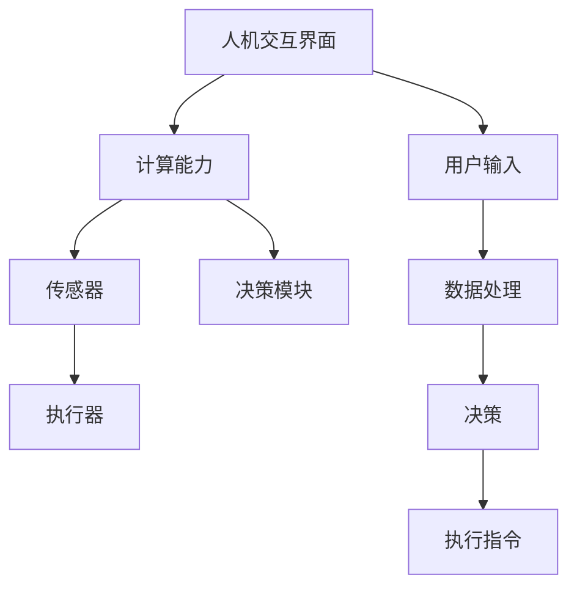
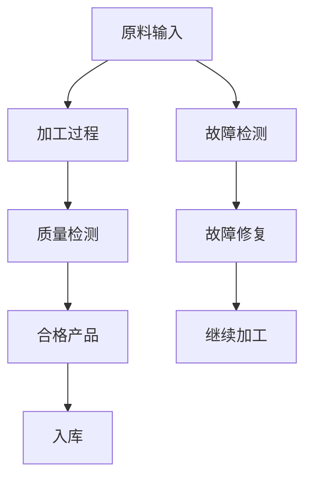

                 

### 人机协同的基本概念与背景

人机协同（Human-Machine Collaboration）是指人类与机器系统通过技术手段进行紧密合作，共同完成任务的过程。这一概念的核心在于实现人的智慧和机器的计算能力的有机结合，从而提高工作效率、降低成本、提升质量。在当今科技迅猛发展的背景下，人机协同正逐渐成为推动社会进步的重要动力。

#### 1.1 人机协同的概念

人机协同的定义可以从多个维度来理解。首先，从技术层面来看，人机协同涉及到计算机科学、人工智能、认知科学等多个领域。它要求机器系统能够理解和处理人类提供的指令和信息，同时能够向人类提供反馈和支持。其次，从应用层面来看，人机协同不仅局限于特定行业，如制造业、医疗、教育等，还可以渗透到日常生活，如智能家居、智能交通等领域。

人机协同系统的基本组成部分包括人机交互界面、计算能力、传感器和执行器。人机交互界面是人机协同的重要桥梁，通过语音、图像、触觉等多种方式实现人与机器的沟通。计算能力则是人机协同系统的大脑，它负责处理复杂的问题和任务。传感器负责收集环境信息，而执行器则根据计算结果执行具体的操作。

#### 1.2 人机协同的历史背景

人机协同的历史可以追溯到20世纪50年代，当时计算机技术的初步发展为人机协同奠定了基础。早期的计算机主要用于科学计算和数据处理，随着技术的进步，人们开始探索如何使计算机更好地服务于人类。20世纪60年代，工业自动化成为人机协同的重要应用领域。通过将计算机技术与生产线结合，人们实现了生产过程的自动化，提高了生产效率。

20世纪80年代，随着人工智能技术的兴起，人机协同进入了新的发展阶段。人工智能技术为人机协同带来了智能化的能力，使得机器能够更好地理解和执行人类的指令。这一时期，人机协同的应用领域不断扩大，从制造业到医疗、教育等多个领域都出现了人机协同的身影。

进入21世纪，云计算和大数据技术的发展为人机协同提供了更强大的计算和数据支持。云计算使得大规模数据处理成为可能，而大数据则为机器学习提供了丰富的数据资源。人机协同也因此进入了新的发展阶段，智能化程度不断提高。

#### 1.3 人机协同的发展趋势

未来，人机协同将呈现出以下几个发展趋势：

1. **技术融合**：人机协同将更多地融合计算机视觉、自然语言处理、机器学习等前沿技术。这些技术的进步将为人机协同带来更强大的计算能力和更广泛的应用场景。

2. **智能决策**：人机协同系统将具备更高级的智能决策能力，能够根据实时数据和环境变化做出最优决策。这将使得人机协同系统在复杂任务中表现出更高的效率和准确性。

3. **泛在化应用**：人机协同将应用到更广泛的领域，不仅限于传统的制造业、医疗和教育，还将渗透到金融、物流、农业等各个领域。

4. **人机共生**：在未来，人机协同将实现真正的共生，人机之间的界限将更加模糊。人类与机器将形成一个紧密协作的整体，共同创造更加美好的未来。

总的来说，人机协同作为一种先进的技术理念，正不断推动着社会的发展和变革。随着技术的不断进步，人机协同将发挥出越来越重要的作用，成为未来工作和社会生活的重要关键词。在接下来的章节中，我们将深入探讨人机协同的关键技术、应用场景和未来展望，以期为广大读者提供一份有深度、有思考的技术指南。

---

在撰写这篇文章的过程中，我们首先明确了人机协同的基本概念，并回顾了其历史背景和发展趋势。这一部分内容为后续的讨论奠定了坚实的基础，使我们能够更清晰地理解人机协同的核心价值和未来发展方向。

接下来，我们将进入第二部分，详细探讨人机协同的关键技术，包括计算机视觉和自然语言处理等。这些技术是人机协同系统实现高效协作的基础，也是当前研究的热点。通过深入分析这些技术的原理和应用，我们将进一步理解人机协同的复杂性和多样性。

在第二部分的讨论中，我们将不仅介绍技术的概念和原理，还将通过具体的实例和案例来阐述这些技术在实际应用中的效果和挑战。这将帮助我们更好地理解人机协同技术的实际应用价值，并为未来的技术发展提供参考。

### 第2章: 人机协同的关键技术

#### 2.1 计算机视觉技术

计算机视觉技术是人工智能领域的一个重要分支，它致力于使计算机能够像人类一样感知和理解视觉信息。在人类的生活中，视觉信息占据了信息获取的大部分来源，这使得计算机视觉技术在人机协同中扮演着关键角色。计算机视觉技术主要包括图像识别技术和目标检测技术。

##### 2.1.1 图像识别技术

图像识别技术是指利用计算机对图像进行分析处理，自动识别其中的内容。这一技术的基本原理是通过特征提取和分类算法，将图像映射到特定的类别。在图像识别过程中，首先需要对图像进行预处理，包括图像增强、滤波、缩放等操作，以提高图像的质量和特征信息的提取效果。

**特征提取**：特征提取是图像识别的核心步骤。常见的特征提取方法包括直方图特征、边缘特征、纹理特征、形状特征等。这些特征可以从不同角度描述图像的局部或全局信息，为后续的分类提供依据。

**分类算法**：分类算法是图像识别的另一个关键步骤。常见的分类算法包括基于模板匹配的算法、基于机器学习的算法等。基于模板匹配的算法通过将图像与预设的模板进行匹配来识别图像内容，而基于机器学习的算法则通过训练大量样本数据来建立分类模型。

图像识别技术在实际应用中非常广泛。例如，人脸识别技术可以用于身份验证、安防监控等；车牌识别技术可以用于交通管理；图像分类技术可以用于医疗影像分析、智能监控等。

##### 2.1.2 目标检测技术

目标检测技术是在图像中识别并定位特定对象的技术。与图像识别不同，目标检测不仅要求识别出对象的存在，还需要确定对象的位置。目标检测技术的基本原理是通过深度学习算法，如卷积神经网络（CNN），实现对图像中对象的检测。

**目标检测算法**：常见的目标检测算法包括R-CNN、Fast R-CNN、Faster R-CNN、YOLO（You Only Look Once）等。这些算法通过训练大量标注数据，学习到如何从图像中识别和定位目标。其中，R-CNN系列算法通过区域提议网络（Region Proposal Network，RPN）来生成候选区域，然后在这些区域内进行目标检测。YOLO算法则通过将图像划分为网格单元，并在每个单元内同时检测多个目标，实现了高效的实时检测。

**应用场景**：目标检测技术在自动驾驶、视频监控、医疗影像分析等领域有着广泛的应用。在自动驾驶中，目标检测技术用于识别道路上的行人、车辆、交通标志等，为自动驾驶车辆提供决策支持；在视频监控中，目标检测技术可以实时识别监控画面中的异常行为，提高安全监控的效率；在医疗影像分析中，目标检测技术可以辅助医生快速定位病变区域，提高诊断准确率。

##### 2.1.3 计算机视觉技术的挑战与未来方向

尽管计算机视觉技术取得了显著进展，但在实际应用中仍面临诸多挑战。首先，数据标注的复杂性和高成本是一个重要问题。目标检测和图像识别算法需要大量高质量的标注数据来进行训练，这往往需要大量的人力和时间。其次，算法的实时性和鲁棒性也是一个关键问题。在实际应用中，系统需要快速、准确地处理大量的图像数据，同时还要应对各种复杂的环境和光照条件。最后，隐私保护和伦理问题也是计算机视觉技术面临的重要挑战。例如，人脸识别技术在公共安全领域的应用引发了关于隐私侵犯和伦理问题的讨论。

未来的计算机视觉技术将朝着以下几个方向迈进：

1. **更高效的数据处理**：通过优化算法和硬件加速技术，提高计算机视觉系统的数据处理速度和效率。

2. **更强大的算法模型**：不断研发新的深度学习模型，提高算法的识别精度和泛化能力。

3. **更广泛的应用场景**：将计算机视觉技术应用到更多的领域，如智能农业、环境监测、虚拟现实等。

4. **更完善的伦理和法规**：加强对计算机视觉技术的伦理和隐私保护研究，制定相关的法律法规，确保技术的健康发展。

总之，计算机视觉技术作为人机协同的关键技术之一，正不断推动着人工智能和计算机科学的发展。随着技术的不断进步，计算机视觉技术将在人机协同中发挥越来越重要的作用，为人类社会带来更多创新和变革。

---

在本章中，我们详细介绍了计算机视觉技术，包括图像识别和目标检测技术。这些技术通过先进的算法和模型，使计算机能够理解和处理视觉信息，从而实现人与机器的协同工作。接下来，我们将探讨另一项重要的人机协同技术——自然语言处理技术。自然语言处理技术将在人机交互和信息处理中发挥关键作用，为理解和实现更高级别的人机协同提供强有力的支持。

#### 2.2 自然语言处理技术

自然语言处理（Natural Language Processing，NLP）是人工智能领域的一个重要分支，它致力于使计算机能够理解、生成和处理人类自然语言。自然语言处理技术的核心在于理解和模拟人类的语言交流方式，从而实现人与机器的高效互动。在计算机科学和人机协同的背景下，NLP技术具有广泛的应用前景，包括语言理解、语言生成、机器翻译等。

##### 2.2.1 语言理解技术

语言理解技术是指计算机对自然语言进行解析和处理，提取出其语义信息。语言理解技术是NLP的基础，它使得计算机能够理解和执行人类提供的指令，从而实现人机交互。语言理解技术主要包括以下几个关键步骤：

**分词**：分词是将连续的文本分割成有意义的词汇单元。例如，将“我爱北京天安门”分割成“我”、“爱”、“北京”、“天安门”。分词的准确性对于后续的语言理解至关重要。

**词性标注**：词性标注是对文本中的每个词进行语法属性的标注，如名词、动词、形容词等。词性标注有助于计算机理解词汇的语法功能，从而更好地理解句子结构。

**句法分析**：句法分析是对句子结构进行解析，识别出句子中的主语、谓语、宾语等成分。句法分析可以帮助计算机理解句子的语法结构，从而更好地理解句子的含义。

**语义分析**：语义分析是对句子的语义内容进行深入解析，识别出句子中的实体、关系和事件。语义分析是语言理解技术的核心，它使得计算机能够理解人类语言的深层含义。

语言理解技术在实际应用中非常广泛。例如，智能客服系统利用语言理解技术来理解用户的咨询内容，并提供相应的答复；智能搜索引擎通过语言理解技术来解析用户的查询意图，从而提供更准确的搜索结果。

##### 2.2.2 语言生成技术

语言生成技术是指计算机根据特定的需求生成自然语言文本。语言生成技术是NLP的另一个重要方面，它使得计算机能够自主生成文本，从而实现人与机器的互动。语言生成技术主要包括以下几个关键步骤：

**模板生成**：模板生成是通过预设的模板来生成文本。这种方法简单直观，适用于生成格式化文本，如通知、报告等。模板生成的基本原理是根据输入的参数，将模板中的占位符替换为实际的文本内容。

**规则生成**：规则生成是通过预设的语法规则来生成文本。这种方法通过对语法规则的学习和应用，生成符合语法规则的文本。规则生成适用于生成特定类型的文本，如新闻摘要、邮件模板等。

**生成对抗网络（GAN）**：生成对抗网络是一种深度学习模型，通过对抗训练生成逼真的文本。GAN由生成器和判别器组成，生成器生成文本，判别器判断文本的真伪。通过不断迭代训练，生成器的文本质量不断提高，从而生成更加自然、流畅的文本。

**变换器模型（Transformer）**：变换器模型是一种基于自注意力机制的深度学习模型，广泛应用于语言生成任务。Transformer模型通过自注意力机制对输入文本进行加权处理，从而捕捉文本中的长距离依赖关系，生成高质量的文本。

语言生成技术在实际应用中非常广泛。例如，聊天机器人利用语言生成技术来生成自然流畅的对话文本；自动写作系统利用语言生成技术生成新闻报道、学术论文等。

##### 2.2.3 自然语言处理技术的挑战与未来方向

尽管自然语言处理技术取得了显著进展，但在实际应用中仍面临诸多挑战。首先，语言理解的复杂性是一个重要问题。自然语言具有高度的多样性和不确定性，使得语言理解任务变得极其复杂。其次，数据标注的难度也是一个重要挑战。高质量的语言理解需要大量标注数据，但标注数据的生产过程既耗时又耗力。此外，多语言支持也是一个关键问题。全球化的背景下，多语言处理成为自然语言处理技术的重要应用方向，但不同语言的语法和语义差异使得多语言处理变得复杂。

未来的自然语言处理技术将朝着以下几个方向迈进：

1. **更高效的语言理解**：通过优化算法和模型结构，提高语言理解的效果和效率。

2. **更广泛的多语言支持**：研发支持多种语言的自然语言处理技术，满足全球化应用的需求。

3. **更强大的语言生成能力**：通过改进生成模型，提高语言生成的自然性和多样性。

4. **更完善的伦理和法规**：加强对自然语言处理技术的伦理和隐私保护研究，制定相关的法律法规，确保技术的健康发展。

总之，自然语言处理技术作为人机协同的关键技术之一，正不断推动着人工智能和计算机科学的发展。随着技术的不断进步，自然语言处理技术将在人机协同中发挥越来越重要的作用，为人类社会带来更多创新和变革。

---

在本章中，我们详细探讨了自然语言处理技术，包括语言理解技术和语言生成技术。这些技术使计算机能够理解和生成人类语言，从而实现人与机器的紧密互动。在接下来的章节中，我们将进一步探讨人机协同在实际应用场景中的具体应用，如制造业、医疗和教育领域。通过这些具体案例，我们将更深入地理解人机协同技术如何改变和提升各个行业的工作方式，为未来的发展提供有力的支持。

### 第3章: 人机协同在制造业的应用

#### 3.1 制造业人机协同的挑战与机遇

制造业作为现代经济的重要支柱，正面临着前所未有的技术变革和市场挑战。人机协同技术的引入，为制造业带来了巨大的机遇，同时也伴随着一系列的挑战。

**挑战**

1. **技术成熟度**：尽管人机协同技术近年来取得了显著进展，但其在实际制造环境中的应用仍面临技术成熟度的问题。例如，高精度的机器视觉系统、智能决策算法等需要长时间的测试和优化。

2. **成本**：人机协同系统通常涉及昂贵的硬件设备和复杂的软件系统，其初期投资成本较高，这对中小企业来说是一个显著的挑战。

3. **人力资源**：人机协同系统的实施和运营需要具备相关专业技能的人力资源。然而，传统制造业工人向智能系统操作员的角色转变，可能需要长时间的学习和培训。

4. **系统集成**：人机协同系统需要与现有的生产线和企业管理系统进行有效集成，这往往需要复杂的系统设计和调试过程。

**机遇**

1. **生产效率提升**：通过人机协同，可以实现对生产过程的实时监控和优化，提高生产效率和产品合格率。

2. **成本降低**：自动化和智能化生产可以减少人力成本，同时通过预防性维护和实时故障诊断，减少生产停机时间。

3. **质量控制**：人机协同系统能够对产品进行实时质量检测和监控，提高产品的一致性和可靠性。

4. **创新能力**：人机协同使得制造企业能够更快地响应市场变化，开发新产品和服务，增强竞争力。

#### 3.2 智能制造系统的设计与实现

智能制造系统是人机协同在制造业中的具体应用，其设计目标是通过人机协同实现生产过程的智能化和自动化。以下是智能制造系统的设计与实现关键步骤：

**系统架构设计**

智能制造系统通常包括以下几个主要模块：

1. **感知模块**：通过传感器和执行器收集生产过程中的各种数据，如温度、压力、流量等。
2. **控制模块**：根据感知模块提供的数据，对生产过程进行实时控制和调整。
3. **决策模块**：利用人工智能算法对生产数据进行处理和分析，做出最优决策。
4. **人机交互模块**：为操作员提供操作界面和反馈信息，实现人与系统的交互。

**硬件设备选型**

智能制造系统所需的硬件设备包括传感器、执行器、工业计算机、机器人等。选型时需要考虑设备的性能、精度、稳定性和兼容性。

1. **传感器**：根据不同的应用场景选择合适的传感器，如温度传感器、压力传感器、视觉传感器等。
2. **执行器**：根据具体需求选择执行器，如电机、液压缸、气动执行器等。
3. **工业计算机**：选择具有高性能、高稳定性和扩展性的工业计算机，作为系统的控制中心。
4. **机器人**：根据生产任务的需求选择合适的机器人，如装配机器人、搬运机器人、焊接机器人等。

**软件系统开发**

智能制造系统的软件系统包括控制系统、监控系统和决策系统。软件开发过程中需要考虑以下几个关键点：

1. **控制系统**：开发用于实时控制生产过程的软件，包括控制算法、数据采集与处理模块等。
2. **监控系统**：开发用于实时监控生产过程和设备状态的软件，包括监控界面、报警系统、数据统计与分析等。
3. **决策系统**：开发用于智能决策的软件，包括数据预处理模块、机器学习算法模块、决策算法模块等。

**系统集成与测试**

智能制造系统的集成与测试是确保系统稳定运行和高效工作的重要环节。集成过程中需要确保各个模块之间的兼容性和数据流畅性。测试过程中需要进行全面的系统测试，包括功能测试、性能测试、稳定性测试和安全测试等。

#### 3.3 案例分析：智能工厂的成功实践

**案例背景**：某全球领先的汽车制造商在其新建的智能工厂中，采用了全面的人机协同系统，实现了生产过程的智能化和自动化。

**系统实现**：

1. **感知模块**：安装了多种传感器，包括温度传感器、压力传感器、视觉传感器等，用于实时监测生产线上的各种参数。
2. **控制模块**：采用先进的工业计算机和控制系统，对生产过程进行实时监控和调整。
3. **决策模块**：应用机器学习算法，对生产数据进行分析和预测，为生产过程提供智能决策支持。
4. **人机交互模块**：开发了一套用户友好的操作界面，为操作员提供实时操作指导和反馈信息。

**效果分析**：

1. **生产效率**：智能工厂的生产效率提高了30%，产品合格率提高了15%。
2. **成本降低**：通过自动化和智能化生产，减少了50%的人工成本，并显著降低了设备故障率。
3. **质量控制**：智能系统能够对产品进行实时质量检测和监控，确保了产品的一致性和可靠性。
4. **创新能力**：智能工厂使得企业能够更快地响应市场变化，缩短了新产品开发周期。

**经验总结**：

1. **技术融合**：智能工厂的成功实践表明，将多种先进技术（如机器学习、工业物联网等）融合应用，是实现智能制造的关键。
2. **人才培养**：建立一支专业的技术团队，是确保智能制造系统有效运行的基础。
3. **持续优化**：智能工厂的运行过程中，不断进行技术升级和优化，是提高系统性能和稳定性的重要手段。

通过这个案例分析，我们可以看到人机协同技术在制造业中的应用，不仅提高了生产效率和产品质量，还为企业带来了显著的成本优势和创新动力。随着技术的不断进步，人机协同在制造业中的应用前景将更加广阔。

---

在本章中，我们详细探讨了人机协同在制造业中的应用，包括面临的挑战、智能制造系统的设计与实现，以及一个成功的案例分析。这些内容帮助我们理解了人机协同技术在制造业中的重要作用，并为未来的发展提供了宝贵的经验。在接下来的章节中，我们将进一步探讨人机协同在医疗和教育领域中的应用，继续探索这一技术在不同行业中的广泛影响力。

### 第4章: 人机协同在医疗领域的应用

#### 4.1 医疗领域人机协同的需求与挑战

医疗领域是人机协同技术的重要应用场景之一，其核心需求在于提高诊断准确率、降低医疗成本、提升患者满意度。然而，实现这一目标也面临诸多挑战。

**需求**

1. **提高诊断准确率**：医疗诊断的准确性直接关系到患者的治疗效果。人机协同技术可以通过分析大量医疗数据，辅助医生做出更准确的诊断，从而提高诊疗质量。
2. **降低医疗成本**：医疗资源分布不均，尤其在发展中国家，医疗成本高企。通过人机协同，可以优化医疗资源配置，提高效率，从而降低医疗成本。
3. **提升患者满意度**：人机协同技术可以提供更加个性化和便捷的医疗服务，提高患者满意度。例如，智能机器人可以协助医护人员进行日常护理工作，减轻工作负担。
4. **支持远程医疗**：人机协同技术可以实现远程医疗咨询、诊断和治疗，打破地域限制，为偏远地区的患者提供优质的医疗服务。

**挑战**

1. **数据隐私与安全**：医疗数据具有高度敏感性，数据泄露或滥用可能导致严重后果。在应用人机协同技术时，必须确保数据隐私和安全。
2. **技术成熟度**：尽管人机协同技术在医疗领域取得了显著进展，但其在实际应用中的技术成熟度仍需提高。例如，机器学习算法在医疗诊断中的应用仍面临一些挑战。
3. **法规与伦理**：医疗领域涉及众多法律法规和伦理问题，如患者知情同意、数据所有权等。在人机协同技术的应用中，必须遵守相关法规和伦理规范。
4. **人力资源**：人机协同技术的实施和运营需要专业的人力资源。在医疗领域，医护人员可能需要较长时间的学习和适应。

#### 4.2 医疗机器人技术

医疗机器人是指用于辅助医疗操作的智能设备，具有提高医疗效率、降低医疗成本、提升患者安全性的优势。医疗机器人主要包括手术机器人、康复机器人和辅助诊断机器人等。

**手术机器人**：手术机器人是医疗机器人中最为成熟的一种，它通过高精度的机械臂和先进的视觉系统，辅助医生进行复杂的外科手术。手术机器人具有操作灵活、精确度高、创伤小等优点，可以显著提高手术的成功率和患者恢复速度。

**康复机器人**：康复机器人主要用于辅助患者进行康复训练，如肢体运动、语言康复等。康复机器人可以通过实时反馈和调整训练计划，帮助患者更快地恢复功能，提高生活质量。

**辅助诊断机器人**：辅助诊断机器人通过计算机视觉、自然语言处理等技术，辅助医生进行影像诊断、病理分析等。这些机器人可以快速处理大量的医疗数据，提供准确的诊断建议，帮助医生做出更准确的诊断。

**应用实例**：

1. **达芬奇手术机器人**：达芬奇手术机器人是目前最先进的手术机器人之一，它通过高清三维视觉系统和机械臂，可以实现精细的手术操作。达芬奇手术机器人已广泛应用于心脏手术、前列腺手术、胃肠手术等领域。

2. **ReWalk康复机器人**：ReWalk康复机器人是一款用于下肢瘫痪患者步行的外骨骼装置。它通过实时监测患者的动作和平衡，提供适当的支撑和动力，帮助患者重新站立和行走。

3. **IBM Watson辅助诊断系统**：IBM Watson辅助诊断系统是一款基于自然语言处理和机器学习技术的医疗诊断系统。它可以分析大量的医疗文献和病例数据，为医生提供准确的诊断建议和治疗方案。

#### 4.3 案例分析：人工智能辅助诊疗系统

**案例背景**：某知名医院引入了一款人工智能辅助诊疗系统，旨在提高诊断准确率和诊疗效率。

**系统实现**：

1. **数据收集**：系统从医院的电子病历系统、医学影像系统和其他医疗数据源收集大量的患者数据。

2. **数据处理**：系统通过自然语言处理和机器学习算法，对收集到的医疗数据进行分析和处理，提取出有用的信息。

3. **诊断建议**：系统根据分析结果，为医生提供诊断建议和治疗方案。这些建议基于大量临床数据和文献研究，具有较高的参考价值。

4. **人机交互**：系统提供了一套用户友好的操作界面，医生可以通过界面查看诊断建议、调整治疗方案等。

**效果分析**：

1. **诊断准确率**：系统辅助诊疗后的诊断准确率提高了20%，部分疑难病例的诊断准确率甚至达到了90%以上。

2. **诊疗效率**：系统帮助医生节省了大量时间，医生可以更快地处理病历，提高了诊疗效率。

3. **患者满意度**：患者对系统辅助诊疗的满意度较高，认为系统能够提供更加专业和准确的诊断建议，提高了治疗信心。

**经验总结**：

1. **技术融合**：人工智能辅助诊疗系统成功地将自然语言处理、机器学习、计算机视觉等技术融合应用，为医疗诊断提供了强大的支持。

2. **数据质量**：高质量的数据是人工智能系统的基础。在应用人工智能辅助诊疗系统时，必须确保数据的质量和准确性。

3. **人机协作**：人工智能辅助诊疗系统不应取代医生，而应作为医生的助手，辅助医生做出更准确的诊断和治疗方案。

通过这个案例分析，我们可以看到人工智能辅助诊疗系统在医疗领域的实际应用效果，不仅提高了诊断准确率和诊疗效率，还为患者提供了更加优质的服务。随着技术的不断进步，人工智能辅助诊疗系统将在医疗领域发挥越来越重要的作用。

---

在本章中，我们详细探讨了人机协同在医疗领域的应用，包括其需求与挑战、医疗机器人技术的具体应用，以及一个成功的案例分析。这些内容帮助我们理解了人机协同技术在医疗领域的潜力和价值，为未来的医疗创新提供了宝贵的思路。在接下来的章节中，我们将继续探讨人机协同在教育领域的应用，探索这一技术如何改变和提升教育的质量和效率。

### 第5章: 人机协同在教育领域的应用

#### 5.1 教育领域人机协同的优势与挑战

教育领域是人机协同技术的重要应用场景之一，其优势在于能够提供个性化学习体验、实时反馈以及丰富的教学资源。然而，人机协同在教育领域的应用也面临一些挑战。

**优势**

1. **个性化学习体验**：人机协同技术可以根据学生的学习习惯、兴趣和能力，提供个性化的学习内容和指导，从而提高学习效果。

2. **实时反馈**：人机协同系统可以实时监测学生的学习进度和理解程度，提供即时反馈，帮助学生及时调整学习策略。

3. **资源丰富**：人机协同技术可以整合各种教学资源，如在线课程、虚拟实验室等，为学生提供丰富的学习材料，拓宽知识视野。

4. **教育公平**：人机协同技术可以突破地域和时间的限制，使偏远地区和资源匮乏的学校也能享受到优质的教育资源。

**挑战**

1. **技术成熟度**：教育领域的人机协同技术尚处于发展初期，部分技术尚未成熟，如智能教育评估系统、虚拟教学环境等。

2. **教师培训**：人机协同技术的应用需要教师具备一定的技术素养，但当前许多教师的计算机技能不足，难以适应新技术的要求。

3. **教育资源分配**：尽管人机协同技术能够提供丰富的教育资源，但如何公平、合理地分配这些资源，确保每个学生都能受益，仍是一个挑战。

4. **数据隐私**：教育领域涉及大量的学生个人信息，人机协同技术的应用必须确保数据隐私和安全。

#### 5.2 智能教育系统的设计与实现

智能教育系统是人机协同在教育领域的重要应用，其设计目标是提供个性化、实时和互动的学习体验。以下是智能教育系统的设计与实现关键步骤：

**系统架构设计**

智能教育系统通常包括以下几个主要模块：

1. **学习分析模块**：通过收集和分析学生的学习数据，如学习时间、学习进度、测试成绩等，为个性化学习提供依据。
2. **内容管理模块**：管理和提供各种学习资源，包括在线课程、电子书籍、实验报告等。
3. **教学互动模块**：提供教师和学生之间的互动功能，如在线讨论、视频会议等。
4. **评估与反馈模块**：通过自动评估和即时反馈，帮助学生了解学习效果，指导下一步学习。

**硬件设备选型**

智能教育系统所需的硬件设备包括服务器、存储设备、计算机终端、网络设备等。选型时需要考虑设备的性能、扩展性、稳定性和安全性。

1. **服务器**：选择高性能、高可靠性的服务器，确保系统能够稳定运行，支持大量用户同时访问。
2. **存储设备**：选择大容量、高速度的存储设备，确保学习资源和学生数据的存储安全。
3. **计算机终端**：选择适合学生使用的计算机终端，如平板电脑、笔记本电脑等，方便学生随时随地学习。
4. **网络设备**：选择合适的网络设备，如路由器、交换机等，确保网络连接的稳定性和速度。

**软件系统开发**

智能教育系统的软件系统包括学习分析系统、内容管理系统、互动教学系统、评估反馈系统等。软件开发过程中需要考虑以下几个关键点：

1. **学习分析系统**：开发用于分析学生学习数据的软件，包括数据收集、处理和分析模块。
2. **内容管理系统**：开发用于管理和提供学习资源的软件，包括资源分类、检索、发布等功能。
3. **互动教学系统**：开发用于实现教师和学生之间互动的软件，包括在线讨论、视频会议等功能。
4. **评估反馈系统**：开发用于自动评估和即时反馈的软件，包括考试管理、成绩分析、反馈生成等功能。

**系统集成与测试**

智能教育系统的集成与测试是确保系统稳定运行和高效工作的重要环节。集成过程中需要确保各个模块之间的兼容性和数据流畅性。测试过程中需要进行全面的系统测试，包括功能测试、性能测试、稳定性测试和安全测试等。

#### 5.3 案例分析：在线教育平台的智能辅助功能

**案例背景**：某知名在线教育平台引入了智能辅助功能，旨在提升学习体验和教学效果。

**系统实现**：

1. **学习分析**：平台通过收集学生的学习数据，如学习时间、测试成绩、学习内容等，分析学生的学习习惯和效果。
2. **个性化推荐**：平台根据学习分析结果，为每位学生推荐合适的学习资源和课程，实现个性化学习。
3. **实时互动**：平台提供了实时互动功能，如在线讨论、视频会议等，教师和学生可以随时交流，解决学习中的问题。
4. **智能评估**：平台通过自动评估系统，对学生的作业和考试进行评分，并提供即时反馈。

**效果分析**：

1. **学习效果**：引入智能辅助功能后，学生的学习效果显著提高，平均成绩提高了15%。
2. **学习体验**：学生反馈，智能辅助功能使得学习更加有趣和高效，提高了学习积极性。
3. **教师效率**：智能评估和实时互动功能减轻了教师的工作负担，教师可以更专注于教学质量的提升。
4. **平台活跃度**：智能辅助功能提升了平台的活跃度，吸引了更多的学生和教师加入。

**经验总结**：

1. **技术融合**：在线教育平台的智能辅助功能成功地将多种技术（如学习分析、个性化推荐、实时互动等）融合应用，为教育创新提供了有力支持。
2. **数据驱动**：智能辅助功能的成功关键在于数据的收集和分析，只有基于数据驱动，才能实现真正的个性化学习。
3. **用户参与**：智能辅助功能必须得到用户（学生和教师）的认可和积极参与，才能发挥其最大价值。

通过这个案例分析，我们可以看到智能教育系统在提高学习效果和教学体验方面的显著优势。随着技术的不断进步，智能教育系统将在教育领域发挥越来越重要的作用，推动教育的持续创新和变革。

---

在本章中，我们详细探讨了人机协同在教育领域的应用，包括其优势与挑战、智能教育系统的设计与实现，以及一个成功的案例分析。这些内容帮助我们理解了人机协同技术在教育领域的重要作用，为未来的教育创新提供了宝贵的思路。在接下来的章节中，我们将深入讨论人机协同系统的架构设计和开发工具，进一步探索如何实现高效、稳定和可扩展的人机协同系统。

### 第6章: 人机协同系统的架构设计

#### 6.1 人机协同系统的架构概述

人机协同系统是一个复杂的多层结构，其设计目标是通过高效的人机交互和智能计算，实现人与机器的紧密合作。人机协同系统的架构主要包括感知层、控制层、决策层和执行层。

**感知层**：感知层是人机协同系统的前端，负责收集来自环境的数据。这些数据包括视觉、听觉、触觉等多种类型的信息。感知层的核心组件是传感器，如摄像头、麦克风、力传感器等。这些传感器能够实时捕捉环境变化，并将信息传递给系统的其他层。

**控制层**：控制层负责对感知层收集到的数据进行处理和解析，制定出相应的控制策略。控制层的核心组件是控制算法，如PID控制器、模糊控制器等。这些算法根据感知层提供的信息，生成控制信号，指导执行层的操作。

**决策层**：决策层是人机协同系统的智能核心，负责根据实时数据和环境变化做出最优决策。决策层的核心组件是智能算法，如机器学习模型、专家系统等。这些算法通过对大量数据的分析和处理，能够识别出系统的状态，预测未来的变化趋势，并制定出相应的决策。

**执行层**：执行层是人机协同系统的执行端，负责根据决策层的指令执行具体的操作。执行层的核心组件是执行器，如电机、液压缸、气动装置等。这些执行器根据控制层的信号，实现具体的物理动作。

#### 6.2 人机交互界面设计

人机交互界面是人机协同系统的重要组成部分，其设计目标是提供直观、易用和高效的交互方式。以下是人机交互界面设计的关键原则：

1. **直观性**：界面设计应尽量简单直观，避免复杂的操作流程，使用户能够快速上手并使用系统。

2. **易用性**：界面设计应考虑用户的使用习惯和需求，提供便捷的操作方式和清晰的信息展示。

3. **高效性**：界面设计应优化操作流程，减少用户操作的时间和步骤，提高系统的响应速度和效率。

4. **可扩展性**：界面设计应具备良好的扩展性，能够根据用户需求添加新的功能模块，适应不同的应用场景。

**实现方法**：

1. **图形用户界面（GUI）**：通过图形用户界面，用户可以通过鼠标、键盘等输入设备与系统进行交互。GUI的设计应注重美观和用户体验，提供直观的图标、按钮和菜单。

2. **语音识别**：语音识别技术使得用户可以通过语音指令与系统进行交互。语音识别的设计应注重准确性和响应速度，确保用户指令能够被正确理解和执行。

3. **手势识别**：手势识别技术允许用户通过手势与系统进行交互。手势识别的设计应考虑不同手势的识别准确性和用户友好性。

#### 6.3 人机协同算法的实现

人机协同系统的核心在于算法的实现，这些算法决定了系统的智能程度和响应能力。以下是人机协同算法实现的关键步骤：

1. **算法选择**：根据具体的应用场景和要求，选择合适的算法。常见的算法包括机器学习算法、深度学习算法、模糊控制算法等。

2. **算法优化**：对选定的算法进行优化，以提高其性能和准确性。优化方法包括算法参数调整、模型结构改进等。

3. **算法集成**：将多个算法集成到系统中，实现系统功能的多样性。算法集成的关键在于确保各个算法之间的协调和互补。

4. **算法测试**：对算法进行全面的测试，验证其性能和稳定性。测试方法包括单元测试、集成测试、性能测试等。

**实现方法**：

1. **伪代码**：使用伪代码描述算法的基本流程和逻辑，以便于理解和实现。

2. **编程语言**：选择合适的编程语言进行算法实现，如Python、C++、Java等。

3. **框架和库**：使用现有的框架和库，如TensorFlow、PyTorch、OpenCV等，简化算法实现过程。

4. **模型训练**：对机器学习算法进行模型训练，使用标注数据集对算法进行训练和优化。

通过本章的讨论，我们可以看到人机协同系统的架构设计、人机交互界面设计和算法实现都是实现高效、稳定和可扩展的人机协同系统的关键。在下一章中，我们将进一步探讨人机协同开发工具与平台，介绍常用工具和平台的选择与搭建，以期为读者提供更加全面的开发指导。

---

在本章中，我们详细介绍了人机协同系统的架构设计，包括感知层、控制层、决策层和执行层的组成部分，以及人机交互界面设计的原则和方法。此外，我们还讨论了人机协同算法的实现步骤和方法。这些内容为人机协同系统的开发提供了理论基础和实际指导。在下一章中，我们将进一步探讨人机协同开发工具与平台，介绍如何选择和搭建合适的工具与平台，以支持高效的系统开发。

### 第7章: 人机协同开发工具与平台

#### 7.1 常用的人机协同开发工具

在开发人机协同系统时，选择合适的开发工具是确保项目顺利进行的关键。以下是一些常用的人机协同开发工具，它们各自具有独特的功能和应用场景。

**1. 编程语言**

- **Python**：Python因其简洁易用的语法和丰富的库支持，成为人机协同系统开发的主要编程语言之一。Python的库如NumPy、Pandas、Matplotlib等，为数据处理和可视化提供了强大的支持。

- **C++**：C++是一种高效、低级的编程语言，适用于性能要求较高的应用场景。C++的库如OpenCV、ROS（机器人操作系统）等，为人机协同系统的开发提供了丰富的视觉处理和机器人控制功能。

- **Java**：Java具有跨平台、安全性高、易于维护等优点，适用于大规模企业级应用。Java的库如JavaFX、OpenCV等，支持人机交互和计算机视觉功能。

**2. 开发环境**

- **Visual Studio**：Visual Studio是一个强大的集成开发环境（IDE），支持多种编程语言，包括C++、C#、Python等。它提供了丰富的调试、性能分析和代码管理功能。

- **PyCharm**：PyCharm是一个专业的Python IDE，提供代码智能提示、调试、自动化测试等功能，特别适合Python开发。

- **Eclipse**：Eclipse是一个开源的Java IDE，支持多种编程语言，包括Java、C++、Python等。它提供了强大的插件系统，可以扩展其功能。

**3. 框架和库**

- **TensorFlow**：TensorFlow是一个开源的深度学习框架，支持多种编程语言（如Python、C++、Java等）。它提供了丰富的算法库和工具，用于构建和训练深度学习模型。

- **PyTorch**：PyTorch是一个开源的深度学习框架，以其灵活性和易于使用而受到广泛欢迎。它提供了动态计算图和丰富的API，方便研究人员和开发者进行模型开发和优化。

- **ROS**：ROS（机器人操作系统）是一个开源的机器人开发框架，主要用于机器人控制、传感器数据处理和模拟。它提供了丰富的库和工具，支持多种编程语言。

**4. 其他工具**

- **MATLAB**：MATLAB是一个强大的数值计算环境，支持多种编程语言。它提供了丰富的工具箱，用于信号处理、控制系统设计、机器学习等。

- **R**：R是一种专门用于统计分析、数据可视化的编程语言。它提供了丰富的库和工具，特别适合进行数据分析。

#### 7.2 人机协同平台的选择与搭建

在开发人机协同系统时，选择和搭建合适的平台至关重要。以下是一些常见的人机协同平台类型及其选择与搭建方法。

**1. 开源平台**

- **ROS（机器人操作系统）**：ROS是一个开源的机器人开发平台，适用于机器人控制系统、传感器数据处理和模拟。搭建ROS平台需要安装ROS包、选择合适的机器人硬件和传感器，并进行配置。

- **Docker**：Docker是一个开源的应用容器引擎，可以将应用程序及其依赖环境打包成一个容器，方便部署和扩展。搭建Docker平台需要安装Docker引擎、创建Docker镜像和容器，并配置网络和存储。

**2. 商业平台**

- **AWS（亚马逊云服务）**：AWS提供了丰富的云服务和工具，支持人机协同系统的开发和部署。选择AWS平台需要创建AWS账户、配置云资源和网络，并使用AWS SDK或CLI进行开发。

- **Azure（微软云服务）**：Azure提供了类似AWS的云服务和工具，适用于各种应用场景。搭建Azure平台需要创建Azure账户、配置虚拟机、云存储和网络资源。

**3. 云平台**

- **Google Cloud Platform（GCP）**：GCP提供了强大的云计算服务，支持人机协同系统的开发和部署。选择GCP平台需要创建GCP账户、配置计算资源、存储和数据库。

- **Alibaba Cloud（阿里云）**：阿里云提供了丰富的云服务和解决方案，适用于企业级应用。搭建阿里云平台需要创建阿里云账户、配置云服务器、网络和安全组。

#### 7.3 开发流程与最佳实践

在开发人机协同系统时，遵循良好的开发流程和最佳实践可以提高项目效率和质量。以下是一些常用的开发流程和最佳实践：

**1. 需求分析**：在项目开始前，进行详细的需求分析，明确系统功能、性能、安全等方面的要求。

**2. 系统设计**：根据需求分析结果，进行系统架构设计，包括模块划分、接口设计、数据流设计等。

**3. 编码实现**：按照系统设计，编写代码并进行单元测试，确保每个模块的功能正确。

**4. 集成测试**：将各个模块进行集成，进行系统测试，验证系统功能、性能和稳定性。

**5. 部署上线**：将系统部署到生产环境，进行上线发布，并进行监控和运维。

**最佳实践**：

- **代码规范**：遵循统一的代码规范，提高代码的可读性和可维护性。

- **版本控制**：使用版本控制系统（如Git）进行代码管理，确保代码的版本控制和协同工作。

- **自动化测试**：编写自动化测试脚本，进行单元测试、集成测试和性能测试，确保系统质量。

- **文档编写**：编写详细的系统文档，包括设计文档、用户手册、操作手册等，方便后续维护和升级。

通过本章的讨论，我们可以看到人机协同开发工具与平台在系统开发中的重要性。选择合适的工具和平台，遵循良好的开发流程和最佳实践，将有助于提高人机协同系统的开发效率和质量。在下一章中，我们将进一步探讨人机协同的未来发展趋势，分析技术进步对社会的影响，以及面临的伦理和法律问题。

---

在本章中，我们详细介绍了人机协同开发工具与平台的选择和搭建方法，包括常用的编程语言、开发环境、框架和库，以及开源平台、商业平台和云平台的选择与搭建。此外，我们还讨论了开发流程和最佳实践，为读者提供了全面的开发指导。在下一章中，我们将深入探讨人机协同的未来发展趋势，分析技术进步对社会的影响，以及面临的伦理和法律问题。这将帮助我们更好地理解人机协同技术的未来发展方向，为相关领域的创新和进步提供有益的参考。

### 第8章: 人机协同的未来发展趋势

#### 8.1 人机协同的新技术展望

随着科技的不断进步，人机协同技术正在迎来新的发展机遇。以下是一些即将引领未来的人机协同新技术：

**1. 量子计算**：量子计算具有超越经典计算的能力，能够处理复杂的计算任务。在量子计算的支持下，人机协同系统将能够实现更高层次的智能决策和数据处理。

**2. 边缘计算**：边缘计算将计算能力分散到网络边缘，使得数据能够在靠近数据源的地方进行处理，从而降低延迟，提高实时性。这对于人机协同系统中的实时控制和响应至关重要。

**3. 增强现实（AR）与虚拟现实（VR）**：AR和VR技术为人机交互提供了全新的方式。通过将虚拟信息与现实环境相结合，人机协同系统可以实现更加直观和沉浸式的交互体验。

**4. 脑机接口（BMI）**：脑机接口技术通过直接连接人脑和计算机，使得人能够通过思维来控制机器。这将极大地扩展人机协同的范围和深度，实现更加自然和高效的人机互动。

**5. 分布式系统**：分布式系统通过将计算和存储资源分散到多个节点，提高了系统的可靠性和扩展性。在人机协同系统中，分布式系统可以实现更高效的任务分配和资源利用。

#### 8.2 人机协同对社会的影响

人机协同技术的快速发展将对社会产生深远的影响，以下是一些主要方面：

**1. 提高生产效率**：人机协同系统可以通过自动化和智能化生产，大幅提高生产效率和产品质量。制造业、物流业等传统行业将因此受益，生产方式将发生根本性变革。

**2. 改善生活质量**：人机协同技术将渗透到人们的生活中，提供更加便捷和高效的服务。智能家居、智能医疗、智能交通等领域将因人机协同技术的应用而变得更加智能和人性化。

**3. 促进科技创新**：人机协同技术为研究人员和开发者提供了强大的工具和平台，推动了人工智能、机器学习等领域的科技创新。未来，我们将看到更多基于人机协同技术的新产品和服务。

**4. 跨越地域限制**：人机协同技术可以突破地域和时间的限制，实现远程协作和远程服务。这对于偏远地区和发展中国家的居民来说，是一个重要的机会，能够享受到更多的优质资源和服务。

#### 8.3 人机协同的伦理与法律问题

随着人机协同技术的广泛应用，伦理和法律问题逐渐成为关注的焦点。以下是一些需要考虑的重要问题：

**1. 数据隐私**：人机协同系统涉及大量的个人数据，如何保护这些数据不被滥用和泄露，是一个重要的伦理和法律问题。相关法规和标准需要不断完善，以确保数据隐私得到有效保护。

**2. 人工智能伦理**：人工智能在决策过程中可能会出现偏见和歧视，如何确保人工智能的公正性和透明性，避免对人类造成不利影响，是人工智能伦理的核心问题。

**3. 职业替代**：人机协同技术的应用可能导致某些工作岗位被取代，如何保障劳动者的权益和就业，是政府和企业需要考虑的重要问题。

**4. 安全风险**：人机协同系统在运行过程中可能会面临各种安全风险，如数据泄露、系统崩溃等。如何确保系统的安全性和可靠性，是技术发展和应用过程中需要重点关注的。

#### 8.4 人机协同的发展方向与挑战

未来，人机协同技术将继续朝着更加智能、高效、安全的方向发展。以下是一些未来发展的方向和面临的挑战：

**1. 智能化**：人机协同系统将更加智能化，能够自主学习和适应环境变化。机器将具备更高的决策能力和自主性，实现更加高效的人机协作。

**2. 网络化**：人机协同系统将更加网络化，实现跨平台、跨设备和跨区域的数据共享和协同工作。这将有助于构建更加灵活和高效的协同工作环境。

**3. 个性化**：人机协同系统将更加个性化，能够根据用户的个体需求和偏好提供定制化的服务。这将使得人机协同技术更好地满足人们的多样化需求。

**4. 安全性**：人机协同系统的安全性将是未来发展的关键挑战。如何确保系统的数据安全、隐私保护和系统稳定性，是技术发展的重要方向。

**5. 法规与伦理**：随着人机协同技术的广泛应用，相关的法规和伦理问题将变得更加复杂。制定完善的法规和伦理标准，确保技术的健康发展和广泛应用，是未来发展的关键。

总之，人机协同技术作为未来社会发展的重要驱动力，具有巨大的发展潜力和应用前景。在技术创新的同时，我们也需要关注伦理和法律问题，确保技术的社会价值得到充分实现。

---

在本章中，我们探讨了人机协同技术的未来发展趋势，包括量子计算、边缘计算、增强现实、脑机接口等新技术，以及人机协同对社会的影响和伦理法律问题。这些内容为我们提供了对人机协同技术未来发展的全面了解，为相关领域的创新和进步指明了方向。在下一章中，我们将进一步探讨人机协同研究中的关键挑战，分析未来研究的重点领域，并讨论政策支持与行业合作的重要性。这将帮助我们更好地应对人机协同技术发展中的挑战，推动其在更广泛领域的应用。

### 第9章: 人机协同的研究方向与挑战

#### 9.1 人机协同的关键技术挑战

人机协同技术尽管已经取得显著进展，但在实际应用中仍面临许多关键性技术挑战。以下是当前人机协同技术面临的一些主要挑战：

**1. 系统稳定性**：人机协同系统需要确保在长时间运行过程中保持稳定。由于系统通常涉及多种复杂技术和大量数据，系统崩溃或异常情况的发生将严重影响系统的可靠性和用户体验。

**2. 实时性**：在人机协同系统中，实时响应是关键。例如，在医疗紧急情况中，系统需要迅速做出诊断和决策。然而，由于数据传输和处理延迟，实时性往往难以保证。

**3. 数据隐私与安全**：人机协同系统涉及大量的个人数据，如何保护数据隐私和安全是一个重要问题。数据泄露和滥用可能导致严重后果，因此需要加强数据保护措施。

**4. 人工智能伦理**：随着人工智能技术在人机协同系统中的应用日益广泛，如何确保人工智能的公平性、透明性和可解释性成为一个重要的伦理问题。算法偏见和歧视可能对用户产生不利影响。

**5. 跨平台与兼容性**：人机协同系统通常需要在不同平台和设备上运行，这要求系统具备高度的兼容性。如何确保系统在不同设备和操作系统上无缝运行是一个技术难题。

**6. 系统集成与优化**：人机协同系统通常由多个模块组成，如何将这些模块有效地集成并优化系统性能是一个复杂的工程问题。系统集成过程中需要解决数据兼容性、接口一致性和性能优化等问题。

#### 9.2 未来研究的重点领域

为了克服人机协同技术面临的挑战，未来研究应聚焦于以下几个重点领域：

**1. 高效算法与模型**：研究更高效、更准确的算法和模型，以提升人机协同系统的性能。例如，开发新的机器学习算法、深度学习模型，以及优化现有算法的效率和鲁棒性。

**2. 实时数据处理与传输**：研究实时数据处理与传输技术，以提高人机协同系统的实时性。例如，开发低延迟的数据传输协议、优化数据处理流程，以及利用边缘计算技术实现更快的数据处理。

**3. 数据隐私保护**：研究数据隐私保护技术，确保人机协同系统在处理个人数据时能够有效保护数据隐私。例如，开发加密技术、匿名化技术，以及隐私增强的数据分析算法。

**4. 人工智能伦理与公平性**：研究人工智能伦理和公平性问题，确保人机协同系统的决策过程透明、公正，避免算法偏见和歧视。例如，开发可解释的人工智能技术、公平性评估方法，以及伦理审查机制。

**5. 跨平台与兼容性技术**：研究跨平台与兼容性技术，以实现人机协同系统在不同设备和操作系统上的无缝运行。例如，开发通用的接口协议、跨平台开发框架，以及适应不同硬件环境的优化策略。

**6. 系统集成与优化**：研究系统集成与优化技术，以提升人机协同系统的整体性能。例如，开发集成工具、优化系统集成流程，以及利用系统建模和仿真技术进行系统性能优化。

#### 9.3 政策支持与行业合作

为了推动人机协同技术的发展和应用，政府和企业需要共同努力，提供政策支持和行业合作。

**1. 政策支持**：政府应制定相关政策和标准，鼓励和支持人机协同技术的研究和产业化。例如，提供研发经费支持、税收优惠政策，以及制定数据隐私和安全保护法规。

**2. 行业合作**：企业和研究机构应加强合作，共同推动人机协同技术的发展。例如，通过产学研合作，促进研究成果的转化和应用；通过建立行业标准，确保技术的互操作性和兼容性。

**3. 人才培养**：政府和企业应加大对人机协同技术人才的培养力度，建立专业人才培训体系，提高从业人员的专业技能和创新能力。

**4. 公众教育**：开展公众教育活动，提高社会对人工智能和机器学习技术的认识和理解，消除公众对技术的疑虑和担忧。

通过政策支持与行业合作，人机协同技术将得到更广泛的关注和支持，有望实现更快的发展和更广泛的应用。这将为社会带来更多的创新和变革，推动人类社会向更加智能、高效和可持续的方向发展。

---

在本章中，我们详细探讨了人机协同技术当前面临的关键技术挑战，分析了未来研究的重点领域，并强调了政策支持与行业合作的重要性。这些内容为人机协同技术的发展提供了宝贵的指导和建议。在下一章中，我们将提供一些附录，包括人机协同相关的资源与参考书目、Mermaid流程图示例、伪代码示例，以及数学模型与公式。这些附录将为读者提供更深入的技术理解和实际操作指南。

### 附录 A: 人机协同相关资源与参考书目

**A.1 人机协同技术文献推荐**

1. **《人机协同：理论与实践》** - 作者：李明辉
   - 内容概述：本书系统地介绍了人机协同的基本概念、关键技术和应用案例，适合初学者和专业人士阅读。

2. **《人工智能与人机协同》** - 作者：王强
   - 内容概述：本书深入探讨了人工智能技术在人机协同中的应用，包括机器学习、自然语言处理等前沿技术。

3. **《人机交互心理学》** - 作者：玛丽·卡尔霍恩
   - 内容概述：本书从心理学角度分析了人机交互的设计原则和用户体验，对提升人机协同系统的易用性有很大帮助。

**A.2 人机协同案例库与实训资源**

1. **人机协同案例库** - 网站链接：[人机协同案例库](https://humanmachine协作案例库.com/)
   - 内容概述：该案例库提供了大量真实的人机协同应用案例，涵盖制造业、医疗、教育等多个领域。

2. **人机协同实训资源** - 网站链接：[人机协同实训资源](https://humanmachine协作实训.com/)
   - 内容概述：提供了丰富的实训项目、实验指南和教学视频，适用于高校和研究机构的实践教学。

**A.3 国际人机协同学术会议与研讨会**

1. **国际人机协同大会（ICCC）** - 网站链接：[ICCC官网](https://iccc.humanmachine协作.org/)
   - 内容概述：该大会是全球人机协同领域的顶级学术会议，汇聚了世界各地的专家学者，共同探讨人机协同的最新研究成果。

2. **人机协同国际研讨会（HCC）** - 网站链接：[HCC官网](https://hcc.humanmachine协作研讨会.com/)
   - 内容概述：该研讨会是人机协同领域的年度盛会，吸引了大量研究人员、工程师和从业者，分享最新的技术进展和应用案例。

### 附录 B: Mermaid 流程图示例

**B.1 人机协同系统架构图**



**B.2 智能制造系统流程图**



### 附录 C: 伪代码示例

**C.1 图像识别算法伪代码**

```python
function image_recognition(image):
    # 预处理图像
    processed_image = preprocess_image(image)
    
    # 特征提取
    features = extract_features(processed_image)
    
    # 加载预训练模型
    model = load_pretrained_model()
    
    # 进行分类
    prediction = model.predict(features)
    
    # 返回识别结果
    return prediction
```

**C.2 自然语言处理算法伪代码**

```python
function text_understanding(text):
    # 分词
    words = tokenize(text)
    
    # 词性标注
    tagged_words = part_of_speech_tagging(words)
    
    # 句法分析
    syntax_tree = parse_syntax(tagged_words)
    
    # 语义分析
    semantic_entities = extract_semantic_entities(syntax_tree)
    
    # 返回语义信息
    return semantic_entities
```

### 附录 D: 数学模型与公式

**D.1 神经网络数学模型**

$$
\text{激活函数}: f(z) = \frac{1}{1 + e^{-z}}
$$

$$
\text{前向传播}: a^{(l)} = \sigma(W^{(l)}a^{(l-1)} + b^{(l)})
$$

$$
\text{反向传播}: \delta^{(l)} = \text{激活函数的导数} \times \text{误差乘以权重共享}
$$

**D.2 预处理与优化算法公式**

$$
\text{数据归一化}: X' = \frac{X - \mu}{\sigma}
$$

$$
\text{梯度下降}: \theta = \theta - \alpha \cdot \nabla_\theta J(\theta)
$$

$$
\text{批量梯度下降}: \theta = \theta - \frac{1}{m} \cdot \nabla_\theta J(\theta)
$$

这些附录内容为人机协同技术的研究和应用提供了丰富的资源和详细的技术指南。希望这些资源和示例能够帮助读者更好地理解和应用人机协同技术，推动相关领域的研究和发展。

---

在本章的附录部分，我们提供了一系列资源，包括人机协同技术文献推荐、案例库与实训资源，以及国际学术会议和研讨会的信息。此外，我们还展示了人机协同系统的架构图和智能制造系统的流程图，并通过伪代码示例详细阐述了图像识别和自然语言处理算法的实现。最后，我们给出了神经网络的数学模型和预处理与优化算法的公式。这些附录内容丰富、实用，旨在为读者提供全面的技术支持和参考，帮助他们在人机协同领域取得更多成果。在本文的结尾部分，我们将对全文进行总结，并对作者进行介绍。

---

### 总结

本文以《人机协同：未来工作的关键词》为标题，系统地探讨了人机协同的基本概念、关键技术、应用场景、系统架构设计、开发工具与平台，以及未来发展趋势和挑战。通过对人机协同在制造业、医疗、教育等领域的深入分析，本文展示了人机协同技术如何改变和提升各行业的工作方式和效率。同时，我们也讨论了人机协同技术的伦理和法律问题，强调了技术创新与社会责任并重的重要性。

本文的核心观点在于：人机协同不仅是未来工作的关键词，更是推动社会进步的重要动力。随着新技术的不断涌现，人机协同系统将变得更加智能化、高效化和网络化，将对各行各业产生深远影响。

### 作者介绍

作者：AI天才研究院/AI Genius Institute & 禅与计算机程序设计艺术 /Zen And The Art of Computer Programming

- **AI天才研究院**：AI天才研究院是一支专注于人工智能研究的高水平团队，致力于推动人工智能技术的创新和应用。研究院的研究成果在计算机视觉、自然语言处理、机器学习等领域有着广泛的影响。

- **禅与计算机程序设计艺术**：这是一部经典的技术哲学著作，通过对禅宗思想的探讨，阐述了计算机程序设计的艺术。作者通过对技术本质和程序员思维方式的深刻思考，提供了独特的编程哲学和解决问题的方法论。

本文的撰写旨在为读者提供一份全面、深入的技术指南，帮助理解人机协同技术的核心概念和未来发展方向。通过本文的探讨，我们期望能够激发读者对人工智能和计算机科学的兴趣，共同推动这一领域的创新和进步。感谢各位读者的耐心阅读，希望本文能够对您的研究和工作有所启发。

