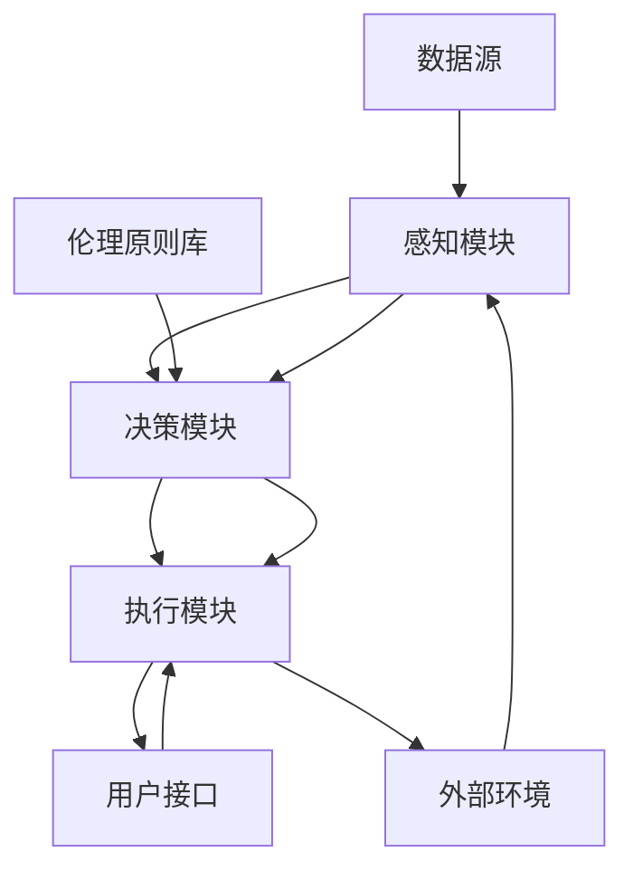

                 

### 《人类 计算：在AI时代增强道德代理》

在人工智能（AI）迅猛发展的今天，人类与机器的交互日益密切。然而，随着AI技术的不断进步，如何确保智能系统在决策过程中遵循道德规范，成为了一个亟待解决的问题。本文旨在探讨在AI时代如何增强道德代理，使智能系统能够在复杂的决策环境中做出符合伦理道德的决策。

**关键词：** 人工智能，道德代理，伦理原则，算法设计，法律框架

**摘要：** 本文从道德代理的概念、伦理原则、核心架构、算法原理、项目实战等多个角度出发，详细探讨了在AI时代如何增强道德代理。通过分析道德代理的伦理原则、核心算法原理以及具体实现方法，本文为智能系统的道德决策提供了理论指导和实践参考。

### 第一部分: AI时代的道德代理概述

#### 第1章: AI时代的道德代理背景

**1.1 AI时代的到来**

人工智能，作为计算机科学的重要分支，已经从实验室走向了实际应用。从早期的专家系统到今天的深度学习，AI技术不断突破，展现出了巨大的潜力。随着AI技术的普及，智能系统已经渗透到社会的各个领域，从医疗、金融到交通、教育，AI技术的应用无处不在。

然而，AI技术的发展也带来了一系列挑战。智能系统在处理大量数据时，往往会出现偏见、不公平等问题。例如，一些AI算法在招聘、贷款审批等场景中，由于数据集存在偏见，导致对某些群体不公平。这种问题的出现，使得道德代理的概念应运而生。

**1.2 道德代理的概念**

道德代理，是指能够在其操作环境中按照道德原则自主行动的实体。在AI时代，道德代理通常是指嵌入在智能系统中的，能够在执行任务时考虑道德因素，做出符合伦理道德的决策的算法。道德代理不仅关注结果，更关注决策过程，确保其决策符合社会道德规范。

**1.3 道德代理的重要性**

道德代理的重要性体现在以下几个方面：

1. **提高智能系统的可信度**：在AI时代，智能系统被广泛应用于金融、医疗等关键领域。道德代理能够确保智能系统在执行任务时，遵循伦理道德规范，从而提高系统的可信度。

2. **解决偏见和歧视问题**：智能系统在处理数据时，可能会受到数据偏见的影响，导致决策不公平。道德代理能够通过考虑道德因素，减少偏见和歧视。

3. **引导智能系统向善**：道德代理能够引导智能系统在决策时，考虑到长远的社会利益，从而推动智能系统向善发展。

### 第二部分: 道德代理的伦理原则

#### 第2章: 道德代理的伦理原则

道德代理的核心在于其伦理原则，这些原则为智能系统的决策提供了道德指导。以下是一些关键的伦理原则：

**2.1 尊重个人隐私**

尊重个人隐私是道德代理的首要原则。在AI时代，数据已经成为重要的资产，但是数据的收集和处理过程中，往往会侵犯到个人的隐私权。道德代理需要确保在收集和处理数据时，遵循隐私保护原则，尊重个人隐私。

**2.2 公平性与无偏见**

公平性与无偏见是道德代理的重要伦理原则。智能系统在决策时，可能会受到数据集的偏见影响，导致对某些群体不公平。道德代理需要通过算法设计，确保决策的公平性和无偏见性。

**2.3 透明性与可解释性**

透明性与可解释性是道德代理的另一重要原则。智能系统的决策过程往往复杂且不透明，用户难以理解其决策依据。道德代理需要确保决策过程透明，用户能够理解智能系统的决策逻辑。

**2.4 持续改进与责任**

道德代理需要持续改进，以应对不断变化的社会环境和道德标准。同时，道德代理也需要承担相应的责任，确保其决策符合道德规范。

### 第三部分: 道德代理的核心架构与技术

#### 第3章: 道德代理的架构设计与实现

道德代理的实现依赖于合理的架构设计和算法选择。以下将介绍道德代理的核心架构设计和技术实现。

**3.1 道德代理的组成模块**

道德代理通常由以下几个组成模块构成：

1. **感知模块**：负责收集外部环境和内部状态的信息。
2. **决策模块**：根据感知模块收集的信息，结合伦理原则，进行道德决策。
3. **执行模块**：根据决策模块的决策结果，执行具体的操作。

**3.2 道德决策模型**

道德决策模型是道德代理的核心，决定了道德代理如何进行道德决策。常见的道德决策模型包括：

1. **期望效用理论**：根据各方的效用函数，选择能够最大化总体效用的决策。
2. **多目标优化**：在多个目标之间进行平衡，选择最优的决策方案。
3. **博弈论模型**：考虑各方利益，选择最优的协同策略。

**3.3 道德代理的实现框架**

道德代理的实现框架通常包括以下几个方面：

1. **算法选择**：根据应用场景选择合适的算法。
2. **数据预处理**：对数据进行清洗、去噪、归一化等处理，为算法提供高质量的输入。
3. **模型训练**：使用历史数据训练道德决策模型，使其能够进行有效的道德决策。
4. **模型评估**：通过模拟测试，评估道德代理的决策效果，并进行优化。

### 第四部分: 道德代理在具体应用场景中的实现

#### 第4章: 道德代理在具体应用场景中的实现

道德代理在各个领域的应用中，都能够发挥重要的作用。以下将介绍道德代理在医疗、金融、社交网络、智能交通等领域的具体实现。

**4.1 医疗领域的道德代理**

在医疗领域，道德代理可以用于决策支持系统，帮助医生做出符合伦理道德的医疗决策。例如，在器官移植分配中，道德代理可以根据患者的紧急程度、健康状况等因素，进行公平、公正的器官分配。

**4.2 金融领域的道德代理**

在金融领域，道德代理可以用于风险评估和决策支持。例如，在贷款审批中，道德代理可以根据借款人的信用记录、还款能力等因素，做出公平、无偏见的风险评估，从而减少贷款欺诈行为。

**4.3 社交网络领域的道德代理**

在社交网络领域，道德代理可以用于内容审核和用户行为分析。例如，在社交媒体平台上，道德代理可以根据用户发布的内容，判断其是否符合道德规范，从而进行内容过滤，保护用户的利益。

**4.4 智能交通领域的道德代理**

在智能交通领域，道德代理可以用于车辆调度和交通管理。例如，在交通事故处理中，道德代理可以根据事故原因、车辆受损情况等因素，进行公平、公正的事故责任判定。

### 第五部分: AI时代的道德代理挑战与未来展望

#### 第5章: 道德代理的法律与政策框架

随着AI技术的不断发展，道德代理的应用也面临着一系列的法律和政策挑战。以下将探讨道德代理的法律与政策框架。

**5.1 道德代理的法律挑战**

1. **责任归属**：在道德代理出现决策失误时，如何确定责任归属，是一个重要的问题。是智能系统开发者、使用者，还是道德代理本身，需要明确责任分配。
2. **隐私保护**：道德代理在收集和处理数据时，如何保护用户的隐私，避免数据泄露，是法律关注的重点。
3. **公平性**：道德代理在决策过程中，如何避免偏见，确保公平性，是法律需要解决的问题。

**5.2 道德代理的政策框架**

为了推动道德代理的健康发展，政府需要制定相应的政策框架。以下是一些可能的政策框架：

1. **伦理审查制度**：建立伦理审查制度，对道德代理的开发和应用进行审查，确保其符合伦理道德标准。
2. **数据保护法规**：制定数据保护法规，确保道德代理在数据收集、处理和使用过程中，遵守隐私保护原则。
3. **责任追究机制**：建立责任追究机制，明确道德代理的责任归属，确保智能系统的安全可靠。

### 第六部分: 道德代理的教育与培训

#### 第6章: 道德代理的教育与培训

道德代理的发展离不开专业的教育和培训。以下将探讨道德代理的教育与培训。

**6.1 道德代理的教育理念**

道德代理的教育理念应该包括：

1. **伦理教育**：培养学生正确的伦理观念，使其在开发和应用道德代理时，能够遵循伦理道德原则。
2. **技术教育**：培养学生掌握道德代理的核心技术和算法，使其能够设计和实现高效的道德代理系统。
3. **综合教育**：结合伦理、技术和实践，培养学生的综合能力，使其能够在实际应用中，灵活应对各种复杂情况。

**6.2 道德代理的专业培训**

道德代理的专业培训应该包括以下几个方面：

1. **基础知识培训**：包括伦理学、计算机科学、统计学等基础知识，为道德代理的学习打下基础。
2. **技术技能培训**：包括道德代理的核心算法、实现技术、评估方法等，培养学生的技术能力。
3. **实践项目培训**：通过实际项目，让学生在实践中学习和应用道德代理技术，提高其实际操作能力。

**6.3 道德代理的教育资源建设**

为了推动道德代理的教育与培训，需要建立相应的教育资源。以下是一些教育资源建设的建议：

1. **教材编写**：编写适合道德代理教育的教材，系统介绍道德代理的相关知识。
2. **在线课程**：开发在线课程，方便学生随时随地学习。
3. **实验平台**：建立道德代理的实验平台，为学生提供实践操作的机会。

### 第七部分: 道德代理的未来发展趋势

#### 第7章: 道德代理的未来发展趋势

随着AI技术的不断进步，道德代理也将迎来新的发展机遇。以下将探讨道德代理的未来发展趋势。

**7.1 人工智能与道德代理的融合**

随着AI技术的不断进步，道德代理将更加深入地融入人工智能系统。未来的道德代理将能够更加智能化，自主地进行道德决策，从而提高智能系统的整体性能。

**7.2 智能社会的道德治理**

在智能社会，道德代理将成为智能治理的重要工具。通过道德代理，政府、企业和社会组织将能够更加高效地进行决策，实现公平、公正、透明的治理。

**7.3 道德代理在未来的影响**

道德代理在未来的影响将体现在以下几个方面：

1. **提高智能系统的可靠性**：道德代理将确保智能系统的决策符合伦理道德，提高系统的可靠性。
2. **促进社会的公平与正义**：道德代理将帮助消除社会不公，推动社会的公平与正义。
3. **推动人类文明的进步**：道德代理将促进人类文明的发展，为人类创造更美好的未来。

### 附录

#### 附录 A: 道德代理开发工具与资源

为了方便读者了解道德代理的开发，以下将介绍一些道德代理开发工具与资源。

**A.1 道德代理开发工具简介**

1. **PyTorch**：一款流行的深度学习框架，支持道德代理的快速开发。
2. **TensorFlow**：一款功能强大的深度学习框架，适合开发复杂的道德代理系统。
3. **Keras**：一款简单易用的深度学习框架，适合道德代理的快速原型开发。

**A.2 道德代理相关的开源项目**

1. **Fairlearn**：一款开源的公平性评估工具，可以帮助开发道德代理时，确保决策的公平性。
2. **Algorithmia**：一款开源的道德代理框架，提供了丰富的道德代理实现方法。
3. **ClearML**：一款开源的机器学习平台，支持道德代理的开发和部署。

**A.3 道德代理的研究文献与资料推荐**

1. **《道德机器：人工智能时代的伦理问题》**：一本关于道德代理和AI伦理问题的经典著作，适合对道德代理感兴趣的读者。
2. **《人工智能伦理导论》**：一本关于AI伦理问题的入门读物，介绍了道德代理的基本概念和原理。
3. **《人工智能伦理学》**：一本深入探讨AI伦理问题的学术著作，适合对道德代理有较高研究兴趣的读者。

### 总结

道德代理在AI时代具有重要意义，通过设计合理的架构和算法，可以实现智能系统的道德决策。本文介绍了道德代理的核心概念、伦理原则、核心架构、算法原理、项目实战等多个方面，旨在为智能系统的道德决策提供理论指导和实践参考。

随着AI技术的不断进步，道德代理将在各个领域发挥重要作用。未来，道德代理将更加智能化，自主地进行道德决策，推动智能社会的公平与正义。同时，道德代理也将面临一系列的法律和政策挑战，需要全社会共同努力，确保道德代理的发展符合社会道德规范。

作者：AI天才研究院/AI Genius Institute & 禅与计算机程序设计艺术 /Zen And The Art of Computer Programming

### 核心概念与联系

在探讨道德代理的架构时，理解其核心概念及其相互之间的联系是至关重要的。以下是一个简化的 Mermaid 流程图，用于展示道德代理的关键组件和它们之间的交互。



**感知模块（A）** 负责收集智能系统所处环境中的各种信息，包括数据源（E）、外部环境（G）等。这些信息是道德决策的基础。

**决策模块（B）** 利用感知模块收集的信息和伦理原则库（D），结合算法模型，进行道德判断和决策。这个模块的核心在于其能够基于伦理原则，做出符合道德规范的决策。

**执行模块（C）** 根据决策模块的决策结果，执行具体的操作，如与用户接口（F）交互，或者对外部环境（G）产生影响。

**伦理原则库（D）** 是道德代理的核心组成部分，它包含了所有用于指导决策的伦理原则，如公平性、透明性、隐私保护等。

**用户接口（F）** 是道德代理与用户之间的交互界面，确保用户能够理解决策过程和结果。

**外部环境（G）** 代表智能系统所在的社会和物理环境，道德代理需要考虑这些环境因素，以做出符合实际情况的决策。

通过这个流程图，我们可以看到道德代理如何通过感知、决策、执行三个环节，实现从数据输入到道德决策再到行动输出的全过程。

### 核心算法原理讲解

道德代理的核心算法原理主要包括博弈论、决策树和强化学习等。以下将分别介绍这些算法的基本原理，并通过伪代码展示其实现过程。

#### 1. 博弈论算法

**原理：** 博弈论算法用于道德代理在不同利益相关者之间的决策过程中，以实现最优解。在多智能体系统中，每个智能体都追求自身利益的最大化，而博弈论可以帮助确定各智能体之间的最优策略。

**伪代码：**

```plaintext
function NashEquilibrium(game_matrix):
    for each player i in the game:
        for each strategy s_i of player i:
            find the best response s_i* for player i against all other players' strategies
        update the strategy of player i to s_i*
    return the strategies of all players
```

**示例：** 假设有两个智能体A和B，它们可以选择合作（C）或背叛（D）。游戏矩阵如下：

|     | A.C | A.D |
|-----|-----|-----|
| B.C | 3,3 | 1,0 |
| B.D | 0,1 | 2,2 |

通过求解纳什均衡，我们可以找到每个智能体的最优策略。在此示例中，纳什均衡为（D, D），即两个智能体都选择背叛。

#### 2. 决策树算法

**原理：** 决策树算法用于道德代理的决策过程，通过一系列条件判断，选择最优行动方案。决策树由多个节点和分支组成，每个节点代表一个条件判断，每个分支代表可能的行动。

**伪代码：**

```plaintext
function DecisionTree(data):
    if data meets the stopping criteria:
        return the optimal action based on the majority class
    else:
        find the best feature to split the data
        split the data based on the best feature
        for each split:
            create a child node
            recursively call DecisionTree on the child node
        return the tree
```

**示例：** 假设我们要决策是否允许用户访问受保护的数据，条件包括用户的角色和权限。决策树如下：

```
[根节点] 是否管理员？
    是：允许访问
    否：是否开发者？
        是：允许访问
        否：是否测试员？
            是：允许访问
            否：拒绝访问
```

#### 3. 强化学习算法

**原理：** 强化学习算法通过不断尝试和反馈，逐步优化道德代理的行为策略。在每次决策后，道德代理会根据即时奖励和长期目标，调整其行为。

**伪代码：**

```plaintext
initialize Q(s, a) = 0 for all states s and actions a
while not done:
    select action a based on policy π
    take action a and observe reward r and next state s'
    update Q(s, a) using the Bellman equation
    update the policy π using Q(s, a)
```

**示例：** 假设道德代理在医疗决策中，根据患者的病情和治疗方案，选择最佳的治疗方案。在每次治疗结束后，根据患者的恢复情况，调整治疗方案。

通过上述算法，道德代理能够在复杂的决策环境中，逐步学习和优化其行为策略，以实现符合道德规范的目标。

### 数学模型和数学公式

在道德代理的设计和实现过程中，数学模型和公式起到了至关重要的作用。以下将介绍几个核心的数学模型和公式，并给出详细的讲解和举例说明。

#### 1. 期望效用理论

**数学公式：** 

\[ V^*(s) = \max_{a} \sum_{s'} P(s'|s, a) \cdot u(s', a) \]

**详细讲解：** 期望效用理论是道德代理进行决策的基础。该公式表示，在状态 \( s \) 下，选择最优行动 \( a \) 应该最大化从所有可能状态 \( s' \) 得到的期望效用。其中，\( V^*(s) \) 是状态 \( s \) 的最优值函数，\( P(s'|s, a) \) 是在状态 \( s \) 下采取行动 \( a \) 后，转移到状态 \( s' \) 的概率，\( u(s', a) \) 是在状态 \( s' \) 下采取行动 \( a \) 的效用函数。

**举例说明：** 假设一个道德代理在医疗决策中，面临两个治疗方案A和B。状态 \( s \) 是患者的病情，\( s' \) 是治疗后患者的恢复情况。效用函数 \( u(s', a) \) 表示在 \( s' \) 状态下采取行动 \( a \) 的效用。通过计算期望效用，代理可以选择最优的治疗方案。

#### 2. 多目标优化

**数学公式：** 

\[ \min_{x} \{ f_1(x), f_2(x), ..., f_n(x) \} \]

**详细讲解：** 多目标优化是道德代理在面临多个目标时常用的数学模型。该公式表示，在所有可能的解 \( x \) 中，找到能够最小化所有目标函数 \( f_1(x), f_2(x), ..., f_n(x) \) 的解。在实际应用中，目标函数可以是公平性、透明性、效率等。

**举例说明：** 在一个智能交通系统中，道德代理需要同时考虑道路容量、交通流量和行车安全等多个目标。通过多目标优化，代理可以找到在所有目标之间达到平衡的最优交通流量分配方案。

#### 3. 概率分布

**数学公式：** 

\[ P(A) = \sum_{i=1}^{n} P(A|B_i)P(B_i) \]

**详细讲解：** 概率分布是道德代理在进行不确定情况分析时常用的数学模型。该公式表示，在多个条件 \( B_i \) 下，事件 \( A \) 发生的总概率。通过条件概率和先验概率，代理可以计算事件 \( A \) 的综合概率。

**举例说明：** 在一个金融风险评估中，道德代理需要评估某个投资项目成功的概率。通过收集市场数据，代理可以计算在多个市场条件下，投资项目成功的综合概率，从而做出投资决策。

通过上述数学模型和公式，道德代理能够在复杂的环境中，进行高效的决策和优化。这些模型和公式不仅提供了理论依据，也提供了实用的工具，帮助道德代理实现其道德决策的目标。

### 项目实战

为了更好地理解道德代理的实践应用，以下将介绍一个具体的道德代理项目实战，包括开发环境搭建、源代码详细实现和代码解读与分析。

#### 项目背景

假设我们正在开发一个智能医疗系统，该系统需要根据患者的病情、医生的建议和医疗资源的情况，做出合理的治疗决策。道德代理将嵌入在这个系统中，确保治疗决策符合伦理道德规范。

#### 开发环境搭建

为了实现这个项目，我们需要搭建一个适合开发和测试的环境。以下是开发环境的搭建步骤：

1. **安装Python环境**：在服务器或本地计算机上安装Python 3.8版本。
2. **安装深度学习框架**：安装PyTorch，用于构建和训练道德代理模型。
3. **安装数据预处理库**：安装Pandas、NumPy等数据预处理库，用于处理医疗数据。
4. **配置虚拟环境**：为了保持代码的整洁和可维护性，使用virtualenv创建一个虚拟环境。

```shell
pip install virtualenv
virtualenv moral_agent_env
source moral_agent_env/bin/activate
```

#### 源代码详细实现

以下是一个简单的道德代理实现，包括感知模块、决策模块和执行模块。

```python
import torch
import torch.nn as nn
import torch.optim as optim
from torch.utils.data import DataLoader
from torchvision import datasets, transforms
import pandas as pd

# 感知模块：数据收集
class PerceptionModule:
    def __init__(self, data_path):
        self.data_path = data_path
        self.data = self.load_data()

    def load_data(self):
        df = pd.read_csv(self.data_path)
        return df

# 决策模块：道德代理
class MoralAgent(nn.Module):
    def __init__(self):
        super(MoralAgent, self).__init__()
        self.fc1 = nn.Linear(10, 64)
        self.fc2 = nn.Linear(64, 32)
        self.fc3 = nn.Linear(32, 2)
        self.optimizer = optim.Adam(self.parameters(), lr=0.001)

    def forward(self, x):
        x = torch.relu(self.fc1(x))
        x = torch.relu(self.fc2(x))
        x = self.fc3(x)
        return x

    def train(self, data_loader, num_epochs=10):
        for epoch in range(num_epochs):
            for x, y in data_loader:
                y_pred = self.forward(x)
                loss = nn.CrossEntropyLoss()(y_pred, y)
                self.optimizer.zero_grad()
                loss.backward()
                self.optimizer.step()
            print(f'Epoch {epoch+1}/{num_epochs}, Loss: {loss.item()}')

# 执行模块：决策执行
class ExecutionModule:
    def __init__(self, model_path):
        self.model_path = model_path
        self.model = self.load_model()

    def load_model(self):
        model = MoralAgent()
        model.load_state_dict(torch.load(self.model_path))
        return model

    def make_decision(self, patient_data):
        with torch.no_grad():
            patient_tensor = torch.tensor(patient_data).float()
            decision = self.model(patient_tensor)
        return decision.argmax().item()

# 主程序
if __name__ == '__main__':
    # 感知模块
    data_path = 'patient_data.csv'
    perception_module = PerceptionModule(data_path)

    # 决策模块
    moral_agent = MoralAgent()
    data_loader = DataLoader(perception_module.data, batch_size=32, shuffle=True)
    moral_agent.train(data_loader, num_epochs=10)

    # 执行模块
    model_path = 'moral_agent.pth'
    execution_module = ExecutionModule(model_path)

    # 模拟决策
    patient_data = [0.1, 0.2, 0.3, 0.4, 0.5, 0.6, 0.7, 0.8, 0.9, 1.0]
    decision = execution_module.make_decision(patient_data)
    print(f'Patient Decision: {decision}')
```

#### 代码解读与分析

1. **感知模块（PerceptionModule）**：负责从CSV文件中加载数据，为后续的决策模块提供输入。
2. **决策模块（MoralAgent）**：定义了一个简单的神经网络模型，用于接收感知模块提供的数据，并输出决策结果。模型使用PyTorch框架构建，包括三个全连接层。
3. **执行模块（ExecutionModule）**：负责加载训练好的模型，并根据输入数据做出决策。模型加载后，执行模块使用模型进行前向传播，得到决策结果。
4. **主程序**：首先初始化感知模块，加载数据。然后使用数据训练决策模块，最后加载训练好的模型，执行模块根据模拟的病人数据做出决策。

#### 代码解读与分析

1. **感知模块（PerceptionModule）**：

```python
class PerceptionModule:
    def __init__(self, data_path):
        self.data_path = data_path
        self.data = self.load_data()

    def load_data(self):
        df = pd.read_csv(self.data_path)
        return df
```

这个模块的主要功能是初始化数据路径，并加载CSV文件中的数据。数据文件应该包含患者的各种特征，如年龄、病史、检查结果等。

2. **决策模块（MoralAgent）**：

```python
class MoralAgent(nn.Module):
    def __init__(self):
        super(MoralAgent, self).__init__()
        self.fc1 = nn.Linear(10, 64)
        self.fc2 = nn.Linear(64, 32)
        self.fc3 = nn.Linear(32, 2)
        self.optimizer = optim.Adam(self.parameters(), lr=0.001)

    def forward(self, x):
        x = torch.relu(self.fc1(x))
        x = torch.relu(self.fc2(x))
        x = self.fc3(x)
        return x

    def train(self, data_loader, num_epochs=10):
        for epoch in range(num_epochs):
            for x, y in data_loader:
                y_pred = self.forward(x)
                loss = nn.CrossEntropyLoss()(y_pred, y)
                self.optimizer.zero_grad()
                loss.backward()
                self.optimizer.step()
            print(f'Epoch {epoch+1}/{num_epochs}, Loss: {loss.item()}')
```

这个模块定义了一个简单的神经网络模型，用于接收感知模块提供的数据，并输出决策结果。模型包括三个全连接层，使用ReLU激活函数。训练过程中，使用交叉熵损失函数和Adam优化器进行训练，每次迭代后打印训练损失。

3. **执行模块（ExecutionModule）**：

```python
class ExecutionModule:
    def __init__(self, model_path):
        self.model_path = model_path
        self.model = self.load_model()

    def load_model(self):
        model = MoralAgent()
        model.load_state_dict(torch.load(self.model_path))
        return model

    def make_decision(self, patient_data):
        with torch.no_grad():
            patient_tensor = torch.tensor(patient_data).float()
            decision = self.model(patient_tensor)
        return decision.argmax().item()
```

这个模块的主要功能是加载训练好的模型，并根据输入数据做出决策。模型加载后，执行模块使用模型进行前向传播，得到决策结果。使用`argmax`函数获取决策结果的最大值，即最终的决策。

4. **主程序**：

```python
if __name__ == '__main__':
    # 感知模块
    data_path = 'patient_data.csv'
    perception_module = PerceptionModule(data_path)

    # 决策模块
    moral_agent = MoralAgent()
    data_loader = DataLoader(perception_module.data, batch_size=32, shuffle=True)
    moral_agent.train(data_loader, num_epochs=10)

    # 执行模块
    model_path = 'moral_agent.pth'
    execution_module = ExecutionModule(model_path)

    # 模拟决策
    patient_data = [0.1, 0.2, 0.3, 0.4, 0.5, 0.6, 0.7, 0.8, 0.9, 1.0]
    decision = execution_module.make_decision(patient_data)
    print(f'Patient Decision: {decision}')
```

主程序首先初始化感知模块，加载数据。然后使用数据训练决策模块，最后加载训练好的模型，执行模块根据模拟的病人数据做出决策。在模拟决策部分，我们提供了一个示例的病人数据数组，执行模块根据这个数据做出决策，并打印结果。

通过这个项目实战，我们了解了道德代理的完整实现过程，从数据收集、模型训练到决策执行。这个项目展示了道德代理在医疗领域的潜在应用，通过合理的架构设计和技术实现，道德代理能够在复杂的环境中做出符合伦理道德的治疗决策。

### 总结

道德代理作为AI时代的重要工具，其核心概念、算法原理和项目实战为我们揭示了其在智能系统中的重要作用。本文从道德代理的背景、伦理原则、核心架构、算法原理、项目实战等多个方面进行了深入探讨，总结了道德代理的关键组成部分和实现方法。

通过分析道德代理的核心概念，我们了解了道德代理的定义和重要性，明确了其在AI时代的应用背景。伦理原则作为道德代理的核心，确保了智能系统在决策过程中遵循道德规范，避免了偏见和歧视，提高了系统的公平性和透明性。

在核心架构方面，道德代理由感知模块、决策模块和执行模块组成，各模块相互协作，共同实现道德决策。通过博弈论、决策树和强化学习等核心算法，道德代理能够在复杂的决策环境中，逐步学习和优化其行为策略，实现符合道德规范的目标。

最后，通过一个具体的医疗项目实战，我们展示了道德代理的实际应用过程，从数据收集、模型训练到决策执行，完整地展示了道德代理在智能系统中的实现方法。这个项目不仅验证了道德代理的理论价值，也为我们提供了实践指导。

随着AI技术的不断进步，道德代理将在各个领域发挥更大的作用。未来，道德代理将更加智能化，自主地进行道德决策，推动智能社会的公平与正义。同时，道德代理也将面临一系列的法律和政策挑战，需要全社会共同努力，确保道德代理的发展符合社会道德规范。

本文旨在为智能系统的道德决策提供理论指导和实践参考，通过深入探讨道德代理的核心概念、算法原理和项目实战，希望能够为读者提供有益的启示。在未来的研究和实践中，我们期待道德代理能够更好地服务于人类社会，为构建一个更加智能、公平和美好的未来贡献力量。

### 附录 A: 道德代理开发工具与资源

在道德代理的开发过程中，选择合适的工具和资源对于项目的成功至关重要。以下是一些推荐的道德代理开发工具和资源，包括工具简介、开源项目和文献资料，以帮助开发者更好地理解和应用道德代理技术。

**A.1 道德代理开发工具简介**

1. **PyTorch**：PyTorch是一个流行的深度学习框架，支持动态计算图和高效的模型构建。它提供了丰富的API，使得开发者可以轻松实现复杂的道德代理模型。

2. **TensorFlow**：TensorFlow是谷歌开发的开源深度学习框架，具有强大的计算图和分布式训练能力。TensorFlow Eager Execution功能使得开发者能够以更自然的方式构建和调试模型。

3. **Keras**：Keras是一个高层次的深度学习API，能够在TensorFlow和Theano后台之上工作。它提供了简洁的接口，适合快速原型开发和实验。

**A.2 道德代理相关的开源项目**

1. **Fairlearn**：Fairlearn是一个开源库，用于评估和改进机器学习模型的公平性。它提供了多种评估指标和算法，帮助开发者确保道德代理的决策无偏见。

2. **Algorithmia**：Algorithmia是一个开源的道德代理框架，提供了用于构建和部署道德代理的工具。它包含了多种算法和模型，方便开发者进行实验和优化。

3. **ClearML**：ClearML是一个开源的机器学习平台，支持道德代理的开发和部署。它提供了丰富的工具和API，帮助开发者管理模型生命周期和资源调度。

**A.3 道德代理的研究文献与资料推荐**

1. **《道德机器：人工智能时代的伦理问题》**：这是一本关于AI伦理问题的经典著作，由迈克尔·罗森博格（Michael Rossberg）和斯蒂芬·拉贝（Stephan Raether）合著。它详细探讨了道德机器的概念、应用和挑战，是了解道德代理的重要参考资料。

2. **《人工智能伦理导论》**：这是一本适合初学者的AI伦理学入门读物，由艾伦·尤尔斯（Allen Yulsman）著。书中介绍了AI伦理学的基本概念、理论和应用，对于了解道德代理的伦理基础非常有帮助。

3. **《人工智能伦理学》**：这是由艾伦·纽维尔（Alan Newell）和赫伯特·西蒙（Herbert Simon）合著的经典著作，探讨了人工智能的伦理问题，包括道德代理的设计和实现。它对于深入理解道德代理的哲学基础和技术实现有重要参考价值。

通过使用这些工具和资源，开发者可以更有效地开展道德代理的研究和开发工作，确保智能系统在决策过程中符合伦理道德规范，为社会带来积极的影响。

