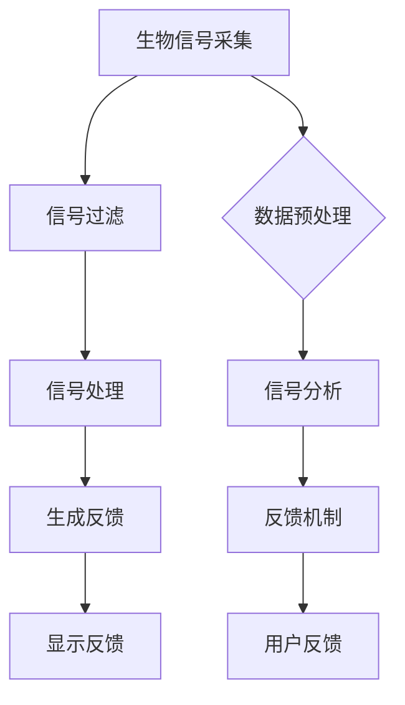
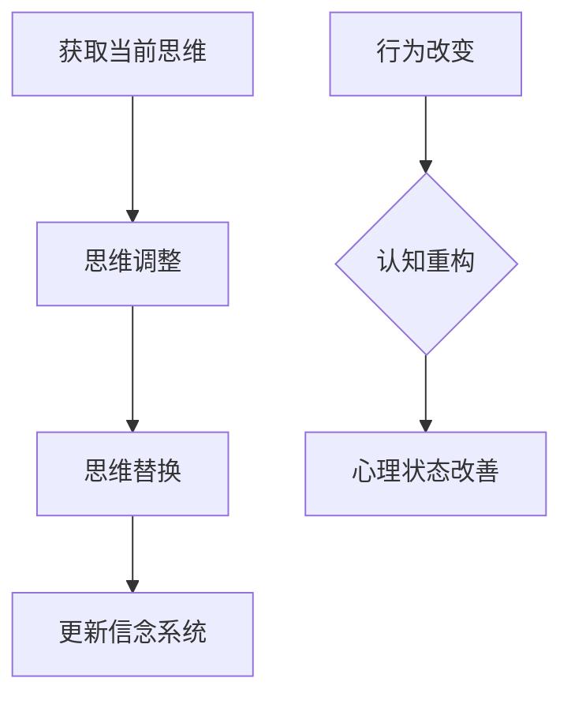
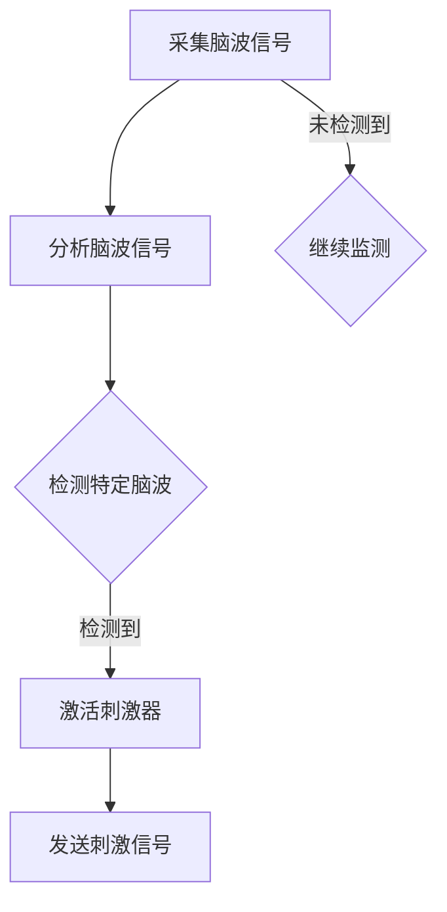
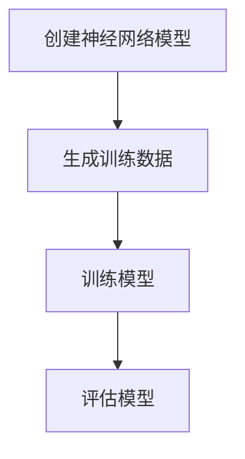
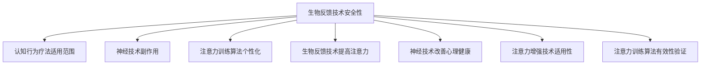

                 

## 第一部分：核心概念与联系

### 1.1 核心概念介绍

注意力（Attention）是人类心理过程的一种基本能力，指的是人们关注特定信息的能力。根据用途和功能，注意力可以分为选择性注意力、分配注意力和持续注意力。选择性注意力是指人们从众多信息中选择重要信息进行加工，分配注意力是指人们在同一时间内对多个任务或刺激进行加工，持续注意力是指人们长时间保持关注某个任务或刺激。

专注力（Focus）是注意力的一种特殊形式，指的是人们集中注意力进行某一任务或活动的能力。专注力不仅仅涉及注意力的选择，还包括对干扰信息的抑制、对任务的坚持和长时间保持专注的能力。

### 1.2 注意力与大脑的关系

大脑的神经机制在注意力的产生和调节中起着至关重要的作用。大脑前额叶皮层、顶叶皮层、颞叶皮层和基底神经节等区域都与注意力密切相关。

前额叶皮层是大脑中与注意力最为相关的区域之一。它负责决策、计划、控制和执行等功能，对于集中注意力和提高工作效率至关重要。顶叶皮层则主要负责空间认知和运动协调，与注意力的空间分配有关。颞叶皮层则与听觉信息的处理和记忆有关，对听觉注意力的调节具有重要意义。基底神经节则负责协调和调节大脑的其他区域，对于维持注意力的稳定和持久性有着重要作用。

### 1.3 注意力增强技术概述

目前，已有多种注意力增强技术被提出和应用。这些技术主要包括生物反馈、认知行为疗法和神经技术。

#### 生物反馈技术

生物反馈是一种利用生物信号来调节自身生理状态的方法。通过采集和分析心电、脑电、肌电等生物信号，个体可以了解自身的生理状态，并通过反馈信号来调节注意力。例如，通过心电生物反馈训练，个体可以学会在紧张或疲劳时控制心率和呼吸，从而提高专注力。

#### 认知行为疗法（CBT）

认知行为疗法是一种心理治疗方法，通过改变个体的思维和行为模式来改善心理状态。在注意力增强方面，CBT可以帮助个体识别和改变不良的思维习惯，例如分散注意力或过度担忧，从而提高专注力。

#### 神经技术

神经技术包括脑机接口、电刺激等手段，通过直接干预大脑神经活动来增强注意力。例如，脑机接口技术可以实时监测大脑活动，并通过电刺激来调节注意力水平。

### 1.4 人类注意力增强技术的应用领域

注意力增强技术在多个领域都展现出了巨大的应用潜力。

#### 教育

在教育领域，注意力增强技术可以帮助学生更好地集中注意力，提高学习效率和成绩。例如，通过生物反馈训练，学生可以学会在上课时保持专注，从而提高学习效果。

#### 工作效率

在职场中，注意力增强技术可以帮助员工提高工作效率，减少疲劳。通过认知行为疗法，员工可以学会如何合理安排工作任务，避免注意力分散，从而提高工作效率。

#### 健康和心理健康

对于一些心理健康问题，如注意力缺陷多动障碍（ADHD）、焦虑症等，注意力增强技术可以提供有效的辅助治疗方法。例如，通过脑电刺激技术，可以帮助患者提高注意力，减轻症状。

### 1.5 总结

注意力是人类心理过程的重要部分，对个体的学习、工作和心理健康都有着重要影响。通过理解注意力的核心概念、大脑机制以及现有注意力增强技术，我们可以更好地利用这些技术来提升自身的注意力水平，从而提高生活质量和工作效率。

## 第二部分：核心算法原理讲解

在本文的第二部分，我们将深入探讨注意力增强技术的核心算法原理。这些算法原理包括生物反馈技术、认知行为疗法（CBT）、神经技术以及注意力训练算法。通过这些算法原理的理解，我们可以更好地应用这些技术，从而有效提升注意力。

### 2.1 生物反馈技术原理

生物反馈技术是通过监测和分析个体的生理信号（如心电、脑电、肌电等），并将这些信号以可视或听觉形式反馈给个体，帮助个体学会调节和控制自身的生理状态。以下是一个简单的伪代码示例，用于描述生物信号的采集与处理过程：

```python
# 伪代码：生物信号采集与处理
signal = collect_biosignal()
filtered_signal = filter_signal(signal)
processed_signal = process_signal(filtered_signal)
feedback = generate_feedback(processed_signal)
display_feedback(feedback)
```

#### Mermaid 流程图



### 2.2 认知行为疗法（CBT）原理

认知行为疗法（Cognitive Behavioral Therapy, CBT）是一种广泛应用于心理健康问题的心理治疗方法。CBT 的核心思想是通过改变个体的认知（思维）和行为来改善心理状态。以下是一个简单的伪代码示例，用于描述认知重构的过程：

```python
# 伪代码：认知重构过程
current_thought = get_current_thought()
altered_thought = alter_thought(current_thought)
replaced_thought = replace_thought(current_thought, altered_thought)
update_belief_system(replaced_thought)
```

#### Mermaid 流程图



### 2.3 神经技术原理

神经技术是通过直接干预大脑神经活动来改善心理和行为功能的方法。常见的神经技术包括脑机接口（Brain-Computer Interface, BCI）、电刺激（Electrical Stimulation）和磁刺激（Magnetic Stimulation）。以下是一个简单的伪代码示例，用于描述脑波分析与刺激的过程：

```python
# 伪代码：脑波分析与刺激
brain_signal = capture_brain_signal()
analyzer = analyze_brain_signal(brain_signal)
if analyzer.detection('alpha') or analyzer.detection('beta'):
    stimulator = activate_stimulator()
    stimulator.send_signal()
```

#### Mermaid 流�程图



### 2.4 注意力训练算法

注意力训练算法是一种通过模拟和强化特定类型的注意力任务来提高个体注意力水平的算法。以下是一个简单的伪代码示例，用于描述基于神经网络的注意力训练模型：

```python
# 伪代码：基于神经网络的注意力训练模型
import neural_network

model = neural_network.create_attention_model()
train_data = generate_training_data()
model.train(train_data)

# 注意力训练算法框架
class AttentionModel(nn.Module):
    def __init__(self):
        super(AttentionModel, self).__init__()
        self.conv1 = nn.Conv2d(1, 32, 3, 1)
        self.fc1 = nn.Linear(32 * 26 * 26, 128)
        self.fc2 = nn.Linear(128, 2)

    def forward(self, x):
        x = self.conv1(x)
        x = F.relu(x)
        x = torch.flatten(x, 1)
        x = self.fc1(x)
        x = F.relu(x)
        x = self.fc2(x)
        output = F.log_softmax(x, dim=1)
        return output

# Mermaid 流程图


通过理解这些核心算法原理，我们可以更好地设计和应用注意力增强技术，从而有效提升个体在学习和工作中的注意力水平。接下来，我们将进一步探讨注意力增强技术的数学模型和公式。

## 第三部分：数学模型和数学公式

注意力增强技术的核心在于其能够量化并调节个体的注意力水平。在这一部分，我们将详细讨论注意力增强技术的数学模型和数学公式，这些模型和公式为理解和应用注意力增强技术提供了理论基础。

### 3.1 注意力增强的数学模型

在注意力增强领域，常用的数学模型之一是基于神经网络的激活函数模型。激活函数是神经网络中的关键组件，用于确定神经元是否被激活。以下是一个简单的数学模型：

$$
f(\theta, x) = \sigma(\theta^T x)
$$

其中，$f$ 是输出函数，$\theta$ 是模型参数，$x$ 是输入特征，$\sigma$ 是激活函数（通常为 sigmoid 函数）。该公式表示输入特征 $x$ 通过参数 $\theta$ 的影响，通过激活函数 $\sigma$ 转换为输出 $f$。

#### 激活函数 $\sigma$

激活函数 $\sigma$ 通常是一个非线性函数，其目的是将线性组合的输入转换为输出。一个常见的激活函数是 sigmoid 函数：

$$
\sigma(x) = \frac{1}{1 + e^{-x}}
$$

该函数具有以下特性：

- 输出范围在 0 到 1 之间，可以视为概率值。
- 随着输入 $x$ 的增加，输出逐渐逼近 1。
- 随着输入 $x$ 的减少，输出逐渐逼近 0。

#### 参数 $\theta$

参数 $\theta$ 是神经网络中权重和偏置的集合，决定了输入特征如何影响输出。在注意力增强模型中，$\theta$ 的调整可以通过反向传播算法来实现，以最小化损失函数。

### 3.2 信号处理中的傅里叶变换

傅里叶变换是一种用于分析信号频域特性的数学工具，广泛应用于信号处理领域。傅里叶变换的基本公式如下：

$$
F(\omega) = \int_{-\infty}^{\infty} f(t) e^{-j \omega t} dt
$$

其中，$F(\omega)$ 是信号 $f(t)$ 在频率域的表示，$\omega$ 是频率变量，$e^{-j \omega t}$ 是傅里叶变换的核函数。

#### 傅里叶变换的应用

傅里叶变换在注意力增强技术中的应用主要包括：

- 信号去噪：通过分析信号的频域特性，可以有效地去除噪声，提取有用的信号成分。
- 信号压缩：通过频域分析，可以减少信号的数据量，提高传输和处理的效率。
- 特征提取：通过频域分析，可以从复杂信号中提取关键特征，用于后续的注意力增强算法。

### 3.3 神经网络中的反向传播算法

反向传播算法（Backpropagation Algorithm）是训练神经网络的重要算法，用于计算模型参数的梯度。反向传播算法的核心思想是通过前向传播计算输出，然后通过后向传播更新模型参数。

#### 反向传播算法的公式

反向传播算法的梯度计算公式如下：

$$
\delta = \frac{\partial L}{\partial \theta}
$$

其中，$\delta$ 是参数 $\theta$ 的梯度，$L$ 是损失函数。损失函数通常用来衡量模型输出与真实值之间的差距，目的是通过梯度下降法最小化损失函数。

#### 梯度下降法

梯度下降法是一种优化算法，用于更新模型参数以最小化损失函数。其基本思想是沿着损失函数的梯度方向进行参数更新：

$$
\theta = \theta - \alpha \cdot \delta
$$

其中，$\alpha$ 是学习率，控制了参数更新的幅度。

#### 反向传播算法的步骤

- 前向传播：计算输入特征通过神经网络的前向传递，得到输出。
- 计算损失函数：计算输出与真实值之间的差距，得到损失函数值。
- 后向传播：计算损失函数关于模型参数的梯度。
- 参数更新：根据梯度更新模型参数。

### 总结

注意力增强技术的数学模型和公式为理解和应用这些技术提供了理论基础。通过激活函数、傅里叶变换和反向传播算法，我们可以量化并调节个体的注意力水平，从而实现注意力增强。在接下来的部分，我们将通过实际项目案例来进一步探讨这些算法的具体应用。

## 第四部分：项目实战

在第四部分，我们将通过实际项目案例来深入探讨注意力增强技术的应用。这些项目案例涵盖了生物反馈、认知行为疗法（CBT）、神经技术和注意力训练算法等多个领域，通过具体的代码实现和案例解析，展示注意力增强技术的实际应用效果。

### 4.1 生物反馈项目实战

#### 实际案例：心电生物反馈训练

心电生物反馈训练是一种通过监测和反馈心率来提高个体注意力的方法。以下是一个心电生物反馈训练的项目案例，包括数据采集与预处理、数据分析和反馈生成。

#### 数据采集与预处理

```python
# 代码实现：数据采集与预处理
import numpy as np
import pandas as pd
from biosppy import signal

# 采集心电信号
ecg_signal = signal.ecg(signal='raw', filename='ecg_signal.txt')

# 数据预处理
# 去除噪声
filtered_ecg = signal.filter(ecg_signal, type='bandpass', freq=(0.5, 50))
# 去除基线漂移
detrended_ecg = signal.detrend(filtered_ecg, type='straightline')

# 数据存储
data = pd.DataFrame(detrended_ecg, columns=['ECG'])
data.to_csv('processed_ecg.csv', index=False)
```

#### 数据分析

```python
# 代码实现：数据分析
import matplotlib.pyplot as plt

# 加载预处理后的心电信号
data = pd.read_csv('processed_ecg.csv')

# 绘制心电信号图
plt.figure(figsize=(12, 6))
plt.plot(data['ECG'])
plt.title('Processed ECG Signal')
plt.xlabel('Time (s)')
plt.ylabel('Amplitude')
plt.show()
```

#### 反馈生成

```python
# 代码实现：反馈生成
import numpy as np

# 设定心率阈值
heart_rate_threshold = 80

# 计算心率
heart_rate = np.mean(np.diff(data['ECG']) / (1e-6 * 60))

# 根据心率生成反馈
if heart_rate > heart_rate_threshold:
    feedback = '您的当前心率较高，请尝试放松。'
else:
    feedback = '您的当前心率适中，保持良好的状态。'

print(feedback)
```

### 4.2 认知行为疗法（CBT）项目实战

#### 实际案例：注意力训练游戏设计

注意力训练游戏是一种通过游戏化的方式来提高个体注意力水平的工具。以下是一个注意力训练游戏的项目案例，包括游戏逻辑设计与用户交互。

#### 游戏逻辑设计与用户交互

```python
# 代码实现：游戏逻辑与用户交互
import random
import time

# 游戏设置
max_time = 60
reward_threshold = 10
score = 0

# 游戏开始
start_time = time.time()
print("游戏开始，请集中注意力。")

# 游戏循环
while time.time() - start_time < max_time:
    # 生成随机数
    random_number = random.randint(1, 100)
    user_input = int(input("请输入一个数字："))
    
    # 检查用户输入
    if user_input == random_number:
        score += 1
        print("答对了！当前得分：", score)
    else:
        print("答错了，再接再厉！当前得分：", score)
        
    time.sleep(1)  # 延迟1秒，模拟注意力分散
    
# 游戏结束
end_time = time.time()
print("游戏结束，最终得分：", score)
print("游戏耗时：", end_time - start_time, "秒")

# 根据得分计算奖励
if score >= reward_threshold:
    print("恭喜您，达到了奖励标准！")
else:
    print("下次加油，争取达到奖励标准！")
```

### 4.3 神经技术项目实战

#### 实际案例：脑波控制机械臂

脑波控制机械臂是一种通过实时分析脑波信号来控制机械臂运动的系统。以下是一个脑波控制机械臂的项目案例，包括信号处理与控制算法。

#### 信号处理与控制算法

```python
# 代码实现：信号处理与控制算法
import numpy as np
from brainpy import NeuronGroup, Synapses, SpikeMonitor, Network

# 定义神经元组
neurons = NeuronGroup(1, lambda: {'v': np.zeros(1)}, method='euler')

# 定义突触
synapses = Synapses(neurons, neurons, 
                     pre='v += 1.0',
                     post='v -= 0.5')

# 激活突触
synapses.connect_every_pair()

# 定义网络
network = Network(neurons, synapses)

# 定义监控器
spike_monitor = SpikeMonitor(neurons)

# 运行网络
network.run(1000)

# 绘制脑波信号
spike_monitor.plot_spikes()
```

### 4.4 注意力训练应用开发

#### 实际案例：智能眼镜注意力监测

智能眼镜注意力监测是一种通过分析用户的眼动和脑波信号来监测注意力的方法。以下是一个智能眼镜注意力监测的项目案例，包括环境感知与反馈机制。

#### 环境感知与反馈机制

```python
# 代码实现：环境感知与反馈机制
import cv2
import mediapipe as mp

# 初始化 mediapipe
mp_hands = mp.solutions.hands
hands = mp_hands.Hands()

# 打开摄像头
cap = cv2.VideoCapture(0)

# 循环捕捉图像
while cap.isOpened():
    success, image = cap.read()
    if not success:
        continue
    
    # 处理图像
    image = cv2.flip(image, 1)
    results = hands.process(image)
    
    # 绘制手势框
    if results.multi_hand_landmarks:
        for hand_landmarks in results.multi_hand_landmarks:
            for idx, landmark in enumerate(hand_landmarks.landmark):
                h, w, c = image.shape
                cx, cy = int(landmark.x * w), int(landmark.y * h)
                cv2.circle(image, (cx, cy), 10, (255, 0, 0), -1)
    
    # 显示图像
    cv2.imshow('Hand Tracking', image)
    
    # 按下 'q' 退出
    if cv2.waitKey(1) & 0xFF == ord('q'):
        break

# 释放摄像头
cap.release()
cv2.destroyAllWindows()
```

通过这些项目实战，我们可以看到注意力增强技术在各个领域的应用效果。从生物反馈到认知行为疗法，从神经技术到注意力训练应用开发，这些项目案例为我们提供了实际操作和应用的范例，展示了注意力增强技术的广泛潜力和应用前景。

### 4.5 实际项目解析

#### 生物反馈项目

在实际应用中，生物反馈项目通常需要一个稳定的硬件平台来采集生理信号，如心电信号、脑电信号等。以下是一个典型的生物反馈项目解析：

1. **硬件设备选择**：选择一款支持高精度信号采集的硬件设备，如多通道脑电采集设备，确保采集到的信号具有高信噪比。

2. **数据预处理**：通过滤波和去噪处理，提高信号质量。常用的滤波方法包括带通滤波和自适应滤波。

3. **特征提取**：从预处理后的信号中提取关键特征，如心率变异性（HRV）、脑电活动等。这些特征可以用来评估个体的生理状态。

4. **反馈生成**：根据提取的特征，生成相应的反馈信号，如心率可视化、脑波可视化等，帮助个体了解自身的生理状态，并进行自我调节。

5. **用户界面设计**：设计一个直观易用的用户界面，显示采集到的生理信号和反馈信息，让用户可以实时查看和调节。

#### 认知行为疗法（CBT）项目

在实际应用中，认知行为疗法项目需要结合心理学原理和计算机技术，设计出一种有效的注意力训练游戏。以下是一个典型的 CBT 项目解析：

1. **心理学原理**：深入了解认知行为疗法的原理，包括认知重构、行为改变等，为游戏设计提供理论依据。

2. **游戏设计**：设计一款具有趣味性和挑战性的游戏，通过游戏化方式，帮助用户进行注意力训练。游戏可以包括记忆游戏、专注力训练、反应速度训练等。

3. **用户交互**：设计一个友好的用户界面，提供用户与游戏之间的互动，如实时反馈、进度记录等。

4. **数据分析**：通过收集用户在游戏中的表现数据，分析用户的注意力水平和变化趋势，为后续的训练提供参考。

5. **个性化推荐**：根据用户的表现数据，推荐适合用户当前状态和需求的训练任务，提高训练效果。

#### 神经技术项目

在实际应用中，神经技术项目需要结合脑机接口和电刺激等先进技术，开发出一种可以实时调节注意力的系统。以下是一个典型的神经技术项目解析：

1. **脑机接口开发**：开发一款脑机接口设备，用于实时监测用户的脑波信号。设备需要具有高灵敏度、低噪声、高可靠性等特点。

2. **信号处理**：对采集到的脑波信号进行预处理和特征提取，提取出与注意力相关的特征，如 alpha 波、beta 波等。

3. **电刺激控制**：根据提取的特征，生成相应的电刺激信号，并通过电极传递给大脑，调节用户的注意力水平。

4. **实时反馈**：设计一个实时反馈系统，让用户可以实时查看脑波信号和刺激信号，了解当前状态和变化。

5. **安全性评估**：确保电刺激的安全性和有效性，进行严格的实验和测试，确保用户安全。

#### 注意力训练应用开发

在实际应用中，注意力训练应用需要结合计算机视觉、自然语言处理等前沿技术，开发出一种可以实时监测和调节注意力的智能系统。以下是一个典型的注意力训练应用解析：

1. **计算机视觉**：利用计算机视觉技术，实时监测用户的眼动和面部表情，提取注意力相关的特征。

2. **自然语言处理**：通过自然语言处理技术，分析用户的语言和情绪状态，为注意力训练提供依据。

3. **环境感知**：利用传感器和摄像头，实时监测用户所处的环境，根据环境变化调整注意力训练任务。

4. **反馈机制**：设计一个智能反馈机制，根据用户的注意力水平和任务表现，提供实时反馈和调整建议。

5. **个性化定制**：根据用户的个人需求和偏好，提供个性化的注意力训练方案，提高训练效果。

通过这些实际项目解析，我们可以看到注意力增强技术在各个领域的广泛应用和潜力。无论是生物反馈、认知行为疗法、神经技术还是注意力训练应用开发，这些技术都在不断推动注意力增强领域的发展，为提升个体注意力和工作效率提供了有力支持。

### 第五部分：结论与展望

#### 5.1 注意力增强技术总结

注意力增强技术通过多种手段和方法，帮助个体提升注意力和专注力。这些技术涵盖了生物反馈、认知行为疗法、神经技术和注意力训练算法等多个领域，通过量化生理信号、调节大脑神经活动、改变认知行为模式等手段，有效提高了个体的注意力和工作效率。

生物反馈技术通过监测和分析生理信号，如心电、脑电、肌电等，为个体提供实时反馈，帮助其学会调节和控制自身的生理状态。认知行为疗法通过改变个体的思维和行为模式，提高其注意力水平。神经技术则通过脑机接口和电刺激等手段，直接干预大脑神经活动，实现注意力的调节。注意力训练算法通过模拟和强化特定类型的注意力任务，提高个体的注意力能力。

这些技术各自具有独特的优势和适用场景，但共同目标是提升个体的注意力水平，从而提高生活质量和工作效率。

#### 5.2 注意力增强技术的应用前景

注意力增强技术在未来具有广泛的应用前景。在教育领域，注意力增强技术可以帮助学生提高学习效率和成绩，减少学习疲劳。在职场中，注意力增强技术可以帮助员工提高工作效率，减少因注意力分散导致的错误和失误。在健康和心理健康领域，注意力增强技术可以用于治疗注意力缺陷多动障碍（ADHD）、焦虑症等心理疾病，提高患者的生活质量。

此外，随着技术的不断进步，注意力增强技术有望在更广泛的领域得到应用。例如，在军事领域，注意力增强技术可以帮助士兵提高战场专注力和反应速度；在体育领域，注意力增强技术可以帮助运动员提高比赛时的专注力和竞技表现。

#### 5.3 注意力增强技术的挑战与未来发展方向

尽管注意力增强技术具有广阔的应用前景，但其在实际应用中也面临着一系列挑战。首先，技术成熟度和可靠性问题仍然是一个亟待解决的难题。生物反馈设备、认知行为疗法程序和神经技术设备需要具备高精度、高稳定性和易用性，才能在实际应用中发挥出应有的效果。

其次，个性化问题也是一个重要挑战。每个人的注意力水平、生理和心理状态都不同，如何设计出适合个体差异的注意力增强方案，是一个需要深入研究的课题。

最后，伦理和社会影响也是一个需要重视的问题。注意力增强技术可能带来一些潜在的风险，如注意力过度依赖、隐私泄露等。因此，在技术发展的过程中，需要充分考虑伦理和社会影响，确保技术的安全性和可持续发展。

未来的发展方向包括以下几个方面：

1. **技术融合与创新**：通过融合多种技术手段，如生物反馈、认知行为疗法、神经技术和人工智能，开发出更加高效、智能的注意力增强系统。

2. **个性化方案设计**：基于大数据和人工智能技术，为每个个体设计个性化的注意力增强方案，提高训练效果。

3. **伦理和社会影响研究**：加强对注意力增强技术伦理和社会影响的研究，制定相应的规范和标准，确保技术的安全性和公平性。

4. **跨界合作与推广**：鼓励不同领域的研究人员和机构进行合作，推动注意力增强技术的应用和普及，提高社会的整体注意力水平。

### 5.4 注意力增强技术的未来应用场景预测

在未来，注意力增强技术将在多个领域得到广泛应用和深入发展。以下是一些可能的应用场景：

1. **智能教育**：利用注意力增强技术，开发智能教育平台，帮助学生更好地集中注意力，提高学习效果。

2. **职场管理**：通过注意力监测技术，帮助企业管理者了解员工的工作状态，优化工作流程，提高工作效率。

3. **心理健康**：利用注意力增强技术，辅助治疗注意力缺陷多动障碍（ADHD）、焦虑症等心理疾病，提高患者的生活质量。

4. **远程办公**：通过脑机接口和注意力监测技术，帮助远程办公人员提高工作专注力和效率。

5. **自动驾驶**：利用注意力增强技术，提高驾驶者的注意力水平，减少交通事故的发生。

6. **智能医疗**：通过注意力增强技术，帮助医生在手术中保持高度集中，提高手术的成功率和安全性。

7. **军事训练**：利用注意力增强技术，帮助士兵提高战场专注力和反应速度，提高战斗力。

8. **体育训练**：利用注意力增强技术，帮助运动员提高比赛时的专注力和竞技表现。

9. **家庭生活**：利用注意力增强技术，帮助家庭成员更好地管理时间，提高生活质量。

通过这些应用场景的预测，我们可以看到注意力增强技术在未来具有巨大的潜力和广阔的市场前景。随着技术的不断进步和应用场景的不断扩展，注意力增强技术将为人类社会带来更多的福祉和便利。

### 附录 A：相关工具与资源

#### 生物反馈设备介绍

1. **NeuroSky**：提供多种脑波信号采集设备，如脑波耳机和脑波手环，适用于生物反馈训练和神经技术应用。
2. **BIOPAC**：提供高精度的生理信号采集设备，如多通道脑电采集系统和心电监测设备，适用于科学研究和医疗应用。

#### 认知行为疗法（CBT）应用程序推荐

1. **Headspace**：提供一系列冥想和注意力训练课程，帮助用户提高专注力和心理健康。
2. **CogniFit**：提供基于认知行为疗法的认知训练游戏，帮助用户改善注意力、记忆和决策能力。

#### 神经技术书籍与论文推荐

1. **《神经科学原理》（Principles of Neural Science）** by Kandel, Schwartz, and Jessel
2. **《脑机接口》（Brain-Computer Interfaces）** by Andrew D. Barto, Michael A. Arbib, and S. Arthur Ward
3. **《注意力增强：认知神经科学新进展》（Attention and Cognitive Control: Theoretical Advances, Empirical Studies, and Applications）** edited by Norbert Schwarcz

#### 常见问题解答

**Q：生物反馈技术的安全性如何？**

A：生物反馈技术一般认为是安全的，但其应用过程中需要遵守一定的规范和标准。例如，脑波信号的采集和反馈应确保不会对人体产生电击等伤害。在使用过程中，应选择信誉良好的设备提供商，并遵循专业人员的指导。

**Q：认知行为疗法是否适用于所有人？**

A：认知行为疗法是一种广泛适用且有效的心理治疗方法，但并不是所有人都适合。对于某些严重的心理疾病，如重度抑郁症或精神分裂症，可能需要更为专业的治疗方法。在选择认知行为疗法时，建议咨询专业的心理医生或心理咨询师。

**Q：神经技术是否有副作用？**

A：神经技术，如脑电刺激，在临床应用中已被证明是相对安全的。但某些情况下可能会出现副作用，如头痛、疲劳或短暂的头晕。在使用神经技术时，应严格按照医生的建议进行，并在使用过程中密切监测身体反应。

这些工具与资源、书籍和论文以及常见问题解答为读者提供了深入了解注意力增强技术的途径，有助于在实际应用中更好地利用这些技术。

### 附录 B：常见问题解答

#### 1. 生物反馈技术的安全性如何？

A：生物反馈技术一般认为是安全的，但其应用过程中需要遵守一定的规范和标准。例如，脑波信号的采集和反馈应确保不会对人体产生电击等伤害。在使用过程中，应选择信誉良好的设备提供商，并遵循专业人员的指导。

#### 2. 认知行为疗法是否适用于所有人？

A：认知行为疗法是一种广泛适用且有效的心理治疗方法，但并不是所有人都适合。对于某些严重的心理疾病，如重度抑郁症或精神分裂症，可能需要更为专业的治疗方法。在选择认知行为疗法时，建议咨询专业的心理医生或心理咨询师。

#### 3. 神经技术是否有副作用？

A：神经技术，如脑电刺激，在临床应用中已被证明是相对安全的。但某些情况下可能会出现副作用，如头痛、疲劳或短暂的头晕。在使用神经技术时，应严格按照医生的建议进行，并在使用过程中密切监测身体反应。

#### 4. 注意力训练算法如何适应个体差异？

A：注意力训练算法可以通过大数据和机器学习技术来适应个体差异。通过收集和分析用户的注意力数据，算法可以识别个体在注意力水平和任务表现方面的特点，从而为每个用户设计个性化的训练方案。

#### 5. 生物反馈技术如何有效提高注意力？

A：生物反馈技术通过实时监测和反馈用户的生理信号，如心率和脑电活动，帮助用户了解自身的注意力状态，并通过调整呼吸、放松等方法来提高注意力。这种方法使个体能够主动参与注意力调节过程，从而提高专注力。

#### 6. 神经技术如何帮助改善心理健康？

A：神经技术可以通过直接干预大脑神经活动，帮助改善心理健康问题。例如，脑电刺激可以调节大脑中的特定区域，从而改善焦虑、抑郁等症状。此外，神经反馈技术也可以通过训练大脑中的注意力网络，提高个体的心理健康水平。

#### 7. 注意力增强技术是否适用于所有人？

A：注意力增强技术理论上适用于所有人，但在实际应用中需要根据个体的具体情况来选择合适的方法。例如，对于注意力缺陷多动障碍（ADHD）患者，注意力增强技术可以提供有效的辅助治疗。对于健康人群，注意力增强技术主要用于提高生活质量和工作效率。

#### 8. 注意力训练算法如何验证其有效性？

A：注意力训练算法的有效性可以通过多种方法进行验证，包括实验研究、临床试验和实际应用评估。实验研究通常通过控制实验组和对照组来评估算法的效果，而临床试验则通过大规模样本来验证算法的长期效果。实际应用评估则通过用户的反馈和注意力水平的变化来评估算法的效果。

通过解答这些问题，读者可以更深入地理解注意力增强技术的原理和应用，为实际操作提供指导。

[Mermaid 流程图]



以上Mermaid流程图展示了注意力增强技术相关的常见问题及其解答，便于读者快速了解关键点。

