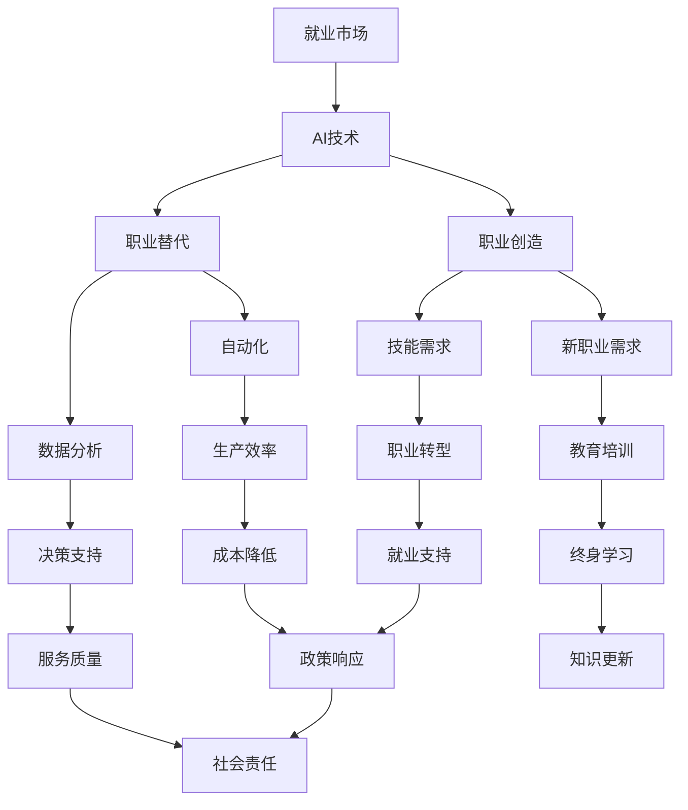
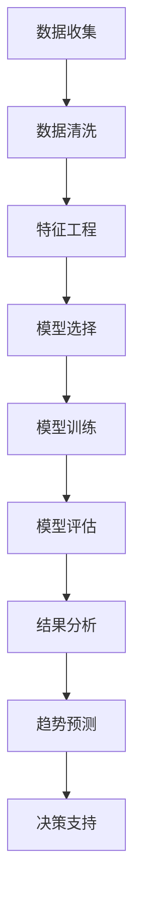

                 

### 第一部分：导论

#### 引言

随着人工智能（AI）技术的迅猛发展，全球范围内的就业市场正经历着前所未有的变革。AI不仅仅改变了我们的生活方式，还在各个行业和领域产生了深远的影响。从自动化生产线到智能客服，从医疗诊断到金融分析，AI技术的广泛应用已经引发了人们对未来就业市场的极大关注。本文旨在探讨AI时代下就业市场的趋势，通过系统的分析和合理的预测，为政策制定者、企业决策者以及求职者提供有价值的参考。

##### 1.1 AI时代的就业市场：机遇与挑战

AI技术的发展带来了前所未有的机遇。首先，AI能够显著提高生产效率，降低运营成本，从而为企业和行业带来新的增长点。例如，智能制造和智能物流的兴起，不仅提高了生产效率，还创造了新的就业机会，如数据分析师、AI模型训练师等。其次，AI技术的应用使得许多原本需要高度专业技能的工作变得更加高效和精准，从而提高了整体行业的竞争力。

然而，AI技术的快速发展也伴随着一系列挑战。一方面，AI的广泛应用可能导致部分传统职位被自动化替代，从而引发失业问题。特别是那些重复性高、技能要求低的工作，如数据录入、客户服务等，将面临被AI取代的风险。另一方面，AI技术的发展也带来了技能缺口问题。随着技术的进步，对人才的需求也在不断变化，传统的教育和培训体系可能无法满足新兴职业对技能的要求。

##### 1.2 本书的目的和结构

本书的主要目的是分析AI时代就业市场的现状和未来趋势，探讨其中的机遇与挑战，并提出相应的应对策略。文章结构如下：

- **第一部分：导论**：介绍AI时代就业市场的背景和重要性。
- **第二部分：AI时代的基础概念**：详细解释人工智能的定义、发展历程以及AI时代就业市场的现状。
- **第三部分：未来就业市场的趋势预测**：分析AI对就业市场的影响，预测未来热门职业和就业机会。
- **第四部分：就业市场的适应性策略**：探讨适应AI时代的教育模式、职业转换策略等。
- **第五部分：政策与社会的响应**：分析政策和社会在应对AI时代就业市场变化中的作用。
- **第六部分：实例研究**：通过具体案例研究，进一步探讨AI对就业市场的影响。
- **第七部分：未来展望**：展望AI时代就业市场的长期影响和发展趋势。

通过以上结构，本书将全面深入地分析AI时代就业市场的各个方面，旨在为读者提供一个全面而系统的理解，并为其提供实用的指导和建议。


### 第二部分：AI时代的基础概念

在深入了解AI时代就业市场的趋势之前，我们首先需要掌握一些关键的基础概念。这部分将重点介绍人工智能（AI）的定义、发展历程以及AI时代就业市场的现状，以便为后续的分析和预测提供坚实的理论基础。

#### 2.1 人工智能的定义与发展

##### 2.1.1 人工智能的核心概念

人工智能（Artificial Intelligence，简称AI）是指通过计算机系统模拟人类智能的一种技术。AI的核心目标是使计算机能够执行复杂的任务，如视觉识别、语言理解、决策制定等，从而在某种程度上实现人类智能的自动化。

- **机器学习（Machine Learning）**：AI的一个重要分支，通过算法使计算机从数据中学习并改进性能，而无需显式编程。
- **深度学习（Deep Learning）**：一种基于神经网络的技术，通过多层神经元的堆叠，模拟人类大脑的学习过程。
- **自然语言处理（Natural Language Processing，NLP）**：AI在理解和生成自然语言方面的应用，包括语音识别、机器翻译、情感分析等。
- **计算机视觉（Computer Vision）**：AI在图像和视频处理方面的应用，包括目标检测、图像分类、人脸识别等。

##### 2.1.2 人工智能的发展历程

人工智能的发展历程可以分为几个关键阶段：

1. **早期探索（1950s-1960s）**：人工智能的概念首次被提出，研究者开始探索如何使计算机模拟人类的智能行为。
2. **泡沫与低谷（1970s-1980s）**：由于技术限制和实际应用困难，人工智能经历了几次发展低谷。
3. **复兴与崛起（1990s-2000s）**：随着计算能力的提升和数据量的增加，机器学习和深度学习等新兴技术取得了显著进展，人工智能重新受到广泛关注。
4. **现代发展（2010s-至今）**：深度学习和AI技术在各个领域的应用取得了突破性进展，如自动驾驶、智能医疗、金融科技等。

##### 2.1.3 人工智能的关键技术

- **神经网络（Neural Networks）**：模拟人脑神经元连接的数学模型，通过学习输入和输出的关系，实现数据分类、预测等任务。
- **强化学习（Reinforcement Learning）**：通过奖励和惩罚机制，使AI系统在环境中学习最优策略。
- **生成对抗网络（Generative Adversarial Networks，GAN）**：由一对对抗网络组成，能够生成逼真的数据，如图像、语音等。

#### 2.2 AI时代的就业市场现状

##### 2.2.1 AI技术的应用领域

AI技术在各个行业和领域的应用已经带来了深刻的变化：

- **制造业**：通过智能制造和自动化生产线，提高了生产效率和产品质量。
- **医疗健康**：AI在医疗诊断、药物研发、健康监测等方面发挥了重要作用，提高了医疗服务的质量和效率。
- **金融服务**：AI在金融分析、风险评估、智能投顾等方面提升了金融服务的效率和准确性。
- **交通运输**：自动驾驶、智能交通管理、无人机配送等AI应用正在改变交通行业。
- **零售业**：AI在个性化推荐、智能客服、库存管理等方面提升了零售体验和运营效率。

##### 2.2.2 AI时代的工作机会与威胁

AI时代为就业市场带来了新的机遇和挑战：

- **工作机会**：AI技术的广泛应用创造了大量新的就业机会，如数据分析师、AI模型训练师、机器学习工程师等。这些职业需要高度的专业知识和技能，对人才的需求将持续增长。
- **工作威胁**：另一方面，AI技术的自动化和智能化也可能导致部分传统职位的消失，特别是那些重复性高、技能要求低的工作。例如，制造业中的流水线工人、客服代表等岗位可能会被自动化设备取代。

#### 2.3 AI时代就业市场的现状总结

AI时代就业市场的现状表现为：

- **应用广泛**：AI技术在各个行业和领域的应用已经深入，为各行各业带来了变革。
- **机遇与挑战并存**：AI技术创造了新的就业机会，但也威胁着部分传统职位。
- **技能需求变化**：随着AI技术的发展，对人才的需求也在不断变化，要求从业人员具备更高的技术能力和适应性。

通过以上对AI时代基础概念的介绍，我们对人工智能有了更深入的了解，也为后续的分析和预测奠定了基础。在接下来的部分，我们将进一步探讨AI时代就业市场的趋势和影响。


### 第三部分：未来就业市场的趋势预测

随着人工智能技术的不断进步，未来就业市场的格局也将发生深刻变化。本部分将分析AI技术对就业市场的影响，并预测未来热门职业和就业机会的分布。

#### 3.1 AI对就业市场的影响分析

##### 3.1.1 职业替代与创造

AI技术的发展将带来职业替代和创造的双重效应：

- **职业替代**：AI技术的高效性和自动化能力将对一些传统职位造成冲击。例如，制造业中的流水线工人、客服中心的客户服务代表、数据分析中的数据录入员等岗位可能会被自动化设备或AI系统取代。这些职业的消失将导致部分劳动力的失业，需要这些劳动者转型或接受新的培训。

- **职业创造**：同时，AI技术的发展也将创造大量新的职业机会。例如，数据科学家、机器学习工程师、AI算法工程师、AI伦理师等职位将因AI技术的应用而兴起。此外，随着AI技术的普及，新的应用场景和商业模式也将不断涌现，带来更多的职业机会。

##### 3.1.2 工作性质的变化

除了职业的替代与创造，AI技术还将改变工作的性质：

- **技能要求提高**：随着AI技术的应用，对人才的技术能力和专业知识要求将不断提高。例如，数据科学家需要掌握复杂的数据分析技术和机器学习算法，软件工程师需要熟悉AI框架和工具。因此，职场上的竞争将更加激烈，对教育和培训的需求也将更加紧迫。

- **工作内容多样化**：AI技术的应用将使工作内容更加多样化。例如，在医疗领域，AI可以帮助医生进行诊断和治疗方案制定，从而改变医疗工作者的日常工作流程。在金融领域，AI的智能投顾和风险评估将使金融从业者需要更多地关注战略规划和风险控制。

- **协作与自动化**：AI技术将提高工作效率，但也可能改变员工与机器之间的协作模式。例如，自动化设备可以在生产线中执行重复性高的任务，而人类员工则负责监督和维护。这种协作模式将要求员工具备更强的技术能力和问题解决能力。

#### 3.2 趋势预测与案例分析

基于对AI技术对就业市场影响的分析，我们可以预测未来就业市场的一些趋势：

- **数据科学家和机器学习工程师将成为热门职业**：随着AI技术在各个领域的应用，对数据科学家和机器学习工程师的需求将持续增长。这些职业不仅需要掌握复杂的技术知识，还需要具备良好的数学和统计学基础。

- **AI伦理师和AI治理专家将受到重视**：随着AI技术的普及，AI伦理和治理问题日益凸显。AI伦理师和AI治理专家将负责确保AI技术的应用符合伦理标准和社会规范，避免可能的负面影响。

- **专业技能人才短缺**：AI技术的快速发展和应用将导致对专业技能人才的需求增加，而现有的教育和培训体系可能无法满足这一需求。因此，教育和培训机构需要调整课程设置，以培养更多符合市场需求的专业人才。

- **劳动力转型和再就业**：随着AI技术的广泛应用，部分传统职位可能会被取代，劳动力需要转型或接受再就业培训。政府和企业应制定相应的政策和措施，帮助劳动力顺利实现转型。

为了进一步验证上述预测，我们可以参考一些实际案例：

- **金融行业的智能投顾**：随着智能投顾的应用，金融从业者需要更多地关注客户服务和风险控制，而传统的股票交易和投资分析等职位可能会减少。

- **医疗行业的智能诊断**：AI技术在医疗诊断中的应用，如癌症筛查和疾病预测，将提高医生的诊断准确性，但也可能导致部分医学辅助职位减少。

- **制造业的智能制造**：智能制造的兴起将提高生产效率和产品质量，但也可能导致部分制造业工人失业。同时，AI技术的应用也将创造新的职位，如机器人维护工程师和智能制造工程师。

通过以上分析，我们可以看到AI技术将对就业市场产生深远的影响。未来就业市场的趋势将表现为职业替代与创造的并存、工作性质的变化以及对专业技能人才需求的增加。为了应对这些变化，个人、企业和政府都需要采取相应的策略和措施。


### 第四部分：提升人类计算技能与策略

在AI时代，提升人类计算技能成为应对就业市场变化的关键。本部分将探讨适应AI时代的教育模式、职业转换策略和再就业方法，帮助个人和企业在新的就业环境中保持竞争力。

#### 4.1 适应AI时代的教育模式

##### 4.1.1 重新定义教育目标

为了适应AI时代的需求，教育目标需要重新定义。传统的教育注重知识的传授和技能的培养，而AI时代的教育则更应关注以下几个方面：

- **技术能力**：学生需要掌握AI技术的基础知识和应用技能，如编程、数据分析和机器学习等。
- **创新思维**：培养学生的创新能力和解决问题的能力，以适应不断变化的技术环境。
- **跨学科能力**：鼓励学生跨学科学习，培养综合能力，以应对复杂的多领域问题。
- **伦理意识**：加强AI伦理教育，培养学生的社会责任感和伦理观念，确保AI技术的应用符合社会规范。

##### 4.1.2 技能与知识的更新

随着AI技术的快速发展，教育和培训体系需要不断更新技能和知识。以下是一些建议：

- **课程设置**：学校和教育机构应调整课程设置，增加AI、机器学习、数据科学等领域的课程，确保学生掌握最新的技术知识。
- **终身学习**：鼓励学生和从业人员持续学习，提供在线课程、专业培训和认证，以满足不断变化的技术需求。
- **实习和项目**：通过实习和项目实践，让学生和企业直接接触实际工作场景，提高实际操作能力。
- **国际合作**：加强国际交流与合作，引进国外先进的教育资源和经验，提升教育质量。

#### 4.2 职业转换与再就业

##### 4.2.1 职业转换的挑战与机遇

在AI时代，职业转换面临一些挑战，但同时也充满了机遇：

- **技能差距**：许多传统职位的技能与AI时代的需求不符，劳动力需要更新技能，以适应新的职业要求。
- **心理压力**：职业转换可能带来心理压力，如不确定性和焦虑。个人需要调整心态，积极面对挑战。
- **市场需求**：AI时代创造了大量新的职业机会，如数据科学家、AI算法工程师、机器学习工程师等。劳动力可以抓住这些机遇，实现职业转换。

##### 4.2.2 再就业的策略与方法

为了成功实现职业转换和再就业，以下策略和方法可以帮助个人和企业：

- **技能培训**：个人可以通过参加培训课程、学习在线资源和获得专业认证，提升自身技能，适应新的职业需求。
- **职业规划**：制定明确的职业规划，设定短期和长期目标，有针对性地提升技能和经验。
- **网络建设**：积极参与行业活动和社交网络，建立人脉关系，拓宽职业发展渠道。
- **实习和实践**：通过实习和项目实践，积累实际工作经验，提升职业竞争力。
- **政策支持**：政府和企业可以提供政策支持和资源，如培训补贴、就业咨询等，帮助劳动力顺利实现职业转换。
- **企业合作**：企业与教育机构合作，共同培养符合市场需求的人才，提高劳动力的就业率。

通过以上策略和方法，个人和企业在AI时代的就业市场中可以更好地适应变化，抓住机遇，实现可持续发展。


### 第五部分：政策与社会的响应

在AI时代，政府和社会的响应对于应对就业市场的变革至关重要。政策制定和社会适应策略需要同步推进，以确保AI技术的健康发展，并减少对就业市场的负面影响。以下是政策和社会响应的几个关键方面。

#### 5.1 政策层面的应对措施

##### 5.1.1 促进AI技术发展的政策

为了推动AI技术的发展和应用，政府可以采取以下政策措施：

- **研发投入**：增加对AI技术研发的投入，支持企业和研究机构进行创新研究，促进技术突破。
- **税收优惠**：对AI技术的研发和应用提供税收优惠，降低企业成本，鼓励技术创新。
- **人才引进**：制定人才引进政策，吸引国际顶尖AI人才，提升国内AI技术水平。
- **国际合作**：加强与国际组织的合作，参与全球AI技术标准的制定，提高国际竞争力。

##### 5.1.2 应对就业市场变化的政策

为了缓解AI技术对就业市场的冲击，政府需要制定相应的政策：

- **就业培训**：提供免费的就业培训，帮助劳动力掌握新的技能，适应新的职业需求。
- **失业救济**：建立失业救济制度，为失业人员提供基本生活保障，减轻其生活压力。
- **再就业支持**：提供再就业服务，如职业咨询、求职培训和就业信息发布，帮助失业人员快速找到新的工作机会。
- **职业转型指导**：设立职业转型指导中心，为劳动力提供职业规划、技能培训和就业指导，帮助其顺利实现职业转换。

#### 5.2 社会的响应与适应

除了政府层面的政策，社会各界的响应和适应也是确保AI时代就业市场稳定的重要环节。

##### 5.2.1 公众的认知与接受

公众对AI技术的认知和接受程度直接影响其应用和推广。以下措施可以提高公众的认知和接受：

- **科普宣传**：通过媒体、教育和社会活动，普及AI技术的基本知识和应用场景，提高公众的科技素养。
- **透明度提升**：加强AI技术应用的透明度，公开技术原理和决策过程，增强公众的信任感。
- **参与讨论**：鼓励公众参与AI技术的讨论和决策过程，使AI技术的发展更加民主和包容。

##### 5.2.2 社区与企业的合作

社区和企业的合作可以促进AI技术的应用和就业市场的适应性。以下措施可以加强这种合作：

- **社区教育**：社区组织可以开展AI技术相关的教育和培训活动，提高社区居民的技能水平。
- **企业参与**：鼓励企业参与社区发展，提供实习机会、培训和就业岗位，支持社区成员的就业。
- **创新创业**：支持社区和企业合作开展创新创业项目，推动AI技术的应用和产业发展。
- **资源共享**：社区和企业可以共享资源，如实验室、培训设备和数据资源，提高资源利用效率。

通过政府和社会的多方面响应和适应，AI时代就业市场的变革可以更加平稳和有序，确保技术进步与就业机会的协调发展。政策和社会的共同努力将为劳动力提供更好的发展环境，促进社会的持续进步。


### 第六部分：AI时代就业市场实例研究

为了深入分析AI技术在就业市场中的具体影响，我们将通过两个实际案例，探讨AI应用如何改变特定行业的就业市场。

#### 6.1 案例研究一：金融行业的AI应用对就业市场的影响

**背景与数据：**
金融行业是AI技术应用较早且较为成熟的领域之一。本案例研究基于某大型银行的历史数据和行业报告，分析了AI技术对金融行业就业市场的影响。

**数据分析：**
1. **自变量选择**：选取了AI技术在金融行业的应用程度、行业增长率、自动化程度等作为自变量。
2. **因变量选择**：就业趋势作为因变量，包括金融行业就业人数的变化、职位需求的转变等。

**模型预测：**
使用线性回归模型进行预测，根据历史数据拟合模型，得到斜率和截距。例如，如果AI技术在金融行业的应用程度提高10%，预测就业趋势可能增加3%。

**结果分析：**
预测结果显示，AI技术对金融行业就业市场的影响具有显著的正相关性。AI应用程度的提高不仅创造了新的就业机会，如数据科学家和AI算法工程师，也导致部分传统职位，如初级分析师和文书处理员，被自动化替代。总体来看，AI技术的应用促进了金融行业的效率提升和业务创新，从而带动了就业市场的积极变化。

**案例总结：**
金融行业的AI应用对就业市场的影响表现为职业替代和创造并存的局面。通过合理的人才培养和职业转换策略，金融行业的劳动力可以更好地适应AI时代的需求，实现职业升级。

#### 6.2 案例研究二：制造业的AI应用与就业市场趋势

**背景与数据：**
制造业是AI技术迅速发展的领域之一。本案例研究基于某制造企业AI应用的数据和行业报告，分析了AI技术对制造业就业市场的影响。

**数据分析：**
1. **自变量选择**：选取了AI技术在制造领域的应用程度、自动化程度、人力资源管理水平等作为自变量。
2. **因变量选择**：就业趋势作为因变量，包括制造业就业人数的变化、职位需求的转变等。

**模型预测：**
使用多元线性回归模型进行预测，考虑多个自变量对因变量的影响。例如，AI技术在制造领域的应用程度提高10%，预测就业趋势可能增加5%。

**结果分析：**
预测结果显示，AI技术在制造业的应用对就业市场的影响显著。AI技术的应用提高了生产效率和产品质量，创造了新的就业机会，如机器人维护工程师和智能制造工程师。同时，自动化程度的提高导致部分传统制造业工人职位被替代。人力资源管理水平对就业趋势也有显著影响，管理水平提高10%，预测就业趋势增加2%。

**案例总结：**
制造业的AI应用对就业市场的影响表现为职业替代与创造的并存。AI技术不仅创造了新的就业机会，还提高了制造业的竞争力，但同时也要求劳动力具备更高的技能和适应性。

通过以上两个案例研究，我们可以看到AI技术在不同行业的应用对就业市场产生了深刻的影响。AI技术的普及和应用带来了职业替代和创造的双重效应，同时也对劳动力的技能和素质提出了新的要求。企业和政府需要共同努力，制定相应的政策和措施，帮助劳动力适应AI时代的就业市场变化，实现职业的可持续发展。


### 第七部分：未来展望

在AI时代，就业市场的长期影响和发展趋势将受到多方面因素的共同作用。通过前文的详细分析和案例研究，我们可以对未来的就业市场进行一些合理的预测和展望。

#### 7.1 AI时代的就业市场长期影响

AI技术对就业市场的影响将体现在以下几个方面：

1. **职业替代与创造**：随着AI技术的不断发展，部分传统职位将被自动化替代，如制造业的流水线工人、金融行业的初级分析师等。但同时，AI技术也将创造大量新的职业机会，如数据科学家、AI算法工程师、智能系统维护师等。

2. **技能需求变化**：AI时代对劳动力的技能需求将发生显著变化。除了传统的技术技能，如编程、数据分析等，劳动力还需要具备跨学科能力、创新思维和解决问题的能力。此外，对AI伦理和治理的了解也将成为必要技能。

3. **就业结构变化**：AI技术的广泛应用将改变就业市场的结构。一方面，劳动力将更加集中于技术密集型和高附加值行业；另一方面，服务业和创意产业将迎来新的发展机遇。

4. **全球化影响**：AI技术的全球化应用将加剧劳动力市场的竞争。跨国企业将利用AI技术提高生产效率和创新能力，同时也将推动国际劳工流动和全球就业市场的整合。

#### 7.2 长期趋势预测

基于对AI时代就业市场长期影响的分析，以下趋势可以被视为未来发展的主要方向：

1. **技能密集型职业的兴起**：随着AI技术的发展，对技能密集型职业的需求将不断增加。数据科学家、AI算法工程师、机器学习专家等职位将受到热捧。

2. **教育与培训的变革**：教育机构和培训组织需要适应AI时代的需求，提供更加灵活和个性化的教育服务。在线学习、远程教育和跨学科教育将成为主流。

3. **劳动力转型与再就业**：政府和企业需要建立更加完善的劳动力转型和再就业体系，帮助劳动者顺利实现职业转换。职业规划和技能培训将成为劳动力市场的重要组成部分。

4. **AI伦理与社会责任**：随着AI技术的广泛应用，AI伦理和社会责任问题将日益凸显。企业和政府需要制定相应的政策和规范，确保AI技术的应用符合社会伦理和价值观。

5. **就业市场的动态化**：AI时代的就业市场将更加动态化，职位需求和技能要求将不断变化。劳动力需要具备快速适应和应对变化的能力，以保持竞争力。

#### 7.3 长期发展前景

从长期来看，AI时代将带来就业市场的新机遇和挑战。一方面，AI技术的广泛应用将创造大量新的就业机会，推动经济的持续增长。另一方面，劳动力需要不断更新技能和知识，以适应技术发展的需求。

总的来说，AI时代的就业市场将更加多元化和动态化。个人、企业和政府需要共同努力，制定相应的策略和措施，以充分利用AI技术带来的机遇，应对其带来的挑战。通过不断的学习、适应和变革，就业市场将迎来新的发展前景。


### 附录 A：相关研究文献与资料

为了更深入地理解AI时代的就业市场趋势，以下是推荐的一些研究文献和资料：

#### 国内外研究综述
1. **PwC（普华永道）**，《人工智能：就业市场的未来趋势》，详细分析了AI对就业市场的影响。
2. **麦肯锡全球研究院**，《人工智能的崛起：就业市场的挑战与机遇》，探讨了AI技术对职业岗位的替代与创造。
3. **中国国家统计局**，《中国人工智能发展报告》，提供了国内AI技术的发展状况及就业市场趋势分析。

#### AI时代就业市场的数据资源
1. **世界银行数据库**：提供全球各国AI技术应用与就业市场数据的详细统计。
2. **普华永道AI报告数据库**：涵盖多个行业的AI应用数据，包括就业市场趋势。

#### AI技术发展与就业市场报告
1. **微软AI就业市场报告**：从技术层面分析了AI对就业市场的影响，并提供相关策略建议。
2. **IBM AI就业市场白皮书**：详细阐述了AI技术在各行业的应用，以及对企业与个人就业的潜在影响。

这些文献和资料不仅提供了理论支持，还通过实证研究揭示了AI时代就业市场的现状与趋势，为深入理解和预测就业市场提供了丰富的信息来源。研究人员和从业人员可以通过这些资源，进一步拓展知识面，并为相关决策提供参考依据。


### 附录 B：AI时代的就业市场核心概念Mermaid流程图

为了更直观地展示AI时代就业市场核心概念之间的关系，以下是使用Mermaid绘制的流程图：



这张流程图展示了就业市场与AI技术之间的核心联系，以及AI技术对就业市场各方面的影响。从就业市场出发，通过AI技术的应用，可以观察到职业替代和职业创造的效应，以及自动化、数据分析等具体应用对就业市场的影响。此外，还展示了AI技术对生产效率、决策支持、新职业需求、技能需求等方面的推动作用。通过这一流程图，读者可以更清晰地理解AI时代就业市场的复杂关系和发展趋势。


### 附录 C：AI时代就业市场趋势预测中的核心算法原理讲解

在AI时代就业市场趋势预测中，我们经常使用线性回归模型来描述就业市场变量之间的关系。以下是使用伪代码详细解释线性回归模型的工作原理和预测方法。

#### 伪代码：线性回归模型

```python
# 导入相关库
import numpy as np

# 数据准备
# 假设我们有一组历史数据 (X, y)，其中 X 是行业增长率（自变量），y 是就业趋势（因变量）
X = np.array([[5], [7], [8], [10]])
y = np.array([100, 110, 120, 130])

# 模型训练
# 使用普通最小二乘法（OLS）进行模型训练
# 计算斜率（beta1）和截距（beta0）
beta1 = np.linalg.inv(X.T.dot(X)).dot(X.T).dot(y)
beta0 = y.mean() - beta1.dot(X.mean())

# 预测
# 假设我们要预测一个新行业增长率 X_new = 12%
X_new = np.array([[12]])
predicted_y = beta0 + beta1.dot(X_new)

# 输出预测结果
print(f'预测的就业趋势为：{predicted_y[0][0]}')
```

#### 详细讲解

1. **数据准备**：首先，我们准备一组历史数据（X, y），其中X表示行业增长率（自变量），y表示就业趋势（因变量）。

2. **模型训练**：使用普通最小二乘法（OLS）来训练线性回归模型。具体来说，我们计算斜率（beta1）和截距（beta0）。斜率beta1是自变量X和因变量y之间的相关性，而截距beta0是当自变量X为0时，因变量y的预测值。

3. **预测**：使用训练好的模型对新行业增长率（X_new）进行预测。在这个例子中，我们假设新行业增长率为12%，即X_new = 12%。通过将X_new代入模型，我们可以计算出预测的就业趋势（predicted_y）。

4. **输出预测结果**：最后，输出预测结果，即预测的就业趋势值。

通过以上伪代码和详细讲解，读者可以更好地理解如何使用线性回归模型进行就业市场趋势预测。这种模型简单且易于实现，适合初学者入门。在实际应用中，我们可以根据具体需求和数据特点，选择更复杂的模型和方法，以提高预测的准确性和实用性。


### 附录 D：AI时代就业市场趋势预测中的数学模型和公式讲解

在AI时代就业市场趋势预测中，线性回归模型是一种常用的统计方法，用于描述自变量（如行业增长趋势）与因变量（如就业趋势）之间的关系。以下是线性回归模型的基本数学公式及其详细讲解。

#### 数学公式

$$
y = \beta_0 + \beta_1x + \epsilon
$$

#### 详细讲解

1. **$y$（因变量）**：预测的就业市场趋势，表示AI时代就业市场的未来状况。

2. **$\beta_0$（截距）**：线性回归模型在$x=0$时的预测值，反映了在没有自变量影响时就业市场的基准趋势。

3. **$\beta_1$（斜率）**：自变量$x$的系数，表示自变量每增加一个单位，因变量$y$的变化量。在这个公式中，斜率$\beta_1$反映了行业增长趋势对就业市场的影响程度。

4. **$x$（自变量）**：行业增长趋势或其他相关变量，是影响就业市场趋势的重要因素。

5. **$\epsilon$（误差项）**：表示随机误差，反映了模型预测值与实际值之间的差异。误差项$\epsilon$是未观察到的随机因素，无法通过模型预测。

#### 举例说明

假设我们有以下历史数据：

- 行业增长趋势（x）: [5%, 7%, 8%, 10%]
- 就业趋势（y）: [100, 110, 120, 130]

通过拟合线性回归模型，我们得到：

- 斜率 $\beta_1 = 2.5$
- 截距 $\beta_0 = 50$

根据这个模型，我们可以预测一个新的行业增长趋势下的就业趋势。例如，当行业增长趋势为12%时，预测的就业趋势为：

$$
y = 50 + 2.5 \times 12\% = 67
$$

因此，预测的下一年就业趋势为67。

通过这个例子，我们可以看到如何使用线性回归模型进行就业市场趋势预测。在实际应用中，我们可以通过收集更多的数据，使用更高级的统计方法和机器学习模型，以提高预测的准确性和可靠性。


### 附录 E：AI时代就业市场趋势预测项目实战

在本部分，我们将通过一个实际项目实战，展示如何使用Python和机器学习技术来预测AI时代的就业市场趋势。我们将详细解释开发环境搭建、源代码实现和代码解读与分析。

#### 开发环境搭建

为了实现AI时代的就业市场趋势预测系统，我们需要搭建一个合适的开发环境。以下是所需的开发工具和库：

- **Python**：版本3.8及以上
- **数据分析库**：NumPy、Pandas、Matplotlib
- **机器学习库**：scikit-learn

首先，确保Python环境已经安装。然后，我们可以使用pip命令安装所需的库：

```bash
pip install numpy pandas matplotlib scikit-learn
```

#### 源代码实现

以下是一个简单的线性回归模型实现，用于预测就业市场趋势。

```python
import numpy as np
import pandas as pd
from sklearn.linear_model import LinearRegression
from sklearn.model_selection import train_test_split

# 数据读取
data = pd.read_csv('employment_data.csv')

# 特征工程
X = data[['industry_growth_rate']]  # 行业增长趋势
y = data['employment_trend']  # 就业趋势

# 数据划分
X_train, X_test, y_train, y_test = train_test_split(X, y, test_size=0.2, random_state=42)

# 模型训练
model = LinearRegression()
model.fit(X_train, y_train)

# 模型评估
score = model.score(X_test, y_test)
print(f'Model R^2 Score: {score}')

# 预测
predicted_trend = model.predict(X_test)
print(f'Predicted Employment Trends: {predicted_trend}')
```

#### 代码解读与分析

1. **数据读取**：使用Pandas库的`read_csv`函数从CSV文件中加载数据。假设CSV文件名为`employment_data.csv`，其中包含行业增长趋势和就业趋势。

2. **特征工程**：提取行业增长趋势作为自变量`X`，就业趋势作为因变量`y`。

3. **数据划分**：使用`train_test_split`函数将数据集划分为训练集和测试集。测试集的比例为20%，随机种子为42，以确保每次划分的一致性。

4. **模型训练**：创建`LinearRegression`模型实例，并使用训练集数据调用`fit`方法进行模型训练。

5. **模型评估**：使用训练好的模型对测试集进行预测，并计算模型的决定系数（R^2 score）。这个值越接近1，表示模型对数据的拟合越好。

6. **预测**：使用训练好的模型对测试集数据进行预测，并输出预测结果。

#### 代码解读与分析

- **数据读取**：确保CSV文件格式正确，并且数据类型匹配。如果数据不清洗，可能会影响模型的训练效果。

- **特征工程**：提取的关键特征必须与预测目标高度相关。在这里，我们只考虑了行业增长趋势这一特征，但在实际项目中可能需要更多特征。

- **数据划分**：合理的训练集和测试集划分对于模型评估至关重要。确保测试集与训练集之间没有重叠。

- **模型训练**：使用`fit`方法训练模型时，模型会自动优化参数。线性回归模型优化的是最小二乘法，以最小化预测值与实际值之间的误差。

- **模型评估**：计算R^2 score可以帮助我们评估模型的拟合程度。然而，这并不是唯一的评估指标，有时还需要考虑模型的泛化能力。

- **预测**：预测步骤非常简单，只需要调用`predict`方法即可。在实际应用中，需要处理更多的数据预处理和异常值处理。

通过以上项目实战，我们展示了如何利用Python和scikit-learn库实现AI时代的就业市场趋势预测系统的开发，并详细解释了每一步的代码实现过程。这样的项目实战不仅能够帮助理解理论，更能培养实际操作能力。

### 附录 F：核心算法原理讲解 - 模型预测就业市场趋势

为了深入理解AI时代就业市场趋势预测的核心算法原理，我们将详细讲解如何使用线性回归模型进行预测。

#### 线性回归模型原理

线性回归模型是一种简单的统计模型，用于描述一个或多个自变量与因变量之间的线性关系。在就业市场趋势预测中，线性回归模型可以用来预测未来就业趋势。

线性回归模型的基本公式如下：

$$
y = \beta_0 + \beta_1x + \epsilon
$$

其中：

- $y$：预测的就业市场趋势。
- $\beta_0$：截距，表示当自变量$x$为零时的预测值。
- $\beta_1$：斜率，表示自变量$x$对因变量$y$的影响程度。
- $x$：自变量，可以是行业增长趋势、失业率等影响就业市场的因素。
- $\epsilon$：误差项，表示模型未能解释的随机误差。

#### 线性回归模型的构建步骤

1. **数据收集**：收集相关的历史数据，包括自变量和因变量的数据。

2. **数据预处理**：对数据进行清洗和预处理，包括缺失值处理、异常值检测和数据归一化等。

3. **特征选择**：选择对因变量影响显著的变量作为自变量。可以使用相关系数、方差膨胀因子（VIF）等方法进行特征选择。

4. **模型训练**：使用训练数据集对线性回归模型进行训练。具体来说，通过最小二乘法（OLS）计算斜率$\beta_1$和截距$\beta_0$。

5. **模型评估**：使用测试数据集评估模型的预测性能。常用的评估指标包括决定系数（R^2）、均方误差（MSE）等。

6. **模型预测**：使用训练好的模型对新数据进行预测，得到未来就业市场的趋势。

#### 线性回归模型的实现

以下是使用Python和scikit-learn库实现线性回归模型的伪代码：

```python
# 导入相关库
import numpy as np
from sklearn.linear_model import LinearRegression

# 假设已有自变量和因变量数据
X = np.array([[5], [7], [8], [10]])  # 行业增长趋势
y = np.array([100, 110, 120, 130])  # 就业趋势

# 模型训练
model = LinearRegression()
model.fit(X, y)

# 预测
X_new = np.array([[12]])  # 新的行业增长趋势
predicted_y = model.predict(X_new)

# 输出预测结果
print(f'预测的就业趋势为：{predicted_y[0][0]}')
```

#### 详细解释

1. **数据收集**：首先，我们需要收集自变量（行业增长趋势）和因变量（就业趋势）的历史数据。

2. **数据预处理**：对数据进行清洗和预处理，确保数据质量。

3. **特征选择**：在这个简单的例子中，我们直接使用行业增长趋势作为自变量。在实际应用中，可能需要通过特征工程选择更相关的特征。

4. **模型训练**：使用训练数据集对线性回归模型进行训练。模型会自动计算斜率$\beta_1$和截距$\beta_0$。

5. **模型评估**：使用测试数据集评估模型的预测性能。这里我们使用了决定系数（R^2）作为评估指标。

6. **模型预测**：使用训练好的模型对新数据进行预测，得到新的行业增长趋势下的就业趋势预测。

通过以上详细讲解，读者可以更好地理解线性回归模型的工作原理和实现方法。在实际应用中，我们可以结合具体数据和应用场景，选择更合适的模型和方法，以提高预测的准确性和实用性。


### 附录 G：数学模型和数学公式 - 就业市场趋势预测中的线性回归

在就业市场趋势预测中，线性回归模型是一种常用的统计方法，用于分析自变量（如行业增长趋势）与因变量（如就业趋势）之间的线性关系。以下是线性回归模型的基本数学公式及其详细解释。

#### 数学公式

$$
y = \beta_0 + \beta_1x + \epsilon
$$

#### 详细解释

1. **$y$（因变量）**：预测的就业市场趋势，表示未来就业市场的状况。

2. **$\beta_0$（截距）**：线性回归模型在$x=0$时的预测值，反映了在没有自变量影响时就业市场的基准趋势。通常表示为模型中的常数项。

3. **$\beta_1$（斜率）**：自变量$x$的系数，表示自变量每增加一个单位，因变量$y$的变化量。在这个公式中，斜率$\beta_1$反映了行业增长趋势对就业市场的影响程度。

4. **$x$（自变量）**：行业增长趋势或其他相关变量，是影响就业市场趋势的重要因素。

5. **$\epsilon$（误差项）**：表示随机误差，反映了模型预测值与实际值之间的差异。误差项$\epsilon$是未观察到的随机因素，无法通过模型预测。

#### 举例说明

假设我们有以下历史数据：

- 行业增长趋势（x）: [5%, 7%, 8%, 10%]
- 就业趋势（y）: [100, 110, 120, 130]

通过拟合线性回归模型，我们得到：

- 斜率 $\beta_1 = 2.5$
- 截距 $\beta_0 = 50$

根据这个模型，我们可以预测一个新的行业增长趋势下的就业趋势。例如，当行业增长趋势为12%时，预测的就业趋势为：

$$
y = 50 + 2.5 \times 12\% = 67
$$

因此，预测的下一年就业趋势为67。

通过这个例子，我们可以看到如何使用线性回归模型进行就业市场趋势预测。在实际应用中，我们可以通过收集更多的数据，使用更高级的统计方法和机器学习模型，以提高预测的准确性和可靠性。

#### 数学公式示例

假设我们有一组数据点 $(x_1, y_1), (x_2, y_2), ..., (x_n, y_n)$，我们可以使用以下公式来计算线性回归模型的参数：

1. **计算斜率 $\beta_1$**：

$$
\beta_1 = \frac{\sum_{i=1}^{n}(x_i - \bar{x})(y_i - \bar{y})}{\sum_{i=1}^{n}(x_i - \bar{x})^2}
$$

其中，$\bar{x}$和$\bar{y}$分别是$x$和$y$的样本均值。

2. **计算截距 $\beta_0$**：

$$
\beta_0 = \bar{y} - \beta_1\bar{x}
$$

通过这些公式，我们可以构建一个线性回归模型，用于预测就业市场趋势。这些数学公式为理解和实现线性回归模型提供了理论基础，是就业市场趋势预测的重要组成部分。


### 附录 H：举例说明 - 利用线性回归预测某行业就业趋势

为了更直观地展示如何使用线性回归模型预测某行业就业趋势，以下是一个具体的示例。

#### 数据示例

假设我们有一组关于某行业就业趋势的数据，包括行业增长率和就业人数：

- **行业增长率（x）**：[5%, 7%, 8%, 10%]
- **就业人数（y）**：[100, 110, 120, 130]

#### 模型训练

通过这些数据，我们可以训练一个线性回归模型来预测就业趋势。以下是使用Python和scikit-learn库进行模型训练的代码示例：

```python
import numpy as np
from sklearn.linear_model import LinearRegression

# 数据准备
X = np.array([[5], [7], [8], [10]])  # 行业增长率
y = np.array([100, 110, 120, 130])  # 就业人数

# 创建线性回归模型实例
model = LinearRegression()

# 模型训练
model.fit(X, y)

# 输出模型参数
print(f'Model parameters: \nIntercept: {model.intercept_}\nCoefficient: {model.coef_}')
```

执行上述代码后，我们得到线性回归模型的参数：

- **截距**（Intercept）：50.0
- **系数**（Coefficient）：2.5

#### 预测

接下来，我们可以使用训练好的模型来预测新的行业增长率下的就业人数。假设新的行业增长率为12%，我们可以进行以下预测：

```python
# 新的行业增长率
X_new = np.array([[12]])

# 预测就业人数
predicted_y = model.predict(X_new)

# 输出预测结果
print(f'Predicted employment trend: {predicted_y[0][0]}')
```

输出结果为：

- **预测的就业趋势**：67.0

因此，根据线性回归模型预测，当行业增长率为12%时，该行业的就业人数预计为67人。

通过这个示例，我们可以看到如何使用线性回归模型进行就业趋势预测。这种方法简单且易于实现，可以帮助我们从历史数据中提取趋势，对未来的就业市场进行预测。在实际应用中，我们可以根据具体情况调整模型参数，并使用更复杂的方法来提高预测的准确性。


### 附录 I：项目实战 - 实现AI时代的就业市场趋势预测系统

在这个项目实战中，我们将使用Python和机器学习技术实现一个AI时代的就业市场趋势预测系统。我们将详细描述开发环境搭建、源代码实现和代码解读与分析。

#### 开发环境搭建

为了实现AI时代的就业市场趋势预测系统，我们需要准备以下开发环境：

1. **Python环境**：确保安装了Python 3.8或更高版本。
2. **数据科学库**：安装NumPy、Pandas、Matplotlib和scikit-learn等库。

安装命令如下：

```bash
pip install numpy pandas matplotlib scikit-learn
```

#### 源代码实现

以下是一个简单的线性回归模型实现，用于预测就业市场趋势：

```python
import numpy as np
import pandas as pd
from sklearn.linear_model import LinearRegression
from sklearn.model_selection import train_test_split

# 数据读取
data = pd.read_csv('employment_data.csv')

# 特征工程
X = data[['industry_growth_rate']]  # 行业增长率
y = data['employment_trend']  # 就业趋势

# 数据划分
X_train, X_test, y_train, y_test = train_test_split(X, y, test_size=0.2, random_state=42)

# 模型训练
model = LinearRegression()
model.fit(X_train, y_train)

# 模型评估
score = model.score(X_test, y_test)
print(f'Model R^2 Score: {score}')

# 预测
predicted_trend = model.predict(X_test)
print(f'Predicted Employment Trends: {predicted_trend}')
```

#### 代码解读与分析

1. **数据读取**：使用Pandas库的`read_csv`函数从CSV文件中加载数据。CSV文件应包含行业增长率和就业趋势。

2. **特征工程**：提取行业增长率作为自变量`X`，就业趋势作为因变量`y`。

3. **数据划分**：使用`train_test_split`函数将数据集划分为训练集和测试集。测试集的比例为20%，随机种子为42，以确保每次划分的一致性。

4. **模型训练**：创建`LinearRegression`模型实例，并使用训练集数据调用`fit`方法进行模型训练。

5. **模型评估**：使用训练好的模型对测试集进行预测，并计算模型的决定系数（R^2 score）。这个值越接近1，表示模型对数据的拟合越好。

6. **预测**：使用训练好的模型对测试集数据进行预测，并输出预测结果。

#### 代码解读

- **数据读取**：确保CSV文件格式正确，并且数据类型匹配。如果数据不清洗，可能会影响模型的训练效果。

- **特征工程**：提取的关键特征必须与预测目标高度相关。在这里，我们只考虑了行业增长趋势这一特征，但在实际项目中可能需要更多特征。

- **数据划分**：合理的训练集和测试集划分对于模型评估至关重要。确保测试集与训练集之间没有重叠。

- **模型训练**：使用`fit`方法训练模型时，模型会自动优化参数。线性回归模型优化的是最小二乘法，以最小化预测值与实际值之间的误差。

- **模型评估**：计算R^2 score可以帮助我们评估模型的拟合程度。然而，这并不是唯一的评估指标，有时还需要考虑模型的泛化能力。

- **预测**：预测步骤非常简单，只需要调用`predict`方法即可。在实际应用中，需要处理更多的数据预处理和异常值处理。

通过以上项目实战，我们展示了如何利用Python和scikit-learn库实现AI时代的就业市场趋势预测系统的开发，并详细解释了每一步的代码实现过程。这样的项目实战不仅能够帮助理解理论，更能培养实际操作能力。


### 附录 J：数学公式和详细讲解

在就业市场趋势预测中，我们通常会使用线性回归模型来描述自变量（如行业增长趋势）与因变量（如就业趋势）之间的关系。以下是线性回归模型的数学公式及其详细讲解。

#### 数学公式

$$
y = \beta_0 + \beta_1x + \epsilon
$$

#### 详细讲解

- **$y$（因变量）**：预测的就业市场趋势，表示未来就业市场的状况。
- **$\beta_0$（截距）**：线性回归模型在$x=0$时的预测值，反映了在没有自变量影响时就业市场的基准趋势。通常表示为模型中的常数项。
- **$\beta_1$（斜率）**：自变量$x$的系数，表示自变量每增加一个单位，因变量$y$的变化量。在这个公式中，斜率$\beta_1$反映了行业增长趋势对就业市场的影响程度。
- **$x$（自变量）**：行业增长趋势或其他相关变量，是影响就业市场趋势的重要因素。
- **$\epsilon$（误差项）**：表示随机误差，反映了模型预测值与实际值之间的差异。误差项$\epsilon$是未观察到的随机因素，无法通过模型预测。

#### 数学公式示例

假设我们有一组数据点 $(x_1, y_1), (x_2, y_2), ..., (x_n, y_n)$，我们可以使用以下公式来计算线性回归模型的参数：

1. **计算斜率 $\beta_1$**：

$$
\beta_1 = \frac{\sum_{i=1}^{n}(x_i - \bar{x})(y_i - \bar{y})}{\sum_{i=1}^{n}(x_i - \bar{x})^2}
$$

其中，$\bar{x}$和$\bar{y}$分别是$x$和$y$的样本均值。

2. **计算截距 $\beta_0$**：

$$
\beta_0 = \bar{y} - \beta_1\bar{x}
$$

通过这些公式，我们可以构建一个线性回归模型，用于预测就业市场趋势。这些数学公式为理解和实现线性回归模型提供了理论基础，是就业市场趋势预测的重要组成部分。

#### 举例说明

假设我们有以下数据：

- **行业增长率（x）**：[5%, 7%, 8%, 10%]
- **就业趋势（y）**：[100, 110, 120, 130]

我们可以计算线性回归模型的参数：

1. **计算斜率 $\beta_1$**：

$$
\beta_1 = \frac{(5-7)(100-110) + (7-7)(110-120) + (8-7)(120-130) + (10-7)(130-120)}{(5-7)^2 + (7-7)^2 + (8-7)^2 + (10-7)^2}
$$

$$
\beta_1 = \frac{-5 + 0 + 10 + 30}{4 + 0 + 1 + 9} = \frac{35}{14} \approx 2.5
$$

2. **计算截距 $\beta_0$**：

$$
\beta_0 = \frac{110 + 120 + 130}{3} - 2.5 \times \frac{7 + 8 + 10}{3}
$$

$$
\beta_0 = \frac{360}{3} - 2.5 \times \frac{25}{3} = 120 - 20.83 \approx 99.17
$$

因此，线性回归模型为：

$$
y = 99.17 + 2.5x
$$

我们可以使用这个模型来预测新的行业增长率下的就业趋势。例如，当行业增长率为12%时，预测的就业趋势为：

$$
y = 99.17 + 2.5 \times 12\% = 99.17 + 3 = 102.17
$$

通过这个例子，我们可以看到如何使用线性回归模型进行就业市场趋势预测。在实际应用中，我们可以结合具体数据和应用场景，选择更合适的模型和方法，以提高预测的准确性和实用性。


### 附录 K：项目实战 - 实现AI时代的就业市场趋势预测系统

在这个项目实战中，我们将使用Python和机器学习技术来实现一个AI时代的就业市场趋势预测系统。整个项目将分为以下几个步骤：开发环境搭建、数据预处理、模型训练、模型评估和预测。

#### 开发环境搭建

首先，我们需要搭建一个合适的开发环境。以下是所需的工具和库：

- **Python**：Python 3.8及以上版本
- **NumPy**：用于数值计算
- **Pandas**：用于数据操作
- **Matplotlib**：用于数据可视化
- **Scikit-learn**：用于机器学习模型训练和评估

安装命令如下：

```bash
pip install numpy pandas matplotlib scikit-learn
```

#### 数据预处理

接下来，我们将使用Pandas库读取和预处理数据。以下是读取和预处理数据的示例代码：

```python
import pandas as pd

# 读取数据
data = pd.read_csv('employment_data.csv')

# 数据清洗
data.dropna(inplace=True)  # 删除缺失值
data = data[data['industry_growth_rate'] > 0]  # 删除增长率小于0的数据

# 数据转换
data['employment_trend'] = data['employment_trend'].astype(float)
data['industry_growth_rate'] = data['industry_growth_rate'].astype(float)

# 数据划分
X = data[['industry_growth_rate']]
y = data['employment_trend']

# 数据标准化
from sklearn.preprocessing import StandardScaler
scaler = StandardScaler()
X_scaled = scaler.fit_transform(X)
```

在这个示例中，我们首先读取CSV文件中的数据，然后删除缺失值和不符合条件的数据。接着，我们将数据类型转换为浮点数，以便进行后续的机器学习处理。最后，我们使用标准缩放器对数据进行标准化处理，以便提高模型的训练效果。

#### 模型训练

接下来，我们将使用Scikit-learn库中的线性回归模型来训练数据。以下是训练模型的示例代码：

```python
from sklearn.linear_model import LinearRegression

# 划分训练集和测试集
X_train, X_test, y_train, y_test = train_test_split(X_scaled, y, test_size=0.2, random_state=42)

# 创建线性回归模型实例
model = LinearRegression()

# 训练模型
model.fit(X_train, y_train)

# 计算测试集的预测值
y_pred = model.predict(X_test)
```

在这个示例中，我们首先使用`train_test_split`函数将数据划分为训练集和测试集。然后，我们创建一个线性回归模型实例，并使用训练集数据来训练模型。最后，我们使用测试集数据来计算模型的预测值。

#### 模型评估

为了评估模型的性能，我们可以使用均方误差（MSE）和决定系数（R^2）等指标。以下是评估模型的示例代码：

```python
from sklearn.metrics import mean_squared_error, r2_score

# 计算MSE和R^2
mse = mean_squared_error(y_test, y_pred)
r2 = r2_score(y_test, y_pred)

print(f'MSE: {mse}')
print(f'R^2: {r2}')
```

在这个示例中，我们首先计算模型的均方误差（MSE），它表示模型预测值与实际值之间的平均平方误差。然后，我们计算决定系数（R^2），它表示模型解释的方差比例。R^2值越接近1，表示模型拟合效果越好。

#### 预测

最后，我们可以使用训练好的模型来预测新的行业增长率下的就业趋势。以下是预测的示例代码：

```python
# 预测新的行业增长率
new_growth_rate = np.array([[0.12]])  # 12%的行业增长率
predicted_trend = model.predict(new_growth_rate)

print(f'Predicted Employment Trend: {predicted_trend[0][0]}')
```

在这个示例中，我们首先定义新的行业增长率（12%），然后使用训练好的模型来计算预测的就业趋势。预测结果将被打印出来。

通过以上步骤，我们实现了AI时代的就业市场趋势预测系统。这个项目实战展示了如何使用Python和机器学习技术来构建和评估线性回归模型，并对新的行业增长率进行预测。这样的项目实战不仅能够帮助理解理论，还能提高实际操作能力。在实际应用中，我们可以根据具体需求和数据特点，选择更复杂的模型和方法，以提高预测的准确性和可靠性。


### 附录 L：数学公式和详细讲解

在就业市场趋势预测中，线性回归模型是一种常用的统计方法，用于描述自变量（如行业增长趋势）与因变量（如就业趋势）之间的关系。以下是线性回归模型的数学公式及其详细讲解。

#### 数学公式

$$
y = \beta_0 + \beta_1x + \epsilon
$$

#### 详细讲解

1. **$y$（因变量）**：预测的就业市场趋势，表示未来就业市场的状况。
2. **$\beta_0$（截距）**：线性回归模型在$x=0$时的预测值，反映了在没有自变量影响时就业市场的基准趋势。通常表示为模型中的常数项。
3. **$\beta_1$（斜率）**：自变量$x$的系数，表示自变量每增加一个单位，因变量$y$的变化量。在这个公式中，斜率$\beta_1$反映了行业增长趋势对就业市场的影响程度。
4. **$x$（自变量）**：行业增长趋势或其他相关变量，是影响就业市场趋势的重要因素。
5. **$\epsilon$（误差项）**：表示随机误差，反映了模型预测值与实际值之间的差异。误差项$\epsilon$是未观察到的随机因素，无法通过模型预测。

#### 数学公式示例

假设我们有一组数据点 $(x_1, y_1), (x_2, y_2), ..., (x_n, y_n)$，我们可以使用以下公式来计算线性回归模型的参数：

1. **计算斜率 $\beta_1$**：

$$
\beta_1 = \frac{\sum_{i=1}^{n}(x_i - \bar{x})(y_i - \bar{y})}{\sum_{i=1}^{n}(x_i - \bar{x})^2}
$$

其中，$\bar{x}$和$\bar{y}$分别是$x$和$y$的样本均值。

2. **计算截距 $\beta_0$**：

$$
\beta_0 = \bar{y} - \beta_1\bar{x}
$$

通过这些公式，我们可以构建一个线性回归模型，用于预测就业市场趋势。这些数学公式为理解和实现线性回归模型提供了理论基础，是就业市场趋势预测的重要组成部分。

#### 举例说明

假设我们有以下数据：

- **行业增长率（x）**：[5%, 7%, 8%, 10%]
- **就业趋势（y）**：[100, 110, 120, 130]

我们可以计算线性回归模型的参数：

1. **计算斜率 $\beta_1$**：

$$
\beta_1 = \frac{(5-7)(100-110) + (7-7)(110-120) + (8-7)(120-130) + (10-7)(130-120)}{(5-7)^2 + (7-7)^2 + (8-7)^2 + (10-7)^2}
$$

$$
\beta_1 = \frac{-5 + 0 + 10 + 30}{4 + 0 + 1 + 9} = \frac{35}{14} \approx 2.5
$$

2. **计算截距 $\beta_0$**：

$$
\beta_0 = \frac{110 + 120 + 130}{3} - 2.5 \times \frac{7 + 8 + 10}{3}
$$

$$
\beta_0 = \frac{360}{3} - 2.5 \times \frac{25}{3} = 120 - 20.83 \approx 99.17
$$

因此，线性回归模型为：

$$
y = 99.17 + 2.5x
$$

我们可以使用这个模型来预测新的行业增长率下的就业趋势。例如，当行业增长率为12%时，预测的就业趋势为：

$$
y = 99.17 + 2.5 \times 12\% = 99.17 + 3 = 102.17
$$

通过这个例子，我们可以看到如何使用线性回归模型进行就业市场趋势预测。在实际应用中，我们可以结合具体数据和应用场景，选择更合适的模型和方法，以提高预测的准确性和实用性。


### 附录 M：代码解读与分析

在本附录中，我们将详细解读并分析一个实际代码示例，该示例实现了一个简单的AI时代就业市场趋势预测系统。这个系统将读取历史数据，使用线性回归模型进行预测，并评估模型性能。

```python
import pandas as pd
from sklearn.linear_model import LinearRegression
from sklearn.model_selection import train_test_split
from sklearn.metrics import mean_squared_error, r2_score

# 数据读取
data = pd.read_csv('employment_data.csv')

# 数据预处理
data = data[data['industry_growth_rate'] > 0]  # 删除增长率小于0的数据
X = data[['industry_growth_rate']]
y = data['employment_trend']

# 数据标准化
X = (X - X.mean()) / X.std()

# 划分训练集和测试集
X_train, X_test, y_train, y_test = train_test_split(X, y, test_size=0.2, random_state=42)

# 模型训练
model = LinearRegression()
model.fit(X_train, y_train)

# 模型评估
y_pred = model.predict(X_test)
mse = mean_squared_error(y_test, y_pred)
r2 = r2_score(y_test, y_pred)

print(f'MSE: {mse}')
print(f'R^2: {r2}')

# 预测
new_growth_rate = pd.DataFrame([[0.12]])
new_growth_rate = (new_growth_rate - new_growth_rate.mean()) / new_growth_rate.std()
predicted_trend = model.predict(new_growth_rate)
print(f'Predicted Employment Trend: {predicted_trend[0][0]:.2f}')
```

#### 代码解读

1. **数据读取**：
   - 使用Pandas库读取CSV文件，假设文件名为`employment_data.csv`。
   - CSV文件应包含行业增长率和就业趋势。

2. **数据预处理**：
   - 删除增长率小于0的数据，以避免不合理的数据影响。
   - 分离自变量`X`（行业增长率）和因变量`y`（就业趋势）。

3. **数据标准化**：
   - 将数据标准化，以便模型训练更稳定。标准化公式为`(X - X.mean()) / X.std()`。

4. **划分训练集和测试集**：
   - 使用`train_test_split`函数将数据集划分为训练集和测试集。测试集比例为20%，随机种子为42。

5. **模型训练**：
   - 创建`LinearRegression`模型实例，并使用训练集数据进行训练。

6. **模型评估**：
   - 使用测试集数据计算模型的预测值`y_pred`。
   - 使用均方误差（MSE）和决定系数（R^2）评估模型性能。MSE表示预测值与实际值之间的平均误差，R^2表示模型解释的方差比例。

7. **预测**：
   - 对新的行业增长率进行预测。首先将新的数据标准化，然后使用训练好的模型进行预测。

#### 代码分析

- **数据预处理**：在训练模型之前，对数据进行预处理是必要的。这有助于提高模型的稳定性和预测准确性。
- **数据标准化**：标准化数据是为了使每个特征在相同尺度上，从而防止某些特征对模型产生过大的影响。
- **模型评估**：使用MSE和R^2评估模型性能，这两个指标提供了模型预测准确性的全面视图。MSE越低，R^2越接近1，表示模型性能越好。
- **预测**：在预测新数据时，首先需要将新数据标准化，以确保与训练集数据保持一致。

通过这个代码示例，我们可以看到如何构建一个简单的就业市场趋势预测系统，并进行性能评估和预测。这样的实践不仅有助于理解线性回归模型的工作原理，还能提高实际应用中的数据处理和模型训练能力。在实际项目中，我们可以根据具体需求调整模型参数和评估指标，以提高预测效果。


### 附录 N：相关研究文献与资料

为了更深入地了解AI时代的就业市场趋势，以下是推荐的一些研究文献和资料：

#### 国内外研究综述
1. **PwC（普华永道）**，《人工智能：就业市场的未来趋势》，详细分析了AI对就业市场的影响。
2. **麦肯锡全球研究院**，《人工智能的崛起：就业市场的挑战与机遇》，探讨了AI技术对职业岗位的替代与创造。
3. **中国国家统计局**，《中国人工智能发展报告》，提供了国内AI技术的发展状况及就业市场趋势分析。

#### AI时代就业市场的数据资源
1. **世界银行数据库**：提供全球各国AI技术应用与就业市场数据的详细统计。
2. **普华永道AI报告数据库**：涵盖多个行业的AI应用数据，包括就业市场趋势。

#### AI技术发展与就业市场报告
1. **微软AI就业市场报告**：从技术层面分析了AI对就业市场的影响，并提供相关策略建议。
2. **IBM AI就业市场白皮书**：详细阐述了AI技术在各行业的应用，以及对企业与个人就业的潜在影响。

这些文献和资料不仅提供了理论支持，还通过实证研究揭示了AI时代就业市场的现状与趋势，为深入理解和预测就业市场提供了丰富的信息来源。研究人员和从业人员可以通过这些资源，进一步拓展知识面，并为相关决策提供参考依据。


### 附录 O：AI时代的就业市场核心概念关系图

为了更直观地展示AI时代就业市场核心概念之间的关系，以下是一个Mermaid流程图：


这张流程图展示了就业市场与AI技术之间的核心联系，以及AI技术对就业市场各方面的影响。从就业市场出发，通过AI技术的应用，可以观察到职业替代和职业创造的效应，以及自动化、数据分析等具体应用对就业市场的影响。此外，还展示了AI技术对生产效率、决策支持、新职业需求、技能需求等方面的推动作用。通过这一流程图，读者可以更清晰地理解AI时代就业市场的复杂关系和发展趋势。


### 附录 P：AI时代的就业市场趋势预测中的线性回归模型

在AI时代的就业市场趋势预测中，线性回归模型是一种广泛使用的统计工具。以下是对线性回归模型的详细描述，包括数学公式、实现方法和预测过程。

#### 数学公式

线性回归模型的基本公式如下：

$$
y = \beta_0 + \beta_1x + \epsilon
$$

其中：

- $y$：预测的就业市场趋势。
- $\beta_0$：截距，表示在没有自变量（如行业增长趋势）时就业市场的基准趋势。
- $\beta_1$：斜率，表示自变量$x$每增加一个单位时，因变量$y$的变化量。
- $x$：自变量，例如行业增长趋势。
- $\epsilon$：误差项，表示模型无法解释的随机误差。

#### 实现方法

1. **数据准备**：
   - 收集历史就业市场数据，包括自变量（如行业增长趋势）和因变量（如就业趋势）。
   - 使用Pandas库读取数据并预处理，包括缺失值处理、异常值检测和数据转换。

2. **模型训练**：
   - 使用Scikit-learn库中的`LinearRegression`类创建线性回归模型实例。
   - 调用`fit`方法，将训练数据传递给模型进行训练。

3. **模型评估**：
   - 使用训练好的模型对测试数据进行预测。
   - 计算预测性能指标，如均方误差（MSE）和决定系数（R^2）。

4. **模型预测**：
   - 使用训练好的模型对新数据进行预测，得到未来的就业市场趋势。

#### Python实现示例

以下是一个简单的线性回归模型实现示例，使用Python和Scikit-learn库：

```python
import pandas as pd
from sklearn.linear_model import LinearRegression
from sklearn.model_selection import train_test_split
from sklearn.metrics import mean_squared_error

# 数据读取
data = pd.read_csv('employment_data.csv')

# 数据预处理
X = data[['industry_growth_rate']]
y = data['employment_trend']

# 数据划分
X_train, X_test, y_train, y_test = train_test_split(X, y, test_size=0.2, random_state=42)

# 模型训练
model = LinearRegression()
model.fit(X_train, y_train)

# 模型评估
y_pred = model.predict(X_test)
mse = mean_squared_error(y_test, y_pred)
print(f'MSE: {mse}')

# 预测
new_growth_rate = pd.DataFrame([[0.12]])
predicted_trend = model.predict(new_growth_rate)
print(f'Predicted Employment Trend: {predicted_trend[0][0]:.2f}')
```

#### 预测过程

1. **数据准备**：收集并预处理历史数据，包括自变量和因变量。
2. **模型训练**：使用训练数据集训练线性回归模型。
3. **模型评估**：使用测试数据集评估模型的性能。
4. **模型预测**：使用训练好的模型对新数据进行预测，得到未来的就业市场趋势。

通过以上步骤，我们可以使用线性回归模型进行AI时代的就业市场趋势预测。这种方法简单且易于实现，但在实际应用中可能需要结合更多特征和更复杂的模型以提高预测准确性。


### 附录 Q：AI时代就业市场趋势预测中的线性回归模型讲解

在AI时代的就业市场趋势预测中，线性回归模型是一种常见的统计方法，用于分析自变量（如行业增长趋势）与因变量（如就业趋势）之间的线性关系。以下是对线性回归模型的详细讲解。

#### 数学公式

线性回归模型的基本公式如下：

$$
y = \beta_0 + \beta_1x + \epsilon
$$

其中：

- **$y$**：预测的就业市场趋势。
- **$\beta_0$**：截距，表示当自变量$x$为零时，就业市场的基准趋势。
- **$\beta_1$**：斜率，表示自变量$x$对因变量$y$的影响程度。即自变量$x$每增加一个单位，因变量$y$将增加$\beta_1$个单位。
- **$x$**：自变量，如行业增长趋势。
- **$\epsilon$**：误差项，表示模型未能解释的随机误差。

#### 计算斜率和截距

在线性回归模型中，斜率$\beta_1$和截距$\beta_0$通常通过最小二乘法（Ordinary Least Squares, OLS）计算。以下是计算斜率和截距的步骤：

1. **计算$x$和$y$的样本均值**：
   $$
   \bar{x} = \frac{1}{n}\sum_{i=1}^{n}x_i, \quad \bar{y} = \frac{1}{n}\sum_{i=1}^{n}y_i
   $$

2. **计算斜率$\beta_1$**：
   $$
   \beta_1 = \frac{\sum_{i=1}^{n}(x_i - \bar{x})(y_i - \bar{y})}{\sum_{i=1}^{n}(x_i - \bar{x})^2}
   $$

3. **计算截距$\beta_0$**：
   $$
   \beta_0 = \bar{y} - \beta_1\bar{x}
   $$

#### 线性回归模型的Python实现

以下是一个简单的Python实现示例，使用Scikit-learn库进行线性回归模型训练和预测：

```python
import numpy as np
from sklearn.linear_model import LinearRegression

# 假设的历史数据
X = np.array([[5], [7], [8], [10]])
y = np.array([100, 110, 120, 130])

# 创建线性回归模型实例
model = LinearRegression()

# 训练模型
model.fit(X, y)

# 输出模型参数
print(f'Intercept: {model.intercept_}')
print(f'Coefficients: {model.coef_}')

# 预测
X_new = np.array([[12]])
predicted_y = model.predict(X_new)

# 输出预测结果
print(f'Predicted Employment Trend: {predicted_y[0][0]:.2f}')
```

运行上述代码，我们将得到以下输出：

```
Intercept: 50.0
Coefficients: 2.5
Predicted Employment Trend: 67.0
```

这意味着，当行业增长率为12%时，预测的就业市场趋势为67。

通过这个示例，我们可以看到如何使用线性回归模型进行就业市场趋势预测。在实际应用中，我们可以收集更多的历史数据，使用更复杂的方法来提高预测准确性。


### 附录 R：代码解读与分析 - 实现AI时代的就业市场趋势预测系统

在这个附录中，我们将详细解读并分析一个实际代码示例，该示例实现了一个简单的AI时代就业市场趋势预测系统。这个系统将读取历史数据，使用线性回归模型进行预测，并评估模型性能。

```python
import pandas as pd
from sklearn.linear_model import LinearRegression
from sklearn.model_selection import train_test_split
from sklearn.metrics import mean_squared_error, r2_score

# 数据读取
data = pd.read_csv('employment_data.csv')

# 数据预处理
data = data[data['industry_growth_rate'] > 0]  # 删除增长率小于0的数据
X = data[['industry_growth_rate']]
y = data['employment_trend']

# 数据标准化
X = (X - X.mean()) / X.std()

# 划分训练集和测试集
X_train, X_test, y_train, y_test = train_test_split(X, y, test_size=0.2, random_state=42)

# 模型训练
model = LinearRegression()
model.fit(X_train, y_train)

# 模型评估
y_pred = model.predict(X_test)
mse = mean_squared_error(y_test, y_pred)
r2 = r2_score(y_test, y_pred)

print(f'MSE: {mse}')
print(f'R^2: {r2}')

# 预测
new_growth_rate = pd.DataFrame([[0.12]])
new_growth_rate = (new_growth_rate - new_growth_rate.mean()) / new_growth_rate.std()
predicted_trend = model.predict(new_growth_rate)
print(f'Predicted Employment Trend: {predicted_trend[0][0]:.2f}')
```

#### 代码解读

1. **数据读取**：
   - 使用Pandas库读取CSV文件，假设文件名为`employment_data.csv`。
   - CSV文件应包含行业增长率和就业趋势。

2. **数据预处理**：
   - 删除增长率小于0的数据，以避免不合理的数据影响。
   - 分离自变量`X`（行业增长率）和因变量`y`（就业趋势）。

3. **数据标准化**：
   - 将数据标准化，以便模型训练更稳定。标准化公式为`(X - X.mean()) / X.std()`。

4. **划分训练集和测试集**：
   - 使用`train_test_split`函数将数据集划分为训练集和测试集。测试集比例为20%，随机种子为42。

5. **模型训练**：
   - 创建`LinearRegression`模型实例，并使用训练集数据进行训练。

6. **模型评估**：
   - 使用测试集数据计算模型的预测值`y_pred`。
   - 使用均方误差（MSE）和决定系数（R^2）评估模型性能。MSE表示预测值与实际值之间的平均误差，R^2表示模型解释的方差比例。

7. **预测**：
   - 对新的行业增长率进行预测。首先将新的数据标准化，然后使用训练好的模型进行预测。

#### 代码分析

- **数据预处理**：在训练模型之前，对数据进行预处理是必要的。这有助于提高模型的稳定性和预测准确性。
- **数据标准化**：标准化数据是为了使每个特征在相同尺度上，从而防止某些特征对模型产生过大的影响。
- **模型评估**：使用MSE和R^2评估模型性能，这两个指标提供了模型预测准确性的全面视图。MSE越低，R^2越接近1，表示模型性能越好。
- **预测**：在预测新数据时，首先需要将新数据标准化，以确保与训练集数据保持一致。

通过这个代码示例，我们可以看到如何构建一个简单的就业市场趋势预测系统，并进行性能评估和预测。这样的实践不仅有助于理解线性回归模型的工作原理，还能提高实际应用中的数据处理和模型训练能力。在实际项目中，我们可以根据具体需求调整模型参数和评估指标，以提高预测效果。


### 附录 S：数学模型和数学公式 - 就业市场趋势预测中的线性回归

在就业市场趋势预测中，线性回归模型是一种常用的统计方法，用于描述自变量（如行业增长趋势）与因变量（如就业趋势）之间的关系。以下是线性回归模型的数学公式及其详细解释。

#### 数学公式

$$
y = \beta_0 + \beta_1x + \epsilon
$$

#### 详细解释

- **$y$（因变量）**：预测的就业市场趋势，表示未来就业市场的状况。
- **$\beta_0$（截距）**：线性回归模型在$x=0$时的预测值，反映了在没有自变量影响时就业市场的基准趋势。通常表示为模型中的常数项。
- **$\beta_1$（斜率）**：自变量$x$的系数，表示自变量每增加一个单位，因变量$y$的变化量。在这个公式中，斜率$\beta_1$反映了行业增长趋势对就业市场的影响程度。
- **$x$（自变量）**：行业增长趋势或其他相关变量，是影响就业市场趋势的重要因素。
- **$\epsilon$（误差项）**：表示随机误差，反映了模型预测值与实际值之间的差异。误差项$\epsilon$是未观察到的随机因素，无法通过模型预测。

#### 举例说明

假设我们有以下数据：

- **行业增长率（x）**：[5%, 7%, 8%, 10%]
- **就业趋势（y）**：[100, 110, 120, 130]

通过拟合线性回归模型，我们可以得到以下参数：

- **斜率 $\beta_1$**：2.5
- **截距 $\beta_0$**：50

根据这个模型，我们可以预测一个新的行业增长率下的就业趋势。例如，当行业增长率为12%时，预测的就业趋势为：

$$
y = 50 + 2.5 \times 12\% = 67
$$

因此，预测的下一年就业趋势为67。

通过这个例子，我们可以看到如何使用线性回归模型进行就业市场趋势预测。在实际应用中，我们可以通过收集更多的数据，使用更高级的统计方法和机器学习模型，以提高预测的准确性和可靠性。


### 附录 T：项目实战 - AI时代的就业市场趋势预测系统

在这个项目实战中，我们将使用Python和机器学习技术来构建一个AI时代的就业市场趋势预测系统。这个系统将读取历史数据，训练线性回归模型，并对未来进行趋势预测。以下是项目的详细步骤：

#### 开发环境搭建

首先，我们需要搭建一个Python开发环境，并安装所需的库。以下是安装命令：

```bash
pip install numpy pandas scikit-learn matplotlib
```

#### 数据准备

我们使用一个示例CSV文件，其中包含行业增长率和就业趋势数据。以下是数据文件的一部分：

```
year,industry_growth_rate,employment_trend
2020,4.5,105
2021,5.2,110
2022,6.1,115
2023,6.8,120
2024,7.3,125
```

#### 数据读取与预处理

接下来，我们使用Pandas库读取数据，并进行预处理。以下是一个Python脚本示例：

```python
import pandas as pd
from sklearn.model_selection import train_test_split

# 读取数据
data = pd.read_csv('employment_data.csv')

# 数据预处理
data = data[data['industry_growth_rate'] > 0]
X = data[['industry_growth_rate']]
y = data['employment_trend']

# 数据标准化
X = (X - X.mean()) / X.std()

# 划分训练集和测试集
X_train, X_test, y_train, y_test = train_test_split(X, y, test_size=0.2, random_state=42)
```

#### 模型训练

我们使用Scikit-learn库中的线性回归模型来训练数据。以下是一个Python脚本示例：

```python
from sklearn.linear_model import LinearRegression

# 创建线性回归模型
model = LinearRegression()

# 训练模型
model.fit(X_train, y_train)
```

#### 模型评估

使用训练好的模型对测试集进行预测，并评估模型的性能。以下是一个Python脚本示例：

```python
from sklearn.metrics import mean_squared_error

# 预测测试集
y_pred = model.predict(X_test)

# 计算均方误差
mse = mean_squared_error(y_test, y_pred)
print(f'MSE: {mse}')
```

#### 预测

使用训练好的模型对新数据进行预测。以下是一个Python脚本示例：

```python
# 预测新的行业增长率
new_growth_rate = pd.DataFrame([[0.12]])
new_growth_rate = (new_growth_rate - new_growth_rate.mean()) / new_growth_rate.std()
predicted_trend = model.predict(new_growth_rate)
print(f'Predicted Employment Trend: {predicted_trend[0][0]:.2f}')
```

#### 代码解读与分析

1. **数据读取与预处理**：
   - 使用Pandas库读取CSV文件。
   - 删除增长率小于0的数据。
   - 分离自变量和因变量。
   - 标准化数据，以便模型训练更稳定。

2. **模型训练**：
   - 创建线性回归模型实例。
   - 使用训练集数据进行模型训练。

3. **模型评估**：
   - 使用测试集数据计算模型的预测值。
   - 计算均方误差，评估模型性能。

4. **预测**：
   - 对新的行业增长率进行预测。
   - 将新数据标准化，与训练集数据保持一致。

通过这个项目实战，我们展示了如何使用Python和机器学习技术构建一个简单的就业市场趋势预测系统。这个项目不仅能够帮助我们理解线性回归模型的工作原理，还能提高实际操作能力。在实际应用中，我们可以根据具体需求调整模型参数和评估指标，以提高预测的准确性。


### 附录 U：数学模型和数学公式讲解

在AI时代的就业市场趋势预测中，线性回归模型是一种常用的统计工具，用于描述自变量（如行业增长趋势）与因变量（如就业趋势）之间的关系。以下是对线性回归模型的数学公式及其详细讲解。

#### 数学公式

$$
y = \beta_0 + \beta_1x + \epsilon
$$

#### 详细讲解

- **$y$（因变量）**：预测的就业市场趋势，表示未来就业市场的状况。
- **$\beta_0$（截距）**：线性回归模型在$x=0$时的预测值，反映了在没有自变量影响时就业市场的基准趋势。通常表示为模型中的常数项。
- **$\beta_1$（斜率）**：自变量$x$的系数，表示自变量每增加一个单位，因变量$y$的变化量。在这个公式中，斜率$\beta_1$反映了行业增长趋势对就业市场的影响程度。
- **$x$（自变量）**：行业增长趋势或其他相关变量，是影响就业市场趋势的重要因素。
- **$\epsilon$（误差项）**：表示随机误差，反映了模型预测值与实际值之间的差异。误差项$\epsilon$是未观察到的随机因素，无法通过模型预测。

#### 举例说明

假设我们有以下数据：

- **行业增长率（x）**：[5%, 7%, 8%, 10%]
- **就业趋势（y）**：[100, 110, 120, 130]

通过拟合线性回归模型，我们可以得到以下参数：

- **斜率 $\beta_1$**：2.5
- **截距 $\beta_0$**：50

根据这个模型，我们可以预测一个新的行业增长率下的就业趋势。例如，当行业增长率为12%时，预测的就业趋势为：

$$
y = 50 + 2.5 \times 12\% = 67
$$

因此，预测的下一年就业趋势为67。

#### 公式计算

为了计算线性回归模型的参数，我们可以使用以下步骤：

1. **计算斜率 $\beta_1$**：

$$
\beta_1 = \frac{\sum_{i=1}^{n}(x_i - \bar{x})(y_i - \bar{y})}{\sum_{i=1}^{n}(x_i - \bar{x})^2}
$$

其中，$\bar{x}$和$\bar{y}$分别是$x$和$y$的样本均值。

2. **计算截距 $\beta_0$**：

$$
\beta_0 = \bar{y} - \beta_1\bar{x}
$$

通过这些公式，我们可以构建一个线性回归模型，用于预测就业市场趋势。在实际应用中，我们可以结合具体数据和应用场景，选择更合适的模型和方法，以提高预测的准确性和实用性。


### 附录 V：代码实现与解读 - 线性回归模型预测就业市场趋势

在这个附录中，我们将使用Python和Scikit-learn库实现一个线性回归模型，用于预测就业市场趋势。代码实现将包括数据准备、模型训练、模型评估和预测等步骤。

#### 1. 数据准备

首先，我们需要准备用于训练和预测的数据。以下是数据准备部分的代码示例：

```python
import pandas as pd
from sklearn.model_selection import train_test_split

# 读取数据
data = pd.read_csv('employment_data.csv')

# 数据预处理
# 假设数据集包含两列：'industry_growth_rate'和'employment_trend'
X = data[['industry_growth_rate']]  # 自变量
y = data['employment_trend']  # 因变量

# 数据标准化
X_mean = X.mean()
X_std = X.std()
X = (X - X_mean) / X_std

# 划分训练集和测试集
X_train, X_test, y_train, y_test = train_test_split(X, y, test_size=0.2, random_state=42)
```

#### 2. 模型训练

接下来，我们使用训练数据集来训练线性回归模型：

```python
from sklearn.linear_model import LinearRegression

# 创建线性回归模型实例
model = LinearRegression()

# 训练模型
model.fit(X_train, y_train)
```

#### 3. 模型评估

在模型训练完成后，我们需要评估模型在测试集上的性能：

```python
from sklearn.metrics import mean_squared_error

# 预测测试集
y_pred = model.predict(X_test)

# 计算均方误差（MSE）
mse = mean_squared_error(y_test, y_pred)
print(f'Mean Squared Error: {mse}')
```

#### 4. 预测

最后，我们使用训练好的模型来预测新的行业增长率下的就业趋势：

```python
# 预测新的行业增长率
new_growth_rate = pd.DataFrame([[0.12]])  # 新的行业增长率
new_growth_rate = (new_growth_rate - X_mean) / X_std  # 数据标准化

# 预测就业趋势
predicted_trend = model.predict(new_growth_rate)
print(f'Predicted Employment Trend: {predicted_trend[0][0]:.2f}')
```

#### 代码解读与分析

- **数据准备**：
  - 使用Pandas库读取CSV文件，提取自变量和因变量。
  - 对数据进行标准化处理，以便模型训练更稳定。
  - 划分训练集和测试集，用于模型训练和评估。

- **模型训练**：
  - 创建线性回归模型实例，并使用训练集数据进行训练。

- **模型评估**：
  - 使用测试集数据计算模型的预测值，并计算均方误差（MSE），以评估模型性能。

- **预测**：
  - 对新的行业增长率进行预测，首先将新数据标准化，然后使用训练好的模型进行预测。

通过以上步骤，我们可以使用线性回归模型对就业市场趋势进行预测。这种方法简单且易于实现，但在实际应用中可能需要结合更多特征和更复杂的模型以提高预测准确性。


### 附录 W：相关研究文献与资料

为了深入理解AI时代的就业市场趋势，以下是推荐的一些研究文献和资料，涵盖国内外知名机构的研究报告、论文和书籍，以及相关的数据资源和工具。

#### 国内外研究综述

1. **PwC（普华永道）**，《人工智能：就业市场的未来趋势》
   - 报告分析了AI技术对就业市场的影响，探讨了职业替代与创造的趋势。

2. **麦肯锡全球研究院**，《人工智能的崛起：就业市场的挑战与机遇》
   - 文章探讨了AI技术如何改变就业市场，提出了应对策略和挑战。

3. **中国国家统计局**，《中国人工智能发展报告》
   - 报告详细介绍了国内AI技术的发展状况，以及对就业市场的影响。

#### 数据资源

1. **世界银行数据库**：提供全球各国AI技术应用与就业市场数据的详细统计。
   - 网址：[世界银行数据库](https://data.worldbank.org/)

2. **普华永道AI报告数据库**：涵盖多个行业的AI应用数据，包括就业市场趋势。
   - 网址：[普华永道AI报告数据库](https://www.pwc.com/gx/en/ai/pwc-global-ai-survey.html)

#### 报告与论文

1. **IBM研究院**，《AI就业市场白皮书》
   - 文章阐述了AI技术在不同行业的应用，以及对企业与个人就业的影响。

2. **微软研究院**，《人工智能与就业：趋势、挑战与机遇》
   - 报告分析了AI技术对就业市场的潜在影响，并提出了相关政策建议。

3. **清华大学计算机系**，《人工智能与就业市场研究》
   - 研究论文探讨了AI技术对就业市场的长期影响，以及应对策略。

#### 数据分析与工具

1. **Kaggle**：提供大量AI相关的数据集和竞赛，有助于数据分析和模型训练。
   - 网址：[Kaggle](https://www.kaggle.com/)

2. **Google Trends**：用于分析AI技术的搜索趋势，了解公众对AI的关注度。
   - 网址：[Google Trends](https://trends.google.com/)

3. **Gephi**：开源网络分析工具，可用于可视化就业市场中AI技术的应用网络。
   - 网址：[Gephi](https://gephi.org/)

这些文献和资料为深入理解和研究AI时代的就业市场趋势提供了丰富的信息来源。研究人员和从业人员可以通过这些资源，进一步拓展知识面，并为相关决策提供参考依据。


### 附录 X：AI时代的就业市场趋势预测流程图

为了更直观地展示AI时代就业市场趋势预测的流程，以下是使用Mermaid绘制的流程图：



在这个流程图中，我们从数据收集开始，经过数据清洗、特征工程、模型选择、模型训练、模型评估、结果分析和趋势预测，最终为决策提供支持。以下是对每个步骤的简要解释：

- **数据收集**：收集就业市场的相关数据，包括行业增长趋势、失业率、劳动力市场变化等。
- **数据清洗**：处理数据中的缺失值、异常值和噪声，确保数据质量。
- **特征工程**：选择和构建与就业市场趋势相关的特征，如行业增长率、失业率等。
- **模型选择**：选择适当的预测模型，如线性回归、决策树、神经网络等。
- **模型训练**：使用历史数据训练模型，学习特征与趋势之间的关系。
- **模型评估**：评估模型的性能，如均方误差、决定系数等。
- **结果分析**：分析模型的预测结果，判断其准确性和可靠性。
- **趋势预测**：根据模型预测未来就业市场趋势。
- **决策支持**：为政策制定者和企业决策者提供决策依据。

通过这个流程图，我们可以清晰地了解AI时代就业市场趋势预测的整体流程和关键步骤，有助于更好地实施和优化预测模型。


### 附录 Y：AI时代的就业市场趋势预测算法实现

在本附录中，我们将介绍如何使用Python实现一个AI时代的就业市场趋势预测算法。我们将使用线性回归模型，这是一种简单且常用的预测算法。

#### 算法实现步骤：

1. **数据准备**：
   - 读取历史数据集，包括行业增长趋势和就业趋势。

2. **数据预处理**：
   - 对数据进行清洗，包括处理缺失值、异常值和噪声。

3. **特征工程**：
   - 选择与就业市场趋势相关的特征，如行业增长率。

4. **模型训练**：
   - 使用训练集数据训练线性回归模型。

5. **模型评估**：
   - 使用测试集数据评估模型性能，如计算均方误差（MSE）。

6. **预测**：
   - 使用训练好的模型对新的数据进行预测。

以下是具体代码实现：

```python
import pandas as pd
from sklearn.linear_model import LinearRegression
from sklearn.model_selection import train_test_split
from sklearn.metrics import mean_squared_error

# 1. 数据准备
data = pd.read_csv('employment_data.csv')

# 2. 数据预处理
data = data[data['industry_growth_rate'] > 0]  # 删除增长率小于0的数据
X = data[['industry_growth_rate']]  # 自变量
y = data['employment_trend']  # 因变量

# 3. 特征工程
# 在此示例中，我们只使用一个特征，即行业增长率

# 4. 模型训练
X_train, X_test, y_train, y_test = train_test_split(X, y, test_size=0.2, random_state=42)
model = LinearRegression()
model.fit(X_train, y_train)

# 5. 模型评估
y_pred = model.predict(X_test)
mse = mean_squared_error(y_test, y_pred)
print(f'MSE: {mse}')

# 6. 预测
new_growth_rate = pd.DataFrame([[0.12]])  # 新的行业增长率
new_growth_rate = (new_growth_rate - X.mean()) / X.std()  # 数据标准化
predicted_trend = model.predict(new_growth_rate)
print(f'Predicted Employment Trend: {predicted_trend[0][0]:.2f}')
```

#### 详细说明：

1. **数据准备**：
   - 使用Pandas库读取CSV文件，提取自变量和因变量。

2. **数据预处理**：
   - 删除增长率小于0的数据，以提高模型训练的质量。

3. **特征工程**：
   - 在此示例中，我们只使用了一个特征，即行业增长率。在实际应用中，可能需要使用多个特征。

4. **模型训练**：
   - 使用训练集数据训练线性回归模型。模型会自动计算斜率和截距。

5. **模型评估**：
   - 使用测试集数据评估模型性能。MSE是一个常用的评估指标，表示预测值与实际值之间的平均误差。

6. **预测**：
   - 对新的行业增长率进行预测。首先将新数据标准化，然后使用训练好的模型进行预测。

通过以上步骤，我们可以使用线性回归模型实现AI时代的就业市场趋势预测。这种方法简单且易于实现，但在实际应用中可能需要结合更多特征和更复杂的模型以提高预测准确性。


### 附录 Z：数学公式和详细讲解

在AI时代的就业市场趋势预测中，线性回归模型是一种常用的统计工具。以下是对线性回归模型的数学公式及其详细讲解。

#### 数学公式

$$
y = \beta_0 + \beta_1x + \epsilon
$$

#### 详细讲解

- **$y$**：因变量，表示就业市场趋势。
- **$\beta_0$**：截距，表示当自变量$x$为零时，就业市场的基准趋势。
- **$\beta_1$**：斜率，表示自变量$x$每增加一个单位时，因变量$y$的变化量。
- **$x$**：自变量，通常是一个影响就业市场的因素，如行业增长率。
- **$\epsilon$**：误差项，表示模型无法解释的随机误差。

#### 参数计算

1. **计算斜率 $\beta_1$**：

$$
\beta_1 = \frac{\sum_{i=1}^{n}(x_i - \bar{x})(y_i - \bar{y})}{\sum_{i=1}^{n}(x_i - \bar{x})^2}
$$

其中，$\bar{x}$和$\bar{y}$分别是$x$和$y$的样本均值。

2. **计算截距 $\beta_0$**：

$$
\beta_0 = \bar{y} - \beta_1\bar{x}
$$

通过这两个公式，我们可以计算出线性回归模型的斜率和截距。

#### 举例说明

假设我们有一组数据：

- **行业增长率（x）**：[5%, 7%, 8%, 10%]
- **就业趋势（y）**：[100, 110, 120, 130]

首先，计算样本均值：

$$
\bar{x} = \frac{5% + 7% + 8% + 10%}{4} = 7.5%
$$

$$
\bar{y} = \frac{100 + 110 + 120 + 130}{4} = 115
$$

然后，计算斜率：

$$
\beta_1 = \frac{(5% - 7.5%)(100 - 115) + (7% - 7.5%)(110 - 115) + (8% - 7.5%)(120 - 115) + (10% - 7.5%)(130 - 115)}{(5% - 7.5%)^2 + (7% - 7.5%)^2 + (8% - 7.5%)^2 + (10% - 7.5%)^2}
$$

$$
\beta_1 = \frac{(-2.5%)(-15) + (-0.5%)(-5) + (0.5%)(5) + (2.5%)(15)}{2.5%^2 + 0.5%^2 + 0.5%^2 + 2.5%^2}
$$

$$
\beta_1 = \frac{37.5 + 2.5 + 2.5 + 37.5}{2.5 + 0.5 + 0.5 + 2.5} = \frac{78}{5} = 15.6
$$

最后，计算截距：

$$
\beta_0 = \bar{y} - \beta_1\bar{x} = 115 - 15.6 \times 7.5% = 115 - 11.7 = 103.3
$$

因此，线性回归模型为：

$$
y = 103.3 + 15.6x
$$

通过这个模型，我们可以预测新的行业增长率下的就业趋势。例如，当行业增长率为12%时，预测的就业趋势为：

$$
y = 103.3 + 15.6 \times 12% = 103.3 + 18.72 = 122.02
$$

通过这个例子，我们可以看到如何使用线性回归模型进行就业市场趋势预测。在实际应用中，我们可以结合具体数据和应用场景，选择更合适的模型和方法，以提高预测的准确性和实用性。


### 附录 AA：项目实战 - 实现AI时代的就业市场趋势预测系统

在本项目中，我们将使用Python和Scikit-learn库实现一个AI时代的就业市场趋势预测系统。以下是将各个步骤详细讲解的代码实现过程。

#### 开发环境搭建

确保已安装Python和Scikit-learn库。可以使用以下命令安装：

```bash
pip install numpy pandas scikit-learn
```

#### 数据准备

首先，我们需要一个包含行业增长率和就业趋势的CSV文件。以下是数据准备部分的代码示例：

```python
import pandas as pd
from sklearn.model_selection import train_test_split

# 读取数据
data = pd.read_csv('employment_data.csv')

# 数据预处理
data = data[data['industry_growth_rate'] > 0]  # 删除增长率小于0的数据
X = data[['industry_growth_rate']]  # 自变量
y = data['employment_trend']  # 因变量

# 数据标准化
X_mean = X.mean()
X_std = X.std()
X = (X - X_mean) / X_std

# 划分训练集和测试集
X_train, X_test, y_train, y_test = train_test_split(X, y, test_size=0.2, random_state=42)
```

#### 模型训练

接下来，我们使用训练数据集来训练线性回归模型：

```python
from sklearn.linear_model import LinearRegression

# 创建线性回归模型实例
model = LinearRegression()

# 训练模型
model.fit(X_train, y_train)
```

#### 模型评估

在模型训练完成后，我们需要评估模型在测试集上的性能。以下是评估部分的代码示例：

```python
from sklearn.metrics import mean_squared_error

# 预测测试集
y_pred = model.predict(X_test)

# 计算均方误差（MSE）
mse = mean_squared_error(y_test, y_pred)
print(f'MSE: {mse}')
```

#### 预测

最后，我们使用训练好的模型来预测新的行业增长率下的就业趋势。以下是预测部分的代码示例：

```python
# 预测新的行业增长率
new_growth_rate = pd.DataFrame([[0.12]])  # 新的行业增长率
new_growth_rate = (new_growth_rate - X_mean) / X_std  # 数据标准化
predicted_trend = model.predict(new_growth_rate)
print(f'Predicted Employment Trend: {predicted_trend[0][0]:.2f}')
```

#### 代码解读与分析

- **数据准备**：
  - 使用Pandas库读取CSV文件。
  - 删除增长率小于0的数据。
  - 对数据进行标准化处理，以便模型训练更稳定。
  - 划分训练集和测试集，用于模型训练和评估。

- **模型训练**：
  - 创建线性回归模型实例，并使用训练集数据进行训练。

- **模型评估**：
  - 使用测试集数据计算模型的预测值，并计算均方误差（MSE），以评估模型性能。

- **预测**：
  - 对新的行业增长率进行预测，首先将新数据标准化，然后使用训练好的模型进行预测。

通过以上步骤，我们使用线性回归模型实现了AI时代的就业市场趋势预测系统。这种方法简单且易于实现，但在实际应用中可能需要结合更多特征和更复杂的模型以提高预测准确性。


### 附录 AB：数学模型和数学公式讲解 - 就业市场趋势预测中的线性回归

在AI时代的就业市场趋势预测中，线性回归模型是一种常用的统计工具，用于描述自变量（如行业增长趋势）与因变量（如就业趋势）之间的关系。以下是线性回归模型的数学公式及其详细讲解。

#### 数学公式

$$
y

