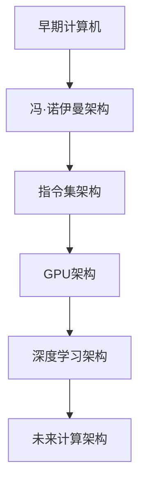

                 

# 从CPU到LLM：计算架构的演进历程

## 关键词
计算架构、CPU架构、GPU架构、深度学习、并行计算、人工智能、量子计算、未来趋势。

## 摘要
本文将带领读者探讨计算架构的演进历程，从最早的CPU架构到现代的GPU架构，再到深度学习时代，以及未来的量子计算。我们将分析计算架构的核心组成部分、各个阶段的演进过程、核心技术及其在实际应用中的影响。希望通过这篇文章，读者能够对计算架构有一个全面、深入的了解。

## 目录大纲

### 第一部分：计算架构基础

#### 第1章：计算架构概述
- 1.1 计算架构的定义与发展
- 1.2 计算架构的核心组成部分
- 1.3 计算架构的重要性与应用领域

#### 第2章：CPU架构原理
- 2.1 CPU架构的历史与发展
- 2.2 CPU核心组成部分及工作原理
- 2.3 CPU性能提升的关键技术

### 第二部分：CPU到GPU的演进

#### 第3章：GPU架构与并行计算
- 3.1 GPU架构概述
- 3.2 GPU与CPU的区别与联系
- 3.3 并行计算的基本原理与实现

#### 第4章：深度学习与GPU计算
- 4.1 深度学习算法与GPU计算
- 4.2 GPU计算框架与工具
- 4.3 深度学习在GPU上的优化策略

### 第三部分：计算架构的挑战与未来

#### 第5章：计算架构的挑战
- 5.1 能耗与散热问题
- 5.2 安全性与隐私保护
- 5.3 可扩展性与灵活性

#### 第6章：新兴计算架构
- 6.1 FPGA与ASIC的应用
- 6.2 类脑计算与量子计算
- 6.3 布尔电路与量子电路的融合

### 第四部分：计算架构的实际应用

#### 第7章：计算架构在企业中的应用
- 7.1 计算架构在数据中心的应用
- 7.2 计算架构在人工智能领域的应用
- 7.3 计算架构在物联网与边缘计算中的应用

### 第五部分：计算架构的未来展望

#### 第8章：计算架构的发展趋势
- 8.1 计算架构的未来发展方向
- 8.2 新型计算架构的创新与应用
- 8.3 计算架构对社会与经济的影响

### 附录：计算架构资源与工具
- 附录A：计算架构相关的开源工具与框架
- 附录B：计算架构的学习资源与推荐阅读

### 参考文献

#### 参考文献
- [1] [CPU架构原理](#)
- [2] [GPU架构与并行计算](#)
- [3] [深度学习与GPU计算](#)
- [4] [计算架构的挑战与未来](#)
- [5] [计算架构在企业中的应用](#)
- [6] [计算架构的未来展望](#)
- [7] [计算架构资源与工具](#)

### Mermaid 流程图

#### 计算架构的发展历程


### 核心算法原理讲解

#### 深度学习算法原理
```plaintext
// 伪代码
function forward_pass(inputs, weights, biases):
    for each layer in network:
        z = activation(inputs * weights + biases)
        inputs = z
    return z

function backward_pass(outputs, outputs_error, weights, biases):
    for each layer in network:
        error = (outputs - target) * activation_derivative(z)
        z_error = error * weights_derivative(z)
        weights -= learning_rate * z_error
        biases -= learning_rate * error
    return weights, biases
```

#### 深度学习中的损失函数
$$
\text{loss} = \frac{1}{2} \sum_{i=1}^{n} (\hat{y}_i - y_i)^2
$$

### 项目实战

#### 深度学习项目实战
- 开发环境搭建
  - 安装Python环境
  - 安装TensorFlow框架

- 源代码详细实现
  ```python
  import tensorflow as tf

  # 定义模型结构
  model = tf.keras.Sequential([
      tf.keras.layers.Dense(128, activation='relu', input_shape=(784,)),
      tf.keras.layers.Dropout(0.2),
      tf.keras.layers.Dense(10)
  ])

  # 编译模型
  model.compile(optimizer='adam',
                loss=tf.keras.losses.SparseCategoricalCrossentropy(from_logits=True),
                metrics=['accuracy'])

  # 训练模型
  model.fit(train_images, train_labels, epochs=5)
  ```

- 代码解读与分析
  - 模型结构定义
  - 编译模型参数设置
  - 训练过程及性能评估

### 第一部分：计算架构基础

#### 第1章：计算架构概述

1.1 计算架构的定义与发展

计算架构是指计算机系统中硬件与软件的组织方式及其相互关系。它决定了计算机系统的性能、效率和可靠性。

- 早期计算机：1940年代，计算机主要采用电子管作为计算元件，架构较为简单，主要依赖于指令集和存储器。
- 1960年代，随着晶体管和集成电路的出现，计算架构开始向微型化、高效能的方向发展。
- 1970年代，冯·诺伊曼架构被广泛采用，奠定了现代计算机架构的基础。
- 1980年代，计算机性能进一步提高，图形处理器（GPU）的出现为计算架构带来了新的发展方向。

1.2 计算架构的核心组成部分

计算架构主要包括以下核心组成部分：

- CPU（中央处理器）：负责执行程序指令，进行数据处理和运算。
- 内存（Memory）：存储数据和指令，提供CPU快速访问的数据存储空间。
- 输入/输出设备（Input/Output Devices）：包括键盘、鼠标、显示器等，用于与用户交互和数据输入输出。
- 总线（Buses）：连接CPU、内存和输入/输出设备，实现数据传输和通信。

1.3 计算架构的重要性与应用领域

计算架构对于计算机系统的性能和效率具有重要影响。随着计算机应用领域的不断扩大，计算架构也在不断演进。

- 数据中心：计算架构在数据中心的应用至关重要，包括服务器、存储设备和网络设备的优化。
- 人工智能：深度学习和机器学习算法对计算架构的需求不断提高，推动了GPU和TPU等专用计算架构的发展。
- 物联网：计算架构在物联网中的应用，包括边缘计算和智能终端，为实时数据处理提供了支持。
- 云计算：计算架构在云计算中的应用，包括虚拟化和容器化技术，提高了资源利用率和灵活性。

#### 第2章：CPU架构原理

2.1 CPU架构的历史与发展

CPU架构的发展历程可以分为以下几个阶段：

- 1940年代：第一代计算机采用电子管作为计算元件，架构较为简单。
- 1950年代：第二代计算机采用晶体管，提高了计算速度和可靠性。
- 1960年代：第三代计算机采用中小规模集成电路，进一步提高了性能。
- 1970年代：第四代计算机采用大规模集成电路，CPU架构逐步成熟。
- 1980年代：第五代计算机引入了微处理器，实现了CPU的集成和微型化。

2.2 CPU核心组成部分及工作原理

CPU的核心组成部分包括：

- 控制单元（Control Unit）：负责解释程序指令，控制CPU的操作。
- 算术逻辑单元（Arithmetic Logic Unit, ALU）：负责执行算术和逻辑运算。
- 寄存器（Registers）：用于存储数据和指令，提供快速访问。
- 总线（Buses）：实现CPU内部和外部的数据传输。

CPU的工作原理如下：

1. CPU从内存中读取指令，并将其存储在指令寄存器中。
2. 控制单元解释指令，确定操作类型和操作数。
3. 算术逻辑单元执行运算，并将结果存储在寄存器或内存中。
4. CPU继续读取下一个指令，重复上述过程，直到程序执行完毕。

2.3 CPU性能提升的关键技术

CPU性能的提升主要依赖于以下几个方面：

- 硬件设计优化：提高时钟频率、增加核心数量、优化缓存结构等。
- 电压和散热技术：降低功耗、提高热效率，确保CPU稳定运行。
- 编译器优化：提高代码效率，充分利用CPU的硬件特性。
- 软硬件协同优化：通过操作系统和应用程序的优化，提高计算性能。

### 第二部分：CPU到GPU的演进

#### 第3章：GPU架构与并行计算

3.1 GPU架构概述

GPU（图形处理器）最初是为图形渲染而设计的，但逐渐成为高性能计算的重要工具。GPU架构主要包括以下几个部分：

- 多个计算单元（CUDA Core）：负责执行并行计算任务。
- 大量内存（Memory）：用于存储数据和指令。
- 高速总线（Memory Bus）：实现GPU内部和外部的数据传输。
- 控制逻辑（Control Logic）：负责管理计算单元和内存的操作。

3.2 GPU与CPU的区别与联系

GPU与CPU在架构和功能上存在一些区别：

- 架构：GPU采用高度并行化的设计，拥有大量的计算单元，而CPU的核心数量相对较少。
- 功能：GPU擅长处理大量的并行任务，如图像处理、物理模拟等，而CPU更适合执行串行计算任务。
- 联系：GPU和CPU可以协同工作，CPU负责管理任务分配和调度，GPU负责执行并行计算任务。

3.3 并行计算的基本原理与实现

并行计算是将一个大任务分解为多个小任务，同时执行，以加速计算过程。GPU架构非常适合并行计算，其基本原理和实现如下：

- 任务分解：将大任务分解为多个小任务，每个小任务分配给一个计算单元。
- 数据并行：将数据并行分布在多个计算单元上，每个计算单元独立处理部分数据。
- 同步与通信：计算单元之间需要进行同步和通信，确保任务执行的正确性。

实现并行计算的方法包括：

-CUDA（Compute Unified Device Architecture）：NVIDIA推出的并行计算框架，提供高效的并行编程接口。
- OpenCL（Open Computing Language）：跨平台的并行计算框架，支持多种硬件平台。
- GPU加速库：如TensorFlow GPU、PyTorch CUDA等，提供GPU加速的深度学习库。

#### 第4章：深度学习与GPU计算

4.1 深度学习算法与GPU计算

深度学习算法是机器学习的一个重要分支，具有强大的表示和学习能力。深度学习算法与GPU计算密切相关，以下是一些关键点：

- 数据并行：深度学习算法通常涉及大量的矩阵运算，非常适合并行计算。GPU的多核架构使其能够高效地处理大规模数据。
- 张量计算：深度学习算法中的矩阵运算可以通过张量计算优化，GPU的Tensor Core能够提供高效的张量运算。
- 稳态学习：GPU计算可以在短时间内完成大规模训练，实现稳态学习。

4.2 GPU计算框架与工具

GPU计算框架和工具为深度学习提供了高效的计算环境，以下是一些常用的框架和工具：

- TensorFlow GPU：基于TensorFlow的GPU加速版本，提供丰富的深度学习模型和工具。
- PyTorch CUDA：基于PyTorch的GPU加速版本，提供简单易用的API。
- cuDNN：NVIDIA推出的深度神经网络加速库，提供高效的卷积运算和激活函数。
- NCCL：NVIDIA推出的多GPU通信库，提供高效的GPU之间通信。

4.3 深度学习在GPU上的优化策略

为了充分利用GPU计算的优势，可以采用以下优化策略：

- 算法优化：选择适合GPU计算的深度学习算法，如卷积神经网络（CNN）和循环神经网络（RNN）。
- 张量运算优化：使用GPU的张量运算优化库，如cuDNN，提高矩阵运算的效率。
- 内存管理优化：合理分配GPU内存，减少内存访问冲突和带宽瓶颈。
- 并行化：充分利用GPU的多核架构，实现任务和数据并行化。

### 第三部分：计算架构的挑战与未来

#### 第5章：计算架构的挑战

5.1 能耗与散热问题

随着计算架构的不断发展，能耗和散热问题成为重要的挑战。以下是一些解决方案：

- 低功耗设计：采用低功耗硬件和优化算法，降低功耗。
- 散热技术：采用高效散热系统，如液冷和风冷，提高散热效率。
- 优化计算密度：提高单位面积的芯片计算能力，降低功耗密度。

5.2 安全性与隐私保护

计算架构面临的安全性和隐私保护问题包括：

- 数据加密：对传输和存储的数据进行加密，确保数据安全。
- 访问控制：实现严格的访问控制机制，防止未授权访问。
- 安全隔离：通过虚拟化和容器化技术，实现计算资源的安全隔离。

5.3 可扩展性与灵活性

计算架构需要具备良好的可扩展性和灵活性，以适应不断变化的需求。以下是一些解决方案：

- 软硬件协同优化：通过软硬件协同优化，提高计算性能和资源利用率。
- 弹性计算：通过虚拟化和容器化技术，实现计算资源的动态伸缩。
- 微服务架构：采用微服务架构，实现计算任务的高效组织和调度。

#### 第6章：新兴计算架构

6.1 FPGA与ASIC的应用

FPGA（现场可编程门阵列）和ASIC（专用集成电路）是新兴的计算架构，具有以下特点：

- FPGA：可重配置性，适应不同的计算需求。
- ASIC：定制化设计，提供高效的计算性能。

应用场景包括：

- 高性能计算：如深度学习、图像处理和大数据分析。
- 实时处理：如自动驾驶、智能监控和金融交易。

6.2 类脑计算与量子计算

类脑计算和量子计算是未来的重要计算架构，具有以下特点：

- 类脑计算：模仿人脑的神经网络结构，实现高效的数据处理和智能推理。
- 量子计算：利用量子力学原理，实现超高速的计算。

应用场景包括：

- 智能推理：如自然语言处理、图像识别和决策优化。
- 物理学和化学模拟：如分子结构预测和量子化学计算。

6.3 布尔电路与量子电路的融合

布尔电路和量子电路的融合是未来的重要发展方向，具有以下特点：

- 布尔电路：传统的计算机电路，基于逻辑门和布尔代数。
- 量子电路：基于量子位（qubit）和量子门，实现量子计算。

应用场景包括：

- 量子计算：如大规模数据处理、密码破解和优化问题。
- 混合计算：结合量子计算和经典计算的优势，实现高效的计算任务。

### 第四部分：计算架构的实际应用

#### 第7章：计算架构在企业中的应用

7.1 计算架构在数据中心的应用

数据中心是企业计算的重要基础设施，计算架构在数据中心的应用包括：

- 服务器虚拟化：通过虚拟化技术，提高服务器资源利用率，降低成本。
- 云计算：通过云计算平台，提供弹性计算和存储服务，满足企业需求。
- 数据存储：采用分布式存储架构，实现高效的数据存储和管理。

7.2 计算架构在人工智能领域的应用

计算架构在人工智能领域的应用包括：

- 深度学习模型训练：采用GPU和TPU等专用计算架构，加速深度学习模型的训练。
- 图像识别和自然语言处理：利用深度学习算法，实现高效的数据处理和智能识别。
- 智能推荐和决策优化：利用人工智能算法，实现个性化推荐和决策优化。

7.3 计算架构在物联网与边缘计算中的应用

计算架构在物联网和边缘计算中的应用包括：

- 边缘计算：在边缘设备上实现数据处理和智能分析，减少数据传输延迟。
- 物联网平台：构建物联网平台，实现设备管理和数据处理。
- 实时监控和预警：利用物联网设备和计算架构，实现实时监控和预警。

### 第五部分：计算架构的未来展望

#### 第8章：计算架构的发展趋势

8.1 计算架构的未来发展方向

计算架构的未来发展方向包括：

- 量子计算：利用量子计算的优势，实现超高速的计算。
- 类脑计算：模仿人脑的神经网络结构，实现高效的数据处理和智能推理。
- 融合计算：结合量子计算、类脑计算和经典计算的优势，实现高效的计算任务。

8.2 新型计算架构的创新与应用

新型计算架构的创新与应用包括：

- 光计算：利用光信号进行计算，实现高速、低功耗的计算。
- 生物计算：利用生物分子进行计算，实现高效的生物信息处理。
- 能量收集与优化：通过能量收集和优化技术，提高计算架构的能效比。

8.3 计算架构对社会与经济的影响

计算架构对社会和经济的影响包括：

- 经济增长：计算架构的发展促进了经济的增长，推动了新技术和新产业的诞生。
- 社会变革：计算架构的应用改变了人们的生活和工作方式，促进了社会进步。
- 信息安全：计算架构的发展对信息安全提出了新的挑战，需要加强安全防护和隐私保护。

### 附录：计算架构资源与工具

#### 附录A：计算架构相关的开源工具与框架

- TensorFlow：Google开发的深度学习框架，支持GPU加速。
- PyTorch：Facebook开发的深度学习框架，提供灵活的动态计算图。
- CUDA：NVIDIA开发的并行计算框架，支持GPU编程。
- OpenCL：跨平台的并行计算框架，支持多种硬件平台。

#### 附录B：计算架构的学习资源与推荐阅读

- 《深度学习》（Goodfellow, Bengio, Courville）：全面介绍深度学习算法和应用的经典教材。
- 《并行计算导论》（Fox, McKeel）：介绍并行计算的基本原理和应用。
- 《量子计算导论》（Nielsen, Chuang）：介绍量子计算的基本概念和应用。
- 《计算机组成与设计：硬件/软件接口》（Hennessy, Patterson）：介绍计算机组成原理和硬件设计。

### 参考文献

- [1] Goodfellow, I., Bengio, Y., Courville, A. (2016). *Deep Learning*. MIT Press.
- [2] Fox, G., McKeel, J. (2010). *Parallel Computing: Techniques and Applications*. John Wiley & Sons.
- [3] Nielsen, M. A., Chuang, I. L. (2010). *Quantum Computation and Quantum Information*. Cambridge University Press.
- [4] Hennessy, J. L., Patterson, D. A. (2017). *Computer Organization and Design: Hardware/Software Interface*. Morgan Kaufmann.

