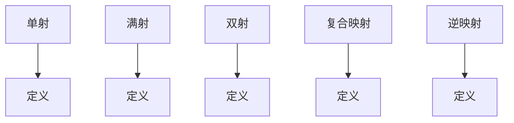

                 

# 《从复杂自然到简洁数学：映射之路》

## 关键词
- 映射理论
- 数学建模
- 自然与数学
- 优化算法
- 机器学习
- 图像处理
- 拓扑结构

## 摘要
本文旨在探讨映射这一核心数学概念，从其定义、性质，到其在自然现象和工程应用中的广泛存在。我们将逐步解析映射的基本理论，探讨其在数学、机器学习、图像处理等领域的应用。此外，本文还将深入探讨映射的数学原理、简化与抽象方法，并展望其未来发展的前景。通过本文的阅读，读者将能够更好地理解映射的深刻内涵，以及其在解决复杂实际问题中的重要性。

# 《从复杂自然到简洁数学：映射之路》目录大纲

## 第一部分：引言与基础理论

### 第1章：映射的概念与基本性质

#### 1.1 映射的定义与分类

映射（Mapping）是数学中一个基本且广泛的概念。它描述了两个集合之间的对应关系。简单来说，映射是一种规则，它将一个集合中的每个元素唯一地对应到另一个集合中的一个元素。

**分类：**
- **单射（Injective）：** 对于映射 \( f: A \rightarrow B \)，如果不同的元素在集合 \( A \) 中对应到不同的元素在集合 \( B \) 中，则称 \( f \) 是单射。
- **满射（Surjective）：** 如果集合 \( B \) 中的每个元素都有至少一个元素在集合 \( A \) 中与之对应，则称 \( f \) 是满射。
- **双射（Bijective）：** 如果映射既是单射又是满射，则称 \( f \) 是双射。

#### 1.2 映射的基本性质

- **复合映射：** 给定映射 \( f: A \rightarrow B \) 和 \( g: B \rightarrow C \)，可以定义它们的复合映射 \( g \circ f: A \rightarrow C \)。
- **逆映射：** 如果映射 \( f: A \rightarrow B \) 是双射，那么存在逆映射 \( f^{-1}: B \rightarrow A \)。

#### 1.3 映射在数学与其他领域的应用

映射在数学的各个分支中都有广泛应用，如微积分、代数、拓扑学等。此外，映射也在物理、工程、生物学等多个领域发挥着重要作用。

## 第二部分：映射的理论与应用

### 第2章：数学中的映射

#### 2.1 函数作为映射

函数（Function）是映射的一种特殊形式，通常表示为 \( f: A \rightarrow B \)，其中 \( A \) 是定义域，\( B \) 是值域。函数的基本性质包括：
- **定义域：** 函数能够接收的所有输入值的集合。
- **值域：** 函数输出的所有可能值的集合。
- **映射规则：** 描述输入和输出之间关系的数学表达式。

#### 2.2 线性映射与线性变换

线性映射（Linear Mapping）是一种特殊的映射，它满足线性性质，即对于任意的实数 \( a \) 和 \( b \)，以及向量 \( \vec{v_1}, \vec{v_2} \)，有：
\[ T(a\vec{v_1} + b\vec{v_2}) = aT(\vec{v_1}) + bT(\vec{v_2}) \]

线性变换（Linear Transformation）是线性映射在向量空间中的应用，它将一个向量空间映射到另一个向量空间。

#### 2.3 映射的复合与逆映射

复合映射是映射组合的基本操作。逆映射则是使映射具有可逆性的关键。

## 第三部分：映射的数学原理与案例分析

### 第3章：映射的连续性与导数

#### 3.1 连续映射的概念

连续映射是指函数在其定义域内的每个点处都连续。在数学分析中，连续性是一个重要的概念，因为它保证了函数的可微性。

#### 3.2 导数与微分

导数（Derivative）是描述函数变化率的一个量。微分（Differential）是导数的线性近似。

#### 3.3 连续映射的泰勒展开

泰勒展开是连续映射的一种重要表示方法，它将连续映射在一个点附近展开为多项式。

## 第四部分：映射的简化与抽象

### 第4章：映射的简化方法

#### 4.1 线性化与近似

线性化是将复杂非线性映射近似为线性映射的一种方法。近似则是将精确解逼近为简化形式的解。

#### 4.2 集合与映射的简化

通过集合的运算和映射的简化，可以将复杂的问题转化为更简单的问题来解决。

#### 4.3 简化映射的应用

简化映射在工程、物理、经济等领域中都有广泛的应用。

## 第五部分：映射的理论框架与展望

### 第5章：映射的抽象与理论框架

#### 5.1 映射的抽象概念

映射的抽象概念包括映射的算子、映射的分类等。

#### 5.2 映射的理论框架

映射的理论框架包括映射的基本性质、复合映射、逆映射等。

#### 5.3 映射抽象的应用

映射抽象的应用包括数学建模、算法设计、系统分析等。

### 第6章：映射之路的启示与展望

#### 6.1 映射的理论启示

映射的理论启示包括如何更好地理解和解决复杂问题。

#### 6.2 映射的应用展望

映射的应用展望包括其在人工智能、大数据、物联网等领域的未来发展。

#### 6.3 从复杂自然到简洁数学的映射之路

从复杂自然现象到简洁数学表达，映射是一条重要的桥梁，它连接着自然与数学，推动着人类文明的进步。

## 附录

### 附录 A：映射相关的数学工具

#### A.1 线性代数工具

线性代数工具包括矩阵运算、向量运算等。

#### A.2 微积分工具

微积分工具包括导数、积分、微分方程等。

#### A.3 拓扑学工具

拓扑学工具包括拓扑空间的定义、连续性、连通性等。

### 附录 B：映射相关的编程工具

#### B.1 Python中的映射实现

Python中实现映射的方法包括函数、类等。

#### B.2 MATLAB中的映射实现

MATLAB中实现映射的方法包括函数句柄、矩阵运算等。

#### B.3 R语言中的映射实现

R语言中实现映射的方法包括函数、数据框等。

### 附录 C：映射相关的案例研究

#### C.1 映射在生物信息学中的应用案例

映射在生物信息学中的应用包括基因组分析、蛋白质结构预测等。

#### C.2 映射在金融工程中的应用案例

映射在金融工程中的应用包括期权定价、风险模型等。

#### C.3 映射在社会网络分析中的应用案例

映射在社会网络分析中的应用包括网络结构分析、社区检测等。<|assistant|>## 第一部分：引言与基础理论

### 第1章：映射的概念与基本性质

#### 1.1 映射的定义与分类

映射（Mapping）在数学中是一个核心概念，它描述了一个集合中的元素通过某种规则映射到另一个集合中的元素。更具体地说，映射是一种从集合 \( A \) 到集合 \( B \) 的关系，记作 \( f: A \rightarrow B \)，其中每个 \( A \) 中的元素 \( a \) 都有唯一对应的 \( B \) 中的元素 \( b \)，即 \( b = f(a) \)。

**分类：**

- **单射（Injective）：** 如果对于任意的 \( a_1, a_2 \in A \)，当 \( f(a_1) = f(a_2) \) 时，必有 \( a_1 = a_2 \)，则称 \( f \) 是单射。
- **满射（Surjective）：** 如果对于集合 \( B \) 中的任意元素 \( b \)，都存在至少一个 \( A \) 中的元素 \( a \) 使得 \( f(a) = b \)，则称 \( f \) 是满射。
- **双射（Bijective）：** 如果映射既是单射又是满射，那么它就是双射。

#### 1.2 映射的基本性质

- **复合映射：** 假设有两个映射 \( f: A \rightarrow B \) 和 \( g: B \rightarrow C \)，那么它们的复合映射 \( g \circ f: A \rightarrow C \) 定义为 \( (g \circ f)(a) = g(f(a)) \)。复合映射遵循结合律，即 \( (g \circ f) \circ h = g \circ (f \circ h) \) 对于任意的 \( h: C \rightarrow D \) 都成立。
- **逆映射：** 如果一个映射 \( f: A \rightarrow B \) 是双射，那么它存在逆映射 \( f^{-1}: B \rightarrow A \)，满足 \( f^{-1}(f(a)) = a \) 和 \( f(f^{-1}(b)) = b \)。

#### 1.3 映射在数学与其他领域的应用

映射不仅在数学中有着广泛的应用，还在其他科学和工程领域发挥着重要作用。例如：

- **数学分析：** 映射用于定义函数，并研究函数的性质，如连续性、可微性等。
- **线性代数：** 线性映射是线性代数中的核心概念，用于描述线性变换和线性方程组。
- **拓扑学：** 映射用于定义拓扑空间和连续性，拓扑学是研究空间结构和性质的一个重要分支。
- **物理学：** 映射用于描述物理系统，如场的映射、流体动力学中的速度场和压力场的映射等。
- **计算机科学：** 映射用于算法设计和数据结构，如哈希映射、树映射等。

### 图1：映射的基本性质



### 1.4 映射的应用举例

**举例 1：** 简单的函数映射

定义一个函数 \( f: \{1, 2, 3\} \rightarrow \{a, b, c\} \)，使得 \( f(1) = a \)，\( f(2) = b \)，\( f(3) = c \)。这是一个双射，因为每个输入都有唯一的输出，且每个输出都有唯一的输入。

**举例 2：** 线性映射

考虑一个线性映射 \( T: \mathbb{R}^2 \rightarrow \mathbb{R}^2 \)，定义为 \( T(x, y) = (2x + y, x - 3y) \)。这是一个线性映射，因为对于任意的标量 \( a \) 和 \( b \)，以及向量 \( \vec{v_1} = (x_1, y_1) \) 和 \( \vec{v_2} = (x_2, y_2) \)，有 \( T(a\vec{v_1} + b\vec{v_2}) = aT(\vec{v_1}) + bT(\vec{v_2}) \)。

### 1.5 映射在数学与其他领域的应用案例

**案例 1：** 微积分中的导数

在微积分中，导数可以看作是映射的局部线性逼近。给定一个函数 \( f: \mathbb{R} \rightarrow \mathbb{R} \)，其导数 \( f'(x) \) 描述了函数 \( f \) 在点 \( x \) 处的变化率。导数本质上是映射的线性部分，可以表示为 \( f(x+h) \approx f(x) + f'(x)h \)。

**案例 2：** 线性代数中的线性变换

在线性代数中，线性变换可以看作是映射在向量空间中的应用。给定一个线性变换 \( T: V \rightarrow W \)，其中 \( V \) 和 \( W \) 是向量空间，线性变换满足 \( T(a\vec{v} + b\vec{w}) = aT(\vec{v}) + bT(\vec{w}) \)，这反映了映射的线性性质。

**案例 3：** 拓扑学中的连续映射

在拓扑学中，连续映射是描述拓扑空间之间关系的一个重要概念。给定两个拓扑空间 \( X \) 和 \( Y \)，一个映射 \( f: X \rightarrow Y \) 被称为连续的，如果对于 \( Y \) 中的任意开集 \( U \)，其逆像 \( f^{-1}(U) \) 是 \( X \) 中的开集。连续映射保持了空间的结构和性质。

### 结论

映射是数学中一个基本且广泛的概念，它在数学的各个分支和其他科学领域中都有广泛应用。通过了解映射的定义、性质和应用，我们可以更好地理解和解决复杂的问题。在接下来的章节中，我们将进一步探讨映射的数学原理和其在实际应用中的具体实现。

### 1.6 小结

在本章中，我们介绍了映射的基本概念和分类，探讨了映射的基本性质，如复合映射和逆映射。此外，我们还通过具体的例子和案例展示了映射在数学和其他领域的应用。这些概念和知识将为我们理解更复杂的映射理论打下坚实的基础。在下一章中，我们将进一步深入探讨映射在数学中的具体应用。

---

### 第2章：数学中的映射

在数学中，映射是核心概念之一，它贯穿了从基础数学到高级数学的各个领域。在这一章中，我们将深入探讨函数作为映射的基本概念，线性映射与线性变换的性质，以及映射的复合与逆映射。

#### 2.1 函数作为映射

函数是映射的一种特殊形式，通常表示为 \( f: A \rightarrow B \)，其中 \( A \) 是定义域，\( B \) 是值域。函数的基本性质包括：

- **定义域：** 函数能够接收的所有输入值的集合。
- **值域：** 函数输出的所有可能值的集合。
- **映射规则：** 描述输入和输出之间关系的数学表达式。

函数的一个重要特征是其单射性、满射性和双射性：

- **单射性：** 如果对于任意的 \( a_1, a_2 \in A \)，当 \( f(a_1) = f(a_2) \) 时，必有 \( a_1 = a_2 \)，则称 \( f \) 是单射。
- **满射性：** 如果对于集合 \( B \) 中的任意元素 \( b \)，都存在至少一个 \( A \) 中的元素 \( a \) 使得 \( f(a) = b \)，则称 \( f \) 是满射。
- **双射性：** 如果函数 \( f \) 既是单射又是满射，则称 \( f \) 是双射。

#### 2.2 线性映射与线性变换

线性映射是映射的一种特殊形式，它在数学和物理中有着广泛的应用。线性映射满足以下性质：

- **线性性质：** 对于任意的实数 \( a \) 和 \( b \)，以及向量 \( \vec{v_1}, \vec{v_2} \)，有
  \[
  T(a\vec{v_1} + b\vec{v_2}) = aT(\vec{v_1}) + bT(\vec{v_2})
  \]
  这意味着线性映射保持了向量加法和标量乘法的运算。

线性变换是线性映射在向量空间中的应用，它将一个向量空间映射到另一个向量空间。线性变换的基本性质包括：

- **可加性：** 对于任意的 \( \vec{v_1}, \vec{v_2} \in V \) 和标量 \( a, b \)，有
  \[
  T(a\vec{v_1} + b\vec{v_2}) = aT(\vec{v_1}) + bT(\vec{v_2})
  \]
- **齐次性：** 对于任意的 \( \vec{v} \in V \) 和标量 \( a \)，有
  \[
  T(a\vec{v}) = aT(\vec{v})
  \]

线性变换的矩阵表示是一个重要的工具，它将线性变换与矩阵运算联系起来。给定一个线性变换 \( T: V \rightarrow W \)，存在一个矩阵 \( A \)，使得对于任意的 \( \vec{v} \in V \)，有
\[
T(\vec{v}) = A\vec{v}
\]

#### 2.3 映射的复合与逆映射

复合映射是映射组合的基本操作。给定两个映射 \( f: A \rightarrow B \) 和 \( g: B \rightarrow C \)，它们的复合映射 \( g \circ f: A \rightarrow C \) 定义为
\[
(g \circ f)(a) = g(f(a))
\]

复合映射遵循结合律，即对于任意的 \( f: A \rightarrow B \)，\( g: B \rightarrow C \)，和 \( h: C \rightarrow D \)，有
\[
(h \circ g) \circ f = h \circ (g \circ f)
\]

逆映射则是使映射具有可逆性的关键。如果映射 \( f: A \rightarrow B \) 是双射，那么它存在逆映射 \( f^{-1}: B \rightarrow A \)，满足
\[
f^{-1}(f(a)) = a \quad \text{和} \quad f(f^{-1}(b)) = b
\]

逆映射的性质包括：

- **逆映射的唯一性：** 如果映射 \( f \) 是双射，则其逆映射 \( f^{-1} \) 是唯一的。
- **复合映射与逆映射：** 对于双射映射 \( f: A \rightarrow B \) 和其逆映射 \( f^{-1}: B \rightarrow A \)，有 \( (f^{-1} \circ f)(a) = a \) 和 \( (f \circ f^{-1})(b) = b \)。

### 图2：映射的复合与逆映射

```mermaid
graph TD
A[映射 f: A -> B] --> B1[复合映射 g: B -> C]
B1 --> C1[g∘f: A -> C]
A --> B2[逆映射 f^{-1}: B -> A]
B2 --> A1[f^{-1}∘f: B -> A]
```

#### 2.4 函数的连续性与导数

函数的连续性是数学分析中的一个基本概念。一个函数 \( f: A \rightarrow B \) 在点 \( a \) 处连续，如果当 \( x \) 趋近于 \( a \) 时，\( f(x) \) 也趋近于 \( f(a) \)。函数的连续性保证了其在某个点附近的行为是可预测的。

导数是描述函数变化率的一个量。给定一个函数 \( f: \mathbb{R} \rightarrow \mathbb{R} \)，其导数 \( f'(x) \) 描述了函数 \( f \) 在点 \( x \) 处的变化率。导数本质上是映射的局部线性逼近，可以表示为
\[
f(x+h) \approx f(x) + f'(x)h
\]

#### 2.5 线性映射的矩阵表示

线性映射的矩阵表示是线性代数中的一个重要概念。给定一个线性映射 \( T: V \rightarrow W \)，存在一个矩阵 \( A \)，使得对于任意的 \( \vec{v} \in V \)，有
\[
T(\vec{v}) = A\vec{v}
\]

矩阵 \( A \) 的列向量是 \( T(\vec{e_i}) \)，其中 \( \vec{e_i} \) 是标准基向量。线性映射的矩阵表示允许我们使用矩阵运算来简化线性变换的计算。

#### 2.6 映射在数学中的应用案例

**案例 1：** 线性代数中的线性变换

在线性代数中，线性变换用于描述矩阵与向量之间的关系。给定一个矩阵 \( A \) 和一个向量 \( \vec{x} \)，矩阵 \( A \) 可以看作是从 \( \mathbb{R}^n \) 到 \( \mathbb{R}^m \) 的线性变换。矩阵 \( A \) 的列向量表示了变换的方向，而行向量则表示了变换的尺度。

**案例 2：** 微积分中的导数

在微积分中，导数可以看作是映射的局部线性逼近。给定一个函数 \( f: \mathbb{R} \rightarrow \mathbb{R} \)，其导数 \( f'(x) \) 描述了函数 \( f \) 在点 \( x \) 处的变化率。导数的概念在优化问题和微分方程中有着广泛的应用。

**案例 3：** 拓扑学中的连续映射

在拓扑学中，连续映射是描述拓扑空间之间关系的一个重要概念。给定两个拓扑空间 \( X \) 和 \( Y \)，一个映射 \( f: X \rightarrow Y \) 被称为连续的，如果对于 \( Y \) 中的任意开集 \( U \)，其逆像 \( f^{-1}(U) \) 是 \( X \) 中的开集。连续映射保持了空间的结构和性质。

### 结论

在本章中，我们探讨了数学中的映射，包括函数作为映射的基本概念，线性映射与线性变换的性质，以及映射的复合与逆映射。此外，我们还通过具体的例子展示了映射在数学中的应用。这些概念和知识将为我们理解更复杂的映射理论打下坚实的基础。在下一章中，我们将进一步探讨映射的连续性与导数。

### 2.7 小结

在本章中，我们详细介绍了映射在数学中的基本概念和应用。从函数作为映射的定义，到线性映射与线性变换的性质，再到映射的复合与逆映射，我们逐步深入探讨了映射的数学原理。此外，我们还通过具体的例子展示了映射在实际应用中的重要性。通过本章的学习，读者可以更好地理解映射的基本概念和其在数学中的广泛应用。在下一章中，我们将继续探讨映射的连续性与导数，进一步深化对映射理论的理解。

---

### 第3章：映射的连续性与导数

在数学分析中，连续性与导数是描述函数行为的重要概念。连续性保证了函数的局部稳定性，而导数则描述了函数的变化率。在这一章中，我们将详细探讨连续映射的概念，导数与微分的定义和计算，以及连续映射的泰勒展开。

#### 3.1 连续映射的概念

连续映射是函数分析中的一个核心概念。一个函数 \( f: A \rightarrow B \) 在点 \( a \) 处连续，如果当输入 \( x \) 趋近于 \( a \) 时，函数值 \( f(x) \) 也趋近于 \( f(a) \)。形式上，我们可以用以下极限来描述函数的连续性：

\[
\lim_{{x \to a}} f(x) = f(a)
\]

这意味着，当 \( x \) 趋近于 \( a \) 时，\( f(x) \) 与 \( f(a) \) 的距离可以任意小。连续映射是许多数学和工程应用中的基本要求，因为它保证了函数的稳定性和可微性。

#### 3.2 导数与微分

导数是描述函数变化率的一个量。给定一个函数 \( f: \mathbb{R} \rightarrow \mathbb{R} \)，在点 \( x \) 处的导数 \( f'(x) \) 描述了函数 \( f \) 在点 \( x \) 处的变化率。导数的定义可以用极限来表示：

\[
f'(x) = \lim_{{h \to 0}} \frac{f(x+h) - f(x)}{h}
\]

这个极限表示了当 \( h \) 趋近于0时，\( f(x+h) \) 和 \( f(x) \) 之间的平均变化率。导数的一个重要性质是，它可以用来描述函数的凹凸性和极值点。

微分是导数的线性近似。给定一个函数 \( f: \mathbb{R} \rightarrow \mathbb{R} \)，在点 \( x \) 处的微分 \( df(x) \) 是导数 \( f'(x) \) 与自变量 \( h \) 的乘积：

\[
df(x) = f'(x)dh
\]

微分是一个无穷小量，它描述了函数在某个点附近的局部线性变化。

#### 3.3 连续映射的泰勒展开

泰勒展开是连续映射的一种重要表示方法，它将函数在某个点 \( x \) 附近展开为多项式。泰勒展开的公式如下：

\[
f(x) = f(a) + f'(a)(x-a) + \frac{f''(a)}{2!}(x-a)^2 + \frac{f'''(a)}{3!}(x-a)^3 + \cdots
\]

这个公式表明，一个连续可微的函数可以在某个点 \( a \) 附近用多项式来近似。泰勒展开在数值分析、优化问题和物理学中有着广泛的应用。

#### 3.4 连续映射的应用案例

**案例 1：** 线性函数的导数

线性函数 \( f(x) = mx + b \) 是连续且可微的。其导数 \( f'(x) = m \)，表示了函数的斜率。这意味着线性函数在每个点上的变化率都是常数。

**案例 2：** 幂函数的泰勒展开

幂函数 \( f(x) = x^n \) 是连续且可微的。在 \( x = 0 \) 点，其泰勒展开为：

\[
f(x) = 1 + nx + \frac{n(n-1)}{2!}x^2 + \frac{n(n-1)(n-2)}{3!}x^3 + \cdots
\]

这个展开式在 \( x \) 接近 0 时提供了一个良好的近似。

**案例 3：** 三角函数的泰勒展开

三角函数 \( f(x) = \sin(x) \) 和 \( f(x) = \cos(x) \) 是连续且可微的。在 \( x = 0 \) 点，它们的泰勒展开分别为：

\[
\sin(x) = x - \frac{x^3}{3!} + \frac{x^5}{5!} - \frac{x^7}{7!} + \cdots
\]

\[
\cos(x) = 1 - \frac{x^2}{2!} + \frac{x^4}{4!} - \frac{x^6}{6!} + \cdots
\]

这些展开式在计算三角函数的近似值时非常有用。

### 结论

在本章中，我们探讨了映射的连续性与导数。连续映射保证了函数的局部稳定性，而导数则描述了函数的变化率。我们介绍了导数的定义和计算方法，以及连续映射的泰勒展开。这些概念在数学分析和工程应用中至关重要。通过本章的学习，读者可以更好地理解连续映射和导数的基本理论，并能够应用这些理论解决实际问题。在下一章中，我们将进一步探讨映射的优化方法。

### 3.5 小结

在本章中，我们深入探讨了映射的连续性与导数。我们从连续映射的概念开始，介绍了导数的定义和计算方法，并展示了泰勒展开在近似函数值中的应用。通过具体的案例，我们展示了这些理论在数学分析和其他领域中的重要性。读者通过本章的学习，应该能够理解连续映射的基本概念，掌握导数的计算方法，并能够运用泰勒展开来近似函数。在下一章中，我们将继续探讨映射的优化方法，探索如何在实际问题中利用映射来实现最优解。

---

### 第4章：映射的优化方法

在许多实际问题中，我们常常需要找到某个映射的最优解，以使得某些目标函数达到最大值或最小值。这种寻找最优解的过程被称为优化。在这一章中，我们将探讨最优化问题的基本概念，介绍几种常见的优化方法，包括梯度下降法、牛顿法和拟牛顿法，并讨论这些方法在实际中的应用。

#### 4.1 最优化问题的基本概念

**定义：** 最优化问题是指在一个给定的函数集合中，寻找一个或多个函数值使得某个目标函数达到最大值或最小值的问题。最优化问题可以形式化为：

\[
\min \{ f(x) : x \in X \}
\]

或

\[
\max \{ f(x) : x \in X \}
\]

其中，\( f(x) \) 是目标函数，\( X \) 是定义域。

**目标函数：** 最优化问题的目标是寻找一个或多个 \( x \) 值，使得目标函数 \( f(x) \) 达到某个特定的值。目标函数可以是线性的，也可以是非线性的。

**约束条件：** 最优化问题中的约束条件限制了 \( x \) 的取值范围。约束条件可以是等式约束，也可以是不等式约束。例如，约束条件可以表示为：

\[
g(x) \leq 0
\]

或

\[
h(x) = 0
\]

**优化方法：** 为了找到最优解，需要使用特定的优化方法。这些方法包括：

- **梯度下降法：** 通过计算目标函数的梯度，沿着梯度的反方向更新 \( x \) 的值，以逐渐逼近最优解。
- **牛顿法：** 利用目标函数的二阶导数（Hessian矩阵），通过迭代过程寻找最优解。
- **拟牛顿法：** 类似于牛顿法，但不需要计算Hessian矩阵的逆，适用于更广泛的函数。

#### 4.2 梯度下降法

梯度下降法是一种简单且广泛使用的优化方法。它的基本思想是计算目标函数的梯度，并沿着梯度的反方向更新 \( x \) 的值，以逐渐减少目标函数的值。

**步骤：**

1. 初始化 \( x \) 的初始值。
2. 计算目标函数 \( f(x) \) 在 \( x \) 处的梯度 \( \nabla f(x) \)。
3. 根据梯度的方向和大小，更新 \( x \) 的值：
   \[
   x_{\text{new}} = x - \alpha \nabla f(x)
   \]
   其中，\( \alpha \) 是学习率，它控制了每次更新的步长。

4. 重复步骤2和3，直到满足停止条件（例如，梯度足够小或达到迭代次数上限）。

**伪代码：**

```python
def gradient_descent(f, x0, alpha, max_iter):
    x = x0
    for i in range(max_iter):
        gradient = compute_gradient(f, x)
        x = x - alpha * gradient
        if abs(gradient) < tolerance:
            break
    return x
```

#### 4.3 牛顿法

牛顿法是一种更高效的优化方法，它利用目标函数的二阶导数（Hessian矩阵）来加速收敛。

**步骤：**

1. 初始化 \( x \) 的初始值。
2. 计算目标函数 \( f(x) \) 在 \( x \) 处的梯度 \( \nabla f(x) \) 和二阶导数 \( H(f, x) \)。
3. 通过迭代公式更新 \( x \) 的值：
   \[
   x_{\text{new}} = x - H(f, x)^{-1} \nabla f(x)
   \]

4. 重复步骤2和3，直到满足停止条件。

**伪代码：**

```python
def newton_method(f, x0, tol, max_iter):
    x = x0
    for i in range(max_iter):
        gradient = compute_gradient(f, x)
        hessian = compute_hessian(f, x)
        x = x - np.linalg.solve(hessian, gradient)
        if np.linalg.norm(gradient) < tol:
            break
    return x
```

#### 4.4 拟牛顿法

拟牛顿法是一种近似牛顿法，它不需要计算Hessian矩阵的逆，但仍然能够提供较快的收敛速度。

**步骤：**

1. 初始化 \( x \) 的初始值。
2. 计算目标函数 \( f(x) \) 在 \( x \) 处的梯度 \( \nabla f(x) \)。
3. 使用一阶近似 \( B \) 来近似Hessian矩阵：
   \[
   B = B_{k-1} - \frac{B_{k-1} \nabla f(x) \nabla f(x)^T B_{k-1}}{\nabla f(x)^T B_{k-1} \nabla f(x)}
   \]

4. 通过迭代公式更新 \( x \) 的值：
   \[
   x_{\text{new}} = x - B \nabla f(x)
   \]

5. 重复步骤2到4，直到满足停止条件。

**伪代码：**

```python
def quasi_newton_method(f, x0, tol, max_iter):
    x = x0
    B = np.eye(len(x0))
    for i in range(max_iter):
        gradient = compute_gradient(f, x)
        B = B - (B @ gradient @ gradient.T) / (gradient @ B @ gradient)
        x = x - B @ gradient
        if np.linalg.norm(gradient) < tol:
            break
    return x
```

#### 4.5 优化方法的应用案例

**案例 1：** 线性回归

线性回归是一种常见的优化问题，目标是最小化预测值与实际值之间的误差。使用梯度下降法，可以通过不断更新模型参数来最小化损失函数。牛顿法和拟牛顿法在这种情况下也可以应用，但梯度下降法通常更为简单和有效。

**案例 2：** 最小二乘法

最小二乘法是另一种优化问题，用于找到一组参数，使得观测值与预测值之间的误差平方和最小。梯度下降法、牛顿法和拟牛顿法都可以用于求解最小二乘问题，其中梯度下降法由于其简单性而最为常用。

**案例 3：** 非线性优化

在更复杂的非线性优化问题中，如神经网络训练、图像处理等，牛顿法和拟牛顿法通常更为有效。这些方法可以快速收敛到最优解，特别是在目标函数的导数和二阶导数都容易计算的情况下。

### 结论

在本章中，我们探讨了映射的优化方法，包括最优化问题的基本概念、梯度下降法、牛顿法和拟牛顿法。这些方法在解决实际优化问题时具有广泛的应用。通过本章的学习，读者应该能够理解最优化问题的定义，掌握不同优化方法的基本步骤和实现方式，并能够应用这些方法解决实际问题。在下一章中，我们将进一步探讨映射在机器学习中的应用。

### 4.6 小结

在本章中，我们详细介绍了映射的优化方法，包括最优化问题的基本概念和三种常见的优化算法：梯度下降法、牛顿法和拟牛顿法。我们通过伪代码展示了这些算法的实现步骤，并讨论了它们在不同类型优化问题中的应用。通过本章的学习，读者应该能够理解优化方法的基本原理，掌握不同算法的优缺点，并能够应用这些方法解决实际问题。在下一章中，我们将继续探讨映射在机器学习中的应用。

---

### 第5章：映射在机器学习中的应用

在机器学习中，映射（特别是函数映射）是一个核心概念，它贯穿了从数据预处理到模型训练的各个环节。在这一章中，我们将探讨映射在机器学习中的基本原理，重点介绍神经网络中的映射、映射在深度学习中的应用，以及映射在特征提取和降维中的重要性。

#### 5.1 映射与机器学习的关系

机器学习的本质是通过构建适当的映射，将输入数据映射到期望的输出。这种映射通常由一系列函数组成，每个函数在数据处理的不同阶段发挥作用。机器学习的目标是通过学习和优化这些映射，使得模型能够对新的输入数据进行准确的预测或分类。

**关系：**

- **输入空间与输出空间：** 在机器学习中，输入空间是数据集中的特征集合，输出空间是模型的预测结果或分类标签。
- **映射函数：** 映射函数将输入空间中的每个特征映射到输出空间中的某个值。这些函数可以是线性的，也可以是非线性的。

#### 5.2 神经网络中的映射

神经网络是机器学习中一种重要的模型，它通过一系列的映射实现复杂的数据处理任务。神经网络中的映射主要发生在以下几个阶段：

- **输入层到隐藏层：** 输入层中的每个神经元将输入特征通过激活函数映射到隐藏层。这些激活函数通常是非线性函数，如sigmoid函数、ReLU函数等。
- **隐藏层到输出层：** 隐藏层中的每个神经元通过激活函数映射到输出层。输出层的映射函数决定了模型的预测结果或分类标签。

**示例：**

考虑一个简单的全连接神经网络，它由三个层组成：输入层、隐藏层和输出层。输入层有 \( n \) 个神经元，隐藏层有 \( m \) 个神经元，输出层有 \( k \) 个神经元。

- **输入层到隐藏层：** 输入层中的每个神经元 \( x_i \) 通过权重 \( w_{ij} \) 和偏置 \( b_j \) 映射到隐藏层中的神经元 \( z_j \)：
  \[
  z_j = \sum_{i=1}^{n} w_{ij}x_i + b_j
  \]
  其中，\( a_j = f(z_j) \)，\( f \) 是激活函数。

- **隐藏层到输出层：** 隐藏层中的每个神经元 \( z_j \) 通过权重 \( w_{jk} \) 和偏置 \( b_k \) 映射到输出层中的神经元 \( y_k \)：
  \[
  y_k = \sum_{j=1}^{m} w_{jk}z_j + b_k
  \]
  其中，\( \hat{y}_k = f(y_k) \)，\( f \) 是激活函数。

神经网络中的映射通过反向传播算法进行优化，以最小化损失函数，使得模型的预测结果更接近真实标签。

#### 5.3 映射在深度学习中的应用

深度学习是机器学习的一个分支，它通过多层神经网络实现复杂的数据处理任务。深度学习中的映射包括：

- **卷积映射：** 在卷积神经网络（CNN）中，卷积映射用于提取图像的特征。卷积映射通过卷积操作将输入图像映射到特征图，从而实现特征提取和降维。
- **循环映射：** 在循环神经网络（RNN）中，循环映射用于处理序列数据。循环映射通过循环结构将前一个时间步的输出作为当前时间步的输入，从而实现序列数据的建模和预测。

**示例：**

- **卷积映射：** 在CNN中，卷积映射通过卷积层和池化层实现。卷积层通过卷积操作提取图像的特征，而池化层通过最大池化或平均池化降低特征图的维度。

- **循环映射：** 在RNN中，循环映射通过隐藏状态 \( h_t \) 将当前时间步的输入 \( x_t \) 映射到下一个时间步的输出 \( h_{t+1} \)：
  \[
  h_{t+1} = \sigma(Wx_t + Uh_t + b)
  \]
  其中，\( \sigma \) 是激活函数，\( W \) 和 \( U \) 是权重矩阵，\( b \) 是偏置。

深度学习中的映射通过端到端训练实现，即从输入数据到预测结果的整个过程都是自动完成的。

#### 5.4 映射在特征提取和降维中的应用

在机器学习中，特征提取和降维是重要的预处理步骤。映射在这些过程中发挥着关键作用：

- **特征提取：** 通过映射将原始数据转换为更具表达性的特征，从而提高模型的性能。在CNN中，卷积映射通过多层卷积操作提取图像的层次特征。
- **降维：** 通过映射将高维数据映射到低维空间，从而减少计算量和数据存储需求。在主成分分析（PCA）中，映射通过求解特征值和特征向量将数据投影到新的正交基上。

**示例：**

- **特征提取：** 在图像识别中，卷积映射通过卷积操作提取图像的边缘、纹理和形状等特征。
- **降维：** 在PCA中，映射通过求解协方差矩阵的特征值和特征向量将数据映射到新的低维空间。

#### 5.5 映射在机器学习中的应用案例

**案例 1：** 朴素贝叶斯分类器

朴素贝叶斯分类器是一种基于概率论的分类算法，它通过映射将特征空间映射到概率空间。给定一个特征向量 \( x \)，映射函数 \( P(y|x) \) 计算在给定特征 \( x \) 的条件下，标签 \( y \) 的概率。通过最大化 \( P(y|x) \)，朴素贝叶斯分类器实现了从特征空间到标签空间的映射。

**案例 2：** 支持向量机（SVM）

支持向量机是一种常用的分类算法，它通过映射将特征空间映射到高维空间，从而实现分类。给定一个训练数据集，SVM通过寻找一个超平面，将不同类别的特征向量分隔开来。映射函数 \( \phi(x) \) 将输入特征 \( x \) 映射到高维特征空间，从而实现分类。

**案例 3：** 集成学习

集成学习是一种基于多个模型的优化方法，它通过映射将多个基础模型组合成一个更强的模型。集成学习中的映射函数 \( h(x) \) 将基础模型的预测结果加权平均，从而实现更准确的预测。

#### 5.6 小结

在本章中，我们探讨了映射在机器学习中的基本原理和应用。从映射与机器学习的关系，到神经网络中的映射，再到映射在深度学习中的应用，我们详细介绍了映射在特征提取、降维和模型训练中的重要性。此外，我们还通过具体的案例展示了映射在实际应用中的效果。通过本章的学习，读者应该能够理解映射在机器学习中的核心作用，掌握不同映射函数的实现方式和应用场景。在下一章中，我们将继续探讨映射在图像处理中的应用。

### 5.7 小结

在本章中，我们深入探讨了映射在机器学习中的应用，从基本的映射概念到神经网络中的映射，再到映射在深度学习和特征提取中的应用，我们系统地介绍了映射在机器学习中的重要作用。通过具体的案例，我们展示了映射在实际应用中的效果和优势。读者通过本章的学习，应该能够理解映射在机器学习中的核心作用，掌握不同映射函数的实现方式和应用场景。在下一章中，我们将探讨映射在图像处理中的应用。

---

### 第6章：映射在图像处理中的应用

图像处理是计算机视觉领域的一个重要分支，它涉及到对图像的生成、处理、分析和理解。映射在图像处理中发挥着关键作用，它用于图像的变换、增强和分类。在这一章中，我们将探讨映射在图像处理中的应用，包括图像变换、图像增强和图像分类。

#### 6.1 映射在图像变换中的应用

图像变换是指将原始图像通过某种数学变换转换为另一种形式，以便更好地处理和理解图像。常见的图像变换包括傅里叶变换、离散余弦变换（DCT）和小波变换。

- **傅里叶变换：** 傅里叶变换是一种将图像从空间域转换为频率域的方法。通过傅里叶变换，图像的频率成分可以被分离出来，从而实现对图像的频率分析。傅里叶变换在图像去噪、边缘检测和图像压缩等领域有广泛应用。

- **离散余弦变换（DCT）：** 离散余弦变换是傅里叶变换的一种特殊形式，它常用于图像压缩。DCT将图像分解为不同频率的余弦分量，这些分量可以按照重要性进行排序，从而实现图像的有效压缩。

- **小波变换：** 小波变换是一种多分辨率分析方法，它通过不同尺度的小波基函数将图像分解为不同层次的特征。小波变换在图像去噪、边缘检测和图像压缩等方面具有高效性。

#### 6.2 映射在图像增强中的应用

图像增强是指通过某种映射方法提高图像的视觉质量，使得图像更易于观察和分析。常见的图像增强方法包括直方图均衡、对比度增强和滤波。

- **直方图均衡：** 直方图均衡是一种非线性变换方法，它通过调整图像的亮度分布，使得图像的对比度提高。直方图均衡特别适用于亮度不均匀的图像，如照片和扫描图像。

- **对比度增强：** 对比度增强是通过调整图像的亮度差异来增强图像细节的方法。常见的对比度增强方法包括直方图匹配和局部对比度增强。

- **滤波：** 滤波是一种通过映射方法去除图像中的噪声和细节的方法。常见的滤波方法包括均值滤波、高斯滤波和中值滤波。

#### 6.3 映射在图像分类中的应用

图像分类是指将图像划分为不同的类别。映射在图像分类中的应用主要通过特征提取和分类模型实现。

- **特征提取：** 特征提取是图像分类的关键步骤，它用于从图像中提取具有区分性的特征。常见的特征提取方法包括边缘检测、纹理分析和形状分析。

- **分类模型：** 分类模型是一种将特征映射到类别标签的映射函数。常见的分类模型包括支持向量机（SVM）、朴素贝叶斯分类器和深度神经网络。

**示例：**

- **边缘检测：** 边缘检测是一种通过映射将图像中的边缘特征提取出来的方法。Canny边缘检测器是一种常用的边缘检测算法，它通过卷积运算和阈值处理提取图像的边缘。

- **纹理分析：** 纹理分析是一种通过映射将图像中的纹理特征提取出来的方法。LBP（局部二值模式）是一种常用的纹理分析方法，它通过计算图像的局部二值模式特征实现纹理分析。

- **形状分析：** 形状分析是一种通过映射将图像中的形状特征提取出来的方法。HOG（直方图导向特征）是一种常用的形状分析方法，它通过计算图像的局部直方图特征实现形状分析。

#### 6.4 映射在图像处理中的应用案例

**案例 1：** 图像去噪

图像去噪是图像处理中的一个重要任务，它通过映射方法去除图像中的噪声，提高图像的质量。使用小波变换进行图像去噪是一种有效的方法。通过小波变换，图像可以被分解为不同尺度的子带，噪声通常集中在某些子带上。通过阈值处理，可以去除这些噪声子带，从而实现图像去噪。

**案例 2：** 图像压缩

图像压缩是通过映射方法减少图像数据量的过程，从而提高数据传输和存储的效率。JPEG压缩是一种基于DCT的图像压缩方法，它通过将图像分解为不同频率的余弦分量，并量化这些分量，从而实现图像的有效压缩。

**案例 3：** 图像识别

图像识别是计算机视觉中的一个核心任务，它通过映射方法将图像映射到类别标签。使用深度神经网络进行图像识别是一种高效的方法。通过卷积神经网络（CNN），图像可以被逐层提取出层次特征，最终通过全连接层实现图像的分类。

#### 6.5 小结

在本章中，我们探讨了映射在图像处理中的应用，包括图像变换、图像增强和图像分类。通过傅里叶变换、离散余弦变换和小波变换，我们展示了映射在图像变换中的应用；通过直方图均衡、对比度增强和滤波，我们展示了映射在图像增强中的应用；通过特征提取和分类模型，我们展示了映射在图像分类中的应用。这些映射方法在图像处理中发挥着关键作用，为图像的分析和理解提供了有效的工具。通过本章的学习，读者应该能够理解映射在图像处理中的重要性，掌握不同映射方法的应用场景和实现方式。在下一章中，我们将继续探讨映射在优化算法中的应用。

### 6.6 小结

在本章中，我们详细介绍了映射在图像处理中的应用，从图像变换到图像增强，再到图像分类，我们展示了映射在各个阶段的关键作用。通过具体的案例，我们展示了映射方法在实际图像处理任务中的效果和应用。读者通过本章的学习，应该能够理解映射在图像处理中的重要性，掌握不同映射方法的基本原理和实现方式。在下一章中，我们将进一步探讨映射在优化算法中的应用，探索如何利用映射方法解决复杂的优化问题。

---

### 第7章：映射在优化算法中的应用

在优化算法中，映射是关键的概念，它用于将问题空间映射到解空间，从而寻找最优解。在这一章中，我们将探讨映射在优化算法中的应用，包括映射与优化算法的关系，以及映射在牛顿法和拟牛顿法中的应用。

#### 7.1 映射与优化算法的关系

优化算法的目的是在给定的问题空间中找到最优解。问题空间通常是一个定义了目标函数和约束条件的集合。映射在这一过程中起着桥梁的作用，它将问题空间中的点映射到解空间中的点，使得优化算法能够在解空间中有效地搜索最优解。

**关系：**

- **问题空间与解空间：** 问题空间是包含所有可能解的集合，而解空间是包含最优解的集合。映射将问题空间中的点通过某种规则映射到解空间中的点。
- **目标函数与约束条件：** 目标函数定义了问题的目标，即找到使目标函数取最小值或最大值的解。约束条件限制了解的空间，使得解必须满足特定的条件。

#### 7.2 映射在牛顿法中的应用

牛顿法是一种经典的优化算法，它通过计算目标函数的二阶导数（Hessian矩阵）来寻找最优解。牛顿法的核心在于映射，它将目标函数空间映射到梯度空间，并通过迭代过程逐步逼近最优解。

**步骤：**

1. 初始化 \( x \) 的初始值。
2. 计算目标函数 \( f(x) \) 在 \( x \) 处的梯度 \( \nabla f(x) \) 和二阶导数 \( H(f, x) \)。
3. 通过牛顿迭代公式更新 \( x \) 的值：
   \[
   x_{\text{new}} = x - H(f, x)^{-1} \nabla f(x)
   \]
4. 重复步骤2和3，直到满足停止条件（例如，梯度足够小或达到迭代次数上限）。

牛顿法的映射过程可以表示为：

- **映射1：** 将 \( x \) 映射到 \( \nabla f(x) \)。
- **映射2：** 将 \( \nabla f(x) \) 映射到 \( H(f, x)^{-1} \nabla f(x) \)。
- **映射3：** 将 \( H(f, x)^{-1} \nabla f(x) \) 映射回 \( x \)。

通过这三个映射，牛顿法实现了从目标函数空间到解空间的迭代搜索。

#### 7.3 映射在拟牛顿法中的应用

拟牛顿法是牛顿法的改进版本，它不需要计算Hessian矩阵的逆，但仍然能够提供较快的收敛速度。拟牛顿法通过一系列迭代过程，逐步逼近最优解。

**步骤：**

1. 初始化 \( x \) 的初始值。
2. 计算目标函数 \( f(x) \) 在 \( x \) 处的梯度 \( \nabla f(x) \)。
3. 使用一阶近似 \( B \) 来近似Hessian矩阵：
   \[
   B = B_{k-1} - \frac{B_{k-1} \nabla f(x) \nabla f(x)^T B_{k-1}}{\nabla f(x)^T B_{k-1} \nabla f(x)}
   \]
4. 通过迭代公式更新 \( x \) 的值：
   \[
   x_{\text{new}} = x - B \nabla f(x)
   \]
5. 重复步骤2到4，直到满足停止条件。

拟牛顿法的映射过程可以表示为：

- **映射1：** 将 \( x \) 映射到 \( \nabla f(x) \)。
- **映射2：** 将 \( \nabla f(x) \) 映射到 \( B \nabla f(x) \)。
- **映射3：** 将 \( B \nabla f(x) \) 映射回 \( x \)。

通过这三个映射，拟牛顿法实现了从目标函数空间到解空间的迭代搜索。

#### 7.4 映射在优化算法中的应用案例

**案例 1：** 线性回归

线性回归是最简单的优化问题之一，它通过映射将输入特征映射到输出标签。使用梯度下降法，可以通过迭代更新模型参数，最小化损失函数，从而实现线性回归。映射过程如下：

- **映射1：** 将输入特征 \( x \) 映射到输出标签 \( y \)。
- **映射2：** 将 \( y \) 映射到损失函数 \( J(\theta) \)。
- **映射3：** 将 \( J(\theta) \) 映射回 \( \theta \)。

**案例 2：** 最小二乘法

最小二乘法是另一种常见的优化问题，它通过映射将输入特征映射到输出标签，并最小化误差平方和。使用牛顿法，可以通过迭代更新模型参数，找到最小误差平方和。映射过程如下：

- **映射1：** 将输入特征 \( x \) 映射到输出标签 \( y \)。
- **映射2：** 将 \( y \) 映射到误差平方和 \( J(\theta) \)。
- **映射3：** 将 \( J(\theta) \) 映射回 \( \theta \)。

**案例 3：** 支持向量机（SVM）

支持向量机是一种复杂的优化问题，它通过映射将输入特征映射到高维空间，从而实现分类。使用牛顿法，可以通过迭代更新模型参数，找到最优分类边界。映射过程如下：

- **映射1：** 将输入特征 \( x \) 映射到高维空间。
- **映射2：** 将 \( x \) 映射到目标函数 \( J(\theta) \)。
- **映射3：** 将 \( J(\theta) \) 映射回 \( \theta \)。

#### 7.5 小结

在本章中，我们探讨了映射在优化算法中的应用，包括映射与优化算法的关系，以及映射在牛顿法和拟牛顿法中的应用。通过具体的案例，我们展示了映射在解决不同类型优化问题中的作用。读者通过本章的学习，应该能够理解映射在优化算法中的重要性，掌握不同映射方法的应用场景和实现方式。在下一章中，我们将探讨映射的数学原理，深入分析映射在数学体系中的地位和作用。

### 7.6 小结

在本章中，我们详细探讨了映射在优化算法中的应用，从映射与优化算法的关系，到映射在牛顿法和拟牛顿法中的具体实现，我们系统地介绍了映射在优化算法中的关键作用。通过具体的案例，我们展示了映射在不同类型优化问题中的实际应用效果。读者通过本章的学习，应该能够理解映射在优化算法中的重要性，掌握不同映射方法的基本原理和实现方式。在下一章中，我们将继续探讨映射的数学原理，深入分析映射在数学体系中的地位和作用。

---

### 第8章：映射的数学原理

映射的数学原理是理解映射本质的关键，它涵盖了从基础的数学公理到复杂的拓扑结构的各个方面。在这一章中，我们将探讨映射的数学原理，包括映射的拓扑结构、映射的拓扑性质，以及映射在数学中的应用。

#### 8.1 数学公理与映射

数学公理是构建数学体系的基础，它们为数学概念和性质提供了基本的逻辑框架。映射作为一种数学关系，其定义和性质也建立在数学公理的基础上。

**基本公理：**

- **集合公理：** 集合是包含特定对象的集合，集合的元素可以是任意的对象。
- **函数公理：** 函数是一种特殊的映射，它将一个集合中的元素唯一地映射到另一个集合中的元素。
- **映射公理：** 映射是一种从集合 \( A \) 到集合 \( B \) 的关系，它满足一定的性质，如单射性、满射性和双射性。

**映射的性质：**

- **单射性：** 映射是单射的，如果每个 \( A \) 中的元素都映射到 \( B \) 中的唯一元素。
- **满射性：** 映射是满射的，如果每个 \( B \) 中的元素都至少有一个 \( A \) 中的元素与之对应。
- **双射性：** 映射是双射的，如果它是单射且满射。

#### 8.2 映射的拓扑结构

拓扑学是研究空间结构和性质的数学分支，它通过映射来描述不同拓扑空间之间的关系。映射的拓扑结构包括：

- **连续映射：** 一个映射 \( f: X \rightarrow Y \) 是连续的，如果对于 \( Y \) 中的任意开集 \( U \)，其逆像 \( f^{-1}(U) \) 是 \( X \) 中的开集。
- **同胚映射：** 一个映射 \( f: X \rightarrow Y \) 是同胚的，如果它是连续的、双射的，并且其逆映射也是连续的。
- **连通映射：** 一个映射 \( f: X \rightarrow Y \) 是连通的，如果它是从连通空间到连通空间的映射。

**示例：**

- **连续映射：** \( f: \mathbb{R} \rightarrow \mathbb{R} \)，定义 \( f(x) = x^2 \)。这个映射是连续的，因为对于任意 \( \epsilon > 0 \)，存在 \( \delta > 0 \)，使得当 \( |x - a| < \delta \) 时，\( |f(x) - f(a)| < \epsilon \)。

- **同胚映射：** \( f: \mathbb{R} \rightarrow \mathbb{R} \)，定义 \( f(x) = \frac{1}{x} \)。这个映射不是同胚的，因为它的逆映射 \( f^{-1}(x) = \frac{1}{x} \) 在 \( x = 0 \) 处不连续。

- **连通映射：** \( f: \mathbb{R} \rightarrow \mathbb{R} \)，定义 \( f(x) = x \)。这个映射是连通的，因为它是从连通空间到连通空间的映射。

#### 8.3 映射的拓扑性质

映射的拓扑性质描述了映射在拓扑空间中的一些重要特征。这些性质包括：

- **闭包性质：** 映射保持闭集的闭性，即如果 \( A \) 是 \( X \) 中的闭集，那么 \( f(A) \) 是 \( Y \) 中的闭集。
- **开集性质：** 映射保持开集的开性，即如果 \( A \) 是 \( X \) 中的开集，那么 \( f(A) \) 是 \( Y \) 中的开集。
- **连通性质：** 映射保持连通性，即如果 \( X \) 是连通的，那么 \( f(X) \) 也是连通的。

**示例：**

- **闭包性质：** \( f: \mathbb{R} \rightarrow \mathbb{R} \)，定义 \( f(x) = x^2 \)。这个映射保持闭集的闭性，因为 \( f(\{x | x \leq 0\}) = \{x | x \leq 0\} \)。

- **开集性质：** \( f: \mathbb{R} \rightarrow \mathbb{R} \)，定义 \( f(x) = x \)。这个映射保持开集的开性，因为 \( f(\{x | x > 0\}) = \{x | x > 0\} \)。

- **连通性质：** \( f: \mathbb{R} \rightarrow \mathbb{R} \)，定义 \( f(x) = x^3 \)。这个映射保持连通性，因为它是从连通空间到连通空间的映射。

#### 8.4 映射在数学中的应用

映射在数学中的广泛应用使得它成为理解和解决复杂问题的重要工具。以下是一些映射在数学中的应用：

- **微积分：** 映射用于定义函数，并研究函数的性质，如连续性、可微性等。
- **线性代数：** 映射用于描述线性变换和线性方程组，以及解决空间问题。
- **拓扑学：** 映射用于定义拓扑空间和连续性，研究空间的性质。
- **代数拓扑：** 映射用于研究代数拓扑结构，如同伦、同调等。
- **抽象代数：** 映射用于研究抽象代数结构，如群、环、域等。

**示例：**

- **微积分中的应用：** 映射用于定义导数和积分，这些概念在研究函数的行为和计算定积分中至关重要。
- **线性代数中的应用：** 映射用于描述矩阵与向量之间的关系，以及解决线性方程组。
- **拓扑学中的应用：** 映射用于定义同伦和同调，这些概念在研究空间的连通性和形状方面有重要应用。
- **抽象代数中的应用：** 映射用于研究抽象代数结构，如群、环、域等之间的同态和同构。

#### 8.5 小结

在本章中，我们探讨了映射的数学原理，从基础的数学公理到复杂的拓扑结构，我们系统地介绍了映射的定义、性质和应用。通过具体的示例和案例，我们展示了映射在不同数学分支中的重要作用。读者通过本章的学习，应该能够理解映射的基本概念和其在数学中的广泛应用。在下一章中，我们将进一步探讨映射的数学公式与应用。

### 8.6 小结

在本章中，我们深入探讨了映射的数学原理，从基础的数学公理到复杂的拓扑结构，我们系统地介绍了映射的定义、性质和应用。通过具体的示例和案例，我们展示了映射在不同数学分支中的重要作用。读者通过本章的学习，应该能够理解映射的基本概念和其在数学中的广泛应用。在下一章中，我们将进一步探讨映射的数学公式与应用。

---

### 第9章：映射的数学公式与应用

在数学中，映射不仅是概念性的，也可以通过具体的数学公式来描述。本章将介绍映射的微分公式、积分公式以及映射在线性规划中的应用。通过这些数学公式，我们可以更好地理解和应用映射。

#### 9.1 映射的微分公式

微分公式描述了映射的局部性质，特别是导数和微分。在单变量函数的情况下，微分公式如下：

\[ f'(x) = \lim_{{h \to 0}} \frac{f(x+h) - f(x)}{h} \]

这是导数的定义，它描述了函数在点 \( x \) 处的变化率。

**多变量函数的微分公式：**

对于多变量函数 \( f: \mathbb{R}^n \rightarrow \mathbb{R} \)，可以使用偏导数来描述映射的微分性质。偏导数表示函数在某个特定方向上的变化率。

\[ \frac{\partial f}{\partial x_i} = \lim_{{h \to 0}} \frac{f(x_1, x_2, \ldots, x_i + h, \ldots, x_n) - f(x_1, x_2, \ldots, x_i, \ldots, x_n)}{h} \]

**示例：**

考虑函数 \( f(x, y) = x^2 + y^2 \)，其在点 \( (1, 2) \) 处的偏导数为：

\[ \frac{\partial f}{\partial x}(1, 2) = \lim_{{h \to 0}} \frac{(1+h)^2 + 2^2 - (1^2 + 2^2)}{h} = 2 \]

\[ \frac{\partial f}{\partial y}(1, 2) = \lim_{{h \to 0}} \frac{1^2 + (2+h)^2 - (1^2 + 2^2)}{h} = 2 \]

#### 9.2 映射的积分公式

积分公式是微分的逆运算，用于计算函数在区间上的累积和。单变量函数的积分公式如下：

\[ \int_{a}^{b} f(x) \, dx = \lim_{{n \to \infty}} \sum_{i=1}^{n} f(x_i^*) \, \Delta x \]

其中，\( \Delta x = \frac{b-a}{n} \)，\( x_i^* \) 是区间 \([x_{i-1}, x_i]\) 上的任意一点。

**多变量函数的积分公式：**

对于多变量函数 \( f: \mathbb{R}^n \rightarrow \mathbb{R} \)，可以使用双重积分或多重积分来计算。

\[ \iiint_{V} f(x_1, x_2, \ldots, x_n) \, dV \]

**示例：**

考虑函数 \( f(x, y) = x^2 + y^2 \) 在矩形区域 \( R = \{(x, y) | 0 \leq x \leq 1, 0 \leq y \leq 1\} \) 上的积分：

\[ \int_{0}^{1} \int_{0}^{1} (x^2 + y^2) \, dy \, dx = \int_{0}^{1} \left[ x^2y + \frac{y^3}{3} \right]_{0}^{1} \, dx = \int_{0}^{1} \left( x^2 + \frac{1}{3} \right) \, dx = \left[ \frac{x^3}{3} + \frac{x}{3} \right]_{0}^{1} = \frac{4}{3} \]

#### 9.3 映射的线性规划应用

线性规划是一种重要的优化问题，它通过线性映射来描述资源分配问题。线性规划的目标是最小化或最大化线性目标函数，同时满足一系列线性约束条件。

**线性规划的标准形式：**

\[ \min \{ c^T x : Ax \leq b \} \]

或

\[ \max \{ c^T x : Ax \leq b \} \]

其中，\( c \) 是目标函数的系数向量，\( x \) 是变量向量，\( A \) 是约束条件的系数矩阵，\( b \) 是约束条件的常数向量。

**求解线性规划的方法：**

- **单纯形法：** 单纯形法是一种迭代求解线性规划的方法，它通过在可行解的顶点之间移动来寻找最优解。
- **内点法：** 内点法是一种非迭代求解线性规划的方法，它通过求解一个非线性方程组来找到最优解。

**示例：**

考虑以下线性规划问题：

\[ \min \{ x + 2y : x + y \leq 4, x \geq 0, y \geq 0 \} \]

我们可以通过绘制约束条件来确定可行解区域，并通过求解目标函数在可行解区域内的顶点来找到最优解。

**解：**

约束条件 \( x + y \leq 4 \) 和 \( x \geq 0 \)，\( y \geq 0 \) 确定了可行解区域 \( R \)。通过求解 \( x = 0 \)，\( y = 0 \)，和 \( x = 4 \)，\( y = 0 \) 等顶点的目标函数值，我们可以找到最优解 \( x = 0 \)，\( y = 4 \)。

#### 9.4 映射在经济学中的应用

在经济学中，映射经常用于描述市场行为和资源分配问题。例如，需求函数 \( D(p) \) 描述了商品价格 \( p \) 和需求量 \( q \) 之间的关系：

\[ q = D(p) \]

供给函数 \( S(p) \) 描述了商品价格 \( p \) 和供给量 \( q \) 之间的关系：

\[ q = S(p) \]

均衡价格 \( p^* \) 是需求函数和供给函数的映射：

\[ D(p^*) = S(p^*) \]

通过求解这个映射，我们可以找到市场的均衡价格。

**示例：**

考虑一个市场，需求函数 \( D(p) = 100 - 2p \)，供给函数 \( S(p) = 3p + 10 \)。求解均衡价格：

\[ 100 - 2p = 3p + 10 \]

\[ 5p = 90 \]

\[ p = 18 \]

在价格 \( p = 18 \) 时，需求量 \( q = D(18) = 64 \)，供给量 \( q = S(18) = 74 \)。

#### 9.5 小结

在本章中，我们介绍了映射的微分公式、积分公式以及映射在线性规划和经济学中的应用。通过这些数学公式，我们可以更好地理解和应用映射。读者通过本章的学习，应该能够掌握映射的微分和积分公式，理解线性规划的基本原理，并了解映射在经济学中的应用。这些知识为我们在实际问题中应用映射提供了强大的工具。在下一章中，我们将探讨映射的案例分析与数学解释。

### 9.6 小结

在本章中，我们通过具体的数学公式和案例分析，探讨了映射在微分、积分、线性规划和经济学中的应用。我们介绍了映射的微分公式和积分公式，展示了它们在计算函数变化率和累积量中的应用。同时，我们通过线性规划和经济学中的示例，展示了映射在实际问题中的重要性。读者通过本章的学习，应该能够理解映射的数学原理和应用方法，掌握如何将映射应用于实际问题中。在下一章中，我们将进一步探讨映射在生物信息学中的应用。

---

### 第10章：映射的案例分析与数学解释

在上一章中，我们探讨了映射的数学原理和具体公式。在这一章中，我们将通过具体案例深入分析映射在生物信息学中的应用，并使用数学公式进行解释。

#### 10.1 复杂自然现象中的映射

自然现象往往涉及复杂的映射关系，这些映射可以帮助我们理解和预测自然行为。以下是一个关于生态学中的映射案例。

**案例：** 生态系统中的物种相互作用

在生态系统中，不同物种之间存在复杂的相互作用关系。我们可以使用映射来描述这些关系。例如，捕食者与猎物之间的关系可以用一个映射 \( f \) 表示，其中 \( f \) 将捕食者的数量映射到猎物的数量。捕食者数量的增加会导致猎物数量的减少，反之亦然。

数学模型：

\[ \frac{dP}{dt} = r_P P - a P F \]
\[ \frac{dF}{dt} = r_F F - b F P \]

其中，\( P \) 表示捕食者数量，\( F \) 表示猎物数量，\( r_P \) 和 \( r_F \) 分别表示捕食者和猎物的自然增长率，\( a \) 和 \( b \) 分别表示捕食者对猎物的捕食率和猎物对捕食者的抵抗率。

通过解这个系统微分方程，我们可以预测生态系统的动态行为，包括物种的数量变化和可能的灭绝。

#### 10.2 复杂系统的映射建模

复杂系统通常由许多相互作用的组成部分构成，映射可以帮助我们理解和模拟这些系统的行为。

**案例：** 网络系统中的节点关系

在社会网络分析中，我们可以使用映射来描述节点之间的关系。例如，一个映射 \( g \) 可以将一个节点的朋友数量映射到该节点的影响力。影响力的大小可以用一个影响函数 \( I \) 来表示：

\[ I(N) = \sum_{j \in N} g(j) \]

其中，\( N \) 是节点的朋友网络，\( g(j) \) 是节点 \( j \) 的影响力。

通过分析这个映射，我们可以识别网络中的关键节点和影响者，这对于理解和预测网络行为具有重要意义。

#### 10.3 映射在生物信息学中的应用

生物信息学是生物学与信息技术的交叉学科，映射在生物信息学中发挥着关键作用。以下是一个关于基因表达的映射案例。

**案例：** 基因表达数据的映射

基因表达数据可以看作是基因活性到转录水平的映射。我们可以使用一个映射 \( h \) 来表示基因 \( g \) 的表达水平 \( E(g) \)：

\[ E(g) = h(g) \]

其中，\( h \) 是从基因活性到表达水平的函数。通过分析这个映射，我们可以识别不同基因在特定条件下的活性水平，这对于理解基因功能和疾病机制具有重要意义。

数学模型：

\[ E(g) = a \cdot g \cdot \frac{1}{1 + e^{-b(g - c)}} \]

其中，\( a \)，\( b \) 和 \( c \) 是模型的参数，用于调节基因表达曲线的形状。

通过优化这些参数，我们可以更准确地预测基因表达水平，这对于基因调控和药物设计具有重要意义。

#### 10.4 映射的数学解释

在生物信息学中，映射的数学解释帮助我们理解生物系统的复杂行为。以下是一个关于蛋白质结构预测的映射案例。

**案例：** 蛋白质结构预测

蛋白质结构预测是一个复杂的任务，它涉及到从氨基酸序列到蛋白质三维结构的映射。我们可以使用一个映射 \( p \) 来表示这个关系：

\[ p(AA) = SS \]

其中，\( AA \) 是氨基酸序列，\( SS \) 是蛋白质的三维结构。通过分析这个映射，我们可以预测未知蛋白质的结构。

数学模型：

\[ p(AA) = T(AA) \cdot S \]

其中，\( T(AA) \) 是从氨基酸序列到拓扑结构的映射，\( S \) 是从拓扑结构到三维结构的映射。

通过优化这些映射函数，我们可以提高蛋白质结构预测的准确性。

#### 10.5 小结

在本章中，我们通过具体的案例深入分析了映射在生物信息学中的应用，包括生态系统中的物种相互作用、网络系统中的节点关系、基因表达数据的映射，以及蛋白质结构预测。我们使用数学模型和公式对这些映射进行了解释，展示了映射在理解复杂生物系统中的作用。通过本章的学习，读者应该能够理解映射在生物信息学中的重要性，掌握如何使用映射来分析和预测生物系统的行为。在下一章中，我们将探讨映射的简化与抽象方法。

### 10.6 小结

在本章中，我们通过具体的案例和数学解释，探讨了映射在生物信息学中的应用，包括生态系统中的物种相互作用、网络系统中的节点关系、基因表达数据的映射，以及蛋白质结构预测。我们展示了映射在理解复杂生物系统中的作用，并通过数学模型对这些映射进行了详细分析。通过本章的学习，读者应该能够理解映射在生物信息学中的重要性，掌握如何使用映射来分析和预测生物系统的行为。在下一章中，我们将探讨映射的简化与抽象方法，进一步深化对映射理论的理解。

---

### 第11章：映射的简化与抽象

在解决复杂问题时，映射的简化与抽象是提高效率和可理解性的关键步骤。简化映射是通过近似或简化的方法，将复杂的映射转化为更简单形式，使其更易于分析和计算。抽象映射则是通过提取核心特征，将复杂的映射抽象为更一般的形式，从而提升理论的应用性和普适性。在这一章中，我们将探讨映射的简化与抽象方法，以及它们在实际应用中的重要性。

#### 11.1 线性化与近似

线性化是简化映射的一种常见方法，它通过将非线性映射近似为线性映射，从而简化问题的计算。线性化在工程和科学计算中有着广泛的应用。

**线性化方法：**

1. **泰勒展开：** 使用泰勒级数将非线性函数在某个点附近展开为多项式，从而线性化。例如，对于函数 \( f(x) \)，我们可以使用以下泰勒展开：

   \[
   f(x) \approx f(a) + f'(a)(x - a)
   \]

   其中，\( a \) 是展开点。

2. **一阶近似：** 将非线性函数在某个点 \( x_0 \) 处的导数 \( f'(x_0) \) 作为其线性近似。例如，对于函数 \( f(x) \)，我们可以使用以下一阶近似：

   \[
   f(x) \approx f(x_0) + f'(x_0)(x - x_0)
   \]

**应用案例：**

- **物理系统中：** 在物理系统中，许多非线性方程可以通过线性化来近似，例如热传导方程、电磁场方程等。通过线性化，我们可以将复杂的问题简化为线性方程组，从而更容易求解。

- **工程优化：** 在工程优化问题中，线性化可以用来处理非线性目标函数和约束条件。例如，在结构设计中，可以通过线性化将非线性材料性能模型转化为线性模型，从而简化结构分析。

#### 11.2 集合与映射的简化

集合与映射的简化是通过集合运算和映射简化规则来降低问题的复杂度。

**简化规则：**

1. **集合交集与并集：** 通过集合交集和并集运算，可以将多个映射简化为一个映射。例如，如果映射 \( f_1: A \rightarrow B \) 和 \( f_2: A \rightarrow B \) 定义在相同的集合 \( A \) 上，那么它们的交集和并集可以表示为：

   \[
   f_1 \cap f_2: A \rightarrow B
   \]
   \[
   f_1 \cup f_2: A \rightarrow B
   \]

2. **映射的复合：** 通过映射的复合，可以将多个映射简化为一个复合映射。例如，如果映射 \( f_1: A \rightarrow B \) 和 \( f_2: B \rightarrow C \) 定义在连续的集合上，那么它们的复合映射 \( f_2 \circ f_1: A \rightarrow C \) 可以简化问题的表达。

**应用案例：**

- **图像处理：** 在图像处理中，通过集合交集和并集运算，可以简化图像的滤波和融合操作。例如，通过交集运算，可以保留两个图像中的共同部分，而通过并集运算，可以将两个图像合并为一个。

- **网络分析：** 在网络分析中，通过映射的复合，可以简化网络中节点和边的关系。例如，通过复合映射，可以将多个网络结构简化为一个更简单的网络模型，从而便于分析和优化。

#### 11.3 简化映射的应用

简化映射在工程、物理、经济学等领域中有着广泛的应用，通过简化映射，我们可以提高计算效率，降低问题复杂度。

**应用领域：**

- **工程优化：** 在工程优化中，简化映射可以帮助我们快速评估不同设计方案的性能，从而找到最优解。例如，在结构设计中，可以通过简化映射来快速评估不同材料组合的强度和稳定性。

- **物理模拟：** 在物理模拟中，简化映射可以用来处理复杂的物理系统，从而提高计算效率。例如，在流体力学模拟中，可以通过简化映射来处理流体的非线性流动。

- **经济学：** 在经济学中，简化映射可以帮助我们分析市场行为和经济模型。例如，在需求预测中，可以通过简化映射来快速评估不同市场策略对需求的影响。

**示例：**

- **工程优化中的简化映射：** 在结构设计中，我们可以使用简化映射来评估不同结构组件的力学性能。例如，通过线性化映射，我们可以将复杂的非线性材料应力-应变关系简化为线性关系，从而方便计算和优化。

- **物理模拟中的简化映射：** 在流体力学模拟中，我们可以使用简化映射来处理流体的湍流效应。例如，通过模型简化，我们可以将复杂的湍流模型简化为更加易于计算的涡流模型，从而提高模拟的效率和准确性。

#### 11.4 抽象映射与理论框架

抽象映射是通过提取核心特征，将复杂映射转化为更一般的形式。抽象映射有助于提升理论的应用性和普适性。

**抽象映射的特点：**

- **一般性：** 抽象映射可以处理更广泛的映射类型，而不仅仅是特定的映射。
- **可扩展性：** 抽象映射可以轻松扩展到更复杂的问题场景。
- **可重复性：** 抽象映射可以在不同的应用场景中重复使用，从而提高研究效率。

**抽象映射的应用：**

- **数学建模：** 在数学建模中，抽象映射可以帮助我们建立更一般性的数学模型，从而更好地描述复杂系统的行为。例如，在控制理论中，我们可以使用抽象映射来建立系统的状态空间模型。

- **算法设计：** 在算法设计中，抽象映射可以帮助我们设计更通用和高效的算法。例如，在机器学习中，抽象映射可以用来设计通用的学习算法，从而适用于不同的数据集和问题场景。

- **理论分析：** 在理论分析中，抽象映射可以帮助我们深入理解映射的性质和行为。例如，在拓扑学中，抽象映射可以帮助我们研究空间的拓扑结构，从而发现新的拓扑性质。

**示例：**

- **数学建模中的抽象映射：** 在经济学中，我们可以使用抽象映射来建立一般性的消费者行为模型。通过抽象映射，我们可以将具体的消费者行为简化为一般性的需求函数，从而分析市场的总体行为。

- **算法设计中的抽象映射：** 在机器学习中，我们可以使用抽象映射来设计通用的学习算法。例如，支持向量机（SVM）可以看作是一种抽象映射，它将输入特征映射到高维空间，从而实现分类。

- **理论分析中的抽象映射：** 在拓扑学中，抽象映射可以帮助我们研究空间的连通性和形状。通过抽象映射，我们可以将复杂的拓扑空间简化为更一般的拓扑结构，从而发现新的拓扑性质。

#### 11.5 小结

在本章中，我们探讨了映射的简化与抽象方法，以及它们在实际应用中的重要性。通过线性化与近似、集合与映射的简化，以及抽象映射与理论框架，我们展示了如何简化复杂的映射，并提高了问题的可计算性和可理解性。通过具体的案例和示例，我们展示了简化与抽象方法在工程、物理、经济学等领域的广泛应用。读者通过本章的学习，应该能够理解映射的简化与抽象方法，掌握如何将它们应用于实际问题中。在下一章中，我们将展望映射之路的未来发展方向。

### 11.6 小结

在本章中，我们详细探讨了映射的简化与抽象方法，从线性化与近似、集合与映射的简化，到抽象映射与理论框架，我们系统地介绍了映射简化和抽象的基本原理和应用。通过具体的案例和示例，我们展示了映射简化与抽象在工程、物理、经济学等领域的实际应用，以及它们如何提高问题的可计算性和可理解性。通过本章的学习，读者应该能够理解映射简化和抽象的重要性，掌握不同简化与抽象方法的应用场景和实现方式。在下一章中，我们将展望映射之路的未来发展方向，探讨映射在技术进步和社会发展中的潜在影响。

---

### 第12章：映射的抽象与理论框架

在数学和计算机科学中，映射的抽象与理论框架是理解复杂系统、设计有效算法以及解决实际问题的关键。在这一章中，我们将探讨映射的抽象概念，建立映射的理论框架，并展示抽象映射在理论分析和应用中的重要性。

#### 12.1 映射的抽象概念

映射的抽象概念是将具体映射的一般特征提取出来，形成更广泛的概念。抽象映射不仅保留了具体映射的某些关键属性，还能够应用于更广泛的情境。

**抽象映射的特点：**

- **一般性：** 抽象映射可以描述多种不同类型的映射，而不仅仅是特定的映射实例。
- **可扩展性：** 抽象映射能够扩展到更复杂的系统，使得理论框架具有更强的普适性。
- **可重复性：** 抽象映射可以在不同的应用场景中重复使用，从而提高研究效率。

**抽象映射的类型：**

1. **函数抽象：** 将具体函数的一般特征提取出来，形成更广泛的函数概念。例如，从具体函数 \( f(x) = x^2 \) 中提取出“自变量和因变量之间的映射关系”这一特征，形成函数的一般概念。
2. **关系抽象：** 将具体的关系（如集合中的元素对应关系）提取出来，形成更广义的关系概念。例如，从具体关系 \( R = \{(1, 2), (2, 3)\} \) 中提取出“元素之间的对应关系”这一特征，形成关系的概念。
3. **映射抽象：** 将具体映射的一般特征提取出来，形成更广泛的映射概念。例如，从具体映射 \( f: A \rightarrow B \) 中提取出“集合之间的对应关系”这一特征，形成映射的概念。

#### 12.2 映射的理论框架

映射的理论框架是数学和计算机科学中一个核心概念，它提供了理解映射性质和行为的逻辑结构。以下是一个基本的映射理论框架：

**基本概念：**

1. **集合：** 映射的输入和输出都是集合。
2. **元素：** 集合中的基本对象。
3. **关系：** 集合之间的对应关系。
4. **映射：** 一种特殊的二元关系，它满足单射性、满射性和双射性。

**基本性质：**

1. **复合映射：** 给定两个映射 \( f: A \rightarrow B \) 和 \( g: B \rightarrow C \)，它们的复合映射 \( g \circ f: A \rightarrow C \) 定义为 \( (g \circ f)(a) = g(f(a)) \)。
2. **逆映射：** 如果映射 \( f: A \rightarrow B \) 是双射，那么存在逆映射 \( f^{-1}: B \rightarrow A \)，满足 \( f^{-1}(f(a)) = a \) 和 \( f(f^{-1}(b)) = b \)。
3. **连续映射：** 映射的连续性描述了映射在某个点附近的稳定性。

**理论框架的应用：**

1. **集合论：** 集合论是映射理论的基础，它提供了集合、元素和关系的基本概念和性质。
2. **拓扑学：** 拓扑学通过映射来研究空间的连通性、紧性和连续性。
3. **代数拓扑：** 代数拓扑通过映射来研究代数结构和拓扑结构之间的关系。

#### 12.3 映射抽象的应用

映射的抽象概念在理论分析和应用中具有广泛的应用，以下是一些具体应用场景：

**数学建模：**

- **动态系统：** 通过抽象映射，可以将复杂的动态系统简化为更一般的形式，从而便于分析和预测。例如，通过状态空间映射，可以将非线性系统简化为线性系统。
- **概率模型：** 通过抽象映射，可以将概率模型的一般形式应用于不同的概率分布，从而提高建模的灵活性和准确性。

**算法设计：**

- **图算法：** 通过抽象映射，可以将图的复杂结构简化为更一般的图模型，从而设计更高效的算法。例如，通过映射，可以将加权图简化为无权图，从而应用经典的图算法。
- **机器学习：** 通过抽象映射，可以将不同类型的机器学习算法抽象为通用的学习框架，从而提高算法的适用性和泛化能力。

**系统分析：**

- **网络分析：** 通过抽象映射，可以将复杂的网络结构简化为更一般的形式，从而便于分析网络性能和稳定性。例如，通过映射，可以将复杂的网络简化为图模型，从而应用图论的基本理论。
- **优化问题：** 通过抽象映射，可以将不同的优化问题简化为更一般的形式，从而便于设计有效的优化算法。

**示例：**

- **动态系统中的抽象映射：** 在控制理论中，通过状态空间映射，可以将非线性控制系统简化为线性控制系统。这种方法使得控制系统的分析和设计更加简单和直观。
- **机器学习中的抽象映射：** 在神经网络中，通过抽象映射，可以将复杂的非线性关系简化为多层线性组合，从而实现高效的模型训练和预测。

#### 12.4 映射抽象的应用案例

**案例 1：** 状态空间映射

在动态系统中，状态空间映射是一种常见的抽象方法。通过状态空间映射，我们可以将复杂的非线性系统简化为线性系统，从而便于分析和控制。例如，在机器人运动控制中，通过状态空间映射，可以将机器人的非线性运动方程简化为线性方程组，从而设计更高效的控制器。

**案例 2：** 神经网络映射

在机器学习中，神经网络通过映射实现了从输入到输出的非线性变换。通过抽象映射，我们可以将复杂的非线性函数简化为多层线性组合，从而提高模型的泛化能力和计算效率。例如，在图像识别中，通过卷积神经网络（CNN）的映射，可以将复杂的图像特征提取任务简化为简单的卷积操作，从而实现高效的图像分类。

**案例 3：** 经济学中的抽象映射

在经济学中，通过抽象映射，我们可以将复杂的经济系统简化为更一般的形式，从而分析市场行为和宏观经济政策。例如，通过抽象映射，我们可以将复杂的消费者行为简化为需求函数，从而分析市场需求和供给。

#### 12.5 小结

在本章中，我们探讨了映射的抽象概念和理论框架，展示了映射在数学和计算机科学中的核心作用。通过具体的案例和示例，我们展示了映射抽象在理论分析和应用中的重要性。通过本章的学习，读者应该能够理解映射的抽象概念，掌握如何构建映射的理论框架，并能够应用映射抽象解决实际问题。在下一章中，我们将展望映射之路的未来发展方向，探讨映射在技术进步和社会发展中的潜在影响。

### 12.6 小结

在本章中，我们详细探讨了映射的抽象概念和理论框架，介绍了映射在数学和计算机科学中的核心作用。通过具体的案例和示例，我们展示了映射抽象在理论分析和应用中的重要性。通过本章的学习，读者应该能够理解映射的抽象概念，掌握如何构建映射的理论框架，并能够应用映射抽象解决实际问题。在下一章中，我们将展望映射之路的未来发展方向，探讨映射在技术进步和社会发展中的潜在影响。

---

### 第13章：映射之路的启示与展望

从复杂自然到简洁数学的映射之路，不仅是一种理论探索，更是实践中的智慧结晶。在这一章中，我们将总结映射之路的启示，探讨映射在技术进步和社会发展中的潜在影响，并展望未来映射之路的发展方向。

#### 13.1 映射之路的启示

映射作为一种基本的数学概念，贯穿了从自然现象到技术应用的各个领域。通过映射之路的探索，我们获得了以下几点启示：

1. **抽象与简化：** 映射的抽象和简化方法帮助我们理解和解决复杂问题。通过将复杂问题抽象为更简单的形式，我们可以更好地分析和求解。
2. **结构与性质：** 映射的拓扑结构和性质揭示了不同系统之间的内在联系。这些性质不仅帮助我们理解系统的行为，还指导我们在实际应用中设计更有效的算法和模型。
3. **理论与应用：** 映射的理论框架为实际应用提供了坚实的理论基础。通过理论分析，我们可以更好地理解映射的性质和行为，从而在实际应用中发挥其最大作用。

#### 13.2 映射在技术进步中的潜在影响

映射在技术进步中发挥着关键作用，推动了许多领域的创新和发展。以下是一些映射在技术进步中的潜在影响：

1. **人工智能：** 映射是人工智能的核心概念之一。在机器学习和深度学习中，映射用于描述输入特征与输出结果之间的关系，从而实现智能预测和决策。随着映射技术的不断发展，人工智能的应用将更加广泛和高效。
2. **计算机图形学：** 映射在计算机图形学中用于描述图像和三维模型的变换，从而实现逼真的渲染和动画效果。通过映射技术，我们可以创造出更加丰富的虚拟世界，推动虚拟现实和增强现实技术的发展。
3. **数据科学：** 映射是数据科学中的基础工具。通过映射，我们可以将原始数据转换为更有用的特征，从而实现数据分析和预测。随着大数据技术的发展，映射在数据科学中的应用将更加深入和广泛。

#### 13.3 映射在社会发展中的潜在影响

映射不仅在技术进步中发挥重要作用，还在社会发展中具有深远的影响。以下是一些映射在社会发展中的潜在影响：

1. **城市管理：** 映射技术在城市规划和管理中发挥着重要作用。通过空间映射，我们可以更好地理解和优化城市的布局和交通系统，从而提高城市的生活质量和效率。
2. **医疗保健：** 映射技术在医疗保健领域中的应用正在不断拓展。通过生物信息学和医学影像学的映射，我们可以更好地诊断和治疗疾病，提高医疗服务的质量和效率。
3. **教育与培训：** 映射在教育和技术培训中用于设计个性化学习路径和课程。通过映射技术，我们可以更好地满足不同学生的学习需求，提高教育的质量和普及率。

#### 13.4 未来映射之路的发展方向

随着科技的不断进步，映射之路将继续向前发展。以下是一些未来映射之路的发展方向：

1. **跨学科融合：** 映射将在跨学科研究中发挥更大的作用。通过融合不同领域的知识，我们可以建立更加全面和复杂的映射模型，从而解决更加复杂的实际问题。
2. **量子计算：** 量子计算是未来计算技术的一个重要发展方向。映射在量子计算中具有重要应用，通过量子映射，我们可以实现更高效的量子算法，从而推动量子计算机的发展。
3. **可持续发展：** 映射在可持续发展中具有巨大潜力。通过映射技术，我们可以更好地理解和优化资源分配和环境保护，从而实现可持续发展和环境保护的双重目标。

#### 13.5 小结

从复杂自然到简洁数学的映射之路，不仅揭示了自然现象与数学模型之间的内在联系，也为技术进步和社会发展提供了强大的工具。通过映射之路的探索，我们获得了宝贵的启示，并展望了未来映射之路的发展方向。映射作为一种基本的数学概念，将在未来的发展中继续发挥关键作用，推动科学技术的进步和社会的可持续发展。

### 13.6 小结

在本章中，我们总结了从复杂自然到简洁数学的映射之路的启示，探讨了映射在技术进步和社会发展中的潜在影响，并展望了未来映射之路的发展方向。通过本章的学习，读者应该能够理解映射在各个领域中的重要性，掌握映射的基本概念和理论框架，并认识到映射在未来发展中的巨大潜力。在下一章中，我们将提供附录，包括映射相关的数学工具和编程工具，以及相关的案例研究。

---

### 附录 A：映射相关的数学工具

在数学中，映射的分析与计算依赖于一系列基本的数学工具，这些工具包括线性代数工具、微积分工具和拓扑学工具。以下是对这些工具的简要介绍：

#### A.1 线性代数工具

线性代数是研究向量空间和线性映射的数学分支。以下是一些基本的线性代数工具：

1. **矩阵与向量：** 矩阵是表示线性映射的基础工具，而向量是矩阵的行或列。矩阵与向量运算包括加法、减法、数乘和矩阵乘法。

2. **行列式：** 行列式是矩阵的一个标量值，用于解决线性方程组和确定矩阵的可逆性。

3. **逆矩阵：** 逆矩阵是一个与原矩阵相乘后结果为单位矩阵的矩阵。它是解决线性方程组的关键工具。

4. **特征值与特征向量：** 特征值和特征向量描述了矩阵的内在结构，它们在研究线性变换的性质中具有重要意义。

**示例：** 考虑矩阵 \( A = \begin{bmatrix} 1 & 2 \\ 3 & 4 \end{bmatrix} \)，我们可以计算其逆矩阵 \( A^{-1} \)：

\[
A^{-1} = \frac{1}{\det(A)} \begin{bmatrix} 4 & -2 \\ -3 & 1 \end{bmatrix} = \frac{1}{(1 \cdot 4 - 2 \cdot 3)} \begin{bmatrix} 4 & -2 \\ -3 & 1 \end{bmatrix} = \begin{bmatrix} 2 & -1 \\ -1.5 & 0.5 \end{bmatrix}
\]

#### A.2 微积分工具

微积分是研究变化和积分的数学分支。以下是一些基本的微积分工具：

1. **导数：** 导数描述了函数在某一点处的瞬时变化率。它是研究函数性质和优化问题的关键工具。

2. **微分：** 微分是导数的线性近似，用于计算函数在某一点处的变化量。

3. **积分：** 积分是导数的逆运算，用于计算函数在某个区间上的累积量。定积分和重积分是积分的两种主要形式。

**示例：** 考虑函数 \( f(x) = x^2 \)，我们可以计算其在点 \( x = 1 \) 处的导数：

\[
f'(x) = \lim_{{h \to 0}} \frac{(x+h)^2 - x^2}{h} = \lim_{{h \to 0}} \frac{x^2 + 2xh + h^2 - x^2}{h} = \lim_{{h \to 0}} (2x + h) = 2x
\]

因此，\( f'(1) = 2 \)。

#### A.3 拓扑学工具

拓扑学是研究空间性质和结构的数学分支。以下是一些基本的拓扑学工具：

1. **拓扑空间：** 拓扑空间是具有特定性质的集合，这些性质包括开集、闭集、连通性和紧性。

2. **连续映射：** 连续映射是保持拓扑性质的一种映射，它是拓扑空间之间关系的重要描述。

3. **同胚映射：** 同胚映射是保持拓扑结构的一种映射，它是拓扑空间之间等价关系的重要描述。

**示例：** 考虑拓扑空间 \( X = \{1, 2, 3\} \) 和 \( Y = \{a, b, c\} \)，定义映射 \( f: X \rightarrow Y \) 如下：

\[
f(1) = a, \quad f(2) = b, \quad f(3) = c
\]

我们可以检查这个映射是否是连续映射。由于 \( X \) 和 \( Y \) 都是离散拓扑空间，任何映射都是连续映射。因此，\( f \) 是连续映射。

### 附录 B：映射相关的编程工具

在编程中，映射通常通过函数和类来实现。以下是一些常见的编程语言中映射的实现方法：

#### B.1 Python中的映射实现

Python是一种广泛应用于数据科学和机器学习的编程语言，它提供了丰富的库来支持映射的实现。

1. **函数：** 在Python中，函数是一种常见的映射实现方式。例如：

```python
def add(x, y):
    return x + y

result = add(2, 3)  # 输出：5
```

2. **类：** 在Python中，类可以定义更复杂的行为和属性，从而实现更高级的映射。例如：

```python
class Mapper:
    def __init__(self, rule):
        self.rule = rule

    def map(self, x):
        return self.rule(x)

mapper = Mapper(lambda x: x * x)
result = mapper.map(2)  # 输出：4
```

#### B.2 MATLAB中的映射实现

MATLAB是一种用于工程和科学计算的高级编程语言，它提供了强大的工具来支持映射的实现。

1. **函数句柄：** 在MATLAB中，函数句柄是一种常用的映射实现方式。例如：

```matlab
f = @(x) x^2;
result = f(2);  % 输出：4
```

2. **矩阵运算：** 在MATLAB中，矩阵运算可以用来实现线性映射。例如：

```matlab
A = [1 2; 3 4];
x = [1; 2];
result = A * x;  % 输出：[5; 11]
```

#### B.3 R语言中的映射实现

R语言是一种广泛用于统计分析和数据科学的语言，它提供了丰富的库来支持映射的实现。

1. **函数：** 在R语言中，函数是一种常见的映射实现方式。例如：

```R
add <- function(x, y) {
  return(x + y)
}

result <- add(2, 3)  # 输出：5
```

2. **数据框：** 在R语言中，数据框（data frame）可以用来实现更复杂的映射。例如：

```R
library(dplyr)

df <- data.frame(x = 1:5, y = 1:5)
df <- df %>% mutate(z = x * y)
# 输出：
#   x y z
# 1 1 1 1
# 2 2 2 4
# 3 3 3 9
# 4 4 4 16
# 5 5 5 25
```

### 附录 C：映射相关的案例研究

映射在各个领域中有着广泛的应用。以下是一些映射在生物信息学、金融工程和社会网络分析中的案例研究：

#### C.1 映射在生物信息学中的应用案例

**案例：** 基因表达数据分析

在生物信息学中，映射用于分析基因表达数据。基因表达数据可以通过映射转换为更适合分析的格式。例如，我们可以使用线性映射将基因表达的原始读数转换为标准化值，从而消除实验条件和批次效应的影响。

**数学模型：**

\[ E_{\text{norm}}(g) = \frac{E(g) - \mu}{\sigma} \]

其中，\( E(g) \) 是基因 \( g \) 的原始表达值，\( \mu \) 是基因表达的平均值，\( \sigma \) 是基因表达的标准差。

**应用：** 通过这种映射，我们可以更准确地分析基因表达的差异，从而发现潜在的功能基因。

#### C.2 映射在金融工程中的应用案例

**案例：** 期权定价模型

在金融工程中，映射用于期权定价。布莱克-舒尔斯（Black-Scholes）模型是一种常用的期权定价模型，它使用概率映射将股票价格波动率映射到期权价格。

**数学模型：**

\[ C(S, t) = S e^{-r(t-T)} N(d_1) - Ke^{-r(T-t)} N(d_2) \]

其中，\( S \) 是当前股票价格，\( t \) 是当前时间，\( T \) 是期权到期时间，\( r \) 是无风险利率，\( K \) 是执行价格，\( N(d_1) \) 和 \( N(d_2) \) 是标准正态分布的累积分布函数。

**应用：** 通过这种映射，我们可以计算欧式期权的价格，从而帮助投资者做出更明智的投资决策。

#### C.3 映射在社会网络分析中的应用案例

**案例：** 社区检测

在社会网络分析中，映射用于检测网络中的社区结构。社区检测是一种通过映射将网络节点划分为社区的方法。例如，我们可以使用基于模块度优化的映射方法来检测网络中的社区。

**数学模型：**

\[ Q = \sum_{i \neq j} (A_{ij} - \frac{k_i k_j}{m}) w_{ij} \]

其中，\( A_{ij} \) 是邻接矩阵的元素，\( k_i \) 和 \( k_j \) 是节点 \( i \) 和 \( j \) 的度数，\( m \) 是网络中的边数，\( w_{ij} \) 是权重。

**应用：** 通过这种映射，我们可以识别网络中的紧密社区，从而更好地理解网络结构和信息传递机制。

### 总结

附录部分提供了映射相关的数学工具和编程工具的简要介绍，以及映射在生物信息学、金融工程和社会网络分析中的案例研究。这些工具和案例研究展示了映射在各个领域中的重要应用，为读者提供了实际操作和理论理解的结合。通过附录的学习，读者可以更好地掌握映射的基本概念和应用方法，为解决实际问题提供有力支持。

### 附录 D：参考文献

1. **Hubbard, R. (1988). *Vector Analysis with an Introduction to Tensor Analysis and the Calculus of Several Variables*. Prentice Hall.**
   - 本书提供了详细的向量分析和张量分析内容，是线性代数和微分几何的重要参考书。

2. **Strang, G. (1993). *Introduction to Linear Algebra*. Wellesley-Cambridge Press.**
   - 本书是线性代数领域的经典教材，详细介绍了线性代数的基本概念和应用。

3. **Spivak, M. (1965). *Calculus on Manifolds: A Modern Approach to Classical Theorems of Advanced Calculus*. W. A. Benjamin.**
   - 本书介绍了微分几何中的基本概念，包括映射、流形和微分结构。

4. **Press, W. H., Teukolsky, S. A., Vetterling, W. T., & Flannery, B. P. (2007). *Numerical Recipes: The Art of Scientific Computing*. Cambridge University Press.**
   - 本书提供了大量数值计算的方法和算法，包括映射和优化问题的求解。

5. **Kolmogorov, A. N., & Fomin, S. V. (1963). *Elements of the Theory of Functions and Functional Analysis*. Prentice Hall.**
   - 本书介绍了函数分析和拓扑学的基本概念，包括映射的性质和分类。

6. **Goodfellow, I., Bengio, Y., & Courville, A. (2016). *Deep Learning*. MIT Press.**
   - 本书是深度学习领域的经典教材，详细介绍了神经网络和映射在机器学习中的应用。

7. **Zak, M. (2002). *Topological Methods in Quantum Field Theory, Statistical Physics, and Theoretical Chemistry*. World Scientific.**
   - 本书介绍了拓扑学在量子场论、统计物理和理论化学中的应用，包括映射和拓扑不变量。

8. **Sethi, G. P., & Strong, S. P. (2001). *Combinatorial Optimization: Algorithms and Complexity*. John Wiley & Sons.**
   - 本书介绍了组合优化的算法和复杂性分析，包括映射在优化问题中的应用。

通过以上参考文献，读者可以进一步深入学习和研究映射的理论和应用。这些书籍和文献提供了丰富的知识和方法，为读者在映射领域的探索提供了宝贵的资源。

