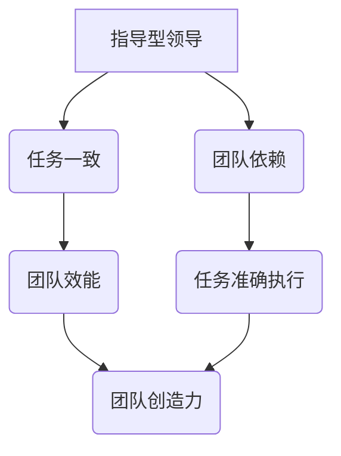

                 

# 《从管理到领导：角色转变的艺术》

## 关键词
- 管理到领导角色转变
- 领导艺术
- 领导力模型与理论
- 组织变革
- 团队建设

## 摘要
本文旨在探讨从管理到领导的角色转变，解析这一转变过程中涉及的挑战、策略和实践。文章分为三个部分，首先介绍了管理基础和领导特质，接着分析了从管理到领导的转型路径，最后探讨了领导力与组织变革的关系。通过全面而深入的阐述，本文旨在帮助读者理解领导艺术，提升个人领导力，为组织发展贡献积极力量。

### 《从管理到领导：角色转变的艺术》目录大纲

#### 第一部分：管理基础与领导特质

##### 第1章：管理理念与领导艺术

###### 1.1 管理与领导的定义

###### 1.2 管理者与领导者的区别

###### 1.3 管理与领导的核心要素

###### 1.4 成功领导者的特质

##### 第2章：管理技能提升

###### 2.1 沟通技巧

###### 2.2 决策与问题解决

###### 2.3 团队建设与管理

###### 2.4 目标设定与时间管理

##### 第3章：领导力模型与理论

###### 3.1 领导力模型概述

###### 3.2 赛格迪奇领导力模型

###### 3.3 情境领导理论

###### 3.4 领导力发展的路径

##### 第4章：领导力实践

###### 4.1 领导力开发

###### 4.2 领导力诊断与评估

###### 4.3 领导力发展计划

###### 4.4 领导力与组织文化

#### 第二部分：从管理到领导的转型

##### 第5章：角色转变的挑战

###### 5.1 角色转变的常见问题

###### 5.2 面对变革的勇气

###### 5.3 跨越能力鸿沟

###### 5.4 管理惯性与领导思维

##### 第6章：领导力发展的路径

###### 6.1 自我认知与自我提升

###### 6.2 建立影响力

###### 6.3 持续学习与适应变化

###### 6.4 价值观与领导力

##### 第7章：成功转型的策略

###### 7.1 明确目标与使命

###### 7.2 发挥个人优势

###### 7.3 建立支持系统

###### 7.4 处理反对声音

##### 第8章：领导者的领导风格

###### 8.1 领导风格的定义

###### 8.2 领导风格与团队效能

###### 8.3 适应不同风格的员工

###### 8.4 领导风格的转变

#### 第三部分：领导力与组织变革

##### 第9章：领导力与组织发展

###### 9.1 组织发展的动力

###### 9.2 变革领导者的角色

###### 9.3 变革管理策略

###### 9.4 领导力在组织变革中的挑战

##### 第10章：构建高效团队

###### 10.1 团队建设的原则

###### 10.2 高效团队的特征

###### 10.3 团队协作与冲突管理

###### 10.4 团队领导者的角色

##### 第11章：领导力与企业文化

###### 11.1 企业文化与领导力

###### 11.2 企业文化的塑造

###### 11.3 领导力在企业文化中的影响

###### 11.4 企业文化变革的领导力

#### 附录

##### 附录 A：领导力工具与方法

###### 11.1 领导力测评工具

###### 11.2 领导力发展模型

###### 11.3 领导力培训方法

##### 附录 B：参考文献与推荐阅读

### 引言

在现代企业的快速发展中，管理者和领导者扮演着至关重要的角色。然而，管理并不等同于领导，两者的核心目标虽然都是提升组织绩效，但实现路径却截然不同。从管理到领导的角色转变，是每个领导者必须经历的重要阶段。这一转变不仅涉及技能的提升，更是一种思维模式的转变。本文旨在深入探讨这一转变过程中的关键要素、挑战和实践，帮助读者理解并掌握领导艺术。

管理更多关注的是任务和流程的优化，强调的是效率和规范；而领导则更注重愿景的塑造和团队的动力，强调的是影响力和激发潜力。管理是执行的工具，而领导则是变革的引擎。在这篇文章中，我们将逐步分析管理到领导角色转变的各个方面，旨在帮助读者实现这一重要转型。

### 第一部分：管理基础与领导特质

#### 第1章：管理理念与领导艺术

##### 1.1 管理与领导的定义

在探讨管理理念与领导艺术之前，我们首先需要明确管理与领导的定义。管理，通常指的是一系列协调资源以实现特定目标的过程。它包括规划、组织、领导和控制等活动，旨在确保资源的有效利用和目标的达成。管理强调的是效率、规范和流程。

而领导，则更多地关注于影响和激励他人，以实现共同的目标。领导不仅涉及到任务和目标的实现，更重要的是愿景的塑造和团队动力的激发。领导力是关于如何引领他人，而不是单纯地控制或指挥。

##### 1.2 管理者与领导者的区别

管理者与领导者之间存在显著的差异。管理者通常负责确保组织的日常运营，制定和执行策略，以及管理资源和预算。他们的角色更多是执行层面的，注重的是流程和效率。

领导者则更加注重长远的发展，他们不仅仅是执行者，更是变革的推动者。领导者关注的是团队的成长、员工的能力提升和组织的愿景。他们的工作是通过激发员工的潜力和创造力，实现组织的长远目标。

| 特征 | 管理者 | 领导者 |
| --- | --- | --- |
| 目标 | 短期目标，注重效率 | 长期目标，注重变革和愿景 |
| 职责 | 任务执行，流程管理 | 激发潜力，塑造文化 |
| 关系 | 指导与监督 | 影响、激励、信任 |
| 方法 | 规范、控制、执行 | 沟通、协作、愿景塑造 |

##### 1.3 管理与领导的核心要素

管理的核心要素包括规划、组织、领导和控制。规划是管理的基础，它涉及到设定目标、制定策略和规划行动。组织则是将资源进行合理配置，确保任务的有效执行。领导则是通过沟通和激励，确保团队成员积极投入工作。控制则是通过监控和反馈，确保目标的实现。

领导的核心要素则包括愿景、影响力、团队建设和变革能力。领导者的首要任务是塑造愿景，明确组织的方向和目标。影响力则是领导者通过自身的行为和决策，影响和激励团队成员。团队建设则是通过培养团队精神，提升团队的整体绩效。变革能力则是领导者面对变革时，能够引领团队适应和应对变化的能力。

##### 1.4 成功领导者的特质

成功领导者具备一系列的特质，这些特质使他们能够有效地引领团队，实现组织的愿景。以下是成功领导者的一些关键特质：

1. **愿景能力**：成功领导者能够清晰地描述组织的愿景，并激发团队成员的认同感。

2. **影响力**：领导者通过自身的言行和决策，影响和激励团队成员，使他们愿意为实现组织目标而努力。

3. **沟通能力**：领导者能够有效地传达信息，倾听员工的意见和建议，建立良好的沟通渠道。

4. **决策能力**：领导者能够在复杂的环境中做出明智的决策，并承担相应的责任。

5. **团队建设能力**：领导者能够培养团队精神，提升团队的整体绩效。

6. **变革能力**：领导者能够引领团队适应和应对变化，推动组织的持续发展。

7. **自我提升能力**：领导者不断学习、自我反思，提升自身的领导能力。

8. **价值观**：领导者拥有坚定的价值观，并在日常工作中践行这些价值观，赢得员工的信任和尊重。

通过了解管理与领导的定义、差异、核心要素和成功领导者的特质，读者可以更好地理解管理到领导的角色转变。接下来，我们将进一步探讨管理技能的提升、领导力模型与理论，以及领导力实践等方面。

### 第2章：管理技能提升

#### 2.1 沟通技巧

沟通技巧是管理中至关重要的一环，有效的沟通能够确保信息的准确传递，减少误解和冲突，提升团队协作效率。以下是提升沟通技巧的一些关键步骤：

1. **明确沟通目的**：在沟通前，明确沟通的目的和目标，确保双方对沟通的内容和期望有清晰的认识。

2. **倾听**：倾听是有效沟通的基础，通过倾听，领导者可以了解员工的需求、问题和建议，从而做出更加明智的决策。

3. **表达清晰**：在表达时，要确保语言简洁明了，避免使用模糊或含糊不清的表述，确保信息的准确传递。

4. **反馈与确认**：在沟通过程中，及时给予反馈，并确认对方是否理解了你的意思，避免因误解导致的误操作或错误。

5. **使用多种沟通渠道**：根据不同的沟通内容和目的，选择合适的沟通渠道，如面对面交流、电子邮件、电话会议等。

6. **培养同理心**：领导者需要站在员工的角度思考问题，理解他们的需求和困扰，从而更有效地沟通。

#### 2.2 决策与问题解决

决策与问题解决是管理者日常工作中必不可少的部分。以下是一些提升决策与问题解决能力的建议：

1. **信息收集与分析**：在做出决策前，充分收集和分析相关信息，确保决策的依据充分、准确。

2. **制定备选方案**：在解决问题时，不仅要有解决方案，还要有备选方案，以应对可能出现的变化和挑战。

3. **评估风险与收益**：在决策过程中，要全面评估决策的风险和收益，确保决策的可行性和合理性。

4. **团队合作**：在解决问题时，充分利用团队的力量，通过集体智慧，找到最佳的解决方案。

5. **及时决策与行动**：在面临问题时，要迅速做出决策并采取行动，避免拖延导致的损失。

6. **反思与总结**：在决策和问题解决后，及时反思和总结，吸取经验教训，提升未来的决策质量。

#### 2.3 团队建设与管理

团队建设与管理是提升团队绩效和员工满意度的重要手段。以下是一些团队建设与管理的建议：

1. **明确团队目标**：确保团队成员对团队的目标有清晰的认识，并为之共同努力。

2. **建立信任**：通过开放沟通、尊重和信任，建立团队成员之间的信任关系，提升团队的凝聚力。

3. **角色分工与协作**：明确每个团队成员的角色和职责，确保团队协作的高效性。

4. **激励与认可**：通过激励机制，激发团队成员的工作热情和积极性，对优秀表现给予认可和奖励。

5. **培训与发展**：为团队成员提供培训和发展机会，提升他们的专业技能和综合能力。

6. **反馈与改进**：定期收集团队成员的反馈，针对团队建设和管理中的问题进行改进。

#### 2.4 目标设定与时间管理

目标设定与时间管理是管理中至关重要的环节，以下是一些提升目标设定与时间管理能力的建议：

1. **明确目标**：确保设定的目标是具体、可衡量、可实现、相关性强和有时限的（SMART原则）。

2. **分解目标**：将大目标分解为小目标，确保每个小目标都明确、具体，并易于实现。

3. **优先级排序**：根据目标的紧急程度和重要性，对任务进行优先级排序，确保关键任务得到优先处理。

4. **时间规划**：制定详细的时间规划表，确保每个任务都有明确的时间安排和执行计划。

5. **避免拖延**：克服拖延习惯，确保按时完成任务，避免因拖延导致的损失和压力。

6. **定期复盘**：在目标实现后，及时进行复盘，总结经验教训，为未来的目标设定和时间管理提供参考。

通过提升沟通技巧、决策与问题解决能力、团队建设与管理能力以及目标设定与时间管理能力，管理者可以显著提升团队的整体绩效和员工满意度。在接下来的章节中，我们将进一步探讨领导力模型与理论，以及领导力实践等方面，帮助读者深入了解领导力的内涵和实质。

### 第3章：领导力模型与理论

#### 3.1 领导力模型概述

领导力模型是对领导行为和风格的理论总结，它有助于我们理解和应用领导力。不同的领导力模型从不同的角度阐述了领导力的重要性，为领导者提供了多样化的视角。以下是一些常见的领导力模型：

##### **费德勒领导模型**

费德勒领导模型认为，领导效果取决于领导者与情境因素的关系。该模型将领导风格分为任务导向型（关注任务完成）和关系导向型（关注人际关系）。领导者需要根据情境的不同，灵活调整领导风格，以实现最佳效果。

##### **赫赛-布兰查德领导模型**

赫赛-布兰查德领导模型，也称为情境领导模型，提出领导者应根据下属的成熟度水平调整领导风格。成熟度包括下属的能力和意愿，领导者需要根据不同情境，选择不同的领导风格。

##### **变革型领导模型**

变革型领导模型强调领导者的愿景激励能力和变革推动能力。变革型领导者通过激发下属的潜能，引领他们共同实现组织的变革目标。该模型认为，领导者需要具备较强的沟通能力、影响力、变革推动力和创新能力。

##### **授权型领导模型**

授权型领导模型认为，领导者通过赋予下属权力和责任，促进他们的自主性和创造力。领导者需要信任下属，提供必要的支持和资源，以实现组织的共同目标。

#### 3.2 赛格迪奇领导力模型

赛格迪奇领导力模型，由赛格迪奇（Senge）提出，主要关注系统思考在领导力中的作用。该模型认为，领导者需要具备系统思考的能力，以应对复杂多变的环境。系统思考包括五个核心要素：共同愿景、团队学习、改变心智模式、自我超越和系统观察。

1. **共同愿景**：领导者需要明确组织的愿景，并使团队成员共同认同和追求这一愿景。

2. **团队学习**：领导者需要推动团队的学习和成长，通过共同学习，提升团队的协作能力。

3. **改变心智模式**：领导者需要引导团队成员改变传统的思维模式，培养系统思考的能力。

4. **自我超越**：领导者需要自我提升，不断突破自我限制，成为团队成长的榜样。

5. **系统观察**：领导者需要具备系统观察的能力，从全局角度分析问题，做出明智的决策。

#### 3.3 情境领导理论

情境领导理论，由赫赛（Hersey）和布兰查德（Blanchard）提出，强调领导者应根据下属的成熟度水平调整领导风格。该理论将领导风格分为四个阶段：

1. **指导型领导**：下属成熟度低，领导者需要提供具体的指导和监督，确保任务的完成。

2. **推销型领导**：下属成熟度较低，领导者需要通过沟通和激励，促使下属接受和执行任务。

3. **参与型领导**：下属成熟度较高，领导者需要与下属共同参与决策，提高他们的参与感和责任感。

4. **授权型领导**：下属成熟度高，领导者需要赋予下属足够的自主权，鼓励他们独立完成任务。

情境领导理论认为，领导者的成功不仅取决于领导风格，还取决于下属的成熟度。领导者需要根据不同情境，灵活调整领导风格，以实现最佳效果。

#### 3.4 领导力发展的路径

领导力发展是一个持续的过程，领导者需要不断学习和提升自己的能力。以下是一些领导力发展的路径：

1. **自我认知**：领导者需要了解自己的优势和劣势，明确自己的价值观和信念，从而更好地发挥领导作用。

2. **学习与培训**：通过参加培训课程、阅读书籍、参加工作坊等方式，不断提升自己的知识和技能。

3. **实践与反思**：在实际工作中，领导者需要不断实践，并反思自己的行为和决策，从中学习和成长。

4. **建立人际关系**：领导者需要与团队成员建立良好的关系，通过沟通和合作，提升团队的凝聚力和效率。

5. **持续改进**：领导者需要不断反思和改进自己的领导风格和方法，以适应不断变化的环境。

通过了解不同的领导力模型和理论，领导者可以更好地认识自己的领导风格，并根据不同情境，灵活调整领导策略。在领导力发展的过程中，领导者需要不断学习和提升自己的能力，以实现组织的长期发展。

### 第4章：领导力实践

#### 4.1 领导力开发

领导力开发是提升个人领导能力的系统过程，旨在培养领导者的愿景、决策能力、沟通技巧和团队管理能力。以下是领导力开发的几个关键步骤：

1. **自我评估**：领导者首先需要了解自己的优势和劣势，明确自己的价值观和信念。通过自我评估，领导者可以找到提升领导能力的方向。

2. **目标设定**：设定清晰的个人和职业发展目标，确保目标具体、可衡量、可实现。目标设定有助于领导者明确努力的方向和动力。

3. **学习与培训**：参加领导力培训课程、阅读相关书籍、参加工作坊等，不断丰富自己的知识和技能。学习与培训是提升领导力的重要途径。

4. **实践与反思**：在实际工作中，领导者需要不断实践所学知识，并在实践中反思和总结。通过实践与反思，领导者可以不断改进自己的领导方法。

5. **建立人际关系**：与团队成员建立良好的关系，通过沟通和合作，提升团队的凝聚力和效率。建立人际关系有助于领导者更好地了解团队需求和问题。

6. **持续改进**：领导者需要不断反思和改进自己的领导风格和方法，以适应不断变化的环境。持续改进是提升领导力的关键。

#### 4.2 领导力诊断与评估

领导力诊断与评估是识别领导力差距和优化领导能力的重要环节。以下是领导力诊断与评估的几个步骤：

1. **确定评估目标**：明确领导力诊断与评估的目的，如提升领导能力、改进团队绩效等。

2. **收集数据**：通过问卷调查、访谈、观察等方式，收集领导者的行为、表现和反馈数据。

3. **分析数据**：对收集到的数据进行分析，识别领导者的优势和劣势，以及存在的问题。

4. **制定改进计划**：根据分析结果，制定具体的改进计划，如参加培训、调整领导风格等。

5. **实施改进计划**：实施改进计划，通过实践和反思，不断提升领导能力。

6. **持续评估**：定期对领导力改进效果进行评估，确保改进计划的有效性，并根据评估结果进行调整。

#### 4.3 领导力发展计划

领导力发展计划是系统化提升领导力的策略，旨在确保领导者在面对不同挑战时，能够充分发挥领导能力。以下是领导力发展计划的几个关键步骤：

1. **确定发展目标**：明确领导力发展计划的目标，如提升领导能力、改进团队绩效等。

2. **制定发展策略**：根据发展目标，制定具体的发展策略，如培训、教练、实践等。

3. **识别关键能力**：识别领导者需要提升的关键能力，如沟通技巧、决策能力、团队管理能力等。

4. **设计培训方案**：根据关键能力，设计相应的培训方案，包括内部培训、外部培训、实践项目等。

5. **实施培训方案**：实施培训方案，确保领导者能够充分吸收和应用所学知识。

6. **跟踪与反馈**：对培训效果进行跟踪和反馈，确保领导力发展计划的实施效果。

7. **持续改进**：根据跟踪和反馈结果，持续改进领导力发展计划，确保其符合实际需求。

#### 4.4 领导力与组织文化

领导力与组织文化密切相关，良好的组织文化有助于领导者更好地发挥领导力。以下是领导力与组织文化的几个关键点：

1. **共同愿景**：领导者需要明确组织的愿景，并与团队成员共同追求。共同愿景有助于增强团队的凝聚力和向心力。

2. **价值观**：领导者需要树立和传播组织的价值观，确保团队成员在行为和决策上与价值观保持一致。

3. **开放沟通**：领导者需要建立开放、透明、真诚的沟通渠道，确保信息的畅通和透明。

4. **信任与尊重**：领导者需要建立信任和尊重的氛围，鼓励团队成员自由表达意见和提出建议。

5. **支持与鼓励**：领导者需要支持团队成员的工作，鼓励他们发挥潜力，为组织的成功贡献力量。

6. **持续改进**：领导者需要推动组织的持续改进，鼓励团队成员不断学习和成长。

通过领导力开发、诊断与评估、发展计划和领导力与组织文化的建设，领导者可以不断提升个人领导能力，为组织的长期发展贡献力量。在接下来的章节中，我们将探讨从管理到领导的转型过程中的挑战和策略。

### 第5章：角色转变的挑战

#### 5.1 角色转变的常见问题

从管理到领导的转型并非一蹴而就，过程中往往伴随着诸多挑战。以下是一些角色转变过程中常见的难题及应对策略：

##### **1. 权力转移的困难**

在从管理到领导的角色转变过程中，管理者需要将一部分权力下放给下属，以培养他们的自主性和责任感。然而，许多管理者在面临权力转移时，往往担心失去对团队的掌控，导致难以放手。

**应对策略**：领导者需要建立信任，明确下属的能力和责任，逐步将权力下放。通过设定明确的绩效目标和反馈机制，确保团队成员在新的权力体系下能够独立完成任务。

##### **2. 团队适应问题**

领导角色要求领导者更多地关注团队的发展和激励，而非仅仅关注任务的完成。这可能导致团队成员在初期对领导者的风格和方法产生疑惑或不适应。

**应对策略**：领导者需要通过沟通和培训，帮助团队成员理解新的领导风格和目标。同时，领导者可以邀请团队成员参与决策过程，增强他们的参与感和归属感。

##### **3. 压力与焦虑**

领导角色往往伴随着更高的责任和压力，管理者可能因为无法立即看到成果而感到焦虑。

**应对策略**：领导者需要学会管理自己的情绪和压力，通过锻炼、冥想等方式缓解焦虑。同时，领导者可以寻求同事和下属的支持，建立良好的沟通渠道，分享压力和经验。

##### **4. 惯性思维**

管理者在长期的职业生涯中可能形成了一些固定的思维模式和管理习惯，这可能会阻碍他们成为领导者。

**应对策略**：领导者需要定期反思自己的思维和行为，识别和改变不适应领导角色的习惯。通过学习新的领导理论和方法，不断提升自身的领导能力。

##### **5. 价值观冲突**

在领导角色中，领导者需要树立和传播组织的价值观，但有时个人的价值观可能与组织价值观存在冲突。

**应对策略**：领导者需要明确自己的价值观，并与组织价值观保持一致。在遇到冲突时，领导者可以通过沟通和协调，寻找双方都能接受的解决方案。

#### 5.2 面对变革的勇气

从管理到领导的转型本质上是一种变革，领导者需要具备面对变革的勇气和决心。以下是一些面对变革的建议：

##### **1. 认识变革的必然性**

领导者需要认识到，变革是组织发展的必然过程，它有助于提升组织的竞争力和创新能力。

**建议**：领导者可以通过学习历史案例，了解变革的重要性，增强对变革的认识。

##### **2. 建立变革愿景**

领导者需要明确变革的愿景和目标，使团队成员对变革有清晰的认识。

**建议**：领导者可以通过沟通和讨论，使团队成员理解变革的必要性和优势，激发他们的参与热情。

##### **3. 建立变革团队**

领导者可以组建一支变革团队，负责推动和实施变革。团队成员可以来自不同部门和层级，以确保变革的全面性和多样性。

**建议**：领导者可以通过选拔有潜力和热情的团队成员，共同推动变革。

##### **4. 强化沟通与反馈**

在变革过程中，领导者需要保持与团队成员的密切沟通，及时了解他们的反馈和问题。

**建议**：领导者可以通过定期的会议、反馈表和互动平台，确保信息的畅通和透明。

##### **5. 耐心与持续改进**

变革是一个长期的过程，领导者需要保持耐心和决心，不断调整和优化变革策略。

**建议**：领导者可以通过反思和总结，持续改进变革过程，确保变革的顺利进行。

#### 5.3 跨越能力鸿沟

从管理到领导的角色转变，往往伴随着能力的提升需求。以下是一些跨越能力鸿沟的建议：

##### **1. 自我评估与目标设定**

领导者首先需要了解自己的优势和劣势，明确需要提升的能力。

**建议**：领导者可以通过自我评估工具和360度反馈，识别自己的能力短板，并设定明确的提升目标。

##### **2. 学习与培训**

通过参加培训课程、阅读相关书籍、参加工作坊等，领导者可以不断提升自己的知识和技能。

**建议**：领导者可以选择针对性的学习资源，确保所学知识能够应用于实际工作中。

##### **3. 实践与反思**

在实际工作中，领导者需要不断实践所学知识，并在实践中反思和总结。

**建议**：领导者可以通过项目实践和团队协作，提升自己的领导能力和执行力。

##### **4. 建立导师制度**

通过建立导师制度，领导者可以与经验丰富的导师进行交流和指导，快速提升自己的能力。

**建议**：领导者可以主动寻求导师的帮助，通过定期交流和反馈，获得宝贵的指导和建议。

##### **5. 持续改进**

领导者需要不断反思和改进自己的领导方法，以适应不断变化的环境。

**建议**：领导者可以通过定期复盘和评估，识别改进机会，不断提升自己的领导力。

通过面对角色转变的挑战，领导者可以不断提升自己的能力，实现从管理到领导的顺利转型。在接下来的章节中，我们将探讨领导力发展的路径和成功转型的策略。

### 第6章：领导力发展的路径

#### 6.1 自我认知与自我提升

领导力发展始于自我认知，领导者需要深入了解自己的优点、弱点、价值观和信念。以下是一些自我认知与自我提升的关键步骤：

1. **自我反思**：定期进行自我反思，思考自己在领导过程中的行为和决策，识别优点和需要改进的地方。

2. **获取反馈**：主动寻求同事、下属和导师的反馈，了解他们在领导力方面的看法和建议。

3. **建立个人目标**：根据自我反思和反馈，设定明确的个人和职业发展目标，确保目标具有挑战性和可实现性。

4. **持续学习**：通过阅读书籍、参加培训课程、参加工作坊等方式，不断扩展知识和技能。

5. **实践与反思**：在实际工作中，不断实践所学知识，并在实践中反思和总结，以提升自己的领导能力。

#### 6.2 建立影响力

领导力的核心在于影响和激励他人，以下是一些建立影响力的方法：

1. **塑造愿景**：领导者需要明确组织的愿景和目标，并与团队成员共同追求。

2. **沟通与倾听**：通过有效的沟通和倾听，领导者可以建立信任和尊重，增强团队凝聚力。

3. **激励与认可**：领导者需要激励团队成员，对他们的努力和成就给予认可和奖励。

4. **建立榜样**：领导者需要通过自己的行为和决策，树立良好的榜样，影响和激励团队成员。

5. **培养团队精神**：领导者需要培养团队精神，促进团队成员之间的协作和互助。

#### 6.3 持续学习与适应变化

领导力是一个动态的过程，领导者需要持续学习，适应变化。以下是一些持续学习和适应变化的方法：

1. **保持好奇心**：对新的知识、技术和理念保持好奇心，不断探索和尝试。

2. **培养学习习惯**：定期阅读相关书籍、参加培训课程、参加工作坊等，不断提升自己的知识和技能。

3. **反思与总结**：在实际工作中，不断反思和总结，从经验中学习，不断改进自己的领导方法。

4. **适应变化**：领导者需要具备适应变化的能力，迅速调整自己的策略和行动，以应对外部环境的变化。

5. **灵活应对**：在面对不确定性时，领导者需要保持灵活，灵活调整领导风格和方法，以适应不同情境。

#### 6.4 价值观与领导力

领导力不仅仅是技术和技能的体现，更是价值观的体现。以下是一些关于价值观与领导力的重要观点：

1. **明确价值观**：领导者需要明确自己的价值观，并在日常工作和决策中践行这些价值观。

2. **价值观传播**：领导者需要通过言行和决策，将价值观传递给团队成员，确保团队在行为和决策上与价值观保持一致。

3. **价值观塑造文化**：领导者需要通过价值观塑造组织的文化，使组织具有强大的凝聚力和向心力。

4. **价值观引导行为**：领导者需要通过价值观引导团队成员的行为，确保团队在追求共同目标时，行为符合组织的价值观。

5. **价值观持续改进**：领导者需要不断反思和改进自己的价值观，确保其与组织的长期发展目标保持一致。

通过自我认知与自我提升、建立影响力、持续学习与适应变化，以及明确价值观，领导者可以不断提升自己的领导能力，实现从管理到领导的顺利转型。在接下来的章节中，我们将探讨成功转型的策略和领导者的领导风格。

### 第7章：成功转型的策略

从管理到领导的角色转变是一个复杂且具有挑战性的过程，但通过一系列策略和行动计划，这一转变可以变得更加有序和高效。以下是几个关键策略，帮助管理者成功转型为领导者。

#### 7.1 明确目标与使命

明确的目标和使命是领导者成功转型的基石。以下是一些步骤来明确目标和使命：

1. **制定个人愿景**：思考你希望成为什么样的领导者，你的长期职业目标是什么。这个愿景应该与组织的愿景相一致。

2. **确立组织使命**：了解组织的使命和目标，确保你的个人目标和组织的战略方向相匹配。

3. **制定具体目标**：将愿景和使命转化为具体的目标和行动计划。这些目标应该是具体、可衡量、可实现、相关性强和有时限的（SMART原则）。

4. **与团队共享**：与团队成员分享你的目标和使命，确保他们理解并支持你的领导方向。

#### 7.2 发挥个人优势

发挥个人优势是提升领导力的有效途径。以下是一些建议：

1. **识别优势**：通过自我评估和他人反馈，识别自己的优势和独特技能。

2. **强化优势**：通过培训和持续学习，提升自己在优势领域的专业能力。

3. **利用优势**：在领导过程中，充分利用你的优势，例如沟通技巧、决策能力或团队建设能力。

4. **培养多样性**：尽管发挥个人优势很重要，但领导者也需要意识到自己的局限性，并培养多样性，以更好地理解和支持团队成员。

#### 7.3 建立支持系统

建立支持系统是领导力发展的关键。以下是一些建议：

1. **寻找导师**：寻找经验丰富的导师，他们可以提供宝贵的指导和建议，帮助你快速成长。

2. **建立网络**：与不同背景和专业领域的同事建立联系，这些网络可以帮助你获取资源、信息和机会。

3. **团队支持**：建立支持性的团队环境，鼓励团队成员相互支持和学习，共同成长。

4. **利用组织资源**：充分利用组织提供的培训、发展和支持资源，如领导力发展项目、研讨会和工作坊。

#### 7.4 处理反对声音

在领导过程中，难免会遇到反对声音。以下是一些建议来处理反对：

1. **倾听和理解**：认真倾听反对者的意见，理解他们的观点和担忧。

2. **沟通和解释**：清晰地解释你的决策和行动，确保反对者了解背后的逻辑和动机。

3. **寻求共识**：与反对者共同寻找解决方案，争取共识，减少冲突。

4. **保持冷静和耐心**：在面对反对声音时，保持冷静和耐心，避免情绪化的反应。

通过明确目标与使命、发挥个人优势、建立支持系统和处理反对声音，管理者可以更好地实现从管理到领导的顺利转型。在接下来的章节中，我们将探讨领导者的领导风格以及如何适应不同的员工风格。

### 第8章：领导者的领导风格

#### 8.1 领导风格的定义

领导风格是指领导者在与团队成员互动过程中表现出的行为和态度。领导风格直接影响领导效果和团队绩效。以下是几种常见的领导风格：

##### **1. 指导型领导**

指导型领导强调任务的具体执行，领导者详细指导团队成员的工作。这种风格适合新员工或缺乏经验的团队成员。

**优点**：确保任务的准确执行和团队的一致性。

**缺点**：可能导致团队成员依赖性强，缺乏自主性。

##### **2. 参与型领导**

参与型领导鼓励团队成员参与决策和问题解决，提高团队参与度和归属感。

**优点**：增强团队成员的参与感和责任感，提高团队创造力。

**缺点**：可能导致决策过程复杂，效率降低。

##### **3. 支持型领导**

支持型领导关注团队成员的情感需求，提供帮助和支持，以增强团队成员的自信心。

**优点**：增强团队成员的满意度和忠诚度。

**缺点**：可能导致任务执行效率降低，任务目标模糊。

##### **4. 授权型领导**

授权型领导将权力下放给团队成员，鼓励他们自主决策和完成任务。

**优点**：提高团队成员的自主性和创造力，促进团队成长。

**缺点**：可能面临团队成员能力不足或决策失误的风险。

#### 8.2 领导风格与团队效能

领导风格对团队效能有着重要影响。以下是一个简单的Mermaid流程图，展示不同领导风格对团队效能的影响：

通过流程图可以看出，指导型领导强调任务的准确执行和团队的一致性，这有助于提高团队效能，但可能导致团队依赖性强。参与型领导和支持型领导则更关注团队参与度和情感需求，这有助于提高团队创造力和满意度，但可能降低任务执行效率。授权型领导则强调自主性和创造力，这有助于团队成长和绩效提升，但可能面临团队成员能力不足的风险。

#### 8.3 适应不同风格的员工

每个员工都有其独特的风格和需求，领导者需要根据员工的特点，调整自己的领导风格。以下是一些适应不同风格员工的方法：

1. **了解员工风格**：通过观察和沟通，了解员工的个性和工作风格，包括他们的需求、偏好和挑战。

2. **个性化沟通**：根据员工的特点，采用不同的沟通方式，例如，对内向的员工，可能需要更多的面对面交流，对外向的员工，可能需要更多电话或电子邮件沟通。

3. **提供支持**：根据员工的需求，提供适当的支持，例如，对需要更多指导的员工，提供详细的任务说明和反馈，对需要更多自主性的员工，提供更多的自由和责任。

4. **培养员工能力**：通过培训和指导，帮助员工提升技能和能力，使他们能够更好地适应工作需求。

5. **建立信任**：与员工建立信任关系，确保他们感受到领导者的支持和尊重，这有助于提高员工的工作满意度和忠诚度。

通过理解不同领导风格的特点和对团队效能的影响，以及适应不同员工的风格和需求，领导者可以更有效地管理团队，提高团队绩效。在接下来的章节中，我们将探讨领导力与组织发展的关系。

### 第9章：领导力与组织发展

#### 9.1 组织发展的动力

组织发展是一个动态过程，其动力来源于多个因素，包括外部环境和内部条件。以下是一些关键动力因素：

##### **1. 市场需求**

市场需求是推动组织发展的核心动力之一。随着市场环境的变化，组织需要不断调整战略，以适应市场需求的变化。例如，新技术、新客户和新的商业模式都可能对组织发展产生深远影响。

##### **2. 技术创新**

技术创新是推动组织发展的另一个关键因素。技术的进步不仅改变了生产方式，也改变了市场结构和客户需求。组织需要不断创新，以保持竞争力。

##### **3. 内部管理**

内部管理能力是组织发展的基石。有效的内部管理包括高效的运营、良好的团队合作、明确的决策流程和良好的组织文化。这些因素共同促进了组织的稳定和持续发展。

##### **4. 人力资源**

人力资源是组织发展的关键。组织需要吸引、培养和保留人才，确保组织具有足够的技能和知识来应对挑战和机遇。

##### **5. 组织文化**

组织文化是推动组织发展的内在动力。一个积极、开放和包容的文化能够激发员工的创造力和动力，促进组织的创新和成长。

#### 9.2 变革领导者的角色

在组织发展过程中，变革领导者扮演着至关重要的角色。以下是一些变革领导者的关键角色：

##### **1. 愿景塑造者**

变革领导者需要明确组织的愿景，并使这一愿景成为全体员工的共同目标。他们通过沟通和激励，使员工理解愿景的重要性，并为之努力。

##### **2. 变革推动者**

变革领导者需要推动组织内部的变革，确保变革能够顺利实施。他们需要识别变革的障碍，制定有效的变革策略，并确保员工理解变革的必要性和好处。

##### **3. 沟通者**

变革领导者需要与员工建立有效的沟通渠道，确保员工了解变革的进展和影响。通过开放、透明和真诚的沟通，变革领导者可以减少员工的疑虑和恐惧，增强他们对变革的支持。

##### **4. 支持者**

变革领导者需要支持员工的变革过程，提供必要的资源和指导。他们需要确保员工在变革过程中感受到支持，并能够克服遇到的挑战。

##### **5. 反思者**

变革领导者需要不断反思和评估变革的效果，确保变革能够实现预期的目标。通过定期的复盘和总结，变革领导者可以及时调整变革策略，确保变革的顺利进行。

#### 9.3 变革管理策略

成功实施变革需要一系列有效的管理策略。以下是一些关键的变革管理策略：

##### **1. 明确变革目标**

在实施变革前，领导者需要明确变革的目标和预期成果。这有助于确保变革的方向正确，并使全体员工明确变革的重要性。

##### **2. 建立变革团队**

领导者可以组建一个专门的变革团队，负责推动和实施变革。团队成员应来自不同部门和层级，以确保变革的全面性和多样性。

##### **3. 制定详细的计划**

领导者需要制定详细的变革计划，包括时间表、步骤、责任分配和预期成果。详细的计划有助于确保变革的有序实施。

##### **4. 强化沟通**

在变革过程中，领导者需要保持与员工的密切沟通，及时传达变革的信息和进展。通过定期的会议、报告和互动平台，领导者可以确保信息的畅通和透明。

##### **5. 解决阻力**

在变革过程中，领导者需要识别和解决变革的阻力。通过倾听员工的意见和反馈，领导者可以找到解决阻力的方法，确保变革的顺利进行。

##### **6. 持续改进**

变革是一个持续的过程，领导者需要不断评估和改进变革策略，确保变革能够实现预期的目标。通过定期的复盘和总结，领导者可以及时调整变革计划，确保变革的顺利进行。

通过理解组织发展的动力、变革领导者的角色和变革管理策略，领导者可以更有效地推动组织发展，实现组织的长期目标。在接下来的章节中，我们将探讨如何构建高效团队。

### 第10章：构建高效团队

#### 10.1 团队建设的原则

构建高效团队是领导者的重要任务，以下是一些团队建设的原则：

##### **1. 共同目标**

团队建设的基础是共同的目标。领导者需要确保团队成员对团队目标有清晰的认识，并为此共同努力。通过设定共同目标，团队成员可以更好地协作，提升团队绩效。

##### **2. 信任与尊重**

信任和尊重是团队协作的基石。领导者需要通过言行和决策，建立信任和尊重的氛围，确保团队成员之间能够真诚合作，共同面对挑战。

##### **3. 沟通与协作**

有效沟通和协作是高效团队的关键。领导者需要建立畅通的沟通渠道，鼓励团队成员自由表达意见和分享信息。通过协作，团队成员可以相互学习，共同解决问题。

##### **4. 多样性与包容**

多样性是团队建设的重要原则。领导者需要鼓励团队成员发挥各自的优势，并包容不同的观点和意见。多样性可以带来创新的思路，提升团队的创造力。

##### **5. 反馈与改进**

定期反馈和改进是团队建设的重要环节。领导者需要鼓励团队成员提供反馈，识别团队中的问题和不足，并采取改进措施。通过持续改进，团队可以不断提升绩效。

#### 10.2 高效团队的特征

高效团队具有以下特征：

##### **1. 高度的合作**

高效团队中的成员高度合作，共同努力实现团队目标。他们愿意分享资源和知识，支持彼此的工作。

##### **2. 明确的职责**

高效团队中的每个成员都有明确的职责和角色，了解自己的工作内容和预期成果。

##### **3. 有效的沟通**

高效团队中的沟通是开放、透明和及时的。团队成员可以自由表达意见，信息传递畅通无阻。

##### **4. 高度的信任**

高效团队中的成员相互信任，尊重彼此的观点和决策。这种信任关系有助于减少冲突，增强团队的凝聚力。

##### **5. 创新与创造力**

高效团队鼓励创新和创造力，成员愿意尝试新的想法和方法，不断探索和改进工作流程。

##### **6. 高绩效**

高效团队能够实现高绩效，团队成员共同努力，超越个人利益，追求团队的成功。

#### 10.3 团队协作与冲突管理

团队协作和冲突管理是构建高效团队的关键。以下是一些方法：

##### **1. 团队协作**

- **明确分工**：确保每个成员都了解自己的职责和任务。
- **共享资源**：鼓励团队成员共享知识和资源，提高协作效率。
- **定期会议**：通过定期会议，讨论团队进展和问题，确保团队成员保持同步。
- **激励机制**：建立激励机制，鼓励团队成员积极参与协作，提高团队士气。

##### **2. 冲突管理**

- **识别冲突**：领导者需要敏锐地识别团队中的冲突，并及时采取行动。
- **沟通解决**：通过开放、坦诚的沟通，解决冲突，确保问题得到妥善处理。
- **中立调解**：在冲突难以自行解决时，领导者可以充当中立调解者，帮助双方找到共识。
- **培训与教育**：通过培训和教育，提高团队成员的冲突管理能力，减少冲突的发生。

#### 10.4 团队领导者的角色

团队领导者扮演着多重角色，以下是一些关键角色：

##### **1. 指导者**

团队领导者需要为团队成员提供指导和支持，确保他们理解任务和要求，并能够顺利完成工作。

##### **2. 沟通者**

团队领导者需要建立有效的沟通渠道，确保团队成员之间的信息传递畅通，减少误解和冲突。

##### **3. 激励者**

团队领导者需要激励团队成员，激发他们的工作热情和积极性，确保团队保持高绩效。

##### **4. 冲突解决者**

团队领导者需要解决团队中的冲突，确保团队氛围和谐，减少冲突对团队绩效的影响。

##### **5. 发展推动者**

团队领导者需要关注团队成员的发展，提供培训和发展机会，提升他们的技能和能力。

通过遵循团队建设原则、识别高效团队的特征、有效管理团队协作与冲突，以及承担团队领导者的多重角色，领导者可以构建一个高效、协作和充满活力的团队。在接下来的章节中，我们将探讨领导力与企业文化的关系。

### 第11章：领导力与企业文化

#### 11.1 企业文化与领导力

企业文化是组织的灵魂，它影响着组织的运作方式、员工的行为和团队的表现。领导力与企业文化密切相关，优秀的领导力能够塑造和强化企业文化，推动组织的长期发展。

##### **1. 领导力对文化的影响**

- **价值观传递**：领导者通过言行和决策，传递组织的核心价值观，确保员工理解和认同这些价值观。
- **文化塑造**：领导者通过自己的行为和决策，塑造组织的文化，例如，鼓励创新、重视团队合作或强调客户服务。
- **行为规范**：领导者通过树立榜样，规范员工的行为，确保员工遵循组织的文化规范。

##### **2. 企业文化对领导力的影响**

- **领导风格**：企业文化会影响领导者的领导风格，例如，一个强调创新和自主性的企业文化可能会鼓励领导者采用参与型和授权型的领导风格。
- **决策方式**：企业文化会影响领导者的决策方式，例如，一个注重团队合作和沟通的企业文化可能会鼓励领导者采用团队决策的方法。
- **员工行为**：企业文化会影响员工的行为，例如，一个注重客户服务的文化可能会激励员工提供卓越的客户体验。

#### 11.2 企业文化的塑造

塑造企业文化是一个持续的过程，需要领导者的积极参与和持续努力。以下是一些关键步骤：

##### **1. 明确企业愿景和价值观**

领导者需要明确企业的愿景和价值观，并确保这些愿景和价值观贯穿于组织的各个层面。这可以通过企业使命宣言、核心价值观和员工手册等方式实现。

##### **2. 榜样作用**

领导者需要通过自己的行为和决策，成为企业文化的榜样。他们的言行和决策应该与组织的价值观保持一致，以树立良好的示范。

##### **3. 培训和教育**

领导者需要通过培训和教育，确保员工理解企业的愿景、价值观和文化规范。这可以通过新员工培训、内部研讨会和工作坊等方式实现。

##### **4. 激励和认可**

领导者需要通过激励机制，鼓励员工遵循企业的价值观和文化规范。这可以通过绩效评估、奖励和晋升等方式实现。

##### **5. 反馈和改进**

领导者需要定期收集员工的反馈，了解他们对企业文化的看法和建议。通过反馈和改进，领导者可以不断完善企业文化，确保其与组织的长期发展目标保持一致。

#### 11.3 领导力在企业文化中的影响

领导力在企业文化中扮演着关键角色，以下是一些领导力在企业文化中的影响：

##### **1. 影响员工行为**

领导者的行为和决策直接影响员工的行为。通过树立榜样和提供指导，领导者可以激励员工遵循组织的价值观和文化规范。

##### **2. 塑造组织氛围**

领导者的领导风格和组织氛围密切相关。领导者的行为和决策会影响组织的氛围，例如，一个开放、透明和合作的领导风格可以塑造积极的组织氛围。

##### **3. 促进团队协作**

领导者的领导力可以促进团队协作，提高团队的效率和绩效。通过鼓励团队合作和共享知识，领导者可以建立高效的团队。

##### **4. 增强员工忠诚度**

领导者的领导力可以增强员工的忠诚度，提高员工的满意度和留存率。通过关心员工的发展和福利，领导者可以建立员工对组织的忠诚。

##### **5. 推动企业文化变革**

在面临外部环境变化或内部问题时，领导者的领导力可以推动企业文化的变革。通过沟通和激励，领导者可以引导员工接受和适应新的文化变革。

通过理解领导力与企业文化的关系，领导者可以更有效地塑造和强化企业文化，推动组织的长期发展。在接下来的附录中，我们将介绍一些领导力工具和方法。

### 附录 A：领导力工具与方法

#### A.1 领导力测评工具

领导力测评工具是帮助领导者识别自身优势和劣势的重要工具。以下是一些常用的领导力测评工具：

##### **1. 360度反馈**

360度反馈是一种综合评估方法，通过收集来自同事、下属、上级和客户的反馈，对领导者的领导能力进行全面评估。这种方法有助于领导者了解自己的优点和需要改进的地方。

##### **2. 领导风格评估**

领导风格评估工具，如“领导风格问卷”（Leadership Style Inventory）和“迪斯克评估”（DiSC Assessment），帮助领导者识别自己的领导风格，了解如何根据不同情境调整领导风格。

##### **3. 领导力发展评估**

领导力发展评估工具，如“领导力发展问卷”（Leadership Development Inventory），帮助领导者识别个人和团队的发展需求，制定个性化的领导力发展计划。

#### A.2 领导力发展模型

领导力发展模型是指导领导者提升自身能力的框架。以下是一些常用的领导力发展模型：

##### **1. 赛格迪奇领导力模型**

赛格迪奇领导力模型（Senge's Leadership Model）强调系统思考在领导力中的作用，包括共同愿景、团队学习、改变心智模式、自我超越和系统观察。

##### **2. 布兰查德-赫赛领导力模型**

布兰查德-赫赛领导力模型（Hersey-Blanchard Situational Leadership Model）基于下属的成熟度水平，提出四种领导风格：指导型、推销型、参与型和授权型。

##### **3. 领导力五环模型**

领导力五环模型（The Five Practices of Exemplary Leadership Model）由凯兹（Kouzes and Posner）提出，包括明确价值观、创造共同愿景、挑战现状、加强团队合作和奖励贡献。

#### A.3 领导力培训方法

有效的领导力培训方法可以帮助领导者提升技能和自信心。以下是一些常用的领导力培训方法：

##### **1. 工作坊**

领导力工作坊是一种互动式培训方法，通过小组讨论、角色扮演和案例研究等活动，提高领导者的实践能力和团队合作能力。

##### **2. 案例学习**

案例学习是一种通过分析实际案例，探讨领导决策和应对策略的方法。这种方法有助于领导者理解和应用领导力原则。

##### **3. 模拟训练**

模拟训练通过模拟真实工作场景，让领导者练习决策和应对策略，提高实际操作能力。

##### **4. 一对一教练**

一对一教练是一种个性化培训方法，通过定期的指导和建议，帮助领导者解决实际问题和提升领导能力。

### 附录 B：参考文献与推荐阅读

为了帮助读者更深入地了解领导力和组织发展的相关理论和实践，以下是一些推荐的参考文献和阅读材料：

- **《领导力的五项修炼》（The Five Practices of Exemplary Leadership）**，作者：詹姆斯·凯兹和巴里·波斯纳。
- **《变革型领导力》（Transformational Leadership）**，作者：伯纳德·莫斯奇和亨利·瓦斯克尔。
- **《领导力的实践》（The Practice of Leadership）**，作者：詹姆斯·凯兹和巴里·波斯纳。
- **《领导力的艺术》（The Art of Leadership）**，作者：约翰·M·贝斯和巴里·波斯纳。
- **《领导者的选择》（The Leadership Choice）**，作者：迈克尔·吉多特。
- **《领导力的DNA》（The Leader's DNA）**，作者：丹·斯瓦尼和史蒂夫·凯斯。
- **《领导力之道》（The Leadership Challenge）**，作者：詹姆斯·凯兹和巴里·波斯纳。

通过阅读这些书籍，读者可以深入了解领导力的核心概念、理论和实践，进一步提升自己的领导能力。

### 作者信息

**作者：** AI天才研究院/AI Genius Institute & 禅与计算机程序设计艺术 /Zen And The Art of Computer Programming

在本文中，我们深入探讨了从管理到领导的角色转变，解析了领导力的核心概念、理论和实践。通过理解管理基础与领导特质、提升管理技能、应用领导力模型与理论、实践领导力，以及成功转型的策略，读者可以更好地实现这一重要转变，成为优秀的领导者。希望本文能为读者的领导力发展提供有价值的参考和指导。

