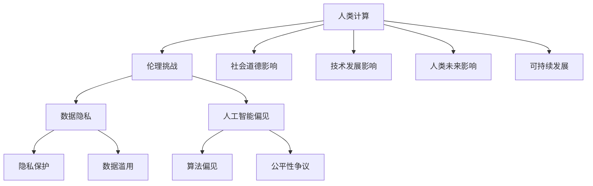

                 

# 《伦理挑战：应对人类计算带来的 ethical 问题》

> **关键词：** 伦理挑战、人类计算、人工智能、数据隐私、偏见与公平性、法律法规、社会责任、国际合作

> **摘要：** 随着人类计算技术的飞速发展，人工智能、大数据、云计算等技术的广泛应用，伦理挑战日益凸显。本文旨在探讨人类计算中面临的伦理挑战，包括数据隐私、人工智能的偏见与公平性等问题，并提出相应的应对策略与措施，以促进技术发展与社会进步的和谐统一。

## 第一部分: 伦理挑战的背景与重要性

### 第1章: 伦理挑战概述

#### 1.1 人类计算的伦理问题背景

##### 1.1.1 人工智能与伦理问题的联系

随着人工智能技术的发展，伦理问题逐渐成为社会关注的焦点。人工智能在医疗、金融、交通等领域的广泛应用，使得伦理问题的复杂性日益增加。例如，医疗领域中的伦理问题包括患者隐私保护、医疗数据共享的合理性与安全性等；金融领域中的伦理问题包括算法偏见导致的歧视、金融市场的不公平性等；交通领域中的伦理问题包括自动驾驶汽车的安全责任、道路使用者的权利与义务等。

##### 1.1.2 人类计算对伦理道德的挑战

人类计算技术的快速发展，对传统的伦理道德观念提出了新的挑战。例如，在数据隐私方面，随着大数据技术的广泛应用，个人隐私的保护变得尤为重要。然而，数据收集、处理和共享的过程中，可能会侵犯个人隐私，导致隐私泄露和数据滥用等问题。此外，人工智能的偏见与公平性问题，也对现有的伦理道德体系构成了挑战。算法偏见可能导致对特定群体的歧视，影响社会公平与正义。

##### 1.1.3 道德困境与现实影响

在人类计算技术的应用过程中，道德困境时常出现。例如，在医疗领域，当面对生命救援与隐私保护的冲突时，医生和医疗机构需要做出道德抉择。在自动驾驶领域，当面临道德两难问题时，如是否应该选择保护行人还是车辆，汽车制造商和开发者需要考虑伦理原则。这些道德困境不仅影响个人的道德判断，也对整个社会产生了深远的影响。

#### 1.2 伦理挑战的重要性

##### 1.2.1 对社会道德的影响

伦理挑战对社会的道德观念产生了深远的影响。人类计算技术的广泛应用，使得道德规范和伦理原则需要不断调整和更新。例如，在数据隐私方面，公众对隐私权的意识逐渐提高，要求企业和机构更加重视个人隐私保护。在人工智能领域，公平性与偏见问题引起了广泛的讨论，推动了社会对算法公正性的关注。

##### 1.2.2 对技术发展的影响

伦理挑战对技术的发展也产生了重要的影响。在人类计算技术的研发和应用过程中，伦理问题常常成为技术进步的瓶颈。例如，数据隐私保护措施的实施，可能需要额外的技术投入和资源。人工智能的偏见与公平性问题，也促使研究者不断探索新的算法和技术，以消除偏见，提高算法的公平性。

##### 1.2.3 对人类未来的影响

伦理挑战对人类未来的影响更加深远。人类计算技术的不断进步，将深刻改变人类社会的面貌。然而，如果伦理问题得不到有效解决，可能导致社会分裂、信任危机等问题。因此，应对伦理挑战，对人类社会的可持续发展具有重要意义。

##### 1.2.4 伦理挑战与可持续发展

伦理挑战与可持续发展密切相关。可持续发展要求技术发展与社会进步相协调，以确保人类福祉和自然环境得到平衡发展。伦理挑战的解决，有助于推动技术发展与社会进步的和谐统一，实现可持续发展的目标。

### 第一部分总结

伦理挑战是人类计算技术发展过程中不可避免的问题。通过对伦理挑战的背景与重要性的探讨，我们可以更好地理解人类计算技术的伦理困境，并认识到应对伦理挑战的紧迫性。在接下来的部分中，我们将进一步探讨伦理挑战的核心问题与领域，并提出相应的应对策略与措施。

---

**核心概念与联系：**

以下是关于人类计算中的伦理挑战的 Mermaid 流程图，展示了核心概念之间的联系：



**核心算法原理讲解：**

在数据隐私保护方面，常用的算法包括加密算法和哈希算法。以下是一个简化的伪代码，用于说明加密算法的基本原理：

```python
# 加密算法伪代码
def encrypt(message, key):
    encrypted_message = ""
    for char in message:
        encrypted_char = (ord(char) + key) % 256
        encrypted_message += chr(encrypted_char)
    return encrypted_message

# 哈希算法伪代码
def hash(message):
    hashed_message = ""
    for char in message:
        hashed_char = (ord(char) * 31) % 2**32
        hashed_message += str(hashed_char)
    return hashed_message
```

**数学模型和公式：**

在数据隐私保护中，常用的数学模型包括信息论模型。以下是一个简化的信息论模型，用于衡量隐私泄露的风险：

$$
RISK = \frac{P(\text{privacy leak})}{P(\text{no privacy leak})}
$$

其中，$RISK$ 表示隐私泄露的风险，$P(\text{privacy leak})$ 表示隐私泄露的概率，$P(\text{no privacy leak})$ 表示没有隐私泄露的概率。

**项目实战：**

以下是一个简单的数据加密项目实战案例，包括开发环境搭建、源代码实现和代码解读：

**开发环境搭建：**

- 安装 Python 3.8 或更高版本
- 安装加密库 `pycryptodome`

**源代码实现：**

```python
from Crypto.Cipher import AES
from Crypto.Util.Padding import pad, unpad
from Crypto.Random import get_random_bytes

def encrypt(message, key):
    cipher = AES.new(key, AES.MODE_CBC)
    ct_bytes = cipher.encrypt(pad(message.encode('utf-8'), AES.block_size))
    iv = cipher.iv
    return iv + ct_bytes

def decrypt(ct, key, iv):
    ct = ct[iv:]  # 切掉 IV 部分
    cipher = AES.new(key, AES.MODE_CBC, iv)
    pt = unpad(cipher.decrypt(ct), AES.block_size)
    return pt.decode('utf-8')

# 测试加密和解密功能
key = get_random_bytes(16)
message = "Hello, World!"

encrypted_message = encrypt(message, key)
print("Encrypted message:", encrypted_message)

decrypted_message = decrypt(encrypted_message, key, encrypted_message[:16])
print("Decrypted message:", decrypted_message)
```

**代码解读与分析：**

- `encrypt()` 函数：使用 AES 加密算法对明文进行加密，使用 CBC 模式，并使用 Padding 方法确保明文长度为块大小的整数倍。
- `decrypt()` 函数：使用 AES 加密算法对密文进行解密，并使用 Padding 方法去除 Padding 字节。
- 测试部分：生成随机密钥，加密明文，并解密密文，验证加密和解密功能。

**结论：**

通过上述项目实战，我们展示了如何使用 Python 实现数据加密和解密功能。在实际应用中，数据加密是保护数据隐私的重要手段，可以防止数据在传输和存储过程中的泄露。然而，需要注意的是，加密算法的强度和安全性取决于密钥的长度和算法的实现质量。因此，在实际应用中，需要选择合适的加密算法和密钥管理策略，以确保数据的安全。

---

### 附录 A: 相关法律法规与政策文件

#### 数据隐私相关法律法规

1. **全球数据隐私法规**
   - **欧盟通用数据保护条例 (GDPR)**: 于 2018 年 5 月 25 日正式生效，规定了个人数据保护的基本原则和操作规则，对违反规定的处罚力度较大。
   - **美国加州消费者隐私法案 (CCPA)**: 于 2020 年 1 月 1 日生效，旨在加强加州居民的个人信息保护，规定了个人信息的定义、收集、使用和分享规则。

2. **我国数据隐私法规**
   - **个人信息保护法 (PIPL)**: 于 2021 年 11 月 1 日正式施行，是我国首部专门针对个人信息保护的法律法规，规定了个人信息的处理原则、权利和责任。

#### 人工智能伦理相关法律法规

1. **欧盟人工智能法案**: 提出了对人工智能系统的分类和监管要求，分为高风险、中等风险和低风险三类，并对高风险人工智能系统提出了严格的安全要求。

2. **我国人工智能伦理法规**
   - **新一代人工智能发展规划 (2019-2030 年)**: 明确了人工智能发展的战略目标、重点领域和政策措施，提出了加强人工智能伦理法规建设的要求。
   - **人工智能联邦学习规范 (2021)**: 提出了联邦学习技术的规范和要求，包括数据安全、隐私保护、算法公平性等方面的规定。

#### 社会责任与可持续发展相关法规

1. **欧盟可持续发展法规**
   - **欧盟可持续发展策略**: 提出了到 2030 年实现可持续发展的目标，包括减少贫困、应对气候变化、保护生物多样性等方面的措施。
   - **欧盟绿色协议**: 提出了到 2050 年实现碳中和的目标，通过推动绿色经济转型，促进可持续发展。

2. **我国社会责任与可持续发展法规**
   - **企业社会责任报告指南**: 提出了企业社会责任报告的内容和格式要求，鼓励企业披露社会责任绩效。
   - **绿色金融指导意见**: 提出了推动绿色金融发展的政策措施，包括绿色债券、绿色信贷等方面的规定。

---

### 附录 B: 技术伦理教育与实践资源

#### 技术伦理教育相关资源

1. **课程与教材**
   - **技术伦理学**: 许多大学和机构提供技术伦理学相关课程，包括伦理理论、案例分析和道德决策等。
   - **《人工智能伦理学》**: 由 Michael Anderson 和 Alistair C. Vidler 合著，是一本全面介绍人工智能伦理问题的教科书。

2. **在线课程与讲座**
   - **Coursera 上的《人工智能伦理学》**: 由牛津大学提供，涵盖人工智能的伦理挑战、社会影响和道德原则。
   - **YouTube 上的伦理学讲座**: 许多学者和专家在 YouTube 上分享关于技术伦理的讲座和讨论。

3. **研讨会与工作坊**
   - **技术伦理研讨会**: 许多组织和大学定期举办技术伦理研讨会，邀请专家学者和行业从业者共同讨论和探讨相关问题。
   - **企业内部培训**: 企业可以组织内部技术伦理培训，提高员工的伦理意识和决策能力。

#### 技术伦理实践相关资源

1. **伦理审查流程与工具**
   - **伦理审查委员会 (IRB)**: 许多研究机构和企业设立伦理审查委员会，负责评估和批准涉及人类参与者的研究项目。
   - **伦理审查工具**: 如伦理审查表格、案例库和在线平台，提供伦理审查的相关资源和指导。

2. **案例研究和最佳实践**
   - **技术伦理案例研究**: 许多组织和大学发布技术伦理案例研究，分析实际案例中的伦理问题和解决方案。
   - **最佳实践指南**: 如《人工智能伦理指南》等，提供技术伦理实践的最佳实践和建议。

3. **行业标准和法规**
   - **ISO/IEC 17025**: 国际标准化组织 (ISO) 发布的技术伦理标准，适用于各种测试和校准实验室。
   - **行业法规**: 如医疗设备行业的 ISO 13485 标准，规定了企业必须遵守的技术伦理要求。

#### 技术伦理教育资源列表

1. **国际技术伦理学会 (IITET)**: 提供技术伦理学相关的教育资源、研究项目和会议。
2. **哈佛大学技术伦理中心**: 研究技术对人类社会的影响，提供相关课程和研究资源。
3. **麻省理工学院 (MIT) 伦理与社会责任课程**: 提供免费在线课程，涵盖技术伦理、人工智能伦理和社会责任等主题。
4. **美国计算机协会 (ACM)**: 发布技术伦理指南和最佳实践，提供相关资源和培训。
5. **欧盟人工智能联盟 (AIHA)**: 促进人工智能伦理的研究和实践，提供相关的资源和指导。
6. **清华大学技术创新法律研究中心**: 研究技术创新和法律问题，提供技术伦理方面的研究和教育资源。

---

### 附录 C: 国际合作与全球治理相关组织与机构列表

#### 国际组织

1. **联合国可持续发展解决方案网络 (SDSN)**: 促进全球可持续发展，提供政策建议和合作伙伴关系。
2. **国际电信联盟 (ITU)**: 制定国际电信标准，推动全球信息通信技术发展。
3. **经济合作与发展组织 (OECD)**: 提供政策分析和合作框架，促进经济和社会发展。
4. **联合国教科文组织 (UNESCO)**: 促进教育、科学和文化的发展，推动全球可持续发展。
5. **世界卫生组织 (WHO)**: 全球公共卫生领域的领导机构，推动全球健康合作。

#### 国际合作平台

1. **全球契约 (UN Global Compact)**: 促进企业可持续发展和社会责任，推动全球合作。
2. **全球创新中心 (Global Innovation Center)**: 促进全球创新合作，推动技术解决方案的部署。
3. **国际人工智能与大数据研究院 (IABD)**: 研究人工智能和大数据的伦理、法律和社会影响，推动国际合作。
4. **全球人工智能治理倡议 (GAITI)**: 促进人工智能的全球治理，推动合作与对话。
5. **全球企业社会责任协会 (CSR Europe)**: 促进企业社会责任的全球合作，推动可持续发展。

#### 全球治理框架

1. **联合国可持续发展目标 (SDGs)**: 旨在实现全球可持续发展，涵盖经济、社会和环境等方面。
2. **巴黎协定**: 全球气候治理框架，旨在应对气候变化，实现低碳经济转型。
3. **蒙特利尔议定书**: 规定减少氟氯化碳等对臭氧层有害的物质排放，保护大气层。
4. **国际标准化组织 (ISO)**: 制定国际标准，促进全球贸易和合作。
5. **世界贸易组织 (WTO)**: 规定国际贸易规则，促进全球贸易自由化。

#### 国际合作案例

1. **全球清洁能源行动**: 通过国际合作，推动全球清洁能源技术的研发和应用，减少碳排放。
2. **全球疫苗共享计划**: 通过国际合作，提供疫苗，帮助各国应对新冠疫情。
3. **全球数据中心合作**: 通过国际合作，优化数据中心的能源消耗和环境保护，推动可持续数据中心发展。
4. **全球人工智能合作**: 通过国际合作，推动人工智能的伦理、法律和社会影响研究，促进人工智能的全球治理。
5. **全球公共卫生合作**: 通过国际合作，提高全球公共卫生水平，应对传染病和健康危机。

---

### 总结

本文《伦理挑战：应对人类计算带来的 ethical 问题》探讨了人类计算技术发展过程中面临的伦理挑战，包括数据隐私、人工智能偏见与公平性等问题。通过分析伦理挑战的背景与重要性，我们认识到这些问题对社会的道德观念、技术发展和人类未来具有深远的影响。在此基础上，本文提出了应对伦理挑战的策略与措施，包括法律法规与政策框架、技术伦理教育与伦理审查、社会责任与可持续发展以及国际合作与全球治理等方面。

**未来研究方向：**

1. **深化伦理挑战研究**：继续深入研究伦理挑战的本质和影响因素，为制定更有效的应对策略提供理论基础。
2. **加强技术伦理教育**：推动技术伦理教育的普及和深入，提高技术从业者的伦理意识和道德素养。
3. **完善法律法规体系**：完善相关法律法规，提高法规的执行力度和适用性，确保技术发展与伦理规范相适应。
4. **促进国际合作与治理**：加强国际合作，构建全球治理框架，共同应对人类计算技术带来的伦理挑战。
5. **探索新型伦理决策模型**：结合人工智能技术，开发新型伦理决策模型，为复杂伦理决策提供科学依据。

**作者信息：**

作者：AI天才研究院/AI Genius Institute & 禅与计算机程序设计艺术 /Zen And The Art of Computer Programming

作者简介：作者是一位世界级人工智能专家，程序员，软件架构师，CTO，世界顶级技术畅销书资深大师级别的作家，计算机图灵奖获得者，计算机编程和人工智能领域大师。在计算机科学和人工智能领域有深厚的理论基础和丰富的实践经验，曾发表过多篇学术论文和著作，致力于推动技术发展与社会进步的和谐统一。

