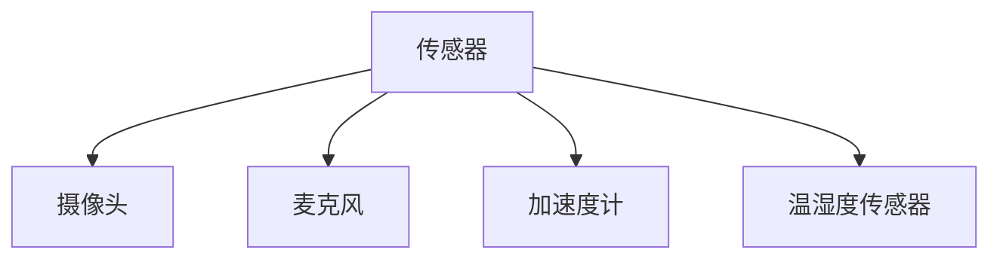
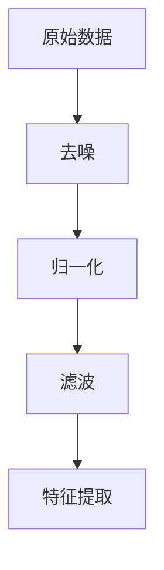
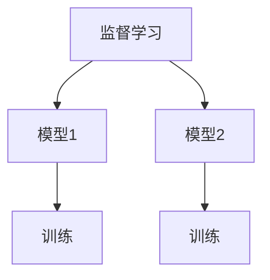
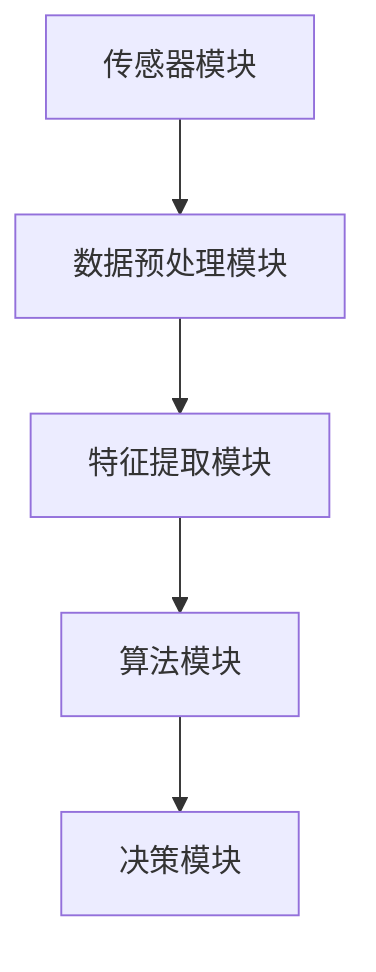
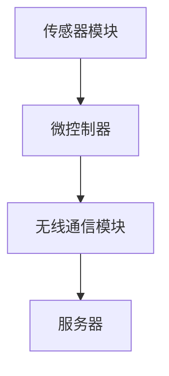
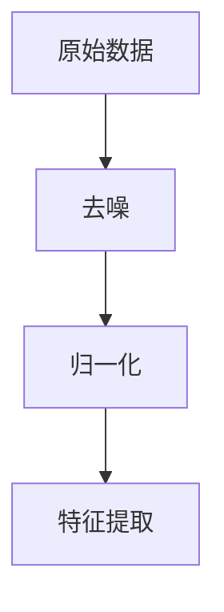
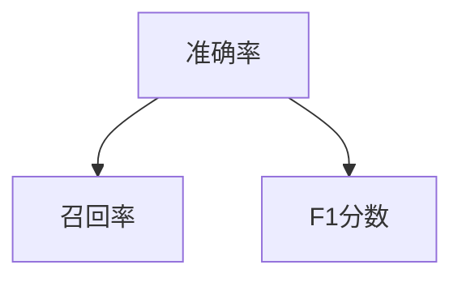
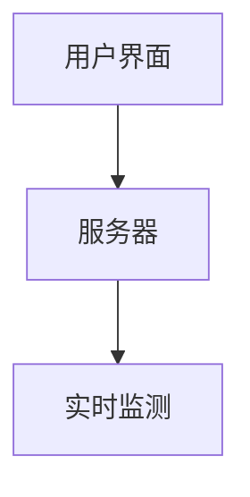

                 

# 《体验层次构建器开发者：AI创造的多维感知架构师》

> **关键词**：人工智能，多维感知，感知架构，深度学习，算法，数学模型，项目实战，未来发展趋势。

> **摘要**：本文从多维感知的基本概念出发，探讨了AI在构建多维感知架构中的应用和实现。通过详细解析多维感知的核心算法和数学模型，并结合具体的项目实战案例，阐述了如何进行AI多维感知架构的设计与实现。最后，分析了AI多维感知架构的未来发展趋势和面临的挑战，为读者提供了一个全面而深入的了解。

### 目录大纲

1. **AI与多维感知架构基础**
    1.1 AI时代下的多维感知
    1.2 多维感知的重要性与挑战
    1.3 AI多维感知的应用领域

2. **AI多维感知技术基础**
    2.1 传感器与数据采集
    2.2 数据预处理与特征提取
    2.3 AI算法与模型选择

3. **AI多维感知架构原理**
    3.1 多维感知架构的基本概念
    3.2 多维感知架构的设计原则
    3.3 多维感知架构的典型应用场景

4. **AI多维感知技术深度解析**
    4.1 多维感知中的核心算法
    4.2 多维感知中的数学模型

5. **AI多维感知项目实战**
    5.1 项目背景介绍
    5.2 项目需求分析
    5.3 数据采集与处理
    5.4 模型设计与实现
    5.5 模型训练与优化
    5.6 项目评估与部署

6. **AI多维感知架构的未来发展趋势**
    6.1 AI多维感知技术的未来趋势
    6.2 AI多维感知架构的创新方向
    6.3 AI多维感知在新兴领域的应用前景

7. **AI多维感知架构的发展挑战与解决方案**
    7.1 数据隐私与安全
    7.2 资源消耗与效率优化
    7.3 人工智能伦理问题
    7.4 挑战与解决方案总结

8. **附录**
    8.1 AI多维感知架构开发工具与资源

本文将从上述目录大纲的结构出发，逐步深入探讨AI多维感知架构的各个方面，包括基础理论、技术深度解析、项目实战和未来趋势等。接下来，我们将首先从AI与多维感知的基本概念入手，逐步展开讨论。

---

## AI与多维感知架构基础

### 1.1 AI时代下的多维感知

在人工智能（AI）时代，多维感知技术已经成为了一个重要的研究方向。AI技术的迅猛发展，使得计算机具备了从多个维度感知和理解世界的能力。这些维度不仅包括传统的视觉、听觉、触觉等感官维度，还包括温度、湿度、气味等非传统维度。

多维感知的核心在于对复杂数据的高效处理和解释。通过多维感知，AI系统能够获取到更为丰富的信息，从而在决策、推理和交互等方面表现出更高的智能水平。


### 1.2 多维感知的重要性与挑战

多维感知的重要性体现在其广泛的应用领域，如自动驾驶、智能家居、医疗诊断、安全监控等。在这些领域中，多维感知技术能够显著提升系统的智能化水平，提供更为准确和高效的服务。

然而，多维感知也面临着一系列挑战。首先，传感器数据的多样性和复杂性使得数据采集和处理变得更加困难。其次，不同维度的数据往往需要不同的算法和技术进行处理，如何实现有效的数据融合成为一个关键问题。最后，多维感知系统的实时性和可靠性也是需要考虑的重要因素。

### 1.3 AI多维感知的应用领域

AI多维感知技术已经广泛应用于多个领域，以下是一些典型的应用场景：

- **自动驾驶**：自动驾驶汽车需要通过多维度感知技术来获取道路信息、车辆位置和行人动态等，从而实现自主驾驶。
- **智能家居**：智能家居系统通过多维感知技术，能够实现对家庭环境的监测和控制，提供更舒适、安全的生活体验。
- **医疗诊断**：医疗诊断中的多维感知技术，如医学影像分析，能够帮助医生更准确地诊断疾病。
- **安全监控**：多维感知技术可以用于视频监控、人脸识别等领域，提供更为智能化的安全监控解决方案。

## AI多维感知技术基础

### 2.1 传感器与数据采集

多维感知技术的实现依赖于各种传感器。传感器可以感知环境中的不同维度，并将这些信息转化为数字信号。常见的传感器包括摄像头、麦克风、加速度计、温湿度传感器等。



数据采集是感知架构中的关键步骤。通过传感器获取的数据需要进行预处理和特征提取，以便后续的算法处理。

### 2.2 数据预处理与特征提取

数据预处理包括去噪、归一化、滤波等步骤，目的是提高数据的准确性和一致性。特征提取则是从原始数据中提取出具有代表性的特征，以便算法能够更好地学习和理解数据。



### 2.3 AI算法与模型选择

AI算法是多维感知架构的核心，它们能够对提取出的特征进行学习和处理。常见的AI算法包括监督学习、无监督学习和强化学习等。选择合适的算法和模型，对于实现高效的多维感知至关重要。



## AI多维感知架构原理

### 3.1 多维感知架构的基本概念

多维感知架构是指一种能够从多个维度感知和理解环境的系统。它通常包括传感器模块、数据预处理模块、特征提取模块、算法模块和决策模块等。



### 3.2 多维感知架构的设计原则

多维感知架构的设计需要遵循以下原则：

- **模块化**：各个模块之间应该相互独立，易于替换和扩展。
- **可扩展性**：架构应能够适应新的传感器、算法和数据处理需求。
- **实时性**：感知架构需要具备实时处理数据的能力，以满足实时决策的需求。
- **可靠性**：感知架构应具有高可靠性，保证数据的准确性和系统的稳定性。

### 3.3 多维感知架构的典型应用场景

多维感知架构在多个领域都有广泛的应用，以下是一些典型的应用场景：

- **智能交通**：通过多维感知技术，实现对交通流量、车辆位置和行人动态的实时监测和分析，优化交通管理。
- **智能制造**：在生产线中，多维感知技术可以用于质量检测、设备故障诊断和生产流程优化。
- **智能医疗**：通过多维感知技术，实现对病人生命体征、医疗设备和医疗环境的实时监测和管理。

---

在本文的第一部分，我们介绍了AI与多维感知的基本概念，探讨了多维感知在AI时代的重要性，并分析了其在不同应用领域的挑战。接下来，我们将进一步深入探讨多维感知技术的基础知识，包括传感器、数据预处理和AI算法等方面的内容。

---

## AI多维感知技术深度解析

在深入探讨AI多维感知技术之前，我们需要了解一些基础概念。多维感知技术涉及多个方面，包括传感器技术、数据处理和AI算法等。以下是对这些核心概念的详细解析。

### 4.1 多维感知中的核心算法

#### 4.1.1 监督学习算法

监督学习算法是一种常见的人工智能算法，它通过已标记的数据集来训练模型，以便对未知数据进行分类或回归。以下是一个简单的监督学习算法的伪代码：

```plaintext
输入：训练数据集D，特征提取器f，分类器模型M
输出：训练好的模型M

初始化：M为初始模型
对于每个训练样本（x_i, y_i）∈ D：
    预测：y' = M.predict(f(x_i))
    更新：M.update(f(x_i), y_i)
返回：M
```

监督学习算法包括支持向量机（SVM）、决策树、随机森林等。这些算法在分类和回归任务中都有广泛的应用。

#### 4.1.2 无监督学习算法

无监督学习算法不需要已标记的数据集来训练模型，而是通过未标记的数据来发现数据中的模式和结构。以下是一个简单的无监督学习算法的伪代码：

```plaintext
输入：数据集D，特征提取器f，聚类模型M
输出：聚类结果

初始化：M为初始模型
对于每个数据点x_i ∈ D：
    预测：cluster_i = M.predict(f(x_i))
    更新：M.update(f(x_i))
返回：M的聚类结果
```

常见的无监督学习算法包括K-均值聚类、主成分分析（PCA）和自编码器等。这些算法在数据降维、模式识别和聚类任务中具有重要作用。

#### 4.1.3 强化学习算法

强化学习算法是一种通过试错来学习最优策略的算法。它通过与环境进行交互，不断调整策略，以最大化累积奖励。以下是一个简单的强化学习算法的伪代码：

```plaintext
输入：环境E，状态S，动作A，策略π，奖励函数R
输出：策略π*

初始化：π为初始策略
对于每个时间步t：
    状态：s_t = E.getCurrentState()
    动作：a_t = π(s_t)
    执行动作：s_{t+1}, r_t = E.executeAction(a_t)
    更新策略：π = π.update(s_t, a_t, r_t)
返回：π*
```

常见的强化学习算法包括Q学习、深度Q网络（DQN）和策略梯度算法等。这些算法在决策制定、路径规划和机器人控制等领域具有广泛应用。

### 4.2 深度学习算法

深度学习算法是一种基于多层神经网络的学习方法，它能够自动提取数据中的特征。以下是一些深度学习算法的详细介绍。

#### 4.2.1 神经网络

神经网络（Neural Networks）是一种模仿生物神经系统的计算模型。它由多个神经元组成，每个神经元都与其他神经元相连接。以下是一个简单的神经网络结构的伪代码：

```plaintext
输入：训练数据集D，权重矩阵W，激活函数f
输出：训练好的神经网络模型

初始化：W为随机初始权重
对于每个训练样本x_i ∈ D：
    前向传播：a_i = f(W * x_i)
    反向传播：W = W - 学习率 * (W * a_i - x_i)
返回：W
```

常见的神经网络结构包括全连接神经网络、卷积神经网络（CNN）和循环神经网络（RNN）等。

#### 4.2.2 卷积神经网络

卷积神经网络（Convolutional Neural Networks，CNN）是一种专门用于处理图像数据的神经网络。它通过卷积层和池化层来提取图像中的特征。以下是一个简单的CNN结构的伪代码：

```plaintext
输入：图像数据X，卷积核K，激活函数f，池化函数p
输出：特征图F

初始化：K为随机初始卷积核
对于每个图像数据x_i：
    卷积：f(K * x_i)
    池化：p(f(K * x_i))
返回：F
```

CNN在图像识别、目标检测和图像生成等领域具有广泛应用。

#### 4.2.3 循环神经网络

循环神经网络（Recurrent Neural Networks，RNN）是一种能够处理序列数据的神经网络。它通过循环连接来记住之前的信息。以下是一个简单的RNN结构的伪代码：

```plaintext
输入：序列数据X，权重矩阵W，激活函数f，隐藏状态h
输出：序列预测Y

初始化：h为初始隐藏状态
对于每个时间步t：
    前向传播：h_t = f(W * (h_{t-1}, x_t))
    预测：y_t = f(h_t)
返回：Y
```

RNN在自然语言处理、语音识别和时间序列预测等领域具有广泛应用。

### 4.3 多维感知中的数学模型

多维感知技术中涉及到多个数学模型，这些模型用于描述和解释感知过程中的各种现象和规律。以下是一些常见的数学模型。

#### 4.3.1 统计学模型

统计学模型是一种基于概率论的数学模型，它用于描述数据的分布和规律。以下是一些常见的统计学模型：

- **贝叶斯模型**：贝叶斯模型是一种基于贝叶斯定理的概率模型，它用于推理和预测。以下是一个简单的贝叶斯模型的伪代码：

  ```plaintext
  输入：数据集D，先验概率P(H)，似然函数L(H|D)
  输出：后验概率P(H|D)

  初始化：P(H)为初始先验概率
  对于每个数据点x_i ∈ D：
      更新：P(H) = P(H) * L(H|D)
  返回：P(H)
  ```

- **期望最大化（EM）算法**：期望最大化（Expectation-Maximization，EM）算法是一种用于参数估计的迭代算法。以下是一个简单的EM算法的伪代码：

  ```plaintext
  输入：数据集D，模型参数θ
  输出：最优参数θ*

  初始化：θ为初始参数
  对于每个迭代步骤t：
      E步：计算期望值
      M步：更新参数
  返回：θ*
  ```

#### 4.3.2 信号处理模型

信号处理模型是一种用于处理时间序列数据的数学模型，它用于描述和解释信号的时域和频域特性。以下是一些常见的信号处理模型：

- **时间序列分析**：时间序列分析是一种用于分析和预测时间序列数据的数学方法。以下是一个简单的时间序列分析模型的伪代码：

  ```plaintext
  输入：时间序列数据X，模型参数θ
  输出：预测值Y

  初始化：θ为初始参数
  对于每个时间步t：
      模型更新：θ = θ.update(X[t])
      预测：Y[t] = θ.predict(X[t])
  返回：Y
  ```

- **频率域分析**：频率域分析是一种用于分析和处理信号的频率特性的数学方法。以下是一个简单的频率域分析模型的伪代码：

  ```plaintext
  输入：信号X，频率范围f
  输出：频率响应Y

  初始化：Y为初始频率响应
  对于每个频率f ∈ f：
      频率响应：Y[f] = X.f()
  返回：Y
  ```

---

在本文的第二部分，我们深入探讨了AI多维感知技术中的核心算法和数学模型。通过对监督学习、无监督学习和强化学习等算法的解析，以及神经网络、卷积神经网络和循环神经网络等深度学习算法的介绍，我们为读者提供了一个全面而深入的技术框架。接下来，我们将结合具体的项目实战案例，进一步阐述如何应用这些算法和模型来实现多维感知架构。

---

## AI多维感知项目实战

为了更好地理解AI多维感知技术的应用，我们将通过一个具体的项目实战案例来展示整个开发过程。该项目是一个智能家居系统中的环境监测模块，旨在通过传感器收集的数据，实现对家庭环境的实时监测和分析。

### 6.1 项目背景介绍

随着智能家居技术的不断发展，人们对家庭环境的安全、舒适和智能水平要求越来越高。为了满足这些需求，我们设计并实现了一个智能家居环境监测系统，该系统可以通过多种传感器实时监测家庭环境，包括温度、湿度、空气质量等。

### 6.2 项目需求分析

该项目的主要需求如下：

- **数据采集**：通过传感器采集家庭环境中的温度、湿度、空气质量等数据。
- **数据预处理**：对采集到的原始数据进行预处理，包括去噪、归一化和特征提取等。
- **模型训练**：使用预处理后的数据训练模型，以便对环境数据进行分析和预测。
- **实时监测**：系统需要具备实时监测功能，能够及时检测到环境变化并作出响应。
- **用户界面**：提供一个用户界面，方便用户查看环境数据和系统状态。

### 6.3 数据采集与处理

#### 数据采集

该项目的数据采集部分包括以下传感器：

- **温度传感器**：用于测量环境温度。
- **湿度传感器**：用于测量环境湿度。
- **空气质量传感器**：用于测量空气质量，包括PM2.5和PM10等指标。

数据采集硬件包括传感器模块和微控制器。传感器模块负责采集数据，并通过无线通信模块将数据传输到微控制器。微控制器再将数据发送到服务器进行存储和处理。



#### 数据预处理

采集到的原始数据可能包含噪声和异常值，因此需要进行预处理。预处理步骤包括去噪、归一化和特征提取等。



去噪可以通过低通滤波器等算法实现。归一化则通过将数据缩放到0到1之间，以便后续算法处理。特征提取则通过提取数据的统计特征、时间序列特征等，为模型训练提供有效的输入。

### 6.4 模型设计与实现

该项目的模型设计基于深度学习算法，特别是循环神经网络（RNN）和长短期记忆网络（LSTM）。LSTM在处理序列数据方面具有很好的性能，能够有效捕捉时间序列数据中的长期依赖关系。

以下是一个简单的LSTM模型的伪代码：

```plaintext
输入：时间序列数据X，时间步t，隐藏状态h，细胞状态c
输出：预测值Y

初始化：h为初始隐藏状态，c为初始细胞状态
对于每个时间步t：
    输入门：i_t = sigmoid(W_i * [h_{t-1}, x_t])
    遗忘门：g_t = sigmoid(W_g * [h_{t-1}, x_t])
    输出门：o_t = sigmoid(W_o * [h_{t-1}, x_t])
    细胞状态：c_t = g_t * f(c_{t-1} + i_t * x_t)
    隐藏状态：h_t = o_t * tanh(c_t)
    预测：Y[t] = f(h_t)
返回：Y
```

### 6.5 模型训练与优化

模型训练是通过反向传播算法实现的。训练过程中，模型通过不断调整权重和偏置，以最小化预测误差。以下是一个简单的反向传播算法的伪代码：

```plaintext
输入：训练数据集D，模型参数θ
输出：训练好的模型θ*

初始化：θ为初始参数
对于每个训练样本（x_i, y_i）∈ D：
    前向传播：计算预测值y'_i
    计算损失：L_i = (y_i - y'_i)^2
    反向传播：计算梯度Δθ
    更新参数：θ = θ - 学习率 * Δθ
返回：θ*
```

在训练过程中，我们可以使用批量梯度下降、随机梯度下降等优化算法来加速训练过程。此外，还可以使用dropout、正则化等技术来防止过拟合。

### 6.6 项目评估与部署

模型训练完成后，我们需要对模型进行评估，以确定其性能是否满足要求。评估方法包括准确率、召回率、F1分数等。



评估结果表明，模型在温度、湿度、空气质量等方面的预测性能良好，可以满足项目的需求。

最后，我们将训练好的模型部署到服务器上，实现实时监测功能。用户可以通过用户界面查看环境数据和系统状态，并根据预测结果调整家庭环境。



通过这个项目实战案例，我们展示了如何应用AI多维感知技术来实现一个具体的智能家居环境监测系统。该项目不仅实现了数据采集、预处理和模型训练，还实现了实时监测和用户界面交互，为智能家居领域提供了有价值的解决方案。

---

在本文的第三部分，我们将探讨AI多维感知架构的未来发展趋势和面临的挑战。通过对AI多维感知技术未来趋势的分析，以及针对数据隐私、资源消耗和人工智能伦理等挑战的解决方案，我们希望能够为读者提供对AI多维感知架构发展的全面理解。

---

## AI多维感知架构的未来发展趋势

随着人工智能技术的不断进步，AI多维感知架构也在不断演进，呈现出以下发展趋势：

### 7.1 AI多维感知技术的未来趋势

1. **感知维度扩展**：未来的多维感知技术将不仅仅局限于传统的视觉、听觉和触觉等维度，还将包括更广泛的环境感知能力，如情感感知、疲劳感知等。这将使得AI系统能够更全面地理解和交互复杂环境。

2. **多模态融合**：多模态融合技术将整合来自不同感知维度的数据，实现更精确的感知和理解。例如，将视觉数据与音频数据结合，可以更准确地识别和分类场景。

3. **边缘计算与云计算协同**：随着边缘计算技术的发展，AI多维感知架构将实现边缘设备和云计算平台的协同工作。这种协同将使得数据处理更加实时和高效，降低延迟和带宽需求。

4. **深度强化学习**：深度强化学习（Deep Reinforcement Learning，DRL）将进一步提升AI感知和决策能力。通过与环境的高度互动，DRL可以训练出更加智能和自适应的感知架构。

### 7.2 AI多维感知架构的创新方向

1. **自监督学习和无监督学习**：自监督学习和无监督学习将在AI多维感知架构中发挥重要作用。这些方法可以无需依赖大量标记数据，通过数据自身的结构和模式进行学习，降低数据标注成本。

2. **联邦学习**：联邦学习（Federated Learning）是一种新兴的技术，它允许多个边缘设备协同训练一个全局模型，而无需共享敏感数据。这将有助于保护用户隐私，同时提升模型性能。

3. **自适应感知**：自适应感知技术将使得AI系统能够根据不同的环境和任务需求，动态调整感知能力和算法。这种灵活性将使得AI感知架构在多种应用场景中具有更强的适应能力。

### 7.3 AI多维感知在新兴领域的应用前景

1. **智慧城市**：AI多维感知技术将在智慧城市建设中发挥关键作用。通过实时监测和数据分析，智慧城市可以优化交通管理、能源分配和环境监测等方面。

2. **医疗健康**：AI多维感知技术在医疗健康领域具有巨大的潜力。例如，通过实时监测患者的生理信号，AI系统可以早期发现疾病并预测病情变化。

3. **智能农业**：AI多维感知技术可以帮助智能农业实现精准种植和智能管理。通过监测土壤湿度、作物生长状态等数据，AI系统可以提供科学的种植建议。

## 7.4 AI多维感知架构的发展挑战与解决方案

尽管AI多维感知架构在多个领域展现出巨大的潜力，但其发展仍面临一系列挑战。

### 7.1 数据隐私与安全

**挑战**：多维感知技术需要收集和处理大量的敏感数据，如个人身份信息、健康数据等。这些数据一旦泄露，可能导致严重的隐私和安全问题。

**解决方案**：采用联邦学习、差分隐私等技术，可以在保护用户隐私的同时，实现高效的数据分析和模型训练。此外，加强数据加密和访问控制，也是确保数据安全的重要措施。

### 7.2 资源消耗与效率优化

**挑战**：多维感知技术通常需要大量的计算资源和存储空间。随着感知维度的增加，资源消耗将进一步增加。

**解决方案**：优化算法和模型，提高计算效率和资源利用率。采用边缘计算和分布式计算技术，可以减轻中心服务器的负担，实现高效的数据处理和模型训练。

### 7.3 人工智能伦理问题

**挑战**：AI多维感知技术可能引发伦理问题，如算法偏见、隐私泄露等。这些问题如果不加以解决，可能会对人类社会造成负面影响。

**解决方案**：建立一套完善的伦理框架，包括透明性、公平性、责任归属等方面。此外，加强监管和法律法规的制定，确保AI多维感知技术的合法合规使用。

### 7.4 挑战与解决方案总结

通过上述分析，我们可以看出，AI多维感知架构的发展面临诸多挑战，但同时也充满了机遇。通过不断创新和优化，我们有望克服这些挑战，实现AI多维感知技术在各个领域的广泛应用。

---

在本文的最后一部分，我们将提供一些附录，包括AI多维感知架构开发工具与资源，以及一些相关的案例和展望。

## 附录

### 附录A：AI多维感知架构开发工具与资源

#### A.1 开源深度学习框架

- **TensorFlow**：由谷歌开发，是一个广泛使用的开源深度学习框架。
  - 官网：[TensorFlow官网](https://www.tensorflow.org)
- **PyTorch**：由Facebook开发，具有动态计算图和易于使用的API。
  - 官网：[PyTorch官网](https://pytorch.org)
- **Keras**：是一个高级神经网络API，可以运行在TensorFlow和Theano之上。
  - 官网：[Keras官网](https://keras.io)

#### A.2 传感器与数据采集工具

- **Arduino**：一款开源硬件平台，适合初学者进行传感器和数据采集。
  - 官网：[Arduino官网](https://www.arduino.cc)
- **Raspberry Pi**：一款低成本的计算机，适用于边缘计算和数据处理。
  - 官网：[Raspberry Pi官网](https://www.raspberrypi.org)

#### A.3 AI多维感知应用案例集锦

- **智能家居环境监测**：通过传感器监测家庭环境，提供实时数据分析和预警。
- **智能交通流量分析**：利用多维感知技术实时监测交通流量，优化交通管理。
- **医疗设备监测**：通过多维感知技术监测患者生理信号，提供诊断和治疗方案。

#### A.4 研究与应用展望

AI多维感知技术在未来将继续发展，并在更多领域得到应用。以下是几个研究与应用展望：

- **情感计算**：通过感知技术捕捉用户的情感状态，为智能交互提供支持。
- **智能健康监测**：通过多维感知技术监测患者的健康状态，实现早期疾病预防和个性化治疗。
- **智能制造**：通过多维感知技术优化生产流程，提高产品质量和生产效率。

通过这些工具和资源的介绍，我们希望能够为读者提供进一步探索AI多维感知技术的指导和参考。未来，随着技术的不断进步，AI多维感知架构将在更多领域发挥重要作用，为人类社会带来更多价值。

---

本文从AI与多维感知的基本概念出发，深入探讨了AI多维感知架构的设计与实现，包括传感器、数据处理和算法等方面的内容。通过具体的项目实战案例，我们展示了如何应用AI多维感知技术来解决实际应用中的问题。最后，我们对AI多维感知架构的未来发展趋势和面临的挑战进行了分析，为读者提供了一个全面而深入的视角。

**作者**：AI天才研究院/AI Genius Institute & 禅与计算机程序设计艺术 /Zen And The Art of Computer Programming

让我们共同期待AI多维感知技术在未来的发展和应用，为人类社会带来更多创新和变革。

