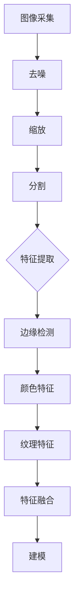
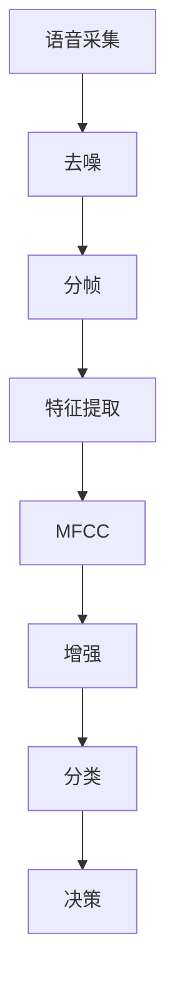

                 

## 第一部分：AI与体验层次性概述

### 1.1 AI的定义与作用

人工智能（Artificial Intelligence，简称AI）是指由人创造出来的，能够模拟、延伸、甚至超越人类智能的系统和技术。AI的发展历程可以追溯到20世纪50年代，最初的目标是构建能够执行复杂任务的智能体。随着计算能力的提升、海量数据的出现以及机器学习算法的进步，AI技术在多个领域取得了显著的突破。

AI在体验层次性中的作用主要体现在以下几个方面：

1. **个性化推荐**：通过分析用户的历史行为和偏好，AI能够提供个性化的产品推荐和服务，从而提升用户体验。
   
2. **智能交互**：AI驱动的聊天机器人、语音助手等技术，使得人与机器之间的交互更加自然和高效，进一步丰富了用户体验。

3. **优化决策**：在医疗、金融、交通等领域，AI通过对大量数据的分析，能够提供更加精准的决策支持，提高工作效率和准确性。

4. **增强现实与虚拟现实**：AI技术的应用使得虚拟现实和增强现实体验更加真实和沉浸，为用户带来全新的感官体验。

### 1.2 体验层次性的概念

体验层次性是指用户在使用产品或服务过程中感受到的多个层面的体验，这些层面通常可以分为以下几类：

1. **感官体验**：用户通过视觉、听觉、触觉等感官接收到的直接体验，如界面设计的美观度、音效效果等。

2. **情感体验**：用户在体验过程中产生的情感反应，如愉悦、满意、兴奋等。

3. **认知体验**：用户在理解和使用产品或服务过程中所获得的认知体验，如易用性、功能丰富性等。

4. **社交体验**：用户在使用产品或服务时与其他用户或服务提供者之间的互动体验，如社区互动、社交分享等。

5. **价值体验**：用户对产品或服务价值的感知，如性价比、品牌认知等。

### 1.3 AI与体验层次性的关系

AI通过多种方式作用于体验层次性，从而提升用户体验：

1. **个性化**：AI能够根据用户的历史行为和偏好，提供个性化的体验，满足用户的个性化需求。

2. **智能化**：AI驱动的智能系统可以自动化完成复杂任务，减少用户的认知负担，提升交互体验。

3. **数据驱动**：AI通过对用户数据的分析，可以不断优化产品和服务，提高用户体验的满意度。

4. **沉浸感**：在虚拟现实和增强现实领域，AI技术可以创造更加真实和沉浸的体验，增强用户的感官刺激。

5. **安全性**：AI在安全领域也有广泛应用，如网络安全防护、隐私保护等，确保用户的个人信息安全。

### 1.4 文章结构与内容安排

本文将按照以下结构展开：

- **第一部分**：介绍AI与体验层次性的概念，探讨AI在体验层次性中的作用。
- **第二部分**：深入分析AI创造的多维感知技术，包括技术原理和应用案例。
- **第三部分**：探讨AI多维感知的技术基础，包括数据采集与处理、特征分析与建模、多模态数据融合等。
- **第四部分**：讨论AI多维感知在虚拟现实、智能家居和其他领域的实际应用。
- **第五部分**：展望AI多维感知技术的未来发展，包括技术趋势、社会影响、伦理问题等。
- **第六部分**：总结全文，并对AI多维感知技术的教育与实践提出建议。

通过以上结构的安排，本文旨在全面探讨AI多维感知技术对用户体验的深刻影响，为读者提供全面的技术见解和思考。

## 第2章：AI创造的多维感知

### 2.1 多维感知的定义

多维感知（Multi-Dimensional Perception）是指通过多个感知通道（如视觉、听觉、触觉等）对环境进行感知和理解的能力。与传统的单维感知相比，多维感知能够提供更丰富、更全面的信息，从而更好地反映现实世界的复杂性和多样性。

多维感知的定义可以从以下几个方面来理解：

1. **感知通道的多样性**：多维感知涉及多个感知通道，不仅仅是视觉和听觉，还包括触觉、嗅觉、味觉等。每个感知通道都提供了一种独特的信息来源，这些信息综合起来，可以形成对环境的全面感知。

2. **信息的整合与融合**：多维感知不仅仅依赖于单个感知通道的信息，更重要的是如何整合和融合来自不同通道的信息。例如，视觉和听觉的信息可以相互补充，帮助用户更好地理解环境。

3. **感知的层次性**：多维感知不仅涉及外部世界的感知，还包括内部感受，如情绪、认知状态等。这些内部感受同样对用户的行为和体验产生影响。

多维感知的重要性体现在以下几个方面：

1. **提升用户体验**：多维感知能够提供更丰富、更真实的体验，从而提升用户的满意度。例如，虚拟现实中的多维感知可以创造高度沉浸的体验，增强用户的参与感和互动性。

2. **增强认知能力**：多维感知能够提供更多的信息，帮助用户更好地理解和记忆环境。例如，在学习过程中，视觉、听觉和触觉的多维感知可以增强学习效果。

3. **扩展认知边界**：多维感知可以拓展人类的感知范围，使人类能够感知到一些传统的单维感知无法捕捉到的信息。例如，通过嗅觉和味觉的多维感知，人类可以更好地体验美食和香气。

### 2.2 AI创造的多维感知

人工智能在创造多维感知方面发挥着关键作用。通过利用机器学习和深度学习算法，AI能够从大量的数据中学习，并模拟人类的多维感知能力。以下是AI如何创造多维感知的几个关键点：

1. **数据驱动的学习**：AI通过大量的数据学习，从这些数据中提取特征，并建立模型来模拟人类的多维感知。例如，深度学习模型可以通过分析大量的图像数据，学习视觉感知的规则。

2. **多模态数据融合**：AI能够整合来自不同感知通道的数据，进行多模态数据融合。例如，将视觉和听觉信息融合，可以创造出更丰富的感知体验。

3. **实时处理与反馈**：AI能够实时处理感知数据，并根据反馈进行调整。例如，在增强现实应用中，AI可以实时调整视觉和听觉效果，以提供更真实的体验。

4. **预测与优化**：AI可以通过对感知数据的分析，进行预测和优化。例如，在自动驾驶中，AI可以通过分析路况信息，预测可能的危险并采取相应的措施。

AI创造的多维感知与人类的多维感知有所不同。人类的多维感知是自然的、本能的，而AI的多维感知是通过学习和模拟实现的。尽管如此，AI创造的多维感知仍然具有巨大的潜力，可以扩展人类的感知能力和应用范围。

### 2.3 多维感知的应用案例

多维感知技术在多个领域已经取得了显著的应用成果，以下是几个典型的应用案例：

1. **虚拟现实（VR）与增强现实（AR）**：在VR和AR应用中，多维感知技术可以提供高度沉浸的体验。例如，通过整合视觉、听觉和触觉信息，用户可以感受到更加真实和丰富的虚拟环境。

2. **智能机器人**：智能机器人通过多维感知技术，可以更好地理解和交互环境。例如，通过视觉和触觉感知，机器人可以识别物体并进行相应的操作。

3. **智能家居**：智能家居设备通过多维感知，可以实现对用户行为的智能识别和响应。例如，智能音箱可以通过语音和视觉感知，理解用户的需求并提供相应的服务。

4. **医疗健康**：多维感知技术在医疗健康领域也有广泛应用。例如，通过多维感知，医生可以进行远程手术，实现更加精准和安全的医疗服务。

5. **教育**：在教育领域，多维感知技术可以提供更加生动和互动的学习体验。例如，通过视觉、听觉和触觉的多维感知，学生可以更加深入地理解课程内容。

通过以上应用案例，可以看出多维感知技术在不同领域的巨大潜力和应用前景。随着AI技术的不断发展，多维感知技术将进一步完善和提升，为人类社会带来更多的创新和变革。

### 2.4 多维感知的未来发展

随着AI技术的不断进步，多维感知技术的未来发展趋势值得期待。以下是一些可能的发展方向：

1. **更加精细化的感知**：未来的多维感知技术将能够捕捉到更加精细和复杂的信息，例如微小的视觉细节、微弱的气味等。

2. **实时性和低延迟**：随着计算能力的提升，多维感知技术将实现实时处理和低延迟，提供更加流畅和自然的体验。

3. **多模态融合**：未来的多维感知技术将更加注重多模态数据的融合，从而提供更加全面和深入的感知体验。

4. **个性化感知**：通过个性化学习，多维感知技术将能够更好地适应不同用户的需求，提供高度个性化的体验。

5. **跨领域应用**：多维感知技术将在更多领域得到应用，例如智能制造、环境监测、网络安全等，为社会带来更多的价值和便利。

总之，多维感知技术是AI技术发展的重要方向之一，其未来前景广阔，将在多个领域引发深刻的变革。

### 2.5 文章总结

本章首先介绍了多维感知的定义和重要性，探讨了AI在创造多维感知方面的作用。通过多维感知，AI能够提供更加丰富和真实的用户体验，提升认知能力和交互效率。随后，本章分析了AI创造多维感知的原理和方式，并列举了多维感知在多个领域的实际应用案例。最后，本章展望了多维感知技术的未来发展趋势，指出其在精细感知、多模态融合和个性化应用等方面的潜力。

在下一章中，我们将深入探讨AI多维感知的技术基础，包括数据采集与处理、特征分析与建模、多模态数据融合等核心技术。这将帮助我们更好地理解多维感知的实现机制和应用前景。

### 第3章：AI多维感知技术原理

多维感知技术的实现离不开一系列核心技术的支持，这些技术包括数据采集与处理、特征分析与建模、多模态数据融合等。在本章中，我们将详细探讨这些技术的原理、实现方法和应用场景。

#### 3.1 数据采集与处理

数据采集是多维感知的基础，它涉及从多种感知通道获取数据的过程。以下是一些常见的数据采集方法：

1. **图像采集**：通过摄像头或其他图像传感器获取图像数据。图像数据通常包括静态图像和视频流。
   
2. **语音采集**：通过麦克风或其他语音传感器获取语音数据。语音数据可以用于语音识别和语音交互。

3. **触觉采集**：通过触觉传感器获取触觉数据。触觉数据可以用于触觉反馈和控制。

4. **气味采集**：通过气味传感器获取气味数据。气味数据可以用于气味识别和气味生成。

数据采集后，需要对这些原始数据进行处理，以便后续分析和建模。数据处理通常包括以下几个步骤：

1. **数据清洗**：去除噪声和异常值，确保数据质量。
   
2. **数据预处理**：对数据进行归一化、标准化等操作，使其适合进一步处理。

3. **特征提取**：从原始数据中提取有助于分析的特征。例如，从图像中提取边缘、颜色等特征。

4. **数据融合**：将来自不同感知通道的数据进行整合，形成统一的多维数据集。

数据处理的关键在于如何有效地提取和利用特征，以便在后续的建模和分析中取得更好的效果。

#### 3.2 特征分析与建模

特征分析是多维感知技术的重要环节，它涉及从数据中提取有意义的信息和模式。以下是一些常见的特征分析方法和建模技术：

1. **统计特征分析**：通过计算数据的基本统计量（如均值、方差、协方差等），分析数据的分布和相关性。

2. **机器学习特征分析**：使用机器学习算法（如聚类、降维、分类等）从数据中提取特征，并建立模型。

3. **深度学习特征分析**：使用深度学习算法（如卷积神经网络、循环神经网络等）自动提取层次化的特征表示。

特征分析的结果是得到一组表征数据的核心特征，这些特征将用于后续的建模和决策。

建模是将特征转化为可操作的模型，以便进行预测和分类。以下是一些常见的建模方法：

1. **监督学习建模**：通过有标注的数据训练模型，使其能够对未知数据进行预测。

2. **无监督学习建模**：在没有标注数据的情况下，通过模型自动发现数据中的模式和结构。

3. **强化学习建模**：通过与环境互动，不断调整模型参数，使其在特定任务上获得最佳性能。

#### 3.3 多模态数据融合

多模态数据融合是将来自不同感知通道的数据整合起来，形成一个统一的信息表示。以下是一些常见的多模态数据融合技术：

1. **特征级融合**：将来自不同感知通道的特征直接进行融合。例如，将视觉特征和语音特征进行拼接，形成一个多维特征向量。

2. **决策级融合**：在不同的感知通道上分别进行建模和决策，然后将这些决策进行融合。例如，分别使用视觉模型和语音模型进行分类，最后通过投票或加权平均进行融合。

3. **深度级融合**：在深度学习模型中，通过设计特定的网络结构将不同感知通道的数据进行融合。例如，使用卷积神经网络的不同层同时处理视觉和语音数据。

多模态数据融合的关键在于如何有效地整合来自不同感知通道的信息，以提升模型的性能和泛化能力。

#### 3.4 实现方法与应用场景

多维感知技术的实现方法因具体应用场景而异，以下是一些常见实现方法和应用场景：

1. **虚拟现实与增强现实**：在VR和AR应用中，多维感知技术用于创建高度沉浸的体验。例如，通过融合视觉、听觉和触觉数据，用户可以感受到更加真实的虚拟环境。

2. **智能机器人**：在智能机器人中，多维感知技术用于感知和理解环境。例如，通过融合视觉、触觉和距离传感器数据，机器人可以识别和抓取物体。

3. **智能家居**：在智能家居中，多维感知技术用于智能识别和响应用户行为。例如，通过融合语音、视觉和温度传感器数据，智能家居系统可以自动调节室内温度和灯光。

4. **医疗健康**：在医疗健康领域，多维感知技术用于辅助诊断和治疗。例如，通过融合医学影像、生理信号和患者历史数据，医生可以更准确地诊断疾病。

#### 3.5 总结

本章详细介绍了AI多维感知技术原理，包括数据采集与处理、特征分析与建模、多模态数据融合等核心技术。这些技术为AI多维感知的实现提供了理论基础和实现方法。通过多维感知技术，AI可以更好地理解用户和环境，提供更加丰富和真实的体验。在下一章中，我们将进一步探讨AI多维感知技术的核心算法，包括机器学习、深度学习和强化学习等。

### 3.1 数据采集与处理

数据采集是多维感知技术的基础，它涉及到从多个感知通道获取原始数据，并将其转化为适合分析和建模的形式。以下是数据采集和处理的主要步骤：

#### 数据采集方法

1. **视觉数据采集**：
   - **图像传感器**：常用的图像传感器包括摄像头、单目摄像头、双目摄像头等。这些传感器可以捕捉静态图像或视频流。
   - **深度传感器**：例如Kinect、Ryobi等，用于获取物体的三维信息。

2. **语音数据采集**：
   - **麦克风**：用于捕捉用户的语音输入。
   - **声卡**：用于将语音信号数字化并存储。

3. **触觉数据采集**：
   - **触觉传感器**：如力传感器、柔性触觉传感器等，用于感知物体的物理属性。

4. **气味数据采集**：
   - **气味传感器**：例如电化学传感器、半导体传感器等，用于检测气体分子。

#### 数据处理流程

1. **数据清洗**：
   - **去噪**：去除图像、语音等数据中的噪声，如图像中的噪点、语音中的背景噪音。
   - **补全缺失数据**：对缺失的数据进行填充或插值。

2. **数据预处理**：
   - **归一化**：将不同感知通道的数据进行归一化处理，使其具有相似的量级。
   - **标准化**：对数据进行标准化处理，使其符合特定的统计分布。

3. **特征提取**：
   - **视觉特征**：包括边缘、颜色、纹理等。常用的算法有SIFT、SURF、HOG等。
   - **语音特征**：如MFCC（梅尔频率倒谱系数）、PLP（功率归一化的倒谱线性预测）等。
   - **触觉特征**：如压力、摩擦等。

4. **数据融合**：
   - **特征级融合**：将不同感知通道的特征进行拼接，形成多维特征向量。
   - **决策级融合**：在各个感知通道上分别进行决策，然后通过投票或加权平均等方法进行融合。

#### 数据采集与处理的示例

**图像数据采集与处理**：



**语音数据采集与处理**：



在数据采集与处理过程中，特征提取是非常关键的一步。以下是一个简单的特征提取的伪代码示例：

```python
# 特征提取伪代码
def extract_features(data):
    # 假设data是包含多个感知通道的数据
    features = []
    
    # 对每个感知通道进行特征提取
    for channel in data.channels:
        if channel == "visual":
            visual_features = extract_visual_features(data.channel_data)
        elif channel == "audio":
            audio_features = extract_audio_features(data.channel_data)
        elif channel == "tactile":
            tactile_features = extract_tactile_features(data.channel_data)
        # ...其他感知通道
        
        features.append([visual_features, audio_features, tactile_features])
    
    return features
```

通过上述步骤和示例，我们可以看到数据采集与处理的过程是如何将原始的多维数据转化为适合分析和建模的形式。这一过程对于后续的特征分析和模型构建至关重要。

### 3.2 特征分析与建模

特征分析与建模是多维感知技术的核心环节，它涉及到从原始数据中提取有用的信息，并利用这些信息来建立模型，以便进行预测和分类。以下是特征分析与建模的主要步骤和方法：

#### 特征分析

特征分析的目标是从原始数据中提取出能够反映数据本质属性的特征，这些特征将用于训练模型。以下是一些常见的特征分析方法：

1. **统计特征分析**：
   - **均值、方差**：用于描述数据的集中趋势和离散程度。
   - **协方差、相关系数**：用于描述不同特征之间的相关性。

2. **机器学习特征分析**：
   - **降维技术**：如主成分分析（PCA）、线性判别分析（LDA）等，用于减少数据维度，同时保留主要信息。
   - **特征选择**：通过过滤、包裹和嵌入等方法选择对模型影响最大的特征。

3. **深度学习特征分析**：
   - **自动特征提取**：深度学习模型（如卷积神经网络、循环神经网络等）可以通过多层网络结构自动提取高层次的特征。

以下是一个简单的特征分析的伪代码示例：

```python
# 特征分析伪代码
def analyze_features(data):
    # 假设data是一个多维数据集
    statistical_features = compute_statistics(data)
    machine_learning_features = apply_machine_learning_methods(data)
    deep_learning_features = apply_deep_learning_methods(data)
    
    return {
        'statistical_features': statistical_features,
        'machine_learning_features': machine_learning_features,
        'deep_learning_features': deep_learning_features
    }
```

#### 建模方法

建模是将提取出的特征转化为可操作的模型，以便进行预测和分类。以下是一些常见的建模方法：

1. **监督学习建模**：
   - **分类器**：如逻辑回归、决策树、支持向量机（SVM）等，用于分类任务。
   - **回归模型**：如线性回归、岭回归等，用于预测连续值。

2. **无监督学习建模**：
   - **聚类算法**：如K-means、层次聚类等，用于发现数据中的潜在结构。
   - **降维算法**：如t-SNE、UMAP等，用于可视化高维数据。

3. **强化学习建模**：
   - **Q-learning**：通过学习状态-动作价值函数，进行策略优化。
   - **深度确定性策略梯度（DDPG）**：结合深度学习与强化学习，用于解决连续动作问题。

以下是一个简单的监督学习建模的伪代码示例：

```python
# 监督学习建模伪代码
from sklearn.linear_model import LogisticRegression

def build_model(data, labels):
    # 假设data是特征集，labels是标签
    model = LogisticRegression()
    model.fit(data, labels)
    return model

# 建模
model = build_model(data, labels)
```

#### 模型评估与优化

在建立模型后，需要对模型进行评估和优化，以确保其具有良好的泛化能力和预测性能。以下是一些常见的评估指标和方法：

1. **评估指标**：
   - **准确率**：分类问题中，正确预测的样本占总样本的比例。
   - **召回率**：分类问题中，实际为正类别的样本中被正确预测为正类别的比例。
   - **F1分数**：准确率和召回率的调和平均，用于综合考虑准确率和召回率。

2. **优化方法**：
   - **交叉验证**：通过将数据集划分为训练集和验证集，多次训练和验证，评估模型性能。
   - **调参**：通过调整模型的超参数（如学习率、隐藏层大小等），优化模型性能。

以下是一个简单的模型评估与优化的伪代码示例：

```python
# 模型评估与优化伪代码
from sklearn.model_selection import train_test_split
from sklearn.metrics import accuracy_score

def evaluate_model(model, X_test, y_test):
    predictions = model.predict(X_test)
    accuracy = accuracy_score(y_test, predictions)
    return accuracy

# 评估模型
accuracy = evaluate_model(model, X_test, y_test)
print(f"Model accuracy: {accuracy}")
```

通过上述步骤和方法，我们可以对多维感知数据进行有效的特征分析和建模，从而构建出能够准确预测和分类的模型。在下一章中，我们将进一步探讨多模态数据融合技术，以提升模型的性能和应用效果。

### 3.3 多模态数据融合

多模态数据融合是指将来自不同感知通道的数据进行整合，形成一个统一的信息表示，从而提高模型的整体性能和鲁棒性。多模态数据融合的核心思想是利用不同模态数据之间的互补性，以弥补单一模态数据的不足，从而实现更准确的感知和理解。

#### 多模态数据融合技术

多模态数据融合技术主要包括以下几种方法：

1. **特征级融合**：
   - **直接融合**：将来自不同感知通道的特征向量直接拼接，形成一个多维特征向量。这种方法简单直观，但可能会引入维度的冗余。
   - **加权融合**：根据不同模态数据的重要性，对各个模态的特征向量进行加权，然后融合。这种方法需要事先确定权重的分配策略。

2. **决策级融合**：
   - **独立决策**：在不同感知通道上分别进行决策，然后将这些决策进行融合。这种方法通过融合不同模态的决策结果，提高整体分类的准确性。
   - **投票机制**：对于多分类问题，可以将不同模态的预测结果进行投票，选择多数模态的预测结果作为最终分类结果。

3. **深度级融合**：
   - **多模态深度网络**：通过设计特定的网络结构，将不同感知通道的数据在深度学习中进行融合。这种方法可以在模型训练过程中自动学习不同模态数据的融合策略。
   - **注意力机制**：在深度学习模型中引入注意力机制，动态调整不同模态数据在模型中的重要性，从而实现更有效的融合。

#### 融合算法与模型

以下是几种常见的多模态数据融合算法与模型：

1. **多模态深度学习模型**：
   - **卷积神经网络（CNN）**：适用于处理图像数据，可以提取图像的特征。
   - **循环神经网络（RNN）**：适用于处理序列数据，如语音和文本。
   - **生成对抗网络（GAN）**：用于生成和融合不同的数据模态，如生成视觉和语音数据的融合。

2. **多模态融合网络**：
   - **Siamese网络**：通过两个共享权重的网络对多模态数据进行融合，并用于分类和检测任务。
   - **CNN-RNN融合网络**：结合CNN和RNN的优势，同时处理图像和序列数据。

3. **多模态深度融合模型**：
   - **Attention机制**：在深度学习模型中引入注意力机制，自动学习不同模态数据的重要性。
   - **Multi-View Transformer（MViT）**：结合Transformer架构，处理多模态数据融合。

#### 多模态数据融合的挑战与解决方案

多模态数据融合面临以下挑战：

1. **数据不匹配**：不同模态的数据在时序、空间和维度上可能不匹配，导致融合困难。
   - **解决方案**：通过数据预处理（如对齐、插值）和自适应融合策略（如动态权重调整）来处理数据不匹配问题。

2. **模态依赖性**：不同模态数据之间的依赖关系复杂，且模态重要性可能随应用场景变化。
   - **解决方案**：引入自适应融合机制（如注意力机制、动态权重调整）来根据任务需求调整模态权重。

3. **计算成本**：多模态数据融合通常需要大量的计算资源。
   - **解决方案**：优化模型结构（如减少冗余层、使用轻量级网络）和并行计算来降低计算成本。

### 3.4 实际应用案例

以下是一些多模态数据融合的实际应用案例：

1. **医学影像诊断**：
   - **应用场景**：利用多模态数据（如CT、MRI、PET等）进行疾病诊断。
   - **解决方案**：通过融合不同模态的影像数据，提高诊断准确性和可靠性。

2. **智能交互**：
   - **应用场景**：结合语音、视觉和触觉数据，实现更加自然和智能的交互。
   - **解决方案**：通过多模态数据融合，提高人机交互的体验和准确性。

3. **自动驾驶**：
   - **应用场景**：利用多模态数据（如摄像头、雷达、激光雷达、GPS等）进行环境感知和路径规划。
   - **解决方案**：通过多模态数据融合，提高自动驾驶系统的安全性和可靠性。

通过以上案例，我们可以看到多模态数据融合技术在实际应用中的重要作用。随着多模态数据融合技术的不断发展，它将在更多领域发挥更大的潜力，为人类社会带来更多的创新和变革。

### 3.5 小结

本章详细探讨了AI多维感知技术原理，重点介绍了数据采集与处理、特征分析与建模、多模态数据融合等核心技术。通过这些技术的应用，AI能够实现更加精细和全面的多维感知，提升用户体验和模型性能。在下一章中，我们将进一步讨论AI多维感知在虚拟现实、智能家居等领域的实际应用，展示多维感知技术的广泛潜力和实用价值。

### 第4章：AI多维感知在虚拟现实中的应用

虚拟现实（Virtual Reality，VR）和增强现实（Augmented Reality，AR）技术近年来取得了显著的发展，它们通过提供沉浸式和增强式的体验，改变了用户的感知方式和交互方式。AI多维感知技术在这些领域的应用，进一步提升了虚拟现实和增强现实体验的丰富性和真实性。本章将探讨AI多维感知在VR和AR中的应用，包括技术基础、应用案例以及面临的挑战和解决方案。

#### 4.1 虚拟现实技术基础

虚拟现实是一种通过计算机生成的模拟环境，用户可以通过头戴显示器（HMD）等设备进入这个环境，并获得身临其境的体验。虚拟现实技术的核心包括以下几个方面：

1. **场景构建**：虚拟现实场景通过计算机图形学技术生成，包括3D建模、纹理映射和光照计算等。
2. **感知模拟**：虚拟现实系统需要模拟人类的视觉、听觉、触觉等多种感知，以提供真实的沉浸感。
3. **交互设计**：用户通过手柄、手势识别、语音等设备与虚拟环境进行交互。
4. **实时渲染**：虚拟现实系统需要实时渲染场景，以保持用户体验的流畅性。

#### 4.2 AI多维感知在虚拟现实中的应用

AI多维感知技术在虚拟现实中的应用，使得虚拟现实体验更加丰富和真实。以下是一些具体的应用：

1. **增强的感知体验**：
   - **视觉感知**：通过深度学习模型，虚拟现实系统可以实时生成逼真的视觉内容，包括面部表情、环境细节等。
   - **听觉感知**：通过语音合成和声音效果处理，虚拟现实系统可以提供真实的听觉体验，包括环境音效、语音对话等。
   - **触觉感知**：通过触觉反馈设备，用户可以感受到虚拟物体的纹理、硬度等属性，增强沉浸感。

2. **智能交互**：
   - **手势识别**：通过深度学习算法，虚拟现实系统可以识别用户的手势，实现更加自然和直观的交互。
   - **语音识别**：结合自然语言处理技术，虚拟现实系统可以理解用户的语音指令，提供智能服务。

3. **个性化体验**：
   - **用户偏好**：通过分析用户的历史行为和偏好，虚拟现实系统可以提供个性化的内容和交互体验。
   - **自适应调整**：根据用户的感知反馈，虚拟现实系统可以动态调整视觉、听觉和触觉效果，以提供最佳的体验。

#### 4.3 应用案例

以下是AI多维感知在虚拟现实中的几个应用案例：

1. **虚拟旅游**：
   - **应用场景**：用户通过虚拟现实设备，可以体验虚拟旅游，浏览世界各地的名胜古迹。
   - **解决方案**：利用AI多维感知技术，虚拟现实系统可以生成高度逼真的场景，提供真实的视觉、听觉和触觉体验。

2. **医疗培训**：
   - **应用场景**：医生和医学生可以通过虚拟现实进行手术模拟和医疗操作训练。
   - **解决方案**：结合虚拟现实和AI多维感知技术，医生可以在虚拟环境中进行手术练习，提高操作技能和决策能力。

3. **游戏体验**：
   - **应用场景**：虚拟现实游戏提供了沉浸式和互动性强的游戏体验。
   - **解决方案**：利用AI多维感知技术，游戏可以实时响应玩家的动作和指令，提供更加真实和互动的游戏体验。

#### 4.4 面临的挑战与解决方案

尽管AI多维感知技术在虚拟现实领域有着广泛的应用前景，但仍面临一些挑战：

1. **计算资源需求**：
   - **挑战**：虚拟现实系统需要大量的计算资源进行实时渲染和感知处理。
   - **解决方案**：通过优化算法和硬件加速，提高计算效率，降低计算成本。

2. **用户体验一致性**：
   - **挑战**：不同的用户对虚拟现实的感知和偏好可能有所不同，导致用户体验不一致。
   - **解决方案**：通过个性化调整和自适应技术，根据用户的需求和反馈，提供一致且优质的体验。

3. **隐私和安全问题**：
   - **挑战**：虚拟现实应用可能涉及用户的个人数据和隐私，需要确保数据的安全性和隐私性。
   - **解决方案**：通过数据加密、访问控制和隐私保护技术，确保用户数据的安全和隐私。

通过上述讨论，我们可以看到AI多维感知技术在虚拟现实领域的广泛应用和巨大潜力。随着技术的不断进步，虚拟现实体验将更加真实和丰富，为用户带来全新的感官体验。在下一章中，我们将探讨AI多维感知在智能家居领域的应用，展示多维感知技术如何提升智能家居的智能化和用户体验。

### 第5章：AI多维感知在智能家居中的应用

智能家居（Smart Home）是一种通过自动化设备和系统集成，提高家庭安全和舒适性的技术。AI多维感知技术在智能家居中的应用，使得家居设备能够更好地理解用户需求，提供个性化服务，从而提升整体用户体验。本章将探讨AI多维感知在智能家居中的应用，包括技术基础、应用案例、面临的挑战以及相应的解决方案。

#### 5.1 智能家居技术基础

智能家居技术主要包括以下几个方面：

1. **物联网（IoT）**：物联网技术是智能家居的核心，通过连接各种家居设备，实现设备间的数据交换和协同工作。

2. **智能传感器**：智能传感器是智能家居设备的重要组成部分，包括温度传感器、湿度传感器、运动传感器、光照传感器等，用于感知环境状态和用户行为。

3. **中央控制系统**：中央控制系统是智能家居的“大脑”，通过整合各个智能设备的数据，实现智能化的管理和控制。

4. **用户界面**：用户界面包括智能手机应用、平板电脑、智能音箱等，用户可以通过这些设备与智能家居系统进行交互。

#### 5.2 AI多维感知在智能家居中的应用

AI多维感知技术在智能家居中的应用，使得家居设备能够更加智能化地响应用户需求，提供个性化服务。以下是一些具体的应用：

1. **环境感知**：
   - **温度和湿度调节**：AI多维感知技术可以实时监测室内温度和湿度，并通过智能空调、加湿器等设备自动调节，保持舒适的环境。
   - **光照控制**：AI多维感知技术可以根据室内光线强度自动调整灯光亮度，提供合适的光照环境。

2. **用户行为识别**：
   - **智能安防**：通过运动传感器、摄像头等设备，AI多维感知技术可以识别异常行为，如入侵、火灾等，并自动触发报警。
   - **智能家电控制**：AI多维感知技术可以识别用户的生活习惯，如作息时间、使用频率等，自动调整家电工作状态。

3. **个性化服务**：
   - **智能家居助手**：通过语音识别和自然语言处理技术，AI多维感知技术可以提供智能语音助手，用户可以通过语音命令控制家居设备。
   - **健康监测**：AI多维感知技术可以监测用户的健康数据，如心率、血压等，并提供健康建议。

4. **智能设备协同**：
   - **自动化场景设置**：AI多维感知技术可以设置自动化场景，如用户回家时自动开启灯光和空调，提高生活便利性。
   - **设备联动**：通过智能传感器的协同工作，AI多维感知技术可以实现设备间的联动，如门锁打开时自动开启灯光和窗帘。

#### 5.3 应用案例

以下是AI多维感知在智能家居中的几个应用案例：

1. **智能安防系统**：
   - **应用场景**：用户希望实时监控家居安全，防止入侵和火灾等安全事件。
   - **解决方案**：通过摄像头、运动传感器、烟雾传感器等设备，AI多维感知技术可以实时监测家居环境，自动识别异常行为并报警。

2. **智能照明系统**：
   - **应用场景**：用户希望根据室内光线强度自动调节灯光亮度。
   - **解决方案**：通过光照传感器和智能灯光设备，AI多维感知技术可以实时监测室内光线，并根据光线强度自动调整灯光亮度。

3. **智能健康监测系统**：
   - **应用场景**：用户希望实时了解自己的健康状况，如心率、血压等。
   - **解决方案**：通过智能手表、智能秤等设备，AI多维感知技术可以实时监测用户的健康数据，并提供健康建议。

4. **智能家电管理系统**：
   - **应用场景**：用户希望自动化控制家电设备，提高生活便利性。
   - **解决方案**：通过智能插座、智能空调、智能电视等设备，AI多维感知技术可以自动化控制家电设备，如用户离开家时自动关闭电器。

#### 5.4 面临的挑战与解决方案

智能家居领域面临以下挑战：

1. **数据隐私和安全问题**：
   - **挑战**：智能家居设备收集和存储大量用户数据，存在隐私泄露和网络安全风险。
   - **解决方案**：通过数据加密、访问控制和隐私保护技术，确保用户数据的安全和隐私。

2. **设备兼容性问题**：
   - **挑战**：不同品牌和型号的智能家居设备可能存在兼容性问题，导致系统不协调。
   - **解决方案**：通过统一协议和标准，实现不同设备的无缝连接和协同工作。

3. **用户体验一致性**：
   - **挑战**：不同用户对智能家居的需求和偏好可能不同，导致用户体验不一致。
   - **解决方案**：通过个性化设置和自适应技术，提供一致且优质的用户体验。

通过上述讨论，我们可以看到AI多维感知技术在智能家居中的应用，极大地提升了家居设备的智能化水平和用户体验。随着技术的不断进步，智能家居将变得更加智能化、便捷化和安全化。在下一章中，我们将探讨AI多维感知在其他领域的应用，展示多维感知技术的广泛潜力和实用价值。

### 第6章：AI多维感知在其他领域的应用

AI多维感知技术不仅在虚拟现实和智能家居领域表现出色，还在多个其他领域展现出了巨大的应用潜力。本章将探讨AI多维感知技术在教育、医疗健康、商业等领域的应用，包括具体的应用案例、优势和挑战。

#### 6.1 AI多维感知在教育中的应用

在教育领域，AI多维感知技术可以通过多种方式提升教学效果和学习体验。

1. **个性化学习**：
   - **应用案例**：通过AI多维感知技术，系统可以实时监测学生的学习状态，如注意力、情绪等，并根据这些数据提供个性化的学习内容和指导。
   - **优势**：个性化学习能够满足不同学生的学习需求，提高学习效果和满意度。
   - **挑战**：如何准确、无侵扰地获取学生的多维感知数据，同时保护学生隐私。

2. **虚拟实验**：
   - **应用案例**：通过虚拟现实和增强现实技术，学生可以在虚拟环境中进行实验，如化学实验、物理实验等。
   - **优势**：虚拟实验能够提供安全、无风险的实验环境，帮助学生更好地理解和掌握实验原理。
   - **挑战**：虚拟实验的真实感和沉浸感如何达到现实实验的水平，同时保证实验结果的准确性。

3. **在线教育**：
   - **应用案例**：通过AI多维感知技术，在线教育平台可以提供更加互动和沉浸的教学体验，如实时互动课堂、虚拟讲师等。
   - **优势**：在线教育能够打破地域限制，为学生提供更多的学习机会和资源。
   - **挑战**：如何平衡在线教育和传统教育的效果，同时确保学生的学习效果和教学质量。

#### 6.2 AI多维感知在医疗健康中的应用

在医疗健康领域，AI多维感知技术为医生提供了强大的工具，提高了诊断和治疗的准确性。

1. **医学影像分析**：
   - **应用案例**：通过AI多维感知技术，医生可以自动分析医学影像数据，如CT、MRI、X光等，提高诊断准确性。
   - **优势**：AI多维感知技术能够快速、准确地分析大量医学影像数据，减少人为错误。
   - **挑战**：如何确保AI系统在医学影像分析中的可靠性和准确性，同时处理复杂的病例。

2. **远程医疗**：
   - **应用案例**：通过AI多维感知技术，医生可以进行远程诊疗，如远程手术、在线会诊等。
   - **优势**：远程医疗能够提高医疗资源的利用效率，为偏远地区的患者提供优质的医疗服务。
   - **挑战**：远程医疗需要确保医疗数据的传输安全和隐私保护，同时解决远程诊疗的技术难题。

3. **健康监测**：
   - **应用案例**：通过智能手环、智能手表等设备，AI多维感知技术可以实时监测用户的健康数据，如心率、血压、睡眠质量等。
   - **优势**：健康监测可以帮助用户及早发现健康问题，采取预防措施。
   - **挑战**：如何确保健康监测数据的准确性和可靠性，同时处理大量的健康数据。

#### 6.3 AI多维感知在商业中的应用

在商业领域，AI多维感知技术为企业提供了深入洞察消费者行为和市场趋势的工具。

1. **消费者行为分析**：
   - **应用案例**：通过AI多维感知技术，企业可以分析消费者的购买行为、偏好等，进行精准营销。
   - **优势**：精准营销能够提高营销效果，降低营销成本。
   - **挑战**：如何确保消费者数据的隐私和安全，同时避免过度营销。

2. **供应链管理**：
   - **应用案例**：通过AI多维感知技术，企业可以实时监控供应链状态，优化库存管理和物流配送。
   - **优势**：优化供应链管理可以提高生产效率，降低成本。
   - **挑战**：如何确保供应链数据的实时性和准确性，同时处理复杂的供应链网络。

3. **业务智能**：
   - **应用案例**：通过AI多维感知技术，企业可以对市场数据、业务数据进行深度分析，提供决策支持。
   - **优势**：业务智能可以帮助企业更好地理解市场和业务，制定更有效的战略。
   - **挑战**：如何确保业务智能系统的准确性和可靠性，同时处理大量复杂的数据。

#### 6.4 总结

AI多维感知技术在教育、医疗健康、商业等多个领域展现出了广泛的应用前景。通过提升个性化学习、远程医疗、精准营销等应用，多维感知技术不仅提高了各领域的效率和质量，还为用户带来了更加丰富和真实的体验。然而，多维感知技术在应用过程中也面临数据隐私、设备兼容性、用户体验一致性等挑战。未来，随着技术的不断进步和应用的深入，AI多维感知技术将在更多领域发挥重要作用，推动社会的发展和变革。

### 第7章：AI多维感知的未来发展

随着AI技术的不断进步，AI多维感知技术也呈现出快速发展的趋势。未来，AI多维感知技术将在多个方面取得突破，进一步推动用户体验的提升和社会的进步。

#### 7.1 技术发展趋势

1. **精细化感知**：未来的多维感知技术将能够捕捉到更加精细和复杂的信息，例如微小的视觉细节、微弱的气味等。这将使得AI在更广泛的场景中实现高效感知。

2. **实时处理与低延迟**：随着计算能力的提升，AI多维感知技术的处理速度将显著提高，实现实时感知和响应。低延迟的处理能力将使得多维感知在实时交互、智能监控等场景中发挥更大的作用。

3. **多模态融合**：未来的多维感知技术将更加注重多模态数据的融合，形成统一的信息表示。通过多模态融合，AI将能够更加全面和准确地理解环境，提供更加丰富的感知体验。

4. **个性化感知**：未来的多维感知技术将更加注重个性化感知，根据用户的需求和偏好，动态调整感知参数，提供高度个性化的体验。

5. **跨领域应用**：AI多维感知技术将在更多领域得到应用，例如智能制造、环境监测、安全防护等。通过跨领域的应用，多维感知技术将推动各领域的创新和发展。

#### 7.2 社会影响

1. **生活品质提升**：AI多维感知技术将提高人们的生活品质，通过智能化的家居设备、医疗健康监测等应用，提供更加便捷、舒适和健康的生活环境。

2. **教育变革**：多维感知技术将变革教育模式，通过个性化学习、虚拟实验等应用，提高教学效果和学习体验，促进教育的公平性和普及性。

3. **医疗进步**：多维感知技术将推动医疗健康领域的发展，通过实时监测、远程诊疗等技术，提高医疗服务的效率和准确性，为患者提供更高质量的医疗服务。

4. **经济发展**：AI多维感知技术的应用将带来新的经济增长点，促进相关产业的发展，创造更多的就业机会，推动经济的持续增长。

5. **社会安全**：多维感知技术在公共安全、交通管理、安防监控等领域的应用，将提升社会的安全水平，减少犯罪事件的发生，保障人民群众的生命财产安全。

#### 7.3 伦理问题

随着AI多维感知技术的发展，一系列伦理问题也随之而来。以下是一些需要关注和解决的伦理问题：

1. **数据隐私**：多维感知技术需要收集和处理大量的用户数据，如何保护用户隐私，避免数据泄露，是亟待解决的问题。

2. **算法公平性**：AI算法在感知和处理数据时可能存在偏见和歧视，如何确保算法的公平性和透明性，避免对特定群体造成不公平对待，是需要关注的问题。

3. **技术依赖**：随着AI多维感知技术的广泛应用，人们对技术的依赖程度将提高。如何平衡技术依赖和人类自主性，避免技术对人类生活和社会发展的负面影响，是需要思考的问题。

4. **责任归属**：在AI多维感知技术的应用中，当出现问题时，如何明确责任归属，确保技术的使用不会导致严重的后果，是需要解决的伦理问题。

#### 7.4 未来展望

未来，AI多维感知技术将在以下几个方面继续发展：

1. **技术创新**：随着AI技术的不断进步，多维感知技术将在算法、硬件和数据处理等方面取得新的突破，提供更加高效和准确的感知能力。

2. **跨学科合作**：多维感知技术将与其他学科（如心理学、神经科学等）进行深入合作，探索人类感知机制，为AI多维感知技术提供理论基础和实用方法。

3. **产业化应用**：多维感知技术将在更多领域实现产业化应用，通过技术创新和产业融合，推动各行业的智能化升级。

4. **社会变革**：多维感知技术将深刻改变人类的生活方式和社会结构，推动社会的可持续发展，为人类创造更加美好的未来。

通过上述讨论，我们可以看到AI多维感知技术在未来的发展趋势和潜在影响。随着技术的不断进步和应用的深入，AI多维感知技术将带来巨大的变革和机遇，为社会的发展注入新的活力。

### 第8章：AI多维感知技术的教育与实践

#### 8.1 AI多维感知技术的教育

在AI多维感知技术迅速发展的背景下，教育领域也面临着新的机遇和挑战。如何培养具备多维感知技术能力和创新能力的人才，成为教育工作者和学术界关注的重要问题。

1. **课程设置**：在高等教育和职业教育中，应该设置专门的课程，涵盖AI多维感知技术的基本原理、核心技术以及应用场景。课程内容应包括机器学习、深度学习、计算机视觉、语音识别等多维感知相关的知识。

2. **实践教学**：理论教学与实践教学相结合是培养多维感知技术人才的关键。通过实验室实践、项目实训、企业实习等多种方式，让学生能够将理论知识应用于实际问题的解决中。

3. **跨学科融合**：多维感知技术涉及多个学科领域，如计算机科学、心理学、生物学等。教育应注重跨学科融合，培养学生的综合能力和创新思维。

4. **创新创业教育**：鼓励学生参与多维感知技术的创新创业项目，通过实际操作和团队合作，锻炼学生的创新能力、团队合作能力和项目管理能力。

#### 8.2 AI多维感知技术的实践

1. **实验室研究**：高校和研究机构应建立多维感知技术实验室，为学生提供实践平台，开展前沿技术研究。通过实验室研究，学生可以深入了解多维感知技术的原理和应用。

2. **企业合作**：企业与高校、研究机构合作，共同开展多维感知技术的研发和应用项目。通过产学研结合，推动技术的产业化应用，同时也为学生提供实习和就业机会。

3. **项目实训**：在课程设置中，应包含项目实训环节，让学生在实际项目中应用多维感知技术，解决实际问题。通过项目实训，学生可以锻炼解决复杂问题的能力，提升技术水平。

4. **开源社区**：鼓励学生参与开源社区，共同开发和改进多维感知技术。通过开源社区，学生可以接触到最新的技术动态，学习到其他开发者的经验和技巧，同时提升自己的编程能力和团队合作能力。

#### 8.3 挑战与解决方案

在AI多维感知技术的教育与实践过程中，面临以下挑战：

1. **资源不足**：部分高校和研究机构在实验室设备、技术资源等方面存在不足，影响教学和研究的开展。解决方案：通过政府支持、企业赞助等多种渠道，增加实验室建设和设备投入。

2. **师资力量**：多维感知技术是一门交叉学科，对教师的综合素质要求较高。解决方案：加强师资培训，提高教师的学术水平和实践能力。

3. **实践机会**：学生在学习过程中缺乏实际操作和实践经验，影响对技术的理解和应用。解决方案：通过与企业合作、项目实训等方式，为学生提供更多的实践机会。

4. **人才缺口**：随着AI多维感知技术的快速发展，市场对相关人才的需求不断增加，但供给不足。解决方案：加大人才培养力度，提高人才培养质量，同时通过继续教育和职业培训，提升现有人员的技能水平。

通过上述措施，可以更好地培养AI多维感知技术人才，推动技术的进步和应用，为社会发展做出贡献。

### 第9章：总结与展望

#### 9.1 书籍总结

《体验的层次性：AI创造的多维感知》全面探讨了AI多维感知技术的概念、原理、应用和发展趋势。本书首先介绍了AI与体验层次性的基本概念，分析了AI在提升用户体验中的作用。接着，深入探讨了AI创造的多维感知技术，包括数据采集与处理、特征分析与建模、多模态数据融合等核心技术。随后，本书详细阐述了AI多维感知技术在虚拟现实、智能家居、教育、医疗健康等领域的应用案例。最后，本书展望了AI多维感知技术的未来发展，探讨了其对社会的影响和伦理问题。

#### 9.2 主要观点和结论

- **核心概念与联系**：AI多维感知技术通过整合多种感知通道的数据，提供更加丰富和真实的用户体验。
- **核心算法原理讲解**：深度学习、机器学习和强化学习等算法在多维感知技术中发挥了关键作用，通过数据驱动和学习，实现感知数据的分析和建模。
- **项目实战**：实际应用案例展示了AI多维感知技术在不同领域的应用效果，如虚拟现实、智能家居和医疗健康等。

#### 9.3 展望未来

在未来，AI多维感知技术将继续发展，呈现以下趋势：

- **技术突破**：随着计算能力的提升和算法的进步，多维感知技术将实现更加精细和高效的感知能力。
- **跨领域应用**：多维感知技术将在更多领域得到应用，如智能制造、环境监测、智能交通等，推动各行业的智能化升级。
- **伦理问题**：在技术发展的同时，需要关注数据隐私、算法公平性和技术依赖等伦理问题，确保技术对社会发展产生积极影响。
- **教育与实践**：加强多维感知技术的教育和实践，培养更多具备相关技能和创新能力的专业人才，推动技术的进一步发展。

#### 9.4 对读者进一步学习的建议

- **深入学习技术原理**：通过阅读相关书籍、研究论文和技术文档，深入理解多维感知技术的原理和算法。
- **参与项目实践**：积极参与多维感知技术的项目实践，通过实际操作提升技能和经验。
- **关注前沿动态**：关注多维感知技术的最新研究成果和行业动态，了解技术发展趋势和应用前景。
- **跨学科交流**：参与跨学科研讨会和交流活动，与其他领域的专家和研究者交流，拓宽视野，激发创新思维。

通过上述学习和实践，读者可以更好地掌握AI多维感知技术，为未来的发展做好准备，为社会进步做出贡献。

### 作者信息

**作者：AI天才研究院/AI Genius Institute & 禅与计算机程序设计艺术 /Zen And The Art of Computer Programming**

