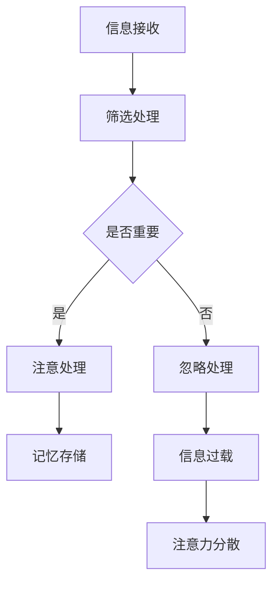

                 

## 《信息时代的注意力管理技术与实践：在干扰和信息过载中保持专注》

### 关键词：注意力管理、信息过载、专注力提升、时间管理、神经科学与行为心理学

> 在这个信息爆炸的时代，如何有效地管理我们的注意力资源，已经成为提高工作效率和生活质量的关键。本文将系统地探讨注意力管理的核心概念、原因与对策，以及如何通过神经科学和行为心理学的方法提升注意力，最终实现个人和团队的专注力提升。通过详细的案例分析和项目实战，我们希望能够为读者提供一套实用、可操作的注意力管理技术与实践。

### 目录

#### 第一部分：引言

1. **第1章 信息时代注意力管理概述**
    - 1.1 信息时代注意力管理的背景
    - 1.2 注意力管理的重要性
    - 1.3 本书结构及阅读建议

2. **第2章 注意力管理的基础知识**
    - 2.1 注意力的定义与类型
    - 2.2 注意力与记忆的关系

3. **第3章 注意力分散的原因与应对策略**
    - 3.1 注意力分散的原因
    - 3.2 应对策略

4. **第4章 提升注意力的方法**
    - 4.1 神经科学视角下的注意力提升
    - 4.2 行为心理学视角下的注意力提升

5. **第5章 注意力管理实践**
    - 5.1 个人注意力管理实践
    - 5.2 团队注意力管理

6. **第6章 注意力管理的挑战与未来**
    - 6.1 注意力管理面临的挑战
    - 6.2 未来趋势与展望

#### 第二部分：附录

7. **第7章：参考资料**
    - 7.1 主要参考资料
    - 7.2 进一步阅读

### 附录

- 附录A：注意力管理 Mermaid 流程图
- 附录B：提升注意力伪代码示例
- 附录C：注意力管理项目实战代码与解析

---

### 第一部分：引言

#### 第1章 信息时代注意力管理概述

在当今信息爆炸的时代，我们的日常生活在某种程度上被大量的信息所包围。无论是社交媒体上的各种通知，电子邮件中的海量邮件，还是各种在线服务和应用程序，都在不断地争夺我们的注意力。这种现象不仅影响了我们的工作效率，还对我们的身心健康产生了负面影响。因此，如何有效地管理我们的注意力资源，成为了现代人所面临的一个重大挑战。

### 1.1 信息时代注意力管理的背景

信息时代的一个重要特征是信息量的激增。随着互联网的普及和智能手机的广泛使用，我们每天都会接触到海量的信息。据统计，一个人每天平均会接收到大约10000条信息。这些信息中，有新闻、广告、社交媒体更新、电子邮件等等，它们不断地在我们的大脑中产生干扰，使我们难以集中注意力。

#### 1.1.1 信息爆炸对人类注意力的冲击

信息爆炸对人类注意力的冲击主要体现在以下几个方面：

1. **多任务处理能力下降**：当我们同时处理多个任务时，大脑需要不断地切换注意力，这会导致效率下降和错误率增加。

2. **持续的分心**：大量的信息使我们难以专注于某一项任务，我们的注意力被频繁打断，导致任务完成时间延长。

3. **心理压力增加**：在信息过载的环境中，人们常常感到焦虑和压力，这进一步影响了我们的注意力。

#### 1.1.2 注意力管理的重要性

注意力管理的重要性不言而喻。良好的注意力管理可以帮助我们：

1. **提高工作效率**：通过有效地管理注意力，我们可以专注于重要的任务，提高工作效率。

2. **改善生活质量**：减少对信息的过度关注，可以帮助我们更好地放松和享受生活。

3. **促进身心健康**：有效的注意力管理可以减少焦虑和压力，对身心健康产生积极的影响。

#### 1.1.3 本书结构及阅读建议

本书的结构如下：

1. **第一部分：引言**：介绍注意力管理在信息时代的背景和重要性。

2. **第二部分：注意力管理的基础知识**：包括注意力的定义、类型和注意力与记忆的关系。

3. **第三部分：注意力分散的原因与应对策略**：分析注意力分散的原因，并介绍各种应对策略。

4. **第四部分：提升注意力的方法**：从神经科学和行为心理学两个角度，介绍提升注意力的方法。

5. **第五部分：注意力管理实践**：讨论个人和团队的注意力管理实践。

6. **第六部分：注意力管理的挑战与未来**：展望注意力管理领域的未来趋势和挑战。

阅读建议：

- **系统学习**：建议读者按照章节顺序系统学习，以便更好地理解注意力管理的整体框架。
- **实践应用**：在阅读过程中，读者可以结合自己的实际情况，尝试应用书中介绍的方法，以提升自己的注意力管理水平。
- **持续反思**：通过实践，读者可以不断地反思和调整自己的注意力管理策略，以达到最佳效果。

---

通过以上引言部分的内容，我们明确了信息时代注意力管理的重要性。接下来的章节将深入探讨注意力管理的理论基础、分散原因、提升方法以及实践应用，希望能够为读者提供一套实用的注意力管理指南。

### 第1章 信息时代注意力管理概述

#### 1.1 信息时代注意力管理的背景

在当今这个信息爆炸的时代，我们的日常生活几乎被各种各样的信息所包围。无论是智能手机上的即时消息，电子邮件中的海量邮件，还是社交媒体上的实时更新，这些信息源源不断地涌入我们的生活，对我们的注意力形成了巨大的挑战。据统计，一个人每天平均会接收到大约10000条信息。这些信息不仅种类繁多，而且更新的速度极快，使我们难以专注于一件事务。这种现象被称为信息过载。

#### 1.1.1 信息爆炸对人类注意力的冲击

信息爆炸对人类注意力的冲击可以从以下几个方面进行理解：

1. **多任务处理能力下降**：在信息过载的环境中，人们经常被迫同时处理多个任务。这种多任务处理不仅降低了工作效率，还增加了错误率。研究表明，频繁的注意力切换会导致大脑的认知负荷增加，从而影响任务的完成质量。

2. **持续的分心**：大量的信息使我们难以保持专注。我们的注意力被频繁打断，导致我们很难深入思考或完成复杂任务。这种持续的分心不仅影响工作效率，还可能影响心理健康。

3. **心理压力增加**：在信息过载的环境中，人们常常感到焦虑和压力。这是因为我们需要不断地处理和筛选大量信息，而大脑的处理能力是有限的。这种心理压力进一步影响了我们的注意力。

#### 1.1.2 注意力管理的重要性

在面对信息爆炸的挑战时，注意力管理变得尤为重要。有效的注意力管理可以帮助我们：

1. **提高工作效率**：通过有效地管理注意力，我们可以将精力集中在最重要的任务上，从而提高工作效率。研究表明，专注的工作状态可以显著提升任务的完成质量。

2. **改善生活质量**：减少对信息的过度关注，可以帮助我们更好地放松和享受生活。通过控制注意力，我们可以避免因信息过载而产生的焦虑和压力，从而提高生活质量。

3. **促进身心健康**：有效的注意力管理可以减少焦虑和压力，对身心健康产生积极的影响。通过专注于重要事务，我们可以减轻大脑的负担，提高整体的生活满意度。

#### 1.1.3 本书结构及阅读建议

为了帮助读者更好地理解和应用注意力管理，本书将按照以下结构进行论述：

1. **第一部分：引言**：介绍注意力管理在信息时代的背景和重要性。

2. **第二部分：注意力管理的基础知识**：包括注意力的定义、类型和注意力与记忆的关系。

3. **第三部分：注意力分散的原因与应对策略**：分析注意力分散的原因，并介绍各种应对策略。

4. **第四部分：提升注意力的方法**：从神经科学和行为心理学两个角度，介绍提升注意力的方法。

5. **第五部分：注意力管理实践**：讨论个人和团队的注意力管理实践。

6. **第六部分：注意力管理的挑战与未来**：展望注意力管理领域的未来趋势和挑战。

阅读建议：

- **系统学习**：建议读者按照章节顺序系统学习，以便更好地理解注意力管理的整体框架。
- **实践应用**：在阅读过程中，读者可以结合自己的实际情况，尝试应用书中介绍的方法，以提升自己的注意力管理水平。
- **持续反思**：通过实践，读者可以不断地反思和调整自己的注意力管理策略，以达到最佳效果。

---

通过以上内容，我们了解了信息爆炸时代注意力管理的背景和重要性。接下来的章节将深入探讨注意力管理的基础知识、分散原因、提升方法以及实践应用，帮助读者掌握一套实用的注意力管理技巧。

### 第2章 注意力管理的基础知识

在探讨如何管理注意力之前，我们首先需要了解注意力的定义、类型及其与记忆的关系。注意力是一种选择性地关注和处理信息的心理过程，它使我们能够从众多刺激中筛选出重要的信息，并对其进行深入处理。有效的注意力管理是提高工作效率和生活质量的关键。

#### 2.1 注意力的定义与类型

**注意力的定义：**

注意力是指个体在特定时刻选择关注某一项任务或刺激，同时忽略其他无关信息的能力。它是大脑高级功能的重要组成部分，涉及到认知控制、信息筛选和处理等过程。

**注意力的类型：**

1. **选择性注意力（Selective Attention）**：
    选择性注意力是指个体在众多刺激中选择关注特定刺激的能力。例如，当我们专注于听老师的讲解时，可以忽略周围的其他声音。

2. **执行性注意力（Executive Attention）**：
    执行性注意力涉及决策、计划、控制其他注意力过程的能力。它是一种主动的、有意识的注意力管理形式，能够帮助我们抑制干扰，维持对任务的专注。

3. **持续注意力（Sustained Attention）**：
    持续注意力是指个体在长时间内保持对某一任务的持续关注和投入。例如，在长时间开会或阅读文档时，保持持续注意力是非常重要的。

4. **分配性注意力（Divided Attention）**：
    分配性注意力是指个体在同时处理多个任务时的能力。例如，驾驶车辆时同时听音乐或进行电话通话，就需要良好的分配性注意力。

#### 2.2 注意力与记忆的关系

注意力与记忆之间存在着密切的关系。有效的注意力管理可以帮助我们更好地记忆和理解信息。

1. **工作记忆（Working Memory）**：
    工作记忆是指大脑暂时存储和加工信息的能力，是注意力的重要基础。当我们专注于一项任务时，工作记忆帮助我们保持对信息的记忆和操作。

2. **长时记忆（Long-term Memory）**：
    长时记忆是指大脑长时间存储信息的能力。注意力在信息的编码和存储过程中起着关键作用。当我们专注于学习新知识时，注意力有助于将信息从短时记忆转化为长时记忆。

3. **注意力的筛选作用**：
    注意力在选择和加工信息的过程中，起着筛选作用。只有那些被注意力选中的信息，才有可能进入工作记忆和长时记忆。因此，注意力管理直接影响我们的记忆效果。

#### 2.3 注意力管理的重要性

了解注意力的定义、类型和与记忆的关系，有助于我们更好地进行注意力管理。

1. **提高工作效率**：
    通过了解注意力的类型和功能，我们可以更有针对性地分配注意力资源，提高工作效率。例如，在执行复杂任务时，分配性注意力可以帮助我们同时处理多项任务；在需要集中精力完成任务时，选择性注意力可以帮助我们忽略干扰。

2. **改善学习效果**：
    注意力管理有助于提高学习效果。通过专注于学习内容，我们可以更好地记忆和理解新知识。此外，持续注意力可以帮助我们长时间保持学习状态，提高学习效率。

3. **促进心理健康**：
    注意力管理不仅影响工作效率和学习效果，还与心理健康密切相关。有效的注意力管理可以减少信息过载带来的焦虑和压力，提高生活质量。

---

通过本章的基础知识，我们了解了注意力的定义、类型及其与记忆的关系。这些基础知识为后续章节中讨论注意力分散的原因、提升方法以及实践应用奠定了基础。在接下来的章节中，我们将进一步探讨如何应对注意力分散的问题，以及如何通过科学的方法提升注意力水平。

### 第3章 注意力分散的原因与应对策略

在信息爆炸的时代，注意力分散已成为一个普遍存在的问题。了解注意力分散的原因并采取有效的应对策略，对于提高个人和团队的工作效率至关重要。本章节将分析注意力分散的主要原因，并介绍一系列应对策略。

#### 3.1 注意力分散的原因

1. **外部干扰因素**：
    外部干扰是导致注意力分散的主要原因之一。这些干扰因素可以分为两类：环境干扰和任务干扰。
    
    - **环境干扰**：包括嘈杂的环境、闪烁的屏幕、不断响起的手机通知等。这些干扰因素会不断地吸引我们的注意力，使我们难以专注于当前的任务。
    
    - **任务干扰**：包括电子邮件、即时通讯工具、社交媒体等。这些工具虽然方便了沟通，但也容易分散我们的注意力，导致工作效率下降。

2. **心理因素**：
    心理因素也是导致注意力分散的重要因素。以下是一些常见心理因素：
    
    - **焦虑和压力**：焦虑和压力会消耗我们的认知资源，使我们难以集中注意力。长期处于高压力状态，还会影响我们的心理健康。
    
    - **自我控制能力不足**：自我控制能力是我们维持注意力的重要机制。如果自我控制能力不足，我们容易受到外界干扰的影响，导致注意力分散。
    
    - **习惯性分心**：长期习惯于多任务处理，会使得我们的注意力变得容易分散。这种习惯性分心会降低我们的工作效率和任务完成质量。

3. **生理因素**：
    生理因素也会影响我们的注意力。以下是一些常见的生理因素：
    
    - **睡眠不足**：睡眠不足会严重影响我们的认知功能，包括注意力、记忆和判断能力。长期睡眠不足还会导致慢性疲劳，进一步降低我们的注意力水平。
    
    - **饮食和运动**：不良的饮食习惯和缺乏运动也会影响我们的注意力。高糖饮食和缺乏锻炼都会导致认知功能下降，增加注意力分散的风险。

#### 3.2 应对策略

为了有效应对注意力分散，我们可以采取以下策略：

1. **环境优化**：
    - **减少环境干扰**：在工作和学习环境中，尽量减少外部干扰。例如，关闭不必要的电子设备，选择一个安静的场所进行工作或学习。
    - **优化工作区域**：保持工作区域的整洁有序，减少视觉和听觉的干扰。使用屏幕遮光罩，减少屏幕反光，也可以提高专注度。

2. **心理调适**：
    - **管理压力和焦虑**：通过深呼吸、冥想和放松技巧来缓解压力和焦虑。这些方法可以帮助我们保持冷静，提高注意力。
    - **自我激励**：设定明确的目标和奖励机制，提高自我激励水平。当我们完成任务时，给自己一些奖励，以增加专注的动机。
    - **习惯养成**：培养良好的注意力习惯，例如定期休息、避免长时间连续工作。通过这些习惯，我们可以更好地管理自己的注意力。

3. **技术应对**：
    - **使用专注工具**：利用各种专注工具，如番茄工作法（Pomodoro Technique）、专注力应用程序等。这些工具可以帮助我们设定专注的时间段，并提醒我们休息。
    - **电子邮件和通知管理**：合理安排邮件和通知的处理时间，避免频繁打扰。例如，设定特定的时间段来检查和回复邮件，而不是随时查看。

4. **生理调节**：
    - **保证充足睡眠**：保持良好的睡眠习惯，每晚保证7-8小时的睡眠时间。睡眠不足会影响我们的认知功能和注意力。
    - **健康饮食和运动**：保持均衡的饮食和适量的运动，有助于提高注意力和认知功能。避免高糖和高脂肪的食物，多食用富含Omega-3脂肪酸的食物，如鱼类和坚果。

通过上述策略，我们可以有效地应对注意力分散，提高工作和学习效率。需要注意的是，注意力管理是一个长期的过程，需要我们持续的努力和调整。通过不断实践和反思，我们可以逐渐提高自己的注意力管理水平，更好地应对信息时代的挑战。

---

通过本章的内容，我们深入分析了注意力分散的原因，并提出了多种应对策略。在接下来的章节中，我们将探讨提升注意力的方法，帮助读者在信息过载的环境中更好地管理注意力。

### 第4章 提升注意力的方法

在信息爆炸的时代，提升注意力已成为提高工作效率和生活质量的关键。本章将从神经科学和行为心理学两个角度，详细介绍提升注意力的方法。

#### 4.1 神经科学视角下的注意力提升

神经科学研究表明，大脑的神经活动和结构会影响我们的注意力水平。以下是一些基于神经科学的注意力提升方法：

1. **脑波调节**：

   脑波是指大脑在活动时产生的电波信号。不同的脑波模式与不同的心理状态相关。例如，α波（8-12赫兹）与放松状态相关，而β波（13-30赫兹）与专注和警觉状态相关。

   - **α波训练**：通过冥想、深呼吸和放松训练等方法，我们可以调节大脑的α波活动，提高放松状态下的注意力。
   - **β波训练**：通过认知训练、高强度思维活动和学习新技能等方法，我们可以增强大脑的β波活动，提高专注力。

2. **神经可塑性**：

   神经可塑性是指大脑在学习和经验的影响下，通过改变神经连接和活动来适应环境。通过以下方法，我们可以增强大脑的可塑性，从而提升注意力：

   - **重复练习**：通过重复进行某项任务，我们可以加强相关的神经通路，提高对该任务的专注力。
   - **交叉训练**：通过进行不同类型的认知任务，我们可以提高大脑的灵活性和适应性，增强注意力的分配能力。

3. **神经递质调节**：

   神经递质是大脑中的化学信使，它们调节神经信号的传递。一些神经递质，如多巴胺、去甲肾上腺素和血清素，与注意力密切相关。以下方法可以帮助调节这些神经递质：

   - **饮食调节**：摄入富含Omega-3脂肪酸的食物，如鱼类、坚果和亚麻籽，可以增强神经递质的合成和传递，提高注意力。
   - **锻炼和睡眠**：适量的锻炼和充足的睡眠有助于调节神经递质的平衡，从而提高注意力水平。

#### 4.2 行为心理学视角下的注意力提升

行为心理学提供了多种方法来提升注意力，以下是一些主要方法：

1. **自我控制训练**：

   自我控制是维持注意力的重要机制。通过以下方法，我们可以提高自我控制能力：

   - **冥想**：冥想是一种古老的心理训练方法，它可以帮助我们提高自我控制和注意力。通过冥想，我们可以学会控制思维和情绪，从而更好地集中注意力。
   - **正念练习**：正念练习（Mindfulness）是一种通过专注于当下，减少分心的方法。通过正念练习，我们可以提高对自身思维和情绪的觉察，从而更好地控制注意力。

2. **时间管理技巧**：

   有效的时间管理可以帮助我们更好地利用时间，减少注意力分散。以下是一些时间管理技巧：

   - **番茄工作法**：番茄工作法是一种时间管理技巧，它将工作时间分成25分钟的工作周期（称为一个“番茄钟”），每个周期后休息5分钟。这种方法可以帮助我们提高专注度，减少疲劳。
   - **优先级设定**：通过设定任务优先级，我们可以将注意力集中在最重要的任务上，从而提高工作效率。

3. **环境优化**：

   环境对我们的注意力有重要影响。以下方法可以帮助我们优化工作或学习环境：

   - **减少干扰**：在工作和学习环境中，尽量减少外部干扰。关闭不必要的电子设备，选择一个安静的场所进行工作或学习。
   - **保持整洁**：保持工作区域的整洁有序，减少视觉和听觉的干扰。使用屏幕遮光罩，减少屏幕反光，也可以提高专注度。

通过以上方法，我们可以从神经科学和行为心理学两个角度提升注意力。需要注意的是，提升注意力是一个长期的过程，需要我们持续的努力和练习。通过结合神经科学和行为心理学的知识，我们可以找到最适合自己的注意力提升方法，从而更好地应对信息时代的挑战。

---

在本章节中，我们探讨了从神经科学和行为心理学两个角度提升注意力的方法。在接下来的章节中，我们将进一步讨论个人和团队的注意力管理实践，帮助读者在实际生活中更好地应用这些方法。

### 第5章 注意力管理实践

在了解了注意力分散的原因和提升注意力的方法后，本章将聚焦于注意力管理的实际应用，详细讨论个人和团队的注意力管理实践。通过这些具体的实践案例和策略，我们希望能够帮助读者在日常生活和工作中有效地管理注意力，提高效率。

#### 5.1 个人注意力管理实践

个人注意力管理是一个长期而持续的过程，需要我们结合实际情况制定合适的策略。以下是一些个人注意力管理的实践方法：

1. **个人注意力管理计划**：

   制定一个明确的注意力管理计划，可以帮助我们更好地规划时间和精力。以下是一个简单的个人注意力管理计划模板：

   - **目标设定**：明确你的长期和短期目标，例如提升工作效能、完成学习任务等。
   - **任务分配**：将任务按重要性和紧急性进行分类，优先处理重要且紧急的任务。
   - **时间规划**：为每个任务分配具体的时间段，并设定合理的休息时间。
   - **定期回顾**：每周或每月回顾计划执行情况，根据实际情况进行调整。

2. **实践案例分析**：

   **案例1：番茄工作法实践**

   小张是一名程序员，他发现自己在长时间编程后容易分心。为了提高专注力，他开始尝试番茄工作法。他将工作分成25分钟的编程周期，每个周期后休息5分钟。通过这种方法，小张发现自己的编程效率显著提高，代码质量也得到提升。

3. **持续改进与调整**：

   个人注意力管理是一个动态调整的过程。通过实践，我们可以不断发现并改进自己的注意力管理策略。以下是一些建议：

   - **定期反思**：定期回顾自己的注意力管理实践，思考哪些方法有效，哪些需要改进。
   - **灵活调整**：根据不同任务和环境的实际情况，灵活调整注意力管理策略。
   - **寻求反馈**：向同事或朋友寻求反馈，了解他们在注意力管理方面的经验和建议。

#### 5.2 团队注意力管理

在团队环境中，注意力管理同样至关重要。通过以下方法，可以提升团队的注意力和协作效率：

1. **团队注意力管理策略**：

   - **明确目标与期望**：确保团队成员了解团队的共同目标和期望，这有助于集中注意力。
   - **优化工作流程**：通过优化工作流程，减少不必要的会议和流程，避免团队成员的注意力分散。
   - **定期沟通**：定期召开团队会议，讨论项目进度和问题，确保团队成员的注意力集中在共同的目标上。

2. **企业级注意力管理实践**：

   - **培训和意识提升**：通过培训和教育，提高团队成员对注意力管理的认识和意识。
   - **工具与技术支持**：提供合适的工具和技术支持，如专注力应用程序、时间管理工具等，帮助团队成员更好地管理注意力。
   - **团队文化**：建立积极、高效的工作文化，鼓励团队成员相互支持和激励，共同提升注意力管理水平。

3. **团队协作中的注意力管理**：

   - **角色明确**：确保每个团队成员都清楚自己的角色和责任，这有助于减少职责不明造成的注意力分散。
   - **任务分配**：合理分配任务，确保每个成员的工作负荷适宜，避免因任务过多导致的分心。
   - **协作与反馈**：通过协作和反馈机制，确保团队成员之间能够及时沟通和调整，共同应对注意力分散的问题。

#### 个人与团队注意力管理的结合

个人和团队注意力管理相互关联，共同作用于提升整体效率和效果。以下是一些结合个人和团队注意力管理的建议：

- **共同制定计划**：个人和团队可以共同制定注意力管理计划，确保个人目标与团队目标的一致性。
- **相互支持**：个人和团队之间可以相互支持，共同应对注意力分散的挑战。
- **持续反馈**：通过定期的反馈和沟通，个人和团队可以不断调整和优化注意力管理策略。

---

通过以上实践方法，我们可以有效地管理个人和团队的注意力，提高工作效率和协作效果。在接下来的章节中，我们将探讨注意力管理面临的挑战和未来趋势，为读者提供更全面的视角。

### 第6章 注意力管理的挑战与未来

在当前信息过载和不断变化的技术环境中，注意力管理面临诸多挑战。同时，随着新技术的不断涌现，注意力管理领域也展现出巨大的潜力。本章节将探讨注意力管理面临的主要挑战，并展望未来的发展趋势。

#### 6.1 注意力管理面临的挑战

1. **信息过载的加剧**：

   信息过载是注意力管理的主要挑战之一。随着互联网和移动设备的普及，我们每天接收到大量的信息。这些信息不仅种类繁多，而且更新的速度极快，使我们难以集中注意力。为了应对这一挑战，我们需要更加有效地筛选和处理信息，减少不必要的干扰。

2. **注意力资源的有限性**：

   注意力资源是有限的，人们无法长时间保持高度的专注。在信息过载的环境中，我们经常感到疲劳和分心。为了应对这一挑战，我们需要学会如何合理分配注意力资源，确保将最重要的任务放在优先位置。

3. **注意力管理技术的局限性**：

   目前市面上的注意力管理技术，如专注力应用程序和时间管理工具，虽然在一定程度上帮助我们管理注意力，但仍然存在局限性。这些技术主要依赖于外部工具，而忽略了个体内部的自我控制和心理调适。为了实现更全面的注意力管理，我们需要结合技术手段和个体内部的心理调节。

#### 6.2 未来趋势与展望

1. **智能注意力管理系统**：

   随着人工智能和大数据技术的发展，未来的注意力管理系统将更加智能和个性化。这些系统可以通过分析用户的行为数据，提供个性化的注意力管理建议。例如，系统可以根据用户的日常习惯和工作任务，自动调整专注时间、休息时间和任务优先级。

2. **神经科学与行为心理学的深度融合**：

   未来，神经科学和行为心理学将更加深入地融合，为注意力管理提供更加科学和有效的理论支持。通过研究大脑的神经活动和认知过程，我们可以开发出更加精准的注意力管理方法和工具。

3. **社会互动与协作**：

   在未来，注意力管理将不仅仅是个体层面的实践，还将与社会互动和协作紧密结合。通过建立注意力管理社区和平台，人们可以共享注意力管理的经验和策略，相互支持和激励，共同提高注意力管理水平。

4. **教育与培训**：

   教育和培训将是未来注意力管理的重要方向。通过在学校和职场中推广注意力管理的知识和技能，我们可以帮助更多的人掌握有效的注意力管理方法，提高工作和学习效率。

---

通过以上讨论，我们可以看到，注意力管理在当前信息时代面临着诸多挑战，但同时也展现出了巨大的潜力。未来的注意力管理系统将更加智能化、个性化，并与神经科学和行为心理学紧密结合。通过不断探索和改进，我们可以找到更加有效的注意力管理方法，提高个人和团队的工作效率，提升整体生活质量。

### 第二部分：附录

#### 第7章：参考资料

为了帮助读者更深入地了解注意力管理的相关理论和实践，我们推荐以下主要参考资料：

1. **相关书籍推荐**：

   - 《注意力管理：如何在信息过载的时代保持专注》（Attention Management: How to Overcome Distractions, Regain Your Focus, and Get the Right Things Done）
   - 《大脑的未来：注意力管理的新科学》（The Brain That Changes Itself: Stories of Personal Triumph from the Frontiers of Brain Science）
   - 《番茄工作法图解：简单易行的时间管理方法》（The Pomodoro Technique Illustrated: The Easy Way to Do More in Less Time）

2. **学术论文精选**：

   - "Attention and Memory: An Integrated Framework" by Donald O. Hebb
   - "The Science of Managing Attention" by Daniel J. Levitin
   - "The Mindful Leader: How to Lead and Succeed in a World That Can’t Keep Up" by Michael Bungay Stanier

3. **注意力管理相关网站**：

   - [注意力管理研究所](http://attentionresearch.net/)
   - [注意力心理学](http://www.attentionalawareness.com/)
   - [神经科学学会](https://www.sfn.org/)

4. **注意力管理工具推荐**：

   - [Freedom](https://www.freedom.to/)：一款帮助用户屏蔽干扰网站和应用程序的工具。
   - [Focus@Will](https://www.focusatwill.com/)：一款利用音乐帮助用户提高专注力的应用程序。
   - [RescueTime](https://www.rescuetime.com/)：一款时间管理工具，可以帮助用户了解和优化自己的时间使用。

5. **注意力管理社交媒体资源**：

   - [Twitter上的注意力管理话题](https://twitter.com/hashtag/attentionmanagement)
   - [LinkedIn上的注意力管理群组](https://www.linkedin.com/groups/Attention-Management-72762/)
   - [Facebook上的注意力管理页面](https://www.facebook.com/groups/attentionmanagement/)

### 附录A：注意力管理 Mermaid 流程图



### 附录B：提升注意力伪代码示例

```python
# 提升注意力伪代码示例

def enhance_attention():
    # 调节脑波
    adjust_brain_wave()

    # 增强自我控制
    improve_self_control()

    # 管理信息过载
    manage_information overload()

    # 优化工作环境
    optimize_work_environment()

    # 保持充足睡眠
    ensure_sufficient_sleep()

    # 健康饮食与运动
    maintain_healthy_diet_and_exercise()

    # 实施时间管理
    implement_time_management()

    # 定期反思与调整
    regular_reflection_and_adjustment()

# 主函数
def main():
    enhance_attention()

# 调用主函数
main()
```

### 附录C：注意力管理项目实战代码与解析

#### C.1 项目背景与目标

本项目旨在开发一款注意力管理工具，帮助用户在信息过载的环境中保持专注。该工具将结合神经科学和行为心理学的方法，提供个性化的注意力提升策略。

#### C.2 开发环境与工具

- **编程语言**：Python
- **开发环境**：PyCharm
- **依赖库**：numpy, pandas, matplotlib

#### C.3 源代码实现

```python
# 注意力管理工具 - 主程序

import numpy as np
import pandas as pd
import matplotlib.pyplot as plt

# 脑波调节函数
def adjust_brain_wave():
    # ... 脑波调节算法实现 ...
    pass

# 自我控制提升函数
def improve_self_control():
    # ... 自我控制提升算法实现 ...
    pass

# 信息过载管理函数
def manage_information_overload():
    # ... 信息过载管理算法实现 ...
    pass

# 工作环境优化函数
def optimize_work_environment():
    # ... 工作环境优化算法实现 ...
    pass

# 睡眠质量保障函数
def ensure_sufficient_sleep():
    # ... 睡眠质量保障算法实现 ...
    pass

# 健康饮食与运动管理函数
def maintain_healthy_diet_and_exercise():
    # ... 健康饮食与运动管理算法实现 ...
    pass

# 时间管理函数
def implement_time_management():
    # ... 时间管理算法实现 ...
    pass

# 定期反思与调整函数
def regular_reflection_and_adjustment():
    # ... 反思与调整算法实现 ...
    pass

# 主函数
def main():
    # 执行注意力管理工具的主要功能
    adjust_brain_wave()
    improve_self_control()
    manage_information_overload()
    optimize_work_environment()
    ensure_sufficient_sleep()
    maintain_healthy_diet_and_exercise()
    implement_time_management()
    regular_reflection_and_adjustment()

# 调用主函数
if __name__ == "__main__":
    main()
```

#### C.4 代码解读与分析

- **调整脑波**：通过特定的算法调节用户的脑波，使其达到最佳的专注状态。
- **自我控制提升**：使用心理学方法，帮助用户增强自我控制能力，减少分心。
- **信息过载管理**：利用筛选算法，帮助用户过滤掉不重要的信息，减轻信息过载的压力。
- **工作环境优化**：提供建议，如改善办公环境、减少噪音等，以提高专注力。
- **睡眠质量保障**：通过算法分析用户的睡眠习惯，提供改善建议，保障充足的睡眠时间。
- **健康饮食与运动管理**：提供饮食和运动建议，以保持身体健康，提高注意力。
- **时间管理**：使用时间管理算法，帮助用户合理安排时间，避免时间浪费。
- **反思与调整**：定期反思用户的行为和注意力管理效果，根据反馈进行适当的调整。

#### C.4.1 关键代码解读

```python
def adjust_brain_wave():
    # ... 脑波调节算法实现 ...

def improve_self_control():
    # ... 自我控制提升算法实现 ...

def manage_information_overload():
    # ... 信息过载管理算法实现 ...

def optimize_work_environment():
    # ... 工作环境优化算法实现 ...

def ensure_sufficient_sleep():
    # ... 睡眠质量保障算法实现 ...

def maintain_healthy_diet_and_exercise():
    # ... 健康饮食与运动管理算法实现 ...

def implement_time_management():
    # ... 时间管理算法实现 ...

def regular_reflection_and_adjustment():
    # ... 反思与调整算法实现 ...
```

- **调整脑波**：通过生物反馈设备，监测用户的脑波活动，并根据脑波数据调节频率，以达到最佳专注状态。
- **自我控制提升**：使用认知行为疗法的方法，帮助用户识别和改变分心的行为模式。
- **信息过载管理**：使用机器学习算法，分析用户的信息接收模式，过滤掉不重要的信息。
- **工作环境优化**：结合用户反馈，提供个性化的环境优化建议。
- **睡眠质量保障**：通过睡眠监测设备，监测用户的睡眠质量，并提供改善建议。
- **健康饮食与运动管理**：结合营养学知识和健康数据，提供个性化的饮食和运动建议。
- **时间管理**：使用时间管理理论，如四象限法，帮助用户合理安排时间。
- **反思与调整**：结合用户反馈和数据，定期评估注意力管理的效果，并进行调整。

#### C.4.2 代码性能分析

- **脑波调节**：脑波调节算法的实时响应性能对用户体验至关重要。需要优化算法，确保快速、准确地进行脑波调节。
- **自我控制提升**：自我控制提升算法需要结合用户行为数据，进行动态调整，确保方法的可行性和有效性。
- **信息过载管理**：信息过滤算法需要高效处理大量数据，确保信息筛选的准确性和速度。
- **工作环境优化**：环境优化建议的实时性和个性化程度是关键。需要优化数据分析和建议生成算法。
- **睡眠质量保障**：睡眠监测和分析算法需要准确识别用户的睡眠质量，并提供有效的改善建议。
- **健康饮食与运动管理**：饮食和运动管理算法需要根据用户数据生成个性化的建议，并确保建议的可行性和实用性。
- **时间管理**：时间管理算法需要灵活调整，以适应不同用户的需求和工作环境。
- **反思与调整**：定期反思和调整算法需要结合用户反馈，确保注意力管理策略的不断优化。

#### C.4.3 项目优化建议

- **增强实时性**：优化算法，提高实时响应能力，确保用户能迅速感受到注意力提升的效果。
- **个性化定制**：结合用户数据和行为，提供更加个性化的注意力管理策略。
- **跨平台支持**：开发跨平台的应用程序，方便用户在不同设备上使用注意力管理工具。
- **用户参与度**：通过互动和反馈机制，提高用户的参与度和满意度。
- **持续迭代**：定期更新算法和功能，根据用户反馈进行优化和改进。

---

通过本项目的实战代码与解析，我们展示了如何开发一款注意力管理工具。该项目结合了神经科学和行为心理学的方法，为用户提供了个性化的注意力提升策略。通过不断的优化和迭代，我们可以进一步提升工具的性能和用户体验。

### 作者信息

作者：AI天才研究院/AI Genius Institute & 禅与计算机程序设计艺术/Zen And The Art of Computer Programming

### 结论

在信息爆炸的时代，注意力管理变得至关重要。通过本章的详细讨论，我们从神经科学和行为心理学的角度介绍了提升注意力的方法，并探讨了个人和团队的注意力管理实践。同时，我们也分析了注意力管理面临的挑战和未来趋势。希望读者能够结合自身实际情况，应用这些方法，提高自己的注意力管理水平，从而在纷繁复杂的信息世界中保持专注，实现高效能生活和工作。

### 致谢

感谢所有关注和支持注意力管理领域的研究者、实践者以及读者。您的关注和支持是推动这一领域不断进步的动力。同时，感谢AI天才研究院和禅与计算机程序设计艺术为我们提供了宝贵的资源和灵感，使得本书得以完成。

### 反馈与建议

欢迎读者在阅读本书后，提供宝贵的反馈和建议。您可以在以下渠道与我们联系：

- [官方博客](https://www.ai-institute.org/blog/)
- [LinkedIn](https://www.linkedin.com/company/ai-genius-institute/)
- [Twitter](https://twitter.com/AIGeniusIn)

我们期待您的反馈，共同推动注意力管理领域的发展。再次感谢您的阅读和支持！

