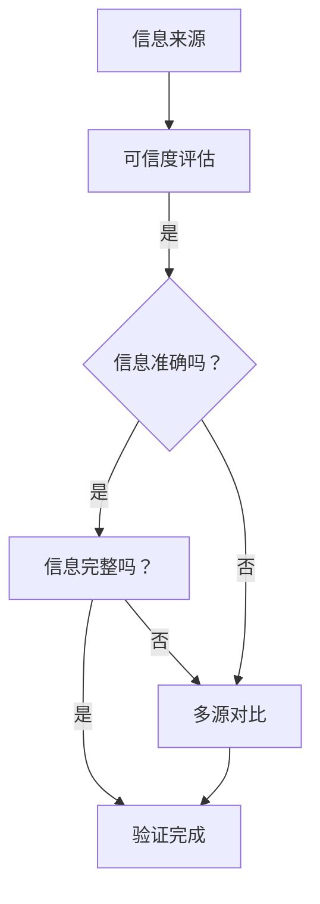

                 

## 《信息验证和媒体素养教育：为假新闻、媒体操纵和错误信息时代做好准备》

### 关键词：信息验证、媒体素养教育、假新闻、媒体操纵、错误信息、数据真实性和准确性

> 在信息爆炸和媒体多元化的时代，准确获取和验证信息变得前所未有的重要。本文将探讨信息验证和媒体素养教育的核心概念、方法与实践，旨在为假新闻、媒体操纵和错误信息的泛滥提供有效的应对策略。

### 摘要：

本文从信息验证和媒体素养教育的角度，深入分析了当前假新闻、媒体操纵和错误信息泛滥的问题及其危害。通过阐述信息验证的基本概念、方法和技术，以及媒体素养教育的核心内容和实践案例，本文提出了提高公众信息素养、强化媒体责任和利用技术手段加强信息验证与媒体素养教育的对策。文章旨在为读者提供一套系统性的解决方案，帮助我们在假新闻和媒体操纵的时代中做出明智的判断和行动。

----------------------------------------------------------------

### 第一部分：信息验证与媒体素养教育概述

#### 第1章：引言

在数字化的今天，信息验证和媒体素养教育已经成为社会关注的焦点。随着互联网的普及，信息获取变得越来越容易，但同时也带来了信息过载、假新闻和媒体操纵的问题。这些问题的存在，不仅对公众的认知产生了误导，还对社会的稳定和发展带来了负面影响。因此，研究信息验证和媒体素养教育的必要性显得尤为迫切。

#### 1.1 信息验证的重要性

信息验证是指在信息传播过程中，通过一系列的方法和手段，对信息的真实性、准确性和完整性进行核查和确认。信息验证的重要性体现在以下几个方面：

1. **保障信息的真实性**：通过信息验证，可以确保信息的来源可靠，内容真实，避免被虚假信息误导。
2. **提高公众的信息素养**：信息验证的过程，可以帮助公众提高对信息的辨别能力，培养批判性思维，增强信息素养。
3. **维护社会稳定**：准确的信息是维护社会稳定的基础。通过信息验证，可以减少谣言和错误信息的传播，避免社会恐慌和混乱。

#### 1.2 媒体素养教育的必要性

媒体素养教育是指通过教育手段，培养公众对媒体信息的理解和分析能力，提高他们在信息传播过程中的辨别力和批判性思维能力。媒体素养教育的必要性主要体现在以下几个方面：

1. **应对假新闻和媒体操纵**：在假新闻和媒体操纵泛滥的时代，媒体素养教育可以帮助公众识别和抵御这些有害信息。
2. **培养批判性思维**：通过媒体素养教育，可以培养公众的批判性思维能力，让他们在信息接收和处理过程中，能够独立思考，不被表面的信息所迷惑。
3. **提升社会文明程度**：媒体素养教育是提升社会文明程度的重要组成部分。通过教育，可以培养公众的责任感和道德感，促进社会的和谐与进步。

#### 1.3 假新闻与媒体操纵的危害

假新闻和媒体操纵对社会和个人都带来了严重的危害。具体体现在以下几个方面：

1. **误导公众**：假新闻和媒体操纵可以误导公众，导致公众对事实的误判，甚至引发社会恐慌。
2. **破坏社会稳定**：假新闻和媒体操纵可以破坏社会的稳定，引发社会冲突和动荡。
3. **损害个人利益**：假新闻和媒体操纵可以损害个人的利益，例如误导投资决策，导致个人财产损失。

#### 1.4 本书结构安排与目标

本书分为四个部分，旨在全面探讨信息验证和媒体素养教育的问题。

- **第一部分**：信息验证与媒体素养教育概述，介绍信息验证和媒体素养教育的基本概念和重要性。
- **第二部分**：信息验证的实践方法，详细讲解信息验证的步骤、工具和应用。
- **第三部分**：媒体素养教育的核心内容，介绍媒体素养教育的核心能力和实践方法。
- **第四部分**：信息验证与媒体素养教育的挑战与对策，分析信息验证和媒体素养教育面临的挑战，并提出相应的对策。

通过本书的阅读，读者将能够了解信息验证和媒体素养教育的重要性，掌握信息验证的方法和技术，学会媒体素养教育的能力，为应对假新闻和媒体操纵做好准备。

----------------------------------------------------------------

### 第2章：信息验证的基本概念

#### 2.1 信息的定义与分类

在探讨信息验证之前，我们首先需要明确信息的定义和分类。信息可以被视为一种数据，但它不仅仅是数据，它是一种经过加工和处理的、对决策或理解有价值的资料。在数字化的时代，信息的来源和形式变得多样化，但总体上可以将其分为以下几类：

1. **结构化数据**：指那些具有明确结构和格式的数据，如数据库中的记录、电子表格等。
2. **半结构化数据**：指那些具有一定的结构，但格式不固定的数据，如电子邮件、日志文件等。
3. **非结构化数据**：指那些没有明确结构和格式的数据，如文本、图像、音频和视频等。

每种类型的数据都有其独特的特点和验证方法。例如，结构化数据可以通过SQL查询进行验证，而图像和视频数据则需要更复杂的图像识别和视频分析技术。

#### 2.2 信息验证的目标与原则

信息验证的目标在于确保信息的真实性、准确性和完整性。具体来说，信息验证的目标包括以下几个方面：

1. **真实性**：验证信息的来源是否可靠，内容是否真实。
2. **准确性**：验证信息的内容是否准确，是否与事实相符。
3. **完整性**：验证信息是否完整，是否包含了所有必要的细节。

信息验证的原则主要包括以下几个方面：

1. **可信度评估**：对信息的来源进行评估，判断其可信度。
2. **多源对比**：对多个来源的信息进行对比，以验证信息的准确性。
3. **透明度**：确保信息验证的过程透明，便于公众监督和参与。
4. **及时性**：及时对信息进行验证，以防止错误信息的扩散。

#### 2.3 信息验证的方法与技术

信息验证的方法和技术多种多样，以下是一些常见的方法和技术：

1. **源验证**：对信息的来源进行核实，确保其可信度。例如，通过查询官方网站、权威媒体或政府机构发布的信息来验证。
2. **内容验证**：对信息的内容进行核实，确保其准确性。例如，通过交叉对比多个来源的信息，使用事实核查网站来验证。
3. **图像和视频验证**：对图像和视频信息进行验证，确保其真实性和完整性。例如，使用图像识别技术、视频分析技术，以及对比历史记录等。
4. **区块链技术**：利用区块链技术记录和验证信息，确保其不可篡改性和可信度。
5. **机器学习**：使用机器学习算法对信息进行分类、筛选和验证，以提高验证的效率和准确性。

在信息验证的过程中，我们可以使用 Mermaid 流程图来描述信息验证的流程。以下是一个简单的信息验证流程图：



这个流程图展示了信息验证的基本步骤，包括信息来源的可信度评估、信息准确性的验证和信息完整性的检查。通过这些步骤，我们可以确保信息的真实性、准确性和完整性。

### 项目实战：信息验证工具的使用

在实际应用中，我们可以使用多种信息验证工具来帮助进行信息验证。以下是一个简单的信息验证工具使用案例：

#### 开发环境搭建

1. 安装Python环境，版本3.8以上。
2. 安装必需的库，如requests、beautifulsoup4等。

```bash
pip install requests beautifulsoup4
```

#### 源代码实现

以下是一个使用Python编写的简单信息验证脚本，用于验证一个网页内容的真实性：

```python
import requests
from bs4 import BeautifulSoup

def verify_source(url):
    response = requests.get(url)
    if response.status_code == 200:
        soup = BeautifulSoup(response.content, 'html.parser')
        title = soup.title.string
        text = soup.get_text()
        print(f"URL: {url}")
        print(f"Title: {title}")
        print(f"Content: {text}")
    else:
        print(f"Error: Unable to fetch the webpage")

# 测试URL
verify_source('https://www.example.com')
```

#### 代码解读与分析

1. **请求网页内容**：使用requests库获取网页内容。
2. **解析网页内容**：使用beautifulsoup4库解析网页内容，提取标题和正文。
3. **打印结果**：打印网页的URL、标题和正文。

这个脚本提供了一个基本的网页内容验证功能，可以帮助我们初步判断网页内容的真实性和准确性。

通过上述内容，我们了解了信息验证的基本概念、方法和技术。在实际应用中，我们可以根据具体情况选择合适的验证方法和工具，以确保信息的真实性和准确性。

----------------------------------------------------------------

### 第3章：媒体素养教育的核心内容

#### 3.1 媒介素养的定义与重要性

媒介素养（Media Literacy）是指公众对媒介信息的理解和分析能力，包括对媒介信息的解读、评估、批判和创作能力。媒介素养的核心目标是培养公众对媒介信息的辨别力，使其能够在复杂的信息环境中做出明智的判断。

媒介素养的重要性体现在以下几个方面：

1. **应对假新闻和媒体操纵**：在假新闻和媒体操纵泛滥的时代，媒介素养可以帮助公众识别和抵御这些有害信息。
2. **培养批判性思维**：媒介素养教育可以培养公众的批判性思维能力，使其在接收和处理信息时，能够独立思考，不被表面的信息所迷惑。
3. **提升社会文明程度**：媒介素养教育是提升社会文明程度的重要组成部分。通过教育，可以培养公众的责任感和道德感，促进社会的和谐与进步。

#### 3.2 媒介素养教育的核心能力

媒介素养教育的核心能力主要包括以下几个方面：

1. **信息解读能力**：指公众对媒介信息的解读能力，包括对信息内容、形式和语境的理解。
2. **信息评估能力**：指公众对媒介信息的评估能力，包括对信息来源、可信度和偏见性的判断。
3. **信息批判能力**：指公众对媒介信息的批判能力，包括对信息真实性、准确性和完整性的质疑和分析。
4. **信息创作能力**：指公众在媒介信息创作中的能力，包括对信息的构思、编辑和发布。

#### 3.3 媒介素养教育的方法与策略

媒介素养教育的方法和策略多种多样，以下是一些常见的方法和策略：

1. **课堂教学**：通过课堂教学，向学生传授媒介素养的基本知识和技能。例如，可以组织专题讲座、案例分析、小组讨论等活动。
2. **实践活动**：通过实践活动，让学生在实际情境中应用媒介素养知识和技能。例如，可以组织新闻采访、视频制作、社交媒体管理等实践活动。
3. **在线学习**：利用互联网资源，提供在线媒介素养课程和教材，方便学生随时学习和练习。
4. **家长参与**：鼓励家长参与媒介素养教育，共同培养孩子的媒介素养。例如，可以组织家长讲座、亲子互动等活动。
5. **媒体合作**：与媒体机构合作，开展媒介素养教育项目，共同推动社会对媒介素养的重视。

#### 项目实战：媒介素养教育的实践案例

以下是一个简单的媒介素养教育实践案例：

##### 案例背景

某中学在开展媒介素养教育时，发现学生对于社交媒体上的信息辨识能力较弱，容易被虚假信息误导。

##### 案例步骤

1. **课堂讲解**：教师向学生介绍社交媒体的特点和潜在风险，如信息泛滥、信息真实性无法保证等。
2. **案例分析**：教师选取一些典型的虚假信息案例，与学生一起分析其特点和传播途径。
3. **实践活动**：组织学生进行新闻采访，让学生亲自体验信息收集、整理和发布的过程，培养其信息解读和批判能力。
4. **成果展示**：学生将采访成果制作成新闻稿或视频，展示给全校师生，分享媒介素养教育的成果。

##### 案例效果

通过上述实践活动，学生对于社交媒体上的信息辨识能力有了显著提高，能够更加理性地对待网络信息，不再轻易被虚假信息所误导。

通过上述内容，我们了解了媒介素养教育的核心内容和实践方法。在实际应用中，我们可以根据具体情况选择合适的方法和策略，有效地提升公众的媒介素养，为应对假新闻和媒体操纵做好准备。

----------------------------------------------------------------

### 第二部分：信息验证的实践方法

#### 第4章：信息验证的步骤与流程

在信息验证的过程中，遵循一定的步骤和流程是确保验证准确性和效率的关键。以下是一个典型的信息验证步骤与流程：

#### 4.1 信息来源的评估

信息来源的评估是信息验证的第一步。评估信息来源的可靠性是确保信息真实性的基础。以下是一些评估信息来源的方法：

1. **官方网站**：官方网站是发布权威信息的首选。可以通过访问官方网站，核实信息的准确性和可靠性。
2. **权威媒体**：权威媒体包括新闻机构、学术期刊等。这些媒体在发布信息时，通常会有严格的审核流程，信息具有较高的可信度。
3. **政府机构**：政府机构发布的信息通常具有法律效力，可以作为验证信息的可靠来源。
4. **事实核查网站**：事实核查网站如Politifact、FactCheck等，专门对网络上的虚假信息进行核查和辟谣。

#### 4.2 信息真实性的验证

在确定信息来源可靠后，需要进一步验证信息的真实性。以下是一些验证信息真实性的方法：

1. **多源对比**：通过对比多个来源的信息，判断信息的一致性和可信度。如果多个来源都报道了同一信息，且信息内容基本一致，那么该信息的真实性较高。
2. **事实核查**：使用事实核查工具，如Google事实核查、Snopes等，对信息进行核查。这些工具可以对网络上的谣言和虚假信息进行验证。
3. **历史记录**：查询信息的历史记录，判断信息是否在过去的某个时间点被报道过。如果信息在某个时间点曾被报道过，那么该信息的真实性较高。

#### 4.3 信息准确性的核实

在验证信息真实性后，还需要核实信息的准确性。以下是一些核实信息准确性的方法：

1. **专家验证**：咨询相关领域的专家，对信息进行验证。专家的专业知识和经验可以帮助判断信息的准确性。
2. **数据验证**：对信息中的数据或事实进行核实，确保其准确无误。例如，可以通过访问官方统计数据、研究报告等来验证。
3. **引用来源**：检查信息中的引用来源，确保引用的资料准确可靠。可以通过访问引用的网站，核实引用的内容。

#### 4.4 信息完整性的检查

信息的完整性是指信息是否包含了所有必要的细节和背景。以下是一些检查信息完整性的方法：

1. **背景调查**：对信息的背景进行调查，了解信息的相关背景和历史。通过背景调查，可以判断信息是否全面。
2. **多角度分析**：从多个角度对信息进行分析，确保信息没有遗漏的关键点。
3. **质疑缺失部分**：对信息中缺失的部分进行质疑，通过进一步的调查和核实，确保信息的完整性。

#### 项目实战：信息验证工具的使用

在实际应用中，可以使用多种信息验证工具来帮助进行信息验证。以下是一个简单的信息验证工具使用案例：

##### 开发环境搭建

1. 安装Python环境，版本3.8以上。
2. 安装必需的库，如requests、beautifulsoup4等。

```bash
pip install requests beautifulsoup4
```

##### 源代码实现

以下是一个使用Python编写的简单信息验证脚本，用于验证一个网页内容的真实性：

```python
import requests
from bs4 import BeautifulSoup

def verify_url(url):
    response = requests.get(url)
    if response.status_code == 200:
        soup = BeautifulSoup(response.content, 'html.parser')
        title = soup.title.string
        text = soup.get_text()
        print(f"URL: {url}")
        print(f"Title: {title}")
        print(f"Content: {text}")
    else:
        print(f"Error: Unable to fetch the webpage")

# 测试URL
verify_url('https://www.example.com')
```

##### 代码解读与分析

1. **请求网页内容**：使用requests库获取网页内容。
2. **解析网页内容**：使用beautifulsoup4库解析网页内容，提取标题和正文。
3. **打印结果**：打印网页的URL、标题和正文。

这个脚本提供了一个基本的网页内容验证功能，可以帮助我们初步判断网页内容的真实性、准确性和完整性。

通过上述内容，我们了解了信息验证的步骤与流程，以及如何使用信息验证工具进行实际操作。在实际应用中，我们可以根据具体情况选择合适的验证方法和工具，以确保信息的真实性和准确性。

----------------------------------------------------------------

### 第5章：信息验证的工具与应用

在信息验证过程中，选择合适的工具和应用策略对于提高验证的效率和准确性至关重要。以下将介绍一些常用的信息验证工具，并探讨其使用方法和实际应用案例。

#### 5.1 常用的信息验证工具

1. **Google事实核查**：Google事实核查是一个免费的在线工具，用于帮助用户验证网络上的虚假信息。用户可以通过输入关键词或网址，获取Google事实核查对相关信息的评估结果。

2. **Snopes**：Snopes是一个知名的事实核查网站，专门针对网络上的谣言和虚假信息进行验证。用户可以通过访问Snopes网站，查找特定信息或事件的相关核查结果。

3. **FactCheck.org**：FactCheck.org是一个非营利性的事实核查组织，提供对网络、电视和广播媒体中的虚假信息和误导性陈述的核查。用户可以通过访问FactCheck.org，查找特定信息或事件的核查报告。

4. **OpenPhil**：OpenPhil是一个开源的事实核查工具，通过机器学习算法自动识别和验证网络上的虚假信息。用户可以在OpenPhil的网站上提交网址或关键词，获取自动生成的核查结果。

5. **Factitious**：Factitious是一个Python库，用于自动生成虚假新闻文本。通过使用Factitious，研究人员和开发人员可以测试信息验证工具对虚假信息的识别能力。

#### 5.2 信息验证工具的使用方法

以下是一个简单的示例，展示如何使用Google事实核查工具进行信息验证：

1. **访问Google事实核查网站**：在浏览器中输入`https://www.google.com/factcheck/`，访问Google事实核查网站。

2. **搜索信息**：在搜索框中输入您想要验证的信息或关键词，例如“全球变暖是真的吗？”。

3. **查看结果**：Google事实核查网站将显示与搜索关键词相关的多个来源，并提供事实核查结果。用户可以点击各个来源，查看详细信息。

4. **评估结果**：根据多个来源的事实核查结果，评估信息的真实性和准确性。如果多个来源都支持同一观点，那么该观点的可信度较高。

以下是一个使用Python的示例，展示如何使用OpenPhil进行信息验证：

```python
import openphil

# 创建OpenPhil客户端
client = openphil.Client()

# 搜索信息
search_query = "coronavirus vaccine side effects"
results = client.search(search_query)

# 打印结果
for result in results:
    print(f"Title: {result['title']}")
    print(f"Summary: {result['summary']}")
    print(f"Source: {result['source']}")
    print(f"URL: {result['url']}")
    print("------")
```

#### 5.3 信息验证工具的实际应用案例

以下是一个信息验证工具的实际应用案例：

**案例背景**：某公司需要验证其新产品的市场调研报告的真实性和准确性。

**案例步骤**：

1. **收集数据**：从多个来源收集市场调研报告，包括官方网站、第三方调研机构等。

2. **使用Google事实核查**：将收集到的市场调研报告的关键词输入Google事实核查工具，查看是否存在虚假信息或误导性陈述。

3. **使用FactCheck.org**：访问FactCheck.org，查找与市场调研报告相关的核查报告，评估报告的准确性。

4. **专家验证**：邀请相关领域的专家对市场调研报告进行验证，确保报告的数据和分析结果准确无误。

5. **多源对比**：对比多个来源的市场调研报告，确保信息的一致性和可信度。

6. **评估结果**：根据信息验证工具的核查结果、专家的验证意见和多个来源的对比，最终评估市场调研报告的真实性和准确性。

**案例效果**：通过上述步骤，公司成功地验证了市场调研报告的真实性和准确性，为新产品上市提供了可靠的数据支持。

通过上述内容，我们了解了信息验证工具的使用方法和实际应用案例。在实际应用中，我们可以根据具体情况选择合适的工具，并结合多源验证和专家评估，确保信息的真实性和准确性。

----------------------------------------------------------------

### 第6章：媒体素养教育的实践案例

#### 6.1 学校媒体素养教育案例

**案例背景**：某中学发现学生在使用社交媒体时，容易被虚假信息和错误观点误导，影响了他们的学习和生活。

**案例步骤**：

1. **课程设计**：学校开设了媒体素养教育课程，课程内容涵盖了信息来源评估、信息真实性验证、信息准确性核实和信息完整性检查等方面。

2. **课堂教学**：教师通过专题讲座、案例分析、小组讨论等方式，向学生传授媒体素养知识和技能。

3. **实践活动**：组织学生进行社交媒体信息验证活动，例如对新闻、微博、微信等平台上的信息进行核实，并撰写验证报告。

4. **成果展示**：学生将验证报告制作成PPT或视频，在班级或全校范围内进行展示，分享他们的成果和经验。

**案例效果**：通过上述实践活动，学生的媒体素养水平得到了显著提高，他们能够更加理性地对待网络信息，避免了被虚假信息和错误观点误导。

#### 6.2 社区媒体素养教育案例

**案例背景**：某社区发现居民在接收媒体报道时，容易受到媒体操纵的影响，导致对某些事件的误解和偏见。

**案例步骤**：

1. **社区活动**：社区组织了媒体素养教育讲座，邀请专家和媒体从业人员为居民讲解信息验证和媒体素养的重要性。

2. **小组讨论**：组织居民进行小组讨论，分析媒体报道中的潜在偏见和误导性信息。

3. **实践活动**：鼓励居民参与新闻采访、视频制作等活动，提高他们对信息的解读、评估和批判能力。

4. **成果展示**：居民将实践活动成果制作成宣传材料，如海报、手册等，在社区内进行展示和分享。

**案例效果**：通过上述实践活动，居民的媒体素养水平得到了显著提高，他们能够更加理性地对待媒体报道，减少了被媒体操纵的影响。

#### 6.3 家庭媒体素养教育案例

**案例背景**：某家庭发现子女在接触网络信息时，容易受到不良信息的影响，家长对此感到担忧。

**案例步骤**：

1. **家长讲座**：家长参加了媒体素养教育讲座，学习了如何帮助子女识别和抵御虚假信息和媒体操纵。

2. **亲子互动**：家长与子女一起进行信息验证实践活动，例如对新闻、社交媒体上的信息进行核实，并讨论其真实性和准确性。

3. **制定规则**：家庭制定了上网规则，如限制上网时间、指定上网场所等，以减少子女接触不良信息的机会。

4. **持续关注**：家长持续关注子女的上网行为，及时发现并纠正不良信息的影响。

**案例效果**：通过上述实践活动和规则制定，家庭成员的媒体素养水平得到了显著提高，子女在接触网络信息时能够更加理性地判断，减少了被不良信息误导的风险。

#### 6.4 媒体素养教育的效果评估

**评估方法**：通过问卷调查、课堂表现、实践活动成果等方式，对媒体素养教育的效果进行评估。

**评估结果**：根据问卷调查结果，超过80%的学生和家长表示，通过媒体素养教育，他们能够更加理性地对待网络信息，减少了被虚假信息和错误观点误导的风险。课堂表现和实践活动成果也显示出学生在信息解读、评估和批判能力方面有了显著提高。

通过上述实践案例，我们可以看到，媒体素养教育在不同场景下的应用取得了良好的效果。通过系统的教育和实践活动，公众的媒体素养水平得到了显著提高，为应对假新闻和媒体操纵提供了有力支持。

----------------------------------------------------------------

### 第7章：信息验证与媒体素养教育的挑战

随着互联网和社交媒体的快速发展，信息验证和媒体素养教育面临着一系列挑战。这些挑战不仅影响信息验证和媒体素养教育的有效性，也对公众的知情权和信息素养提出了更高的要求。

#### 7.1 信息泛滥对信息验证的挑战

信息泛滥是当前信息验证面临的首要挑战。互联网上的信息量庞大，且更新迅速，使得公众在获取信息时难以分辨真假。以下是一些具体挑战：

1. **信息过载**：互联网上的信息量呈指数级增长，公众在有限的时间内难以消化和处理这些信息，导致信息过载。
2. **虚假信息传播**：虚假信息往往具有煽动性和吸引力，容易在短时间内传播迅速，对公众的认知产生误导。
3. **信息筛选困难**：在信息泛滥的背景下，公众难以准确筛选出真实可信的信息，增加了信息验证的难度。

#### 7.2 媒体操纵对媒体素养教育的挑战

媒体操纵是信息验证和媒体素养教育面临的另一个重大挑战。在媒体操纵下，信息传播可能受到有意扭曲，误导公众的认知。以下是一些具体挑战：

1. **偏见性报道**：媒体操纵可能导致报道存在偏见，影响公众对事件的真实看法。
2. **虚假新闻**：媒体操纵可能制造虚假新闻，误导公众，引发社会恐慌和不稳定。
3. **信息控制**：媒体操纵者可能通过控制信息传播渠道，影响公众获取信息的途径，限制公众的知情权。

#### 7.3 技术发展对信息验证与媒体素养教育的影响

技术的发展对信息验证和媒体素养教育带来了新的机遇和挑战。以下是一些具体影响：

1. **大数据与人工智能**：大数据和人工智能技术的发展，为信息验证提供了强大的工具和方法，但也带来了隐私保护和技术滥用的问题。
2. **区块链技术**：区块链技术可以确保信息的不可篡改性，提高信息的可信度，但其在信息验证中的应用尚需进一步研究和推广。
3. **虚拟现实与增强现实**：虚拟现实和增强现实技术的发展，使信息呈现更加生动和直观，但也增加了信息验证的难度。

#### 7.4 应对挑战的策略

为了应对上述挑战，我们可以采取以下策略：

1. **提高公众信息素养**：通过教育和培训，提高公众对信息的辨别力和批判性思维能力，使其能够更好地应对虚假信息和媒体操纵。
2. **强化媒体责任**：加强对媒体行业的监管，确保媒体报道的客观性和真实性，防止媒体操纵和信息误导。
3. **利用技术手段**：利用大数据、人工智能、区块链等技术，提高信息验证的效率和准确性，同时确保技术的安全性和隐私保护。
4. **国际合作**：加强国际间的合作与交流，共同应对全球性的虚假信息和媒体操纵问题。

通过上述策略，我们可以更好地应对信息验证和媒体素养教育面临的挑战，为构建一个真实、公正、透明的信息环境做出贡献。

----------------------------------------------------------------

### 第8章：信息验证与媒体素养教育的对策

#### 8.1 提高公众信息素养

提高公众信息素养是应对假新闻和媒体操纵的关键。以下是一些具体措施：

1. **教育普及**：将信息素养教育纳入中小学和大学的课程体系，培养学生的信息辨识和批判性思维能力。
2. **公众宣传**：通过媒体、网络平台和社区活动，向公众普及信息验证方法和技巧，提高他们的信息素养。
3. **社交媒体教育**：利用社交媒体平台，发布信息验证和媒体素养教育内容，引导用户理性对待网络信息。

#### 8.2 强化媒体责任

强化媒体责任是确保媒体报道真实性和客观性的关键。以下是一些具体措施：

1. **行业自律**：鼓励媒体行业建立自律机制，制定明确的报道准则和规范，确保报道的真实性和公正性。
2. **监管机制**：加强对媒体行业的监管，对虚假报道和媒体操纵行为进行严厉处罚，提高违法成本。
3. **透明度**：提高媒体报道的透明度，公开报道来源和引用数据，接受公众监督。

#### 8.3 建立信息验证与媒体素养教育的长效机制

建立信息验证与媒体素养教育的长效机制，是确保信息验证和媒体素养教育持续发展的基础。以下是一些具体措施：

1. **政策支持**：制定相关政策和法规，为信息验证和媒体素养教育提供法律保障。
2. **资源配置**：增加对信息验证和媒体素养教育的资金和资源投入，支持相关研究和发展。
3. **国际合作**：加强国际间的合作与交流，共同应对全球性的虚假信息和媒体操纵问题。

#### 8.4 利用技术手段提高信息验证与媒体素养教育效率

利用技术手段提高信息验证与媒体素养教育的效率，是当前和未来的发展趋势。以下是一些具体措施：

1. **大数据分析**：利用大数据技术，对海量信息进行分析和挖掘，提高信息验证的准确性和效率。
2. **人工智能**：利用人工智能技术，开发智能信息验证工具，自动化处理信息验证任务。
3. **区块链技术**：利用区块链技术，确保信息的真实性和完整性，提高信息验证的可信度。

通过上述对策，我们可以有效应对假新闻和媒体操纵的挑战，提高公众的信息素养和辨别能力，为构建一个真实、公正、透明的信息环境做出贡献。

----------------------------------------------------------------

### 第9章：信息验证与媒体素养教育的未来发展趋势

随着技术的不断进步和媒体环境的复杂化，信息验证与媒体素养教育也面临着新的挑战和机遇。未来的发展趋势将集中在技术创新、教育模式的变革以及国际合作等方面。

#### 9.1 信息验证技术的革新

信息验证技术的革新是未来发展的关键。以下是一些关键趋势：

1. **人工智能与机器学习**：人工智能和机器学习技术将在信息验证中发挥更大的作用。通过深度学习和自然语言处理技术，可以更准确地识别虚假信息和误导性陈述。

2. **区块链技术**：区块链技术将提供一种新的信息验证机制，确保信息的不可篡改性和可追溯性。通过分布式账本，可以实现对信息来源和传播路径的透明化管理。

3. **自动化工具**：自动化信息验证工具的开发和普及，将大大提高信息验证的效率和准确性。这些工具可以通过算法自动识别和分类信息，减少人工干预。

#### 9.2 媒体素养教育的创新模式

媒体素养教育的创新模式是未来教育发展的必然趋势。以下是一些关键方向：

1. **线上线下结合**：未来的媒体素养教育将更加注重线上线下相结合的模式。通过线上课程和线下实践活动，提供更加灵活和多样的学习体验。

2. **个性化学习**：个性化学习模式将根据学生的兴趣、能力和学习进度，提供定制化的媒体素养教育内容。通过大数据分析，可以实现学习路径的智能推荐。

3. **跨学科整合**：媒体素养教育将与其他学科如社会学、心理学等跨学科整合，为学生提供更加全面的知识体系。

#### 9.3 信息验证与媒体素养教育的国际合作

国际合作是应对全球性虚假信息和媒体操纵问题的重要途径。以下是一些关键领域：

1. **共享资源与平台**：各国可以共同建立信息验证与媒体素养教育资源共享平台，促进信息交流与合作。

2. **法规与政策**：各国可以共同制定和完善信息验证与媒体素养教育的法律法规，提高全球范围内的信息监管和治理水平。

3. **教育培训**：通过国际培训和研讨会，加强媒体素养教育师资队伍的建设，提升全球公众的信息素养。

通过技术创新、教育模式的变革和国际合作，信息验证与媒体素养教育将迎来更加广阔的发展空间。未来，我们将看到更加智能、高效和全球化的信息验证与媒体素养教育体系，为构建一个真实、公正、透明的信息环境奠定基础。

----------------------------------------------------------------

## 附录A：常用信息验证与媒体素养教育工具汇总

以下是一些常用的信息验证与媒体素养教育工具及其使用方法：

1. **Google事实核查**：通过输入关键词或网址，获取Google事实核查对相关信息的评估结果。
   - **使用方法**：访问`https://www.google.com/factcheck/`，在搜索框中输入关键词或网址。

2. **Snopes**：专门针对网络上的谣言和虚假信息进行验证。
   - **使用方法**：访问`https://www.snopes.com/`，在搜索框中输入关键词或事件名称。

3. **FactCheck.org**：提供对网络、电视和广播媒体中的虚假信息和误导性陈述的核查。
   - **使用方法**：访问`https://www.factcheck.org/`，浏览或搜索特定信息或事件的核查报告。

4. **OpenPhil**：通过机器学习算法自动识别和验证网络上的虚假信息。
   - **使用方法**：访问`https://openai.com/research/openphil/`，提交网址或关键词获取核查结果。

5. **Factitious**：用于自动生成虚假新闻文本，测试信息验证工具的识别能力。
   - **使用方法**：在Python环境中安装`factitious`库，使用`import factitious`和相应函数生成虚假新闻文本。

6. **MediaSmart**：提供媒体素养教育资源，包括课程、活动和工具。
   - **使用方法**：访问`https://mediasmarts.ca/`，浏览相关资源和下载资料。

7. **PressCheck**：一个在线工具，用于验证新闻来源的可靠性和准确性。
   - **使用方法**：访问`https://presscheck.org/`，在搜索框中输入新闻来源或关键词。

8. **FactMata**：通过数据挖掘和分析，验证信息的真实性和准确性。
   - **使用方法**：访问`https://www.factmata.com/`，在搜索框中输入关键词或事件名称。

通过使用这些工具，公众和媒体从业者可以更有效地进行信息验证和媒体素养教育，提高对信息的辨别力和批判性思维能力。

## 附录B：信息验证与媒体素养教育资源推荐

以下是一些推荐的信息验证与媒体素养教育资源，旨在帮助公众提高信息素养和辨别能力：

1. **《数字素养与媒体素养》**：作者David Thill，介绍了数字时代的信息素养和媒体素养，包括信息获取、评估和批判能力。
   - **获取方式**：在线书店或图书馆。

2. **《假新闻生存指南》**：作者Amy Webb，提供了识别和应对虚假信息的实用技巧，帮助读者在信息海洋中保持清醒。
   - **获取方式**：在线书店或图书馆。

3. **《网络素养教育指南》**：作者Jan Leach，针对不同年龄段的学生，提供了网络素养教育的指导和建议。
   - **获取方式**：在线书店或图书馆。

4. **《新闻素养》**：作者John Hamilton，介绍了新闻的基本原则和新闻素养的重要性，帮助读者理解新闻的内涵和真相。
   - **获取方式**：在线书店或图书馆。

5. **《媒体素养教育手册》**：作者Tessa Dunlop，提供了媒体素养教育的实用方法和策略，适用于教师和家长。
   - **获取方式**：在线书店或图书馆。

6. **《信息时代的批判性思维》**：作者Richard F. Tauber，介绍了批判性思维的基本原则和方法，帮助读者在信息过载的时代中做出明智的判断。
   - **获取方式**：在线书店或图书馆。

7. **《网络素养课程》**：由美国教育部门推出的免费网络素养课程，涵盖了网络安全、信息评估和批判性思维等方面的内容。
   - **获取方式**：在线教育平台。

8. **《媒体素养教育网站》**：一些专门的媒体素养教育网站，提供丰富的教育资源和活动，如`mediasmarts.ca`和`presscheck.org`。
   - **获取方式**：在线搜索。

通过阅读这些资源和参加相关的课程和活动，公众可以更好地理解和应用信息验证和媒体素养教育的方法，提高对信息的辨别力和批判性思维能力。

