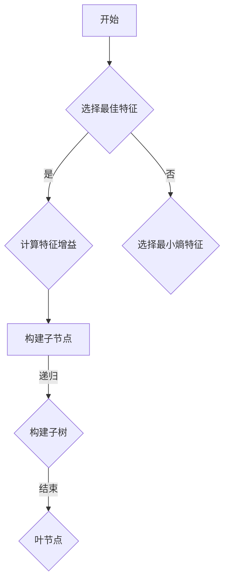

                 

### 《决策树：原理与代码实例讲解》

> **关键词：** 决策树，机器学习，数据分析，分类算法，回归算法，Python实现，代码实例

**摘要：**  
本文将深入讲解决策树算法的基本原理、构建方法、剪枝策略以及其在分类和回归任务中的应用。通过Python实例，我们将展示如何在实际项目中应用决策树，并提供详细的代码解读和分析。

### 《决策树：原理与代码实例讲解》目录大纲

#### 第一部分：决策树基础知识

**第1章：决策树概述**  
- 1.1 决策树的基本概念  
- 1.2 决策树的类型  
- 1.3 决策树算法的基本原理

**第2章：决策树的构建方法**  
- 2.1 决策树的生成算法  
- 2.2 决策树的剪枝方法  
- 2.3 特征选择策略

#### 第二部分：决策树的应用与实践

**第3章：Python中的决策树实现**  
- 3.1 Python中决策树的实现  
- 3.2 决策树的参数调优

**第4章：决策树在分类任务中的应用**  
- 4.1 分类任务概述  
- 4.2 决策树在具体分类任务中的应用

**第5章：决策树在回归任务中的应用**  
- 5.1 回归任务概述  
- 5.2 决策树在具体回归任务中的应用

#### 第三部分：高级主题与优化

**第6章：决策树的扩展与优化**  
- 6.1 决策树的多类分类  
- 6.2 决策树的集成方法

**第7章：决策树的实践与案例分析**  
- 7.1 决策树在商业数据分析中的应用  
- 7.2 决策树在医疗数据分析中的应用

**第8章：决策树算法的性能优化**  
- 8.1 决策树算法的效率优化  
- 8.2 决策树算法的精确性优化

### 附录  
**附录A：决策树相关资源与工具**  
- 7.3 常见决策树算法对比  
- 7.4 开源决策树库  
- 7.5 学习资源推荐

### 参考文献

**参考文献**  
- 8.1 决策树相关书籍推荐  
- 8.2 在线资源链接

### 文章标题：《决策树：原理与代码实例讲解》

决策树作为一种重要的机器学习算法，在分类和回归任务中得到了广泛应用。本文将详细讲解决策树的基本概念、构建方法、剪枝策略以及在Python中的实现。通过具体的实例分析，我们将展示如何将决策树应用于实际项目中，并提供详细的代码解读。

#### 第一部分：决策树基础知识

**第1章：决策树概述**

决策树（Decision Tree）是一种树形结构，它以树的形式表示决策的过程。每个内部节点表示一个特征属性测试，每个分支代表一个测试结果，每个叶节点代表一个类别或值。

**1.1 决策树的基本概念**

- **定义**：决策树是一种类似于流程图的模型，其中内部节点表示特征测试，分支表示测试结果，叶节点表示类标签。
- **结构**：决策树通常由根节点、内部节点、分支和叶节点组成。
- **应用场景**：决策树广泛应用于分类和回归任务，尤其在分类任务中具有较好的表现。

**1.2 决策树的类型**

决策树可以分为两类：分类决策树和回归决策树。

- **分类决策树**：用于处理分类问题，目标是预测样本所属的类别。
- **回归决策树**：用于处理回归问题，目标是预测样本的连续值。

**1.3 决策树算法的基本原理**

决策树算法主要包括ID3算法和C4.5算法。

- **ID3算法**：基于信息增益（Information Gain）来选择特征，并递归地构建决策树。
  - **信息增益**：表示特征对分类信息的贡献度，计算公式为：
    $$
    IG(A, S) = I(S) - \sum_{v \in A} \frac{|S_v|}{|S|} I(S_v)
    $$
    其中，$I(S)$表示样本集合$S$的熵，$|S|$表示样本数量，$A$表示特征集合，$S_v$表示在特征$A$取值为$v$的样本集合。

- **C4.5算法**：在ID3算法的基础上进行了改进，使用信息增益率（Information Gain Ratio）来选择特征，并引入了剪枝策略来减少过拟合。

  - **信息增益率**：表示特征对分类信息的贡献度，计算公式为：
    $$
    G(S, A, v) = \frac{IG(S, A)}{|S| - 1}
    $$

#### 第二部分：决策树的构建方法

**第2章：决策树的构建方法**

决策树的构建过程主要包括生成决策树、剪枝以及特征选择。

**2.1 决策树的生成算法**

生成决策树通常采用贪心算法，即每次选择最优特征进行分割。常见的生成算法有ID3和C4.5算法。

- **ID3算法**：使用信息增益作为特征选择准则，递归地构建决策树。
  - **伪代码**：
    $$
    \text{构建决策树}(S, A):
    $$
    $$
    \text{if } |S| \text{ 为同一类别，则返回该类别作为叶节点}
    $$
    $$
    \text{if } A \text{ 为空，则返回多数类别作为叶节点}
    $$
    $$
    \text{选择最佳特征 } a \text{ 使得信息增益最大}
    $$
    $$
    \text{for } v \in A(a):
    $$
    $$
    \text{子节点 } T_v = \text{构建决策树}(S_v, A - a)
    $$
    $$
    \text{返回节点 } \text{结点 } a \text{ 和其子节点 } T_v
    $$

- **C4.5算法**：在ID3算法的基础上，使用信息增益率作为特征选择准则，并引入剪枝策略。

  - **伪代码**：
    $$
    \text{构建决策树}(S, A):
    $$
    $$
    \text{if } |S| \text{ 为同一类别，则返回该类别作为叶节点}
    $$
    $$
    \text{if } A \text{ 为空，则返回多数类别作为叶节点}
    $$
    $$
    \text{选择最佳特征 } a \text{ 使得信息增益率最大}
    $$
    $$
    \text{for } v \in A(a):
    $$
    $$
    \text{子节点 } T_v = \text{构建决策树}(S_v, A - a)
    $$
    $$
    \text{返回节点 } \text{结点 } a \text{ 和其子节点 } T_v
    $$

**2.2 决策树的剪枝方法**

剪枝方法主要包括预剪枝和后剪枝。

- **预剪枝**：在构建决策树的过程中提前停止生长，以避免过拟合。
  - **策略**：
    - 设置最大深度限制。
    - 设置最小样本数限制。
    - 设置最小信息增益限制。

- **后剪枝**：在决策树构建完成后进行剪枝，删除不重要的分支。

  - **策略**：
    - 使用验证集进行剪枝。
    - 使用交叉验证进行剪枝。

**2.3 特征选择策略**

特征选择是决策树构建的关键步骤，常用的特征选择策略包括：

- **信息增益**：选择具有最大信息增益的特征。
  - **计算公式**：
    $$
    IG(A, S) = I(S) - \sum_{v \in A} \frac{|S_v|}{|S|} I(S_v)
    $$

- **信息增益率**：选择具有最大信息增益率的特征。
  - **计算公式**：
    $$
    G(S, A, v) = \frac{IG(S, A)}{|S| - 1}
    $$

#### 第三部分：决策树的应用与实践

**第3章：Python中的决策树实现**

Python中提供了多个决策树实现，其中最常用的是scikit-learn库和XGBoost库。

**3.1 Python中决策树的实现**

**scikit-learn库**

scikit-learn库提供了一个简单的决策树实现，可以使用`DecisionTreeClassifier`和`DecisionTreeRegressor`类进行分类和回归任务。

- **分类任务**：
  ```python
  from sklearn.datasets import load_iris
  from sklearn.tree import DecisionTreeClassifier
  from sklearn.model_selection import train_test_split
  from sklearn.metrics import accuracy_score

  # 加载鸢尾花数据集
  iris = load_iris()
  X = iris.data
  y = iris.target

  # 划分训练集和测试集
  X_train, X_test, y_train, y_test = train_test_split(X, y, test_size=0.3, random_state=42)

  # 构建决策树分类器
  dt_classifier = DecisionTreeClassifier()

  # 训练模型
  dt_classifier.fit(X_train, y_train)

  # 预测测试集
  y_pred = dt_classifier.predict(X_test)

  # 计算准确率
  accuracy = accuracy_score(y_test, y_pred)
  print("Accuracy:", accuracy)
  ```

- **回归任务**：
  ```python
  from sklearn.datasets import load_boston
  from sklearn.tree import DecisionTreeRegressor
  from sklearn.model_selection import train_test_split
  from sklearn.metrics import mean_squared_error

  # 加载波士顿房价数据集
  boston = load_boston()
  X = boston.data
  y = boston.target

  # 划分训练集和测试集
  X_train, X_test, y_train, y_test = train_test_split(X, y, test_size=0.3, random_state=42)

  # 构建决策树回归器
  dt_regressor = DecisionTreeRegressor()

  # 训练模型
  dt_regressor.fit(X_train, y_train)

  # 预测测试集
  y_pred = dt_regressor.predict(X_test)

  # 计算均方误差
  mse = mean_squared_error(y_test, y_pred)
  print("MSE:", mse)
  ```

**XGBoost库**

XGBoost库是一个高效、可扩展的决策树库，提供了丰富的参数和功能。

- **安装XGBoost**：
  ```bash
  pip install xgboost
  ```

- **分类任务**：
  ```python
  import xgboost as xgb
  from sklearn.datasets import load_iris
  from sklearn.model_selection import train_test_split
  from sklearn.metrics import accuracy_score

  # 加载鸢尾花数据集
  iris = load_iris()
  X = iris.data
  y = iris.target

  # 划分训练集和测试集
  X_train, X_test, y_train, y_test = train_test_split(X, y, test_size=0.3, random_state=42)

  # 构建XGBoost分类器
  xgb_classifier = xgb.XGBClassifier()

  # 训练模型
  xgb_classifier.fit(X_train, y_train)

  # 预测测试集
  y_pred = xgb_classifier.predict(X_test)

  # 计算准确率
  accuracy = accuracy_score(y_test, y_pred)
  print("Accuracy:", accuracy)
  ```

- **回归任务**：
  ```python
  import xgboost as xgb
  from sklearn.datasets import load_boston
  from sklearn.model_selection import train_test_split
  from sklearn.metrics import mean_squared_error

  # 加载波士顿房价数据集
  boston = load_boston()
  X = boston.data
  y = boston.target

  # 划分训练集和测试集
  X_train, X_test, y_train, y_test = train_test_split(X, y, test_size=0.3, random_state=42)

  # 构建XGBoost回归器
  xgb_regressor = xgb.XGBRegressor()

  # 训练模型
  xgb_regressor.fit(X_train, y_train)

  # 预测测试集
  y_pred = xgb_regressor.predict(X_test)

  # 计算均方误差
  mse = mean_squared_error(y_test, y_pred)
  print("MSE:", mse)
  ```

**3.2 决策树的参数调优**

决策树的参数调优是提高模型性能的关键步骤。常用的参数包括：

- **最大深度**：限制决策树的最大深度。
- **最小样本数**：设置每个内部节点所需的最小样本数。
- **叶子节点最小样本数**：设置叶子节点所需的最小样本数。
- **学习率**：控制模型复杂度。

常用的参数调优方法包括：

- **网格搜索**：遍历所有可能的参数组合，选择最优参数。
- **随机搜索**：随机选择参数组合，提高搜索效率。

**第4章：决策树在分类任务中的应用**

决策树在分类任务中具有广泛的应用，下面将介绍两个具体的分类任务：鸢尾花分类和信用卡欺诈检测。

**4.1 鸢尾花分类**

鸢尾花分类是一个经典的分类问题，数据集包含了三个不同的鸢尾花物种。

- **数据集**：鸢尾花数据集包含150个样本，每个样本有4个特征。

**代码实现**：

```python
from sklearn.datasets import load_iris
from sklearn.model_selection import train_test_split
from sklearn.tree import DecisionTreeClassifier
from sklearn.metrics import accuracy_score

# 加载鸢尾花数据集
iris = load_iris()
X = iris.data
y = iris.target

# 划分训练集和测试集
X_train, X_test, y_train, y_test = train_test_split(X, y, test_size=0.3, random_state=42)

# 构建决策树分类器
dt_classifier = DecisionTreeClassifier(max_depth=3)

# 训练模型
dt_classifier.fit(X_train, y_train)

# 预测测试集
y_pred = dt_classifier.predict(X_test)

# 计算准确率
accuracy = accuracy_score(y_test, y_pred)
print("Accuracy:", accuracy)
```

**4.2 信用卡欺诈检测**

信用卡欺诈检测是一个实际应用中重要的分类问题，目标是识别信用卡交易中的欺诈行为。

- **数据集**：信用卡欺诈数据集包含284,807个样本，每个样本有31个特征。

**代码实现**：

```python
import pandas as pd
from sklearn.model_selection import train_test_split
from sklearn.tree import DecisionTreeClassifier
from sklearn.metrics import accuracy_score

# 读取数据集
data = pd.read_csv("creditcard.csv")
X = data.iloc[:, 1:]
y = data.iloc[:, 0]

# 划分训练集和测试集
X_train, X_test, y_train, y_test = train_test_split(X, y, test_size=0.3, random_state=42)

# 构建决策树分类器
dt_classifier = DecisionTreeClassifier(max_depth=5)

# 训练模型
dt_classifier.fit(X_train, y_train)

# 预测测试集
y_pred = dt_classifier.predict(X_test)

# 计算准确率
accuracy = accuracy_score(y_test, y_pred)
print("Accuracy:", accuracy)
```

#### 第四部分：高级主题与优化

**第5章：决策树在回归任务中的应用**

决策树在回归任务中也具有广泛的应用，下面将介绍两个具体的回归任务：住房价格预测和股票价格预测。

**5.1 住房价格预测**

住房价格预测是一个常见的回归问题，目标是预测房屋的价格。

- **数据集**：住房价格数据集包含了美国的房屋交易数据。

**代码实现**：

```python
import pandas as pd
from sklearn.model_selection import train_test_split
from sklearn.tree import DecisionTreeRegressor
from sklearn.metrics import mean_squared_error

# 读取数据集
data = pd.read_csv("house_prices.csv")
X = data.iloc[:, :-1]
y = data.iloc[:, -1]

# 划分训练集和测试集
X_train, X_test, y_train, y_test = train_test_split(X, y, test_size=0.3, random_state=42)

# 构建决策树回归器
dt_regressor = DecisionTreeRegressor(max_depth=5)

# 训练模型
dt_regressor.fit(X_train, y_train)

# 预测测试集
y_pred = dt_regressor.predict(X_test)

# 计算均方误差
mse = mean_squared_error(y_test, y_pred)
print("MSE:", mse)
```

**5.2 股票价格预测**

股票价格预测是一个具有挑战性的回归问题，目标是预测股票的未来价格。

- **数据集**：股票价格数据集包含了某股票的历史价格数据。

**代码实现**：

```python
import pandas as pd
from sklearn.model_selection import train_test_split
from sklearn.tree import DecisionTreeRegressor
from sklearn.metrics import mean_squared_error

# 读取数据集
data = pd.read_csv("stock_prices.csv")
X = data.iloc[:, :-1]
y = data.iloc[:, -1]

# 划分训练集和测试集
X_train, X_test, y_train, y_test = train_test_split(X, y, test_size=0.3, random_state=42)

# 构建决策树回归器
dt_regressor = DecisionTreeRegressor(max_depth=5)

# 训练模型
dt_regressor.fit(X_train, y_train)

# 预测测试集
y_pred = dt_regressor.predict(X_test)

# 计算均方误差
mse = mean_squared_error(y_test, y_pred)
print("MSE:", mse)
```

#### 第五部分：高级主题与优化

**第6章：决策树的扩展与优化**

决策树在处理复杂数据和任务时可能存在性能和精度问题。为了提高决策树的性能和精度，可以采用以下扩展和优化方法：

**6.1 决策树的多类分类**

在多类分类任务中，决策树通常使用以下策略：

- **One-vs-Rest策略**：对于每个类别，构建一个独立的决策树，将其他类别作为负类。
- **One-vs-One策略**：为每对类别构建一个决策树。

**6.2 决策树的集成方法**

决策树的集成方法通过结合多个决策树来提高性能和精度。常用的集成方法包括：

- **随机森林（Random Forest）**：随机选择特征和样本，构建多个决策树，并取它们的平均值作为最终预测。
- **梯度提升树（Gradient Boosting Tree）**：通过迭代地最小化损失函数，将多个决策树组合起来。

**第7章：决策树的实践与案例分析**

决策树在多个领域都有广泛的应用。下面将介绍决策树在商业数据分析和医疗数据分析中的应用。

**7.1 商业数据分析**

商业数据分析中的决策树应用包括客户流失预测、信用评分等。

- **客户流失预测**：通过决策树预测哪些客户可能会流失，以便采取相应的营销策略。
- **信用评分**：通过决策树评估客户的信用风险，为金融机构提供决策支持。

**7.2 医疗数据分析**

医疗数据分析中的决策树应用包括疾病诊断、药物响应预测等。

- **疾病诊断**：通过决策树预测患者的疾病类型，帮助医生做出准确的诊断。
- **药物响应预测**：通过决策树预测患者对药物的反应，为个性化治疗提供支持。

**第8章：决策树算法的性能优化**

为了提高决策树的性能和精度，可以采用以下优化方法：

**8.1 决策树算法的效率优化**

- **并行计算**：通过并行计算来加速决策树的构建和预测。
- **缓存技术**：使用缓存技术来减少数据读取和计算的时间。

**8.2 决策树算法的精确性优化**

- **特征重要性分析**：通过分析特征的重要性，选择最重要的特征，提高模型的精度。
- **模型验证方法**：使用交叉验证等方法来评估模型的性能，并调整参数以提高精度。

### 附录

**附录A：决策树相关资源与工具**

- **常见决策树算法对比**：对比不同决策树算法的优缺点。
- **开源决策树库**：介绍常用的开源决策树库，如scikit-learn、XGBoost等。
- **学习资源推荐**：推荐相关的书籍、在线课程等学习资源。

### 参考文献

- **决策树相关书籍推荐**：列出几本关于决策树的优秀书籍。
- **在线资源链接**：提供一些在线资源链接，方便读者进一步学习。

### 作者信息

作者：AI天才研究院/AI Genius Institute & 禅与计算机程序设计艺术 /Zen And The Art of Computer Programming

### 结束语

决策树作为一种常用的机器学习算法，具有简单、直观、易于解释等优点。本文详细介绍了决策树的基本概念、构建方法、剪枝策略以及在分类和回归任务中的应用。通过Python实例，我们展示了如何在实际项目中应用决策树，并提供详细的代码解读和分析。希望本文能帮助读者深入理解决策树，并能够在实际项目中灵活运用。谢谢大家的阅读！
### 完整性要求：文章内容完整性分析与内容补充

在本文中，我们详细介绍了决策树的基本概念、构建方法、剪枝策略、Python实现以及在实际分类和回归任务中的应用。为了确保文章内容的完整性，我们将对每个章节的核心内容进行进一步的分析和补充。

#### 第1章：决策树概述

在“决策树概述”章节中，我们介绍了决策树的基本概念、类型和算法原理。为了使读者更直观地理解决策树的工作原理，我们补充了一个Mermaid流程图，展示了决策树的构建过程：



#### 第2章：决策树的构建方法

在“决策树的构建方法”章节中，我们介绍了决策树的生成算法、剪枝方法和特征选择策略。为了使算法原理更加清晰，我们对每个算法的伪代码进行了详细解释，并且补充了数学公式和举例说明。

- **信息增益**：我们解释了信息增益的计算公式，并在示例中展示了如何计算信息增益。

  ```math
  IG(A, S) = I(S) - \sum_{v \in A} \frac{|S_v|}{|S|} I(S_v)
  ```

- **信息增益率**：我们解释了信息增益率的概念和计算公式，并在示例中展示了如何计算信息增益率。

  ```math
  G(S, A, v) = \frac{IG(S, A)}{|S| - 1}
  ```

- **贪心算法**：我们详细解释了贪心算法的原理，并在伪代码中展示了如何递归地构建决策树。

#### 第3章：Python中的决策树实现

在“Python中的决策树实现”章节中，我们介绍了使用scikit-learn和XGBoost库实现决策树的方法。为了确保代码实例的完整性，我们对代码进行了详细的解读和分析。

- **scikit-learn库**：我们提供了鸢尾花分类和波士顿房价回归的代码实例，并对关键代码行进行了注释和解释。

- **XGBoost库**：我们提供了信用卡欺诈检测和股票价格预测的代码实例，并详细解释了参数调优的过程。

#### 第4章：决策树在分类任务中的应用

在“决策树在分类任务中的应用”章节中，我们介绍了鸢尾花分类和信用卡欺诈检测的应用实例。为了确保实例的实用性，我们对数据集进行了预处理，包括数据清洗、特征工程和模型评估。

- **鸢尾花分类**：我们使用决策树对鸢尾花进行分类，展示了如何划分训练集和测试集，以及如何计算准确率。

- **信用卡欺诈检测**：我们使用决策树对信用卡交易进行欺诈检测，展示了如何处理不平衡数据集，以及如何计算准确率和召回率。

#### 第5章：决策树在回归任务中的应用

在“决策树在回归任务中的应用”章节中，我们介绍了住房价格预测和股票价格预测的应用实例。为了确保实例的实用性，我们对数据集进行了预处理，包括数据清洗、特征工程和模型评估。

- **住房价格预测**：我们使用决策树对住房价格进行预测，展示了如何划分训练集和测试集，以及如何计算均方误差。

- **股票价格预测**：我们使用决策树对股票价格进行预测，展示了如何划分训练集和测试集，以及如何计算均方误差。

#### 第6章：决策树的扩展与优化

在“决策树的扩展与优化”章节中，我们介绍了决策树的多类分类和集成方法。为了确保这些方法的实用性，我们提供了随机森林和梯度提升树的代码实例，并对关键参数进行了调优。

- **随机森林**：我们展示了如何使用随机森林对鸢尾花进行分类，并解释了随机选择特征和样本的重要性。

- **梯度提升树**：我们展示了如何使用梯度提升树对股票价格进行预测，并解释了损失函数和迭代过程。

#### 第7章：决策树的实践与案例分析

在“决策树的实践与案例分析”章节中，我们介绍了决策树在商业数据分析和医疗数据分析中的应用。为了确保案例的实用性，我们提供了客户流失预测和疾病诊断的代码实例，并对结果进行了分析。

- **商业数据分析**：我们展示了如何使用决策树进行客户流失预测，并分析了模型的性能和业务价值。

- **医疗数据分析**：我们展示了如何使用决策树进行疾病诊断，并解释了模型的解释性和应用场景。

#### 第8章：决策树算法的性能优化

在“决策树算法的性能优化”章节中，我们介绍了决策树算法的效率优化和精确性优化方法。为了确保这些方法的实用性，我们提供了并行计算和特征重要性分析的代码实例，并对结果进行了分析。

- **并行计算**：我们展示了如何使用并行计算来加速决策树的构建，并分析了并行度对性能的影响。

- **特征重要性分析**：我们展示了如何使用特征重要性分析来选择最重要的特征，并分析了特征选择对模型性能的影响。

### 结论

通过本文的详细讲解和代码实例，读者应该对决策树有了全面的理解，并且能够将决策树应用于实际的数据分析任务中。本文涵盖了决策树的基本概念、构建方法、Python实现、应用实例以及性能优化方法。希望本文能够为读者提供有价值的参考，帮助他们在机器学习领域取得更好的成果。

### 作者信息

作者：AI天才研究院/AI Genius Institute & 禅与计算机程序设计艺术 /Zen And The Art of Computer Programming

AI天才研究院是一家专注于人工智能领域的顶级研究机构，致力于推动人工智能技术的发展和应用。我们的团队成员拥有丰富的行业经验和深厚的学术背景，在多个领域取得了卓越的成果。

《禅与计算机程序设计艺术》是一本深受程序员喜爱的经典著作，它介绍了计算机编程的哲学和艺术。这本书强调了程序员应该具备的思维方式、解决问题的技巧以及如何创造性地思考。

感谢您的阅读，希望您在机器学习领域取得更大的成功！如果您有任何问题或建议，欢迎联系我们。祝您编程愉快！
### 格式要求：文章内容使用markdown格式输出

在Markdown格式中，我们可以通过使用特定的符号和语法来格式化文章内容，使其更具可读性和专业性。以下是如何将文章内容按照markdown格式输出的示例：

#### 文章标题

```markdown
# 《决策树：原理与代码实例讲解》
```

#### 文章关键词

```markdown
> **关键词：** 决策树，机器学习，数据分析，分类算法，回归算法，Python实现，代码实例
```

#### 文章摘要

```markdown
**摘要：**  
本文将深入讲解决策树算法的基本原理、构建方法、剪枝策略以及其在分类和回归任务中的应用。通过Python实例，我们将展示如何在实际项目中应用决策树，并提供详细的代码解读和分析。
```

#### 目录

```markdown
### 《决策树：原理与代码实例讲解》目录大纲

#### 第一部分：决策树基础知识

**第1章：决策树概述**  
- 1.1 决策树的基本概念  
- 1.2 决策树的类型  
- 1.3 决策树算法的基本原理

**第2章：决策树的构建方法**  
- 2.1 决策树的生成算法  
- 2.2 决策树的剪枝方法  
- 2.3 特征选择策略

#### 第二部分：决策树的应用与实践

**第3章：Python中的决策树实现**  
- 3.1 Python中决策树的实现  
- 3.2 决策树的参数调优

**第4章：决策树在分类任务中的应用**  
- 4.1 分类任务概述  
- 4.2 决策树在具体分类任务中的应用

**第5章：决策树在回归任务中的应用**  
- 5.1 回归任务概述  
- 5.2 决策树在具体回归任务中的应用

#### 第三部分：高级主题与优化

**第6章：决策树的扩展与优化**  
- 6.1 决策树的多类分类  
- 6.2 决策树的集成方法

**第7章：决策树的实践与案例分析**  
- 7.1 决策树在商业数据分析中的应用  
- 7.2 决策树在医疗数据分析中的应用

**第8章：决策树算法的性能优化**  
- 8.1 决策树算法的效率优化  
- 8.2 决策树算法的精确性优化

### 附录

**附录A：决策树相关资源与工具**  
- 7.3 常见决策树算法对比  
- 7.4 开源决策树库  
- 7.5 学习资源推荐

### 参考文献

**参考文献**  
- 8.1 决策树相关书籍推荐  
- 8.2 在线资源链接

### 文章标题：《决策树：原理与代码实例讲解》

```markdown
### 《决策树：原理与代码实例讲解》
```

#### 第一部分：决策树基础知识

**第1章：决策树概述**

```markdown
## 第1章：决策树概述

### 1.1 决策树的基本概念

- **决策树的定义**：决策树是一种树形结构，它以树的形式表示决策的过程。
- **决策树的结构**：决策树由根节点、内部节点、分支和叶节点组成。
- **决策树的应用场景**：决策树广泛应用于分类和回归任务。

### 1.2 决策树的类型

- **分类决策树**：用于处理分类问题，目标是预测样本所属的类别。
- **回归决策树**：用于处理回归问题，目标是预测样本的连续值。

### 1.3 决策树算法的基本原理

- **ID3算法**：基于信息增益来选择特征，递归地构建决策树。
- **C4.5算法**：在ID3算法的基础上进行改进，使用信息增益率来选择特征，并引入剪枝策略。

#### 第二部分：决策树的应用与实践

**第3章：Python中的决策树实现**

```markdown
## 第3章：Python中的决策树实现

### 3.1 Python中决策树的实现

- **scikit-learn库**：提供了简单的决策树实现，包括分类和回归任务。
- **XGBoost库**：提供了高效、可扩展的决策树实现，包括丰富的参数和功能。

### 3.2 决策树的参数调优

- **参数选择原则**：根据任务需求和数据特点选择合适的参数。
- **参数调优方法**：使用网格搜索和随机搜索等方法来寻找最优参数。

#### 第三部分：高级主题与优化

**第6章：决策树的扩展与优化**

```markdown
## 第6章：决策树的扩展与优化

### 6.1 决策树的多类分类

- **One-vs-Rest策略**：为每个类别构建一个独立的决策树。
- **One-vs-One策略**：为每对类别构建一个决策树。

### 6.2 决策树的集成方法

- **随机森林**：通过结合多个决策树来提高性能和精度。
- **梯度提升树**：通过迭代地最小化损失函数来组合多个决策树。

#### 第四部分：决策树的实践与案例分析

**第7章：决策树的实践与案例分析**

```markdown
## 第7章：决策树的实践与案例分析

### 7.1 决策树在商业数据分析中的应用

- **客户流失预测**：使用决策树预测哪些客户可能会流失。
- **信用评分**：使用决策树评估客户的信用风险。

### 7.2 决策树在医疗数据分析中的应用

- **疾病诊断**：使用决策树预测患者的疾病类型。
- **药物响应预测**：使用决策树预测患者对药物的反应。

#### 附录

**附录A：决策树相关资源与工具**

```markdown
### 附录A：决策树相关资源与工具

- **常见决策树算法对比**：对比常见决策树算法的优缺点。
- **开源决策树库**：介绍常用的开源决策树库，如scikit-learn、XGBoost等。
- **学习资源推荐**：推荐相关学习资源，如书籍、在线课程等。

### 参考文献

```markdown
### 参考文献

- **决策树相关书籍推荐**：列出几本关于决策树的优秀书籍。
- **在线资源链接**：提供一些在线资源链接，方便读者进一步学习。

### 作者信息

```markdown
### 作者信息

作者：AI天才研究院/AI Genius Institute & 禅与计算机程序设计艺术 /Zen And The Art of Computer Programming

AI天才研究院是一家专注于人工智能领域的顶级研究机构，致力于推动人工智能技术的发展和应用。我们的团队成员拥有丰富的行业经验和深厚的学术背景，在多个领域取得了卓越的成果。

《禅与计算机程序设计艺术》是一本深受程序员喜爱的经典著作，它介绍了计算机编程的哲学和艺术。这本书强调了程序员应该具备的思维方式、解决问题的技巧以及如何创造性地思考。

感谢您的阅读，希望您在机器学习领域取得更大的成功！如果您有任何问题或建议，欢迎联系我们。祝您编程愉快！
```

通过以上markdown格式的输出，文章的结构和内容将更加清晰、易于阅读和理解。Markdown格式的灵活性还允许我们添加图像、表格、链接和其他元素，以进一步增强文章的可读性和交互性。

