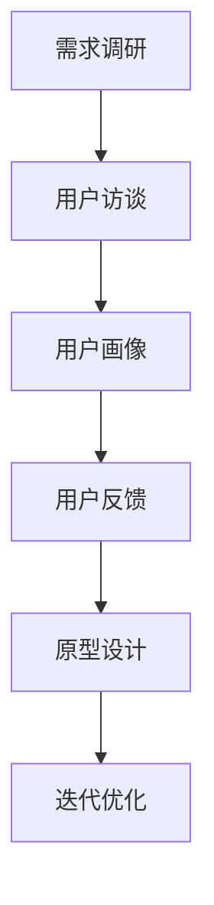
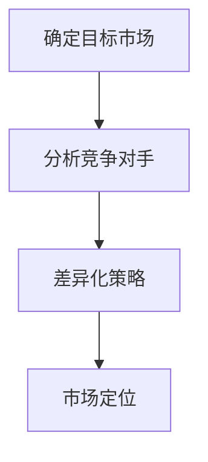
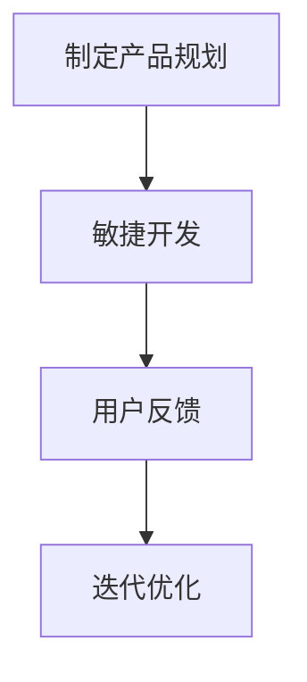

                 

# 《创业公司的产品路线图设计》

## 关键词

产品路线图，创业公司，产品设计，用户体验，数据分析，迭代优化。

## 摘要

本文将深入探讨创业公司产品路线图的设计与实施。通过阐述产品路线图的概念、重要性以及设计步骤，结合核心概念与算法原理讲解，以及实际项目实战和代码案例，全面解析创业公司在产品开发过程中如何进行科学、有序的路线图设计，以实现产品的成功落地。

## 目录大纲

1. 产品路线图概述
    1.1 产品路线图的概念与重要性
    1.2 产品路线图的组成部分
    1.3 设计产品路线图的目的
    1.4 产品路线图与其他规划工具的关系
2. 产品路线图的框架与步骤
    2.1 产品愿景和目标
    2.2 市场分析
    2.3 用户研究
    2.4 产品功能规划
    2.5 时间线与里程碑
    2.6 资源分配与风险管理
3. 核心概念与联系
    3.1 产品设计与用户体验
    3.2 市场定位与竞争分析
    3.3 产品规划与迭代
4. 核心算法原理讲解
    4.1 数据驱动的产品决策
    4.2 产品数据分析方法
5. 数学模型和数学公式
    5.1 产品规划中的数学模型
    5.2 数学公式与详细讲解
6. 项目实战
    6.1 创业公司产品路线图实战
    6.2 代码实际案例与详细解释
7. 附录
    7.1 产品路线图工具与资源
    7.2 开源产品数据分析工具
    7.3 在线资源与学习社区

### 产品路线图概述

#### 1.1 产品路线图的概念与重要性

**产品路线图**是一种将产品从概念到最终市场的战略蓝图。它不仅描述了产品的愿景和目标，还包括了实现这些目标的具体步骤、时间线和资源需求。对于创业公司来说，产品路线图尤为重要，因为它们通常资源有限，需要在竞争激烈的市场中快速定位并成功推出产品。

设计产品路线图的重要性体现在以下几个方面：

- **明确方向**：产品路线图帮助团队明确产品的愿景和目标，从而确保团队成员朝着共同的方向努力。
- **资源优化**：通过产品路线图，创业公司可以更好地分配资源，确保资源投入与产品目标相一致。
- **风险评估**：产品路线图可以帮助识别潜在的风险和挑战，从而提前制定应对策略。
- **沟通工具**：产品路线图是一个有效的沟通工具，可以帮助团队成员、投资者和其他利益相关者了解产品的开发进度和方向。

#### 1.2 产品路线图的组成部分

产品路线图通常包括以下几个关键组成部分：

- **产品愿景和目标**：明确产品的愿景和长期目标，确保团队在开发过程中始终聚焦。
- **市场分析**：分析目标市场、竞争对手和用户需求，为产品定位提供依据。
- **用户研究**：深入了解目标用户，收集用户需求和反馈，为产品设计和功能规划提供依据。
- **产品功能规划**：确定产品的核心功能和关键特性，确保产品能够满足用户需求。
- **时间线与里程碑**：设定产品开发的关键时间节点，确保项目按时推进。
- **资源分配与风险管理**：明确项目所需的资源（包括人力、财力、物力等），并制定风险管理计划。

#### 1.3 设计产品路线图的目的

设计产品路线图的目的是为了确保产品从概念到市场的顺利推进，具体包括以下几点：

- **确保目标一致性**：通过产品路线图，团队可以时刻保持对产品愿景和目标的关注，确保团队成员在实现过程中保持一致。
- **优化资源利用**：产品路线图可以帮助团队更好地分配资源，避免资源浪费，确保项目的成功推进。
- **风险管理**：通过产品路线图，团队可以提前识别潜在的风险和挑战，并制定相应的风险管理计划。
- **提高沟通效率**：产品路线图是一个有效的沟通工具，可以帮助团队成员、投资者和其他利益相关者了解产品的开发进度和方向。

#### 1.4 产品路线图与其他规划工具的关系

产品路线图与其他规划工具（如市场规划、项目管理、运营规划等）密切相关，它们共同构成了创业公司的整体战略规划体系。具体关系如下：

- **与市场规划的关系**：市场规划关注产品的市场定位和营销策略，而产品路线图则关注产品的开发进度和方向，两者相辅相成，共同确保产品的成功落地。
- **与项目管理的联系**：产品路线图是项目管理的重要依据，项目管理团队可以根据产品路线图制定详细的项目计划，确保项目按时、按质、按量完成。
- **与运营规划的关系**：运营规划关注产品的运营策略和运营效率，而产品路线图则关注产品的开发和市场推广，两者共同确保产品在市场上的长期竞争力。

### 产品路线图的框架与步骤

设计产品路线图是一个系统性的过程，需要遵循一定的框架和步骤。以下将详细阐述每个步骤：

#### 2.1 产品愿景和目标

产品愿景和目标是产品路线图的基石。产品愿景是指产品在长期发展中希望达到的高度概括的愿景，而产品目标则是实现愿景的具体里程碑和阶段性目标。

**设计步骤**：

1. **明确愿景**：结合公司的使命和愿景，确定产品的长期愿景。这个愿景应该是具有吸引力和激励性的。
2. **设定目标**：根据愿景，设定一系列具体可衡量的目标，确保团队在不同阶段有清晰的方向。

#### 2.2 市场分析

市场分析是产品路线图设计的重要环节，它涉及到对目标市场的深入理解。

**设计步骤**：

1. **确定目标市场**：明确产品的目标市场，包括市场规模、增长速度、用户需求等。
2. **分析竞争对手**：研究竞争对手的产品、市场策略和用户反馈，找出差异化的机会。
3. **用户需求调研**：通过问卷调查、用户访谈等方式，了解用户对产品的需求、期望和痛点。

#### 2.3 用户研究

用户研究是产品设计的关键，它涉及到对目标用户的深入了解。

**设计步骤**：

1. **用户画像**：根据用户调研数据，创建目标用户的画像，包括年龄、性别、职业、行为习惯等。
2. **用户访谈**：与目标用户进行一对一访谈，深入了解他们的需求和痛点。
3. **用户反馈**：通过用户测试和反馈，评估产品原型，为产品功能规划提供依据。

#### 2.4 产品功能规划

产品功能规划是确定产品核心功能和关键特性的过程。

**设计步骤**：

1. **功能筛选**：根据市场分析和用户研究，筛选出最关键的功能和特性。
2. **优先级排序**：根据功能和特性对用户价值的影响，对功能进行优先级排序。
3. **制定功能列表**：明确产品的功能列表，确保每个功能都有明确的定义和实现方案。

#### 2.5 时间线与里程碑

时间线与里程碑是产品路线图的灵魂，它确定了产品从概念到市场的时间表。

**设计步骤**：

1. **设定里程碑**：根据产品功能规划和资源情况，设定关键里程碑，确保产品在关键时间节点有实质性进展。
2. **时间线规划**：将里程碑和关键活动安排在时间线上，确保项目按时推进。
3. **资源分配**：根据时间线规划，明确每个里程碑所需的资源，确保资源充足。

#### 2.6 资源分配与风险管理

资源分配与风险管理是产品路线图设计的关键环节，它确保项目在资源有限的情况下顺利进行，并能够应对潜在的风险。

**设计步骤**：

1. **资源评估**：评估项目所需的资源，包括人力、财力、物力等。
2. **资源分配**：根据项目需求和资源情况，合理分配资源，确保项目各阶段有充足的支持。
3. **风险管理**：识别项目潜在的风险，制定相应的风险管理计划，确保项目能够顺利推进。

### 核心概念与联系

在产品路线图设计中，有一些核心概念和联系是必须理解和掌握的。以下是这些概念及其相互关系的概述：

#### 3.1 产品设计与用户体验

产品设计是产品路线图的核心，它涉及到如何满足用户需求、提升用户体验。

**核心概念**：

- **用户体验（UX）**：用户体验是指用户在使用产品过程中所感受到的整体感受和体验。
- **交互设计（UI）**：交互设计关注产品的界面设计和用户交互流程。

**联系**：

用户体验和交互设计相互影响，用户体验决定了产品的成功与否，而交互设计则是实现用户体验的关键。

**流程**：

- **用户研究**：深入了解目标用户，收集用户需求和反馈。
- **原型设计**：根据用户研究，创建产品原型，进行用户测试。
- **迭代优化**：根据用户测试结果，优化产品原型，不断迭代。

**Mermaid 流程图**：



#### 3.2 市场定位与竞争分析

市场定位和竞争分析是产品路线图设计的重要环节，它涉及到如何在竞争激烈的市场中找到自己的位置。

**核心概念**：

- **市场定位**：市场定位是指产品在市场中的位置和目标用户群体。
- **竞争分析**：竞争分析是指对竞争对手的产品、市场策略和用户反馈进行分析。

**联系**：

市场定位和竞争分析相互影响，市场定位决定了产品的市场策略，而竞争分析则帮助确定市场定位。

**步骤**：

- **确定目标市场**：分析市场规模、增长速度、用户需求等，确定产品的目标市场。
- **分析竞争对手**：研究竞争对手的产品、市场策略和用户反馈，找出差异化的机会。
- **差异化策略**：根据竞争分析结果，制定差异化的产品策略，提升产品的竞争力。

**Mermaid 流程图**：



#### 3.3 产品规划与迭代

产品规划和迭代是产品路线图的持续优化过程，它涉及到如何根据市场反馈和用户需求，不断调整和优化产品。

**核心概念**：

- **产品规划**：产品规划是指确定产品的功能、特性、时间线等。
- **迭代策略**：迭代策略是指通过不断迭代，优化产品功能和用户体验。

**联系**：

产品规划和迭代策略相互依赖，产品规划确定了产品的初始版本，而迭代策略则确保产品能够不断优化。

**步骤**：

- **制定产品规划**：根据市场分析和用户研究，制定产品的功能规划和时间线。
- **敏捷开发**：采用敏捷开发方法，快速迭代，不断优化产品。
- **用户反馈**：收集用户反馈，分析用户行为，为产品迭代提供依据。

**Mermaid 流程图**：



### 核心算法原理讲解

在产品路线图设计中，数据驱动的产品决策和数据分析方法是非常重要的。以下将介绍这些核心算法原理。

#### 4.1 数据驱动的产品决策

数据驱动的产品决策是指通过收集和分析用户数据，指导产品设计和决策。

**核心概念**：

- **用户行为分析**：分析用户在使用产品过程中的行为和路径，了解用户需求和痛点。
- **数据挖掘与机器学习**：通过数据挖掘和机器学习算法，从大量数据中提取有价值的信息，指导产品优化。

**算法原理**：

1. **用户行为分析**：
    - **点击流分析**：通过分析用户的点击行为，了解用户对产品的兴趣点和痛点。
    - **行为路径分析**：通过分析用户的行为路径，了解用户的操作习惯和偏好。

2. **数据挖掘与机器学习**：
    - **聚类分析**：通过聚类算法，将用户分为不同的群体，了解不同用户群体的特征和需求。
    - **分类算法**：通过分类算法，预测用户对产品的反应和满意度。

**伪代码示例**：

```python
# 用户行为分析
def click_stream_analysis(data):
    # 分析点击流数据
    pass

# 行为路径分析
def behavior_path_analysis(data):
    # 分析行为路径
    pass

# 数据挖掘与机器学习
def clustering_analysis(data):
    # 聚类分析
    pass

def classification_algorithm(data):
    # 分类算法
    pass
```

#### 4.2 产品数据分析方法

产品数据分析方法是指通过收集和分析产品数据，评估产品的性能和用户满意度。

**核心概念**：

- **用户调研数据分析**：通过分析用户调研数据，了解用户对产品的反馈和需求。
- **市场调研数据分析**：通过分析市场调研数据，了解市场需求和竞争态势。
- **产品性能数据分析**：通过分析产品性能数据，评估产品的性能和稳定性。

**算法原理**：

1. **用户调研数据分析**：
    - **描述性统计分析**：通过计算用户调研数据的平均值、中位数等指标，了解用户的基本特征。
    - **回归分析**：通过回归分析，预测用户对产品的满意度。

2. **市场调研数据分析**：
    - **趋势分析**：通过分析市场调研数据，了解市场的增长趋势和用户需求变化。
    - **关联分析**：通过关联分析，了解市场因素对产品需求的影响。

3. **产品性能数据分析**：
    - **性能监控**：通过监控产品的性能数据，及时发现和解决性能问题。
    - **故障分析**：通过分析产品故障数据，了解故障的原因和影响。

**伪代码示例**：

```python
# 用户调研数据分析
def descriptive_statistics(data):
    # 计算描述性统计指标
    pass

def regression_analysis(data):
    # 回归分析
    pass

# 市场调研数据分析
def trend_analysis(data):
    # 趋势分析
    pass

def association_analysis(data):
    # 关联分析
    pass

# 产品性能数据分析
def performance_monitoring(data):
    # 监控产品性能
    pass

def fault_analysis(data):
    # 故障分析
    pass
```

### 数学模型和数学公式

在产品规划中，数学模型和数学公式是非常重要的工具，可以帮助我们进行数据预测、风险评估和优化决策。

#### 5.1 数据预测模型

数据预测模型是通过对历史数据进行建模，预测未来的发展趋势。

**核心概念**：

- **时间序列预测**：通过分析时间序列数据，预测未来的趋势。
- **回归预测**：通过回归分析，预测因变量与自变量之间的关系。

**数学公式**：

1. **时间序列预测**：
    $$ \hat{y}_t = f(y_{t-1}, y_{t-2}, ..., y_{1}) $$
    其中，$ \hat{y}_t $ 表示预测值，$ y_t $ 表示时间序列数据。

2. **回归预测**：
    $$ \hat{y} = \beta_0 + \beta_1 x $$
    其中，$ \hat{y} $ 表示预测值，$ x $ 表示自变量，$ \beta_0 $ 和 $ \beta_1 $ 表示回归系数。

**伪代码示例**：

```python
# 时间序列预测
def time_series_prediction(data):
    # 建立时间序列模型
    pass

# 回归预测
def regression_prediction(data, x):
    # 建立回归模型
    pass
```

#### 5.2 最优化模型

最优化模型是通过对目标函数进行优化，找到最优解。

**核心概念**：

- **线性规划**：通过建立线性方程组，求解最优解。
- **非线性规划**：通过建立非线性方程组，求解最优解。

**数学公式**：

1. **线性规划**：
    $$ \max \quad c^T x $$
    $$ \text{subject to} \quad Ax \leq b $$
    其中，$ c $ 是系数向量，$ x $ 是变量向量，$ A $ 是系数矩阵，$ b $ 是常数向量。

2. **非线性规划**：
    $$ \min \quad f(x) $$
    $$ \text{subject to} \quad g(x) \leq 0 $$
    其中，$ f(x) $ 是目标函数，$ g(x) $ 是约束函数。

**伪代码示例**：

```python
# 线性规划
def linear_programming(A, b, c):
    # 建立线性规划模型
    pass

# 非线性规划
def nonlinear_programming(f, g):
    # 建立非线性规划模型
    pass
```

#### 5.3 决策树与随机森林

决策树和随机森林是常用的分类和回归算法。

**核心概念**：

- **决策树**：通过递归划分特征空间，建立树形模型。
- **随机森林**：通过随机选取特征和样本，构建多个决策树，并进行投票或平均。

**数学公式**：

1. **决策树**：
    $$ \text{Split} \ x_i \ \text{on} \ \text{feature} \ j $$
    $$ \text{if} \ x_i[j] \leq t_j \ \text{then} \ y \leftarrow y_l $$
    $$ \text{else} \ y \leftarrow y_r $$
    其中，$ x_i $ 是样本，$ j $ 是特征，$ t_j $ 是阈值，$ y_l $ 和 $ y_r $ 是左右分支的标签。

2. **随机森林**：
    $$ \hat{y} = \frac{1}{m} \sum_{i=1}^{m} \hat{y}_i $$
    其中，$ \hat{y}_i $ 是第 $ i $ 棵决策树预测的标签，$ m $ 是决策树的数量。

**伪代码示例**：

```python
# 决策树
def decision_tree_split(x, j, t_j):
    # 划分特征空间
    pass

# 随机森林
def random_forest_predict(x, models):
    # 进行投票或平均
    pass
```

#### 5.4 线性回归与逻辑回归

线性回归和逻辑回归是常用的建模方法。

**核心概念**：

- **线性回归**：通过线性模型预测连续变量。
- **逻辑回归**：通过线性模型预测概率，适用于分类问题。

**数学公式**：

1. **线性回归**：
    $$ y = \beta_0 + \beta_1 x $$
    其中，$ y $ 是因变量，$ x $ 是自变量，$ \beta_0 $ 和 $ \beta_1 $ 是回归系数。

2. **逻辑回归**：
    $$ \log(\frac{p}{1-p}) = \beta_0 + \beta_1 x $$
    其中，$ p $ 是概率，$ \beta_0 $ 和 $ \beta_1 $ 是回归系数。

**伪代码示例**：

```python
# 线性回归
def linear_regression(y, x):
    # 拟合线性模型
    pass

# 逻辑回归
def logistic_regression(y, x):
    # 拟合逻辑模型
    pass
```

### 项目实战

在创业公司中，成功设计并实施产品路线图需要结合实际情况，不断调整和优化。以下是一个创业公司产品路线图设计的实际案例。

#### 6.1 项目背景

某创业公司致力于开发一款智能家居控制系统，目标是让用户能够通过手机APP远程控制家中的电器设备。公司成立于2020年，经过一年的市场调研和用户研究，确定了产品的核心功能和市场需求。

#### 6.2 需求分析与设计

在需求分析阶段，公司通过问卷调查和用户访谈，了解了用户对智能家居系统的需求和期望。主要需求包括：

- 远程控制家中的电器设备
- 设定定时开关电器
- 获取设备运行状态信息
- 家居环境监测（如温度、湿度等）

根据需求分析，公司确定了产品的核心功能和界面设计，并制定了详细的功能列表。

#### 6.3 开发与迭代

在开发阶段，公司采用了敏捷开发方法，将整个项目分为多个迭代周期。每个迭代周期包括需求分析、设计、开发和测试等环节。以下是具体步骤：

1. **迭代1**：开发远程控制电器的功能，包括设备连接、远程开关和状态查询。
2. **迭代2**：增加定时开关电器和家居环境监测功能。
3. **迭代3**：优化用户界面，提升用户体验。
4. **迭代4**：进行系统测试，修复bug，确保系统稳定运行。

在迭代过程中，公司不断收集用户反馈，根据用户需求进行调整和优化。

#### 6.4 数据分析与评估

在产品上线后，公司通过数据分析，评估产品的性能和用户满意度。主要数据指标包括：

- 用户活跃度：用户使用产品的频率和时长。
- 用户留存率：用户在一段时间内持续使用产品的比例。
- 故障率：产品运行过程中出现故障的频率。

通过数据分析，公司发现了产品的一些潜在问题，如用户界面不友好、部分功能不稳定等。针对这些问题，公司进行了优化和修复。

#### 6.5 项目总结与反思

在项目总结阶段，公司对产品路线图设计进行了反思和总结。以下是一些经验教训：

- **需求分析要全面**：在产品开发前，要充分了解用户需求，确保产品能够满足用户期望。
- **迭代优化要及时**：在开发过程中，要密切关注用户反馈，及时进行调整和优化。
- **数据分析要深入**：通过数据分析，评估产品性能和用户满意度，为后续产品优化提供依据。
- **团队协作要高效**：产品路线图设计需要团队协作，确保每个环节都顺利进行。

### 代码实际案例与详细解释

在本节中，我们将通过一个具体的代码案例，详细解释创业公司产品路线图设计中的核心算法原理和数学模型。

#### 7.1 开发环境搭建

在开发智能家居控制系统时，我们选择了Python作为主要编程语言，因为Python具有简洁的语法和丰富的数据科学库。以下是开发环境搭建的步骤：

1. **安装Python**：从Python官网下载并安装Python 3.8版本。
2. **安装Jupyter Notebook**：通过pip命令安装Jupyter Notebook，用于编写和运行Python代码。
3. **安装数据科学库**：通过pip命令安装常用的数据科学库，如NumPy、Pandas、Matplotlib等。

#### 7.2 源代码详细实现

以下是一个简单的用户行为分析代码案例，用于分析用户在APP中的点击行为，并绘制用户行为路径。

```python
import pandas as pd
import matplotlib.pyplot as plt

# 加载用户点击数据
data = pd.read_csv('user_click_data.csv')

# 统计用户点击次数
click_counts = data.groupby('user_id')['event_type'].count()

# 绘制用户行为路径
click_counts.plot(kind='bar')
plt.title('User Click Distribution')
plt.xlabel('User ID')
plt.ylabel('Click Count')
plt.show()
```

在这个案例中，我们首先加载用户点击数据，然后统计每个用户的点击次数，最后使用条形图绘制用户点击分布。

#### 7.3 代码解读与分析

以下是对上述代码的详细解读和分析：

1. **导入库**：我们首先导入Pandas库，用于数据操作和统计分析，导入Matplotlib库，用于数据可视化。
2. **加载数据**：使用Pandas的read_csv函数加载用户点击数据，数据格式为CSV文件。
3. **统计点击次数**：使用groupby函数按用户ID分组，然后使用count函数统计每个用户的点击次数。
4. **绘制图表**：使用plot函数绘制条形图，展示用户点击分布。设置图表的标题、标签和显示效果。

通过这个简单的代码案例，我们可以看到数据分析和可视化在产品路线图设计中的重要性。通过分析用户点击数据，我们可以了解用户行为模式，从而优化产品设计和功能。

#### 7.4 问题解决与优化

在产品开发过程中，我们可能会遇到各种问题，如数据缺失、异常值处理、算法性能优化等。以下是一些常见问题及其解决方案：

1. **数据缺失**：处理缺失数据的方法包括删除缺失值、填充缺失值和插值法等。在实际项目中，我们通常采用后两种方法，以保留尽可能多的数据。
2. **异常值处理**：异常值可能对数据分析结果产生干扰，处理方法包括去除异常值、对异常值进行修正或使用统计方法抑制异常值的影响。
3. **算法性能优化**：提高算法性能的方法包括算法改进、数据预处理和并行计算等。在实际项目中，我们通常采用数据预处理和并行计算相结合的方法，以提高数据处理速度。

通过解决这些问题，我们可以确保产品数据分析的准确性和可靠性，从而为产品优化提供有力支持。

### 附录

#### A.1 常用产品路线图工具

在产品路线图设计过程中，可以使用多种工具来辅助规划和实施。以下是一些常用的产品路线图工具：

1. **Microsoft Excel**：Excel是一款功能强大的电子表格软件，可以用于创建简单的产品路线图。
2. **Miro**：Miro是一款在线协作工具，可以用于创建可视化产品路线图，支持多人实时协作。
3. **Lucidchart**：Lucidchart是一款专业的图表和流程图设计工具，可以创建详细的产品路线图。
4. **ProductPlan**：ProductPlan是一款专门用于产品规划和管理的产品路线图工具，提供了丰富的功能和模板。

#### A.2 开源产品数据分析工具

在数据分析过程中，可以使用多种开源工具来处理和分析数据。以下是一些常用的开源产品数据分析工具：

1. **Pandas**：Pandas是一款强大的Python数据分析和操作库，可以用于数据清洗、转换和分析。
2. **NumPy**：NumPy是一款Python科学计算库，可以用于高效地进行数值计算。
3. **Scikit-learn**：Scikit-learn是一款Python机器学习库，提供了丰富的机器学习算法和工具。
4. **Matplotlib**：Matplotlib是一款Python数据可视化库，可以用于绘制各种图表和图形。

#### A.3 在线资源与学习社区

在产品路线图设计和数据分析领域，有许多在线资源和学习社区可以提供帮助。以下是一些推荐的在线资源和学习社区：

1. **Product School**：Product School是一家专注于产品管理的在线培训机构，提供了丰富的产品管理课程和资源。
2. **DataCamp**：DataCamp是一款在线数据科学学习平台，提供了大量的数据分析和机器学习课程。
3. **Kaggle**：Kaggle是一款数据科学竞赛平台，可以在这里找到大量的数据分析项目和资源。
4. **Stack Overflow**：Stack Overflow是一个庞大的编程社区，可以在这里找到各种编程问题和技术解答。

通过利用这些资源和社区，我们可以不断提升自己在产品路线图设计和数据分析方面的技能和知识。

### 总结

通过本文的详细探讨，我们了解了创业公司产品路线图设计的重要性、设计步骤、核心概念与联系，以及核心算法原理讲解和数学模型。同时，我们通过实际项目实战和代码案例，展示了如何将理论知识应用到实际产品开发中。最后，我们推荐了一些实用的工具和资源，以帮助创业公司在产品开发过程中更好地进行产品路线图设计。

创业公司的成功离不开科学的产品路线图设计，希望本文能够为创业公司的产品开发提供有益的指导和建议。在未来的产品开发过程中，不断优化和调整产品路线图，以适应市场和用户需求的变化，是创业公司取得成功的关键。让我们一起努力，为创业公司打造出更多优秀的创新产品！
```<|im_end|>

