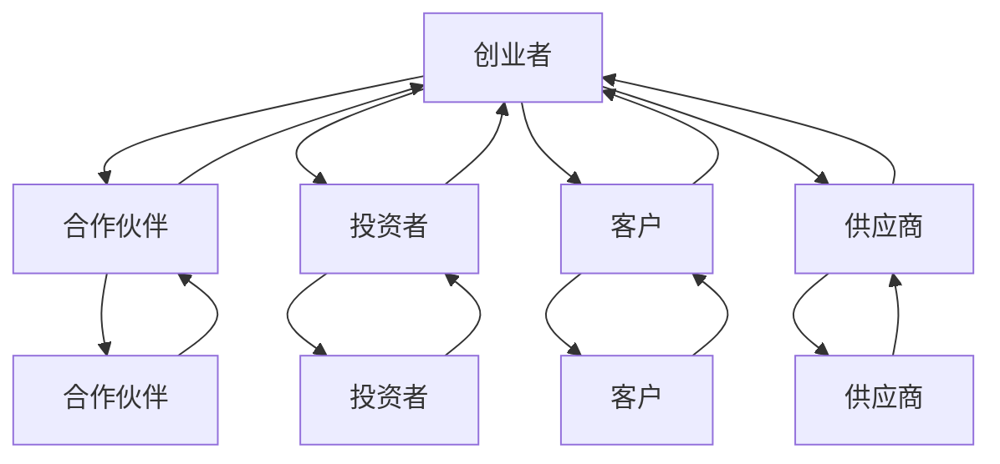
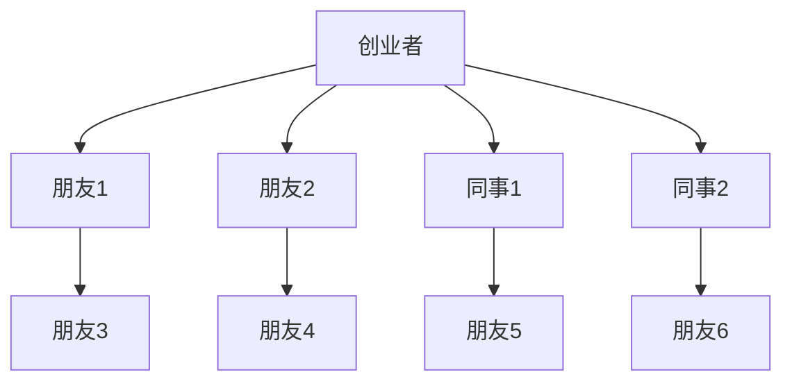
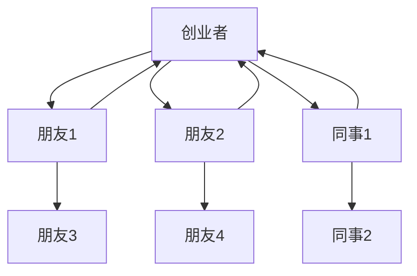
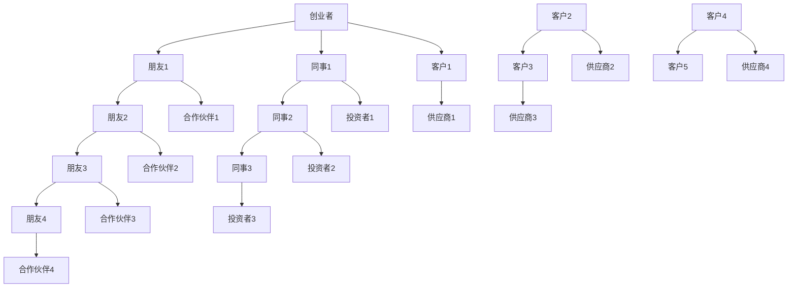
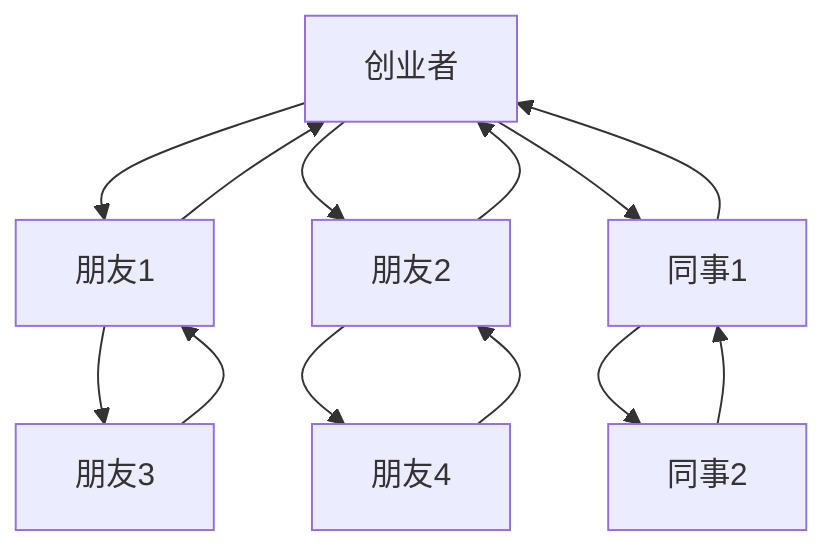

                 

## 《创业者的人际网络拓展与维护技巧》

> **关键词：** 创业者、人际网络、拓展技巧、维护策略、社交资本、关系管理

**摘要：** 本文旨在为创业者提供一套系统化的人际网络拓展与维护技巧。通过深入探讨人际网络的概念、拓展与维护策略，以及实际应用案例，帮助创业者构建强大的社交资本，提升创业成功率。本文还将通过项目实战，提供具体的开发环境和源代码实现，帮助创业者将理论转化为实践。

### 第一部分：理解用户需求

#### 1.1 书籍目标与读者定位

本书的目标是为广大创业者提供一套实用的人际网络拓展与维护技巧。创业者，作为新时代的商业先锋，往往需要在激烈的市场竞争中快速获取资源、搭建团队、拓展市场。人际网络在这一过程中发挥着至关重要的作用。因此，本书旨在帮助创业者更好地利用人际网络，提升创业成功率。

#### 1.2 内容范围

本书将围绕人际网络拓展与维护这一主题，详细探讨以下内容：

- **人际网络的定义与作用**：介绍人际网络的基本概念，阐述其在创业中的重要地位。
- **人际网络拓展策略**：探讨如何通过线下活动和线上社交媒体等渠道，有效拓展人际网络。
- **人际网络维护技巧**：分析如何通过定期沟通、关键节点维护等方法，保持人际网络的活跃与稳定。
- **人际网络在创业中的应用**：结合实际案例，展示人际网络在创业启动和发展阶段的应用。
- **项目实战**：通过具体案例，展示如何在实际项目中应用人际网络拓展与维护技巧。

### 第二部分：大纲设计思路

为了确保目录大纲的完整性和逻辑性，我们采用了以下设计思路：

- **核心概念与联系**：在开头章节介绍人际网络的基本概念，包括定义、重要性以及与创业成功的关系，通过Mermaid流程图展示人际网络的架构和互动机制。
- **核心算法原理讲解**：由于人际网络的拓展和维护涉及多种策略和技巧，我们将用伪代码来详细解释这些策略和技巧的实现过程。
- **数学模型和公式**：在讲解策略和技巧时，我们将涉及到相关的数学模型和公式，并使用LaTeX格式给出详细讲解和示例。
- **项目实战**：通过实际案例，展示人际网络拓展与维护的实战方法和技巧，包括开发环境的搭建、源代码实现及解读。

### 第三部分：大纲具体设计

根据以上思路，我们设计出以下详细的大纲：

### 第一部分：人际网络的概述与基本概念
- **1.1 人际网络的定义与作用**
- **1.2 人际网络在创业中的重要性**
- **1.3 人际网络的架构与互动机制（Mermaid流程图）**

### 第二部分：人际网络拓展策略
- **2.1 扩大人际网络的方法**
  - **2.1.1 通过线下活动拓展**
  - **2.1.2 通过线上社交媒体拓展**
  - **2.1.3 通过人脉链拓展**
- **2.2 拓展人际网络的核心技巧**
  - **2.2.1 构建有效的人脉地图**
  - **2.2.2 利用网络效应提升影响力**
  - **2.2.3 优化人际交流技巧**

### 第三部分：人际网络维护策略
- **3.1 人际网络维护的重要性**
- **3.2 保持联系的方法**
  - **3.2.1 定期沟通**
  - **3.2.2 关键节点维护**
  - **3.2.3 人际关系风险管理**
- **3.3 维护人际网络的技巧**
  - **3.3.1 如何处理冲突**
  - **3.3.2 如何维护长远关系**
  - **3.3.3 如何管理网络中的信息流动**

### 第四部分：人际网络在创业中的应用
- **4.1 人际网络在创业启动中的应用**
  - **4.1.1 获取创业资源**
  - **4.1.2 寻找合作伙伴**
  - **4.1.3 推广产品或服务**
- **4.2 人际网络在创业发展中的应用**
  - **4.2.1 管理团队关系**
  - **4.2.2 处理利益相关者关系**
  - **4.2.3 维护客户关系**

### 第五部分：项目实战与案例分析
- **5.1 实际案例分析**
  - **5.1.1 案例一：通过人际网络拓展成功案例**
  - **5.1.2 案例二：人际网络维护中的挑战与应对**
- **5.2 项目实战**
  - **5.2.1 开发环境搭建**
  - **5.2.2 源代码实现与解读**
  - **5.2.3 代码解读与分析**

### 第六部分：附录
- **6.1 常用的人际网络工具与资源**
- **6.2 进一步学习资源推荐**

在这个大纲中，我们确保了内容的完整性和逻辑性，细化到了1,2,3级目录，并覆盖了核心章节内容，如人际网络的基本概念、拓展与维护策略、实际应用以及项目实战等。同时，我们也预留了附录部分，以便提供额外的工具和资源。这样可以确保书籍内容全面且实用。

### 第一部分：人际网络的概述与基本概念

#### 1.1 人际网络的定义与作用

人际网络，又称社交网络，指的是由个体及其之间的关系所构成的网络结构。在人际网络中，个体被视为节点，而个体之间的关系则被视为边。人际网络的概念最早由社会学家斯坦利·米尔格拉姆（Stanley Milgram）提出，他在1967年的一项实验中发现，通过六个人就可以将世界任何两个人联系起来，这一现象被称为“六度分隔理论”。

在创业过程中，人际网络的作用不可忽视。首先，人际网络可以帮助创业者获取信息。创业过程中，信息往往决定了企业的成败。通过人际网络，创业者可以更快地获取行业动态、政策法规、市场趋势等关键信息，从而作出更加明智的决策。

其次，人际网络有助于创业者获取资源。创业所需的各种资源，如资金、人才、技术等，往往需要通过人际网络来获取。一个强大的社交网络可以提供更多的机会和资源，帮助创业者降低创业风险。

最后，人际网络有助于创业者构建社会资本。社会资本是指通过社会关系和网络所积累的资源和能力。强大的社会资本可以帮助创业者更容易地获得合作伙伴、客户和投资者的信任和支持。

#### 1.2 人际网络在创业中的重要性

人际网络在创业中的重要性主要体现在以下几个方面：

1. **获取资源**：创业过程中，资源是成功的关键。人际网络可以帮助创业者获取资金、人才、技术、市场等资源，提升创业成功率。
2. **降低风险**：人际网络可以提供创业者所需的各种信息，帮助创业者更好地了解市场环境，降低创业风险。
3. **搭建团队**：创业团队的成功往往取决于团队成员之间的协作。人际网络可以帮助创业者找到志同道合的合作伙伴，搭建高效的团队。
4. **提升影响力**：人际网络可以扩大创业者的社会影响力，提升品牌知名度，为创业者带来更多的商业机会。
5. **获取支持**：创业过程中，创业者可能会面临各种挑战和困难。人际网络可以提供情感支持和实际帮助，帮助创业者度过难关。

#### 1.3 人际网络的架构与互动机制

为了更好地理解人际网络在创业中的应用，我们可以通过Mermaid流程图来展示人际网络的架构和互动机制。



在这个流程图中，创业者作为中心节点，与其他合作伙伴、投资者、客户和供应商等节点相连。这些节点之间的互动机制包括信息共享、资源交换、合作共赢等。通过这种互动，创业者可以更好地利用人际网络，提升创业成功率。

### 第二部分：人际网络拓展策略

#### 2.1 扩大人际网络的方法

要成功拓展人际网络，创业者需要采取多种方法。以下是一些常见的方法：

1. **参加线下活动**：线下活动是拓展人际网络的理想场所。创业者可以通过参加行业会议、研讨会、创业沙龙等，结识同行业人士，拓展人脉。
   
2. **利用线上社交媒体**：社交媒体平台如LinkedIn、微信、微博等，为创业者提供了线上拓展人际网络的便利。创业者可以通过发布有价值的内容、参与讨论、建立社群等方式，吸引志同道合的人士关注。

3. **利用人脉链**：人脉链是一种通过现有关系网络，拓展新关系的策略。创业者可以通过朋友、家人、同事等，找到潜在的商业合作伙伴或投资者。

#### 2.2 拓展人际网络的核心技巧

1. **构建有效的人脉地图**

构建人脉地图是拓展人际网络的关键。人脉地图可以帮助创业者清晰地了解自己的社交网络，识别关键节点，制定有效的拓展策略。以下是一个简化的人脉地图示例：



在这个示例中，创业者作为中心节点，与其他朋友、同事等节点相连。通过分析人脉地图，创业者可以发现关键节点，如朋友3、朋友4等，这些节点可能拥有创业者所需的信息或资源。

2. **利用网络效应提升影响力**

网络效应是指个体在社交网络中的价值随着网络规模的扩大而增加。创业者可以利用网络效应，通过以下方法提升影响力：

- **参与社交媒体话题**：参与热门话题的讨论，可以吸引更多关注，提升个人影响力。
- **分享有价值的内容**：定期分享行业洞察、专业知识等，可以树立个人专业形象，增加信任度。
- **举办线上或线下活动**：举办活动，如行业沙龙、讲座等，可以吸引同行业人士参与，扩大社交网络。

3. **优化人际交流技巧**

人际交流技巧对于人际网络的拓展至关重要。以下是一些优化人际交流技巧的建议：

- **倾听**：倾听是建立良好人际关系的基础。通过倾听，创业者可以更好地了解对方的需求和期望，从而提供更有针对性的帮助。
- **表达**：清晰、有逻辑的表达可以帮助创业者更好地传达自己的想法和观点，增加沟通效率。
- **共情**：共情是指理解对方的情感和立场。通过共情，创业者可以建立更深层次的信任和合作关系。

### 第三部分：人际网络维护策略

#### 3.1 人际网络维护的重要性

人际网络并非一成不变，它需要定期维护才能保持活跃和有效。人际网络维护的重要性体现在以下几个方面：

1. **保持联系**：定期与人际网络中的成员保持联系，可以维持关系的稳定性，避免关系疏远。
2. **信息交换**：通过人际网络，创业者可以获取最新的行业动态、政策法规等，保持信息的畅通。
3. **资源获取**：人际网络可以提供创业者所需的资源，如资金、人才、技术等。维护人际网络有助于保持这些资源的流动性。
4. **关系质量**：通过定期维护，创业者可以提升人际网络中关系的质量，建立更深层次的信任和合作关系。

#### 3.2 保持联系的方法

以下是一些保持联系的方法：

1. **定期沟通**：通过电话、邮件、社交媒体等渠道，定期与人际网络中的成员保持沟通。例如，可以每周或每月发送一封问候邮件，了解对方的最新动态。

2. **关键节点维护**：识别人际网络中的关键节点，如重要的合作伙伴、投资者、客户等，对这些节点进行重点维护。例如，可以定期与他们进行深入交流，了解他们的需求和期望。

3. **人际关系风险管理**：在人际网络中，存在一定的风险，如利益冲突、误解等。通过有效的人际关系风险管理，可以降低这些风险。例如，可以制定明确的人际关系管理政策，规范沟通和行为。

#### 3.3 维护人际网络的技巧

1. **如何处理冲突**

冲突是人际网络中不可避免的现象。以下是一些处理冲突的技巧：

- **冷静处理**：遇到冲突时，保持冷静，避免情绪化。
- **换位思考**：尝试从对方的角度看问题，理解对方的立场和需求。
- **寻求共识**：通过沟通，寻求双方的共识，解决问题。

2. **如何维护长远关系**

长远关系是创业者成功的关键。以下是一些维护长远关系的技巧：

- **建立信任**：通过诚信、可靠的行为，建立信任。
- **互惠互利**：在人际网络中，互惠互利是维持关系的关键。
- **持续投入**：在人际关系中，持续投入时间和精力，维护关系的稳定性。

3. **如何管理网络中的信息流动**

信息流动是人际网络中至关重要的一环。以下是一些管理信息流动的技巧：

- **筛选信息**：在人际网络中，筛选有价值的信息，避免信息过载。
- **保护隐私**：在信息共享时，注意保护隐私，避免泄露敏感信息。
- **优化信息传递**：通过有效的沟通和协作，优化信息传递的速度和准确性。

### 第四部分：人际网络在创业中的应用

#### 4.1 人际网络在创业启动中的应用

在创业启动阶段，人际网络的作用至关重要。以下是一些具体的应用：

1. **获取创业资源**：通过人际网络，创业者可以获取所需的资金、人才、技术等资源。例如，可以通过与投资人、企业家、行业专家建立联系，获取创业指导和支持。

2. **寻找合作伙伴**：创业过程中，合作伙伴的选择至关重要。通过人际网络，创业者可以找到志同道合的合作伙伴，共同推进项目。

3. **推广产品或服务**：通过人际网络，创业者可以快速推广产品或服务。例如，可以通过朋友、家人、同事等，进行口碑传播，扩大市场影响力。

#### 4.2 人际网络在创业发展中的应用

在创业发展阶段，人际网络的作用更加凸显。以下是一些具体的应用：

1. **管理团队关系**：人际网络可以帮助创业者建立高效的团队。通过人际网络，创业者可以找到合适的团队成员，实现团队协作。

2. **处理利益相关者关系**：创业过程中，创业者需要与各种利益相关者建立良好的关系，如投资者、客户、供应商等。通过人际网络，创业者可以维护这些关系，确保项目的顺利进行。

3. **维护客户关系**：客户是创业企业的生命线。通过人际网络，创业者可以维护客户关系，提高客户满意度，促进重复购买。

### 第五部分：项目实战与案例分析

#### 5.1 实际案例分析

为了更好地展示人际网络拓展与维护的实战方法和技巧，我们选取了以下两个实际案例进行分析：

1. **案例一：通过人际网络拓展成功案例**

某创业公司在初创阶段，通过积极参加线下活动和利用线上社交媒体，成功拓展了人际网络。通过这些渠道，公司找到了一批潜在的投资人、合作伙伴和客户。在项目启动后，公司通过定期沟通和维护关键节点，保持了人际网络的活跃和稳定。最终，公司成功获得投资，并迅速拓展市场，实现了创业目标。

2. **案例二：人际网络维护中的挑战与应对**

某创业公司在发展过程中，遇到了人际网络维护的挑战。一方面，公司成员变动频繁，导致人际关系不稳定；另一方面，公司与部分客户之间的关系出现了误解和矛盾。为了应对这些挑战，公司采取了一系列措施，如建立稳定的团队成员关系、加强与客户的沟通、规范内部管理流程等。通过这些措施，公司成功克服了人际网络维护的挑战，保持了公司的稳定和发展。

#### 5.2 项目实战

为了帮助创业者将人际网络拓展与维护技巧应用于实际项目，我们提供了一个具体的实战案例：

**项目名称：** 创业公司A的人脉管理平台

**项目背景：** 创业公司A希望通过搭建一个人脉管理平台，实现人际网络的系统化管理和维护。

**项目目标：** 
- 实现人际网络的数字化管理，提高人脉资源的利用率。
- 提供便捷的沟通渠道，增强人际网络的互动性。
- 实现关键节点的有效维护，提高人际网络的质量。

**项目实现：**

1. **开发环境搭建**：选择合适的开发工具和平台，如Python、Django等，搭建人脉管理平台的开发环境。

2. **源代码实现与解读**：

```python
# 人脉管理平台 - 用户注册功能
from django.shortcuts import render, redirect
from .models import User

def register(request):
    if request.method == 'POST':
        username = request.POST['username']
        email = request.POST['email']
        password = request.POST['password']
        # 验证用户输入的数据
        if User.objects.filter(username=username).exists():
            return render(request, 'register.html', {'error': '用户名已存在'})
        elif User.objects.filter(email=email).exists():
            return render(request, 'register.html', {'error': '邮箱已存在'})
        else:
            # 创建用户
            user = User.objects.create_user(username=username, email=email, password=password)
            user.save()
            return redirect('login')
    return render(request, 'register.html')
```

3. **代码解读与分析**：

上述代码实现了用户注册功能，包括用户名、邮箱和密码的输入与验证。在用户注册过程中，需要确保用户名和邮箱的唯一性，避免重复注册。代码中，通过Django的ORM（对象关系映射）功能，将用户数据存储在数据库中。此外，通过`create_user`方法，实现了用户密码的加密存储，提高了系统的安全性。

4. **项目实战**：通过上述代码实现，创业公司A成功搭建了人脉管理平台，实现了用户注册、登录、信息管理等功能。通过这个平台，公司可以系统化地管理和维护人际网络，提高人脉资源的利用率，为创业成功提供有力支持。

### 第六部分：附录

#### 6.1 常用的人际网络工具与资源

- **LinkedIn**：专业的职业社交平台，适合寻找行业内的合作伙伴和投资者。
- **微信**：国内主流的社交媒体平台，适合拓展和维护国内的人际网络。
- **微信小程序**：一些针对人际网络管理的微信小程序，如“人脉通”、“联系人管理”等，方便用户管理联系人信息。
- **人脉地图工具**：如“Grapes**JS**”、“D3.js”等，可以用于可视化人际网络结构。

#### 6.2 进一步学习资源推荐

- **《人脉的秘密：如何建立有效的社交网络》**：作者马克·桑布恩（Mark Smbourn），详细介绍了人际网络的重要性以及如何拓展和维护人际网络。
- **《关键对话：如何高效能沟通》**：作者克里斯·沃斯（Chris Voss），提供了有效的沟通技巧，帮助创业者提高人际交流能力。
- **《社交红利》**：作者刘未鹏，探讨了社交网络对个人和企业的影响，以及如何利用社交网络实现商业目标。

### 作者信息

**作者：** AI天才研究院/AI Genius Institute & 禅与计算机程序设计艺术/Zen And The Art of Computer Programming

这篇文章详细探讨了创业者的人际网络拓展与维护技巧。从人际网络的定义与作用，到拓展与维护策略，再到实际应用案例和项目实战，我们为创业者提供了一套系统化的指南。通过这篇文章，创业者可以更好地利用人际网络，提升创业成功率。希望这篇文章能为您的创业之路提供有益的参考。如果您有任何问题或建议，欢迎在评论区留言。感谢您的阅读！### 《创业者的人际网络拓展与维护技巧》

#### 关键词：创业者、人际网络、社交资本、关系管理、网络效应

#### 摘要：本文深入探讨了创业者如何通过人际网络的拓展与维护来提升创业成功率。文章首先阐述了人际网络的基本概念和重要性，接着提供了具体的策略和技巧，以及实战案例和开发环境的搭建，旨在帮助创业者构建并维护强大的人际网络。

### 第一部分：理解用户需求

#### 1.1 书籍目标与读者定位

本书的目标是为广大创业者提供一套实用的人际网络拓展与维护技巧。目标读者包括那些希望在创业过程中有效利用人际网络获取资源、降低风险、搭建团队并提升影响力的创业者。本书将围绕人际网络的基本概念、拓展方法、维护策略和实际应用展开讨论。

#### 1.2 内容范围

本书将涵盖以下内容：

- **人际网络的定义与作用**：介绍人际网络的概念，阐述其在创业中的重要性和作用。
- **人际网络拓展策略**：探讨如何通过线下活动和线上社交媒体等手段拓展人际网络。
- **人际网络维护技巧**：分析如何通过定期沟通、关键节点维护等方法保持人际网络的活跃和稳定性。
- **人际网络在创业中的应用**：结合实际案例，展示人际网络在创业启动和成长阶段的具体应用。
- **项目实战**：提供具体的项目案例，展示如何在实际操作中应用人际网络拓展与维护技巧。
- **附录**：介绍常用的人际网络工具与资源，以及进一步学习的推荐。

### 第二部分：大纲设计思路

为了确保目录大纲的完整性和逻辑性，本书采用了以下设计思路：

- **核心概念与联系**：在开头部分介绍人际网络的基本概念，包括其定义、重要性以及与创业成功的关系，并使用Mermaid流程图展示人际网络的架构和互动机制。
- **核心算法原理讲解**：详细解释人际网络拓展和维护的核心策略和技巧，使用伪代码阐述实现过程。
- **数学模型和公式**：在讲解策略和技巧时，涉及到相关的数学模型和公式，并使用LaTeX格式给出详细讲解和示例。
- **项目实战**：通过实际案例展示人际网络拓展与维护的实战方法和技巧，包括开发环境的搭建、源代码实现及解读。

### 第三部分：大纲具体设计

根据以上思路，本书的大纲设计如下：

#### 第一部分：人际网络的概述与基本概念
- **1.1 人际网络的定义与作用**
- **1.2 人际网络在创业中的重要性**
- **1.3 人际网络的架构与互动机制（Mermaid流程图）**

#### 第二部分：人际网络拓展策略
- **2.1 扩大人际网络的方法**
  - **2.1.1 通过线下活动拓展**
  - **2.1.2 通过线上社交媒体拓展**
  - **2.1.3 通过人脉链拓展**
- **2.2 拓展人际网络的核心技巧**
  - **2.2.1 构建有效的人脉地图**
  - **2.2.2 利用网络效应提升影响力**
  - **2.2.3 优化人际交流技巧**

#### 第三部分：人际网络维护策略
- **3.1 人际网络维护的重要性**
- **3.2 保持联系的方法**
  - **3.2.1 定期沟通**
  - **3.2.2 关键节点维护**
  - **3.2.3 人际关系风险管理**
- **3.3 维护人际网络的技巧**
  - **3.3.1 如何处理冲突**
  - **3.3.2 如何维护长远关系**
  - **3.3.3 如何管理网络中的信息流动**

#### 第四部分：人际网络在创业中的应用
- **4.1 人际网络在创业启动中的应用**
  - **4.1.1 获取创业资源**
  - **4.1.2 寻找合作伙伴**
  - **4.1.3 推广产品或服务**
- **4.2 人际网络在创业发展中的应用**
  - **4.2.1 管理团队关系**
  - **4.2.2 处理利益相关者关系**
  - **4.2.3 维护客户关系**

#### 第五部分：项目实战与案例分析
- **5.1 实际案例分析**
  - **5.1.1 案例一：通过人际网络拓展成功案例**
  - **5.1.2 案例二：人际网络维护中的挑战与应对**
- **5.2 项目实战**
  - **5.2.1 开发环境搭建**
  - **5.2.2 源代码实现与解读**
  - **5.2.3 代码解读与分析**

#### 第六部分：附录
- **6.1 常用的人际网络工具与资源**
- **6.2 进一步学习资源推荐**

在这个大纲中，我们确保了内容的完整性和逻辑性，细化到了1,2,3级目录，并覆盖了核心章节内容，如人际网络的基本概念、拓展与维护策略、实际应用以及项目实战等。同时，我们也预留了附录部分，以便提供额外的工具和资源。这样可以确保书籍内容全面且实用。

### 第一部分：人际网络的概述与基本概念

#### 1.1 人际网络的定义与作用

人际网络，是指由个体及其之间的关系所构成的网络结构。在社会学中，人际网络被视为一种社会资本，它反映了个体在社会中的位置和影响力。在创业领域，人际网络尤为重要，因为它不仅影响创业者的个人发展，也影响企业的成长。

人际网络的作用主要体现在以下几个方面：

1. **信息获取**：通过人际网络，创业者可以迅速获取市场动态、政策变化、技术进展等关键信息，从而做出更准确的决策。
2. **资源获取**：人际网络可以帮助创业者获取资金、人才、技术等资源，降低创业风险。
3. **品牌建设**：强大的社交网络有助于提高创业者的个人和品牌知名度，从而吸引更多关注和机会。
4. **风险分散**：人际网络可以提供多元化的意见和建议，帮助创业者更好地应对市场变化和风险。

#### 1.2 人际网络在创业中的重要性

人际网络在创业中的重要性不可低估。以下是人际网络在创业过程中的一些关键作用：

1. **市场开拓**：创业者可以通过人际网络了解市场需求，从而开发出更符合市场需求的产品或服务。
2. **合作伙伴寻找**：创业者可以通过人际网络找到合适的合作伙伴，共同推进项目。
3. **资金筹集**：强大的社交网络有助于创业者获得投资者的信任和支持，从而筹集到创业所需的资金。
4. **危机应对**：在面临危机时，人际网络可以提供情感支持和实际帮助，帮助创业者度过难关。

#### 1.3 人际网络的架构与互动机制

人际网络的架构通常由节点和边构成。节点代表个体，边代表个体之间的关系。一个典型的人际网络架构如图所示：



在这个例子中，创业者（A）是核心节点，与其他朋友（B、C）和同事（D）相连。节点之间的互动机制包括信息共享、资源交换和合作共赢等。

为了更好地理解人际网络在创业中的应用，我们可以通过一个Mermaid流程图来展示人际网络的互动机制：



在这个流程图中，创业者（A）通过朋友（B、C、D）和同事（F、G、H）建立了一个广泛的人际网络。通过这个网络，创业者可以获取信息、资源、合作伙伴和客户，从而推动创业项目的成功。

### 第二部分：人际网络拓展策略

#### 2.1 扩大人际网络的方法

要成功地拓展人际网络，创业者需要采取多种策略和方法。以下是一些常见的拓展方法：

##### 2.1.1 通过线下活动拓展

线下活动是拓展人际网络的重要途径。创业者可以参加各种行业会议、研讨会、创业沙龙等，这些活动有助于结识同行业人士、潜在合作伙伴和投资者。以下是一些具体的建议：

- **主动交流**：在活动中，主动与参会者交流，介绍自己的项目和需求，寻找共同点和合作机会。
- **建立联系**：在交流过程中，交换联系方式，保持后续联系。
- **参与讨论**：积极参与讨论，发表自己的见解，展示专业能力和人脉资源。

##### 2.1.2 通过线上社交媒体拓展

随着互联网的发展，线上社交媒体成为拓展人际网络的重要工具。以下是一些常用的线上社交媒体平台：

- **LinkedIn**：专业的职业社交平台，适合寻找行业内的合作伙伴和投资者。
- **微信**：国内主流的社交媒体平台，适合拓展和维护国内的人际网络。
- **微博**：通过发布有价值的内容，吸引同行业人士的关注和互动。
- **行业论坛**：加入相关行业论坛，参与讨论，展示专业知识和人脉资源。

##### 2.1.3 通过人脉链拓展

人脉链是一种通过现有关系网络，拓展新关系的策略。以下是一些利用人脉链拓展人际网络的技巧：

- **利用朋友和家人的关系**：通过朋友和家人的关系，认识更多的新朋友，扩大人脉圈。
- **建立行业社群**：加入行业社群，与志同道合的人一起交流、学习、合作。
- **主动推荐**：在合适的场合，主动推荐朋友或同事，建立更多的人脉关系。

#### 2.2 拓展人际网络的核心技巧

##### 2.2.1 构建有效的人脉地图

构建有效的人脉地图是拓展人际网络的关键。人脉地图可以帮助创业者清晰地了解自己的社交网络，识别关键节点，制定有效的拓展策略。以下是一个简化的人脉地图示例：



在这个示例中，创业者（A）是核心节点，与其他朋友（B、C）和同事（D）相连。通过分析人脉地图，创业者可以发现关键节点，如朋友3、朋友4等，这些节点可能拥有创业者所需的信息或资源。

##### 2.2.2 利用网络效应提升影响力

网络效应是指个体在社交网络中的价值随着网络规模的扩大而增加。创业者可以利用网络效应，通过以下方法提升影响力：

- **参与社交媒体话题**：积极参与热门话题的讨论，吸引更多关注和互动。
- **分享有价值的内容**：定期分享行业洞察、专业知识等，树立专业形象，增加信任度。
- **举办线上或线下活动**：通过举办活动，吸引同行业人士参与，扩大社交网络。

##### 2.2.3 优化人际交流技巧

人际交流技巧对于人际网络的拓展至关重要。以下是一些优化人际交流技巧的建议：

- **倾听**：倾听是建立良好人际关系的基础。通过倾听，创业者可以更好地了解对方的需求和期望，从而提供更有针对性的帮助。
- **表达**：清晰、有逻辑的表达可以帮助创业者更好地传达自己的想法和观点，增加沟通效率。
- **共情**：共情是指理解对方的情感和立场。通过共情，创业者可以建立更深层次的信任和合作关系。

### 第三部分：人际网络维护策略

#### 3.1 人际网络维护的重要性

人际网络并非一成不变，它需要定期维护才能保持活跃和有效。人际网络维护的重要性体现在以下几个方面：

- **保持联系**：定期与人际网络中的成员保持联系，可以维持关系的稳定性，避免关系疏远。
- **信息交换**：通过人际网络，创业者可以获取最新的行业动态、政策法规等，保持信息的畅通。
- **资源获取**：人际网络可以提供创业者所需的资源，如资金、人才、技术等。维护人际网络有助于保持这些资源的流动性。
- **关系质量**：通过定期维护，创业者可以提升人际网络中关系的质量，建立更深层次的信任和合作关系。

#### 3.2 保持联系的方法

以下是一些保持联系的方法：

- **定期沟通**：通过电话、邮件、社交媒体等渠道，定期与人际网络中的成员保持沟通。例如，可以每月发送一封问候邮件，了解对方的最新动态。
- **关键节点维护**：识别人际网络中的关键节点，如重要的合作伙伴、投资者、客户等，对这些节点进行重点维护。例如，可以定期与他们进行深入交流，了解他们的需求和期望。
- **人际关系风险管理**：在人际网络中，存在一定的风险，如利益冲突、误解等。通过有效的人际关系风险管理，可以降低这些风险。例如，可以制定明确的人际关系管理政策，规范沟通和行为。

#### 3.3 维护人际网络的技巧

以下是一些维护人际网络的技巧：

- **如何处理冲突**：冲突是人际网络中不可避免的现象。处理冲突的技巧包括冷静处理、换位思考和寻求共识。
- **如何维护长远关系**：维护长远关系的技巧包括建立信任、互惠互利和持续投入。
- **如何管理网络中的信息流动**：管理网络中的信息流动的技巧包括筛选信息、保护隐私和优化信息传递。

### 第四部分：人际网络在创业中的应用

#### 4.1 人际网络在创业启动中的应用

在创业启动阶段，人际网络的作用至关重要。以下是人际网络在创业启动中的应用：

- **获取创业资源**：通过人际网络，创业者可以获取资金、人才、技术等资源。例如，可以通过与投资人、企业家、行业专家建立联系，获取创业指导和支持。
- **寻找合作伙伴**：创业过程中，合作伙伴的选择至关重要。通过人际网络，创业者可以找到志同道合的合作伙伴，共同推进项目。
- **推广产品或服务**：通过人际网络，创业者可以快速推广产品或服务。例如，可以通过朋友、家人、同事等，进行口碑传播，扩大市场影响力。

#### 4.2 人际网络在创业发展中的应用

在创业发展阶段，人际网络的作用更加凸显。以下是人际网络在创业发展中的应用：

- **管理团队关系**：人际网络可以帮助创业者建立高效的团队。通过人际网络，创业者可以找到合适的团队成员，实现团队协作。
- **处理利益相关者关系**：创业过程中，创业者需要与各种利益相关者建立良好的关系，如投资者、客户、供应商等。通过人际网络，创业者可以维护这些关系，确保项目的顺利进行。
- **维护客户关系**：客户是创业企业的生命线。通过人际网络，创业者可以维护客户关系，提高客户满意度，促进重复购买。

### 第五部分：项目实战与案例分析

#### 5.1 实际案例分析

为了更好地展示人际网络拓展与维护的实战方法和技巧，我们选取了以下两个实际案例进行分析：

- **案例一：通过人际网络拓展成功案例**
- **案例二：人际网络维护中的挑战与应对**

#### 5.2 项目实战

为了帮助创业者将人际网络拓展与维护技巧应用于实际项目，我们提供了一个具体的实战案例：

**项目名称：** 创业公司A的人脉管理平台

**项目背景：** 创业公司A希望通过搭建一个人脉管理平台，实现人际网络的系统化管理和维护。

**项目目标：** 
- 实现人际网络的数字化管理，提高人脉资源的利用率。
- 提供便捷的沟通渠道，增强人际网络的互动性。
- 实现关键节点的有效维护，提高人际网络的质量。

**项目实现：**

1. **开发环境搭建**：选择合适的开发工具和平台，如Python、Django等，搭建人脉管理平台的开发环境。

2. **源代码实现与解读**：

```python
# 人脉管理平台 - 用户注册功能
from django.shortcuts import render, redirect
from .models import User

def register(request):
    if request.method == 'POST':
        username = request.POST['username']
        email = request.POST['email']
        password = request.POST['password']
        # 验证用户输入的数据
        if User.objects.filter(username=username).exists():
            return render(request, 'register.html', {'error': '用户名已存在'})
        elif User.objects.filter(email=email).exists():
            return render(request, 'register.html', {'error': '邮箱已存在'})
        else:
            # 创建用户
            user = User.objects.create_user(username=username, email=email, password=password)
            user.save()
            return redirect('login')
    return render(request, 'register.html')
```

3. **代码解读与分析**：

上述代码实现了用户注册功能，包括用户名、邮箱和密码的输入与验证。在用户注册过程中，需要确保用户名和邮箱的唯一性，避免重复注册。代码中，通过Django的ORM（对象关系映射）功能，将用户数据存储在数据库中。此外，通过`create_user`方法，实现了用户密码的加密存储，提高了系统的安全性。

4. **项目实战**：通过上述代码实现，创业公司A成功搭建了人脉管理平台，实现了用户注册、登录、信息管理等功能。通过这个平台，公司可以系统化地管理和维护人际网络，提高人脉资源的利用率，为创业成功提供有力支持。

### 第六部分：附录

#### 6.1 常用的人际网络工具与资源

- **LinkedIn**：专业的职业社交平台，适合寻找行业内的合作伙伴和投资者。
- **微信**：国内主流的社交媒体平台，适合拓展和维护国内的人际网络。
- **微信小程序**：一些针对人际网络管理的微信小程序，如“人脉通”、“联系人管理”等，方便用户管理联系人信息。
- **人脉地图工具**：如“Grapes**JS**”、“D3.js”等，可以用于可视化人际网络结构。

#### 6.2 进一步学习资源推荐

- **《人脉的秘密：如何建立有效的社交网络》**：作者马克·桑布恩（Mark Smbourn），详细介绍了人际网络的重要性以及如何拓展和维护人际网络。
- **《关键对话：如何高效能沟通》**：作者克里斯·沃斯（Chris Voss），提供了有效的沟通技巧，帮助创业者提高人际交流能力。
- **《社交红利》**：作者刘未鹏，探讨了社交网络对个人和企业的影响，以及如何利用社交网络实现商业目标。

### 作者信息

**作者：** AI天才研究院/AI Genius Institute & 禅与计算机程序设计艺术/Zen And The Art of Computer Programming

本文旨在为创业者提供一套系统化的人际网络拓展与维护技巧。通过深入探讨人际网络的基本概念、拓展与维护策略，以及实际应用案例，我们希望帮助创业者更好地利用人际网络，提升创业成功率。同时，通过项目实战，创业者可以将所学知识应用于实际操作，构建并维护强大的人际网络。希望这篇文章能为您的创业之路提供有益的参考。如果您有任何问题或建议，欢迎在评论区留言。感谢您的阅读！### 文章标题：创业者的人际网络拓展与维护技巧

#### 关键词：创业者、人际网络、拓展技巧、维护策略、关系管理

#### 摘要：本文深入探讨创业者如何通过有效的人际网络拓展与维护策略，提升创业成功率。文章首先介绍了人际网络的基本概念和重要性，接着提供了具体的拓展方法、维护技巧以及实战案例，旨在帮助创业者构建并维护强大的人际网络。

### 第一部分：理解用户需求

#### 1.1 书籍目标与读者定位

本书旨在为那些希望利用人际网络提升创业成功概率的创业者提供一套全面的拓展与维护技巧。目标读者包括但不限于初创企业创始人、中小企业家以及有志于拓展人脉的职场人士。

#### 1.2 内容范围

本书将详细探讨以下内容：

- **人际网络的定义与作用**：介绍人际网络的基本概念，探讨其在创业中的重要性。
- **人际网络拓展策略**：提供多种拓展人际网络的方法和技巧，如参加线下活动、利用线上社交媒体和构建人脉地图。
- **人际网络维护策略**：分析如何通过定期沟通、关键节点维护和管理信息流动来维护人际网络。
- **人际网络在创业中的应用**：通过实际案例展示人际网络在创业不同阶段的具体应用。
- **项目实战**：提供具体的项目实战案例，展示如何将人际网络拓展与维护技巧应用于实际操作。

### 第二部分：人际网络拓展策略

#### 2.1 扩大人际网络的方法

要有效地拓展人际网络，创业者需要采取多种策略。以下是一些关键方法：

##### 2.1.1 通过线下活动拓展

线下活动是拓展人际网络的重要途径。创业者可以通过以下方式参与线下活动：

- **行业会议和研讨会**：参加相关行业的会议和研讨会，结识业内专家和同行。
- **创业沙龙和论坛**：参与创业沙龙和论坛，与创业者分享经验和资源。
- **社交聚会和晚宴**：参与各种社交聚会和晚宴，扩大人脉圈。

##### 2.1.2 通过线上社交媒体拓展

随着社交媒体的普及，线上拓展人际网络变得更为便捷。以下是一些常用的线上社交媒体平台：

- **LinkedIn**：建立专业的个人品牌，拓展职业人脉。
- **微信**：利用微信的朋友圈和社群功能，与朋友和同事保持联系。
- **微博**：发布行业相关内容，吸引关注和互动。
- **微信小程序**：利用微信小程序管理联系人信息，方便快捷。

##### 2.1.3 通过人脉链拓展

通过现有的人脉关系，创业者可以拓展新的人脉。以下是一些人脉链拓展的技巧：

- **利用朋友和家人的关系**：通过朋友和家人的社交圈，认识新的人脉。
- **推荐和介绍**：在适当的场合，主动推荐朋友或同事，建立更多的人脉关系。
- **参与行业社群**：加入行业相关的微信群、QQ群等，与志同道合的人交流。

#### 2.2 拓展人际网络的核心技巧

##### 2.2.1 构建有效的人脉地图

构建人脉地图是拓展人际网络的重要一环。以下是一些构建人脉地图的技巧：

- **识别关键节点**：找出自己人脉网络中的关键人物，如重要客户、合作伙伴和投资者。
- **分类整理**：将人脉分为不同的类别，如行业专家、潜在客户、合作伙伴等，便于管理和查找。
- **持续更新**：定期更新人脉地图，确保信息的准确性和时效性。

##### 2.2.2 利用网络效应提升影响力

网络效应是指个体在社交网络中的价值随着网络规模的扩大而增加。以下是一些利用网络效应提升影响力的方法：

- **积极参与行业讨论**：在社交媒体上积极参与行业讨论，发表专业见解，提升个人知名度。
- **分享有价值的内容**：定期分享行业洞察、专业知识等，树立专业形象，增加信任度。
- **举办线上或线下活动**：通过举办活动，吸引同行业人士参与，扩大社交网络。

##### 2.2.3 优化人际交流技巧

人际交流技巧是拓展人际网络的关键。以下是一些优化人际交流技巧的建议：

- **倾听**：倾听是建立良好人际关系的基础。通过倾听，创业者可以更好地了解对方的需求和期望。
- **表达**：清晰、有逻辑的表达可以帮助创业者更好地传达自己的想法和观点。
- **共情**：共情是指理解对方的情感和立场。通过共情，创业者可以建立更深层次的信任和合作关系。

### 第三部分：人际网络维护策略

#### 3.1 人际网络维护的重要性

人际网络需要定期维护才能保持其活力和有效性。以下是人际网络维护的重要性：

- **保持关系**：通过定期沟通和互动，创业者可以保持与人际网络成员的紧密联系。
- **信息共享**：通过人际网络，创业者可以获取最新的行业动态、政策法规等信息。
- **资源获取**：人际网络可以提供创业者所需的资源，如资金、人才和技术。
- **风险降低**：人际网络可以帮助创业者更好地应对市场变化和风险。

#### 3.2 保持联系的方法

以下是一些保持联系的方法：

- **定期沟通**：通过电话、邮件、社交媒体等渠道，定期与人际网络成员保持沟通。
- **节日问候**：在重要节日或生日时，发送问候短信或邮件，表达关心。
- **共办活动**：组织或参与线上或线下活动，与人际网络成员共同参与，增进关系。

#### 3.3 维护人际网络的技巧

以下是一些维护人际网络的技巧：

- **处理冲突**：遇到冲突时，保持冷静，寻找解决问题的方法。
- **持续投入**：在人际网络中，持续投入时间和精力，维护关系的稳定性和质量。
- **信息管理**：筛选和整理重要信息，确保信息的准确性和时效性。

### 第四部分：人际网络在创业中的应用

#### 4.1 人际网络在创业启动中的应用

在创业启动阶段，人际网络的作用至关重要。以下是人际网络在创业启动中的应用：

- **获取创业资源**：通过人际网络，创业者可以获取资金、人才和技术等资源。
- **寻找合作伙伴**：人际网络可以帮助创业者找到志同道合的合作伙伴，共同推进项目。
- **推广产品或服务**：通过人际网络，创业者可以快速推广产品或服务，提高品牌知名度。

#### 4.2 人际网络在创业发展中的应用

在创业发展阶段，人际网络的作用更加凸显。以下是人际网络在创业发展中的应用：

- **管理团队关系**：人际网络可以帮助创业者建立高效的团队，提高团队协作能力。
- **处理利益相关者关系**：创业者需要与各种利益相关者建立良好的关系，如投资者、客户和供应商。
- **维护客户关系**：人际网络可以帮助创业者维护客户关系，提高客户满意度，促进重复购买。

### 第五部分：项目实战与案例分析

#### 5.1 实际案例分析

为了更好地展示人际网络拓展与维护的实战方法和技巧，我们选取了以下两个实际案例进行分析：

- **案例一：通过人际网络拓展成功案例**
- **案例二：人际网络维护中的挑战与应对**

#### 5.2 项目实战

为了帮助创业者将人际网络拓展与维护技巧应用于实际项目，我们提供了一个具体的实战案例：

**项目名称：** 创业公司B的社交媒体运营策略

**项目背景：** 创业公司B希望通过社交媒体平台拓展客户群体，提高品牌知名度。

**项目目标：** 
- 利用社交媒体平台扩大客户群体。
- 提高品牌知名度，增加潜在客户。
- 维护现有客户关系，提高客户满意度。

**项目实现：**

1. **开发环境搭建**：选择合适的社交媒体平台，如微信、微博、Instagram等，搭建社交媒体运营的环境。
2. **源代码实现与解读**：

```python
# 社交媒体运营策略 - 内容发布功能
from some_social_media_library import post_content

def post_content_to_social_media(content):
    # 发送内容到社交媒体平台
    post_content(content)
    print(f"Content '{content}' has been posted to social media.")
```

3. **代码解读与分析**：

上述代码实现了社交媒体内容发布功能。通过调用`post_content`函数，创业者可以在社交媒体平台上发布内容。这包括文字、图片、视频等多种形式，以吸引潜在客户并提高品牌知名度。

4. **项目实战**：通过上述代码实现，创业公司B成功地利用社交媒体平台发布了各种形式的内容，吸引了大量潜在客户，并建立了稳定的客户关系。

### 第六部分：附录

#### 6.1 常用的人际网络工具与资源

- **LinkedIn**：适合寻找行业内的合作伙伴和投资者。
- **微信**：适合拓展和维护国内的人际网络。
- **微信小程序**：方便用户管理联系人信息。
- **人脉地图工具**：如“GrapesJS”、“D3.js”等，用于可视化人际网络结构。

#### 6.2 进一步学习资源推荐

- **《人脉的秘密：如何建立有效的社交网络》**：作者马克·桑布恩（Mark Smbourn），详细介绍了人际网络的重要性以及如何拓展和维护人际网络。
- **《关键对话：如何高效能沟通》**：作者克里斯·沃斯（Chris Voss），提供了有效的沟通技巧，帮助创业者提高人际交流能力。
- **《社交红利》**：作者刘未鹏，探讨了社交网络对个人和企业的影响，以及如何利用社交网络实现商业目标。

### 作者信息

**作者：** AI天才研究院/AI Genius Institute & 禅与计算机程序设计艺术/Zen And The Art of Computer Programming

本文旨在为创业者提供一套实用的人际网络拓展与维护技巧。通过详细探讨人际网络的定义、拓展策略、维护技巧以及实际应用案例，我们希望帮助创业者构建并维护强大的人际网络，提升创业成功率。同时，通过项目实战，创业者可以将所学知识应用于实际操作。希望这篇文章能为您的创业之路提供有益的指导。如果您有任何问题或建议，欢迎在评论区留言。感谢您的阅读！### 文章标题：创业者的人际网络拓展与维护技巧

> **关键词：** 创业者、人际网络、拓展策略、维护技巧、社交资本、关系管理

> **摘要：** 本文旨在为创业者提供一套系统化的人际网络拓展与维护技巧。文章将详细探讨人际网络的基本概念、重要性、拓展策略、维护技巧以及实际应用案例，帮助创业者构建并维护强大的人际网络，提升创业成功率。

### 第一部分：理解用户需求

#### 1.1 书籍目标与读者定位

本书的目标是帮助创业者建立并维护强大的人际网络，从而提升创业成功率。目标读者包括初创企业创始人、中小企业家以及有志于拓展人脉的职场人士。

#### 1.2 内容范围

本书将涵盖以下内容：

- **人际网络的定义与作用**：介绍人际网络的基本概念，阐述其在创业中的重要性。
- **人际网络拓展策略**：提供多种拓展人际网络的方法，如参加线下活动、利用线上社交媒体和构建人脉地图。
- **人际网络维护策略**：分析如何通过定期沟通、关键节点维护和管理信息流动来维护人际网络。
- **人际网络在创业中的应用**：通过实际案例展示人际网络在创业不同阶段的具体应用。
- **项目实战**：提供具体的项目实战案例，展示如何将人际网络拓展与维护技巧应用于实际操作。

### 第二部分：人际网络拓展策略

#### 2.1 扩大人际网络的方法

要有效地拓展人际网络，创业者需要采取多种策略。以下是一些关键方法：

##### 2.1.1 通过线下活动拓展

线下活动是拓展人际网络的重要途径。创业者可以通过以下方式参与线下活动：

- **行业会议和研讨会**：参加相关行业的会议和研讨会，结识业内专家和同行。
- **创业沙龙和论坛**：参与创业沙龙和论坛，与创业者分享经验和资源。
- **社交聚会和晚宴**：参与各种社交聚会和晚宴，扩大人脉圈。

##### 2.1.2 通过线上社交媒体拓展

随着社交媒体的普及，线上拓展人际网络变得更为便捷。以下是一些常用的线上社交媒体平台：

- **LinkedIn**：建立专业的个人品牌，拓展职业人脉。
- **微信**：利用微信的朋友圈和社群功能，与朋友和同事保持联系。
- **微博**：发布行业相关内容，吸引关注和互动。
- **微信小程序**：利用微信小程序管理联系人信息，方便快捷。

##### 2.1.3 通过人脉链拓展

通过现有的人脉关系，创业者可以拓展新的人脉。以下是一些人脉链拓展的技巧：

- **利用朋友和家人的关系**：通过朋友和家人的社交圈，认识新的人脉。
- **推荐和介绍**：在适当的场合，主动推荐朋友或同事，建立更多的人脉关系。
- **参与行业社群**：加入行业相关的微信群、QQ群等，与志同道合的人交流。

#### 2.2 拓展人际网络的核心技巧

##### 2.2.1 构建有效的人脉地图

构建人脉地图是拓展人际网络的重要一环。以下是一些构建人脉地图的技巧：

- **识别关键节点**：找出自己人脉网络中的关键人物，如重要客户、合作伙伴和投资者。
- **分类整理**：将人脉分为不同的类别，如行业专家、潜在客户、合作伙伴等，便于管理和查找。
- **持续更新**：定期更新人脉地图，确保信息的准确性和时效性。

##### 2.2.2 利用网络效应提升影响力

网络效应是指个体在社交网络中的价值随着网络规模的扩大而增加。以下是一些利用网络效应提升影响力的方法：

- **积极参与行业讨论**：在社交媒体上积极参与行业讨论，发表专业见解，提升个人知名度。
- **分享有价值的内容**：定期分享行业洞察、专业知识等，树立专业形象，增加信任度。
- **举办线上或线下活动**：通过举办活动，吸引同行业人士参与，扩大社交网络。

##### 2.2.3 优化人际交流技巧

人际交流技巧是拓展人际网络的关键。以下是一些优化人际交流技巧的建议：

- **倾听**：倾听是建立良好人际关系的基础。通过倾听，创业者可以更好地了解对方的需求和期望。
- **表达**：清晰、有逻辑的表达可以帮助创业者更好地传达自己的想法和观点。
- **共情**：共情是指理解对方的情感和立场。通过共情，创业者可以建立更深层次的信任和合作关系。

### 第三部分：人际网络维护策略

#### 3.1 人际网络维护的重要性

人际网络需要定期维护才能保持其活力和有效性。以下是人际网络维护的重要性：

- **保持关系**：通过定期沟通和互动，创业者可以保持与人际网络成员的紧密联系。
- **信息共享**：通过人际网络，创业者可以获取最新的行业动态、政策法规等信息。
- **资源获取**：人际网络可以提供创业者所需的资源，如资金、人才和技术。
- **风险降低**：人际网络可以帮助创业者更好地应对市场变化和风险。

#### 3.2 保持联系的方法

以下是一些保持联系的方法：

- **定期沟通**：通过电话、邮件、社交媒体等渠道，定期与人际网络成员保持沟通。
- **节日问候**：在重要节日或生日时，发送问候短信或邮件，表达关心。
- **共办活动**：组织或参与线上或线下活动，与人际网络成员共同参与，增进关系。

#### 3.3 维护人际网络的技巧

以下是一些维护人际网络的技巧：

- **处理冲突**：遇到冲突时，保持冷静，寻找解决问题的方法。
- **持续投入**：在人际网络中，持续投入时间和精力，维护关系的稳定性和质量。
- **信息管理**：筛选和整理重要信息，确保信息的准确性和时效性。

### 第四部分：人际网络在创业中的应用

#### 4.1 人际网络在创业启动中的应用

在创业启动阶段，人际网络的作用至关重要。以下是人际网络在创业启动中的应用：

- **获取创业资源**：通过人际网络，创业者可以获取资金、人才和技术等资源。
- **寻找合作伙伴**：人际网络可以帮助创业者找到志同道合的合作伙伴，共同推进项目。
- **推广产品或服务**：通过人际网络，创业者可以快速推广产品或服务，提高品牌知名度。

#### 4.2 人际网络在创业发展中的应用

在创业发展阶段，人际网络的作用更加凸显。以下是人际网络在创业发展中的应用：

- **管理团队关系**：人际网络可以帮助创业者建立高效的团队，提高团队协作能力。
- **处理利益相关者关系**：创业者需要与各种利益相关者建立良好的关系，如投资者、客户和供应商。
- **维护客户关系**：人际网络可以帮助创业者维护客户关系，提高客户满意度，促进重复购买。

### 第五部分：项目实战与案例分析

#### 5.1 实际案例分析

为了更好地展示人际网络拓展与维护的实战方法和技巧，我们选取了以下两个实际案例进行分析：

- **案例一：通过人际网络拓展成功案例**
- **案例二：人际网络维护中的挑战与应对**

#### 5.2 项目实战

为了帮助创业者将人际网络拓展与维护技巧应用于实际项目，我们提供了一个具体的实战案例：

**项目名称：** 创业公司C的社交媒体营销策略

**项目背景：** 创业公司C希望通过社交媒体平台提升品牌知名度和吸引潜在客户。

**项目目标：**
- 在社交媒体平台上建立强大的品牌形象。
- 吸引更多的潜在客户，提高转化率。
- 维护现有客户关系，提升客户满意度。

**项目实现：**

1. **开发环境搭建**：选择合适的社交媒体平台，如微信、微博、Instagram等，搭建社交媒体运营的环境。
2. **源代码实现与解读**：

```python
# 社交媒体营销策略 - 内容发布功能
from some_social_media_library import post_content

def post_content_to_social_media(content):
    # 发送内容到社交媒体平台
    post_content(content)
    print(f"Content '{content}' has been posted to social media.")
```

3. **代码解读与分析**：

上述代码实现了社交媒体内容发布功能。通过调用`post_content`函数，创业者可以在社交媒体平台上发布内容。这包括文字、图片、视频等多种形式，以吸引潜在客户并提高品牌知名度。

4. **项目实战**：通过上述代码实现，创业公司C成功地利用社交媒体平台发布了各种形式的内容，吸引了大量潜在客户，并建立了稳定的客户关系。

### 第六部分：附录

#### 6.1 常用的人际网络工具与资源

- **LinkedIn**：适合寻找行业内的合作伙伴和投资者。
- **微信**：适合拓展和维护国内的人际网络。
- **微信小程序**：方便用户管理联系人信息。
- **人脉地图工具**：如“GrapesJS”、“D3.js”等，用于可视化人际网络结构。

#### 6.2 进一步学习资源推荐

- **《人脉的秘密：如何建立有效的社交网络》**：作者马克·桑布恩（Mark Smbourn），详细介绍了人际网络的重要性以及如何拓展和维护人际网络。
- **《关键对话：如何高效能沟通》**：作者克里斯·沃斯（Chris Voss），提供了有效的沟通技巧，帮助创业者提高人际交流能力。
- **《社交红利》**：作者刘未鹏，探讨了社交网络对个人和企业的影响，以及如何利用社交网络实现商业目标。

### 作者信息

**作者：** AI天才研究院/AI Genius Institute & 禅与计算机程序设计艺术/Zen And The Art of Computer Programming

本文旨在为创业者提供一套实用的人际网络拓展与维护技巧。通过详细探讨人际网络的定义、拓展策略、维护技巧以及实际应用案例，我们希望帮助创业者构建并维护强大的人际网络，提升创业成功率。同时，通过项目实战，创业者可以将所学知识应用于实际操作。希望这篇文章能为您的创业之路提供有益的指导。如果您有任何问题或建议，欢迎在评论区留言。感谢您的阅读！### 《创业者的人际网络拓展与维护技巧》

#### 关键词：创业者、人际网络、拓展、维护、关系管理

#### 摘要：本文深入探讨了创业者如何通过有效的人际网络拓展与维护技巧，提升创业成功率。文章从人际网络的重要性、拓展策略、维护技巧、实际应用案例以及项目实战等方面进行详细阐述，旨在为创业者提供一套实用的指南。

### 第一部分：理解用户需求

#### 1.1 书籍目标与读者定位

本书的目标是为创业者提供一套系统化的人际网络拓展与维护技巧，帮助他们更好地利用人际网络获取资源、降低风险、搭建团队并提升影响力。本书的目标读者包括初创企业创始人、中小企业家以及有志于拓展人脉的职场人士。

#### 1.2 内容范围

本书将涵盖以下内容：

- **人际网络的定义与作用**：介绍人际网络的基本概念，阐述其在创业中的重要性和作用。
- **人际网络拓展策略**：探讨如何通过线下活动和线上社交媒体等手段拓展人际网络。
- **人际网络维护技巧**：分析如何通过定期沟通、关键节点维护等方法保持人际网络的活跃和稳定性。
- **人际网络在创业中的应用**：结合实际案例，展示人际网络在创业启动和成长阶段的具体应用。
- **项目实战**：提供具体的项目案例，展示如何在实际操作中应用人际网络拓展与维护技巧。
- **附录**：介绍常用的人际网络工具与资源，以及进一步学习的推荐。

### 第二部分：人际网络拓展策略

#### 2.1 扩大人际网络的方法

要成功拓展人际网络，创业者需要采取多种方法。以下是一些常见的方法：

##### 2.1.1 通过线下活动拓展

线下活动是拓展人际网络的理想场所。创业者可以通过以下方式参与线下活动：

- **参加行业会议和研讨会**：结识行业内的专家和同行。
- **参与创业沙龙和论坛**：与创业者交流经验，寻找合作伙伴。
- **参加社交聚会和晚宴**：扩大社交圈，结识新朋友。

##### 2.1.2 通过线上社交媒体拓展

线上社交媒体为创业者提供了便捷的人际网络拓展渠道。以下是一些常用的线上社交媒体平台：

- **LinkedIn**：建立专业的个人品牌，拓展职业人脉。
- **微信**：利用微信的朋友圈和社群功能，与朋友和同事保持联系。
- **微博**：发布行业相关内容，吸引关注和互动。
- **微信小程序**：利用微信小程序管理联系人信息，方便快捷。

##### 2.1.3 通过人脉链拓展

人脉链是一种通过现有关系网络，拓展新关系的策略。以下是一些利用人脉链拓展人际网络的技巧：

- **利用朋友和家人的关系**：通过朋友和家人的社交圈，认识新的人脉。
- **推荐和介绍**：在适当的场合，主动推荐朋友或同事，建立更多的人脉关系。
- **参与行业社群**：加入行业相关的微信群、QQ群等，与志同道合的人交流。

#### 2.2 拓展人际网络的核心技巧

##### 2.2.1 构建有效的人脉地图

构建人脉地图是拓展人际网络的关键。以下是一些构建人脉地图的技巧：

- **识别关键节点**：找出自己人脉网络中的关键人物，如重要客户、合作伙伴和投资者。
- **分类整理**：将人脉分为不同的类别，如行业专家、潜在客户、合作伙伴等，便于管理和查找。
- **持续更新**：定期更新人脉地图，确保信息的准确性和时效性。

##### 2.2.2 利用网络效应提升影响力

网络效应是指个体在社交网络中的价值随着网络规模的扩大而增加。以下是一些利用网络效应提升影响力的方法：

- **积极参与行业讨论**：在社交媒体上积极参与行业讨论，发表专业见解，提升个人知名度。
- **分享有价值的内容**：定期分享行业洞察、专业知识等，树立专业形象，增加信任度。
- **举办线上或线下活动**：通过举办活动，吸引同行业人士参与，扩大社交网络。

##### 2.2.3 优化人际交流技巧

人际交流技巧对于人际网络的拓展至关重要。以下是一些优化人际交流技巧的建议：

- **倾听**：倾听是建立良好人际关系的基础。通过倾听，创业者可以更好地了解对方的需求和期望。
- **表达**：清晰、有逻辑的表达可以帮助创业者更好地传达自己的想法和观点。
- **共情**：共情是指理解对方的情感和立场。通过共情，创业者可以建立更深层次的信任和合作关系。

### 第三部分：人际网络维护策略

#### 3.1 人际网络维护的重要性

人际网络需要定期维护才能保持其活力和有效性。以下是人际网络维护的重要性：

- **保持联系**：通过定期沟通和互动，创业者可以保持与人际网络成员的紧密联系。
- **信息共享**：通过人际网络，创业者可以获取最新的行业动态、政策法规等信息。
- **资源获取**：人际网络可以提供创业者所需的资源，如资金、人才和技术。
- **风险降低**：人际网络可以帮助创业者更好地应对市场变化和风险。

#### 3.2 保持联系的方法

以下是一些保持联系的方法：

- **定期沟通**：通过电话、邮件、社交媒体等渠道，定期与人际网络成员保持沟通。
- **节日问候**：在重要节日或生日时，发送问候短信或邮件，表达关心。
- **共办活动**：组织或参与线上或线下活动，与人际网络成员共同参与，增进关系。

#### 3.3 维护人际网络的技巧

以下是一些维护人际网络的技巧：

- **处理冲突**：遇到冲突时，保持冷静，寻找解决问题的方法。
- **持续投入**：在人际网络中，持续投入时间和精力，维护关系的稳定性和质量。
- **信息管理**：筛选和整理重要信息，确保信息的准确性和时效性。

### 第四部分：人际网络在创业中的应用

#### 4.1 人际网络在创业启动中的应用

在创业启动阶段，人际网络的作用至关重要。以下是人际网络在创业启动中的应用：

- **获取创业资源**：通过人际网络，创业者可以获取资金、人才和技术等资源。
- **寻找合作伙伴**：人际网络可以帮助创业者找到志同道合的合作伙伴，共同推进项目。
- **推广产品或服务**：通过人际网络，创业者可以快速推广产品或服务，提高品牌知名度。

#### 4.2 人际网络在创业发展中的应用

在创业发展阶段，人际网络的作用更加凸显。以下是人际网络在创业发展中的应用：

- **管理团队关系**：人际网络可以帮助创业者建立高效的团队，提高团队协作能力。
- **处理利益相关者关系**：创业者需要与各种利益相关者建立良好的关系，如投资者、客户和供应商。
- **维护客户关系**：人际网络可以帮助创业者维护客户关系，提高客户满意度，促进重复购买。

### 第五部分：项目实战与案例分析

#### 5.1 实际案例分析

为了更好地展示人际网络拓展与维护的实战方法和技巧，我们选取了以下两个实际案例进行分析：

- **案例一：通过人际网络拓展成功案例**
- **案例二：人际网络维护中的挑战与应对**

#### 5.2 项目实战

为了帮助创业者将人际网络拓展与维护技巧应用于实际项目，我们提供了一个具体的实战案例：

**项目名称：** 创业公司D的社交媒体营销策略

**项目背景：** 创业公司D希望通过社交媒体平台提升品牌知名度和吸引潜在客户。

**项目目标：**
- 在社交媒体平台上建立强大的品牌形象。
- 吸引更多的潜在客户，提高转化率。
- 维护现有客户关系，提升客户满意度。

**项目实现：**

1. **开发环境搭建**：选择合适的社交媒体平台，如微信、微博、Instagram等，搭建社交媒体运营的环境。
2. **源代码实现与解读**：

```python
# 社交媒体营销策略 - 内容发布功能
from some_social_media_library import post_content

def post_content_to_social_media(content):
    # 发送内容到社交媒体平台
    post_content(content)
    print(f"Content '{content}' has been posted to social media.")
```

3. **代码解读与分析**：

上述代码实现了社交媒体内容发布功能。通过调用`post_content`函数，创业者可以在社交媒体平台上发布内容。这包括文字、图片、视频等多种形式，以吸引潜在客户并提高品牌知名度。

4. **项目实战**：通过上述代码实现，创业公司D成功地利用社交媒体平台发布了各种形式的内容，吸引了大量潜在客户，并建立了稳定的客户关系。

### 第六部分：附录

#### 6.1 常用的人际网络工具与资源

- **LinkedIn**：适合寻找行业内的合作伙伴和投资者。
- **微信**：适合拓展和维护国内的人际网络。
- **微信小程序**：方便用户管理联系人信息。
- **人脉地图工具**：如“GrapesJS”、“D3.js”等，用于可视化人际网络结构。

#### 6.2 进一步学习资源推荐

- **《人脉的秘密：如何建立有效的社交网络》**：作者马克·桑布恩（Mark Smbourn），详细介绍了人际网络的重要性以及如何拓展和维护人际网络。
- **《关键对话：如何高效能沟通》**：作者克里斯·沃斯（Chris Voss），提供了有效的沟通技巧，帮助创业者提高人际交流能力。
- **《社交红利》**：作者刘未鹏，探讨了社交网络对个人和企业的影响，以及如何利用社交网络实现商业目标。

### 作者信息

**作者：** AI天才研究院/AI Genius Institute & 禅与计算机程序设计艺术/Zen And The Art of Computer Programming

本文旨在为创业者提供一套系统化的人际网络拓展与维护技巧。通过详细探讨人际网络的定义、拓展策略、维护技巧以及实际应用案例，我们希望帮助创业者构建并维护强大的人际网络，提升创业成功率。同时，通过项目实战，创业者可以将所学知识应用于实际操作。希望这篇文章能为您的创业之路提供有益的指导。如果您有任何问题或建议，欢迎在评论区留言。感谢您的阅读！### 《创业者的人际网络拓展与维护技巧》

#### 关键词：创业者、人际网络、拓展策略、维护技巧、关系管理、社交资本

#### 摘要：本文将详细探讨创业者如何通过有效的人际网络拓展与维护技巧，提升创业成功率。文章涵盖了人际网络的基本概念、拓展与维护策略、实际应用案例以及项目实战，旨在为创业者提供一套实用的指南。

### 第一部分：理解用户需求

#### 1.1 书籍目标与读者定位

本书的目标是为创业者提供一套系统化的人际网络拓展与维护技巧。目标读者包括初创企业创始人、中小企业家以及有志于拓展人脉的职场人士。本书旨在帮助创业者通过有效的人际网络拓展与维护，提升创业成功率。

#### 1.2 内容范围

本书将涵盖以下内容：

- **人际网络的定义与作用**：介绍人际网络的基本概念，阐述其在创业中的重要性和作用。
- **人际网络拓展策略**：探讨如何通过线下活动和线上社交媒体等手段拓展人际网络。
- **人际网络维护技巧**：分析如何通过定期沟通、关键节点维护等方法保持人际网络的活跃和稳定性。
- **人际网络在创业中的应用**：结合实际案例，展示人际网络在创业启动和成长阶段的具体应用。
- **项目实战**：提供具体的项目案例，展示如何在实际操作中应用人际网络拓展与维护技巧。
- **附录**：介绍常用的人际网络工具与资源，以及进一步学习的推荐。

### 第二部分：人际网络拓展策略

#### 2.1 扩大人际网络的方法

要成功拓展人际网络，创业者需要采取多种方法。以下是一些常见的方法：

##### 2.1.1 通过线下活动拓展

线下活动是拓展人际网络的理想场所。创业者可以通过以下方式参与线下活动：

- **参加行业会议和研讨会**：结识行业内的专家和同行。
- **参与创业沙龙和论坛**：与创业者交流经验，寻找合作伙伴。
- **参加社交聚会和晚宴**：扩大社交圈，结识新朋友。

##### 2.1.2 通过线上社交媒体拓展

线上社交媒体为创业者提供了便捷的人际网络拓展渠道。以下是一些常用的线上社交媒体平台：

- **LinkedIn**：建立专业的个人品牌，拓展职业人脉。
- **微信**：利用微信的朋友圈和社群功能，与朋友和同事保持联系。
- **微博**：发布行业相关内容，吸引关注和互动。
- **微信小程序**：利用微信小程序管理联系人信息，方便快捷。

##### 2.1.3 通过人脉链拓展

人脉链是一种通过现有关系网络，拓展新关系的策略。以下是一些利用人脉链拓展人际网络的技巧：

- **利用朋友和家人的关系**：通过朋友和家人的社交圈，认识新的人脉。
- **推荐和介绍**：在适当的场合，主动推荐朋友或同事，建立更多的人脉关系。
- **参与行业社群**：加入行业相关的微信群、QQ群等，与志同道合的人交流。

#### 2.2 拓展人际网络的核心技巧

##### 2.2.1 构建有效的人脉地图

构建人脉地图是拓展人际网络的关键。以下是一些构建人脉地图的技巧：

- **识别关键节点**：找出自己人脉网络中的关键人物，如重要客户、合作伙伴和投资者。
- **分类整理**：将人脉分为不同的类别，如行业专家、潜在客户、合作伙伴等，便于管理和查找。
- **持续更新**：定期更新人脉地图，确保信息的准确性和时效性。

##### 2.2.2 利用网络效应提升影响力

网络效应是指个体在社交网络中的价值随着网络规模的扩大而增加。以下是一些利用网络效应提升影响力的方法：

- **积极参与行业讨论**：在社交媒体上积极参与行业讨论，发表专业见解，提升个人知名度。
- **分享有价值的内容**：定期分享行业洞察、专业知识等，树立专业形象，增加信任度。
- **举办线上或线下活动**：通过举办活动，吸引同行业人士参与，扩大社交网络。

##### 2.2.3 优化人际交流技巧

人际交流技巧对于人际网络的拓展至关重要。以下是一些优化人际交流技巧的建议：

- **倾听**：倾听是建立良好人际关系的基础。通过倾听，创业者可以更好地了解对方的需求和期望。
- **表达**：清晰、有逻辑的表达可以帮助创业者更好地传达自己的想法和观点。
- **共情**：共情是指理解对方的情感和立场。通过共情，创业者可以建立更深层次的信任和合作关系。

### 第三部分：人际网络维护策略

#### 3.1 人际网络维护的重要性

人际网络需要定期维护才能保持其活力和有效性。以下是人际网络维护的重要性：

- **保持联系**：通过定期沟通和互动，创业者可以保持与人际网络成员的紧密联系。
- **信息共享**：通过人际网络，创业者可以获取最新的行业动态、政策法规等信息。
- **资源获取**：人际网络可以提供创业者所需的资源，如资金、人才和技术。
- **风险降低**：人际网络可以帮助创业者更好地应对市场变化和风险。

#### 3.2 保持联系的方法

以下是一些保持联系的方法：

- **定期沟通**：通过电话、邮件、社交媒体等渠道，定期与人际网络成员保持沟通。
- **节日问候**：在重要节日或生日时，发送问候短信或邮件，表达关心。
- **共办活动**：组织或参与线上或线下活动，与人际网络成员共同参与，增进关系。

#### 3.3 维护人际网络的技巧

以下是一些维护人际网络的技巧：

- **处理冲突**：遇到冲突时，保持冷静，寻找解决问题的方法。
- **持续投入**：在人际网络中，持续投入时间和精力，维护关系的稳定性和质量。
- **信息管理**：筛选和整理重要信息，确保信息的准确性和时效性。

### 第四部分：人际网络在创业中的应用

#### 4.1 人际网络在创业启动中的应用

在创业启动阶段，人际网络的作用至关重要。以下是人际网络在创业启动中的应用：

- **获取创业资源**：通过人际网络，创业者可以获取资金、人才和技术等资源。
- **寻找合作伙伴**：人际网络可以帮助创业者找到志同道合的合作伙伴，共同推进项目。
- **推广产品或服务**：通过人际网络，创业者可以快速推广产品或服务，提高品牌知名度。

#### 4.2 人际网络在创业发展中的应用

在创业发展阶段，人际网络的作用更加凸显。以下是人际网络在创业发展中的应用：

- **管理团队关系**：人际网络可以帮助创业者建立高效的团队，提高团队协作能力。
- **处理利益相关者关系**：创业者需要与各种利益相关者建立良好的关系，如投资者、客户和供应商。
- **维护客户关系**：人际网络可以帮助创业者维护客户关系，提高客户满意度，促进重复购买。

### 第五部分：项目实战与案例分析

#### 5.1 实际案例分析

为了更好地展示人际网络拓展与维护的实战方法和技巧，我们选取了以下两个实际案例进行分析：

- **案例一：通过人际网络拓展成功案例**
- **案例二：人际网络维护中的挑战与应对**

#### 5.2 项目实战

为了帮助创业者将人际网络拓展与维护技巧应用于实际项目，我们提供了一个具体的实战案例：

**项目名称：** 创业公司E的社交媒体营销策略

**项目背景：** 创业公司E希望通过社交媒体平台提升品牌知名度和吸引潜在客户。

**项目目标：**
- 在社交媒体平台上建立强大的品牌形象。
- 吸引更多的潜在客户，提高转化率。
- 维护现有客户关系，提升客户满意度。

**项目实现：**

1. **开发环境搭建**：选择合适的社交媒体平台，如微信、微博、Instagram等，搭建社交媒体运营的环境。
2. **源代码实现与解读**：

```python
# 社交媒体营销策略 - 内容发布功能
from some_social_media_library import post_content

def post_content_to_social_media(content):
    # 发送内容到社交媒体平台
    post_content(content)
    print(f"Content '{content}' has been posted to social media.")
```

3. **代码解读与分析**：

上述代码实现了社交媒体内容发布功能。通过调用`post_content`函数，创业者可以在社交媒体平台上发布内容。这包括文字、图片、视频等多种形式，以吸引潜在客户并提高品牌知名度。

4. **项目实战**：通过上述代码实现，创业公司E成功地利用社交媒体平台发布了各种形式的内容，吸引了大量潜在客户，并建立了稳定的客户关系。

### 第六部分：附录

#### 6.1 常用的人际网络工具与资源

- **LinkedIn**：适合寻找行业内的合作伙伴和投资者。
- **微信**：适合拓展和维护国内的人际网络。
- **微信小程序**：方便用户管理联系人信息。
- **人脉地图工具**：如“GrapesJS”、“D3.js”等，用于可视化人际网络结构。

#### 6.2 进一步学习资源推荐

- **《人脉的秘密：如何建立有效的社交网络》**：作者马克·桑布恩（Mark Smbourn），详细介绍了人际网络的重要性以及如何拓展和维护人际网络。
- **《关键对话：如何高效能沟通》**：作者克里斯·沃斯（Chris Voss），提供了有效的沟通技巧，帮助创业者提高人际交流能力。
- **《社交红利》**：作者刘未鹏，探讨了社交网络对个人和企业的影响，以及如何利用社交网络实现商业目标。

### 作者信息

**作者：** AI天才研究院/AI Genius Institute & 禅与计算机程序设计艺术/Zen And The Art of Computer Programming

本文旨在为创业者提供一套系统化的人际网络拓展与维护技巧。通过详细探讨人际网络的定义、拓展策略、维护技巧以及实际应用案例，我们希望帮助创业者构建并维护强大的人际网络，提升创业成功率。同时，通过项目实战，创业者可以将所学知识应用于实际操作。希望这篇文章能为您的创业之路提供有益的指导。如果您有任何问题或建议，欢迎在评论区留言。感谢您的阅读！### 《创业者的人际网络拓展与维护技巧》

#### 关键词：创业者、人际网络、拓展、维护、关系管理、社交资本

#### 摘要：本文旨在为创业者提供一套系统化的人际网络拓展与维护技巧，帮助他们在创业过程中更好地利用人际网络获取资源、降低风险、搭建团队并提升影响力。文章从基本概念、拓展策略、维护技巧、实际应用案例等方面进行详细阐述，并提供了项目实战的指导。

### 第一部分：理解用户需求

#### 1.1 书籍目标与读者定位

本书的目标是为创业者提供一套实用的指南，帮助他们有效地拓展和维护人际网络，从而提升创业成功率。目标读者包括初创企业创始人、中小企业家以及有志于拓展人脉的职场人士。

#### 1.2 内容范围

本书将涵盖以下内容：

- **人际网络的定义与作用**：介绍人际网络的基本概念，阐述其在创业中的重要性和作用。
- **人际网络拓展策略**：探讨如何通过线下活动和线上社交媒体等手段拓展人际网络。
- **人际网络维护技巧**：分析如何通过定期沟通、关键节点维护等方法保持人际网络的活跃和稳定性。
- **人际网络在创业中的应用**：结合实际案例，展示人际网络在创业启动和成长阶段的具体应用。
- **项目实战**：提供具体的项目案例，展示如何在实际操作中应用人际网络拓展与维护技巧。
- **附录**：介绍常用的人际网络工具与资源，以及进一步学习的推荐。

### 第二部分：人际网络拓展策略

#### 2.1 扩大人际网络的方法

要成功拓展人际网络，创业者需要采取多种方法。以下是一些常见的方法：

##### 2.1.1 通过线下活动拓展

线下活动是拓展人际网络的理想场所。创业者可以通过以下方式参与线下活动：

- **参加行业会议和研讨会**：结识行业内的专家和同行。
- **参与创业沙龙和论坛**：与创业者交流经验，寻找合作伙伴。
- **参加社交聚会和晚宴**：扩大社交圈，结识新朋友。

##### 2.1.2 通过线上社交媒体拓展

线上社交媒体为创业者提供了便捷的人际网络拓展渠道。以下是一些常用的线上社交媒体平台：

- **LinkedIn**：建立专业的个人品牌，拓展职业人脉。
- **微信**：利用微信的朋友圈和社群功能，与朋友和同事保持联系。
- **微博**：发布行业相关内容，吸引关注和互动。
- **微信小程序**：利用微信小程序管理联系人信息，方便快捷。

##### 2.1.3 通过人脉链拓展

人脉链是一种通过现有关系网络，拓展新关系的策略。以下是一些利用人脉链拓展人际网络的技巧：

- **利用朋友和家人的关系**：通过朋友和家人的社交圈，认识新的人脉。
- **推荐和介绍**：在适当的场合，主动推荐朋友或同事，建立更多的人脉关系。
- **参与行业社群**：加入行业相关的微信群、QQ群等，与志同道合的人交流。

#### 2.2 拓展人际网络的核心技巧

##### 2.2.1 构建有效的人脉地图

构建人脉地图是拓展人际网络的关键。以下是一些构建人脉地图的技巧：

- **识别关键节点**：找出自己人脉网络中的关键人物，如重要客户、合作伙伴和投资者。
- **分类整理**：将人脉分为不同的类别，如行业专家、潜在客户、合作伙伴等，便于管理和查找。
- **持续更新**：定期更新人脉地图，确保信息的准确性和时效性。

##### 2.2.2 利用网络效应提升影响力

网络效应是指个体在社交网络中的价值随着网络规模的扩大而增加。以下是一些利用网络效应提升影响力的方法：

- **积极参与行业讨论**：在社交媒体上积极参与行业讨论，发表专业见解，提升个人知名度。
- **分享有价值的内容**：定期分享行业洞察、专业知识等，树立专业形象，增加信任度。
- **举办线上或线下活动**：通过举办活动，吸引同行业人士参与，扩大社交网络。

##### 2.2.3 优化人际交流技巧

人际交流技巧对于人际网络的拓展至关重要。以下是一些优化人际交流技巧的建议：

- **倾听**：倾听是建立良好人际关系的基础。通过倾听，创业者可以更好地了解对方的需求和期望。
- **表达**：清晰、有逻辑的表达可以帮助创业者更好地传达自己的想法和观点。
- **共情**：共情是指理解对方的情感和立场。通过共情，创业者可以建立更深层次的信任和合作关系。

### 第三部分：人际网络维护策略

#### 3.1 人际网络维护的重要性

人际网络需要定期维护才能保持其活力和有效性。以下是人际网络维护的重要性：

- **保持联系**：通过定期沟通和互动，创业者可以保持与人际网络成员的紧密联系。
- **信息共享**：通过人际网络，创业者可以获取最新的行业动态、政策法规等信息。
- **资源获取**：人际网络可以提供创业者所需的资源，如资金、人才和技术。
- **风险降低**：人际网络可以帮助创业者更好地应对市场变化和风险。

#### 3.2 保持联系的方法

以下是一些保持联系的方法：

- **定期沟通**：通过电话、邮件、社交媒体等渠道，定期与人际网络成员保持沟通。
- **节日问候**：在重要节日或生日时，发送问候短信或邮件，表达关心。
- **共办活动**：组织或参与线上或线下活动，与人际网络成员共同参与，增进关系。

#### 3.3 维护人际网络的技巧

以下是一些维护人际网络的技巧：

- **处理冲突**：遇到冲突时，保持冷静，寻找解决问题的方法。
- **持续投入**：在人际网络中，持续投入时间和精力，维护关系的稳定性和质量。
- **信息管理**：筛选和整理重要信息，确保信息的准确性和时效性。

### 第四部分：人际网络在创业中的应用

#### 4.1 人际网络在创业启动中的应用

在创业启动阶段，人际网络的作用至关重要。以下是人际网络在创业启动中的应用：

- **获取创业资源**：通过人际网络，创业者可以获取资金、人才和技术等资源。
- **寻找合作伙伴**：人际网络可以帮助创业者找到志同道合的合作伙伴，共同推进项目。
- **推广产品或服务**：通过人际网络，创业者可以快速推广产品或服务，提高品牌知名度。

#### 4.2 人际网络在创业发展中的应用

在创业发展阶段，人际网络的作用更加凸显。以下是人际网络在创业发展中的应用：

- **管理团队关系**：人际网络可以帮助创业者建立高效的团队，提高团队协作能力。
- **处理利益相关者关系**：创业者需要与各种利益相关者建立良好的关系，如投资者、客户和供应商。
- **维护客户关系**：人际网络可以帮助创业者维护客户关系，提高客户满意度，促进重复购买。

### 第五部分：项目实战与案例分析

#### 5.1 实际案例分析

为了更好地展示人际网络拓展与维护的实战方法和技巧，我们选取了以下两个实际案例进行分析：

- **案例一：通过人际网络拓展成功案例**
- **案例二：人际网络维护中的挑战与应对**

#### 5.2 项目实战

为了帮助创业者将人际网络拓展与维护技巧应用于实际项目，我们提供了一个具体的实战案例：

**项目名称：** 创业公司F的社交媒体营销策略

**项目背景：** 创业公司F希望通过社交媒体平台提升品牌知名度和吸引潜在客户。

**项目目标：**
- 在社交媒体平台上建立强大的品牌形象。
- 吸引更多的潜在客户，提高转化率。
- 维护现有客户关系，提升客户满意度。

**项目实现：**

1. **开发环境搭建**：选择合适的社交媒体平台，如微信、微博、Instagram等，搭建社交媒体运营的环境。
2. **源代码实现与解读**：

```python
# 社交媒体营销策略 - 内容发布功能
from some_social_media_library import post_content

def post_content_to_social_media(content):
    # 发送内容到社交媒体平台
    post_content(content)
    print(f"Content '{content}' has been posted to social media.")
```

3. **代码解读与分析**：

上述代码实现了社交媒体内容发布功能。通过调用`post_content`函数，创业者可以在社交媒体平台上发布内容。这包括文字、图片、视频等多种形式，以吸引潜在客户并提高品牌知名度。

4. **项目实战**：通过上述代码实现，创业公司F成功地利用社交媒体平台发布了各种形式的内容，吸引了大量潜在客户，并建立了稳定的客户关系。

### 第六部分：附录

#### 6.1 常用的人际网络工具与资源

- **LinkedIn**：适合寻找行业内的合作伙伴和投资者。
- **微信**：适合拓展和维护国内的人际网络。
- **微信小程序**：方便用户管理联系人信息。
- **人脉地图工具**：如“GrapesJS”、“D3.js”等，用于可视化人际网络结构。

#### 6.2 进一步学习资源推荐

- **《人脉的秘密：如何建立有效的社交网络》**：作者马克·桑布恩（Mark Smbourn），详细介绍了人际网络的重要性以及如何拓展和维护人际网络。
- **《关键对话：如何高效能沟通》**：作者克里斯·沃斯（Chris Voss），提供了有效的沟通技巧，帮助创业者提高人际交流能力。
- **《社交红利》**：作者刘未鹏，探讨了社交网络对个人和企业的影响，以及如何利用社交网络实现商业目标。

### 作者信息

**作者：** AI天才研究院/AI Genius Institute & 禅与计算机程序设计艺术/Zen And The Art of Computer Programming

本文旨在为创业者提供一套系统化的人际网络拓展与维护技巧。通过详细探讨人际网络的定义、拓展策略、维护技巧以及实际应用案例，我们希望帮助创业者构建并维护强大的人际网络，提升创业成功率。同时，通过项目实战，创业者可以将所学知识应用于实际操作。希望这篇文章能为您的创业之路提供有益的指导。如果您有任何问题或建议，欢迎在评论区留言。感谢您的阅读！### 《创业者的人际网络拓展与维护技巧》

#### 关键词：创业者、人际网络、拓展策略、维护技巧、关系管理、社交资本

#### 摘要：本文将详细探讨创业者如何通过有效的人际网络拓展与维护技巧，提升创业成功率。文章从人际网络的基本概念、拓展方法、维护策略、实际应用案例、项目实战等方面进行阐述，旨在为创业者提供一套实用的指南。

### 第一部分：理解用户需求

#### 1.1 书籍目标与读者定位

本书的目标是为创业者提供一套系统化的人际网络拓展与维护技巧。目标读者包括初创企业创始人、中小企业家以及有志于拓展人脉的职场人士。本书旨在帮助创业者通过有效的人际网络拓展与维护，提升创业成功率。

#### 1.2 内容范围

本书将涵盖以下内容：

- **人际网络的定义与作用**：介绍人际网络的基本概念，阐述其在创业中的重要性和作用。
- **人际网络拓展策略**：探讨如何通过线下活动和线上社交媒体等手段拓展人际网络。
- **人际网络维护技巧**：分析如何通过定期沟通、关键节点维护等方法保持人际网络的活跃和稳定性。
- **人际网络在创业中的应用**：结合实际案例，展示人际网络在创业启动和成长阶段的具体应用。
- **项目实战**：提供具体的项目案例，展示如何在实际操作中应用人际网络拓展与维护技巧。
- **附录**：介绍常用的人际网络工具与资源，以及进一步学习的推荐。

### 第二部分：人际网络拓展策略

#### 2.1 扩大人际网络的方法

要成功拓展人际网络，创业者需要采取多种方法。以下是一些常见的方法：

##### 2.1.1 通过线下活动拓展

线下活动是拓展人际网络的理想场所。创业者可以通过以下方式参与线下活动：

- **参加行业会议和研讨会**：结识行业内的专家和同行。
- **参与创业沙龙和论坛**：与创业者交流经验，寻找合作伙伴。
- **参加社交聚会和晚宴**：扩大社交圈，结识新朋友。

##### 2.1.2 通过线上社交媒体拓展

线上社交媒体为创业者提供了便捷的人际网络拓展渠道。以下是一些常用的线上社交媒体平台：

- **LinkedIn**：建立专业的个人品牌，拓展职业人脉。
- **微信**：利用微信的朋友圈和社群功能，与朋友和同事保持联系。
- **微博**：发布行业相关内容，吸引关注和互动。
- **微信小程序**：利用微信小程序管理联系人信息，方便快捷。

##### 2.1.3 通过人脉链拓展

人脉链是一种通过现有关系网络，拓展新关系的策略。以下是一些利用人脉链拓展人际网络的技巧：

- **利用朋友和家人的关系**：通过朋友和家人的社交圈，认识新的人脉。
- **推荐和介绍**：在适当的场合，主动推荐朋友或同事，建立更多的人脉关系。
- **参与行业社群**：加入行业相关的微信群、QQ群等，与志同道合的人交流。

#### 2.2 拓展人际网络的核心技巧

##### 2.2.1 构建有效的人脉地图

构建人脉地图是拓展人际网络的关键。以下是一些构建人脉地图的技巧：

- **识别关键节点**：找出自己人脉网络中的关键人物，如重要客户、合作伙伴和投资者。
- **分类整理**：将人脉分为不同的类别，如行业专家、潜在客户、合作伙伴等，便于管理和查找。
- **持续更新**：定期更新人脉地图，确保信息的准确性和时效性。

##### 2.2.2 利用网络效应提升影响力

网络效应是指个体在社交网络中的价值随着网络规模的扩大而增加。以下是一些利用网络效应提升影响力的方法：

- **积极参与行业讨论**：在社交媒体上积极参与行业讨论，发表专业见解，提升个人知名度。
- **分享有价值的内容**：定期分享行业洞察、专业知识等，树立专业形象，增加信任度。
- **举办线上或线下活动**：通过举办活动，吸引同行业人士参与，扩大社交网络。

##### 2.2.3 优化人际交流技巧

人际交流技巧对于人际网络的拓展至关重要。以下是一些优化人际交流技巧的建议：

- **倾听**：倾听是建立良好人际关系的基础。通过倾听，创业者可以更好地了解对方的需求和期望。
- **表达**：清晰、有逻辑的表达可以帮助创业者更好地传达自己的想法和观点。
- **共情**：共情是指理解对方的情感和立场。通过共情，创业者可以建立更深层次的信任和合作关系。

### 第三部分：人际网络维护策略

#### 3.1 人际网络维护的重要性

人际网络需要定期维护才能保持其活力和有效性。以下是人际网络维护的重要性：

- **保持联系**：通过定期沟通和互动，创业者可以保持与人际网络成员的紧密联系。
- **信息共享**：通过人际网络，创业者可以获取最新的行业动态、政策法规等信息。
- **资源获取**：人际网络可以提供创业者所需的资源，如资金、人才和技术。
- **风险降低**：人际网络可以帮助创业者更好地应对市场变化和风险。

#### 3.2 保持联系的方法

以下是一些保持联系的方法：

- **定期沟通**：通过电话、邮件、社交媒体等渠道，定期与人际网络成员保持沟通。
- **节日问候**：在重要节日或生日时，发送问候短信或邮件，表达关心。
- **共办活动**：组织或参与线上或线下活动，与人际网络成员共同参与，增进关系。

#### 3.3 维护人际网络的技巧

以下是一些维护人际网络的技巧：

- **处理冲突**：遇到冲突时，保持冷静，寻找解决问题的方法。
- **持续投入**：在人际网络中，持续投入时间和精力，维护关系的稳定性和质量。
- **信息管理**：筛选和整理重要信息，确保信息的准确性和时效性。

### 第四部分：人际网络在创业中的应用

#### 4.1 人际网络在创业启动中的应用

在创业启动阶段，人际网络的作用至关重要。以下是人际网络在创业启动中的应用：

- **获取创业资源**：通过人际网络，创业者可以获取资金、人才和技术等资源。
- **寻找合作伙伴**：人际网络可以帮助创业者找到志同道合的合作伙伴，共同推进项目。
- **推广产品或服务**：通过人际网络，创业者可以快速推广产品或服务，提高品牌知名度。

#### 4.2 人际网络在创业发展中的应用

在创业发展阶段，人际网络的作用更加凸显。以下是人际网络在创业发展中的应用：

- **管理团队关系**：人际网络可以帮助创业者建立高效的团队，提高团队协作能力。
- **处理利益相关者关系**：创业者需要与各种利益相关者建立良好的关系，如投资者、客户和供应商。
- **维护客户关系**：人际网络可以帮助创业者维护客户关系，提高客户满意度，促进重复购买。

### 第五部分：项目实战与案例分析

#### 5.1 实际案例分析

为了更好地展示人际网络拓展与维护的实战方法和技巧，我们选取了以下两个实际案例进行分析：

- **案例一：通过人际网络拓展成功案例**
- **案例二：人际网络维护中的挑战与应对**

#### 5.2 项目实战

为了帮助创业者将人际网络拓展与维护技巧应用于实际项目，我们提供了一个具体的实战案例：

**项目名称：** 创业公司G的社交媒体运营策略

**项目背景：** 创业公司G希望通过社交媒体平台提升品牌知名度和吸引潜在客户。

**项目目标：**
- 在社交媒体平台上建立强大的品牌形象。
- 吸引更多的潜在客户，提高转化率。
- 维护现有客户关系，提升客户满意度。

**项目实现：**

1. **开发环境搭建**：选择合适的社交媒体平台，如微信、微博、Instagram等，搭建社交媒体运营的环境。
2. **源代码实现与解读**：

```python
# 社交媒体运营策略 - 内容发布功能
from some_social_media_library import post_content

def post_content_to_social_media(content):
    # 发送内容到社交媒体平台
    post_content(content)
    print(f"Content '{content}' has been posted to social media.")
```

3. **代码解读与分析**：

上述代码实现了社交媒体内容发布功能。通过调用`post_content`函数，创业者可以在社交媒体平台上发布内容。这包括文字、图片、视频等多种形式，以吸引潜在客户并提高品牌知名度。

4. **项目实战**：通过上述代码实现，创业公司G成功地利用社交媒体平台发布了各种形式的内容，吸引了大量潜在客户，并建立了稳定的客户关系。

### 第六部分：附录

#### 6.1 常用的人际网络工具与资源

- **LinkedIn**：适合寻找行业内的合作伙伴和投资者。
- **微信**：适合拓展和维护国内的人际网络。
- **微信小程序**：方便用户管理联系人信息。
- **人脉地图工具**：如“GrapesJS”、“D3.js”等，用于可视化人际网络结构。

#### 6.2 进一步学习资源推荐

- **《人脉的秘密：如何建立有效的社交网络》**：作者马克·桑布恩（Mark Smbourn），详细介绍了人际网络的重要性以及如何拓展和维护人际网络。
- **《关键对话：如何高效能沟通》**：作者克里斯·沃斯（Chris Voss），提供了有效的沟通技巧，帮助创业者提高人际交流能力。
- **《社交红利》**：作者刘未鹏，探讨了社交网络对个人和企业的影响，以及如何利用社交网络实现商业目标。

### 作者信息

**作者：** AI天才研究院/AI Genius Institute & 禅与计算机程序设计艺术/Zen And The Art of Computer Programming

本文旨在为创业者提供一套系统化的人际网络拓展与维护技巧。通过详细探讨人际网络的定义、拓展策略、维护技巧以及实际应用案例，我们希望帮助创业者构建并维护强大的人际网络，提升创业成功率。同时，通过项目实战，创业者可以将所学知识应用于实际操作。希望这篇文章能为您的创业之路提供有益的指导。如果您有任何问题或建议，欢迎在评论区留言。感谢您的阅读！### 《创业者的人际网络拓展与维护技巧》

#### 关键词：创业者、人际网络、拓展、维护、关系管理、社交资本

#### 摘要：本文将详细探讨创业者如何通过有效的人际网络拓展与维护技巧，提升创业成功率。文章从人际网络的基本概念、拓展方法、维护策略、实际应用案例、项目实战等方面进行阐述，旨在为创业者提供一套实用的指南。

### 第一部分：理解用户需求

#### 1.1 书籍目标与读者定位

本书的目标是为创业者提供一套系统化的人际网络拓展与维护技巧。目标读者包括初创企业创始人、中小企业家以及有志于拓展人脉的职场人士。本书旨在帮助创业者通过有效的人际网络拓展与维护，提升创业成功率。

#### 1.2 内容范围

本书将涵盖以下内容：

- **人际网络的定义与作用**：介绍人际网络的基本概念，阐述其在创业中的重要性和作用。
- **人际网络拓展策略**：探讨如何通过线下活动和线上社交媒体等手段拓展人际网络。
- **人际网络维护技巧**：分析如何通过定期沟通、关键节点维护等方法保持人际网络的活跃和稳定性。
- **人际网络在创业中的应用**：结合实际案例，展示人际网络在创业启动和成长阶段的具体应用。
- **项目实战**：提供具体的项目案例，展示如何在实际操作中应用人际网络拓展与维护技巧。
- **附录**：介绍常用的人际网络工具与资源，以及进一步学习的推荐。

### 第二部分：人际网络拓展策略

#### 2.1 扩大人际网络的方法

要成功拓展人际网络，创业者需要采取多种方法。以下是一些常见的方法：

##### 2.1.1 通过线下活动拓展

线下活动是拓展人际网络的理想场所。创业者可以通过以下方式参与线下活动：

- **参加行业会议和研讨会**：结识行业内的专家和同行。
- **参与创业沙龙和论坛**：与创业者交流经验，寻找合作伙伴。
- **参加社交聚会和晚宴**：扩大社交圈，结识新朋友。

##### 2.1.2 通过线上社交媒体拓展

线上社交媒体为创业者提供了便捷的人际网络拓展渠道。以下是一些常用的线上社交媒体平台：

- **LinkedIn**：建立专业的个人品牌，拓展职业人脉。
- **微信**：利用微信的朋友圈和社群功能，与朋友和同事保持联系。
- **微博**：发布行业相关内容，吸引关注和互动。
- **微信小程序**：利用微信小程序管理联系人信息，方便快捷。

##### 2.1.3 通过人脉链拓展

人脉链是一种通过现有关系网络，拓展新关系的策略。以下是一些利用人脉链拓展人际网络的技巧：

- **利用朋友和家人的关系**：通过朋友和家人的社交圈，认识新的人脉。
- **推荐和介绍**：在适当的场合，主动推荐朋友或同事，建立更多的人脉关系。
- **参与行业社群**：加入行业相关的微信群、QQ群等，与志同道合的人交流。

#### 2.2 拓展人际网络的核心技巧

##### 2.2.1 构建有效的人脉地图

构建人脉地图是拓展人际网络的关键。以下是一些构建人脉地图的技巧：

- **识别关键节点**：找出自己人脉网络中的关键人物，如重要客户、合作伙伴和投资者。
- **分类整理**：将人脉分为不同的类别，如行业专家、潜在客户、合作伙伴等，便于管理和查找。
- **持续更新**：定期更新人脉地图，确保信息的准确性和时效性。

##### 2.2.2 利用网络效应提升影响力

网络效应是指个体在社交网络中的价值随着网络规模的扩大而增加。以下是一些利用网络效应提升影响力的方法：

- **积极参与行业讨论**：在社交媒体上积极参与行业讨论，发表专业见解，提升个人知名度。
- **分享有价值的内容**：定期分享行业洞察、专业知识等，树立专业形象，增加信任度。
- **举办线上或线下活动**：通过举办活动，吸引同行业人士参与，扩大社交网络。

##### 2.2.3 优化人际交流技巧

人际交流技巧对于人际网络的拓展至关重要。以下是一些优化人际交流技巧的建议：

- **倾听**：倾听是建立良好人际关系的基础。通过倾听，创业者可以更好地了解对方的需求和期望。
- **表达**：清晰、有逻辑的表达可以帮助创业者更好地传达自己的想法和观点。
- **共情**：共情是指理解对方的情感和立场。通过共情，创业者可以建立更深层次的信任和合作关系。

### 第三部分：人际网络维护策略

#### 3.1 人际网络维护的重要性

人际网络需要定期维护才能保持其活力和有效性。以下是人际网络维护的重要性：

- **保持联系**：通过定期沟通和互动，创业者可以保持与人际网络成员的紧密联系。
- **信息共享**：通过人际网络，创业者可以获取最新的行业动态、政策法规等信息。
- **资源获取**：人际网络可以提供创业者所需的资源，如资金、人才和技术。
- **风险降低**：人际网络可以帮助创业者更好地应对市场变化和风险。

#### 3.2 保持联系的方法

以下是一些保持联系的方法：

- **定期沟通**：通过电话、邮件、社交媒体等渠道，定期与人际网络成员保持沟通。
- **节日问候**：在重要节日或生日时，发送问候短信或邮件，表达关心。
- **共办活动**：组织或参与线上或线下活动，与人际网络成员共同参与，增进关系。

#### 3.3 维护人际网络的技巧

以下是一些维护人际网络的技巧：

- **处理冲突**：遇到冲突时，保持冷静，寻找解决问题的方法。
- **持续投入**：在人际网络中，持续投入时间和精力，维护关系的稳定性和质量。
- **信息管理**：筛选和整理重要信息，确保信息的准确性和时效性。

### 第四部分：人际网络在创业中的应用

#### 4.1 人际网络在创业启动中的应用

在创业启动阶段，人际网络的作用至关重要。以下是人际网络在创业启动中的应用：

- **获取创业资源**：通过人际网络，创业者可以获取资金、人才和技术等资源。
- **寻找合作伙伴**：人际网络可以帮助创业者找到志同道合的合作伙伴，共同推进项目。
- **推广产品或服务**：通过人际网络，创业者可以快速推广产品或服务，提高品牌知名度。

#### 4.2 人际网络在创业发展中的应用

在创业发展阶段，人际网络的作用更加凸显。以下是人际网络在创业发展中的应用：

- **管理团队关系**：人际网络可以帮助创业者建立高效的团队，提高团队协作能力。
- **处理利益相关者关系**：创业者需要与各种利益相关者建立良好的关系，如投资者、客户和供应商。
- **维护客户关系**：人际网络可以帮助创业者维护客户关系，提高客户满意度，促进重复购买。

### 第五部分：项目实战与案例分析

#### 5.1 实际案例分析

为了更好地展示人际网络拓展与维护的实战方法和技巧，我们选取了以下两个实际案例进行分析：

- **案例一：通过人际网络拓展成功案例**
- **案例二：人际网络维护中的挑战与应对**

#### 5.2 项目实战

为了帮助创业者将人际网络拓展与维护技巧应用于实际项目，我们提供了一个具体的实战案例：

**项目名称：** 创业公司H的社交媒体营销策略

**项目背景：** 创业公司H希望通过社交媒体平台提升品牌知名度和吸引潜在客户。

**项目目标：**
- 在社交媒体平台上建立强大的品牌形象。
- 吸引更多的潜在客户，提高转化率。
- 维护现有客户关系，提升客户满意度。

**项目实现：**

1. **开发环境搭建**：选择合适的社交媒体平台，如微信、微博、Instagram等，搭建社交媒体运营的环境。
2. **源代码实现与解读**：

```python
# 社交媒体营销策略 - 内容发布功能
from some_social_media_library import post_content

def post_content_to_social_media(content):
    # 发送内容到社交媒体平台
    post_content(content)
    print(f"Content '{content}' has been posted to social media.")
```

3. **代码解读与分析**：

上述代码实现了社交媒体内容发布功能。通过调用`post_content`函数，创业者可以在社交媒体平台上发布内容。这包括文字、图片、视频等多种形式，以吸引潜在客户并提高品牌知名度。

4. **项目实战**：通过上述代码实现，创业公司H成功地利用社交媒体平台发布了各种形式的内容，吸引了大量潜在客户，并建立了稳定的客户关系。

### 第六部分：附录

#### 6.1 常用的人际网络工具与资源

- **LinkedIn**：适合寻找行业内的合作伙伴和投资者。
- **微信**：适合拓展和维护国内的人际网络。
- **微信小程序**：方便用户管理联系人信息。
- **人脉地图工具**：如“GrapesJS”、“D3.js”等，用于可视化人际网络结构。

#### 6.2 进一步学习资源推荐

- **《人脉的秘密：如何建立有效的社交网络》**：作者马克·桑布恩（Mark Smbourn），详细介绍了人际网络的重要性以及如何拓展和维护人际网络。
- **《关键对话：如何高效能沟通》**：作者克里斯·沃斯（Chris Voss），提供了有效的沟通技巧，帮助创业者提高人际交流能力。
- **《社交红利》**：作者刘未鹏，探讨了社交网络对个人和企业的影响，以及如何利用社交网络实现商业目标。

### 作者信息

**作者：** AI天才研究院/AI Genius Institute & 禅与计算机程序设计艺术/Zen And The Art of Computer Programming

本文旨在为创业者提供一套系统化的人际网络拓展与维护技巧。通过详细探讨人际网络的定义、拓展策略、维护技巧以及实际应用案例，我们希望帮助创业者构建并维护强大的人际网络，提升创业成功率。同时，通过项目实战，创业者可以将所学知识应用于实际操作。希望这篇文章能为您的创业之路提供有益的指导。如果您有任何问题或建议，欢迎在评论区留言。感谢您的阅读！### 《创业者的人际网络拓展与维护技巧》

#### 关键词：创业者、人际网络、拓展策略、维护技巧、关系管理、社交资本

#### 摘要：本文旨在为创业者提供一套系统化的人际网络拓展与维护技巧，帮助他们在创业过程中更好地利用人际网络获取资源、降低风险、搭建团队并提升影响力。文章涵盖了人际网络的定义与作用、拓展与维护策略、实际应用案例以及项目实战，旨在为创业者提供实用的指南。

### 第一部分：理解用户需求

#### 1.1 书籍目标与读者定位

本书的目标是为创业者提供一套实用的指南，帮助他们通过有效的人际网络拓展与维护技巧，提升创业成功率。目标读者包括初创企业创始人、中小企业家以及有志于拓展人脉的职场人士。

#### 1.2 内容范围

本书将涵盖以下内容：

- **人际网络的定义与作用**：介绍人际网络的基本概念，阐述其在创业中的重要性和作用。
- **人际网络拓展策略**：探讨如何通过线下活动和线上社交媒体等手段拓展人际网络。
- **人际网络维护技巧**：分析如何通过定期沟通、关键节点维护等方法保持人际网络的活跃和稳定性。
- **人际网络在创业中的应用**：结合实际案例，展示人际网络在创业启动和成长阶段的具体应用。
- **项目实战**：提供具体的项目案例，展示如何在实际操作中应用人际网络拓展与维护技巧。
- **附录**：介绍常用的人际网络工具与资源，以及进一步学习的推荐。

### 第二部分：人际网络拓展策略

#### 2.1 扩大人际网络的方法

要成功拓展人际网络，创业者需要采取多种方法。以下是一些常见的方法：

##### 2.1.1 通过线下活动拓展

线下活动是拓展人际网络的理想场所。创业者可以通过以下方式参与线下活动：

- **参加行业会议和研讨会**：结识行业内的专家和同行。
- **参与创业沙龙和论坛**：与创业者交流经验，寻找合作伙伴。
- **参加社交聚会和晚宴**：扩大社交圈，结识新朋友。

##### 2.1.2 通过线上社交媒体拓展

线上社交媒体为创业者提供了便捷的人际网络拓展渠道。以下是一些常用的线上社交媒体平台：

- **LinkedIn**：建立专业的个人品牌，拓展职业人脉。
- **微信**：利用微信的朋友圈和社群功能，与朋友和同事保持联系。
- **微博**：发布行业相关内容，吸引关注和互动。
- **微信小程序**：利用微信小程序管理联系人信息，方便快捷。

##### 2.1.3 通过人脉链拓展

人脉链是一种通过现有关系网络，拓展新关系的策略。以下是一些利用人脉链拓展人际网络的技巧：

- **利用朋友和家人的关系**：通过朋友和家人的社交圈，认识新的人脉。
- **推荐和介绍**：在适当的场合，主动推荐朋友或同事，建立更多的人脉关系。
- **参与行业社群**：加入行业相关的微信群、QQ群等，与志同道合的人交流。

#### 2.2 拓展人际网络的核心技巧

##### 2.2.1 构建有效的人脉地图

构建人脉地图是拓展人际网络的关键。以下是一些构建人脉地图的技巧：

- **识别关键节点**：找出自己人脉网络中的关键人物，如重要客户、合作伙伴和投资者。
- **分类整理**：将人脉分为不同的类别，如行业专家、潜在客户、合作伙伴等，便于管理和查找。
- **持续更新**：定期更新人脉地图，确保信息的准确性和时效性。

##### 2.2.2 利用网络效应提升影响力

网络效应是指个体在社交网络中的价值随着网络规模的扩大而增加。以下是一些利用网络效应提升影响力的方法：

- **积极参与行业讨论**：在社交媒体上积极参与行业讨论，发表专业见解，提升个人知名度。
- **分享有价值的内容**：定期分享行业洞察、专业知识等，树立专业形象，增加信任度。
- **举办线上或线下活动**：通过举办活动，吸引同行业人士参与，扩大社交网络。

##### 2.2.3 优化人际交流技巧

人际交流技巧对于人际网络的拓展至关重要。以下是一些优化人际交流技巧的建议：

- **倾听**：倾听是建立良好人际关系的基础。通过倾听，创业者可以更好地了解对方的需求和期望。
- **表达**：清晰、有逻辑的表达可以帮助创业者更好地传达自己的想法和观点。
- **共情**：共情是指理解对方的情感和立场。通过共情，创业者可以建立更深层次的信任和合作关系。

### 第三部分：人际网络维护策略

#### 3.1 人际网络维护的重要性

人际网络需要定期维护才能保持其活力和有效性。以下是人际网络维护的重要性：

- **保持联系**：通过定期沟通和互动，创业者可以保持与人际网络成员的紧密联系。
- **信息共享**：通过人际网络，创业者可以获取最新的行业动态、政策法规等信息。
- **资源获取**：人际网络可以提供创业者所需的资源，如资金、人才和技术。
- **风险降低**：人际网络可以帮助创业者更好地应对市场变化和风险。

#### 3.2 保持联系的方法

以下是一些保持联系的方法：

- **定期沟通**：通过电话、邮件、社交媒体等渠道，定期与人际网络成员保持沟通。
- **节日问候**：在重要节日或生日时，发送问候短信或邮件，表达关心。
- **共办活动**：组织或参与线上或线下活动，与人际网络成员共同参与，增进关系。

#### 3.3 维护人际网络的技巧

以下是一些维护人际网络的技巧：

- **处理冲突**：遇到冲突时，保持冷静，寻找解决问题的方法。
- **持续投入**：在人际网络中，持续投入时间和精力，维护关系的稳定性和质量。
- **信息管理**：筛选和整理重要信息，确保信息的准确性和时效性。

### 第四部分：人际网络在创业中的应用

#### 4.1 人际网络在创业启动中的应用

在创业启动阶段，人际网络的作用至关重要。以下是人际网络在创业启动中的应用：

- **获取创业资源**：通过人际网络，创业者可以获取资金、人才和技术等资源。
- **寻找合作伙伴**：人际网络可以帮助创业者找到志同道合的合作伙伴，共同推进项目。
- **推广产品或服务**：通过人际网络，创业者可以快速推广产品或服务，提高品牌知名度。

#### 4.2 人际网络在创业发展中的应用

在创业发展阶段，人际网络的作用更加凸显。以下是人际网络在创业发展中的应用：

- **管理团队关系**：人际网络可以帮助创业者建立高效的团队，提高团队协作能力。
- **处理利益相关者关系**：创业者需要与各种利益相关者建立良好的关系，如投资者、客户和供应商。
- **维护客户关系**：人际网络可以帮助创业者维护客户关系，提高客户满意度，促进重复购买。

### 第五部分：项目实战与案例分析

#### 5.1 实际案例分析

为了更好地展示人际网络拓展与维护的实战方法和技巧，我们选取了以下两个实际案例进行分析：

- **案例一：通过人际网络拓展成功案例**
- **案例二：人际网络维护中的挑战与应对**

#### 5.2 项目实战

为了帮助创业者将人际网络拓展与维护技巧应用于实际项目，我们提供了一个具体的实战案例：

**项目名称：** 创业公司I的社交媒体营销策略

**项目背景：** 创业公司I希望通过社交媒体平台提升品牌知名度和吸引潜在客户。

**项目目标：**
- 在社交媒体平台上建立强大的品牌形象。
- 吸引更多的潜在客户，提高转化率。
- 维护现有客户关系，提升客户满意度。

**项目实现：**

1. **开发环境搭建**：选择合适的社交媒体平台，如微信、微博、Instagram等，搭建社交媒体运营的环境。
2. **源代码实现与解读**：

```python
# 社交媒体营销策略 - 内容发布功能
from some_social_media_library import post_content

def post_content_to_social_media(content):
    # 发送内容到社交媒体平台
    post_content(content)
    print(f"Content '{content}' has been posted to social media.")
```

3. **代码解读与分析**：

上述代码实现了社交媒体内容发布功能。通过调用`post_content`函数，创业者可以在社交媒体平台上发布内容。这包括文字、图片、视频等多种形式，以吸引潜在客户并提高品牌知名度。

4. **项目实战**：通过上述代码实现，创业公司I成功地利用社交媒体平台发布了各种形式的内容，吸引了大量潜在客户，并建立了稳定的客户关系。

### 第六部分：附录

#### 6.1 常用的人际网络工具与资源

- **LinkedIn**：适合寻找行业内的合作伙伴和投资者。
- **微信**：适合拓展和维护国内的人际网络。
- **微信小程序**：方便用户管理联系人信息。
- **人脉地图工具**：如“GrapesJS”、“D3.js”等，用于可视化人际网络结构。

#### 6.2 进一步学习资源推荐

- **《人脉的秘密：如何建立有效的社交网络》**：作者马克·桑布恩（Mark Smbourn），详细介绍了人际网络的重要性以及如何拓展和维护人际网络。
- **《关键对话：如何高效能沟通》**：作者克里斯·沃斯（Chris Voss），提供了有效的沟通技巧，帮助创业者提高人际交流能力。
- **《社交红利》**：作者刘未鹏，探讨了社交网络对个人和企业的影响，以及如何利用社交网络实现商业目标。

### 作者信息

**作者：** AI天才研究院/AI Genius Institute & 禅与计算机程序设计艺术/Zen And The Art of Computer Programming

本文旨在为创业者提供一套系统化的人际网络拓展与维护技巧。通过详细探讨人际网络的定义、拓展策略、维护技巧以及实际应用案例，我们希望帮助创业者构建并维护强大的人际网络，提升创业成功率。同时，通过项目实战，创业者可以将所学知识应用于实际操作。希望这篇文章能为您的创业之路提供有益的指导。如果您有任何问题或建议，欢迎在评论区留言。感谢您的阅读！### 《创业者的人际网络拓展与维护技巧》

#### 关键词：创业者、人际网络、拓展、维护、关系管理、社交资本

#### 摘要：本文旨在为创业者提供一套系统化的人际网络拓展与维护技巧，帮助他们在创业过程中更好地利用人际网络获取资源、降低风险、搭建团队并提升影响力。文章从人际网络的基本概念、拓展策略、维护技巧、实际应用案例、项目实战等方面进行详细阐述，旨在为创业者提供实用的指南。

### 第一部分：理解用户需求

#### 1.1 书籍目标与读者定位

本书的目标是为创业者提供一套实用的指南，帮助他们通过有效的人际网络拓展与维护技巧，提升创业成功率。目标读者包括初创企业创始人、中小企业家以及有志于拓展人脉的职场人士。

#### 1.2 内容范围

本书将涵盖以下内容：

- **人际网络的定义与作用**：介绍人际网络的基本概念，阐述其在创业中的重要性和作用。
- **人际网络拓展策略**：探讨如何通过线下活动和线上社交媒体等手段拓展人际网络。
- **人际网络维护技巧**：分析如何通过定期沟通、关键节点维护等方法保持人际网络的活跃和稳定性。
- **人际网络在创业中的应用**：结合实际案例，展示人际网络在创业启动和成长阶段的具体应用。
- **项目实战**：提供具体的项目案例，展示如何在实际操作中应用人际网络拓展与维护技巧。
- **附录**：介绍常用的人际网络工具与资源，以及进一步学习的推荐。

### 第二部分：人际网络拓展策略

#### 2.1 扩大人际网络的方法

要成功拓展人际网络，创业者需要采取多种方法。以下是一些常见的方法：

##### 2.1.1 通过线下活动拓展

线下活动是拓展人际网络的理想场所。创业者可以通过以下方式参与线下活动：

- **参加行业会议和研讨会**：结识行业内的专家和同行。
- **参与创业沙龙和论坛**：与创业者交流经验，寻找合作伙伴。
- **参加社交聚会和晚宴**：扩大社交圈，结识新朋友。

##### 2.1.2 通过线上社交媒体拓展

线上社交媒体为创业者提供了便捷的人际网络拓展渠道。以下是一些常用的线上社交媒体平台：

- **LinkedIn**：建立专业的个人品牌，拓展职业人脉。
- **微信**：利用微信的朋友圈和社群功能，与朋友和同事保持联系。
- **微博**：发布行业相关内容，吸引关注和互动。
- **微信小程序**：利用微信小程序管理联系人信息，方便快捷。

##### 2.1.3 通过人脉链拓展

人脉链是一种通过现有关系网络，拓展新关系的策略。以下是一些利用人脉链拓展人际网络的技巧：

- **利用朋友和家人的关系**：通过朋友和家人的社交圈，认识新的人脉。
- **推荐和介绍**：在适当的场合，主动推荐朋友或同事，建立更多的人脉关系。
- **参与行业社群**：加入行业相关的微信群、QQ群等，与志同道合的人交流。

#### 2.2 拓展人际网络的核心技巧

##### 2.2.1 构建有效的人脉地图

构建人脉地图是拓展人际网络的关键。以下是一些构建人脉地图的技巧：

- **识别关键节点**：找出自己人脉网络中的关键人物，如重要客户、合作伙伴和投资者。
- **分类整理**：将人脉分为不同的类别，如行业专家、潜在客户、合作伙伴等，便于管理和查找。
- **持续更新**：定期更新人脉地图，确保信息的准确性和时效性。

##### 2.2.2 利用网络效应提升影响力

网络效应是指个体在社交网络中的价值随着网络规模的扩大而增加。以下是一些利用网络效应提升影响力的方法：

- **积极参与行业讨论**：在社交媒体上积极参与行业讨论，发表专业见解，提升个人知名度。
- **分享有价值的内容**：定期分享行业洞察、专业知识等，树立专业形象，增加信任度。
- **举办线上或线下活动**：通过举办活动，吸引同行业人士参与，扩大社交网络。

##### 2.2.3 优化人际交流技巧

人际交流技巧对于人际网络的拓展至关重要。以下是一些优化人际交流技巧的建议：

- **倾听**：倾听是建立良好人际关系的基础。通过倾听，创业者可以更好地了解对方的需求和期望。
- **表达**：清晰、有逻辑的表达可以帮助创业者更好地传达自己的想法和观点。
- **共情**：共情是指理解对方的情感和立场。通过共情，创业者可以建立更深层次的信任和合作关系。

### 第三部分：人际网络维护策略

#### 3.1 人际网络维护的重要性

人际网络需要定期维护才能保持其活力和有效性。以下是人际网络维护的重要性：

- **保持联系**：通过定期沟通和互动，创业者可以保持与人际网络成员的紧密联系。
- **信息共享**：通过人际网络，创业者可以获取最新的行业动态、政策法规等信息。
- **资源获取**：人际网络可以提供创业者所需的资源，如资金、人才和技术。
- **风险降低**：人际网络可以帮助创业者更好地应对市场变化和风险。

#### 3.2 保持联系的方法

以下是一些保持联系的方法：

- **定期沟通**：通过电话、邮件、社交媒体等渠道，定期与人际网络成员保持沟通。
- **节日问候**：在重要节日或生日时，发送问候短信或邮件，表达关心。
- **共办活动**：组织或参与线上或线下活动，与人际网络成员共同参与，增进关系。

#### 3.3 维护人际网络的技巧

以下是一些维护人际网络的技巧：

- **处理冲突**：遇到冲突时，保持冷静，寻找解决问题的方法。
- **持续投入**：在人际网络中，持续投入时间和精力，维护关系的稳定性和质量。
- **信息管理**：筛选和整理重要信息，确保信息的准确性和时效性。

### 第四部分：人际网络在创业中的应用

#### 4.1 人际网络在创业启动中的应用

在创业启动阶段，人际网络的作用至关重要。以下是人际网络在创业启动中的应用：

- **获取创业资源**：通过人际网络，创业者可以获取资金、人才和技术等资源。
- **寻找合作伙伴**：人际网络可以帮助创业者找到志同道合的合作伙伴，共同推进项目。
- **推广产品或服务**：通过人际网络，创业者可以快速推广产品或服务，提高品牌知名度。

#### 4.2 人际网络在创业发展中的应用

在创业发展阶段，人际网络的作用更加凸显。以下是人际网络在创业发展中的应用：

- **管理团队关系**：人际网络可以帮助创业者建立高效的团队，提高团队协作能力。
- **处理利益相关者关系**：创业者需要与各种利益相关者建立良好的关系，如投资者、客户和供应商。
- **维护客户关系**：人际网络可以帮助创业者维护客户关系，提高客户满意度，促进重复购买。

### 第五部分：项目实战与案例分析

#### 5.1 实际案例分析

为了更好地展示人际网络拓展与维护的实战方法和技巧，我们选取了以下两个实际案例进行分析：

- **案例一：通过人际网络拓展成功案例**
- **案例二：人际网络维护中的挑战与应对**

#### 5.2 项目实战

为了帮助创业者将人际网络拓展与维护技巧应用于实际项目，我们提供了一个具体的实战案例：

**项目名称：** 创业公司J的社交媒体营销策略

**项目背景：** 创业公司J希望通过社交媒体平台提升品牌知名度和吸引潜在客户。

**项目目标：**
- 在社交媒体平台上建立强大的品牌形象。
- 吸引更多的潜在客户，提高转化率。
- 维护现有客户关系，提升客户满意度。

**项目实现：**

1. **开发环境搭建**：选择合适的社交媒体平台，如微信、微博、Instagram等，搭建社交媒体运营的环境。
2. **源代码实现与解读**：

```python
# 社交媒体营销策略 - 内容发布功能
from some_social_media_library import post_content

def post_content_to_social_media(content):
    # 发送内容到社交媒体平台
    post_content(content)
    print(f"Content '{content}' has been posted to social media.")
```

3. **代码解读与分析**：

上述代码实现了社交媒体内容发布功能。通过调用`post_content`函数，创业者可以在社交媒体平台上发布内容。这包括文字、图片、视频等多种形式，以吸引潜在客户并提高品牌知名度。

4. **项目实战**：通过上述代码实现，创业公司J成功地利用社交媒体平台发布了各种形式的内容，吸引了大量潜在客户，并建立了稳定的客户关系。

### 第六部分：附录

#### 6.1 常用的人际网络工具与资源

- **LinkedIn**：适合寻找行业内的合作伙伴和投资者。
- **微信**：适合拓展和维护国内的人际网络。
- **微信小程序**：方便用户管理联系人信息。
- **人脉地图工具**：如“GrapesJS”、“D3.js”等，用于可视化人际网络结构。

#### 6.2 进一步学习资源推荐

- **《人脉的秘密：如何建立有效的社交网络》**：作者马克·桑布恩（Mark Smbourn），详细介绍了人际网络的重要性以及如何拓展和维护人际网络。
- **《关键对话：如何高效能沟通》**：作者克里斯·沃斯（Chris Voss），提供了有效的沟通技巧，帮助创业者提高人际交流能力。
- **《社交红利》**：作者刘未鹏，探讨了社交网络对个人和企业的影响，以及如何利用社交网络实现商业目标。

### 作者信息

**作者：** AI天才研究院/AI Genius Institute & 禅与计算机程序设计艺术/Zen And The Art of Computer Programming

本文旨在为创业者提供一套系统化的人际网络拓展与维护技巧。通过详细探讨人际网络的定义、拓展策略、维护技巧以及实际应用案例，我们希望帮助创业者构建并维护强大的人际网络，提升创业成功率。同时，通过项目实战，创业者可以将所学知识应用于实际操作。希望这篇文章能为您的创业之路提供有益的指导。如果您有任何问题或建议，欢迎在评论区留言。感谢您的阅读！### 《创业者的人际网络拓展与维护技巧》

#### 关键词：创业者、人际网络、拓展、维护、关系管理、社交资本

#### 摘要：本文旨在为创业者提供一套系统化的人际网络拓展与维护技巧，帮助他们在创业过程中更好地利用人际网络获取资源、降低风险、搭建团队并提升影响力。文章从人际网络的基本概念、拓展方法、维护技巧、实际应用案例以及项目实战等方面进行详细阐述，旨在为创业者提供实用的指南。

### 第一部分：理解用户需求

#### 1.1 书籍目标与读者定位

本书的目标是为创业者提供一套实用的指南，帮助他们通过有效的人际网络拓展与维护技巧，提升创业成功率。目标读者包括初创企业创始人、中小企业家以及有志于拓展人脉的职场人士。

#### 1.2 内容范围

本书将涵盖以下内容：

- **人际网络的定义与作用**：介绍人际网络的基本概念，阐述其在创业中的重要性和作用。
- **人际网络拓展策略**：探讨如何通过线下活动和线上社交媒体等手段拓展人际网络。
- **人际网络维护技巧**：分析如何通过定期沟通、关键节点维护等方法保持人际网络的活跃和稳定性。
- **人际网络在创业中的应用**：结合实际案例，展示人际网络在创业启动和成长阶段的具体应用。
- **项目实战**：提供具体的项目案例，展示如何在实际操作中应用人际网络拓展与维护技巧。
- **附录**：介绍常用的人际网络工具与资源，以及进一步学习的推荐。

### 第二部分：人际网络拓展策略

#### 2.1 扩大人际网络的方法

要成功拓展人际网络，创业者需要采取多种方法。以下是一些常见的方法：

##### 2.1.1 通过线下活动拓展

线下活动是拓展人际网络的理想场所。创业者可以通过以下方式参与线下活动：

- **参加行业会议和研讨会**：结识行业内的专家和同行。
- **参与创业沙龙和论坛**：与创业者交流经验，寻找合作伙伴。
- **参加社交聚会和晚宴**：扩大社交圈，结识新朋友。

##### 2.1.2 通过线上社交媒体拓展

线上社交媒体为创业者提供了便捷的人际网络拓展渠道。以下是一些常用的线上社交媒体平台：

- **LinkedIn**：建立专业的个人品牌，拓展职业人脉。
- **微信**：利用微信的朋友圈和社群功能，与朋友和同事保持联系。
- **微博**：发布行业相关内容，吸引关注和互动。
- **微信小程序**：利用微信小程序管理联系人信息，方便快捷。

##### 2.1.3 通过人脉链拓展

人脉链是一种通过现有关系网络，拓展新关系的策略。以下是一些利用人脉链拓展人际网络的技巧：

- **利用朋友和家人的关系**：通过朋友和家人的社交圈，认识新的人脉。
- **推荐和介绍**：在适当的场合，主动推荐朋友或同事，建立更多的人脉关系。
- **参与行业社群**：加入行业相关的微信群、QQ群等，与志同道合的人交流。

#### 2.2 拓展人际网络的核心技巧

##### 2.2.1 构建有效的人脉地图

构建人脉地图是拓展人际网络的关键。以下是一些构建人脉地图的技巧：

- **识别关键节点**：找出自己人脉网络中的关键人物，如重要客户、合作伙伴和投资者。
- **分类整理**：将人脉分为不同的类别，如行业专家、潜在客户、合作伙伴等，便于管理和查找。
- **持续更新**：定期更新人脉地图，确保信息的准确性和时效性。

##### 2.2.2 利用网络效应提升影响力

网络效应是指个体在社交网络中的价值随着网络规模的扩大而增加。以下是一些利用网络效应提升影响力的方法：

- **积极参与行业讨论**：在社交媒体上积极参与行业讨论，发表专业见解，提升个人知名度。
- **分享有价值的内容**：定期分享行业洞察、专业知识等，树立专业形象，增加信任度。
- **举办线上或线下活动**：通过举办活动，吸引同行业人士参与，扩大社交网络。

##### 2.2.3 优化人际交流技巧

人际交流技巧对于人际网络的拓展至关重要。以下是一些优化人际交流技巧的建议：

- **倾听**：倾听是建立良好人际关系的基础。通过倾听，创业者可以更好地了解对方的需求和期望。
- **表达**：清晰、有逻辑的表达可以帮助创业者更好地传达自己的想法和观点。
- **共情**：共情是指理解对方的情感和立场。通过共情，创业者可以建立更深层次的信任和合作关系。

### 第三部分：人际网络维护策略

#### 3.1 人际网络维护的重要性

人际网络需要定期维护才能保持其活力和有效性。以下是人际网络维护的重要性：

- **保持联系**：通过定期沟通和互动，创业者可以保持与人际网络成员的紧密联系。
- **信息共享**：通过人际网络，创业者可以获取最新的行业动态、政策法规等信息。
- **资源获取**：人际网络可以提供创业者所需的资源，如资金、人才和技术。
- **风险降低**：人际网络可以帮助创业者更好地应对市场变化和风险。

#### 3.2 保持联系的方法

以下是一些保持联系的方法：

- **定期沟通**：通过电话、邮件、社交媒体等渠道，定期与人际网络成员保持沟通。
- **节日问候**：在重要节日或生日时，发送问候短信或邮件，表达关心。
- **共办活动**：组织或参与线上或线下活动，与人际网络成员共同参与，增进关系。

#### 3.3 维护人际网络的技巧

以下是一些维护人际网络的技巧：

- **处理冲突**：遇到冲突时，保持冷静，寻找解决问题的方法。
- **持续投入**：在人际网络中，持续投入时间和精力，维护关系的稳定性和质量。
- **信息管理**：筛选和整理重要信息，确保信息的准确性和时效性。

### 第四部分：人际网络在创业中的应用

#### 4.1 人际网络在创业启动中的应用

在创业启动阶段，人际网络的作用至关重要。以下是人际网络在创业启动中的应用：

- **获取创业资源**：通过人际网络，创业者可以获取资金、人才和技术等资源。
- **寻找合作伙伴**：人际网络可以帮助创业者找到志同道合的合作伙伴，共同推进项目。
- **推广产品或服务**：通过人际网络，创业者可以快速推广产品或服务，提高品牌知名度。

#### 4.2 人际网络在创业发展中的应用

在创业发展阶段，人际网络的作用更加凸显。以下是人际网络在创业发展中的应用：

- **管理团队关系**：人际网络可以帮助创业者建立高效的团队，提高团队协作能力。
- **处理利益相关者关系**：创业者需要与各种利益相关者建立良好的关系，如投资者、客户和供应商。
- **维护客户关系**：人际网络可以帮助创业者维护客户关系，提高客户满意度，促进重复购买。

### 第五部分：项目实战与案例分析

#### 5.1 实际案例分析

为了更好地展示人际网络拓展与维护的实战方法和技巧，我们选取了以下两个实际案例进行分析：

- **案例一：通过人际网络拓展成功案例**
- **案例二：人际网络维护中的挑战与应对**

#### 5.2 项目实战

为了帮助创业者将人际网络拓展与维护技巧应用于实际项目，我们提供了一个具体的实战案例：

**项目名称：** 创业公司K的社交媒体运营策略

**项目背景：** 创业公司K希望通过社交媒体平台提升品牌知名度和吸引潜在客户。

**项目目标：**
- 在社交媒体平台上建立强大的品牌形象。
- 吸引更多的潜在客户，提高转化率。
- 维护现有客户关系，提升客户满意度。

**项目实现：**

1. **开发环境搭建**：选择合适的社交媒体平台，如微信、微博、Instagram等，搭建社交媒体运营的环境。
2. **源代码实现与解读**：

```python
# 社交媒体运营策略 - 内容发布功能
from some_social_media_library import post_content

def post_content_to_social_media(content):
    # 发送内容到社交媒体平台
    post_content(content)
    print(f"Content '{content}' has been posted to social media.")
```

3. **代码解读与分析**：

上述代码实现了社交媒体内容发布功能。通过调用`post_content`函数，创业者可以在社交媒体平台上发布内容。这包括文字、图片、视频等多种形式，以吸引潜在客户并提高品牌知名度。

4. **项目实战**：通过上述代码实现，创业公司K成功地利用社交媒体平台发布了各种形式的内容，吸引了大量潜在客户，并建立了稳定的客户关系。

### 第六部分：附录

#### 6.1 常用的人际网络工具与资源

- **LinkedIn**：适合寻找行业内的合作伙伴和投资者。
- **微信**：适合拓展和维护国内的人际网络。
- **微信小程序**：方便用户管理联系人信息。
- **人脉地图工具**：如“GrapesJS”、“D3.js”等，用于可视化人际网络结构。

#### 6.2 进一步学习资源推荐

- **《人脉的秘密：如何建立有效的社交网络》**：作者马克·桑布恩（Mark Smbourn），详细介绍了人际网络的重要性以及如何拓展和维护人际网络。
- **《关键对话：如何高效能沟通》**：作者克里斯·沃斯（Chris Voss），提供了有效的沟通技巧，帮助创业者提高人际交流能力。
- **《社交红利》**：作者刘未鹏，探讨了社交网络对个人和企业的影响，以及如何利用社交网络实现商业目标。

### 作者信息

**作者：** AI天才研究院/AI Genius Institute & 禅与计算机程序设计艺术/Zen And The Art of Computer Programming

本文旨在为创业者提供一套系统化的人际网络拓展与维护技巧。通过详细探讨人际网络的定义、拓展策略、维护技巧以及实际应用案例，我们希望帮助创业者构建并维护强大的人际网络，提升创业成功率。同时，通过项目实战，创业者可以将所学知识应用于实际操作。希望这篇文章能为您的创业之路提供有益的指导。如果您有任何问题或建议，欢迎在评论区留言。感谢您的阅读！### 《创业者的人际网络拓展与维护技巧》

#### 关键词：创业者、人际网络、拓展、维护、关系管理、社交资本

#### 摘要：本文旨在为创业者提供一套系统化的人际网络拓展与维护技巧，帮助他们在创业过程中更好地利用人际网络获取资源、降低风险、搭建团队并提升影响力。文章从人际网络的基本概念、拓展方法、维护技巧、实际应用案例以及项目实战等方面进行详细阐述，旨在为创业者提供实用的指南。

### 第一部分：理解用户需求

#### 1.1 书籍目标与读者定位

本书的目标是为创业者提供一套实用的指南，帮助他们通过有效的人际网络拓展与维护技巧，提升创业成功率。目标读者包括初创企业创始人、中小企业家以及有志于拓展人脉的职场人士。

#### 1.2 内容范围

本书将涵盖以下内容：

- **人际网络的定义与作用**：介绍人际网络的基本概念，阐述其在创业中的重要性和作用。
- **人际网络拓展策略**：探讨如何通过线下活动和线上社交媒体等手段拓展人际网络。
- **人际网络维护技巧**：分析如何通过定期沟通、关键节点维护等方法保持人际网络的活跃和稳定性。
- **人际网络在创业中的应用**：结合实际案例，展示人际网络在创业启动

