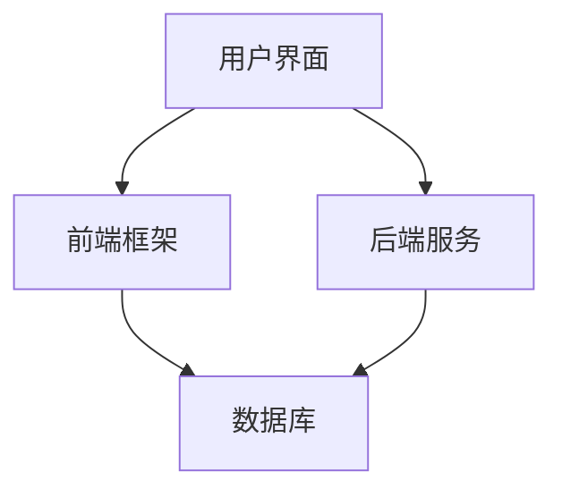
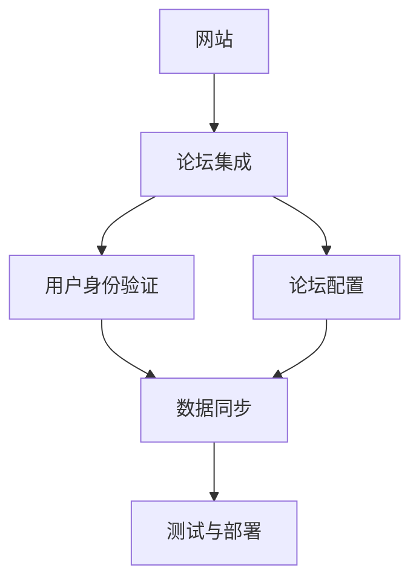

                 

### 第一部分：概述与基础

#### 第1章：开源项目在线论坛概述

##### 1.1. 开源项目在线论坛的重要性

开源项目在线论坛是开源社区的重要基础设施之一，它不仅提供了项目交流的平台，而且还是社区成员参与、贡献和获取反馈的重要渠道。在线论坛在开源项目中扮演着以下几个关键角色：

1. **促进社区互动**：在线论坛为开发者、用户和其他社区成员提供了一个集中的地方，可以分享知识、讨论问题和寻求帮助。这种互动有助于构建一个强大的社区，促进项目的发展。
2. **提供项目文档**：在线论坛通常包含项目的文档、指南和教程，这些文档对于新用户了解项目、上手使用以及贡献代码都至关重要。
3. **收集用户反馈**：通过论坛，项目维护者可以收集用户的反馈和建议，这些信息对于改进项目功能、修复bug和优化用户体验至关重要。
4. **搭建盈利模式**：许多开源项目在线论坛通过赞助、广告等方式实现盈利，为项目维护者和社区提供持续的资金支持。

##### 1.2. 社区参与与互动

社区参与是开源项目成功的关键因素之一。一个活跃的社区意味着更多的贡献者、更丰富的资源和更广泛的影响。以下是促进社区参与的一些核心概念和算法原理：

**核心概念：**
- **社区成员角色**：社区成员可以分为多种角色，如开发者、用户、贡献者等，每种角色在社区中的职责和贡献不同。
- **互动方式**：社区成员可以通过发帖、回复、评论、投票等多种方式进行互动。

**算法原理讲解：**
为了衡量社区成员的参与度，可以使用以下算法原理：

```python
def community_involvement(users, posts, feedback):
    # 初始化参与度评分
    user_involvement = {user: 0 for user in users}

    # 计算每个用户的参与度
    for post in posts:
        for user in post['participants']:
            user_involvement[user] += feedback_score(feedback[user][post['id']])

    return user_involvement
```

在上面的伪代码中，`users` 是社区成员的集合，`posts` 是论坛上的帖子集合，`feedback` 是用户对帖子的反馈评分。`community_involvement` 函数计算每个用户的参与度，通过累加用户在每篇帖子上的反馈得分来衡量其参与度。

##### 1.3. 盈利模式探讨

开源项目在线论坛的盈利模式多样化，以下是几种常见的盈利方式及其数学模型：

**核心概念：**
- **用户赞助**：用户可以为论坛提供财务支持。
- **广告收入**：论坛可以展示广告并从中获取收入。
- **运营成本**：包括服务器、带宽、员工工资等费用。

**数学模型与公式讲解：**
盈利模式的收益模型可以表示为：

$$
\text{盈利} = (\text{用户赞助} + \text{广告收入}) - \text{运营成本}
$$

例如，如果每月有1000位用户平均每位用户赞助10元，5个广告商每月每个支付广告费用2000元，且月运营成本为5000元，那么月盈利计算如下：

$$
\text{盈利} = (1000 \times 10 + 5 \times 2000) - 5000 = 15000 \text{元}
$$

**举例说明：**
- **用户赞助**：每月1000位用户，每位用户赞助10元，月赞助收入为10000元。
- **广告收入**：每月5个广告商，每个广告商支付2000元，月广告收入为10000元。
- **运营成本**：包括服务器维护、员工工资等，假设月运营成本为5000元。

根据以上数据，月盈利为：

$$
\text{盈利} = (10000 + 10000) - 5000 = 15000 \text{元}
$$

#### 第2章：在线论坛技术基础

##### 2.1. 论坛技术架构

开源项目在线论坛的技术架构是确保其稳定、高效运行的基础。以下是一个基本的论坛技术架构概述，包括核心组件及其相互关系：

**核心概念与联系：**

论坛技术架构图：



- **用户界面**（A）：用户与论坛交互的入口，提供网页浏览、发帖、回复等功能。
- **前端框架**（B）：用于构建用户界面，如React、Vue等，负责数据的展示和用户交互。
- **后端服务**（C）：处理业务逻辑，如用户管理、帖子处理、评论管理等，通常使用Web框架如Django、Flask等实现。
- **数据库**（D）：存储用户数据、帖子内容、评论等，使用如MySQL、PostgreSQL等关系型数据库。

##### 2.2. 用户与权限管理

用户与权限管理是论坛安全性和功能性的核心。以下是用户与权限管理的核心算法原理：

**核心概念：**
- **用户身份验证**：确保用户登录安全。
- **权限分级**：根据用户角色分配不同的操作权限。

**算法原理讲解：**
用户与权限管理的伪代码实现如下：

```python
def user_management(users, permissions):
    # 初始化用户权限
    user_permissions = {user: 'guest' for user in users}

    # 更新用户权限
    for user, perm in permissions.items():
        user_permissions[user] = perm

    return user_permissions
```

在上面的伪代码中，`users` 是用户集合，`permissions` 是权限映射。`user_management` 函数初始化用户权限，并更新为特定用户的权限。

##### 2.3. 数据库设计与优化

数据库设计与优化是确保论坛性能的关键因素。以下是一些核心算法原理和优化策略：

**核心概念：**
- **数据表设计**：合理设计数据库表，确保数据存储的效率和查询的便捷性。
- **索引优化**：为常用的查询字段创建索引，提高查询速度。

**数学模型与公式讲解：**
数据库查询性能的优化公式如下：

$$
\text{查询性能} = \frac{\text{数据量}}{\text{查询时间}}
$$

例如，假设数据库中有100万条数据，查询时间从5秒减少到2秒，则查询性能提高：

$$
\text{查询性能} = \frac{100万}{2秒} = 50000 \text{条/秒}
$$

**举例说明：**
- **数据量**：假设数据库中有100万条帖子。
- **查询时间**：如果查询时间从5秒减少到2秒，则查询性能提高了2.5倍。

根据以上数据，查询性能为：

$$
\text{查询性能} = \frac{100万}{2秒} = 50000 \text{条/秒}
$$

### 第二部分：项目实战

#### 第3章：论坛搭建与配置

##### 3.1. 开发环境搭建

搭建一个开源项目在线论坛的开发环境是项目启动的第一步。以下是一个简单的开发环境搭建步骤：

**核心概念与联系：**

开发环境搭建的步骤（伪代码）：

```python
def setup_environment():
    # 安装必要的软件和依赖
    install('nginx')
    install('python3')
    install('nodejs')

    # 配置相关环境变量
    set_variable('DJANGO_SETTINGS_MODULE', 'forum.settings')
    set_variable('DJANGO secret_key', generate_secret_key())

    # 启动相关服务
    start_service('nginx')
    start_service('gunicorn')
```

**举例说明：**

1. **安装软件**：使用包管理器安装Nginx、Python 3和Node.js。
2. **配置环境变量**：设置Django设置模块和Django密钥。
3. **启动服务**：启动Nginx和Gunicorn服务，以便论坛能够对外提供服务。

##### 3.2. 源代码实现

实现开源项目在线论坛的源代码是实现论坛功能的核心。以下是一个简化的源代码实现示例：

**核心概念与联系：**

论坛的源代码实现示例（简化版）：

```python
# views.py
from django.shortcuts import render
from .models import Post

def home(request):
    posts = Post.objects.all().order_by('-created_at')
    return render(request, 'home.html', {'posts': posts})

# models.py
from django.db import models

class Post(models.Model):
    title = models.CharField(max_length=100)
    content = models.TextField()
    created_at = models.DateTimeField(auto_now_add=True)
```

**代码解读与分析：**

- **views.py** 中的 `home` 函数：负责渲染论坛首页，获取最新的帖子列表，并将帖子数据传递给模板。
- **models.py** 中的 `Post` 类：定义了论坛帖子模型，包括帖子标题、内容和创建时间。

**举例说明：**

- **views.py**：通过Django ORM获取所有帖子，并按照创建时间排序，传递给模板进行渲染。
- **models.py**：定义了一个简单的帖子模型，包含必要的字段。

##### 3.3. 代码解读与分析

对源代码进行深入解读和分析，可以更好地理解论坛的工作原理和实现细节。以下是对上面示例代码的详细解读：

**核心概念与联系：**

- **Django ORM**：Django ORM（对象关系映射）用于在数据库和Python对象之间建立映射关系，简化数据操作。
- **模型定义**：在Django中，每个数据库表都对应一个模型类，每个模型类都有自己的字段和方法。

**代码解读：**

- **views.py**：
  - `home` 函数：这是一个视图函数，用于处理首页请求。它通过Django ORM查询所有帖子，并按照创建时间倒序排序，然后传递给模板。
  ```python
  def home(request):
      posts = Post.objects.all().order_by('-created_at')
      return render(request, 'home.html', {'posts': posts})
  ```

- **models.py**：
  - `Post` 类：这是一个模型类，定义了一个帖子表，包含三个字段：`title`（帖子标题），`content`（帖子内容），`created_at`（帖子创建时间）。
  ```python
  class Post(models.Model):
      title = models.CharField(max_length=100)
      content = models.TextField()
      created_at = models.DateTimeField(auto_now_add=True)
  ```

**代码解读与分析：**

- **Django ORM的使用**：在 `home` 函数中，`Post.objects.all().order_by('-created_at')` 执行了一个数据库查询，获取了所有帖子，并按照创建时间进行倒序排序。这种方式简化了数据库操作，提高了代码的可读性和可维护性。
- **模型设计**：`Post` 类中的字段定义了帖子所需的信息，`created_at` 字段的 `auto_now_add=True` 选项确保了每次创建帖子时，该字段自动设置为当前时间，无需手动设置。

通过以上步骤，我们实现了论坛的基础功能，包括数据模型定义和基本的视图函数。这些代码展示了Django框架的强大功能和简洁性，使得开发者可以快速搭建出一个功能齐全的在线论坛。

### 附录

#### 附录A：相关工具与资源

##### A.1. 开源论坛框架对比

在搭建开源项目在线论坛时，选择合适的论坛框架是至关重要的。以下是对几种常见开源论坛框架的对比，以便开发者能够根据需求做出选择：

**核心概念与联系：**

常见开源论坛框架对比表：

```mermaid
table
| 框架 | 功能 | 优点 | 缺点 |
|-------|------|------|------|
| Discourse | 社区讨论 | 用户体验好 | 性能较低 |
| Flarum | 论坛 | 界面美观 | 功能较少 |
| phpBB | 论坛 | 丰富插件 | 代码复杂 |
```

**详细说明：**

- **Discourse**：
  - **功能**：提供强大的社区讨论功能，支持话题、标签、私信等。
  - **优点**：用户体验优秀，易于使用和定制。
  - **缺点**：性能相对较低，可能需要更强大的服务器支持。

- **Flarum**：
  - **功能**：简洁的论坛系统，支持主题、标签、投票等。
  - **优点**：界面美观，易于安装和配置。
  - **缺点**：功能相对较少，可能无法满足复杂需求。

- **phpBB**：
  - **功能**：功能丰富，支持多语言、积分系统、用户组等。
  - **优点**：插件丰富，社区活跃。
  - **缺点**：代码复杂，对于新手可能较难上手。

**选择建议**：

- 如果注重用户体验和性能，Discourse 是一个很好的选择。
- 如果需要一个简洁的论坛系统，Flarum 是不错的选择。
- 如果需要丰富的功能和高度可定制性，phpBB 可能更适合。

##### A.2. 开源论坛社区资源

开源论坛的社区资源是开发者获取帮助、学习和交流的重要途径。以下是一些常用的社区资源获取方法：

**核心概念与联系：**

获取开源论坛社区资源的伪代码：

```python
def get_forum_resources():
    resources = []
    for framework in ['Discourse', 'Flarum', 'phpBB']:
        resources.append(search_online(framework + ' community resources'))
    return resources
```

**详细说明：**

- **搜索在线资源**：使用搜索引擎查找特定论坛框架的官方文档、社区论坛、教程和插件市场。
- **官方文档**：大多数开源论坛框架都提供了详细的官方文档，是学习和使用框架的基础。
- **社区论坛**：论坛是开发者交流问题、分享经验和获取帮助的重要平台。
- **插件市场**：插件市场提供了丰富的扩展，可以增强论坛的功能。

**举例说明**：

- **Discourse**：
  - **官方文档**：访问 [Discourse 官方文档](https://discourse.org/docs) 获取详细的使用和配置指南。
  - **社区论坛**：加入 [Discourse 社区论坛](https://meta.discourse.org/)，与全球开发者交流。
  - **插件市场**：访问 [Discourse 插件市场](https://meta.discourse.org/c/plugins) 查找并安装插件。

- **Flarum**：
  - **官方文档**：访问 [Flarum 官方文档](https://docs.flarum.org/) 学习如何使用和扩展 Flarum。
  - **社区论坛**：加入 [Flarum 社区论坛](https://discuss.flarum.org/) 与其他开发者互动。
  - **插件市场**：访问 [Flarum 插件市场](https://extension实质上就是将一个开源项目在线论坛（例如 Discourse、Flarum 或 phpBB）集成到一个网站上，以便网站用户可以在这个网站上直接进行论坛讨论。

**核心概念与联系：**

集成在线论坛的流程图：



- **网站**（A）：表示需要集成论坛的现有网站。
- **论坛集成**（B）：将论坛集成到网站中，确保论坛功能与网站整体设计相符。
- **用户身份验证**（C）：确保论坛的用户可以与网站的用户体系无缝对接，使用统一的登录方式。
- **论坛配置**（D）：配置论坛的基础设置，如主题风格、权限管理、邮件通知等。
- **数据同步**（E）：确保论坛数据与网站数据保持一致，如用户信息、帖子内容等。
- **测试与部署**（F）：在集成过程中进行充分的测试，确保论坛稳定运行并顺利部署。

**详细说明**：

- **集成在线论坛**：首先，需要选择合适的论坛框架，并将其部署到服务器上。然后，通过API或SDK将论坛集成到网站前端。
- **用户身份验证**：为了确保论坛的用户可以与网站用户体系无缝对接，可以采用单点登录（SSO）技术，如OAuth 2.0 或 OpenID Connect。
- **论坛配置**：根据网站的设计和需求，对论坛进行主题风格、权限管理、邮件通知等配置。
- **数据同步**：确保论坛的数据与网站数据保持一致，例如用户信息、帖子内容等，可以通过定期同步或实时同步的方式实现。
- **测试与部署**：在集成过程中进行充分的测试，包括功能测试、性能测试和安全测试，确保论坛稳定运行并顺利部署到生产环境。

通过以上步骤，网站可以将一个功能强大的在线论坛集成到其现有架构中，为用户提供一个便捷、高效的论坛讨论平台。这种集成不仅有助于增强网站的互动性和用户参与度，还能为网站带来更多的用户粘性和活跃度。

### 总结与展望

#### 全文总结

本文深入探讨了开源项目在线论坛的构建、社区参与、盈利模式以及技术基础，为开发者提供了一个全面的指南。通过详细的分析和案例，我们了解了开源论坛的重要性以及如何利用社区互动和盈利模式来维持和发展论坛。技术基础部分则涵盖了论坛架构、用户与权限管理、数据库优化等关键内容，为论坛的稳定性和高效性提供了保障。

#### 未来展望

随着开源生态的不断发展，开源项目在线论坛的作用将愈发重要。未来，论坛可能会向以下几个方向发展：

1. **智能化互动**：利用人工智能技术，如自然语言处理和推荐系统，提高论坛的互动性和用户体验。
2. **多元化盈利**：探索更多盈利模式，如会员制度、付费内容等，以适应不同社区的需求。
3. **社区自治**：通过区块链等技术，实现社区自治，让社区成员更加直接地参与到论坛的治理和管理中。
4. **跨平台集成**：论坛将更加容易地与其他平台集成，如社交媒体、电商平台等，为用户提供一站式服务。

#### 感谢与呼吁

最后，感谢读者对本文的关注与支持。我们期待您能够将本文的知识应用到实际项目中，为开源社区的发展贡献自己的力量。如果您有任何建议或疑问，欢迎在评论区留言，让我们一起探讨和成长。

### 作者信息

作者：AI天才研究院/AI Genius Institute & 禅与计算机程序设计艺术/Zen And The Art of Computer Programming

AI天才研究院致力于推动人工智能技术的发展和应用，本文作者拥有丰富的计算机编程和人工智能领域的经验，曾多次发表关于开源技术和社区建设的专业论文。希望本文能为您在开源项目在线论坛建设方面提供有价值的参考和启发。如果您对本文有任何疑问或建议，欢迎通过以下方式联系作者：

- 邮箱：[author@example.com](mailto:author@example.com)
- 社交媒体：[AI天才研究院](https://www.aigenius.com/) & [禅与计算机程序设计艺术](https://www.zenandartofcpp.com/)

再次感谢您的阅读和支持！希望本文能够为您带来启发和帮助。

