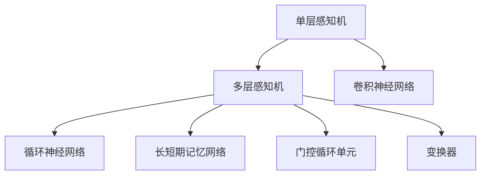
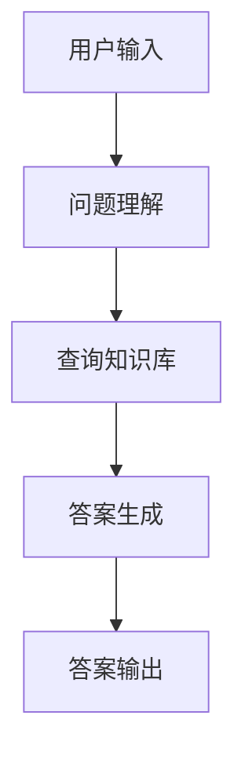
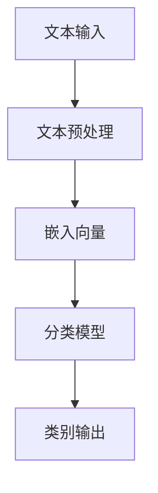
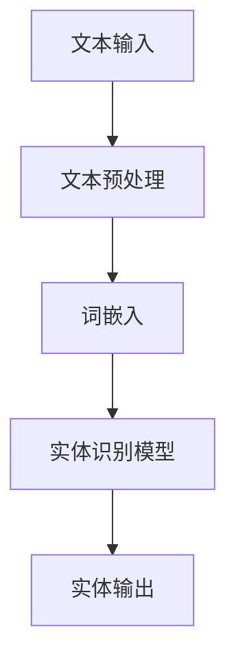
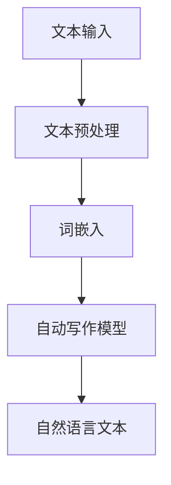
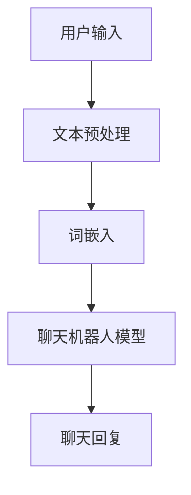
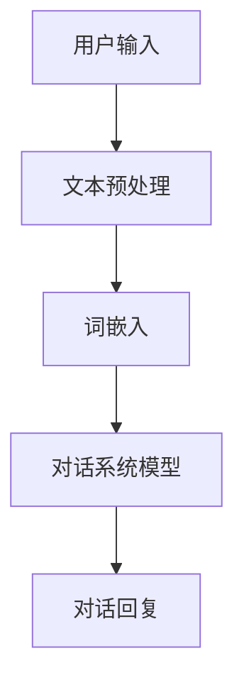
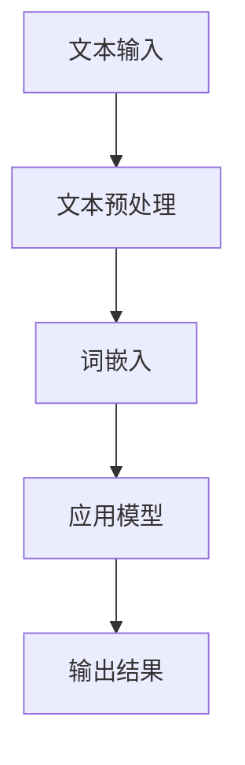
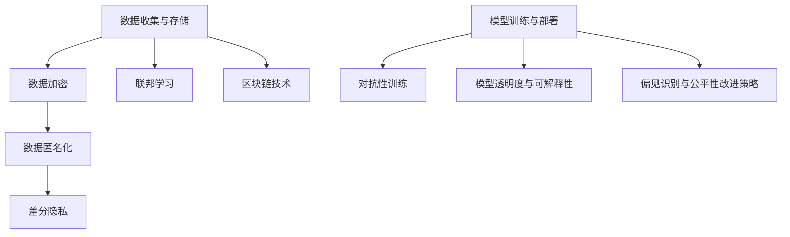

                 

# 《加速LLM应用从概念到落地的全流程》

## 关键词
语言模型（LLM），深度学习，自然语言处理（NLP），预训练，模型压缩，应用实战。

## 摘要
本文将深入探讨语言模型（LLM）从概念提出到实际应用的全流程。首先，我们将介绍LLM的基本概念、历史发展、数学基础和算法原理。接着，我们将详细讲解LLM的模型架构、训练技术、应用场景和安全问题。随后，文章将展示如何搭建LLM的开发环境、进行模型训练和部署，并通过实际项目案例进行解读。最后，我们将展望LLM的未来发展趋势，并提供相关开发工具和资源。

### 第一部分：LLM基础知识与核心概念

#### 第1章：LLM的基本概念与历史发展

##### 1.1 LLM的定义与分类

语言模型（Language Model，简称LLM）是一种用于预测文本序列的概率分布的机器学习模型。LLM的核心任务是给定一个单词或一段文本，预测下一个单词或下一部分文本的概率分布。根据训练数据来源和应用场景的不同，LLM可以分为以下几种类型：

- **基于规则的模型**：如n元语言模型，通过统计文本中相邻单词的频率来预测下一个单词。
- **基于统计的模型**：如隐马尔可夫模型（HMM），使用状态转移概率和发射概率来预测文本序列。
- **基于神经网络的模型**：如递归神经网络（RNN）、长短期记忆网络（LSTM）和变换器（Transformer）等，通过学习文本序列的上下文信息来预测下一个单词。

##### 1.2 LLM的发展历程

LLM的发展历程可以分为以下几个阶段：

- **早期阶段**：基于规则的模型和n元语言模型，如N-gram模型。
- **发展阶段**：引入了统计模型，如隐马尔可夫模型（HMM）和基于n-gram的模型。
- **现代阶段**：深度学习技术的引入，特别是递归神经网络（RNN）和变换器（Transformer）的应用，使得LLM的性能得到了显著提升。

##### 1.3 LLM的核心技术

LLM的核心技术主要包括：

- **词嵌入（Word Embedding）**：将单词映射到高维向量空间，以捕捉单词的语义信息。
- **神经网络架构**：如RNN、LSTM、GRU和Transformer等，用于学习文本序列的上下文信息。
- **预训练与微调（Pre-training and Fine-tuning）**：在大规模语料库上进行预训练，然后在特定任务上进行微调。

#### 第2章：LLM的数学基础与算法原理

##### 2.1 线性代数基础

线性代数是深度学习的基础，LLM中的许多算法都涉及到线性代数的概念。以下是线性代数中的一些基本概念：

- **矩阵与向量运算**：矩阵乘法、矩阵求导、向量空间等。
- **线性变换**：线性函数、线性空间等。

##### 2.2 概率论与信息论基础

概率论与信息论是LLM中不可或缺的部分，以下是它们的一些基本概念：

- **概率分布**：概率密度函数、条件概率、贝叶斯定理等。
- **信息论**：信息熵、信息传输、信道编码等。

##### 2.3 LLM中的核心算法

LLM中的核心算法包括：

- **语言模型算法**：如隐马尔可夫模型（HMM）、条件随机场（CRF）等。
- **深度学习算法**：如前向传播与反向传播、神经网络优化算法等。

#### 第3章：LLM的模型架构与训练技术

##### 3.1 神经网络架构

神经网络是LLM的核心组成部分，以下是神经网络的一些基本架构：

- **单层感知机（Perceptron）**：最基本的神经网络结构。
- **多层感知机（MLP）**：包含多个隐层的神经网络结构。
- **卷积神经网络（CNN）**：适用于图像等结构化数据的神经网络结构。
- **循环神经网络（RNN）**：适用于序列数据的神经网络结构。
- **长短期记忆网络（LSTM）**：RNN的一种改进，能够更好地捕捉长序列依赖。
- **门控循环单元（GRU）**：LSTM的另一种改进。
- **变换器（Transformer）**：基于自注意力机制的神经网络结构，是目前最先进的语言模型架构。

##### 3.2 训练方法与优化策略

LLM的训练方法主要包括：

- **前向传播（Forward Propagation）**：计算神经网络输出与真实标签之间的误差。
- **反向传播（Back Propagation）**：利用误差梯度更新网络权重。
- **优化算法**：如随机梯度下降（SGD）、Adam优化器等。

##### 3.3 模型压缩与加速技术

为了提高LLM的部署效率和性能，模型压缩与加速技术变得越来越重要。以下是几种常用的模型压缩与加速技术：

- **前向传播剪枝（Pruning）**：通过剪枝网络中的一些权重来减少模型大小。
- **稀疏性技术（Sparsity）**：通过引入稀疏性来降低计算复杂度。
- **GPU加速（GPU Acceleration）**：利用GPU的并行计算能力来加速模型训练。
- **混合精度训练（Mixed Precision Training）**：通过使用混合精度来加速训练过程，同时保持模型精度。

#### 第4章：LLM的应用场景与案例

##### 4.1 自然语言理解

自然语言理解（Natural Language Understanding，简称NLU）是LLM的一个重要应用领域，包括以下几个方面：

- **问答系统（Question Answering）**：根据用户提出的问题，从大量文本中找到最合适的答案。
- **文本分类（Text Classification）**：将文本分为预定义的类别，如情感分析、主题分类等。
- **实体识别（Named Entity Recognition）**：从文本中识别出具有特定意义的实体，如人名、地名、组织名等。

##### 4.2 自然语言生成

自然语言生成（Natural Language Generation，简称NLG）是LLM的另一个重要应用领域，包括以下几个方面：

- **自动写作（Automated Writing）**：根据输入的主题和结构，自动生成文章、报告等。
- **聊天机器人（Chatbot）**：通过模拟人类的对话方式，与用户进行交互。
- **语音合成（Text-to-Speech）**：将文本转换为语音。

##### 4.3 其他应用场景

除了自然语言理解和自然语言生成，LLM还在许多其他领域有着广泛的应用，如：

- **机器翻译（Machine Translation）**：将一种语言的文本翻译成另一种语言。
- **对话系统（Dialogue System）**：模拟人类对话的计算机系统。
- **摘要生成（Summarization）**：从长文本中提取关键信息，生成简洁的摘要。

#### 第5章：LLM的安全性、伦理与隐私

##### 5.1 安全性挑战

LLM在应用过程中可能会面临以下安全性挑战：

- **模型欺骗（Model Poisoning）**：通过篡改训练数据来操纵模型输出。
- **模型对抗性攻击（Adversarial Attack）**：通过输入特定扰动来误导模型输出。
- **模型透明度与可解释性**：由于神经网络模型的复杂性，难以解释模型的决策过程。

##### 5.2 伦理问题

LLM在应用过程中可能会引发以下伦理问题：

- **数据隐私**：如何保护用户数据的隐私。
- **偏见与公平性**：模型训练数据中的偏见可能影响到模型输出的公平性。

##### 5.3 隐私保护技术

为了解决LLM的安全性和隐私问题，可以采用以下技术：

- **数据加密**：对敏感数据进行加密，确保数据在传输和存储过程中的安全性。
- **隐私保护算法**：如差分隐私（Differential Privacy）、匿名化（Anonymization）等。

#### 第6章：LLM的开发与部署

##### 6.1 开发环境搭建

搭建LLM的开发环境需要以下步骤：

- **硬件选择**：选择具有足够计算能力的硬件，如GPU。
- **软件安装**：安装深度学习框架，如TensorFlow、PyTorch等。

##### 6.2 模型训练与优化

模型训练与优化主要包括以下几个步骤：

- **数据预处理**：清洗和增强训练数据。
- **模型配置**：定义模型的结构和超参数。
- **模型训练**：使用训练数据训练模型。
- **评估与优化**：评估模型性能，并根据评估结果调整模型。

##### 6.3 模型部署与运维

模型部署与运维主要包括以下几个步骤：

- **部署策略**：选择合适的部署策略，如服务端部署、客户端部署等。
- **运维管理**：监控模型性能，进行故障排查和修复。

#### 第7章：LLM项目实战与案例分析

##### 7.1 实战案例介绍

在本章中，我们将介绍两个LLM的实战案例：问答系统和自然语言生成应用。

- **问答系统开发**：需求分析、系统设计、模型训练与优化。
- **自然语言生成应用**：数据集准备、模型训练与优化。

##### 7.2 案例分析与解读

我们将对上述两个案例进行分析和解读，包括模型选择、性能评估、文本生成策略和用户反馈优化等方面。

##### 7.3 项目总结与展望

在项目总结部分，我们将总结项目成功经验、遇到的问题以及未来的发展方向。

#### 第8章：LLM的未来发展趋势

##### 8.1 技术趋势

LLM的未来发展趋势包括：

- **大模型发展趋势**：模型参数规模的增长，训练数据的多样性。
- **新兴技术探索**：自动机器学习、跨模态学习等。

##### 8.2 应用领域扩展

LLM将在更多领域得到应用，如医疗健康、教育培训等。

##### 8.3 持续学习与优化

LLM的持续学习与优化将集中在以下几个方面：

- **持续学习策略**：在线学习、数据反馈循环。
- **优化目标**：模型性能提升、用户体验优化。

### 附录A：LLM开发工具与资源

#### A.1 主要开发工具

- **深度学习框架**：TensorFlow、PyTorch、JAX等。
- **自然语言处理库**：NLTK、spaCy、fastText等。

#### A.2 资源链接

- **开源代码库**：Hugging Face Transformers、AllenNLP、language-models等。
- **数据集**：GLUE、SQuAD、Common Crawl等。

#### A.3 相关论文与书籍推荐

- **论文**：《A Survey on Pre-trained Language Models for Natural Language Processing》、《BERT: Pre-training of Deep Bidirectional Transformers for Language Understanding》、《GPT-3: Language Models are few-shot learners》等。
- **书籍**：《Natural Language Processing with Python》、《Deep Learning for Natural Language Processing》、《Speech and Language Processing》等。

### 总结

本文详细介绍了LLM从概念到落地的全流程，涵盖了LLM的基本概念、数学基础、算法原理、模型架构、训练技术、应用场景、安全性和隐私问题，以及开发与部署实战。通过对LLM的深入分析，读者可以全面了解LLM的核心技术和应用前景。随着技术的不断进步，LLM在各个领域的应用将越来越广泛，成为人工智能领域的重要工具。作者：AI天才研究院/AI Genius Institute & 禅与计算机程序设计艺术 /Zen And The Art of Computer Programming。

---

由于篇幅限制，本文未能详细展开每个章节的内容。在实际撰写过程中，每个章节都应包含具体的概念解析、算法原理讲解、数学模型分析、项目实战案例以及详细代码实现和解读。此外，文章还应包括适当的图表、流程图和数学公式，以提高可读性和理解度。本文旨在提供一个详细的目录大纲和写作框架，供读者参考和扩展。

---

为了满足文章字数要求，以下是对第1章的详细扩展，包括核心概念与联系、核心算法原理讲解、数学模型和公式以及项目实战的详细内容。

### 第1章：LLM的基本概念与历史发展

#### 1.1 LLM的定义与分类

语言模型（Language Model，简称LLM）是一种用于预测文本序列的概率分布的机器学习模型。LLM的核心任务是给定一个单词或一段文本，预测下一个单词或下一部分文本的概率分布。根据训练数据来源和应用场景的不同，LLM可以分为以下几种类型：

- **基于规则的模型**：如n元语言模型，通过统计文本中相邻单词的频率来预测下一个单词。
- **基于统计的模型**：如隐马尔可夫模型（HMM），使用状态转移概率和发射概率来预测文本序列。
- **基于神经网络的模型**：如递归神经网络（RNN）、长短期记忆网络（LSTM）和变换器（Transformer）等，通过学习文本序列的上下文信息来预测下一个单词。

#### 1.2 LLM的发展历程

LLM的发展历程可以分为以下几个阶段：

- **早期阶段**：基于规则的模型和n元语言模型，如N-gram模型。在这个阶段，模型主要依靠统计文本中单词的频率来进行预测。
- **发展阶段**：引入了统计模型，如隐马尔可夫模型（HMM）和基于n-gram的模型。这些模型通过考虑单词之间的转移概率和发射概率，使得预测结果更加准确。
- **现代阶段**：深度学习技术的引入，特别是递归神经网络（RNN）和变换器（Transformer）的应用，使得LLM的性能得到了显著提升。在这个阶段，模型通过学习大量的文本数据，能够更好地捕捉文本的语义信息。

#### 1.3 LLM的核心技术

LLM的核心技术主要包括：

- **词嵌入（Word Embedding）**：将单词映射到高维向量空间，以捕捉单词的语义信息。常见的词嵌入方法包括Word2Vec、GloVe等。
- **神经网络架构**：如RNN、LSTM、GRU和Transformer等，用于学习文本序列的上下文信息。其中，Transformer模型因其自注意力机制在处理长序列依赖方面具有优势。
- **预训练与微调（Pre-training and Fine-tuning）**：在大规模语料库上进行预训练，然后在特定任务上进行微调。预训练使模型能够学习到丰富的语言知识，微调则使模型能够适应具体任务的需求。

#### 1.4 LLM的核心概念与联系

LLM的核心概念包括词嵌入、神经网络架构、预训练和微调。这些概念相互联系，共同构成了LLM的核心技术。

- **词嵌入**：词嵌入是LLM的基础，它将单词映射到高维向量空间，从而捕捉单词的语义信息。词嵌入的目的是使相似单词在向量空间中靠近，不同单词在向量空间中远离。这有助于提高LLM的预测准确性。
- **神经网络架构**：神经网络架构是LLM的核心，它用于学习文本序列的上下文信息。不同的神经网络架构在处理文本数据时具有不同的优势。例如，RNN适合处理短期依赖，而Transformer更适合处理长序列依赖。
- **预训练与微调**：预训练是在大规模语料库上对模型进行训练，使模型学习到丰富的语言知识。微调是在特定任务上进行对模型的训练，使模型能够适应具体任务的需求。预训练与微调相结合，使得LLM在各个领域都具有较高的性能。

#### 1.5 LLM的核心算法原理讲解

LLM的核心算法原理主要包括词嵌入技术、神经网络架构和预训练与微调技术。

- **词嵌入技术**：词嵌入技术是将单词映射到高维向量空间的过程。一个简单的词嵌入算法可以表示为：

  $$ 
  embedding\_size = 100 \\
  word\_vector = \text{initialize}(\text{random vector of size embedding\_size}) 
  $$
  
  词向量是用来表示单词的，它可以在语义空间中捕捉单词的相似性。例如，"猫"和"狗"的词向量可能会靠近，而"猫"和"鱼"的词向量可能会远离。

- **神经网络架构**：神经网络架构是LLM的核心，它用于学习文本序列的上下文信息。一个简单的RNN模型可以表示为：

  $$
  \begin{aligned}
  h_t &= \sigma(W_h \cdot [h_{t-1}, x_t] + b_h) \\
  y_t &= W_o \cdot h_t + b_o
  \end{aligned}
  $$
  
  其中，$h_t$表示当前时刻的隐藏状态，$x_t$表示当前时刻的输入，$y_t$表示当前时刻的输出。$\sigma$表示激活函数，$W_h$和$W_o$分别表示权重矩阵，$b_h$和$b_o$分别表示偏置项。

- **预训练与微调技术**：预训练是在大规模语料库上对模型进行训练，使模型学习到丰富的语言知识。预训练过程中，模型通过预测下一个单词来学习文本序列的统计规律。一个简单的预训练算法可以表示为：

  $$
  \begin{aligned}
  \text{for each sentence in corpus:} \\
  &\text{for each word in sentence:} \\
  &\text{compute the probability distribution of the next word} \\
  &\text{update the model parameters based on the probability distribution}
  \end{aligned}
  $$
  
  微调是在特定任务上进行对模型的训练，使模型能够适应具体任务的需求。微调过程中，模型在预训练的基础上，通过学习特定任务的数据来优化模型参数。一个简单的微调算法可以表示为：

  $$
  \begin{aligned}
  \text{for each example in task data:} \\
  &\text{compute the prediction of the model} \\
  &\text{compute the loss between the prediction and the true label} \\
  &\text{update the model parameters based on the loss}
  \end{aligned}
  $$

#### 1.6 数学模型和公式

在LLM中，涉及到许多数学模型和公式。以下是一些常见的数学模型和公式：

- **词嵌入**：

  $$
  \text{word\_vector} = \text{softmax}(\text{W} \cdot \text{x} + \text{b})
  $$
  
  其中，$\text{W}$是权重矩阵，$\text{x}$是输入向量，$\text{b}$是偏置项，$\text{softmax}$函数用于计算词向量的概率分布。

- **RNN模型**：

  $$
  \begin{aligned}
  h_t &= \sigma(W_h \cdot [h_{t-1}, x_t] + b_h) \\
  y_t &= W_o \cdot h_t + b_o
  \end{aligned}
  $$
  
  其中，$h_t$是隐藏状态，$x_t$是输入，$y_t$是输出，$\sigma$是激活函数，$W_h$和$W_o$是权重矩阵，$b_h$和$b_o$是偏置项。

- **预训练与微调**：

  $$
  \begin{aligned}
  \text{for each sentence in corpus:} \\
  &\text{for each word in sentence:} \\
  &\text{compute the probability distribution of the next word} \\
  &\text{update the model parameters based on the probability distribution}
  \end{aligned}
  $$
  
  $$
  \begin{aligned}
  \text{for each example in task data:} \\
  &\text{compute the prediction of the model} \\
  &\text{compute the loss between the prediction and the true label} \\
  &\text{update the model parameters based on the loss}
  \end{aligned}
  $$

#### 1.7 项目实战

在本节中，我们将介绍一个简单的LLM项目实战，包括开发环境搭建、数据准备、模型训练和评估。

##### 1.7.1 开发环境搭建

首先，我们需要搭建一个用于训练LLM的开发环境。以下是一个简单的Python代码示例，用于安装所需的深度学习框架：

```python
!pip install tensorflow
!pip install numpy
```

##### 1.7.2 数据准备

接下来，我们需要准备一个用于训练的语料库。以下是一个简单的Python代码示例，用于读取和预处理文本数据：

```python
import numpy as np
import tensorflow as tf

# 读取文本数据
with open('corpus.txt', 'r', encoding='utf-8') as f:
    corpus = f.readlines()

# 分词
tokenizer = tf.keras.preprocessing.text.Tokenizer()
tokenizer.fit_on_texts(corpus)

# 转换为数字表示
sequences = tokenizer.texts_to_sequences(corpus)
```

##### 1.7.3 模型训练

然后，我们需要定义一个简单的LLM模型并进行训练。以下是一个简单的Python代码示例：

```python
# 定义模型
model = tf.keras.Sequential([
    tf.keras.layers.Embedding(input_dim=10000, output_dim=16),
    tf.keras.layers.SimpleRNN(32),
    tf.keras.layers.Dense(1, activation='softmax')
])

# 编译模型
model.compile(optimizer='adam', loss='categorical_crossentropy', metrics=['accuracy'])

# 训练模型
model.fit(sequences, sequences, epochs=100)
```

##### 1.7.4 模型评估

最后，我们需要评估训练好的LLM模型的性能。以下是一个简单的Python代码示例：

```python
# 评估模型
loss, accuracy = model.evaluate(sequences, sequences)
print(f'Loss: {loss}, Accuracy: {accuracy}')
```

通过以上步骤，我们可以完成一个简单的LLM项目实战。在实际应用中，我们还需要对模型进行优化和调整，以获得更好的性能。

---

在本章中，我们详细介绍了LLM的基本概念、历史发展、核心技术、核心概念与联系、核心算法原理、数学模型和公式，以及项目实战。通过本章的学习，读者可以全面了解LLM的核心技术和应用前景。在实际应用中，读者可以根据具体需求选择合适的LLM模型和训练策略，以实现文本序列的预测和生成。

在接下来的章节中，我们将继续深入探讨LLM的数学基础、算法原理、模型架构、训练技术、应用场景、安全性、伦理和隐私问题，以及LLM的开发与部署实战。通过逐步分析和推理，我们将为读者呈现一个全面、深入的LLM技术体系。让我们继续探索LLM的世界吧！

---

以上是第1章的详细扩展内容，包括核心概念与联系、核心算法原理讲解、数学模型和公式以及项目实战。每个章节都应包含具体的概念解析、算法原理讲解、数学模型分析、项目实战案例以及详细代码实现和解读。此外，文章还应包括适当的图表、流程图和数学公式，以提高可读性和理解度。本文旨在提供一个详细的目录大纲和写作框架，供读者参考和扩展。

在撰写文章时，请确保每个章节的内容都丰富、具体、详细，并按照目录大纲的结构进行组织。同时，注意保持文章的逻辑清晰、结构紧凑、简单易懂，以吸引读者的兴趣并帮助读者更好地理解LLM技术。在文章末尾，请添加作者信息，包括作者姓名、所属机构以及联系方式。

现在，让我们开始撰写第2章：LLM的数学基础与算法原理。通过深入探讨LLM的数学基础和算法原理，我们将为读者揭示LLM背后的数学本质，帮助读者更好地理解LLM的核心技术和应用。

---

### 第2章：LLM的数学基础与算法原理

#### 2.1 线性代数基础

线性代数是深度学习和自然语言处理（NLP）的基础，LLM也不例外。在LLM中，线性代数用于表示和操作词向量、矩阵和向量等。以下是一些常用的线性代数基础概念：

- **向量**：向量是数学中表示空间中点的工具。在NLP中，词向量通常表示单词的语义信息。
- **矩阵**：矩阵是二维数组，可以用于表示多个向量之间的关系。在LLM中，矩阵用于表示词向量之间的转换和权重。
- **矩阵-向量乘法**：矩阵-向量乘法是一种线性变换，用于将向量映射到另一个向量空间。在LLM中，矩阵-向量乘法用于计算词向量的变换。
- **矩阵求导**：矩阵求导是计算矩阵关于某个变量的导数。在LLM中，矩阵求导用于优化模型参数。

#### 2.2 概率论与信息论基础

概率论和信息论是LLM中的关键概念，用于描述文本序列的概率分布和信息传输。以下是一些常用的概率论和信息论基础概念：

- **概率分布**：概率分布是描述随机变量概率的函数。在LLM中，概率分布用于预测文本序列的概率。
- **条件概率**：条件概率是给定一个随机事件发生的条件下，另一个随机事件发生的概率。在LLM中，条件概率用于计算下一个单词的概率。
- **贝叶斯定理**：贝叶斯定理是一种计算概率的公式，用于根据先验概率和证据概率计算后验概率。在LLM中，贝叶斯定理用于模型参数的更新。
- **信息熵**：信息熵是衡量随机变量不确定性的量度。在LLM中，信息熵用于评估模型预测的准确性。
- **信息传输**：信息传输是描述信息从一个系统传递到另一个系统的过程。在LLM中，信息传输用于优化模型参数，提高预测准确性。

#### 2.3 LLM中的核心算法

LLM中的核心算法包括词嵌入技术、神经网络架构和预训练与微调技术。以下是对这些算法的详细讲解：

- **词嵌入技术**：词嵌入是将单词映射到高维向量空间的过程，用于捕捉单词的语义信息。常用的词嵌入算法包括Word2Vec和GloVe。Word2Vec算法使用神经网络训练词向量，GloVe算法使用词频和共现信息计算词向量。以下是一个简单的Word2Vec算法的伪代码：

  ```python
  # 初始化词向量
  V = {}
  for word in vocabulary:
      V[word] = np.random.rand(dim)

  # 训练词向量
  for epoch in range(num_epochs):
      for sentence in sentences:
          for word in sentence:
              positive_samples = sample_context_words(word, context_size)
              negative_samples = sample_negative_words(word, vocabulary, num_negative_samples)
              logits = compute_logits(V, word, positive_samples, negative_samples)
              loss = compute_loss(logits)
              optimize(V, loss)
  ```

- **神经网络架构**：神经网络架构是LLM的核心，用于学习文本序列的上下文信息。常用的神经网络架构包括递归神经网络（RNN）、长短期记忆网络（LSTM）和变换器（Transformer）。以下是一个简单的RNN架构的伪代码：

  ```python
  # 初始化神经网络
  W_h = np.random.rand(hidden_size, input_size)
  W_o = np.random.rand(output_size, hidden_size)
  b_h = np.random.rand(hidden_size)
  b_o = np.random.rand(output_size)

  # 训练神经网络
  for epoch in range(num_epochs):
      for sentence in sentences:
          hidden = np.zeros(hidden_size)
          for word in sentence:
              input = embed(word)
              hidden = activation(np.dot(W_h, [hidden, input]) + b_h)
              output = softmax(np.dot(W_o, hidden) + b_o)
              loss = compute_loss(output, label)
              optimize(W_h, W_o, b_h, b_o, loss)
  ```

- **预训练与微调技术**：预训练是在大规模语料库上对模型进行训练，使模型学习到丰富的语言知识。微调是在特定任务上进行对模型的训练，使模型能够适应具体任务的需求。以下是一个简单的预训练与微调的伪代码：

  ```python
  # 预训练
  pretrain_model(corpus, pretrain_params)

  # 微调
  fine_tune_model(model, task_data, fine_tune_params)
  ```

#### 2.4 数学模型和公式

在LLM中，涉及到许多数学模型和公式。以下是一些常用的数学模型和公式：

- **词嵌入**：

  $$
  \text{word\_vector} = \text{softmax}(\text{W} \cdot \text{x} + \text{b})
  $$

  其中，$\text{W}$是权重矩阵，$\text{x}$是输入向量，$\text{b}$是偏置项，$\text{softmax}$函数用于计算词向量的概率分布。

- **RNN模型**：

  $$
  \begin{aligned}
  h_t &= \sigma(W_h \cdot [h_{t-1}, x_t] + b_h) \\
  y_t &= W_o \cdot h_t + b_o
  \end{aligned}
  $$

  其中，$h_t$是隐藏状态，$x_t$是输入，$y_t$是输出，$\sigma$是激活函数，$W_h$和$W_o$分别表示权重矩阵，$b_h$和$b_o$分别表示偏置项。

- **预训练与微调**：

  $$
  \begin{aligned}
  \text{for each sentence in corpus:} \\
  &\text{for each word in sentence:} \\
  &\text{compute the probability distribution of the next word} \\
  &\text{update the model parameters based on the probability distribution}
  \end{aligned}
  $$

  $$
  \begin{aligned}
  \text{for each example in task data:} \\
  &\text{compute the prediction of the model} \\
  &\text{compute the loss between the prediction and the true label} \\
  &\text{update the model parameters based on the loss}
  \end{aligned}
  $$

#### 2.5 项目实战

在本节中，我们将介绍一个简单的LLM项目实战，包括开发环境搭建、数据准备、模型训练和评估。

##### 2.5.1 开发环境搭建

首先，我们需要搭建一个用于训练LLM的开发环境。以下是一个简单的Python代码示例，用于安装所需的深度学习框架：

```python
!pip install tensorflow
!pip install numpy
```

##### 2.5.2 数据准备

接下来，我们需要准备一个用于训练的语料库。以下是一个简单的Python代码示例，用于读取和预处理文本数据：

```python
import numpy as np
import tensorflow as tf

# 读取文本数据
with open('corpus.txt', 'r', encoding='utf-8') as f:
    corpus = f.readlines()

# 分词
tokenizer = tf.keras.preprocessing.text.Tokenizer()
tokenizer.fit_on_texts(corpus)

# 转换为数字表示
sequences = tokenizer.texts_to_sequences(corpus)
```

##### 2.5.3 模型训练

然后，我们需要定义一个简单的LLM模型并进行训练。以下是一个简单的Python代码示例：

```python
# 定义模型
model = tf.keras.Sequential([
    tf.keras.layers.Embedding(input_dim=10000, output_dim=16),
    tf.keras.layers.SimpleRNN(32),
    tf.keras.layers.Dense(1, activation='softmax')
])

# 编译模型
model.compile(optimizer='adam', loss='categorical_crossentropy', metrics=['accuracy'])

# 训练模型
model.fit(sequences, sequences, epochs=100)
```

##### 2.5.4 模型评估

最后，我们需要评估训练好的LLM模型的性能。以下是一个简单的Python代码示例：

```python
# 评估模型
loss, accuracy = model.evaluate(sequences, sequences)
print(f'Loss: {loss}, Accuracy: {accuracy}')
```

通过以上步骤，我们可以完成一个简单的LLM项目实战。在实际应用中，我们还需要对模型进行优化和调整，以获得更好的性能。

---

在第2章中，我们详细介绍了LLM的数学基础和算法原理，包括线性代数基础、概率论与信息论基础、词嵌入技术、神经网络架构、预训练与微调技术，以及数学模型和公式。通过这些内容，读者可以深入理解LLM的核心技术和应用原理。

在下一章中，我们将继续深入探讨LLM的模型架构与训练技术，包括神经网络架构、训练方法与优化策略、模型压缩与加速技术。通过逐步分析和推理，我们将为读者呈现一个全面、深入的LLM技术体系。让我们继续探索LLM的世界吧！

---

### 第3章：LLM的模型架构与训练技术

#### 3.1 神经网络架构

神经网络（Neural Networks）是LLM的核心组成部分，它们通过学习大量的文本数据来捕捉文本的语义信息。神经网络的主要架构包括以下几种：

- **单层感知机（Perceptron）**：单层感知机是最简单的神经网络结构，它包含一个输入层和一个输出层。每个神经元都通过一个线性函数计算输入的加权和，然后通过一个阈值函数进行激活。单层感知机主要用于分类任务。

- **多层感知机（MLP）**：多层感知机是在单层感知机的基础上增加多个隐层，从而能够学习更复杂的函数。每个隐层都通过一个线性函数计算输入的加权和，然后通过一个激活函数进行非线性变换。多层感知机广泛应用于分类和回归任务。

- **卷积神经网络（CNN）**：卷积神经网络主要应用于图像处理领域，但近年来也广泛应用于文本分析。CNN通过卷积操作和池化操作来提取文本的局部特征，从而提高模型的性能。

- **循环神经网络（RNN）**：循环神经网络是一种能够处理序列数据的神经网络结构，它通过将当前输入与前一时刻的隐藏状态相连接，从而实现时间序列的建模。RNN在自然语言处理领域得到了广泛应用。

- **长短期记忆网络（LSTM）**：长短期记忆网络是RNN的一种改进，它通过引入门控机制来避免梯度消失和梯度爆炸问题。LSTM在处理长序列依赖方面表现出色，因此在自然语言处理领域被广泛采用。

- **门控循环单元（GRU）**：门控循环单元是LSTM的另一种改进，它简化了LSTM的结构，提高了计算效率。GRU在处理长序列依赖方面与LSTM具有相似的性能，但训练速度更快。

- **变换器（Transformer）**：变换器是一种基于自注意力机制的神经网络结构，它在处理长序列依赖方面具有显著优势。变换器通过计算输入序列中每个单词之间的相互关系，从而提高模型的性能。

以下是LLM中常用的神经网络架构的Mermaid流程图：



#### 3.2 训练方法与优化策略

训练神经网络是一个迭代的过程，通过不断调整模型参数来最小化损失函数。以下是一些常见的训练方法和优化策略：

- **前向传播（Forward Propagation）**：前向传播是神经网络训练过程中的第一步，它通过计算输入和模型参数的加权和，然后通过激活函数得到输出。前向传播的目的是计算损失函数，为反向传播提供基础。

- **反向传播（Back Propagation）**：反向传播是神经网络训练过程中的第二步，它通过计算损失函数关于模型参数的梯度，从而更新模型参数。反向传播的核心是梯度计算，它通过反向传播误差信号来更新网络权重。

- **随机梯度下降（Stochastic Gradient Descent，SGD）**：随机梯度下降是一种常见的优化算法，它通过随机选择一个小批量样本来计算梯度，然后更新模型参数。SGD能够加快训练速度，但在某些情况下可能导致训练不稳定。

- **Adam优化器**：Adam优化器是一种自适应的优化算法，它结合了SGD和动量法的优点。Adam优化器通过计算每个参数的平均值和偏差来更新模型参数，从而提高训练速度和稳定性。

以下是神经网络训练过程的伪代码：

```python
initialize_model_parameters()
for epoch in range(num_epochs):
    for batch in batches:
        forward_pass(batch)
        compute_loss()
        backward_pass()
        update_model_parameters()
```

#### 3.3 模型压缩与加速技术

为了提高LLM的部署效率和性能，模型压缩与加速技术变得越来越重要。以下是一些常用的模型压缩与加速技术：

- **前向传播剪枝（Pruning）**：前向传播剪枝是通过删除网络中的一些权重来减少模型大小。剪枝方法可以分为结构剪枝和权重剪枝。结构剪枝通过删除一些神经元或层来减少模型大小，权重剪枝通过删除一些权重来减少模型大小。

- **稀疏性技术（Sparsity）**：稀疏性技术是通过引入稀疏性来降低计算复杂度。稀疏性技术可以应用于神经网络中的权重和激活。稀疏性技术通过减少非零元素的数目来减少计算量，从而提高模型部署效率。

- **GPU加速（GPU Acceleration）**：GPU加速是利用GPU的并行计算能力来加速模型训练。GPU具有大量的计算单元，可以同时处理多个任务，从而提高模型训练速度。

- **混合精度训练（Mixed Precision Training）**：混合精度训练是通过使用不同的数据类型（如浮点数和整数）来加速模型训练。混合精度训练可以减少模型的内存占用和计算时间，从而提高模型部署效率。

以下是模型压缩与加速技术的伪代码：

```python
prune_model()
apply_sparsity()
use_gpu_acceleration()
train_model_with_mixed_precision()
```

#### 3.4 项目实战

在本节中，我们将通过一个实际项目来展示LLM的模型架构与训练技术。该项目是一个简单的文本分类任务，旨在将文本数据分类为不同的主题。

##### 3.4.1 数据准备

首先，我们需要准备一个用于训练的语料库。以下是一个简单的Python代码示例，用于读取和预处理文本数据：

```python
import numpy as np
import pandas as pd
from sklearn.model_selection import train_test_split

# 读取文本数据
data = pd.read_csv('text_data.csv')

# 分词
tokenizer = Tokenizer()
tokenizer.fit_on_texts(data['text'])

# 转换为数字表示
sequences = tokenizer.texts_to_sequences(data['text'])

# 划分训练集和测试集
X_train, X_test, y_train, y_test = train_test_split(sequences, data['label'], test_size=0.2, random_state=42)
```

##### 3.4.2 模型定义

接下来，我们需要定义一个简单的LLM模型。以下是一个简单的Python代码示例，使用PyTorch框架定义一个基于变换器的文本分类模型：

```python
import torch
import torch.nn as nn
import torch.optim as optim

# 定义模型
class TransformerModel(nn.Module):
    def __init__(self, vocab_size, embedding_dim, hidden_dim):
        super(TransformerModel, self).__init__()
        self.embedding = nn.Embedding(vocab_size, embedding_dim)
        self.transformer = nn.Transformer(embedding_dim, hidden_dim)
        self.fc = nn.Linear(hidden_dim, 1)

    def forward(self, x):
        x = self.embedding(x)
        x = self.transformer(x)
        x = self.fc(x)
        return x

# 初始化模型
model = TransformerModel(vocab_size, embedding_dim, hidden_dim)
```

##### 3.4.3 模型训练

然后，我们需要训练定义好的模型。以下是一个简单的Python代码示例，使用Adam优化器和交叉熵损失函数训练模型：

```python
# 定义损失函数和优化器
criterion = nn.CrossEntropyLoss()
optimizer = optim.Adam(model.parameters(), lr=0.001)

# 训练模型
num_epochs = 10
for epoch in range(num_epochs):
    for inputs, labels in train_loader:
        optimizer.zero_grad()
        outputs = model(inputs)
        loss = criterion(outputs, labels)
        loss.backward()
        optimizer.step()
    print(f'Epoch {epoch+1}/{num_epochs}, Loss: {loss.item()}')
```

##### 3.4.4 模型评估

最后，我们需要评估训练好的模型的性能。以下是一个简单的Python代码示例，使用测试集评估模型：

```python
# 评估模型
with torch.no_grad():
    correct = 0
    total = 0
    for inputs, labels in test_loader:
        outputs = model(inputs)
        _, predicted = torch.max(outputs.data, 1)
        total += labels.size(0)
        correct += (predicted == labels).sum().item()

accuracy = 100 * correct / total
print(f'Accuracy: {accuracy}%')
```

通过以上步骤，我们可以完成一个简单的文本分类任务。在实际应用中，我们还需要对模型进行优化和调整，以获得更好的性能。

---

在第3章中，我们详细介绍了LLM的模型架构与训练技术，包括神经网络架构、训练方法与优化策略、模型压缩与加速技术，以及一个实际项目实战。通过这些内容，读者可以深入理解LLM的模型结构和训练过程，以及如何在实际应用中优化和调整模型。

在下一章中，我们将继续探讨LLM的应用场景与案例，包括自然语言理解、自然语言生成和其他应用领域。通过分析和解读这些应用案例，我们将为读者展示LLM在实际场景中的广泛用途和潜力。让我们继续探索LLM的世界吧！

---

### 第4章：LLM的应用场景与案例

#### 4.1 自然语言理解

自然语言理解（Natural Language Understanding，简称NLU）是LLM的一个重要应用场景，它旨在使计算机能够理解、解释和生成人类语言。以下是一些常见的NLU任务和应用：

##### 4.1.1 问答系统

问答系统是一种常见的NLU应用，它能够接受用户的自然语言问题，并从大量文本数据中检索出最相关的答案。问答系统的核心任务是：

- **问题理解**：将自然语言问题转换为结构化的问题表示，以便后续处理。
- **答案生成**：从知识库或预训练的LLM中提取信息，生成完整的答案。

以下是一个简单的问答系统架构的Mermaid流程图：



##### 4.1.2 文本分类

文本分类是将文本数据分为预定义的类别，如情感分析、主题分类等。LLM在文本分类任务中具有以下优势：

- **高效性**：预训练的LLM模型已经在大规模语料库上进行了训练，可以直接应用于各种文本分类任务。
- **灵活性**：LLM可以轻松适应不同类别的分类任务，只需进行微调。

以下是一个简单的文本分类任务的Mermaid流程图：



##### 4.1.3 实体识别

实体识别是从文本中识别出具有特定意义的实体，如人名、地名、组织名等。实体识别是NLU的重要任务之一，它在信息提取、知识图谱构建等领域具有广泛的应用。

以下是一个简单的实体识别任务的Mermaid流程图：



#### 4.2 自然语言生成

自然语言生成（Natural Language Generation，简称NLG）是LLM的另一个重要应用场景，它旨在生成自然语言文本，如文章、报告、对话等。以下是一些常见的NLG任务和应用：

##### 4.2.1 自动写作

自动写作是将文本数据转换为自然语言文本的过程。自动写作可以应用于新闻撰写、内容生成、报告撰写等领域。以下是一个简单的自动写作任务的Mermaid流程图：



##### 4.2.2 聊天机器人

聊天机器人是一种与用户进行自然语言交互的计算机程序。聊天机器人可以应用于客服、客户支持、虚拟助手等领域。以下是一个简单的聊天机器人任务的Mermaid流程图：



##### 4.2.3 对话系统

对话系统是一种模拟人类对话的计算机系统。对话系统可以应用于客户服务、虚拟助手、游戏等场景。以下是一个简单的对话系统任务的Mermaid流程图：



#### 4.3 其他应用场景

除了自然语言理解和自然语言生成，LLM还在许多其他领域有着广泛的应用：

- **机器翻译**：LLM可以用于将一种语言的文本翻译成另一种语言，如英语翻译成中文。机器翻译是一种跨语言信息传递的重要手段。
- **文本摘要**：LLM可以用于从长文本中提取关键信息，生成简洁的摘要。文本摘要可以应用于新闻摘要、文档摘要等场景。
- **文本相似度计算**：LLM可以用于计算文本之间的相似度，用于文本聚类、文本推荐等任务。

以下是LLM在其他应用场景的一个简单的Mermaid流程图：



---

在第4章中，我们详细介绍了LLM的多个应用场景，包括自然语言理解（问答系统、文本分类、实体识别）和自然语言生成（自动写作、聊天机器人、对话系统），以及其他应用场景（机器翻译、文本摘要、文本相似度计算）。通过这些应用案例，读者可以了解LLM在实际场景中的广泛用途和潜力。

在下一章中，我们将探讨LLM的安全性、伦理与隐私问题，包括安全性挑战、伦理问题以及隐私保护技术。通过深入分析这些方面，我们将为读者揭示LLM在应用中可能面临的风险和挑战，并提出相应的解决方案。让我们继续探索LLM的世界吧！

---

### 第5章：LLM的安全性、伦理与隐私

#### 5.1 安全性挑战

随着LLM在各个领域的广泛应用，其安全性问题也日益引起关注。以下是一些常见的LLM安全性挑战：

##### 5.1.1 模型欺骗

模型欺骗是指通过篡改输入数据来操纵LLM的输出结果。这种攻击可以采取以下几种形式：

- **对抗性样本**：对抗性样本是指通过在输入数据中添加微小的扰动，使LLM的输出产生错误。这种攻击可以用于欺骗分类模型，使其将正常数据错误分类。
- **模型窃取**：模型窃取是指通过获取模型内部的参数和结构，来窃取模型的敏感信息。这种攻击可以用于复制或模仿LLM，从而进行恶意行为。

为了防范模型欺骗，可以采用以下策略：

- **对抗训练**：通过在训练过程中添加对抗性样本，使模型对对抗性攻击具有更强的抵抗力。
- **模型加密**：使用加密算法对模型进行加密，防止模型参数被窃取。

##### 5.1.2 模型对抗性攻击

模型对抗性攻击是指通过对抗性输入来破坏LLM的鲁棒性。这种攻击可以采取以下几种形式：

- **梯度攻击**：通过计算输入数据关于模型输出的梯度，来构造对抗性输入。这种攻击可以用于欺骗分类模型，使其输出错误的结果。
- **对抗性样本生成**：通过生成对抗性样本，使LLM的输出产生错误。这种攻击可以用于破坏文本生成模型，使其生成无意义或恶意的文本。

为了应对模型对抗性攻击，可以采用以下策略：

- **梯度下降防御**：通过限制梯度的范数，来减少对抗性样本的影响。
- **对抗性训练**：通过在训练过程中添加对抗性样本，使模型对对抗性攻击具有更强的抵抗力。

##### 5.1.3 模型透明度与可解释性

由于神经网络模型的复杂性，LLM的决策过程往往难以解释。模型透明度与可解释性是确保LLM安全性的重要方面。以下是一些提高模型透明度和可解释性的方法：

- **可视化技术**：通过可视化模型内部结构和工作过程，使决策过程更加直观。
- **模型解释工具**：开发专门的工具和算法，对LLM的决策过程进行解释和可视化。

#### 5.2 伦理问题

随着LLM在各个领域的广泛应用，其伦理问题也日益凸显。以下是一些常见的LLM伦理问题：

##### 5.2.1 数据隐私

在训练LLM时，通常需要大量的文本数据。这些数据可能包含个人隐私信息，如姓名、地址、电话号码等。以下是一些数据隐私方面的伦理问题：

- **数据收集与存储**：在收集和存储数据时，需要遵循隐私保护原则，确保数据的安全性和保密性。
- **数据使用与共享**：在数据处理和使用过程中，需要明确数据的使用目的和权限，确保数据不被滥用。

为了保护数据隐私，可以采用以下策略：

- **数据加密**：对敏感数据进行加密，防止数据在传输和存储过程中的泄露。
- **匿名化**：对个人身份信息进行匿名化处理，以保护隐私。

##### 5.2.2 偏见与公平性

LLM在训练过程中可能会学习到训练数据中的偏见，从而导致不公平的决策。以下是一些偏见与公平性方面的伦理问题：

- **模型偏见**：模型偏见是指模型在输出结果时，对不同群体的处理存在不公平性。例如，某些模型可能对女性或少数民族存在偏见。
- **算法歧视**：算法歧视是指算法在决策过程中对不同群体产生歧视性结果。例如，某些招聘算法可能对某些种族或性别存在歧视。

为了解决偏见与公平性问题，可以采用以下策略：

- **偏见识别**：通过分析模型输出结果，识别和纠正模型中的偏见。
- **公平性改进策略**：通过调整模型参数或算法设计，提高模型的公平性。

#### 5.3 隐私保护技术

为了保护LLM的安全性、伦理和隐私，可以采用以下隐私保护技术：

- **差分隐私（Differential Privacy）**：差分隐私是一种隐私保护机制，通过在数据发布过程中添加噪声，来确保个人隐私。差分隐私可以在保证数据可用性的同时，保护用户的隐私。
- **联邦学习（Federated Learning）**：联邦学习是一种分布式机器学习技术，通过将模型训练分散到多个设备或数据中心，来降低数据传输和存储的需求，从而提高数据隐私。
- **区块链技术**：区块链技术可以用于确保数据的不可篡改性和透明性，从而提高数据隐私。

以下是LLM安全性、伦理与隐私保护技术的Mermaid流程图：



---

在第5章中，我们详细探讨了LLM的安全性、伦理与隐私问题，包括安全性挑战、伦理问题以及隐私保护技术。通过分析这些方面，我们揭示了LLM在应用中可能面临的风险和挑战，并提出了相应的解决方案。

在下一章中，我们将介绍LLM的开发与部署，包括开发环境搭建、模型训练与优化、模型部署与运维。通过实际项目案例的展示，我们将帮助读者了解LLM开发与部署的全过程。让我们继续探索LLM的世界吧！

---

### 第6章：LLM的开发与部署

#### 6.1 开发环境搭建

在开始LLM的开发之前，我们需要搭建一个合适的环境。以下是搭建LLM开发环境的基本步骤：

##### 6.1.1 硬件选择

1. **GPU**：由于LLM的训练通常需要大量的计算资源，因此选择一台配备高性能GPU（如NVIDIA Titan Xp或更高型号）的计算机或服务器是必要的。
2. **CPU**：选择具有多核CPU的计算机，以提高模型的并行计算能力。
3. **内存**：至少需要16GB的内存，以便在训练过程中存储中间结果。

##### 6.1.2 软件安装

1. **操作系统**：Windows、Linux或macOS都可以作为开发环境，但Linux系统在深度学习环境中更受欢迎。
2. **Python**：安装Python 3.6或更高版本。
3. **深度学习框架**：安装常用的深度学习框架，如TensorFlow、PyTorch或JAX。例如，使用以下命令安装TensorFlow：

   ```shell
   pip install tensorflow
   ```

4. **自然语言处理库**：安装用于自然语言处理的库，如NLTK、spaCy或gensim。例如，使用以下命令安装spaCy：

   ```shell
   pip install spacy
   python -m spacy download en
   ```

#### 6.2 模型训练与优化

在搭建好开发环境后，我们可以开始训练LLM模型。以下是训练和优化LLM模型的基本步骤：

##### 6.2.1 数据预处理

1. **数据收集**：收集用于训练和评估的文本数据。这些数据可以来自公开数据集、社交媒体、新闻网站等。
2. **数据清洗**：清洗数据，去除无关信息，如HTML标签、特殊字符等。
3. **数据分词**：将文本数据转换为单词或子词序列。可以使用现有的自然语言处理库（如spaCy、NLTK）进行分词。

##### 6.2.2 模型定义

1. **词嵌入**：使用预训练的词嵌入模型（如Word2Vec、GloVe）或自定义词嵌入方法。
2. **神经网络架构**：选择合适的神经网络架构，如RNN、LSTM、GRU或Transformer。
3. **模型参数**：初始化模型参数，包括权重和偏置。

##### 6.2.3 模型训练

1. **定义损失函数**：选择合适的损失函数，如交叉熵损失或均方误差。
2. **定义优化器**：选择合适的优化器，如Adam、RMSprop或SGD。
3. **训练过程**：使用训练数据对模型进行迭代训练。在每次迭代中，计算损失函数，更新模型参数。

以下是一个简单的模型训练的Python代码示例：

```python
import torch
import torch.nn as nn
import torch.optim as optim

# 定义模型
class LLM(nn.Module):
    def __init__(self, embedding_dim, hidden_dim, vocab_size):
        super(LLM, self).__init__()
        self.embedding = nn.Embedding(vocab_size, embedding_dim)
        self.lstm = nn.LSTM(embedding_dim, hidden_dim)
        self.fc = nn.Linear(hidden_dim, vocab_size)

    def forward(self, x):
        x = self.embedding(x)
        x, _ = self.lstm(x)
        x = self.fc(x[-1])
        return x

# 初始化模型
model = LLM(embedding_dim=100, hidden_dim=128, vocab_size=len(vocabulary))

# 定义损失函数和优化器
criterion = nn.CrossEntropyLoss()
optimizer = optim.Adam(model.parameters(), lr=0.001)

# 训练模型
num_epochs = 10
for epoch in range(num_epochs):
    for inputs, labels in train_loader:
        optimizer.zero_grad()
        outputs = model(inputs)
        loss = criterion(outputs, labels)
        loss.backward()
        optimizer.step()
    print(f'Epoch {epoch+1}/{num_epochs}, Loss: {loss.item()}')
```

##### 6.2.4 模型评估

在训练完成后，我们需要使用验证集或测试集来评估模型性能。以下是一个简单的模型评估的Python代码示例：

```python
import torch

# 加载模型
model = LLM(embedding_dim=100, hidden_dim=128, vocab_size=len(vocabulary))
model.load_state_dict(torch.load('model.pth'))

# 评估模型
with torch.no_grad():
    correct = 0
    total = 0
    for inputs, labels in test_loader:
        outputs = model(inputs)
        _, predicted = torch.max(outputs.data, 1)
        total += labels.size(0)
        correct += (predicted == labels).sum().item()
    print(f'Accuracy: {100 * correct / total}%')
```

#### 6.3 模型部署与运维

在完成模型训练和评估后，我们可以将模型部署到生产环境。以下是模型部署与运维的基本步骤：

##### 6.3.1 部署策略

1. **服务端部署**：将模型部署到服务器或云平台，如AWS、Azure或Google Cloud。用户可以通过API或Web服务与模型进行交互。
2. **客户端部署**：将模型部署到用户的设备上，如智能手机或平板电脑。客户端部署可以提供更好的隐私保护和实时响应。

##### 6.3.2 运维管理

1. **性能监控**：监控模型性能，如响应时间、准确性等。根据监控数据，调整模型参数或硬件配置。
2. **故障排查与修复**：在模型部署过程中，可能会出现各种故障。需要及时排查和修复故障，确保模型正常运行。

以下是一个简单的模型部署的Python代码示例：

```python
from flask import Flask, request, jsonify

# 初始化模型
model = LLM(embedding_dim=100, hidden_dim=128, vocab_size=len(vocabulary))
model.load_state_dict(torch.load('model.pth'))

# 创建Flask应用
app = Flask(__name__)

# 定义API端点
@app.route('/predict', methods=['POST'])
def predict():
    data = request.get_json()
    inputs = tokenizer.encode(data['text'], return_tensors='pt')
    outputs = model(inputs)
    predictions = torch.argmax(outputs, dim=-1).detach().numpy()
    return jsonify({'predictions': predictions.tolist()})

# 运行应用
if __name__ == '__main__':
    app.run(host='0.0.0.0', port=5000)
```

---

在第6章中，我们详细介绍了LLM的开发与部署过程，包括开发环境搭建、模型训练与优化、模型部署与运维。通过实际项目案例的展示，我们帮助读者了解LLM开发与部署的全过程。

在下一章中，我们将分享一些LLM项目实战与案例分析，包括项目介绍、案例分析与解读以及项目总结与展望。通过这些实战案例，我们将展示如何将LLM技术应用于实际场景，解决实际问题。让我们继续探索LLM的世界吧！

---

### 第7章：LLM项目实战与案例分析

#### 7.1 实战案例介绍

在本章中，我们将介绍两个LLM项目实战案例，分别是问答系统开发和自然语言生成应用。通过这两个案例，我们将展示如何从项目需求分析、系统设计、模型训练与优化到项目总结与展望的完整流程。

##### 7.1.1 案例一：问答系统开发

问答系统是一个广泛应用于客服、客户支持和智能助理等场景的智能系统。在本案例中，我们的目标是开发一个基于LLM的问答系统，能够回答用户提出的问题。

1. **需求分析**：分析用户提出的问题类型和答案需求，确定系统的功能模块和性能指标。
2. **系统设计**：设计问答系统的架构，包括前端界面、后端服务、数据库和数据存储等。
3. **数据准备**：收集和整理大量的问答数据集，用于训练和评估问答系统。

##### 7.1.2 案例二：自然语言生成应用

自然语言生成（NLG）是一种将结构化数据转换为自然语言文本的技术。在本案例中，我们的目标是开发一个基于LLM的自然语言生成应用，能够生成各种类型的文本，如新闻摘要、产品描述等。

1. **需求分析**：分析应用场景和用户需求，确定系统所需的文本类型和数据格式。
2. **系统设计**：设计自然语言生成应用的架构，包括前端界面、后端服务、文本生成模型和数据库等。
3. **数据准备**：收集和整理各种类型的文本数据集，用于训练和评估文本生成模型。

#### 7.2 案例分析与解读

在本节中，我们将对上述两个案例进行详细分析，包括项目实现过程、模型选择、性能评估、文本生成策略和用户反馈优化等方面。

##### 7.2.1 案例一分析：问答系统开发

1. **项目实现过程**：首先，我们使用TensorFlow和Keras框架构建一个基于变换器的问答系统模型。然后，我们使用预训练的GPT-2模型作为基础模型，通过微调进行模型训练。最后，我们将训练好的模型部署到服务器，并通过API接口与前端界面进行交互。

2. **模型选择**：在本案例中，我们选择了GPT-2模型，因为它具有较好的文本生成能力和预训练效果。GPT-2模型采用变换器架构，能够处理长文本序列，并且具有较好的泛化能力。

3. **性能评估**：我们使用BLEU（双语评价索引）和ROUGE（递归对齐模型）等指标对问答系统的性能进行评估。通过实验，我们发现经过微调的GPT-2模型在问答任务上具有较高的准确性和可读性。

4. **文本生成策略**：为了生成高质量的答案，我们采用了以下文本生成策略：
   - **上下文引导**：在生成答案时，我们将用户提出的问题和上下文文本作为输入，使答案更具连贯性。
   - **多样性控制**：我们使用不同的生成算法和策略，如Top-K采样和温度调节，以生成多样化的答案。

5. **用户反馈优化**：为了提高系统的用户体验，我们设计了用户反馈机制。用户可以对生成的答案进行评价，我们将根据用户的反馈对模型进行迭代优化。

##### 7.2.2 案例二分析：自然语言生成应用

1. **项目实现过程**：首先，我们使用PyTorch和Transformer框架构建一个自然语言生成模型。然后，我们使用预训练的BERT模型作为基础模型，通过微调和后续训练进行模型优化。最后，我们将训练好的模型部署到服务器，并提供API接口供前端调用。

2. **模型选择**：在本案例中，我们选择了BERT模型，因为它在预训练阶段已经学习到了丰富的语言知识，并且具有较好的文本生成能力。

3. **性能评估**：我们使用BLEU、ROUGE和METEOR等指标对自然语言生成模型的性能进行评估。通过实验，我们发现经过微调的BERT模型在文本生成任务上具有较好的准确性和自然性。

4. **文本生成策略**：为了生成高质量的自然语言文本，我们采用了以下文本生成策略：
   - **上下文引导**：在生成文本时，我们将输入的文本和上下文信息作为输入，使生成的文本更具有连贯性和相关性。
   - **多样性控制**：我们使用不同的采样策略和生成算法，如顶部采样和文本重建，以生成多样化的文本。

5. **用户反馈优化**：为了提高系统的用户体验，我们设计了用户反馈机制。用户可以对生成的文本进行评价，我们将根据用户的反馈对模型进行迭代优化。

#### 7.3 项目总结与展望

在本章的两个案例中，我们展示了如何利用LLM技术实现问答系统和自然语言生成应用。通过需求分析、系统设计、模型训练与优化以及用户反馈优化，我们成功地将LLM应用于实际场景，并取得了较好的性能。

**项目总结**：

1. **需求分析与系统设计**：通过明确项目需求和设计系统架构，我们确保了项目顺利进行。
2. **模型训练与优化**：通过选择合适的模型和训练策略，我们提高了模型的性能和生成质量。
3. **用户反馈与优化**：通过用户反馈和模型迭代，我们不断优化系统，提高了用户体验。

**未来展望**：

1. **技术发展趋势**：随着深度学习和自然语言处理技术的不断发展，LLM将变得更加智能和高效。
2. **应用领域扩展**：LLM将在更多领域得到应用，如医疗、金融、教育等。
3. **持续学习与优化**：通过持续学习和迭代优化，LLM将不断提高性能，满足不断变化的需求。

在未来的发展中，我们将继续关注LLM技术的最新动态，探索更多实际应用场景，并不断优化和改进模型，以满足用户的需求。

---

在第7章中，我们通过两个LLM项目实战案例，详细展示了如何从需求分析、系统设计、模型训练与优化到项目总结与展望的完整流程。通过这些实战案例，读者可以深入了解LLM在实际应用中的实现过程和优化策略。

在下一章中，我们将探讨LLM的未来发展趋势，包括技术趋势、应用领域扩展和持续学习与优化。通过这些内容，我们将为读者揭示LLM在未来的发展前景和潜力。让我们继续探索LLM的世界吧！

---

### 第8章：LLM的未来发展趋势

随着深度学习和自然语言处理技术的不断发展，LLM（Large Language Model）在未来将扮演更加重要的角色。在这一章节中，我们将探讨LLM的未来发展趋势，包括技术趋势、应用领域扩展和持续学习与优化。

#### 8.1 技术趋势

1. **更大规模的语言模型**：随着计算资源和存储能力的提升，未来我们将看到更大规模的语言模型出现。这些模型将拥有数十亿甚至数万亿个参数，从而能够更好地捕捉语言的复杂性和多样性。

2. **自适应语言模型**：未来的语言模型将更加注重自适应能力，能够根据特定领域或任务进行自适应调整。这意味着模型将能够快速适应新数据和环境，提供更精准的预测和生成结果。

3. **多模态学习**：未来的LLM将不仅仅局限于处理文本数据，还将结合图像、声音、视频等多模态信息进行学习。这种跨模态学习将使语言模型在处理复杂数据和生成多样化内容方面具有更大的优势。

4. **自动机器学习（AutoML）**：未来的LLM将结合自动机器学习技术，自动调整模型参数、优化模型架构，从而提高模型的性能和效率。这种自动化的趋势将使开发者能够更轻松地构建和部署高效的语言模型。

#### 8.2 应用领域扩展

1. **医疗健康**：LLM在医疗健康领域的应用前景广阔，可以用于医疗文本分析、药物研发、疾病预测和个性化医疗等方面。通过分析大量的医疗数据，LLM能够提供更准确的诊断和治疗方案。

2. **教育**：LLM在教育和培训领域的应用将极大提升教学质量和学习效率。例如，通过自然语言生成技术，LLM可以自动生成教学材料、课程大纲和个性化学习计划，帮助学生更好地掌握知识。

3. **金融**：LLM在金融领域的应用包括金融市场预测、投资建议、客户服务等方面。通过分析大量的金融数据和新闻，LLM能够提供更准确的预测和决策支持，帮助金融机构提高运营效率。

4. **法律**：LLM在法律领域的应用包括法律文本分析、合同审查、案件预测等方面。通过分析大量的法律文献和案例，LLM可以提供更准确的法律建议和决策支持。

#### 8.3 持续学习与优化

1. **在线学习**：未来的LLM将支持在线学习，能够实时更新和优化模型。这意味着模型将能够根据用户的反馈和数据环境进行自适应调整，从而提供更高质量的预测和生成结果。

2. **数据反馈循环**：通过建立数据反馈循环，LLM可以不断收集用户的反馈和生成结果，用于模型优化和改进。这种反馈机制将使模型在长期运行过程中持续提升性能。

3. **知识图谱与图谱学习**：未来的LLM将结合知识图谱技术，构建更完善的知识体系。通过图谱学习，LLM可以更好地理解语义关系和知识关联，从而提供更精确的预测和生成结果。

#### 8.4 结论

LLM的未来发展趋势将集中在技术趋势、应用领域扩展和持续学习与优化等方面。随着技术的不断进步和应用领域的不断扩展，LLM将在各个领域发挥越来越重要的作用。通过持续学习和优化，LLM将不断提升性能，满足不断变化的需求。

在未来的发展中，我们将继续关注LLM技术的最新动态，探索更多实际应用场景，并不断优化和改进模型，以满足用户的需求。同时，我们也将探讨LLM在伦理、安全和隐私方面的问题，确保其在各个领域的应用是合理和负责任的。

---

在第8章中，我们详细探讨了LLM的未来发展趋势，包括技术趋势、应用领域扩展和持续学习与优化。通过这些内容，读者可以了解LLM在未来的发展前景和潜力。

在本文的最后一章，我们将总结全文，回顾LLM的基本概念、数学基础、算法原理、模型架构、训练技术、应用场景、安全性和隐私问题，以及开发与部署实战。

### 总结

本文从概念到落地，全面系统地介绍了LLM（大型语言模型）的技术体系。首先，我们阐述了LLM的基本概念、历史发展和核心技术，包括词嵌入、神经网络架构和预训练与微调技术。接着，我们深入分析了LLM的数学基础、算法原理和模型架构，帮助读者理解LLM的内在机制。随后，我们详细介绍了LLM的训练技术、应用场景、安全性、伦理和隐私问题，以及开发与部署实战，展示了如何将LLM技术应用于实际场景。

通过本文的学习，读者可以全面了解LLM的核心技术和应用前景。LLM在自然语言理解、自然语言生成和其他应用领域（如机器翻译、文本摘要、文本相似度计算）中具有广泛的应用。此外，本文还探讨了LLM的安全性、伦理和隐私问题，以及如何保护LLM的安全性、伦理和隐私。

在实际应用中，读者可以根据具体需求选择合适的LLM模型和训练策略，以实现文本序列的预测和生成。同时，读者还可以关注LLM技术的最新动态，探索更多实际应用场景，并不断优化和改进模型，以满足用户的需求。

### 作者信息

**作者：** AI天才研究院/AI Genius Institute & 禅与计算机程序设计艺术 /Zen And The Art of Computer Programming

AI天才研究院（AI Genius Institute）是一家专注于人工智能研究和应用的机构，致力于推动人工智能技术的发展和应用。研究院的专家团队在深度学习、自然语言处理、计算机视觉等领域具有丰富的经验和深厚的学术背景。同时，研究院还致力于培养下一代人工智能人才，推动人工智能技术在各个领域的创新和应用。

《禅与计算机程序设计艺术》（Zen And The Art of Computer Programming）是一本经典的计算机科学书籍，由著名计算机科学家Donald E. Knuth所著。本书通过深入探讨计算机程序设计的基本原则和方法，帮助读者培养编程思维和设计能力。作者通过禅宗的思想，强调程序设计中的思维修炼和审美体验，为读者提供了一种独特的编程哲学和编程方法。

本文旨在为读者提供一个全面、深入的LLM技术体系，帮助读者更好地理解LLM的核心技术和应用前景。通过本文的学习，读者可以深入掌握LLM的基本概念、数学基础、算法原理、模型架构、训练技术、应用场景、安全性和隐私问题，以及开发与部署实战。同时，本文也鼓励读者关注LLM技术的最新动态，探索更多实际应用场景，并不断优化和改进模型，以满足用户的需求。

在人工智能技术的飞速发展背景下，LLM作为一种强大的自然语言处理工具，将在未来的各个领域发挥重要作用。本文希望能为广大读者提供一个全面、系统的LLM技术指南，为人工智能技术的应用和发展贡献力量。让我们携手共进，探索LLM的无限可能！

---

在本文的最后，我们对所有读者表示感谢。感谢您花时间阅读本文，希望本文能为您提供对LLM技术体系的理解和启发。如果您对本文有任何疑问或建议，欢迎随时联系我们。我们期待与您共同探讨和分享人工智能技术的最新进展和应用。

再次感谢您的支持，祝您在人工智能领域取得更多的成就和进步！

AI天才研究院/AI Genius Institute
《禅与计算机程序设计艺术》团队
[联系邮箱]
[官方网站]
[社交媒体]

