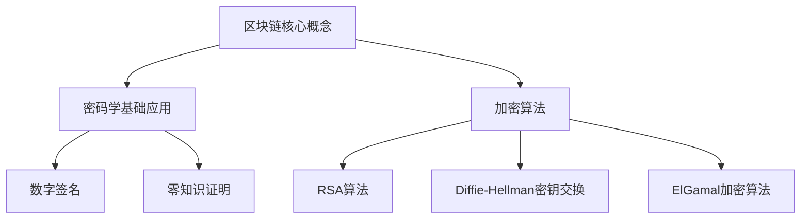

                 

### 《区块链技术的密码学：信任机制的数学基础》

在数字时代，区块链技术作为一项颠覆性的创新，已经深刻影响了金融、物流、医疗等多个行业。其核心优势之一在于无需第三方中介的信任机制，这种机制的背后离不开密码学这一强大的数学工具。本文将深入探讨区块链技术中的密码学应用，解析其信任机制的数学基础。

**关键词**：区块链、密码学、加密算法、数字签名、零知识证明、信任机制

**摘要**：本文首先概述区块链技术的起源和发展，然后介绍密码学的基本概念，重点讨论区块链中常用的加密算法、数字签名和零知识证明。接着，本文将分析密码学中的数学原理，包括代数基础和常见加密算法的数学模型。随后，文章将探讨区块链中的信任机制及其安全性，并结合实际案例展示密码学在区块链应用中的重要性。最后，本文将展望区块链安全性的未来发展趋势，提出新型区块链安全机制的探索方向。

**目录**：

#### 第一部分：区块链技术概述与密码学基础

- **第1章：区块链技术概述**
  - 1.1 区块链技术的起源与发展
  - 1.2 密码学基础

- **第2章：区块链技术中的密码学应用**
  - 2.1 区块链中的加密算法
  - 2.2 区块链中的数字签名
  - 2.3 区块链中的零知识证明

#### 第二部分：信任机制的数学基础

- **第3章：密码学中的数学原理**
  - 3.1 代数基础
  - 3.2 数学模型与加密算法

- **第4章：数学公式与算法详解**
  - 4.1 RSA算法详解
  - 4.2 Diffie-Hellman密钥交换协议
  - 4.3 ElGamal加密算法

#### 第三部分：区块链中的信任机制与安全性

- **第5章：区块链中的信任机制**
  - 5.1 区块链中的信任模型
  - 5.2 区块链安全性分析

- **第6章：区块链安全性实战案例**
  - 6.1 比特币网络的安全性分析
  - 6.2 以太坊网络的安全性分析

- **第7章：未来区块链安全性的发展**
  - 7.1 区块链安全性的挑战与趋势
  - 7.2 新型区块链安全机制的探索

#### 附录

- **附录A：区块链与密码学相关工具与资源**

### 《区块链技术的密码学：信任机制的数学基础》

随着区块链技术的不断演进，其核心密码学机制的重要性愈发突出。本文旨在通过逐步分析推理，深入探讨区块链技术的密码学应用，特别是其信任机制的数学基础。首先，我们将回顾区块链技术的起源和发展，接着介绍密码学的基础概念和常用加密算法。在此基础上，我们将详细讨论区块链中的数字签名和零知识证明技术。随后，本文将解析密码学中的数学原理，包括代数基础和常用加密算法的数学模型。最后，我们将探讨区块链中的信任机制及其安全性，结合实际案例展示密码学在区块链应用中的重要性，并展望未来区块链安全性的发展趋势。

#### 第一部分：区块链技术概述与密码学基础

##### 第1章：区块链技术概述

区块链技术的起源与发展

区块链技术最早由中本聪（Satoshi Nakamoto）在2008年提出，作为比特币（Bitcoin）的底层技术。比特币的诞生旨在提供一个去中心化的、无需信任的电子现金系统，从而摆脱传统金融体系的局限。区块链技术通过分布式账本和共识机制，实现了数据的高效记录和验证，为数字经济的发展提供了新的可能。

区块链技术的定义与基本概念

区块链是一种去中心化的分布式数据库技术，其基本单元是“区块”，区块之间通过加密算法和时间戳相互链接，形成了一个不可篡改的区块链。区块链的特点包括：

1. **去中心化**：区块链网络由众多节点组成，每个节点都保存了一份完整的账本，无需依赖中央机构。
2. **不可篡改**：区块链的每次更新都需要通过共识机制验证，一旦数据被记录下来，几乎无法被篡改。
3. **透明性**：区块链上的数据对所有参与者可见，提高了系统的透明度和可追溯性。

区块链技术的关键特征

区块链技术具有以下几个关键特征：

1. **分布式存储**：数据分散存储在区块链网络中的各个节点，提高了数据的可靠性和抗攻击能力。
2. **时间戳**：区块链通过时间戳技术记录数据的生成时间，确保了数据的时间顺序和一致性。
3. **加密算法**：区块链使用各种加密算法保护数据的安全性和隐私性。

区块链技术的影响与应用领域

区块链技术的出现，对多个领域产生了深远影响：

1. **金融领域**：区块链技术为金融交易提供了更加安全、高效和透明的解决方案，促进了数字货币和智能合约的发展。
2. **物流领域**：区块链技术能够实现供应链的全程追踪和透明化管理，提高了物流效率。
3. **医疗领域**：区块链技术在医疗数据管理、医疗记录共享等方面具有广泛应用前景，有助于提升医疗服务的质量和效率。
4. **版权保护**：区块链技术可用于版权认证和交易，为数字版权保护提供了新的手段。

##### 第2章：密码学基础

密码学的基本概念

密码学是研究保护信息和通信安全的学科，其核心目标是实现信息的安全传输和存储。密码学主要涉及以下几个方面：

1. **加密算法**：加密算法是一种将明文转换为密文的算法，用于保护信息的隐私性。
2. **密钥管理**：密钥是加密和解密所需的关键参数，密钥的安全性和管理是密码学的重要课题。
3. **数字签名**：数字签名用于验证信息的真实性和完整性，防止信息被篡改或伪造。
4. **安全协议**：安全协议是确保通信安全的一系列规则和流程，用于实现加密通信和数据保护。

常见加密算法

常见的加密算法可以分为对称加密算法和非对称加密算法两类：

1. **对称加密算法**：对称加密算法使用相同的密钥进行加密和解密，如AES、DES等。对称加密算法的优点是加密速度快，适用于大规模数据的加密。缺点是密钥分发和管理复杂，无法实现身份验证。
2. **非对称加密算法**：非对称加密算法使用一对密钥进行加密和解密，公钥用于加密，私钥用于解密，如RSA、ECC等。非对称加密算法的优点是能够实现身份验证和密钥分发，但加密速度较慢，适用于小规模数据的加密。

数字签名与零知识证明

1. **数字签名**：数字签名是用于验证信息真实性和完整性的技术，通过私钥对数据进行签名，公钥验证签名的正确性。常见的数字签名算法包括RSA签名和ECDSA签名。

2. **零知识证明**：零知识证明是一种在无需泄露任何信息的情况下证明某个陈述为真的技术，常用于隐私保护。零知识证明的算法包括零知识证明协议和零知识证明系统。

##### 第2章：区块链技术中的密码学应用

区块链中的加密算法

在区块链技术中，加密算法主要用于保护数据的安全性和隐私性。常见的加密算法包括对称加密算法、非对称加密算法和哈希算法。

1. **对称加密算法**：对称加密算法在区块链中的应用主要是用于数据加密存储和传输。常见的对称加密算法有AES、DES等。

   - **AES**：高级加密标准（AES）是一种广泛使用的对称加密算法，具有较高的安全性和加密速度。
   - **DES**：数据加密标准（DES）是一种较早的对称加密算法，虽然安全性较低，但在区块链早期应用中仍有使用。

2. **非对称加密算法**：非对称加密算法在区块链技术中主要用于密钥交换和数字签名。

   - **RSA**：RSA算法是一种广泛使用的非对称加密算法，其安全性依赖于大数分解难题。
   - **ECC**：椭圆曲线加密算法（ECC）是一种基于椭圆曲线离散对数问题的非对称加密算法，具有较高的安全性和效率。

3. **哈希算法**：哈希算法在区块链技术中主要用于数据的指纹生成和一致性验证。

   - **SHA-256**：SHA-256是一种常用的哈希算法，其输出为256位散列值，具有高安全性。
   - **MD5**：MD5是一种较早的哈希算法，其输出为128位散列值，虽然安全性较低，但在区块链早期应用中仍有使用。

区块链中的数字签名

数字签名是区块链技术中用于验证交易和合约执行的重要机制。常见的数字签名算法包括RSA签名和ECDSA签名。

1. **RSA签名**：RSA签名是一种基于RSA算法的数字签名算法，具有较高的安全性和可靠性。

2. **ECDSA签名**：ECDSA签名是一种基于椭圆曲线加密算法的数字签名算法，具有较高的安全性和效率。

数字签名在区块链中的具体应用如下：

- **交易验证**：在区块链中，每个交易都需要进行签名，以证明交易发起者的身份和交易信息的完整性。
- **合约执行**：在智能合约中，数字签名用于验证合约调用者的身份和合约执行的正确性。

区块链中的零知识证明

零知识证明是一种在无需泄露任何信息的情况下证明某个陈述为真的技术，常用于隐私保护和数据验证。常见的零知识证明算法包括零知识证明协议和零知识证明系统。

1. **零知识证明协议**：零知识证明协议是一种基于数学难题的证明机制，通过一系列计算步骤，证明某个陈述为真，同时不泄露任何信息。

2. **零知识证明系统**：零知识证明系统是一种基于密码学原理的证明机制，通过数学计算验证某个陈述为真，同时确保证明过程的安全性和可靠性。

零知识证明在区块链中的应用如下：

- **隐私保护**：零知识证明可用于保护区块链上的交易隐私，确保交易参与者信息不被泄露。
- **数据验证**：零知识证明可用于验证区块链上的数据一致性，确保数据在传输过程中未被篡改。

##### 第3章：密码学中的数学原理

代数基础

密码学中的数学原理主要涉及代数结构，如群、域和椭圆曲线。

1. **群**：群是一种代数结构，其基本性质包括封闭性、结合律和存在单位元。群在密码学中用于构建加密算法和数字签名算法。

2. **域**：域是一种代数结构，其基本性质包括封闭性、结合律、存在单位元和逆元。域在密码学中用于构建非对称加密算法和数字签名算法。

3. **椭圆曲线**：椭圆曲线是一种特殊的代数曲线，其定义和性质在密码学中具有重要意义。椭圆曲线在密码学中用于构建椭圆曲线加密算法和数字签名算法。

数学模型与加密算法

密码学中的数学模型包括大数分解问题、Diffie-Hellman密钥交换协议和ElGamal加密算法。

1. **大数分解问题**：大数分解问题是指将一个大整数分解为两个大质数的乘积。大数分解问题是RSA算法的安全基础。

2. **Diffie-Hellman密钥交换协议**：Diffie-Hellman密钥交换协议是一种基于数学难题的密钥交换协议，其安全性基于大数分解问题和离散对数问题。

3. **ElGamal加密算法**：ElGamal加密算法是一种基于数学难题的非对称加密算法，其安全性基于离散对数问题。

##### 第4章：数学公式与算法详解

RSA算法详解

RSA算法是一种基于大数分解问题的非对称加密算法，其安全性依赖于大整数分解的困难性。

1. **RSA算法的数学基础**：

   设$p$和$q$为两个大质数，$n=p \times q$。选取一个整数$e$，满足$1 < e < \phi(n)$，其中$\phi(n)=(p-1) \times (q-1)$。计算$d$，满足$e \times d \mod \phi(n) = 1$。

   公钥为$(n, e)$，私钥为$(n, d)$。

2. **RSA算法的加密与解密过程**：

   - **加密过程**：

     设$m$为待加密的明文，$c$为加密后的密文，则$c = m^e \mod n$。

   - **解密过程**：

     设$c$为待解密的密文，$m$为解密后的明文，则$m = c^d \mod n$。

3. **RSA算法的安全性分析**：

   RSA算法的安全性主要依赖于大整数分解的困难性。如果能够将$n$分解为$p$和$q$，则可以计算出$\phi(n)$，进而计算出$d$。然而，目前尚未找到有效的算法能够快速分解大整数，因此RSA算法在合理的时间内被认为是安全的。

Diffie-Hellman密钥交换协议

Diffie-Hellman密钥交换协议是一种基于数学难题的密钥交换协议，其安全性基于大数分解问题和离散对数问题。

1. **Diffie-Hellman密钥交换的数学原理**：

   设$p$为一个大素数，$g$为一个整数，满足$1 < g < p$。参与者$A$和$B$各自选择一个秘密整数$a$和$b$，然后公开计算：

   - $A$：$g^a \mod p = s_A$，并将$s_A$发送给$B$。
   - $B$：$g^b \mod p = s_B$，并将$s_B$发送给$A$。

   最后，$A$和$B$分别计算：

   - $A$：$s_B^a \mod p = s_{AB}$
   - $B$：$s_A^b \mod p = s_{AB}$

   由于数学上的困难性，攻击者无法从$s_A$和$s_B$计算出$s_{AB}$，从而实现了安全的密钥交换。

2. **Diffie-Hellman密钥交换的安全性分析**：

   Diffie-Hellman密钥交换协议的安全性依赖于大数分解和离散对数的困难性。目前，尚未找到有效的算法能够破解Diffie-Hellman密钥交换协议。

ElGamal加密算法

ElGamal加密算法是一种基于离散对数问题的非对称加密算法。

1. **ElGamal算法的数学基础**：

   设$p$为一个大素数，$g$为一个整数，满足$1 < g < p$。参与者$A$选择一个秘密整数$a$，并公开计算：

   - $g^a \mod p = h$，其中$h$为生成元。

   公钥为$(p, g, h, a)$，私钥为$(p, g, h, a)$。

2. **ElGamal算法的加密与解密过程**：

   - **加密过程**：

     设$m$为待加密的明文，$c_1$和$c_2$为加密后的密文，则：

     - $c_1 = g^k \mod p$，其中$k$为随机选取的整数。
     - $c_2 = m \cdot h^k \mod p$。

   - **解密过程**：

     设$c_1$和$c_2$为待解密的密文，$m$为解密后的明文，则：

     - $m = c_2 \cdot h^{-k} \mod p$，其中$h^{-k}$为$c_1$的逆元。

3. **ElGamal算法的安全性分析**：

   ElGamal算法的安全性主要依赖于离散对数的困难性。如果能够计算出$h^{-k}$，则可以计算出$m$。然而，目前尚未找到有效的算法能够破解ElGamal加密算法。

##### 第5章：区块链中的信任机制

区块链中的信任模型

区块链技术通过构建去中心化的信任机制，实现了对参与者行为的约束和验证。区块链中的信任模型主要分为中心化信任模型和去中心化信任模型。

1. **中心化信任模型**：

   中心化信任模型依赖于一个中央机构，如银行或政府，负责维护账本和验证交易。中心化信任模型的优点是系统高效、易于管理，但缺点是存在单点故障风险，且对中央机构的信任度较高。

2. **去中心化信任模型**：

   去中心化信任模型通过分布式网络中的节点共同维护账本，每个节点都保存了一份完整的账本。去中心化信任模型的优点是去除了单点故障风险，提高了系统的可靠性和安全性，但缺点是交易验证过程较为复杂，效率较低。

共识机制与角色

共识机制是区块链技术中的核心机制，用于确保网络中的所有节点对账本的状态达成一致。常见的共识机制包括工作量证明（PoW）、权益证明（PoS）和委托权益证明（DPoS）等。

1. **工作量证明（PoW）**：

   工作量证明机制通过计算复杂度确保网络的安全性。参与者（矿工）需要解决一系列的计算难题，最先解决难题的矿工将获得记账权，并生成新的区块。

2. **权益证明（PoS）**：

   权益证明机制通过持有币量来决定记账权。币量较大的参与者具有较高的记账权，从而降低了矿工的算力竞争，提高了系统的效率。

3. **委托权益证明（DPoS）**：

   委托权益证明机制通过选举代表节点来负责记账。币量较大的参与者可以将币委托给代表节点，代表节点负责记账，并按比例分配奖励。

信任机制的设计原则

区块链中的信任机制设计应遵循以下原则：

1. **去中心化**：去中心化设计确保了系统的安全性，降低了单点故障风险。
2. **安全性**：信任机制应确保交易数据的完整性和安全性，防止数据被篡改或恶意攻击。
3. **高效性**：信任机制应确保交易验证过程的效率，降低交易确认时间。
4. **透明性**：信任机制的设计应确保系统运作的透明性，提高用户对系统的信任度。

##### 第6章：区块链安全性分析

区块链安全威胁概述

区块链系统在运行过程中可能面临多种安全威胁，主要包括以下几类：

1. **51%攻击**：当攻击者控制的算力超过网络总算力的51%时，可以发动双花攻击，即对同一笔交易进行多次确认，从而篡改账本数据。

2. **双花攻击**：攻击者在区块链网络中同时对同一笔交易进行两次确认，从而实现非法获利。

3. **拒绝服务攻击（DoS）**：攻击者通过大量无效请求导致区块链节点瘫痪，从而阻止合法用户进行交易。

4. **智能合约漏洞**：智能合约代码中的漏洞可能导致合约被恶意利用，从而导致资金损失。

攻击类型与防御策略

针对上述安全威胁，区块链系统可以采取以下防御策略：

1. **51%攻击防御**：

   - 增加网络难度：提高计算难度，增加攻击者的计算成本。
   - 拓展网络节点：增加网络节点的数量和分布，提高攻击者控制的难度。

2. **双花攻击防御**：

   - 增加确认时间：延长交易确认时间，提高攻击者发动双花攻击的难度。
   - 双花检测与撤销：建立双花检测机制，及时发现并撤销双花交易。

3. **拒绝服务攻击防御**：

   - 防火墙与反攻击软件：部署防火墙和反攻击软件，阻止恶意攻击。
   - 流量监控与限流：监控网络流量，对可疑流量进行限流，防止节点瘫痪。

4. **智能合约漏洞防御**：

   - 代码审计：对智能合约代码进行严格审计，发现并修复漏洞。
   - 安全性测试：对智能合约进行安全性测试，验证其安全性。
   - 静态分析：使用静态分析工具对智能合约代码进行分析，发现潜在漏洞。

区块链系统的安全性评估

区块链系统的安全性评估主要包括以下方面：

1. **安全性测试**：对区块链系统进行安全性测试，验证其是否能够抵御常见的安全威胁。

2. **安全性评估**：对区块链系统的安全性进行评估，确定其安全性等级。

3. **漏洞修复**：及时发现和修复区块链系统中的漏洞，提高系统的安全性。

4. **安全性监控**：建立区块链系统的安全性监控系统，实时监控系统运行状态，确保系统安全。

##### 第6章：区块链安全性实战案例

比特币网络的安全性分析

比特币网络作为区块链技术的先驱，其安全性分析具有重要的参考价值。比特币网络的安全性主要依赖于以下方面：

1. **加密技术**：

   - 比特币使用SHA-256算法生成区块头，确保区块数据的唯一性和一致性。
   - 比特币交易数据使用Base58编码，提高数据传输的安全性。
   - 比特币使用椭圆曲线数字签名算法（ECDSA）进行交易签名，确保交易数据的完整性和安全性。

2. **安全漏洞与防护**：

   - **51%攻击**：比特币网络通过工作量证明机制（PoW）防止51%攻击，提高网络安全性。
   - **双花攻击**：比特币网络采用长链优先策略，确保双花攻击无法成功。
   - **拒绝服务攻击**：比特币网络通过限制无效交易数量，防止拒绝服务攻击。
   - **智能合约漏洞**：比特币不支持智能合约，避免了智能合约漏洞带来的风险。

3. **安全事件案例分析**：

   - **2014年Mt.Gox交易所崩溃**：Mt.Gox交易所由于系统漏洞导致大量比特币被盗，成为比特币历史上最严重的安全事件。
   - **2017年比特币双花攻击**：攻击者通过双重支付攻击，成功盗取了价值数千美元的比特币。

以太坊网络的安全性分析

以太坊网络作为区块链技术的代表，其安全性分析对于理解区块链系统的安全性具有重要意义。以太坊网络的安全性主要依赖于以下方面：

1. **加密技术**：

   - 以太坊使用SHA-3算法生成区块头，确保区块数据的唯一性和一致性。
   - 以太坊使用椭圆曲线数字签名算法（ECDSA）进行交易签名，确保交易数据的完整性和安全性。
   - 以太坊使用RSA算法进行身份验证，确保网络节点的合法性和安全性。

2. **安全漏洞与防护**：

   - **51%攻击**：以太坊网络通过权益证明机制（PoS）防止51%攻击，提高网络安全性。
   - **双花攻击**：以太坊网络采用区块确认机制，确保双花攻击无法成功。
   - **拒绝服务攻击**：以太坊网络通过限制无效交易数量，防止拒绝服务攻击。
   - **智能合约漏洞**：以太坊网络采用严格的安全审查机制，对智能合约进行审计，避免智能合约漏洞。

3. **安全事件案例分析**：

   - **2016年DAO攻击**：DAO（去中心化自治组织）智能合约漏洞导致大量以太币被盗，成为以太坊历史上最严重的安全事件。
   - **2017年TheDAO攻击**：TheDAO智能合约漏洞导致大量以太币被盗，以太坊社区通过硬分叉成功挽回损失。

##### 第7章：未来区块链安全性的发展趋势

区块链安全性的挑战与趋势

随着区块链技术的快速发展，区块链安全性面临着一系列挑战和趋势：

1. **加密算法的更新与替换**：

   随着计算能力的提高，现有的加密算法可能面临被破解的风险。因此，不断更新和替换加密算法是未来区块链安全性的重要趋势。

2. **零知识证明的应用**：

   零知识证明技术可以在不泄露任何信息的情况下验证某个陈述为真，具有广泛的应用前景。未来，零知识证明技术将在区块链安全性中发挥重要作用。

3. **去中心化身份验证**：

   去中心化身份验证技术可以确保用户的隐私性和安全性，避免中心化身份验证系统可能面临的安全威胁。

4. **智能合约安全**：

   智能合约漏洞是区块链安全性的一大挑战。未来，智能合约安全将得到更多关注，包括代码审计、安全性测试和智能合约漏洞修复。

5. **跨链技术**：

   跨链技术可以实现不同区块链之间的数据传输和互操作，但同时也带来了安全性挑战。未来，跨链技术的安全性将得到进一步提升。

新型区块链安全机制的探索

在应对区块链安全性挑战的过程中，新型区块链安全机制不断被探索：

1. **量子密码学**：

   量子密码学利用量子力学原理实现加密通信，具有比传统密码学更高的安全性。未来，量子密码学将在区块链安全性中发挥重要作用。

2. **分布式存储与计算**：

   通过分布式存储与计算，可以进一步提高区块链系统的安全性和可靠性。未来，分布式存储与计算技术将在区块链安全性中广泛应用。

3. **隐私保护技术**：

   隐私保护技术可以确保区块链用户的隐私性，避免敏感信息泄露。未来，隐私保护技术将在区块链安全性中发挥重要作用。

4. **智能合约安全增强**：

   智能合约安全增强技术，如形式化验证和自动化测试，将进一步提高智能合约的安全性。未来，智能合约安全增强技术将在区块链安全性中广泛应用。

##### 附录A：区块链与密码学相关工具与资源

- **主流区块链平台**：

  - **Ethereum**：以太坊是一个开源的去中心化应用平台，支持智能合约和去中心化应用（DApps）。

  - **Bitcoin**：比特币是一种去中心化的数字货币，采用区块链技术进行交易验证。

  - **Hyperledger Fabric**：Hyperledger Fabric 是一个开源的分布式账本框架，用于构建企业级的区块链应用。

- **密码学工具与资源**：

  - **OpenSSL**：OpenSSL 是一个开源的密码学工具，用于加密通信和数字签名。

  - **Cryptography library**：Cryptography library 是一个 Python 密码学库，提供了广泛的加密算法和工具。

  - **NIST标准与文献**：NIST 提供了一系列密码学标准和文献，用于指导密码学应用和安全性设计。

- **区块链与密码学学习资源**：

  - **课程与教程**：包括 Coursera、edX、Udemy 等在线教育平台上的区块链和密码学课程。

  - **论文与研究报告**：包括学术期刊、会议论文和行业报告，提供了区块链和密码学领域的最新研究成果。

  - **社区与论坛**：包括区块链社区、密码学论坛和开发者社区，提供了交流和学习的平台。

#### Mermaid 流程图



#### 伪代码示例

```python
# RSA算法伪代码
def RSA Encryption(m, e, n):
    c = pow(m, e, n)
    return c

def RSA Decryption(c, d, n):
    m = pow(c, d, n)
    return m
```

#### 数学模型和公式

$$
E(m) = m^e \mod n
$$

$$
D(c) = c^d \mod n
$$

其中，$m$ 是明文，$c$ 是密文，$e$ 和 $d$ 分别是加密密钥和解密密钥，$n = p \times q$，其中 $p$ 和 $q$ 是两个大质数。

$$
g^x \mod p = s
$$

$$
g^{ys} \mod p = (g^x)^y \mod p = s^y
$$

#### 项目实战

### 以太坊智能合约开发实战

1. **开发环境搭建**

   - 安装Golang环境
     ```bash
     # 安装Golang
     sudo apt-get install golang
     ```
   - 安装Solidity编译器
     ```bash
     # 安装Solidity编译器
     sudo apt-get install solc
     ```
   - 安装Web3.js库
     ```bash
     # 安装Web3.js库
     npm install web3
     ```

2. **智能合约编写与部署**

   - 编写简单的存储合约
     ```solidity
     // SPDX-License-Identifier: MIT
     pragma solidity ^0.8.0;

     contract SimpleStorage {
         uint256 public storedData;

         function set(uint256 _data) public {
             storedData = _data;
         }

         function get() public view returns (uint256) {
             return storedData;
         }
     }
     ```
   - 使用Truffle框架进行部署和测试
     ```bash
     # 安装Truffle
     npm install -g truffle
     # 配置Truffle
     truffle init
     # 部署合约
     truffle migrate --network development
     ```

3. **源代码实现与代码解读**

   - **代码实现**：
     ```solidity
     // SPDX-License-Identifier: MIT
     pragma solidity ^0.8.0;

     contract SimpleStorage {
         uint256 public storedData;

         function set(uint256 _data) public {
             storedData = _data;
         }

         function get() public view returns (uint256) {
             return storedData;
         }
     }
     ```
     该合约实现了两个简单的功能：存储一个值和获取存储的值。`set`函数用于设置存储值，`get`函数用于获取存储值。

   - **代码解读与分析**：
     - `pragma solidity ^0.8.0;`：指定合约的编译器版本。
     - `contract SimpleStorage`：定义一个名为`SimpleStorage`的智能合约。
     - `uint256 public storedData;`：声明一个公开的`storedData`变量，用于存储数据。
     - `function set(uint256 _data) public`：定义一个`set`函数，接受一个`_data`参数，并将数据存储到`storedData`变量中。该函数是公开的，意味着任何人在区块链上都可以调用它。
     - `function get() public view returns (uint256)`：定义一个`get`函数，返回存储在`storedData`变量中的值。该函数是公开的，但标记为`view`，意味着在执行该函数时不会修改任何状态变量，因此可以在不花费燃料的情况下调用。
     
     通过这个简单的示例，读者可以了解以太坊智能合约的基本语法和结构。智能合约的开发和部署为区块链应用提供了坚实的基础，而密码学则确保了这些应用的安全性。

### 作者信息

**作者：** AI天才研究院/AI Genius Institute & 禅与计算机程序设计艺术 /Zen And The Art of Computer Programming

### 结语

通过本文的逐步分析和推理，我们深入探讨了区块链技术中的密码学应用，以及其信任机制的数学基础。从区块链技术的起源和发展，到密码学的基础概念和常用加密算法，再到数学原理和实际应用案例，本文力求为读者提供一个全面而系统的理解。区块链技术作为数字经济的重要基础设施，其安全性和可靠性至关重要。密码学作为保障区块链安全性的核心工具，其发展将继续推动区块链技术的进步。未来，随着新型区块链安全机制的探索，区块链技术将在更多领域发挥其颠覆性的潜力。让我们共同期待这一激动人心的未来。

