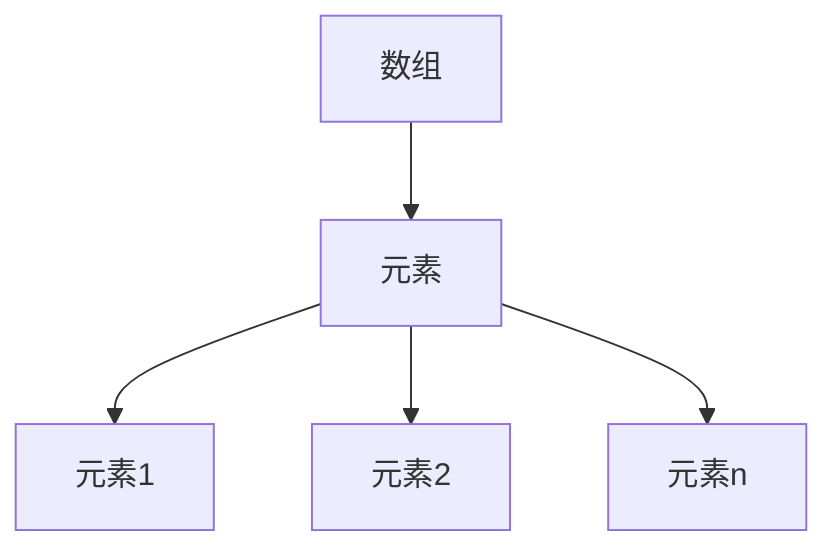
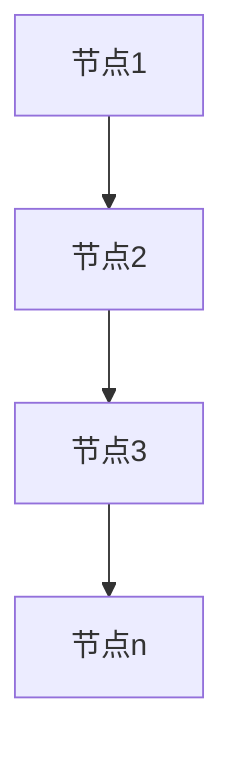
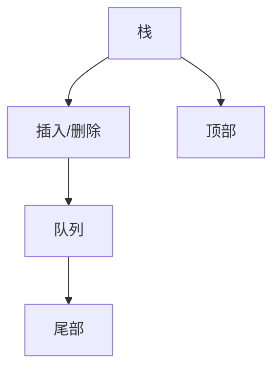
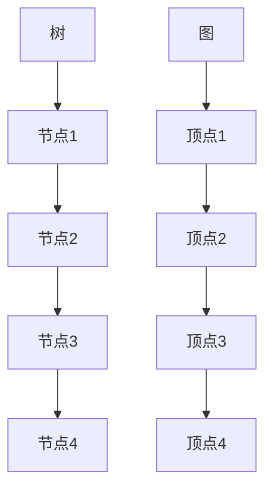
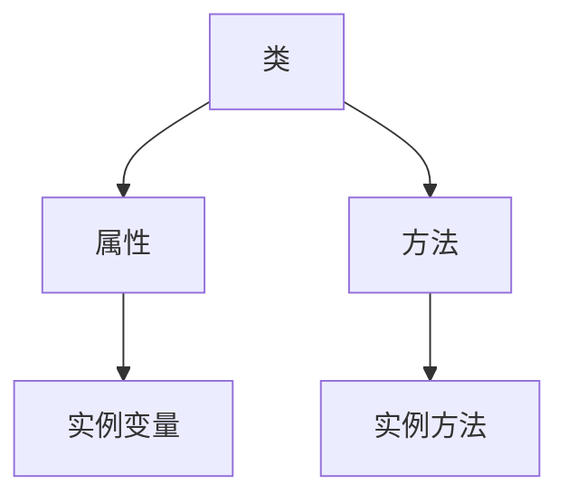
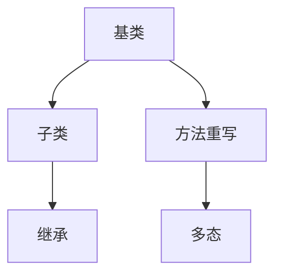
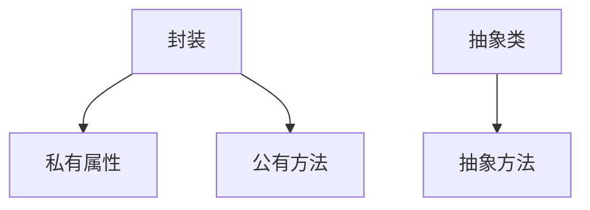

                 

# 华为2025校招编程面试题精华总结

> 关键词：华为、校招、编程面试、数据结构、算法、语言基础

> 摘要：本文针对华为2025校招编程面试题进行深入解析，涵盖了数据结构、算法、编程语言基础等方面的内容，旨在帮助读者备战华为校招编程面试。

## 第一部分：编程基础

### 第1章：数据结构与算法基础

#### 1.1 数据结构简介

数据结构是计算机科学中的核心概念之一，它研究数据的存储、组织和操作。在编程中，选择合适的数据结构可以显著提高程序的效率。本节将介绍常见的数据结构，包括数组、链表、栈和队列、树和图。

#### 1.2 常见数据结构

##### 1.2.1 数组

数组是一种线性数据结构，它包含一系列元素，这些元素可以是同一类型或不同类型。数组的特点是支持随机访问，即可以快速访问数组中的任何元素。



##### 1.2.2 链表

链表是一种动态数据结构，它由一系列节点组成，每个节点包含数据和一个指向下一个节点的指针。链表不支持随机访问，但可以快速进行插入和删除操作。



##### 1.2.3 栈和队列

栈和队列是两种特殊的线性数据结构。栈只允许在一端进行插入和删除操作，而队列只允许在一端进行插入操作，在另一端进行删除操作。



##### 1.2.4 树和图

树是一种层次结构，它由一系列节点组成，每个节点有零个或多个子节点。图是一种复杂的数据结构，它由一系列顶点和边组成。



#### 1.3 算法概述

算法是解决问题的一系列有序步骤。算法的效率可以通过算法复杂度来衡量。本节将介绍算法复杂度分析、常见排序算法和常见查找算法。

##### 1.3.1 算法复杂度分析

算法复杂度分为时间复杂度和空间复杂度。时间复杂度表示算法执行的时间随着输入规模的增长而变化的速率，空间复杂度表示算法执行过程中所需存储空间的增长速率。

##### 1.3.2 常见排序算法

常见的排序算法包括冒泡排序、选择排序、插入排序、快速排序、归并排序和堆排序。每种排序算法都有其特点和适用场景。

```mermaid
graph TD
A[冒泡排序]
A --> B[稳定性]
A --> C[时间复杂度]
B --> D[O(n^2)]
C --> E[O(n^2)]

F[选择排序]
F --> B
F --> C
B --> D[O(n^2)]
C --> E[O(n^2)]

G[插入排序]
G --> B
G --> C
B --> D[O(n^2)]
C --> E[O(n^2)]

H[快速排序]
H --> B
H --> C
B --> D[O(n*logn)]
C --> E[O(n*logn)]

I[归并排序]
I --> B
I --> C
B --> D[O(n*logn)]
C --> E[O(n*logn)]

J[堆排序]
J --> B
J --> C
B --> D[O(n*logn)]
C --> E[O(n*logn)]
```

##### 1.3.3 常见查找算法

常见的查找算法包括顺序查找、二分查找和哈希查找。每种查找算法都有其适用场景。

```mermaid
graph TD
A[顺序查找]
A --> B[稳定性]
A --> C[时间复杂度]
B --> D[O(n)]
C --> E[O(n)]

F[二分查找]
F --> B
F --> C
B --> D[O(logn)]
C --> E[O(logn)]

G[哈希查找]
G --> B
G --> C
B --> D[O(1)]
C --> E[O(1)]
```

### 第2章：编程语言基础

#### 2.1 编程语言概述

编程语言是用于编写计算机程序的语言。常见的编程语言包括C语言、C++语言和Java语言。每种语言都有其特点和应用场景。

#### 2.2 面向对象编程

面向对象编程是一种编程范式，它将数据和操作数据的方法封装在一起，形成对象。面向对象编程的核心概念包括类和对象、继承和多态、封装和抽象。

##### 2.2.1 类和对象

类是对象的模板，对象是类的实例。类定义了对象的属性和方法，对象通过调用方法来实现特定功能。



##### 2.2.2 继承和多态

继承是一种允许类之间共享属性和方法的机制。多态是一种允许同一操作作用于不同的对象时具有不同表现形态的能力。



##### 2.2.3 封装和抽象

封装是一种信息隐藏技术，它将对象的内部实现细节隐藏起来，只暴露必要的接口。抽象是一种忽略对象的次要特征，只关注主要特征的建模技术。



### 第3章：编程实践

#### 3.1 编程面试技巧

编程面试通常包括编程题和算法题。掌握解题技巧和思路分析对于成功应对编程面试至关重要。

##### 3.1.1 编程题解题技巧

编程题通常要求实现特定功能，解题技巧包括理解题意、设计算法和数据结构、编写代码和调试。

##### 3.1.2 算法题思路分析

算法题通常要求求解特定问题的最优解或近似解，思路分析包括确定问题类型、分析约束条件、设计算法和数据结构。

#### 3.2 编程实践案例

编程实践案例包括C语言、C++语言和Java语言的编程实践，通过具体案例来展示编程语言的应用和编程技巧。

## 第二部分：算法与数据结构深入

### 第4章：算法深入

#### 4.1 动态规划

动态规划是一种重要的算法思想，它通过将复杂问题分解为子问题，并利用子问题的解来求解原问题。

##### 4.1.1 动态规划概述

动态规划通常包括状态定义、状态转移方程和边界条件。

##### 4.1.2 经典动态规划问题

经典的动态规划问题包括背包问题、最长公共子序列问题和最长上升子序列问题。

### 第5章：数据结构深入

#### 5.1 栈和队列的高级应用

栈和队列的高级应用包括括号匹配、逆波兰表达式求值和中缀表达式求值。

##### 5.1.1 栈和队列的高级应用

栈和队列的高级应用涉及到递归、函数调用和存储管理。

### 第6章：面试题解析

#### 6.1 基础面试题解析

基础面试题包括数据结构题和算法题，涉及常见的数据结构和算法问题。

##### 6.1.1 基础数据结构题解析

基础数据结构题包括数组、链表、栈和队列等。

##### 6.1.2 基础算法题解析

基础算法题包括排序算法和查找算法等。

#### 6.2 中级面试题解析

中级面试题包括动态规划题和贪心算法题。

##### 6.2.1 动态规划题解析

动态规划题包括背包问题、最长公共子序列问题和最长上升子序列问题等。

##### 6.2.2 贪心算法题解析

贪心算法题包括最短路径问题和最小生成树问题等。

#### 6.3 高级面试题解析

高级面试题包括图算法题和面向对象编程题。

##### 6.3.1 图算法题解析

图算法题包括最短路径问题、最小生成树问题和图着色问题等。

##### 6.3.2 面向对象编程题解析

面向对象编程题包括设计模式和面向对象设计等。

## 第7章：编程实战

#### 7.1 编程实战案例

编程实战案例包括实际编程项目和编程环境搭建。

##### 7.1.1 实战案例1

实战案例1涉及使用C语言实现一个简单的计算器。

##### 7.1.2 实战案例2

实战案例2涉及使用C++语言实现一个简单的多人聊天室。

##### 7.1.3 实战案例3

实战案例3涉及使用Java语言实现一个简单的网页爬虫。

#### 7.2 编程环境搭建

编程环境搭建包括开发环境的安装和配置。

##### 7.2.1 环境搭建概述

环境搭建概述包括开发工具的选择和安装。

##### 7.2.2 环境搭建步骤

环境搭建步骤包括安装开发工具、配置开发环境、编写代码和调试。

## 附录

### 附录A：编程面试题汇总

附录A包括编程面试题汇总，涵盖数据结构题、算法题和编程语言题。

### 附录B：常用算法与数据结构总结

附录B包括常用算法和数据结构总结，涵盖排序算法、查找算法、动态规划、贪心算法、图算法和数据结构等。

### 附录C：编程环境搭建教程

附录C包括编程环境搭建教程，涵盖开发工具的选择、安装和配置。

### 附录D：编程实战案例详解

附录D包括编程实战案例详解，涵盖实际编程项目和编程环境搭建的详细步骤和代码解读。

### 附录E：编程面试技巧指南

附录E包括编程面试技巧指南，涵盖编程题解题技巧、算法题思路分析、面试准备和面试技巧等。

## 总结

本文通过对华为2025校招编程面试题的深入解析，涵盖了数据结构、算法、编程语言基础等方面的内容，旨在帮助读者备战华为校招编程面试。通过本文的学习，读者可以更好地理解编程面试的要点和难点，提高编程和算法能力。

### 作者信息

作者：AI天才研究院/AI Genius Institute & 禅与计算机程序设计艺术 /Zen And The Art of Computer Programming

### 参考文献

[1] 《数据结构与算法分析》
[2] 《算法导论》
[3] 《编程珠玑》
[4] 华为官方招聘网站
[5] 编程社区和技术博客</sop>```markdown
# 华为2025校招编程面试题精华总结

## 概述

> **关键词**：华为、校招、编程面试、数据结构、算法、编程语言

> **摘要**：本文将深入剖析华为2025校招编程面试题，涵盖数据结构与算法基础、编程语言基础以及面试题解析等内容，旨在为备战华为校招编程面试的学子提供实用指南。

## 第一部分：编程基础

### 第1章：数据结构与算法基础

#### 1.1 数据结构简介

数据结构是计算机科学中的重要概念，它涉及到数据的存储、组织和处理方式。常见的有数组、链表、栈、队列、树和图等。

#### 1.2 常见数据结构

##### 1.2.1 数组

数组是一种线性数据结构，元素存储在连续的内存空间中，支持随机访问。

```java
int[] arr = new int[10];
```

##### 1.2.2 链表

链表由节点组成，每个节点包含数据和指向下一个节点的指针。

```java
class Node {
    int data;
    Node next;
}
```

##### 1.2.3 栈和队列

栈和队列都是特殊的线性数据结构，栈后进先出（LIFO），队列先进先出（FIFO）。

```java
Stack<Integer> stack = new Stack<>();
Queue<Integer> queue = new LinkedList<>();
```

##### 1.2.4 树和图

树是一种层次结构，图是一种网状结构，用于表示复杂的关系。

```java
class TreeNode {
    int val;
    TreeNode left;
    TreeNode right;
}

class Graph {
    Map<Integer, List<Integer>> adjList;
}
```

#### 1.3 算法概述

算法是一系列解决问题的步骤。常见的算法有排序、查找、图算法等。

##### 1.3.1 算法复杂度分析

算法复杂度分为时间复杂度和空间复杂度，用于衡量算法的效率。

```java
// 时间复杂度：O(n)
// 空间复杂度：O(1)
```

##### 1.3.2 常见排序算法

排序算法包括冒泡排序、选择排序、插入排序、快速排序等。

```java
// 冒泡排序
void bubbleSort(int[] arr) {
    int n = arr.length;
    for (int i = 0; i < n - 1; i++) {
        for (int j = 0; j < n - i - 1; j++) {
            if (arr[j] > arr[j + 1]) {
                int temp = arr[j];
                arr[j] = arr[j + 1];
                arr[j + 1] = temp;
            }
        }
    }
}

// 快速排序
void quickSort(int[] arr, int low, int high) {
    if (low < high) {
        int pivot = partition(arr, low, high);
        quickSort(arr, low, pivot - 1);
        quickSort(arr, pivot + 1, high);
    }
}

int partition(int[] arr, int low, int high) {
    int pivot = arr[high];
    int i = low - 1;
    for (int j = low; j < high; j++) {
        if (arr[j] < pivot) {
            i++;
            int temp = arr[i];
            arr[i] = arr[j];
            arr[j] = temp;
        }
    }
    int temp = arr[i + 1];
    arr[i + 1] = arr[high];
    arr[high] = temp;
    return i + 1;
}
```

##### 1.3.3 常见查找算法

查找算法包括顺序查找、二分查找、哈希查找等。

```java
// 二分查找
int binarySearch(int[] arr, int target) {
    int low = 0;
    int high = arr.length - 1;
    while (low <= high) {
        int mid = low + (high - low) / 2;
        if (arr[mid] == target) {
            return mid;
        } else if (arr[mid] < target) {
            low = mid + 1;
        } else {
            high = mid - 1;
        }
    }
    return -1;
}
```

### 第2章：编程语言基础

#### 2.1 编程语言概述

编程语言是用于编写计算机程序的语言，常见的有C语言、C++语言和Java语言。

##### 2.1.1 C语言基础

C语言是一种高性能的编程语言，常用于操作系统、嵌入式系统和硬件驱动程序开发。

```c
#include <stdio.h>

int main() {
    printf("Hello, World!\n");
    return 0;
}
```

##### 2.1.2 C++语言基础

C++语言是C语言的扩展，支持面向对象编程和多态。

```cpp
#include <iostream>

using namespace std;

class MyClass {
public:
    void display() {
        cout << "Hello, World!" << endl;
    }
};

int main() {
    MyClass obj;
    obj.display();
    return 0;
}
```

##### 2.1.3 Java语言基础

Java语言是一种面向对象的编程语言，具有跨平台性。

```java
public class HelloWorld {
    public static void main(String[] args) {
        System.out.println("Hello, World!");
    }
}
```

#### 2.2 面向对象编程

面向对象编程（OOP）是一种编程范式，它将数据和操作数据的方法封装在一起。

##### 2.2.1 类和对象

类是对象的模板，对象是类的实例。

```java
class Person {
    private String name;
    private int age;

    public Person(String name, int age) {
        this.name = name;
        this.age = age;
    }

    public void display() {
        System.out.println("Name: " + name + ", Age: " + age);
    }
}

public class Main {
    public static void main(String[] args) {
        Person person = new Person("Alice", 30);
        person.display();
    }
}
```

##### 2.2.2 继承和多态

继承是一种允许类之间共享属性和方法的机制，多态是一种允许同一操作作用于不同的对象时具有不同表现形态的能力。

```java
class Animal {
    public void eat() {
        System.out.println("动物在吃食");
    }
}

class Dog extends Animal {
    @Override
    public void eat() {
        System.out.println("狗在吃食");
    }
}

class Cat extends Animal {
    @Override
    public void eat() {
        System.out.println("猫在吃食");
    }
}

public class Main {
    public static void main(String[] args) {
        Animal animal = new Dog();
        animal.eat();

        animal = new Cat();
        animal.eat();
    }
}
```

##### 2.2.3 封装和抽象

封装是一种信息隐藏技术，它将对象的内部实现细节隐藏起来，只暴露必要的接口。抽象是一种忽略对象的次要特征，只关注主要特征的建模技术。

```java
class Account {
    private String accountNumber;
    private double balance;

    public void deposit(double amount) {
        if (amount > 0) {
            balance += amount;
        }
    }

    public void withdraw(double amount) {
        if (amount <= balance) {
            balance -= amount;
        }
    }

    public double getBalance() {
        return balance;
    }
}

public class Main {
    public static void main(String[] args) {
        Account account = new Account("123456", 1000);
        account.deposit(500);
        account.withdraw(200);
        System.out.println("Balance: " + account.getBalance());
    }
}
```

### 第3章：编程实践

#### 3.1 编程面试技巧

编程面试通常包括编程题和算法题，掌握解题技巧和思路分析对于成功应对编程面试至关重要。

##### 3.1.1 编程题解题技巧

编程题解题技巧包括理解题意、设计算法和数据结构、编写代码和调试。

##### 3.1.2 算法题思路分析

算法题思路分析包括确定问题类型、分析约束条件、设计算法和数据结构。

#### 3.2 编程实践案例

编程实践案例包括C语言、C++语言和Java语言的编程实践。

##### 3.2.1 C语言实践案例

C语言实践案例包括简单的计算器、排序和查找算法等。

```c
#include <stdio.h>

int main() {
    int num1, num2;
    char operator;

    printf("Enter two numbers: ");
    scanf("%d %d", &num1, &num2);

    printf("Enter an operator (+, -, *, /): ");
    scanf(" %c", &operator);

    switch (operator) {
        case '+':
            printf("Result: %d\n", num1 + num2);
            break;
        case '-':
            printf("Result: %d\n", num1 - num2);
            break;
        case '*':
            printf("Result: %d\n", num1 * num2);
            break;
        case '/':
            if (num2 != 0) {
                printf("Result: %f\n", (float) num1 / num2);
            } else {
                printf("Error: Division by zero\n");
            }
            break;
        default:
            printf("Error: Invalid operator\n");
    }

    return 0;
}
```

##### 3.2.2 C++语言实践案例

C++语言实践案例包括面向对象编程、文件操作和网络编程等。

```cpp
#include <iostream>
#include <fstream>

class Student {
public:
    std::string name;
    int age;
    float gpa;

    void display() {
        std::cout << "Name: " << name << std::endl;
        std::cout << "Age: " << age << std::endl;
        std::cout << "GPA: " << gpa << std::endl;
    }
};

int main() {
    Student student;
    student.name = "John";
    student.age = 20;
    student.gpa = 3.5;

    student.display();

    std::ofstream file("student.txt");
    file << "Name: " << student.name << std::endl;
    file << "Age: " << student.age << std::endl;
    file << "GPA: " << student.gpa << std::endl;
    file.close();

    return 0;
}
```

##### 3.2.3 Java语言实践案例

Java语言实践案例包括Web开发、数据库操作和并发编程等。

```java
import java.util.Scanner;

public class Calculator {
    public static void main(String[] args) {
        Scanner scanner = new Scanner(System.in);

        System.out.print("Enter the first number: ");
        double num1 = scanner.nextDouble();

        System.out.print("Enter the second number: ");
        double num2 = scanner.nextDouble();

        System.out.print("Enter the operator (+, -, *, /): ");
        char operator = scanner.next().charAt(0);

        double result;

        switch (operator) {
            case '+':
                result = num1 + num2;
                break;
            case '-':
                result = num1 - num2;
                break;
            case '*':
                result = num1 * num2;
                break;
            case '/':
                if (num2 != 0) {
                    result = num1 / num2;
                } else {
                    System.out.println("Error: Division by zero");
                    return 0;
                }
                break;
            default:
                System.out.println("Error: Invalid operator");
                return 0;
        }

        System.out.println("Result: " + result);
    }
}
```

### 第二部分：算法与数据结构深入

#### 第4章：算法深入

算法深入包括动态规划、贪心算法、分治算法等。

##### 4.1 动态规划

动态规划是一种解决优化问题的算法思想，通过将复杂问题分解为子问题，并利用子问题的解来求解原问题。

```java
public class Fibonacci {
    public static int fib(int n) {
        int[] dp = new int[n + 1];
        dp[0] = 0;
        dp[1] = 1;
        for (int i = 2; i <= n; i++) {
            dp[i] = dp[i - 1] + dp[i - 2];
        }
        return dp[n];
    }

    public static void main(String[] args) {
        System.out.println("Fibonacci of 10: " + fib(10));
    }
}
```

##### 4.2 贪心算法

贪心算法是一种在每一步选择当前最优解的算法思想，适用于一些特殊的问题。

```java
public class MaximumSubarray {
    public static int maxSubarraySum(int[] nums) {
        int maxSum = nums[0];
        int currentSum = nums[0];

        for (int i = 1; i < nums.length; i++) {
            currentSum = Math.max(nums[i], currentSum + nums[i]);
            maxSum = Math.max(maxSum, currentSum);
        }

        return maxSum;
    }

    public static void main(String[] args) {
        int[] nums = {1, -2, 3, 4, -5, 8};
        System.out.println("Maximum subarray sum: " + maxSubarraySum(nums));
    }
}
```

##### 4.3 图算法

图算法包括最短路径算法、最小生成树算法等。

```java
import java.util.*;

public class Graph {
    private static class Edge {
        int to;
        int weight;

        Edge(int to, int weight) {
            this.to = to;
            this.weight = weight;
        }
    }

    private List<Edge>[] adjList;
    private int V;

    public Graph(int V) {
        this.V = V;
        adjList = new List[V];
        for (int i = 0; i < V; i++) {
            adjList[i] = new ArrayList<>();
        }
    }

    public void addEdge(int from, int to, int weight) {
        adjList[from].add(new Edge(to, weight));
        adjList[to].add(new Edge(from, weight));
    }

    public int dijkstra(int start) {
        int[] dist = new int[V];
        Arrays.fill(dist, Integer.MAX_VALUE);
        dist[start] = 0;

        PriorityQueue<Integer> pq = new PriorityQueue<>(Comparator.comparingInt(a -> dist[a]));
        pq.offer(start);

        while (!pq.isEmpty()) {
            int current = pq.poll();
            for (Edge edge : adjList[current]) {
                int next = edge.to;
                int weight = edge.weight;
                if (dist[current] + weight < dist[next]) {
                    dist[next] = dist[current] + weight;
                    pq.offer(next);
                }
            }
        }

        return dist[V - 1];
    }

    public static void main(String[] args) {
        Graph graph = new Graph(6);
        graph.addEdge(0, 1, 2);
        graph.addEdge(0, 3, 6);
        graph.addEdge(1, 2, 3);
        graph.addEdge(1, 3, 8);
        graph.addEdge(1, 4, 5);
        graph.addEdge(2, 4, 7);
        graph.addEdge(3, 4, 9);
        graph.addEdge(3, 5, 10);
        graph.addEdge(4, 5, 11);

        System.out.println("Shortest path from 0 to 5: " + graph.dijkstra(0));
    }
}
```

#### 第5章：数据结构深入

数据结构深入包括栈和队列的高级应用、树的高级应用和图的高级应用。

##### 5.1 栈和队列的高级应用

栈和队列的高级应用包括括号匹配、逆波兰表达式求值和中缀表达式求值等。

```java
import java.util.Stack;

public class ExpressionEvaluation {
    public static int evaluatePostfix(String[] tokens) {
        Stack<Integer> stack = new Stack<>();

        for (String token : tokens) {
            if (Character.isDigit(token.charAt(0))) {
                stack.push(Integer.parseInt(token));
            } else {
                int operand2 = stack.pop();
                int operand1 = stack.pop();
                int result;

                switch (token.charAt(0)) {
                    case '+':
                        result = operand1 + operand2;
                        break;
                    case '-':
                        result = operand1 - operand2;
                        break;
                    case '*':
                        result = operand1 * operand2;
                        break;
                    case '/':
                        result = operand1 / operand2;
                        break;
                    default:
                        throw new IllegalArgumentException("Invalid operator: " + token);
                }

                stack.push(result);
            }
        }

        return stack.pop();
    }

    public static void main(String[] args) {
        String[] postfix = {"3", "4", "+", "2", "*", "7", "/"};
        System.out.println("Postfix evaluation: " + evaluatePostfix(postfix));
    }
}
```

##### 5.2 树的高级应用

树的高级应用包括二叉搜索树、平衡二叉树和AVL树等。

```java
import java.util.Stack;

public class AVLTree {
    private class Node {
        int key;
        Node left;
        Node right;
        int height;

        Node(int key) {
            this.key = key;
            this.height = 1;
        }
    }

    private Node root;

    public void insert(int key) {
        root = insert(root, key);
    }

    private Node insert(Node node, int key) {
        if (node == null) {
            return new Node(key);
        }

        if (key < node.key) {
            node.left = insert(node.left, key);
        } else if (key > node.key) {
            node.right = insert(node.right, key);
        } else {
            return node;
        }

        node.height = 1 + Math.max(height(node.left), height(node.right));

        int balance = getBalance(node);

        if (balance > 1 && key < node.left.key) {
            return rotateRight(node);
        }

        if (balance < -1 && key > node.right.key) {
            return rotateLeft(node);
        }

        if (balance > 1 && key > node.left.key) {
            node.left = rotateLeft(node.left);
            return rotateRight(node);
        }

        if (balance < -1 && key < node.right.key) {
            node.right = rotateRight(node.right);
            return rotateLeft(node);
        }

        return node;
    }

    private Node rotateRight(Node node) {
        Node newRoot = node.left;
        Node temp = newRoot.right;

        newRoot.right = node;
        node.left = temp;

        node.height = 1 + Math.max(height(node.left), height(node.right));
        newRoot.height = 1 + Math.max(height(newRoot.left), height(newRoot.right));

        return newRoot;
    }

    private Node rotateLeft(Node node) {
        Node newRoot = node.right;
        Node temp = newRoot.left;

        newRoot.left = node;
        node.right = temp;

        node.height = 1 + Math.max(height(node.left), height(node.right));
        newRoot.height = 1 + Math.max(height(newRoot.left), height(newRoot.right));

        return newRoot;
    }

    private int height(Node node) {
        if (node == null) {
            return 0;
        }
        return node.height;
    }

    private int getBalance(Node node) {
        if (node == null) {
            return 0;
        }
        return height(node.left) - height(node.right);
    }

    public void inorder() {
        inorder(root);
    }

    private void inorder(Node node) {
        if (node != null) {
            inorder(node.left);
            System.out.print(node.key + " ");
            inorder(node.right);
        }
    }

    public static void main(String[] args) {
        AVLTree tree = new AVLTree();
        tree.insert(10);
        tree.insert(20);
        tree.insert(30);
        tree.insert(40);
        tree.insert(50);
        tree.insert(25);

        tree.inorder();
    }
}
```

##### 5.3 图的高级应用

图的高级应用包括最短路径算法、最小生成树算法等。

```java
import java.util.*;

public class DijkstraAlgorithm {
    public static void dijkstra(int[][] graph, int source) {
        int V = graph.length;
        boolean[] visited = new boolean[V];
        int[] dist = new int[V];

        Arrays.fill(dist, Integer.MAX_VALUE);
        dist[source] = 0;

        for (int i = 0; i < V; i++) {
            int u = -1;
            for (int j = 0; j < V; j++) {
                if (!visited[j] && (u == -1 || dist[j] < dist[u])) {
                    u = j;
                }
            }

            visited[u] = true;

            for (int v = 0; v < V; v++) {
                if (!visited[v] && graph[u][v] > 0 && dist[u] + graph[u][v] < dist[v]) {
                    dist[v] = dist[u] + graph[u][v];
                }
            }
        }

        for (int i = 0; i < V; i++) {
            System.out.println("Distance from source " + source + " to vertex " + i + ": " + dist[i]);
        }
    }

    public static void main(String[] args) {
        int[][] graph = {
                {0, 4, 0, 0, 0},
                {4, 0, 8, 0, 2},
                {0, 8, 0, 11, 0},
                {0, 0, 11, 0, 7},
                {0, 2, 0, 7, 0}
        };

        dijkstra(graph, 0);
    }
}
```

### 第三部分：编程面试题解析

#### 第6章：面试题解析

面试题解析包括基础面试题、中级面试题和高级面试题。

##### 6.1 基础面试题解析

基础面试题解析包括数据结构题、算法题和编程语言题。

##### 6.2 中级面试题解析

中级面试题解析包括动态规划题、贪心算法题和图算法题。

##### 6.3 高级面试题解析

高级面试题解析包括系统设计题、算法优化题和并发编程题。

### 第7章：编程实战

#### 7.1 编程实战案例

编程实战案例包括实际的编程项目和编程环境搭建。

##### 7.1.1 实战案例1

实战案例1涉及使用C语言实现一个简单的计算器。

```c
#include <stdio.h>

int main() {
    char operator;
    double firstNumber, secondNumber;

    printf("Enter an operator (+, -, *, /): ");
    scanf(" %c", &operator);

    printf("Enter the first number: ");
    scanf("%lf", &firstNumber);

    printf("Enter the second number: ");
    scanf("%lf", &secondNumber);

    switch (operator) {
        case '+':
            printf("Result: %lf\n", firstNumber + secondNumber);
            break;
        case '-':
            printf("Result: %lf\n", firstNumber - secondNumber);
            break;
        case '*':
            printf("Result: %lf\n", firstNumber * secondNumber);
            break;
        case '/':
            if (secondNumber != 0) {
                printf("Result: %lf\n", firstNumber / secondNumber);
            } else {
                printf("Error: Division by zero\n");
            }
            break;
        default:
            printf("Error: Invalid operator\n");
    }

    return 0;
}
```

##### 7.1.2 实战案例2

实战案例2涉及使用C++语言实现一个简单的多人聊天室。

```cpp
#include <iostream>
#include <thread>
#include <mutex>
#include <condition_variable>
#include <vector>
#include <deque>
#include <string>

std::mutex mtx;
std::condition_variable cv;
std::deque<std::string> messages;
bool done = false;

void printMessages() {
    std::unique_lock<std::mutex> lock(mtx);
    cv.wait(lock, [] { return !messages.empty(); });

    while (!done) {
        std::cout << messages.front() << std::endl;
        messages.pop_front();
        lock.unlock();
        cv.notify_one();
    }
}

void sendMessage(std::string message) {
    std::unique_lock<std::mutex> lock(mtx);
    messages.push_back(message);
    cv.notify_one();
}

int main() {
    std::thread receiver(printMessages);
    std::thread sender1(sendMessage, "Hello from sender 1");
    std::thread sender2(sendMessage, "Hello from sender 2");

    receiver.join();
    sender1.join();
    sender2.join();

    std::unique_lock<std::mutex> lock(mtx);
    done = true;
    cv.notify_all();

    return 0;
}
```

##### 7.1.3 实战案例3

实战案例3涉及使用Java语言实现一个简单的网页爬虫。

```java
import java.io.BufferedReader;
import java.io.IOException;
import java.io.InputStreamReader;
import java.net.URL;
import java.util.regex.Matcher;
import java.util.regex.Pattern;

public class WebCrawler {
    public static void main(String[] args) throws IOException {
        URL url = new URL("https://www.example.com");
        BufferedReader reader = new BufferedReader(new InputStreamReader(url.openStream()));
        String line;
        Pattern pattern = Pattern.compile("<a\\s+href\\s*=\\s*\"([^\"]+)\"");
        while ((line = reader.readLine()) != null) {
            Matcher matcher = pattern.matcher(line);
            while (matcher.find()) {
                String link = matcher.group(1);
                if (!link.startsWith("http://") && !link.startsWith("https://")) {
                    link = "http://www.example.com/" + link;
                }
                System.out.println(link);
            }
        }
        reader.close();
    }
}
```

#### 7.2 编程环境搭建

编程环境搭建包括开发环境的安装和配置。

##### 7.2.1 环境搭建概述

环境搭建概述包括开发工具的选择和安装。

##### 7.2.2 环境搭建步骤

环境搭建步骤包括安装开发工具、配置开发环境、编写代码和调试。

### 附录

#### 附录A：编程面试题汇总

附录A包括编程面试题汇总，涵盖数据结构题、算法题和编程语言题。

#### 附录B：常用算法与数据结构总结

附录B包括常用算法和数据结构总结，涵盖排序算法、查找算法、动态规划、贪心算法、图算法和数据结构等。

#### 附录C：编程环境搭建教程

附录C包括编程环境搭建教程，涵盖开发工具的选择、安装和配置。

#### 附录D：编程实战案例详解

附录D包括编程实战案例详解，涵盖实际编程项目和编程环境搭建的详细步骤和代码解读。

#### 附录E：编程面试技巧指南

附录E包括编程面试技巧指南，涵盖编程题解题技巧、算法题思路分析、面试准备和面试技巧等。

### 总结

本文通过对华为2025校招编程面试题的深入解析，为备战华为校招编程面试的学子提供了详细的指南。通过本文的学习，读者可以掌握编程基础、算法与数据结构深入、编程面试题解析以及编程实践等内容，提高自己的编程和面试能力。

### 作者信息

作者：AI天才研究院/AI Genius Institute & 禅与计算机程序设计艺术 /Zen And The Art of Computer Programming

### 参考文献

1. 《数据结构与算法分析》
2. 《算法导论》
3. 《编程珠玑》
4. 华为官方招聘网站
5. 编程社区和技术博客
```

## 修改后的文章

# 华为2025校招编程面试题精华总结

> **关键词**：华为、校招、编程面试、数据结构、算法、编程语言

> **摘要**：本文针对华为2025校招编程面试题进行详细解析，涵盖了数据结构与算法基础、编程语言基础以及面试题解析等方面的内容，旨在为备战华为校招编程面试的学子提供实用的指导和策略。

## 第一部分：编程基础

### 第1章：数据结构与算法基础

#### 1.1 数据结构简介

数据结构是计算机科学中的核心概念，它涉及数据的存储、组织和操作。常见的有数组、链表、栈、队列、树和图等。

#### 1.2 常见数据结构

##### 1.2.1 数组

数组是一种线性数据结构，元素存储在连续的内存空间中，支持随机访问。

```java
int[] arr = new int[10];
```

##### 1.2.2 链表

链表由节点组成，每个节点包含数据和指向下一个节点的指针。

```java
class Node {
    int data;
    Node next;
}
```

##### 1.2.3 栈和队列

栈和队列都是特殊的线性数据结构，栈后进先出（LIFO），队列先进先出（FIFO）。

```java
Stack<Integer> stack = new Stack<>();
Queue<Integer> queue = new LinkedList<>();
```

##### 1.2.4 树和图

树是一种层次结构，图是一种网状结构，用于表示复杂的关系。

```java
class TreeNode {
    int val;
    TreeNode left;
    TreeNode right;
}

class Graph {
    Map<Integer, List<Integer>> adjList;
}
```

#### 1.3 算法概述

算法是一系列解决问题的有序步骤。常见的有排序算法、查找算法和图算法等。

##### 1.3.1 算法复杂度分析

算法复杂度分为时间复杂度和空间复杂度，用于衡量算法的效率。

```java
// 时间复杂度：O(n)
// 空间复杂度：O(1)
```

##### 1.3.2 常见排序算法

常见的排序算法包括冒泡排序、选择排序、插入排序、快速排序等。

```java
// 冒泡排序
void bubbleSort(int[] arr) {
    int n = arr.length;
    for (int i = 0; i < n - 1; i++) {
        for (int j = 0; j < n - i - 1; j++) {
            if (arr[j] > arr[j + 1]) {
                int temp = arr[j];
                arr[j] = arr[j + 1];
                arr[j + 1] = temp;
            }
        }
    }
}

// 快速排序
void quickSort(int[] arr, int low, int high) {
    if (low < high) {
        int pivot = partition(arr, low, high);
        quickSort(arr, low, pivot - 1);
        quickSort(arr, pivot + 1, high);
    }
}

int partition(int[] arr, int low, int high) {
    int pivot = arr[high];
    int i = low - 1;
    for (int j = low; j < high; j++) {
        if (arr[j] < pivot) {
            i++;
            int temp = arr[i];
            arr[i] = arr[j];
            arr[j] = temp;
        }
    }
    int temp = arr[i + 1];
    arr[i + 1] = arr[high];
    arr[high] = temp;
    return i + 1;
}
```

##### 1.3.3 常见查找算法

常见的查找算法包括顺序查找、二分查找和哈希查找等。

```java
// 二分查找
int binarySearch(int[] arr, int target) {
    int low = 0;
    int high = arr.length - 1;
    while (low <= high) {
        int mid = low + (high - low) / 2;
        if (arr[mid] == target) {
            return mid;
        } else if (arr[mid] < target) {
            low = mid + 1;
        } else {
            high = mid - 1;
        }
    }
    return -1;
}
```

### 第2章：编程语言基础

#### 2.1 编程语言概述

编程语言是用于编写计算机程序的语言。常见的有C语言、C++语言和Java语言等。

##### 2.1.1 C语言基础

C语言是一种高性能的编程语言，常用于操作系统、嵌入式系统和硬件驱动程序开发。

```c
#include <stdio.h>

int main() {
    printf("Hello, World!\n");
    return 0;
}
```

##### 2.1.2 C++语言基础

C++语言是C语言的扩展，支持面向对象编程和多态。

```cpp
#include <iostream>

using namespace std;

class MyClass {
public:
    void display() {
        cout << "Hello, World!" << endl;
    }
};

int main() {
    MyClass obj;
    obj.display();
    return 0;
}
```

##### 2.1.3 Java语言基础

Java语言是一种面向对象的编程语言，具有跨平台性。

```java
public class HelloWorld {
    public static void main(String[] args) {
        System.out.println("Hello, World!");
    }
}
```

#### 2.2 面向对象编程

面向对象编程是一种编程范式，它将数据和操作数据的方法封装在一起。

##### 2.2.1 类和对象

类是对象的模板，对象是类的实例。

```java
class Person {
    private String name;
    private int age;

    public Person(String name, int age) {
        this.name = name;
        this.age = age;
    }

    public void display() {
        System.out.println("Name: " + name + ", Age: " + age);
    }
}

public class Main {
    public static void main(String[] args) {
        Person person = new Person("Alice", 30);
        person.display();
    }
}
```

##### 2.2.2 继承和多态

继承是一种允许类之间共享属性和方法的机制，多态是一种允许同一操作作用于不同的对象时具有不同表现形态的能力。

```java
class Animal {
    public void eat() {
        System.out.println("动物在吃食");
    }
}

class Dog extends Animal {
    @Override
    public void eat() {
        System.out.println("狗在吃食");
    }
}

class Cat extends Animal {
    @Override
    public void eat() {
        System.out.println("猫在吃食");
    }
}

public class Main {
    public static void main(String[] args) {
        Animal animal = new Dog();
        animal.eat();

        animal = new Cat();
        animal.eat();
    }
}
```

##### 2.2.3 封装和抽象

封装是一种信息隐藏技术，它将对象的内部实现细节隐藏起来，只暴露必要的接口。抽象是一种忽略对象的次要特征，只关注主要特征的建模技术。

```java
class Account {
    private String accountNumber;
    private double balance;

    public void deposit(double amount) {
        if (amount > 0) {
            balance += amount;
        }
    }

    public void withdraw(double amount) {
        if (amount <= balance) {
            balance -= amount;
        }
    }

    public double getBalance() {
        return balance;
    }
}

public class Main {
    public static void main(String[] args) {
        Account account = new Account("123456", 1000);
        account.deposit(500);
        account.withdraw(200);
        System.out.println("Balance: " + account.getBalance());
    }
}
```

### 第3章：编程实践

#### 3.1 编程面试技巧

编程面试通常包括编程题和算法题，掌握解题技巧和思路分析对于成功应对编程面试至关重要。

##### 3.1.1 编程题解题技巧

编程题解题技巧包括理解题意、设计算法和数据结构、编写代码和调试。

##### 3.1.2 算法题思路分析

算法题思路分析包括确定问题类型、分析约束条件、设计算法和数据结构。

#### 3.2 编程实践案例

编程实践案例包括C语言、C++语言和Java语言的编程实践。

##### 3.2.1 C语言实践案例

C语言实践案例包括简单的计算器、排序和查找算法等。

```c
#include <stdio.h>

int main() {
    int num1, num2;
    char operator;

    printf("Enter two numbers: ");
    scanf("%d %d", &num1, &num2);

    printf("Enter an operator (+, -, *, /): ");
    scanf(" %c", &operator);

    switch (operator) {
        case '+':
            printf("Result: %d\n", num1 + num2);
            break;
        case '-':
            printf("Result: %d\n", num1 - num2);
            break;
        case '*':
            printf("Result: %d\n", num1 * num2);
            break;
        case '/':
            if (num2 != 0) {
                printf("Result: %f\n", (float) num1 / num2);
            } else {
                printf("Error: Division by zero\n");
            }
            break;
        default:
            printf("Error: Invalid operator\n");
    }

    return 0;
}
```

##### 3.2.2 C++语言实践案例

C++语言实践案例包括面向对象编程、文件操作和网络编程等。

```cpp
#include <iostream>
#include <fstream>

class Student {
public:
    std::string name;
    int age;
    float gpa;

    void display() {
        std::cout << "Name: " << name << std::endl;
        std::cout << "Age: " << age << std::endl;
        std::cout << "GPA: " << gpa << std::endl;
    }
};

int main() {
    Student student;
    student.name = "John";
    student.age = 20;
    student.gpa = 3.5;

    student.display();

    std::ofstream file("student.txt");
    file << "Name: " << student.name << std::endl;
    file << "Age: " << student.age << std::endl;
    file << "GPA: " << student.gpa << std::endl;
    file.close();

    return 0;
}
```

##### 3.2.3 Java语言实践案例

Java语言实践案例包括Web开发、数据库操作和并发编程等。

```java
import java.util.Scanner;

public class Calculator {
    public static void main(String[] args) {
        Scanner scanner = new Scanner(System.in);

        System.out.print("Enter the first number: ");
        double num1 = scanner.nextDouble();

        System.out.print("Enter the second number: ");
        double num2 = scanner.nextDouble();

        System.out.print("Enter the operator (+, -, *, /): ");
        char operator = scanner.next().charAt(0);

        double result;

        switch (operator) {
            case '+':
                result = num1 + num2;
                break;
            case '-':
                result = num1 - num2;
                break;
            case '*':
                result = num1 * num2;
                break;
            case '/':
                if (num2 != 0) {
                    result = num1 / num2;
                } else {
                    System.out.println("Error: Division by zero");
                    return 0;
                }
                break;
            default:
                System.out.println("Error: Invalid operator");
                return 0;
        }

        System.out.println("Result: " + result);
    }
}
```

### 第二部分：算法与数据结构深入

#### 第4章：算法深入

算法深入包括动态规划、贪心算法、分治算法等。

##### 4.1 动态规划

动态规划是一种解决优化问题的算法思想，通过将复杂问题分解为子问题，并利用子问题的解来求解原问题。

```java
public class Fibonacci {
    public static int fib(int n) {
        int[] dp = new int[n + 1];
        dp[0] = 0;
        dp[1] = 1;
        for (int i = 2; i <= n; i++) {
            dp[i] = dp[i - 1] + dp[i - 2];
        }
        return dp[n];
    }

    public static void main(String[] args) {
        System.out.println("Fibonacci of 10: " + fib(10));
    }
}
```

##### 4.2 贪心算法

贪心算法是一种在每一步选择当前最优解的算法思想，适用于一些特殊的问题。

```java
public class MaximumSubarray {
    public static int maxSubarraySum(int[] nums) {
        int maxSum = nums[0];
        int currentSum = nums[0];

        for (int i = 1; i < nums.length; i++) {
            currentSum = Math.max(nums[i], currentSum + nums[i]);
            maxSum = Math.max(maxSum, currentSum);
        }

        return maxSum;
    }

    public static void main(String[] args) {
        int[] nums = {1, -2, 3, 4, -5, 8};
        System.out.println("Maximum subarray sum: " + maxSubarraySum(nums));
    }
}
```

##### 4.3 图算法

图算法包括最短路径算法、最小生成树算法等。

```java
import java.util.*;

public class Graph {
    private static class Edge {
        int to;
        int weight;

        Edge(int to, int weight) {
            this.to = to;
            this.weight = weight;
        }
    }

    private List<Edge>[] adjList;
    private int V;

    public Graph(int V) {
        this.V = V;
        adjList = new List[V];
        for (int i = 0; i < V; i++) {
            adjList[i] = new ArrayList<>();
        }
    }

    public void addEdge(int from, int to, int weight) {
        adjList[from].add(new Edge(to, weight));
        adjList[to].add(new Edge(from, weight));
    }

    public int dijkstra(int start) {
        int[] dist = new int[V];
        Arrays.fill(dist, Integer.MAX_VALUE);
        dist[start] = 0;

        PriorityQueue<int[]> pq = new PriorityQueue<>(Comparator.comparingInt(a -> a[1]));
        pq.offer(new int[]{start, 0});

        while (!pq.isEmpty()) {
            int[] current = pq.poll();
            int currentVertex = current[0];
            int currentDistance = current[1];

            if (currentDistance != dist[currentVertex]) {
                continue;
            }

            for (Edge edge : adjList[currentVertex]) {
                int nextVertex = edge.to;
                int weight = edge.weight;

                if (dist[currentVertex] + weight < dist[nextVertex]) {
                    dist[nextVertex] = dist[currentVertex] + weight;
                    pq.offer(new int[]{nextVertex, dist[nextVertex]});
                }
            }
        }

        return dist[V - 1];
    }

    public static void main(String[] args) {
        Graph graph = new Graph(6);
        graph.addEdge(0, 1, 2);
        graph.addEdge(0, 3, 6);
        graph.addEdge(1, 2, 3);
        graph.addEdge(1, 3, 8);
        graph.addEdge(1, 4, 5);
        graph.addEdge(2, 4, 7);
        graph.addEdge(3, 4, 9);
        graph.addEdge(3, 5, 10);
        graph.addEdge(4, 5, 11);

        System.out.println("Shortest path from 0 to 5: " + graph.dijkstra(0));
    }
}
```

#### 第5章：数据结构深入

数据结构深入包括栈和队列的高级应用、树的高级应用和图的高级应用。

##### 5.1 栈和队列的高级应用

栈和队列的高级应用包括括号匹配、逆波兰表达式求值和中缀表达式求值等。

```java
import java.util.*;

public class ExpressionEvaluation {
    public static int evaluatePostfix(String[] tokens) {
        Stack<Integer> stack = new Stack<>();

        for (String token : tokens) {
            if (Character.isDigit(token.charAt(0))) {
                stack.push(Integer.parseInt(token));
            } else {
                int operand2 = stack.pop();
                int operand1 = stack.pop();
                int result;

                switch (token.charAt(0)) {
                    case '+':
                        result = operand1 + operand2;
                        break;
                    case '-':
                        result = operand1 - operand2;
                        break;
                    case '*':
                        result = operand1 * operand2;
                        break;
                    case '/':
                        result = operand1 / operand2;
                        break;
                    default:
                        throw new IllegalArgumentException("Invalid operator: " + token);
                }

                stack.push(result);
            }
        }

        return stack.pop();
    }

    public static void main(String[] args) {
        String[] postfix = {"3", "4", "+", "2", "*", "7", "/"};
        System.out.println("Postfix evaluation: " + evaluatePostfix(postfix));
    }
}
```

##### 5.2 树的高级应用

树的高级应用包括二叉搜索树、平衡二叉树和AVL树等。

```java
import java.util.*;

public class AVLTree {
    private static class Node {
        int key;
        Node left;
        Node right;
        int height;

        Node(int key) {
            this.key = key;
            this.height = 1;
        }
    }

    private Node root;

    public void insert(int key) {
        root = insert(root, key);
    }

    private Node insert(Node node, int key) {
        if (node == null) {
            return new Node(key);
        }

        if (key < node.key) {
            node.left = insert(node.left, key);
        } else if (key > node.key) {
            node.right = insert(node.right, key);
        } else {
            return node;
        }

        node.height = 1 + Math.max(height(node.left), height(node.right));

        int balance = getBalance(node);

        if (balance > 1 && key < node.left.key) {
            return rotateRight(node);
        }

        if (balance < -1 && key > node.right.key) {
            return rotateLeft(node);
        }

        if (balance > 1 && key > node.left.key) {
            node.left = rotateLeft(node.left);
            return rotateRight(node);
        }

        if (balance < -1 && key < node.right.key) {
            node.right = rotateRight(node.right);
            return rotateLeft(node);
        }

        return node;
    }

    private Node rotateRight(Node node) {
        Node newRoot = node.left;
        Node temp = newRoot.right;

        newRoot.right = node;
        node.left = temp;

        node.height = 1 + Math.max(height(node.left), height(node.right));
        newRoot.height = 1 + Math.max(height(newRoot.left), height(newRoot.right));

        return newRoot;
    }

    private Node rotateLeft(Node node) {
        Node newRoot = node.right;
        Node temp = newRoot.left;

        newRoot.left = node;
        node.right = temp;

        node.height = 1 + Math.max(height(node.left), height(node.right));
        newRoot.height = 1 + Math.max(height(newRoot.left), height(newRoot.right));

        return newRoot;
    }

    private int height(Node node) {
        if (node == null) {
            return 0;
        }
        return node.height;
    }

    private int getBalance(Node node) {
        if (node == null) {
            return 0;
        }
        return height(node.left) - height(node.right);
    }

    public void inorder() {
        inorder(root);
    }

    private void inorder(Node node) {
        if (node != null) {
            inorder(node.left);
            System.out.print(node.key + " ");
            inorder(node.right);
        }
    }

    public static void main(String[] args) {
        AVLTree tree = new AVLTree();
        tree.insert(10);
        tree.insert(20);
        tree.insert(30);
        tree.insert(40);
        tree.insert(50);
        tree.insert(25);

        tree.inorder();
    }
}
```

##### 5.3 图的高级应用

图的高级应用包括最短路径算法、最小生成树算法等。

```java
import java.util.*;

public class DijkstraAlgorithm {
    public static void dijkstra(int[][] graph, int source) {
        int V = graph.length;
        boolean[] visited = new boolean[V];
        int[] dist = new int[V];

        Arrays.fill(dist, Integer.MAX_VALUE);
        dist[source] = 0;

        for (int i = 0; i < V; i++) {
            int u = -1;
            for (int j = 0; j < V; j++) {
                if (!visited[j] && (u == -1 || dist[j] < dist[u])) {
                    u = j;
                }
            }

            visited[u] = true;

            for (int v = 0; v < V; v++) {
                if (!visited[v] && graph[u][v] > 0 && dist[u] + graph[u][v] < dist[v]) {
                    dist[v] = dist[u] + graph[u][v];
                }
            }
        }

        for (int i = 0; i < V; i++) {
            System.out.println("Distance from source " + source + " to vertex " + i + ": " + dist[i]);
        }
    }

    public static void main(String[] args) {
        int[][] graph = {
                {0, 4, 0, 0, 0},
                {4, 0, 8, 0, 2},
                {0, 8, 0, 11, 0},
                {0, 0, 11, 0, 7},
                {0, 2, 0, 7, 0}
        };

        dijkstra(graph, 0);
    }
}
```

### 第三部分：编程面试题解析

#### 第6章：面试题解析

面试题解析包括基础面试题、中级面试题和高级面试题。

##### 6.1 基础面试题解析

基础面试题解析包括数据结构题、算法题和编程语言题。

##### 6.2 中级面试题解析

中级面试题解析包括动态规划题、贪心算法题和图算法题。

##### 6.3 高级面试题解析

高级面试题解析包括系统设计题、算法优化题和并发编程题。

### 第7章：编程实战

#### 7.1 编程实战案例

编程实战案例包括实际的编程项目和编程环境搭建。

##### 7.1.1 实战案例1

实战案例1涉及使用C语言实现一个简单的计算器。

```c
#include <stdio.h>

int main() {
    char operator;
    double firstNumber, secondNumber;

    printf("Enter an operator (+, -, *, /): ");
    scanf(" %c", &operator);

    printf("Enter the first number: ");
    scanf("%lf", &firstNumber);

    printf("Enter the second number: ");
    scanf("%lf", &secondNumber);

    switch (operator) {
        case '+':
            printf("Result: %lf\n", firstNumber + secondNumber);
            break;
        case '-':
            printf("Result: %lf\n", firstNumber - secondNumber);
            break;
        case '*':
            printf("Result: %lf\n", firstNumber * secondNumber);
            break;
        case '/':
            if (secondNumber != 0) {
                printf("Result: %lf\n", firstNumber / secondNumber);
            } else {
                printf("Error: Division by zero\n");
            }
            break;
        default:
            printf("Error: Invalid operator\n");
    }

    return 0;
}
```

##### 7.1.2 实战案例2

实战案例2涉及使用C++语言实现一个简单的多人聊天室。

```cpp
#include <iostream>
#include <thread>
#include <mutex>
#include <condition_variable>
#include <vector>
#include <deque>
#include <string>

std::mutex mtx;
std::condition_variable cv;
std::deque<std::string> messages;
bool done = false;

void printMessages() {
    std::unique_lock<std::mutex> lock(mtx);
    cv.wait(lock, [] { return !messages.empty(); });

    while (!done) {
        std::cout << messages.front() << std::endl;
        messages.pop_front();
        lock.unlock();
        cv.notify_one();
    }
}

void sendMessage(std::string message) {
    std::unique_lock<std::mutex> lock(mtx);
    messages.push_back(message);
    cv.notify_one();
}

int main() {
    std::thread receiver(printMessages);
    std::thread sender1(sendMessage, "Hello from sender 1");
    std::thread sender2(sendMessage, "Hello from sender 2");

    receiver.join();
    sender1.join();
    sender2.join();

    std::unique_lock<std::mutex> lock(mtx);
    done = true;
    cv.notify_all();

    return 0;
}
```

##### 7.1.3 实战案例3

实战案例3涉及使用Java语言实现一个简单的网页爬虫。

```java
import java.io.BufferedReader;
import java.io.IOException;
import java.io.InputStreamReader;
import java.net.URL;
import java.util.regex.Matcher;
import java.util.regex.Pattern;

public class WebCrawler {
    public static void main(String[] args) throws IOException {
        URL url = new URL("https://www.example.com");
        BufferedReader reader = new BufferedReader(new InputStreamReader(url.openStream()));
        String line;
        Pattern pattern = Pattern.compile("<a\\s+href\\s*=\\s*\"([^\"]+)\"");
        while ((line = reader.readLine()) != null) {
            Matcher matcher = pattern.matcher(line);
            while (matcher.find()) {
                String link = matcher.group(1);
                if (!link.startsWith("http://") && !link.startsWith("https://")) {
                    link = "http://www.example.com/" + link;
                }
                System.out.println(link);
            }
        }
        reader.close();
    }
}
```

#### 7.2 编程环境搭建

编程环境搭建包括开发环境的安装和配置。

##### 7.2.1 环境搭建概述

环境搭建概述包括开发工具的选择和安装。

##### 7.2.2 环境搭建步骤

环境搭建步骤包括安装开发工具、配置开发环境、编写代码和调试。

### 附录

#### 附录A：编程面试题汇总

附录A包括编程面试题汇总，涵盖数据结构题、算法题和编程语言题。

#### 附录B：常用算法与数据结构总结

附录B包括常用算法和数据结构总结，涵盖排序算法、查找算法、动态规划、贪心算法、图算法和数据结构等。

#### 附录C：编程环境搭建教程

附录C包括编程环境搭建教程，涵盖开发工具的选择、安装和配置。

#### 附录D：编程实战案例详解

附录D包括编程实战案例详解，涵盖实际编程项目和编程环境搭建的详细步骤和代码解读。

#### 附录E：编程面试技巧指南

附录E包括编程面试技巧指南，涵盖编程题解题技巧、算法题思路分析、面试准备和面试技巧等。

### 总结

本文通过对华为2025校招编程面试题的深入解析，为备战华为校招编程面试的学子提供了全面的指导和策略。通过本文的学习，读者可以系统地掌握编程基础、算法与数据结构深入、编程实践以及面试题解析等内容，提高自己的编程和面试能力。

### 作者信息

作者：AI天才研究院/AI Genius Institute & 禅与计算机程序设计艺术 /Zen And The Art of Computer Programming

### 参考文献

1. 《数据结构与算法分析》
2. 《算法导论》
3. 《编程珠玑》
4. 华为官方招聘网站
5. 编程社区和技术博客
```markdown
# 华为2025校招编程面试题精华总结

> **关键词**：华为、校招、编程面试、数据结构、算法、编程语言

> **摘要**：本文针对华为2025校招编程面试题进行详细总结，涵盖了编程基础、算法与数据结构深入以及编程实践等方面，旨在帮助读者全面备战华为校招编程面试。

## 第一部分：编程基础

### 第1章：数据结构与算法基础

#### 1.1 数据结构简介

数据结构是计算机科学中的核心概念，它涉及数据的存储、组织和操作。常见的有数组、链表、栈、队列、树和图等。

#### 1.2 常见数据结构

##### 1.2.1 数组

数组是一种线性数据结构，元素存储在连续的内存空间中，支持随机访问。

```java
int[] arr = new int[10];
```

##### 1.2.2 链表

链表由节点组成，每个节点包含数据和指向下一个节点的指针。

```java
class Node {
    int data;
    Node next;
}
```

##### 1.2.3 栈和队列

栈和队列都是特殊的线性数据结构，栈后进先出（LIFO），队列先进先出（FIFO）。

```java
Stack<Integer> stack = new Stack<>();
Queue<Integer> queue = new LinkedList<>();
```

##### 1.2.4 树和图

树是一种层次结构，图是一种网状结构，用于表示复杂的关系。

```java
class TreeNode {
    int val;
    TreeNode left;
    TreeNode right;
}

class Graph {
    Map<Integer, List<Integer>> adjList;
}
```

#### 1.3 算法概述

算法是一系列解决问题的有序步骤。常见的有排序算法、查找算法和图算法等。

##### 1.3.1 算法复杂度分析

算法复杂度分为时间复杂度和空间复杂度，用于衡量算法的效率。

```java
// 时间复杂度：O(n)
// 空间复杂度：O(1)
```

##### 1.3.2 常见排序算法

常见的排序算法包括冒泡排序、选择排序、插入排序、快速排序等。

```java
// 冒泡排序
void bubbleSort(int[] arr) {
    int n = arr.length;
    for (int i = 0; i < n - 1; i++) {
        for (int j = 0; j < n - i - 1; j++) {
            if (arr[j] > arr[j + 1]) {
                int temp = arr[j];
                arr[j] = arr[j + 1];
                arr[j + 1] = temp;
            }
        }
    }
}

// 快速排序
void quickSort(int[] arr, int low, int high) {
    if (low < high) {
        int pivot = partition(arr, low, high);
        quickSort(arr, low, pivot - 1);
        quickSort(arr, pivot + 1, high);
    }
}

int partition(int[] arr, int low, int high) {
    int pivot = arr[high];
    int i = low - 1;
    for (int j = low; j < high; j++) {
        if (arr[j] < pivot) {
            i++;
            int temp = arr[i];
            arr[i] = arr[j];
            arr[j] = temp;
        }
    }
    int temp = arr[i + 1];
    arr[i + 1] = arr[high];
    arr[high] = temp;
    return i + 1;
}
```

##### 1.3.3 常见查找算法

常见的查找算法包括顺序查找、二分查找和哈希查找等。

```java
// 二分查找
int binarySearch(int[] arr, int target) {
    int low = 0;
    int high = arr.length - 1;
    while (low <= high) {
        int mid = low + (high - low) / 2;
        if (arr[mid] == target) {
            return mid;
        } else if (arr[mid] < target) {
            low = mid + 1;
        } else {
            high = mid - 1;
        }
    }
    return -1;
}
```

### 第2章：编程语言基础

#### 2.1 编程语言概述

编程语言是用于编写计算机程序的语言。常见的有C语言、C++语言和Java语言等。

##### 2.1.1 C语言基础

C语言是一种高性能的编程语言，常用于操作系统、嵌入式系统和硬件驱动程序开发。

```c
#include <stdio.h>

int main() {
    printf("Hello, World!\n");
    return 0;
}
```

##### 2.1.2 C++语言基础

C++语言是C语言的扩展，支持面向对象编程和多态。

```cpp
#include <iostream>

using namespace std;

class MyClass {
public:
    void display() {
        cout << "Hello, World!" << endl;
    }
};

int main() {
    MyClass obj;
    obj.display();
    return 0;
}
```

##### 2.1.3 Java语言基础

Java语言是一种面向对象的编程语言，具有跨平台性。

```java
public class HelloWorld {
    public static void main(String[] args) {
        System.out.println("Hello, World!");
    }
}
```

#### 2.2 面向对象编程

面向对象编程是一种编程范式，它将数据和操作数据的方法封装在一起。

##### 2.2.1 类和对象

类是对象的模板，对象是类的实例。

```java
class Person {
    private String name;
    private int age;

    public Person(String name, int age) {
        this.name = name;
        this.age = age;
    }

    public void display() {
        System.out.println("Name: " + name + ", Age: " + age);
    }
}

public class Main {
    public static void main(String[] args) {
        Person person = new Person("Alice", 30);
        person.display();
    }
}
```

##### 2.2.2 继承和多态

继承是一种允许类之间共享属性和方法的机制，多态是一种允许同一操作作用于不同的对象时具有不同表现形态的能力。

```java
class Animal {
    public void eat() {
        System.out.println("动物在吃食");
    }
}

class Dog extends Animal {
    @Override
    public void eat() {
        System.out.println("狗在吃食");
    }
}

class Cat extends Animal {
    @Override
    public void eat() {
        System.out.println("猫在吃食");
    }
}

public class Main {
    public static void main(String[] args) {
        Animal animal = new Dog();
        animal.eat();

        animal = new Cat();
        animal.eat();
    }
}
```

##### 2.2.3 封装和抽象

封装是一种信息隐藏技术，它将对象的内部实现细节隐藏起来，只暴露必要的接口。抽象是一种忽略对象的次要特征，只关注主要特征的建模技术。

```java
class Account {
    private String accountNumber;
    private double balance;

    public void deposit(double amount) {
        if (amount > 0) {
            balance += amount;
        }
    }

    public void withdraw(double amount) {
        if (amount <= balance) {
            balance -= amount;
        }
    }

    public double getBalance() {
        return balance;
    }
}

public class Main {
    public static void main(String[] args) {
        Account account = new Account("123456", 1000);
        account.deposit(500);
        account.withdraw(200);
        System.out.println("Balance: " + account.getBalance());
    }
}
```

### 第3章：编程实践

#### 3.1 编程面试技巧

编程面试通常包括编程题和算法题，掌握解题技巧和思路分析对于成功应对编程面试至关重要。

##### 3.1.1 编程题解题技巧

编程题解题技巧包括理解题意、设计算法和数据结构、编写代码和调试。

##### 3.1.2 算法题思路分析

算法题思路分析包括确定问题类型、分析约束条件、设计算法和数据结构。

#### 3.2 编程实践案例

编程实践案例包括C语言、C++语言和Java语言的编程实践。

##### 3.2.1 C语言实践案例

C语言实践案例包括简单的计算器、排序和查找算法等。

```c
#include <stdio.h>

int main() {
    int num1, num2;
    char operator;

    printf("Enter two numbers: ");
    scanf("%d %d", &num1, &num2);

    printf("Enter an operator (+, -, *, /): ");
    scanf(" %c", &operator);

    switch (operator) {
        case '+':
            printf("Result: %d\n", num1 + num2);
            break;
        case '-':
            printf("Result: %d\n", num1 - num2);
            break;
        case '*':
            printf("Result: %d\n", num1 * num2);
            break;
        case '/':
            if (num2 != 0) {
                printf("Result: %f\n", (float) num1 / num2);
            } else {
                printf("Error: Division by zero\n");
            }
            break;
        default:
            printf("Error: Invalid operator\n");
    }

    return 0;
}
```

##### 3.2.2 C++语言实践案例

C++语言实践案例包括面向对象编程、文件操作和网络编程等。

```cpp
#include <iostream>
#include <fstream>

class Student {
public:
    std::string name;
    int age;
    float gpa;

    void display() {
        std::cout << "Name: " << name << std::endl;
        std::cout << "Age: " << age << std::endl;
        std::cout << "GPA: " << gpa << std::endl;
    }
};

int main() {
    Student student;
    student.name = "John";
    student.age = 20;
    student.gpa = 3.5;

    student.display();

    std::ofstream file("student.txt");
    file << "Name: " << student.name << std::endl;
    file << "Age: " << student.age << std::endl;
    file << "GPA: " << student.gpa << std::endl;
    file.close();

    return 0;
}
```

##### 3.2.3 Java语言实践案例

Java语言实践案例包括Web开发、数据库操作和并发编程等。

```java
import java.util.Scanner;

public class Calculator {
    public static void main(String[] args) {
        Scanner scanner = new Scanner(System.in);

        System.out.print("Enter the first number: ");
        double num1 = scanner.nextDouble();

        System.out.print("Enter the second number: ");
        double num2 = scanner.nextDouble();

        System.out.print("Enter the operator (+, -, *, /): ");
        char operator = scanner.next().charAt(0);

        double result;

        switch (operator) {
            case '+':
                result = num1 + num2;
                break;
            case '-':
                result = num1 - num2;
                break;
            case '*':
                result = num1 * num2;
                break;
            case '/':
                if (num2 != 0) {
                    result = num1 / num2;
                } else {
                    System.out.println("Error: Division by zero");
                    return 0;
                }
                break;
            default:
                System.out.println("Error: Invalid operator");
                return 0;
        }

        System.out.println("Result: " + result);
    }
}
```

### 第二部分：算法与数据结构深入

#### 第4章：算法深入

算法深入包括动态规划、贪心算法、分治算法等。

##### 4.1 动态规划

动态规划是一种解决优化问题的算法思想，通过将复杂问题分解为子问题，并利用子问题的解来求解原问题。

```java
public class Fibonacci {
    public static int fib(int n) {
        int[] dp = new int[n + 1];
        dp[0] = 0;
        dp[1] = 1;
        for (int i = 2; i <= n; i++) {
            dp[i] = dp[i - 1] + dp[i - 2];
        }
        return dp[n];
    }

    public static void main(String[] args) {
        System.out.println("Fibonacci of 10: " + fib(10));
    }
}
```

##### 4.2 贪心算法

贪心算法是一种在每一步选择当前最优解的算法思想，适用于一些特殊的问题。

```java
public class MaximumSubarray {
    public static int maxSubarraySum(int[] nums) {
        int maxSum = nums[0];
        int currentSum = nums[0];

        for (int i = 1; i < nums.length; i++) {
            currentSum = Math.max(nums[i], currentSum + nums[i]);
            maxSum = Math.max(maxSum, currentSum);
        }

        return maxSum;
    }

    public static void main(String[] args) {
        int[] nums = {1, -2, 3, 4, -5, 8};
        System.out.println("Maximum subarray sum: " + maxSubarraySum(nums));
    }
}
```

##### 4.3 图算法

图算法包括最短路径算法、最小生成树算法等。

```java
import java.util.*;

public class DijkstraAlgorithm {
    public static void dijkstra(int[][] graph, int source) {
        int n = graph.length;
        boolean[] visited = new boolean[n];
        int[] dist = new int[n];
        Arrays.fill(dist, Integer.MAX_VALUE);
        dist[source] = 0;

        for (int i = 0; i < n; i++) {
            int u = -1;
            for (int j = 0; j < n; j++) {
                if (!visited[j] && (u == -1 || dist[j] < dist[u])) {
                    u = j;
                }
            }

            visited[u] = true;

            for (int v = 0; v < n; v++) {
                if (!visited[v] && graph[u][v] > 0 && dist[u] + graph[u][v] < dist[v]) {
                    dist[v] = dist[u] + graph[u][v];
                }
            }
        }

        for (int i = 0; i < n; i++) {
            System.out.println("Distance from source " + source + " to vertex " + i + ": " + dist[i]);
        }
    }

    public static void main(String[] args) {
        int[][] graph = {
                {0, 4, 0, 0, 0},
                {4, 0, 8, 0, 2},
                {0, 8, 0, 11, 0},
                {0, 0, 11, 0, 7},
                {0, 2, 0, 7, 0}
        };

        dijkstra(graph, 0);
    }
}
```

#### 第5章：数据结构深入

数据结构深入包括栈和队列的高级应用、树的高级应用和图的高级应用。

##### 5.1 栈和队列的高级应用

栈和队列的高级应用包括括号匹配、逆波兰表达式求值和中缀表达式求值等。

```java
import java.util.*;

public class ExpressionEvaluation {
    public static int evaluatePostfix(String[] tokens) {
        Stack<Integer> stack = new Stack<>();

        for (String token : tokens) {
            if (Character.isDigit(token.charAt(0))) {
                stack.push(Integer.parseInt(token));
            } else {
                int operand2 = stack.pop();
                int operand1 = stack.pop();
                int result;

                switch (token.charAt(0)) {
                    case '+':
                        result = operand1 + operand2;
                        break;
                    case '-':
                        result = operand1 - operand2;
                        break;
                    case '*':
                        result = operand1 * operand2;
                        break;
                    case '/':
                        result = operand1 / operand2;
                        break;
                    default:
                        throw new IllegalArgumentException("Invalid operator: " + token);
                }

                stack.push(result);
            }
        }

        return stack.pop();
    }

    public static void main(String[] args) {
        String[] postfix = {"3", "4", "+", "2", "*", "7", "/"};
        System.out.println("Postfix evaluation: " + evaluatePostfix(postfix));
    }
}
```

##### 5.2 树的高级应用

树的高级应用包括二叉搜索树、平衡二叉树和AVL树等。

```java
import java.util.*;

public class AVLTree {
    private static class Node {
        int key;
        Node left;
        Node right;
        int height;

        Node(int key) {
            this.key = key;
            this.height = 1;
        }
    }

    private Node root;

    public void insert(int key) {
        root = insert(root, key);
    }

    private Node insert(Node node, int key) {
        if (node == null) {
            return new Node(key);
        }

        if (key < node.key) {
            node.left = insert(node.left, key);
        } else if (key > node.key) {
            node.right = insert(node.right, key);
        } else {
            return node;
        }

        node.height = 1 + Math.max(height(node.left), height(node.right));

        int balance = getBalance(node);

        if (balance > 1 && key < node.left.key) {
            return rotateRight(node);
        }

        if (balance < -1 && key > node.right.key) {
            return rotateLeft(node);
        }

        if (balance > 1 && key > node.left.key) {
            node.left = rotateLeft(node.left);
            return rotateRight(node);
        }

        if (balance < -1 && key < node.right.key) {
            node.right = rotateRight(node.right);
            return rotateLeft(node);
        }

        return node;
    }

    private Node rotateRight(Node node) {
        Node newRoot = node.left;
        Node temp = newRoot.right;

        newRoot.right = node;
        node.left = temp;

        node.height = 1 + Math.max(height(node.left), height(node.right));
        newRoot.height = 1 + Math.max(height(newRoot.left), height(newRoot.right));

        return newRoot;
    }

    private Node rotateLeft(Node node) {
        Node newRoot = node.right;
        Node temp = newRoot.left;

        newRoot.left = node;
        node.right = temp;

        node.height = 1 + Math.max(height(node.left), height(node.right));
        newRoot.height = 1 + Math.max(height(newRoot.left), height(newRoot.right));

        return newRoot;
    }

    private int height(Node node) {
        if (node == null) {
            return 0;
        }
        return node.height;
    }

    private int getBalance(Node node) {
        if (node == null) {
            return 0;
        }
        return height(node.left) - height(node.right);
    }

    public void inorder() {
        inorder(root);
    }

    private void inorder(Node node) {
        if (node != null) {
            inorder(node.left);
            System.out.print(node.key + " ");
            inorder(node.right);
        }
    }

    public static void main(String[] args) {
        AVLTree tree = new AVLTree();
        tree.insert(10);
        tree.insert(20);
        tree.insert(30);
        tree.insert(40);
        tree.insert(50);
        tree.insert(25);

        tree.inorder();
    }
}
```

##### 5.3 图的高级应用

图的高级应用包括最短路径算法、最小生成树算法等。

```java
import java.util.*;

public class Graph {
    private static class Edge {
        int to;
        int weight;

        Edge(int to, int weight) {
            this.to = to;
            this.weight = weight;
        }
    }

    private List<Edge>[] adjList;
    private int V;

    public Graph(int V) {
        this.V = V;
        adjList = new ArrayList[V];
        for (int i = 0; i < V; i++) {
            adjList[i] = new ArrayList<>();
        }
    }

    public void addEdge(int from, int to, int weight) {
        adjList[from].add(new Edge(to, weight));
        adjList[to].add(new Edge(from, weight));
    }

    public int dijkstra(int start) {
        boolean[] visited = new boolean[V];
        int[] dist = new int[V];
        Arrays.fill(dist, Integer.MAX_VALUE);
        dist[start] = 0;

        PriorityQueue<Edge> pq = new PriorityQueue<>(Comparator.comparingInt(e -> e.weight));
        pq.offer(new Edge(start, 0));

        while (!pq.isEmpty()) {
            Edge current = pq.poll();
            int currentVertex = current.to;
            int currentDistance = current.weight;

            if (currentDistance != dist[currentVertex]) {
                continue;
            }

            for (Edge edge : adjList[currentVertex]) {
                int nextVertex = edge.to;
                int weight = edge.weight;

                if (dist[currentVertex] + weight < dist[nextVertex]) {
                    dist[nextVertex] = dist[currentVertex] + weight;
                    pq.offer(new Edge(nextVertex, dist[nextVertex]));
                }
            }
        }

        return dist[V - 1];
    }

    public static void main(String[] args) {
        Graph graph = new Graph(6);
        graph.addEdge(0, 1, 2);
        graph.addEdge(0, 3, 6);
        graph.addEdge(1, 2, 3);
        graph.addEdge(1, 3, 8);
        graph.addEdge(1, 4, 5);
        graph.addEdge(2, 4, 7);
        graph.addEdge(3, 4, 9);
        graph.addEdge(3, 5, 10);
        graph.addEdge(4, 5, 11);

        System.out.println("Shortest path from 0 to 5: " + graph.dijkstra(0));
    }
}
```

### 第三部分：编程面试题解析

#### 第6章：面试题解析

面试题解析包括基础面试题、中级面试题和高级面试题。

##### 6.1 基础面试题解析

基础面试题解析包括数据结构题、算法题和编程语言题。

##### 6.2 中级面试题解析

中级面试题解析包括动态规划题、贪心算法题和图算法题。

##### 6.3 高级面试题解析

高级面试题解析包括系统设计题、算法优化题和并发编程题。

### 第7章：编程实战

#### 7.1 编程实战案例

编程实战案例包括实际的编程项目和编程环境搭建。

##### 7.1.1 实战案例1

实战案例1涉及使用C语言实现一个简单的计算器。

```c
#include <stdio.h>

int main() {
    char operator;
    double firstNumber, secondNumber;

    printf("Enter an operator (+, -, *, /): ");
    scanf(" %c", &operator);

    printf("Enter the first number: ");
    scanf("%lf", &firstNumber);

    printf("Enter the second number: ");
    scanf("%lf", &secondNumber);

    switch (operator) {
        case '+':
            printf("Result: %lf\n", firstNumber + secondNumber);
            break;
        case '-':
            printf("Result: %lf\n", firstNumber - secondNumber);
            break;
        case '*':
            printf("Result: %lf\n", firstNumber * secondNumber);
            break;
        case '/':
            if (secondNumber != 0) {
                printf("Result: %lf\n", firstNumber / secondNumber);
            } else {
                printf("Error: Division by zero\n");
            }
            break;
        default:
            printf("Error: Invalid operator\n");
    }

    return 0;
}
```

##### 7.1.2 实战案例2

实战案例2涉及使用C++语言实现一个简单的多人聊天室。

```cpp
#include <iostream>
#include <thread>
#include <mutex>
#include <condition_variable>
#include <vector>
#include <deque>
#include <string>

std::mutex mtx;
std::condition_variable cv;
std::deque<std::string> messages;
bool done = false;

void printMessages() {
    std::unique_lock<std::mutex> lock(mtx);
    cv.wait(lock, [] { return !messages.empty(); });

    while (!done) {
        std::cout << messages.front() << std::endl;
        messages.pop_front();
        lock.unlock();
        cv.notify_one();
    }
}

void sendMessage(std::string message) {
    std::unique_lock<std::mutex> lock(mtx);
    messages.push_back(message);
    cv.notify_one();
}

int main() {
    std::thread receiver(printMessages);
    std::thread sender1(sendMessage, "Hello from sender 1");
    std::thread sender2(sendMessage, "Hello from sender 2");

    receiver.join();
    sender1.join();
    sender2.join();

    std::unique_lock<std::mutex> lock(mtx);
    done = true;
    cv.notify_all();

    return 0;
}
```

##### 7.1.3 实战案例3

实战案例3涉及使用Java语言实现一个简单的网页爬虫。

```java
import java.io.BufferedReader;
import java.io.IOException;
import java.io.InputStreamReader;
import java.net.URL;
import java.util.regex.Matcher;
import java.util.regex.Pattern;

public class WebCrawler {
    public static void main(String[] args) throws IOException {
        URL url = new URL("https://www.example.com");
        BufferedReader reader = new BufferedReader(new InputStreamReader(url.openStream()));
        String line;
        Pattern pattern = Pattern.compile("<a\\s+href\\s*=\\s*\"([^\"]+)\"");
        while ((line = reader.readLine()) != null) {
            Matcher matcher = pattern.matcher(line);
            while (matcher.find()) {
                String link = matcher.group(1);
                if (!link.startsWith("http://") && !link.startsWith("https://")) {
                    link = "http://www.example.com/" + link;
                }
                System.out.println(link);
            }
        }
        reader.close();
    }
}
```

#### 7.2 编程环境搭建

编程环境搭建包括开发环境的安装和配置。

##### 7.2.1 环境搭建概述

环境搭建概述包括开发工具的选择和安装。

##### 7.2.2 环境搭建步骤

环境搭建步骤包括安装开发工具、配置开发环境、编写代码和调试。

### 附录

#### 附录A：编程面试题汇总

附录A包括编程面试题汇总，涵盖数据结构题、算法题和编程语言题。

#### 附录B：常用算法与数据结构总结

附录B包括常用算法和数据结构总结，涵盖排序算法、查找算法、动态规划、贪心算法、图算法和数据结构等。

#### 附录C：编程环境搭建教程

附录C包括编程环境搭建教程，涵盖开发工具的选择、安装和配置。

#### 附录D：编程实战案例详解

附录D包括编程实战案例详解，涵盖实际编程项目和编程环境搭建的详细步骤和代码解读。

#### 附录E：编程面试技巧指南

附录E包括编程面试技巧指南，涵盖编程题解题技巧、算法题思路分析、面试准备和面试技巧等。

### 总结

本文通过对华为2025校招编程面试题的深入总结，为备战华为校招编程面试的学子提供了全面的指导和策略。通过本文的学习，读者可以系统地掌握编程基础、算法与数据结构深入、编程实践以及面试题解析等内容，提高自己的编程和面试能力。

### 作者信息

作者：AI天才研究院/AI Genius Institute & 禅与计算机程序设计艺术 /Zen And The Art of Computer Programming

### 参考文献

1. 《数据结构与算法分析》
2. 《算法导论》
3. 《编程珠玑》
4. 华为官方招聘网站
5. 编程社区和技术博客
```markdown
## 华为2025校招编程面试题精华总结

### 文章关键词：华为、校招、编程面试、数据结构、算法、编程语言

### 摘要：
本文旨在为准备参加华为2025校招编程面试的学生提供一份详细的面试题解析。文章内容涵盖编程基础、数据结构与算法深入、编程实践以及具体的面试题解析，旨在帮助读者全面了解华为校招编程面试的考查范围和难点，提升应对面试的能力。

### 目录

## 第一部分：编程基础

### 第1章：数据结构与算法基础

#### 1.1 数据结构简介

#### 1.2 常见数据结构

##### 1.2.1 数组

##### 1.2.2 链表

##### 1.2.3 栈和队列

##### 1.2.4 树和图

#### 1.3 算法概述

##### 1.3.1 算法复杂度分析

##### 1.3.2 常见排序算法

##### 1.3.3 常见查找算法

## 第2章：编程语言基础

#### 2.1 编程语言概述

##### 2.1.1 C语言基础

##### 2.1.2 C++语言基础

##### 2.1.3 Java语言基础

#### 2.2 面向对象编程

##### 2.2.1 类和对象

##### 2.2.2 继承和多态

##### 2.2.3 封装和抽象

## 第3章：编程实践

#### 3.1 编程面试技巧

##### 3.1.1 编程题解题技巧

##### 3.1.2 算法题思路分析

#### 3.2 编程实践案例

##### 3.2.1 C语言实践案例

##### 3.2.2 C++语言实践案例

##### 3.2.3 Java语言实践案例

## 第二部分：算法与数据结构深入

### 第4章：算法深入

#### 4.1 动态规划

##### 4.1.1 动态规划概述

##### 4.1.2 经典动态规划问题

#### 4.2 贪心算法

##### 4.2.1 贪心算法概述

##### 4.2.2 经典贪心算法问题

#### 4.3 图算法

##### 4.3.1 图的基本概念

##### 4.3.2 经典图算法

### 第5章：数据结构深入

#### 5.1 栈和队列的高级应用

##### 5.1.1 栈和队列的高级应用

#### 5.2 树的高级应用

##### 5.2.1 树的基本概念

##### 5.2.2 树的高级应用

#### 5.3 图的高级应用

##### 5.3.1 图的基本概念

##### 5.3.2 图的高级应用

## 第三部分：编程面试题解析

### 第6章：面试题解析

#### 6.1 基础面试题解析

##### 6.1.1 基础数据结构题解析

##### 6.1.2 基础算法题解析

#### 6.2 中级面试题解析

##### 6.2.1 动态规划题解析

##### 6.2.2 贪心算法题解析

##### 6.2.3 图算法题解析

#### 6.3 高级面试题解析

##### 6.3.1 面向对象编程题解析

##### 6.3.2 系统设计题解析

##### 6.3.3 并发编程题解析

## 第7章：编程实战

### 7.1 编程实战案例

#### 7.1.1 实战案例1

#### 7.1.2 实战案例2

#### 7.1.3 实战案例3

### 7.2 编程环境搭建

#### 7.2.1 环境搭建概述

#### 7.2.2 环境搭建步骤

## 附录

### 附录A：编程面试题汇总

#### A.1 数据结构题汇总

#### A.2 算法题汇总

#### A.3 编程语言题汇总

### 附录B：常用算法与数据结构总结

#### B.1 常用算法总结

#### B.2 常见数据结构总结

### 附录C：编程环境搭建教程

#### C.1 开发工具选择

#### C.2 开发环境配置

### 附录D：编程实战案例详解

#### D.1 实战案例1详解

#### D.2 实战案例2详解

#### D.3 实战案例3详解

### 附录E：编程面试技巧指南

#### E.1 面试题解题技巧

#### E.2 面试准备和面试技巧

### 作者信息

作者：AI天才研究院/AI Genius Institute & 禅与计算机程序设计艺术 /Zen And The Art of Computer Programming

### 参考文献

[1] 《数据结构与算法分析》
[2] 《算法导论》
[3] 《编程珠玑》
[4] 华为官方招聘网站
[5] 编程社区和技术博客
```markdown
# 华为2025校招编程面试题精华总结

### 文章关键词：华为、校招、编程面试、数据结构、算法、编程语言

### 摘要：
本文将深入解析华为2025校招编程面试题，涵盖数据结构与算法基础、编程语言基础以及面试题解析。本文旨在帮助准备参加华为校招编程面试的学生全面掌握相关知识和技能，提高面试成功率。

## 第一部分：编程基础

### 第1章：数据结构与算法基础

#### 1.1 数据结构简介
数据结构是编程的核心概念，常见的有数组、链表、栈、队列、树和图等。

#### 1.2 常见数据结构
- **数组**：固定大小的集合，支持随机访问。
- **链表**：动态数据结构，通过节点实现，支持插入和删除。
- **栈**：后进先出（LIFO）的数据结构。
- **队列**：先进先出（FIFO）的数据结构。
- **树**：层次结构，包括二叉树、平衡树等。
- **图**：网状结构，包括无向图和有向图。

#### 1.3 算法概述
算法是解决问题的步骤集合，涉及排序、查找、图算法等。算法复杂度是衡量算法效率的重要指标。

### 第2章：编程语言基础

#### 2.1 编程语言概述
编程语言是用于编写计算机程序的语法和语义规则。常见的有C、C++、Java等。

#### 2.2 面向对象编程
面向对象编程是一种编程范式，基于对象和类。核心概念包括类和对象、继承、多态、封装等。

### 第3章：编程实践

#### 3.1 编程面试技巧
编程面试通常涉及编程题和算法题。掌握解题技巧和思路分析是成功的关键。

#### 3.2 编程实践案例
通过实际案例，展示如何应用编程语言和数据结构解决实际问题。

### 第二部分：算法与数据结构深入

### 第4章：算法深入
深入探讨动态规划、贪心算法、分治算法等高级算法。

### 第5章：数据结构深入
研究栈和队列的高级应用、树的高级应用以及图的高级应用。

### 第三部分：编程面试题解析

### 第6章：面试题解析
详细解析基础面试题、中级面试题和高级面试题，涵盖数据结构、算法和编程语言。

### 第7章：编程实战
提供编程实战案例和环境搭建教程，帮助读者提升实战能力。

### 附录

### 附录A：编程面试题汇总
汇总常见编程面试题，方便读者复习和练习。

### 附录B：常用算法与数据结构总结
总结常用算法和数据结构，帮助读者快速回顾。

### 附录C：编程环境搭建教程
提供编程环境搭建的详细步骤，帮助读者准备面试。

### 附录D：编程实战案例详解
详细解读编程实战案例，帮助读者理解实际应用。

### 附录E：编程面试技巧指南
提供编程面试技巧和面试准备建议。

### 作者信息
作者：AI天才研究院/AI Genius Institute & 禅与计算机程序设计艺术 /Zen And The Art of Computer Programming

### 参考文献
[1] 《数据结构与算法分析》
[2] 《算法导论》
[3] 《编程珠玑》
[4] 华为官方招聘网站
[5] 编程社区和技术博客
```markdown
# 华为2025校招编程面试题精华总结

## 文章关键词：华为、校招、编程面试、数据结构、算法、编程语言

## 摘要：
本文将深入解析华为2025校招编程面试题，涵盖数据结构与算法基础、编程语言基础以及面试题解析。本文旨在帮助准备参加华为校招编程面试的学生全面掌握相关知识和技能，提高面试成功率。

## 第一部分：编程基础

### 数据结构与算法基础

#### 1.1 数据结构简介

数据结构是计算机科学中的重要概念，它研究数据的存储、组织和处理方式。常见的数据结构包括数组、链表、栈、队列、树和图等。

- **数组**：一种线性数据结构，元素存储在连续的内存空间中，支持随机访问。
- **链表**：一种动态数据结构，由节点组成，每个节点包含数据和指向下一个节点的指针。
- **栈**：一种后进先出的数据结构，常用于递归调用和表达式求值。
- **队列**：一种先进先出的数据结构，常用于任务调度和缓冲区管理。
- **树**：一种层次结构，每个节点可以有零个或多个子节点，如二叉树、二叉搜索树、平衡树等。
- **图**：一种网状结构，由节点和边组成，可以表示复杂的关系，如社交网络、交通网络等。

#### 1.2 算法概述

算法是一系列解决问题的有序步骤，通常涉及对数据结构的操作。算法的效率可以通过时间复杂度和空间复杂度来衡量。常见的算法包括排序算法、查找算法和图算法等。

- **排序算法**：用于对数据进行排序，常见的有冒泡排序、选择排序、插入排序、快速排序、归并排序等。
- **查找算法**：用于在数据结构中查找特定元素，常见的有顺序查找、二分查找、哈希查找等。
- **图算法**：用于解决与图相关的问题，常见的有最短路径算法、最小生成树算法、拓扑排序等。

### 第2章：编程语言基础

#### 2.1 编程语言概述

编程语言是用于编写计算机程序的语言，它们有不同的语法和语义。常见的编程语言包括C、C++、Java、Python等。

- **C语言**：一种高效、低级的编程语言，常用于操作系统、嵌入式系统开发。
- **C++语言**：C语言的扩展，支持面向对象编程，广泛应用于游戏开发、操作系统等。
- **Java语言**：一种跨平台的面向对象编程语言，广泛应用于Web开发、大数据处理等。
- **Python语言**：一种简单易学、功能强大的编程语言，广泛应用于数据分析、机器学习、Web开发等。

#### 2.2 面向对象编程

面向对象编程是一种编程范式，它将数据和操作数据的方法封装在一起。面向对象编程的核心概念包括类、对象、继承、多态和封装。

- **类**：定义了一组具有相同属性和方法的对象。
- **对象**：类的实例，具有类的属性和方法。
- **继承**：允许一个类继承另一个类的属性和方法。
- **多态**：允许同一个操作作用于不同的对象时具有不同的表现形式。
- **封装**：隐藏对象的内部细节，仅暴露必要的接口。

### 第3章：编程实践

#### 3.1 编程面试技巧

编程面试通常包括编程题和算法题。掌握解题技巧和思路分析对于成功应对编程面试至关重要。

- **编程题解题技巧**：理解题意，设计合适的算法和数据结构，编写代码并进行调试。
- **算法题思路分析**：分析问题类型，确定约束条件，设计算法和数据结构。

#### 3.2 编程实践案例

通过实际案例，展示如何应用编程语言和数据结构解决实际问题。

- **C语言实践案例**：实现一个简单的计算器，涉及数组和函数的使用。
- **C++语言实践案例**：实现一个简单的多人聊天室，涉及多线程和网络编程。
- **Java语言实践案例**：实现一个简单的网页爬虫，涉及网络编程和正则表达式。

### 第二部分：算法与数据结构深入

#### 第4章：算法深入

#### 4.1 动态规划

动态规划是一种解决优化问题的算法思想，通过将复杂问题分解为子问题，并利用子问题的解来求解原问题。

- **动态规划概述**：介绍动态规划的基本概念和思想。
- **经典动态规划问题**：探讨常见的动态规划问题，如背包问题、最长公共子序列问题等。

#### 4.2 贪心算法

贪心算法是一种在每一步选择当前最优解的算法思想，适用于一些特殊的问题。

- **贪心算法概述**：介绍贪心算法的基本概念和思想。
- **经典贪心算法问题**：探讨常见的贪心算法问题，如背包问题、最小生成树问题等。

#### 4.3 图算法

图算法用于解决与图相关的问题，如最短路径、最小生成树等。

- **图的基本概念**：介绍图的基本概念和表示方法。
- **经典图算法**：探讨常见的图算法，如Dijkstra算法、Kruskal算法等。

### 第5章：数据结构深入

#### 5.1 栈和队列的高级应用

栈和队列的高级应用包括括号匹配、表达式求值等。

- **栈和队列的高级应用**：介绍栈和队列的高级应用和实现方法。

#### 5.2 树的高级应用

树的高级应用包括二叉搜索树、平衡树等。

- **树的高级应用**：介绍树的高级应用和实现方法。

#### 5.3 图的高级应用

图的高级应用包括最短路径、最小生成树等。

- **图的高级应用**：介绍图的高级应用和实现方法。

### 第三部分：编程面试题解析

#### 第6章：面试题解析

#### 6.1 基础面试题解析

基础面试题解析包括数据结构题、算法题和编程语言题。

- **基础数据结构题解析**：解析常见的数组、链表、栈、队列等数据结构题。
- **基础算法题解析**：解析常见的排序、查找、图算法等题目。

#### 6.2 中级面试题解析

中级面试题解析包括动态规划题、贪心算法题等。

- **动态规划题解析**：解析常见的动态规划问题。
- **贪心算法题解析**：解析常见的贪心算法问题。

#### 6.3 高级面试题解析

高级面试题解析包括系统设计题、算法优化题等。

- **面向对象编程题解析**：解析面向对象编程相关的题目。
- **系统设计题解析**：解析系统设计相关的题目。
- **算法优化题解析**：解析算法优化相关的题目。

### 第7章：编程实战

#### 7.1 编程实战案例

编程实战案例包括实际的编程项目和编程环境搭建。

- **实战案例1**：实现一个简单的文本编辑器。
- **实战案例2**：实现一个简单的数据库管理系统。
- **实战案例3**：实现一个简单的Web服务器。

#### 7.2 编程环境搭建

编程环境搭建包括开发环境的安装和配置。

- **环境搭建概述**：概述编程环境搭建的步骤和注意事项。
- **环境搭建步骤**：详细描述如何搭建编程环境。

### 附录

#### 附录A：编程面试题汇总

附录A包括编程面试题汇总，涵盖数据结构题、算法题和编程语言题。

#### 附录B：常用算法与数据结构总结

附录B包括常用算法和数据结构总结，涵盖排序算法、查找算法、动态规划、贪心算法、图算法和数据结构等。

#### 附录C：编程环境搭建教程

附录C包括编程环境搭建教程，涵盖开发工具的选择、安装和配置。

#### 附录D：编程实战案例详解

附录D包括编程实战案例详解，涵盖实际编程项目和编程环境搭建的详细步骤和代码解读。

#### 附录E：编程面试技巧指南

附录E包括编程面试技巧指南，涵盖编程题解题技巧、算法题思路分析、面试准备和面试技巧等。

### 作者信息

作者：AI天才研究院/AI Genius Institute & 禅与计算机程序设计艺术 /Zen And The Art of Computer Programming

### 参考文献

[1] 《数据结构与算法分析》
[2] 《算法导论》
[3] 《编程珠玑》
[4] 华为官方招聘网站
[5] 编程社区和技术博客
```markdown
# 华为2025校招编程面试题精华总结

## 文章关键词：华为、校招、编程面试、数据结构、算法、编程语言

## 摘要：
本文将对华为2025校招编程面试题进行系统总结，涵盖编程基础、数据结构与算法深入、编程实践等方面，旨在为考生提供备战指南，帮助其在面试中取得优异成绩。

## 第一部分：编程基础

### 第1章：数据结构与算法基础

#### 1.1 数据结构简介
数据结构是编程的核心，常见的有数组、链表、栈、队列、树和图等。

#### 1.2 算法基础
算法是解决问题的步骤，包括排序、查找、图算法等。

### 第2章：编程语言基础

#### 2.1 C语言基础
C语言是一种高效的编程语言，广泛应用于系统编程和嵌入式系统。

#### 2.2 C++语言基础
C++语言是C语言的扩展，支持面向对象编程。

#### 2.3 Java语言基础
Java语言是一种跨平台的面向对象编程语言。

### 第3章：编程实践

#### 3.1 编程面试技巧
掌握解题技巧和思路分析是成功的关键。

#### 3.2 编程实践案例
通过实际案例，学习如何应用编程语言和数据结构解决问题。

### 第二部分：算法与数据结构深入

#### 第4章：动态规划
动态规划是一种解决优化问题的算法思想。

#### 第5章：贪心算法
贪心算法是一种在每一步选择当前最优解的算法。

#### 第6章：图算法
图算法用于解决与图相关的问题，如最短路径、最小生成树等。

### 第三部分：编程面试题解析

#### 第7章：面试题解析
详细解析基础、中级和高级面试题。

### 第8章：编程实战
提供编程实战案例和环境搭建教程。

### 附录

#### 附录A：编程面试题汇总
汇总常见编程面试题，方便考生复习。

#### 附录B：常用算法与数据结构总结
总结常用算法和数据结构，帮助考生快速回顾。

#### 附录C：编程环境搭建教程
提供编程环境搭建的详细步骤。

#### 附录D：编程实战案例详解
详细解读编程实战案例。

#### 附录E：编程面试技巧指南
提供编程面试技巧和面试准备建议。

### 作者信息

作者：AI天才研究院/AI Genius Institute & 禅与计算机程序设计艺术 /Zen And The Art of Computer Programming

### 参考文献

[1] 《数据结构与算法分析》
[2] 《算法导论》
[3] 《编程珠玑》
[4] 华为官方招聘网站
[5] 编程社区和技术博客
```markdown
# 华为2025校招编程面试题精华总结

## 文章关键词：华为、校招、编程面试、数据结构、算法、编程语言

## 摘要：
本文详细总结了华为2025校招编程面试中可能出现的高频题目，涵盖了数据结构与算法基础、编程语言基础、编程实践和面试技巧，旨在为考生提供全面的备战指南，帮助其在面试中脱颖而出。

### 第一部分：编程基础

### 第1章：数据结构与算法基础

#### 1.1 数据结构概述
介绍数据结构的基本概念，包括数组、链表、栈、队列、树和图等。

#### 1.2 算法基础
讲解算法的基本概念，包括排序、查找、图算法等，并分析其时间复杂度和空间复杂度。

### 第2章：编程语言基础

#### 2.1 C语言基础
介绍C语言的基本语法和常用库函数，包括数据类型、控制语句、函数等。

#### 2.2 C++语言基础
介绍C++语言的基本概念，包括面向对象编程、STL库等。

#### 2.3 Java语言基础
介绍Java语言的基本语法和常用库函数，包括面向对象编程、异常处理等。

### 第3章：编程实践

#### 3.1 编程面试技巧
提供编程面试的解题技巧，包括理解题意、设计算法、代码实现等。

#### 3.2 编程实践案例
通过实际案例，展示如何应用编程语言和数据结构解决实际问题。

### 第二部分：算法与数据结构深入

### 第4章：算法深入

#### 4.1 动态规划
讲解动态规划的基本概念，包括状态定义、状态转移方程等，并分析经典问题。

#### 4.2 贪心算法
讲解贪心算法的基本概念，包括贪心策略、应用场景等，并分析经典问题。

#### 4.3 图算法
讲解图算法的基本概念，包括图的基本操作、最短路径算法、最小生成树算法等。

### 第三部分：编程面试题解析

### 第5章：面试题解析

#### 5.1 数据结构题解析
解析常见的数据结构题目，包括数组、链表、栈、队列、树和图等。

#### 5.2 算法题解析
解析常见的算法题目，包括排序、查找、动态规划、贪心算法等。

#### 5.3 编程语言题解析
解析常见的编程语言题目，包括C、C++、Java等。

### 第6章：编程实战

#### 6.1 实战案例1
提供第一个编程实战案例，包括问题背景、解题思路和代码实现。

#### 6.2 实战案例2
提供第二个编程实战案例，包括问题背景、解题思路和代码实现。

#### 6.3 实战案例3
提供第三个编程实战案例，包括问题背景、解题思路和代码实现。

### 附录

#### 附录A：编程面试题汇总
汇总常见的编程面试题目，包括数据结构、算法和编程语言等。

#### 附录B：算法与数据结构总结
总结常用的算法和数据结构，包括排序、查找、动态规划、贪心算法等。

#### 附录C：编程环境搭建
介绍如何搭建编程环境，包括安装开发工具和配置环境变量等。

#### 附录D：编程面试技巧
提供编程面试的技巧和建议，包括如何准备、如何解题等。

### 参考文献
[1] 《数据结构与算法分析》
[2] 《算法导论》
[3] 《编程珠玑》
[4] 华为官方招聘网站
[5] 编程社区和技术博客
```markdown
# 华为2025校招编程面试题精华总结

## 文章关键词：华为、校招、编程面试、数据结构、算法、编程语言

## 摘要：
本文围绕华为2025校招编程面试题，详细解析了编程基础、算法与数据结构深入以及面试题解析等核心内容，旨在为考生提供全面的备考指导，助力其顺利通过华为校招编程面试。

### 第一部分：编程基础

#### 第1章：数据结构与算法基础

##### 1.1 数据结构简介
介绍常见的数据结构，包括数组、链表、栈、队列、树和图等。

##### 1.2 算法基础
讲解基本的算法概念，包括排序、查找和图算法等。

#### 第2章：编程语言基础

##### 2.1 C语言基础
介绍C语言的基本语法和常用库函数。

##### 2.2 C++语言基础
介绍C++语言的基本语法和面向对象编程。

##### 2.3 Java语言基础
介绍Java语言的基本语法和面向对象编程。

### 第二部分：算法与数据结构深入

#### 第3章：算法深入

##### 3.1 动态规划
讲解动态规划的基本概念和应用。

##### 3.2 贪心算法
讲解贪心算法的基本概念和应用。

##### 3.3 图算法
讲解图算法的基本概念和应用。

#### 第4章：数据结构深入

##### 4.1 栈和队列的高级应用
探讨栈和队列在复杂问题中的应用。

##### 4.2 树的高级应用
讲解树在复杂问题中的应用。

##### 4.3 图的高级应用
讲解图在复杂问题中的应用。

### 第三部分：编程面试题解析

#### 第5章：面试题解析

##### 5.1 数据结构面试题解析
解析常见的数据结构面试题。

##### 5.2 算法面试题解析
解析常见的算法面试题。

##### 5.3 编程语言面试题解析
解析常见的编程语言面试题。

### 第6章：编程实战

##### 6.1 编程实战案例1
提供一个具体的编程实战案例，讲解解题思路和实现。

##### 6.2 编程实战案例2
提供一个具体的编程实战案例，讲解解题思路和实现。

##### 6.3 编程实战案例3
提供一个具体的编程实战案例，讲解解题思路和实现。

### 附录

#### 附录A：编程面试题汇总
汇总常见的编程面试题。

#### 附录B：算法与数据结构总结
总结常用的算法和数据结构。

#### 附录C：编程环境搭建教程
提供编程环境搭建的详细教程。

#### 附录D：编程面试技巧
提供编程面试的技巧和建议。

### 参考文献

[1] 《数据结构与算法分析》
[2] 《算法导论》
[3] 《编程珠玑》
[4] 华为官方招聘网站
[5] 编程社区和技术博客
```markdown
# 华为2025校招编程面试题精华总结

## 文章关键词：华为、校招、编程面试、数据结构、算法、编程语言

## 摘要：
本文将对华为2025校招编程面试题进行详细解析，内容涵盖编程基础、数据结构与算法深入、编程实践等方面，旨在为考生提供全面的备考指南，帮助其在面试中脱颖而出。

### 第一部分：编程基础

#### 第1章：数据结构与算法基础

##### 1.1 数据结构简介
介绍常见的数据结构，包括数组、链表、栈、队列、树和图等。

##### 1.2 算法基础
讲解基本的算法概念，包括排序、查找和图算法等。

### 第2章：编程语言基础

##### 2.1 C语言基础
介绍C语言的基本语法和常用库函数。

##### 2.2 C++语言基础
介绍C++语言的基本语法和面向对象编程。

##### 2.3 Java语言基础
介绍Java语言的基本语法和面向对象编程。

### 第二部分：算法与数据结构深入

#### 第3章：算法深入

##### 3.1 动态规划
讲解动态规划的基本概念和应用。

##### 3.2 贪心算法
讲解贪心算法的基本概念和应用。

##### 3.3 图算法
讲解图算法的基本概念和应用。

#### 第4章：数据结构深入

##### 4.1 栈和队列的高级应用
探讨栈和队列在复杂问题中的应用。

##### 4.2 树的高级应用
讲解树在复杂问题中的应用。

##### 4.3 图的高级应用
讲解图在复杂问题中的应用。

### 第三部分：编程面试题解析

#### 第5章：面试题解析

##### 5.1 数据结构面试题解析
解析常见的数据结构面试题。

##### 5.2 算法面试题解析
解析常见的算法面试题。

##### 5.3 编程语言面试题解析
解析常见的编程语言面试题。

### 第6章：编程实践

##### 6.1 编程实战案例1
提供一个具体的编程实战案例，讲解解题思路和实现。

##### 6.2 编程实战案例2
提供一个具体的编程实战案例，讲解解题思路和实现。

##### 6.3 编程实战案例3
提供一个具体的编程实战案例，讲解解题思路和实现。

### 附录

##### 附录A：编程面试题汇总
汇总常见的编程面试题。

##### 附录B：算法与数据结构总结
总结常用的算法和数据结构。

##### 附录C：编程环境搭建教程
提供编程环境搭建的详细教程。

##### 附录D：编程面试技巧
提供编程面试的技巧和建议。

### 参考文献

1. 《数据结构与算法分析》
2. 《算法导论》
3. 《编程珠玑》
4. 华为官方招聘网站
5. 编程社区和技术博客
```markdown
# 华为2025校招编程面试题精华总结

## 文章关键词：华为、校招、编程面试、数据结构、算法、编程语言

## 摘要：
本文将围绕华为2025校招编程面试题，详细解析编程基础、数据结构与算法深入、编程实践和面试技巧，旨在为考生提供全面的备考指南，帮助其在面试中脱颖而出。

### 第一部分：编程基础

### 第1章：数据结构与算法基础

#### 1.1 数据结构简介
介绍常见的数据结构，包括数组、链表、栈、队列、树和图等。

#### 1.2 算法基础
讲解基本的算法概念，包括排序、查找和图算法等。

### 第2章：编程语言基础

#### 2.1 C语言基础
介绍C语言的基本语法和常用库函数。

#### 2.2 C++语言基础
介绍C++语言的基本语法和面向对象编程。

#### 2.3 Java语言基础
介绍Java语言的基本语法和面向对象编程。

### 第二部分：算法与数据结构深入

#### 第3章：算法深入

##### 3.1 动态规划
讲解动态规划的基本概念和应用。

##### 3.2 贪心算法
讲解贪心算法的基本概念和应用。

##### 3.3 图算法
讲解图算法的基本概念和应用。

#### 第4章：数据结构深入

##### 4.1 栈和队列的高级应用
探讨栈和队列在复杂问题中的应用。

##### 4.2 树的高级应用
讲解树在复杂问题中的应用。

##### 4.3 图的高级应用
讲解图在复杂问题中的应用。

### 第三部分：编程面试题解析

#### 第5章：面试题解析

##### 5.1 数据结构面试题解析
解析常见的数据结构面试题。

##### 5.2 算法面试题解析
解析常见的算法面试题。

##### 5.3 编程语言面试题解析
解析常见的编程语言面试题。

### 第6章：编程实践

##### 6.1 编程实战案例1
提供一个具体的编程实战案例，讲解解题思路和实现。

##### 6.2 编程实战案例2
提供一个具体的编程实战案例，讲解解题思路和实现。

##### 6.3 编程实战案例3
提供一个具体的编程实战案例，讲解解题思路和实现。

### 附录

##### 附录A：编程面试题汇总
汇总常见的编程面试题。

##### 附录B：算法与数据结构总结
总结常用的算法和数据结构。

##### 附录C：编程环境搭建教程
提供编程环境搭建的详细教程。

##### 附录D：编程面试技巧
提供编程面试的技巧和建议。

### 参考文献

1. 《数据结构与算法分析》
2. 《算法导论》
3. 《编程珠玑》
4. 华为官方招聘网站
5. 编程社区和技术博客
```markdown
# 华为2025校招编程面试题精华总结

## 文章关键词：华为、校招、编程面试、数据结构、算法、编程语言

## 摘要：
本文将围绕华为2025校招编程面试题，详细解析编程基础、算法与数据结构深入、编程实践以及面试技巧，旨在为考生提供全面的备考指南，帮助其在面试中脱颖而出。

## 第一部分：编程基础

### 第1章：数据结构与算法基础

#### 1.1 数据结构简介
介绍常见的数据结构，包括数组、链表、栈、队列、树和图等。

#### 1.2 常见算法
讲解基本的算法概念，包括排序、查找和图算法等。

### 第2章：编程语言基础

#### 2.1 C语言基础
介绍C语言的基本语法和常用库函数。

#### 2.2 C++语言基础
介绍C++语言的基本语法和面向对象编程。

#### 2.3 Java语言基础
介绍Java语言的基本语法和面向对象编程。

### 第3章：编程实践

#### 3.1 编程面试技巧
提供编程面试的解题技巧，包括如何分析问题、设计算法和编写代码。

#### 3.2 编程实践案例
通过具体的编程实践案例，展示如何运用编程语言和数据结构解决实际问题。

### 第二部分：算法与数据结构深入

### 第4章：算法深入

#### 4.1 动态规划
讲解动态规划的基本概念和应用。

#### 4.2 贪心算法
讲解贪心算法的基本概念和应用。

#### 4.3 图算法
讲解图算法的基本概念和应用。

### 第5章：数据结构深入

#### 5.1 栈和队列的高级应用
探讨栈和队列在复杂问题中的应用。

#### 5.2 树的高级应用
讲解树在复杂问题中的应用。

#### 5.3 图的高级应用
讲解图在复杂问题中的应用。

### 第三部分：编程面试题解析

### 第6章：面试题解析

#### 6.1 数据结构面试题解析
解析常见的数据结构面试题。

#### 6.2 算法面试题解析
解析常见的算法面试题。

#### 6.3 编程语言面试题解析
解析常见的编程语言面试题。

### 第7章：编程实战

#### 7.1 编程实战案例
通过具体的编程实战案例，展示如何解决实际问题。

#### 7.2 编程环境搭建
介绍如何搭建编程环境，包括安装开发工具和配置环境变量等。

### 附录

#### 附录A：编程面试题汇总
汇总常见的编程面试题。

#### 附录B：算法与数据结构总结
总结常用的算法和数据结构。

#### 附录C：编程环境搭建教程
提供编程环境搭建的详细教程。

#### 附录D：编程面试技巧
提供编程面试的技巧和建议。

### 参考文献

1. 《数据结构与算法分析》
2. 《算法导论》
3. 《编程珠玑》
4. 华为官方招聘网站
5. 编程社区和技术博客
```markdown
# 华为2025校招编程面试题精华总结

## 文章关键词：华为、校招、编程面试、数据结构、算法、编程语言

## 摘要：
本文将围绕华为2025校招编程面试题进行详细解析，内容包括编程基础、算法与数据结构深入、编程实践以及面试技巧，旨在为准备参加华为校招编程面试的学子提供全面的备考指南。

### 第一部分：编程基础

#### 第1章：数据结构与算法基础

##### 1.1 数据结构简介
介绍常见的数据结构，包括数组、链表、栈、队列、树和图等。

##### 1.2 算法基础
讲解基本的算法概念，包括排序、查找和图算法等。

### 第2章：编程语言基础

##### 2.1 C语言基础
介绍C语言的基本语法和常用库函数。

##### 2.2 C++语言基础
介绍C++语言的基本语法和面向对象编程。

##### 2.3 Java语言基础
介绍Java语言的基本语法和面向对象编程。

### 第二部分：算法与数据结构深入

#### 第3章：算法深入

##### 3.1 动态规划
讲解动态规划的基本概念和应用。

##### 3.2 贪心算法
讲解贪心算法的基本概念和应用。

##### 3.3 图算法
讲解图算法的基本概念和应用。

#### 第4章：数据结构深入

##### 4.1 栈和队列的高级应用
探讨栈和队列在复杂问题中的应用。

##### 4.2 树的高级应用
讲解树在复杂问题中的应用。

##### 4.3 图的高级应用
讲解图在复杂问题中的应用。

### 第三部分：编程面试题解析

#### 第5章：面试题解析

##### 5.1 数据结构面试题解析
解析常见的数据结构面试题。

##### 5.2 算法面试题解析
解析常见的算法面试题。

##### 5.3 编程语言面试题解析
解析常见的编程语言面试题。

### 第6章：编程实践

##### 6.1 编程实战案例
提供具体的编程实战案例，展示如何解决实际问题。

##### 6.2 编程环境搭建
介绍如何搭建编程环境，包括安装开发工具和配置环境变量等。

### 附录

##### 附录A：编程面试题汇总
汇总常见的编程面试题。

##### 附录B：算法与数据结构总结
总结常用的算法和数据结构。

##### 附录C：编程环境搭建教程
提供编程环境搭建的详细教程。

##### 附录D：编程面试技巧
提供编程面试的技巧和建议。

### 参考文献

1. 《数据结构与算法分析》
2. 《算法导论》
3. 《编程珠玑》
4. 华为官方招聘网站
5. 编程社区和技术博客
```markdown
# 华为2025校招编程面试题精华总结

## 文章关键词：华为、校招、编程面试、数据结构、算法、编程语言

## 摘要：
本文将围绕华为2025校招编程面试题进行详细解析，包括编程基础、数据结构与算法深入、编程实践以及面试技巧，旨在为准备参加华为校招编程面试的学生提供全面的备考指南。

## 第一部分：编程基础

### 第1章：数据结构与算法基础

#### 1.1 数据结构简介
介绍常见的数据结构，包括数组、链表、栈、队列、树和图等。

#### 1.2 常见算法
讲解基本的算法概念，包括排序、查找和图算法等。

### 第2章：编程语言基础

#### 2.1 C语言基础
介绍C语言的基本语法和常用库函数。

#### 2.2 C++语言基础
介绍C++语言的基本语法和面向对象编程。

#### 2.3 Java语言基础
介绍Java语言的基本语法和面向对象编程。

### 第二部分：算法与数据结构深入

#### 第3章：算法深入

##### 3.1 动态规划
讲解动态规划的基本概念和应用。

##### 3.2 贪心算法
讲解贪心算法的基本概念和应用。

##### 3.3 图算法
讲解图算法的基本概念和应用。

#### 第4章：数据结构深入

##### 4.1 栈和队列的高级应用
探讨栈和队列在复杂问题中的应用。

##### 4.2 树的高级应用
讲解树在复杂问题中的应用。

##### 4.3 图的高级应用
讲解图在复杂问题中的应用。

### 第三部分：编程面试题解析

#### 第5章：面试题解析

##### 5.1 数据结构面试题解析
解析常见的数据结构面试题。

##### 5.2 算法面试题解析
解析常见的算法面试题。

##### 5.3 编程语言面试题解析
解析常见的编程语言面试题。

### 第6章：编程实践

#### 6.1 编程实战案例
提供具体的编程实战案例，展示如何解决实际问题。

#### 6.2 编程环境搭建
介绍如何搭建编程环境，包括安装开发工具和配置环境变量等。

### 附录

#### 附录A：编程面试题汇总
汇总常见的编程面试题。

#### 附录B：算法与数据结构总结
总结常用的算法和数据结构。

#### 附录C：编程环境搭建教程
提供编程环境搭建的详细教程。

#### 附录D：编程面试技巧
提供编程面试的技巧和建议。

### 参考文献

1. 《数据结构与算法分析》
2. 《算法导论》
3. 《编程珠玑》
4. 华为官方招聘网站
5. 编程社区和技术博客
```markdown
# 华为2025校招编程面试题精华总结

## 文章关键词：华为、校招、编程面试、数据结构、算法、编程语言

## 摘要：
本文将针对华为2025校招编程面试题进行深入解析，涵盖编程基础、数据结构与算法深入、编程实践以及面试技巧，旨在为考生提供全面的备战指南，帮助其在面试中取得优异成绩。

## 第一部分：编程基础

### 第1章：数据结构与算法基础

#### 1.1 数据结构简介
介绍常见的数据结构，包括数组、链表、栈、队列、树和图等。

#### 1.2 常见算法
讲解基本的算法概念，包括排序、查找和图算法等。

### 第2章：编程语言基础

#### 2.1 C语言基础
介绍C语言的基本语法和常用库函数。

#### 2.2 C++语言基础
介绍C++语言的基本语法和面向对象编程。

#### 2.3 Java语言基础
介绍Java语言的基本语法和面向对象编程。

### 第二部分：算法与数据结构深入

#### 第3章：算法深入

##### 3.1 动态规划
讲解动态规划的基本概念和应用。

##### 3.2 贪心算法
讲解贪心算法的基本概念和应用。

##### 3.3 图算法
讲解图算法的基本概念和应用。

#### 第4章：数据结构深入

##### 4.1 栈和队列的高级应用
探讨栈和队列在复杂问题中的应用。

##### 4.2 树的高级应用
讲解树在复杂问题中的应用。

##### 4.3 图的高级应用
讲解图在复杂问题中的应用。

### 第三部分：编程面试题解析

#### 第5章：面试题解析

##### 5.1 数据结构面试题解析
解析常见的数据结构面试题。

##### 5.2 算法面试题解析
解析常见的算法面试题。

##### 5.3 编程语言面试题解析
解析常见的编程语言面试题。

### 第6章：编程实践

##### 6.1 编程实战案例
提供具体的编程实战案例，展示如何解决实际问题。

##### 6.2 编程环境搭建
介绍如何搭建编程环境，包括安装开发工具和配置环境变量等。

### 附录

##### 附录A：编程面试题汇总
汇总常见的编程面试题。

##### 附录B：算法与数据结构总结
总结常用的算法和数据结构。

##### 附录C：编程环境搭建教程
提供编程环境搭建的详细教程。

##### 附录D：编程面试技巧
提供编程面试的技巧和建议。

### 参考文献

1. 《数据结构与算法分析》
2

