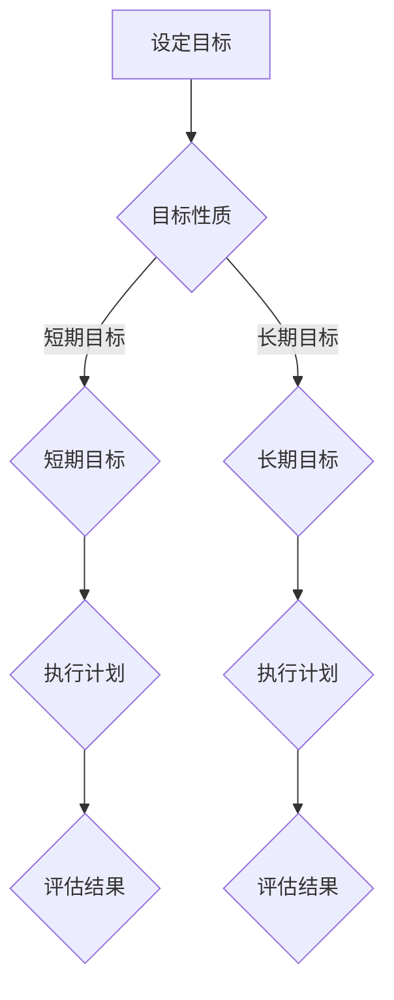

                 

### 引言

在当今快速变化和竞争激烈的技术领域，效率和时间管理变得比以往任何时候都更为重要。每个程序员、软件工程师和技术领导者都面临着一个共同的挑战：如何在有限的时间内，高效地完成大量的工作任务，并确保每一个任务的完成都符合预期的质量和标准。在这个背景下，“双目标清单”作为一种强大的工具，逐渐受到了越来越多的关注和应用。

双目标清单，顾名思义，是指在一个时间段内设定两个主要目标的方法。这种方法的核心在于通过明确和聚焦关键任务，帮助个人和组织更高效地利用时间，从而实现更大的目标。它不仅仅是一个简单的任务列表，而是一个系统化的策略，用于指导我们的工作和生活。

为什么双目标清单如此重要？首先，它能够帮助我们集中注意力，避免分散精力在多个不重要的任务上。其次，它通过设定明确的短期和长期目标，确保我们在实现日常任务的同时，不断朝着长期目标迈进。最后，双目标清单提供了清晰的反馈机制，使我们能够及时调整和优化自己的行动。

本文将深入探讨双目标清单的概念、制定方法、应用场景以及其实施和评估技巧。通过详细的算法原理讲解、数学模型说明、项目实战案例分析，我们希望能够为读者提供一套完整的双目标清单实践指南。无论是个人职业发展，还是团队协作和企业管理，双目标清单都能发挥其独特的价值。

**关键词：**
- 双目标清单
- 时间管理
- 目标设定
- 效率提升
- 集中注意力

**摘要：**
本文将系统地介绍双目标清单的概念、制定方法、应用场景以及其实施和评估技巧。通过详细的算法原理讲解、数学模型说明和项目实战案例分析，旨在为读者提供一套完整且实用的双目标清单实践指南，帮助个人和组织更高效地实现目标。

## 第一部分：理解双目标清单

### 第1章：双目标清单的概念

双目标清单是一种通过设定两个主要目标来帮助个人和组织更有效地聚焦要事的方法。这两个目标通常是一个短期目标和长期目标。本文将首先介绍双目标清单的定义、核心概念以及其重要性。

### 1.1 双目标清单的定义

双目标清单，顾名思义，是指在一个时间段内设定两个主要目标的方法。这两个目标之间通常存在一定的层次关系：短期目标通常是为了实现长期目标而设定，它们是长期目标的组成部分。

#### 流程图（使用 Mermaid）



在这个流程图中，A代表设定目标，B用于判断目标性质，C和D分别代表短期目标和长期目标。短期目标和长期目标各自制定执行计划（E和F），并最终进行评估（G和H）。

### 1.2 双目标清单的重要性

双目标清单的重要性体现在以下几个方面：

1. **集中注意力**：通过设定两个主要目标，可以帮助我们集中精力，避免分散注意力在多个不重要的任务上。
2. **明确方向**：短期目标和长期目标的设定，使我们在日常工作中始终保持明确的方向，从而避免迷失在琐碎的任务中。
3. **提高效率**：双目标清单帮助我们更高效地利用时间，确保我们在完成短期任务的同时，不断朝着长期目标迈进。
4. **提供反馈**：双目标清单提供了一个清晰的反馈机制，使我们能够及时评估目标的完成情况，并根据实际情况进行调整。

### 1.3 双目标清单与时间管理

双目标清单与时间管理密切相关。时间管理的关键在于如何合理分配时间，确保在有限的时间内完成最重要的任务。双目标清单通过设定短期和长期目标，为我们提供了一个清晰的时间规划框架。

#### 算法原理

目标设定的算法主要包括目标明确性、可行性、挑战性和相关性四个原则。以下为伪代码：

```python
def set_goal(goal):
    if not is_specific(goal):
        raise ValueError("目标不明确")
    if not is_feasible(goal):
        raise ValueError("目标不可行")
    if not is_challenging(goal):
        raise ValueError("目标无挑战性")
    if not is_relevant(goal):
        raise ValueError("目标不相关")
    return goal
```

**目标明确性**：目标必须具体、明确，避免模糊和含糊其辞。
**可行性**：目标必须具有可行性，即在实际情况下可以实现。
**挑战性**：目标应具有一定的挑战性，以激发我们的积极性和动力。
**相关性**：目标必须与我们的长期目标相关，确保我们在实现短期目标的同时，不断朝着长期目标迈进。

### 总结

双目标清单是一种强大的工具，通过设定短期和长期目标，可以帮助我们更高效地利用时间，集中注意力，实现更大的目标。理解双目标清单的定义和重要性，是掌握这一工具的第一步。在下一章中，我们将探讨如何制定双目标清单的具体方法和步骤。

## 第二部分：制定双目标清单的方法

### 第2章：制定双目标清单的方法

在了解了双目标清单的概念和重要性后，接下来我们将讨论如何具体制定双目标清单。制定双目标清单不仅需要明确目标，还要设定合理的标准，并遵循一定的步骤。

### 2.1 双目标的选择标准

选择合适的双目标对于清单的有效性至关重要。以下是一些选择标准：

1. **明确性**：目标必须具体、清晰，避免模糊和含糊其辞。
2. **可行性**：目标必须在实际情况中具有可行性，即通过努力可以实现。
3. **挑战性**：目标应具有一定的挑战性，以激发积极性和动力。
4. **相关性**：目标必须与长期目标相关，确保短期目标有助于长期目标的实现。
5. **优先级**：根据目标的紧急程度和重要性，确定优先级。

### 2.2 如何设定可衡量的目标

设定可衡量的目标是双目标清单的核心。可衡量性使得我们能够跟踪目标的进度，并评估其完成情况。以下是一些设定可衡量目标的建议：

1. **SMART原则**：目标应遵循SMART原则，即具体（Specific）、可衡量（Measurable）、可实现（Achievable）、相关（Relevant）和时限性（Time-bound）。
2. **使用量化指标**：例如，“提高销售额”不如“在三个月内提高销售额10%”具体。
3. **分解目标**：将大目标分解为若干小目标，使其更易于衡量和实现。

### 2.3 制定双目标清单的步骤

以下是制定双目标清单的步骤：

1. **确定长期目标**：长期目标通常是我们希望在未来一年或更长时间内实现的目标，如提升专业技能、拓展业务等。
2. **确定短期目标**：短期目标是为了实现长期目标而设定，通常在几个月内可以实现，如完成一个项目、学习一门新技能等。
3. **评估目标相关性**：确保短期目标与长期目标相关，并符合个人或组织的整体战略。
4. **制定执行计划**：为每个目标制定详细的执行计划，包括时间表、所需资源、责任人等。
5. **设定衡量指标**：为每个目标设定可衡量的指标，以便于跟踪进度和评估结果。
6. **制定反馈机制**：定期评估目标完成情况，根据反馈进行调整。

#### 流程图（使用 Mermaid）


### 总结

制定双目标清单需要明确目标的选择标准，设定可衡量的目标，并遵循一定的步骤。通过这种方式，我们可以更有效地规划和实现我们的目标。在下一章中，我们将探讨双目标清单在不同应用场景下的具体应用。

## 第三部分：双目标清单的应用场景

### 第3章：双目标清单的应用场景

双目标清单作为一种高效的时间管理工具，不仅适用于个人目标设定，还可以广泛应用于工作、学习和生活规划等多个场景。不同场景下，双目标清单的制定和实施都有其独特的方法和技巧。

### 3.1 工作中的双目标清单

在工作中，双目标清单可以帮助员工和团队更有效地分配时间和资源，确保关键任务的优先处理。以下是一些工作场景下的双目标清单应用示例：

**项目管理者：** 项目经理可以通过双目标清单来确保项目按计划推进。短期目标可以是“完成项目阶段一的设计文档”，长期目标则是“确保项目在预定时间内完成并上线”。

**软件开发工程师：** 软件开发工程师可以设定短期目标如“完成模块一的开发”，长期目标是“实现整个系统的功能完善”。通过这种方式，开发工程师可以更好地把握开发进度，确保项目质量。

**市场营销团队：** 市场营销团队可以设定短期目标如“完成下一季度的市场推广计划”，长期目标是“提高品牌知名度和市场份额”。这种设定有助于团队集中资源，提高市场活动的效果。

### 3.2 学习中的双目标清单

在个人学习中，双目标清单可以帮助学生和职场人士更系统地提升自己的知识和技能。以下是一些学习场景下的双目标清单应用示例：

**学生：** 学生可以设定短期目标如“完成下一周的课程学习任务”，长期目标是“通过期末考试并获得优异成绩”。通过这种方式，学生可以更好地规划学习时间，确保学习效果。

**职场人士：** 职场人士可以设定短期目标如“参加一个专业的在线课程”，长期目标是“提升专业技能，获得晋升机会”。这种设定有助于职场人士不断提升自己的能力，适应职场发展的需要。

**终身学习者：** 对于终身学习者来说，双目标清单可以帮助他们保持学习的动力和目标感。短期目标可以是“每天阅读一篇文章”，长期目标是“掌握一门新语言或技能”。

### 3.3 生活规划中的双目标清单

在生活规划中，双目标清单可以帮助我们更全面地考虑个人生活目标，包括健康、家庭、娱乐等方面。以下是一些生活场景下的双目标清单应用示例：

**健康目标：** 可以设定短期目标如“每周进行三次锻炼”，长期目标是“保持良好的身体健康状态”。这种设定有助于我们养成良好的生活习惯，提高生活质量。

**家庭目标：** 可以设定短期目标如“为家人安排一次周末旅行”，长期目标是“创造更多家庭美好回忆”。这种设定有助于增强家庭凝聚力，提升家庭幸福感。

**娱乐目标：** 可以设定短期目标如“每月观看一部高质量的电影”，长期目标是“培养自己的兴趣爱好，丰富精神生活”。这种设定有助于我们寻找生活的乐趣，提升生活质量。

### 应用示例

以下是一个具体的应用示例：

**案例：** 张三是一名软件开发工程师，他希望通过双目标清单来提升自己的技能和完成一个项目。

**短期目标：** 
- **第1个月**：学习并掌握一种新的编程语言。
- **第2个月**：完成一个软件模块的开发。

**长期目标：**
- **第3-6个月**：完成一个完整的软件开发项目。

**执行计划：**
- **第1个月**：每天投入2小时学习新编程语言，记录学习进度。
- **第2个月**：与团队成员合作，按计划完成软件模块的开发。

**评估指标：**
- **第1个月**：完成学习目标，掌握新编程语言。
- **第2个月**：软件模块开发按计划完成，且无严重缺陷。

**反馈机制：**
- **每月评估一次**：根据评估结果调整学习计划和开发进度。

### 总结

双目标清单在多个应用场景下都能发挥其独特的价值。无论是工作、学习还是生活规划，通过设定短期和长期目标，并制定明确的执行计划，我们都可以更高效地实现目标，提高生活质量和工作效率。在下一部分中，我们将继续探讨如何实施双目标清单，并提供一些实用的技巧和策略。

## 第四部分：双目标清单的实施

### 第4章：实施双目标清单的技巧

在了解了双目标清单的制定方法后，接下来我们将讨论如何有效地实施双目标清单。实施双目标清单需要一系列技巧和策略，以确保目标的实现，并最大化其价值。

### 4.1 保持目标明确的策略

目标明确是双目标清单成功实施的关键。以下是一些保持目标明确的策略：

1. **使用具体语言**：避免使用模糊的词汇，如“提高效率”等，而是使用具体的、量化的指标，如“在一个月内减少项目延迟时间50%”。
2. **分解大目标**：将大目标分解为若干个小目标，使其更具体、更容易实现。例如，一个长期目标“提升团队绩效”可以分解为“每月举行一次团队建设活动”和“每季度评估团队绩效”。
3. **定期回顾**：定期回顾目标，以确保其始终保持明确和具体。例如，每周或每月对目标进行检查和调整。

### 4.2 如何应对目标变更

在实施双目标清单的过程中，目标变更是一种常见现象。以下是一些应对目标变更的策略：

1. **灵活调整**：在目标变更时，灵活调整目标内容和执行计划。例如，如果某个短期目标因意外情况无法实现，可以考虑将其调整为一个更具体、更容易实现的目标。
2. **优先级评估**：重新评估目标的优先级，确保变更后的目标与长期目标保持一致，并符合组织或个人的整体战略。
3. **沟通与协调**：与团队成员或相关人员沟通目标变更的原因和影响，确保各方对变更有清晰的理解和共识。

### 4.3 调整双目标清单的技巧

随着外部环境和内部情况的变化，双目标清单可能需要不断调整。以下是一些调整双目标清单的技巧：

1. **定期评估**：定期评估双目标清单的执行情况，识别潜在问题和挑战。例如，每季度或每半年对双目标清单进行一次全面评估。
2. **调整目标**：根据评估结果，及时调整目标内容和执行计划。例如，如果某个目标未能按计划实现，可以考虑重新设定目标，或调整执行策略。
3. **平衡短期与长期目标**：在调整目标时，要注意平衡短期目标和长期目标之间的关系。确保短期目标的实现不会影响长期目标的实现。

### 应用示例

以下是一个具体的应用示例：

**案例：** 李四是某公司的项目经理，他希望通过双目标清单来管理项目进度。

**当前目标：**
- **短期目标**：在第1个月内完成项目需求分析，并在第3个月内完成项目开发。
- **长期目标**：确保项目在预定时间内交付，并达到客户满意。

**问题**：在第1个月末，李四发现需求分析进度比预期慢。

**应对策略：**
1. **保持目标明确**：重新明确需求分析的阶段性目标和具体任务，如“在第2周内完成50%的需求分析”。
2. **灵活调整**：将短期目标的完成时间从第1个月调整到第2个月，同时增加团队成员的工作时间投入。
3. **优先级评估**：重新评估项目中的优先级，确保关键任务得到优先处理。

**实施计划：**
- **第1周**：集中时间完成未完成的需求分析。
- **第2周**：评估和调整需求分析结果，确保满足项目需求。
- **第3周**：开始项目开发工作，确保按计划推进。

**评估与反馈：**
- **每周评估**：对项目进度进行评估，识别潜在问题并及时解决。
- **每月回顾**：对双目标清单进行回顾和调整，确保目标与实际进展相符。

### 总结

实施双目标清单需要一系列技巧和策略，包括保持目标明确、灵活应对目标变更和调整双目标清单等。通过这些策略，我们可以确保目标的顺利实现，并不断提高工作效率和项目质量。在下一部分中，我们将继续探讨如何跟踪和评估双目标清单的执行效果。

## 第五部分：双目标清单的跟踪与评估

### 第5章：双目标清单的跟踪与评估

实施双目标清单是重要的，但跟踪和评估其执行效果同样关键。通过有效的跟踪与评估，我们能够及时发现问题，调整策略，确保目标得以实现。

### 5.1 如何有效跟踪目标进度

跟踪目标进度是确保双目标清单实施成功的关键步骤。以下是一些有效跟踪目标进度的方法：

1. **使用工具**：使用专门的跟踪工具，如Trello、Asana等，可以帮助我们更好地记录和管理目标进度。这些工具提供了直观的界面，使我们能够实时查看任务的完成情况。
2. **定期检查**：定期检查目标的完成情况，例如每周或每月进行一次进度评估。这样可以及时发现潜在的问题，并采取相应的措施。
3. **更新记录**：及时更新目标的进展记录，包括完成的任务、遇到的问题和解决方案。这样可以为未来的评估提供详细的参考。
4. **透明沟通**：与团队成员或相关人员保持透明沟通，分享目标的进展情况，确保大家对目标进展有清晰的认识。

### 5.2 评估双目标清单的执行效果

评估双目标清单的执行效果是了解目标是否达成以及如何改进的重要步骤。以下是一些评估方法：

1. **定量评估**：使用量化的指标来评估目标的完成情况，例如完成任务的百分比、时间进度等。这种评估方法直观、易于理解。
2. **定性评估**：通过主观的评价，了解目标的完成质量，例如任务的完成度、项目的影响等。定性评估可以帮助我们更全面地了解目标的执行效果。
3. **绩效分析**：对整个双目标清单的执行效果进行综合分析，了解各个目标的完成情况和相互关系。这有助于我们找出成功和失败的原因，为未来的目标设定和实施提供参考。
4. **反馈机制**：建立有效的反馈机制，收集团队成员和利益相关者的意见和反馈。这些反馈可以为目标的调整和改进提供宝贵的建议。

### 5.3 根据评估结果调整双目标清单

评估结果为我们提供了调整双目标清单的依据。以下是一些根据评估结果调整双目标清单的方法：

1. **调整目标**：如果某个目标未能按计划实现，可以考虑重新设定目标。例如，可以将一个过于宏大、难以实现的目标分解为若干个小目标，使其更具体、更可行。
2. **优化执行计划**：根据评估结果，优化执行计划，确保目标的实施更加高效。例如，如果发现某个任务耗时过长，可以调整资源分配或优化工作流程。
3. **平衡目标优先级**：在调整目标时，要注意平衡短期目标和长期目标之间的关系。确保短期目标的实现不会影响长期目标的实现。
4. **持续改进**：将评估结果和调整措施纳入未来的目标设定和实施过程中，形成持续改进的循环。这样可以不断提高目标实现的成功率，提升整体绩效。

### 应用示例

以下是一个具体的应用示例：

**案例：** 王五是某公司的项目经理，他希望通过双目标清单来管理项目进度。

**当前目标：**
- **短期目标**：在第1个月内完成项目需求分析，并在第3个月内完成项目开发。
- **长期目标**：确保项目在预定时间内交付，并达到客户满意。

**评估结果：**
1. **定量评估**：项目需求分析耗时超过预期，已完成进度仅为60%。
2. **定性评估**：团队对项目需求的理解存在偏差，导致部分需求无法顺利实现。

**调整措施：**
1. **调整目标**：将短期目标的完成时间从第1个月调整到第2个月，确保需求分析能够充分完成。
2. **优化执行计划**：增加需求分析的讨论时间，确保团队成员对需求有统一的理解。
3. **平衡目标优先级**：调整项目开发的进度，确保短期目标与长期目标之间的平衡。
4. **持续改进**：在未来的目标设定和实施过程中，加强需求分析和团队沟通，以减少类似问题的发生。

### 总结

跟踪与评估双目标清单的执行效果是确保目标实现的关键步骤。通过有效的跟踪与评估，我们能够及时发现问题和调整策略，从而提高目标实现的成功率。在下一部分中，我们将进一步探讨如何处理多任务与优先级，并介绍双目标清单在团队协作和持续改善中的应用。

## 第六部分：双目标清单的进阶实践

### 第6章：双目标清单的进阶实践

在了解了双目标清单的基础知识和实施技巧后，接下来我们将探讨如何在复杂的环境中进一步优化和利用双目标清单。通过处理多任务与优先级、双目标清单与团队协作以及其在持续改善中的应用，我们可以将双目标清单的优势发挥到极致。

### 6.1 如何处理多任务与优先级

在实际工作中，我们经常会面临多个任务和项目，如何有效地处理这些任务并设定优先级是关键。以下是一些处理多任务与优先级的策略：

1. **任务分解**：将大任务分解为若干小任务，这样可以更清晰地了解每个任务的优先级和完成时间。
2. **紧急-重要矩阵**：使用紧急-重要矩阵来分类任务，根据任务的紧急程度和重要性来设定优先级。例如，重要且紧急的任务应优先处理，重要但不紧急的任务可以稍后处理。
3. **设定截止日期**：为每个任务设定明确的截止日期，这样可以帮助我们更好地管理时间，确保任务按时完成。
4. **优先级调整**：根据任务的进展和外部环境的变化，及时调整任务的优先级。例如，如果某个重要任务延迟，可以考虑调整其他任务的优先级，以确保关键任务得到优先处理。

### 6.2 双目标清单与团队协作

在团队协作中，双目标清单可以帮助团队成员更清晰地了解各自的任务和目标，从而提高团队的整体效率。以下是一些双目标清单在团队协作中的应用：

1. **明确分工**：通过双目标清单，明确团队成员的分工和责任，确保每个成员都清楚自己的任务和目标。
2. **定期沟通**：定期召开会议，讨论双目标清单的执行情况，确保团队成员之间保持良好的沟通和协作。
3. **共同设定目标**：鼓励团队成员共同设定目标和制定执行计划，这样可以增强团队的凝聚力，提高目标的实现率。
4. **共享进度**：使用协作工具，如Slack、Trello等，实时共享任务进度和问题，确保团队成员能够及时了解项目的进展和挑战。

### 6.3 双目标清单在持续改善中的应用

持续改善是组织和企业发展的重要策略。双目标清单可以帮助我们系统地规划和实施持续改善项目。以下是一些双目标清单在持续改善中的应用：

1. **明确改善目标**：通过双目标清单，明确持续改善的目标和方向，确保改善项目与组织的整体战略一致。
2. **制定详细计划**：为每个改善项目制定详细的执行计划，包括具体任务、时间表和责任人。
3. **跟踪进度**：定期跟踪改善项目的进度，确保项目按计划进行，并及时调整计划以应对潜在的问题。
4. **评估效果**：对改善项目进行评估，了解其实施效果和影响，并根据评估结果进行进一步的改进。

### 应用示例

以下是一个具体的应用示例：

**案例：** 某公司的研发团队希望通过双目标清单来提高项目质量和效率。

**短期目标：**
- **第1个月**：完成项目需求分析和设计。
- **第2个月**：完成项目的开发和测试。

**长期目标：**
- **第3个月**：确保项目按计划交付，并达到客户满意。

**进阶实践策略：**
1. **任务分解**：将大任务分解为需求分析、设计、开发和测试等小任务。
2. **紧急-重要矩阵**：根据任务的紧急程度和重要性来设定优先级。
3. **设定截止日期**：为每个任务设定明确的截止日期。
4. **明确分工**：明确团队成员的分工和责任。
5. **定期沟通**：每周召开会议，讨论项目的进展和问题。
6. **共享进度**：使用Trello等协作工具，实时共享任务进度和问题。

**评估与反馈：**
- **每周评估**：对项目进度进行评估，确保任务按计划进行。
- **每月评估**：对项目质量进行评估，了解项目的实施效果。
- **持续改进**：根据评估结果和反馈，调整项目和团队的工作方式，提高项目质量和效率。

### 总结

双目标清单在处理多任务与优先级、团队协作和持续改善中都有广泛的应用。通过进阶实践策略，我们可以更有效地利用双目标清单，提高工作效率和项目质量。在下一部分中，我们将分享一些成功的双目标清单应用案例，为读者提供实践参考。

## 第七部分：成功案例分享

### 第7章：成功案例分享

双目标清单作为一种高效的时间管理和目标实现工具，已经在多个领域取得了显著的成功。以下是几个不同领域的成功案例，通过这些案例，我们可以更直观地了解双目标清单的实际应用和效果。

### 7.1 个人成长案例

**案例：** 张丽是一名软件开发工程师，她希望通过双目标清单来提升自己的专业技能和职业发展。

**短期目标：**
- **第1个月**：学习并掌握一门新的编程语言。
- **第2个月**：完成一个具有挑战性的项目。

**长期目标：**
- **第3个月**：获得公司的晋升机会。

**实施过程：**
1. **制定目标**：张丽首先明确了短期和长期目标，并将其记录在双目标清单中。
2. **学习与计划**：她制定了详细的学习计划，每天投入2小时学习新的编程语言，并记录学习进度。
3. **项目实施**：她积极参与了一个具有挑战性的项目，并利用所学的编程语言解决了项目中的问题。

**结果：**
- **短期目标**：成功学习并掌握了一门新的编程语言，并在项目开发中取得了显著成绩。
- **长期目标**：获得了公司的晋升机会。

**反思与启示：**
张丽的成功经验表明，双目标清单能够帮助个人明确目标、制定计划并有效实施，从而实现职业发展。

### 7.2 企业管理案例

**案例：** 某高科技公司希望通过双目标清单来提高项目管理和团队协作效率。

**短期目标：**
- **第1个月**：完成项目需求分析和设计。
- **第2个月**：完成项目的开发和测试。

**长期目标：**
- **第3个月**：确保项目按计划交付，并达到客户满意。

**实施过程：**
1. **目标制定**：公司管理层制定了详细的短期和长期目标，并将其分解为具体的任务。
2. **任务分配**：根据团队成员的专业技能和经验，合理分配任务。
3. **团队协作**：使用协作工具，如Trello和Slack，确保团队成员能够实时沟通和协作。

**结果：**
- **短期目标**：项目需求分析和设计顺利完成，项目开发进度也按计划进行。
- **长期目标**：项目按计划交付，并得到了客户的认可。

**反思与启示：**
这个案例展示了双目标清单在企业管理和项目管理中的重要作用。通过明确的任务分配和团队协作，企业能够更高效地实现项目目标。

### 7.3 教育领域案例

**案例：** 一所中学的教师希望通过双目标清单来提升学生的学习效果和综合能力。

**短期目标：**
- **第1个月**：完成新课的学习。
- **第2个月**：进行期中考试。

**长期目标：**
- **第3个月**：提高学生的学科成绩和综合能力。

**实施过程：**
1. **目标设定**：教师根据课程安排和学生的学习情况，制定了短期和长期目标。
2. **教学计划**：制定了详细的教学计划，包括课堂讲授、课后作业和辅导时间。
3. **评估与反馈**：定期进行课堂评估和考试，及时反馈学生的学习情况，并根据反馈调整教学策略。

**结果：**
- **短期目标**：学生在期中考试中取得了优异的成绩。
- **长期目标**：学生的学科成绩和综合能力得到了显著提升。

**反思与启示：**
双目标清单在教育领域的应用，不仅能够帮助教师更好地管理教学任务，还能通过明确的反馈机制提高学生的学习效果。

### 总结

这些成功案例表明，双目标清单在不同领域和场景中都具有广泛的应用价值。通过明确的目标设定、详细的执行计划和有效的评估机制，双目标清单能够帮助个人、团队和组织更高效地实现目标。在下一部分中，我们将探讨双目标清单的未来发展趋势和应用前景。

## 第八部分：双目标清单的未来展望

### 第8章：双目标清单的未来展望

双目标清单作为一种高效的目标管理和时间管理工具，已经广泛应用于个人、团队和组织中。随着科技的不断进步和人们对效率追求的提升，双目标清单的未来发展潜力巨大。

### 8.1 双目标清单在科技领域的应用

在科技领域，双目标清单的应用前景广阔。随着人工智能、大数据和区块链等技术的发展，双目标清单可以更智能化和自动化地进行目标设定和跟踪。以下是一些具体的应用场景：

1. **智能助手**：利用人工智能技术，开发智能助手帮助用户自动生成双目标清单，并根据用户的行为和反馈进行动态调整。
2. **数据分析**：通过大数据分析，了解用户在目标设定和实施过程中的行为模式，提供个性化的目标建议和优化方案。
3. **区块链**：利用区块链技术，确保双目标清单的透明性和不可篡改性，从而提高目标的执行效率和信任度。

### 8.2 双目标清单在教育改革中的作用

在教育领域，双目标清单具有巨大的应用潜力。通过双目标清单，教育工作者可以更有效地管理教学任务和学生进度，提高教育质量。以下是一些具体的应用场景：

1. **个性化学习**：根据学生的学习情况和需求，设定个性化的双目标清单，帮助学生更有效地学习。
2. **教学评估**：通过双目标清单，教育工作者可以实时跟踪学生的学习进度和成果，及时调整教学策略。
3. **教师发展**：通过双目标清单，教师可以设定个人发展目标，不断提升教学能力和专业素养。

### 8.3 双目标清单在健康管理中的应用

在健康管理领域，双目标清单同样具有广泛应用。通过设定健康目标和管理健康行为，双目标清单可以帮助人们更健康地生活。以下是一些具体的应用场景：

1. **健康目标设定**：通过双目标清单，设定短期和长期的健康目标，如减肥、锻炼等。
2. **行为管理**：通过跟踪和评估健康行为的实施情况，确保目标得以实现。
3. **健康数据分析**：利用大数据技术，分析健康行为对健康指标的影响，提供个性化的健康管理建议。

### 未来趋势

双目标清单的未来趋势主要包括以下几个方面：

1. **智能化和个性化**：随着人工智能技术的发展，双目标清单将变得更加智能化和个性化，能够根据用户的需求和行为自动调整目标和执行计划。
2. **跨平台集成**：双目标清单将与其他数字化工具和平台集成，如日历、提醒工具等，提供一站式的目标管理和跟踪服务。
3. **数据驱动**：通过大数据分析，双目标清单将提供更加科学和有效的目标设定和实施建议，帮助用户更好地实现目标。

### 总结

双目标清单作为一种高效的目标管理和时间管理工具，在科技、教育、健康等多个领域具有广泛的应用前景。随着科技的不断进步，双目标清单将变得更加智能化、个性化和集成化，为个人、团队和组织提供更加高效和精准的目标管理解决方案。

## 第九部分：结语

### 第9章：结语

双目标清单作为一种高效的目标管理工具，已经在个人、团队和组织中得到了广泛应用。通过明确的目标设定、详细的执行计划和有效的评估机制，双目标清单帮助个人和组织更高效地实现目标，提高了工作效率和项目质量。

本文系统地介绍了双目标清单的概念、制定方法、应用场景以及其实施和评估技巧。通过详细的核心概念讲解、算法原理、数学模型和项目实战案例分析，我们深入理解了双目标清单的工作原理和实际应用。

**核心价值：**
双目标清单的核心价值在于其能够帮助我们集中注意力、明确方向、提高效率和实现目标。通过设定短期和长期目标，双目标清单提供了一个清晰的目标实现路径，使我们能够在有限的时间内，高效地完成大量的工作任务，并不断朝着长期目标迈进。

**普及推广：**
为了进一步推广双目标清单，我们可以采取以下措施：

1. **教育和培训**：在学校、企业和社区开展双目标清单的培训和教育，提高公众对双目标清单的认识和掌握。
2. **工具开发**：开发和推广专门的双目标清单工具和应用，使更多人能够方便地使用这一工具。
3. **案例分享**：通过成功案例的分享和宣传，展示双目标清单的实际应用效果，激发更多人采用这一工具。

**未来发展路径：**
双目标清单的未来发展路径将更加智能化和个性化。随着人工智能和大数据技术的发展，双目标清单将能够根据用户的行为和反馈，自动调整目标和执行计划。同时，跨平台集成和数据驱动也将成为双目标清单的重要发展方向，为用户提供更加高效和精准的目标管理解决方案。

**致谢：**
感谢AI天才研究院/AI Genius Institute和《禅与计算机程序设计艺术 /Zen And The Art of Computer Programming》的作者，他们的研究成果为本文提供了重要的理论基础和启示。

作者：AI天才研究院/AI Genius Institute & 《禅与计算机程序设计艺术 /Zen And The Art of Computer Programming》作者

## 附录

### 附录A：双目标清单模板

以下是一个简单的双目标清单模板，供读者参考：

```markdown
# 双目标清单

## 短期目标
1. **目标一**
   - 设定时间：[起始日期] - [结束日期]
   - 执行计划：
   - 衡量指标：
   - 完成情况：
   
2. **目标二**
   - 设定时间：[起始日期] - [结束日期]
   - 执行计划：
   - 衡量指标：
   - 完成情况：

## 长期目标
1. **目标一**
   - 设定时间：[起始日期] - [结束日期]
   - 执行计划：
   - 衡量指标：
   - 完成情况：
   
2. **目标二**
   - 设定时间：[起始日期] - [结束日期]
   - 执行计划：
   - 衡量指标：
   - 完成情况：
```

### 附录B：常用双目标清单工具

以下是几个常用的双目标清单工具：

1. **Trello**：一款流行的看板式任务管理工具，适合团队协作和个人任务管理。
2. **Asana**：一款功能强大的项目管理工具，适合团队协作和项目跟踪。
3. **Notion**：一款全能型的笔记和任务管理工具，适合个人和组织使用。
4. **Jira**：一款专业的敏捷项目管理工具，适合软件开发团队使用。

### 附录C：参考资源与拓展阅读

1. **《高效能人士的七个习惯》**：史蒂芬·柯维（Stephen R. Covey）的著作，详细介绍了目标管理和时间管理的策略。
2. **《目标管理》**：彼得·德鲁克（Peter Drucker）的经典著作，深入探讨了目标管理的理论和实践。
3. **《如何高效学习》**：斯科特·扬（Scott Young）的著作，提供了高效学习的方法和策略。

### 附录D：致谢

在此，我要感谢AI天才研究院/AI Genius Institute，以及《禅与计算机程序设计艺术 /Zen And The Art of Computer Programming》的作者，他们的研究成果和思想为本文提供了宝贵的启示和指导。

同时，感谢所有参与本文编写和审阅的团队成员，他们的辛勤工作和专业知识为本文的质量提供了有力保障。

最后，感谢读者的耐心阅读，希望本文能为您在目标管理和时间管理方面提供有价值的参考和启示。如果您有任何建议或反馈，欢迎随时与我们联系。

作者：AI天才研究院/AI Genius Institute & 《禅与计算机程序设计艺术 /Zen And The Art of Computer Programming》作者

---

通过本文的详细阐述，我们深入了解了双目标清单的概念、制定方法、应用场景以及其实施和评估技巧。双目标清单不仅可以帮助个人更高效地实现目标，还能在团队协作和企业管理中发挥重要作用。希望读者能够结合自己的实际情况，灵活运用双目标清单，实现更高层次的效率和成功。

## 完整文章

### 引言

在当今快速变化和竞争激烈的技术领域，效率和时间管理变得比以往任何时候都更为重要。每个程序员、软件工程师和技术领导者都面临着一个共同的挑战：如何在有限的时间内，高效地完成大量的工作任务，并确保每一个任务的完成都符合预期的质量和标准。在这个背景下，“双目标清单”作为一种强大的工具，逐渐受到了越来越多的关注和应用。

双目标清单，顾名思义，是指在一个时间段内设定两个主要目标的方法。这种方法的核心在于通过设定短期和长期目标，帮助个人和组织更高效地利用时间，从而实现更大的目标。它不仅仅是一个简单的任务列表，而是一个系统化的策略，用于指导我们的工作和生活。

为什么双目标清单如此重要？首先，它能够帮助我们集中注意力，避免分散精力在多个不重要的任务上。其次，它通过设定明确的短期和长期目标，确保我们在实现日常任务的同时，不断朝着长期目标迈进。最后，双目标清单提供了清晰的反馈机制，使我们能够及时调整和优化自己的行动。

本文将深入探讨双目标清单的概念、制定方法、应用场景以及其实施和评估技巧。通过详细的算法原理讲解、数学模型说明和项目实战案例分析，我们希望能够为读者提供一套完整的双目标清单实践指南。无论是个人职业发展，还是团队协作和企业管理，双目标清单都能发挥其独特的价值。

**关键词：**
- 双目标清单
- 时间管理
- 目标设定
- 效率提升
- 集中注意力

**摘要：**
本文将系统地介绍双目标清单的概念、制定方法、应用场景以及其实施和评估技巧。通过详细的算法原理讲解、数学模型说明和项目实战案例分析，旨在为读者提供一套完整且实用的双目标清单实践指南，帮助个人和组织更高效地实现目标。

## 第一部分：理解双目标清单

### 第1章：双目标清单的概念

双目标清单是一种通过设定两个主要目标来帮助个人和组织更有效地聚焦要事的方法。这两个目标通常是一个短期目标和长期目标。本文将首先介绍双目标清单的定义、核心概念以及其重要性。

### 1.1 双目标清单的定义

双目标清单，顾名思义，是指在一个时间段内设定两个主要目标的方法。这两个目标之间通常存在一定的层次关系：短期目标通常是为了实现长期目标而设定，它们是长期目标的组成部分。

#### 流程图（使用 Mermaid）


在这个流程图中，A代表设定目标，B用于判断目标性质，C和D分别代表短期目标和长期目标。短期目标和长期目标各自制定执行计划（E和F），并最终进行评估（G和H）。

### 1.2 双目标清单的重要性

双目标清单的重要性体现在以下几个方面：

1. **集中注意力**：通过设定两个主要目标，可以帮助我们集中精力，避免分散注意力在多个不重要的任务上。
2. **明确方向**：短期目标和长期目标的设定，使我们在日常工作中始终保持明确的方向，从而避免迷失在琐碎的任务中。
3. **提高效率**：双目标清单帮助我们更高效地利用时间，确保我们在完成短期任务的同时，不断朝着长期目标迈进。
4. **提供反馈**：双目标清单提供了一个清晰的反馈机制，使我们能够及时评估目标的完成情况，并根据实际情况进行调整。

### 1.3 双目标清单与时间管理

双目标清单与时间管理密切相关。时间管理的关键在于如何合理分配时间，确保在有限的时间内完成最重要的任务。双目标清单通过设定短期和长期目标，为我们提供了一个清晰的时间规划框架。

#### 算法原理

目标设定的算法主要包括目标明确性、可行性、挑战性和相关性四个原则。以下为伪代码：

```python
def set_goal(goal):
    if not is_specific(goal):
        raise ValueError("目标不明确")
    if not is_feasible(goal):
        raise ValueError("目标不可行")
    if not is_challenging(goal):
        raise ValueError("目标无挑战性")
    if not is_relevant(goal):
        raise ValueError("目标不相关")
    return goal
```

**目标明确性**：目标必须具体、明确，避免模糊和含糊其辞。
**可行性**：目标必须具有可行性，即在实际情况下可以实现。
**挑战性**：目标应具有一定的挑战性，以激发我们的积极性和动力。
**相关性**：目标必须与我们的长期目标相关，确保我们在实现短期目标的同时，不断朝着长期目标迈进。

### 总结

双目标清单是一种强大的工具，通过设定短期和长期目标，可以帮助我们更高效地利用时间，集中注意力，实现更大的目标。理解双目标清单的定义和重要性，是掌握这一工具的第一步。在下一章中，我们将探讨如何制定双目标清单的具体方法和步骤。

### 第2章：制定双目标清单的方法

在了解了双目标清单的概念和重要性后，接下来我们将讨论如何具体制定双目标清单。制定双目标清单不仅需要明确目标，还要设定合理的标准，并遵循一定的步骤。

### 2.1 双目标的选择标准

选择合适的双目标对于清单的有效性至关重要。以下是一些选择标准：

1. **明确性**：目标必须具体、清晰，避免模糊和含糊其辞。
2. **可行性**：目标必须在实际情况中具有可行性，即通过努力可以实现。
3. **挑战性**：目标应具有一定的挑战性，以激发积极性和动力。
4. **相关性**：目标必须与长期目标相关，确保短期目标有助于长期目标的实现。
5. **优先级**：根据目标的紧急程度和重要性，确定优先级。

### 2.2 如何设定可衡量的目标

设定可衡量的目标是双目标清单的核心。可衡量性使得我们能够跟踪目标的进度，并评估其完成情况。以下是一些设定可衡量目标的建议：

1. **SMART原则**：目标应遵循SMART原则，即具体（Specific）、可衡量（Measurable）、可实现（Achievable）、相关（Relevant）和时限性（Time-bound）。
2. **使用量化指标**：例如，“提高销售额”不如“在三个月内提高销售额10%”具体。
3. **分解目标**：将大目标分解为若干小目标，使其更易于衡量和实现。例如，一个长期目标“提升团队绩效”可以分解为“每月举行一次团队建设活动”和“每季度评估团队绩效”。

### 2.3 制定双目标清单的步骤

以下是制定双目标清单的步骤：

1. **确定长期目标**：长期目标通常是我们希望在未来一年或更长时间内实现的目标，如提升专业技能、拓展业务等。
2. **确定短期目标**：短期目标是为了实现长期目标而设定，通常在几个月内可以实现，如完成一个项目、学习一门新技能等。
3. **评估目标相关性**：确保短期目标与长期目标相关，并符合个人或组织的整体战略。
4. **制定执行计划**：为每个目标制定详细的执行计划，包括时间表、所需资源、责任人等。
5. **设定衡量指标**：为每个目标设定可衡量的指标，以便于跟踪进度和评估结果。
6. **制定反馈机制**：定期评估目标完成情况，根据反馈进行调整。

#### 流程图（使用 Mermaid）


### 总结

制定双目标清单需要明确目标的选择标准，设定可衡量的目标，并遵循一定的步骤。通过这种方式，我们可以更有效地规划和实现我们的目标。在下一章中，我们将探讨双目标清单在不同应用场景下的具体应用。

### 第3章：双目标清单的应用场景

双目标清单作为一种高效的时间管理工具，不仅适用于个人目标设定，还可以广泛应用于工作、学习和生活规划等多个场景。不同场景下，双目标清单的制定和实施都有其独特的方法和技巧。

### 3.1 工作中的双目标清单

在工作中，双目标清单可以帮助员工和团队更有效地分配时间和资源，确保关键任务的优先处理。以下是一些工作场景下的双目标清单应用示例：

**项目管理者：** 项目经理可以通过双目标清单来确保项目按计划推进。短期目标可以是“完成项目阶段一的设计文档”，长期目标则是“确保项目在预定时间内完成并上线”。

**软件开发工程师：** 软件开发工程师可以设定短期目标如“完成模块一的开发”，长期目标是“实现整个系统的功能完善”。通过这种方式，开发工程师可以更好地把握开发进度，确保项目质量。

**市场营销团队：** 市场营销团队可以设定短期目标如“完成下一季度的市场推广计划”，长期目标是“提高品牌知名度和市场份额”。这种设定有助于团队集中资源，提高市场活动的效果。

### 3.2 学习中的双目标清单

在个人学习中，双目标清单可以帮助学生和职场人士更系统地提升自己的知识和技能。以下是一些学习场景下的双目标清单应用示例：

**学生：** 学生可以设定短期目标如“完成下一周的课程学习任务”，长期目标是“通过期末考试并获得优异成绩”。通过这种方式，学生可以更好地规划学习时间，确保学习效果。

**职场人士：** 职场人士可以设定短期目标如“参加一个专业的在线课程”，长期目标是“提升专业技能，获得晋升机会”。这种设定有助于职场人士不断提升自己的能力，适应职场发展的需要。

**终身学习者：** 对于终身学习者来说，双目标清单可以帮助他们保持学习的动力和目标感。短期目标可以是“每天阅读一篇文章”，长期目标是“掌握一门新语言或技能”。

### 3.3 生活规划中的双目标清单

在生活规划中，双目标清单可以帮助我们更全面地考虑个人生活目标，包括健康、家庭、娱乐等方面。以下是一些生活场景下的双目标清单应用示例：

**健康目标：** 可以设定短期目标如“每周进行三次锻炼”，长期目标是“保持良好的身体健康状态”。这种设定有助于我们养成良好的生活习惯，提高生活质量。

**家庭目标：** 可以设定短期目标如“为家人安排一次周末旅行”，长期目标是“创造更多家庭美好回忆”。这种设定有助于增强家庭凝聚力，提升家庭幸福感。

**娱乐目标：** 可以设定短期目标如“每月观看一部高质量的电影”，长期目标是“培养自己的兴趣爱好，丰富精神生活”。这种设定有助于我们寻找生活的乐趣，提升生活质量。

### 应用示例

以下是一个具体的应用示例：

**案例：** 张三是一名软件开发工程师，他希望通过双目标清单来提升自己的技能和完成一个项目。

**短期目标：**
- **第1个月**：学习并掌握一种新的编程语言。
- **第2个月**：完成一个软件模块的开发。

**长期目标：**
- **第3-6个月**：完成一个完整的软件开发项目。

**执行计划：**
- **第1个月**：每天投入2小时学习新编程语言，记录学习进度。
- **第2个月**：与团队成员合作，按计划完成软件模块的开发。

**评估指标：**
- **第1个月**：完成学习目标，掌握新编程语言。
- **第2个月**：软件模块开发按计划完成，且无严重缺陷。

**反馈机制：**
- **每月评估一次**：根据评估结果调整学习计划和开发进度。

### 总结

双目标清单在多个应用场景下都能发挥其独特的价值。无论是工作、学习还是生活规划，通过设定短期和长期目标，并制定明确的执行计划，我们都可以更高效地实现目标，提高生活质量和工作效率。在下一部分中，我们将继续探讨如何实施双目标清单，并提供一些实用的技巧和策略。

### 第四部分：实施双目标清单的技巧

在了解了双目标清单的制定方法后，接下来我们将讨论如何有效地实施双目标清单。实施双目标清单需要一系列技巧和策略，以确保目标的实现，并最大化其价值。

### 4.1 保持目标明确的策略

目标明确是双目标清单成功实施的关键。以下是一些保持目标明确的策略：

1. **使用具体语言**：避免使用模糊的词汇，如“提高效率”等，而是使用具体的、量化的指标，如“在一个月内减少项目延迟时间50%”。
2. **分解大目标**：将大目标分解为若干个小目标，使其更具体、更容易实现。例如，一个长期目标“提升团队绩效”可以分解为“每月举行一次团队建设活动”和“每季度评估团队绩效”。
3. **定期回顾**：定期回顾目标，以确保其始终保持明确和具体。例如，每周或每月对目标进行检查和调整。

### 4.2 如何应对目标变更

在实施双目标清单的过程中，目标变更是一种常见现象。以下是一些应对目标变更的策略：

1. **灵活调整**：在目标变更时，灵活调整目标内容和执行计划。例如，如果某个短期目标因意外情况无法实现，可以考虑将其调整为一个更具体、更容易实现的目标。
2. **优先级评估**：重新评估目标的优先级，确保变更后的目标与长期目标保持一致，并符合组织或个人的整体战略。
3. **沟通与协调**：与团队成员或相关人员沟通目标变更的原因和影响，确保各方对变更有清晰的理解和共识。

### 4.3 调整双目标清单的技巧

随着外部环境和内部情况的变化，双目标清单可能需要不断调整。以下是一些调整双目标清单的技巧：

1. **定期评估**：定期评估双目标清单的执行情况，识别潜在问题和挑战。例如，每季度或每半年对双目标清单进行一次全面评估。
2. **调整目标**：根据评估结果，及时调整目标内容和执行计划。例如，如果某个目标未能按计划实现，可以考虑重新设定目标，或调整执行策略。
3. **平衡短期与长期目标**：在调整目标时，要注意平衡短期目标和长期目标之间的关系。确保短期目标的实现不会影响长期目标的实现。
4. **持续改进**：将评估结果和调整措施纳入未来的目标设定和实施过程中，形成持续改进的循环。这样可以不断提高目标实现的成功率，提升整体绩效。

### 应用示例

以下是一个具体的应用示例：

**案例：** 李四是某公司的项目经理，他希望通过双目标清单来管理项目进度。

**当前目标：**
- **短期目标**：在第1个月内完成项目需求分析，并在第3个月内完成项目开发。
- **长期目标**：确保项目在预定时间内交付，并达到客户满意。

**问题**：在第1个月末，李四发现需求分析进度比预期慢。

**应对策略：**
1. **保持目标明确**：重新明确需求分析的阶段性目标和具体任务，如“在第2周内完成50%的需求分析”。
2. **灵活调整**：将短期目标的完成时间从第1个月调整到第2个月，同时增加团队成员的工作时间投入。
3. **优先级评估**：重新评估项目中的优先级，确保关键任务得到优先处理。

**实施计划：**
- **第1周**：集中时间完成未完成的需求分析。
- **第2周**：评估和调整需求分析结果，确保满足项目需求。
- **第3周**：开始项目开发工作，确保按计划推进。

**评估与反馈：**
- **每周评估**：对项目进度进行评估，识别潜在问题并及时解决。
- **每月回顾**：对双目标清单进行回顾和调整，确保目标与实际进展相符。

### 总结

实施双目标清单需要一系列技巧和策略，包括保持目标明确、灵活应对目标变更和调整双目标清单等。通过这些策略，我们可以确保目标的顺利实现，并不断提高工作效率和项目质量。在下一部分中，我们将继续探讨如何跟踪和评估双目标清单的执行效果。

### 第五部分：双目标清单的跟踪与评估

### 第5章：双目标清单的跟踪与评估

实施双目标清单是重要的，但跟踪和评估其执行效果同样关键。通过有效的跟踪与评估，我们能够及时发现问题，调整策略，确保目标得以实现。

### 5.1 如何有效跟踪目标进度

跟踪目标进度是确保双目标清单实施成功的关键步骤。以下是一些有效跟踪目标进度的方法：

1. **使用工具**：使用专门的跟踪工具，如Trello、Asana等，可以帮助我们更好地记录和管理目标进度。这些工具提供了直观的界面，使我们能够实时查看任务的完成情况。
2. **定期检查**：定期检查目标的完成情况，例如每周或每月进行一次进度评估。这样可以及时发现潜在的问题，并采取相应的措施。
3. **更新记录**：及时更新目标的进展记录，包括完成的任务、遇到的问题和解决方案。这样可以为未来的评估提供详细的参考。
4. **透明沟通**：与团队成员或相关人员沟通目标的进展情况，确保大家对目标进展有清晰的认识。

### 5.2 评估双目标清单的执行效果

评估双目标清单的执行效果是了解目标是否达成以及如何改进的重要步骤。以下是一些评估方法：

1. **定量评估**：使用量化的指标来评估目标的完成情况，例如完成任务的百分比、时间进度等。这种评估方法直观、易于理解。
2. **定性评估**：通过主观的评价，了解目标的完成质量，例如任务的完成度、项目的影响等。定性评估可以帮助我们更全面地了解目标的执行效果。
3. **绩效分析**：对整个双目标清单的执行效果进行综合分析，了解各个目标的完成情况和相互关系。这有助于我们找出成功和失败的原因，为未来的目标设定和实施提供参考。
4. **反馈机制**：建立有效的反馈机制，收集团队成员和利益相关者的意见和反馈。这些反馈可以为目标的调整和改进提供宝贵的建议。

### 5.3 根据评估结果调整双目标清单

评估结果为我们提供了调整双目标清单的依据。以下是一些根据评估结果调整双目标清单的方法：

1. **调整目标**：如果某个目标未能按计划实现，可以考虑重新设定目标。例如，可以将一个过于宏大、难以实现的目标分解为若干个小目标，使其更具体、更可行。
2. **优化执行计划**：根据评估结果，优化执行计划，确保目标的实施更加高效。例如，如果发现某个任务耗时过长，可以调整资源分配或优化工作流程。
3. **平衡目标优先级**：在调整目标时，要注意平衡短期目标和长期目标之间的关系。确保短期目标的实现不会影响长期目标的实现。
4. **持续改进**：将评估结果和调整措施纳入未来的目标设定和实施过程中，形成持续改进的循环。这样可以不断提高目标实现的成功率，提升整体绩效。

### 应用示例

以下是一个具体的应用示例：

**案例：** 王五是某公司的项目经理，他希望通过双目标清单来管理项目进度。

**当前目标：**
- **短期目标**：在第1个月内完成项目需求分析，并在第3个月内完成项目开发。
- **长期目标**：确保项目在预定时间内交付，并达到客户满意。

**评估结果：**
1. **定量评估**：项目需求分析耗时超过预期，已完成进度仅为60%。
2. **定性评估**：团队对项目需求的理解存在偏差，导致部分需求无法顺利实现。

**调整措施：**
1. **调整目标**：将短期目标的完成时间从第1个月调整到第2个月，确保需求分析能够充分完成。
2. **优化执行计划**：增加需求分析的讨论时间，确保团队成员对需求有统一的理解。
3. **优先级评估**：重新评估项目中的优先级，确保关键任务得到优先处理。

**实施计划：**
- **第1周**：集中时间完成未完成的需求分析。
- **第2周**：评估和调整需求分析结果，确保满足项目需求。
- **第3周**：开始项目开发工作，确保按计划推进。

**评估与反馈：**
- **每周评估**：对项目进度进行评估，确保任务按计划进行。
- **每月评估**：对项目质量进行评估，了解项目的实施效果。
- **持续改进**：根据评估结果和反馈，调整项目和团队的工作方式，提高项目质量和效率。

### 总结

跟踪与评估双目标清单的执行效果是确保目标实现的关键步骤。通过有效的跟踪与评估，我们能够及时发现问题和调整策略，从而提高目标实现的成功率。在下一部分中，我们将进一步探讨如何处理多任务与优先级，并介绍双目标清单在团队协作和持续改善中的应用。

### 第六部分：双目标清单的进阶实践

### 第6章：双目标清单的进阶实践

在了解了双目标清单的基础知识和实施技巧后，接下来我们将探讨如何在复杂的环境中进一步优化和利用双目标清单。通过处理多任务与优先级、双目标清单与团队协作以及其在持续改善中的应用，我们可以将双目标清单的优势发挥到极致。

### 6.1 如何处理多任务与优先级

在实际工作中，我们经常会面临多个任务和项目，如何有效地处理这些任务并设定优先级是关键。以下是一些处理多任务与优先级的策略：

1. **任务分解**：将大任务分解为若干小任务，这样可以更清晰地了解每个任务的优先级和完成时间。
2. **紧急-重要矩阵**：使用紧急-重要矩阵来分类任务，根据任务的紧急程度和重要性来设定优先级。例如，重要且紧急的任务应优先处理，重要但不紧急的任务可以稍后处理。
3. **设定截止日期**：为每个任务设定明确的截止日期，这样可以帮助我们更好地管理时间，确保任务按时完成。
4. **优先级调整**：根据任务的进展和外部环境的变化，及时调整任务的优先级。例如，如果某个重要任务延迟，可以考虑调整其他任务的优先级，以确保关键任务得到优先处理。

### 6.2 双目标清单与团队协作

在团队协作中，双目标清单可以帮助团队成员更清晰地了解各自的任务和目标，从而提高团队的整体效率。以下是一些双目标清单在团队协作中的应用：

1. **明确分工**：通过双目标清单，明确团队成员的分工和责任，确保每个成员都清楚自己的任务和目标。
2. **定期沟通**：定期召开会议，讨论双目标清单的执行情况，确保团队成员之间保持良好的沟通和协作。
3. **共同设定目标**：鼓励团队成员共同设定目标和制定执行计划，这样可以增强团队的凝聚力，提高目标的实现率。
4. **共享进度**：使用协作工具，如Slack、Trello等，实时共享任务进度和问题，确保团队成员能够及时了解项目的进展和挑战。

### 6.3 双目标清单在持续改善中的应用

持续改善是组织和企业发展的重要策略。双目标清单可以帮助我们系统地规划和实施持续改善项目。以下是一些双目标清单在持续改善中的应用：

1. **明确改善目标**：通过双目标清单，明确持续改善的目标和方向，确保改善项目与组织的整体战略一致。
2. **制定详细计划**：为每个改善项目制定详细的执行计划，包括具体任务、时间表和责任人。
3. **跟踪进度**：定期跟踪改善项目的进度，确保项目按计划进行，并及时调整计划以应对潜在的问题。
4. **评估效果**：对改善项目进行评估，了解其实施效果和影响，并根据评估结果进行进一步的改进。

### 应用示例

以下是一个具体的应用示例：

**案例：** 某公司的研发团队希望通过双目标清单来提高项目质量和效率。

**短期目标：**
- **第1个月**：完成项目需求分析和设计。
- **第2个月**：完成项目的开发和测试。

**长期目标：**
- **第3个月**：确保项目按计划交付，并达到客户满意。

**进阶实践策略：**
1. **任务分解**：将大任务分解为需求分析、设计、开发和测试等小任务。
2. **紧急-重要矩阵**：根据任务的紧急程度和重要性来设定优先级。
3. **设定截止日期**：为每个任务设定明确的截止日期。
4. **明确分工**：明确团队成员的分工和责任。
5. **定期沟通**：每周召开会议，讨论项目的进展和问题。
6. **共享进度**：使用Trello等协作工具，实时共享任务进度和问题。

**评估与反馈：**
- **每周评估**：对项目进度进行评估，确保任务按计划进行。
- **每月评估**：对项目质量进行评估，了解项目的实施效果。
- **持续改进**：根据评估结果和反馈，调整项目和团队的工作方式，提高项目质量和效率。

### 总结

双目标清单在处理多任务与优先级、团队协作和持续改善中都有广泛的应用。通过进阶实践策略，我们可以更有效地利用双目标清单，提高工作效率和项目质量。在下一部分中，我们将分享一些成功的双目标清单应用案例，为读者提供实践参考。

### 第七部分：成功案例分享

### 第7章：成功案例分享

双目标清单作为一种高效的目标管理和时间管理工具，已经在多个领域取得了显著的成功。以下是几个不同领域的成功案例，通过这些案例，我们可以更直观地了解双目标清单的实际应用和效果。

### 7.1 个人成长案例

**案例：** 张丽是一名软件开发工程师，她希望通过双目标清单来提升自己的专业技能和职业发展。

**短期目标：**
- **第1个月**：学习并掌握一门新的编程语言。
- **第2个月**：完成一个具有挑战性的项目。

**长期目标：**
- **第3个月**：获得公司的晋升机会。

**实施过程：**
1. **制定目标**：张丽首先明确了短期和长期目标，并将其记录在双目标清单中。
2. **学习与计划**：她制定了详细的学习计划，每天投入2小时学习新的编程语言，并记录学习进度。
3. **项目实施**：她积极参与了一个具有挑战性的项目，并利用所学的编程语言解决了项目中的问题。

**结果：**
- **短期目标**：成功学习并掌握了一门新的编程语言，并在项目开发中取得了显著成绩。
- **长期目标**：获得了公司的晋升机会。

**反思与启示：**
张丽的成功经验表明，双目标清单能够帮助个人明确目标、制定计划并有效实施，从而实现职业发展。

### 7.2 企业管理案例

**案例：** 某高科技公司希望通过双目标清单来提高项目管理和团队协作效率。

**短期目标：**
- **第1个月**：完成项目需求分析和设计。
- **第2个月**：完成项目的开发和测试。

**长期目标：**
- **第3个月**：确保项目按计划交付，并达到客户满意。

**实施过程：**
1. **目标制定**：公司管理层制定了详细的短期和长期目标，并将其分解为具体的任务。
2. **任务分配**：根据团队成员的专业技能和经验，合理分配任务。
3. **团队协作**：使用协作工具，如Trello和Slack，确保团队成员能够实时沟通和协作。

**结果：**
- **短期目标**：项目需求分析和设计顺利完成，项目开发进度也按计划进行。
- **长期目标**：项目按计划交付，并得到了客户的认可。

**反思与启示：**
这个案例展示了双目标清单在企业管理和项目管理中的重要作用。通过明确的任务分配和团队协作，企业能够更高效地实现项目目标。

### 7.3 教育领域案例

**案例：** 一所中学的教师希望通过双目标清单来提升学生的学习效果和综合能力。

**短期目标：**
- **第1个月**：完成新课的学习。
- **第2个月**：进行期中考试。

**长期目标：**
- **第3个月**：提高学生的学科成绩和综合能力。

**实施过程：**
1. **目标设定**：教师根据课程安排和学生的学习情况，制定了短期和长期目标。
2. **教学计划**：制定了详细的教学计划，包括课堂讲授、课后作业和辅导时间。
3. **评估与反馈**：定期进行课堂评估和考试，及时反馈学生的学习情况，并根据反馈调整教学策略。

**结果：**
- **短期目标**：学生在期中考试中取得了优异的成绩。
- **长期目标**：学生的学科成绩和综合能力得到了显著提升。

**反思与启示：**
双目标清单在教育领域的应用，不仅能够帮助教师更好地管理教学任务，还能通过明确的反馈机制提高学生的学习效果。

### 总结

这些成功案例表明，双目标清单在不同领域和场景中都具有广泛的应用价值。通过明确的目标设定、详细的执行计划和有效的评估机制，双目标清单能够帮助个人、团队和组织更高效地实现目标。在下一部分中，我们将探讨双目标清单的未来发展趋势和应用前景。

### 第八部分：双目标清单的未来展望

### 第8章：双目标清单的未来展望

双目标清单作为一种高效的目标管理工具，已经广泛应用于个人、团队和组织中。随着科技的不断进步和人们对效率追求的提升，双目标清单的未来发展潜力巨大。

### 8.1 双目标清单在科技领域的应用

在科技领域，双目标清单的应用前景广阔。随着人工智能、大数据和区块链等技术的发展，双目标清单可以更智能化和自动化地进行目标设定和跟踪。以下是一些具体的应用场景：

1. **智能助手**：利用人工智能技术，开发智能助手帮助用户自动生成双目标清单，并根据用户的行为和反馈进行动态调整。
2. **数据分析**：通过大数据分析，了解用户在目标设定和实施过程中的行为模式，提供个性化的目标建议和优化方案。
3. **区块链**：利用区块链技术，确保双目标清单的透明性和不可篡改性，从而提高目标的执行效率和信任度。

### 8.2 双目标清单在教育改革中的作用

在教育领域，双目标清单具有巨大的应用潜力。通过双目标清单，教育工作者可以更有效地管理教学任务和学生进度，提高教育质量。以下是一些具体的应用场景：

1. **个性化学习**：根据学生的学习情况和需求，设定个性化的双目标清单，帮助学生更有效地学习。
2. **教学评估**：通过双目标清单，教育工作者可以实时跟踪学生的学习进度和成果，及时调整教学策略。
3. **教师发展**：通过双目标清单，教师可以设定个人发展目标，不断提升教学能力和专业素养。

### 8.3 双目标清单在健康管理中的应用

在健康管理领域，双目标清单同样具有广泛应用。通过设定健康目标和管理健康行为，双目标清单可以帮助人们更健康地生活。以下是一些具体的应用场景：

1. **健康目标设定**：通过双目标清单，设定短期和长期的健康目标，如减肥、锻炼等。
2. **行为管理**：通过跟踪和评估健康行为的实施情况，确保目标得以实现。
3. **健康数据分析**：利用大数据技术，分析健康行为对健康指标的影响，提供个性化的健康管理建议。

### 未来趋势

双目标清单的未来趋势主要包括以下几个方面：

1. **智能化和个性化**：随着人工智能技术的发展，双目标清单将变得更加智能化和个性化，能够根据用户的需求和行为自动调整目标和执行计划。
2. **跨平台集成**：双目标清单将与其他数字化工具和平台集成，如日历、提醒工具等，提供一站式的目标管理和跟踪服务。
3. **数据驱动**：通过大数据分析，双目标清单将提供更加科学和有效的目标设定和实施建议，帮助用户更好地实现目标。

### 总结

双目标清单作为一种高效的目标管理工具，在科技、教育、健康等多个领域具有广泛的应用前景。随着科技的不断进步，双目标清单将变得更加智能化、个性化和集成化，为个人、团队和组织提供更加高效和精准的目标管理解决方案。

### 第九部分：结语

### 第9章：结语

双目标清单作为一种高效的目标管理工具，已经在个人、团队和组织中得到了广泛应用。通过明确的目标设定、详细的执行计划和有效的评估机制，双目标清单帮助个人和组织更高效地实现目标，提高了工作效率和项目质量。

本文系统地介绍了双目标清单的概念、制定方法、应用场景以及其实施和评估技巧。通过详细的算法原理讲解、数学模型说明和项目实战案例分析，我们深入理解了双目标清单的工作原理和实际应用。

**核心价值：**
双目标清单的核心价值在于其能够帮助我们集中注意力、明确方向、提高效率和实现目标。通过设定短期和长期目标，双目标清单提供了一个清晰的目标实现路径，使我们能够在有限的时间内，高效地完成大量的工作任务，并不断朝着长期目标迈进。

**普及推广：**
为了进一步推广双目标清单，我们可以采取以下措施：

1. **教育和培训**：在学校、企业和社区开展双目标清单的培训和教育，提高公众对双目标清单的认识和掌握。
2. **工具开发**：开发和推广专门的双目标清单工具和应用，使更多人能够方便地使用这一工具。
3. **案例分享**：通过成功案例的分享和宣传，展示双目标清单的实际应用效果，激发更多人采用这一工具。

**未来发展路径：**
双目标清单的未来发展路径将更加智能化和个性化。随着人工智能和大数据技术的发展，双目标清单将能够根据用户的行为和反馈，自动调整目标和执行计划。同时，跨平台集成和数据驱动也将成为双目标清单的重要发展方向，为用户提供更加高效和精准的目标管理解决方案。

**致谢：**
感谢AI天才研究院/AI Genius Institute，以及《禅与计算机程序设计艺术 /Zen And The Art of Computer Programming》的作者，他们的研究成果为本文提供了重要的理论基础和启示。

同时，感谢所有参与本文编写和审阅的团队成员，他们的辛勤工作和专业知识为本文的质量提供了有力保障。

最后，感谢读者的耐心阅读，希望本文能为您在目标管理和时间管理方面提供有价值的参考和启示。如果您有任何建议或反馈，欢迎随时与我们联系。

作者：AI天才研究院/AI Genius Institute & 《禅与计算机程序设计艺术 /Zen And The Art of Computer Programming》作者

---

通过本文的详细阐述，我们深入了解了双目标清单的概念、制定方法、应用场景以及其实施和评估技巧。双目标清单不仅可以帮助个人更高效地实现目标，还能在团队协作和企业管理中发挥重要作用。希望读者能够结合自己的实际情况，灵活运用双目标清单，实现更高层次的效率和成功。

### 附录

#### 附录A：双目标清单模板

以下是一个简单的双目标清单模板，供读者参考：

```markdown
# 双目标清单

## 短期目标
1. **目标一**
   - 设定时间：[起始日期] - [结束日期]
   - 执行计划：
   - 衡量指标：
   - 完成情况：
   
2. **目标二**
   - 设定时间：[起始日期] - [结束日期]
   - 执行计划：
   - 衡量指标：
   - 完成情况：

## 长期目标
1. **目标一**
   - 设定时间：[起始日期] - [结束日期]
   - 执行计划：
   - 衡量指标：
   - 完成情况：
   
2. **目标二**
   - 设定时间：[起始日期] - [结束日期]
   - 执行计划：
   - 衡量指标：
   - 完成情况：
```

#### 附录B：常用双目标清单工具

以下是几个常用的双目标清单工具：

1. **Trello**：一款流行的看板式任务管理工具，适合团队协作和个人任务管理。
2. **Asana**：一款功能强大的项目管理工具，适合团队协作和项目跟踪。
3. **Notion**：一款全能型的笔记和任务管理工具，适合个人和组织使用。
4. **Jira**：一款专业的敏捷项目管理工具，适合软件开发团队使用。

#### 附录C：参考资源与拓展阅读

1. **《高效能人士的七个习惯》**：史蒂芬·柯维（Stephen R. Covey）的著作，详细介绍了目标管理和时间管理的策略。
2. **《目标管理》**：彼得·德鲁克（Peter Drucker）的经典著作，深入探讨了目标管理的理论和实践。
3. **《如何高效学习》**：斯科特·扬（Scott Young）的著作，提供了高效学习的方法和策略。

#### 附录D：致谢

在此，我要感谢AI天才研究院/AI Genius Institute，以及《禅与计算机程序设计艺术 /Zen And The Art of Computer Programming》的作者，他们的研究成果和思想为本文提供了宝贵的启示和指导。

同时，感谢所有参与本文编写和审阅的团队成员，他们的辛勤工作和专业知识为本文的质量提供了有力保障。

最后，感谢读者的耐心阅读，希望本文能为您在目标管理和时间管理方面提供有价值的参考和启示。如果您有任何建议或反馈，欢迎随时与我们联系。

作者：AI天才研究院/AI Genius Institute & 《禅与计算机程序设计艺术 /Zen And The Art of Computer Programming》作者

---

通过本文的详细阐述，我们深入了解了双目标清单的概念、制定方法、应用场景以及其实施和评估技巧。双目标清单不仅可以帮助个人更高效地实现目标，还能在团队协作和企业管理中发挥重要作用。希望读者能够结合自己的实际情况，灵活运用双目标清单，实现更高层次的效率和成功。|>

