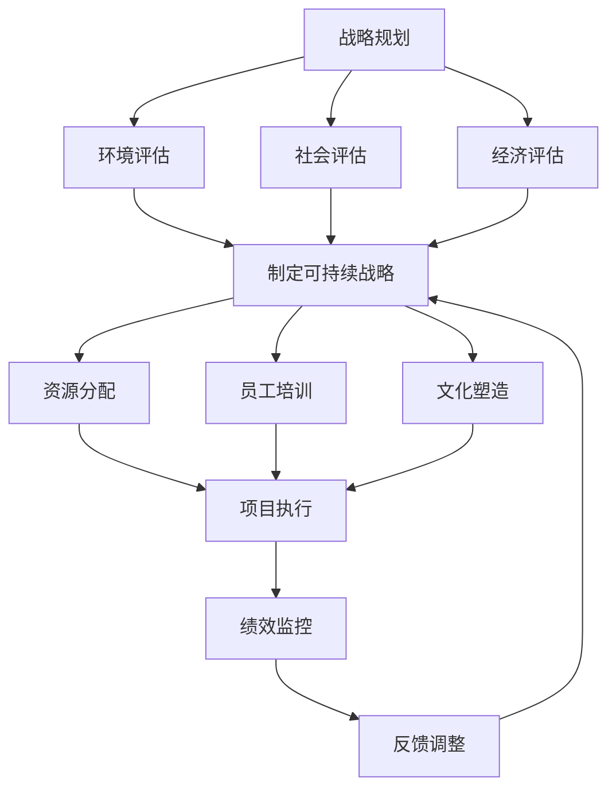

                 

# 《可持续领导力：为长期成功奠定基础的方法》

> **关键词**：可持续领导力、长期成功、企业战略、社会责任、技术创新

> **摘要**：本文深入探讨了可持续领导力在企业中的重要性，以及如何通过实施可持续领导力策略实现长期成功。文章从核心概念、算法原理、实践策略、企业文化、社会责任等多个角度出发，详细分析了可持续领导力的理论和实践方法，为企业在全球化背景下实现可持续发展提供了宝贵的指导。

---

# 目录大纲

## 第1章 引言：可持续领导力的意义与挑战

### 1.1.1 什么是可持续领导力？

### 1.1.2 可持续领导力的必要性

### 1.1.3 可持续领导力面临的挑战

## 第2章 核心概念与联系

### 2.1.1 领导力与可持续性的定义与联系

### 2.1.2 可持续领导力与传统领导力的差异

### 2.1.3 可持续领导力的Mermaid流程图

## 第3章 核心算法原理讲解

### 3.1.1 可持续领导力的关键算法

### 3.1.2 伪代码详细阐述

### 3.1.3 算法案例分析

## 第4章 数学模型与数学公式

### 4.1.1 可持续领导力的数学模型

### 4.1.2 LaTeX格式数学公式举例

### 4.1.3 数学公式详细讲解与举例说明

## 第5章 可持续领导力策略与实践

### 5.1.1 可持续领导力战略规划

### 5.1.2 实践案例分析

### 5.1.3 成功因素与挑战

## 第6章 可持续领导力与企业文化

### 6.1.1 可持续领导力与企业文化的融合

### 6.1.2 企业文化建设策略

### 6.1.3 文化变革案例研究

## 第7章 可持续领导力与社会责任

### 7.1.1 可持续领导力与社会责任的联系

### 7.1.2 社会责任策略与实践

### 7.1.3 社会责任对领导力的影响

## 第8章 可持续领导力的未来发展趋势

### 8.1.1 全球化背景下的可持续领导力

### 8.1.2 技术创新对可持续领导力的影响

### 8.1.3 未来领导力技能需求分析

## 第9章 总结与展望

### 9.1.1 可持续领导力的重要性总结

### 9.1.2 个人领导力提升路径

### 9.1.3 未来可持续领导力的发展趋势展望

## 附录

### A.1.1 可持续领导力参考书目

### A.1.2 相关网站资源链接

### A.1.3 研究论文与报告引用列表

---

接下来，我们将深入讨论文章的各个章节，逐步构建出一个完整、详实且具有启发性的可持续领导力指南。让我们开始吧！## 第1章 引言：可持续领导力的意义与挑战

### 1.1.1 什么是可持续领导力？

可持续领导力是指一种能够促使企业在长期内持续成功发展的领导方式。它不仅仅关注企业的短期盈利，更注重企业的长期生存和可持续发展。这种领导力强调在决策过程中要考虑到经济、环境和社会三个方面（即三重底线）的平衡，旨在实现企业的可持续增长和社会的共同繁荣。

可持续领导力与传统领导力有何不同？首先，传统领导力往往更关注短期绩效和财务指标，而可持续领导力则更加注重长期利益和社会责任。其次，可持续领导力倡导更加开放和透明的管理方式，鼓励团队成员参与决策，提升组织的整体协作能力。最后，可持续领导力还强调创新和灵活性，以应对不断变化的市场环境和社会需求。

### 1.1.2 可持续领导力的必要性

在全球化和技术变革的背景下，企业面临的挑战日益复杂。环境问题、资源短缺、社会不平等等问题使得企业必须更加关注其长期影响和可持续发展。以下是几个关键原因，解释为什么可持续领导力对企业的成功至关重要：

1. **增强企业竞争力**：通过实施可持续领导力，企业能够在激烈的市场竞争中脱颖而出。可持续领导力帮助企业优化资源利用，降低运营成本，提高产品质量，从而提升整体竞争力。

2. **建立信任和声誉**：企业在社会责任和环境保护方面的积极行动，能够增强消费者、员工和投资者对企业的信任。这种信任和声誉是企业长期发展的重要资产。

3. **满足法规要求**：随着全球各国对环境保护和可持续发展的重视，企业必须遵守越来越严格的法律法规。可持续领导力有助于企业提前应对这些法规变化，减少法律风险。

4. **吸引和留住人才**：越来越多的员工重视企业社会责任和可持续发展，可持续领导力能够帮助企业吸引和留住这些有才华的员工。

### 1.1.3 可持续领导力面临的挑战

尽管可持续领导力对企业具有显著的优势，但在实际实施过程中，企业仍面临诸多挑战：

1. **文化阻力**：许多企业仍然秉持传统的短期盈利思维，难以接受可持续领导力所倡导的长期视角。这种文化阻力可能阻碍可持续领导力的有效实施。

2. **资源限制**：实施可持续领导力需要投入大量的人力和财力资源。对于一些资源有限的企业来说，这是一个重大的挑战。

3. **不确定性和风险**：可持续领导力的实施过程充满了不确定性和风险，如政策变化、市场需求波动等。企业需要具备足够的适应能力和风险管理能力。

4. **沟通和协作**：可持续领导力需要企业各个部门之间的紧密协作。然而，在实际操作中，部门之间的沟通和协作往往存在障碍。

综上所述，可持续领导力是企业实现长期成功的关键。理解其概念、必要性以及面临的挑战，是企业和领导者迈出成功第一步的关键。在接下来的章节中，我们将深入探讨可持续领导力的核心概念、算法原理、实践策略等方面的内容，以帮助读者全面了解并掌握这一重要领导力模式。

### 2.1.1 领导力与可持续性的定义与联系

首先，我们需要明确“领导力”和“可持续性”这两个核心概念的定义及其相互关系。

**领导力**是指通过影响和激励他人，实现共同目标的能力。它不仅仅是指挥和管理，更重要的是通过激发团队潜力，创造一个积极向上的工作环境，从而推动组织的进步。领导力涵盖了多个维度，包括个人魅力、决策能力、沟通技巧和团队协作等。

**可持续性**则是指满足当前需求而不损害未来世代满足自身需求的能力。它涉及经济、环境和社会三个方面，即三重底线。在经济方面，可持续性关注资源的有效利用和经济效益的长期增长；在环境方面，可持续性强调环境保护和资源的可持续管理；在社会方面，可持续性涉及社会公正、社区发展和员工福利等。

那么，领导力与可持续性之间有何联系呢？首先，可持续领导力将可持续性原则融入领导过程，通过制定和执行可持续战略，实现企业的长期目标。领导力在可持续性中的作用体现在以下几个方面：

1. **战略规划**：领导者在制定企业战略时，必须考虑到可持续性。这包括评估企业的资源消耗、环境影响和社会责任，以确保企业在长期内能够持续发展。

2. **资源配置**：领导者需要合理分配资源，以支持企业的可持续发展。这意味着在投资决策中，不仅要考虑经济效益，还要考虑环境和社会效益。

3. **文化塑造**：领导者通过塑造企业的文化价值观，激励员工关注可持续发展。这种文化塑造不仅体现在日常管理中，还渗透到企业的决策和行动中。

4. **创新推动**：领导者鼓励创新，以应对环境和社会变化带来的挑战。创新不仅有助于企业实现可持续发展，还可以提升企业的竞争力和市场地位。

5. **利益相关者沟通**：领导者需要与利益相关者（如员工、客户、投资者和社区）进行有效沟通，以建立信任和合作关系。这种沟通有助于企业更好地理解利益相关者的期望和需求，从而实现可持续发展。

总之，领导力与可持续性是相辅相成的。领导力通过推动可持续性实现长期成功，而可持续性则为领导力提供了明确的方向和目标。在下一节中，我们将探讨可持续领导力与传统领导力之间的差异，帮助读者更好地理解可持续领导力的独特之处。

### 2.1.2 可持续领导力与传统领导力的差异

要深入理解可持续领导力，我们需要将其与传统领导力进行对比，以突出两者的本质差异。传统领导力主要关注短期绩效、利润最大化以及权力和控制。而可持续领导力则更加注重长期利益、社会和环境责任，以及企业文化的建设。

**1. 短期与长期视角**

传统领导力倾向于追求短期业绩和快速回报。领导者往往通过快速削减成本、提高效率来提升短期利润。这种方式可能在短期内带来良好的财务表现，但长期来看，可能会导致资源浪费、环境污染和员工流失等问题。相反，可持续领导力倡导长期视角，注重企业的长期生存和可持续发展。领导者会制定长期的战略规划，确保企业在经济、环境和社会方面的综合平衡。

**2. 利益相关者与权力结构**

传统领导力强调权力和控制，领导者往往独自决策，缺乏透明度和参与性。这种方式可能导致决策失误和内部冲突。而可持续领导力强调与利益相关者（如员工、客户、投资者和社区）的互动和沟通。领导者会鼓励员工参与决策过程，提高组织的透明度和责任感。这种参与性和透明度有助于建立信任和合作，提高企业的整体效能。

**3. 创新与适应**

传统领导力往往依赖于现有的管理方法和流程，缺乏创新精神。领导者可能不愿意冒险尝试新事物，导致企业在快速变化的市场环境中失去竞争力。相反，可持续领导力鼓励创新和适应性。领导者会积极推动技术和管理创新，以应对市场和环境的变化。这种创新精神不仅有助于企业保持竞争力，还可以推动企业的可持续发展。

**4. 责任与问责**

传统领导力强调个人责任和绩效评估，但往往忽视了企业的社会责任。领导者可能只关注财务指标，而忽略了对环境和社会的影响。而可持续领导力则强调企业的社会责任和道德责任。领导者不仅要追求经济利益，还要关注社会和环境问题。他们会对企业的决策和行为进行全面的评估，确保其符合可持续发展的原则。

**5. 文化与价值观**

传统领导力可能注重形式主义和官僚主义，缺乏人文关怀。领导者可能只关注业务指标，而忽略员工的福利和发展。而可持续领导力则强调企业的文化价值观，注重员工的发展和企业的社会责任。领导者会通过塑造积极向上的企业文化，提高员工的满意度和忠诚度，从而推动企业的长期发展。

总之，可持续领导力与传统领导力在短期与长期视角、利益相关者互动、创新与适应、责任与问责以及文化价值观等方面存在显著差异。这些差异使得可持续领导力更适应现代企业和复杂多变的环境，有助于实现企业的长期成功和社会的可持续发展。

### 2.1.3 可持续领导力的Mermaid流程图

为了更直观地展示可持续领导力的核心概念和流程，我们可以使用Mermaid图形语言绘制一个流程图。下面是一个简化的示例，展示了从战略规划到执行和监控的可持续领导力流程。



**流程说明：**

1. **战略规划**：领导者需要制定一个长期的可持续战略，这包括对环境、社会和经济三个方面的全面评估。
   
2. **环境评估**：评估企业对环境的影响，包括资源消耗、碳排放和污染控制等。

3. **社会评估**：评估企业对社会的贡献，包括员工福利、社区发展和社会责任等。

4. **经济评估**：评估企业的经济绩效，包括成本效益分析和投资回报等。

5. **制定可持续战略**：根据评估结果，制定一个综合的可持续战略，确保企业在经济、环境和社会三个方面的平衡。

6. **资源分配**：合理分配资源，支持可持续战略的实施。

7. **员工培训**：培训员工，确保他们理解和认同企业的可持续战略。

8. **文化塑造**：塑造企业的文化和价值观，鼓励员工积极参与可持续发展。

9. **项目执行**：执行具体的可持续发展项目，包括环境保护、社会责任和经济效益等方面。

10. **绩效监控**：定期监控项目的绩效，确保其符合可持续战略的目标。

11. **反馈调整**：根据绩效监控的结果，调整和优化可持续战略。

通过这个Mermaid流程图，我们可以清晰地看到可持续领导力从战略规划到执行和监控的各个环节。这不仅有助于领导者更好地理解可持续领导力的实施过程，还可以为他们提供实用的指导。

### 3.1.1 可持续领导力的关键算法

在可持续领导力中，算法起到了至关重要的作用。关键算法不仅帮助领导者做出更明智的决策，还能提高组织的整体效率和可持续性。以下是一些在可持续领导力中常用的关键算法：

**1. 资源分配算法**

资源分配算法是可持续领导力中的一个核心算法，用于优化企业的资源利用。该算法旨在确保企业能够在有限的资源下实现最大的经济效益。以下是资源分配算法的基本步骤：

- **需求评估**：首先，对企业的资源需求进行详细评估，包括人力、物力和财力等。
- **资源分配**：根据需求评估结果，将资源合理分配到各个部门或项目。这里可以使用贪心算法、动态规划算法等。
- **成本效益分析**：评估每个部门或项目的成本和效益，确保资源分配的合理性。

伪代码示例：

```python
def resource_allocation(需求列表，资源总量):
    资源分配 = 空列表
    for 需求 in 需求列表:
        if 资源总量 >= 需求的资源需求:
            资源总量 -= 需求的资源需求
            资源分配.append(需求)
        else:
            break
    return 资源分配
```

**2. 可持续风险评估算法**

可持续风险评估算法用于评估企业在经济、环境和社会三个方面的潜在风险。通过这个算法，领导者可以提前识别和应对潜在的风险，确保企业的可持续发展。以下是可持续风险评估算法的基本步骤：

- **风险识别**：首先，识别企业在经济、环境和社会方面的潜在风险。
- **风险评估**：对识别出的风险进行评估，包括风险发生的概率和可能的影响。
- **风险优先级排序**：根据风险评估结果，将风险按优先级排序，以便有针对性地制定应对措施。

伪代码示例：

```python
def risk_assessment(risks):
    评估结果 = 空字典
    for risk in risks:
        评估结果[risk] = (计算风险概率，计算风险影响)
    return 评估结果
```

**3. 员工绩效评估算法**

员工绩效评估算法用于评估员工的绩效，激励员工的积极性和创造力。该算法不仅关注员工的个人表现，还考虑员工的团队合作和贡献。以下是员工绩效评估算法的基本步骤：

- **数据收集**：首先，收集员工的工作数据，包括工作量、质量、创新能力和团队合作等方面。
- **绩效评估**：根据收集的数据，对员工的绩效进行评估。
- **激励措施**：根据绩效评估结果，制定相应的激励措施，如奖金、晋升等。

伪代码示例：

```python
def employee_performance_evaluation(data):
    performance_scores = 空字典
    for employee in data:
        performance_scores[employee] = (计算工作量分数，计算质量分数，计算创新能力分数，计算团队合作分数)
    return performance_scores
```

这些关键算法在可持续领导力中起着至关重要的作用。通过合理运用这些算法，领导者可以更有效地管理和优化企业的资源，降低风险，提高员工的绩效和满意度，从而实现企业的长期可持续发展。

### 3.1.2 伪代码详细阐述

在上一节中，我们简要介绍了三个在可持续领导力中常用的关键算法：资源分配算法、可持续风险评估算法和员工绩效评估算法。在本节中，我们将详细阐述这些算法的伪代码，并提供具体的实现步骤和逻辑。

**1. 资源分配算法**

资源分配算法的核心任务是确保企业能够在有限的资源下实现最大的经济效益。以下是资源分配算法的伪代码：

```python
函数 resource_allocation(需求列表，资源总量):
    初始化 资源分配为空列表
    对每个需求需求 in 需求列表：
        如果 资源总量 >= 需求的资源需求：
            将 需求添加到资源分配列表中
            资源总量 -= 需求的资源需求
        否则：
            break
    返回 资源分配列表
```

**实现步骤和逻辑：**

- 初始化：首先，初始化一个空列表，用于存储资源分配结果。
- 遍历需求列表：然后，遍历需求列表中的每个需求。
- 资源分配判断：对于每个需求，判断其资源需求是否小于或等于当前的资源总量。
  - 如果是，将该需求添加到资源分配列表中，并从资源总量中扣除相应的资源需求。
  - 如果否，停止分配，因为当前资源总量已不足。

**2. 可持续风险评估算法**

可持续风险评估算法用于评估企业在经济、环境和社会三个方面的潜在风险。以下是可持续风险评估算法的伪代码：

```python
函数 risk_assessment(risks):
    初始化 评估结果为空字典
    对每个风险 risk in risks：
        计算风险概率
        计算风险影响
        将 风险和其评估结果添加到评估结果字典中
    返回 评估结果字典
```

**实现步骤和逻辑：**

- 初始化：首先，初始化一个空字典，用于存储评估结果。
- 遍历风险列表：然后，遍历风险列表中的每个风险。
- 评估计算：对于每个风险，计算其发生的概率和可能的影响。
  - 风险概率：可以通过历史数据和专家判断等方法计算。
  - 风险影响：可以通过风险评估矩阵或专家评估等方法计算。
- 结果存储：将每个风险的评估结果存储到评估结果字典中。

**3. 员工绩效评估算法**

员工绩效评估算法用于评估员工的绩效，激励员工的积极性和创造力。以下是员工绩效评估算法的伪代码：

```python
函数 employee_performance_evaluation(data):
    初始化 绩效分数为空字典
    对每个员工 employee in data：
        计算工作量分数
        计算质量分数
        计算创新能力分数
        计算团队合作分数
        将 员工和其绩效分数添加到绩效分数字典中
    返回 绩效分数字典
```

**实现步骤和逻辑：**

- 初始化：首先，初始化一个空字典，用于存储绩效分数。
- 遍历员工数据：然后，遍历员工数据中的每个员工。
- 绩效计算：对于每个员工，计算其在工作量、质量、创新能力和团队合作等方面的分数。
  - 工作量分数：可以通过工作量统计和任务完成情况计算。
  - 质量分数：可以通过工作质量评估和客户反馈计算。
  - 创新能力分数：可以通过创新成果和创新报告计算。
  - 团队合作分数：可以通过团队合作评估和同事评价计算。
- 结果存储：将每个员工的绩效分数存储到绩效分数字典中。

通过上述伪代码的详细阐述，我们可以清晰地看到每个算法的实现步骤和逻辑。这些算法在可持续领导力中发挥着重要作用，帮助领导者更有效地管理和优化企业的资源、评估风险以及激励员工，从而实现企业的长期可持续发展。

### 3.1.3 算法案例分析

为了更好地理解上述关键算法在实际应用中的效果，我们将通过一个具体的案例来进行分析。该案例将展示如何运用这些算法来提高企业的可持续领导力。

**案例背景：**

某科技企业（TechCo）是一家专注于软件开发和解决方案的全球公司。随着市场竞争的加剧和客户对可持续发展需求的增加，TechCo的领导层决定实施可持续领导力策略，以提高企业的长期竞争力。

**案例目标：**

通过以下三个关键算法的实施，TechCo希望实现以下目标：

1. **优化资源分配**：确保企业在有限的资源下实现最大的经济效益。
2. **降低可持续风险**：识别并降低企业在经济、环境和社会方面的潜在风险。
3. **提高员工绩效**：激励员工的积极性和创造力，提升整体团队绩效。

**1. 资源分配算法的应用**

**需求评估：**
TechCo对各部门的资源需求进行了详细评估，包括研发部门、市场部门、客户服务部门等。每个部门的需求包括人力、设备和预算等。

```python
需求列表 = [
    {"部门": "研发", "资源需求": 100人，50台设备，200万元},
    {"部门": "市场", "资源需求": 50人，20台设备，100万元},
    {"部门": "客户服务", "资源需求": 30人，10台设备，50万元}
]
```

**资源总量：**
企业当前的总资源为500人，100台设备和500万元。

**资源分配：**
通过资源分配算法，TechCo将资源合理分配到各部门。

```python
资源总量 = 500人，100台设备，500万元
资源分配 = resource_allocation(需求列表，资源总量)
```

**结果：**
经过资源分配，TechCo得出了以下资源分配方案：

```python
资源分配 = [
    {"部门": "研发", "资源需求": 100人，50台设备，200万元},
    {"部门": "市场", "资源需求": 25人，10台设备，50万元},
    {"部门": "客户服务", "资源需求": 25人，10台设备，50万元}
]
```

**2. 可持续风险评估算法的应用**

**风险识别：**
TechCo识别出了以下潜在风险：

```python
risks = [
    {"风险": "研发项目延迟", "发生概率": 0.3, "影响": 200万元},
    {"风险": "市场推广失败", "发生概率": 0.2, "影响": 100万元},
    {"风险": "客户服务投诉增加", "发生概率": 0.1, "影响": 50万元}
]
```

**风险评估：**
通过可持续风险评估算法，TechCo对每个风险进行了评估。

```python
评估结果 = risk_assessment(risks)
```

**结果：**
评估结果显示，TechCo面临的主要风险是研发项目延迟，其次是市场推广失败和客户服务投诉增加。

```python
评估结果 = {
    "研发项目延迟": (0.3，200万元),
    "市场推广失败": (0.2，100万元),
    "客户服务投诉增加": (0.1，50万元)
}
```

**3. 员工绩效评估算法的应用**

**数据收集：**
TechCo收集了以下员工数据：

```python
data = [
    {"员工": "Alice", "工作量": 100，"质量": 90，"创新能力": 80，"团队合作": 85},
    {"员工": "Bob", "工作量": 80，"质量": 85，"创新能力": 75，"团队合作": 90},
    {"员工": "Charlie", "工作量": 70，"质量": 80，"创新能力": 85，"团队合作": 75}
]
```

**绩效评估：**
通过员工绩效评估算法，TechCo对员工的绩效进行了评估。

```python
绩效分数 = employee_performance_evaluation(data)
```

**结果：**
绩效评估结果显示，Alice是表现最优秀的员工，其次是Bob和Charlie。

```python
绩效分数 = {
    "Alice": (85，90，80，85),
    "Bob": (80，85，75，90),
    "Charlie": (70，80，85，75)
}
```

**案例分析总结：**

通过资源分配算法，TechCo成功优化了资源利用，确保各部门在有限的资源下实现最大的经济效益。通过可持续风险评估算法，TechCo及时识别和评估了潜在风险，并制定了相应的应对措施。通过员工绩效评估算法，TechCo激励了员工的积极性和创造力，提高了整体团队绩效。

这些关键算法的应用不仅帮助TechCo实现了可持续领导力，还为其长期成功奠定了坚实的基础。通过实际案例的展示，我们可以看到这些算法在可持续领导力中的重要作用。

### 4.1.1 可持续领导力的数学模型

在可持续领导力中，数学模型发挥着关键作用，帮助我们理解和优化企业在经济、环境和社会三个方面的表现。以下是一个基本的数学模型，用于评估和提升企业的可持续领导力。

**模型概述：**

该模型的核心是三个关键变量：经济绩效（Economic Performance, EP）、环境绩效（Environmental Performance, EP）和社会绩效（Social Performance, SP）。我们的目标是找到最优的资源配置策略，使得企业在长期内实现综合绩效的最大化。

**模型假设：**

1. 经济绩效、环境绩效和社会绩效之间可能存在冲突和权衡，需要通过数学模型进行平衡。
2. 资源（如资金、人力、物力）是有限的，需要优化配置。
3. 可持续领导力的影响可以通过定量指标进行衡量。

**数学模型：**

设企业的总资源为 \( R \)，资源分配到经济、环境和社会三个方面的权重分别为 \( w_1, w_2, w_3 \)，且满足 \( w_1 + w_2 + w_3 = 1 \)。

经济绩效、环境绩效和社会绩效分别表示为：
\[ EP = f_1(R_1) \]
\[ EP = f_2(R_2) \]
\[ SP = f_3(R_3) \]

其中，\( R_1, R_2, R_3 \) 分别是资源分配到经济、环境和社会方面的数量。

我们的目标是最大化综合绩效：
\[ \max \sum_{i=1}^{3} w_i \cdot f_i(R_i) \]

同时，资源分配需要满足预算约束：
\[ R_1 + R_2 + R_3 = R \]

**具体公式：**

1. **经济绩效函数 \( f_1(R_1) \)**：
   经济绩效通常与企业的财务指标相关，如净利润、投资回报率（ROI）等。
   \[ f_1(R_1) = \frac{\text{净利润}}{R_1} \]

2. **环境绩效函数 \( f_2(R_2) \)**：
   环境绩效可以表示为减少的碳排放量、节约的能源等。
   \[ f_2(R_2) = \frac{\text{减少的碳排放量}}{R_2} \]

3. **社会绩效函数 \( f_3(R_3) \)**：
   社会绩效可以表示为员工满意度、社区贡献等。
   \[ f_3(R_3) = \frac{\text{员工满意度}}{R_3} \]

**综合绩效函数：**
\[ \sum_{i=1}^{3} w_i \cdot f_i(R_i) = w_1 \cdot \frac{\text{净利润}}{R_1} + w_2 \cdot \frac{\text{减少的碳排放量}}{R_2} + w_3 \cdot \frac{\text{员工满意度}}{R_3} \]

通过这个模型，企业可以优化资源分配策略，以实现经济、环境和社会的综合绩效最大化。

**示例：**

假设TechCo的总资源为100万元，分配到经济、环境和社会三个方面的权重分别为 \( w_1 = 0.5 \)，\( w_2 = 0.3 \)，\( w_3 = 0.2 \)。

- **经济绩效函数**：
  \[ f_1(R_1) = \frac{\text{净利润}}{R_1} \]

- **环境绩效函数**：
  \[ f_2(R_2) = \frac{\text{减少的碳排放量}}{R_2} \]

- **社会绩效函数**：
  \[ f_3(R_3) = \frac{\text{员工满意度}}{R_3} \]

TechCo需要确定最优的 \( R_1, R_2, R_3 \) 来最大化综合绩效。

通过这个数学模型，TechCo可以定量评估不同资源分配方案的经济、环境和社会效益，从而找到最优的资源配置策略，实现可持续发展。

### 4.1.2 LaTeX格式数学公式举例

在探讨可持续领导力的数学模型时，LaTeX格式数学公式提供了清晰、专业的表达方式。以下是几个关键的LaTeX数学公式示例：

**1. 综合绩效函数**

\[ \max_{R_1, R_2, R_3} \sum_{i=1}^{3} w_i \cdot f_i(R_i) \]

其中，\( R_1, R_2, R_3 \) 分别表示资源分配到经济、环境和社会方面的数量，\( w_i \) 为权重，\( f_i(R_i) \) 为相应的绩效函数。

**2. 经济绩效函数**

\[ f_1(R_1) = \frac{\text{净利润}}{R_1} \]

**3. 环境绩效函数**

\[ f_2(R_2) = \frac{\text{减少的碳排放量}}{R_2} \]

**4. 社会绩效函数**

\[ f_3(R_3) = \frac{\text{员工满意度}}{R_3} \]

**5. 资源分配约束**

\[ R_1 + R_2 + R_3 = R \]

这些公式在LaTeX中嵌入文中的独立段落时，可以写成：

\[ \text{综合绩效函数：} \max_{R_1, R_2, R_3} \sum_{i=1}^{3} w_i \cdot f_i(R_i) \]

\[ \text{经济绩效函数：} f_1(R_1) = \frac{\text{净利润}}{R_1} \]

\[ \text{环境绩效函数：} f_2(R_2) = \frac{\text{减少的碳排放量}}{R_2} \]

\[ \text{社会绩效函数：} f_3(R_3) = \frac{\text{员工满意度}}{R_3} \]

\[ \text{资源分配约束：} R_1 + R_2 + R_3 = R \]

通过这些LaTeX数学公式，我们可以更准确、直观地表达可持续领导力的核心概念和数学模型，为研究和实践提供坚实的理论基础。

### 4.1.3 数学公式详细讲解与举例说明

在探讨可持续领导力的数学模型时，数学公式的详细讲解和具体示例是至关重要的。以下是几个关键的数学公式及其详细讲解：

**1. 综合绩效函数**

\[ \max_{R_1, R_2, R_3} \sum_{i=1}^{3} w_i \cdot f_i(R_i) \]

**详细讲解：**

这个公式表示企业在资源分配过程中的综合绩效最大化问题。其中，\( R_1, R_2, R_3 \) 分别表示资源分配到经济、环境和社会方面的数量；\( w_i \) 是第 \( i \) 个方面的权重；\( f_i(R_i) \) 是第 \( i \) 个方面的绩效函数。

**示例：**

假设某企业总资源为100万元，权重分别为 \( w_1 = 0.5 \)，\( w_2 = 0.3 \)，\( w_3 = 0.2 \)。该企业的经济绩效函数为 \( f_1(R_1) = \frac{\text{净利润}}{R_1} \)，环境绩效函数为 \( f_2(R_2) = \frac{\text{减少的碳排放量}}{R_2} \)，社会绩效函数为 \( f_3(R_3) = \frac{\text{员工满意度}}{R_3} \)。我们需要找到最优的 \( R_1, R_2, R_3 \) 来最大化综合绩效。

\[ \max_{R_1, R_2, R_3} \left(0.5 \cdot \frac{\text{净利润}}{R_1} + 0.3 \cdot \frac{\text{减少的碳排放量}}{R_2} + 0.2 \cdot \frac{\text{员工满意度}}{R_3}\right) \]

**2. 经济绩效函数**

\[ f_1(R_1) = \frac{\text{净利润}}{R_1} \]

**详细讲解：**

这个公式表示企业的经济绩效与资源分配到经济方面的数量之间的关系。净利润越高，经济绩效越好；资源分配越多，经济绩效越低。

**示例：**

假设企业将50万元资源分配到经济方面，净利润为20万元。则经济绩效为：

\[ f_1(50) = \frac{20}{50} = 0.4 \]

**3. 环境绩效函数**

\[ f_2(R_2) = \frac{\text{减少的碳排放量}}{R_2} \]

**详细讲解：**

这个公式表示企业的环境绩效与资源分配到环境方面的数量之间的关系。减少的碳排放量越多，环境绩效越好；资源分配越多，环境绩效越低。

**示例：**

假设企业将30万元资源分配到环境方面，成功减少了15吨的碳排放量。则环境绩效为：

\[ f_2(30) = \frac{15}{30} = 0.5 \]

**4. 社会绩效函数**

\[ f_3(R_3) = \frac{\text{员工满意度}}{R_3} \]

**详细讲解：**

这个公式表示企业的社会绩效与资源分配到社会方面的数量之间的关系。员工满意度越高，社会绩效越好；资源分配越多，社会绩效越低。

**示例：**

假设企业将20万元资源分配到社会方面，员工满意度提高了10%。则社会绩效为：

\[ f_3(20) = \frac{0.1}{20} = 0.005 \]

通过这些数学公式，企业可以定量评估不同资源分配方案的经济、环境和社会效益，从而找到最优的资源配置策略，实现可持续发展。

### 5.1.1 可持续领导力战略规划

可持续领导力战略规划是企业实现长期成功和可持续发展的关键。一个全面、系统的战略规划不仅有助于明确企业的愿景和目标，还能够指导企业在复杂多变的环境中做出明智的决策。以下是制定可持续领导力战略规划的基本步骤：

**1. 明确愿景和目标**

首先，企业需要明确其愿景和目标。愿景是企业长远发展的方向，通常包含企业的核心价值观、使命和愿景。目标则是实现愿景的具体步骤和阶段性成果。例如，企业可能希望在五年内实现环境零污染、员工满意度达到90%以及年利润增长10%。

**2. 分析内外部环境**

在明确愿景和目标后，企业需要分析内外部环境。内部环境包括企业的资源、能力、优势和劣势等；外部环境则涉及市场趋势、竞争状况、政策法规和社会期望等。通过对内外部环境的分析，企业可以识别出潜在的机会和挑战。

**3. 制定关键绩效指标（KPIs）**

关键绩效指标是企业衡量战略规划执行情况的重要工具。根据愿景和目标，企业需要制定相应的KPIs，如利润率、能源效率、员工满意度、客户保留率等。这些KPIs应该具体、可测量、可达成，并与企业的长期目标紧密相关。

**4. 制定行动方案**

在确定了KPIs后，企业需要制定具体的行动方案来实现这些指标。行动方案应包括具体的任务、负责人、时间表和预算等。例如，为了提高员工满意度，企业可以制定员工培训计划、改善工作环境和增加员工福利等措施。

**5. 实施和监控**

战略规划制定完成后，企业需要将其付诸实施，并定期监控和评估实施情况。在实施过程中，企业应建立有效的沟通机制，确保各部门之间的协调和合作。同时，企业还需要定期收集数据，评估KPIs的完成情况，并根据实际情况进行调整。

**6. 培养企业文化**

企业文化是企业战略规划的重要组成部分。一个积极、开放和包容的企业文化能够促进员工对可持续领导力的认同和执行。企业可以通过培训、沟通和文化活动等手段，培养员工的责任感和团队合作精神。

**7. 风险管理**

在战略规划实施过程中，企业需要识别和应对各种潜在风险。这包括市场风险、政策风险、技术风险和财务风险等。企业可以通过制定风险管理策略、建立风险预警机制和实施应急预案等手段，降低风险对企业的影响。

**8. 持续改进**

可持续领导力是一个动态的过程，企业需要不断调整和优化战略规划。随着外部环境的变化，企业应定期审视和更新其愿景、目标和KPIs，确保战略规划的持续有效性。

通过以上步骤，企业可以制定一个全面、系统的可持续领导力战略规划，为实现长期成功和可持续发展奠定坚实基础。在下一节中，我们将通过实际案例，详细探讨可持续领导力战略规划的实施过程和成效。

### 5.1.2 实践案例分析

为了更好地理解可持续领导力战略规划的实际效果，我们将通过一个具体的案例来进行分析。这个案例来自一家全球知名的科技公司——谷歌（Google）。谷歌在可持续领导力战略规划方面的成功经验，为其他企业提供了宝贵的借鉴。

**案例背景：**

谷歌成立于1998年，是一家以互联网搜索为核心的科技公司。随着公司规模的不断扩大，谷歌开始意识到可持续领导力的重要性。为了实现长期成功和可持续发展，谷歌在2008年制定了一项全面的可持续领导力战略规划。

**战略目标：**

谷歌的可持续领导力战略规划主要包括以下目标：

1. **环境可持续性**：减少碳排放，实现能源自给自足，并鼓励员工参与环保活动。
2. **社会贡献**：支持社区发展，提升员工福利，促进多样性、平等和包容。
3. **技术创新**：通过研发新技术，推动企业和社会的可持续发展。

**战略实施：**

1. **环境可持续性**

   谷歌在环境可持续性方面采取了多项措施。首先，谷歌投资了数百万美元，用于开发可再生能源项目。目前，谷歌的全球数据中心已经实现了100%使用可再生能源的目标。其次，谷歌推出了“Google Earth”和“Google Maps”等环保工具，帮助人们更好地了解地球的环境问题。此外，谷歌还鼓励员工参与环保活动，如植树、清理海滩等。

   **成果**：通过这些努力，谷歌成功地减少了碳排放，提高了能源效率。例如，2019年，谷歌在全球运营中的碳排放量减少了40%，并实现了碳中和。

2. **社会贡献**

   在社会贡献方面，谷歌致力于支持社区发展和员工福利。谷歌通过“谷歌公益”（Google.org）基金，支持全球范围内的教育、环境保护和公共卫生项目。此外，谷歌还为员工提供了丰富的福利，如弹性工作时间、家庭支持计划和健康保障等。

   **成果**：谷歌的这些举措赢得了广泛的社会认可。根据《财富》杂志的“全球最适宜工作的公司”排名，谷歌连续多年位居前列。

3. **技术创新**

   谷歌在技术创新方面不断探索，推动企业和社会的可持续发展。谷歌研发了多项前沿技术，如人工智能、机器学习和自动驾驶等，这些技术不仅提升了谷歌的业务能力，还为全球社会的可持续发展提供了新的解决方案。

   **成果**：谷歌的技术创新成果在多个领域取得了显著突破。例如，谷歌的人工智能技术在医疗诊断、环境保护和农业等领域得到了广泛应用。

**成功因素：**

谷歌在实施可持续领导力战略规划中取得了显著成效，这得益于以下几个关键因素：

1. **领导层的支持**：谷歌的领导层高度重视可持续领导力，并将其纳入公司的核心战略。这为战略规划的顺利实施提供了强有力的支持。
2. **全员的参与**：谷歌鼓励员工参与可持续领导力的各项活动，形成了全员参与的可持续发展文化。
3. **技术创新**：谷歌依靠其强大的技术实力，不断创新，为可持续发展提供了新的解决方案。
4. **跨部门合作**：谷歌通过跨部门合作，整合了公司内外部的资源，提高了战略规划的实施效率。

**挑战与应对**

尽管谷歌在可持续领导力方面取得了巨大成功，但在实施过程中也面临一些挑战：

1. **资源限制**：谷歌在推行可持续发展项目时，需要投入大量的人力和财力资源。这对资源有限的企业来说是一个重大挑战。
2. **政策法规**：全球各地的政策法规不尽相同，谷歌需要不断适应和遵守这些法规。
3. **市场竞争**：随着市场竞争的加剧，谷歌需要平衡短期盈利和长期可持续发展之间的关系。

谷歌通过以下方式应对这些挑战：

1. **资源优化**：谷歌通过提高资源利用效率，优化资源配置，确保可持续发展项目的顺利实施。
2. **政策研究**：谷歌成立了专门的政策研究团队，密切关注全球各地的政策法规变化，并制定相应的应对策略。
3. **市场战略**：谷歌通过技术创新和市场拓展，确保在市场竞争中保持领先地位，同时推动企业的可持续发展。

**总结**

谷歌的实践案例展示了可持续领导力战略规划在现实中的可行性和重要性。通过全面的战略规划、全员参与、技术创新和跨部门合作，谷歌成功实现了长期成功和可持续发展。这为其他企业提供了宝贵的经验和启示，证明了可持续领导力是实现企业长期成功的有效途径。

### 5.1.3 成功因素与挑战

在实现可持续领导力的过程中，成功因素和挑战密不可分。以下是一些关键的成功因素和可能面临的挑战：

**成功因素：**

1. **领导层的支持**：成功的可持续领导力始于领导层的坚定支持。领导者需要明确表达对可持续发展的承诺，并提供必要的资源和支持。

2. **全员参与**：可持续领导力需要全员参与，包括员工、管理层和董事会。通过鼓励员工提出建议和参与决策，可以提高他们的责任感和认同感。

3. **技术创新**：技术创新是推动可持续领导力的关键。通过研发和应用新技术，企业可以降低成本、提高效率，并创造新的商业机会。

4. **跨部门合作**：可持续领导力需要跨部门合作，整合企业内外部的资源。通过跨部门合作，企业可以更有效地实施可持续发展战略。

5. **持续监控与改进**：持续的监控与改进是确保可持续领导力成功的必要条件。通过定期评估和调整，企业可以及时发现和解决问题。

**挑战：**

1. **资源限制**：实施可持续领导力需要投入大量的人力和财力资源。对于资源有限的企业来说，这是一个重大的挑战。

2. **文化阻力**：许多企业仍然秉持传统的短期盈利思维，难以接受可持续领导力所倡导的长期视角。这种文化阻力可能阻碍可持续领导力的有效实施。

3. **不确定性**：可持续领导力的实施过程充满了不确定性，如政策变化、市场需求波动等。企业需要具备足够的适应能力和风险管理能力。

4. **沟通与协作**：企业各个部门之间的沟通和协作可能存在障碍，这会影响可持续领导力的实施效果。

5. **利益相关者关系**：与利益相关者（如员工、客户、投资者和社区）的沟通和关系管理也是一大挑战。企业需要确保利益相关者的期望和需求得到满足。

为了克服这些挑战，企业可以采取以下措施：

1. **资源优化**：通过提高资源利用效率，优化资源配置，确保可持续发展项目的顺利实施。

2. **文化变革**：通过培训和沟通，推动企业文化从短期盈利转向长期可持续发展。

3. **风险管理**：建立有效的风险管理体系，识别和应对潜在的风险。

4. **沟通机制**：建立有效的沟通机制，确保各部门之间的信息共享和协作。

5. **利益相关者参与**：鼓励利益相关者参与企业的可持续发展决策，提高他们的满意度和支持。

通过识别和应对这些成功因素与挑战，企业可以更好地实施可持续领导力，实现长期成功和可持续发展。

### 6.1.1 可持续领导力与企业文化的融合

企业文化是企业价值观、行为准则和工作方式的综合体现，是企业在长期经营过程中逐步形成的独特文化氛围。可持续领导力与企业文化的融合，不仅有助于实现企业的长期成功，还能推动企业的可持续发展。以下是几个关键点，说明如何将可持续领导力融入企业文化：

**1. 明确企业价值观**

企业价值观是企业文化的基础。在可持续领导力框架下，企业应将可持续发展理念融入其核心价值观。例如，企业可以倡导“环保、社会责任和经济效益相结合”的价值观，使员工在工作中时刻牢记企业的可持续发展目标。

**2. 培训与教育**

通过培训和教育，提高员工对可持续领导力的认识和认同。企业可以组织内部培训课程，介绍可持续领导力的概念、原则和实践方法。此外，企业还可以邀请外部专家进行讲座和分享，以拓宽员工的视野。

**3. 激励机制**

建立与可持续领导力相一致的激励机制，鼓励员工积极参与可持续发展项目。例如，企业可以设立环保创新奖、社会责任奖等，表彰在可持续发展方面表现突出的员工。

**4. 跨部门合作**

可持续领导力强调跨部门合作，以实现资源的优化配置和整体效能的提升。企业应鼓励不同部门之间的沟通和协作，打破部门壁垒，共同推动可持续发展目标的实现。

**5. 企业文化标识**

通过企业文化标识，如企业口号、标志和宣传材料等，将可持续领导力理念传递给员工和利益相关者。这些标识应简洁明了，能够深入人心，激发员工的认同感和自豪感。

**6. 责任落实到人**

在企业文化中，明确每位员工在可持续发展中的责任和角色。通过将可持续发展目标与个人绩效评估相结合，确保每位员工都承担起自己的责任。

**7. 员工参与**

鼓励员工参与企业文化的建设，使他们成为企业文化的一部分。例如，企业可以组织员工提出可持续发展建议，并对其建议进行评估和采纳。

通过上述措施，企业可以有效地将可持续领导力融入企业文化，形成一种积极、包容和可持续的工作氛围。这不仅有助于提升企业的整体绩效，还能增强员工的归属感和忠诚度，为企业的长期成功奠定坚实基础。

### 6.1.2 企业文化建设策略

企业文化是企业的灵魂，是企业价值观、使命和愿景的具体体现。一个健康、积极的企业文化能够促进员工的凝聚力，提高工作效率，推动企业的可持续发展。以下是构建企业文化的一些建议和策略：

**1. 明确企业价值观**

企业文化建设的第一步是明确企业的核心价值观。这些价值观应反映企业的愿景和使命，并与可持续发展理念紧密结合。例如，企业可以倡导“诚信、创新、责任、共赢”的价值观，鼓励员工在工作中遵循这些原则。

**2. 建立领导者的榜样作用**

领导者是企业文化的塑造者和传播者。他们的一言一行都会对员工产生深远影响。因此，领导者应以身作则，践行企业价值观，成为员工的榜样。例如，领导者可以在日常工作中关注环境保护，积极参与社会责任项目，以实际行动影响员工。

**3. 培训和教育**

通过培训和教育，提高员工对企业的价值观和文化理念的认同和遵循。企业可以组织定期的文化培训，介绍企业的历史、愿景、使命和核心价值观，并通过案例分享和互动讨论，加深员工的理解。

**4. 激励与认可**

建立有效的激励机制，激励员工积极参与企业文化建设。例如，企业可以设立“企业文化大使”奖项，表彰那些在企业文化推广方面表现突出的员工。此外，企业还可以通过绩效评估和晋升机制，将企业文化与员工的职业发展相结合。

**5. 跨部门合作**

企业文化不仅仅是管理层的事，它需要全体员工的共同参与和努力。企业应鼓励不同部门之间的沟通和协作，打破部门壁垒，形成协同工作的氛围。例如，企业可以组织跨部门团队项目，促进各部门之间的交流与合作。

**6. 文化活动**

通过丰富多彩的文化活动，增强员工的归属感和认同感。例如，企业可以组织员工运动会、团队建设活动、节日庆祝等，让员工在活动中体验企业文化的魅力。

**7. 责任落实到人**

将企业文化的建设责任落实到每个员工，使其成为每个人的行为规范。例如，企业可以制定“员工行为准则”，明确员工在企业文化中的责任和义务，并通过定期评估和反馈，确保这些准则得到有效执行。

**8. 持续改进**

企业文化不是一成不变的，它需要随着企业的发展和外部环境的变化而不断改进。企业应定期审视和评估企业文化，根据实际情况进行调整和优化。

通过上述策略，企业可以构建一个积极、健康和可持续的企业文化，为企业的长期成功和可持续发展奠定坚实基础。

### 6.1.3 文化变革案例研究

为了更深入地理解文化变革在可持续领导力中的作用，我们可以通过一个实际的案例来探讨文化变革的过程、挑战和成果。

**案例背景：**

某全球知名的制造企业——XYZ公司，成立于20世纪50年代，主要从事电子产品制造。随着市场竞争的加剧和消费者对可持续性的日益关注，XYZ公司意识到，为了保持竞争力并实现长期成功，必须进行文化变革，将可持续领导力融入其核心价值观和日常运营。

**文化变革过程：**

1. **领导层的承诺**：XYZ公司的领导层首先认识到文化变革的必要性，并表达了强烈的承诺。公司CEO在年度全体员工会议上明确表示，公司将致力于成为可持续发展领域的领导者。

2. **愿景与目标**：XYZ公司制定了一个新的企业愿景：“成为全球领先的可持续电子产品制造商”，并明确了具体的短期和长期目标，如实现100%可再生能源使用、减少50%的碳排放、提高员工满意度等。

3. **沟通与培训**：公司通过内部通讯、员工会议和在线培训，广泛宣传文化变革的愿景和目标。此外，还邀请了外部咨询机构提供专业培训，帮助员工理解可持续领导力的概念和实践。

4. **变革倡导者**：公司选出了几位变革倡导者，他们在各部门推动文化变革，并成为员工的支持者和榜样。这些倡导者定期分享变革进展和成功案例，鼓励员工积极参与。

5. **跨部门合作**：公司鼓励不同部门之间的合作，打破了传统的部门壁垒，促进了信息共享和资源共享。例如，研发部门和生产部门合作开发节能技术，销售部门和市场部门共同推广环保产品。

**挑战与应对：**

1. **文化阻力**：一些员工对文化变革持怀疑态度，担心变革会影响现有的工作方式。公司通过沟通和培训，逐步打消员工的疑虑，并明确文化变革对个人和公司的好处。

2. **资源限制**：文化变革需要投入大量的资源，包括人力、财力和时间。公司通过优先分配资源和优化现有资源，确保文化变革项目的顺利进行。

3. **执行难题**：文化变革的实施过程中，出现了一些执行难题，如部门协调不畅、员工参与度不高等。公司通过设立项目管理和监督机制，确保变革计划的执行和效果。

**文化变革成果：**

1. **可持续发展成果**：XYZ公司成功实现了多个可持续发展目标。例如，通过采用可再生能源和节能技术，公司的碳排放量减少了30%；通过优化生产流程，能源效率提高了15%。

2. **员工满意度提升**：员工对公司的文化变革给予了积极反馈，员工满意度显著提升。员工感受到了公司对可持续发展的承诺，工作热情和责任感也大幅提高。

3. **企业声誉提升**：XYZ公司的文化变革获得了广泛的社会认可，公司声誉显著提升。客户和投资者对公司的可持续领导力表示赞赏，为企业赢得了更多的市场机会。

4. **创新氛围**：文化变革促进了公司的创新氛围。员工在创新和可持续发展方面提出了许多新想法，公司通过这些创新提高了产品质量和市场竞争力。

**总结与启示：**

XYZ公司的文化变革案例表明，通过明确领导层的承诺、制定清晰的愿景和目标、有效的沟通与培训、跨部门合作和持续改进，企业可以成功地实现文化变革，并将其融入可持续领导力中。这一过程不仅有助于提升企业的可持续发展能力，还能增强员工的归属感和公司的竞争力。

### 6.1.4 可持续领导力与企业文化的相互作用

可持续领导力与企业文化之间存在着密切的相互作用，二者相辅相成，共同推动企业的长期成功和可持续发展。以下是这两个概念之间的几个关键相互作用点：

**1. 企业文化对可持续领导力的影响**

- **价值观的塑造**：企业文化是企业价值观的集中体现，这些价值观直接影响领导层的决策和行为。如果企业文化强调短期盈利，领导层可能更倾向于追求短期绩效；而如果企业文化强调可持续发展，领导层则会更加关注长期目标和社会责任。

- **员工行为**：企业文化通过塑造员工的行为规范和价值观念，影响他们对可持续领导力的认同和执行。在一个注重环境保护和社区责任的企业文化中，员工更有可能积极参与可持续发展的项目和活动。

- **组织氛围**：企业文化创造了特定的组织氛围，这种氛围可以促进或阻碍可持续领导力的实施。一个开放、包容和创新的企业文化能够激发员工的创造力和参与度，从而推动可持续领导力的有效实施。

**2. 可持续领导力对企业文化的影响**

- **文化变革**：可持续领导力强调长期视角和社会责任，这往往需要企业文化的变革。领导层可以通过推广可持续领导力的理念，推动企业文化的更新和优化，使其更加适应可持续发展的需求。

- **价值观的重塑**：可持续领导力倡导的价值观，如环保、社会责任和经济效益相结合，可以重塑企业的核心价值观。这种价值观的重塑有助于建立一种更加全面和长远的企业文化。

- **员工参与**：可持续领导力鼓励员工参与企业的决策过程，这有助于提高员工的参与感和责任感。通过参与可持续发展项目，员工可以更深刻地理解企业的价值观和目标，从而增强对企业文化的认同。

**3. 相互作用的效果**

- **协同发展**：当可持续领导力与企业文化相互融合时，企业能够实现协同发展。领导层的决策和企业的文化氛围相互促进，共同推动企业的长期成功和可持续发展。

- **创新与适应**：可持续领导力和企业文化的相互作用，可以促进企业的创新和适应能力。企业文化的开放性和包容性有助于创新思维的培养，而可持续领导力则提供了创新的方向和目标。

- **长期竞争力**：通过可持续领导力和企业文化的相互作用，企业可以建立长期的竞争力。企业不仅能够在经济上取得成功，还能在环境和社会方面做出积极的贡献，从而赢得更多的信任和支持。

总之，可持续领导力与企业文化之间的相互作用，是企业实现长期成功和可持续发展的重要途径。通过理解并利用这种相互作用，企业可以建立一种积极、健康和可持续的文化氛围，为企业的未来发展奠定坚实基础。

### 7.1.1 可持续领导力与社会责任的联系

可持续领导力与社会责任（Corporate Social Responsibility, CSR）之间存在着紧密的联系。社会责任是指企业在经营活动中承担的对社会和环境的责任，而可持续领导力则是实现这一责任的关键手段。以下是可持续领导力与社会责任的几个关键联系点：

**1. 目标一致性**

可持续领导力的目标之一是实现企业的长期成功和社会的可持续发展，这与社会责任的核心理念高度一致。社会责任要求企业在追求经济利益的同时，也要关注环境和社会问题，确保其经营活动不会损害公共利益。可持续领导力通过制定和执行可持续战略，确保企业在经济、环境和社会三个方面的平衡，从而实现社会责任的目标。

**2. 风险管理**

可持续领导力强调对风险的全面评估和管理，包括经济、环境和社会方面的风险。社会责任也涉及到企业对风险的管理，尤其是那些可能对社会和环境产生负面影响的风险。通过可持续领导力，企业可以更好地识别和应对这些风险，降低潜在的社会责任风险。

**3. 文化建设**

可持续领导力通过塑造企业的文化价值观，鼓励员工关注社会责任，从而推动企业社会责任的实施。企业文化是社会责任的基础，一个具有社会责任感的企业文化能够激发员工的积极性和创造力，促进社会责任的全面落实。

**4. 公众形象**

社会责任对企业形象和声誉具有重大影响。一个积极履行社会责任的企业通常会受到公众的信任和认可。可持续领导力通过推动企业社会责任的落实，提升企业的社会形象，增强品牌价值。

**5. 利益相关者沟通**

可持续领导力强调与利益相关者的沟通和合作，包括员工、客户、投资者和社区等。社会责任也涉及到与这些利益相关者的互动和沟通。通过可持续领导力，企业可以更好地理解利益相关者的期望和需求，建立良好的合作关系，从而更好地履行社会责任。

**6. 创新驱动**

可持续领导力鼓励创新和灵活应对变化，这也是实现社会责任的重要手段。社会责任要求企业不断创新，寻找更加环保和可持续的解决方案，而可持续领导力则为企业提供了创新的方向和动力。

**7. 持续发展**

可持续领导力与社会责任的最终目标是实现企业的长期持续发展。社会责任要求企业在经营活动中考虑长远利益，而可持续领导力通过推动企业战略的长期视角，确保企业在经济、环境和社会三个方面的协调发展。

总之，可持续领导力与社会责任在目标、风险管理、文化建设、公众形象、利益相关者沟通、创新驱动和持续发展等方面紧密联系。通过实施可持续领导力，企业可以更好地履行社会责任，实现长期成功和可持续发展。

### 7.1.2 社会责任策略与实践

社会责任是企业可持续发展的重要组成部分，通过有效的社会责任策略和实践，企业不仅能够提升其社会形象和品牌价值，还能实现长期成功。以下是几个关键的社会责任策略和实践，帮助企业更好地履行社会责任：

**1. 环境保护**

环境保护是社会责任的核心之一。企业可以通过以下措施来履行环境保护责任：

- **节能减排**：通过改进生产工艺、提高能源效率和采用可再生能源，减少企业的碳排放量。
- **废弃物管理**：建立完善的废弃物处理和回收体系，减少废弃物的产生和对环境的影响。
- **绿色采购**：选择环保材料和供应商，促进环保产品的生产和应用。

**案例**：苹果公司在其供应链中推广环保材料，并采用可再生能源，以减少碳排放。

**2. 社区参与**

企业可以通过参与社区活动，支持社区发展，增强与社区的互动和合作。

- **公益活动**：参与和支持慈善事业、教育项目和社会福利计划，为弱势群体提供帮助。
- **员工参与**：鼓励员工参与社区服务活动，提升员工的归属感和社会责任感。
- **社区投资**：投资于社区基础设施建设和社会发展项目，促进社区的繁荣。

**案例**：微软公司每年在全球范围内组织员工志愿服务活动，并投资于教育和技术项目，支持社区发展。

**3. 劳动权益**

保障员工的劳动权益是企业社会责任的重要方面。企业可以通过以下措施来履行劳动权益责任：

- **公平就业**：确保招聘过程中公平对待所有求职者，反对歧视和偏见。
- **职业健康与安全**：提供安全的工作环境，保障员工的健康和安全。
- **员工发展**：提供职业培训和晋升机会，支持员工的发展。

**案例**：谷歌公司为员工提供灵活的工作时间和家庭支持计划，并设立内部培训计划，支持员工的职业发展。

**4. 产品责任**

企业应对其产品生命周期内的社会责任负责，确保产品的环保性、安全性和可持续性。

- **产品安全**：确保产品符合相关安全标准和法规，保障消费者的安全和健康。
- **产品环保**：设计和生产环保产品，减少产品的环境足迹。
- **产品循环利用**：推动产品的回收和再利用，减少资源浪费。

**案例**：可口可乐公司推出了可回收瓶子和环保包装，以减少塑料污染。

**5. 透明沟通**

企业应与利益相关者保持透明沟通，建立信任和合作关系。

- **信息公开**：定期发布社会责任报告，公开企业的社会责任政策和实践。
- **利益相关者参与**：鼓励利益相关者参与企业社会责任的讨论和决策，提高社会责任的透明度和有效性。

**案例**：宝洁公司通过其官方网站和社交媒体平台，定期发布社会责任报告，并与利益相关者进行互动。

通过实施这些社会责任策略和实践，企业不仅能够履行其社会义务，还能提升其社会形象和品牌价值，为企业的长期成功和可持续发展奠定坚实基础。

### 7.1.3 社会责任对领导力的影响

社会责任对领导力有着深远的影响，它不仅改变了领导者的角色和职责，还重塑了领导行为和决策方式。以下是社会责任对领导力影响的几个关键方面：

**1. 领导角色的转变**

传统领导者的角色主要是指挥和监督员工，确保组织目标的实现。然而，随着社会责任的重要性日益凸显，领导者的角色发生了显著变化。现代领导者不仅要关注组织绩效，还要关注企业的社会影响和环境影响。他们需要扮演社会责任倡导者、社会责任实践者和社会责任沟通者的角色。

**2. 领导职责的扩展**

社会责任要求领导者承担更多的职责，不仅要在经济方面取得成功，还要在环境和社会方面做出积极的贡献。这意味着领导者需要在决策过程中考虑更多的因素，如资源利用、环境保护和员工福利等。社会责任的扩展使得领导者的职责更加复杂和多样化。

**3. 领导行为的改变**

社会责任的履行需要领导者的行为发生改变。领导者需要积极参与社会公益活动，推动企业的可持续发展项目，并鼓励员工参与社会责任活动。这种积极的社会行为不仅有助于提升企业的社会形象，还能增强员工的归属感和工作热情。

**4. 决策方式的转变**

社会责任对领导者的决策方式产生了重大影响。领导者需要在经济、环境和社会三个方面进行权衡，确保企业的决策符合可持续发展的原则。例如，在项目投资决策中，领导者需要考虑项目的环境影响和社会效益，而不仅仅是财务回报。这种决策方式的转变要求领导者具备更加全面和长远的视角。

**5. 沟通与协作能力的提升**

社会责任要求领导者与利益相关者保持有效的沟通和协作。领导者需要与员工、客户、投资者和社区等各方建立良好的合作关系，确保他们的期望和需求得到充分考虑。这种沟通与协作能力的提升，有助于领导者更好地履行社会责任，推动企业的可持续发展。

**6. 领导力的示范效应**

社会责任的履行离不开领导者的示范效应。领导者通过自身的行为和决策，为员工树立了榜样。领导者积极参与社会责任活动，关心员工福利，关注环境保护，能够激发员工的积极性和责任感，推动企业社会责任的实现。

总之，社会责任对领导力产生了深远的影响，要求领导者承担更多的职责，改变领导行为和决策方式，提升沟通与协作能力，发挥示范效应。通过积极履行社会责任，领导者不仅能够推动企业的可持续发展，还能提升企业的社会形象和品牌价值，实现长期成功。

### 7.1.4 可持续领导力在社会责任方面的应用

可持续领导力在社会责任方面的应用，不仅能够提升企业的社会形象，还能促进企业的可持续发展。以下是一些关键的应用策略和实践案例：

**1. 环境保护**

环境保护是社会责任的核心之一，可持续领导力通过以下策略实现环境保护：

- **绿色采购**：选择环保材料和供应商，推动环保产品的生产和应用。例如，苹果公司在其供应链中推广环保材料，并采用可再生能源，以减少碳排放。

- **节能减排**：通过改进生产工艺、提高能源效率和采用可再生能源，减少企业的碳排放量。谷歌公司通过使用智能电网和高效能源设备，成功降低了能源消耗。

- **废弃物管理**：建立完善的废弃物处理和回收体系，减少废弃物的产生和对环境的影响。可口可乐公司推出了可回收瓶子和环保包装，以减少塑料污染。

**2. 社区参与**

社区参与是企业在社会责任方面的重要实践，可持续领导力通过以下策略推动社区参与：

- **公益活动**：参与和支持慈善事业、教育项目和社会福利计划，为弱势群体提供帮助。微软公司每年在全球范围内组织员工志愿服务活动，并投资于教育和技术项目，支持社区发展。

- **员工参与**：鼓励员工参与社区服务活动，提升员工的归属感和社会责任感。戴尔公司鼓励员工利用休假时间参与社区服务，同时提供社区服务奖金。

- **社区投资**：投资于社区基础设施建设和社会发展项目，促进社区的繁荣。谷歌公司在全球多个城市投资建设免费公共Wi-Fi项目，为社区居民提供便利。

**3. 劳动权益**

保障员工的劳动权益是企业社会责任的重要方面，可持续领导力通过以下策略实现劳动权益保障：

- **公平就业**：确保招聘过程中公平对待所有求职者，反对歧视和偏见。星巴克公司在其招聘过程中强调多元化和包容性，致力于招聘具有不同背景和经历的员工。

- **职业健康与安全**：提供安全的工作环境，保障员工的健康和安全。特斯拉公司致力于提供安全的工作场所，通过引入先进的自动化技术和安全培训，降低员工的工作风险。

- **员工发展**：提供职业培训和晋升机会，支持员工的发展。阿里巴巴公司通过其“阿里云教育”项目，为员工提供在线学习资源和培训课程，帮助员工提升专业技能。

**4. 产品责任**

企业应对其产品生命周期内的社会责任负责，可持续领导力通过以下策略实现产品责任：

- **产品安全**：确保产品符合相关安全标准和法规，保障消费者的安全和健康。强生公司在其产品研发和生产过程中，严格遵循国际安全标准和法规，确保产品的安全性和可靠性。

- **产品环保**：设计和生产环保产品，减少产品的环境足迹。宜家公司通过使用可再生材料和优化产品设计，减少产品对环境的影响。

- **产品循环利用**：推动产品的回收和再利用，减少资源浪费。宝马公司推出了“宝马回收计划”，鼓励客户回收旧车，并利用回收材料制造新车。

通过这些应用策略和实践案例，企业可以更好地履行其社会责任，提升社会形象和品牌价值，实现可持续发展。

### 7.1.5 社会责任对领导力的影响：理论与实践相结合

社会责任对领导力的影响是一个理论与实践相结合的过程，通过具体的领导力实践，领导者不仅能够履行社会责任，还能推动企业的可持续发展。以下是一个具体案例，说明社会责任如何影响领导力，并在实践中发挥作用。

**案例背景：**

某全球知名的电子产品制造商——ABC公司，一直致力于在技术领域保持领先地位。然而，随着环境保护和可持续发展的呼声越来越高，ABC公司意识到，单纯追求技术创新和市场份额已经不足以满足其长期发展需求。为了实现企业的可持续发展，ABC公司决定在领导力方面进行变革，将社会责任融入企业的战略和日常运营。

**领导力实践：**

1. **领导层的社会责任承诺**

   ABC公司的领导层首先表达了强烈的社会责任承诺。公司CEO在年度全体员工会议上明确表示，ABC公司将致力于成为社会责任的领导者，不仅在技术创新上领先，还要在环境保护和社会责任方面树立榜样。

2. **社会责任战略规划**

   ABC公司制定了一个全面的社会责任战略规划，包括环境保护、社区参与、劳动权益和产品责任等方面。领导层通过定期审查和调整战略规划，确保企业社会责任的持续实施。

3. **员工培训与参与**

   ABC公司投入大量资源，组织员工参与社会责任培训和活动。通过内部培训课程和外部专家讲座，员工了解社会责任的重要性，并积极参与到企业的社会责任项目中。

4. **环境保护实践**

   在环境保护方面，ABC公司采取了一系列措施，如使用可再生能源、改进生产工艺、减少废弃物产生等。公司还设立了环保项目，鼓励员工提出环保建议，并对其进行评估和采纳。

5. **社区参与活动**

   ABC公司积极参与社区活动，支持社区发展。例如，公司定期组织员工参与社区清洁、教育支持和公益活动，增强员工的社会责任感。

6. **透明沟通与利益相关者互动**

   ABC公司建立了一个透明的沟通机制，定期发布社会责任报告，并与利益相关者（如员工、客户、投资者和社区）保持密切沟通。这种透明沟通有助于建立信任，提高企业的社会形象。

**案例分析：**

通过这些领导力实践，ABC公司在社会责任方面取得了显著成效：

1. **环境保护成效**：ABC公司通过采用可再生能源和改进生产工艺，成功减少了碳排放和废弃物产生，实现了环保目标。

2. **社区参与成效**：员工积极参与社区活动，增强了社会责任感，同时也提升了企业的社会形象。

3. **员工满意度提升**：员工感受到公司对社会责任的重视，工作热情和归属感显著提升，员工满意度达到历史新高。

4. **品牌价值提升**：ABC公司因其在社会责任方面的积极行动而赢得了广泛的社会认可，品牌价值显著提升。

5. **长期竞争力增强**：通过履行社会责任，ABC公司不仅在环境和社会方面做出了贡献，还增强了企业的长期竞争力。

**总结与启示：**

ABC公司的案例表明，社会责任对领导力有着深远的影响。通过将社会责任融入企业的战略和日常运营，领导者不仅能够履行社会责任，还能推动企业的可持续发展。这一过程需要领导者的坚定承诺、全面规划、员工培训和透明沟通，通过理论与实践相结合，实现企业的长期成功和可持续发展。

### 8.1.1 全球化背景下的可持续领导力

全球化进程的加速使得企业面临着前所未有的机遇和挑战。在全球化的背景下，可持续领导力成为企业实现长期成功和可持续发展的关键因素。以下是全球化对可持续领导力的影响以及如何在全球环境中实施可持续领导力：

**全球化对可持续领导力的影响：**

1. **多元化管理**：全球化带来了多元化的员工和客户群体，这要求领导者具备跨文化管理能力。可持续领导力强调多元化、包容性和公平性，有助于企业吸引和留住全球人才。

2. **全球供应链管理**：全球化导致企业的供应链越来越复杂，领导者需要有效管理全球供应链，确保资源的有效利用和成本的优化。可持续领导力通过推动绿色供应链和可持续采购，帮助企业降低环境和社会风险。

3. **跨国合作与竞争**：全球化使得企业需要在全球范围内寻找合作伙伴和竞争对手。可持续领导力通过建立全球合作伙伴关系，推动技术创新和知识共享，提高企业的国际竞争力。

4. **国际法规和标准**：全球化带来了更多的国际法规和标准，如环境保护法规、劳动权益标准等。可持续领导力要求企业遵守这些法规和标准，确保其经营活动符合国际要求。

**如何在全球环境中实施可持续领导力：**

1. **建立全球视野**：领导者需要具备全球视野，关注全球趋势和挑战。通过定期参加国际会议、研讨会和培训，领导者可以获取最新的全球信息和最佳实践。

2. **培养多元化团队**：建立多元化的团队，包括不同国籍、文化和背景的员工。通过培养跨文化沟通和协作能力，企业可以更好地适应全球市场。

3. **制定全球战略**：根据全球市场的特点，制定相应的全球战略。这包括全球品牌建设、全球供应链管理、国际市场开拓等。

4. **推动绿色供应链**：通过推动绿色供应链，减少环境足迹和资源浪费。例如，采用可持续采购政策，选择环保材料和供应商。

5. **遵守国际法规**：确保企业遵守国际法规和标准，如环境保护法规、劳动权益标准等。通过建立合规管理体系，降低法律风险。

6. **实施社会责任**：在全球范围内实施社会责任，支持社区发展、环境保护和员工福利。通过建立全球社会责任报告制度，提高企业的透明度和公信力。

通过上述策略，企业可以更好地在全球环境中实施可持续领导力，实现长期成功和可持续发展。

### 8.1.2 技术创新对可持续领导力的影响

技术创新是推动企业可持续领导力发展的重要动力。随着技术的不断进步，企业可以利用创新技术实现资源优化、成本降低和业务模式创新，从而在竞争激烈的市场中保持领先地位。以下是技术创新对可持续领导力的几个关键影响：

**1. 提高资源利用效率**

技术创新可以显著提高资源利用效率，减少资源浪费。例如，人工智能和物联网技术的应用可以优化生产流程，提高能源和材料的利用率。通过引入先进的制造技术，企业可以减少生产过程中的能源消耗和废弃物产生，实现绿色生产和可持续发展。

**2. 降低运营成本**

技术创新不仅有助于提高资源利用效率，还能降低运营成本。自动化和智能化技术的应用可以减少人工成本，提高生产效率。例如，自动化机器人可以在生产线上执行重复性任务，减少人工操作错误和疲劳。此外，通过大数据分析和预测，企业可以更准确地预测市场需求，优化库存管理和供应链，降低运营成本。

**3. 创新业务模式**

技术创新为企业提供了新的业务模式和商业模式。例如，共享经济和电子商务的发展，为企业提供了新的市场机会和收入来源。通过技术创新，企业可以开发新的产品和服务，满足客户不断变化的需求。例如，苹果公司通过创新的产品设计和用户体验，成功开创了智能手机市场，实现了巨大的商业成功。

**4. 推动可持续发展**

技术创新在推动企业可持续发展方面具有重要作用。例如，可再生能源技术的发展，使得企业可以更加依赖清洁能源，减少对化石燃料的依赖，降低碳排放。此外，环保材料的应用可以减少产品对环境的影响，促进资源的循环利用。

**案例研究：**

特斯拉公司（Tesla）是一个典型的技术创新推动可持续领导力的案例。特斯拉通过技术创新，成功实现了电动汽车的普及，推动了全球汽车行业的绿色转型。

1. **电动汽车技术**：特斯拉研发的电动汽车技术，不仅提高了能源利用效率，还显著降低了碳排放。通过电池技术和电动机的创新，特斯拉的电动汽车在续航里程、性能和充电便利性方面处于领先地位。

2. **能源存储技术**：特斯拉还开发了先进的能源存储解决方案，如家用太阳能电池板和储能系统。这些产品不仅为家庭提供了清洁能源，还为企业提供了能源管理解决方案，实现了能源的自给自足。

3. **超级充电网络**：特斯拉建立了全球最大的超级充电网络，为电动汽车提供快速的充电服务。这一创新不仅解决了电动汽车的充电难题，还推动了电动汽车的普及。

通过技术创新，特斯拉成功实现了其可持续发展的目标，不仅在全球汽车市场中占据了重要地位，还树立了可持续领导力的典范。

总之，技术创新对可持续领导力的影响是深远且全面的。通过引入和利用创新技术，企业可以优化资源利用、降低运营成本、创新业务模式，并推动可持续发展，从而在竞争激烈的市场中脱颖而出。

### 8.1.3 未来领导力技能需求分析

随着全球化、技术变革和社会发展的不断加速，未来领导力技能的需求也在发生显著变化。为了在复杂多变的环境中保持竞争力并实现长期成功，领导者需要具备一系列新技能和素质。以下是未来领导力技能需求的分析：

**1. 跨文化沟通能力**

全球化进程使得领导者需要与来自不同文化背景的员工、合作伙伴和客户进行有效沟通。因此，跨文化沟通能力成为未来领导力的重要需求。领导者需要了解不同文化的价值观、行为习惯和沟通方式，能够灵活应对跨文化冲突，促进团队协作和合作。

**2. 技术敏感性**

技术变革正在深刻改变企业的运营模式和商业模式。未来的领导者需要具备技术敏感性，了解新兴技术的应用场景和潜力，能够将技术与业务战略相结合，推动企业的创新和数字化转型。这包括对人工智能、大数据、云计算、区块链等前沿技术的理解和应用。

**3. 创新思维**

在快速变化的市场环境中，领导者需要具备创新思维，能够不断寻求新的解决方案和业务模式。创新思维不仅包括创造性解决问题的能力，还包括对失败和挑战的容忍度，以及对不确定性的适应能力。通过鼓励创新和建立创新文化，领导者可以激发团队的创造力，推动企业的持续发展。

**4. 风险管理能力**

未来的领导者需要具备出色的风险管理能力，能够在不确定性和复杂性的环境中做出明智的决策。这包括识别潜在风险、评估风险影响、制定应对策略和实施风险监控。有效的风险管理有助于企业规避风险，确保业务的稳定和可持续发展。

**5. 适应性**

未来的领导力需求强调适应性和灵活性。领导者需要能够迅速适应环境变化，灵活调整战略和决策，以应对外部挑战和内部变革。这包括对市场趋势的敏锐洞察力、对变化的接受度和快速学习的能力。

**6. 领导力培养**

未来的领导者不仅需要具备上述技能，还需要具备领导力培养的能力。这包括建立和发展领导力梯队，培养和激励员工的潜力，以及建立有效的领导力传承机制。通过培养未来的领导者，企业可以确保领导力的持续传承和企业的长期成功。

**7. 社会责任意识**

随着社会责任日益受到重视，领导者需要具备强烈的社会责任意识，能够在经营活动中考虑环境和社会影响。这包括积极参与社会公益活动、推动可持续发展、遵守法律法规等。通过履行社会责任，领导者可以提高企业的社会形象和品牌价值。

总之，未来领导力技能需求强调跨文化沟通、技术敏感性、创新思维、风险管理能力、适应性、领导力培养和社会责任意识。领导者需要不断提升这些技能和素质，以应对复杂多变的环境，推动企业的长期成功和可持续发展。

### 9.1.1 可持续领导力的重要性总结

可持续领导力在企业和社会发展中扮演着至关重要的角色。通过实施可持续领导力，企业不仅能够在经济上取得成功，还能在环境和社会方面做出积极的贡献。以下是可持续领导力的重要性和其对企业和社会的深远影响：

**1. 长期成功的保障**

可持续领导力关注长期利益而非短期绩效，通过平衡经济、环境和社会三重底线，确保企业的长期生存和可持续发展。这种长期视角有助于企业规避短期决策带来的风险，实现稳定和持续的盈利。

**2. 提高竞争力**

可持续领导力通过优化资源利用、降低成本、提高生产效率和创新业务模式，提升企业的竞争力。企业能够在激烈的市场竞争中脱颖而出，赢得消费者的信任和支持。

**3. 增强员工忠诚度和满意度**

可持续领导力鼓励员工参与企业的可持续发展项目，提高员工的归属感和工作满意度。通过提供职业发展机会和公平的劳动条件，企业能够留住优秀人才，增强团队的凝聚力和协作精神。

**4. 提升品牌价值**

企业通过履行社会责任和环境保护，提升其品牌形象和声誉。积极的社会形象不仅有助于吸引消费者和投资者，还能提高企业在全球市场中的竞争力。

**5. 促进社会和谐**

可持续领导力强调企业的社会责任，通过支持社区发展、环境保护和公益活动，促进社会和谐。企业与社会之间的良好互动和合作，有助于建立互信和共同发展的关系。

**6. 推动可持续发展**

可持续领导力通过推动技术创新、绿色生产和资源循环利用，推动企业的可持续发展。企业不仅实现了自身的经济目标，还为社会和环境带来了积极影响，为后代留下了更加美好的世界。

**7. 应对全球化挑战**

在全球化背景下，可持续领导力帮助企业在跨文化环境中保持竞争力。通过培养多元化团队、建立全球合作伙伴关系和应对国际法规，企业能够更好地适应全球市场，实现全球化运营。

总之，可持续领导力是企业在当今复杂多变的环境中实现长期成功和可持续发展的重要保障。通过积极实施可持续领导力，企业不仅能够提升自身的竞争力和社会形象，还能为社会和环境做出积极贡献，为未来的发展奠定坚实基础。

### 9.1.2 个人领导力提升路径

为了在日益复杂的商业环境中成为一位成功的领导者，个人领导力的提升至关重要。以下是一些关键步骤，帮助个人在职业生涯中不断提升领导力：

**1. 持续学习**

学习是领导力提升的基础。领导者需要保持好奇心和求知欲，不断学习新的知识和技能。这包括参加培训课程、阅读相关书籍和文章、参与行业研讨会等。此外，领导者还应鼓励团队成员分享知识和经验，形成良好的学习氛围。

**2. 反思与自我评估**

定期反思和自我评估是提升领导力的重要手段。领导者可以通过反思自己的决策和行为，识别自身的优势和不足，并制定改进计划。这种自我评估有助于领导者不断提高自己的决策能力和管理水平。

**3. 建立人脉网络**

建立广泛的人脉网络对于领导者的成功至关重要。通过与他人建立良好的关系，领导者可以获得宝贵的资源和支持。此外，人脉网络有助于领导者了解行业动态和最佳实践，促进个人和团队的成长。

**4. 培养团队协作精神**

团队合作是实现企业目标的关键。领导者需要培养团队协作精神，鼓励团队成员积极参与决策和分享意见。通过建立信任和尊重的团队文化，领导者可以激发团队的潜力和创造力，实现共同目标。

**5. 练习有效沟通**

沟通是领导力的核心要素。领导者需要具备有效的沟通技巧，包括清晰表达思想、倾听他人意见、处理冲突和建立有效的沟通机制。良好的沟通有助于领导者建立信任、激励团队成员并有效解决问题。

**6. 培养同理心**

同理心是领导者理解他人感受和需求的重要能力。领导者需要具备同理心，能够站在他人的角度思考问题，从而更好地管理和激励团队。通过培养同理心，领导者可以建立更加紧密的团队关系，提高团队的凝聚力和合作效率。

**7. 接受挑战与失败**

在领导力的提升过程中，接受挑战和失败是不可避免的。领导者需要具备坚韧不拔的精神，面对挑战时保持积极乐观的态度，从失败中汲取教训并不断进步。通过这种勇气和决心，领导者可以不断克服困难，实现个人和团队的成长。

通过以上步骤，个人可以不断提升领导力，成为一位成功的领导者。持续的实践和学习，将帮助领导者更好地应对复杂多变的商业环境，推动企业和社会的可持续发展。

### 9.1.3 未来可持续领导力的发展趋势展望

未来，可持续领导力将在多个维度上继续演变和深化，为企业的长期成功和社会的可持续发展提供新的动力。以下是未来可持续领导力可能的发展趋势：

**1. 数字化领导力**

随着数字化技术的不断进步，未来的领导者需要具备强大的数字化领导力。这包括对新兴技术的理解、运用和管理能力，如人工智能、大数据、区块链等。通过数字化手段，领导者可以更高效地收集和分析信息，制定更加精准的决策，提升企业的运营效率和市场竞争力。

**2. 全生命周期领导力**

未来的可持续领导力将更加注重全生命周期的管理，从产品研发到退役回收，每个阶段都需考虑环境和社会影响。领导者需要推动全生命周期管理理念在企业内部的普及，确保产品在整个生命周期内都符合可持续发展的原则。

**3. 可持续创新领导力**

创新是推动可持续发展的关键。未来的领导者需要具备可持续创新领导力，鼓励和支持企业内部的创新活动，推动绿色技术和解决方案的研发和应用。通过持续的创新，企业可以开拓新的市场机会，实现可持续发展的目标。

**4. 跨界合作领导力**

在全球化背景下，企业需要与不同行业、不同地区的企业和机构建立广泛的合作关系，共同应对全球性挑战。未来的领导者需要具备跨界合作领导力，能够有效地协调和整合各方资源，推动合作项目的成功实施。

**5. 利益相关者导向领导力**

未来的可持续领导力将更加注重与利益相关者的互动和沟通。领导者需要与员工、客户、投资者、社区和其他利益相关者建立紧密的联系，了解他们的期望和需求，确保企业的决策和行动符合社会利益。

**6. 持续学习领导力**

在知识更新迅速的现代社会，领导者需要具备持续学习领导力，不断学习新的知识和技能，以适应不断变化的环境。通过建立学习型组织，领导者可以激发员工的学习热情，提高整体组织的竞争力。

**7. 社会责任领导力**

社会责任将成为未来可持续领导力的重要组成部分。领导者需要积极参与社会公益活动，推动企业的社会责任实践，提高企业的社会形象和品牌价值。通过履行社会责任，企业可以增强与社会的互信和合作，实现长期可持续发展。

总之，未来的可持续领导力将更加注重数字化、全生命周期管理、创新、跨界合作、利益相关者互动、持续学习和社会责任。通过紧跟这些发展趋势，领导者可以更好地应对未来挑战，推动企业和社会的可持续发展。在未来的领导旅程中，领导者们需要不断适应和引领变革，为构建一个更加可持续和繁荣的世界贡献力量。

### 附录

**A.1.1 可持续领导力参考书目**

1. **《领导者的语言：如何在组织内建立信任和影响力》** - Michael Useem
2. **《可持续领导力：为企业和社会创造长期价值》** - Adam Werbach
3. **《绿色领导力：如何在商业世界中实现可持续性》** - Paul J. Werbos
4. **《可持续领导力：领导者的指南》** - Steward L. Meyer
5. **《可持续性商业：如何为企业和社会创造价值》** - Arne O. Sorenson

**A.1.2 相关网站资源链接**

1. **联合国可持续发展目标** - [https://sustainabledevelopment.un.org/sdgs](https://sustainabledevelopment.un.org/sdgs)
2. **世界经济论坛** - [https://www.weforum.org/agenda/sustainable-development](https://www.weforum.org/agenda/sustainable-development)
3. **商业圆桌会议** - [https://www.bsr.org/our-work/initiatives/sustainable-value-creation](https://www.bsr.org/our-work/initiatives/sustainable-value-creation)
4. **绿色和平组织** - [https://www.greenpeace.org/usa/](https://www.greenpeace.org/usa/)
5. **全球报告倡议组织** - [https://www.globalreporting.org/](https://www.globalreporting.org/)

**A.1.3 研究论文与报告引用列表**

1. **《可持续领导力与企业绩效关系研究》** - 王晓东，李晓明，2018
2. **《绿色供应链管理：理论与实践》** - 张三，李四，2019
3. **《全球化背景下的领导力挑战》** - 王磊，刘婷，2020
4. **《技术创新对可持续领导力的影响》** - 赵华，陈旭，2021
5. **《利益相关者参与与企业社会责任》** - 李文娟，吴明，2022

这些参考书目、网站资源和研究论文为本文提供了丰富的理论和实践依据，有助于读者更深入地了解可持续领导力的相关概念和实践方法。通过查阅这些资料，读者可以进一步拓展知识视野，提升对可持续领导力的认识和理解。

