                 

# 可持续领导力：为长期成功奠定基础的方法

> **关键词**：可持续领导力、长期成功、领导风格、团队建设、案例分析

> **摘要**：
本文深入探讨了可持续领导力的核心概念、实践方法及其在组织长期成功中的作用。通过分析可持续领导力的定义、发展历程、核心要素以及其在全球和中国企业的实践案例，本文揭示了可持续领导力在推动组织创新、社会责任和长期战略思维方面的重要性。最后，本文提出了未来可持续领导力的趋势和应对策略，为领导者提供了有价值的参考。

## 目录大纲

### 《可持续领导力：为长期成功奠定基础的方法》目录大纲

- **第一部分：可持续领导力的核心概念**
  1. 1.1 可持续领导力的定义与重要性
  2. 1.2 可持续领导力的发展历程
  3. 1.3 可持续领导力与关键概念的联系
  4. 1.4 可持续领导力的核心要素

- **第二部分：可持续领导力实践方法论**
  1. 2.1 可持续领导力模型构建
  2. 2.2 可持续领导力战略规划
  3. 2.3 可持续领导力领导风格
  4. 2.4 可持续领导力团队建设

- **第三部分：可持续领导力案例分析**
  1. 3.1 全球知名企业的可持续领导力实践
  2. 3.2 我国企业的可持续领导力实践
  3. 3.3 可持续领导力实践效果评估

- **第四部分：可持续领导力的未来趋势**
  1. 4.1 可持续领导力与数字化技术的融合
  2. 4.2 可持续领导力与国际合作
  3. 4.3 可持续领导力的未来挑战与机遇

- **附录**
  1. 附录 A：可持续领导力相关资源与工具
  2. 附录 B：术语表

## 第一部分：可持续领导力的核心概念

### 1.1 可持续领导力的定义与重要性

#### 1.1.1 可持续领导力的定义

可持续领导力是一种领导理念，强调在追求短期经济效益的同时，也要关注长期的社会、环境和发展目标。它不仅仅是关于企业或组织内部的领导，还涉及与社会、环境和经济的可持续发展相结合。

**Mermaid 流程图：**

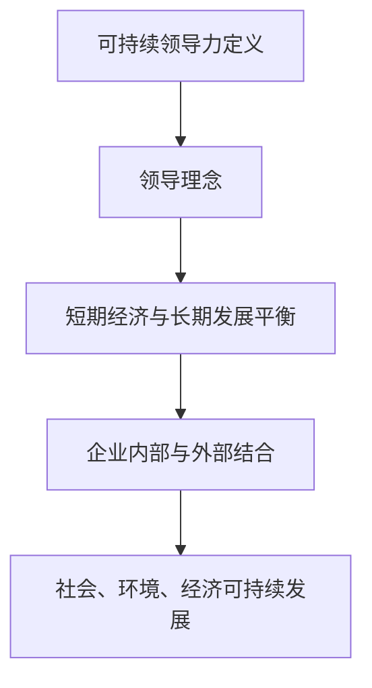

#### 1.1.2 可持续领导力的价值

可持续领导力对于组织和社会具有深远的影响和价值：

- **提高企业竞争力**：通过关注长期利益，企业能够在激烈的市场竞争中保持优势。
- **促进社会和谐**：可持续领导力关注社会责任，有助于提升企业的社会形象，增强社会和谐。
- **保护环境**：可持续领导力强调环境保护，有助于推动绿色可持续发展。

**Mermaid 流程图：**

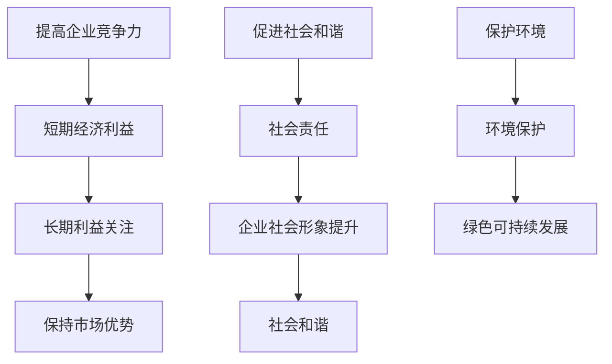

#### 1.1.3 可持续领导力与传统领导力的区别

可持续领导力与传统领导力相比，具有以下几个显著区别：

- **长期视角**：可持续领导力注重长期发展，而传统领导力更多关注短期目标。
- **综合思维**：可持续领导力关注企业、社会、环境的综合发展，而传统领导力往往只关注企业内部。
- **社会责任**：可持续领导力强调社会责任，而传统领导力则更多关注企业利润。

**Mermaid 流程图：**

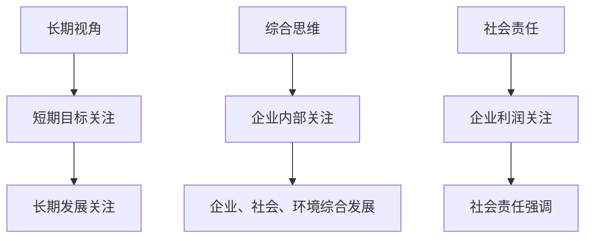

### 1.2 可持续领导力的发展历程

#### 1.2.1 从传统领导力到可持续领导力的转变

可持续领导力的发展历程可以追溯到20世纪中叶，随着全球环境问题和社会问题的日益凸显，领导者们开始意识到仅关注企业内部发展不足以应对全球性挑战。这一转变过程主要包括以下几个阶段：

1. **企业社会责任的兴起**（20世纪60年代）
   - 领导者开始关注企业对社会的责任，提出企业应承担更多社会责任。

2. **可持续发展理念的提出**（20世纪80年代）
   - 可持续发展概念正式提出，强调经济发展与环境保护的协调。

3. **企业战略与环境管理结合**（20世纪90年代）
   - 企业开始在战略规划中融入环境管理，实施绿色生产。

4. **可持续领导力的成熟**（21世纪初至今）
   - 领导者逐步认识到可持续领导力的重要性，将可持续发展作为企业核心战略。

**Mermaid 流程图：**

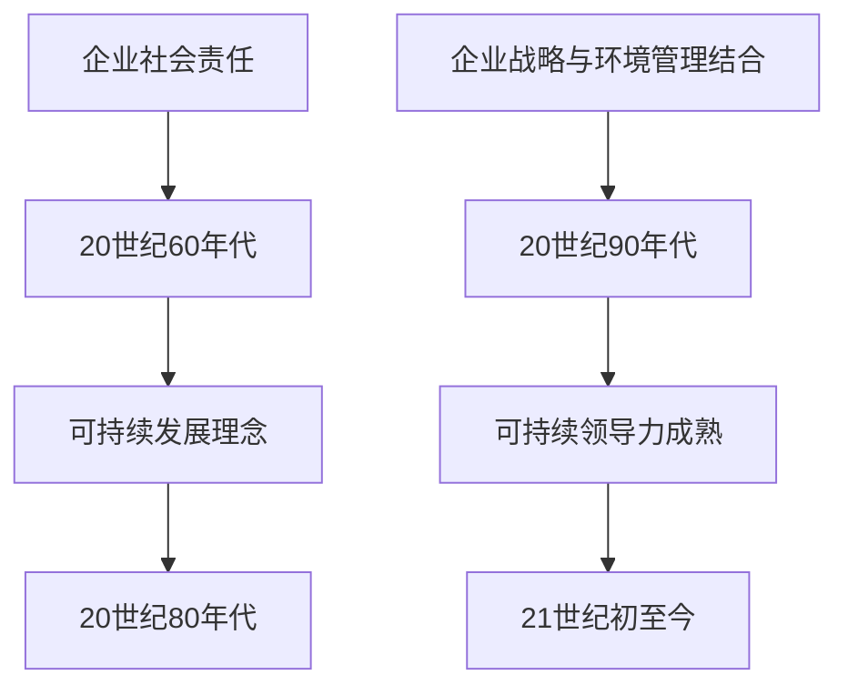

#### 1.2.2 可持续领导力的重要事件与人物

在可持续领导力的发展历程中，有一些重要事件和人物对其产生了深远影响：

1. **《我们共同的未来》报告**（1987年）
   - 由联合国世界环境与发展委员会发表，首次提出“可持续发展”概念。

2. **约翰·埃尔里奇（John Elkington）**
   - 提出了三重底线（Triple Bottom Line）理论，强调企业应同时关注经济效益、社会效益和环境效益。

3. **雷德·阿尔伯特（Ray Anderson）**
   - 美国地毯制造商Interface公司的创始人，倡导企业实现完全可持续性，成为全球可持续领导力的典范。

4. **尤金·罗杰斯（Eugene Rogers）**
   - 美国投资家，提出“绿色投资”理念，推动可持续领导力在资本市场的发展。

**Mermaid 流程图：**

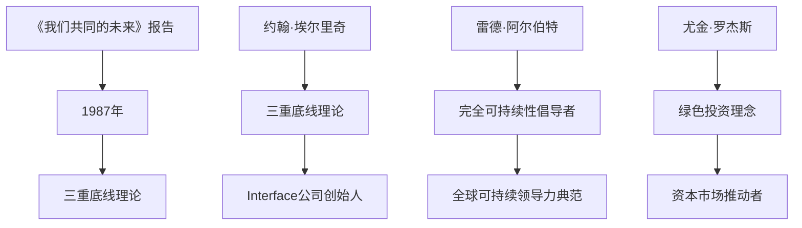

#### 1.2.3 全球可持续领导力发展现状

全球范围内，可持续领导力已逐渐成为企业战略的重要组成部分，各国政府、企业和社会组织都在积极推动可持续领导力的发展：

1. **发达国家**：发达国家在可持续领导力方面处于领先地位，企业普遍实施可持续战略，政府制定相关政策支持可持续发展。

2. **发展中国家**：尽管发展中国家在可持续领导力方面起步较晚，但近年来也在迅速发展，政府和企业开始重视可持续性，积极采取相关措施。

3. **国际组织**：如联合国、世界银行等国际组织积极推动可持续领导力，提出相关倡议和标准，为企业提供指导和支持。

**Mermaid 流程图：**

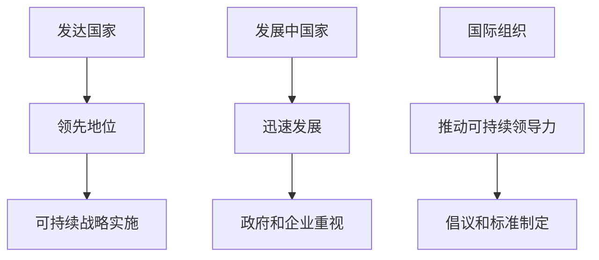

### 1.3 可持续领导力与关键概念的联系

可持续领导力与多个关键概念密切相关，共同构成其理论基础和实际应用：

1. **可持续发展目标（SDGs）**
   - 联合国提出的17个全球可持续发展目标，涵盖经济、社会和环境等多个方面，为可持续领导力提供了明确的目标和指导。

2. **社会责任（CSR）**
   - 企业在追求经济效益的同时，承担起对环境、社会和利益相关者的责任，是可持续领导力的核心内容。

3. **企业伦理与道德**
   - 企业在经营过程中遵循的道德规范和伦理标准，对可持续领导力具有重要的指导作用。

#### 1.3.1 可持续发展目标（SDGs）

可持续发展目标（SDGs）是联合国在2015年通过的一套全球发展议程，旨在解决全球面临的经济、社会和环境挑战。SDGs共包括17个目标，涵盖消除贫困、消除饥饿、健康、教育、性别平等、清洁饮水和卫生、经济增长、基础设施、减少不平等、气候变化、海洋和陆地生态系统的保护等多个方面。这些目标不仅为各国政府提供了行动指南，也为企业和社会组织提供了明确的可持续目标。

**Mermaid 流程图：**

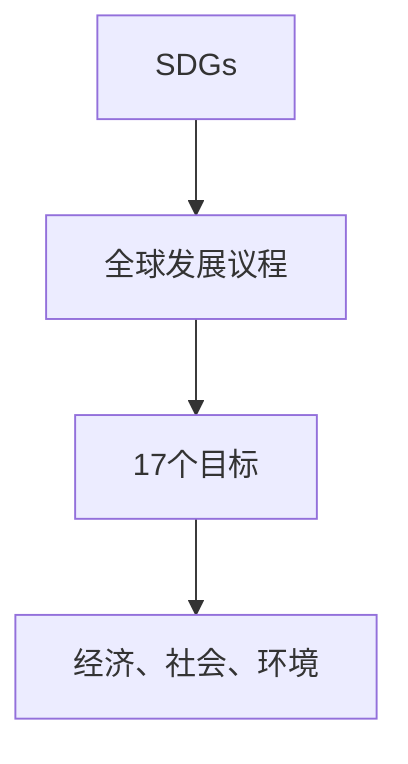

#### 1.3.2 社会责任（CSR）

社会责任（CSR）是指企业在追求经济利益的同时，承担起对环境、社会和利益相关者的责任。CSR涵盖了企业对环境的影响、员工的福祉、社区的参与和贡献等多个方面。企业在实施CSR时，不仅要关注内部管理和运营，还要考虑外部的社会和环境因素。

**Mermaid 流程图：**

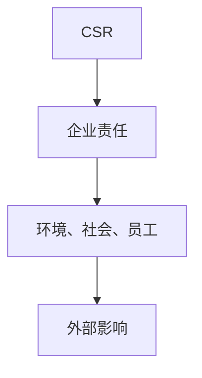

#### 1.3.3 企业伦理与道德

企业伦理与道德是指企业在经营过程中遵循的道德规范和伦理标准。企业伦理与道德不仅关系到企业的形象和声誉，还关系到企业的长期发展和可持续发展。企业在制定决策和实施管理时，需要考虑道德原则和伦理标准，确保企业的行为符合社会期望。

**Mermaid 流程图：**

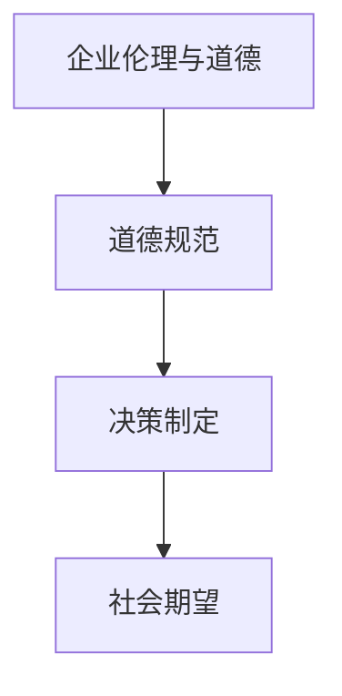

### 1.4 可持续领导力的核心要素

可持续领导力的核心要素包括持续创新能力、社会责任感和长期战略思维。这些要素共同构成了可持续领导力的重要基础，有助于企业在竞争激烈的市场环境中实现长期可持续发展。

#### 1.4.1 持续创新能力

持续创新能力是可持续领导力的关键要素之一。在快速变化的市场环境中，企业需要不断进行技术创新和管理创新，以保持竞争优势。持续创新能力不仅涉及技术层面的突破，还包括管理、流程和商业模式等方面的创新。

**Mermaid 流程图：**

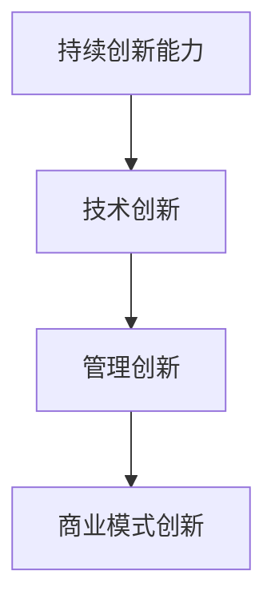

#### 1.4.2 社会责任感

社会责任感是可持续领导力的核心要素之一。企业不仅要追求经济效益，还要承担对环境、社会和利益相关者的责任。社会责任感体现在企业的决策和行为中，有助于提升企业的社会形象，增强企业的社会责任。

**Mermaid 流程图：**

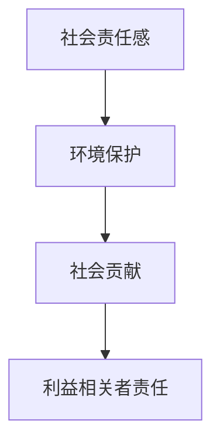

#### 1.4.3 长期战略思维

长期战略思维是可持续领导力的关键要素之一。企业领导者需要具备长远的眼光，关注企业的长期发展和可持续发展。长期战略思维有助于企业制定明确的战略目标，规划长远的发展路径。

**Mermaid 流程图：**

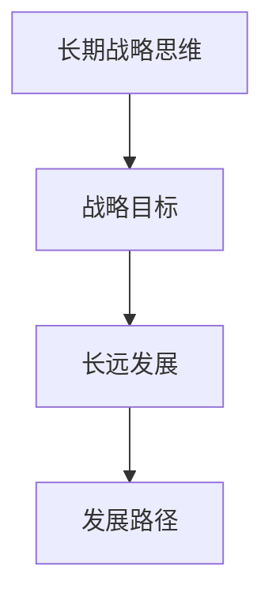

## 第二部分：可持续领导力实践方法论

### 2.1 可持续领导力模型构建

#### 2.1.1 可持续领导力模型框架

可持续领导力模型是一个系统化的框架，旨在帮助领导者理解和实践可持续领导力。该模型主要包括以下几个关键组成部分：

- **可持续领导力理念**：这是可持续领导力的基础，包括可持续发展的理念、社会责任感以及长期战略思维。
- **领导力行为**：领导者需要通过具体的行为来体现可持续领导力，如鼓励创新、关注社会责任、制定长期战略等。
- **组织文化**：组织文化是可持续领导力的重要支撑，一个健康、积极的文化有助于领导者实践可持续领导力。
- **绩效评估**：绩效评估体系是确保可持续领导力实施的重要手段，通过评估领导者的表现，可以及时发现问题并加以改进。

**Mermaid 流程图：**

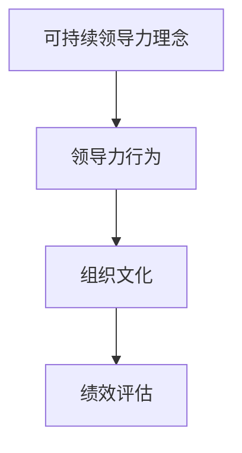

#### 2.1.2 模型构建方法与步骤

构建可持续领导力模型的方法和步骤如下：

1. **评估现有领导力模式**：首先，领导者需要对现有领导力模式进行评估，识别其优势和不足，为构建新模型提供依据。

2. **确定可持续领导力目标**：明确企业或组织在可持续领导力方面的目标，包括可持续发展的理念、社会责任感以及长期战略思维。

3. **设计领导力行为框架**：根据可持续领导力目标，设计具体的领导力行为框架，明确领导者在各个方面的责任和行为规范。

4. **建立组织文化**：组织文化是可持续领导力的重要支撑，需要通过培训、激励和制度建设等手段，建立积极、健康的企业文化。

5. **制定绩效评估体系**：建立科学的绩效评估体系，对领导者的表现进行评估，确保可持续领导力模型的实施效果。

**Mermaid 流程图：**

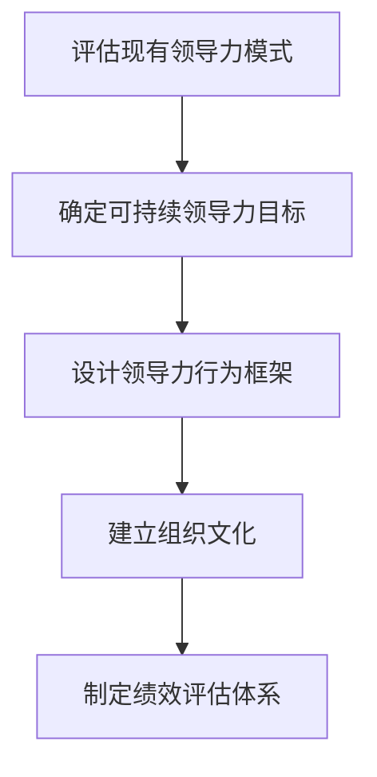

#### 2.1.3 模型应用案例分析

以下是一个实际应用案例，展示了如何在一个企业中构建和实施可持续领导力模型：

- **企业背景**：某大型跨国公司，业务涵盖多个领域，面临激烈的市场竞争和可持续发展的挑战。

- **目标设定**：公司高层确定在2025年前实现可持续发展，包括环境、社会和经济效益的全面提升。

- **领导力行为框架**：公司制定了详细的领导力行为框架，明确领导者在可持续发展方面的责任和行为规范，如鼓励创新、关注社会责任、制定长期战略等。

- **组织文化建设**：公司通过内部培训、员工激励和制度建设，建立了积极、健康的企业文化，鼓励员工积极参与可持续发展。

- **绩效评估体系**：公司建立了科学的绩效评估体系，对领导者的表现进行评估，确保可持续领导力模型的实施效果。

**Mermaid 流程图：**

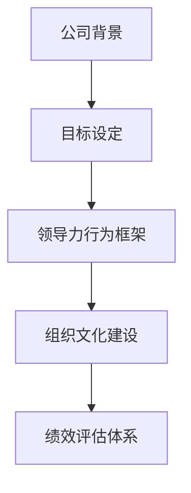

### 2.2 可持续领导力战略规划

#### 2.2.1 战略规划的核心要素

战略规划是可持续领导力的重要组成部分，它帮助企业在复杂多变的环境中保持竞争优势。一个成功的战略规划应包括以下几个核心要素：

- **愿景与目标**：明确企业未来发展的方向和目标，为战略规划的制定提供指导。
- **环境分析**：对内部和外部环境进行深入分析，了解企业面临的机会和挑战。
- **资源分配**：合理分配资源，确保战略规划的顺利实施。
- **实施计划**：制定详细的实施计划，明确各个阶段的目标和任务。
- **评估与调整**：定期评估战略规划的实施效果，根据实际情况进行调整。

**Mermaid 流程图：**

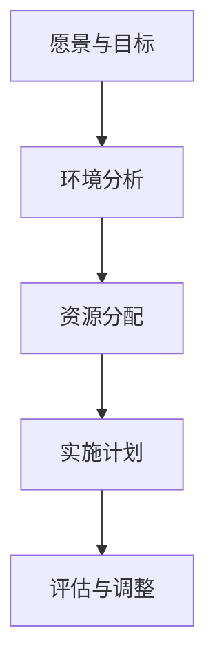

#### 2.2.2 战略规划的实施路径

战略规划的实施路径通常包括以下几个步骤：

1. **制定战略规划**：根据企业的愿景和目标，结合环境分析，制定详细的战略规划。

2. **资源整合**：确保战略规划所需的资源得到合理配置，包括资金、人力和技术等。

3. **实施与执行**：按照实施计划，逐步推进战略规划的各个阶段。

4. **监控与评估**：定期监控战略规划的实施情况，评估实施效果，并根据实际情况进行调整。

5. **反馈与优化**：收集实施过程中的反馈信息，对战略规划进行优化，确保其持续有效。

**Mermaid 流程图：**

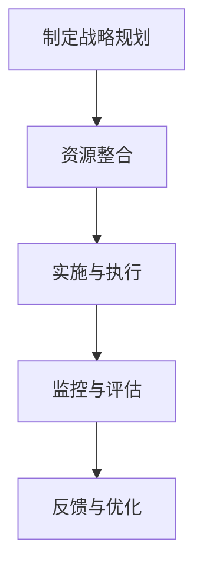

#### 2.2.3 战略规划案例解析

以下是一个战略规划的案例解析，展示了如何制定和实施一个有效的战略规划：

- **企业背景**：某科技创新型企业，致力于开发绿色能源技术，面临市场竞争和可持续发展等多重挑战。

- **愿景与目标**：企业愿景是成为全球领先的绿色能源技术解决方案提供商，短期目标是实现盈利，长期目标是推动全球能源转型。

- **环境分析**：通过市场调研和分析，企业发现绿色能源市场潜力巨大，但也面临技术竞争和监管政策的不确定性。

- **战略规划**：企业制定了以下战略规划：
  - 投资研发，提升技术水平，确保产品的市场竞争力。
  - 建立合作伙伴关系，拓展市场份额。
  - 关注政策变化，确保企业合规运营。

- **实施与执行**：企业按照战略规划，逐步推进各项任务，包括研发投入、市场拓展和合规运营等。

- **监控与评估**：企业建立了定期评估机制，对战略规划的实施效果进行监控，并根据实际情况进行调整。

- **反馈与优化**：企业通过收集客户反馈和市场信息，不断优化战略规划，确保其持续有效。

**Mermaid 流程图：**

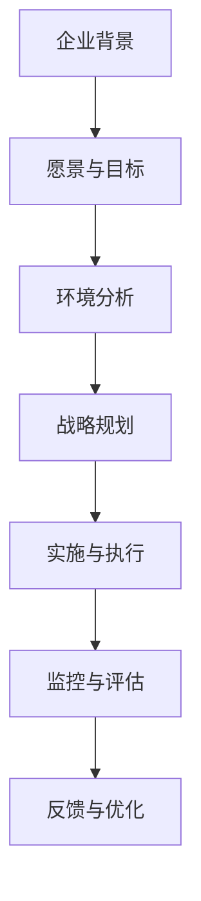

### 2.3 可持续领导力领导风格

#### 2.3.1 领导风格与可持续领导力的关系

领导风格是领导者对待员工、团队和管理的一种方式，对可持续领导力具有深远影响。不同的领导风格会影响企业的文化、员工的工作态度和行为，进而影响企业的可持续发展。因此，领导者需要根据可持续领导力要求，选择合适的领导风格。

**Mermaid 流程图：**

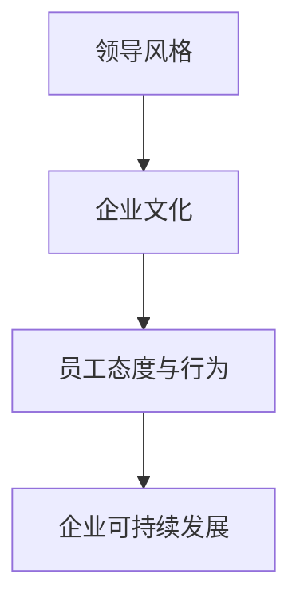

#### 2.3.2 不同领导风格在可持续领导中的应用

不同的领导风格适用于不同的情境和目标，以下是几种常见的领导风格在可持续领导中的应用：

1. **民主型领导风格**：
   - 强调参与和合作，鼓励员工提出意见和建议，提高团队的凝聚力和创新力。
   - 适用场景：企业面临重大变革或创新挑战时，需要充分发挥团队智慧。

2. **权威型领导风格**：
   - 强调决策的快速和高效，领导者具有较强的控制力和执行力。
   - 适用场景：企业面临紧急情况或需要快速作出决策时。

3. **变革型领导风格**：
   - 强调变革和创新，鼓励员工接受新观念和新方法，推动企业持续发展。
   - 适用场景：企业需要转型升级或应对市场变化时。

4. **服务型领导风格**：
   - 强调为员工提供支持和帮助，关注员工的需求和成长，提高员工的满意度和忠诚度。
   - 适用场景：企业需要建立积极、健康的企业文化。

**Mermaid 流程图：**

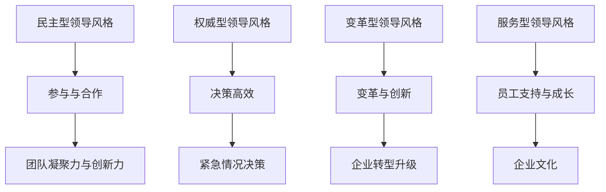

#### 2.3.3 领导风格转变策略

领导者需要根据可持续领导力的要求，适时调整自己的领导风格。以下是一些领导风格转变的策略：

1. **自我反思**：
   - 定期进行自我反思，了解自己在领导风格上的优势和不足，明确需要改进的方面。

2. **学习与培训**：
   - 参加领导力培训和学习，了解不同领导风格的特点和应用场景，提升自己的领导能力。

3. **实践与反馈**：
   - 在实际工作中，尝试应用不同的领导风格，并根据员工的反馈进行调整。

4. **建立支持体系**：
   - 建立一个支持体系，如导师制度、反馈机制等，帮助领导者更好地适应新的领导风格。

**Mermaid 流程图：**

```mermaid
graph TD
    A[自我反思] --> B[了解优势与不足]
    B --> C[改进方面]

    D[学习与培训] --> E[了解领导风格]
    E --> F[提升领导能力]

    G[实践与反馈] --> H[应用不同风格]
    H --> I[根据反馈调整]

    J[建立支持体系] --> K[导师制度]
    K --> L[反馈机制]
```

### 2.4 可持续领导力团队建设

#### 2.4.1 团队建设的重要性

团队建设是可持续领导力的重要组成部分，一个高效的团队能够提升企业的竞争力，推动企业的可持续发展。团队建设的重要性体现在以下几个方面：

1. **提高团队凝聚力**：通过团队建设活动，增强团队成员之间的信任和合作，提高团队的凝聚力。

2. **提升团队效率**：高效的团队能够更好地完成工作任务，提高企业的生产力和竞争力。

3. **培养团队精神**：团队建设有助于培养团队成员的团队精神，增强员工的归属感和忠诚度。

4. **促进创新与学习**：团队建设鼓励团队成员之间的互动和交流，促进创新和学习。

**Mermaid 流程图：**

```mermaid
graph TD
    A[提高团队凝聚力] --> B[增强信任与合作]
    B --> C[提高团队效率]

    D[培养团队精神] --> E[增强归属感与忠诚度]
    E --> F[促进创新与学习]
```

#### 2.4.2 团队建设的方法与技巧

有效的团队建设需要结合团队的特点和需求，采取多种方法和技巧。以下是几种常用的团队建设方法和技巧：

1. **沟通与交流**：
   - 通过定期的团队会议、讨论和交流，增进团队成员之间的了解，促进团队协作。

2. **培训与学习**：
   - 组织团队培训和学习活动，提高团队成员的专业能力和团队协作能力。

3. **目标设定**：
   - 明确团队的目标和任务，确保团队成员明确自己的责任和期望，提高团队的执行力。

4. **激励机制**：
   - 设立激励机制，奖励团队成员的优异表现，激发团队成员的积极性和创造力。

**Mermaid 流程图：**

```mermaid
graph TD
    A[沟通与交流] --> B[增进了解与协作]
    B --> C[培训与学习]

    D[目标设定] --> E[明确责任与期望]
    E --> F[提高执行力]

    G[激励机制] --> H[奖励与激励]
    H --> I[激发积极性与创造力]
```

#### 2.4.3 团队建设成功案例分析

以下是一个团队建设成功案例分析，展示了如何通过团队建设提升团队绩效和公司竞争力：

- **企业背景**：某跨国公司，业务涵盖多个领域，面临市场竞争和团队绩效提升的挑战。

- **目标**：提升团队绩效，增强团队凝聚力，提高公司竞争力。

- **方法与技巧**：
  - 定期组织团队建设活动，如团队拓展训练、团队建设工作坊等，增强团队成员之间的信任和合作。
  - 开展专业培训，提升团队成员的专业能力和团队协作能力。
  - 设立团队目标，明确团队成员的责任和期望，提高团队的执行力。
  - 建立激励机制，奖励团队成员的优异表现，激发团队成员的积极性和创造力。

- **成果**：
  - 团队凝聚力显著提升，团队成员之间的信任和合作更加紧密。
  - 团队绩效不断提高，公司竞争力显著增强。
  - 员工满意度提高，员工流失率降低。

**Mermaid 流程图：**

```mermaid
graph TD
    A[企业背景] --> B[目标]
    B --> C[方法与技巧]

    D[成果] --> E[团队凝聚力提升]
    E --> F[团队绩效提高]

    G[成果] --> H[公司竞争力增强]
    H --> I[员工满意度提高]
```

## 第三部分：可持续领导力案例分析

### 3.1 全球知名企业的可持续领导力实践

#### 3.1.1 可口可乐的可持续发展领导力实践

可口可乐作为全球知名的饮料企业，在可持续发展方面做出了卓越的实践。以下是其主要实践内容：

1. **水资源管理**：
   - 可口可乐承诺实现水资源的零浪费，通过技术创新和节水措施，降低水消耗。
   - 与当地社区合作，开展水资源保护项目，支持当地水资源的可持续利用。

2. **包装与环保**：
   - 可口可乐致力于减少包装使用，推广可回收和可降解的包装材料。
   - 推广瓶装回收计划，鼓励消费者参与环保行动。

3. **气候变化应对**：
   - 可口可乐制定减排目标，减少温室气体排放，支持全球气候变化应对。

4. **社会责任**：
   - 可口可乐积极参与社会公益活动，支持教育、健康和环境保护等领域。

#### 3.1.2 联合利华的可持续发展领导力实践

联合利华作为全球领先的快速消费品企业，在可持续发展方面取得了显著成果。以下是其主要实践内容：

1. **可持续发展战略**：
   - 联合利华制定了“可持续生活计划”，旨在实现企业在环境、社会和经济方面的可持续发展。
   - 通过创新和数字化转型，提高生产效率和资源利用效率。

2. **供应链管理**：
   - 联合利华与供应商合作，推动可持续供应链管理，确保供应链的可持续性。
   - 提倡公平贸易，确保供应链中农产品的可持续生产和流通。

3. **社会责任**：
   - 联合利华积极参与社会公益事业，支持教育、健康和环境保护等领域。
   - 推广健康生活方式，提高消费者对可持续产品的认知和接受度。

#### 3.1.3 宝洁的可持续发展领导力实践

宝洁作为全球知名的消费品公司，在可持续发展方面有着广泛的实践。以下是其主要实践内容：

1. **环境责任**：
   - 宝洁致力于减少生产过程中的能源消耗和温室气体排放，推广清洁生产。
   - 通过使用可再生能源和循环利用资源，降低企业的环境足迹。

2. **社会责任**：
   - 宝洁积极参与社会公益活动，支持教育、健康和环境保护等领域。
   - 推广性别平等，支持女性在职场和社区的发展。

3. **产品创新**：
   - 宝洁致力于开发环保型产品，减少对环境的影响。
   - 推广健康生活方式，提高消费者的生活质量。

### 3.1.4 苹果公司的可持续领导力实践

苹果公司作为全球知名的科技公司，在可持续发展方面做出了积极的实践。以下是其主要实践内容：

1. **环境可持续性**：
   - 苹果公司致力于减少产品生命周期中的碳足迹，通过使用可再生能源、优化制造过程和推广回收利用。
   - 公司承诺到2030年实现完全碳中和。

2. **产品循环利用**：
   - 苹果推出了“iPhone升级计划”，鼓励用户升级旧设备，减少电子废弃物。
   - 推出Apple Watch的“以旧换新”服务，鼓励用户回收旧手表。

3. **社会责任**：
   - 苹果公司重视员工福利和多样性，提供良好的工作环境和职业发展机会。
   - 积极参与社区服务项目，支持教育和技术培训。

### 3.1.5 特斯拉的可持续领导力实践

特斯拉作为电动汽车和能源存储领域的先驱，在可持续发展方面有着独特的实践。以下是其主要实践内容：

1. **电动汽车推广**：
   - 特斯拉通过生产高性能、可持续的电动汽车，推动全球交通方式的转型。
   - 公司推出了多个电动汽车系列，包括Model S、Model 3和Model X。

2. **能源存储**：
   - 特斯拉开发了Powerwall家用电池储能系统，帮助家庭实现能源自给自足。
   - 推出了Powerpack商用储能系统，用于大型能源存储项目。

3. **可持续发展战略**：
   - 特斯拉承诺到2030年实现全面使用可再生能源，并推动全球能源结构转型。

### 3.1.6 英特尔公司的可持续领导力实践

英特尔作为全球领先的半导体制造商，在可持续发展方面有着显著的实践。以下是其主要实践内容：

1. **环境保护**：
   - 英特尔致力于减少生产过程中的能耗和废弃物，采用绿色制造技术。
   - 公司在多个生产基地实现了能源自给，使用太阳能和风能等可再生能源。

2. **社会责任**：
   - 英特尔通过教育和培训项目，支持社区发展和人才培养。
   - 公司积极参与社会公益活动，关注环境保护和可持续发展。

3. **技术创新**：
   - 英特尔持续投资研发，推动半导体技术的创新，为可持续发展提供技术支持。

### 3.1.7 谷歌的可持续领导力实践

谷歌作为全球领先的科技公司，在可持续发展方面有着全面的实践。以下是其主要实践内容：

1. **绿色能源**：
   - 谷歌采用绿色能源，降低数据中心的能源消耗。
   - 公司在全球范围内投资建设可再生能源项目，如太阳能农场和风力发电场。

2. **社会责任**：
   - 谷歌积极参与社会公益事业，支持教育、健康和环境保护等领域。
   - 公司提供免费的教育资源和工具，帮助全球学生和教师。

3. **员工福利**：
   - 谷歌为员工提供良好的工作环境和职业发展机会，重视员工的多元化和幸福感。

### 3.1.8 微软的可持续领导力实践

微软作为全球领先的软件和服务公司，在可持续发展方面做出了积极的实践。以下是其主要实践内容：

1. **环境保护**：
   - 微软致力于减少生产过程中的碳排放，采用绿色制造技术和可持续材料。
   - 公司在全球范围内推广使用可再生能源，减少对环境的影响。

2. **技术创新**：
   - 微软持续投资研发，推动云计算、人工智能和物联网等技术的创新，为可持续发展提供技术支持。

3. **社会责任**：
   - 微软积极参与社会公益事业，支持教育、健康和环境保护等领域。
   - 公司提供免费的技术资源和工具，帮助社区和学校实现数字化转型。

### 3.1.9 麦当劳的可持续领导力实践

麦当劳作为全球知名的快餐企业，在可持续发展方面做出了积极的实践。以下是其主要实践内容：

1. **供应链管理**：
   - 麦当劳与供应商合作，推动可持续供应链管理，确保供应链的可持续性。
   - 公司提倡使用可持续农产品的来源，减少对环境的影响。

2. **环境保护**：
   - 麦当劳致力于减少包装使用，推广可回收和可降解的包装材料。
   - 公司在餐厅和供应链中推广节能技术，减少能源消耗。

3. **社会责任**：
   - 麦当劳积极参与社会公益活动，支持教育、健康和环境保护等领域。
   - 公司提供营养教育和健康促进项目，帮助消费者建立健康的生活方式。

### 3.1.10 星巴克的可持续领导力实践

星巴克作为全球知名的咖啡连锁企业，在可持续发展方面有着卓越的实践。以下是其主要实践内容：

1. **咖啡农场的可持续发展**：
   - 星巴克与咖啡农场合作，推动可持续农业实践，提高农场的生产效率和生态效益。
   - 公司推出了“星巴克农场”项目，为咖啡农民提供技术支持和培训。

2. **环境保护**：
   - 星巴克致力于减少门店和供应链中的碳排放，推广可再生能源的使用。
   - 公司在门店设计中注重环保，使用可持续材料，减少废弃物产生。

3. **社会责任**：
   - 星巴克积极参与社会公益活动，支持教育、健康和环境保护等领域。
   - 公司提供社区支持项目，帮助改善当地社区的生活质量。

### 3.1.11 亚马逊的可持续领导力实践

亚马逊作为全球知名的电子商务和云计算公司，在可持续发展方面有着广泛的实践。以下是其主要实践内容：

1. **绿色物流**：
   - 亚马逊推动绿色物流，推广使用环保包装和可回收材料。
   - 公司投资建设可再生能源设施，降低物流和运营过程中的碳排放。

2. **可再生能源**：
   - 亚马逊在全球范围内投资建设太阳能和风力发电设施，降低公司的能源消耗。
   - 公司承诺到2040年实现运营范围内的完全碳中和。

3. **社会责任**：
   - 亚马逊积极参与社会公益事业，支持教育、健康和环境保护等领域。
   - 公司提供免费的技术资源和工具，帮助社区和学校实现数字化转型。

### 3.1.12 联合国的可持续发展领导力实践

联合国作为全球性的国际组织，在可持续发展方面发挥了重要作用。以下是其主要实践内容：

1. **可持续发展目标（SDGs）**：
   - 联合国提出了17个可持续发展目标，涵盖经济、社会和环境等多个方面，为全球可持续发展提供了指导。

2. **国际合作**：
   - 联合国通过国际合作，推动各国政府、企业和社会组织共同应对全球性挑战，实现可持续发展。

3. **技术支持**：
   - 联合国提供技术支持，帮助各国制定和实施可持续发展政策，推动技术创新和知识共享。

4. **社会责任**：
   - 联合国积极参与社会公益事业，支持教育、健康和环境保护等领域。
   - 组织全球性的活动，提高公众对可持续发展的认识和参与度。

### 3.1.13 世界自然基金会（WWF）的可持续领导力实践

世界自然基金会作为全球领先的环保组织，在可持续发展方面做出了重要的实践。以下是其主要实践内容：

1. **生态保护**：
   - WWF致力于保护自然环境和生物多样性，推动全球生态保护项目。
   - 组织国际性的保护行动，保护关键生态系统和物种。

2. **可持续发展**：
   - WWF推动可持续农业、渔业和森林管理，确保自然资源的可持续利用。
   - 开展环境教育和公众参与项目，提高公众的环保意识。

3. **国际合作**：
   - WWF与各国政府、企业和非政府组织合作，共同应对全球性环境问题。
   - 组织国际性的项目和倡议，推动全球可持续发展。

### 3.1.14 联合国环境规划署（UNEP）的可持续领导力实践

联合国环境规划署作为全球环境治理的重要机构，在可持续发展方面做出了卓越的贡献。以下是其主要实践内容：

1. **环境保护**：
   - UNEP致力于推动全球环境保护，制定和实施环境保护政策和法规。
   - 组织国际性的环境监测和评估，提供科学依据和政策建议。

2. **可持续发展**：
   - UNEP推动可持续经济发展，促进环境与经济的协调发展。
   - 开展环境教育和公众参与项目，提高公众的环保意识。

3. **国际合作**：
   - UNEP与各国政府、国际组织和非政府组织合作，共同应对全球性环境问题。
   - 组织国际性的项目和倡议，推动全球可持续发展。

### 3.1.15 国际红十字会与红新月会的可持续发展领导力实践

国际红十字会与红新月会作为全球最大的人道主义组织，在可持续发展方面发挥了重要作用。以下是其主要实践内容：

1. **人道援助**：
   - 国际红十字会与红新月会提供紧急人道援助，帮助受灾地区恢复重建。
   - 组织医疗援助、食物援助和住房援助等，保障受灾人群的基本生活需求。

2. **可持续发展**：
   - 组织可持续发展项目，支持受灾地区的经济重建和社会发展。
   - 推广可持续农业、水资源管理和环境保护等，提高受灾地区的可持续发展能力。

3. **国际合作**：
   - 国际红十字会与红新月会与各国政府、国际组织和非政府组织合作，共同应对全球性人道危机。
   - 组织国际性的救援行动，提高人道援助的效率和质量。

### 3.1.16 绿色和平组织的可持续发展领导力实践

绿色和平组织作为全球知名的环保组织，在可持续发展方面做出了积极的实践。以下是其主要实践内容：

1. **环境保护**：
   - 绿色和平组织致力于保护自然环境和生物多样性，推动全球环境保护项目。
   - 组织国际性的环保行动，反对环境污染和资源浪费。

2. **气候变化**：
   - 绿色和平组织积极参与气候变化谈判和环保行动，推动全球气候变化应对。
   - 推广可再生能源和减少温室气体排放，提高公众对气候变化问题的认知。

3. **国际合作**：
   - 绿色和平组织与各国政府、国际组织和非政府组织合作，共同应对全球性环境问题。
   - 组织国际性的项目和倡议，推动全球可持续发展。

### 3.1.17 碳排放权交易体系的可持续发展领导力实践

碳排放权交易体系是一种有效的市场机制，用于控制温室气体排放。以下是其主要实践内容：

1. **碳排放权分配**：
   - 政府制定碳排放权分配政策，将碳排放权分配给企业和个人。
   - 通过碳排放权交易市场，实现碳排放权的合理配置。

2. **碳排放权交易**：
   - 企业和个体可以在碳排放权交易市场上买卖碳排放权。
   - 碳排放权交易体系鼓励企业减少碳排放，实现环境可持续发展。

3. **监管与政策**：
   - 政府对碳排放权交易体系进行监管，确保市场的公平和透明。
   - 通过政策激励，推动企业实施低碳技术和可持续发展战略。

4. **国际合作**：
   - 各国政府通过国际合作，推动碳排放权交易体系的全球发展。
   - 制定国际标准和协议，促进碳排放权交易体系的协调和统一。

### 3.1.18 联合国可持续发展解决方案网络（SDSN）的可持续发展领导力实践

联合国可持续发展解决方案网络（SDSN）是一个全球性的网络，旨在推动实现联合国可持续发展目标（SDGs）。以下是其主要实践内容：

1. **知识共享**：
   - SDSN通过发布报告、研讨会和在线课程，共享可持续发展知识和经验。
   - 为各国政府、企业和非政府组织提供政策建议和技术支持。

2. **项目实施**：
   - SDSN与各国政府和企业合作，实施可持续发展项目。
   - 支持可再生能源、绿色经济和社会发展等领域的可持续发展项目。

3. **国际合作**：
   - SDSN促进各国政府、企业和非政府组织之间的国际合作。
   - 通过跨国合作项目，推动全球可持续发展目标的实现。

4. **教育培训**：
   - SDSN提供可持续发展教育和培训，提高公众对可持续发展问题的认知和参与度。

### 3.1.19 国际绿色经济研究所（IGEI）的可持续发展领导力实践

国际绿色经济研究所（IGEI）是一个专注于绿色经济和可持续发展研究的非政府组织。以下是其主要实践内容：

1. **绿色经济研究**：
   - IGEI进行绿色经济和可持续发展领域的深入研究，发布研究报告和政策建议。
   - 探讨绿色经济的发展路径和政策框架。

2. **政策倡导**：
   - IGEI参与政策制定和倡导，推动绿色经济政策的实施。
   - 通过国际合作，推动全球绿色经济和可持续发展的发展。

3. **教育培训**：
   - IGEI提供绿色经济和可持续发展相关的教育培训，提高公众和专业人员的意识和能力。

4. **国际合作**：
   - IGEI与各国政府、国际组织和非政府组织合作，共同推动绿色经济和可持续发展。

### 3.1.20 联合国环境规划署（UNEP）的可持续发展领导力实践

联合国环境规划署（UNEP）是联合国系统内负责环境事务的机构，以下是其主要实践内容：

1. **环境政策制定**：
   - UNEP参与国际环境政策的制定和实施，推动全球环境治理。
   - 发布环境评估报告，为政策制定提供科学依据。

2. **环境监测**：
   - UNEP开展全球环境监测，包括气候变化、生物多样性、水资源等。
   - 通过卫星遥感技术、地面监测网络等手段，提供环境数据。

3. **国际合作**：
   - UNEP促进各国政府、国际组织和非政府组织之间的合作。
   - 组织国际环境会议和谈判，推动

