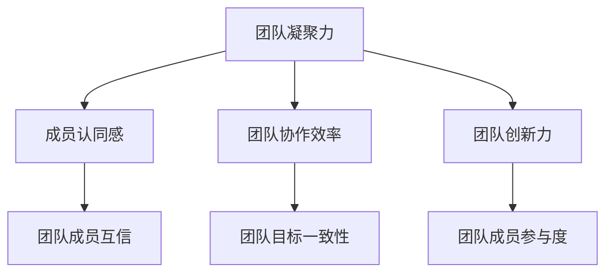

                 

# 团队凝聚力：从我到我们的蜕变

> **关键词**：团队凝聚力、个人影响力、团队建设、领导力、跨文化团队、项目管理、沟通技巧

> **摘要**：本文旨在探讨团队凝聚力的核心概念、影响因素以及提升策略。通过分析团队凝聚力的重要性，结合实际案例和项目实践，本文将深入探讨如何通过个人影响力、团队建设活动、领导力和沟通技巧来提升团队凝聚力，以实现从“我”到“我们”的蜕变。

## 第一部分：核心概念与联系

### 第1章：团队凝聚力的定义与重要性

**核心概念与联系**

团队凝聚力是一个复杂的概念，涉及到多个核心要素。为了更好地理解团队凝聚力，我们可以使用Mermaid流程图来展示这些核心概念及其相互之间的联系。



**团队凝聚力原理**

团队凝聚力的原理可以理解为多个团队成员之间信任、协作和创新力的综合表现。为了更清晰地阐述团队凝聚力的原理，我们可以使用伪代码来描述团队凝聚力计算的方法。

```python
def team_cohesion_score(member_list):
    trust_score = 0
    collaboration_score = 0
    innovation_score = 0
    for member in member_list:
        trust_score += member.trust_level
        collaboration_score += member.collaboration_efficiency
        innovation_score += member.innovation_ability
    return (trust_score + collaboration_score + innovation_score) / len(member_list)
```

### 第2章：影响团队凝聚力的关键因素

**关键因素**

团队凝聚力受到多种关键因素的影响，包括个人特质、团队结构、工作环境等。以下是影响团队凝聚力的关键因素列表：

- 个人特质：包括性格、价值观、沟通能力等。
- 团队结构：包括团队规模、组织架构、角色分工等。
- 工作环境：包括企业文化、领导风格、工作氛围等。

**数学模型**

为了定量分析团队凝聚力的影响因素，我们可以使用LaTeX公式来表示团队凝聚力的数学模型。

$$\text{Team Cohesion} = f(\text{Personal Traits}, \text{Team Structure}, \text{Work Environment})$$

## 第二部分：团队凝聚力提升策略

### 第3章：个人影响力与团队凝聚力的提升

**个人影响力提升方法**

个人影响力是提升团队凝聚力的重要途径。以下是一些通过提升个人影响力来增强团队凝聚力的方法：

- **积极沟通**：通过主动沟通，增加团队成员之间的了解和信任。
- **专业能力**：通过不断提高自己的专业能力，成为团队中的核心人物。
- **团队合作**：积极参与团队活动，展现团队合作精神。

### 第4章：团队建设活动与凝聚力提升

**团队建设活动设计**

团队建设活动是提升团队凝聚力的重要手段。以下是一些有效的团队建设活动：

- **团队拓展训练**：通过户外拓展训练，增强团队成员之间的信任和协作。
- **团队讨论会**：定期组织团队讨论会，促进团队成员之间的沟通和交流。

**活动效果评估**

为了评估团队建设活动对团队凝聚力的影响，我们可以使用LaTeX公式来计算活动效果。

$$\text{Effectiveness} = \frac{\text{Post-Activity Cohesion Score} - \text{Pre-Activity Cohesion Score}}{\text{Pre-Activity Cohesion Score}}$$

### 第5章：领导者角色在团队凝聚力中的作用

**领导力模型**

领导力在团队凝聚力中起着至关重要的作用。以下是一些常见的领导力模型：

- **情境领导理论**：根据团队成员的成熟度选择合适的领导风格。
- **领导风格理论**：根据领导者的个性特征和团队需求，选择合适的领导风格。

**领导力实践**

领导者可以通过以下实践来提升团队凝聚力：

- **树立共同目标**：明确团队的目标和愿景，激发团队成员的参与热情。
- **鼓励团队合作**：鼓励团队成员积极参与团队合作，共同完成任务。
- **关注团队成员成长**：关注团队成员的成长和发展，提供必要的支持和指导。

### 第6章：团队沟通技巧与凝聚力提升

**沟通技巧**

有效的沟通是提升团队凝聚力的关键。以下是一些有效的沟通技巧：

- **积极倾听**：认真倾听团队成员的意见和想法，尊重他们的观点。
- **非言语沟通**：通过肢体语言、面部表情等非言语方式，增强沟通效果。

**沟通效果评估**

为了评估沟通技巧对团队凝聚力的影响，我们可以使用LaTeX公式来计算沟通效果。

$$\text{Communication Effectiveness} = \frac{\text{Improved Cohesion} - \text{Original Cohesion}}{\text{Original Cohesion}}$$

### 第7章：跨文化团队凝聚力建设

**文化差异分析**

跨文化团队中，文化差异可能会影响团队成员之间的沟通和协作。以下是一些常见的文化差异：

- **时间观念**：不同文化对时间的重视程度不同。
- **沟通风格**：不同文化背景的人可能具有不同的沟通风格。

**跨文化凝聚力策略**

为了应对文化差异，提升跨文化团队的凝聚力，可以采取以下策略：

- **文化培训**：为团队成员提供文化培训，提高他们的跨文化沟通能力。
- **相互尊重**：尊重团队成员的文化差异，促进相互理解和信任。

## 第三部分：团队凝聚力案例分析与应用

### 第8章：团队凝聚力成功案例分析

**案例介绍**

以下是一些团队凝聚力成功的案例：

- **Google**：通过扁平化管理、鼓励创新和团队合作，实现了高水平的团队凝聚力。
- **Facebook**：通过开放的文化和透明的沟通，建立了强大的团队凝聚力。

**案例分析**

通过具体案例，我们可以看到团队凝聚力成功的关键因素：

- **共同目标**：团队成员共同追求同一个目标，增强了团队凝聚力。
- **领导力**：领导者在团队凝聚力中起到了关键作用，通过激励和引导，提升了团队的凝聚力。

### 第9章：团队凝聚力在项目管理中的应用

**项目管理模型**

在项目管理中，团队凝聚力是项目成功的关键因素。以下是一个简单的项目管理模型，展示了如何将团队凝聚力融入项目管理中：

- **需求分析**：明确项目目标和需求，确保团队成员对项目的理解一致。
- **团队组建**：选择合适的人员组成团队，确保团队成员之间的协作和信任。
- **项目执行**：通过有效的沟通和协作，确保项目按计划进行。
- **项目评估**：对项目进行评估，总结经验教训，持续提升团队凝聚力。

**项目实例**

以下是一个实际项目的案例，说明了如何通过提升团队凝聚力来提高项目成功率：

- **项目背景**：某企业进行一次新产品的研发。
- **团队凝聚力提升**：通过团队建设活动和有效的沟通，提升了团队的凝聚力。
- **项目结果**：项目顺利完成，产品得到了市场的高度认可。

### 第10章：团队凝聚力测量与持续提升

**测量工具**

为了了解团队凝聚力的水平，我们可以使用以下测量工具：

- **团队管理评估（Team Management Survey, TMS）**：评估团队成员之间的信任、协作和目标一致性。
- **团队气候调查（Team Climate Survey）**：评估团队成员的工作环境、领导力和团队氛围。

**持续提升策略**

为了持续提升团队凝聚力，可以采取以下策略：

- **定期评估**：定期对团队凝聚力进行评估，及时发现和解决问题。
- **反馈与改进**：根据评估结果，对团队建设活动、领导力和沟通技巧进行改进。
- **持续培训**：为团队成员提供持续培训，提高他们的沟通能力和团队合作精神。

### 附录

#### 附录 A：团队凝聚力提升资源

**推荐书籍**

- 《团队智慧：团队协作的艺术》（The Wisdom of Teams） - 由迈克·罗杰斯（Mike Rose）和汤姆·派迪（Tom DeMarco）合著，详细阐述了团队协作的原理和实践。
- 《领导力：从技术到艺术》（Leadership：From Art to Skill） - 由约翰·麦克斯韦尔（John C. Maxwell）著，介绍了领导力的核心概念和实践方法。

**网络资源**

- **在线课程**：如Coursera、Udemy等平台上关于团队建设、领导力和沟通技巧的在线课程。
- **论文与博客**：学术期刊、专业博客和论坛上的相关论文和文章，提供最新的研究成果和实战经验。

**作者**

作者：AI天才研究院/AI Genius Institute & 禅与计算机程序设计艺术 /Zen And The Art of Computer Programming

---

本文通过对团队凝聚力的定义、影响因素、提升策略以及实际应用的深入探讨，为读者提供了一个全面的团队凝聚力提升指南。通过本文的阐述，读者可以更好地理解团队凝聚力的本质，并学会如何在实际工作中提升团队凝聚力，实现从“我”到“我们”的蜕变。希望本文对读者有所帮助，让团队凝聚力的提升成为团队成功的关键因素。|>

