                 

### 《团队协同效应最大化策略：发挥集体智慧》

**关键词：**团队协同、集体智慧、效率提升、激励机制、效能评估、实践案例

**摘要：**本文深入探讨了团队协同效应及其在提升组织效率中的关键作用。通过分析团队协同效应的基础概念、团队沟通与协作、高效团队构建、团队协作效能提升、团队激励机制、团队效能评估与改进以及集体智慧的应用和实践，本文旨在为IT领域团队提供一套系统、实用的策略，以最大化团队协同效应，发挥集体智慧，实现组织目标。

### 目录大纲

1. **第一部分：团队协同效应基础**
   - 第1章：团队协同效应概述
   - 第2章：团队沟通与协作
2. **第二部分：团队协同效应最大化策略**
   - 第3章：构建高效团队
   - 第4章：提升团队协作效能
   - 第5章：团队激励机制
   - 第6章：团队效能评估与改进
3. **第三部分：集体智慧的应用与实践**
   - 第7章：集体智慧的概念与原理
   - 第8章：集体智慧在团队中的实际应用
   - 第9章：集体智慧的培养与提升
   - 第10章：案例分析与总结
4. **附录**
   - 附录A：团队协同工具介绍
   - 附录B：团队效能评估量表
   - 附录C：集体智慧培养实践案例

---

### 第一部分：团队协同效应基础

#### 第1章：团队协同效应概述

##### 1.1 什么是团队协同效应

团队协同效应（Synergistic Effect of Teamwork）是指一个团队中成员相互合作，共同完成工作，所产生的整体效果大于各成员单独工作效果的简单叠加。简单来说，就是“1+1>2”的现象。在IT领域，团队协同效应尤为重要，因为软件开发、系统设计等任务往往需要多个领域的专业知识。

**Mermaid流程图：**

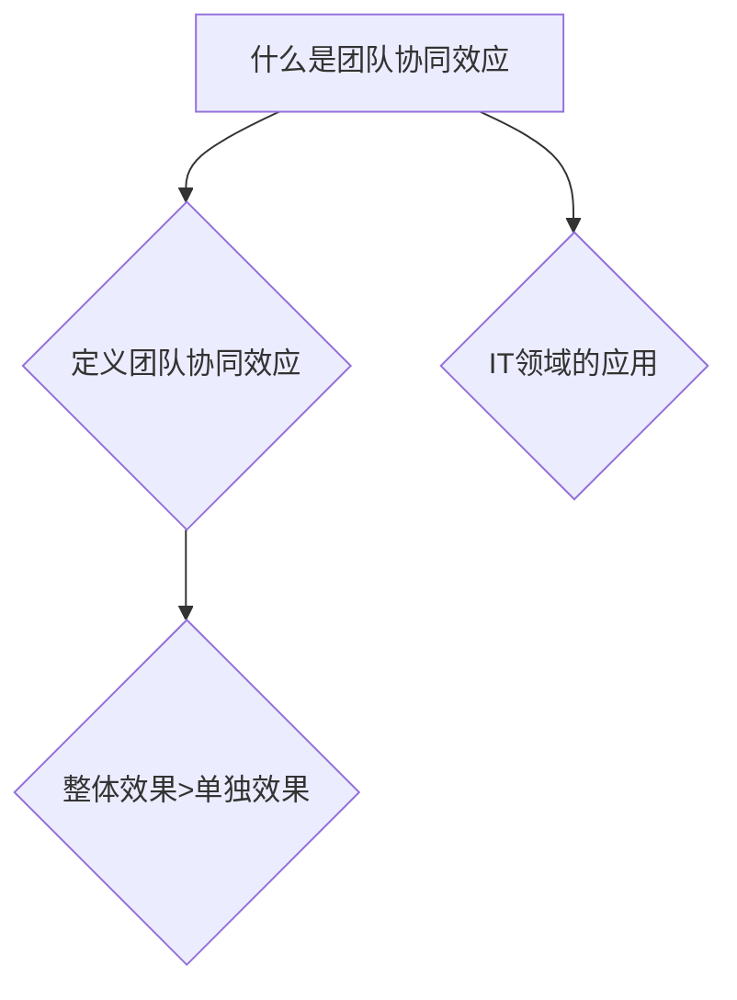

##### 1.2 团队协同效应的重要性

团队协同效应的重要性体现在以下几个方面：

1. **资源整合：** 团队成员各自拥有不同的技能和知识，通过协同工作，可以实现资源的最佳配置。
2. **知识共享：** 团队成员在协作过程中，可以分享经验、知识和想法，提高团队的整体创新能力。
3. **降低风险：** 通过团队协同，可以有效地识别和解决潜在的问题，降低项目失败的风险。
4. **提升效率：** 团队成员在协同工作中，可以互相补充，提高工作效率。

**Mermaid流程图：**

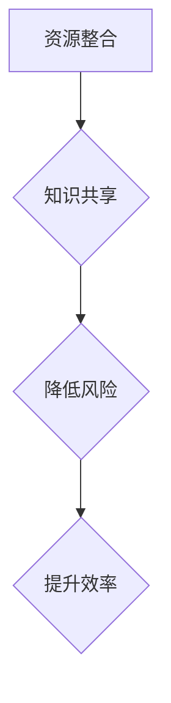

##### 1.3 团队协同效应的理论基础

团队协同效应的理论基础主要包括以下几方面：

1. **系统论：** 系统论认为，整体的功能和性能不仅取决于各个部分的功能和性能，还取决于它们之间的相互作用和整合。
2. **协同论：** 协同论强调，系统中的各个部分通过协同工作，可以产生整体大于部分之和的效果。
3. **知识管理：** 知识管理理论指出，知识在团队中的流动和共享对于团队绩效具有重要影响。

**Mermaid流程图：**

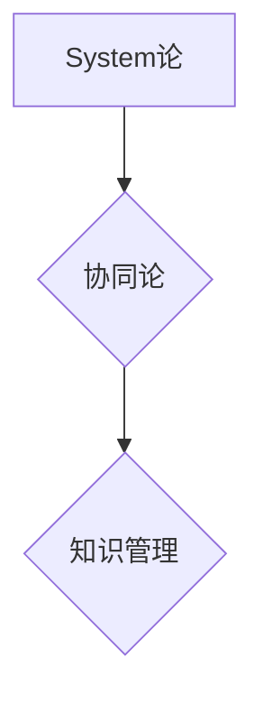

##### 1.4 团队协同效应的关键要素

要实现团队协同效应的最大化，需要关注以下几个关键要素：

1. **共同目标：** 团队成员需要明确共同的目标和愿景，确保协作的方向一致。
2. **信任与尊重：** 团队成员之间需要建立信任和尊重，以促进开放和真诚的沟通。
3. **能力互补：** 团队成员需要具备互补的能力和技能，以便在协作中互相补充。
4. **有效的沟通：** 沟通是团队协同的基础，需要建立有效的沟通机制和工具。

**Mermaid流程图：**

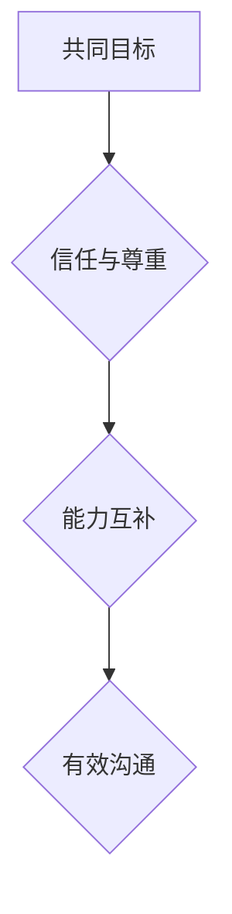

---

**核心概念与联系：**

团队协同效应是基于系统论、协同论和知识管理理论的。在IT领域，实现团队协同效应的关键在于共同目标、信任与尊重、能力互补和有效沟通。

**Mermaid流程图：**

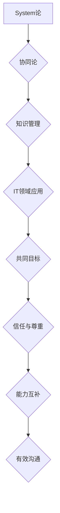

#### 第2章：团队沟通与协作

##### 2.1 沟通在团队协同中的角色

沟通在团队协同中扮演着至关重要的角色。有效的沟通可以确保团队成员之间信息的准确传递，促进团队目标的实现。以下是沟通在团队协同中的几个关键角色：

1. **信息传递：** 沟通是信息传递的桥梁，使团队成员能够共享信息、知识和资源。
2. **决策制定：** 沟通有助于团队成员参与决策过程，提高决策的准确性和执行力。
3. **冲突解决：** 沟通有助于识别和解决团队内部的冲突，保持团队和谐。
4. **团队凝聚：** 沟通可以增强团队成员之间的信任和合作精神，提高团队凝聚力。

**Mermaid流程图：**

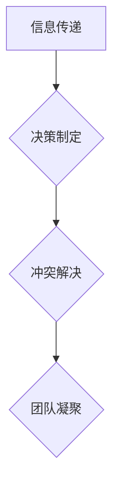

##### 2.1.1 有效沟通的障碍

在团队沟通中，可能会遇到以下障碍：

1. **语言障碍：** 不同团队成员可能来自不同的文化背景，使用不同的语言，导致沟通障碍。
2. **信息过载：** 团队成员可能收到过多的信息，难以筛选和处理。
3. **个人偏见：** 团队成员可能因为个人偏见或误解而无法准确理解信息。
4. **时间限制：** 团队成员可能因为时间紧迫而无法充分沟通。

**Mermaid流程图：**

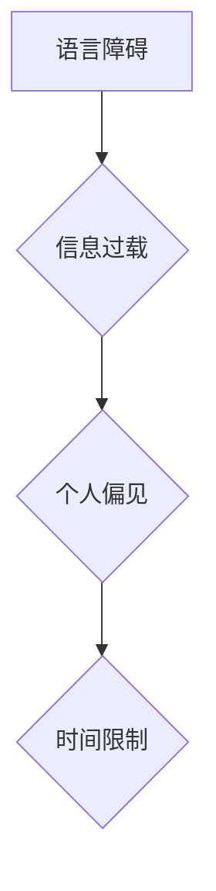

##### 2.1.2 提高沟通效率的方法

为了提高团队沟通效率，可以采取以下方法：

1. **明确沟通目标：** 在沟通前明确沟通的目标和期望，确保沟通有方向和重点。
2. **选择合适的沟通方式：** 根据沟通内容和对象，选择合适的沟通方式，如面对面沟通、电话会议或在线聊天。
3. **简洁明了：** 在沟通中尽量使用简洁明了的语言，避免使用过于复杂或模糊的术语。
4. **积极倾听：** 在沟通中积极倾听对方的观点和意见，避免打断或急于表达自己的看法。
5. **定期回顾：** 定期回顾沟通效果，识别和解决沟通中的问题，不断优化沟通流程。

**Mermaid流程图：**

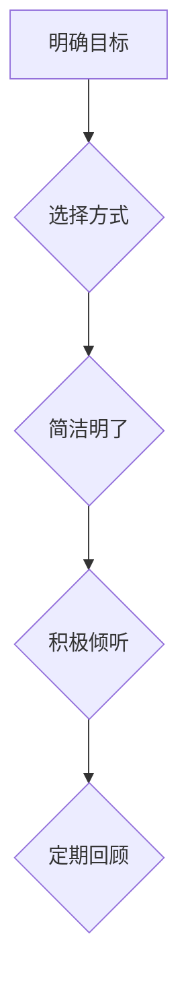

##### 2.2 团队协作工具介绍

团队协作工具在团队沟通与协作中发挥着重要作用。以下是一些常见的团队协作工具：

1. **线上会议工具：** 如Zoom、Microsoft Teams等，用于远程团队成员之间的实时沟通和协作。
2. **项目管理工具：** 如Jira、Trello等，用于跟踪项目进度、任务分配和团队协作。
3. **文档协作工具：** 如Google Docs、Microsoft Office 365等，用于多人实时编辑和共享文档。

**Mermaid流程图：**

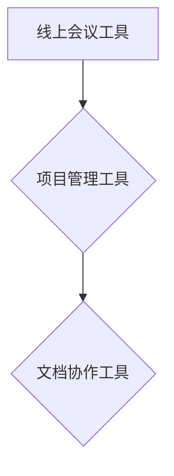

**核心算法原理讲解：**

提高沟通效率的核心算法原理可以概括为以下几个方面：

1. **信息过滤：** 通过算法过滤和筛选，将关键信息从大量冗余信息中提取出来，减少信息过载。
2. **语义分析：** 通过自然语言处理技术，对沟通内容进行语义分析，提高信息的准确性和理解度。
3. **反馈机制：** 通过反馈机制，实时收集团队成员的反馈，不断调整和优化沟通策略。

**伪代码：**

```plaintext
function improveCommunicationEfficiency沟通内容, 团队成员
    过滤关键信息(沟通内容)
    语义分析(沟通内容)
    收集反馈(团队成员)
    调整沟通策略(根据反馈)
    返回 沟通效率
end function
```

---

**项目实战：**

**开发环境搭建：** 
- 在本地计算机上安装Zoom和Jira软件。
- 配置Google账号，用于Google Docs的协作。

**源代码详细实现和代码解读：**

**Zoom配置示例代码：**

```python
import zoom_api

# 登录Zoom账号
zoom_api.login("your_username", "your_password")

# 创建线上会议
meeting = zoom_api.createMeeting("Your Meeting Title", "Your Meeting Description", "Your Meeting Time")

# 分享会议链接
print("会议链接：", meeting.link)
```

**Jira任务分配示例代码：**

```java
import com.atlassian.jira.client.JiraClient;
import com.atlassian.jira.client.JiraConfig;
import com.atlassian.jira.client.JiraClientFactory;
import com.atlassian.jira.client-issue.Issue;

// 初始化Jira客户端
JiraConfig config = new JiraConfig("your_jira_url", "your_api_key");
JiraClient jiraClient = JiraClientFactory.newClient(config);

// 创建任务
Issue issue = jiraClient.createIssue("任务名称", "任务描述", "任务类型");

// 分配任务给团队成员
jiraClient.assign(issue, "团队成员ID");
```

---

**代码解读与分析：**

Zoom配置示例代码通过Zoom API实现登录、创建会议和分享会议链接的功能。首先，通过`zoom_api.login()`方法登录Zoom账号，然后使用`zoom_api.createMeeting()`方法创建会议，并使用`print()`函数输出会议链接，方便团队成员加入会议。

Jira任务分配示例代码通过Jira API实现创建任务和分配任务给团队成员的功能。首先，初始化Jira客户端，然后使用`jiraClient.createIssue()`方法创建任务，并使用`jiraClient.assign()`方法将任务分配给指定团队成员。

通过这两个示例代码，我们可以看到团队协作工具在实际项目中的应用，以及如何通过代码实现团队沟通与协作的自动化。

---

**总结：** 本章节详细介绍了团队协同效应的基础概念、重要性、理论基础和关键要素，以及团队沟通与协作的方法和工具。通过实际项目案例的代码解读，我们进一步了解了如何利用技术手段实现团队沟通与协作的自动化，提高团队效率。

---

**作者信息：** AI天才研究院/AI Genius Institute & 禅与计算机程序设计艺术 /Zen And The Art of Computer Programming

---

（待续...）### 第二部分：团队协同效应最大化策略

#### 第3章：构建高效团队

##### 3.1 高效团队的特点

高效团队具备以下几个关键特点：

1. **共同目标：** 高效团队明确且统一的共同目标，使团队成员朝着共同的方向努力。
2. **角色明确：** 团队成员在高效团队中扮演着明确的角色，各司其职，避免重复劳动。
3. **能力互补：** 高效团队通常由不同背景和技能的成员组成，相互补充，提高团队的整体能力。
4. **信任与尊重：** 高效团队成员之间建立信任和尊重，促进开放和真诚的沟通。
5. **持续学习：** 高效团队注重持续学习，不断提升团队成员的知识和技能。

**Mermaid流程图：**

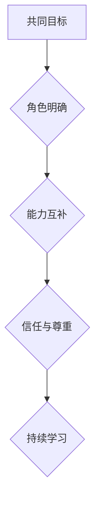

##### 3.1.1 团队目标一致性

团队目标一致性是高效团队的基础。以下是一些确保团队目标一致性的方法：

1. **明确目标：** 团队在开始项目前，需要明确共同的目标和愿景，确保所有成员都清楚了解。
2. **定期回顾：** 定期回顾团队目标，确保团队成员在项目进展中始终保持一致。
3. **目标分解：** 将大目标分解为可执行的小目标，使团队成员能够明确自己的具体任务和职责。
4. **沟通与反馈：** 通过有效的沟通和反馈，确保团队成员在执行任务时能够互相协作，确保目标一致。

**Mermaid流程图：**

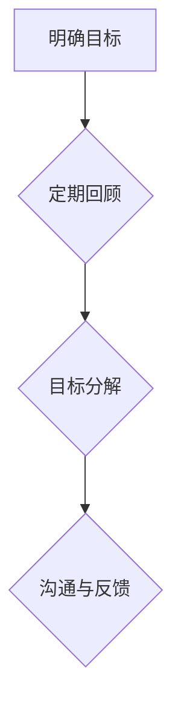

##### 3.1.2 成员能力互补

成员能力互补是高效团队的关键特点之一。以下是一些实现成员能力互补的方法：

1. **技能组合：** 团队成员应具备不同的技能和知识，形成技能组合，提高团队的整体能力。
2. **明确职责：** 根据团队成员的技能和知识，为他们分配明确的职责，确保每个成员都能发挥自己的优势。
3. **培训与交流：** 定期组织培训和学习交流活动，提升团队成员的技能和知识，实现更好的能力互补。
4. **反馈与改进：** 鼓励团队成员之间相互反馈，持续改进，提高团队的能力水平。

**Mermaid流程图：**

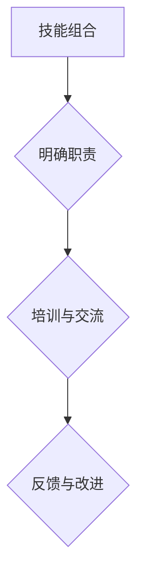

##### 3.1.3 团队文化的重要性

团队文化是高效团队的灵魂，对团队协作和绩效具有重要影响。以下是一些建立积极团队文化的策略：

1. **价值观传递：** 团队领导者需要明确团队的价值观，并通过各种方式传递给团队成员。
2. **鼓励创新：** 鼓励团队成员提出新的想法和建议，营造一个开放、包容的创新氛围。
3. **尊重差异：** 尊重团队成员之间的差异，包括文化、背景和观点，促进团队内部的和谐。
4. **反馈与支持：** 鼓励团队成员之间相互反馈和支持，共同成长，建立积极向上的团队文化。

**Mermaid流程图：**

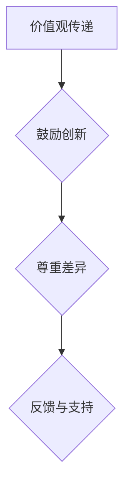

##### 3.2 团队构建过程

构建高效团队是一个系统性的过程，需要以下步骤：

1. **明确目标：** 根据组织的战略目标，明确团队的目标和愿景。
2. **角色分配：** 根据团队成员的技能和知识，为他们分配明确的职责和角色。
3. **文化塑造：** 通过价值观传递、创新鼓励和差异尊重，塑造积极的团队文化。
4. **沟通与协作：** 建立有效的沟通机制和协作工具，确保团队成员之间的信息流通和合作。
5. **培训与成长：** 定期组织培训和学习活动，提升团队成员的技能和知识，促进团队成长。

**Mermaid流程图：**

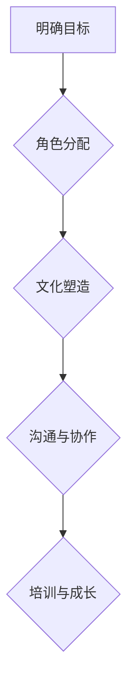

##### 3.2.1 团队角色分配

团队角色分配是构建高效团队的关键一步。以下是一些团队角色分配的策略：

1. **技能匹配：** 根据团队成员的技能和专业知识，为他们分配最合适的角色。
2. **职责明确：** 确保每个团队成员都明确自己的职责和任务，避免职责重叠和模糊。
3. **灵活性：** 在角色分配时保持一定的灵活性，以适应项目变化和团队成员的个人发展。
4. **反馈与调整：** 定期评估团队角色分配的效果，根据反馈进行必要的调整。

**Mermaid流程图：**

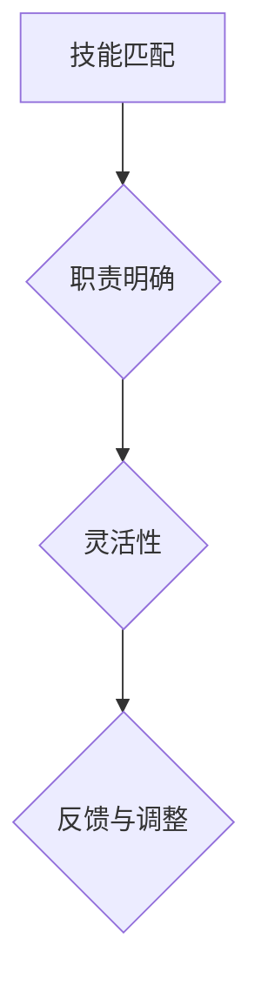

##### 3.2.2 团队规范制定

团队规范是确保团队协作有序、高效的重要手段。以下是一些制定团队规范的建议：

1. **明确规范内容：** 制定明确的团队规范，包括工作流程、行为准则、沟通规范等。
2. **广泛参与：** 在制定团队规范时，广泛征求团队成员的意见，确保规范能够被接受和执行。
3. **透明度：** 团队规范应该透明，使每个成员都清楚了解规范的内容和要求。
4. **持续更新：** 随着团队的发展和项目的变化，团队规范也需要进行持续的更新和优化。

**Mermaid流程图：**

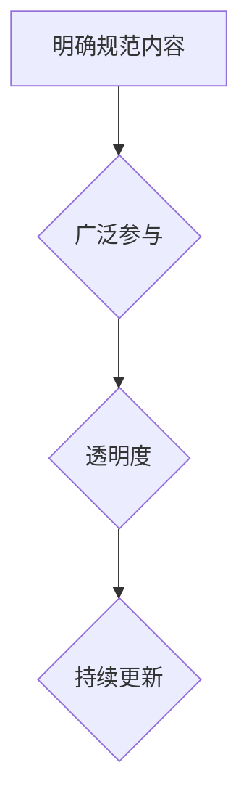

##### 3.2.3 团队冲突管理

团队冲突是不可避免的现象，有效的冲突管理对团队协作至关重要。以下是一些团队冲突管理的策略：

1. **识别冲突：** 及时识别团队冲突，了解冲突的原因和影响。
2. **沟通与理解：** 通过有效沟通，帮助团队成员理解冲突的原因和对方的观点，寻找共同点。
3. **解决冲突：** 根据冲突的性质和原因，采取合适的解决策略，如协商、调解或寻求第三方帮助。
4. **预防冲突：** 通过建立良好的沟通机制和团队合作文化，预防冲突的发生。

**Mermaid流程图：**

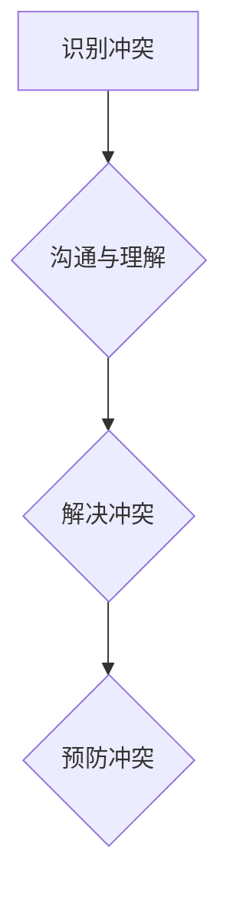

---

**核心概念与联系：**

构建高效团队的关键在于共同目标、角色明确、能力互补、信任与尊重和持续学习。通过明确的团队目标、合理的角色分配、积极的团队文化塑造、有效的沟通与协作、定期的培训与成长，以及规范的制定和冲突管理，可以确保团队的高效运作和持续发展。

**Mermaid流程图：**

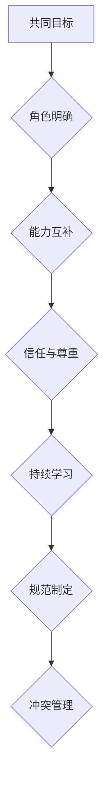

---

**项目实战：**

**开发环境搭建：**
- 在本地计算机上安装项目管理和文档协作工具，如Jira和Google Docs。
- 配置团队的邮件和即时通讯工具，如Slack或Microsoft Teams。

**源代码详细实现和代码解读：**

**Jira项目角色分配示例代码：**

```java
import com.atlassian.jira.client.JiraClient;
import com.atlassian.jira.client.JiraConfig;
import com.atlassian.jira.client.JiraClientFactory;
import com.atlassian.jira.client.Issue;
import com.atlassian.jira.client.User;

// 初始化Jira客户端
JiraConfig config = new JiraConfig("your_jira_url", "your_api_key");
JiraClient jiraClient = JiraClientFactory.newClient(config);

// 查询团队成员
User user = jiraClient.getUser("团队成员ID");

// 分配角色
jiraClient.assignRoleToUser("项目ID", "角色名称", user);
```

**代码解读与分析：**

Jira项目角色分配示例代码通过Jira API实现查询团队成员和分配角色给成员的功能。首先，初始化Jira客户端，然后使用`jiraClient.getUser()`方法查询指定团队成员，接着使用`jiraClient.assignRoleToUser()`方法将角色分配给该成员。

通过这个示例代码，我们可以看到如何利用Jira API实现项目角色分配，确保团队成员明确自己的职责和角色，从而提高团队的工作效率和协作效果。

---

**总结：** 本章节详细介绍了高效团队的特点、团队目标一致性、成员能力互补、团队文化的重要性、团队构建过程、团队角色分配、团队规范制定和团队冲突管理。通过实际项目案例的代码解读，我们了解了如何利用技术手段实现团队角色分配和规范制定，提高团队协作效率和效果。

---

**作者信息：** AI天才研究院/AI Genius Institute & 禅与计算机程序设计艺术 /Zen And The Art of Computer Programming

---

（待续...）### 第二部分：团队协同效应最大化策略

#### 第4章：提升团队协作效能

##### 4.1 团队协作流程优化

优化团队协作流程是提升团队效能的关键步骤。以下是一些优化团队协作流程的方法：

1. **明确工作流程：** 确定项目的工作流程，包括任务分配、进度跟踪、反馈和评估等环节，确保团队成员了解每个步骤和责任。
2. **减少冗余环节：** 识别和删除项目中的冗余环节，简化工作流程，减少不必要的等待和时间浪费。
3. **自动化流程：** 利用自动化工具和流程，如脚本、自动化测试和持续集成，提高工作效率和准确性。
4. **定期审查和调整：** 定期审查团队协作流程，根据实际情况进行调整和优化，确保流程始终适应项目需求。

**Mermaid流程图：**

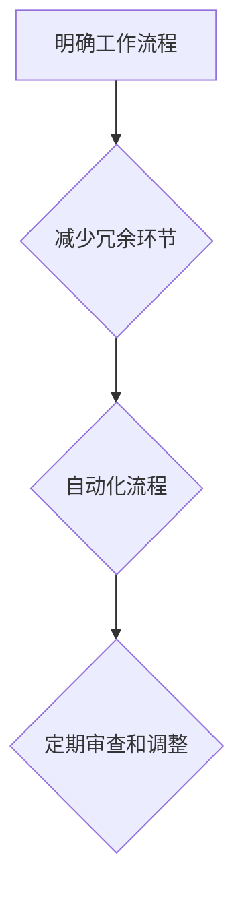

##### 4.1.1 流程优化的方法

以下是一些具体的流程优化方法：

1. **价值流图：** 通过绘制价值流图，分析项目的每个环节，识别浪费和优化点，制定优化方案。
2. **看板系统：** 引入看板系统，可视化项目进度和任务状态，帮助团队成员更好地协调工作。
3. **敏捷开发：** 采用敏捷开发方法，如Scrum或Kanban，通过短周期迭代和持续反馈，提高项目灵活性和响应速度。
4. **项目管理工具：** 利用项目管理工具，如Jira、Trello等，实现任务分配、进度跟踪和协作，提高工作效率。

**Mermaid流程图：**

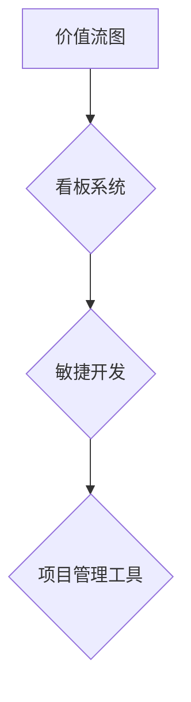

##### 4.1.2 团队工作流程实例分析

以下是一个团队工作流程实例分析：

**项目名称：** 新产品开发

**工作流程：**

1. **需求分析：** 项目团队与客户沟通，收集产品需求，制定项目计划。
2. **设计阶段：** 根据需求分析，设计产品原型和详细设计文档。
3. **开发阶段：** 根据设计文档，进行代码开发和系统测试。
4. **测试阶段：** 进行集成测试、功能测试和性能测试，确保产品符合质量标准。
5. **部署阶段：** 将产品部署到生产环境，进行实际运行测试。
6. **维护阶段：** 根据用户反馈和运行数据，进行产品维护和优化。

**优化方案：**

1. **引入看板系统：** 使用看板系统可视化项目进度，确保团队成员了解项目状态。
2. **自动化测试：** 引入自动化测试工具，提高测试效率和质量。
3. **敏捷开发：** 采用敏捷开发方法，实现短周期迭代，快速响应需求变化。
4. **持续集成：** 实现持续集成，确保代码质量和项目进度。

**Mermaid流程图：**

```mermaid
graph TD
    A[需求分析] --> B[设计阶段]
    B --> C[开发阶段]
    C --> D[测试阶段]
    D --> E[部署阶段]
    E --> F[维护阶段]
    A --> G{引入看板系统}
    B --> H{自动化测试}
    C --> I{敏捷开发}
    D --> J{持续集成}
```

##### 4.2 团队决策与领导力

团队决策和领导力在提升团队协作效能中起着关键作用。以下是一些关于团队决策和领导力的要点：

1. **团队决策模型：** 团队决策模型包括集体决策、个体决策和混合决策。选择合适的决策模型，可以提高决策的准确性和执行力。
2. **领导者在决策中的角色：** 领导者在团队决策中扮演着引导者、协调者和决策者的角色，需要具备良好的沟通能力和决策能力。
3. **提高领导力：** 通过培训、实践和反思，提高领导者的领导力，促进团队协作和决策效率。

**Mermaid流程图：**

```mermaid
graph TD
    A[团队决策模型] --> B{领导者在决策中的角色}
    B --> C{提高领导力}
```

##### 4.2.1 团队决策的模型

以下是几种常见的团队决策模型：

1. **集体决策：** 团队成员共同讨论，达成一致意见。
2. **个体决策：** 每个成员独立做出决策，然后汇总。
3. **混合决策：** 结合集体决策和个体决策，取两者之长。

**Mermaid流程图：**

```mermaid
graph TD
    A[集体决策] --> B{个体决策}
    B --> C{混合决策}
```

##### 4.2.2 领导者在团队协同中的角色

领导者在团队协同中扮演着以下角色：

1. **引导者：** 指引团队方向，确保团队成员朝着共同目标努力。
2. **协调者：** 协调团队成员之间的沟通和协作，解决冲突和问题。
3. **决策者：** 在关键时刻做出决策，确保团队高效运作。

**Mermaid流程图：**

```mermaid
graph TD
    A[引导者] --> B{协调者}
    B --> C{决策者}
```

##### 4.2.3 领导力的提升策略

以下是一些提升领导力的策略：

1. **自我认知：** 了解自己的优势和劣势，不断提升自己的领导力。
2. **沟通能力：** 提高沟通能力，确保与团队成员有效沟通。
3. **激励能力：** 学会激励团队成员，提高团队士气和工作动力。
4. **团队建设：** 通过团队建设活动，增强团队凝聚力和协作精神。

**Mermaid流程图：**

```mermaid
graph TD
    A[自我认知] --> B{沟通能力}
    B --> C{激励能力}
    C --> D{团队建设}
```

---

**核心概念与联系：**

提升团队协作效能的关键在于优化团队协作流程、明确团队决策模型、发挥领导者的作用和提升领导力。通过明确工作流程、减少冗余环节、自动化流程、定期审查和调整，可以优化团队协作流程。采用合适的团队决策模型、提高领导者的沟通能力和激励能力，可以确保团队高效运作和协作。同时，通过团队建设活动，增强团队凝聚力和协作精神，进一步推动团队效能的提升。

**Mermaid流程图：**

```mermaid
graph TD
    A[优化流程] --> B{决策模型}
    B --> C{领导力提升}
    C --> D{团队建设}
```

---

**项目实战：**

**开发环境搭建：**
- 安装项目管理工具，如Jira和Trello。
- 安装自动化测试工具，如Selenium和JUnit。

**源代码详细实现和代码解读：**

**Jira任务分配与进度跟踪示例代码：**

```java
import com.atlassian.jira.client.JiraClient;
import com.atlassian.jira.client.JiraConfig;
import com.atlassian.jira.client.JiraClientFactory;
import com.atlassian.jira.client.Issue;

// 初始化Jira客户端
JiraConfig config = new JiraConfig("your_jira_url", "your_api_key");
JiraClient jiraClient = JiraClientFactory.newClient(config);

// 创建任务
Issue issue = jiraClient.createIssue("任务名称", "任务描述", "任务类型");

// 分配任务给团队成员
jiraClient.assign(issue, "团队成员ID");

// 更新任务进度
jiraClient.updateIssue(issue.getId(), "状态", "进度");
```

**代码解读与分析：**

Jira任务分配与进度跟踪示例代码通过Jira API实现任务创建、任务分配和进度更新功能。首先，初始化Jira客户端，然后创建任务，并使用`jiraClient.assign()`方法将任务分配给指定团队成员。接着，通过`jiraClient.updateIssue()`方法更新任务的进度状态。

通过这个示例代码，我们可以看到如何利用Jira API实现任务分配和进度跟踪，从而提高团队协作效率和效果。

---

**总结：** 本章节详细介绍了团队协作流程优化的方法、团队决策模型和领导者在团队协同中的角色。通过实际项目案例的代码解读，我们了解了如何利用技术手段优化团队协作流程和任务分配，提高团队协作效能。

---

**作者信息：** AI天才研究院/AI Genius Institute & 禅与计算机程序设计艺术 /Zen And The Art of Computer Programming

---

（待续...）### 第二部分：团队协同效应最大化策略

#### 第5章：团队激励机制

##### 5.1 团队激励机制的设计

团队激励机制是提升团队协作效能和激发成员潜力的重要手段。设计有效的团队激励机制，需要考虑以下几个方面：

1. **目标明确：** 激励机制的设计应明确团队和成员的目标，确保激励机制与组织目标一致。
2. **公平公正：** 激励机制的制定应公平公正，确保所有成员都有公平的机会获得激励。
3. **灵活多样：** 激励机制应灵活多样，结合物质激励和精神激励，满足不同成员的需求。
4. **及时反馈：** 激励机制的实施应及时反馈，使成员能够及时了解自己的表现和成果。

**Mermaid流程图：**

```mermaid
graph TD
    A[目标明确] --> B{公平公正}
    B --> C{灵活多样}
    C --> D{及时反馈}
```

##### 5.1.1 激励理论概述

激励理论是研究如何激发和维持人的积极性和创造力的理论体系。以下是一些主要的激励理论：

1. **马斯洛需求层次理论：** 马斯洛将人的需求分为生理需求、安全需求、社交需求、尊重需求和自我实现需求，认为满足这些需求可以激发人的积极性。
2. **赫茨伯格双因素理论：** 赫茨伯格提出，激励因素和保健因素共同影响人的积极性。激励因素包括工作本身、认可、成就感等，而保健因素包括公司政策、工作条件等。
3. **期望理论：** 弗罗姆的期望理论认为，人的行为是由期望和效价共同决定的。期望理论强调了目标设置和激励机制的重要性。

**Mermaid流程图：**

```mermaid
graph TD
    A[马斯洛需求层次理论] --> B{赫茨伯格双因素理论}
    B --> C{期望理论}
```

##### 5.1.2 团队激励机制的具体应用

以下是一些团队激励机制的具体应用方法：

1. **绩效奖金：** 根据团队成员的绩效表现，发放相应的奖金，激励成员提高工作质量。
2. **晋升机会：** 为表现优秀的团队成员提供晋升机会，激发成员的职业发展动力。
3. **员工福利：** 提供有吸引力的员工福利，如带薪休假、健康体检等，提升员工的满意度和忠诚度。
4. **培训与发展：** 为团队成员提供培训和发展机会，帮助成员提升技能和知识，增加职业竞争力。
5. **表彰与认可：** 通过表彰和认可，如优秀员工表彰、优秀团队评选等，激励团队成员保持积极的工作态度。

**Mermaid流程图：**

```mermaid
graph TD
    A[绩效奖金] --> B{晋升机会}
    B --> C{员工福利}
    C --> D{培训与发展}
    D --> E{表彰与认可}
```

##### 5.2 团队文化建设

团队文化建设是提升团队协作效能和激励成员的重要手段。以下是一些团队文化建设的策略：

1. **价值观塑造：** 明确团队的价值观，并通过各种方式传递给团队成员，形成共同的价值观和信仰。
2. **团队精神培养：** 通过团队活动、培训和学习，培养团队成员的团队精神，增强团队的凝聚力和协作能力。
3. **员工参与：** 鼓励员工参与团队决策和项目实施，提高员工的参与感和归属感。
4. **沟通与反馈：** 建立良好的沟通机制和反馈渠道，促进团队成员之间的沟通和理解，减少误解和冲突。
5. **持续改进：** 鼓励团队成员持续改进，不断优化团队工作流程和协作方式，提高团队效能。

**Mermaid流程图：**

```mermaid
graph TD
    A[价值观塑造] --> B{团队精神培养}
    B --> C{员工参与}
    C --> D{沟通与反馈}
    D --> E{持续改进}
```

##### 5.2.1 团队文化的定义与类型

团队文化是指团队在长期发展过程中形成的共同价值观、行为规范和工作方式。根据团队文化的特征，可以分为以下几种类型：

1. **竞争型文化：** 鼓励团队成员竞争和创新，追求卓越和胜利。
2. **合作型文化：** 强调团队成员之间的合作和共享，共同实现团队目标。
3. **学习型文化：** 鼓励团队成员持续学习和成长，不断提升团队的知识和能力。
4. **稳定型文化：** 注重团队稳定和持续发展，强调团队长期目标的实现。

**Mermaid流程图：**

```mermaid
graph TD
    A[竞争型文化] --> B{合作型文化}
    B --> C{学习型文化}
    C --> D{稳定型文化}
```

##### 5.2.2 建立积极团队文化的策略

以下是一些建立积极团队文化的策略：

1. **领导者示范：** 团队领导者应以身作则，树立积极的工作态度和行为，影响和激励团队成员。
2. **明确价值观：** 明确团队的价值观，并将其融入团队工作和日常生活中。
3. **团队活动：** 组织丰富多彩的团队活动，增强团队成员之间的交流和互动，提升团队凝聚力。
4. **激励机制：** 通过激励机制，鼓励团队成员积极参与团队建设和工作，提高团队士气。
5. **持续改进：** 鼓励团队成员持续改进，不断优化团队工作流程和协作方式，营造积极向上的团队氛围。

**Mermaid流程图：**

```mermaid
graph TD
    A[领导者示范] --> B{明确价值观}
    B --> C{团队活动}
    C --> D{激励机制}
    D --> E{持续改进}
```

---

**核心概念与联系：**

团队激励机制的设计和团队文化建设是提升团队协作效能和激励成员的重要手段。通过明确目标、公平公正、灵活多样的激励机制，结合激励理论和团队文化建设的策略，可以激发团队成员的积极性和创造力，提高团队的整体效能。

**Mermaid流程图：**

```mermaid
graph TD
    A[激励机制设计] --> B{团队文化建设}
    B --> C{激励理论}
    C --> D{团队文化类型}
```

---

**项目实战：**

**开发环境搭建：**
- 安装绩效管理系统，如HRMS。
- 配置员工培训系统和学习平台。

**源代码详细实现和代码解读：**

**员工绩效奖金发放示例代码：**

```java
import com.yourcompany.hrms绩效管理系统;

// 初始化绩效管理系统
绩效管理系统 hrms = new 绩效管理系统("your_hrms_url", "your_hrms_api_key");

// 查询员工绩效
List<EmployeePerformance> performances = hrms.queryEmployeePerformances("员工ID");

// 计算绩效奖金
for (EmployeePerformance performance : performances) {
    double bonus = calculateBonus(performance);
    hrms.distributeBonus("员工ID", bonus);
}

// 计算绩效奖金的方法
private double calculateBonus(EmployeePerformance performance) {
    double baseSalary = performance.getBaseSalary();
    double performanceScore = performance.getPerformanceScore();
    return baseSalary * performanceScore;
}
```

**代码解读与分析：**

员工绩效奖金发放示例代码通过绩效管理系统实现查询员工绩效、计算绩效奖金和发放奖金的功能。首先，初始化绩效管理系统，然后查询员工的绩效数据，计算绩效奖金，并通过`hrms.distributeBonus()`方法发放奖金。

通过这个示例代码，我们可以看到如何利用绩效管理系统实现员工绩效奖金的发放，从而激励员工提高工作绩效。

---

**总结：** 本章节详细介绍了团队激励机制的设计、激励理论、团队文化建设以及具体的策略和实践。通过实际项目案例的代码解读，我们了解了如何利用技术手段实现员工激励和绩效管理，提高团队协作效能。

---

**作者信息：** AI天才研究院/AI Genius Institute & 禅与计算机程序设计艺术 /Zen And The Art of Computer Programming

---

（待续...）### 第二部分：团队协同效应最大化策略

#### 第6章：团队效能评估与改进

##### 6.1 团队效能评估指标

评估团队效能是确保团队协同效应最大化的关键环节。以下是一些常见的团队效能评估指标：

1. **生产效率：** 团队完成任务的速率和质量，包括任务完成时间、错误率等。
2. **协作效率：** 团队成员之间的协作程度，包括沟通频率、信息共享等。
3. **创新能力：** 团队提出新想法、解决方案和创新产品的能力。
4. **成员满意度：** 团队成员对工作环境和团队氛围的满意度。
5. **目标达成率：** 团队达成既定目标的程度，包括项目完成率、预算控制等。
6. **团队凝聚力：** 团队成员之间的信任和协作精神，包括团队参与度、冲突解决等。

**Mermaid流程图：**

```mermaid
graph TD
    A[生产效率] --> B{协作效率}
    B --> C{创新能力}
    C --> D{成员满意度}
    D --> E{目标达成率}
    E --> F{团队凝聚力}
```

##### 6.1.1 评估方法与工具

评估团队效能的方法和工具有多种，以下是一些常见的方法和工具：

1. **问卷调查：** 通过设计问卷，收集团队成员对团队效能的反馈，包括满意度、协作情况等。
2. **关键绩效指标（KPI）：** 根据团队目标，设定关键绩效指标，定期跟踪和评估团队绩效。
3. **360度评估：** 通过团队成员、上级和客户的反馈，全面评估团队成员的表现。
4. **绩效管理系统：** 利用绩效管理系统，记录和分析团队的工作数据，评估团队效能。
5. **员工满意度调查：** 定期进行员工满意度调查，了解团队成员对团队效能的感受。

**Mermaid流程图：**

```mermaid
graph TD
    A[问卷调查] --> B{关键绩效指标}
    B --> C{360度评估}
    C --> D{绩效管理系统}
    D --> E{员工满意度调查}
```

##### 6.1.2 评估结果的反馈与应用

评估结果的有效反馈和应用对于团队效能的改进至关重要。以下是一些反馈与应用的方法：

1. **公开反馈：** 将评估结果公开讨论，让团队成员了解自己的表现和团队的效能。
2. **个人发展计划：** 根据评估结果，制定个人发展计划，提升团队成员的技能和能力。
3. **团队改进计划：** 根据评估结果，制定团队改进计划，优化团队协作流程和机制。
4. **激励机制：** 结合评估结果，调整激励机制，激发团队成员的积极性和创造力。
5. **持续改进：** 建立持续改进机制，定期评估团队效能，不断优化团队工作流程和协作方式。

**Mermaid流程图：**

```mermaid
graph TD
    A[公开反馈] --> B{个人发展计划}
    B --> C{团队改进计划}
    C --> D{激励机制}
    D --> E{持续改进}
```

##### 6.2 团队效能改进策略

为了提升团队效能，需要采取一系列改进策略。以下是一些具体的改进策略：

1. **优化工作流程：** 重新审视和优化团队的工作流程，减少冗余环节，提高工作效率。
2. **提升团队成员能力：** 通过培训和职业发展计划，提升团队成员的技能和能力。
3. **改善沟通与协作：** 建立有效的沟通机制和协作工具，提高团队协作效率。
4. **建立反馈机制：** 建立及时的反馈机制，确保团队成员能够及时了解工作进展和问题，并迅速解决。
5. **激励与认可：** 设立激励机制，对表现优秀的团队成员给予奖励和认可，提高团队士气。

**Mermaid流程图：**

```mermaid
graph TD
    A[优化工作流程] --> B{提升团队成员能力}
    B --> C{改善沟通与协作}
    C --> D{建立反馈机制}
    D --> E{激励与认可}
```

##### 6.2.1 针对评估结果的改进措施

根据评估结果，可以采取以下具体的改进措施：

1. **提高生产效率：** 优化工作流程，减少不必要的环节，引入自动化工具，提高任务完成速度。
2. **提升协作效率：** 建立沟通平台，定期组织团队会议，确保信息畅通，提高团队协作效率。
3. **增强创新能力：** 鼓励团队成员参与创新活动，提供创新资源和支持，激发团队创新潜力。
4. **提高成员满意度：** 关注团队成员的福利和工作环境，提供职业发展机会，提高员工满意度。
5. **提高目标达成率：** 明确团队目标，设定合理的任务和时间，确保团队目标达成率。
6. **增强团队凝聚力：** 通过团队活动、培训和交流，增强团队成员之间的信任和协作精神。

**Mermaid流程图：**

```mermaid
graph TD
    A[提高生产效率] --> B{提升协作效率}
    B --> C{增强创新能力}
    C --> D{提高成员满意度}
    D --> E{提高目标达成率}
    E --> F{增强团队凝聚力}
```

##### 6.2.2 持续改进的过程与步骤

持续改进是一个长期的过程，需要以下步骤：

1. **明确目标：** 确定团队效能提升的目标和方向。
2. **评估现状：** 通过评估了解团队的效能现状和存在的问题。
3. **制定计划：** 根据评估结果，制定改进计划，包括改进措施和时间表。
4. **实施改进：** 执行改进计划，采取具体措施提升团队效能。
5. **监控与评估：** 定期监控改进效果，评估改进措施的成效。
6. **反馈与调整：** 根据反馈结果，及时调整改进计划，持续优化团队效能。

**Mermaid流程图：**

```mermaid
graph TD
    A[明确目标] --> B{评估现状}
    B --> C{制定计划}
    C --> D{实施改进}
    D --> E{监控与评估}
    E --> F{反馈与调整}
```

---

**核心概念与联系：**

团队效能评估与改进是确保团队协同效应最大化的关键环节。通过设定评估指标、采用评估方法与工具、分析评估结果并制定改进措施，可以不断提升团队效能。持续改进的过程需要明确目标、评估现状、制定计划、实施改进、监控与评估和反馈与调整，形成闭环，确保团队效能的持续提升。

**Mermaid流程图：**

```mermaid
graph TD
    A[评估指标] --> B{评估方法}
    B --> C{评估结果}
    C --> D{改进措施}
    D --> E{持续改进}
```

---

**项目实战：**

**开发环境搭建：**
- 安装绩效评估系统和员工反馈系统。
- 配置项目管理工具，如Jira。

**源代码详细实现和代码解读：**

**员工绩效评估系统示例代码：**

```java
import com.yourcompany.performance评估系统;

// 初始化绩效评估系统
PerformanceEvaluationSystem performanceSystem = new PerformanceEvaluationSystem("your_performance_system_url", "your_api_key");

// 创建绩效评估
PerformanceEvaluation evaluation = performanceSystem.createEvaluation("员工ID", "评估周期");

// 添加评估指标
evaluation.addPerformanceIndicator("任务完成率", 0.9);
evaluation.addPerformanceIndicator("协作效率", 0.8);
evaluation.addPerformanceIndicator("创新能力", 0.7);

// 保存评估结果
performanceSystem.saveEvaluation(evaluation);

// 评估结果反馈
performanceSystem.feedbackEvaluation(evaluation.getId());
```

**代码解读与分析：**

员工绩效评估系统示例代码通过绩效评估系统实现员工绩效评估的功能。首先，初始化绩效评估系统，创建绩效评估对象，添加评估指标，保存评估结果，并通过`performanceSystem.feedbackEvaluation()`方法进行评估结果反馈。

通过这个示例代码，我们可以看到如何利用绩效评估系统实现员工绩效评估和反馈，为团队效能的改进提供数据支持。

---

**总结：** 本章节详细介绍了团队效能评估的指标、评估方法与工具、评估结果的反馈与应用、团队效能改进策略以及持续改进的过程与步骤。通过实际项目案例的代码解读，我们了解了如何利用技术手段实现团队效能评估和改进，提高团队协作效能。

---

**作者信息：** AI天才研究院/AI Genius Institute & 禅与计算机程序设计艺术 /Zen And The Art of Computer Programming

---

（待续...）### 第三部分：集体智慧的应用与实践

#### 第7章：集体智慧的概念与原理

##### 7.1 集体智慧的定义

集体智慧（Collective Intelligence）是指一个团队或社群中，成员通过相互协作、共享知识和经验，共同解决问题和做出决策的能力。它是一种基于集体互动和知识整合的智能形式，不同于个体的智慧和算法的智能。

**Mermaid流程图：**

```mermaid
graph TD
    A[个体智慧] --> B{算法智慧}
    B --> C{集体智慧}
```

##### 7.2 集体智慧与个体智慧的区别

集体智慧与个体智慧之间存在显著差异，主要体现在以下几个方面：

1. **整合与互补：** 集体智慧通过整合团队成员的个体智慧，实现能力的互补和协同效应，而个体智慧则主要依赖于单个个体的知识和能力。
2. **多样性：** 集体智慧利用团队成员的多样性，包括不同的经验、技能和文化背景，而个体智慧通常受限于个体的局限性。
3. **动态性：** 集体智慧是一个动态的过程，通过不断的互动和知识更新，而个体智慧则相对静态。
4. **开放性：** 集体智慧强调开放和共享，而个体智慧可能存在保守性和封闭性。

**Mermaid流程图：**

```mermaid
graph TD
    A[整合与互补] --> B{多样性}
    B --> C{动态性}
    C --> D{开放性}
```

##### 7.3 集体智慧的优势与局限性

集体智慧具有以下优势：

1. **创新性：** 集体智慧能够激发团队成员的创造力，产生创新的解决方案。
2. **问题解决能力：** 集体智慧通过集思广益，能够更有效地解决复杂问题。
3. **决策质量：** 集体智慧通过多角度的分析和评估，能够做出更高质量和更全面的决策。

然而，集体智慧也存在局限性：

1. **沟通成本：** 集体智慧依赖于团队成员之间的有效沟通，沟通成本可能较高。
2. **协调困难：** 集体智慧在协调团队成员的不同观点和利益时，可能面临困难。
3. **群体思维：** 集体智慧可能受到群体思维的影响，导致决策偏差。

**Mermaid流程图：**

```mermaid
graph TD
    A[创新性] --> B{问题解决能力}
    B --> C{决策质量}
    C --> D{沟通成本}
    D --> E{协调困难}
    E --> F{群体思维}
```

##### 7.4 集体智慧的理论基础

集体智慧的理论基础主要包括以下几方面：

1. **协同论：** 协同论认为，系统中的各个部分通过协同工作，可以产生整体大于部分之和的效果。
2. **社会网络理论：** 社会网络理论强调，社会网络中的节点和链接对于集体智慧的形成和传播具有重要影响。
3. **复杂系统理论：** 复杂系统理论认为，集体智慧是一个复杂的自适应系统，具有自我组织和自我优化能力。
4. **知识管理理论：** 知识管理理论指出，知识在团队中的流动和共享对于集体智慧的形成和发挥具有关键作用。

**Mermaid流程图：**

```mermaid
graph TD
    A[协同论] --> B{社会网络理论}
    B --> C{复杂系统理论}
    C --> D{知识管理理论}
```

---

**核心概念与联系：**

集体智慧是团队协作中的一种高级形式，它基于协同论、社会网络理论、复杂系统理论和知识管理理论。集体智慧通过整合团队成员的个体智慧，实现创新性和问题解决能力，同时具有决策质量的优点。然而，集体智慧也面临着沟通成本、协调困难和群体思维等局限性。

**Mermaid流程图：**

```mermaid
graph TD
    A[协同论] --> B{社会网络理论}
    B --> C{复杂系统理论}
    C --> D{知识管理理论}
    D --> E[集体智慧]
    E --> F{创新性}
    F --> G{问题解决能力}
    G --> H{决策质量}
    H --> I{局限性}
```

---

**项目实战：**

**开发环境搭建：**
- 安装知识管理系统，如Confluence。
- 配置团队协作工具，如Trello。

**源代码详细实现和代码解读：**

**知识管理系统示例代码：**

```java
import com.yourcompany.knowledge管理系统;

// 初始化知识管理系统
KnowledgeManagementSystem knowledgeSystem = new KnowledgeManagementSystem("your_knowledge_system_url", "your_api_key");

// 创建知识库
KnowledgeBase knowledgeBase = knowledgeSystem.createKnowledgeBase("知识库名称", "知识库描述");

// 添加知识条目
knowledgeBase.addKnowledgeEntry("条目标题", "条目内容");

// 保存知识库
knowledgeSystem.saveKnowledgeBase(knowledgeBase);

// 知识库共享
knowledgeSystem.shareKnowledgeBase(knowledgeBase.getId(), "团队成员ID");
```

**代码解读与分析：**

知识管理系统示例代码通过知识管理系统实现创建知识库、添加知识条目、保存知识库和共享知识库的功能。首先，初始化知识管理系统，创建知识库，添加知识条目，并通过`knowledgeSystem.saveKnowledgeBase()`方法保存知识库。接着，通过`knowledgeSystem.shareKnowledgeBase()`方法将知识库共享给指定团队成员。

通过这个示例代码，我们可以看到如何利用知识管理系统实现知识的收集、整理和共享，为集体智慧的形成提供支持。

---

**总结：** 本章节详细介绍了集体智慧的定义、与个体智慧的差异、优势与局限性以及理论基础。通过实际项目案例的代码解读，我们了解了如何利用技术手段支持集体智慧的形成和应用。

---

**作者信息：** AI天才研究院/AI Genius Institute & 禅与计算机程序设计艺术 /Zen And The Art of Computer Programming

---

（待续...）### 第三部分：集体智慧的应用与实践

#### 第8章：集体智慧在团队中的实际应用

##### 8.1 集体智慧在问题解决中的应用

集体智慧在团队中的问题解决中具有重要作用。以下是一些集体智慧在问题解决中的应用案例：

1. **创意与创新：** 团队成员通过集体讨论和头脑风暴，提出创新的解决方案，从而解决复杂问题。
   - **案例：** 一家科技公司的研发团队在面对一个技术难题时，通过集体智慧提出了一种全新的技术方案，成功地解决了问题。

2. **风险评估与防范：** 团队成员共同评估潜在风险，制定防范措施，降低项目风险。
   - **案例：** 一个金融团队在投资决策前，通过集体智慧分析市场趋势和风险因素，制定了一套全面的风险防范策略。

3. **决策制定：** 集体智慧在团队决策中提供多角度的分析和评估，提高决策质量和效率。
   - **案例：** 一家电商企业的销售团队在制定新产品营销策略时，通过集体智慧讨论市场定位、目标客户和营销手段，制定了一套有效的营销策略。

4. **优化流程：** 集体智慧可以帮助团队识别和优化工作流程，提高工作效率。
   - **案例：** 一家制造企业的生产团队通过集体智慧分析了生产流程，提出了一系列优化措施，提高了生产效率和产品质量。

**Mermaid流程图：**

```mermaid
graph TD
    A[创意与创新] --> B{风险评估与防范}
    B --> C{决策制定}
    C --> D{优化流程}
```

##### 8.1.1 集体智慧在创意与创新中的应用

集体智慧在创意与创新中的应用主要通过以下方式：

1. **头脑风暴：** 团队成员共同讨论，提出各种创意和想法，通过集思广益，激发创新思维。
2. **知识共享：** 通过共享知识和经验，激发团队成员的创意和灵感，促进创新成果的产生。
3. **协同创作：** 团队成员在创意和创新过程中，共同参与、协同合作，形成具有集体智慧和创意的新产品或解决方案。

**Mermaid流程图：**

```mermaid
graph TD
    A[头脑风暴] --> B{知识共享}
    B --> C{协同创作}
```

##### 8.1.2 集体智慧在风险防范中的应用

集体智慧在风险防范中的应用主要体现在以下几个方面：

1. **风险识别：** 通过团队成员的集体智慧和专业知识，识别项目中的潜在风险。
2. **风险评估：** 团队成员共同评估风险的严重程度和可能性，制定风险应对策略。
3. **风险监控：** 通过持续的团队协作和知识共享，监控风险的发展，及时调整风险应对措施。

**Mermaid流程图：**

```mermaid
graph TD
    A[风险识别] --> B{风险评估}
    B --> C{风险监控}
```

##### 8.1.3 集体智慧在决策制定中的应用

集体智慧在决策制定中的应用包括：

1. **多角度分析：** 团队成员从不同角度分析问题，提供多样化的解决方案。
2. **综合评估：** 团队成员共同评估各种解决方案的优缺点，选择最佳的决策方案。
3. **持续反馈：** 团队成员在决策实施过程中，持续反馈和调整，确保决策的有效性和适应性。

**Mermaid流程图：**

```mermaid
graph TD
    A[多角度分析] --> B{综合评估}
    B --> C{持续反馈}
```

##### 8.2 集体智慧在决策制定中的应用

集体智慧在决策制定中的应用具体表现为：

1. **战略规划：** 团队成员共同参与战略规划的制定，通过集体智慧分析市场趋势、竞争态势和内部资源，制定长远的战略目标。
2. **战术决策：** 团队在具体执行过程中，通过集体智慧制定战术决策，确保战略目标的实现。
3. **应急决策：** 在突发事件或紧急情况下，团队成员通过集体智慧迅速制定应对措施，降低风险和损失。

**Mermaid流程图：**

```mermaid
graph TD
    A[战略规划] --> B{战术决策}
    B --> C{应急决策}
```

---

**核心概念与联系：**

集体智慧在团队中的应用主要体现在问题解决、创意与创新、风险防范、决策制定和优化流程等方面。通过头脑风暴、知识共享和协同创作，集体智慧可以激发团队的创意和创新；通过风险识别、评估和监控，集体智慧可以有效降低项目风险；通过多角度分析和综合评估，集体智慧可以提高决策质量；通过持续反馈和调整，集体智慧可以确保决策的有效性和适应性。

**Mermaid流程图：**

```mermaid
graph TD
    A[问题解决] --> B{创意与创新}
    B --> C{风险防范}
    C --> D{决策制定}
    D --> E{优化流程}
```

---

**项目实战：**

**开发环境搭建：**
- 安装决策支持系统，如DecisionTree。
- 配置项目管理系统，如Jira。

**源代码详细实现和代码解读：**

**决策支持系统示例代码：**

```java
import com.yourcompany.decision支持系统;

// 初始化决策支持系统
DecisionSupportSystem decisionSystem = new DecisionSupportSystem("your_decision_system_url", "your_api_key");

// 创建决策问题
DecisionProblem problem = decisionSystem.createProblem("问题名称", "问题描述");

// 添加决策方案
problem.addDecisionScheme("方案A", "方案描述A");
problem.addDecisionScheme("方案B", "方案描述B");
problem.addDecisionScheme("方案C", "方案描述C");

// 评估决策方案
Map<String, Double> evaluationResults = decisionSystem.evaluateSchemes(problem);

// 选择最佳方案
String bestScheme = decisionSystem.selectBestScheme(evaluationResults);

// 决策实施
decisionSystem.executeScheme(bestScheme);
```

**代码解读与分析：**

决策支持系统示例代码通过决策支持系统实现创建决策问题、添加决策方案、评估决策方案和选择最佳方案的功能。首先，初始化决策支持系统，创建决策问题，并添加决策方案。接着，通过`decisionSystem.evaluateSchemes()`方法评估决策方案，并使用`decisionSystem.selectBestScheme()`方法选择最佳方案。最后，通过`decisionSystem.executeScheme()`方法实施决策方案。

通过这个示例代码，我们可以看到如何利用决策支持系统实现集体智慧在决策制定中的应用，提高决策质量和效率。

---

**总结：** 本章节详细介绍了集体智慧在团队中的实际应用，包括在问题解决、创意与创新、风险防范、决策制定和优化流程等方面的应用。通过实际项目案例的代码解读，我们了解了如何利用技术手段支持集体智慧的形成和应用。

---

**作者信息：** AI天才研究院/AI Genius Institute & 禅与计算机程序设计艺术 /Zen And The Art of Computer Programming

---

（待续...）### 第三部分：集体智慧的应用与实践

#### 第9章：集体智慧的培养与提升

##### 9.1 集体智慧的培养策略

培养集体智慧需要从以下几个方面入手：

1. **营造开放氛围：** 建立开放、包容的团队文化，鼓励团队成员分享知识和经验，创造一个无障碍的沟通环境。
2. **建立激励机制：** 通过激励机制，鼓励团队成员积极参与集体智慧和协作活动，激发团队成员的积极性。
3. **提供培训机会：** 定期组织培训和学习活动，提升团队成员的知识和技能，为集体智慧的形成提供基础。
4. **加强团队建设：** 通过团队建设活动，增强团队成员之间的信任和协作精神，提高团队的凝聚力。
5. **利用技术手段：** 利用现代信息技术和工具，如知识管理系统、协同办公平台等，促进团队成员之间的知识共享和协作。

**Mermaid流程图：**

```mermaid
graph TD
    A[营造开放氛围] --> B{建立激励机制}
    B --> C{提供培训机会}
    C --> D{加强团队建设}
    D --> E{利用技术手段}
```

##### 9.1.1 培养集体智慧的文化环境

文化环境是培养集体智慧的基础。以下是一些培养集体智慧的文化环境的策略：

1. **尊重差异：** 尊重团队成员之间的差异，包括文化、背景和观点，鼓励团队成员分享不同的经验和想法。
2. **鼓励创新：** 鼓励团队成员提出新的想法和创新方案，建立一种勇于尝试和接受失败的文化。
3. **透明沟通：** 建立透明、开放的沟通机制，确保团队成员之间的信息流通和协作。
4. **合作精神：** 培养团队合作精神，使团队成员认识到集体智慧的重要性，愿意为团队的成功共同努力。

**Mermaid流程图：**

```mermaid
graph TD
    A[尊重差异] --> B{鼓励创新}
    B --> C{透明沟通}
    C --> D{合作精神}
```

##### 9.1.2 集体智慧培养的方法

以下是一些培养集体智慧的具体方法：

1. **团队协作训练：** 通过团队协作训练，如角色扮演、案例分析和团队游戏等，提高团队成员的协作能力和集体智慧。
2. **头脑风暴：** 定期组织头脑风暴会议，鼓励团队成员提出创意和解决方案，激发团队的创造力。
3. **知识共享：** 利用知识管理系统和文档共享平台，促进团队成员之间的知识共享和交流，提高团队的集体智慧。
4. **反馈与反思：** 定期进行团队反馈和反思，总结经验和教训，不断改进团队的工作流程和协作方式。

**Mermaid流程图：**

```mermaid
graph TD
    A[团队协作训练] --> B{头脑风暴}
    B --> C{知识共享}
    C --> D{反馈与反思}
```

##### 9.2 集体智慧的可持续提升

为了确保集体智慧的可持续提升，需要采取以下措施：

1. **持续学习：** 鼓励团队成员持续学习和成长，不断提升自身的知识水平和技能，为集体智慧的形成提供支持。
2. **知识管理：** 通过建立有效的知识管理体系，确保团队知识的积累和传承，提高集体智慧的质量。
3. **文化传承：** 将团队的优秀文化和价值观传承给新成员，确保团队文化的持续发展和提升。
4. **技术支持：** 利用现代信息技术和工具，为集体智慧的可持续提升提供技术支持，提高团队的工作效率和协作能力。

**Mermaid流程图：**

```mermaid
graph TD
    A[持续学习] --> B{知识管理}
    B --> C{文化传承}
    C --> D{技术支持}
```

##### 9.2.1 持续学习与改进

持续学习和改进是集体智慧提升的关键。以下是一些持续学习与改进的方法：

1. **内部培训：** 定期组织内部培训，分享团队成员的知识和经验，提高团队的整体能力。
2. **外部学习：** 鼓励团队成员参加外部培训和研讨会，了解行业动态和前沿技术，拓宽视野。
3. **知识共享：** 通过知识共享平台，促进团队成员之间的知识交流和共享，提高团队的知识水平和协作能力。
4. **反馈与改进：** 建立反馈机制，定期收集团队成员的反馈和建议，不断改进团队的工作流程和协作方式。

**Mermaid流程图：**

```mermaid
graph TD
    A[内部培训] --> B{外部学习}
    B --> C{知识共享}
    C --> D{反馈与改进}
```

##### 9.2.2 利用技术手段提升集体智慧

现代信息技术和工具为提升集体智慧提供了强有力的支持。以下是一些利用技术手段提升集体智慧的方法：

1. **知识管理系统：** 建立知识管理系统，促进团队知识的积累、传承和应用，提高集体智慧的质量。
2. **协作工具：** 利用协作工具，如即时通讯、项目管理软件和文档共享平台，提高团队成员之间的沟通和协作效率。
3. **数据分析工具：** 利用数据分析工具，对团队成员的绩效和协作效果进行分析，为团队决策提供数据支持。
4. **人工智能技术：** 利用人工智能技术，如自然语言处理和机器学习，提高团队成员的智能辅助和决策能力。

**Mermaid流程图：**

```mermaid
graph TD
    A[知识管理系统] --> B{协作工具}
    B --> C{数据分析工具}
    C --> D{人工智能技术}
```

---

**核心概念与联系：**

集体智慧的培养与提升需要从文化环境、培养策略、可持续提升和利用技术手段等多个方面进行。通过营造开放氛围、建立激励机制、提供培训机会、加强团队建设和利用技术手段，可以培养和提升集体智慧。持续学习和改进、知识管理、文化传承和技术支持是确保集体智慧可持续提升的关键。

**Mermaid流程图：**

```mermaid
graph TD
    A[文化环境] --> B{培养策略}
    B --> C{可持续提升}
    C --> D{技术手段}
```

---

**项目实战：**

**开发环境搭建：**
- 安装知识管理系统，如Confluence。
- 配置团队协作工具，如Trello。

**源代码详细实现和代码解读：**

**知识管理系统示例代码：**

```java
import com.yourcompany.knowledge管理系统;

// 初始化知识管理系统
KnowledgeManagementSystem knowledgeSystem = new KnowledgeManagementSystem("your_knowledge_system_url", "your_api_key");

// 创建知识库
KnowledgeBase knowledgeBase = knowledgeSystem.createKnowledgeBase("知识库名称", "知识库描述");

// 添加知识条目
knowledgeBase.addKnowledgeEntry("条目标题", "条目内容");

// 保存知识库
knowledgeSystem.saveKnowledgeBase(knowledgeBase);

// 知识库共享
knowledgeSystem.shareKnowledgeBase(knowledgeBase.getId(), "团队成员ID");
```

**代码解读与分析：**

知识管理系统示例代码通过知识管理系统实现创建知识库、添加知识条目、保存知识库和共享知识库的功能。首先，初始化知识管理系统，创建知识库，并添加知识条目。接着，通过`knowledgeSystem.saveKnowledgeBase()`方法保存知识库，并通过`knowledgeSystem.shareKnowledgeBase()`方法将知识库共享给指定团队成员。

通过这个示例代码，我们可以看到如何利用知识管理系统实现知识的收集、整理和共享，为集体智慧的形成提供支持。

---

**总结：** 本章节详细介绍了集体智慧的培养与提升策略，包括培养策略、可持续提升方法和利用技术手段。通过实际项目案例的代码解读，我们了解了如何利用技术手段支持集体智慧的形成和应用，提高团队的整体效能。

---

**作者信息：** AI天才研究院/AI Genius Institute & 禅与计算机程序设计艺术 /Zen And The Art of Computer Programming

---

（待续...）### 第10章：案例分析与总结

#### 10.1 典型案例分享

##### 案例一：某企业通过集体智慧实现创新突破

**背景：** 
一家科技公司面临着激烈的市场竞争，需要不断创新以保持竞争力。该公司决定通过集体智慧激发团队的创造力，以推动产品的创新突破。

**过程：** 
1. **文化塑造：** 公司管理层明确倡导开放、包容和创新的文化氛围，鼓励员工分享观点和想法。
2. **头脑风暴：** 定期组织跨部门、跨职能的头脑风暴会议，鼓励员工提出创意和解决方案。
3. **知识共享：** 利用知识管理系统，建立团队知识库，确保团队成员能够方便地获取和共享知识。
4. **反馈与改进：** 通过反馈机制，及时收集团队成员的意见和建议，不断改进创新过程。

**结果：** 
通过集体智慧的激发，该公司成功推出了一款具有市场领先优势的新产品，实现了销售额的显著增长。

**启示：** 企业应注重营造开放创新的文化氛围，利用集体智慧激发团队的创造力，推动产品的创新突破。

##### 案例二：某团队如何通过团队协同提高工作效率

**背景：** 
某软件开发团队在项目开发过程中，面临着任务繁多、进度缓慢的问题。为了提高工作效率，团队决定通过团队协同实现高效工作。

**过程：** 
1. **明确目标：** 团队明确了共同的目标和愿景，确保所有成员朝着同一方向努力。
2. **角色分配：** 根据团队成员的技能和知识，为他们分配明确的职责和角色，确保每个成员都能发挥自己的优势。
3. **沟通与协作：** 通过项目管理工具和即时通讯工具，建立有效的沟通机制，确保团队成员之间的信息流通和协作。
4. **流程优化：** 定期审查和优化工作流程，减少冗余环节，提高工作效率。

**结果：** 
通过团队协同，该团队成功提高了工作效率，项目进度明显加快，团队士气也得到了提升。

**启示：** 团队应明确共同目标，合理分配角色，建立有效的沟通机制和协作工具，通过流程优化提高工作效率。

#### 10.2 团队协同效应的总结

团队协同效应在提升团队效率、激发创新能力和实现组织目标方面具有重要作用。以下是对团队协同效应的总结：

1. **共同目标：** 明确的共同目标是团队协同的基础，有助于团队成员团结一致、共同奋斗。
2. **角色明确：** 合理的角色分配确保团队成员各司其职，避免重复劳动，提高工作效率。
3. **沟通与协作：** 有效的沟通和协作机制是团队协同的核心，确保团队成员之间的信息流通和合作。
4. **知识共享：** 知识共享和知识管理有助于团队整体能力的提升，激发团队的创新能力。
5. **激励机制：** 合理的激励机制能够激发团队成员的积极性和创造力，提高团队的整体绩效。
6. **持续改进：** 团队应持续改进工作流程和协作方式，以适应不断变化的项目需求。

**Mermaid流程图：**

```mermaid
graph TD
    A[共同目标] --> B{角色明确}
    B --> C{沟通与协作}
    C --> D{知识共享}
    D --> E{激励机制}
    E --> F{持续改进}
```

#### 10.2.1 团队协同效应的关键成功因素

团队协同效应的关键成功因素包括：

1. **文化氛围：** 开放、包容和创新的文化氛围有助于激发团队的创造力。
2. **信任与尊重：** 团队成员之间的信任和尊重是团队协同的基础，促进真诚和开放的沟通。
3. **能力互补：** 成员能力互补，确保团队具备多样化的技能和知识，提高整体效能。
4. **有效沟通：** 有效的沟通机制和工具确保团队成员之间的信息流通和协作。
5. **激励机制：** 合理的激励机制能够激发团队成员的积极性和创造力。
6. **持续学习：** 持续学习提升团队成员的知识和技能，为团队发展提供动力。

**Mermaid流程图：**

```mermaid
graph TD
    A[文化氛围] --> B{信任与尊重}
    B --> C{能力互补}
    C --> D{有效沟通}
    D --> E{激励机制}
    E --> F{持续学习}
```

#### 10.2.2 团队协同效应的未来发展趋势

未来，团队协同效应将呈现以下发展趋势：

1. **技术驱动：** 随着人工智能、大数据和云计算等技术的发展，团队协同工具将更加智能化和高效化，提高团队协作效率。
2. **远程协作：** 随着远程办公的普及，远程协作工具和平台将得到广泛应用，促进跨地域团队的协作。
3. **个性化协作：** 根据团队成员的个性、技能和偏好，提供个性化的协作工具和流程，提高团队效能。
4. **持续学习与成长：** 团队将更加注重持续学习和个人成长，通过培训、实践和反思，提升团队整体能力。
5. **智能化决策：** 利用人工智能技术，实现智能化决策支持，提高团队决策质量和效率。

**Mermaid流程图：**

```mermaid
graph TD
    A[技术驱动] --> B{远程协作}
    B --> C{个性化协作}
    C --> D{持续学习与成长}
    D --> E{智能化决策}
```

---

**核心概念与联系：**

团队协同效应的关键在于共同目标、角色明确、沟通与协作、知识共享、激励机制和持续改进。通过营造开放创新的文化氛围、建立信任与尊重的团队关系、实现能力互补、有效沟通和个性化协作，团队可以发挥集体智慧，提高整体效能。技术驱动、远程协作、持续学习与成长和智能化决策是未来团队协同效应的发展趋势。

**Mermaid流程图：**

```mermaid
graph TD
    A[共同目标] --> B{角色明确}
    B --> C{沟通与协作}
    C --> D{知识共享}
    D --> E{激励机制}
    E --> F{持续改进}
    F --> G{技术驱动}
    G --> H{远程协作}
    H --> I{个性化协作}
    I --> J{持续学习与成长}
    J --> K{智能化决策}
```

---

**项目实战：**

**开发环境搭建：**
- 安装团队协作工具，如Slack和Trello。
- 配置知识管理系统，如Confluence。

**源代码详细实现和代码解读：**

**团队协作工具集成示例代码：**

```java
import com.yourcompany.team协作工具;

// 初始化团队协作工具
TeamCollaborationTools collaborationTools = new TeamCollaborationTools("your_collaboration_tools_url", "your_api_key");

// 创建Slack渠道
SlackChannel slackChannel = collaborationTools.createSlackChannel("渠道名称", "渠道描述");

// 添加Trello板
TrelloBoard trelloBoard = collaborationTools.createTrelloBoard("板名称", "板描述");

// 集成Slack和Trello
collaborationTools.integrateSlackAndTrello(slackChannel.getId(), trelloBoard.getId());
```

**代码解读与分析：**

团队协作工具集成示例代码通过团队协作工具实现创建Slack渠道、创建Trello板和集成Slack与Trello的功能。首先，初始化团队协作工具，创建Slack渠道和Trello板。接着，通过`collaborationTools.integrateSlackAndTrello()`方法将Slack和Trello集成，实现团队协作的统一管理。

通过这个示例代码，我们可以看到如何利用团队协作工具实现团队协作的集成，提高团队协作效率。

---

**总结：** 本章节通过两个典型案例如实分享了团队通过集体智慧和团队协同实现创新突破和工作效率提升的经验。同时，总结了团队协同效应的关键成功因素和未来发展趋势，为团队协作提供了实践指导和思考方向。

---

**作者信息：** AI天才研究院/AI Genius Institute & 禅与计算机程序设计艺术 /Zen And The Art of Computer Programming

---

（文章完）### 附录

#### 附录A：团队协同工具介绍

##### A.1 常见团队协同工具概述

在团队协作中，选择合适的协同工具对于提高团队效率至关重要。以下是一些常见的团队协同工具及其概述：

1. **Slack：** Slack是一款流行的即时通讯和团队协作工具，提供实时消息传递、文件共享、集成第三方服务等功能，广泛应用于企业内部沟通和协作。

2. **Trello：** Trello是一款基于看板的项目管理工具，通过可视化卡片和列表，帮助团队管理任务、跟踪项目进度和协调工作。

3. **Confluence：** Confluence是一款团队协作和文档管理工具，支持文档编辑、知识库构建和协作讨论，是团队知识管理和信息共享的重要平台。

4. **Jira：** Jira是一款功能强大的项目管理工具，提供任务跟踪、敏捷开发、bug追踪等功能，广泛应用于软件开发团队的项目管理。

5. **Zoom：** Zoom是一款视频会议和远程协作工具，提供高清视频、音频会议、屏幕共享和聊天等功能，适用于远程团队和跨地域协作。

##### A.2 线上会议工具

线上会议工具是远程协作中不可或缺的一部分。以下是一些常用的线上会议工具：

1. **Zoom：** Zoom提供高清视频会议、屏幕共享、实时聊天和远程控制等功能，支持大会议程管理和录制会议。

2. **Microsoft Teams：** Microsoft Teams集成了视频会议、即时通讯、文档协作和项目管理等功能，是微软办公套件的一部分，适合企业内部使用。

3. **Google Meet：** Google Meet是Google提供的一款免费视频会议工具，支持高清视频、音频和聊天功能，适合个人和团队使用。

##### A.3 项目管理工具

项目管理工具帮助团队有效规划和管理项目，以下是一些常用的项目管理工具：

1. **Jira：** Jira提供任务跟踪、敏捷开发、bug追踪和项目进展报告等功能，适用于软件开发团队。

2. **Trello：** Trello提供可视化任务管理、看板视图和协作功能，简单易用，适合各种类型的团队。

3. **Asana：** Asana是一款功能强大的项目管理工具，提供任务分配、进度跟踪、通知和报告等功能，支持多种工作流程。

##### A.4 文档协作工具

文档协作工具支持团队成员实时编辑和共享文档，以下是一些常用的文档协作工具：

1. **Google Docs：** Google Docs是一款免费的在线文档编辑工具，支持多人实时协作、版本控制和权限管理。

2. **Microsoft Office 365：** Microsoft Office 365集成了Word、Excel、PowerPoint等办公软件，支持在线协作和文档共享。

3. **Confluence：** Confluence是一款强大的团队协作和知识管理工具，提供文档编辑、知识库构建和协作讨论等功能。

#### 附录B：团队效能评估量表

##### B.1 团队效能评估量表设计原则

设计团队效能评估量表需要遵循以下原则：

1. **全面性：** 评估量表应涵盖团队效能的各个方面，如生产效率、协作效率、创新能力、成员满意度等。

2. **可衡量性：** 评估指标应具有可衡量性，便于量化评估结果。

3. **适用性：** 评估量表应适合团队的具体情况和需求。

4. **简洁性：** 评估量表应简洁明了，易于理解和操作。

5. **反馈性：** 评估量表应提供反馈机制，帮助团队成员了解自己的表现和团队的整体效能。

##### B.2 评估量表的构建方法

构建团队效能评估量表的方法包括：

1. **问卷调查法：** 通过问卷调查收集团队成员对团队效能的反馈。

2. **关键绩效指标（KPI）法：** 设定关键绩效指标，量化团队的工作成果和效能。

3. **行为观察法：** 通过观察团队成员的行为和工作表现，评估团队效能。

4. **专家评审法：** 邀请相关领域的专家对团队效能进行评审和评估。

##### B.3 评估量表的实施与应用

实施团队效能评估量表的步骤包括：

1. **制定评估方案：** 根据团队情况和需求，制定详细的评估方案。

2. **设计评估量表：** 结合评估方案，设计合适的评估量表。

3. **实施评估：** 在规定时间内，按照评估量表进行评估，收集数据。

4. **分析评估结果：** 对评估结果进行分析，识别团队的优点和不足。

5. **提供反馈：** 将评估结果反馈给团队成员，讨论改进措施。

6. **持续改进：** 根据评估结果，调整团队工作流程和协作方式，持续改进团队效能。

#### 附录C：集体智慧培养实践案例

##### C.1 案例一：如何利用集体智慧进行市场预测

**背景：**
某企业需要预测市场需求，为新产品开发和营销策略制定提供依据。

**过程：**
1. **数据收集：** 团队收集了历史销售数据、市场调研报告和行业趋势分析。
2. **头脑风暴：** 组织团队成员进行头脑风暴，讨论可能的未来市场趋势。
3. **专家咨询：** 邀请行业专家参与讨论，提供专业见解。
4. **集体讨论：** 团队成员集体讨论，结合数据和专家意见，制定市场预测方案。

**结果：**
通过集体智慧的市场预测，企业成功制定了合适的新产品开发和营销策略，实现了销售目标。

**启示：**
在市场预测等复杂决策中，利用集体智慧可以汇集多方面的知识和经验，提高预测的准确性和决策质量。

##### C.2 案例二：如何通过集体智慧提升产品开发效率

**背景：**
某企业需要提升产品开发效率，缩短产品上市时间。

**过程：**
1. **需求分析：** 团队进行详细的需求分析，明确产品功能和性能要求。
2. **头脑风暴：** 组织团队成员进行头脑风暴，提出创新的产品设计方案。
3. **知识共享：** 通过知识管理系统，共享团队成员的经验和最佳实践。
4. **协同开发：** 团队成员协同工作，共同开发产品，确保高效协作。

**结果：**
通过集体智慧的产品开发，企业成功缩短了产品开发时间，提高了产品质量和市场竞争力。

**启示：**
在产品开发过程中，利用集体智慧可以充分发挥团队成员的创意和协作精神，提高开发效率和产品质量。

---

**总结：** 通过附录部分的内容，我们详细介绍了常见的团队协同工具、团队效能评估量表的设计原则与方法、以及集体智慧培养的实践案例。这些附录内容为团队协作提供了实用的工具和方法，有助于提升团队效能和集体智慧的应用。

