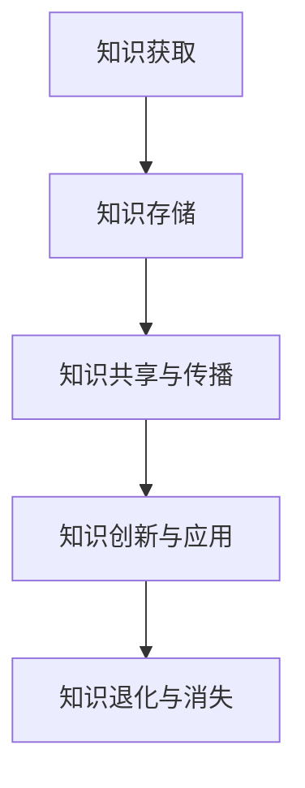
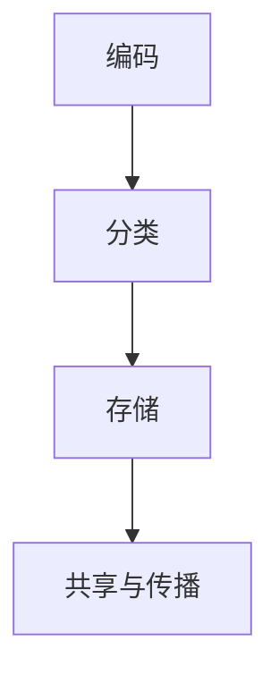
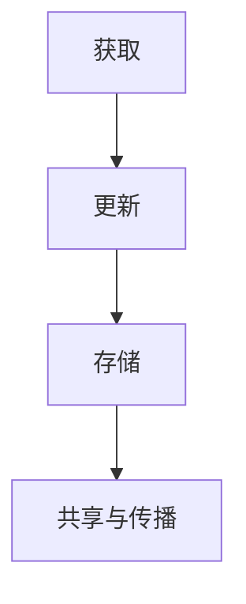
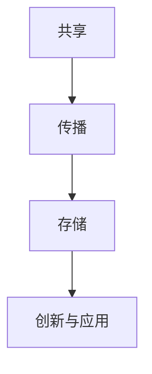
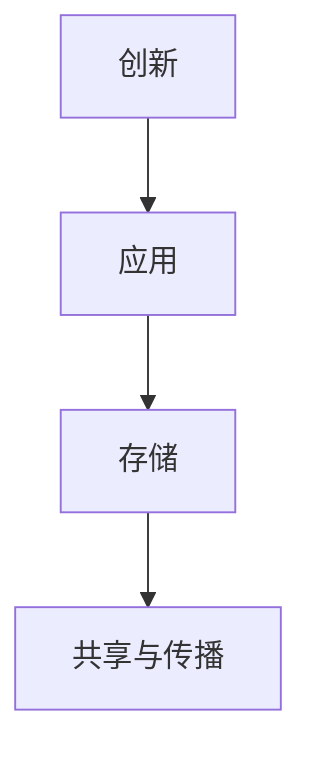

                 

# 引言

在信息技术飞速发展的今天，知识已经成为企业竞争的核心资源。如何有效地管理和利用知识，成为现代团队和组织面临的一个重要课题。团队知识管理，作为一种系统性的管理方法，旨在提高团队整体的知识水平，促进团队成员之间的知识共享与传承，从而增强团队的创新能力和竞争力。本文将围绕团队知识管理这一主题，探讨其重要性、核心概念、管理方法、实践策略以及面临的挑战和未来发展趋势。

## 核心关键词

- 团队知识管理
- 知识共享与传承
- 知识编码与分类
- 知识管理工具与技术
- 案例分析
- 挑战与未来发展趋势

## 摘要

本文旨在深入探讨团队知识管理的方法与实践。首先，介绍了团队知识管理的重要性，并阐述了其定义和目标。接着，详细分析了团队知识管理的核心概念，包括知识的类型、生命周期以及关键要素。随后，探讨了团队知识管理的方法，从知识编码与分类、知识共享与传播、知识创新与应用三个方面进行了详细阐述。在实践策略部分，本文提出了制定团队知识管理策略、团队知识管理规划以及团队知识管理项目的实施与评估。随后，通过案例分析，总结了国内外团队知识管理的成功经验。最后，本文分析了团队知识管理面临的挑战和未来发展趋势，并对团队知识管理实践进行了思考与展望。通过本文的探讨，旨在为团队知识管理提供理论指导和实践参考。

## 第1章：团队知识管理的概述

### 1.1 团队知识管理的重要性

在信息爆炸的时代，知识已经成为企业持续发展的关键驱动力。团队知识管理（Team Knowledge Management，TKM）作为一种系统性的方法，旨在通过有效的知识管理，提高团队的整体知识水平，促进团队成员之间的知识共享与传承。以下是团队知识管理重要性的几个方面：

#### 1.1.1 知识在团队发展中的作用

1. **创新能力的基础**：知识是团队创新的基础，团队通过积累和运用知识，能够更好地应对外部环境的变化，开发出新的产品和服务。
2. **竞争优势的来源**：团队拥有的独特知识资源可以形成竞争优势，帮助企业脱颖而出，在市场中占据有利位置。
3. **持续发展的动力**：团队知识管理能够促进知识的积累和传承，为团队的长期发展提供持续的动力。

#### 1.1.2 团队知识管理的必要性

1. **知识的流失与浪费**：在缺乏有效知识管理的情况下，团队的知识资源很容易流失，导致知识浪费。
2. **知识共享与传播的障碍**：团队成员之间的知识共享和传播可能受到各种障碍，如组织结构、沟通不畅等，影响团队整体的知识水平。
3. **知识创新的动力不足**：缺乏有效的知识管理，团队的知识创新动力可能会减弱，影响团队的竞争力。

### 1.2 团队知识管理的定义

团队知识管理是一种利用信息技术和组织管理手段，将显性知识和隐性知识转化为组织共享知识，以提高组织整体知识水平的过程。具体来说，团队知识管理包括以下几个方面：

1. **知识的获取**：从外部和内部获取知识，包括学习、交流、调研等方式。
2. **知识的存储**：将获取的知识进行整理、分类、存储，建立知识库或使用知识管理系统。
3. **知识的共享与传播**：促进知识在团队内部的传播和共享，提高知识的利用率。
4. **知识的创新与应用**：在现有知识的基础上进行创新，并将其应用于实际工作中，提高团队的工作效率。

### 1.3 团队知识管理的目标和原则

#### 1.3.1 团队知识管理的目标

1. **提高团队整体知识水平**：通过有效的知识管理，使团队成员掌握更多的知识，提高团队的整体知识水平。
2. **促进团队成员知识共享与传承**：鼓励团队成员之间进行知识分享，使知识能够在团队内部传承和扩散。
3. **增强团队创新能力和竞争力**：通过知识管理，激发团队的创新能力，提高团队的竞争力。
4. **提高团队工作效率和绩效**：通过知识管理，使团队成员能够更高效地工作，提高团队的整体绩效。

#### 1.3.2 团队知识管理的原则

1. **以人为本**：尊重团队成员的知识和贡献，激发团队成员的知识分享意愿。
2. **价值导向**：以团队业务发展和目标为导向，实现知识价值的最大化。
3. **适应性**：根据团队发展阶段和业务需求，灵活调整知识管理策略。
4. **可持续发展**：建立长效的知识管理机制，确保知识管理的持续性和有效性。

### 结论

团队知识管理在现代社会中具有重要意义，它不仅有助于团队创新和竞争力的提升，还能够提高团队的工作效率。通过本文的介绍，我们了解了团队知识管理的定义、目标和原则，为后续章节的深入探讨奠定了基础。在接下来的章节中，我们将进一步探讨团队知识管理的核心概念和方法，以期为团队知识管理提供更加具体的指导。

## 第2章：团队知识管理的核心概念

### 2.1 知识的类型

在团队知识管理中，了解知识的类型是至关重要的。知识可以分为显性知识和隐性知识两大类。

#### 2.1.1 显性知识

显性知识（Explicit Knowledge）是指可以用文字、图表、公式等形式明确表达的知识。这种知识易于存储、传播和共享，是团队知识管理中的重点对象。显性知识通常包括以下几个方面：

1. **文档**：如研究报告、设计文档、用户手册等。
2. **数据**：如数据库、统计报表等。
3. **标准与规范**：如工作流程、操作指南等。

#### 2.1.2 隐性知识

隐性知识（Tacit Knowledge）则是指存在于个人头脑中，难以用文字和语言明确表达的知识。这种知识往往与个人的经验、直觉、技能等紧密相关。隐性知识通常包括以下几个方面：

1. **经验**：如某位资深工程师的调试技巧。
2. **技能**：如编程、设计等专业技能。
3. **直觉**：如某种情境下的判断和决策能力。

#### 2.1.3 显性知识与隐性知识的联系

显性知识和隐性知识之间存在紧密的联系。隐性知识往往通过实践和交流转化为显性知识，而显性知识又可以进一步丰富和深化隐性知识。例如，一位工程师在项目中积累的隐性经验，可以通过撰写技术博客或进行内部培训，转化为团队的显性知识，从而被其他成员共享和运用。

### 2.2 知识生命周期

知识生命周期（Knowledge Life Cycle）是指知识从产生、应用到消失的过程。理解知识生命周期有助于团队更好地进行知识管理。知识生命周期主要包括以下几个阶段：

#### 2.2.1 知识获取

知识获取（Knowledge Acquisition）是指从外部或内部获取知识的过程。这一阶段主要通过学习、调研、交流等方式实现。例如，团队可以通过参加行业会议、阅读专业书籍、与外部专家交流等途径，获取新的知识。

#### 2.2.2 知识存储

知识存储（Knowledge Storage）是指将获取的知识进行整理、分类、存储的过程。这一阶段主要通过知识库、文档管理系统等工具实现。有效的知识存储有助于团队快速检索和利用知识。

#### 2.2.3 知识共享与传播

知识共享与传播（Knowledge Sharing and Dissemination）是指将知识在团队内部进行传递和分享的过程。这一阶段主要通过内部培训、知识分享会、在线论坛等方式实现。有效的知识共享与传播有助于团队知识水平的整体提升。

#### 2.2.4 知识创新与应用

知识创新与应用（Knowledge Innovation and Application）是指在现有知识的基础上进行创新，并将其应用于实际工作中。这一阶段主要通过项目研究、技术创新、优化工作流程等方式实现。有效的知识创新与应用有助于团队持续发展。

#### 2.2.5 知识退化与消失

知识退化与消失（Knowledge Degradation and Disappearance）是指知识随着时间的推移，可能因各种原因而失去其价值和实用性。这一阶段需要团队不断更新和优化知识库，确保知识的有效性和时效性。

### 2.3 知识管理的关键要素

#### 2.3.1 知识的编码与分类

知识的编码与分类（Knowledge Coding and Classification）是指将知识以标准化的形式进行整理和存储。这一阶段包括以下几个步骤：

1. **编码**：将知识转化为文本、图表、音频、视频等形式，便于存储和共享。
2. **分类**：根据知识的内容和特点，将其归类到不同的类别或主题中，便于检索和使用。

#### 2.3.2 知识的获取与更新

知识的获取与更新（Knowledge Acquisition and Updating）是指持续获取和更新知识，以保持知识的时效性和准确性。这一阶段包括以下几个步骤：

1. **获取**：通过学习、调研、交流等方式获取新的知识。
2. **更新**：对现有知识进行定期审查和更新，确保其与实际情况相符。

#### 2.3.3 知识的共享与传播

知识的共享与传播（Knowledge Sharing and Dissemination）是指促进知识在团队内部的传播和共享，提高知识的利用率。这一阶段包括以下几个步骤：

1. **共享**：通过内部培训、知识分享会、在线论坛等方式，将知识传递给团队成员。
2. **传播**：通过知识库、文档管理系统等工具，使知识在团队内部广泛传播。

#### 2.3.4 知识的创新与应用

知识的创新与应用（Knowledge Innovation and Application）是指在现有知识的基础上进行创新，并将其应用于实际工作中。这一阶段包括以下几个步骤：

1. **创新**：通过项目研究、技术创新、优化工作流程等方式，对知识进行创新。
2. **应用**：将创新的知识应用于实际工作中，提高团队的工作效率和质量。

### 结论

通过本章的讨论，我们深入了解了团队知识管理的核心概念，包括知识的类型、生命周期以及关键要素。这些概念为团队知识管理提供了理论依据，有助于团队更好地进行知识管理。在接下来的章节中，我们将进一步探讨团队知识管理的方法和实践，以期为团队知识管理提供更加具体的指导。

## 第3章：团队知识管理方法

### 3.1 知识编码与分类

知识编码与分类是团队知识管理的关键环节之一，它有助于将零散的知识系统化、结构化，提高知识的可访问性和可理解性。以下是对知识编码与分类方法的具体探讨：

#### 3.1.1 知识编码的定义

知识编码（Knowledge Coding）是指将知识以标准化的形式进行表达和记录，使其易于存储、检索和应用。知识编码的核心目标是确保知识的准确性、完整性和一致性。

#### 3.1.2 知识编码的方法

1. **文本编码**：将知识以文字形式进行记录，如编写技术文档、撰写博客文章、撰写研究报告等。
2. **图像编码**：将知识以图像形式进行记录，如绘制流程图、图表、示意图等。
3. **音频编码**：将知识以音频形式进行记录，如录制讲座、访谈、会议录音等。
4. **视频编码**：将知识以视频形式进行记录，如制作教程视频、演示视频等。

#### 3.1.3 知识分类的定义

知识分类（Knowledge Classification）是指根据知识的特点、内容和用途，将其划分为不同的类别或主题，以便于检索和使用。知识分类有助于提高知识的组织效率和知识库的可用性。

#### 3.1.4 知识分类的方法

1. **基于内容的分类**：根据知识的内容和主题进行分类，如将技术文档分类到不同的技术领域。
2. **基于功能的分类**：根据知识的用途和功能进行分类，如将知识分为产品设计、软件开发、市场营销等。
3. **基于对象的分类**：根据知识所涉及的对象或实体进行分类，如将知识分为产品、客户、市场等。

#### 3.1.5 知识编码与分类的流程

1. **需求分析**：确定知识编码和分类的需求，明确需要编码和分类的知识类型和范围。
2. **知识采集**：收集相关的知识资料，包括文本、图像、音频、视频等。
3. **知识编码**：对采集到的知识进行编码，确保知识的准确性和完整性。
4. **知识分类**：根据知识的特点和用途，将知识分类到相应的类别或主题中。
5. **知识库建设**：建立知识库，将编码和分类后的知识存储在知识库中，便于检索和应用。
6. **知识维护**：定期对知识库进行维护和更新，确保知识的时效性和准确性。

### 3.2 知识共享与传播

知识共享与传播（Knowledge Sharing and Dissemination）是团队知识管理的重要环节，它有助于提高团队的知识水平和创新能力。以下是对知识共享与传播方法的探讨：

#### 3.2.1 知识共享的定义

知识共享（Knowledge Sharing）是指团队成员之间相互交流、分享知识和经验的过程。知识共享的目的是提高团队的整体知识水平，促进知识在团队内部的传播和利用。

#### 3.2.2 知识传播的定义

知识传播（Knowledge Dissemination）是指将知识从一个个体或团队传递到另一个个体或团队的过程。知识传播有助于扩大知识的覆盖范围，提高知识的普及程度。

#### 3.2.3 知识共享与传播的方法

1. **内部培训**：通过内部培训，将知识传授给团队成员，提高团队成员的知识水平。
2. **知识分享会**：定期组织知识分享会，让团队成员分享各自的经验和知识。
3. **在线论坛**：建立在线论坛，为团队成员提供一个交流、分享知识的平台。
4. **知识库**：建立知识库，将共享的知识存储在知识库中，便于团队成员随时查阅和利用。
5. **外部交流**：通过与外部专家、同行进行交流，获取新的知识和经验，促进知识的传播和更新。

#### 3.2.4 知识共享与传播的挑战与对策

1. **挑战**：
   - 知识的保密性：团队成员可能担心知识共享会导致知识的泄露。
   - 知识的多样性和复杂性：团队成员的知识背景和技能水平可能不同，导致知识共享和传播的难度增加。
   - 组织结构和文化：组织结构和文化可能对知识共享和传播产生障碍。

2. **对策**：
   - 制定知识共享政策：明确知识共享的原则和规则，确保知识共享的合法性和合理性。
   - 建立激励机制：通过奖励和激励，鼓励团队成员积极参与知识共享。
   - 提高沟通能力：加强团队成员之间的沟通，提高知识共享和传播的效率。
   - 营造知识共享文化：营造一种开放、共享的知识氛围，使团队成员愿意分享知识和经验。

### 3.3 知识创新与应用

知识创新与应用（Knowledge Innovation and Application）是团队知识管理的终极目标，它旨在通过创新和利用知识，提高团队的工作效率和质量。以下是对知识创新与应用方法的探讨：

#### 3.3.1 知识创新的定义

知识创新（Knowledge Innovation）是指基于现有知识，通过创造新的概念、方法、工具等，产生新的知识和价值的过程。知识创新是团队持续发展的重要动力。

#### 3.3.2 知识创新的方法

1. **头脑风暴**：通过集体头脑风暴，激发团队成员的创新思维，产生新的创意和想法。
2. **项目研究**：通过项目研究，对现有知识进行深入分析和研究，发现新的应用场景和价值。
3. **跨学科合作**：通过跨学科合作，将不同领域的知识进行融合，产生新的创新成果。
4. **知识挖掘**：通过知识挖掘，从大量的数据和信息中提取出有用的知识和洞察。

#### 3.3.3 知识应用的定义

知识应用（Knowledge Application）是指将创新的知识应用于实际工作中，解决实际问题，提高工作效率和质量的过程。知识应用是知识创新的最终目标。

#### 3.3.4 知识应用的方法

1. **案例研究**：通过案例研究，将创新的知识应用到具体的业务场景中，验证其可行性和效果。
2. **试点项目**：通过试点项目，将创新的知识进行小范围的应用和测试，收集反馈和改进建议。
3. **知识管理平台**：建立知识管理平台，将创新的知识进行整合和推广，便于团队成员的应用和分享。
4. **培训与指导**：通过培训与指导，帮助团队成员掌握和应用创新的知识。

### 结论

本章详细探讨了团队知识管理的方法，包括知识编码与分类、知识共享与传播、知识创新与应用。这些方法有助于团队提高知识管理水平，促进知识的积累和传承，提高团队的整体效率和竞争力。在接下来的章节中，我们将进一步探讨团队知识管理的实践策略和案例分析，以期为团队知识管理提供更加具体的指导。

## 第4章：团队知识管理的策略与规划

### 4.1 制定团队知识管理策略

制定团队知识管理策略是团队知识管理的关键步骤之一。一个有效的知识管理策略能够明确团队知识管理的目标、路径和方法，为团队知识管理提供指导。以下是如何制定团队知识管理策略的步骤：

#### 4.1.1 分析团队知识需求

分析团队知识需求是制定知识管理策略的第一步。这包括以下几个方面：

1. **识别知识类型**：确定团队需要的知识类型，包括显性知识和隐性知识。
2. **评估知识水平**：评估团队现有的知识水平，确定需要提升的知识领域。
3. **了解知识需求**：通过调查问卷、访谈等方式了解团队成员的知识需求和期望。

#### 4.1.2 确定知识管理目标

根据团队知识需求，制定明确的知识管理目标。这些目标可以是：

1. **提高知识共享与传播的效率**：通过建立知识共享平台，提高团队成员之间的知识交流。
2. **促进知识创新**：通过项目研究、头脑风暴等方式，激发团队的创新思维。
3. **提升知识应用能力**：通过案例研究、试点项目等方式，将知识应用于实际工作中，提高工作效率。

#### 4.1.3 制定知识管理措施

根据知识管理目标和需求，制定具体的知识管理措施。这些措施可以包括：

1. **知识编码与分类**：建立标准化的知识编码和分类体系，提高知识的可访问性和可理解性。
2. **知识共享与传播**：通过内部培训、知识分享会、在线论坛等方式，促进知识的共享和传播。
3. **知识创新与应用**：通过项目研究、技术创新、优化工作流程等方式，推动知识的创新和应用。

#### 4.1.4 实施与监督

制定知识管理策略后，需要将其付诸实施，并对其进行监督和评估。这包括以下几个方面：

1. **实施计划**：制定详细的实施计划，明确责任人和时间节点。
2. **培训与指导**：对团队成员进行知识管理的培训，提高其知识管理意识和技能。
3. **监督与评估**：定期对知识管理措施的实施情况进行监督和评估，确保策略的有效性。

### 4.2 团队知识管理规划

团队知识管理规划是团队知识管理策略的具体实现。一个良好的知识管理规划能够确保知识管理策略的有效执行，提高团队的知识管理水平。以下是如何进行团队知识管理规划的步骤：

#### 4.2.1 确定知识管理架构

确定知识管理架构是知识管理规划的第一步。知识管理架构包括以下几个方面：

1. **知识管理体系**：建立知识管理体系，明确知识管理的流程、规范和责任。
2. **知识存储系统**：建立知识存储系统，如知识库、文档管理系统等，确保知识的存储和检索。
3. **知识共享平台**：建立知识共享平台，如内部论坛、知识地图等，促进知识的共享和传播。
4. **知识应用系统**：建立知识应用系统，如项目管理系统、知识管理平台等，将知识应用于实际工作中。

#### 4.2.2 规划知识流程

规划知识流程是知识管理规划的核心。知识流程包括以下几个方面：

1. **知识获取流程**：明确知识的获取途径和方法，如外部调研、内部培训、项目研究等。
2. **知识存储流程**：明确知识的存储规范和流程，如知识编码、分类、存储等。
3. **知识共享流程**：明确知识的共享和传播流程，如知识分享会、在线论坛、知识库等。
4. **知识应用流程**：明确知识的应用流程，如项目研究、技术创新、优化工作流程等。

#### 4.2.3 规划技术支持

规划技术支持是确保知识管理规划顺利实施的必要条件。技术支持包括以下几个方面：

1. **知识管理工具**：选择合适的知识管理工具，如知识库、文档管理系统、在线论坛等。
2. **信息技术支持**：提供必要的信息技术支持，如服务器、网络、数据库等。
3. **培训与指导**：对团队成员进行知识管理工具和技术的培训，提高其使用能力。

#### 4.2.4 规划人力资源

规划人力资源是确保知识管理规划顺利实施的保障。人力资源包括以下几个方面：

1. **知识管理团队**：建立专门的知

### 4.3 团队知识管理项目的实施与评估

团队知识管理项目的实施与评估是确保知识管理策略和规划有效执行的关键步骤。以下是如何进行团队知识管理项目的实施与评估的具体方法：

#### 4.3.1 实施计划

1. **项目启动**：明确项目目标、范围、时间表和资源需求，组建项目团队。
2. **需求分析**：进行详细的需求分析，确定项目所需的知识管理工具、技术支持、人力资源等。
3. **资源准备**：准备项目所需的硬件、软件、人员等资源，确保项目能够顺利启动。

#### 4.3.2 项目实施

1. **知识获取**：通过调研、访谈、外部培训等方式，获取必要的知识。
2. **知识存储**：建立知识库，对获取的知识进行编码、分类、存储，确保知识的可检索性和可用性。
3. **知识共享**：通过内部培训、知识分享会、在线论坛等方式，促进知识的共享和传播。
4. **知识创新**：通过项目研究、头脑风暴、跨学科合作等方式，推动知识的创新和应用。

#### 4.3.3 项目监督

1. **进度监控**：定期检查项目进度，确保项目按照计划进行。
2. **质量控制**：对项目的各个环节进行质量控制，确保知识的准确性、完整性和一致性。
3. **问题解决**：及时发现和解决项目实施过程中出现的问题，确保项目顺利进行。

#### 4.3.4 项目评估

1. **效果评估**：对项目实施的效果进行评估，包括知识管理水平、团队知识共享与传播的效率、知识创新与应用的成果等。
2. **反馈收集**：收集团队成员对项目实施过程的反馈，包括优点、不足、改进建议等。
3. **改进措施**：根据评估结果和反馈，制定改进措施，优化项目实施过程。

#### 4.3.5 持续改进

1. **知识更新**：定期对知识库进行更新，确保知识的时效性和准确性。
2. **流程优化**：根据项目评估和反馈，不断优化知识管理的流程和方法，提高知识管理的效率和质量。
3. **持续监督**：建立长效的监督机制，确保知识管理项目的持续改进和优化。

### 结论

团队知识管理项目的实施与评估是团队知识管理策略和规划的具体执行和检验。通过科学的实施计划和严格的监督评估，可以确保知识管理项目的顺利进行和预期目标的实现。在实施与评估过程中，需要注重项目目标的明确性、资源的充足性、过程的监督性和效果的评价性，以确保团队知识管理水平的持续提升。在接下来的章节中，我们将通过具体案例，进一步探讨团队知识管理的实践方法和成功经验。

### 第5章：团队知识管理工具与技术

#### 5.1 知识管理工具的选择

在选择知识管理工具时，团队需要考虑多个因素，以确保工具能够满足其知识管理的需求。以下是一些关键的选择标准：

##### 5.1.1 功能性

1. **文档管理**：工具应具备文档创建、编辑、共享和版本控制功能。
2. **搜索能力**：强大的搜索功能可以快速找到所需的知识资源。
3. **协作功能**：支持多人实时协作，提高知识共享效率。
4. **知识库建设**：能够构建和维护知识库，确保知识资源的有序存储。

##### 5.1.2 易用性

1. **用户界面**：界面简洁直观，易于学习和使用。
2. **操作简便**：减少用户的学习成本，提高工作效率。

##### 5.1.3 可定制性

1. **自定义设置**：允许根据团队需求进行配置，满足个性化管理需求。
2. **扩展性**：支持第三方插件和集成，方便功能扩展。

##### 5.1.4 安全性

1. **数据保护**：确保知识资源的安全性和隐私性。
2. **访问控制**：根据权限设置，限制不同用户对知识资源的访问。

##### 5.1.5 成本效益

1. **预算适应**：考虑工具的成本与团队预算的匹配程度。
2. **性价比**：综合评估工具的功能、性能和价格，确保成本效益。

#### 5.2 知识管理技术的应用

在团队知识管理中，技术发挥着至关重要的作用。以下是一些常用的知识管理技术及其应用：

##### 5.2.1 知识库技术

1. **内容管理**：通过内容管理系統（CMS），团队可以方便地创建、存储和共享知识文档。
2. **搜索引擎**：集成搜索引擎技术，提高知识检索效率。
3. **标签与分类**：使用标签和分类技术，帮助用户快速定位所需知识。

##### 5.2.2 社交网络技术

1. **社交媒体平台**：利用社交媒体平台，如内部论坛、微信群等，促进团队成员之间的知识交流和分享。
2. **知识图谱**：构建知识图谱，展示知识之间的关系和关联，帮助用户更好地理解和应用知识。

##### 5.2.3 数据库技术

1. **关系数据库**：如MySQL、Oracle等，用于存储结构化数据。
2. **NoSQL数据库**：如MongoDB、Cassandra等，用于存储非结构化数据，提高数据存储和检索的灵活性。

##### 5.2.4 人工智能技术

1. **自然语言处理**：通过自然语言处理技术，自动提取和分类文本内容，提高知识管理效率。
2. **机器学习**：利用机器学习模型，对知识进行分析和预测，辅助决策。

##### 5.2.5 区块链技术

1. **分布式存储**：利用区块链技术，实现知识的分布式存储和管理，提高数据的可信度和安全性。
2. **智能合约**：通过智能合约，自动化执行知识管理中的规则和流程，提高管理效率。

#### 5.3 知识管理技术的创新与实践

知识管理技术的创新与实践是提升团队知识管理水平的重要途径。以下是一些创新实践：

##### 5.3.1 智能知识管理平台

1. **整合多种技术**：将知识库、社交媒体、人工智能等技术整合到统一的平台上，提供一站式知识管理服务。
2. **个性化推荐**：基于用户的行为和兴趣，提供个性化的知识推荐，提高知识的利用效率。

##### 5.3.2 跨界知识融合

1. **跨学科合作**：通过跨学科合作，将不同领域的知识进行融合，创造新的知识成果。
2. **知识共创**：鼓励团队成员积极参与知识创造，共同构建团队知识体系。

##### 5.3.3 智能知识挖掘

1. **数据挖掘**：利用数据挖掘技术，从大量的数据中提取出有价值的信息和知识。
2. **知识可视化**：通过数据可视化技术，将知识以图表、图像等形式展示，帮助用户更好地理解和应用知识。

#### 结论

团队知识管理工具与技术是团队知识管理的重要组成部分。通过选择合适的工具和运用先进的技术，团队可以有效地管理和利用知识，提升整体的知识水平和创新能力。在知识管理实践中，团队需要不断创新和优化知识管理工具与技术，以适应不断变化的外部环境和业务需求。

## 第6章：案例分析与经验分享

### 6.1 国内外团队知识管理案例介绍

在国内外，许多知名企业已经成功地实施了团队知识管理，取得了显著的成效。以下介绍几个典型的团队知识管理案例：

#### 6.1.1 案例一：谷歌（Google）

**背景**：谷歌作为全球知名的科技公司，其团队知识管理在全球范围内具有很高的影响力。

**策略**：
- **知识共享平台**：谷歌建立了内部知识共享平台，如Google内部博客和Wiki，鼓励员工分享经验和知识。
- **知识地图**：通过知识地图，帮助员工快速找到所需的知识和专家。
- **培训与学习**：定期组织内部培训和研讨会，提高员工的知识水平。

**效果**：通过有效的知识管理，谷歌提高了员工的知识共享意识和团队协作能力，增强了企业的创新能力和竞争力。

#### 6.1.2 案例二：IBM

**背景**：IBM作为全球领先的科技企业，长期致力于团队知识管理。

**策略**：
- **知识库**：建立了庞大的知识库，涵盖技术文档、案例研究、最佳实践等。
- **专家网络**：建立专家网络，通过内部邮件系统、在线论坛等方式，促进知识的传播和共享。
- **知识认证**：实施知识认证制度，鼓励员工通过考试获得知识认证，提高其专业水平。

**效果**：通过知识管理，IBM提高了员工的知识水平和专业能力，增强了企业的核心竞争力。

#### 6.1.3 案例三：华为（Huawei）

**背景**：华为作为中国领先的科技公司，其团队知识管理在业内享有盛誉。

**策略**：
- **知识共享平台**：建立内部知识共享平台，如华为知识库，方便员工检索和分享知识。
- **知识地图**：通过知识地图，帮助员工快速找到所需的知识和专家。
- **知识创新**：鼓励员工参与知识创新，通过内部创新项目，推动知识的创新和应用。

**效果**：通过知识管理，华为提高了员工的知识水平和创新能力，增强了企业的核心竞争力。

### 6.2 团队知识管理成功案例分析

通过对上述案例的分析，我们可以总结出一些团队知识管理的成功经验和关键要素：

#### 6.2.1 知识共享平台

建立知识共享平台是团队知识管理的关键。通过知识共享平台，员工可以方便地检索和分享知识，提高知识的利用率。知识共享平台应具备以下特点：
- **便捷性**：操作简便，易于使用。
- **全面性**：涵盖各种类型的知识，如文档、案例、视频等。
- **搜索能力**：强大的搜索功能，方便员工快速找到所需的知识。

#### 6.2.2 知识地图

知识地图可以帮助员工快速找到所需的知识和专家。通过知识地图，员工可以清晰地了解团队的知识结构和专家分布，提高知识传播的效率。知识地图应具备以下特点：
- **可视化**：以图表、图像等形式展示知识结构和专家分布。
- **动态更新**：知识地图应实时更新，反映团队最新的知识状态。

#### 6.2.3 培训与学习

定期组织培训和学习活动，可以提高员工的知识水平，增强团队的知识储备。培训与学习活动应具备以下特点：
- **针对性**：针对员工的知识需求，提供有针对性的培训内容。
- **多样性**：采用多种形式，如线上培训、研讨会、讲座等，提高员工的参与度。
- **互动性**：鼓励员工之间的互动和交流，促进知识的传播和共享。

### 6.3 团队知识管理经验分享

在团队知识管理实践中，我们积累了一些宝贵的经验，以下是一些经验分享：

#### 6.3.1 融入企业文化

团队知识管理应融入企业文化，形成一种知识共享和传承的文化氛围。企业领导应高度重视知识管理，通过政策引导和激励措施，推动知识管理的落实。

#### 6.3.2 关注员工需求

团队知识管理应关注员工的需求，了解员工在知识获取、共享和应用方面的需求和困难，提供针对性的支持和服务。

#### 6.3.3 持续改进

团队知识管理是一个持续改进的过程。团队应定期评估知识管理的效果，总结经验教训，不断完善知识管理策略和方法。

### 结论

通过案例分析，我们可以看到，成功的团队知识管理离不开知识共享平台、知识地图和培训与学习等关键要素。在团队知识管理实践中，团队应结合自身实际情况，借鉴成功经验，不断完善知识管理策略和方法，提高团队的知识水平和创新能力。

## 第7章：团队知识管理面临的挑战与未来发展趋势

### 7.1 团队知识管理面临的挑战

尽管团队知识管理在许多企业中取得了显著成效，但在实际操作中仍面临诸多挑战。以下是团队知识管理面临的几个主要挑战：

#### 7.1.1 知识的保密性

在知识共享的过程中，如何保护知识的保密性是一个重要问题。知识泄露可能导致企业的竞争优势受损，影响企业的长远发展。为了解决这一问题，企业需要建立严格的权限管理和访问控制机制，确保知识资源的安全。

#### 7.1.2 知识的多样性

知识多样性是团队知识管理中的一个难题。团队成员的知识背景、技能水平和文化差异可能导致知识共享和传播的困难。企业需要采取措施，如提供多样化的知识共享平台和培训方式，促进知识的融合和传播。

#### 7.1.3 知识的更新与维护

知识的时效性和准确性对团队知识管理至关重要。然而，随着外部环境和技术的快速变化，知识的更新与维护成为一个持续性的挑战。企业需要建立有效的知识更新机制，确保知识的时效性和准确性。

#### 7.1.4 知识管理的文化阻力

知识管理文化的建立需要时间和努力。一些员工可能对知识共享持保留态度，担心知识共享会降低自己的价值和地位。企业需要通过文化建设、激励机制等措施，逐步培养员工的知识共享意识。

### 7.2 团队知识管理的未来发展趋势

随着信息技术的不断进步和团队知识管理实践的深入，团队知识管理呈现出一些新的发展趋势。以下是团队知识管理的几个未来发展趋势：

#### 7.2.1 人工智能技术的融合

人工智能（AI）技术在团队知识管理中的应用前景广阔。通过AI技术，企业可以自动化地进行知识分类、检索、推荐等，提高知识管理的效率和智能化水平。

#### 7.2.2 知识图谱的广泛应用

知识图谱是一种用于表示知识结构和关系的技术。未来，知识图谱将在团队知识管理中得到更广泛的应用，帮助企业构建结构化的知识体系，提高知识利用的效率。

#### 7.2.3 社交网络与知识管理的结合

社交网络技术（如社交媒体、在线论坛等）将更加深入地融入团队知识管理。通过社交网络，企业可以促进知识的共享和传播，增强团队的合作与沟通。

#### 7.2.4 知识管理的个性化

未来的团队知识管理将更加注重个性化。通过个性化推荐系统，企业可以根据员工的需求和兴趣，提供个性化的知识服务，提高知识的利用率。

#### 7.2.5 知识管理的全球化

随着企业全球化进程的加快，团队知识管理的全球化趋势愈加明显。企业需要面对跨文化、跨国界的知识管理挑战，通过建立全球化的知识管理平台，实现知识的全球共享与传播。

### 结论

团队知识管理面临着保密性、多样性、更新与维护以及文化阻力等挑战，同时也迎来了人工智能、知识图谱、社交网络、个性化与全球化等新的发展趋势。企业需要不断探索和创新，以应对知识管理中的挑战，把握未来的发展趋势，实现知识管理的持续优化和提升。

## 附录

### 附录 A：团队知识管理相关资源

#### A.1 团队知识管理相关书籍推荐

1. **《知识管理：理论与实践》**：作者通过丰富的案例，详细阐述了知识管理的方法和技巧，对团队知识管理有很好的指导作用。
2. **《团队知识管理实务》**：该书系统介绍了团队知识管理的方法、工具和实践，是团队知识管理的入门指南。
3. **《知识管理与创新》**：本书从创新的角度探讨了知识管理的重要性，为团队知识管理提供了新的思路。

#### A.2 团队知识管理相关网站与平台介绍

1. **知识管理协会（SKMA）**：官方网站提供丰富的知识管理资源和最新的研究动态。
2. **知行合一知识管理平台**：一个集知识管理、知识共享、知识创新于一体的在线平台。
3. **谷歌知识管理**：谷歌内部的知识管理平台，提供大量的技术文档和最佳实践。

#### A.3 团队知识管理常用工具与软件介绍

1. **Confluence**：一款功能强大的团队协作和知识管理工具，适用于文档管理、知识共享和项目管理。
2. **Trello**：一款简洁直观的任务管理工具，也可用于团队知识管理，提高团队协作效率。
3. **SharePoint**：微软提供的一款企业级知识管理平台，支持文档共享、知识库建设和团队协作。

### 附录 B：团队知识管理常用术语解释

1. **知识管理（Knowledge Management）**：一种利用信息技术和组织管理手段，将显性知识和隐性知识转化为组织共享知识的过程。
2. **知识编码（Knowledge Coding）**：将知识以标准化的形式进行整理和存储，以便于检索和应用。
3. **知识共享（Knowledge Sharing）**：团队成员之间相互交流、分享知识和经验的过程。
4. **知识创新（Knowledge Innovation）**：在现有知识的基础上，通过创新产生新的知识和价值。
5. **知识库（Knowledge Base）**：存储和管理知识资源的系统，便于团队成员快速检索和应用。

### 附录 C：团队知识管理项目指南

#### C.1 项目规划

1. **项目目标**：明确项目的主要目标和预期成果。
2. **项目范围**：界定项目的具体内容和范围。
3. **项目资源**：评估项目所需的资源，包括人力、财力、技术等。

#### C.2 项目实施

1. **需求分析**：了解团队的知识需求和现状。
2. **方案设计**：制定知识管理的方案和计划。
3. **资源配置**：根据项目需求，合理配置资源。

#### C.3 项目评估

1. **效果评估**：评估项目实施的效果，包括知识管理水平、团队知识共享与传播的效率、知识创新与应用的成果等。
2. **反馈收集**：收集团队成员对项目实施过程的反馈，包括优点、不足、改进建议等。
3. **持续改进**：根据评估结果和反馈，制定改进措施，优化项目实施过程。

通过附录中的资源指南，团队可以更好地规划、实施和评估知识管理项目，确保知识管理的有效性和持续性。附录中的书籍推荐、网站介绍和常用工具与软件介绍，也为团队提供了丰富的知识管理资源和实践参考。

