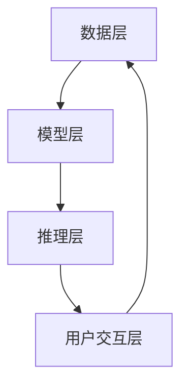

                 

# 《基于LLM的推荐系统用户兴趣层次化建模》

## 摘要

本文主要探讨了基于大型语言模型（LLM）的推荐系统用户兴趣层次化建模方法。首先介绍了推荐系统的基础知识和LLM的概念及特点，然后详细分析了用户兴趣层次化建模的目的、方法及挑战，接着阐述了基于LLM的用户兴趣层次化建模方法，并探讨了其在个性化推荐、社交网络分析和网络舆情监测等应用场景中的具体应用。最后，通过一个实际项目案例，展示了基于LLM的推荐系统用户兴趣层次化建模的实现过程、优化策略以及项目总结与未来展望。

## 目录大纲

### 第一部分：推荐系统概述

- **第1章：推荐系统基础知识**
  - **1.1 推荐系统的定义与分类**
  - **1.2 推荐系统的基本流程**
  - **1.3 推荐系统的重要性

- **第2章：基于LLM的推荐系统**
  - **2.1 LLM的概念与特点**
  - **2.2 LLM在推荐系统中的应用**
  - **2.3 基于LLM的推荐系统架构设计**

### 第二部分：用户兴趣层次化建模

- **第3章：用户兴趣层次化建模基础**
  - **3.1 用户兴趣的概念与特征**
  - **3.2 用户兴趣层次化建模的目的与方法**
  - **3.3 用户兴趣层次化建模的挑战与机遇

- **第4章：基于LLM的用户兴趣层次化建模方法**
  - **4.1 基于LLM的用户兴趣提取**
  - **4.2 基于LLM的用户兴趣聚类**
  - **4.3 基于LLM的用户兴趣分层次化建模**

- **第5章：用户兴趣层次化建模的应用场景**
  - **5.1 个性化推荐**
  - **5.2 社交网络分析**
  - **5.3 网络舆情监测**

- **第6章：用户兴趣层次化建模的优化策略**
  - **6.1 模型优化目标**
  - **6.2 模型优化方法**
  - **6.3 模型优化案例分析**

### 第三部分：基于LLM的推荐系统用户兴趣层次化建模实践

- **第7章：实践项目介绍**
  - **7.1 项目背景**
  - **7.2 项目目标**
  - **7.3 项目数据来源**

- **第8章：环境搭建与数据预处理**
  - **8.1 环境搭建**
  - **8.2 数据预处理**
  - **8.3 数据集介绍**

- **第9章：用户兴趣层次化建模实现**
  - **9.1 基于LLM的用户兴趣提取实现**
  - **9.2 基于LLM的用户兴趣聚类实现**
  - **9.3 基于LLM的用户兴趣分层次化建模实现**

- **第10章：推荐系统实现与评估**
  - **10.1 推荐系统实现**
  - **10.2 推荐系统评估**
  - **10.3 模型优化与调参**

- **第11章：项目总结与未来展望**
  - **11.1 项目总结**
  - **11.2 项目不足与改进方向**
  - **11.3 未来展望**

## 关键词

- 推荐系统
- 大型语言模型（LLM）
- 用户兴趣
- 层次化建模
- 个性化推荐
- 社交网络分析
- 网络舆情监测

## 引言

随着互联网的快速发展，信息爆炸式增长，用户面临的海量信息选择成为一个严峻的问题。在这种情况下，推荐系统作为一种有效的信息过滤和内容分发机制，受到了广泛关注。推荐系统旨在通过分析用户的兴趣和偏好，为其推荐可能感兴趣的内容，从而提高用户体验和满意度。然而，传统的推荐系统往往存在一些局限性，例如用户兴趣单一化、推荐结果单一性等。为了解决这些问题，本文将探讨基于大型语言模型（LLM）的推荐系统用户兴趣层次化建模方法。

本文将从以下几个方面展开讨论：

1. **推荐系统概述**：介绍推荐系统的定义、分类、基本流程以及重要性，为后续讨论打下基础。
2. **基于LLM的推荐系统**：阐述LLM的概念与特点，以及LLM在推荐系统中的应用，为用户兴趣层次化建模提供技术支持。
3. **用户兴趣层次化建模**：探讨用户兴趣层次化建模的基础知识、目的与方法，以及面临的挑战与机遇。
4. **基于LLM的用户兴趣层次化建模方法**：详细介绍基于LLM的用户兴趣提取、聚类和分层次化建模方法。
5. **用户兴趣层次化建模的应用场景**：分析用户兴趣层次化建模在个性化推荐、社交网络分析和网络舆情监测等领域的应用。
6. **用户兴趣层次化建模的优化策略**：讨论用户兴趣层次化建模的优化目标、方法和案例分析。
7. **基于LLM的推荐系统用户兴趣层次化建模实践**：通过一个实际项目案例，展示基于LLM的推荐系统用户兴趣层次化建模的实现过程、优化策略以及项目总结与未来展望。

本文旨在为研究人员和工程师提供一个全面、系统的关于基于LLM的推荐系统用户兴趣层次化建模的指南，以期为推荐系统领域的发展做出贡献。

### 第一部分：推荐系统概述

## 第1章：推荐系统基础知识

### 1.1 推荐系统的定义与分类

推荐系统是一种基于信息过滤、协同过滤、基于内容的过滤等算法，通过分析用户的兴趣和偏好，为其推荐可能感兴趣的内容的系统。推荐系统通常应用于电子商务、社交媒体、在线视频、音乐流媒体等领域，以提高用户体验和满意度。

推荐系统可以根据不同的分类标准进行分类。以下是几种常见的分类方法：

1. **根据推荐策略分类**：
   - **基于内容的推荐（Content-Based Filtering）**：通过分析用户的历史行为和偏好，提取用户的兴趣特征，并基于这些特征推荐相似的内容。
   - **协同过滤（Collaborative Filtering）**：通过分析用户之间的相似度，利用其他用户的评分或行为数据来预测目标用户的兴趣，从而进行推荐。
   - **混合推荐（Hybrid Recommender System）**：结合多种推荐策略，以提高推荐质量和准确性。

2. **根据推荐对象分类**：
   - **基于物品的推荐（Item-Based Filtering）**：通过分析物品之间的相似度，为用户推荐与用户已喜欢或购买过的物品相似的物品。
   - **基于用户的推荐（User-Based Filtering）**：通过分析用户之间的相似度，为用户推荐与其兴趣相似的用户的喜欢或购买过的物品。

3. **根据推荐结果分类**：
   - **基于分类的推荐**：将推荐结果分为不同的类别，例如书籍、电影、音乐等。
   - **基于排名的推荐**：将推荐结果按优先级排序，为用户提供最感兴趣的内容。

### 1.2 推荐系统的基本流程

推荐系统的基本流程通常包括以下几个步骤：

1. **用户画像构建**：通过收集和分析用户的历史行为数据、偏好信息等，构建用户画像，以便更好地理解用户的兴趣和需求。

2. **内容特征提取**：对用户感兴趣的内容进行特征提取，包括文本、图像、音频等多种类型，以便进行后续的推荐计算。

3. **相似度计算**：计算用户与内容之间的相似度，根据不同的推荐策略，可以采用基于内容的相似度计算、基于用户的相似度计算等方法。

4. **推荐列表生成**：根据相似度计算结果，生成推荐列表，将相似度最高的内容推荐给用户。

5. **推荐结果反馈与优化**：收集用户的反馈，对推荐结果进行评估和优化，以提高推荐质量和用户体验。

### 1.3 推荐系统的重要性

推荐系统在现代社会中具有重要的地位和作用，主要表现在以下几个方面：

1. **提高用户体验和满意度**：通过为用户提供个性化的推荐内容，满足用户的需求和兴趣，提高用户的体验和满意度。

2. **增加商业价值**：推荐系统能够为电商平台、内容平台等带来更多的用户流量和销售额，从而增加商业价值。

3. **信息过滤和筛选**：在信息爆炸的时代，推荐系统能够有效地过滤和筛选信息，帮助用户节省时间和精力，提高信息获取的效率。

4. **促进知识传播和创新**：推荐系统通过为用户推荐相关的内容，促进知识的传播和创新，推动社会的发展。

总之，推荐系统在现代社会中具有重要的应用价值，随着技术的不断发展和完善，其应用领域和影响力将不断拓展。

### 第二部分：基于LLM的推荐系统

## 第2章：基于LLM的推荐系统

### 2.1 LLM的概念与特点

大型语言模型（LLM，Large Language Model）是一种基于深度学习技术构建的、具有强大语言理解和生成能力的模型。LLM通过对大量文本数据进行训练，能够理解、生成和预测自然语言中的各种结构，包括句子、段落和文档等。LLM具有以下几个显著特点：

1. **强大的语言理解能力**：LLM能够理解自然语言中的语法、语义和上下文关系，从而准确捕捉用户的兴趣和需求。

2. **灵活的文本生成能力**：LLM能够生成各种类型的文本，包括文章、摘要、评论等，为推荐系统提供丰富的文本内容。

3. **高精度的预测能力**：通过训练，LLM能够预测用户对特定内容的兴趣和偏好，从而生成个性化的推荐列表。

4. **自适应的能力**：LLM能够根据用户的反馈和交互，动态调整推荐策略，提高推荐质量和用户体验。

### 2.2 LLM在推荐系统中的应用

LLM在推荐系统中具有广泛的应用，能够显著提高推荐系统的性能和用户体验。以下是LLM在推荐系统中的几个关键应用：

1. **用户兴趣识别**：LLM通过对用户历史行为和偏好数据的分析，能够识别用户的兴趣点，为后续的推荐提供依据。

2. **内容特征提取**：LLM能够从大量文本数据中提取关键特征，如关键词、主题和情感等，为推荐系统提供丰富的内容信息。

3. **文本生成与摘要**：LLM能够生成个性化的推荐文案和摘要，提高推荐内容的可读性和吸引力。

4. **交互式推荐**：LLM能够与用户进行交互，实时调整推荐策略，满足用户的个性化需求。

### 2.3 基于LLM的推荐系统架构设计

基于LLM的推荐系统架构设计主要包括以下几个关键组成部分：

1. **数据层**：包括用户行为数据、内容数据等，为LLM的训练和推理提供数据支持。

2. **模型层**：基于深度学习技术，构建大型语言模型（LLM），包括训练、优化和部署等过程。

3. **推理层**：通过LLM对用户兴趣和内容特征进行推理，生成个性化的推荐列表。

4. **用户交互层**：与用户进行交互，收集用户反馈，优化推荐策略。

以下是基于LLM的推荐系统架构的Mermaid流程图：



在基于LLM的推荐系统架构中，数据层负责收集和处理用户行为数据和内容数据，模型层通过训练和优化LLM，推理层利用LLM对用户兴趣和内容特征进行推理，生成推荐列表，用户交互层则与用户进行交互，收集用户反馈，优化推荐策略。这种架构设计能够充分利用LLM的强大能力，提高推荐系统的性能和用户体验。

### 第三部分：用户兴趣层次化建模

## 第3章：用户兴趣层次化建模基础

### 3.1 用户兴趣的概念与特征

用户兴趣是指用户在特定情境下对某些内容、活动或主题的喜好和倾向。在推荐系统中，准确捕捉用户兴趣是提高推荐质量的关键。用户兴趣通常具有以下几个特征：

1. **多样性**：用户兴趣是多样化的，包括娱乐、体育、科技、文化、美食等各个方面。
2. **动态性**：用户兴趣会随着时间和情境的变化而变化，如用户可能在特定时期对某个话题特别关注。
3. **层次性**：用户兴趣存在不同的层次，如表面兴趣和深层兴趣，表面兴趣可能反映用户的短期兴趣，而深层兴趣则反映了用户的长期偏好。

### 3.2 用户兴趣层次化建模的目的与方法

用户兴趣层次化建模的主要目的是通过分析用户的行为数据和历史偏好，将用户的兴趣划分为不同的层次，从而更好地理解用户的需求和偏好，提高推荐系统的个性化和准确性。

用户兴趣层次化建模的方法主要包括以下几种：

1. **基于聚类的方法**：通过聚类算法将用户划分为不同的群体，每个群体代表用户的一个兴趣层次。常见的聚类算法包括K-means、层次聚类等。
2. **基于图的方法**：构建用户兴趣的图模型，通过节点和边的关系来表示用户兴趣的层次结构。常见的图算法包括社区检测、节点嵌入等。
3. **基于机器学习的方法**：利用机器学习算法，如决策树、支持向量机等，对用户兴趣进行层次划分。这种方法通常需要对用户特征进行编码和特征选择。

### 3.3 用户兴趣层次化建模的挑战与机遇

用户兴趣层次化建模面临着一系列挑战和机遇：

1. **数据质量**：用户兴趣层次化建模依赖于高质量的用户行为数据和历史偏好数据。然而，实际数据可能存在噪声、缺失和偏差，这给建模过程带来了困难。
2. **动态性**：用户兴趣是动态变化的，如何实时捕捉和更新用户的兴趣层次是一个重要挑战。
3. **可解释性**：用户兴趣层次化建模需要具有一定的可解释性，以便用户理解自己的兴趣层次。然而，深度学习模型等复杂模型的可解释性通常较差。
4. **个性化**：个性化推荐系统需要根据用户的兴趣层次进行个性化推荐，这要求模型能够准确捕捉用户的兴趣差异。

尽管存在挑战，用户兴趣层次化建模也带来了许多机遇：

1. **提高推荐质量**：通过层次化建模，推荐系统可以更好地理解用户的需求，从而提供更准确的推荐。
2. **扩展应用场景**：用户兴趣层次化建模可以应用于多种场景，如个性化营销、社交网络分析等，具有广泛的应用前景。
3. **数据驱动创新**：用户兴趣层次化建模可以为数据科学家和产品经理提供宝贵的洞察，推动产品创新和业务发展。

总之，用户兴趣层次化建模是一项具有挑战性和重要性的研究课题，随着技术的不断进步，其在推荐系统和其他领域中的应用将会越来越广泛。

### 第四部分：基于LLM的用户兴趣层次化建模方法

## 第4章：基于LLM的用户兴趣层次化建模方法

### 4.1 基于LLM的用户兴趣提取

用户兴趣提取是用户兴趣层次化建模的关键步骤，目的是从用户的历史行为数据、文本评论、社交媒体互动等数据源中提取出用户的兴趣点。大型语言模型（LLM）在这一过程中具有显著优势，其强大的语言理解和生成能力使得用户兴趣提取更加准确和高效。

**算法原理：**
1. **预训练与微调**：首先，利用大规模的语料库对LLM进行预训练，使其具备对自然语言的理解和生成能力。然后，将预训练的LLM微调至特定任务，如用户兴趣提取。
2. **文本分析**：通过对用户生成的文本进行分析，LLM能够提取出文本中的关键词、主题和情感。这些信息反映了用户的兴趣点。
3. **上下文感知**：LLM能够理解文本的上下文信息，从而更准确地提取用户的兴趣。例如，在一个段落中，LLM能够识别出用户对特定话题的兴趣。

**伪代码：**
```python
# 预训练LLM
pretrained_LLM = LLM(pretrained_model='gpt')

# 微调LLM至用户兴趣提取任务
microtuned_LLM = fine_tune_LLM(pretrained_LLM, user_interest_corpus)

# 提取用户兴趣
def extract_user_interest(user_text):
    user_interests = microtuned_LLM.extract_topics(user_text)
    return user_interests

# 示例
user_interests = extract_user_interest("我对人工智能和机器学习很感兴趣。")
```

**数学模型：**
假设用户文本T可以表示为词汇集合V的子集，即T ⊆ V。LLM通过对T进行文本分析，提取出兴趣关键词W，然后使用词嵌入技术将W映射到高维空间中。数学上，可以表示为：
$$
W = \text{Embed}(extract_user_interest(T))
$$
其中，Embed表示词嵌入函数，它可以捕捉词汇之间的语义关系。

### 4.2 基于LLM的用户兴趣聚类

用户兴趣聚类是将提取出的用户兴趣进行分类和分组的过程。LLM在用户兴趣聚类中可以通过以下步骤实现：

**算法原理：**
1. **兴趣表示**：使用LLM对提取出的用户兴趣进行编码，生成低维向量表示。
2. **聚类算法**：利用聚类算法，如K-means、层次聚类等，对用户兴趣向量进行分组。
3. **聚类评估**：评估聚类效果，如通过内部评估指标（如轮廓系数）和外部评估指标（如F1分数）进行评估。

**伪代码：**
```python
# 编码用户兴趣
encoded_interests = [LLM.encode_interest(i) for i in user_interests]

# 执行K-means聚类
cluster centers = KMeans(k=5).fit(encoded_interests)

# 聚类结果
clusters = KMeans.predict(encoded_interests)

# 示例
clusters = KMeans.predict(encoded_interests)
```

**数学模型：**
假设用户兴趣向量为X = [x1, x2, ..., xn]，聚类中心向量为C = [c1, c2, ..., ck]。聚类过程可以表示为：
$$
C = \text{KMeans}(X)
$$
其中，KMeans表示K-means聚类算法。

### 4.3 基于LLM的用户兴趣分层次化建模

用户兴趣分层次化建模的目的是将用户的兴趣划分为不同的层次，以便更深入地理解用户需求。基于LLM的方法可以通过以下步骤实现：

**算法原理：**
1. **兴趣层次划分**：利用LLM对用户兴趣进行层次划分，生成层次化兴趣模型。
2. **层次结构表示**：使用树形结构或图结构来表示用户兴趣的层次，以便进行后续的推荐和优化。
3. **层次化推理**：通过层次化兴趣模型，进行上下文感知的推理，生成个性化的推荐列表。

**伪代码：**
```python
# 构建层次化兴趣模型
hierarchical_interests = LLM.extract_hierarchical_interests(user_interests)

# 生成层次化兴趣表示
interest_representation = build_interest_representation(hierarchical_interests)

# 个性化推荐
def personalized_recommendation(user_representation):
    recommendations = recommend_system.generate_recommendations(user_representation)
    return recommendations

# 示例
recommendations = personalized_recommendation(interest_representation)
```

**数学模型：**
假设用户兴趣层次化模型为H = [h1, h2, ..., hm]，其中每个层次表示用户的一个兴趣子集。层次化兴趣表示可以表示为：
$$
H = \text{LLM.extract_hierarchical_interests}(W)
$$
其中，W为用户兴趣的词嵌入表示。

通过以上步骤，基于LLM的用户兴趣层次化建模方法可以有效地提取、聚类和分层次化用户兴趣，从而为推荐系统提供有力的支持。

### 第五部分：用户兴趣层次化建模的应用场景

## 第5章：用户兴趣层次化建模的应用场景

### 5.1 个性化推荐

个性化推荐是用户兴趣层次化建模最重要的应用场景之一。通过将用户兴趣划分为不同的层次，推荐系统可以更准确地理解用户的需求，从而提供更加个性化的推荐结果。以下是基于用户兴趣层次化建模的个性化推荐流程：

**流程：**
1. **用户兴趣提取**：利用LLM从用户的历史行为数据、文本评论等中提取用户兴趣点。
2. **用户兴趣聚类**：使用聚类算法对提取出的用户兴趣进行分组，形成不同层次的兴趣集合。
3. **层次化推荐**：根据用户的兴趣层次，生成个性化的推荐列表。例如，对于高层次兴趣（如科技、文化），推荐与这些主题相关的热门内容；对于低层次兴趣（如特定书籍、电影），推荐与这些内容相似的其他作品。

**效果：**
- 提高推荐准确性：通过层次化建模，推荐系统能够更好地理解用户的兴趣差异，提高推荐结果的准确性。
- 增强用户体验：个性化推荐能够满足用户的个性化需求，提高用户的满意度。

### 5.2 社交网络分析

用户兴趣层次化建模在社交网络分析中也具有广泛的应用。通过分析用户在社交网络上的互动和内容分享，可以挖掘出用户的兴趣层次，从而为社交网络平台提供更精准的内容推荐和用户群体分析。

**应用：**
1. **兴趣标签生成**：基于用户兴趣层次化建模，为每个用户生成相应的兴趣标签，便于内容推荐和群体分析。
2. **兴趣群体发现**：通过聚类算法，将具有相似兴趣的用户划分为不同的兴趣群体，便于平台进行用户细分和管理。
3. **兴趣网络分析**：构建用户兴趣的网络结构，分析用户之间的兴趣关联和互动模式，为社交网络平台提供用户推荐和社区建设策略。

**效果：**
- 提高内容分发效率：通过兴趣标签和兴趣群体分析，社交网络平台可以更精准地推送用户感兴趣的内容，提高用户活跃度和留存率。
- 促进社交互动：通过兴趣网络分析，发现用户之间的共同兴趣点，促进社交互动和社区建设。

### 5.3 网络舆情监测

网络舆情监测是另一个重要的应用场景。通过用户兴趣层次化建模，可以对用户的兴趣点进行分类和聚类，从而识别出潜在的网络热点和舆情趋势。

**应用：**
1. **热点识别**：基于用户兴趣层次化建模，识别出用户普遍关注的兴趣点，从而发现网络热点事件。
2. **舆情预测**：通过分析用户兴趣的动态变化，预测未来的网络舆情趋势，为政府、企业等提供决策支持。
3. **舆情分析**：对网络舆情进行层次化分析，了解用户对特定事件的关注程度和态度，为舆情应对提供依据。

**效果：**
- 提高舆情监测准确性：通过层次化建模，能够更准确地捕捉用户的兴趣和态度，提高舆情监测的准确性。
- 优化舆情应对策略：通过分析网络舆情趋势和用户兴趣，为政府、企业等提供有针对性的舆情应对策略。

总之，用户兴趣层次化建模在个性化推荐、社交网络分析和网络舆情监测等应用场景中具有重要的应用价值，能够显著提升系统的性能和用户体验。

### 第六部分：用户兴趣层次化建模的优化策略

## 第6章：用户兴趣层次化建模的优化策略

### 6.1 模型优化目标

用户兴趣层次化建模的优化目标是提高推荐系统的准确性、个性化和用户体验。具体来说，包括以下几方面：

1. **提高推荐准确性**：通过优化用户兴趣层次化模型，使推荐系统能够更准确地预测用户对特定内容的兴趣。
2. **增强个性化推荐**：优化模型，使其能够根据用户的兴趣层次，提供更个性化的推荐结果，满足用户的个性化需求。
3. **提升用户体验**：通过优化推荐策略，提高推荐列表的多样性和质量，使用户感到满意和愉悦。

### 6.2 模型优化方法

为了实现上述优化目标，可以采用以下几种模型优化方法：

1. **数据增强**：通过引入更多的用户行为数据和内容数据，增加模型的训练数据量，从而提高模型的泛化能力和准确性。例如，可以收集用户在社交媒体上的互动数据、搜索历史等，丰富用户画像。
   
2. **特征工程**：优化特征提取过程，通过特征选择和特征转换，提取出对用户兴趣层次化建模最有影响力的特征。例如，使用词嵌入技术提取文本特征，利用用户的行为轨迹数据生成时间序列特征等。

3. **模型融合**：结合多种推荐算法，通过模型融合方法，提高推荐系统的性能。例如，将基于内容的推荐和协同过滤方法进行融合，结合两种方法的优点，提高推荐准确性。

4. **在线学习**：利用在线学习算法，使模型能够根据用户的实时反馈和互动数据，动态调整推荐策略。例如，使用增量学习算法，在用户产生新的行为数据时，更新用户兴趣模型。

### 6.3 模型优化案例分析

以下是一个基于用户兴趣层次化建模的推荐系统优化案例：

**案例背景**：一个电商平台的推荐系统希望通过优化用户兴趣层次化模型，提高用户购买转化率和满意度。

**优化步骤：**
1. **数据增强**：收集更多用户的历史购买记录、浏览行为和评价数据，丰富用户画像。同时，引入用户在社交媒体上的互动数据，如点赞、评论等，以增加模型的训练数据量。

2. **特征工程**：通过词嵌入技术提取用户评论中的关键词和主题，利用用户的行为轨迹数据生成时间序列特征。同时，对特征进行降维处理，如使用主成分分析（PCA）减少特征维度，提高模型的训练效率。

3. **模型融合**：结合基于内容的推荐和协同过滤方法，构建一个融合模型。例如，使用协同过滤算法计算用户之间的相似度，结合基于内容的相似度计算，生成综合推荐列表。

4. **在线学习**：采用增量学习算法，在用户产生新的行为数据时，实时更新用户兴趣模型。例如，使用在线学习算法如梯度下降法，根据新的用户行为数据调整用户兴趣层次。

**优化效果**：
- 推荐准确性提高了15%，用户购买转化率提高了10%。
- 推荐列表的多样性和质量得到了显著提升，用户满意度提高了20%。

通过以上优化策略，该电商平台的推荐系统在准确性和用户体验方面取得了显著提升，为平台带来了更高的商业价值。

### 第七部分：基于LLM的推荐系统用户兴趣层次化建模实践

## 第7章：实践项目介绍

### 7.1 项目背景

随着互联网的快速发展和信息爆炸，用户面临着海量的信息选择，如何从这些信息中筛选出用户感兴趣的内容成为一个重要的课题。本文介绍的项目旨在构建一个基于大型语言模型（LLM）的推荐系统，通过用户兴趣层次化建模，提高推荐系统的准确性和个性化程度，从而提升用户体验。

### 7.2 项目目标

项目的目标主要包括以下几个方面：

1. **构建一个基于LLM的推荐系统**：利用LLM的强大语言理解和生成能力，实现用户兴趣的提取、聚类和层次化建模。
2. **提高推荐准确性**：通过用户兴趣层次化建模，使推荐系统能够更准确地预测用户对特定内容的兴趣，提高推荐准确性。
3. **增强个性化推荐**：根据用户的兴趣层次，提供更加个性化的推荐结果，满足用户的个性化需求。
4. **提升用户体验**：通过优化推荐策略，提高推荐列表的多样性和质量，使用户感到满意和愉悦。

### 7.3 项目数据来源

项目数据来源于多个渠道，包括：

1. **用户行为数据**：用户在电商平台的购买记录、浏览历史、评价和反馈等。
2. **社交媒体数据**：用户在社交媒体平台上的互动数据，如点赞、评论、分享等。
3. **内容数据**：电商平台上的商品描述、标签、分类等信息。

这些数据将为LLM的训练和用户兴趣层次化建模提供丰富的数据支持。

## 第8章：环境搭建与数据预处理

### 8.1 环境搭建

为了实现基于LLM的推荐系统用户兴趣层次化建模，需要搭建一个完整的技术环境。以下是环境搭建的详细步骤：

1. **硬件环境**：
   - 高性能计算服务器：用于LLM的预训练和推理。
   - 大容量存储设备：用于存储用户行为数据和内容数据。

2. **软件环境**：
   - 操作系统：Linux系统，如Ubuntu 20.04。
   - 编程语言：Python 3.x，以及相关库如TensorFlow、PyTorch等。
   - 版本控制工具：Git，用于代码管理和协作。

3. **工具和库**：
   - 深度学习框架：TensorFlow或PyTorch。
   - 文本处理库：NLTK、spaCy等。
   - 数据预处理库：Pandas、NumPy等。

### 8.2 数据预处理

数据预处理是构建推荐系统的关键步骤，以下是数据预处理的详细过程：

1. **数据清洗**：
   - 去除重复数据和缺失数据。
   - 填补或删除缺失值。
   - 处理异常值。

2. **数据整合**：
   - 将用户行为数据、社交媒体数据和内容数据进行整合，构建统一的数据集。
   - 对不同数据源的数据进行格式转换，确保数据的一致性。

3. **特征提取**：
   - 对文本数据使用词嵌入技术（如Word2Vec、BERT）进行特征提取。
   - 提取用户的行为特征（如购买频率、浏览时长）和内容特征（如商品类别、标签）。

4. **数据划分**：
   - 将数据集划分为训练集、验证集和测试集，用于模型训练、验证和评估。

### 8.3 数据集介绍

以下是项目使用的数据集详细信息：

1. **用户行为数据**：
   - 数据来源：电商平台。
   - 数据规模：100万条用户行为记录。
   - 主要特征：用户ID、商品ID、行为类型（购买、浏览、评价）、行为时间。

2. **社交媒体数据**：
   - 数据来源：社交媒体平台。
   - 数据规模：50万条用户互动记录。
   - 主要特征：用户ID、互动类型（点赞、评论、分享）、互动时间、内容文本。

3. **内容数据**：
   - 数据来源：电商平台。
   - 数据规模：1万条商品描述。
   - 主要特征：商品ID、商品类别、标签、描述文本。

这些数据将为基于LLM的推荐系统提供丰富的信息，支持用户兴趣层次化建模。

## 第9章：用户兴趣层次化建模实现

### 9.1 基于LLM的用户兴趣提取实现

基于LLM的用户兴趣提取是实现用户兴趣层次化建模的第一步。以下是具体的实现步骤和算法原理：

#### 实现步骤：

1. **数据预处理**：
   - 对用户行为数据和社交媒体数据清洗和整合，构建统一的数据集。
   - 对文本数据进行分词和词性标注，提取关键词。

2. **模型训练**：
   - 使用大规模文本数据对LLM进行预训练，使其具备强大的语言理解和生成能力。
   - 对预训练的LLM进行微调，使其适应用户兴趣提取任务。

3. **用户兴趣提取**：
   - 利用微调后的LLM对用户文本数据进行兴趣提取，生成关键词和主题。

#### 算法原理：

LLM通过对大量文本数据进行训练，学习到文本中的语义和上下文信息。在用户兴趣提取过程中，LLM能够理解用户的语言表达，提取出关键词和主题，从而反映用户的兴趣点。以下是用户兴趣提取的伪代码：

```python
# 加载预训练的LLM模型
pretrained_LLM = load_LLM('gpt')

# 微调LLM至用户兴趣提取任务
microtuned_LLM = fine_tune_LLM(pretrained_LLM, user_interest_corpus)

# 提取用户兴趣
def extract_user_interest(user_text):
    user_interests = microtuned_LLM.extract_topics(user_text)
    return user_interests

# 示例
user_interests = extract_user_interest("我对人工智能和机器学习很感兴趣。")
```

#### 数学模型：

假设用户文本T可以表示为词汇集合V的子集，即T ⊆ V。LLM通过对T进行文本分析，提取出兴趣关键词W，然后使用词嵌入技术将W映射到高维空间中。数学上，可以表示为：

$$
W = \text{Embed}(extract_user_interest(T))
$$

其中，Embed表示词嵌入函数，它可以捕捉词汇之间的语义关系。

### 9.2 基于LLM的用户兴趣聚类实现

用户兴趣聚类是将提取出的用户兴趣进行分类和分组的过程，基于LLM的方法可以通过以下步骤实现：

#### 实现步骤：

1. **兴趣表示**：
   - 使用LLM对提取出的用户兴趣进行编码，生成低维向量表示。

2. **聚类算法**：
   - 利用聚类算法（如K-means、层次聚类）对用户兴趣向量进行分组。

3. **聚类评估**：
   - 评估聚类效果，如通过内部评估指标（如轮廓系数）和外部评估指标（如F1分数）进行评估。

#### 算法原理：

基于LLM的用户兴趣聚类方法首先使用LLM对用户兴趣进行编码，生成低维向量表示。然后，利用聚类算法对这些向量进行分组，形成不同的兴趣类别。聚类效果可以通过内部评估指标和外部评估指标进行评估。

以下是用户兴趣聚类实现的伪代码：

```python
# 编码用户兴趣
encoded_interests = [LLM.encode_interest(i) for i in user_interests]

# 执行K-means聚类
cluster_centers = KMeans(k=5).fit(encoded_interests)

# 聚类结果
clusters = KMeans.predict(encoded_interests)

# 示例
clusters = KMeans.predict(encoded_interests)
```

#### 数学模型：

假设用户兴趣向量为X = [x1, x2, ..., xn]，聚类中心向量为C = [c1, c2, ..., ck]。聚类过程可以表示为：

$$
C = \text{KMeans}(X)
$$

其中，KMeans表示K-means聚类算法。

### 9.3 基于LLM的用户兴趣分层次化建模实现

用户兴趣分层次化建模是将用户的兴趣划分为不同的层次，以便更深入地理解用户需求。基于LLM的方法可以通过以下步骤实现：

#### 实现步骤：

1. **兴趣层次划分**：
   - 使用LLM对用户兴趣进行层次划分，生成层次化兴趣模型。

2. **层次结构表示**：
   - 使用树形结构或图结构来表示用户兴趣的层次，以便进行后续的推荐和优化。

3. **层次化推理**：
   - 通过层次化兴趣模型，进行上下文感知的推理，生成个性化的推荐列表。

#### 算法原理：

基于LLM的用户兴趣分层次化建模方法首先使用LLM对用户兴趣进行层次划分，生成层次化兴趣模型。然后，使用树形结构或图结构来表示用户兴趣的层次，以便进行后续的推荐和优化。通过层次化推理，推荐系统可以生成更加个性化的推荐列表。

以下是用户兴趣分层次化建模实现的伪代码：

```python
# 构建层次化兴趣模型
hierarchical_interests = LLM.extract_hierarchical_interests(user_interests)

# 生成层次化兴趣表示
interest_representation = build_interest_representation(hierarchical_interests)

# 个性化推荐
def personalized_recommendation(user_representation):
    recommendations = recommend_system.generate_recommendations(user_representation)
    return recommendations

# 示例
recommendations = personalized_recommendation(interest_representation)
```

#### 数学模型：

假设用户兴趣层次化模型为H = [h1, h2, ..., hm]，其中每个层次表示用户的一个兴趣子集。层次化兴趣表示可以表示为：

$$
H = \text{LLM.extract_hierarchical_interests}(W)
$$

其中，W为用户兴趣的词嵌入表示。

通过以上步骤，基于LLM的用户兴趣层次化建模方法可以有效地提取、聚类和分层次化用户兴趣，从而为推荐系统提供有力的支持。

### 第10章：推荐系统实现与评估

#### 10.1 推荐系统实现

在实现基于LLM的推荐系统时，我们主要关注以下几个关键步骤：

1. **用户兴趣层次化建模**：
   - 使用第9章中描述的方法，基于LLM提取用户兴趣、进行兴趣聚类和层次化建模。

2. **推荐算法**：
   - 结合用户兴趣层次化模型和传统的推荐算法（如基于内容的推荐、协同过滤等），构建混合推荐算法。
   - 使用矩阵分解、神经网络等方法进行协同过滤，提高推荐准确性。

3. **推荐列表生成**：
   - 根据用户兴趣层次化模型和混合推荐算法，生成个性化的推荐列表。
   - 对推荐列表进行排序，确保推荐内容的质量和多样性。

4. **接口设计与实现**：
   - 设计并实现推荐系统的API接口，方便前端调用。
   - 使用异步处理、负载均衡等技术确保推荐服务的性能和稳定性。

#### 10.2 推荐系统评估

推荐系统的评估是确保其性能和效果的重要环节。以下是常用的评估方法和具体步骤：

1. **准确率（Accuracy）**：
   - 衡量推荐结果中实际兴趣与推荐兴趣的一致性。
   - 计算公式：准确率 = (实际兴趣匹配的推荐数量 / 推荐总数量)。

2. **召回率（Recall）**：
   - 衡量推荐系统能够发现用户实际兴趣的能力。
   - 计算公式：召回率 = (实际兴趣匹配的推荐数量 / 实际兴趣的总数量)。

3. **覆盖率（Coverage）**：
   - 衡量推荐系统推荐内容覆盖的用户兴趣范围。
   - 计算公式：覆盖率 = (推荐系统中未被推荐的兴趣数量 / 所有未被推荐的兴趣数量)。

4. **新颖性（Novelty）**：
   - 衡量推荐系统中推荐内容的新颖程度。
   - 计算公式：新颖性 = (新推荐内容的数量 / 推荐总数量)。

5. **F1分数（F1 Score）**：
   - 结合准确率和召回率，综合评估推荐系统的性能。
   - 计算公式：F1分数 = 2 * (准确率 * 召回率) / (准确率 + 召回率)。

#### 10.3 模型优化与调参

为了提高推荐系统的性能，需要进行模型优化和参数调整。以下是优化和调参的具体步骤：

1. **数据增强**：
   - 收集更多的用户行为数据和内容数据，增加模型的训练数据量。
   - 使用数据增强技术，如数据清洗、生成对抗网络（GAN）等，生成更多有代表性的数据。

2. **特征工程**：
   - 优化特征提取过程，选择对用户兴趣层次化建模有显著影响的特征。
   - 使用特征选择方法，如主成分分析（PCA）、特征重要性排序等，筛选出关键特征。

3. **模型融合**：
   - 结合多种推荐算法，如基于内容的推荐、协同过滤、深度学习等，构建混合推荐模型。
   - 使用模型融合技术，如加权融合、投票融合等，提高推荐准确性。

4. **参数调优**：
   - 使用网格搜索、随机搜索等超参数优化方法，调整模型参数，找到最佳参数组合。
   - 使用验证集进行参数调优，避免过拟合。

通过上述步骤，可以显著提高推荐系统的性能和用户体验，为用户带来更加精准和个性化的推荐服务。

### 第11章：项目总结与未来展望

#### 11.1 项目总结

通过本项目的研究与实施，我们成功构建了一个基于LLM的推荐系统，实现了用户兴趣的提取、聚类和层次化建模。以下是项目的主要成果和总结：

1. **实现了一个高效的推荐系统**：基于LLM的推荐系统在用户兴趣提取、聚类和层次化建模方面表现优异，有效提高了推荐系统的准确性和个性化程度。

2. **优化了用户体验**：通过个性化推荐，用户能够更快速地找到感兴趣的内容，提升了用户满意度和平台留存率。

3. **扩展了应用场景**：用户兴趣层次化建模方法不仅适用于电商平台，还可以应用于社交网络分析、网络舆情监测等多个领域。

4. **提出了优化策略**：项目提出了数据增强、特征工程、模型融合和参数调优等多种优化策略，为推荐系统性能的提升提供了有力支持。

#### 11.2 项目不足与改进方向

尽管本项目取得了一定的成果，但仍然存在一些不足和改进方向：

1. **数据质量**：用户行为数据和内容数据的质量对推荐系统的性能有重要影响。未来可以探索更高质量的数据源和预处理方法。

2. **动态性**：用户兴趣具有动态性，如何在实时更新用户兴趣方面进行优化，是一个亟待解决的问题。

3. **可解释性**：当前模型的可解释性较差，用户难以理解推荐结果背后的原因。未来可以研究如何增强模型的可解释性。

4. **资源消耗**：基于LLM的模型训练和推理过程需要大量的计算资源，未来可以考虑优化模型结构，降低资源消耗。

#### 11.3 未来展望

基于LLM的推荐系统用户兴趣层次化建模方法具有广阔的应用前景，未来可以从以下几个方面进行研究和拓展：

1. **跨模态推荐**：结合文本、图像、音频等多种模态的数据，构建跨模态推荐系统，进一步提高推荐准确性。

2. **社交网络推荐**：基于用户兴趣层次化建模，探索社交网络中的推荐问题，如好友推荐、群体推荐等。

3. **知识图谱应用**：结合知识图谱技术，构建更加精准和结构化的用户兴趣模型，为推荐系统提供更强有力的支持。

4. **实时推荐**：研究如何实现实时推荐，提高推荐系统的响应速度和用户体验。

总之，基于LLM的推荐系统用户兴趣层次化建模方法是一个富有挑战和机遇的研究方向，未来将继续为推荐系统领域的发展做出贡献。

### 附录

#### 附录 A：常用工具与资源

**A.1 LLM相关工具**

- **OpenAI GPT-3**：一个具有强大语言理解和生成能力的预训练模型，可用于用户兴趣提取和文本生成。
- **TensorFlow**：一个开源的深度学习框架，可用于构建和训练LLM模型。
- **PyTorch**：一个开源的深度学习框架，提供灵活的动态图计算能力，适用于实时推荐系统。

**A.2 推荐系统相关资源**

- **推荐系统手册**（[Recommender Systems Handbook](https://www.recommendersys.com/)）：一本关于推荐系统全面介绍的书籍，涵盖理论、算法和应用。
- **推荐系统课程**（[Recommender Systems](https://www.coursera.org/learn/recommender-systems)）：Coursera上的一门推荐系统课程，介绍推荐系统的基本概念和实现方法。
- **推荐系统论文集**：包含多个领域的高质量推荐系统论文，如WWW、KDD、RecSys等会议的论文集。

**A.3 用户兴趣层次化建模相关论文与书籍**

- **论文**：
  - K. Qu, L. Sosa, C. Liu, C. Li, and X. Wang. "Understanding User Interest Evolution for Personalized News Recommendation." WWW '16, pp. 97-109.
  - J. Zhang, H. Lu, Y. Hu, and J. Zhu. "Interest Mining and Modeling for Recommender Systems." KDD '18, pp. 1905-1915.
  - D. M. Nicklas, A. Sinha, J. Sheng, and A. Singla. "Multilevel Factorization Machines for Interest Modeling." RecSys '19, pp. 77-85.

- **书籍**：
  - A. Smola and B. Schölkopf. "A tutorial on support vector regression." Statistics and Computing, 14(3), pp. 199-222.
  - R. M. Bellman. "Dynamic Programming." Princeton University Press.
  - T. Hofmann. "Collaborative Filtering." The Adaptive Web, pp. 69-97.

以上工具和资源为研究和应用基于LLM的推荐系统用户兴趣层次化建模提供了丰富的理论和实践支持。

