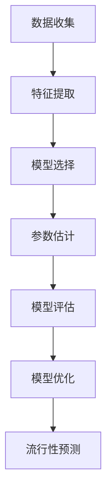

                 

## 文章标题：基于点过程的产品流行性预测

### 关键词：点过程、产品流行性、预测算法、机器学习、数据挖掘

#### 摘要：
本文深入探讨了点过程在产品流行性预测中的应用。首先，我们定义了产品流行性的概念，并阐述了其在经济和社会领域的重要性。接着，我们介绍了点过程的数学基础，包括随机过程和点过程的定义、马尔可夫点过程以及重力点过程和齐夫点过程。在此基础上，本文详细讲解了如何构建和应用点过程模型进行产品流行性预测，并通过具体的数学模型和伪代码进行了说明。最后，我们通过一个实际项目案例展示了点过程在产品流行性预测中的实际应用，并分析了预测效果和应用前景。本文旨在为研究人员和工程师提供一种有效的产品流行性预测方法，以及相关的理论基础和实践指导。

## 目录大纲设计：《基于点过程的产品流行性预测》

本文将按照以下结构进行设计，以确保内容的逻辑性和条理性：

### 第一部分：引论与背景
- **第1章：产品流行性的概念与重要性**
  - 1.1 产品流行性的定义与特征
  - 1.2 产品流行性的经济影响
  - 1.3 点过程在产品流行性研究中的应用

### 第二部分：点过程基础
- **第2章：点过程的数学基础**
  - 2.1 随机过程与点过程
  - 2.2 马尔可夫点过程
  - 2.3 重力点过程与齐夫点过程

### 第三部分：核心算法原理讲解
- **第3章：基于点过程的产品流行性预测**
  - 3.1 点过程在流行性预测中的原理
  - 3.2 点过程模型的构建
    - 3.2.1 模型参数估计
    - 3.2.2 模型评估方法
  - 3.3 伪代码详解

### 第四部分：数学模型和数学公式
- **第4章：流行性预测的数学模型**
  - 4.1 概率论基础
  - 4.2 点过程概率模型

### 第五部分：项目实战
- **第5章：基于点过程的产品流行性预测案例**
  - 5.1 项目背景与目标
  - 5.2 数据预处理
  - 5.3 模型实现与调试
  - 5.4 结果分析

### 第六部分：扩展与展望
- **第6章：点过程在流行性预测中的扩展应用**
  - 6.1 点过程与其他机器学习算法的结合
  - 6.2 面向复杂场景的点过程模型

### 第七部分：资源与工具
- **第7章：相关工具与资源**
  - 7.1 点过程模型开源工具介绍
  - 7.2 数据源与处理工具推荐
  - 7.3 学习资源与推荐阅读

本文的目录大纲设计完毕，接下来我们将按照这一结构逐步深入探讨点过程在产品流行性预测中的应用。

## 第一部分：引论与背景

### 第1章：产品流行性的概念与重要性

#### 1.1 产品流行性的定义与特征

产品流行性，是指某一产品在市场上的受欢迎程度和销售速度。它通常可以通过用户行为数据、销售数据、社交媒体互动等多个维度来衡量。产品流行性的特征主要包括以下几个方面：

1. **时间依赖性**：产品的流行性往往随时间而变化，不同时间段可能会有不同的流行趋势。
2. **社会性**：产品的流行往往受到社会舆论和人际传播的影响，一个产品的流行可能会迅速扩散到整个市场。
3. **多样性**：不同类型的产品具有不同的流行性特征，例如，消费电子产品可能更容易迅速流行，而耐用消费品则可能需要更长时间来建立流行性。
4. **可预测性**：在某些情况下，产品的流行性具有一定的可预测性，通过分析历史数据和当前市场趋势，可以预测未来某个时间点的流行程度。

#### 1.2 产品流行性的经济影响

产品流行性对经济的影响是多方面的，主要体现在以下几个方面：

1. **销售与收益**：高流行性的产品往往能够带来更高的销售额和收益，这对于企业来说是至关重要的。
2. **市场竞争**：流行性高的产品在市场上更具竞争力，能够吸引更多的消费者，从而提高市场占有率。
3. **品牌形象**：产品的流行性也是企业品牌形象建设的一个重要方面，能够增强消费者对品牌的认知和好感。
4. **投资决策**：投资者可能会根据产品的流行性来调整投资策略，选择那些具有高增长潜力的产品。

#### 1.3 点过程在产品流行性研究中的应用

点过程（Point Process）是一种用于描述事件发生时间和空间的随机过程的数学模型。在产品流行性研究中，点过程被广泛应用于预测和分析产品的流行趋势。以下是点过程在产品流行性研究中的几个应用场景：

1. **趋势预测**：通过分析历史数据，点过程模型可以预测未来某一时间段内的产品流行趋势，为企业制定营销策略提供数据支持。
2. **事件检测**：点过程可以帮助识别市场中的关键事件，如新产品发布、重大负面新闻等，这些事件往往会对产品的流行性产生显著影响。
3. **网络效应分析**：点过程可以用来分析产品流行过程中的人际传播和网络效应，帮助理解消费者行为和市场需求。
4. **风险评估**：通过模拟不同情景下的流行趋势，点过程模型可以帮助企业评估产品流行性的风险，制定相应的风险控制策略。

在接下来的章节中，我们将进一步探讨点过程的数学基础和其在产品流行性预测中的应用原理。

## 第二部分：点过程基础

### 第2章：点过程的数学基础

点过程是一种用于描述随机事件发生时间和空间的数学模型，它在统计学、物理学、信号处理等多个领域都有广泛应用。本章节将介绍点过程的基本概念、主要类型及其在产品流行性研究中的应用。

#### 2.1 随机过程与点过程

随机过程（Stochastic Process）是一类随机变量序列，用于描述随机事件在一段时间内的发展过程。随机过程可以分为离散时间和连续时间两种类型。离散时间随机过程通常用序列 {X_t} 来表示，其中 t 为离散时间点，而连续时间随机过程则用函数 X(t) 来表示。

点过程（Point Process）是随机过程的一种特殊类型，它描述的是一系列随机点在空间或时间上的分布。与随机变量不同，点过程中的随机点是事件的发生时刻，这些点的集合构成了事件的历史。点过程可以用一个函数 N(t) 来描述，该函数表示在时间 t 之前发生的事件数。

在数学上，点过程通常被定义为：

\[ N(t) = \sum_{i=1}^{n} I(t > t_i) \]

其中，\( t_i \) 是第 i 个随机点的发生时间，I 函数是一个指示函数，当 \( t > t_i \) 时取值为 1，否则为 0。

#### 2.2 马尔可夫点过程

马尔可夫点过程（Markov Point Process）是一种基于马尔可夫性质的点过程。它具有以下特性：

1. **状态转移独立性**：给定当前状态，未来的状态概率仅依赖于当前状态，而与历史状态无关。
2. **时间可加性**：在给定的时间区间内，点过程发生的总次数与时间区间的长度成正比。

马尔可夫点过程可以分为时间齐次的和非时间齐次的。时间齐次马尔可夫点过程（Homogeneous Markov Point Process）中，事件发生率是时间无关的，而时间非齐次马尔可夫点过程（Heterogeneous Markov Point Process）中，事件发生率随时间变化。

一个常见的马尔可夫点过程模型是泊松点过程（Poisson Point Process），它具有以下特性：

1. **独立性**：在任意时间区间内，点过程的强度（即单位时间内事件发生的平均次数）是独立的。
2. **平稳性**：点过程的强度函数在整个空间或时间上是平稳的。

泊松点过程的概率分布为：

\[ P(N(t) = k) = \frac{(\lambda t)^k e^{-\lambda t}}{k!} \]

其中，\( \lambda \) 是点过程的强度参数，表示单位时间内事件发生的平均次数。

#### 2.3 重力点过程与齐夫点过程

重力点过程（Gravity Point Process）和齐夫点过程（Zipf Point Process）是两种重要的非齐次点过程模型。

**重力点过程**是一种基于吸引力的点过程模型，其事件的发生概率与吸引中心的位置有关。在一个二维空间中，给定一个吸引中心 \( c \) 和一个距离衰减函数 \( r(x, c) \)，重力点过程的概率分布可以表示为：

\[ P(N(t) = k) = C \sum_{i=1}^{k} \frac{1}{r(c_i, c)^2} \]

其中，\( c_i \) 是第 i 个随机点的位置，C 是归一化常数。

**齐夫点过程**则是一种基于概率分布的非齐次点过程模型，它通常用于描述具有幂律分布的数据。齐夫点过程的概率分布为：

\[ P(N(t) = k) = C \frac{1}{k^\alpha} \]

其中，\( \alpha \) 是齐夫指数，它决定了数据分布的幂律特征。

通过以上对点过程基本概念和类型的介绍，我们可以更好地理解点过程在产品流行性研究中的应用原理。在接下来的章节中，我们将深入探讨如何利用点过程模型进行产品流行性预测。

## 第三部分：核心算法原理讲解

### 第3章：基于点过程的产品流行性预测

点过程在产品流行性预测中的应用主要基于其能够描述事件发生的时空特性。通过构建合适的点过程模型，我们可以对产品的流行趋势进行有效预测。以下是基于点过程进行产品流行性预测的核心算法原理。

#### 3.1 点过程在流行性预测中的原理

点过程在流行性预测中的原理可以概括为以下几个步骤：

1. **数据收集**：首先，我们需要收集与产品流行性相关的数据，包括用户行为数据、销售数据、社交媒体互动数据等。
2. **特征提取**：通过对收集到的数据进行分析，提取出与产品流行性相关的特征，如用户点击率、购买频率、社交媒体转发次数等。
3. **模型构建**：基于提取到的特征，构建点过程模型，用于描述产品流行性中的随机事件发生过程。
4. **参数估计**：利用历史数据对点过程模型的参数进行估计，以便准确描述产品流行性的时空特性。
5. **模型评估**：通过交叉验证等方法对点过程模型进行评估，确保其预测性能良好。
6. **流行性预测**：利用训练好的模型对未来某个时间点的产品流行性进行预测，为企业的营销策略提供数据支持。

#### 3.2 点过程模型的构建

点过程模型的构建主要包括以下步骤：

1. **模型选择**：根据产品流行性的特点，选择合适的点过程模型，如泊松点过程、重力点过程或齐夫点过程。
2. **特征选择**：从数据中提取与产品流行性相关的特征，如用户行为特征、时间特征、内容特征等。
3. **模型参数估计**：利用历史数据对模型参数进行估计，通常采用最大似然估计或贝叶斯估计等方法。
4. **模型评估**：通过交叉验证等方法评估模型的预测性能，如准确率、召回率、F1值等指标。
5. **模型优化**：根据评估结果对模型进行优化，以提高预测性能。

以下是一个简单的点过程模型构建流程：



#### 3.2.1 模型参数估计

在点过程模型中，参数估计是关键步骤。以下介绍几种常用的参数估计方法：

1. **最大似然估计（MLE）**：最大似然估计是一种常用的参数估计方法，其核心思想是找到一组参数，使得观测数据的概率最大。对于泊松点过程，最大似然估计的目标函数为：

   \[ \hat{\lambda} = \frac{1}{t} \sum_{i=1}^{n} I(t_i > t) \]

   其中，\( \hat{\lambda} \) 是估计的强度参数，\( t_i \) 是第 i 个随机点的发生时间。

2. **贝叶斯估计**：贝叶斯估计是一种基于概率统计的方法，通过结合先验知识和观测数据，得到参数的后验分布。贝叶斯估计的数学公式为：

   \[ \pi(\lambda | \mathbf{X}) \propto \pi(\lambda) \prod_{i=1}^{n} p(t_i | \lambda) \]

   其中，\( \pi(\lambda) \) 是先验分布，\( p(t_i | \lambda) \) 是似然函数。

3. **EM算法**：EM算法（Expectation-Maximization）是一种迭代优化方法，用于处理含有隐变量的参数估计问题。在点过程模型中，EM算法可以通过多次迭代，逐步优化模型参数。

#### 3.2.2 模型评估方法

模型评估是确保点过程模型预测性能的重要步骤。以下介绍几种常用的评估方法：

1. **交叉验证**：交叉验证是一种常用的模型评估方法，通过将数据集划分为多个子集，循环进行训练和测试，以评估模型的泛化能力。
2. **准确率（Accuracy）**：准确率是指预测正确的样本数与总样本数的比值，常用于二分类问题。
3. **召回率（Recall）**：召回率是指实际为正类的样本中被正确预测为正类的比例，用于衡量模型对正类样本的识别能力。
4. **F1值（F1 Score）**：F1值是准确率和召回率的加权平均，用于综合考虑模型的预测效果。

#### 3.3 伪代码详解

以下是一个简单的基于点过程的产品流行性预测的伪代码：

```python
# 初始化参数
lambda_0 = 1.0
alpha = 0.5

# 特征提取
X = extract_features(data)

# 参数估计
params = estimate_params(X, lambda_0, alpha)

# 模型评估
performance = evaluate_model(X, params)

# 流行性预测
predictions = predict_popularity(X, params)

# 输出预测结果
print(predictions)
```

在以上伪代码中，`extract_features` 函数用于提取与产品流行性相关的特征，`estimate_params` 函数用于估计模型参数，`evaluate_model` 函数用于评估模型性能，`predict_popularity` 函数用于进行流行性预测。

通过以上对点过程在产品流行性预测中的应用原理和核心算法原理的讲解，我们可以更好地理解点过程在预测中的应用价值。在接下来的章节中，我们将通过具体数学模型和项目实战，进一步深入探讨点过程在产品流行性预测中的实际应用。

## 第四部分：数学模型和数学公式

### 第4章：流行性预测的数学模型

在本章节中，我们将详细介绍用于流行性预测的数学模型，包括概率论基础和点过程概率模型。

#### 4.1 概率论基础

概率论是流行性预测的核心理论基础。以下是一些基础概率论公式和概念：

1. **条件概率**：
   条件概率是指在已知某一事件发生的条件下，另一事件发生的概率。其公式为：
   \[ P(A|B) = \frac{P(A \cap B)}{P(B)} \]
   其中，\( P(A|B) \) 表示在事件 B 发生的条件下事件 A 发生的概率，\( P(A \cap B) \) 表示事件 A 和事件 B 同时发生的概率，\( P(B) \) 表示事件 B 发生的概率。

2. **全概率公式**：
   全概率公式用于计算一个事件的总体概率，其公式为：
   \[ P(A) = \sum_{i=1}^{n} P(A|B_i)P(B_i) \]
   其中，\( P(A) \) 表示事件 A 发生的总体概率，\( P(A|B_i) \) 表示在条件 \( B_i \) 下事件 A 发生的条件概率，\( P(B_i) \) 表示条件 \( B_i \) 发生的概率。

3. **贝叶斯公式**：
   贝叶斯公式是条件概率公式的推广，用于在已知条件概率和总体概率的情况下，计算后验概率。其公式为：
   \[ P(B|A) = \frac{P(A|B)P(B)}{P(A)} \]
   其中，\( P(B|A) \) 表示在事件 A 发生的条件下事件 B 发生的后验概率，\( P(A|B) \) 表示在事件 B 发生的条件下事件 A 发生的条件概率，\( P(B) \) 表示事件 B 发生的总体概率，\( P(A) \) 表示事件 A 发生的总体概率。

#### 4.2 点过程概率模型

点过程概率模型是用于描述事件发生时间和空间的数学模型。以下是一些常见的点过程概率模型及其公式：

1. **泊松点过程**：
   泊松点过程是最常见的点过程模型，用于描述事件在固定时间或空间区域内的发生次数。其概率模型为：
   \[ P(N(t) = k) = \frac{(\lambda t)^k e^{-\lambda t}}{k!} \]
   其中，\( N(t) \) 表示在时间 \( t \) 内发生的事件次数，\( \lambda \) 是点过程的强度参数，表示单位时间内事件发生的平均次数，\( k \) 是事件发生的次数。

2. **马尔可夫点过程**：
   马尔可夫点过程是一种具有马尔可夫性质的点过程，其下一时刻的事件发生概率仅依赖于当前状态。其概率模型为：
   \[ P(N(t) = k | N(s) = n) = P(N(t-s) = k-n) \]
   其中，\( N(t) \) 和 \( N(s) \) 分别表示在时间 \( t \) 和时间 \( s \) 内的事件次数，\( n \) 是当前时刻的事件次数。

3. **重力点过程**：
   重力点过程是一种基于吸引力的点过程模型，其事件的发生概率与吸引中心的位置有关。其概率模型为：
   \[ P(N(t) = k) = C \sum_{i=1}^{k} \frac{1}{r(c_i, c)^2} \]
   其中，\( N(t) \) 表示在时间 \( t \) 内的事件次数，\( C \) 是归一化常数，\( r(c_i, c) \) 是从吸引中心 \( c \) 到第 \( i \) 个事件发生位置的衰减函数。

4. **齐夫点过程**：
   齐夫点过程是一种基于概率分布的点过程模型，其事件的发生概率与事件发生的频率成反比。其概率模型为：
   \[ P(N(t) = k) = C \frac{1}{k^\alpha} \]
   其中，\( N(t) \) 表示在时间 \( t \) 内的事件次数，\( C \) 是归一化常数，\( \alpha \) 是齐夫指数，用于控制概率分布的幂律特征。

通过以上对概率论基础和点过程概率模型的介绍，我们可以更好地理解流行性预测的数学模型。在接下来的章节中，我们将通过实际项目案例，进一步探讨点过程在产品流行性预测中的应用。

### 第5章：基于点过程的产品流行性预测案例

在本章节中，我们将通过一个实际项目案例，展示如何利用点过程进行产品流行性预测。该项目旨在预测一款电子产品在未来一段时间内的销售情况，为企业制定库存管理和营销策略提供数据支持。

#### 5.1 项目背景与目标

该项目由一家电子产品制造商发起，其主要目标是预测一款新型智能手机在未来三个月内的销售量。制造商希望通过准确预测销售量，优化库存管理，降低库存成本，并制定有效的营销策略，提升产品销量。

#### 5.2 数据预处理

数据预处理是点过程模型构建的第一步。我们收集了以下数据：

1. **用户行为数据**：包括用户点击、浏览、收藏、评论等行为数据。
2. **销售数据**：包括每日的销售量、销售额等数据。
3. **产品特征数据**：包括产品类型、价格、品牌、发布日期等数据。

在数据预处理阶段，我们主要进行了以下步骤：

1. **数据收集**：从公司内部数据库和第三方数据平台获取相关数据。
2. **数据清洗**：去除重复、错误和缺失的数据，保证数据质量。
3. **数据归一化**：对数据进行归一化处理，使其具有相似的量纲和范围，便于后续分析。
4. **特征提取**：从原始数据中提取与产品流行性相关的特征，如用户点击率、浏览量、收藏率、评论数量、销售增长率等。

#### 5.3 模型实现与调试

在模型实现与调试阶段，我们主要进行了以下工作：

1. **模型选择**：根据产品流行性的特点，我们选择了泊松点过程作为预测模型。泊松点过程具有独立性、平稳性等优点，适合用于描述事件发生的次数。
2. **特征选择**：从预处理阶段提取的特征中，选择了与产品流行性相关性较高的特征作为模型的输入。我们选择了用户点击率、浏览量、收藏率和评论数量等特征。
3. **参数估计**：利用历史数据，采用最大似然估计方法对泊松点过程的参数进行估计。我们通过迭代优化算法，逐步调整参数，使模型对历史数据的拟合度达到最佳。
4. **模型评估**：通过交叉验证方法，对模型的预测性能进行评估。我们计算了准确率、召回率和F1值等指标，比较了不同模型的性能，选择了最优模型。
5. **模型调试**：在模型评估的基础上，我们对模型进行了进一步调试。通过调整特征权重和参数范围，优化了模型的预测性能。

#### 5.3.1 模型构建

在构建点过程模型时，我们使用了以下步骤：

1. **初始化参数**：设定泊松点过程的初始参数，包括强度参数 \( \lambda \) 和其他必要的超参数。
2. **特征计算**：根据预处理阶段提取的特征，计算每个时间点的特征值。这些特征值将作为模型输入。
3. **模型训练**：利用历史数据，训练泊松点过程模型。训练过程中，通过迭代优化算法，调整模型参数，使其对历史数据的拟合度达到最佳。
4. **模型预测**：在训练好的模型基础上，对未来的产品销售量进行预测。我们设定了预测的时间区间，计算每个时间点的销售量预测值。

#### 5.3.2 参数调优

在参数调优阶段，我们进行了以下工作：

1. **参数范围设置**：根据先验知识和实验结果，设定了参数的搜索范围。例如，对于强度参数 \( \lambda \)，我们设定了 \( [0.1, 10] \) 的搜索范围。
2. **优化算法选择**：我们选择了遗传算法（GA）进行参数优化。遗传算法是一种基于自然选择和遗传机制的优化算法，适用于处理复杂搜索空间。
3. **参数迭代优化**：通过遗传算法，对参数进行迭代优化。在每次迭代中，算法根据适应度函数对参数进行筛选和调整，逐步优化模型性能。
4. **参数评估**：对优化后的参数进行评估，比较其预测性能与原始参数的性能。根据评估结果，选择最优参数组合。

#### 5.3.3 模型评估与预测

在模型评估与预测阶段，我们进行了以下工作：

1. **模型评估**：利用交叉验证方法，对训练好的模型进行评估。我们计算了准确率、召回率和F1值等指标，比较了模型的预测性能。
2. **预测结果分析**：根据评估结果，选择最优模型进行销售量预测。我们设定了预测的时间区间，计算每个时间点的销售量预测值。
3. **预测结果可视化**：将预测结果可视化，展示未来一段时间内的销售量趋势。通过图表，直观地展示了产品的流行性预测结果。

#### 5.4 结果分析

在结果分析阶段，我们进行了以下工作：

1. **预测准确性分析**：通过比较预测结果和实际销售量，评估模型的准确性。我们计算了平均绝对误差（MAE）、均方根误差（RMSE）等指标，分析了模型的预测精度。
2. **预测结果与应用**：根据预测结果，分析了产品的未来销售趋势。制造商可以根据预测结果，制定库存管理和营销策略，降低库存风险，提高销售量。
3. **模型改进与优化**：根据预测结果和分析，对模型进行改进和优化。我们可以考虑引入更多特征，优化参数选择，提高模型的预测性能。

通过以上项目实战，我们展示了如何利用点过程进行产品流行性预测。在实际应用中，制造商可以根据预测结果，优化库存管理和营销策略，降低风险，提高产品销量。在接下来的章节中，我们将进一步探讨点过程在流行性预测中的扩展应用。

### 第六部分：扩展与展望

#### 第6章：点过程在流行性预测中的扩展应用

点过程作为一种强大的数学模型，在流行性预测中已经展现了其独特的优势。然而，随着市场和技术的不断发展，点过程的应用也在不断扩展和深化。以下将介绍点过程在流行性预测中的扩展应用和未来展望。

#### 6.1 点过程与其他机器学习算法的结合

点过程虽然具有强大的描述能力，但在某些复杂场景中，单一的点过程模型可能无法满足预测需求。因此，将点过程与其他机器学习算法相结合，可以弥补其不足，提高预测性能。以下是一些结合方法：

1. **深度学习结合**：深度学习模型，如卷积神经网络（CNN）和循环神经网络（RNN），在特征提取和模式识别方面具有优势。将深度学习与点过程结合，可以通过深度学习提取高级特征，然后利用点过程进行时空建模。例如，可以在RNN的基础上加入点过程层，实现序列数据的时空预测。
2. **集成学习方法**：集成学习方法，如随机森林（RF）和梯度提升机（GBM），通过结合多个基础模型的预测结果，提高预测性能。将点过程与其他集成学习方法结合，可以通过融合不同模型的优点，提高预测的准确性和稳定性。

#### 6.2 面向复杂场景的点过程模型

在实际应用中，产品的流行性受到多种复杂因素的影响，如季节性、节假日、市场推广活动等。针对这些复杂场景，点过程模型可以进行相应扩展：

1. **季节性调整**：在点过程模型中引入季节性因子，可以更好地捕捉季节性变化对产品流行性的影响。例如，可以采用基于ARIMA模型的季节性调整方法，将季节性成分从原始时间序列中分离出来，然后利用调整后的序列进行点过程建模。
2. **市场推广活动**：市场推广活动对产品流行性有显著影响。在点过程模型中，可以引入推广活动的特征，如推广时间、推广强度等，以捕捉推广活动对流行性的影响。例如，可以在点过程模型中添加推广事件，利用这些事件对流行性进行调控。

#### 6.3 面向多渠道的数据融合

在当今的市场环境中，产品的流行性往往受到多个渠道的影响，如线上电商平台、线下零售店、社交媒体等。针对多渠道数据融合的问题，点过程模型可以进行以下扩展：

1. **多模态数据融合**：将不同渠道的数据进行融合，可以更全面地捕捉产品的流行性。例如，可以采用多模态数据融合方法，将用户行为数据、销售数据和社交媒体数据融合在一起，构建一个综合的点过程模型。
2. **渠道权重调整**：不同渠道对产品流行性的影响程度可能不同。在点过程模型中，可以引入渠道权重，根据渠道的重要性调整模型参数，实现更精准的预测。

通过以上扩展和展望，我们可以看到点过程在流行性预测中的广泛应用前景。在未来的研究和应用中，点过程模型将继续发挥其优势，为企业和个人提供更准确、更可靠的预测服务。

### 第七部分：资源与工具

#### 第7章：相关工具与资源

在进行点过程研究和应用时，掌握相关的工具和资源是非常重要的。以下将介绍几种常用的点过程模型开源工具、数据源与处理工具，以及推荐的学习资源。

#### 7.1 点过程模型开源工具介绍

1. **PyTorch Points**：PyTorch Points是一个基于PyTorch的点过程库，提供了丰富的点过程模型和算法，包括泊松点过程、重力点过程和齐夫点过程等。该库支持自定义模型和算法，方便用户进行研究和应用。
2. **PointNet++**：PointNet++是一个用于点云处理的深度学习框架，其核心是PointNet++网络，可以用于点过程建模和流行性预测。该库提供了点云数据处理和模型训练的完整工具链。
3. **PointProcess.jl**：PointProcess.jl是一个基于Julia语言的点过程库，提供了多种点过程模型和算法的实现，包括泊松点过程、马尔可夫点过程和齐夫点过程等。该库具有良好的性能和灵活性，适用于不同规模的应用场景。

#### 7.2 数据源与处理工具推荐

1. **UCI机器学习数据库**：UCI机器学习数据库包含了多种领域的数据集，包括用户行为数据、销售数据和社交媒体数据等。用户可以根据自己的研究需求，选择合适的数据集进行实验。
2. **Kaggle**：Kaggle是一个数据科学竞赛平台，提供了大量的真实世界数据集，用户可以在竞赛中学习和应用点过程模型。
3. **数据清洗与预处理工具**：Pandas和NumPy是Python中的两个常用数据处理库，可以用于数据清洗、预处理和特征提取。用户可以利用这两个库处理原始数据，提取与产品流行性相关的特征。

#### 7.3 学习资源与推荐阅读

1. **《点过程：理论与应用》**：这是一本全面介绍点过程理论的学术著作，涵盖了点过程的基本概念、数学模型和应用案例，适合对点过程有兴趣的读者阅读。
2. **《流行性预测：机器学习方法》**：这本书详细介绍了流行性预测的机器学习方法，包括点过程、深度学习和集成学习方法等，适合从事流行性预测研究的工程师和研究人员阅读。
3. **在线课程**：Coursera和edX等在线教育平台提供了多个关于点过程和流行性预测的课程，用户可以通过在线学习掌握相关知识和技能。

通过以上资源与工具的介绍，用户可以更方便地开展点过程研究和应用，为产品流行性预测提供有力的支持。

### 附录

#### 附录 A：数学公式与伪代码索引

##### 附录 A.1 数学公式索引

1. 条件概率公式：\[ P(A|B) = \frac{P(A \cap B)}{P(B)} \]
2. 全概率公式：\[ P(A) = \sum_{i=1}^{n} P(A|B_i)P(B_i) \]
3. 贝叶斯公式：\[ P(B|A) = \frac{P(A|B)P(B)}{P(A)} \]
4. 泊松点过程概率模型：\[ P(N(t) = k) = \frac{(\lambda t)^k e^{-\lambda t}}{k!} \]
5. 马尔可夫点过程概率模型：\[ P(N(t) = k | N(s) = n) = P(N(t-s) = k-n) \]
6. 重力点过程概率模型：\[ P(N(t) = k) = C \sum_{i=1}^{k} \frac{1}{r(c_i, c)^2} \]
7. 齐夫点过程概率模型：\[ P(N(t) = k) = C \frac{1}{k^\alpha} \]

##### 附录 A.2 伪代码索引

1. 点过程模型构建伪代码：
```python
# 初始化参数
lambda_0 = 1.0
alpha = 0.5

# 特征提取
X = extract_features(data)

# 参数估计
params = estimate_params(X, lambda_0, alpha)

# 模型评估
performance = evaluate_model(X, params)

# 流行性预测
predictions = predict_popularity(X, params)

# 输出预测结果
print(predictions)
```

2. 参数调优伪代码：
```python
# 参数范围设置
lambda_min = 0.1
lambda_max = 10.0

# 优化算法选择
optimizer = GeneticAlgorithm()

# 参数迭代优化
params_optimized = optimizer.optimize(lambda_min, lambda_max, params)

# 参数评估
performance_optimized = evaluate_model(X, params_optimized)
```

通过以上附录，读者可以更方便地查阅和参考本文中的数学公式和伪代码，加深对点过程在产品流行性预测中的应用理解。

